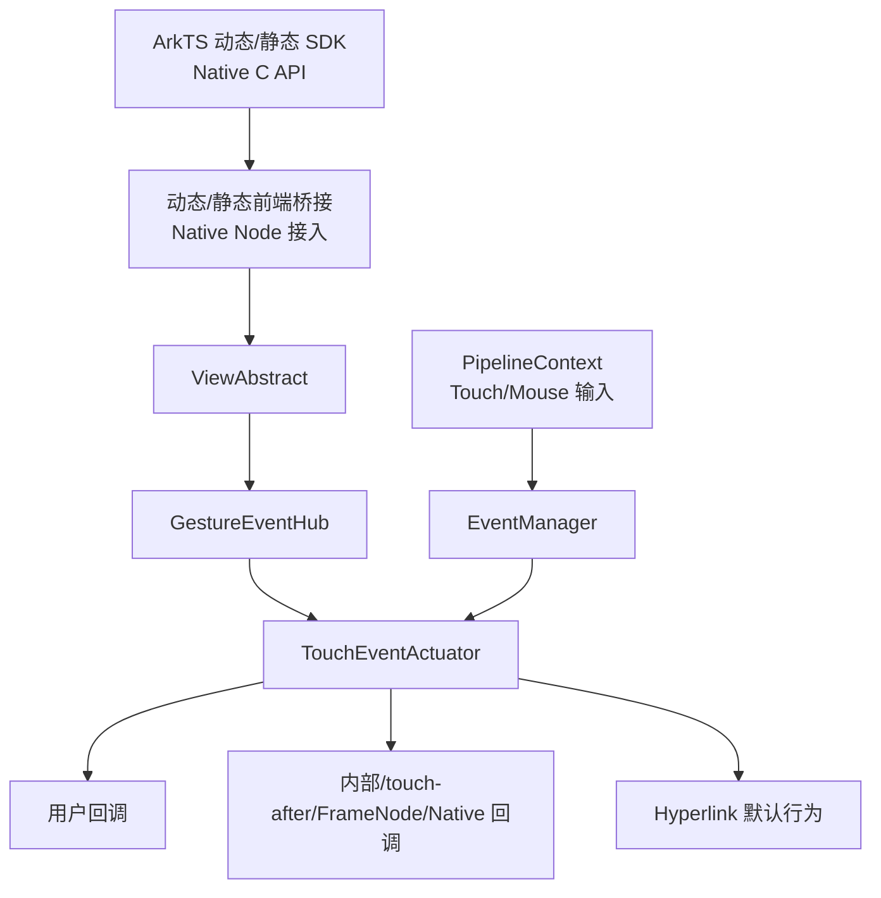
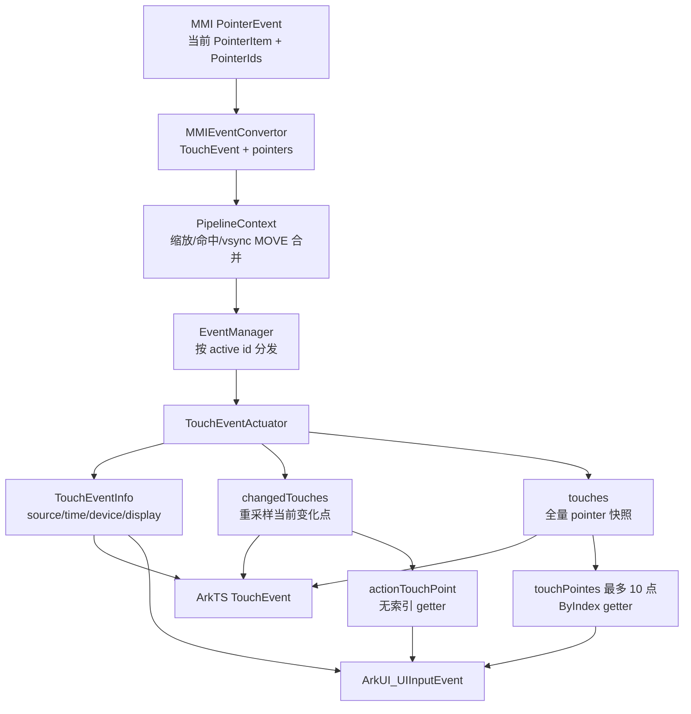
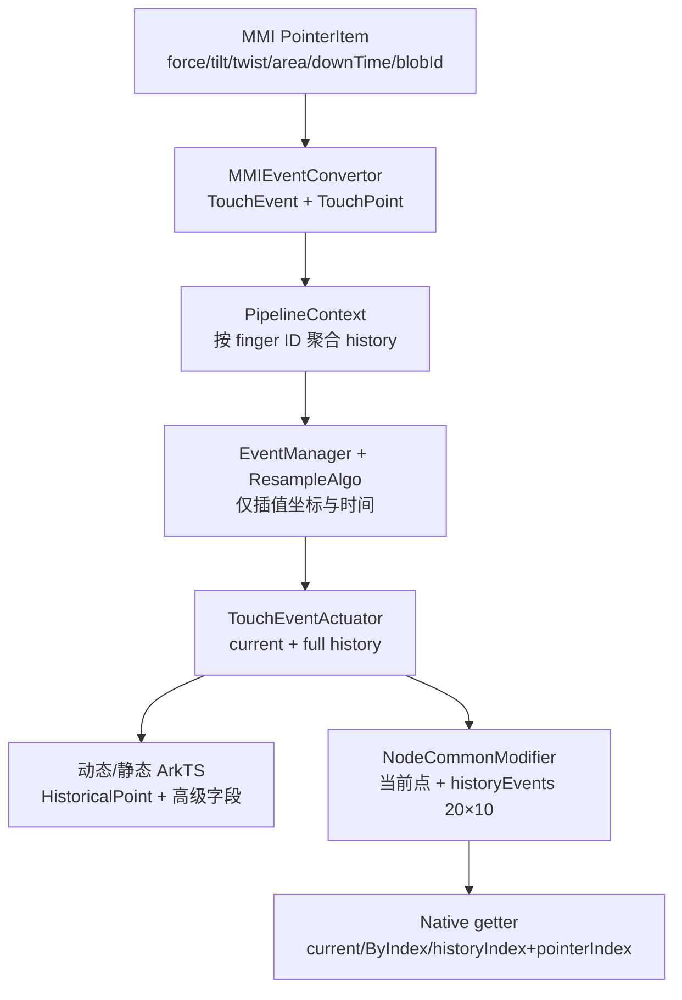
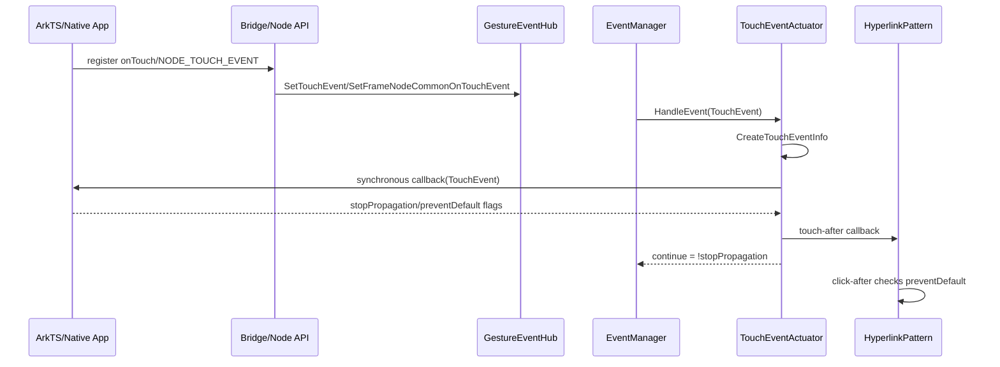
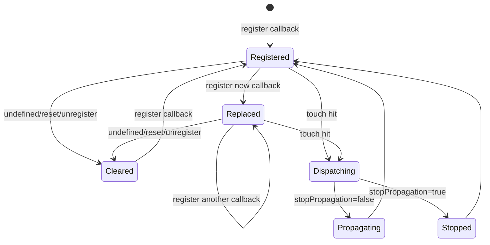
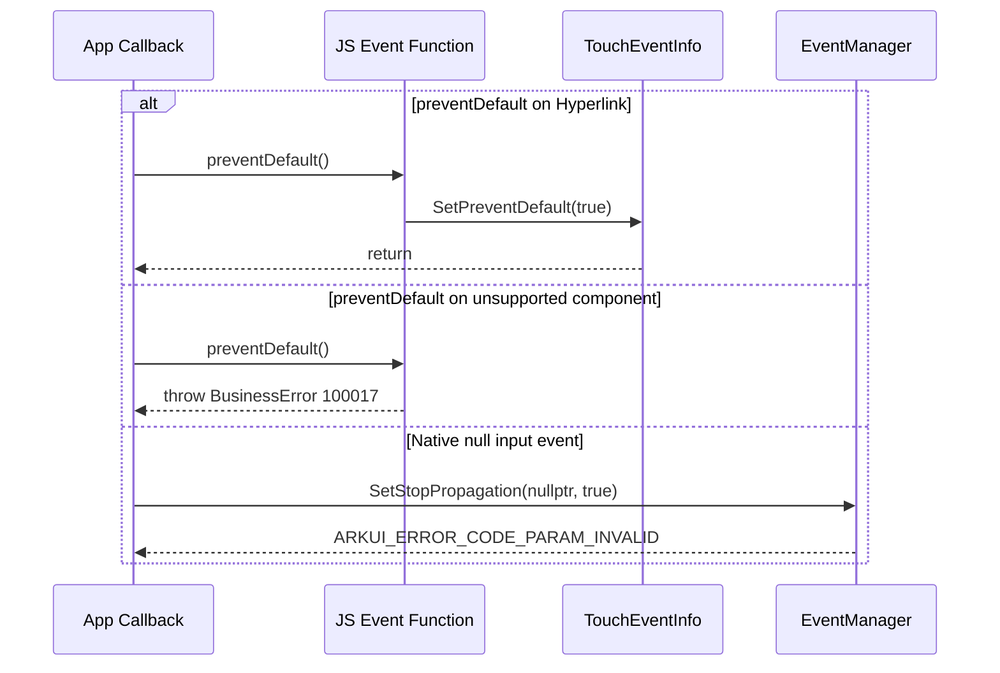

# 架构设计

> 确认触摸事件功能域的架构约束、关键设计决策、Spec 拆分方向。本设计是 Func-04-04-01 的共享基线，后续 Feat 在既有章节中增量合入。

## 设计元数据

| 字段 | 内容 |
|------|------|
| Design ID | DESIGN-Func-04-04-01 |
| 关联需求 | 已有能力补录（无独立 requirement.md） |
| 关联 Epic | 无 |
| 目标 Feature | Feat-01 触摸回调与传播控制, Feat-02 触摸事件与多点数据模型, Feat-03 历史采样与高级触点信息 |
| 复杂度 | 复杂 |
| 目标版本 | 动态 ArkTS API 7~26；Native API 12~26；静态 ArkTS API 23~26 |
| Owner | ArkUI SIG |
| 状态 | Baselined（已有实现补录） |

## 需求基线

> 本功能域为已有实现补录，无独立 proposal.md。以下记录直接约束设计的现状基线。

| 项 | 补充说明（如需） |
|----|------------------|
| 实现即规格 | 仅固化当前源码可观察行为；不在本次文档任务中修改产品代码 |
| SDK 契约优先 | 对外 API 以 `interface/sdk-js/api/` 下动态/静态类型定义为准；源码超出契约的能力记录为风险 |
| 双通道覆盖 | 同一能力同时核验 ArkTS 与 Native C API；缺少等价接口时明确标注 |
| 版本边界 | 动态 API 7/11/12、Native API 12/21、静态 API 23 是 Feat-01 的主要兼容边界；（Feat-02）动态 API 7/8/9/10/12/15/20/22/26、Native API 12/15/20/21/26、静态 API 23/26 形成逐字段边界；（Feat-03）动态 API 9/10/15/17、Native API 12/15/17/20、静态 API 23 形成历史点和高级字段边界 |
| 范围隔离 | Feat-01 固化回调和传播；（Feat-02）固化 TouchType、基础元数据、多点 ID 和坐标系统；（Feat-03）固化历史采样与高级触点；BuilderNode/Native 自定义输入构造与分发由 Func-04-04-03-Feat-04 承接 |

## 上下文和现状

### 涉及仓和模块

| 仓库 | 补充架构说明 |
|------|--------------|
| `interface/sdk-js` | 定义动态/静态 ArkTS 的 `onTouch`、`TouchEvent`、`UICommonEvent.setOnTouch` 公共契约；（Feat-03）定义历史高级字段 |
| `foundation/arkui/ace_engine/frameworks/bridge/declarative_frontend` | 解析动态 ArkTS/Modifier 调用，创建 JS 事件对象并同步回写传播与默认行为标志 |
| `foundation/arkui/ace_engine/frameworks/bridge/arkts_frontend` | 静态 ArkTS 前端经生成接口和 `common_method_modifier.cpp` 接入 NG 事件层 |
| `foundation/arkui/ace_engine/frameworks/core/components_ng` | `ViewAbstract`、`GestureEventHub` 和 `TouchEventActuator` 保存回调并执行节点内回调序列；（Feat-03）从 history/current sample 构造高级 `TouchLocationInfo` |
| `foundation/arkui/ace_engine/frameworks/core/common` | `EventManager` 按命中结果分发触摸事件并根据返回值停止后续节点触摸回调；（Feat-03）协调重采样 |
| `foundation/arkui/ace_engine/adapter/ohos` | 接收平台输入并提供兼容转换；通用鼠标转触摸主路径在 `PipelineContext` 中完成；（Feat-03）从 MMI 复制压力、倾角、旋转角、面积、按压时间、工具和操作手 |
| `foundation/arkui/ace_engine/interfaces/native` | 定义 Native Node 触摸注册和输入事件 C API；（Feat-03）定义高级 getter |
| `foundation/arkui/ace_engine/frameworks/core/event` | （Feat-02）定义 `TouchEvent`/`TouchPoint` 原始多点快照、ID 转换、历史批次和缩放入口；（Feat-03）定义历史高级字段及坐标/时间重采样算法 |
| `foundation/arkui/ace_engine/interfaces/inner_api/ace_kit` | （Feat-02）定义 `TouchLocationInfo` 的事件时局部坐标和实时局部坐标回退模型 |
| `foundation/arkui/ace_engine/frameworks/core/pipeline_ng` | （Feat-03）按 finger ID 聚合帧内 MOVE history，并在 wearable 构建过滤相邻同坐标样本 |

### 调用链层级分析

| 层 | 模块 | 职责 | 修改类型 |
|----|------|------|----------|
| 1. SDK 契约层 | `common.d.ts`、`enums*`、`native_node.h`、`ui_input_event.h` | 声明 ArkTS/C API 签名、字段、枚举、版本、错误码和 SysCap | 已有实现补录；（Feat-02）多点坐标；（Feat-03）历史高级字段 |
| 2. 动态前端层 | `JSInteractableView`、`JsTouchFunction` | 转换 TouchEventInfo 并执行动态触摸回调 | 已有实现补录 |
| 3. 静态前端层 | `SetOnTouchImpl`、静态 extractor/proxy | 映射静态 TouchEvent 和事件方法 | 已有实现补录 |
| 4. Native 接入层 | `node_utils.cpp`、`node_common_modifier.cpp`、`ui_input_event.cpp` | 注册和访问触摸事件及其公开字段 | 已有实现补录 |
| 5. 统一 API 层 | `ViewAbstract` | 将动态、静态和 Native 调用统一路由到节点 `GestureEventHub` | 已有实现补录 |
| 6. 事件 Hub 层 | `GestureEventHub` | 区分用户、内部、FrameNode 和 Native 公共触摸回调槽 | 已有实现补录 |
| 7. 执行器层 | `TouchEventActuator` | 组装 `TouchEventInfo`、`changedTouches` 和 `touches`，执行当前节点回调序列、计算继续传播结果 | 已有实现补录；（Feat-02）增加重采样当前点、全量 pointer 快照和坐标转换；（Feat-03）增加历史高级字段复制和非插值当前点重复规则 |
| 8. 分发/重采样层 | `EventManager`、`ResampleAlgo` | 遍历 TouchTestResult 并协调重采样 | 已有实现补录 |
| 9. 平台输入转换层 | `MMIEventConvertor` | （Feat-02）读取当前 PointerItem 和全部 PointerIds，形成 TouchEvent 当前点与 pointers 快照；（Feat-03）转换 force/tilt/twist/area/downTime/tool/hand | 已有实现补录，无代码修改 |
| 10. 输入管线层 | `PipelineContext`、`MouseEvent` | 将触摸和符合条件的鼠标左键事件送入统一触摸分发管线；MOVE 可按 vsync 合并 | 已有实现补录；（Feat-02）增加 history.back 当前点选择；（Feat-03）增加按 ID 聚合和 wearable 重复坐标过滤 |
| 11. 组件默认行为层 | `HyperlinkPattern` | 消费 prevent-default 标志，决定是否执行链接跳转 | 已有实现补录 |

调用链检查结果：从 SDK 到平台输入、事件分发和组件默认行为均已覆盖；本功能不经过 LayoutProperty、PaintProperty 或渲染属性管线。

### 适用架构规则

| Rule ID | 适用原因 | 设计结论 | 验证方式 |
|---------|----------|----------|----------|
| OH-ARCH-LAYERING | 涉及 SDK、前端桥接、统一 API、事件 Hub、执行器和分发器 | 调用保持 SDK/Bridge → ViewAbstract → GestureEventHub → TouchEventActuator → EventManager 单向依赖 | 架构评审/调用链检查 |
| OH-ARCH-SUBSYSTEM | Native 和 ArkTS 共享 NG 事件基础设施 | Native 接入仅通过 ViewAbstract/NodeModifier 进入 core，不在接口层复制事件算法 | 代码评审 |
| OH-ARCH-IPC-SAF | Feat-01 不跨进程或系统服务 | N/A，无 IPC/SAF 依赖 | 源码审查 |
| OH-ARCH-API-LEVEL | 涉及动态 API 7~26、Native API 12~26、静态 API 23~26 的逐字段差异 | SDK `@since`/`@deprecated`、Native since 和 target API 守护必须同时记录 | API 评审/XTS |
| OH-ARCH-COMPONENT-BUILD | 本次为文档补录 | 不修改 BUILD.gn、bundle.json 或部件依赖 | 构建文件 diff |
| OH-ARCH-ERROR-LOG | 涉及 BusinessError 100017 和 Native 状态码 | 保持既有错误码；非法参数不得被静默解释为成功 | 单测/hilog |

## 不涉及项承接

| 维度 | 设计结论 |
|------|----------|
| 公共 API 新增或语义修改 | 不涉及；本文只补录已发布能力 |
| 数据持久化与迁移 | 不涉及；回调和事件对象均为运行时临时状态 |
| IPC/SA/权限申请 | 不涉及；触摸回调在 UI 进程内执行，无新增权限 |
| Layout/Render 属性 | 不涉及；触摸回调不写入 LayoutProperty、PaintProperty 或 RenderContext |
| 触摸拦截与 HitTestMode | 不涉及；由 Func-04-04-03 和 Func-04-04-06 已有规格承接 |
| 自定义输入构造与分发 | 不涉及；由 Func-04-04-03-Feat-04 承接 BuilderNode/Native 节点子树投递 |
| 生成文件修改 | 不涉及；静态生成接口仅作为实现证据读取 |

## 关键设计决策

| 决策 ID | 问题 | 推荐方案 | 探索过的替代方案 | 取舍理由 | 影响 |
|---------|------|----------|--------------------|----------|------|
| ADR-1 | 动态 `onTouch(undefined)` 如何兼容历史版本 | 保持 target API ≥ 11 注销、API < 11 忽略的现状 | 所有版本统一注销；所有版本统一拒绝 undefined | 现有 `IsDisableEventVersion()` 明确以 API 11 为边界，统一行为会破坏历史应用 | AC-1.3、AC-1.4 |
| ADR-2 | 重复注册和注销是否影响所有触摸监听 | `onTouch` 仅替换/清除 `userCallback_`，其他通道保持独立 | 所有回调追加到同一列表；注销时清空执行器 | 独立回调槽避免应用 API 破坏组件内部行为和 Native 通道 | AC-1.2、AC-1.6、AC-5.5 |
| ADR-3 | stop-propagation 何时生效 | 当前节点全部回调执行完成后，以 `HandleEvent()` 返回值阻止后续节点 | 用户调用后立即中断当前节点；仅标记但不影响 EventManager | 当前实现允许内部、用户、after 和 Native 通道完成一致的节点内收尾 | AC-2.2~AC-2.4 |
| ADR-4 | JS 传播/default 标志如何回传到 C++ | 同步调用 JS，回调返回后立即从临时 `TouchEventInfo` 回写 | 异步 Promise 回传；直接暴露原始 C++ 对象长期持有 | 同步回写与事件分发栈一致，避免悬空对象和异步竞态 | AC-4.4 |
| ADR-5 | prevent-default 支持哪些组件 | 触摸事件仅允许 Hyperlink，其他组件抛出 100017 | 所有组件无条件支持；不支持组件静默忽略 | 只有 Hyperlink 定义了可取消的默认跳转行为，显式异常可避免误用 | AC-4.1~AC-4.3 |
| ADR-6 | 鼠标是否复用触摸管线 | 左键 PRESS/MOVE/RELEASE 和 CANCEL 转换为 TouchEvent，同时保留 MOUSE 来源 | 仅触发 onMouse；转换后伪装成 TOUCH 来源 | 复用交互逻辑且保留输入来源，满足桌面生态兼容与来源判断 | AC-3.1~AC-3.4 |
| ADR-7 | Native 两代注册入口如何共存 | API 12 模块表接口和 API 21 直接公共事件接口均保留并映射到独立 Native 回调槽 | 仅保留新接口；将 Native 回调并入 ArkTS 用户槽 | 保持 ABI/API 兼容，并避免 Native 注销影响 ArkTS 用户回调 | AC-5.1~AC-5.5 |
| ADR-F2-1 | changedTouches 与 touches 是否应强制同源同坐标 | 保持 SDK 定义：changedTouches 使用屏幕刷新率重采样点，touches 使用设备上报点 | 将 changedTouches 作为 touches 的筛选子集；回调前统一覆盖两者坐标 | SDK 明确允许两者不同，统一会丢失重采样语义 | Feat-02 AC-2.1~AC-2.3 |
| ADR-F2-2 | touches 是否由 Actuator 重新过滤活动触点 | 直接采用上游 `lastPoint.pointers` 快照，不按 isPressed 二次过滤 | 在 Actuator 删除 UP/CANCEL 点；仅保留当前变化点 | 当前输入层已决定快照成员，二次推断会改变现有 UP/CANCEL 行为 | Feat-02 AC-2.2~AC-2.4 |
| ADR-F2-3 | 多点列表中非当前触点使用什么 type | originalId 匹配的当前点使用事件 type，其他点统一使用 Move | 所有点使用事件 type；保留每点上游原 type | 当前实现以 Move 表示其他仍参与快照的点，避免误报多个 Down/Up | Feat-02 AC-2.3 |
| ADR-F2-4 | 废弃 screenX/screenY 如何与现代坐标共存 | 动态通道继续映射到窗口 globalLocation，API 10+ 推荐 windowX/windowY；静态通道不暴露 screen 字段 | 将 screen 改映射为 display；静态补回 screen 字段 | SDK 注释把 screen 历史字段定义为窗口坐标，修改会破坏兼容 | Feat-02 AC-3.2~AC-3.4 |
| ADR-F2-5 | 事件时局部坐标与实时局部坐标如何区分 | x/y 保留事件生成快照，API 26 current-local 按节点当前变换重算并在节点失效时回退 | 每次读取 x/y 都实时重算；current-local 直接返回快照 | 双模型同时满足事件复现和节点变换后的实时定位 | Feat-02 AC-3.5, AC-3.6 |
| ADR-F2-6 | Native 当前点和 ByIndex 是否统一为同一数组入口 | 无索引 getter 使用 actionTouchPoint，ByIndex 使用 touchPointes[]，转换层最多保留 10 点 | 无索引 getter 固定使用 ByIndex(0)；Native 动态分配不限点数 | 当前变化点可能不在数组 0，固定数组上限是已发布 ABI 数据结构约束 | Feat-02 AC-4.2~AC-4.5 |
| ADR-F2-7 | Native 数值 getter 如何表达错误 | 保持 0/0.0f 默认值，API 20+ 用 latest status 消除歧义，并显式记录 PointerCount 特例 | 改为状态码+输出参数；用 NaN 表示失败 | 修改签名或返回约定会破坏 ABI，规格只能固化现有错误模型 | Feat-02 AC-4.6, AC-4.7 |
| ADR-F2-8 | 动态/静态 SourceTool 数值声明冲突如何处理 | 两套 canonical SDK 分别按自身声明记录，并在风险中禁止跨通道整数比较 | 选一套数值静默统一文档；以内部 C++ 枚举覆盖 SDK | 外部契约存在可观察差异，不能在规格补录中虚构一致性 | Feat-02 AC-1.6 |
| ADR-F3-1 | 非插值历史是否排除当前点 | 保持完整 history 对外可见，允许末项与 changed point 的 `history.back()` 重复 | 删除历史末项；额外复制一个“当前点” | 当前执行器同时以 `history.back()` 构造当前点并遍历完整 history，删除会改变现有轨迹数据 | Feat-03 AC-1.4 |
| ADR-F3-2 | 重采样是否插值 pressure、tilt、area 等高级字段 | 仅插值坐标和时间，高级字段继承最接近目标时刻的原始样本 | 对全部数值字段线性插值；统一取前一个样本 | 现有算法只更新坐标/时间，避免为离散工具状态和硬件量生成虚构值 | Feat-03 AC-3.1~AC-3.2 |
| ADR-F3-3 | 三类 pressure 字段和 bridge 换算差异如何表达 | 外部范围以各自 SDK 契约为准，density 换算差异作为入口风险显式记录 | 用一个统一范围解释全部 pressure；以源码换算覆盖 SDK | BaseEvent 与 TouchObject/HistoricalPoint 契约范围不同，且 live/history 源码入口可观察不一致 | Feat-03 AC-2.3~AC-2.5、AC-3.3~AC-3.5 |
| ADR-F3-4 | `HistoricalPoint.size` 缺少赋值时是否补算 | 保持常规 onTouch 历史输出默认 0，不从 width/height 推导 | 使用 `max(width,height)/2` 回填；使用 width×height | 当前历史构造未调用 `SetSize`，文档补录不得改变或美化现有输出 | Feat-03 AC-2.6、AC-3.6 |
| ADR-F3-5 | dynamic/static `rollAngle` 描述冲突如何统一 | 分别保留“与设备表面夹角”和“绕 Z 轴旋转角”的 canonical 文本 | 静默选取其中一个；以内部 twist 含义覆盖 SDK | 外部契约文字存在差异，规格必须让跨通道使用方可见 | Feat-03 AC-2.8 |
| ADR-F3-6 | Native 当前高级 getter 是否按 pointerIndex 统一取点 | 固化每个 getter 的现有数据源：部分普通 ON_TOUCH getter 取最后一点，hand/pressedTime/roll 按各自路径取值 | 全部改为 ByIndex；全部改为 action point | 已发布实现的数据源不同，统一会构成语义和 ABI 兼容变更 | Feat-03 AC-4.1~AC-4.3 |
| ADR-F3-7 | Native 历史多点如何保持 ABI 容量和公开字段范围 | 保持 20×10 固定容量、共享 historyLocation 坐标、面积 width/height 均取 size，且不新增 roll/pressedTime/tool/hand 历史 getter | 动态扩容并保留每点坐标；扩展 C 结构和新 getter | 当前固定结构和导出面是已发布 ABI，规格仅固化边界和风险 | Feat-03 AC-5.1~AC-5.8 |

## 设计骨架

### 骨架范围

| 骨架项 | 目标 | 不包含 | 验证方式 |
|--------|------|--------|----------|
| 回调注册骨架 | 固化动态/静态/Modifier/Native 注册、替换和注销 | TouchObject 详细字段 | Host/C API 单测 |
| 传播控制骨架 | 固化节点内回调顺序和节点间停止规则 | HitTestMode/触摸拦截 | NG 事件单测 |
| 默认行为骨架 | 固化 Hyperlink prevent-default 支持范围 | 其他组件自定义默认动作 | Hyperlink 单测 |
| 多输入骨架 | 固化鼠标左键转触摸和来源保留 | 轴事件、手写笔专有能力 | Pipeline 单测 |
| 多点数据骨架 | （Feat-02）固化 changedTouches/touches、ID、重采样和非当前点类型 | 历史点详细字段、事件注入 | NG 多点单测 |
| 坐标系统骨架 | （Feat-02）固化 local/window/display/globalDisplay、废弃 screen 和 current-local | 布局属性与渲染坐标 | ArkTS/Native 集成测试 |
| Native 访问骨架 | （Feat-02）固化当前点、ByIndex、10 点上限、VP/PX 和 latest status | Native ABI 修改 | C API 单测 |
| 历史采样骨架 | （Feat-03）固化帧内聚合、当前点重复、wearable 过滤和坐标/时间重采样 | 跨帧持久轨迹缓存 | Pipeline/重采样单测 |
| 高级触点骨架 | （Feat-03）固化 pressure/tilt/roll/area/pressedTime/hand 的 SDK 与桥接规则 | 修改硬件上报或统一动态/静态契约 | ArkTS 双通道集成测试 |
| Native 历史骨架 | （Feat-03）固化当前/ByIndex/历史 getter、20×10 容量和二维索引 | Native ABI 扩容或新增历史字段 | C API 单测 |

### 骨架 Spec 拆分

| Task ID | 目标 | 受影响文件 | AC |
|---------|------|------------|----|
| TASK-SKELETON-1 | Feat-01 触摸回调与传播控制 | `Feat-01-touch-callback-propagation-spec.md` | AC-1.1~AC-5.5 |
| TASK-SKELETON-2 | Feat-02 触摸事件与多点数据模型 | `Feat-02-touch-event-multipoint-data-model-spec.md` | AC-1.1~AC-4.8 |
| TASK-SKELETON-3 | Feat-03 历史采样与高级触点信息 | `Feat-03-history-sampling-advanced-touch-info-spec.md` | AC-1.1~AC-5.8 |

## 后续 Task 拆分

| Task ID | 目标 | 受影响文件 | 依赖 |
|---------|------|------------|------|
| TASK-TOUCH-01 | 基线化触摸回调与传播控制 Spec | `Feat-01-touch-callback-propagation-spec.md`、`design.md` | 已有源码和 SDK 契约 |
| TASK-TOUCH-02 | 补录 TouchEvent/TouchObject 多点和坐标数据模型 | `Feat-02-touch-event-multipoint-data-model-spec.md`、`design.md` 增量章节 | TASK-TOUCH-01 设计基线 |
| TASK-TOUCH-03 | 补录历史采样、压力、倾角、旋转角、接触面积、按压时间和操作手信息 | `Feat-03-history-sampling-advanced-touch-info-spec.md`、`design.md` 增量章节 | TASK-TOUCH-02 数据模型 |

## API 签名、Kit 与权限

### 新增 API

> 本设计没有新增 API；下表记录 Feat-01~Feat-03 纳入基线的既有签名。

| API 签名 | 类型 | Kit | d.ts 位置 | 权限要求 | SysCap |
|----------|------|-----|------------|----------|--------|
| `onTouch(event: (event: TouchEvent) => void): T` | Public | ArkUI | `@internal/component/ets/common.d.ts:21109` | 无 | `SystemCapability.ArkUI.ArkUI.Full` |
| `onTouch(event: ((event: TouchEvent) => void) \| undefined): this` | Public | ArkUI | `arkui/component/common.static.d.ets:12123` | 无 | `SystemCapability.ArkUI.ArkUI.Full` |
| `UICommonEvent.setOnTouch(callback: Callback<TouchEvent> \| undefined): void` | Public | ArkUI | 动态 `common.d.ts:30250`；静态 `common.static.d.ets:16412` | 无 | `SystemCapability.ArkUI.ArkUI.Full` |
| `TouchEvent.stopPropagation(): void` | Public | ArkUI | 动态 `common.d.ts:11035`；静态 `common.static.d.ets:5580` | 无 | `SystemCapability.ArkUI.ArkUI.Full` |
| `TouchEvent.preventDefault(): void` | Public | ArkUI | 动态 `common.d.ts:11070`；静态 `common.static.d.ets:5599` | 无 | `SystemCapability.ArkUI.ArkUI.Full` |
| `ArkUI_NativeNodeAPI_1::registerNodeEvent(...)` | Public | ArkUI_NativeNode | `interfaces/native/native_node.h:12846` | 无；主线程 | NDK ArkUI |
| `OH_ArkUI_NativeModule_RegisterCommonEvent(...)` | Public | ArkUI_NativeNode | `interfaces/native/native_node.h:14079` | 无；主线程 | NDK ArkUI |
| `OH_ArkUI_PointerEvent_SetStopPropagation(...)` | Public | ArkUI_NativeNode | `interfaces/native/ui_input_event.h:1155` | 无 | NDK ArkUI |
| `TouchType`、`TouchEvent.type/touches/changedTouches` | Public | ArkUI | 动态 `enums.d.ts:620`、`common.d.ts:10983`；静态 `enums.static.d.ets:467`、`common.static.d.ets:5536` | 无 | `SystemCapability.ArkUI.ArkUI.Full` |
| `TouchObject.id/x/y/windowX/windowY/displayX/displayY` | Public | ArkUI | 动态 `common.d.ts:10668-10838`；静态 `common.static.d.ets:5333-5413` | 无 | `SystemCapability.ArkUI.ArkUI.Full` |
| `TouchObject.globalDisplayX/globalDisplayY/getCurrentLocalPosition()` | Public | ArkUI | 动态 `common.d.ts:10698-10728,10903-10914`；静态 `common.static.d.ets:5460-5488` | 无 | `SystemCapability.ArkUI.ArkUI.Full` |
| `BaseEvent.source/sourceTool/deviceId/targetDisplayId/timestamp` | Public | ArkUI | 动态 `common.d.ts:9252-9481`；静态 `common.static.d.ets:4520-4644` | 无 | `SystemCapability.ArkUI.ArkUI.Full` |
| `OH_ArkUI_PointerEvent_GetPointerCount/GetPointerId` 及坐标 getter | Public | ArkUI_NativeNode | `interfaces/native/ui_input_event.h:482-739` | 无 | NDK ArkUI |
| `OH_ArkUI_PointerEvent_GetChangedPointerId(...)` | Public | ArkUI_NativeNode | `interfaces/native/ui_input_event.h:831-841` | 无 | NDK ArkUI |
| `OH_ArkUI_PointerEvent_GetCurrentLocalX/Y` 及 `ByIndex` | Public | ArkUI_NativeNode | `interfaces/native/ui_input_event.h:549-595` | 无 | NDK ArkUI |
| `OH_ArkUI_UIInputEvent_GetLatestStatus()` | Public | ArkUI_NativeNode | `interfaces/native/ui_input_event.h:2150-2165` | 无 | NDK ArkUI |
| `TouchEvent.getHistoricalPoints()` / `HistoricalPoint` | Public | ArkUI | 动态 `common.d.ts:10917-10980,11037-11053`；静态 `common.static.d.ets:5490-5534,5582-5590` | 无 | `SystemCapability.ArkUI.ArkUI.Full` |
| `BaseEvent.pressure/tiltX/tiltY/rollAngle` | Public | ArkUI | 动态 `common.d.ts:9361-9419`；静态 `common.static.d.ets:4573-4608` | 无 | `SystemCapability.ArkUI.ArkUI.Full` |
| `TouchObject.hand/pressedTime/pressure/width/height` | Public | ArkUI | 动态 `common.d.ts:10840-10901`；静态 `common.static.d.ets:5414-5477` | 无 | `SystemCapability.ArkUI.ArkUI.Full` |
| `OH_ArkUI_PointerEvent_GetPressure/GetTiltX/GetTiltY/GetTouchAreaWidth/GetTouchAreaHeight` | Public | ArkUI_NativeNode | `interfaces/native/ui_input_event.h:741-771,811-829,1003-1066` | 无 | NDK ArkUI |
| `OH_ArkUI_PointerEvent_GetRollAngle/GetInteractionHand/GetInteractionHandByIndex/GetPressedTimeByIndex` | Public | ArkUI_NativeNode | `interfaces/native/ui_input_event.h:773-809,1284-1292` | 无 | NDK ArkUI |
| `OH_ArkUI_PointerEvent_GetHistory*` 时间、触点、坐标、pressure、tilt、area getter | Public | ArkUI_NativeNode | `interfaces/native/ui_input_event.h:843-1001` | 无 | NDK ArkUI |

### 变更/废弃 API

| 原有 API | 变更类型 | 新 API | 迁移说明 |
|----------|----------|--------|----------|
| `TouchObject.screenX/screenY` | 废弃 | `TouchObject.windowX/windowY` | 动态 API 10 起迁移；静态 ArkTS 不提供 screen 字段 |

## 构建系统影响

### BUILD.gn 变更

```text
文件路径: N/A
变更说明: Feat-01~Feat-03 仅新增或增量更新 specs 文档和注册信息，不修改产品 BUILD.gn、deps、public_deps 或 data_deps。
```

### bundle.json 变更

不新增 component，不修改依赖关系，不变更 bundle.json。

## 可选设计扩展

### 架构图



#### 多点事件数据架构图（Feat-02）



#### 历史采样与高级触点架构图（Feat-03）



### 数据流/控制流

| 步骤 | 调用方 | 被调用方 | 数据/接口 | 说明 |
|------|--------|----------|-----------|------|
| 1 | ArkTS/Native 应用 | Bridge/Node API | callback、node、eventType | 校验参数并选择注册槽 |
| 2 | Bridge/Node API | ViewAbstract | `TouchEventFunc` | 统一进入 NG 节点 API |
| 3 | ViewAbstract | GestureEventHub | user/common callback | 创建或复用 TouchEventActuator |
| 4 | PipelineContext | EventManager | TouchEvent | 触摸输入或鼠标转换事件进入命中和分发 |
| 5 | EventManager | TouchEventActuator | TouchEvent | 按 TouchTestResult 调用当前节点执行器 |
| 6 | TouchEventActuator | 回调槽 | TouchEventInfo | 组装事件并按固定顺序同步调用 |
| 7 | JS/Native 回调 | TouchEventInfo | stop/default 标志 | 回调内设置控制标志 |
| 8 | TouchEventActuator | EventManager | bool continue | 回调序列结束后决定后续节点是否继续 |
| 9 | Hyperlink touch/click after | HyperlinkPattern | prevent-default 标志 | 决定是否执行 LinkToAddress |

#### 多点事件数据流（Feat-02）

| 步骤 | 调用方 | 被调用方 | 数据/接口 | 说明 |
|------|--------|----------|-----------|------|
| 1 | MMI | `MMIEventConvertor` | 当前 PointerItem、PointerIds | 当前点写入 TouchEvent，全部 pointer 写入 pointers 快照 |
| 2 | PipelineContext | TouchEvent | scaled point、history | MOVE 可按 vsync 合并；非插值批次以 history.back 为当前采样 |
| 3 | TouchEventActuator | TouchEventInfo | metadata、changed、touches | changed 添加变化点；touches 遍历 pointers |
| 4 | ArkTS bridge | TouchEventInfo | JS/静态 TouchEvent | 坐标按 density 转换，screen 历史字段复用 window 值 |
| 5 | NodeModifier | TouchEventInfo | C_TOUCH_EVENT | changed.front 形成 actionTouchPoint；touches 截断为最多 10 点 |
| 6 | Native getter | C_TOUCH_EVENT | 当前点或 ByIndex | 默认零值配合 latest status 表达错误 |

### 时序设计



### 数据模型设计

```cpp
// 事件执行器中的独立回调槽（摘自现有结构）
std::list<RefPtr<TouchEventImpl>> touchEvents_;       // 组件内部监听
RefPtr<TouchEventImpl> touchAfterEvents_;             // 默认行为前置状态收集
RefPtr<TouchEventImpl> userCallback_;                 // ArkTS onTouch
RefPtr<TouchEventImpl> onTouchEventCallback_;         // FrameNode 专用回调
RefPtr<TouchEventImpl> commonTouchEventCallback_;     // Native 公共事件
```

| 数据 | 创建方 | 存储/持有 | 生命周期 | 证据 |
|------|--------|-----------|----------|------|
| `TouchEventInfo` | TouchEventActuator | 栈上事件对象；JS 路径复制后绑定到 JS 对象 | 单次同步回调 | `touch_event.cpp:119-132`；`js_interactable_view.cpp:95-108` |
| 用户回调 | Bridge/ViewAbstract | `TouchEventActuator::userCallback_` RefPtr | 替换、undefined 注销或节点销毁 | `touch_event.h:46-68` |
| Native 公共回调 | NodeModifier/GestureEventHub | `commonTouchEventCallback_` RefPtr | Native 注销或节点销毁 | `touch_event.h:138-151` |
| 传播标志 | BaseEventInfo | `TouchEventInfo` 布尔状态 | 单次事件分发 | `js_types.cpp:24-31`；`touch_event.cpp:132-133` |
| 默认行为标志 | BaseEventInfo/HyperlinkPattern | 事件内标志 + Hyperlink 单次触摸序列状态 | click-after 后重置 | `hyperlink_pattern.cpp:227-237`、`:286-295` |

#### 触摸多点数据模型（Feat-02）

```cpp
TouchEvent {
    id/originalId/type/time/sourceType/sourceTool;
    x/y/screenX/screenY/globalDisplayX/globalDisplayY;
    std::vector<TouchPoint> pointers; // 输入层全量快照
    std::vector<TouchEvent> history;  // 批量 MOVE 历史
}

TouchEventInfo {
    BaseEventInfo metadata;
    std::list<TouchLocationInfo> changedTouches; // 常规路径添加当前变化点
    std::list<TouchLocationInfo> touches;        // 遍历 lastPoint.pointers
}

ArkUI_UIInputEvent(C_TOUCH_EVENT) {
    actionTouchPoint;                // changedTouches.front()
    touchPointes[10];                // touches 前 10 点
    changedPointerId;
    touchPointSize;
}
```

| 数据 | 形成规则 | 公开用途 | 证据 |
|------|----------|----------|------|
| `changedTouches` | 常规 Actuator 路径从 lastPoint 生成当前变化点；SDK 允许重采样并允许空数组 | ArkTS 本次变化点；Native actionTouchPoint | `common.d.ts:10983-11025`；`touch_event.cpp:113-126` |
| `touches` | 遍历 lastPoint.pointers，不按 isPressed 二次过滤 | ArkTS 全量触点；Native touchPointes | `mmi_event_convertor.cpp:209,235-249`；`touch_event.cpp:123-126` |
| `TouchObject.type` | 当前 originalId 匹配点使用事件 type，其他点为 Move | 区分当前变化点和其余多点 | `touch_event.cpp:248-266` |
| `TouchObject.id` | GetOriginalReCovertId 恢复对外 finger ID | 跨事件关联触点 | `core/event/touch_event.cpp:34-45,414-425` |
| 局部坐标 | local 快照 + current-local getter | 事件复现与当前节点定位 | `touch_event.cpp:194-210,249-260` |
| Native 状态 | getter 默认值 + 线程局部 latest status | 区分合法 0 和错误 | `ui_input_event_impl.h:88-99`；`ui_input_event.h:2150-2165` |

#### 历史采样与高级触点数据模型（Feat-03）

```cpp
TouchEvent {
    float force;
    double tiltX/tiltY/rollAngle;
    double size/width/height;
    TimeStamp pressedTime;
    InteractionHand hand;
    std::vector<TouchEvent> history;
}

HistoricalPoint {
    TouchLocationInfo touchObject;
    double size;       // 常规 onTouch history 未 SetSize 时为 0
    double force;
    TimeStamp timestamp;
}

ArkUI_UIInputEvent(C_TOUCH_EVENT) {
    ArkUITouchPoint actionTouchPoint;
    ArkUITouchPoint touchPointes[10];
    ArkUIHistoryTouchEvent historyEvents[20];
}
```

| 数据 | 形成规则 | 公开边界 | 证据 |
|------|----------|----------|------|
| 帧内 history | Pipeline 按 finger ID 聚合 MOVE；wearable 可过滤相邻相同 x/y | 非插值时完整 history 含当前 `history.back()` | `pipeline_context.cpp:183-191,4898-4955`；`touch_event.cpp:109-130` |
| `HistoricalPoint` | 历史 `TouchEvent` 转为 `TouchLocationInfo`，复制高级字段但不设置 size | dynamic 返回数组；static 可返回 undefined；size 常规为 0 | `touch_event.cpp:284-331`；`js_types.cpp:91-152` |
| 重采样结果 | x/y、screen/globalDisplay 和 time 插值，高级字段取最近原始样本 | 不跨不同 targetDisplayId；不为高级字段制造插值值 | `event_manager.cpp:2790-2901`；`resample_algo.cpp:144-226` |
| Native 当前高级字段 | pressure/tilt/area、hand/pressedTime、roll 按不同实现入口选取数据源 | 部分 pointerIndex 在普通 ON_TOUCH 被忽略 | `ui_input_event.cpp:2200-2445,3189-3207` |
| Native history | 仅 history/raw-history 等长且非空时构造，最多 20×10 | 公开 getter 不含 roll/pressedTime/tool/hand | `node_common_modifier.cpp:11287-11335`；`ui_input_event.cpp:2475-2942` |

### 算法与状态机



触摸节点回调伪代码：

```text
event = CreateTouchEventInfo(lastPoint)
for callback in internalCallbacks: callback(event)
if userCallback: userCallback(event)
if touchAfter: touchAfter(event)
if frameNodeCallback: frameNodeCallback(event)
if nativeCommonCallback: nativeCommonCallback(event)
return !event.stopPropagation
```

实现证据：`frameworks/core/components_ng/event/touch_event.cpp:334-359`。

#### 多点列表构造算法（Feat-02）

```text
lastPoint = point.isInterpolated ? point : (point.history.empty ? point : point.history.back)
eventInfo = CreateTouchEventInfo(lastPoint)
eventInfo.changedTouches += CreateChangedTouchInfo(lastPoint, point)
for pointer in lastPoint.pointers:
    item.type = pointer.originalId == point.originalId ? lastPoint.type : MOVE
    eventInfo.touches += CreateTouchItemInfo(pointer, point, item.type)

native.actionTouchPoint = changedTouches.front if changedTouches is not empty
native.touchPointes = first 10 items of touches
native.pointerCount = min(touches.size, 10)
```

实现证据：`frameworks/core/components_ng/event/touch_event.cpp:109-130,191-281`；`frameworks/core/interfaces/native/node/node_common_modifier.cpp:11267-11280,11370-11375`。

### 测试性设计

| 测试层级 | 测试目标 | Mock 策略 | 验证方式 |
|----------|----------|-----------|----------|
| Bridge Host 单测 | API 10/11 undefined 行为和回调同步回写 | 切换 target API，构造 JS callback | 验证 userCallback_ 是否清除 |
| NG 事件单测 | 回调顺序、替换、清除和 stop-propagation 返回值 | 直接构造 TouchEventActuator/TouchEvent | `touch_event_test_ng.cpp` |
| Pipeline 单测 | 鼠标左键动作映射和来源保留 | 构造 MouseEvent | 检查 TouchType、SourceType、SourceTool |
| 组件单测 | Hyperlink prevent-default | 构造 TouchEventInfo/GestureEvent | `hyperlink_test_ng.cpp` |
| C API 单测 | Native 注册/注销、空参数、错误码、传播标志 | 构造 ArkUI_UIInputEvent/Native Node | `native_node_test.cpp`、`oh_arkui_pointerevent_setstoppropagation_test.cpp` |
| XTS/集成 | 父子节点冒泡、静态/动态范式一致性 | 真机输入 | 验证回调次数和顺序 |
| NG 多点单测 | （Feat-02）changed/touches、非当前点 Move、history.back 和 ID 恢复 | 构造多 pointer TouchEvent 和 history | 检查列表长度、type、id、metadata |
| ArkTS 坐标集成 | （Feat-02）local/window/display/globalDisplay/screen/current-local | 设置 density、节点变换和多窗口 | 检查坐标映射、废弃字段和实时重算 |
| Native getter 单测 | （Feat-02）当前点、ByIndex、10 点上限、VP/PX、latest status | 构造 C_TOUCH_EVENT 和越界索引 | `ui_input_event_test.cpp:241-267,894-955` |
| Pipeline 历史/重采样单测 | （Feat-03）帧内聚合、当前点重复、wearable 过滤、插值拒绝和高级字段继承 | 构造多批 MOVE、时间窗、反弹和跨 display 样本 | 检查 history、interpolated point 与降级点 |
| ArkTS 高级字段集成 | （Feat-03）dynamic/static live/history pressure、roll 描述和 size 默认值 | 设置非 1 density 与完整高级 TouchEvent | 比较四种桥接入口及 SDK 类型/范围 |
| Native history getter 单测 | （Feat-03）当前高级 getter、20×10、二维索引、共享坐标和面积退化 | 构造 C_TOUCH_EVENT history 和空 raw 槽 | 检查数值、截断和 latest status |

### 异常传播时序图



| 异常场景 | 传播结果 | 恢复方式 | 关联 AC |
|----------|----------|----------|---------|
| 动态 API < 11 传 undefined | 原回调保持 | 显式注册新函数或升级 target API 后注销 | AC-1.4 |
| 非 Hyperlink 调用 preventDefault | 抛出 100017，默认行为标志不变 | 仅在 Hyperlink 使用该 API | AC-4.2 |
| Native 空节点/空回调 | 注册失败并返回参数错误 | 修正参数后重新注册 | AC-5.2、AC-5.4 |
| CANCEL 输入 | 进入触摸回调 | 组件按 CANCEL 恢复按压状态 | AC-3.2 |
| ArkTS touches/changedTouches 为空 | 返回空数组 | 调用方检查 length 后再索引 | Feat-02 AC-2.6 |
| Native ByIndex 越界 | getter 返回 0/0.0f 并记录 PARAM_INVALID | API 20+ 查询 latest status；修正索引后重试 | Feat-02 AC-4.6 |
| Native 输入超过 10 点 | 仅暴露前 10 点 | ArkTS 处理全量列表或 Native 业务接受上限 | Feat-02 AC-4.4 |
| current-local 节点失效 | 回退事件时 local 坐标 | 不持有已失效节点；按快照继续处理 | Feat-02 AC-3.5 |
| 静态历史事件指针不可用 | `getHistoricalPoints()` 返回 undefined | 调用方进行可选值检查 | Feat-03 AC-1.2 |
| 重采样条件不满足 | 放弃对应插值并使用原始/降级点 | 保留原始轨迹，不补造高级字段 | Feat-03 AC-3.2 |
| Native history/raw-history 数量不等 | historySize=0、historyEvents=null | 调用方检查 HistorySize 和 latest status | Feat-03 AC-5.1、AC-5.7 |

### 资源所有权矩阵

| 资源 | 创建方 | 持有方 | 销毁触发 | 实际释放 | 异常回收 |
|------|--------|--------|----------|----------|----------|
| 用户 `TouchEventImpl` | GestureEventHub/TouchEventActuator | `userCallback_` RefPtr | 替换、清除、节点销毁 | RefPtr 引用归零 | 重复注册先 Reset 旧引用 |
| JS `TouchEventInfo` 副本 | JSInteractableView/CommonBridge | JS 事件对象 NativePointer | JS 对象释放 | `ReleaseNativePtrFunc` | 回调未执行完成前保持有效 |
| Native 事件映射参数 | NodeModel/NodeUtils | Node ExtraData/common event map | 注销或节点销毁 | 事件映射清理逻辑 | 重复注册更新 targetId/userData |
| Hyperlink prevent-default 状态 | HyperlinkPattern | `isTouchPreventDefault_` | click-after 完成 | 显式重置 false | CANCEL/下一次点击沿既有事件序列清理 |

### 接口参数规约

| 接口 | 参数 | 类型 | 合法范围 | 非法处理 | 边界说明 |
|------|------|------|----------|----------|----------|
| 动态 `onTouch` | event | function/undefined | function；target API ≥ 11 时 undefined | 非函数被忽略 | API 10/11 分界 |
| 静态 `onTouch`/`setOnTouch` | callback | callback/undefined | callback 或 undefined | undefined 表示重置 | API 23 起 |
| `preventDefault` | this event | TouchEvent | Hyperlink 同步触摸回调 | 非 Hyperlink 抛 100017 | Modifier 不属于契约保证 |
| `registerNodeEvent` | node | ArkUI_NodeHandle | 有效 CNode | 401/106103 等 | API 12 模块表入口 |
| `RegisterCommonEvent` | node/callback/eventType | NodeHandle/function/enum | 非空且 eventType 支持 | 401 或 106110 | API 21 起、主线程 |
| `SetStopPropagation` | event/flag | UIInputEvent/bool | 支持场景事件和 true/false | 401 或类型不支持 | API 12 起 |
| `TouchEvent.touches/changedTouches` | list | TouchObject[] | 长度大于等于 0 | 空数组由调用方检查 | changed 与 touches 可使用不同采样频率 |
| `TouchObject.screenX/screenY` | property | number | 动态历史字段 | API 10+ 废弃 | 值与 windowX/windowY 同源；静态不提供 |
| Native 当前点 getter | event | UIInputEvent | 有效触摸事件 | 返回 0/0.0f，API 20+ 查状态 | 读取 actionTouchPoint，不等同 ByIndex(0) |
| Native `ByIndex` getter | pointerIndex | uint32_t | 0≤index<pointerCount≤10 | 越界返回 0/0.0f + PARAM_INVALID | 数组最多 10 点 |
| `GetChangedPointerId` | pointerIndex(output) | int32_t* | 非空输出指针 | 401 或类型不支持 | 输出 finger ID，不是数组 index |
| `GetCurrentLocalX/Y` | event/index | UIInputEvent/uint32_t | API 26+ 有效节点或可回退快照 | 无效参数返回 0/0.0f + 状态 | 与事件时 x/y 允许不同 |
| `getHistoricalPoints()` | this | TouchEvent | 当前同步 onTouch 事件上下文 | dynamic 返回数组；static 内部指针异常可返回 undefined | 非插值 history 末项可与当前点重复 |
| ArkTS pressure/force | property | number/double | 按 BaseEvent、TouchObject、HistoricalPoint 各自 SDK 范围 | 缺少硬件值时使用默认值/未提供 | 不跨字段假定统一量纲；源码入口可能有 density 偏差 |
| Native 当前高级 getter | event/index/output | UIInputEvent/uint32_t/pointer | 支持的触摸事件和有效索引/输出指针 | 默认 0/0.0f 或 401/类型不支持，API 20+ 查状态 | pressure/tilt/area 普通 ON_TOUCH 当前实现取最后一点 |
| Native history getter | historyIndex/pointerIndex | uint32_t | historyIndex<20、pointerIndex<10 且均小于实际计数 | 越界返回 0/0.0f + PARAM_INVALID | 公开字段不含历史 roll/pressedTime/tool/hand |

### 线程与并发模型

| 操作 | 发起线程 | 回调线程 | 跨进程边界 | 线程安全 | 重入约束 |
|------|----------|----------|------------|----------|----------|
| ArkTS `onTouch` 注册/注销 | UI 线程 | UI 线程 | 无 | 依赖 UI 线程串行模型 | 回调内重复注册允许，执行器调用前复制回调 RefPtr |
| ArkTS 触摸回调 | UI 线程事件分发 | UI 线程 | 无 | 同步执行 | 回调返回后才读取控制标志 |
| Native API 12 模块表注册 | 主线程 | UI 线程 | 无 | CNode 状态由 UI 线程管理 | 不得并发修改同一节点事件表 |
| Native API 21 直接注册 | 主线程（接口契约） | UI 线程 | 无 | 事件映射按 UI 线程串行访问 | 新注册覆盖同类映射 |

| 并发场景 | 现有处理 | 风险控制 |
|----------|----------|----------|
| 回调执行期间重新设置 `onTouch` | `TriggerCallBacks` 调用前复制当前回调 RefPtr | 当前调用完成，新回调用于后续事件 |
| 回调返回后异步调用事件方法 | 当前事件标志已回写，异步结果不参与当前分发 | Spec 明确禁止依赖异步控制结果 |
| 非主线程调用 Native 直接注册 | 超出公开契约 | 调用方必须切换到主线程 |

## 详细设计

### 回调注册、替换与注销

动态入口 `JSInteractableView::JsOnTouch` 首先检查 undefined：target API ≥ 11 时调用 `DisableOnTouch()`；否则仅接受函数。有效函数被包装为 `TouchEventFunc` 并交给 `ViewAbstractModel::SetOnTouch()`。证据：`frameworks/bridge/declarative_frontend/jsview/js_interactable_view.cpp:75-110`、`frameworks/bridge/declarative_frontend/jsview/js_utils.cpp:249-253`。

NG 路径由 `ViewAbstract::SetOnTouch()` 获取节点 `GestureEventHub`，再调用 `SetTouchEvent()`；后者使用 `TouchEventActuator::ReplaceTouchEvent()` 替换单一 `userCallback_`。注销仅调用 `ClearUserCallback()`。证据：`frameworks/core/components_ng/base/view_abstract.cpp:3199-3204`、`:10149-10154`，`frameworks/core/components_ng/event/gesture_event_hub.cpp:1266-1270`、`:1520-1526`，`frameworks/core/components_ng/event/touch_event.h:46-68`。

### 同步事件对象与标志回写

动态 JS 路径为回调创建 `TouchEventInfo` 副本并绑定到 JS 对象；函数同步返回后，将副本中的 stop-propagation 和 prevent-default 标志写回原事件。证据：`frameworks/bridge/declarative_frontend/jsview/js_interactable_view.cpp:95-108`、`frameworks/bridge/declarative_frontend/engine/jsi/nativeModule/arkts_native_common_bridge.cpp:9294-9311`。

因此控制方法的有效窗口是当前同步回调。回调完成后，`TouchEventActuator` 已根据事件标志计算继续传播结果，异步任务不能倒转该结果。

### 节点内回调顺序与节点间传播

`TouchEventActuator::TriggerCallBacks()` 固定依次调用 `touchEvents_`、`userCallback_`、`touchAfterEvents_`、`onTouchEventCallback_` 和 `commonTouchEventCallback_`。全部调用结束后，`TriggerTouchCallBack()` 返回 `!event.IsStopPropagation()`。证据：`frameworks/core/components_ng/event/touch_event.cpp:88-133`、`:334-359`。

`EventManager::DispatchTouchEventToTouchTestResult()` 保存首次停止结果；后续非手势触摸目标不再调用 `HandleMultiContainerEvent()`，但手势识别器仍按自身流程接收事件。证据：`frameworks/core/common/event_manager.cpp:1528-1555`。

### Hyperlink 默认行为控制

`JsTouchPreventDefault()` 通过组件 Pattern 名称允许列表限制调用者；列表仅包含 `Hyperlink`，不匹配时抛出 100017。证据：`frameworks/bridge/declarative_frontend/engine/js_types.cpp:20-22`、`:74-88`，错误码定义位于 `frameworks/base/error/error_code.h:56`。

Hyperlink 的 touch-after 回调保存 prevent-default 状态；后续 click-after 仅在触摸和点击均未阻止默认行为时调用 `LinkToAddress()`，随后重置状态。证据：`frameworks/core/components_ng/pattern/hyperlink/hyperlink_pattern.cpp:222-237`、`:281-295`。

### 鼠标左键转换

`PipelineContext::DispatchMouseToTouchEvent()` 对左键 PRESS/RELEASE/MOVE（MOVE 时左键保持按下）和 CANCEL 调用 `MouseEvent::CreateTouchPoint()`，再送入 `OnTouchEvent()`。证据：`frameworks/core/pipeline_ng/pipeline_context.cpp:5175-5186`。

`MouseEvent::CreateTouchPoint()` 将动作映射为 DOWN/UP/MOVE/CANCEL，并复制坐标、时间、deviceId、sourceType、sourceTool 和原始 pointerEvent。来源保持 `SourceType::MOUSE`。证据：`frameworks/core/event/mouse_event.cpp:440-490`。

### Native Node 注册与传播控制

API 12 的 `ArkUI_NativeNodeAPI_1::registerNodeEvent` 仅接受有效 CNode，保存 targetId/userData 并调用组件事件转换入口；非法节点和受限 BuilderNode 返回既有错误码。证据：`interfaces/native/native_node.h:12679-12687`、`:12828-12855`，`interfaces/native/node/node_model.cpp:535-563`。

API 21 的 `OH_ArkUI_NativeModule_RegisterCommonEvent` 校验 node、callback 和 eventType，建立公共事件映射并通过 NodeModifier 安装 `commonTouchEventCallback_`；注销走独立公共回调清理，不清除 `userCallback_`。证据：`interfaces/native/node/node_utils.cpp:835-905`，`frameworks/core/interfaces/native/node/node_common_modifier.cpp:10491-10624`。

Native 回调调用 `OH_ArkUI_PointerEvent_SetStopPropagation()` 后，C_TOUCH_EVENT 的 `stopPropagation` 字段被写回 `TouchEventInfo`。证据：`interfaces/native/event/ui_input_event.cpp:3119-3129`、`frameworks/core/interfaces/native/node/node_common_modifier.cpp:10610-10616`。

### 平台触点快照与批量 MOVE（Feat-02）

`ConvertTouchEvent()` 从当前 PointerItem 写入事件时间、deviceId、targetDisplayId、source、type 和当前坐标；`UpdateTouchEvent()` 再遍历 `GetPointerIds()`，把每个 PointerItem 转换为 `TouchPoint` 并写入 `TouchEvent::pointers`。`isPressed` 被记录在 TouchPoint，但后续 Actuator 构造 touches 时不使用该字段过滤，因此 UP/CANCEL 是否仍包含释放点由输入层快照决定。证据：`adapter/ohos/entrance/mmi_event_convertor.cpp:182-251,444-470`；`frameworks/core/components_ng/event/touch_event.cpp:123-126`。

Pipeline 对 MOVE 可缓存到 vsync；非插值事件存在 history 时，`TouchEventActuator` 使用 `history.back()` 形成顶层 metadata、changedTouches 和 touches，同时继续保存原 `point.history` 供历史点接口使用。证据：`frameworks/core/pipeline_ng/pipeline_context.cpp:4026-4072,4798-4825`；`frameworks/core/components_ng/event/touch_event.cpp:113-130`。

### changedTouches、touches 与触点类型（Feat-02）

动态 SDK 明确规定：非注入场景的 changedTouches 按屏幕刷新率重采样，touches 按设备刷新率上报，因此两者坐标允许不同，并且两数组都要求调用方先检查是否为空。证据：`interface/sdk-js/api/@internal/component/ets/common.d.ts:10983-11025`。

常规 Actuator 路径为 changedTouches 添加一个由 lastPoint 生成的当前变化点，再遍历 lastPoint.pointers 形成 touches。当前 pointer 的 originalId 与事件 originalId 相同时使用本次事件 type；其他 pointer 无条件标记为 Move。对外 `TouchObject.id` 使用 `GetOriginalReCovertId()`，Pen/Mouse 的内部偏移 ID 可按 `TouchPadIdChanged` 开关恢复。证据：`frameworks/core/components_ng/event/touch_event.cpp:119-126,191-281`；`frameworks/core/event/touch_event.cpp:34-45,414-425`。

### ArkTS 坐标映射与版本演进（Feat-02）

`TouchLocationInfo` 内部 globalLocation 映射 ArkTS `windowX/windowY`，screenLocation 映射 `displayX/displayY`，globalDisplayLocation 映射 `globalDisplayX/globalDisplayY`，localLocation 映射 `x/y`。动态历史字段 `screenX/screenY` 也从 globalLocation 取值，因此与 window 坐标同源；SDK 自 API 10 将其废弃并建议使用 window 字段，静态 TouchObject 不再声明 screen 字段。证据：`frameworks/bridge/declarative_frontend/engine/functions/js_touch_function.cpp:28-50`；`frameworks/bridge/declarative_frontend/engine/jsi/nativeModule/arkts_native_frame_node_bridge.cpp:235-259`；动态 `common.d.ts:10730-10838`；静态 `common.static.d.ets:5333-5413`。

`x/y` 保存事件生成时局部坐标；API 26 `getCurrentLocalPosition()` 捕获窗口全局点并按节点当前变换重新计算，节点失效时回退保存的 local 坐标。因此节点在回调期间发生变换后，两组局部坐标允许不同。证据：`frameworks/core/components_ng/event/touch_event.cpp:194-210,249-260`；`interfaces/inner_api/ace_kit/include/ui/event/touch_event.h:216-226`；动态 `common.d.ts:10903-10914`、静态 `common.static.d.ets:5479-5488`。

### 基础元数据与双通道枚举兼容（Feat-02）

动态 TouchEvent/TouchObject 自 API 7 开放，但 BaseEvent 的 target/timestamp/source 自 API 8、sourceTool 自 API 9、deviceId 自 API 12、targetDisplayId 自 API 15；HOVER_ENTER/MOVE/EXIT/CANCEL 自 API 20 加入并固定为 9~12。静态接口从 API 23 提供对应强类型模型。证据：动态 `common.d.ts:9252-9481,10668-11025`、`enums.d.ts:620-714`；静态 `common.static.d.ets:4520-4644,5333-5572`、`enums.static.d.ets:467-547`。

canonical SDK 对 SourceTool 后三项存在数值偏差：动态声明在 Pen 后未显式赋值，按枚举递增为 MOUSE/TOUCHPAD/JOYSTICK=3/4/5；静态声明显式为 7/9/10。设计不静默统一该差异，跨通道逻辑必须使用各自符号枚举而非整数直传。证据：动态 `common.d.ts:7595-7666`；静态 `common.static.d.ets:3353-3409`。

### Native 当前点、ByIndex 与长度单位（Feat-02）

NodeModifier 从 `changedTouches.front()` 构造 `actionTouchPoint` 和 `changedPointerId`，同时从 `GetTouches()` 独立填充 `touchPointes[]`；转换循环和 `touchPointSize` 均限制为最多 10 点。无索引 getter 读取 actionTouchPoint，ByIndex getter 读取 touchPointes[index]，所以当前变化点不保证等于索引 0。证据：`frameworks/core/interfaces/native/node/node_common_modifier.cpp:11267-11280,11370-11375`；`interfaces/native/event/ui_input_event.cpp:818-825,889-929`。

`OH_ArkUI_PointerEvent_GetChangedPointerId` 的输出形参名为 pointerIndex，但实现写入 changedPointerId，即 finger ID 而非数组索引。证据：`interfaces/native/ui_input_event.h:831-841`；`interfaces/native/event/ui_input_event.cpp:2453-2467`；`test/unittest/interfaces/ui_input_event_test.cpp:241-267`。

Native 坐标遵循节点 lengthMetricUnit：默认 VP 时按 density 换算，PX 时保持像素值。API 26 current-local getter 使用窗口坐标和节点当前变换重算，节点 ID 失效时回退事件快照。证据：`interfaces/native/node/node_model.h:135-138`、`node_model.cpp:781-787`；`frameworks/core/interfaces/native/node/node_common_modifier.cpp:10300-10310,11240-11255`；`interfaces/native/event/ui_input_event.cpp:1071-1084,1255-1268`。

### Native 默认值与状态模型（Feat-02）

多数 Native 数值 getter 在 null、类型不支持或索引越界时返回 0/0.0f。API 20 起线程局部 latest status 在每次 getter 调用前清理，再记录 PARAM_INVALID 或 INPUT_EVENT_TYPE_NOT_SUPPORT，调用方可据此区分合法零值；`GetPointerCount()` 对未识别类型返回 0 且当前实现可能保持 NO_ERROR，是需要单列的特例。证据：`interfaces/native/event/ui_input_event_impl.h:25-26,88-99`；`interfaces/native/event/ui_input_event.cpp:719-763,889-929`；`interfaces/native/ui_input_event.h:2150-2165`。

### 帧内历史聚合与当前点选择（Feat-03）

`PipelineContext` 在 MOVE 批处理中按 finger ID 聚合样本，并通常只为该 ID 派发一次事件。wearable 构建会跳过与前一历史样本 x/y 完全相同的点；其他构建不执行该过滤。证据：`frameworks/core/pipeline_ng/pipeline_context.cpp:183-191,4898-4955`。

`TouchEventActuator` 对非插值事件且 history 非空时，以 `history.back()` 形成顶层事件和 changed point，同时把完整 history 转换为历史点，因此最后一个历史点允许与当前点重复。插值成功时 changed point 使用独立重采样结果，history 仍保留原始样本。证据：`frameworks/core/components_ng/event/touch_event.cpp:109-130`。

### 坐标重采样与高级字段继承（Feat-03）

重采样只对 x/y、screen/globalDisplay 坐标和时间执行插值或预测；pressure、size、width/height、tilt、roll、pressedTime 和 hand 从最接近目标时刻的原始样本继承。样本不足两个、相邻间隔不在 2~20 ms、轨迹反弹、预测跨度超过 `min(delta/2, 8 ms)` 或 targetDisplayId 不一致时，算法拒绝对应插值并回退既有原始/降级结果。证据：`frameworks/core/common/event_manager.cpp:2790-2901`；`frameworks/core/event/resample_algo.cpp:144-226`。

### ArkTS 高级字段与历史点桥接（Feat-03）

动态 `BaseEvent.pressure` 的 SDK 标称范围为 `[0,1]` 且硬件值可超过 1；动态 `TouchObject.pressure` 与 `HistoricalPoint.force` 标称为 `[0,65535)`，三者不能按同一范围互换。动态和静态 SDK 对 `rollAngle` 分别描述为触控笔与设备表面夹角、绕 Z 轴旋转角，设计保留两套 canonical 描述。证据：动态 `interface/sdk-js/api/@internal/component/ets/common.d.ts:9361-9419,10864-10875,10953-10966`；静态 `interface/sdk-js/api/arkui/component/common.static.d.ets:4573-4608`。

标准动态 live TouchObject 和静态 TouchObject accessor 当前会对 force 调用 density 换算，而动态 FrameNode/history 与静态 HistoricalPoint 保留原始 force。该入口差异不改变 SDK 的外部压力契约，只作为兼容风险和测试矩阵记录。证据：`frameworks/bridge/declarative_frontend/engine/functions/js_touch_function.cpp:51-55`；`frameworks/bridge/declarative_frontend/engine/jsi/nativeModule/arkts_native_frame_node_bridge.cpp:242-259`；`frameworks/core/interfaces/native/implementation/touch_object_accessor.cpp:210-217`；`frameworks/bridge/declarative_frontend/engine/js_types.cpp:128-145`。

历史 `TouchLocationInfo` 构造复制 time、坐标、type、force、pressedTime、width/height、tilt、roll、tool 和 hand，但未调用 `SetSize`，因此常规 onTouch 的 `HistoricalPoint.size` 保持默认 0。证据：`frameworks/core/components_ng/event/touch_event.cpp:284-331`；`frameworks/core/components_ng/event/touch_event.h:266-275`。

### Native 当前高级触点访问（Feat-03）

普通 ON_TOUCH 的 pressure、tilt 和 contact-area getter 虽接收 pointerIndex，当前实现读取 `touchPointes[touchPointSize-1]`。InteractionHand 无索引接口读取 actionTouchPoint，InteractionHandByIndex 和 PressedTimeByIndex 读取指定数组项；RollAngle 对 ON_HOVER_MOVE 读取 actionTouchPoint、普通 ON_TOUCH 读取事件级 rollAngle、其他触摸子类型读取最后一点，且没有 ByIndex 版本。证据：`interfaces/native/event/ui_input_event.cpp:2200-2445,3189-3207`。

空事件、零触点、越界索引或不支持类型沿既有接口返回 0/0.0f、401 或类型不支持状态；API 20+ 可结合 latest status 区分合法零值。高级字段直接复制，不做 VP/PX 坐标换算，且 C 头文件未为 pressedTime 声明具体时间单位。证据：`interfaces/native/event/ui_input_event_impl.h:88-99`；`frameworks/core/interfaces/native/node/node_common_modifier.cpp:11240-11264`；`interfaces/native/ui_input_event.h:1284-1292,2150-2165`。

### Native 历史多点构造与二维索引（Feat-03）

Native 仅在 `historyPointerEvent` 非空且与 history 等长时构造历史数组，容量固定为前 20 个历史事件、每事件前 10 个触点。等长列表中的空 raw pointer event 会跳过对应槽构造，但 historySize 仍按原列表数量计算。证据：`frameworks/core/interfaces/native/node/node_common_modifier.cpp:129-130,11287-11335`。

同一历史样本的各 pointer ID、pressure、tilt、hand 等来自各自 TouchPoint，但 local/window/display/globalDisplay 坐标都复用同一个 historyLocation；contact-area width 和 height 均使用 `TouchPoint.size`。公开历史 getter 可读时间、计数、ID、坐标、pressure、tilt 和 area，但不开放已存储的 rollAngle、pressedTime、toolType 或 hand。证据：`frameworks/core/interfaces/native/node/node_common_modifier.cpp:10446-10487`；`interfaces/native/event/ui_input_event.cpp:2475-2942`。

## 风险和开放问题

| 项 | 类型 | 影响 | 处理方式 | Owner |
|----|------|------|----------|-------|
| 动态 SDK `onTouch` 签名未声明 undefined，但源码在 target API ≥ 11 将其作为注销信号 | API | 中 | Spec 显式记录 SDK/源码差异；对外代码优先使用 `UICommonEvent.setOnTouch(undefined)` 或静态明确签名 | ArkUI SIG |
| SDK 声明 `preventDefault` 不支持 Modifier 集成，而 Modifier bridge 仍会创建带该函数的事件对象 | API | 中 | 对外规格标记为不保证能力，不将源码可达路径作为兼容承诺 | ArkUI SIG |
| stop-propagation 不立即中断当前节点其他回调，应用可能误解为即时停止 | 架构 | 中 | 在 AC、ADR 和 Gherkin 中固定节点内顺序和节点间停止语义 | ArkUI SIG |
| API 12 模块表与 API 21 直接 Native 接口并存，错误码和注销路径不同 | API | 中 | 接口规格分别列出版本、错误码和隔离性，不混用返回值约定 | ArkUI SIG |
| 鼠标转换事件保留 MOUSE 来源，旧业务若只接受 TOUCH 来源可能跳过处理 | 兼容 | 低 | 多设备声明和测试用例必须断言 SourceType/SourceTool | ArkUI SIG |
| changedTouches 与 touches 使用不同采样频率，业务若按相同 ID 直接比较坐标可能误判位移 | 数据 | 中 | Spec 和测试明确两数组坐标允许不同，状态维护以 ID 和各自采样语义为准 | ArkUI SIG |
| touches 不按 isPressed 二次过滤，UP/CANCEL 时成员集合依赖上游 pointer 快照 | 数据 | 中 | 固化为边界行为并覆盖不同上游快照，不将 touches 描述为引擎保证的“仅按下点集合” | ArkUI SIG |
| 动态 screenX/screenY 与 window 坐标同源且已废弃，字段名称易被误解为 display 坐标 | 兼容 | 中 | API 10+ 指引使用 windowX/windowY，静态规格明确无 screen 字段 | ArkUI SIG |
| 动态与静态 SourceTool 对 MOUSE/TOUCHPAD/JOYSTICK 的 canonical 数值声明不一致 | API | 高 | 双通道分别记录 3/4/5 与 7/9/10，禁止跨通道按整数比较；不在文档中静默统一 | ArkUI SIG |
| Native 无索引 getter 与 ByIndex(0) 可能返回不同触点，且最多只暴露 10 点 | API | 中 | 接口规格分离当前变化点和全量数组语义，并覆盖 10/11 点边界 | ArkUI SIG |
| Native 数值 getter 错误返回 0 与合法零值重叠，GetPointerCount 还有不写错误状态的特例 | API | 中 | API 20+ 要求结合 latest status；PointerCount=0 不单独判错 | ArkUI SIG |
| `TouchEvent::CreateScalePoint/UpdateScalePoint` 对临时 pointers 缩放后未写回，可能导致 active point 与 touches 列表尺度不一致 | 实现 | 中 | 仅作为当前实现风险记录；在非 1.0 scale 的多点测试中显式比对，不在本次规格补录中修改源码 | ArkUI SIG |
| 动态 BaseEvent、TouchObject 和 HistoricalPoint 的 pressure/force 契约范围不同，且 live/history bridge 对 density 的处理不一致 | API | 高 | 外部文档分别使用 canonical SDK 范围；测试按 dynamic/static、live/history、density 建立矩阵，不将源码换算当作统一量纲 | ArkUI SIG |
| 动态与静态 SDK 对 rollAngle 的文字语义分别为“与设备表面夹角”和“绕 Z 轴旋转角” | API | 高 | 两通道保留各自描述，禁止跨通道仅凭字段名推定同一物理含义 | ArkUI SIG |
| SDK 将最后点描述为当前点而其余为历史点，但非插值源码对外返回的完整 history 可包含当前 `history.back()` | 兼容 | 中 | Spec 固化末项重复行为，并覆盖插值/非插值两条路径 | ArkUI SIG |
| 常规 onTouch 历史构造未设置 `HistoricalPoint.size`，即使原始输入已有 width/height，size 仍为默认 0 | 数据 | 中 | 不从 width/height 补造；调用方使用可用的 width/height 或 force 字段并覆盖 size=0 测试 | ArkUI SIG |
| Native 当前 pressure/tilt/area getter 的 pointerIndex 在普通 ON_TOUCH 路径被忽略并读取最后一点 | API | 高 | 按 getter 实际数据源编写测试；需要指定点时优先使用已提供的 ByIndex 能力，不在本次修改 ABI | ArkUI SIG |
| Native 历史同一样本的多个 pointer 复用 historyLocation 坐标，且面积 width/height 均退化为 size | 数据 | 高 | 在二维索引测试中同时比较坐标和高级字段，显式记录每点坐标/椭圆面积信息损失 | ArkUI SIG |
| Native history 固定 20×10，构造依赖 history/raw-history 等长，且公开 API 不提供已存储的 roll/pressedTime/tool/hand | ABI | 中 | 保持固定容量和导出面；对截断、数量不等、空 raw 槽和未开放字段建立边界测试 | ArkUI SIG |

## 设计审批

- [x] 需求基线已确认，设计覆盖 P0/P1 AC
- [x] 不涉及项已承接，N/A 和展开项都有结论
- [x] 涉及仓和模块职责清楚
- [x] 调用链层级分析完整，每层覆盖到位
- [x] 适用架构规则已识别并形成设计结论
- [x] 分层和子系统边界合规
- [x] API 变更有签名、权限、错误码和兼容性说明
- [x] BUILD.gn/bundle.json 影响明确
- [x] 设计输出和后续 Task 拆分明确
- [x] 关键设计决策有理由和影响说明
- [x] 风险和开放问题有 Owner

**结论:** 通过（已有实现补录）。
