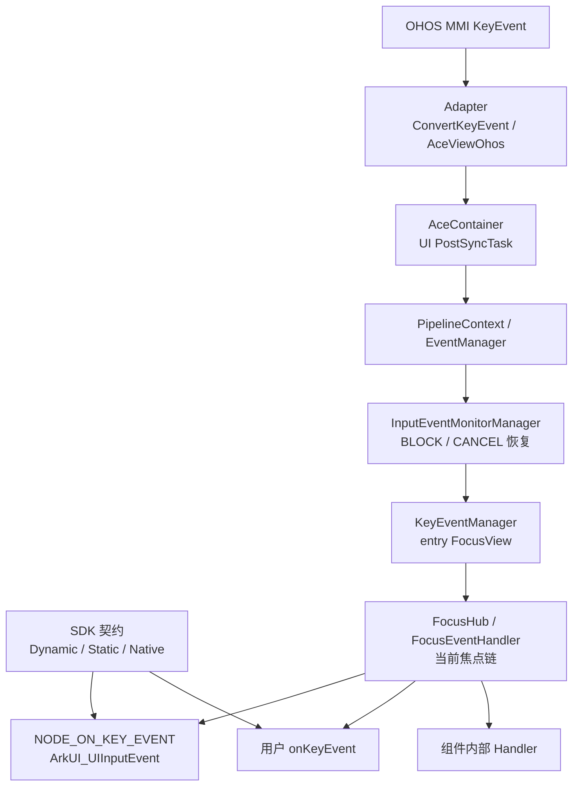
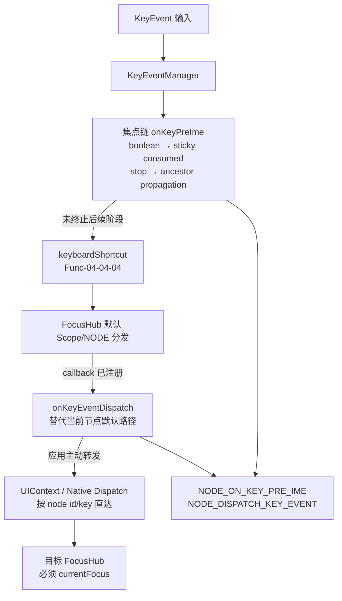
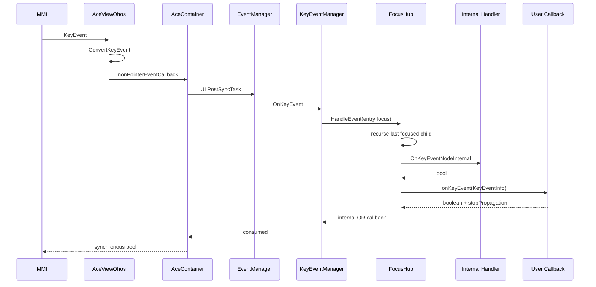
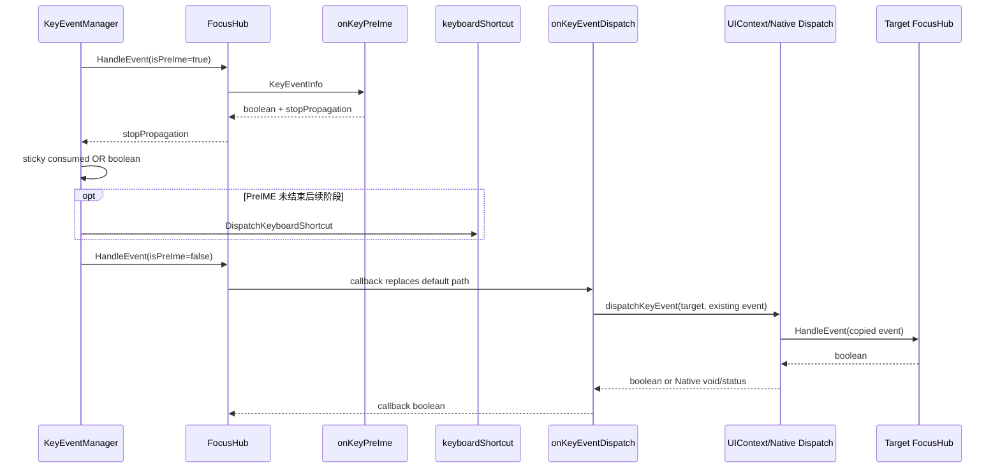
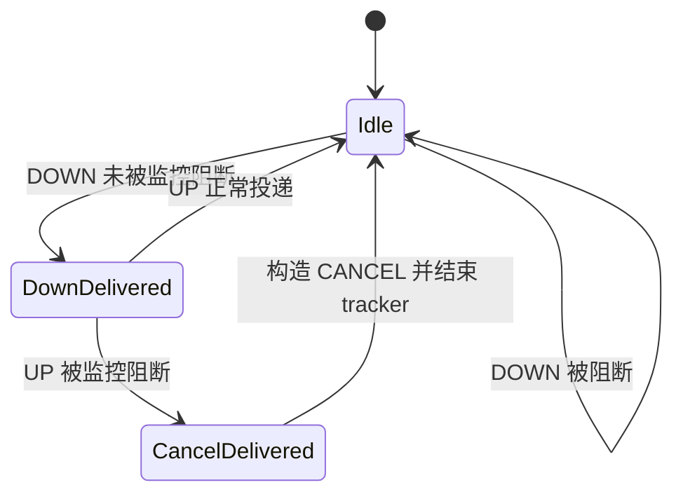
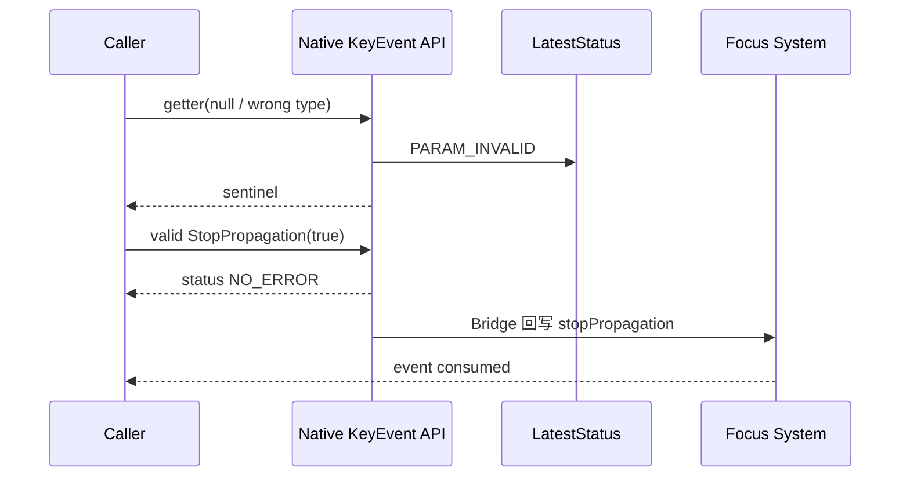

# 架构设计

> 按键事件功能域的共享架构设计基线：Feat-01 固化按键事件模型与基础回调，Feat-02 增量固化前置拦截、自定义分发和主动重分发。

## 设计元数据

| 字段 | 内容 |
|------|------|
| Design ID | DESIGN-Func-04-04-02 |
| 关联需求 | 已有能力补录（无独立 requirement.md） |
| 关联 Epic | 无 |
| 目标 Feature | Feat-01 按键事件模型与基础回调, Feat-02 前置拦截与自定义分发 |
| 复杂度 | 复杂 |
| 目标版本 | Dynamic API 7~26、Native API 14~20+、Static API 23~26；Feat-02 分别自 Dynamic 12/15、Native 14/15、Static 23 开放 |
| Owner | ArkUI SIG |
| 状态 | Baselined（已有实现补录） |

## 需求基线

| 项 | 补充说明（如需） |
|----|------------------|
| 问题陈述 | 应用需要在获得焦点的组件上接收键盘、遥控器和手柄按键，读取完整事件数据并控制消费和冒泡 |
| 核心目标 | 固化 Dynamic/Static `onKeyEvent`、`KeyEvent` 数据模型、焦点链分发、Native 基础事件；（Feat-02）固化 PreIME、自定义 Dispatch、主动 Dispatch 及跨通道兼容行为 |
| P0 AC | 当前焦点链正确分发；callback 返回值与 `stopPropagation` 正确合并；ArkTS/C API 字段可读取；非法 Native 参数可定界；（Feat-02）PreIME 消费/传播独立、自定义 Dispatch 替代默认路径、主动 Dispatch 仅发往当前焦点 |
| 范围边界 | Feat-01 不展开 PreIME/Dispatch；Feat-02 不重复基础事件模型；组件组合键详细实现属于 Func-04-04-04 |

## 上下文和现状

### 涉及仓和模块

| 仓库 | 模块/路径 | 当前职责 | 本 Feature 影响 |
|------|-----------|----------|-----------------|
| sdk-js | `api/@internal/component/ets/common.d.ts`、`enums.d.ts` | Dynamic `onKeyEvent`、`KeyEvent`、`KeyType`、`KeySource` 契约 | API 基线 |
| sdk-js | `api/arkui/component/common.static.d.ets`、`enums.static.d.ets` | Static ArkTS 按键事件契约 | API 基线 |
| sdk-js | `api/@ohos.arkui.UIContext.d.ts`、`api/@ohos.arkui.UIContext.static.d.ets` | Dynamic/Static 主动 `dispatchKeyEvent` 契约 | （Feat-02）主动分发 API 基线 |
| ace_engine | `adapter/ohos/entrance/mmi_event_convertor.cpp` | MMI KeyEvent 转换为 ACE `KeyEvent` | 平台输入转换 |
| ace_engine | `adapter/ohos/entrance/ace_view_ohos.cpp`、`ace_container.cpp` | 平台入口与 UI 线程同步分发 | 输入入口 |
| ace_engine | `frameworks/core/pipeline_ng/pipeline_context.cpp` | 非指针事件进入 EventManager | Pipeline |
| ace_engine | `frameworks/core/common/event_manager.cpp` | 输入监控与按键管理器路由 | 事件总线 |
| ace_engine | `frameworks/core/common/key_event_manager.cpp` | 选择 entry FocusView、分发及消费聚合 | 按键调度 |
| ace_engine | `frameworks/core/components_ng/event/focus_hub.cpp`、`focus_event_handler.cpp` | 焦点链递归、内部/用户 handler、默认焦点行为 | 核心处理 |
| ace_engine | `frameworks/core/interfaces/native/implementation/iui_context_accessor.cpp` | Static `UIContext.dispatchKeyEvent` 解析和 FocusHub 直达 | （Feat-02）Static 主动分发 |
| ace_engine | `frameworks/core/event/key_event.h`、`key_code.h` | 内部事件与动作枚举、`KeyEventInfo` | 数据模型 |
| ace_engine | `frameworks/bridge/declarative_frontend/jsview/js_view_abstract.cpp` | Dynamic JS callback、PreIME/Dispatch 注册、主动事件解析与传播回写 | Dynamic Bridge；（Feat-02）主动分发 |
| ace_engine | `frameworks/bridge/arkts_frontend/koala_projects/arkoala-arkts/arkui-ohos` | Static ArkTS callback 序列化和 ANI 桥接 | Static Bridge |
| ace_engine | `interfaces/native/native_node.h`、`native_key_event.h`、`ui_input_event.h` | Native 节点事件、PreIME/Dispatch 与 C getter 契约 | Native API；（Feat-02）前置/自定义分发 |
| ace_engine | `frameworks/core/interfaces/native/node/node_common_modifier.cpp` | Native event 字段复制和消费/传播回写 | Native Bridge |
| ace_engine | `interfaces/native/event/key_event_impl.cpp`、`ui_input_event.cpp` | C getter、错误状态和参数校验 | Native 实现 |
| ace_engine | `test/unittest/core/event/focus_core`、`test/unittest/interfaces` | 焦点分发与 Native C API 单元测试 | 验证基线 |

### 调用链层级分析

| 层 | 模块 | 职责 | 修改类型 |
|----|------|------|----------|
| SDK 契约层 | Dynamic/Static common + enums | 定义签名、字段、枚举和 `@since` | 存量分析 |
| 平台输入层 | MMI KeyEvent | 提供原始 keyCode/action/source/pressed keys/Lock | 存量分析 |
| 平台适配层 | `mmi_event_convertor`、`AceViewOhos` | 转换内部事件并发起同步回调 | 存量分析 |
| 容器与线程切换层 | `AceContainer` | `PostSyncTask(UI)` 并把消费结果同步返回平台 | 存量分析 |
| Pipeline 层 | `PipelineContext::OnNonPointerEvent` | 将非指针事件交给 EventManager | 存量分析 |
| 事件管理层 | `EventManager`、`InputEventMonitorManager` | 监控、拦截和必要时构造 CANCEL | 存量分析 |
| 按键调度层 | `KeyEventManager` | 选取 last FocusView 的 entry FrameNode 并聚合消费结果 | 存量分析；（Feat-02）PreIME sticky 消费和组合键后继阶段 |
| 焦点层 | `FocusHub/FocusEventHandler` | 沿当前焦点子节点到父 Scope 递归处理 | 存量分析；（Feat-02）Custom Dispatch 优先级和当前焦点约束 |
| 框架 API 层 | `ViewAbstract/ViewAbstractModelNG` | 把前端/Native callback 注册到 FocusHub | 存量分析 |
| Dynamic Bridge | `JSViewAbstract`、`arkts_native_common_bridge` | 创建 JS KeyEvent、解析 boolean、回写 stopPropagation | 存量分析 |
| Static Bridge | Koala generated common + ANI implementation | 序列化 callback、创建 accessor、同步返回 boolean | 存量分析 |
| Native Bridge | `node_common_modifier` | 复制字段到 `ArkUINodeEvent` 并回写消费/传播 | 存量分析 |
| Native API 实现 | `key_event_impl`、`ui_input_event` | getter、sentinel、错误状态与 buffer 规则 | 存量分析 |
| 主动分发直达层 | Dynamic `JsDispatchKeyEvent`、Static `IUIContextAccessor`、Native `DispatchKeyEvent` | 根据 node id/key 找到 FrameNode，直接调用目标 FocusHub | （Feat-02）新增分析层，不经过全局预处理 |
| 测试层 | focus_core / interfaces UT | 验证焦点、传播、字段与错误边界 | 存量分析 |

调用链检查：

- [x] 从 SDK、平台输入到用户 callback 与 Native getter 全层覆盖
- [x] 每层职责边界清晰，API 层不反向依赖 Bridge
- [x] 本次仅文档补录，无产品源码修改

### 适用架构规则

| Rule ID | 适用原因 | 设计结论 | 验证方式 |
|---------|----------|----------|----------|
| OH-ARCH-LAYERING | 涉及平台、Pipeline、事件、焦点、Bridge 多层调用 | 保持 MMI → Adapter → Pipeline → EventManager → Focus → Bridge 单向数据流 | 架构评审/源码审查 |
| OH-ARCH-SUBSYSTEM | sdk-js 与 ace_engine 双仓契约 | 外部 API 以 sdk-js/Native 头文件为契约，ace_engine 实现偏差进入风险表 | API 评审 |
| OH-ARCH-IPC-SAF | 按键事件不跨 SA/IPC | 本 Feature 无新增 IPC/SAF 设计 | 集成测试 |
| OH-ARCH-API-LEVEL | Dynamic/Static/Native 存在版本演进 | 所有接口按各自 `@since` 与错误码记录，不推导未公开能力 | API/XTS 审查 |
| OH-ARCH-COMPONENT-BUILD | 跨多个已有 source set | 无新增 BUILD.gn target、部件或依赖 | 构建检查 |
| OH-ARCH-ERROR-LOG | Native getter 依赖 latest status，焦点链有日志 | 保留 sentinel + latest status 定界，ACE_FOCUS 日志记录节点和消费结果 | 单测/hilog |

## 不涉及项承接

| 维度 | 设计结论 |
|------|----------|
| 布局与渲染 | 按键回调不直接修改 LayoutProperty 或 RenderContext |
| 数据持久化 | KeyEvent 为瞬时输入对象，无存储格式与迁移 |
| 网络与 IPC | 无网络、跨进程或系统服务调用新增 |
| 权限 | ArkTS 与 Native 基础按键事件无新增权限，使用 `SystemCapability.ArkUI.ArkUI.Full` |
| 构建与部件 | 无 BUILD.gn、bundle.json 或外部依赖变更 |
| 主题与资源 | 事件模型不依赖颜色/字体资源；主题只可能影响回调后的默认焦点 click |
| PreIME/Dispatch | Feat-02 已展开；Feat-01 基础回调规则仍作为共享数据模型和焦点前置条件 |
| 组件组合键 | 不在本 FuncID，转由 Func-04-04-04 |

## 关键设计决策

| 决策 ID | 问题 | 推荐方案 | 探索过的替代方案 | 取舍理由 | 影响 |
|---------|------|----------|-----------------|----------|------|
| ADR-1 | 普通按键事件应如何选择分发范围 | 以 last FocusView 的 entry FrameNode 为根，仅沿 `lastWeakFocusNode_` 当前焦点链由深到浅处理 | 方案A：广播整棵组件子树；方案B：只调用叶子节点不回退；方案C：按视觉层级命中 | 焦点链符合键盘交互语义，避免非焦点节点收到事件，同时允许父 Scope 兜底 | AC-1.1~1.4 |
| ADR-2 | 内部组件 handler 消费后是否跳过用户 callback | 同节点内部 handler 先执行，用户 callback 仍执行，最终结果 OR | 方案A：内部 true 后短路；方案B：用户 callback 先执行；方案C：只保留一个 handler | 保持组件默认逻辑和开发者可观察性；当前实现即规格 | AC-1.5 |
| ADR-3 | 用户如何表达消费与停止冒泡 | boolean true 与 `stopPropagation()` 两条路径任一成立即消费 | 方案A：只允许 boolean；方案B：只允许 stopPropagation；方案C：传播与消费完全分离 | 兼容 API 7 void callback 和 API 15 boolean callback，并与现有焦点链短路一致 | AC-3.1~3.5 |
| ADR-4 | DOWN/UP/CANCEL 与默认行为如何解耦 | 所有可投递动作先进入用户 callback；只有 DOWN 参与常规焦点 intention/default click，监控链可补发 CANCEL | 方案A：只把 DOWN 交给用户；方案B：UP 也触发默认 click；方案C：丢弃被拦截 UP | 用户需要完整按下/抬起生命周期；补发 CANCEL 可终止已开始交互 | AC-2.6, AC-2.7 |
| ADR-5 | SDK optional 字段与实现总是赋值冲突时如何记录 | 公共规格以 SDK optional 契约为准，`0/false` 实现行为列兼容性风险 | 方案A：把实现行为写成保证；方案B：忽略差异；方案C：修改源码 | 下游依赖 SDK 契约最稳定；本任务禁止改变实现 | AC-5.2 |
| ADR-6 | ArkTS/C/内部动作枚举如何互转 | 使用显式 converter，禁止按整数值直接等同 | 方案A：统一所有枚举数值；方案B：CANCEL 直接 cast；方案C：只支持 DOWN/UP | 公开 ABI/SDK 值已存在且不可在文档任务中修改，显式转换可隔离差异 | AC-5.1 |
| ADR-7 | Native callback 控制字段的默认值如何描述 | 不虚构默认值；记录栈事件未显式初始化后被读取的现状风险 | 方案A：规格声明默认 false；方案B：假定同步事件系统清零；方案C：在本任务修复源码 | 源码证据不足以保证默认值，implementation-is-spec 原则要求显式风险而非猜测 | AC-4.3, AC-4.4 |
| ADR-8 | SDK 未公开的 Fn 与 Unicode 扩展如何处理 | SDK 保证范围写入接口规格，Fn/超范围 Unicode 仅作为源码扩展偏差 | 方案A：将实现扩展升级为公共保证；方案B：完全不记录；方案C：回退实现 | 避免误导 API 使用者，同时为后续兼容性治理保留证据 | AC-5.3, AC-5.4 |
| ADR-F2-1 | PreIME boolean 与 `stopPropagation()` 是否表达同一结果 | 保持正交：boolean 写 sticky 全局消费，stop 只终止祖先 PreIME 传播 | 方案A：任一路径都消费；方案B：只看 boolean；方案C：只看 stop | `OnKeyPreIme` 返回 stop，而 `SetIsKeyConsumed` 单独聚合 boolean；合并会误写真实行为 | Feat-02 AC-1.2~1.4 |
| ADR-F2-2 | 注册自定义 Dispatch 后 callback false 是否回退默认子分发 | 不回退；callback 的存在即替代当前节点默认 Scope/NODE 处理 | 方案A：false 后回退默认；方案B：仅 true 时替代；方案C：同时执行并 OR | `OnFocusEvent` 在 callback 分支直接 return，保证自定义路由有完整控制权 | Feat-02 AC-2.1~2.3 |
| ADR-F2-3 | Custom Dispatch 如何判定消费和传播 | 核心只采用 callback boolean；桥接回写的 stopPropagation 不参与返回值 | 方案A：boolean OR stop；方案B：只看 stop；方案C：与普通 onKeyEvent 共用规则 | 与 `HandleCustomEventDispatch` 真实实现一致，避免把普通回调语义错误套用到 Dispatch | Feat-02 AC-2.4, AC-4.3 |
| ADR-F2-4 | 主动 Dispatch 是否复用全局按键入口 | 直接定位目标 FrameNode 并调用 FocusHub，不进入 EventManager/KeyEventManager | 方案A：重新注入平台入口；方案B：从 entry FocusView 全链重放；方案C：广播目标子树 | API 语义是显式节点转发；当前实现要求目标当前聚焦并同步返回 | Feat-02 AC-3.1~3.2 |
| ADR-F2-5 | 哪类 KeyEvent 可用于主动 Dispatch | 公共契约仅保证现有 callback KeyEvent；Dynamic 普通对象解析作为实现偏差记录 | 方案A：承诺任意结构对象；方案B：新增公开构造器；方案C：所有通道都拒绝新对象 | Static 依赖底层 EventInfo，Native 无 constructor/clone，最小公共交集是已有事件 | Feat-02 AC-3.3~3.6, AC-4.6 |
| ADR-F2-6 | 主动复制是否保留内部分发状态并提供防环 | 按现状仅复制公开字段，不承诺 `isPreIme/isRedispatch` 等 flags，也不虚构递归保护 | 方案A：复制全部内部状态；方案B：维护 visited set；方案C：禁止同节点分发 | 现有 `ParseKeyEvent` 未复制 flags，Web redispatch 仍可进入 Custom Dispatch；属于兼容与可靠性风险 | Feat-02 AC-3.6~3.7, AC-5.4 |
| ADR-F2-7 | Native 控制字段和 scenario 偏差如何形成规格 | 契约写真实可观察结果并列高风险，不声明未初始化默认值或忽略 latest status | 方案A：默认 false；方案B：把 status 视为成功；方案C：在文档任务修改 ABI/实现 | `ArkUINodeEvent` 未值初始化，`SetConsumed` mask 与 PreIME/Dispatch 用法不一致，需后续代码治理 | Feat-02 AC-5.2~5.3 |

## 设计骨架

### 骨架范围

| 骨架项 | 目标 | 不包含 | 验证方式 |
|--------|------|--------|----------|
| 事件模型 | 定义 ArkTS/Internal/Native 按键字段和版本边界 | 组件专有按键行为 | SDK/头文件审查 |
| 输入管线 | 描述 MMI 到 FocusHub 的同步调用链 | 触摸、鼠标、轴事件 | 主链源码审查 |
| 焦点链 | 固化当前焦点、子到父 Scope、默认行为边界 | 无障碍焦点算法 | focus_core UT |
| 消费控制 | 固化 internal/user/boolean/stopPropagation 合并规则 | PreIME/自定义 Dispatch | focus_core UT |
| Native 通道 | 固化 NODE_ON_KEY_EVENT、getter、错误和 buffer 规则 | NODE_DISPATCH_KEY_EVENT | interfaces UT |
| 兼容治理 | 固化 API 7~26、枚举和 SDK/实现差异 | 修改 API/ABI | SDK 差异审查 |

### 骨架 Spec 拆分

| Task ID | 目标 | 受影响文件 | AC |
|---------|------|------------|-----|
| TASK-SKELETON-1 | 按键事件模型、焦点链与基础回调 | `KeyEvent`、`KeyEventManager`、`FocusEventHandler`、Dynamic/Static Bridge、Native KeyEvent | Feat-01 全部 AC |
| TASK-SKELETON-2 | 前置拦截与自定义分发 | `onKeyPreIme`、`onKeyEventDispatch`、Native Dispatch | Feat-02 全部 AC |

## 后续 Task 拆分

| Task ID | 目标 | 受影响文件 | 依赖 |
|---------|------|------------|------|
| Feat-01-key-event-model-basic-callback-spec.md | 固化事件模型、基础回调、焦点链、消费与 Native 基础接口 | Dynamic/Static SDK、事件核心、Native KeyEvent | 本 Design |
| Feat-02-pre-ime-custom-dispatch-spec.md | 固化 PreIME、自定义 Dispatch、回调优先级与 Native Dispatch | FocusEventHandler、KeyEventManager、Bridge、Native API | Feat-01 基线 |

## API 签名、Kit 与权限

> 本次为已有能力补录，无新增 API。下表记录存量签名和开放信息。

### 新增 API

| API 签名 | 类型 | Kit | d.ts/头文件位置 | 权限要求 | SysCap |
|----------|------|-----|------------------|----------|--------|
| `onKeyEvent(event: (event: KeyEvent) => void): T` | Public | ArkUI | `common.d.ts:21121` | 无 | SystemCapability.ArkUI.ArkUI.Full |
| `onKeyEvent(event: Callback<KeyEvent, boolean>): T` | Public | ArkUI | `common.d.ts:21135` | 无 | SystemCapability.ArkUI.ArkUI.Full |
| `onKeyEvent(event: Callback<KeyEvent, boolean> \| undefined): this` | Public | ArkUI | `common.static.d.ets:12133` | 无 | SystemCapability.ArkUI.ArkUI.Full |
| `KeyEvent.getModifierKeyState?(keys: Array<string>): boolean` | Public | ArkUI | `common.d.ts:12823` | 无 | SystemCapability.ArkUI.ArkUI.Full |
| `NODE_ON_KEY_EVENT` | Public | ArkUI NDK | `native_node.h:10232` | 无 | SystemCapability.ArkUI.ArkUI.Full |
| `OH_ArkUI_KeyEvent_GetType/GetKeyCode/GetKeyText/GetKeySource` | Public | ArkUI NDK | `native_key_event.h:492` | 无 | SystemCapability.ArkUI.ArkUI.Full |
| `OH_ArkUI_KeyEvent_StopPropagation/SetConsumed` | Public | ArkUI NDK | `native_key_event.h:528`、`:558` | 无 | SystemCapability.ArkUI.ArkUI.Full |
| `OH_ArkUI_KeyEvent_GetKeyIntensionCode/GetUnicode` | Public | ArkUI NDK | `native_key_event.h:537`、`:549` | 无 | SystemCapability.ArkUI.ArkUI.Full |
| `OH_ArkUI_KeyEvent_IsNumLockOn/IsCapsLockOn/IsScrollLockOn` | Public | ArkUI NDK | `native_key_event.h:579` | 无 | SystemCapability.ArkUI.ArkUI.Full |
| `onKeyPreIme(event: Callback<KeyEvent, boolean>): T` | Public | ArkUI | `common.d.ts:21168` | 无 | SystemCapability.ArkUI.ArkUI.Full |
| `onKeyEventDispatch(event: Callback<KeyEvent, boolean>): T` | Public | ArkUI | `common.d.ts:21186` | 无 | SystemCapability.ArkUI.ArkUI.Full |
| `UIContext.dispatchKeyEvent(node: number \| string, event: KeyEvent): boolean` | Public | ArkUI | `@ohos.arkui.UIContext.d.ts:5545` | 无 | SystemCapability.ArkUI.ArkUI.Full |
| `onKeyPreIme(event: Callback<KeyEvent, boolean> \| undefined): this` | Public | ArkUI Static | `common.static.d.ets:12153` | 无 | SystemCapability.ArkUI.ArkUI.Full |
| `onKeyEventDispatch(event: Callback<KeyEvent, boolean> \| undefined): this` | Public | ArkUI Static | `common.static.d.ets:12163` | 无 | SystemCapability.ArkUI.ArkUI.Full |
| `UIContext.dispatchKeyEvent(node: int \| string, event: KeyEvent): boolean` | Public | ArkUI Static | `@ohos.arkui.UIContext.static.d.ets:4019` | 无 | SystemCapability.ArkUI.ArkUI.Full |
| `NODE_ON_KEY_PRE_IME` | Public | ArkUI NDK | `native_node.h:10246` | 无 | SystemCapability.ArkUI.ArkUI.Full |
| `NODE_DISPATCH_KEY_EVENT` | Public | ArkUI NDK | `native_node.h:10269` | 无 | SystemCapability.ArkUI.ArkUI.Full |
| `OH_ArkUI_KeyEvent_Dispatch(ArkUI_NodeHandle, const ArkUI_UIInputEvent*)` | Public | ArkUI NDK | `native_key_event.h:567` | 无；latest status | SystemCapability.ArkUI.ArkUI.Full |

### 变更/废弃 API

| 原有 API | 变更类型 | 新 API | 迁移说明 |
|----------|----------|--------|----------|
| N/A | 无 | N/A | 本次不变更或废弃 API |

## 构建系统影响

### BUILD.gn 变更

```text
无变更。涉及实现均已被现有 ace_engine、ArkTS frontend 和 Native API 构建目标覆盖。
```

### bundle.json 变更

无变更；不新增部件、依赖或 SysCap。

## 可选设计扩展

### 架构图



#### 前置拦截与自定义分发架构图（Feat-02）



### 数据流/控制流

| 步骤 | 调用方 | 被调用方 | 数据/接口 | 说明 |
|------|--------|----------|-----------|------|
| 1 | MMI | `ConvertKeyEvent` | raw KeyEvent | 复制 code/action/source/pressed keys/unicode/Lock |
| 2 | AceViewOhos | AceContainer callback | ACE `KeyEvent` | 发起非指针事件同步回调 |
| 3 | AceContainer | PipelineContext | `PostSyncTask(UI)` | UI 线程处理并同步返回 bool |
| 4 | PipelineContext | EventManager | `OnNonPointerEvent` | 进入输入监控 |
| 5 | EventManager | InputEventMonitorManager | KeyEvent | 可 BLOCK；必要时构造 CANCEL |
| 6 | EventManager | KeyEventManager | KeyEvent | 普通按键分发 |
| 7 | KeyEventManager | entry FocusHub | KeyEvent | 从 last FocusView 的 entry FrameNode 开始 |
| 8 | Focus Scope | last focused child | FocusEvent | 子节点优先，未消费再回退 Scope |
| 9 | FocusEventHandler | internal + user | KeyEvent / KeyEventInfo | 两者均执行并 OR |
| 10 | Dynamic/Static Bridge | 用户 callback | KeyEvent object | 解析 boolean 并回写 stopPropagation |
| 11 | Native Bridge | Native listener | ArkUINodeEvent | 复制字段、读取 isConsumed/stopPropagation |
| 12 | FocusEventHandler | KeyEventManager | bool | 同步消费结果返回平台 |
| 13 | KeyEventManager | PreIME 焦点链 | `isPreIme=true` | （Feat-02）回调 boolean 写 sticky consumed，stop 决定祖先传播 |
| 14 | PreIME 链 | Shortcut stage | KeyEvent | （Feat-02）仅在焦点链未短路时进入；Web 当前焦点可跳过 |
| 15 | FocusEventHandler | Custom Dispatch callback | KeyEventInfo | （Feat-02）callback 存在即替代当前节点默认子分发 |
| 16 | UIContext/Native API | 目标 FrameNode FocusHub | copied KeyEvent | （Feat-02）直达调用，不经 EventManager/KeyEventManager |
| 17 | 目标 FocusHub | Dispatch caller | bool/void + latest status | （Feat-02）ArkTS 返回 boolean，Native 公共 API 返回 void |

### 时序设计



#### PreIME 与主动分发时序（Feat-02）



### 数据模型设计

```typescript
// Dynamic/Static SDK contract (simplified)
interface KeyEvent {
  type: KeyType
  keyCode: number
  keyText: string
  keySource: KeySource
  deviceId: number
  metaKey: number
  timestamp: number
  stopPropagation(): void
  intentionCode: IntentionCode
  getModifierKeyState?(keys: Array<string>): boolean
  unicode?: number
  isNumLockOn?: boolean
  isCapsLockOn?: boolean
  isScrollLockOn?: boolean
}
```

```cpp
// Framework model (simplified)
struct KeyEvent {
    KeyCode code;
    KeyAction action;
    std::vector<KeyCode> pressedCodes;
    TimeStamp timeStamp;
    KeyIntention keyIntention;
    bool numLock;
    bool enableCapsLock;
    bool scrollLock;
    uint32_t unicode;
};

class KeyEventInfo : public BaseEventInfo {
    KeyCode keyCode_;
    KeyAction keyType_;
    SourceType keySource_;
    bool stopPropagation_;
};

struct ArkUIKeyEvent {
    int32_t type;
    int32_t keyCode;
    char keyText[128];
    int32_t keySource;
    bool isConsumed;
    bool stopPropagation;
};
```

| 数据 | 存储周期 | 所有者 | 说明 |
|------|----------|--------|------|
| MMI KeyEvent | 单次输入交互 | MMI/shared_ptr | Adapter 保存 raw event 引用 |
| ACE KeyEvent | 单次同步分发 | 调用栈/事件管理器 | 不持久化 |
| KeyEventInfo | 单次节点回调 | FocusEventHandler/Bridge | JS Bridge 临时复制 |
| ArkUINodeEvent/ArkUIKeyEvent | 单次 Native 同步回调 | Native Bridge 栈对象 | callback 返回后失效 |

#### 前置与主动分发数据模型（Feat-02）

```cpp
// Internal flags participating in routing, but not fully copied by active dispatch.
struct KeyEvent : public NonPointerEvent {
    bool isPreIme = false;
    bool isRedispatch = false;
};

// PreIME uses two independent outputs.
bool callbackConsumed = onKeyPreIme(info);
eventManager->SetIsKeyConsumed(callbackConsumed); // sticky global state
return info.IsStopPropagation();                  // ancestor propagation only

// Custom dispatch uses callback boolean only.
return onKeyEventDispatchCallback(KeyEventInfo(keyEvent));
```

```typescript
// Public forwarding contract: an existing callback event.
onKeyEventDispatch((event: KeyEvent): boolean => {
  return uiContext.dispatchKeyEvent(targetId, event)
})
```

| Feat-02 数据 | 复制/持有规则 | 未形成公共保证的字段 |
|-------------|---------------|----------------------|
| PreIME KeyEventInfo | 同步回调对象，boolean 与 stop 分别回写 | 两者不可合并为一个“消费”字段 |
| Dynamic active KeyEvent | 已有 EventInfo 或普通对象解析后新建内部事件 | 普通对象支持、毫秒 timestamp 属实现偏差 |
| Static active KeyEvent | 必须能取得底层 EventInfo | 新建 KeyEvent 不支持 |
| Native ArkUIKeyEvent | 从 NodeEvent 同步取得并复制到内部事件 | `isPreIme/isRedispatch`、完整 modifier/source/传播状态 |

### 算法与状态机



焦点链处理伪代码：

```text
handle(scope):
  if !scope.currentFocus: return false
  if scope is SCOPE and lastFocusedChild.handle(event): return true
  internal = runAllInternalHandlers(event)
  user = callback(eventInfo)
  if internal OR userResult OR eventInfo.stopPropagation: return true
  return handleDefaultFocusBehavior(event)
```

#### PreIME 与自定义 Dispatch 算法（Feat-02）

```text
preIme(event):
  reset stickyConsumed = false
  walk current focus chain:
    callbackConsumed = node.onKeyPreIme(info)
    stickyConsumed = stickyConsumed OR callbackConsumed
    if info.stopPropagation: stop ancestor walk
  if focus path handled OR stickyConsumed: return true
  return keyboardShortcut(event) unless Web skips shortcut

customDispatch(node, event):
  if !node.currentFocus: return false
  if event.isPreIme: use preIme/default path
  if node.hasDispatchCallback:
    return callback(eventInfo) // no default fallback, stopPropagation ignored by core
  return node.defaultFocusDispatch(event)
```

### 测试性设计

| 测试层级 | 测试目标 | Mock 策略 | 验证方式 |
|----------|----------|-----------|----------|
| Focus 单测 | currentFocus、子到父 Scope、internal/user、stopPropagation | 构造 FrameNode/FocusHub | `focus_hub_test_ng_two.cpp` |
| EventManager 单测 | 无焦点、监控 BLOCK、CANCEL 恢复 | Mock monitor/focus manager | `event_manager_test_ng.cpp`、`input_event_monitor_manager_test_ng.cpp` |
| Dynamic Bridge | boolean/非 boolean/stopPropagation 回写 | JS VM callback | 当前直接活跃 UT 覆盖不足，保留测试风险 |
| Static Bridge | accessor 与 callback 序列化 | Koala/ANI mock | accessor UT；modifier UT 当前有 DISABLED 覆盖 |
| Native Level0 | getter sentinel、Lock、Unicode、SetConsumed | 构造 ArkUI_UIInputEvent | `test/unittest/interfaces/ace_key_event` |
| Native Level1 | NodeEvent → InputEvent 完整字段 | 构造 ArkUINodeEvent | `native_key_event_test.cpp` |
| 集成/XTS | 外接键盘、手柄、多窗口焦点 | 真实设备输入 | 端到端验证 |
| PreIME Focus | boolean/stop 四组合、sticky consumed、祖先传播 | 多级 FocusHub callback | （Feat-02）补充组合矩阵，核验 `focus_event_handler.cpp:278` |
| Custom Dispatch | true/false、替代默认子分发、手工转发 | Scope + child FocusHub | `focus_hub_test_ng_new_two.cpp:862` |
| Active Dispatch | id/key、当前/非当前焦点、现有/新建事件、环形重入 | Dynamic/Static/Native callback | Native 当前合法成功链覆盖不足，列风险 |

### 异常传播时序图



| 异常场景 | 传播结果 | 恢复 |
|----------|----------|------|
| 无 entry FocusView/FocusHub | 返回 false | 后续焦点建立后重新接收 |
| JS callback 非 boolean | 按 false | stopPropagation 仍可独立生效 |
| Native null/错误类型 | sentinel + latest status | 调用方修正参数 |
| pressed key buffer 不足 | BUFFER_SIZE_NOT_ENOUGH | 调用方扩大缓冲后重试 |
| UP 被输入监控阻断 | 构造 CANCEL | tracker 结束交互 |
| PreIME return true 且未 stop | 祖先仍可执行，最终 sticky consumed=true | 由后续节点继续观察，不清除消费 |
| Custom Dispatch false | 当前节点返回 false，不恢复默认子分发 | callback 内显式主动转发或取消注册 |
| Active Dispatch 目标非当前焦点 | 返回 false/无有效分发 | 修正目标焦点后重试 |
| Static 新建 KeyEvent | accessor 返回 false | 使用现有回调事件 |
| Native scenario 不支持 | 字段可能已写入但 latest status 报不支持 | 同时检查 callback 结果和 latest status，后续治理 mask |
| 同步分发成环 | 持续同步重入，可能栈耗尽 | 应用移除同节点/环形转发 |

### 资源所有权矩阵

| 资源 | 创建方 | 持有方 | 销毁触发 | 实际释放 | 异常回收 |
|------|--------|--------|----------|----------|----------|
| raw MMI KeyEvent | MMI | shared_ptr/ACE KeyEvent | 单次分发结束 | shared_ptr 引用归零 | 平台管理 |
| Dynamic `KeyEventInfo*` | JS Bridge | JS event object | JS event object 生命周期结束 | Bridge/JS runtime | 禁止外部长期持有地址 |
| Focus callback | ViewAbstract | FocusHub | 组件销毁或 Disable | FocusHub 成员释放 | Weak FrameNode 防止悬挂 |
| Native `ArkUINodeEvent` | node_common_modifier | 同步 callback 栈 | callback 返回 | 栈释放 | 禁止异步保存内部指针 |
| pressed key vector | Native Bridge | callback 栈 vector | callback 返回 | vector 析构 | `pressedKeyCodes` 仅同步有效 |
| Active Dispatch copied KeyEvent | Dynamic/Static/Native accessor | 调用栈 | 目标 HandleEvent 返回 | 栈释放 | 不保留原事件内部 flags |

### 接口参数规约

| 接口 | 参数 | 类型 | 合法范围 | 非法处理 | 边界说明 |
|------|------|------|----------|----------|----------|
| `onKeyEvent` | callback | function/undefined(Static) | SDK 签名 | Dynamic 非函数不注册 | API 7 void；API 15 boolean |
| `getModifierKeyState` | keys | Array<string> | Ctrl/Alt/Shift | BusinessError 401 | 实现额外识别 Fn，不是契约 |
| `OH_ArkUI_KeyEvent_Get*` | event | ArkUI_UIInputEvent* | C_KEY_EVENT_ID + non-null inner | sentinel + latest status | sentinel 类型依 API |
| `StopPropagation` | bool | bool | true/false | null event 设置参数错误 | false 可清除字段 |
| `SetConsumed` | bool | bool | NODE_ON_KEY_EVENT 场景 | null event 设置参数错误 | 结果成为 callback 返回值 |
| `Is*LockOn` | state | bool* | 非空 | PARAM_INVALID | API 19+ |
| `GetPressedKeys` | buffer/length | int32_t* | 容量 >= keyCodesLength | BUFFER_SIZE_NOT_ENOUGH | 当前不足时不回填所需长度 |
| `onKeyPreIme` | callback return/stop | boolean/方法 | true/false | 非 boolean 按 Bridge 规则处理 | return 写 sticky consumed；stop 控制祖先传播 |
| `onKeyEventDispatch` | callback return/stop | boolean/方法 | true/false | 非 boolean 按 false | 核心只读 return；存在 callback 即替代默认路径 |
| `UIContext.dispatchKeyEvent` | node | number/int/string | 有效当前焦点 FrameNode | false/早退 | 不经过全局输入预处理 |
| `UIContext.dispatchKeyEvent` | event | KeyEvent | SDK 保证已有回调事件 | Static 无 EventInfo 返回 false | Dynamic 普通对象解析不是跨通道契约 |
| `OH_ArkUI_KeyEvent_Dispatch` | node/event | handle/C key event | 非空、正确类型、有效 inner event | latest status 参数错误 | 返回 void；目标仍须 currentFocus |

### 线程与并发模型

| 操作 | 发起线程 | 回调线程 | 跨进程边界 | 线程安全 | 重入约束 |
|------|----------|----------|------------|----------|----------|
| MMI 输入 | 平台输入线程 | 经 AceContainer 切到 UI | 无 | 同步等待结果 | 不应阻塞 UI |
| Focus 分发 | UI 线程 | UI 线程 | 无 | 单线程焦点状态 | callback 可同步改变组件状态 |
| Dynamic/Static callback | UI 线程 | JS/ArkTS UI 执行上下文 | 无 | Bridge 设置 callback node | 临时事件对象不得跨回调持有 |
| Native callback | UI 线程 | Native 同步 listener | 无 | 栈事件仅同步有效 | 不得异步保存 `inputEvent` 指针 |
| Active Dispatch | UI callback 线程 | 同一 UI 执行栈 | 无 | 同步直达目标 FocusHub | 无递归保护，禁止同节点/环形转发 |

并发场景：同一 UI 实例按输入事件顺序同步处理；多窗口/多实例分别从各自 FocusManager 的 last FocusView 选取分发根。

## 详细设计

### 平台输入转换

`ConvertKeyEvent` 将 MMI keyCode、UP/DOWN action、Unicode、时间戳、deviceId、pressed keys、Lock 和 intention 写入 ACE `KeyEvent`；source 仅区分 JOYSTICK 与 KEYBOARD（`adapter/ohos/entrance/mmi_event_convertor.cpp:867`）。其他原始 action 先映射为 UNKNOWN（`:877`）。

### 同步事件入口

`AceViewOhos::ProcessKeyEvent` 转换事件后调用 non-pointer callback（`adapter/ohos/entrance/ace_view_ohos.cpp:578`）；`AceContainer` 通过 UI `PostSyncTask` 调用 Pipeline 并同步返回消费结果（`adapter/ohos/entrance/ace_container.cpp:1437`）。

### 焦点链分发

`KeyEventManager::TriggerKeyEventDispatch` 从 `FocusManager::GetLastFocusView()` 取得 entry FrameNode（`frameworks/core/common/key_event_manager.cpp:676`）。`FocusEventHandler::OnFocusEventScope` 先递归 `lastWeakFocusNode_`，子节点消费后立即返回，否则处理当前 Scope（`frameworks/core/components_ng/event/focus_event_handler.cpp:132`）。

### 同节点处理与消费

`HandleKeyEvent` 顺序执行 `OnKeyEventNodeInternal` 和 `OnKeyEventNodeUser`，再对两者结果 OR（`focus_event_handler.cpp:202`）。用户结果为 callback boolean 或 `KeyEventInfo::IsStopPropagation()`（`focus_event_handler.cpp:372`）；内部 handler 容器遍历全部 callback，不因单个 true 提前停止（`focus_event_handler.cpp:404`）。

### Dynamic 与 Static Bridge

Dynamic `JSViewAbstract::JsOnKeyEvent` 只接受函数，创建临时 `KeyEventInfo`，仅采用 boolean 返回值，并将 JS 对象的 stopPropagation 回写（`frameworks/bridge/declarative_frontend/jsview/js_view_abstract.cpp:9610`）。Static 路径通过 generated common serializer 和 `common_method_modifier.cpp` 同步取回 boolean，KeyEvent accessor 直接修改同一事件信息对象。

### Native Bridge

`SetOnKeyEvent` 在栈上构造 `ArkUINodeEvent`，复制字段并同步发送；callback 后把 `stopPropagation` 回写并以 `isConsumed` 返回（`frameworks/core/interfaces/native/node/node_common_modifier.cpp:12680`）。`ArkUINodeEvent event` 未显式值初始化且控制字段随后被读取，设计文档仅记录风险，不声明默认值。

### Native getter 与错误定界

专用 getter 校验 event、`eventTypeId` 和 inner key event；无效时返回 sentinel 并写 latest status（`interfaces/native/event/key_event_impl.cpp:27`）。Lock getter额外校验 state 指针（`:245`）。Pressed keys buffer 不足返回 `ARKUI_ERROR_CODE_BUFFER_SIZE_NOT_ENOUGH`（`interfaces/native/event/ui_input_event.cpp:695`）。

### 版本和枚举转换

Dynamic 从 API 7 开始，API 10/12/14/15/19/26 增加字段或签名；Static 从 API 23 开始，API 26 增加 CANCEL/Lock；Native 从 API 14 开始。内部 `KeyAction::CANCEL=4`，ArkTS `KeyType.CANCEL=3`，C `ARKUI_KEY_EVENT_CLICK=3`，跨层必须使用 converter（`frameworks/core/event/key_code.h:442`、`interfaces/native/native_key_event.h:387`）。

### Feat 边界

Feat-01 负责普通 `onKeyEvent`、事件模型和焦点链基础规则；Feat-02 负责 PreIME、Custom Dispatch 和主动 Dispatch。`keyboardShortcut` 只作为 PreIME 后继阶段出现，其注册、匹配和组件行为仍由 Func-04-04-04 承接。

### PreIME 前置拦截与消费传播（Feat-02）

`KeyEventManager::OnKeyEvent` 在 `event.isPreIme` 为 true 时先调用 `TriggerKeyEventDispatch`，未被处理后才进入 `DispatchKeyboardShortcut`（`frameworks/core/common/key_event_manager.cpp:607`）。`TriggerKeyEventDispatch` 对 PreIME 直接从 entry FocusView FrameNode 进入 `DispatchKeyEventNG`（`:676`）。

节点 PreIME callback 返回 boolean 后，`FocusEventHandler::OnKeyPreIme` 将 boolean 写入 `EventManager::SetIsKeyConsumed`，函数自身却返回 `KeyEventInfo::IsStopPropagation()`（`frameworks/core/components_ng/event/focus_event_handler.cpp:278`）。`SetIsKeyConsumed` 只允许 false→true，不允许后续 false 清除（`key_event_manager.cpp:581`）。因此：

- callback boolean 表达本次全局 sticky 消费状态；
- `stopPropagation()` 只表达是否停止向祖先节点继续执行 PreIME；
- return true 未 stop 时，祖先仍可收到 PreIME，但最终整体已消费；
- return false 且 stop 时，祖先不再收到 PreIME，但 stop 本身不把 sticky consumed 设为 true。

### 自定义子分发替代路径（Feat-02）

`FocusEventHandler::HasCustomKeyEventDispatch` 仅接受非 PreIME key event，且要求节点存在 Dispatch callback（`focus_event_handler.cpp:84`）。`OnFocusEvent` 在确认当前焦点后首先检查该 callback，并直接返回 `HandleCustomEventDispatch` 结果（`:107`）。这意味着 callback 存在即替代当前节点后续的 Scope 子分发、NODE handler 和默认焦点行为；callback 即使返回 false，也不会在本次调用中恢复默认路径。

`HandleCustomEventDispatch` 只返回 callback boolean（`:96`）。Dynamic Bridge 会把 JS 对象的 stopPropagation 写回 `KeyEventInfo`（`frameworks/bridge/declarative_frontend/jsview/js_interactable_view.cpp:184`），Native Bridge 也会回写该字段（`frameworks/core/interfaces/native/node/node_common_modifier.cpp:12776`），但核心函数不读取它。因此 Custom Dispatch 的消费结果不得按普通 `onKeyEvent` 的 “boolean OR stop” 规则解释。

### ArkTS 主动 Dispatch（Feat-02）

Dynamic `JSViewAbstract::JsDispatchKeyEvent` 用 number 或 inspector key 定位 FrameNode，取得 FocusHub 后直接调用 `HandleEvent`（`frameworks/bridge/declarative_frontend/jsview/js_view_abstract.cpp:9766`）。该路径不经过 Pipeline/EventManager/KeyEventManager，所以不会重新执行输入监控、全局 PreIME 或其他全局预处理；`FocusEventHandler::OnFocusEvent` 仍要求目标 `IsCurrentFocus()`（`focus_event_handler.cpp:107`）。

Dynamic 对绑定 `KeyEventInfo` 的现有事件调用 `ParseKeyEvent`，对普通 JS object 则逐字段解析（`js_view_abstract.cpp:9647`）。普通对象的 `timestamp` 被按 milliseconds 构造（`:9701`），而 Dynamic SDK 将 KeyEvent timestamp 声明为系统启动以来的纳秒（`common.d.ts:12773`），这是实现偏差，不能作为公共用法。Static `IUIContextAccessor::DispatchKeyEventImpl` 必须从事件 peer 取得 `EventInfo` 后才能复制并分发，缺失时返回 false（`frameworks/core/interfaces/native/implementation/iui_context_accessor.cpp:533`）。

`KeyEventInfo::ParseKeyEvent` 复制公开字段但不复制 `isPreIme`、`isRedispatch` 等内部 flags（`frameworks/core/event/key_event.cpp:202`）。Active Dispatch 没有 visited-node 或递归深度保护，应用在自定义 Dispatch 内不得向同一节点或形成环形同步转发。

### Native PreIME 与 Dispatch Bridge（Feat-02）

`SetOnKeyPreIme` 和 `SetOnKeyEventDispatch` 都在栈上声明未值初始化的 `ArkUINodeEvent event;`，复制公开按键字段、同步发送事件，随后读取 `stopPropagation/isConsumed`（`frameworks/core/interfaces/native/node/node_common_modifier.cpp:12729`、`:12776`）。文档只记录该风险，不把默认 false 写成契约。

Native NodeEvent 头文件对 `NODE_ON_KEY_PRE_IME` 和 `NODE_DISPATCH_KEY_EVENT` 注释为 `ArkUI_NodeComponentEvent`（`interfaces/native/native_node.h:10233`、`:10259`），实际 `NodeModel::HandleKeyEvent` 把 inner key event 包装为 `ArkUI_UIInputEvent`（`interfaces/native/node/node_model.cpp:688`），调用方应通过 `OH_ArkUI_NodeEvent_GetInputEvent` 获取。

### Native 主动 Dispatch 与状态定界（Feat-02）

`OH_ArkUI_KeyEvent_Dispatch` 校验 node、event、event type 和 inner key event，随后调用 common modifier；公开返回类型为 void，错误结果只能从 latest status 获取（`interfaces/native/event/key_event_impl.cpp:216`、`interfaces/native/native_key_event.h:560`）。common modifier 复制 action/code/text/source/device/unicode/Lock/timestamp/pressedCodes/intention 后直接调用 `ViewAbstract::DispatchKeyEvent`（`frameworks/core/interfaces/native/node/node_common_modifier.cpp:9337`），最终仍由目标 FocusHub 检查当前焦点（`frameworks/core/components_ng/base/view_abstract.cpp:10240`）。

Native 公共 API 没有 KeyEvent constructor/clone，因此可可靠转发的事件实际来自已有同步 NodeEvent callback。复制过程不保留 `isPreIme/isRedispatch`、消费/传播状态等内部信息。`OH_ArkUI_KeyEvent_SetConsumed` 只用 `S_NODE_ON_KEY_EVENT` 做 scenario 检查（`interfaces/native/event/key_event_impl.cpp:192`），但 PreIME/Dispatch Bridge 又读取 `isConsumed`；字段可能已写入，而 status 宏最终仍报告 scenario 不支持，形成可观察偏差。

### 重分发与 Web 边界（Feat-02）

Web `KeyEventManager::ReDispatch` 会设置 `isRedispatch=true`，先尝试 shortcut/tab，再进入 `DispatchKeyEventNG`（`frameworks/core/common/key_event_manager.cpp:720`）。`HasCustomKeyEventDispatch` 不检查 `isRedispatch`，因此 Web 重分发仍可进入 Custom Dispatch；若 callback 再主动分发，复制的新事件又丢失该 flag。当前实现没有防环保证，必须通过调用方路由设计避免递归。

## 风险和开放问题

| 项 | 类型 | 影响 | 处理方式 | Owner |
|----|------|------|----------|-------|
| SDK optional Unicode/Lock，当前实现常输出 0/false | API | 中 | Spec 以 SDK 为契约，记录源码偏差 | ArkUI API |
| 实现支持 Fn，SDK 只保证 Ctrl/Alt/Shift | API | 中 | 不提升为公共保证 | ArkUI API |
| ArkTS CANCEL=3、C CLICK=3、内部 CANCEL=4 | API/架构 | 高 | 强制显式转换，增加跨通道测试 | Event/NDK |
| Native `isConsumed/stopPropagation` 未显式初始化即读取 | 架构 | 高 | 记录现状，后续代码任务单独治理 | Event/NDK |
| Native Unicode 实现不校验头文件 0x21~0x7E 范围 | API | 中 | 契约保持头文件限制，偏差进入兼容测试 | NDK |
| NODE_ON_KEY_EVENT 注释 union 类型与实际 InputEvent 路径不一致 | API | 中 | Spec 写真实调用路径，后续 API 文档治理 | NDK |
| `GetPressedKeys` buffer 不足时不回填所需长度 | API | 低 | 记录当前边界，调用方预留足够容量 | NDK |
| C modifier getter 对空 inner event 缺少直接保护 | 安全/测试 | 高 | 记录风险，补充故障注入任务 | NDK |
| Dynamic Bridge 直接活跃 UT、Static modifier UT 覆盖不足 | 测试 | 中 | 后续补充 Bridge 测试，不影响本次文档基线 | ArkUI Frontend |
| Native keyText 固定 128 字节缓冲 | API | 低 | Spec 标注最多 127 字节加终止符 | NDK |
| PreIME boolean 与 stopPropagation 容易被误写为同一“消费”语义 | API/架构 | 高 | （Feat-02）Spec/ADR 分别定义 sticky consumed 与祖先传播，增加四组合测试 | Event |
| Custom Dispatch callback false 仍替代默认子分发 | 兼容性 | 高 | （Feat-02）明确“存在即替代”，应用需显式调用主动 Dispatch | Event/Frontend |
| Custom Dispatch Bridge 回写 stopPropagation，但核心忽略 | API | 高 | （Feat-02）只把 callback boolean 写成消费契约，跨通道增加一致性测试 | Event/Frontend/NDK |
| Active Dispatch 绕过 EventManager/KeyEventManager 且目标必须 currentFocus | 架构 | 高 | （Feat-02）文档标注直达路径和焦点前置条件，增加非当前焦点测试 | Event |
| Dynamic 接受普通对象且 timestamp 按毫秒解析，与 SDK 纳秒不一致 | API/兼容性 | 高 | （Feat-02）公共契约仅保证已有 KeyEvent，后续统一单位或拒绝普通对象 | Frontend/API |
| Active Dispatch 丢失 `isPreIme/isRedispatch` 等内部状态 | 架构 | 中 | （Feat-02）不承诺保留 flags，评估后续 clone 模型 | Event |
| 同节点/环形 Active Dispatch 无递归保护 | 可靠性/安全 | 高 | （Feat-02）禁止应用构环，补充重入和栈深测试 | Event/Frontend |
| Web redispatch 仍可进入 Custom Dispatch | 兼容性 | 中 | （Feat-02）记录现状，Web 路由增加防环验证 | Web/Event |
| Native `SetConsumed` scenario mask 仅含普通 key event | API | 高 | （Feat-02）调用方检查 latest status；后续代码任务评估扩展为 all C key scenarios | NDK |
| Native PreIME/Dispatch 控制字段未显式初始化 | 架构 | 高 | （Feat-02）不声明默认 false，后续代码任务显式值初始化 | Event/NDK |
| Native NodeEvent 注释声明 ComponentEvent，实际要求 InputEvent getter | API 文档 | 中 | （Feat-02）Spec 写真实路径，后续修复头文件注释 | NDK |
| Native Active Dispatch 复制字段不完整且返回 void | API/兼容性 | 中 | （Feat-02）记录与 ArkTS boolean/字段复制差异，不修改 ABI | NDK |
| Native Active Dispatch 头文件未声明目标必须 currentFocus | API 文档 | 中 | （Feat-02）接口规格补充前置条件，后续修正文档 | NDK |
| Native Active Dispatch 合法成功链 UT 覆盖不足 | 测试 | 高 | （Feat-02）补充已有 callback event → current focus target → callback consumed 的 Level0/Level1 测试 | NDK/Test |

## 设计审批

- [x] 需求基线已确认，设计覆盖 P0/P1 AC
- [x] 不涉及项已承接，N/A 和展开项都有结论
- [x] 涉及仓和模块职责清楚
- [x] 调用链层级分析完整，每层覆盖到位
- [x] 适用架构规则已识别并形成设计结论
- [x] 分层和子系统边界合规
- [x] API 变更有签名、权限、错误码和兼容性说明
- [x] BUILD.gn/bundle.json 影响明确
- [x] 设计输出和后续 Task 拆分明确
- [x] 关键设计决策有理由和影响说明
- [x] 风险和开放问题有 Owner

**结论:** 通过（已有实现补录）。
