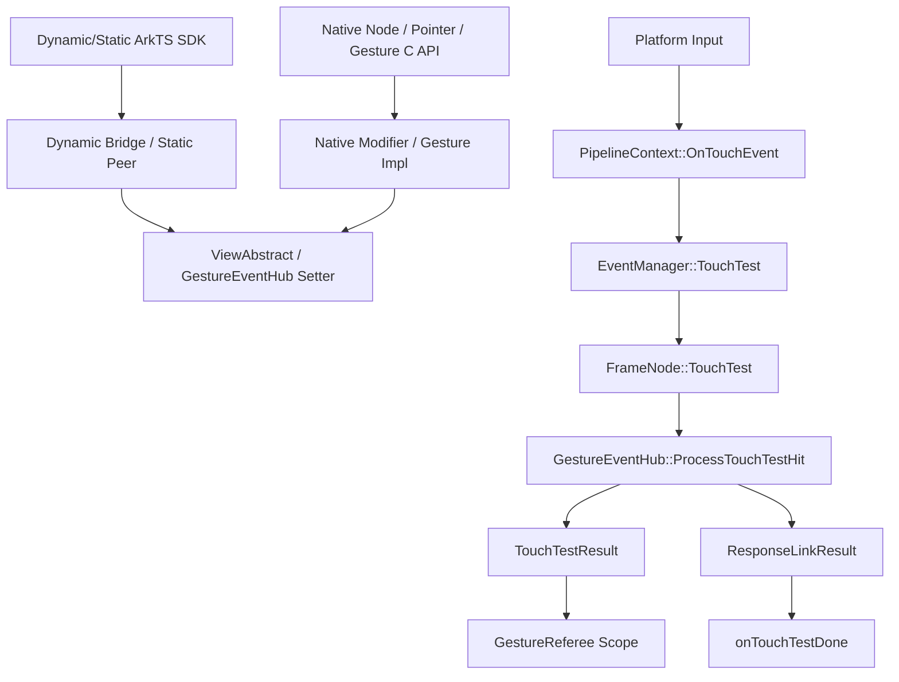
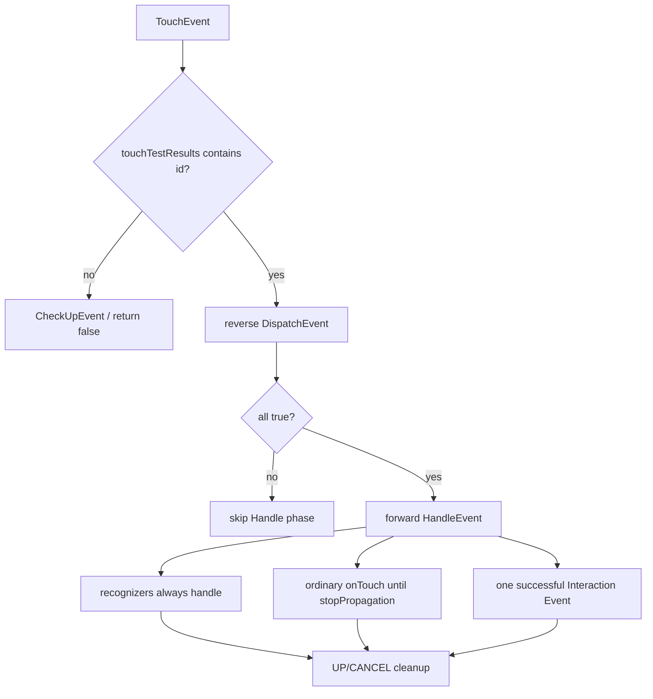
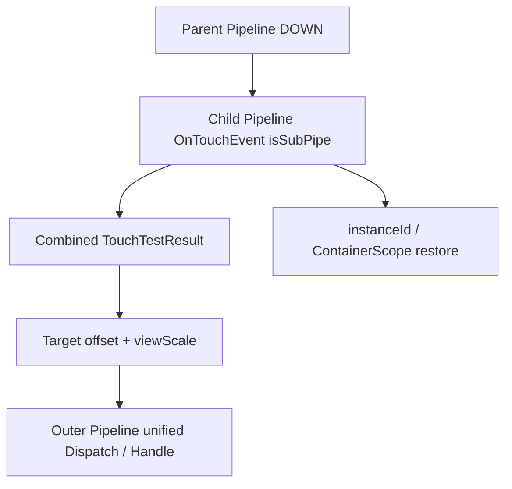
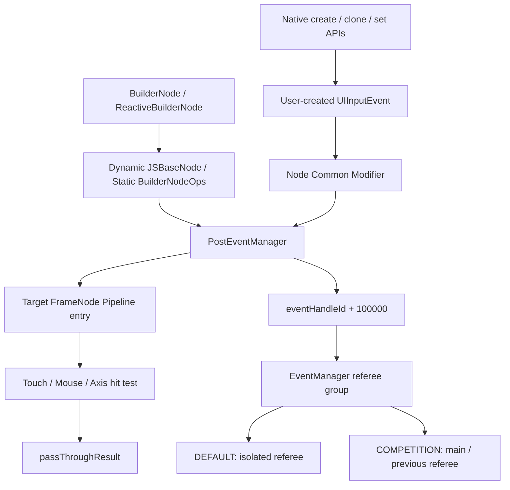
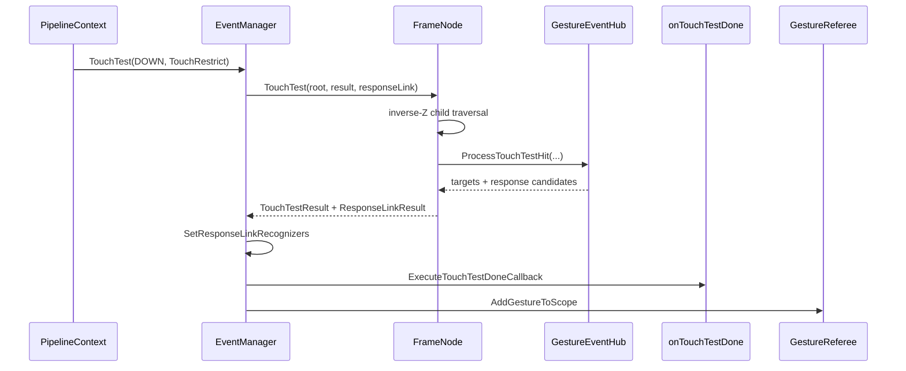
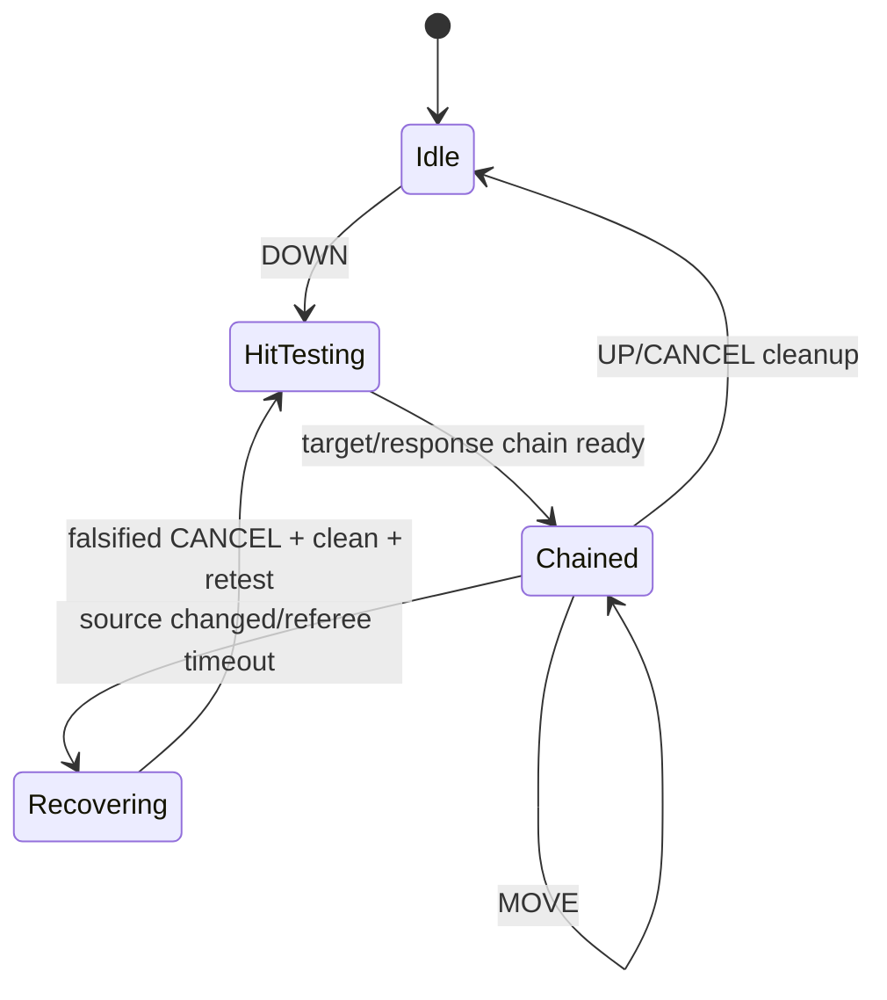
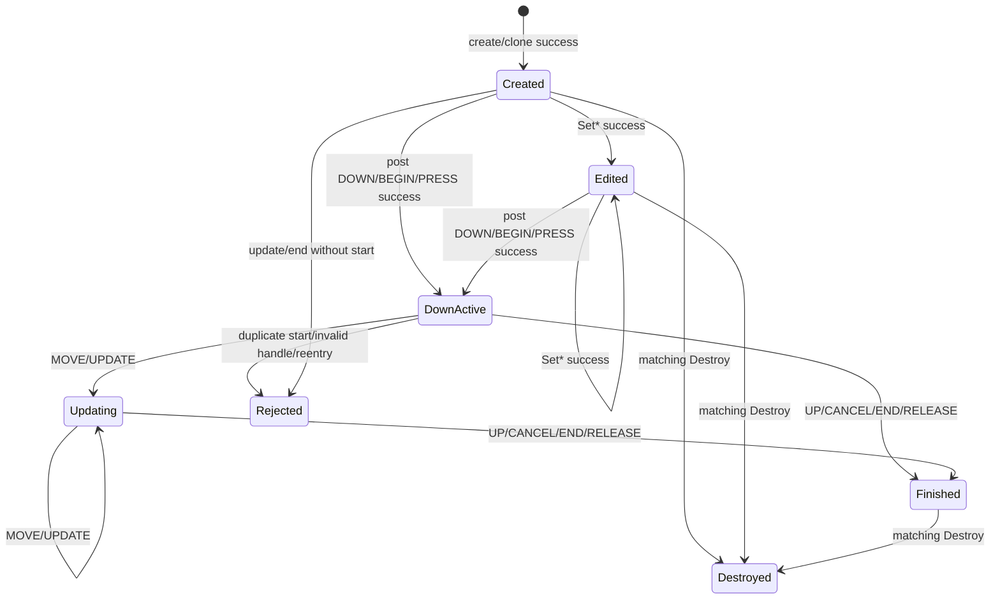
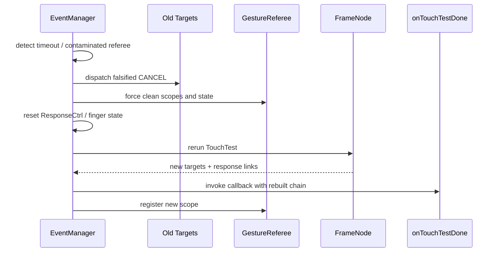

# 架构设计

> 事件分发和拦截功能域的共享架构设计，补录已有实现；覆盖命中测试、触摸序列传播、跨容器拼链，以及自定义输入事件的构造与分发。

## 设计元数据

| 字段 | 内容 |
|------|------|
| Design ID | DESIGN-Func-04-04-03 |
| 关联需求 | 已有能力补录（无独立 requirement.md） |
| 关联 Epic | 无 |
| 目标 Feature | Feat-01 命中测试、拦截与响应链构建, Feat-02 触摸事件序列分发与传播控制, Feat-03 跨容器事件分发, Feat-04 自定义输入事件构造与分发 |
| 复杂度 | 复杂 |
| 目标版本 | Dynamic API 7–26，Static API 23–26，C API 12–24 |
| Owner | ArkUI SIG |
| 状态 | Baselined（已有实现补录） |

## 需求基线

> 本功能域没有独立 proposal.md。以下结论来自已确认范围、canonical SDK、真实源码和单元测试。

| 项 | 补充说明（如需） |
|----|------------------|
| 问题陈述 | 输入事件需要从窗口管线进入组件树，按渲染顺序、响应区域和拦截策略形成稳定目标链 |
| 核心目标 | 固化 DOWN 建链、递归命中、静态/动态拦截、子节点定向转发、双链构建和异常重测行为 |
| 通道范围 | Dynamic ArkTS、Static ArkTS、Native Node/C API 与 NG 核心实现 |
| 兼容性基线 | 记录 Dynamic/Static/C API 的真实 @since、废弃关系和通道能力差异 |
| 跨域边界 | 本域定义命中和响应链生成；手势识别、组合、竞争、独占语义由 Func-04-04-06 承接 |
| Feat-02 目标 | 固化两阶段目标分发、普通触摸传播控制、VSync MOVE 批处理、历史点和真实/伪造 CANCEL 清理 |
| Feat-03 目标 | 固化 Form/Plugin 子 Pipeline 的目标链追加、目标级 offset/viewScale 坐标恢复，以及递归后的 instanceId/ContainerScope 恢复 |
| Feat-04 目标 | 固化 BuilderNode 与 Native 的 touch/mouse/axis 自定义事件创建、克隆、设置、所有权、普通/策略投递、独立 PostEvent 生命周期及 `eventHandleId` Referee 分组 |

## 上下文和现状

### 涉及仓和模块

| 仓库 | 补充架构说明 |
|------|--------------|
| sdk-js `api/@internal/component/ets/common.d.ts` | Dynamic ArkTS 公共接口、回调类型和 API 版本契约 |
| sdk-js `api/arkui/component/common.static.d.ets` | Static ArkTS 公共接口及 `undefined` 重置契约 |
| ace_engine `frameworks/bridge/declarative_frontend/jsview/js_view_abstract.cpp` | Dynamic Bridge 参数解析、回调转换和异常降级 |
| ace_engine `frameworks/bridge/arkts_frontend/koala_projects/...` | Static 生成 peer 与手写 typedNode 转发路径 |
| ace_engine `interfaces/native/` | Native Node、PointerEvent 与 Native Gesture C API 定义 |
| ace_engine `frameworks/core/interfaces/native/` | Native modifier、静态运行时接口和 ViewAbstract 转换 |
| ace_engine `frameworks/core/pipeline_ng/pipeline_context.cpp` | UI 线程事件入口、DOWN 建链、MOVE 批处理和后续分发 |
| ace_engine `frameworks/core/common/event_manager.cpp` | 命中结果缓存、响应链设置、完成回调、仲裁登记和重测 |
| ace_engine `frameworks/core/components_ng/base/frame_node.cpp` | 变换坐标、响应区、逆 Z 遍历、命中模式和子节点路由 |
| ace_engine `frameworks/core/components_ng/event/gesture_event_hub.cpp` | 事件目标收集、识别器组合与响应关联候选构建 |
| ace_engine `frameworks/core/components_ng/event/touch_event.cpp` | （Feat-02）TouchEventActuator 普通回调、传播停止、Interaction Event 和 history 转换 |
| ace_engine `frameworks/core/components_ng/gestures/recognizers/gesture_recognizer.h` | （Feat-02）识别器 Dispatch/Handle 协议和事件过滤边界 |
| ace_engine `frameworks/bridge/declarative_frontend/engine/jsi/nativeModule/arkts_native_frame_node_bridge.cpp` | （Feat-02）Dynamic TouchEvent 字段构造和传播结果回写 |
| sdk-js `api/arkui/BuilderNode.d.ts`, `BuilderNode.static.d.ets` | （Feat-04）BuilderNode/ReactiveBuilderNode 自定义输入投递签名、版本和 CompetitionStrategy 契约 |
| ace_engine `frameworks/bridge/declarative_frontend/jsview/js_base_node.cpp` | （Feat-04）Dynamic touch/mouse/axis 对象分流、策略解析和 boolean 返回 |
| ace_engine `frameworks/core/interfaces/native/implementation/builder_node_ops_accessor.cpp` | （Feat-04）Static BuilderNode 输入转换与 PostEventManager 转发 |
| ace_engine `frameworks/core/components_ng/manager/post_event/post_event_manager.cpp` | （Feat-04）目标锚点、pass-through 序列校验、动作记录、handle 偏移和投递结果 |
| ace_engine `frameworks/core/event/touch_event.cpp` | （Feat-03）跨容器目标 offset/viewScale 与 Dispatch/Handle 坐标恢复 |
| ace_engine `interfaces/native/event/ui_input_event.cpp`, `frameworks/core/interfaces/native/node/node_common_modifier.cpp` | （Feat-04）Native 输入事件创建、克隆、字段设置、销毁、普通/策略投递和错误映射 |
| ace_engine `test/unittest/core/event`, `test/unittest/core/base` | EventManager、FrameNode、UINode 和回调行为测试 |
| ace_engine `test/unittest/core/manager`, `test/unittest/interfaces/ace_ui_input_event` | （Feat-04）PostEventManager 三事件族、handle 边界与 Native C API 参数测试 |

### 调用链层级分析

| 层 | 模块 | 职责 | 修改类型 |
|----|------|------|----------|
| SDK 契约层 | `interface/sdk-js/api/.../common.d.ts`, `common.static.d.ets`, `arkui/BuilderNode*` | 定义接口签名、枚举、回调结构、开放版本和重置语义 | 存量分析；（Feat-02）补充 TouchEvent 数据与传播接口；（Feat-04）补充自定义输入投递、CompetitionStrategy 和 eventHandleId |
| Dynamic Bridge | `declarative_frontend/jsview/js_view_abstract.cpp`, `js_base_node.cpp` | 校验 JS 参数、转换事件/回调，并把 BuilderNode 输入按对象形状分流 | 存量分析；（Feat-04）补充策略降级和三事件族转发 |
| Static Frontend | `arkts_frontend/koala_projects/arkoala-arkts`, `builder_node_ops_accessor.cpp` | 生成 peer、转换静态事件并转发 PostEventManager | 存量分析；（Feat-04）补充 BuilderNode/ReactiveBuilderNode 路径与 Touch handle 偏差 |
| Native API 定义 | `interfaces/native/native_node.h`, `ui_input_event.h`, `native_gesture.h` | 暴露节点属性、拦截结果、自定义/克隆事件和 handle 设置 | 存量分析；（Feat-04）补充 API 15/24 创建、设置、销毁、策略投递与 ArkUI_ErrorCode |
| Native 桥接 | `core/interfaces/native/node/node_common_modifier.cpp`, `node/gesture_impl.cpp`, `interfaces/native/event/ui_input_event.cpp` | 将 C API 数据转为 ViewAbstract/PostEventManager 调用并返回错误码 | 存量分析；（Feat-04）补充 touch/mouse/axis 构造和策略桥接 |
| API/Model 层 | `core/components_ng/base/view_abstract.cpp` | 统一设置 HitTestMode、拦截回调、子命中回调和完成回调 | 存量分析 |
| Pipeline 入口 | `core/pipeline_ng/pipeline_context.cpp` | 保证 UI 线程、缩放事件、DOWN 触发 TouchTest、后续事件分发 | 存量分析；（Feat-02）VSync MOVE 收集、聚合与 flush；（Feat-03）子 Pipeline 递归和 instanceId 恢复；（Feat-04）pass-through MOVE 即时分发 |
| 事件管理层 | `core/common/event_manager.cpp` | 缓存每指针目标链、构建响应关联、执行完成回调、登记 Referee、异常重测 | 存量分析；（Feat-02）两阶段分发、重发与序列清理；（Feat-03）跨 Pipeline 追加链；（Feat-04）独立 PostEvent 结果和 handle Referee 映射 |
| PostEvent 管理层 | `core/components_ng/manager/post_event/post_event_manager.cpp` | （Feat-04）校验 touch/mouse/axis 序列、设置目标锚点、偏移 handle、驱动目标 Pipeline 并回传命中结果 | 存量分析 |
| 目标处理层 | `core/components_ng/event/touch_event.cpp`, `core/event/touch_event.cpp`, `core/event/touch_event.h` | 定义 DispatchEvent/HandleEvent 协议；（Feat-02）触发 onTouch、Interaction Event、history；（Feat-03）目标级跨容器坐标恢复 | 存量分析 |
| 重采样层 | `core/common/event_manager.cpp`, `core/pipeline_ng/pipeline_context.cpp` | （Feat-02）按 VSync 截止时间聚合 MOVE，执行插值或最新原始点回退 | 存量分析 |
| 节点命中层 | `core/components_ng/base/frame_node.cpp`, `ui_node.cpp` | 变换坐标、判断响应区、逆序递归、执行拦截和子路由、返回传播状态 | 存量分析 |
| 目标收集层 | `core/components_ng/event/gesture_event_hub.cpp` | 收集 TouchEventTarget/Recognizer、组合优先级手势并生成 ResponseLinkResult | 存量分析 |
| 仲裁衔接层 | `core/components_ng/gestures/gesture_referee.cpp` | 接收最终 TouchTestResult 并建立触摸作用域 | 仅定义边界 |
| 测试层 | `test/unittest/core/event`, `test/unittest/core/base`, `test/unittest/interfaces` | 验证命中、回调、错误码和恢复行为 | 存量分析 |

### 适用架构规则

| Rule ID | 适用原因 | 设计结论 | 验证方式 |
|---------|----------|----------|----------|
| OH-ARCH-LAYERING | 涉及 SDK、Bridge、API、Pipeline、节点和手势衔接 | 保持从上层接口到底层事件实现的单向调用，不从核心层依赖前端类型 | 架构评审/依赖检查 |
| OH-ARCH-SUBSYSTEM | Native API 与 ace_engine 核心跨目录协作 | 仅通过现有 NodeModifier/ViewAbstract 接口衔接，不新增系统模块依赖 | 代码评审 |
| OH-ARCH-IPC-SAF | 本 Feat 不新增 IPC/SA | N/A；多容器仍为进程内 Pipeline/Container 调用 | 集成测试 |
| OH-ARCH-API-LEVEL | 同一能力在 Dynamic/Static/C API 的版本不同 | 以 canonical SDK/C 头文件为准逐通道声明，不从内部枚举反推公共契约 | API 评审/XTS |
| OH-ARCH-COMPONENT-BUILD | 仅补录已有实现 | 不修改 BUILD.gn、bundle.json 或部件依赖 | 构建检查 |
| OH-ARCH-ERROR-LOG | C API 有参数/类型错误，核心有命中空和仲裁污染日志 | 保持现有错误码与日志，不新增语义 | 单测/hilog |

## 不涉及项承接

| 维度 | 设计结论 |
|------|----------|
| 产品源码修改 | 不涉及；当前实现即规格，偏差只记录为风险 |
| 公共 API/ABI 修改 | 不涉及；不改变签名、枚举、错误码或结构布局 |
| 生成文件修改 | 不涉及；Static generated 文件仅作为证据读取 |
| 新增依赖 | 不涉及；BUILD.gn 与 bundle.json 均无变更 |
| 手势识别与竞争 | 不在本 Feat 定义，交由 Func-04-04-06 |
| 鼠标、键盘、轴事件完整分发 | 键盘和普通鼠标/轴完整分发不展开；Feat-04 仅覆盖自定义输入构造与 PostEvent 共享的 mouse/axis 投递、handle 与 Referee 行为 |
| 数据持久化 | 不涉及；目标链和响应链仅存在于触摸序列运行期 |

## 关键设计决策

| 决策 ID | 问题 | 推荐方案 | 探索过的替代方案 | 取舍理由 | 影响 |
|---------|------|----------|-----------------|----------|------|
| ADR-1 | 何时执行全树命中测试 | 仅在正常触摸序列 DOWN 建链，MOVE/UP/CANCEL 复用每指针缓存 | 方案A：每个事件重测，目标随移动变化但开销大且序列不稳定；方案B：仅组件自己缓存，难以统一清理 | 当前实现兼顾性能与同一序列目标稳定性 | AC-1.1~1.3 |
| ADR-2 | 命中遍历使用哪种层级顺序 | 使用可见渲染子树的逆 Z 序，从最上层节点开始 | 方案A：逻辑树正序，不符合视觉覆盖；方案B：遍历后统一排序，额外分配和排序 | frameChildren 已维护 Z 序，逆序遍历直接反映视觉优先级 | AC-2.2 |
| ADR-3 | 父节点区域外是否直接剪枝 | 未裁剪时允许继续命中子树，clipEdge 才约束越界子节点 | 方案A：父区域外总是剪枝，无法支持越界交互；方案B：永不裁剪，违背视觉裁剪语义 | 当前策略同时支持越界子节点和显式裁剪 | AC-2.3, AC-2.5 |
| ADR-4 | 静态模式与动态拦截如何组合 | `onTouchIntercept` 在命中期返回模式并写回节点，作为当前及后续命中的模式 | 方案A：仅本次局部变量覆盖，不保留状态；方案B：动态回调只返回消费布尔值，表达力不足 | 复用统一 HitTestMode 分支，支持动态改变传播策略 | AC-3.1~3.5 |
| ADR-5 | 子节点自定义路由如何实现 | `onChildTouchTest` 返回 strategy+id，FORWARD 路径以 `isDispatch=true` 定向命中 | 方案A：直接修改子树顺序，副作用大；方案B：只返回是否消费，无法选择目标 | 定向递归复用 FrameNode::TouchTest，并保留 childTouchTestList 追踪 | AC-4.1~4.4 |
| ADR-6 | 实际分发目标与手势响应关联是否共用容器 | 使用 `TouchTestResult` 和 `ResponseLinkResult` 两条链，最终再把响应关联写入识别器 | 方案A：单链存储，难以区分目标与候选；方案B：回调时临时重建响应链，重复遍历 | 双链使分发、组合和并行响应职责分离 | AC-5.1~5.3 |
| ADR-7 | API 契约冲突时采用哪一来源 | 公共签名和 @since 以 canonical SDK/C 头文件为准，内部行为以真实实现和测试为准 | 方案A：沿用旧规格，存在错误版本和枚举；方案B：从 C++ 内部枚举推断公开 API，可能暴露内部值 | 权威来源分层可避免把 `HTMTRANSPARENT_SELF` 等内部能力误写为公共接口 | AC-6.1~6.5 |
| ADR-8 | 已知通道缺口如何处理 | 在兼容性和风险表中明确记录，不推测修复或修改实现 | 方案A：假定 generated 路径代表所有 Static 路径；方案B：直接修改 typedNode，超出文档补录范围 | 当前实现即规格，文档必须可追溯地呈现差异 | AC-6.6 |
| ADR-F2-1 | 目标链采用何种分发顺序 | 先逆序 DispatchEvent，全部成功后正序 HandleEvent | 方案A：单次正序循环，无法提供预分发；方案B：两个阶段同方向，不能表达祖先预处理和目标冒泡 | 相反方向形成稳定的预分发/冒泡协议，并允许扩展目标阻断整个 Handle 阶段 | Feat-02 AC-1.1~1.4 |
| ADR-F2-2 | stopPropagation 是否阻止手势识别器 | 仅停止后续非识别器普通 Handle，识别器始终收到事件 | 方案A：停止全部目标，可能破坏已建手势作用域；方案B：只标记不截断，应用无法控制冒泡 | 手势框架需要完整事件序列自行仲裁，普通应用回调仍可控制层级传播 | Feat-02 AC-2.1~2.4 |
| ADR-F2-3 | Interaction Event 与普通触摸如何协作 | 使用独立的一次成功回调标志，不受普通 stopPropagation 直接截断 | 方案A：共享停止标志，Interaction 能力随 onTouch 被意外关闭；方案B：所有目标都触发 Interaction，产生重复响应 | 独立通道保证能力可用，同时限制每事件只触发一次成功回调 | Feat-02 AC-2.3 |
| ADR-F2-4 | MOVE 如何与 VSync 对齐 | 同一 VSync 内按指针聚合为一条事件，原始点保存在 history，可用时生成重采样点 | 方案A：逐设备点同步回调，频率与帧率不一致；方案B：仅保留最后点，丢失速度/轨迹信息 | 聚合降低回调次数，history 保留原始数据，重采样提升视觉平滑度 | Feat-02 AC-4.1~4.6 |
| ADR-F2-5 | 重采样失败如何降级 | 分发本批最新原始点 | 方案A：丢弃本帧 MOVE，造成卡顿；方案B：使用前帧点，位置滞后 | 最新原始点是可观测且时间最接近当前帧的安全回退 | Feat-02 AC-4.4 |
| ADR-F2-6 | 内部 CANCEL 是否等同真实序列结束 | 使用 isFalsified 区分；伪造取消只通知目标，不执行正式结束清理 | 方案A：统一清理，内部恢复会提前终止真实触摸；方案B：不通知目标，识别器可能残留状态 | 显式标志同时满足目标复位和真实序列连续性 | Feat-02 AC-5.1~5.5 |
| ADR-F2-7 | DOWN 首轮新产生失败识别器如何恢复 | 单指场景强清后以 sendOnTouch=false 仅向识别器重发一次 | 方案A：完整重发，应用 onTouch 重复；方案B：不恢复，识别器状态污染 | 只重发识别器兼顾恢复与应用回调至多一次 | Feat-02 AC-3.2~3.3 |
| ADR-F3-1 | 子 Pipeline 是否独立分发 | 子 Pipeline 只追加目标链，统一由最外层 Pipeline 分发，并在递归结束恢复父 instanceId | 方案A：父子各分发一次，回调和识别器重复；方案B：只保留子链，丢失外层响应 | 合并链保持单一序列、单一 Referee、确定的两阶段顺序和容器作用域 | Feat-03 AC-1.1~1.6 |
| ADR-F3-2 | 跨容器坐标应存在哪里 | 把 offset/viewScale 固化到每个新增 TouchEventTarget，在 Dispatch/Handle 时生成临时副本 | 方案A：改写共享原事件，影响父目标；方案B：调用方逐目标换算，职责分散 | 目标级状态避免污染共享事件，并复用统一分发协议 | Feat-03 AC-2.1~2.5 |
| ADR-F4-1 | 独立 PostEvent 是否复用普通命中状态 | 使用 `postEventTouchTestResults_` 和 `postEventRefereeNG_` 独立维护 | 方案A：写入普通结果表，可能覆盖真实触摸序列；方案B：只调用回调不仲裁，手势状态不完整 | 独立状态机隔离后置触摸与平台输入 | Feat-04 AC-6.1~6.3 |
| ADR-F4-2 | pass-through MOVE 是否等待 VSync | 显式后置投递的 MOVE 在当前调用内立即 FlushEnd 和 Dispatch | 方案A：进入普通 MOVE 队列，API 返回前无法确定命中；方案B：丢弃 MOVE，序列不完整 | 同步投递语义要求立即产生可观察的命中结果 | Feat-04 AC-6.4~6.6 |
| ADR-F4-3 | 多次策略投递如何隔离事件 ID | 统一增加 `100000`，同时作为事件 ID 域和 Referee 分组键 | 方案A：随机 ID，无法稳定继承；方案B：只维护额外 map，不满足 SDK handle 递增契约 | 固定间隔连接 SDK、核心结果表和 Referee 映射 | Feat-04 AC-7.1~7.6 |
| ADR-F4-4 | DEFAULT 与 COMPETITION 如何映射仲裁 | DEFAULT 创建独立 Referee；COMPETITION 使用主 Referee或继承前一 handle 分组 | 方案A：两者都独立，无法竞争；方案B：两者都共用，非竞争场景互相排斥 | 当前映射直接表达“同时响应”与“竞争唯一响应” | Feat-04 AC-2.3~2.5、AC-7.3~7.5 |
| ADR-F4-5 | SDK 与 BuilderNode 实现偏差如何处理 | 以 canonical SDK 声明接口，以真实 Bridge 行为记录分流、降级和 Static handle 缺口 | 方案A：按实现删减 API，误报公共契约；方案B：假定 SDK 字段全部落地，掩盖风险 | 权威声明与实现证据必须同时可追溯 | Feat-04 AC-1.1~2.7 |
| ADR-F4-6 | Native 自定义事件如何判定可修改与可销毁 | 以 `isCreatedByUser` 作为 setter、Destroy 和 Post 的所有权门槛 | 方案A：允许修改 callback-owned 事件，破坏回调生命周期；方案B：按 wrapper 地址推断来源，不稳定 | 明确所有权可避免修改或释放框架持有的事件数据 | Feat-04 AC-3.4~3.5、AC-4.5 |
| ADR-F4-7 | API15 与 API24 触摸投递坐标是否统一 | 保持 API15 node/local 坐标与 API24 window 坐标两套既有契约 | 方案A：统一改为 window，改变 API15 行为；方案B：统一改为 local，违背策略接口 SDK | 文档补录不得通过描述统一掩盖代际差异 | Feat-04 AC-5.1~5.3 |

## 设计骨架

### 骨架范围

| 骨架项 | 目标 | 不包含 | 验证方式 |
|--------|------|--------|----------|
| 接口契约 | Dynamic/Static/C API 签名、版本、重置和错误处理 | 新增 API 或 ABI 变更 | SDK/C 头文件审查 |
| Pipeline 入口 | DOWN 建链与后续事件复用 | Feat-02 的完整分发顺序 | Pipeline 单测 |
| 节点命中 | 坐标转换、响应区、逆 Z、HitTestMode、子路由 | 具体组件自定义 Pattern 行为 | FrameNode 单测 |
| 双链构建 | TouchTestResult、ResponseLinkResult、完成回调时序 | 手势仲裁算法细节 | EventManager 单测 |
| 异常恢复 | 旧链 CANCEL、状态清理和重新命中 | 平台输入服务恢复 | 故障路径单测 |

### 骨架 Spec 拆分

| Task ID | 目标 | 受影响文件 | AC |
|---------|------|------------|-----|
| TASK-SKELETON-1 | 固化 SDK/Bridge/C API 契约 | `common.d.ts`, `common.static.d.ets`, `interfaces/native/` | AC-3.1~6.6 |
| TASK-SKELETON-2 | 固化 Pipeline→EventManager→FrameNode 命中链 | `pipeline_context.cpp`, `event_manager.cpp`, `frame_node.cpp` | AC-1.1~5.4 |
| TASK-SKELETON-3 | 固化测试追溯与通道偏差风险 | `test/unittest/core/event`, `test/unittest/core/base` | 全部 AC |

## 后续 Task 拆分

| Task ID | 目标 | 受影响文件 | 依赖 |
|---------|------|------------|------|
| Feat-01 | 命中测试、拦截与响应链构建 | `Feat-01-hit-test-intercept-response-chain-spec.md` | 本 Design |
| Feat-02 | 触摸事件序列分发与传播控制 | `Feat-02-touch-sequence-dispatch-propagation-spec.md` | Feat-01 双链模型 |
| Feat-03 | 跨容器事件分发 | `Feat-03-cross-container-event-dispatch-spec.md` | Feat-01 坐标/实例基础，Feat-02 分发模型 |
| Feat-04 | 自定义输入事件构造与分发 | `Feat-04-custom-input-event-construction-dispatch-spec.md` | Feat-01 命中模型，Feat-02 序列分发模型 |

## API 签名、Kit 与权限

### 新增 API

> 下表为已有接口盘点，不表示本次新增产品 API。

| API 签名 | 类型 | Kit | d.ts 位置 | 权限要求 | SysCap |
|----------|------|-----|------------|----------|--------|
| `touchable(value: boolean): T` | Public（Deprecated） | ArkUI | `api/@internal/component/ets/common.d.ts:19814` | 无 | SystemCapability.ArkUI.ArkUI.Full |
| `hitTestBehavior(value: HitTestMode): T` | Public Dynamic | ArkUI | `api/@internal/component/ets/common.d.ts:19828` | 无 | SystemCapability.ArkUI.ArkUI.Full |
| `onChildTouchTest(event: (value: Array<TouchTestInfo>) => TouchResult): T` | Public Dynamic | ArkUI | `api/@internal/component/ets/common.d.ts:19843` | 无 | SystemCapability.ArkUI.ArkUI.Full |
| `onTouchIntercept(callback: Callback<TouchEvent, HitTestMode>): T` | Public Dynamic | ArkUI | `api/@internal/component/ets/common.d.ts:25352` | 无 | SystemCapability.ArkUI.ArkUI.Full |
| `onTouchTestDone(callback: TouchTestDoneCallback): T` | Public Dynamic | ArkUI | `api/@internal/component/ets/common.d.ts:25408` | 无 | SystemCapability.ArkUI.ArkUI.Full |
| `hitTestBehavior(value: HitTestMode \| undefined): this` | Public Static | ArkUI | `api/arkui/component/common.static.d.ets:11593` | 无 | SystemCapability.ArkUI.ArkUI.Full |
| `onChildTouchTest(event: (...) \| undefined): this` | Public Static | ArkUI | `api/arkui/component/common.static.d.ets:11604` | 无 | SystemCapability.ArkUI.ArkUI.Full |
| `onTouchIntercept(callback: ... \| undefined): this` | Public Static | ArkUI | `api/arkui/component/common.static.d.ets:14145` | 无 | SystemCapability.ArkUI.ArkUI.Full |
| `onTouchTestDone(callback: ... \| undefined): this` | Public Static | ArkUI | `api/arkui/component/common.static.d.ets:14176` | 无 | SystemCapability.ArkUI.ArkUI.Full |
| `OH_ArkUI_PointerEvent_SetInterceptHitTestMode(event, mode)` | Public C API | ArkUI_NativeModule | `interfaces/native/ui_input_event.h:1117` | 无 | N/A |
| `OH_ArkUI_SetTouchTestDoneCallback(node, userData, callback)` | Public C API | ArkUI_NativeModule | `interfaces/native/native_gesture.h:925` | 无 | N/A |
| `TouchEvent.stopPropagation(): void` | Public Dynamic/Static | ArkUI | `common.d.ts:11028`, `common.static.d.ets:5573` | 无 | SystemCapability.ArkUI.ArkUI.Full |
| `TouchEvent.getHistoricalPoints()` | Public Dynamic/Static | ArkUI | `common.d.ts:11037`, `common.static.d.ets:5582` | 无 | SystemCapability.ArkUI.ArkUI.Full |
| `TouchEvent.preventDefault(): void` | Public Dynamic/Static | ArkUI | `common.d.ts:11055`, `common.static.d.ets:5592` | 无；不支持组件抛 100017 | SystemCapability.ArkUI.ArkUI.Full |
| `OH_ArkUI_PointerEvent_SetStopPropagation(event, bool)` | Public C API | ArkUI_NativeModule | `interfaces/native/ui_input_event.h:1145` | 无 | N/A |
| `BuilderNode.postTouchEvent(event: TouchEvent): boolean` | Public Dynamic/Static | ArkUI | `api/arkui/BuilderNode.d.ts:455`, `BuilderNode.static.d.ets:243` | 无；UIExtensionComponent 不支持 | SystemCapability.ArkUI.ArkUI.Full |
| `BuilderNode.postInputEvent(event: InputEventType): boolean` | Public Dynamic/Static | ArkUI | `api/arkui/BuilderNode.d.ts:588`, `BuilderNode.static.d.ets:324` | 无；UIExtensionComponent 不支持 | SystemCapability.ArkUI.ArkUI.Full |
| `BuilderNode.postInputEventWithStrategy(event, strategy?): boolean` | Public Dynamic/Static | ArkUI | `api/arkui/BuilderNode.d.ts:636`, `BuilderNode.static.d.ets:355` | 无；UIExtensionComponent 不支持 | SystemCapability.ArkUI.ArkUI.Full |
| `TouchEvent/MouseEvent/AxisEvent.eventHandleId` | Public Dynamic/Static | ArkUI | `common.d.ts:10403,11092,11253`, `common.static.d.ets:5123,5609,5702` | 无 | SystemCapability.ArkUI.ArkUI.Full |
| API15 `CreateClonedEvent/DestroyClonedEvent/Set*/PostClonedEvent` | Public C API | ArkUI_NativeModule | `interfaces/native/ui_input_event.h:1427-1522,2133-2148` | 无；返回 int32_t/ArkUI_ErrorCode | N/A |
| API24 `CreateClonedPointerEvent/CreatePointerEvent/DestroyClonedPointerEvent` | Public C API | ArkUI_NativeModule | `interfaces/native/ui_input_event.h:1372-1403` | 无；返回 ArkUI_ErrorCode | N/A |
| API24 `OH_ArkUI_ClonedEvent_Set*` | Public C API | ArkUI_NativeModule | `interfaces/native/ui_input_event.h:1538-2117` | 无；返回 ArkUI_ErrorCode | N/A |
| `OH_ArkUI_PointerEvent_PostClonedEventWithStrategy(node, event, strategy)` | Public C API | ArkUI_NativeModule | `interfaces/native/ui_input_event.h:1424` | 无；返回 ArkUI_ErrorCode | N/A |
| `OH_ArkUI_ClonedEvent_SetHandleId(event, eventHandleId)` | Public C API | ArkUI_NativeModule | `interfaces/native/ui_input_event.h:1830` | 无；返回 ArkUI_ErrorCode | N/A |

### 变更/废弃 API

| 原有 API | 变更类型 | 新 API | 迁移说明 |
|----------|----------|--------|----------|
| `touchable(value: boolean)` | API 9 废弃 | `hitTestBehavior(value: HitTestMode)` | `true` 场景使用 Default，禁用自身响应需按目标层级选择 None/BlockDescendants 等公开模式 |

## 构建系统影响

### BUILD.gn 变更

```text
文件路径: 无
变更说明: Feat-01/Feat-02/Feat-03/Feat-04 仅补录规格与设计，不修改任何构建目标、deps、public_deps 或 data_deps。
```

### bundle.json 变更

无新增 component、外部依赖或 bundle 配置变更。

## 可选设计扩展

### 架构图



#### 触摸序列分发架构图（Feat-02）



#### 跨容器事件分发架构图（Feat-03）



#### 自定义输入事件构造与分发架构图（Feat-04）



### 数据流/控制流

| 步骤 | 调用方 | 被调用方 | 数据/接口 | 说明 |
|------|--------|----------|-----------|------|
| 1 | 平台输入 | PipelineContext | TouchEvent | UI 线程接收并按 viewScale 转换 |
| 2 | PipelineContext | EventManager | TouchEvent + TouchRestrict | DOWN 触发命中，后续事件走缓存分发 |
| 3 | EventManager | FrameNode | global/local/revert point | 从根节点递归命中 |
| 4 | FrameNode | onTouchIntercept | TouchEventInfo | 动态模式先于子节点递归 |
| 5 | FrameNode | onChildTouchTest | Array<TouchTestInfo> | 可选定向子节点 |
| 6 | FrameNode | GestureEventHub | newComingTargets | 收集自身事件目标和识别器 |
| 7 | GestureEventHub | EventManager | TouchTestResult + ResponseLinkResult | 两条链分别返回 |
| 8 | EventManager | onTouchTestDone | BaseGestureEvent + recognizers | 响应链设置完成后回调 |
| 9 | EventManager | GestureReferee | TouchTestResult | 回调后加入对应指针作用域 |
| 10 | Parent PipelineContext | Child PipelineContext | TouchEvent + isSubPipe | （Feat-03）递归追加子目标，不独立分发 |
| 11 | TouchEventTarget | DispatchEvent/HandleEvent | 临时坐标事件副本 | （Feat-03）按目标 offset/viewScale 恢复局部坐标 |
| 12 | BuilderNode Bridge/Native API | UIInputEvent/PostEventManager | InputEventType + CompetitionStrategy | （Feat-04）创建、克隆或解析 touch/mouse/axis 后校验转发 |
| 13 | PostEventManager | PipelineContext/EventManager | passThrough event + postEventNodeId | （Feat-04）目标子树重新命中并回传 boolean |
| 14 | EventManager | GestureReferee map | eventHandleId/100000 + isNewReferee | （Feat-04）创建独立 Referee 或继承主/前级 Referee |

### 时序设计



### 数据模型设计

```cpp
using TouchTestResult = std::list<RefPtr<TouchEventTarget>>;
using ResponseLinkResult = std::list<RefPtr<NGGestureRecognizer>>;

struct TouchRestrict {
    TouchRestrict::TouchRestrictType forbiddenType;
    SourceType sourceType;
    SourceTool sourceTool;
    TouchEvent touchEvent;
    std::list<std::string> childTouchTestList;
};
```

| 数据 | 创建方 | 存储方 | 生命周期 | 说明 |
|------|--------|--------|----------|------|
| TouchRestrict | PipelineContext | 调用栈 + EventTarget | 单次命中/目标使用期 | 传递来源、工具和限制信息 |
| TouchTestResult | FrameNode/GestureEventHub | EventManager `touchTestResults_[id]` | DOWN 到 UP/CANCEL/清理 | 实际分发与仲裁目标 |
| ResponseLinkResult | GestureEventHub | 命中调用栈，后写入识别器 | 单次建链 | 并行/关联响应候选 |
| onTouchTestDoneFrameNodeList | FrameNode | EventManager | 单次命中或重测 | 仅登记存在完成回调的节点 |

#### 触摸序列数据模型（Feat-02）

```cpp
struct TouchEvent {
    TouchType type;
    int32_t id;
    std::vector<TouchEvent> history;
    bool isInterpolated = false;
    bool isFalsified = false;
    bool passThrough = false;
};

struct SequenceRuntimeState {
    std::unordered_map<size_t, TouchTestResult> touchTestResults;
    std::unordered_map<int32_t, int32_t> downFingerIds;
    std::unordered_map<int32_t, std::vector<TouchEvent>> historyPointsById;
};
```

| Feat-02 数据 | 生产方 | 消费方 | 生命周期 | 约束 |
|---------------|--------|--------|----------|------|
| 聚合 MOVE | PipelineContext | EventManager | 单个 VSync | 每指针最多一条待分发事件 |
| history | Pipeline/EventManager | TouchEventActuator/API | 当前帧或必要跨帧样本 | 非 MOVE 清理跨帧缓存 |
| isFalsified | EventManager | CheckUpEvent/结束清理 | 单次内部取消 | true 不等同真实序列终结 |
| sendOnTouch | EventManager | DispatchTouchEventToTouchTestResult | 单次分发 | false 时仅识别器处理 |

#### 跨容器事件数据模型（Feat-03）

```cpp
struct CrossContainerTargetState {
    Offset subPipelineGlobalOffset;
    float viewScale = 1.0f;
};
```

| Feat-03 数据 | 生产方 | 消费方 | 生命周期 | 约束 |
|---------------|--------|--------|----------|------|
| subPipelineGlobalOffset/viewScale | EventManager append 分支 | TouchEventTarget | 合并目标链存活期 | 仅标准系统且 offset 非零时转换 |
| needAppend/isSubPipe | Parent/Child PipelineContext | EventManager | 单次 DOWN 建链 | 子 Pipeline 只追加目标，不独立分发 |
| instanceId/ContainerScope | PipelineContext/EventManager | 子 Pipeline 回调与目标解析 | 单次递归调用 | 子递归结束后恢复父容器实例 |

#### 自定义输入事件构造与分发数据模型（Feat-04）

```cpp
constexpr int32_t EVENT_HANDLE = 100000;

struct ArkUI_UIInputEvent {
    ArkUI_UIInputEvent_Type inputType;
    ArkUIEventTypeId eventTypeId;
    void* inputEvent;
    bool isCreatedByUser = false;
};

struct ArkUITouchEvent {
    ArkUITouchPoint actionTouchPoint;
    ArkUITouchPoint* touchPointes;
    uint32_t touchPointSize;
    ArkUIHistoryTouchEvent* historyEvents;
    uint32_t historySize;
    int32_t eventHandleId;
};

struct PostEventRuntimeState {
    std::unordered_map<int32_t, TouchTestResult> postEventTouchTestResults;
    RefPtr<GestureReferee> postEventReferee;
    std::unordered_map<int32_t, RefPtr<GestureReferee>> refereeByHandleGroup;
    std::vector<PostEventAction> touchActions;
    std::vector<PostMouseEventAction> mouseActions;
    std::vector<PostAxisEventAction> axisActions;
    std::set<int32_t> activeTargetNodeIds;
};
```

| Feat-04 数据 | 生产方 | 消费方 | 生命周期 | 约束 |
|---------------|--------|--------|----------|------|
| user-created wrapper/payload | API15/24 create/clone | setter、Destroy、Post API | 创建成功至匹配 Destroy | `isCreatedByUser=true`；callback-owned 事件不可修改/销毁/投递 |
| touchPointes/historyEvents | Native create/clone/setter | NodeCommonModifier/PostEventManager | wrapper 生命周期内 | 空白 touch 固定 10 个触点槽；当前 clone history 存在栈地址生命周期风险 |
| postEventTouchTestResults | PostEventTouchTest | PostEvent Dispatch/FlushEnd | DOWN 到 UP/CANCEL | 与普通 touchTestResults 隔离 |
| postEventNodeId | PostEventManager | EventTarget/Recognizer 坐标逻辑 | 单次转发事件 | 作为目标局部坐标锚点 |
| eventHandleId | BuilderNode/C API/PostEventManager | EventManager | 一次策略转发序列 | 非负，内部增加 100000 |
| refereeByHandleGroup | EventManager | Touch/Mouse/Axis 命中和清理 | handle 分组存活期 | key=eventHandleId/100000；可共享同一 Referee |
| passThroughResult | EventManager | PostEventManager/BuilderNode | 单次投递 | 表示是否命中响应目标 |

### 算法与状态机



命中算法核心顺序：

1. 校验节点 active/enabled 和响应区域。
2. 执行动态 `onTouchIntercept`；特定鼠标/hover 输入跳过。
3. 非阻断模式下执行 `onChildTouchTest` 定向路由。
4. 按逆 Z 序递归普通子节点，并解释 STOP_SIBLINGS/BLOCK_HIERARCHY 等返回值。
5. 允许自身参与时调用 `GestureEventHub::ProcessTouchTestHit`。
6. 合并目标链，组合最终识别器，返回传播结果。

#### 自定义输入事件状态机（Feat-04）



BuilderNode 与 Native Post API 都依赖完整事件序列。普通 API15 触摸投递使用 node/local 坐标，API24 策略触摸投递使用 window 坐标；DEFAULT 设置 `isNewReferee=true`，COMPETITION 设置为 false。证据：`frameworks/core/interfaces/native/node/node_common_modifier.cpp:9486-9572`；`frameworks/core/components_ng/manager/post_event/post_event_manager.cpp:56-145,389-458`。

### 测试性设计

| 测试层级 | 测试目标 | Mock 策略 | 验证方式 |
|----------|----------|-----------|----------|
| SDK 契约 | 签名、@since、deprecated、枚举范围 | 无 | 文本/API 检查 |
| Bridge 单测 | undefined、非法返回、回调转换 | Mock JS callback/VM | Dynamic/Static Bridge 测试 |
| FrameNode 单测 | 逆 Z、区域、模式、子路由 | Mock FrameNode/GestureEventHub | `frame_node_test_ng*` |
| EventManager 单测 | 双链、完成回调、重测 | Mock TouchEventTarget/Recognizer | `event_manager_test_ng*` |
| 跨容器 Pipeline 单测 | 子 Pipeline 递归、needAppend、offset/viewScale、instanceId 恢复 | Mock Parent/Plugin Pipeline | `pipeline_context_test_ng*`、`event_manager_test_ng*` |
| BuilderNode 动静态差异测试 | PostEvent/PostTouchEvent、timestamp、pressure、boolean 和 UIExtension 契约 | 构造同 ID/时间、不同 ID、dispose/空数组和不同 pressure/sourceTool | 比较 Dynamic/Static 返回与内部 TouchEvent |
| PostEventManager 单测 | touch/mouse/axis 序列、handle、重入和命中返回 | Mock FrameNode/Pipeline/EventManager | `post_event_manager_test_ng.cpp` |
| Native create/set/destroy 单测 | API15/24、三类事件、10 点默认、所有权、字段边界和数组替换 | 创建/克隆 callback event，遍历 setter 边界 | 检查 payload、错误码、latest status 和 ASan |
| Native 投递/裁决单测 | node/window 坐标、DEFAULT/COMPETITION、handle、重入、序列和命中错误 | Mock FrameNode/Pipeline/EventManager/GestureReferee | 检查 isNewReferee、180004/180005 和清理状态 |
| 集成/XTS | 多窗口、多输入工具、Public API 行为 | 测试应用 | XTS/端到端 |

### 异常传播时序图



| 异常场景 | 传播结果 | 恢复 |
|----------|----------|------|
| 目标链缺失 | DispatchTouchEvent 返回 false | 等待新的 DOWN 建链 |
| Dynamic 回调返回非 number | Bridge 回退 HTMDEFAULT | 当前命中继续 |
| 子路由 strategy 无 ID | 降级 DEFAULT | 继续常规递归 |
| Referee 超时未就绪 | 旧链收到伪造 CANCEL | 清理后完整重测 |
| C API node/impl 为空 | 返回 PARAM_INVALID | 调用方修正参数 |
| BuilderNode 参数、context 或 manager 无效 | 返回 false | 修正节点/事件字段，确保节点未 dispose 后重试 |
| Native setter 接收 callback-owned event | 返回 180003 | 先通过匹配版本的 create/clone 获取 user-created event |
| Native 节点上下文异常 | 返回 180004 | 使用有效 FrameNode 并确保 Context/PostEventManager 存在 |
| 自定义投递序列、重入、handle 或命中失败 | 返回 false 或 180005 | 从起始动作发送完整序列，并修正 handle/目标状态 |

### 资源所有权矩阵

| 资源 | 创建方 | 持有方 | 销毁触发 | 实际释放 | 异常回收 |
|------|--------|--------|----------|----------|----------|
| TouchEventTarget 引用链 | GestureEventHub | EventManager | UP/CANCEL/清理 | 容器 erase 后 RefPtr 释放 | 强制清理/重测 |
| ResponseLinkResult 临时链 | GestureEventHub | 调用栈/Recognizer | 建链完成 | list 销毁或 splice | 干预策略截断 |
| touch-test-done 回调 | ViewAbstract/GestureEventHub | GestureEventHub | reset/undefined/null callback | std::function 替换释放 | 弱引用节点失效时跳过 |
| FrameNode 弱引用列表 | FrameNode | EventManager | 下一次命中 clear | WeakPtr 容器释放 | Upgrade 失败时跳过 |
| user-created UIInputEvent | API15/24 create/clone | 应用持有 wrapper；payload/数组由 Native 分配 | 匹配 Destroy API | DestroyTouch/Mouse/AxisEvent + delete wrapper | 非 user-created 返回 180003；销毁后不得复用 |
| 自定义输入序列状态 | PostEventManager | postInputEventAction_/targetNodes_ | 结束/取消动作或异常清理 | erase 对应 node/id/action | 重复起始、重入或非法顺序返回 false/180005 |
| cloned touch history | CreateClonedTouchEvent | 当前 historyEvents 指向克隆函数栈内数组 | 函数返回即失效 | DestroyTouchEvent 不释放该栈内存 | 不得描述为长期独立 history 深拷贝 |

### 接口参数规约

| 接口 | 参数 | 类型 | 合法范围 | 非法处理 | 边界说明 |
|------|------|------|----------|----------|----------|
| hitTestBehavior | value | HitTestMode | ArkTS 0~5 | Dynamic 非 number 忽略；Static undefined 重置 | 模式 4/5 自 API20 dynamic |
| onTouchIntercept | callback result | HitTestMode | ArkTS 0~5 | JS 异常/非 number 回退 Default；当前 number 不做范围校验 | 回写节点状态 |
| onChildTouchTest | strategy | TouchTestStrategy | SDK 枚举值 | 非 number 回退 DEFAULT | 非 DEFAULT 通常需有效 id |
| onChildTouchTest | id | string | 已命名候选子节点 ID | Dynamic 非 string 整体回退 DEFAULT | SDK 在 DEFAULT 时声明可选，Dynamic Bridge 更严格 |
| OH_ArkUI_SetTouchTestDoneCallback | node | ArkUI_NodeHandle | 非空有效节点 | PARAM_INVALID | callback 为空表示注销 |
| OH_ArkUI_PointerEvent_SetInterceptHitTestMode | event | ArkUI_UIInputEvent* | 非空且支持事件类型 | 参数或类型错误 | 当前实现不额外验证 mode 范围 |
| postTouchEvent | event/coordinates | TouchEvent/number | 有效 touches/changedTouches；px；父坐标/仿射转换 | 无效节点、事件或上下文返回 false | Dynamic 与 Static 使用不同内部 PostEvent 路径 |
| postInputEvent | event | TouchEvent/MouseEvent/AxisEvent | 完整事件；touch 使用窗口坐标与完整序列 | 无效参数/上下文返回 false | Dynamic 按 touches/scrollStep 形状分流 |
| postInputEventWithStrategy | event | TouchEvent/MouseEvent/AxisEvent | 完整事件，窗口坐标为 px | 无效参数/上下文返回 false | Dynamic 按 touches/scrollStep 形状分流 |
| postInputEventWithStrategy | competitionStrategy | DEFAULT/COMPETITION | 0/1，缺失默认 0 | Dynamic/Static 非 COMPETITION 值按 DEFAULT | DEFAULT 创建独立 Referee |
| postInputEventWithStrategy | eventHandleId | number/int | 0~INT_MAX-100000 | 负数/溢出返回 false | 内部增加 100000 并作为分组键 |
| OH_ArkUI_PointerEvent_PostClonedEventWithStrategy | event | ArkUI_UIInputEvent* | 用户创建/克隆 touch/mouse/axis | 参数、克隆、组件、命中状态映射错误码 | 非 COMPETITION 枚举按 DEFAULT |
| OH_ArkUI_ClonedEvent_SetHandleId | eventHandleId | int32_t | >=0 | 负数返回 PARAM_INVALID | 非克隆返回 NOT_CLONED |
| Native create/clone/destroy | event/output/type | UIInputEvent 指针/枚举 | API15 touch；API24 touch/mouse/axis；user-created | 401/180003/180006 | 空白 touch 固定 touchPointSize=10 |
| OH_ArkUI_ClonedEvent_Set* | event/value/index | 指针/数值 | user-created；index<touchPointSize；按字段范围 | 401/180003/180006 | API15 旧 setter 校验弱于 API24 |
| Native cloned post | node/event/strategy | NodeHandle/UIInputEvent/enum | 有效 FrameNode/Context/Manager、完整事件序列 | 401/180003/180004/180005 | API15 用 nodeX；API24 策略用 windowX |

### 线程与并发模型

| 操作 | 发起线程 | 回调线程 | 跨进程边界 | 线程安全 | 重入约束 |
|------|----------|----------|------------|----------|----------|
| Pipeline 触摸入口 | UI 线程 | UI 线程 | 否 | Pipeline 串行 | 输入监控伪造事件可递归进入，但以 falsified 标识控制 |
| onTouchIntercept | UI 线程 | UI 线程 | 否 | 同步回调 | 回调可改变节点 HitTestMode，影响当前遍历 |
| onChildTouchTest | UI 线程 | UI 线程 | 否 | 同步回调 | 返回结果在当前节点递归前消费 |
| onTouchTestDone | UI 线程 | UI 线程 | 否 | 同步回调 | 执行时尚未加入 GestureReferee；不得假定仲裁已开始 |
| Native callback | UI 线程 | UI 线程 | 否 | 同步事件转换 | 用户数据生命周期由调用方管理 |
| BuilderNode 自定义输入投递 | UI 线程 | UI 线程 | 否 | PostEventManager 串行 | WithStrategy 用 targetNodes_ 阻止同目标递归重入 |
| Native create/set/destroy | 调用线程 | N/A | 否 | user-created 对象无内部并发保护 | 调用方不得并发 setter/destroy 同一事件 |
| Native 节点投递 | UI/主线程节点上下文 | UI 线程同步分发 | 否 | 依赖 FrameNode Context 与 PostEventManager | handle/序列按 node 和 event ID 管理 |
| 子 Pipeline 递归 | UI 线程 | UI 线程 | 否 | 共享 EventManager 串行 | 递归结束后必须恢复父 instanceId/ContainerScope |

并发结论：本 Feat 无后台线程共享数据；线程安全依赖 UI 线程串行约束。回调重入造成的属性变化按当前同步调用栈生效。

## 详细设计

### 触摸入口与 DOWN 建链

`PipelineContext::OnTouchEvent` 位于 `frameworks/core/pipeline_ng/pipeline_context.cpp:3801`。入口先处理输入监控、分布式 UI、坐标缩放和来源变化；在 `TouchType::DOWN` 分支构造 `TouchRestrict`，于 `pipeline_context.cpp:3915-3942` 调用 `EventManager::TouchTest`。MOVE 通常进入批处理列表并请求帧，非 MOVE 事件在 `pipeline_context.cpp:4086` 进入分发。

`EventManager::TouchTest` 位于 `frameworks/core/common/event_manager.cpp:112`。它清理旧仲裁上下文，调用根 `FrameNode::TouchTest`，再依次执行：

1. `SetResponseLinkRecognizers`；
2. `ExecuteTouchTestDoneCallback`；
3. `ProcessTouchTestWithReferee`，把 `TouchTestResult` 登记到对应指针作用域。

此顺序由 `event_manager.cpp:152-183` 固化。

### FrameNode 递归命中

`FrameNode::TouchTest` 位于 `frameworks/core/components_ng/base/frame_node.cpp:3888`。节点先校验 active/enabled，刷新变换矩阵与响应区域，再按如下优先级执行：

- `onTouchIntercept` 动态模式；
- `onChildTouchTest` 定向子节点；
- `frameChildren_` 逆序普通递归；
- 当前节点 `GestureEventHub::ProcessTouchTestHit`；
- 手势目标组合和传播结果返回。

逆序遍历入口位于 `frame_node.cpp:4015`。父区域外是否剪枝取决于裁剪和子节点命中，相关判断位于 `frame_node.cpp:3928-3948`。

### 命中模式与传播结果

公共 `HitTestMode` 定义在 Dynamic `interface/sdk-js/api/@internal/component/ets/enums.d.ts:3549-3623`，公开六种模式。框架内部 `event_constants.h:38` 还包含 `HTMTRANSPARENT_SELF`，仅供内部流程使用。

命中模式最终映射为 `HitTestResult`：OUT_OF_REGION、BUBBLING、STOP_BUBBLING、BLOCK_HIERARCHY、STOP_SIBLINGS。它们不仅表达“是否命中”，还控制父链和兄弟遍历，具体分支见 `frame_node.cpp:4019-4168`。

### 动态拦截与子节点路由

`FrameNode::TriggerOnTouchIntercept` 位于 `frame_node.cpp:7341`，构造 TouchEventInfo、转换本地坐标并调用回调；结果在 `frame_node.cpp:7388` 写回节点 HitTestMode。`FrameNode::TouchTest` 在 MOUSE_BUTTON 和 HOVER_ENTER 时跳过该回调，见 `frame_node.cpp:3970`。

`onChildTouchTest` 在动态模式未阻断子树时执行。FORWARD/FORWARD_COMPETITION 通过 `GetDispatchFrameNode` 定位命名节点，再以 `isDispatch=true` 调用其 TouchTest，见 `frame_node.cpp:3980-4005`。strategy 非 DEFAULT 但 ID 为空时回退 DEFAULT。

### 目标链与响应链

`TouchTestResult` 定义于 `frameworks/core/event/touch_event.h:232`，保存 `TouchEventTarget`。`ResponseLinkResult` 由 GestureEventHub 收集叶子识别器和组合关系；`gesture_event_hub.cpp:573-607` 负责把候选加入结果。

EventManager 在 `event_manager.cpp:2748` 把 ResponseLinkResult 递归写入最终识别器。完成回调由 `event_manager.cpp:639` 执行，只遍历在命中过程中通过 `FrameNode::AddNodeToRegisterTouchTest` 登记的节点，登记条件见 `frame_node.cpp:3867-3881`。

### 多通道接口转换

Dynamic Bridge 位于 `frameworks/bridge/declarative_frontend/jsview/js_view_abstract.cpp`：

- `onTouchIntercept`：`11842-11876`，undefined/非函数清空，异常或非 number 返回 Default；
- `onTouchTestDone`：`11979-11995`，undefined/非函数清空；
- `hitTestBehavior`：`12198-12206`，非 number 忽略；
- `onChildTouchTest`：`12209-12248`，严格解析 object、strategy 和 id。

Static canonical 接口允许 undefined 重置；生成 peer 已转发四接口，但手写 `ArkBaseNode.ets:96-102` 的 `onChildTouchTest` 当前为空实现，应视为已知路径缺口。

Native 入口通过 `node_common_modifier.cpp` 和 `gesture_impl.cpp` 落到 ViewAbstract/GestureEventHub。不同入口的枚举范围校验不完全一致，必须按各函数真实错误行为记录。

### 异常清理与重测

`EventManager::CheckRefereeStateAndReTouchTest` 位于 `frameworks/core/common/event_manager.cpp:380`。当距上次事件达到清理阈值且当前 Referee 未就绪时：

1. 向旧链发送伪造 CANCEL；
2. 强制清理 Referee、ResponseCtrl 和指针状态；
3. 重新调用 FrameNode::TouchTest；
4. 重新设置响应链并执行 onTouchTestDone；
5. 将新目标加入 Referee 作用域。

该恢复路径保证污染状态不会无限延续，但回调可能在同一输入恢复过程中再次触发，调用方不得假定每个物理 DOWN 最多一次完成回调。

### 两阶段目标分发

Feat-02 的主分发入口为 `frameworks/core/common/event_manager.cpp:1208`。`DispatchTouchEvent` 查询 `touchTestResults_[id]` 后，先通过 `DispatchMultiContainerEvent` 对链表执行逆序 `DispatchEvent`，见 `event_manager.cpp:1121`。只有所有目标都返回 true，才进入 `DispatchTouchEventAndCheck` 并在 `event_manager.cpp:1528` 正序执行 Handle 阶段。

`TouchEventTarget` 在 `frameworks/core/event/touch_event.h:162-178` 定义两阶段协议：`DispatchEvent=false` 表示停止整个事件分发，`HandleEvent=false` 表示停止冒泡。当前内建 `TouchEventActuator::DispatchEvent`（`touch_event.cpp:23`）和 `NGGestureRecognizer::DispatchEvent`（`gesture_recognizer.h:166`）恒返 true，因此普通 ArkTS onTouch 的传播控制发生在 Handle 阶段。

### 普通触摸、识别器与 Interaction Event

`DispatchTouchEventToTouchTestResult` 对目标类型采用不同策略：

1. 所有 `NGGestureRecognizer` 无条件调用 Handle；
2. 非识别器目标仅在 `isStopTouchEvent=false && sendOnTouch=true` 时调用普通 Handle；
3. Interaction Event 使用独立的 `isTriggeredInteractionEvent`，在 `sendOnTouch=true` 时寻找第一个返回 true 的目标。

`TouchEventActuator::TriggerTouchCallBack` 在 `frameworks/core/components_ng/event/touch_event.cpp:88` 返回 `!event.IsStopPropagation()`。因此 `stopPropagation` 只控制后续普通目标，不阻止识别器，也不直接控制 Interaction Event。

`preventDefault` 是独立状态。Dynamic SDK 在 `interface/sdk-js/api/@internal/component/ets/common.d.ts:11055-11070` 将其限定为 Hyperlink、同步调用且不支持 Modifier；它不参与 EventManager 的 `isStopTouchEvent` 判定。

### DOWN 识别器重发

`EventManager::DispatchTouchEventAndCheck` 位于 `event_manager.cpp:1381`。单指 DOWN 首轮前无失败识别器、首轮后新产生失败识别器且 Referee 未全部结束时，框架执行 `ForceCleanGestureRefereeState`，再以 `sendOnTouch=false` 重发相同事件。

第二轮只驱动识别器，普通 onTouch 与 Interaction Event 均不执行。该分支避免应用回调重复，同时让识别器从干净状态重新处理 DOWN。

### VSync MOVE 聚合与重采样

`PipelineContext::CollectTouchEventsBeforeVsync` 位于 `frameworks/core/pipeline_ng/pipeline_context.cpp:4779`，只搬移时间戳不晚于 `vsyncTime - compensationValue` 的排队事件。`ConsumeTouchEvents`/加速路径按 touch ID 聚合本批 MOVE，每个 ID 最终生成一条待分发事件，其他原始点保存在 history。

重采样由 `EventManager::GetResampleTouchEvent` 等路径执行，关键入口位于 `frameworks/core/common/event_manager.cpp:2809`。成功时生成 `isInterpolated=true` 的点；目标时间无效、插值关闭、display ID 不一致或计算失败时，回退本批最新原始点。非 MOVE 在 `pipeline_context.cpp:3912` 清除该 ID 的跨帧 history。

SDK 在 `common.d.ts:10983-11053` 明确：非注入场景中 `changedTouches` 可为屏幕刷新率重采样点，`touches` 保留设备上报率数据；`getHistoricalPoints()` 仅在 onTouch 同步调用期有效。

### Flush 批次标记

`EventManager::FlushTouchEventsBegin/End` 位于 `event_manager.cpp:966-1019`，向目标链广播批次开始/结束。`TouchEventActuator::OnFlushTouchEventsEnd` 将内部标志置 true，`CreateTouchEventInfo` 在下一次回调设置 `touchEventsEnd=true` 后立即复位，见 `touch_event.cpp:182`。

该标志没有对应公开 SDK 字段。当前 `PipelineContext::FlushTouchEvents` 的 Begin 调用使用成员队列，而 End 使用本地待分发批次，且 End 在最后一条生成事件分发前广播给批次所有目标；多指场景的具体可见落点缺少端到端测试，应作为内部实现和验证风险，而非公共 API 承诺。

### 序列终结与取消粒度

真实非伪造 UP/CANCEL 在 `event_manager.cpp:1263` 清理识别器状态、NG/旧 Referee scope、按下指针和（`sendOnTouch=true` 时）目标链；所有 scope 为空后重置 ResponseCtrl。

`isFalsified=true` 的事件跳过正式结束清理，用于内部通知。取消粒度包括：

- 通用异常恢复：向全部当前 down finger 发送伪造 CANCEL；
- 触控笔拦截：先删除当前 ID 的目标与 scope，再通知仍登记指针；
- 拖拽开始：对相关目标整体取消并清空链；
- 单目标移除：仅向指定 target 发送无 history 的伪造 CANCEL，并删除对应 iterator（`event_manager.cpp:1559`）。

### Feat-02 多通道差异

Dynamic Bridge 在 `arkts_native_frame_node_bridge.cpp:1289-1349` 从 touches/changedTouches 构造事件；只有 changedTouches 非空时设置必填 type，属于 SDK/实现偏差。Static `TouchEventHandwritten` 位于 `arkts_frontend/.../src/component/common.ets:989-1035`，当前缺少 API 24 的 eventHandleId，并在不支持 preventDefault 时抛通用 Error，而非 SDK 声明的 BusinessError 100017。

Native Node onTouch 在 `frameworks/core/interfaces/native/node/node_common_modifier.cpp:13125-13142` 只把 `stopPropagation` 回写 EventInfo，未回写 `preventDefault`。公开 Native PointerEvent `SetPreventDefault` 此代码在 ace_engine 中未找到；`OH_ArkUI_PointerEvent_SetStopPropagation` 的空指针和类型错误行为以 `interfaces/native/event/ui_input_event.cpp:3119-3144` 为准。

### 跨 Pipeline 目标链追加与实例恢复

Form/Plugin 节点在命中期间把子 Pipeline 登记到父 Pipeline，并保存 plugin 全局偏移。父 `PipelineContext::OnTouchEvent` 在 `frameworks/core/pipeline_ng/pipeline_context.cpp:3998-4010` 遍历这些 Pipeline，将原始事件转换到 plugin 坐标后递归调用 `OnTouchEvent(pluginPoint, true)`。

`isSubPipe=true` 同时表示追加模式和只建链模式：它作为 `needAppend` 传入 `EventManager::TouchTest`。`event_manager.cpp:158-183` 先为子目标设置跨容器 offset/scale，再把原父链 splice 到新结果尾部，因此最终链顺序为“子目标在前、父目标在后”。结合 Feat-02 的逆序 Dispatch/正序 Handle，父目标先参与预分发，子目标先参与 Handle。

子 Pipeline 在 `pipeline_context.cpp:4013` 完成全局事件处理后提前返回，不执行无障碍 hover、MOVE 缓存或最终 Dispatch；整条合并链只由最外层 Pipeline 分发一次。追加 DOWN 也不会调用 `ActiveRecognizerManager::CheckAndCleanBeforeNewTouch`，避免把同一物理序列误判为新的全局触摸。

递归调用可能改变共享 EventManager 的 instanceId。父 Pipeline 在所有子递归结束后显式 `SetInstanceId(GetInstanceId())`，EventManager 入口再通过 `ContainerScope(instanceId_)` 保证回调解析到正确容器。

### 跨容器目标坐标恢复

`TouchEventTarget::SetSubPipelineGlobalOffset` 位于 `frameworks/core/event/touch_event.cpp:842`。它把子 Pipeline 的 `subPipelineGlobalOffset_` 和 `viewScale_` 固化到新增目标，而不是改写共享 TouchEvent。

`DispatchMultiContainerEvent` 与 `HandleMultiContainerEvent` 在标准系统、offset 非零时分别创建临时事件副本。`TouchEvent::UpdateScalePoint`（`touch_event.cpp:445-468`）对 x/y、screen 和 globalDisplay 坐标使用 `(value-offset)/scale`；scale 近零时只减 offset 并把副本 scale 置为 1。offset 为零或非 `OHOS_STANDARD_SYSTEM` 构建直接传递原事件。

该拼链/坐标机制是 Touch 专用。普通 Mouse 使用独立 MouseTestResult；Axis 使用 `axisTouchTestResults_`，均没有 `needAppend` 和目标级 subPipeline offset。鼠标左键转换为 TouchEvent 后才可能进入 Touch 链。

### 独立 PostEvent 触摸链（Feat-04）

`EventManager::PostEventTouchTest` 位于 `frameworks/core/common/event_manager.cpp:528-570`。它对指定 UINode 命中，把结果写入 `postEventTouchTestResults_`，将目标和 RecognizerGroup 递归标记为 PostEvent/ PostTouchEvent，并在执行 `onTouchTestDone` 前写入 responseLink。

`PostEventDispatchTouchEvent`（`event_manager.cpp:1596-1648`）使用独立 `postEventRefereeNG_`：DOWN 把识别器加入独立 scope，然后按逆序 Dispatch、正序 Handle；目标链缺失返回 false；UP/CANCEL 删除该 ID 的 scope 与结果，结果表为空时清理冗余 scope。`PostEventFlushTouchEventEnd` 只遍历独立结果表，不通知普通触摸链。

该独立链与 BuilderNode pass-through 路径并非同一存储模型。BuilderNode 由 PostEventManager 设置 `passThrough=true` 后调用普通 Pipeline 入口，使目标子树重新命中；独立 PostEvent 接口则直接维护专用结果与 Referee。

### BuilderNode pass-through 三事件族（Feat-04）

`PostEventManager` 位于 `frameworks/core/components_ng/manager/post_event/post_event_manager.cpp`。touch、mouse、axis 投递都会把目标节点 ID 写入 `postEventNodeId`，设置 passThrough 标记，再进入目标 FrameNode 的 Pipeline 入口。SDK 要求调用方先把目标窗口坐标转换为 px。

三类事件共享序列完整性约束，但记录的动作不同：

- Touch 记录 DOWN/UP/CANCEL 等非 MOVE 动作；
- Mouse 记录 PRESS/RELEASE/CANCEL，并独立记录 WINDOW_ENTER/LEAVE；
- Axis 记录 BEGIN/END/CANCEL 等非 UPDATE 动作。

结束动作按“目标节点 + 偏移后 ID + 事件族”清理。WithStrategy 的重复起始动作可先合成 CANCEL 再接纳新序列；`targetNodes_` 阻止同一目标在策略投递期间递归重入。

pass-through Touch MOVE 在 `pipeline_context.cpp:4031-4042` 绕过普通 VSync MOVE 队列，当前调用内立即执行 FlushEnd 和 Dispatch。EventManager 根据 Touch/Mouse/Axis 命中结果设置 `passThroughResult_`，PostEventManager 将该值作为 BuilderNode boolean 返回。因此“事件已通过序列校验并登记”不保证返回 true；只有目标子树命中响应目标时才为 true。

Dynamic `JSBaseNode::PostInputEventWithStrategy` 位于 `js_base_node.cpp:554-592`，按对象形状启发式分流：`touches` 是数组时选择 Touch，`scrollStep` 是 number 时选择 Axis，其余对象按 Mouse。开发者构造的事件缺少必填字段时可能被分到错误事件族。

### eventHandleId 与竞争 Referee（Feat-04）

PostEventManager 使用固定 `PASS_THROUGH_EVENT_ID=100000`。WithStrategy 输入 handle 为 0 时设置为 `event.id+100000`，正数 handle 则增加 100000，并令事件 ID 等于转换后的 handle。负数或大于 `INT_MAX-100000` 的值直接返回 false，避免溢出。

EventManager 以 `eventHandleId/100000` 作为 `postEventRefereeWithStrategyNG_` 的键：

1. `isNewReferee=true` 时按键创建或复用独立 GestureReferee；
2. `isNewReferee=false` 且键为 0/1 时映射主 `refereeNG_`；
3. 更深键继承前一键的 Referee，前一键不存在时当前 Referee 为空，调用路径提前退出。

DEFAULT 策略映射 `isNewReferee=true`，允许原节点和目标节点分别仲裁并同时响应；COMPETITION 映射 false，使目标转发加入主/前级 Referee 的竞争关系。

`TouchTestResultsClear`、`AxisTouchTestResultsClear` 和 `DownFingerIdsClear` 按 Referee 身份清理。若多个 handle 分组继承同一 Referee，一次结束清理可能删除整条共享链，而不是仅删除当前整数 handle。

### 自定义输入多通道接口与偏差（Feat-04）

Canonical Dynamic BuilderNode 的 `postTouchEvent`、`postInputEvent`、`postInputEventWithStrategy` 分别自 API 11、20、24；Dynamic ReactiveBuilderNode 对应版本为 22、22、24。Static BuilderNode 分别自 API 23、26.0.0、24，出现 WithStrategy 早于无策略 `postInputEvent` 的公开版本顺序；Static ReactiveBuilderNode 三者均自 26.0.0。

Dynamic/Static TouchEvent、MouseEvent、AxisEvent 均在 API 24 声明 `eventHandleId`。Dynamic 文档进一步要求取值非负、每次策略转发增加 100000，复用同一 handle 会导致异常响应。

Dynamic Bridge 对缺失、null、非 number 或非 0/1 的 CompetitionStrategy 静默回退 DEFAULT，事件参数或 Pipeline/PostEventManager 无效时返回 false。Static `builder_node_ops_accessor.cpp:155-242` 的 Touch 转换当前未读取 `eventHandleId`；`changedTouchList.front()` 在列表为空时仍有无条件访问路径。两项均作为通道风险记录，不在文档任务中修改实现。

Native `OH_ArkUI_PointerEvent_PostClonedEventWithStrategy` 和 `OH_ArkUI_ClonedEvent_SetHandleId` 自 API 24。前者仅接受用户创建/克隆的 touch、mouse、axis，并区分参数无效、非克隆、组件状态异常和无组件命中；任何非 COMPETITION 的 strategy 值按 DEFAULT。后者对 null/负 handle 返回 PARAM_INVALID，对非克隆事件返回 NOT_CLONED_POINTER_EVENT。

### Native API15/API24 创建与所有权（Feat-04）

API 15 的创建族只克隆触摸事件；API 24 的 `CreateClonedPointerEvent` 和 `CreatePointerEvent` 支持 touch、mouse、axis。API 24 空白 touch 创建固定分配 10 个触点槽并将 `touchPointSize` 设为 10，wrapper 的 `inputType` 在该路径没有显式赋值，因此调用方仍需通过 setter 完整初始化可观察字段。证据：`interfaces/native/event/ui_input_event.cpp:5374-5491,5640-5678`；`interfaces/native/event/ui_input_event_impl.h:43-50`。

创建成功的 wrapper 使用 `isCreatedByUser` 标识所有权；setter、Destroy 和 Post 接口据此拒绝 callback-owned 事件。销毁路径释放 wrapper、事件 payload、触点数组、raw pointer 和已分配按键数组，销毁后不得继续访问。证据：`interfaces/native/event/ui_input_event.cpp:5494-5551,5580-5590,5652-5658`。

### Native 克隆字段与 history 生命周期（Feat-04）

ArkUITouchEvent 源结构包含 rollAngle、pressed key、preventDefault、interceptResult 等字段，但当前 touch clone 只复制实现中显式列出的事件级字段和触点；这些未列字段不构成已复制承诺。证据：`frameworks/core/interfaces/arkoala/arkoala_api.h:358-401`；`frameworks/core/interfaces/native/node/node_common_modifier.cpp:9780-9808`。

当前 clone history 的临时 `historyEvents`/触点数组定义在克隆函数栈内，随后其地址被写入克隆 payload；函数返回后该地址不具备长期有效生命周期。因此设计要求以字段比对和 ASan/生命周期测试覆盖该路径，不把 clone 描述为 history 的完整长期深拷贝。证据：`frameworks/core/interfaces/native/node/node_common_modifier.cpp:9697-9743`。

### Native setter 分组与校验（Feat-04）

API 24 setter 分为三类：touch/mouse/axis 通用事件字段、touch 当前变化点字段，以及按 `pointerIndex` 修改 `touchPointes[]` 的逐触点字段。入口先校验空指针、`isCreatedByUser` 和事件类型，再校验非负 ID/时间/压力/面积、tilt `[-90,90]`、hand 枚举范围及 `0 <= pointerIndex < touchPointSize`。证据：`interfaces/native/event/ui_input_event.cpp:4148-5127`。

API 15 旧接口只开放 local position、local position by index、action、changed finger ID 和 finger ID by index，部分 action/finger setter 不具备 API 24 的完整范围校验。`SetPressedKeys` 在输入数组非空且长度大于 0 时释放旧数组并深拷贝新值。证据：`interfaces/native/event/ui_input_event.cpp:4904-4969,5701-5798`。

### Native 普通/策略投递与错误映射（Feat-04）

API 15 普通触摸投递用 `nodeX/nodeY` 构造 core 当前点和逐触点 x/y；API 24 策略触摸投递改用 `windowX/windowY`，并按 strategy 选择独立或竞争 referee。两代入口的坐标不能直接互换。证据：`frameworks/core/interfaces/native/node/node_common_modifier.cpp:9486-9564`；`frameworks/core/common/event_manager.cpp:612-631`。

SDK 将策略投递的事件来源限定为 API 24 的两个创建器，当前实现只检查 `isCreatedByUser`，因此 API 15 克隆事件虽可到达实现路径，也不作为公开兼容承诺。节点、FrameNode、Context 或 PostEventManager 无效映射为 180004；重入、handle 非法、序列非法、缺少 EventManager 或子树无命中等内部 false 分支均可能汇聚为 180005。证据：`interfaces/native/ui_input_event.h:1405-1408`；`interfaces/native/event/ui_input_event.cpp:5580-5590`；`frameworks/core/interfaces/native/node/node_common_modifier.cpp:9362-9395`；`frameworks/core/components_ng/manager/post_event/post_event_manager.cpp:94-145,389-458`。

## 风险和开放问题

| 项 | 类型 | 影响 | 处理方式 | Owner |
|----|------|------|----------|-------|
| 旧 Func-04-04-06-Feat-04 将 hitTestBehavior 记为 API 8、onTouchIntercept 记为 API 11，并公开 7 种模式 | API | 高 | 本设计以 canonical SDK 为准；后续维护旧规格时改为引用本 Feat | ArkUI SIG |
| Dynamic onChildTouchTest Bridge 对 DEFAULT strategy 也要求 string id，与 SDK 的可选 id 表达不完全一致 | API | 中 | 在兼容性与异常规则中显式记录，不静默调和 | ArkUI SIG |
| Static typedNode `ArkBaseNode.onChildTouchTest` 为空实现 | 架构 | 高 | 声明为当前通道能力缺口；不在文档任务中修改源码 | ArkUI SIG |
| Dynamic/Native 部分入口对枚举 number 直接 cast，范围校验不一致 | API | 中 | 每个接口独立列出非法输入行为，测试不得假定统一错误码 | ArkUI SIG |
| C API generated modifier 测试存在 disabled placeholder，桥接异常/重置覆盖不足 | 测试 | 中 | 在后续测试任务中补充，但本次不修改测试代码 | ArkUI SIG |
| onTouchIntercept 写回 HitTestMode 具有持续副作用，开发者可能误认为仅当前事件有效 | API | 中 | 在 AC、接口规格和 Gherkin 中重点声明 | ArkUI SIG |
| 重测路径可能再次触发 onTouchTestDone | 可靠性 | 低 | 回调设计需允许重复触发并保持幂等 | ArkUI SIG |
| Dynamic TouchEvent 在 changedTouches 为空时可能缺少 SDK 必填 type | API | 中 | Feat-02 明确记录偏差并补充 Bridge 验证任务 | ArkUI SIG |
| Static TouchEventHandwritten 缺少 eventHandleId，preventDefault 异常类型与 SDK 不一致 | API | 高 | 作为 Static 通道缺口记录，不在文档任务中修改实现 | ArkUI SIG |
| Native Node onTouch 未回写 preventDefault，公开 PointerEvent SetPreventDefault 在 ace_engine 中未找到 | API | 中 | Native 规格仅承诺已验证的 stopPropagation 回写 | ArkUI SIG |
| Flush Begin/End 集合非对称，多指批次的 touchEventsEnd 落点缺少端到端验证 | 测试 | 中 | 不作为公共契约；列入后续多指批次测试 | ArkUI SIG |
| getHistoricalPoints 的 Static/C API 历史点测试存在禁用或覆盖不足 | 测试 | 中 | 以核心单测与 SDK 契约为基线，补充有效桥接测试 | ArkUI SIG |
| stopPropagation 常被误解为阻止手势识别器 | 兼容性 | 中 | 在接口规格和 Gherkin 中明确只停止普通触摸 Handle | ArkUI SIG |
| 伪造 CANCEL 不执行正式清理，调用方可能误判序列已结束 | 可靠性 | 中 | 通过 isFalsified 规则和取消粒度表明确边界 | ArkUI SIG |
| BuilderNode boolean 文案可被理解为“参数已成功投递”，而实现返回目标子树是否命中 | API | 高 | Feat-04 统一按命中语义描述，并为无目标返回 false 建立验证 | ArkUI SIG |
| Static TouchEvent WithStrategy 路径未读取 API 24 `eventHandleId` | API | 高 | 记录为 Static 通道能力缺口，不推断 handle 已生效 | ArkUI SIG |
| Static Touch 转换在 `changedTouches` 为空时无条件访问首元素 | 可靠性 | 高 | 要求构造完整事件；列入 Static Bridge 边界测试，不在文档任务中修改实现 | ArkUI SIG |
| Dynamic 通过 touches/scrollStep 形状分流，缺字段对象默认按 Mouse | API | 中 | 接口规格要求完整必填字段，并补充错误形状测试 | ArkUI SIG |
| handle 继承模式按共享 Referee 批量清理，调用方可能误认为仅清理当前 handle | 兼容性 | 中 | 在规则和数据模型中明确 Referee 身份是清理粒度 | ArkUI SIG |
| Native 策略投递测试主要覆盖参数错误，缺少成功投递、竞争差异和 NO_COMPONENT_HIT 端到端验证 | 测试 | 中 | 以核心单测和 C Header 为基线，后续补充 Native 成功路径测试 | ArkUI SIG |
| Dynamic `postTouchEvent` 走旧 `PostEvent` 并执行活动序列 timestamp 去重，Static 入口走 `PostTouchEvent` 且不执行同一校验 | 兼容 | 高 | 动静态分路径测试相同 ID/timestamp、不同 ID 和 UP/CANCEL 清理后的行为，不将两条内部链合并描述 | ArkUI SIG |
| Dynamic Bridge 检查 pressure 字段却把 sourceTool 数值写入 force | 实现 | 高 | SDK 契约仍以 pressure 为准；增加 pressure/sourceTool 不同值的回归测试，本次文档补录不修改源码 | ArkUI SIG |
| API24 空白 touch 固定带 10 个触点槽，wrapper inputType 未显式赋值 | 数据 | 中 | 调用方必须设置完整 action、触点和坐标；覆盖默认容量及 getter/setter 边界测试 | ArkUI SIG |
| touch clone 遗漏部分事件字段，history 指向函数栈内数组 | 内存 | 高 | 不承诺完整长期深拷贝；以字段比对、ASan 和返回后访问测试跟踪，产品修复需独立变更 | ArkUI SIG |
| API15 普通投递使用 node/local 坐标，API24 策略投递使用 window 坐标；DEFAULT 与 COMPETITION 选择不同 referee | 兼容 | 高 | 两代入口分别构造坐标和策略用例，禁止把 local/window 或独立/竞争裁决语义互换 | ArkUI SIG |
| SDK 仅允许 API24 创建器产生的事件用于策略投递，源码只校验 user-created 标记 | API | 中 | 对外调用严格遵循 SDK；API15 clone 的实现可达性只记录为偏差，不作为支持承诺 | ArkUI SIG |
| 180005 除无命中外还覆盖重入、handle、事件序列和 EventManager 等失败 | 错误码 | 高 | 错误码文案和测试覆盖全部实际触发源，诊断时结合序列、handle、节点和 manager 状态 | ArkUI SIG |

## 设计审批

- [x] 需求基线已确认，设计覆盖 P0/P1 AC
- [x] 不涉及项已承接，N/A 和展开项都有结论
- [x] 涉及仓和模块职责清楚
- [x] 调用链层级分析完整，每层覆盖到位
- [x] 适用架构规则已识别并形成设计结论
- [x] 分层和子系统边界合规
- [x] API 变更有签名、权限、错误码和兼容性说明
- [x] BUILD.gn/bundle.json 影响明确
- [x] 设计输出和后续 Task 拆分明确
- [x] 关键设计决策有理由和影响说明
- [x] 风险和开放问题有 Owner

**结论:** 通过（已有实现补录）。
