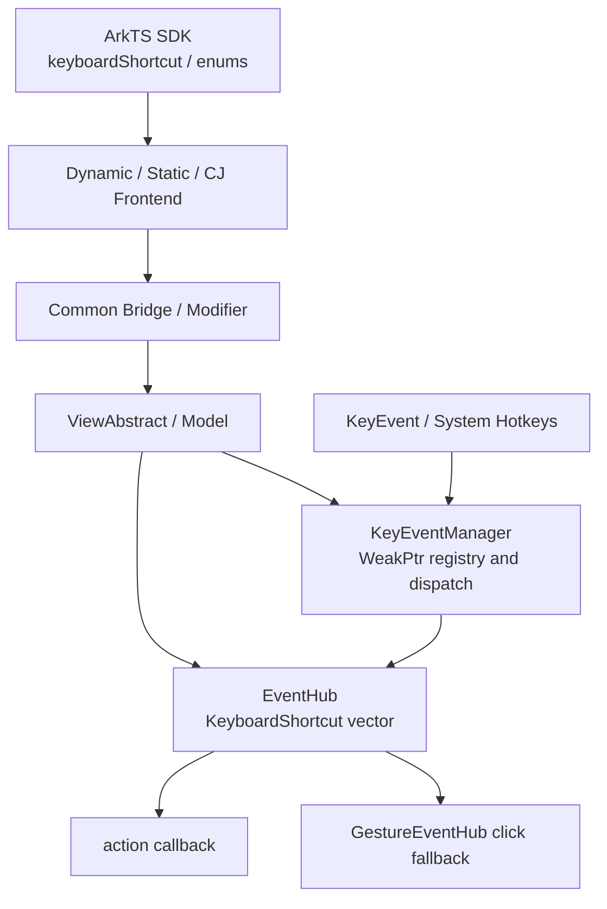
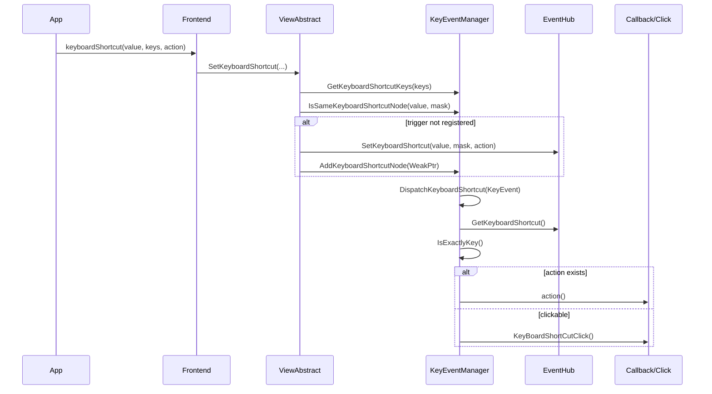
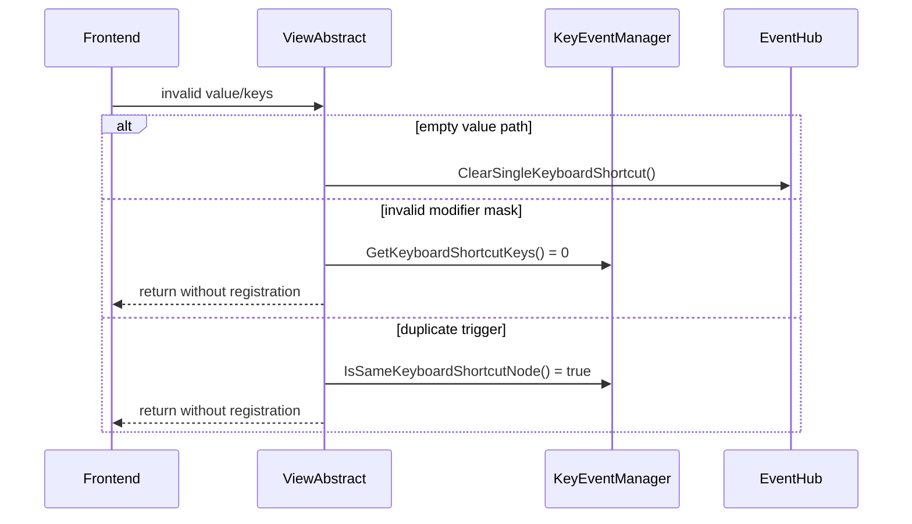

# 架构设计

> 确认目标仓和模块的架构约束、关键设计决策、Spec 拆分方向。

## 设计元数据

| 字段 | 内容 |
|------|------|
| Design ID | DESIGN-Func-04-04-04 |
| 关联需求 | 已有能力补录（无独立 requirement.md） |
| 关联 Epic | 无 |
| 目标 Feature | Feat-01 组件组合键注册与触发 |
| 复杂度 | 复杂 |
| 目标版本 | 动态 API 10/12；静态 API 23 |
| Owner | ArkUI SIG |
| 状态 | Baselined（已有实现补录） |

## 需求基线

> 需求基线详见上游规格流程。以下仅列出设计阶段需要额外强调的现有实现约束。

| 项 | 补充说明（如需） |
|----|------------------|
| 通用组件能力 | `keyboardShortcut` 定义于 `CommonMethod`，不是某个具体组件的专属事件 |
| 精确组合匹配 | 字符/功能键与全部按下键集合必须匹配，系统热键优先 |
| 节点生命周期 | 组合键存储在 EventHub，全局管理器只持有 FrameNode 弱引用 |
| 多前端兼容 | 动态、静态、CJ 与内部 Node Modifier 复用核心注册链路，但桥接输入存在现状差异 |
| 文档化边界 | 本设计仅补录现有实现，不修改 API、ABI、默认行为或产品源代码 |

## 上下文和现状

### 涉及仓和模块

| 仓库 | 补充架构说明 |
|------|--------------|
| `interface/sdk-js` | 提供动态/静态 ArkTS `keyboardShortcut`、`ModifierKey`、`FunctionKey` 的权威声明 |
| `foundation/arkui/ace_engine/frameworks/bridge/declarative_frontend` | 动态 JS 与 attributeModifier 参数解析、回调包装和 NativeModule 调用 |
| `foundation/arkui/ace_engine/frameworks/bridge/arkts_frontend` | 静态 ArkTS 生成桥和 CommonMethod Modifier 接入 |
| `foundation/arkui/ace_engine/frameworks/bridge/cj_frontend` | CJ FFI 字符键、功能键和回调接入 |
| `foundation/arkui/ace_engine/frameworks/core/components_ng` | ViewAbstract 校验、EventHub 节点局部存储、GestureEventHub 点击降级 |
| `foundation/arkui/ace_engine/frameworks/core/common` | KeyEventManager 全局弱引用注册、系统热键过滤、组合匹配与分发顺序 |
| `foundation/arkui/ace_engine/test/unittest` | 参数、注册、分发、清理、静态 Modifier 和点击降级测试 |

### 调用链层级分析

| 层 | 模块 | 职责 | 修改类型 |
|----|------|------|----------|
| 1. SDK 声明层 | `interface/sdk-js/api/@internal/component/ets/common.d.ts`、`enums.d.ts` | 定义动态 API 10/12 契约 | 已有实现补录 |
| 2. 静态 SDK 声明层 | `interface/sdk-js/api/arkui/component/common.static.d.ets` | 定义静态 API 23 Optional 契约 | 已有实现补录 |
| 3. 动态前端层 | `js_view_abstract.cpp:12276`、`ArkComponent.ts:3780` | 解析直接调用或累积 attributeModifier 列表 | 已有实现补录 |
| 4. 动态 Native 桥层 | `arkts_native_common_bridge.cpp:7711` | 将 JS value/keys/action 转为 C++ 参数 | 已有实现补录，记录风险 |
| 5. 静态/CJ 桥层 | `common_method_modifier.cpp:7281`、`cj_view_abstract_ffi.cpp:1787` | 转换静态 Optional 与 CJ FFI 参数 | 已有实现补录 |
| 6. Model/View 层 | `view_abstract_model_ng.h`、`view_abstract.cpp:7390` | 校验修饰键、拒绝全局重复、写入 EventHub | 已有实现补录 |
| 7. 节点事件存储层 | `event_hub.h:61`、`event_hub.cpp:1127` | 保存 value、bitmask、action；完成大写化和清理 | 已有实现补录 |
| 8. 全局事件管理层 | `key_event_manager.cpp:128` | 管理 FrameNode 弱引用、匹配按键、过滤系统场景和决定分发顺序 | 已有实现补录 |
| 9. 组件行为层 | `gesture_event_hub.cpp` | 无 action 时将组合键降级为组件点击 | 已有实现补录 |
| 10. 测试层 | `test/unittest/core/event/`、`test/unittest/capi/modifiers/` | 验证核心规则和通道转换 | 规格追溯补录 |

- [x] 调用链每一层都已覆盖（从 SDK 声明到组件行为与测试）
- [x] 每层职责边界清晰，无新增跨层调用
- [x] 每层修改类型明确

### 适用架构规则

| Rule ID | 适用原因 | 设计结论 | 验证方式 |
|---------|----------|----------|----------|
| OH-ARCH-LAYERING | API、桥接、View、EventHub、KeyEventManager 跨层调用 | 保持单向调用；EventHub 不依赖前端，桥接不直接操作全局列表 | 架构评审/依赖检查 |
| OH-ARCH-SUBSYSTEM | 系统热键来源于平台输入能力 | core 仅通过 InputManager 查询，不新增跨子系统依赖 | 代码评审/集成测试 |
| OH-ARCH-IPC-SAF | 本特性不含 IPC/SA | 不新增 IPC、SAF 或跨进程数据模型 | 源码审计 |
| OH-ARCH-API-LEVEL | 存在动态 API 10/12 和静态 API 23 | 只补录现有 Public API；公开 C API 未实现 | SDK 审计/XTS |
| OH-ARCH-COMPONENT-BUILD | 不涉及构建目标变化 | BUILD.gn 和 bundle.json 均无变更 | 构建文件审计 |
| OH-ARCH-ERROR-LOG | 无错误码，存在输入忽略和 ACE_KEYBOARD 日志 | 保持现有无异常抛出策略，用单测和日志定界 | 单测/hilog |

## 不涉及项承接

| 维度 | 设计结论 |
|------|----------|
| Public API/ABI 修改 | 不涉及；不改变签名、枚举值、错误码或结构体布局 |
| Native C API 新增 | 不涉及；`interfaces/native/` 中此代码在 ace_engine 中未找到 |
| 布局与渲染 | 不涉及；不写入 LayoutProperty、PaintProperty 或 RenderContext |
| 持久化与迁移 | 不涉及；组合键只存在于运行期 EventHub |
| IPC/SA | 不涉及；事件在当前进程和 PipelineContext 内处理 |
| 构建与依赖 | 不涉及；不修改 BUILD.gn、bundle.json 或外部依赖 |
| 资源与国际化 | 不涉及；`value` 为键名/字符，不读取资源或语言包 |
| 产品源代码修复 | 不涉及；识别出的桥接和去重偏差仅列入风险 |

## 关键设计决策

| 决策 ID | 问题 | 推荐方案 | 探索过的替代方案 | 取舍理由 | 影响 |
|---------|------|----------|------------------|----------|------|
| ADR-1 | 组合键应作为组件专属能力还是通用能力 | 维持 `CommonMethod.keyboardShortcut`，所有通用组件复用 ViewAbstract | 独立 `onKeyboardShortcut` 事件；每个组件单独实现；仅焦点组件支持 | 现有 API 已是通用属性，统一入口避免组件重复实现 | SDK/前端/ViewAbstract |
| ADR-2 | 组合键数据存放位置 | EventHub 保存节点局部 vector，KeyEventManager 保存 FrameNode 弱引用列表 | 全局 map 直接持有回调；FocusHub 存储；PipelineContext 持久化表 | 节点拥有回调生命周期，弱引用避免全局强持有 | EventHub/KeyEventManager |
| ADR-3 | 修饰键表示与校验 | `CTRL`/`SHIFT`/`ALT` 去重后压缩为 bitmask，最多 3 个 | 保留原数组逐次比较；使用 KeyCode 集合；允许重复后去重 | bitmask 便于左右键展开和组合匹配，非法重复可明确拒绝 | 参数校验/匹配 |
| ADR-4 | 触发匹配规则 | 最终使用 `IsExactlyKey` 校验全部按下键，系统热键优先 | 子集匹配；仅比较最终键；应用组合键覆盖系统热键 | 精确匹配避免额外按键误触，系统快捷键保持平台优先级 | 分发/安全 |
| ADR-5 | 未提供 action 时如何响应 | 可点击组件复用 `KeyBoardShortCutClick` | 无 action 时完全不处理；自动生成空回调；转为独立语义事件 | 与组件点击行为保持一致，复用既有点击链路 | GestureEventHub |
| ADR-6 | 清理语义如何区分 | 保留空字符串的单条清理语义和 attributeModifier reset-all 的全量清理语义 | 空字符串总是全清；按 value 精确删除；仅节点销毁清理 | 本文档是已有实现补录，必须忠实记录现状 | EventHub/Modifier |
| ADR-7 | 如何处理已发现的通道偏差 | 在规格、兼容性和风险表中明确记录，不在补录任务中修改 | 同步修复所有桥接；以 SDK 声明覆盖实现；忽略偏差 | 避免将修复混入文档任务，同时为后续变更提供证据 | 动态桥/CJ/去重 |

## 设计骨架

### 骨架范围

| 骨架项 | 目标 | 不包含 | 验证方式 |
|--------|------|--------|----------|
| API 契约 | 固化动态 API 10/12、静态 API 23 和枚举边界 | 新增 API | SDK 声明审计 |
| 注册模型 | 固化 ViewAbstract 校验、EventHub 存储和全局节点注册 | 修改注册算法 | 核心单测 |
| 触发模型 | 固化精确匹配、系统过滤、回调/点击路径 | 新输入设备协议 | 事件单测/集成测试 |
| 生命周期 | 固化单条、全量和离树清理 | 持久化 | EventHub/ViewAbstract 单测 |
| 通道兼容 | 固化动态、静态、CJ 和 InnerApi 差异 | 修复通道偏差 | 源码审计/Modifier 单测 |

### 骨架 Spec 拆分

| Task ID | 目标 | 受影响文件 | AC |
|---------|------|------------|----|
| TASK-SKELETON-1 | 补录组件组合键注册与触发规格 | `Feat-01-component-shortcut-registration-trigger-spec.md` | AC-1.1~AC-5.6 |

## 后续 Task 拆分

| Task ID | 目标 | 受影响文件 | 依赖 |
|---------|------|------------|------|
| TASK-04-04-04-01 | 基于现有单测验证字符键、功能键、修饰键和全局去重 | `test/unittest/core/event/event_manager_test_ng.cpp`、`short_cuts_test_ng.cpp` | Feat-01 |
| TASK-04-04-04-02 | 验证 PreIME、Web 和 ReDispatch 分发顺序 | `test/unittest/core/common/key_event_manager/key_event_manager_test.cpp` | TASK-04-04-04-01 |
| TASK-04-04-04-03 | 验证静态、动态 Modifier、CJ 和内部 Node Modifier 通道差异 | `test/unittest/capi/modifiers/common_method_modifier_test8.cpp` 及桥接源码 | TASK-04-04-04-01 |
| TASK-04-04-04-04 | 验证单条、全量和节点分离清理 | `event_hub_test_ng.cpp`、`view_abstract_model_test_two_ng.cpp` | TASK-04-04-04-01 |

## API 签名、Kit 与权限

### 新增 API

> 以下为已有 API 清单，本次不新增接口。

| API 签名 | 类型 | Kit | d.ts 位置 | 权限要求 | SysCap |
|----------|------|-----|------------|----------|--------|
| `keyboardShortcut(value: string \| FunctionKey, keys: Array<ModifierKey>, action?: () => void): T` | Public | ArkUI | `interface/sdk-js/api/@internal/component/ets/common.d.ts:24679` | 无 | SystemCapability.ArkUI.ArkUI.Full |
| `keyboardShortcut(value: string \| FunctionKey \| undefined, keys: Array<ModifierKey> \| undefined, action?: () => void): this` | Public | ArkUI | `interface/sdk-js/api/arkui/component/common.static.d.ets:13781` | 无 | SystemCapability.ArkUI.ArkUI.Full |
| `ModifierKey { CTRL, SHIFT, ALT }` | Public | ArkUI | `interface/sdk-js/api/@internal/component/ets/enums.d.ts:3657` | 无 | SystemCapability.ArkUI.ArkUI.Full |
| `FunctionKey { ESC, F1...F12, TAB, DPAD_* }` | Public | ArkUI | `interface/sdk-js/api/@internal/component/ets/enums.d.ts:3701` | 无 | SystemCapability.ArkUI.ArkUI.Full |
| `setKeyBoardShortCut(node, value, keys, length)` | InnerApi | ArkUI Internal | `frameworks/core/interfaces/arkoala/arkoala_api.h:3528` | 不对应用开放 | InnerApi |

公开 C API 设置接口：此代码在 ace_engine 中未找到。

### 变更/废弃 API

| 原有 API | 变更类型 | 新 API | 迁移说明 |
|----------|----------|--------|----------|
| 无 | 无 | 无 | 已有实现补录，无迁移要求 |

## 构建系统影响

### BUILD.gn 变更

```text
文件路径: 无
变更说明: 本次仅新增 specs 文档和注册信息，不修改产品构建目标、源码列表或依赖。
```

### bundle.json 变更

无新增 component，不修改依赖关系。

## 可选设计扩展

### 架构图



### 数据流/控制流

| 步骤 | 调用方 | 被调用方 | 数据/接口 | 说明 |
|------|--------|----------|-----------|------|
| 1 | 应用 | `CommonMethod.keyboardShortcut` | value、keys、action | 动态/静态 API 输入 |
| 2 | 前端 | Bridge/Modifier | JS/ArkTS/CJ 值 | 字符/功能键转换和回调包装 |
| 3 | Bridge | ViewAbstractModel/ViewAbstract | `std::string`、`vector<ModifierKey>`、`function<void()>` | 进入核心校验 |
| 4 | ViewAbstract | KeyEventManager | 修饰键数组、value | bitmask 编码和全局重复检查 |
| 5 | ViewAbstract | EventHub | `KeyboardShortcut` | 大写化后追加节点局部 vector |
| 6 | ViewAbstract | KeyEventManager | WeakPtr<FrameNode> | 节点级去重注册 |
| 7 | 输入系统 | KeyEventManager | KeyEvent | PreIME/ReDispatch 或直接组合键分发 |
| 8 | KeyEventManager | EventHub | 读取组合键 vector | 精确匹配并过滤状态 |
| 9 | EventHub | action/GestureEventHub | 回调或键盘点击 | 首个成功触发后返回 |

### 时序设计



### 数据模型设计

API 层：

```typescript
enum ModifierKey {
  CTRL,
  SHIFT,
  ALT
}

type ShortcutValue = string | FunctionKey;
type ShortcutAction = () => void;
```

框架层：

```cpp
struct KeyboardShortcut {
    std::string value;
    uint8_t keys = 0;
    std::function<void()> onKeyboardShortcutAction = nullptr;
};
```

| 数据 | 存储位置 | 生命周期 | 持久化 |
|------|----------|----------|--------|
| value/keys/action | EventHub `keyboardShortcut_` vector | FrameNode/EventHub 生命周期 | 否 |
| 可响应节点 | KeyEventManager `keyboardShortcutNode_` WeakPtr 列表 | PipelineContext 生命周期；reset/detach 删除 | 否 |
| 系统热键 | `IsSystemKeyboardShortcut` 静态缓存 | 进程生命周期内按首次查询初始化 | 否 |

### 算法与状态机

注册伪代码：

```text
if value is empty:
    ClearSingleKeyboardShortcut()
    return
mask = GetKeyboardShortcutKeys(keys)
if mask == 0 and value is one character:
    return
if mask == 0 and keys is non-empty and value is a function-key name:
    return
if any registered node has exact input value and mask:
    return
EventHub.SetKeyboardShortcut(uppercase(value), mask, action)
KeyEventManager.AddKeyboardShortcutNode(WeakPtr(node))
```

分发伪代码：

```text
reject when container is Security UIExtension
reject when action is not DOWN
reject when event matches a system hotkey
for node in registration order:
    skip invalid, inactive, or disabled node
    for shortcut in node.EventHub:
        require value match and IsExactlyKey
        if action exists: invoke and return true
        if component is clickable: synthesize click and return true
return false
```

### 测试性设计

| 测试层级 | 测试目标 | Mock 策略 | 验证方式 |
|----------|----------|-----------|----------|
| EventHub 单测 | 大写存储、多记录、单条/全量清理 | 直接构造 EventHub | `event_hub_test_ng.cpp` |
| KeyEventManager 单测 | 修饰键掩码、系统热键、精确匹配和状态过滤 | MockPipelineContext/InputManager | `event_manager_test_ng*.cpp` |
| ViewAbstract 单测 | 字符/功能键合法性、注册与 reset-all | MockPipelineContext + FrameNode | `view_abstract*_test*.cpp` |
| 前端/Modifier 单测 | 静态 Optional、回调封装、批量设置 | Ark C API converter fixture | `common_method_modifier_test8.cpp` |
| 交互单测 | 无 action 时点击降级 | 构造 GestureEventHub/ClickEvent | `gesture_event_hub_test_ng.cpp` |
| 集成/XTS | 外接键盘、系统热键、Web 和多窗口 | 实机键盘输入 | 端到端触发结果 |

### 异常传播时序图



| 异常场景 | 传播方式 | 可观测结果 |
|----------|----------|------------|
| 参数数量非法 | 前端直接返回 | 原有组合键不变 |
| 类型或字符长度非法 | 前端传空值 | 执行单条清理规则 |
| 修饰键重复/超限 | 核心返回 mask=0 | 字符组合键不注册 |
| 全局触发重复 | ViewAbstract 提前返回 | 后注册节点无该组合键 |
| 系统热键/安全容器 | 分发返回 false | 应用回调不执行 |

### 资源所有权矩阵

| 资源 | 创建方 | 持有方 | 销毁触发 | 实际释放 | 异常回收 |
|------|--------|--------|----------|----------|----------|
| `KeyboardShortcut` 记录 | ViewAbstract/EventHub | EventHub vector | 单条清理、reset-all、EventHub 析构 | vector 清理/析构 | 节点销毁 |
| action 回调 | 前端桥 | `KeyboardShortcut` | 记录删除或 EventHub 析构 | `std::function` 析构 | 节点销毁 |
| FrameNode 注册项 | KeyEventManager | WeakPtr 列表 | reset-all、detach、失效弱引用扫描 | vector/list 删除 | Add/Dispatch 时跳过失效项 |
| 系统热键缓存 | InputManager 查询 | 函数静态 vector | 进程退出 | 静态对象析构 | 空列表时按无系统热键处理 |

### 接口参数规约

| 接口 | 参数 | 类型 | 合法范围 | 非法处理 | 边界说明 |
|------|------|------|----------|----------|----------|
| `keyboardShortcut` | value | `string \| FunctionKey` | 单字符或已声明功能键 | 动态旧前端清理/忽略 | 空字符串表示清理 |
| `keyboardShortcut` | keys | `Array<ModifierKey>` | 0~3 个互不重复枚举；字符键至少 1 个 | 核心拒绝注册 | 仅功能键可为 0 个 |
| `keyboardShortcut` | action | `() => void` | 可调用函数 | 非函数时按无回调处理 | 无回调时尝试点击 |
| 静态 `keyboardShortcut` | value/keys | Optional | `undefined` 或合法值 | 进入空值设置路径 | 继承单条清理语义 |
| InnerApi `setKeyBoardShortCut` | keysIntArray/length | int32 数组 | length 与数组一致 | 由调用方保证 | 不支持 action |

### 线程与并发模型

| 操作 | 发起线程 | 回调线程 | 跨进程边界 | 线程安全 | 重入约束 |
|------|----------|----------|------------|----------|----------|
| API 注册 | UI 构建/属性更新线程 | N/A | 无 | 依赖 ArkUI UI 线程模型，无独立锁 | 同一触发组合受全局去重 |
| 按键分发 | UI 输入事件处理线程 | 同步在当前分发线程执行 | 无 | 顺序扫描，无并行回调 | 首个成功触发后返回 |
| reset/detach | UI 生命周期线程 | N/A | 无 | 与 EventHub/FrameNode 生命周期一致 | reset-all 后节点注销 |

| 并发场景 | 当前约束 | 结论 |
|----------|----------|------|
| 回调内再次设置组合键 | 回调同步执行，可能重入属性更新 | 现有实现未提供专用重入保护，按 UI 线程顺序语义处理 |
| 节点分离与按键事件相邻发生 | 全局保存 WeakPtr，分发前 Upgrade | 失效节点被跳过或清理 |
| 多节点注册相同组合 | 注册阶段全局扫描 | 后注册项被拒绝 |

## 详细设计

### API 解析与桥接

动态直接调用由 `JSViewAbstract::JsKeyboardShortcut` 处理：参数数量必须为 2 或 3；字符串长度必须为 1；功能键通过 `GetFunctionKeyName` 转为固定名称；回调包装为节点关联的无参函数。实现见 `frameworks/bridge/declarative_frontend/jsview/js_view_abstract.cpp:12276`。

attributeModifier 允许同一 ArkComponent 累积多个 `ArkKeyBoardShortCut`，应用阶段逐条调用 NativeModule；reset 分支调用 reset-all。实现见 `frameworks/bridge/declarative_frontend/ark_component/src/ArkComponent.ts:3780` 和 `ArkComponent.ts:5931`。

静态桥使用 Optional Converter 解析 value、keys 和 action，缺失 value/keys 时传空值进入核心路径。实现见 `frameworks/core/interfaces/native/implementation/common_method_modifier.cpp:7281`。

### 注册校验与存储

ViewAbstract 先处理空字符串，再调用 `GetKeyboardShortcutKeys`。修饰键数组超过 3 个或包含重复枚举时返回 0；字符键在 mask 为 0 时被拒绝，功能键允许空数组。注册前通过 `IsSameKeyboardShortcutNode` 扫描全部已注册节点，随后 EventHub 将 value 大写化并保存。实现见 `frameworks/core/components_ng/base/view_abstract.cpp:7390`、`frameworks/core/common/key_event_manager.cpp:147` 和 `frameworks/core/components_ng/event/event_hub.cpp:1127`。

### 按键匹配与触发

KeyEventManager 将逻辑修饰键扩展为左右物理按键组合并处理按键顺序，最终用 `IsExactlyKey` 判断实际集合。功能键/ESC 采用名称相等，普通字符采用输入代码字符串查找。匹配成功时 action 优先；否则仅可点击组件触发 `KeyBoardShortCutClick`。实现见 `frameworks/core/common/key_event_manager.cpp:233` 和 `key_event_manager.cpp:431`。

分发入口只接受 `DOWN`，并过滤安全 UIExtension、系统热键、非活动节点和禁用 EventHub。PreIME 中先执行按键事件回调，Web 当前聚焦时跳过组合键；`ReDispatch` 中组合键优先。实现见 `frameworks/core/common/key_event_manager.cpp:488`、`key_event_manager.cpp:589` 和 `key_event_manager.cpp:720`。

### 清理与生命周期

空字符串调用 `ClearSingleKeyboardShortcut`，该函数仅在 vector 大小等于 1 时清空。attributeModifier reset-all 调用 `ResetKeyboardShortcutAll`，同时清空 vector 并删除全局节点注册。EventHub 从 PipelineContext 分离时也删除全局注册。实现见 `frameworks/core/components_ng/event/event_hub.cpp:1147`、`frameworks/core/components_ng/base/view_abstract_model_ng.cpp:2121` 和 `frameworks/core/components_ng/event/event_hub.cpp:51`。

### 版本与通道兼容

动态声明自 API 10 提供 `ESC`、`F1`~`F12` 和三种修饰键，API 12 增加 `TAB` 与方向键；静态 API 23 将 value/keys 扩展为 Optional。动态 attributeModifier、CJ 和 InnerApi Node Modifier 的现状差异不得被描述为统一行为，需在规格兼容性与风险章节显式呈现。

## 风险和开放问题

| 项 | 类型 | 影响 | 处理方式 | Owner |
|----|------|------|----------|-------|
| 动态 attributeModifier 在 `keysVector(arrLength)` 后继续 `emplace_back`，可能产生默认 `CTRL` 和长度翻倍 | API | 高 | 按当前实现记录为通道偏差；后续修复需独立需求和兼容性评估 | ArkUI Frontend |
| 全局重复检查比较原始 value，EventHub 存储前转大写，大小写输入可能绕过去重 | 架构 | 中 | 在规格和测试建议中显式覆盖，不在补录任务中修改 | ArkUI Event |
| 空字符串在多条组合键场景不清理任何记录 | API | 中 | 明确单条与 reset-all 的差异，避免文档描述为全量清理 | ArkUI Event |
| CJ 功能键入口在修饰键数量为 0 时走清理路径 | API | 中 | 记录 CJ 与 ArkTS 契约差异 | ArkUI CJ Frontend |1A，2A1A，2A
| InnerApi Node Modifier 不支持 action，公开 Native C API 未提供组合键设置接口 | API | 低 | API 变更分析中标记开放范围，不推导未实现能力 | ArkUI NDK |
| action 在按键分发链中同步执行，耗时回调会延后后续输入处理 | 架构 | 中 | 维持现有同步语义，在应用使用说明和性能测试中关注 | ArkUI Event |
| 系统热键集合来自 InputManager，设备或系统版本可能提供不同列表 | 测试 | 中 | 使用目标设备集成测试验证系统热键优先规则 | ArkUI Input |

## 设计审批

- [x] 需求基线已确认，设计覆盖 P0/P1 AC
- [x] 不涉及项已承接，N/A 和展开项都有结论
- [x] 涉及仓和模块职责清楚
- [x] 调用链层级分析完整，每层覆盖到位
- [x] 适用架构规则已识别并形成设计结论
- [x] 分层和子系统边界合规
- [x] API 变更有签名、权限、错误码和兼容性说明
- [x] BUILD.gn/bundle.json 影响明确
- [x] 设计输出和后续 Task 拆分明确
- [x] 关键设计决策有理由和影响说明
- [x] 风险和开放问题有 Owner

**结论:** 通过（已有实现补录）。
