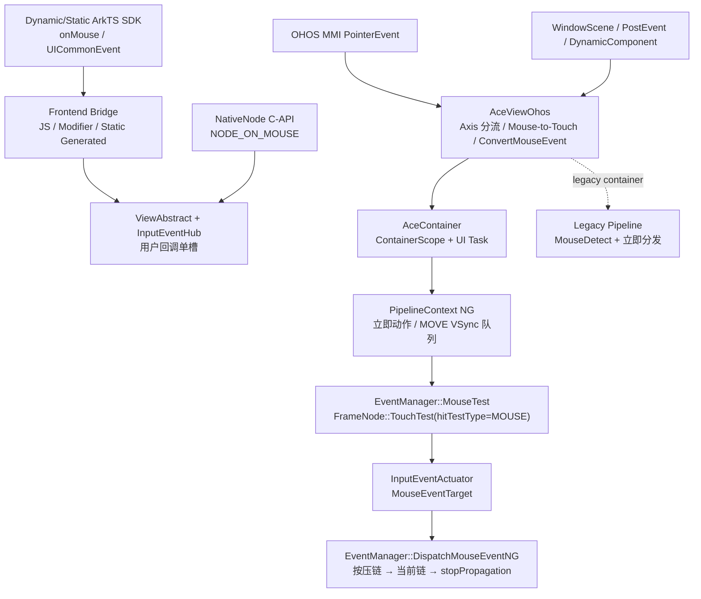
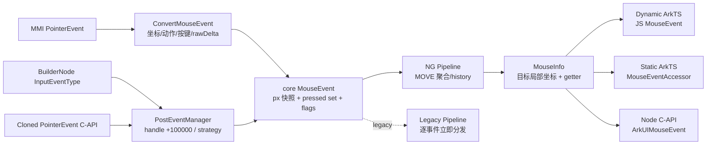
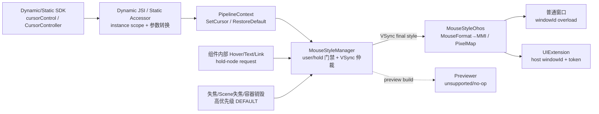
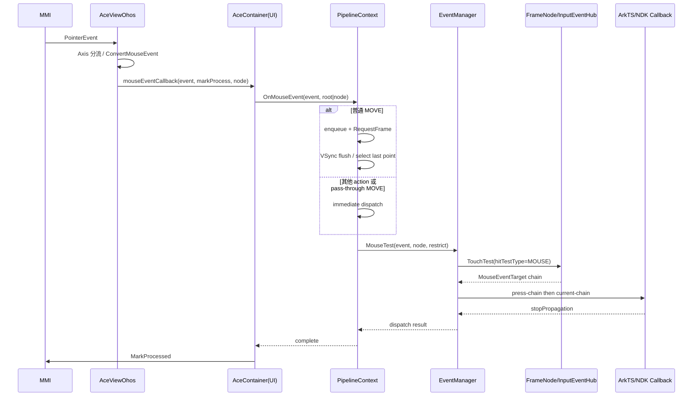
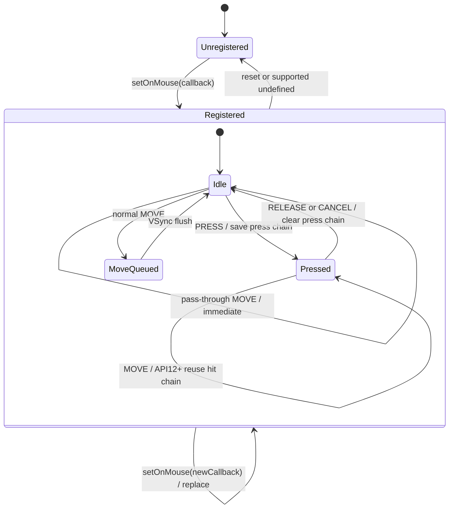
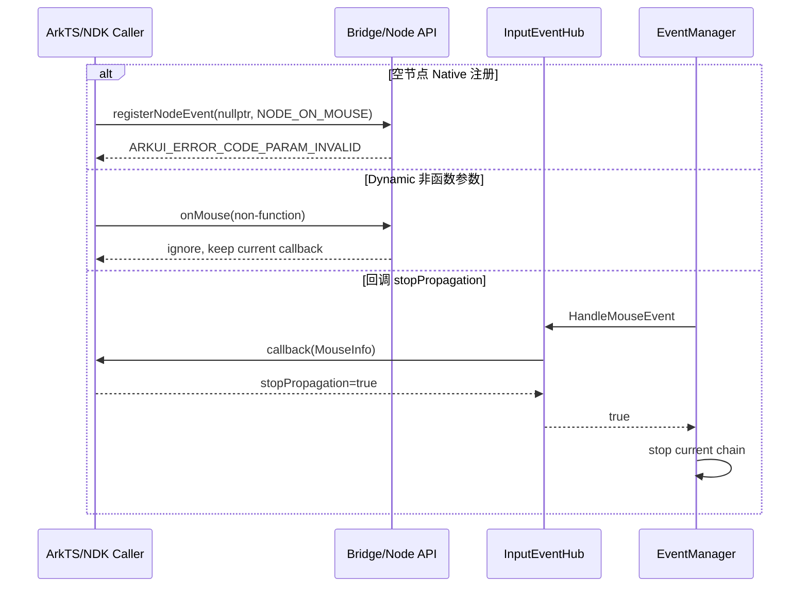

# 架构设计

> 确认鼠标事件的目标仓和模块架构约束、关键设计决策、Spec 拆分方向。

## 设计元数据

| Field | Content |
|-------|---------|
| Design ID | DESIGN-Func-04-04-05 |
| 关联需求 | 已有能力补录（无独立 requirement.md） |
| 关联 Epic | 无 |
| 目标 Feature | Feat-01 鼠标事件注册、命中与分发，Feat-02 鼠标事件数据模型与版本演进，Feat-04 鼠标光标样式与自定义光标 |
| 复杂度 | 复杂 |
| 目标版本 | Dynamic API 8–26.0.0、Node C-API 12–26.0.0、Static API 23–26.0.0 |
| Owner | ArkUI SIG |
| 状态 | Baselined（已有实现补录） |

## 需求基线

> 本功能域没有独立 proposal.md；当前源码、canonical SDK 声明和现有测试共同构成基线。

| 项 | 补充说明（如需） |
|----|------------------|
| 实现即规格 | 只记录已实现行为，对可疑行为仅记录风险，不在文档任务中修改代码 |
| Feat 拆分 | Feat-01 负责注册、路由、命中、分发和传播；Feat-02 负责 MouseEvent 数据模型与版本演进；Feat-03 负责悬停事件与视觉反馈；Feat-04 负责窗口级鼠标光标样式与自定义光标 |
| 完整覆盖 | Feat-01 覆盖 Dynamic/Static ArkTS、Modifier、Node C-API、NG 主链、legacy 兼容、注入和跨容器路径 |
| 版本策略 | 同时记录 SDK `@since` 和运行时目标 API 分支，重点标记 API 11/12/13/23 |
| Feat-02 补充 | 完整覆盖 MouseEvent/BaseEvent 字段、四类坐标、枚举、rawDelta、pressedButtons、历史点、BuilderNode、Node C-API、克隆/回投和 checked-in Static accessor |
| Feat-02 版本策略 | 按通道分别记录 Dynamic API 8/10/15/18/20/23/24/26、Node C-API 12/15/20/24、Static API 23/24/26；SDK/源码偏差进入风险，不静默合并 |
| Feat-04 补充 | 完整覆盖 `cursorControl`、`CursorController`、PointerStyle、API 26 PixelMap 自定义光标、VSync 仲裁、用户/内部优先级、hold-node、生命周期恢复和平台适配 |
| Feat-04 版本策略 | Dynamic 全局 API 11、UIContext API 12、Static API 23、自定义光标 API 26；PointerStyle Dynamic API 9/10/18/20/22、Static API 23；InputKit 仅作关联边界 |

## 上下文和现状

### 涉及仓和模块

| 仓库 | 补充架构说明 |
|------|------------------|
| `interface/sdk-js` | Dynamic/Static ArkTS 公开契约，定义 `onMouse`、`UICommonEvent.setOnMouse` 和版本标注 |
| `arkui/ace_engine/frameworks/bridge/declarative_frontend` | Dynamic JS、Ark Modifier 和 NativeModule 桥接，将回调注册到 ViewAbstract |
| `arkui/ace_engine/frameworks/bridge/arkts_frontend` | Static ArkTS TypedNode、Modifier 和序列化桥接链 |
| `arkui/ace_engine/interfaces/native` | NativeNode `NODE_ON_MOUSE`、ArkUI_UIInputEvent 和 stopPropagation 公开 C-API |
| `arkui/ace_engine/adapter/ohos/entrance` | MMI PointerEvent 路由、转换、兼容 Mouse-to-Touch 和 UI 线程投递 |
| `arkui/ace_engine/frameworks/core/pipeline_ng` | NG 鼠标事件立即分发、MOVE 合帧、重采样和指定节点分发 |
| `arkui/ace_engine/frameworks/core/common` | EventManager 命中结果、按压链、当前链和版本化传播逻辑 |
| `arkui/ace_engine/frameworks/core/components_ng` | FrameNode::TouchTest、InputEventHub、InputEventActuator 和 MouseEventTarget |
| `arkui/ace_engine/frameworks/core/event` | （Feat-02）定义 MouseEvent、MouseInfo、MouseHistoricalPoint、坐标 getter、转换和克隆数据模型 |
| `arkui/ace_engine/frameworks/core/components_ng/manager/post_event` | （Feat-02）解析 eventHandleId，管理 BuilderNode/Native 定向投递序列和 pass-through 状态 |
| `arkui/ace_engine/frameworks/core/interfaces/native/implementation` | （Feat-02）Static MouseEvent accessor 的字段、枚举、实时坐标和历史点访问实现 |
| `interface/sdk-js/api/@ohos.multimodalInput.pointer.d.ts` | （Feat-04）定义 PointerStyle 版本和值域，以及 ArkUI 光标接口所依赖的 InputKit 类型边界 |
| `arkui/ace_engine/frameworks/base/mousestyle` | （Feat-04）定义 MouseFormat、CustomCursorInfo、变更原因、用户覆盖、hold-node 和 VSync 请求队列 |
| `arkui/ace_engine/frameworks/core/interfaces/native/implementation` | （Feat-04）Static 全局 cursorControl 与 UIContext 自定义光标 accessor |
| `arkui/ace_engine/adapter/ohos/osal` | （Feat-04）将系统样式和 PixelMap 光标适配到 MMI，区分普通窗口与 UIExtension token 重载 |
| `arkui/ace_engine/adapter/preview/osal` | （Feat-04）Previewer 的不支持降级实现 |
| `arkui/ace_engine/frameworks/core/pipeline` | legacy RenderNode 立即分发兼容链 |
| `arkui/ace_engine/test/unittest` | 注册、命中、传播、版本分支、pass-through 和 C-API 验证 |

### 调用链层级分析

| 层 | 模块 | 职责 | 修改类型 |
|----|------|------|----------|
| 1. SDK 契约层 | `interface/sdk-js/api/.../common.d.ts` / `common.static.d.ets` | 定义 Dynamic API 8、UICommonEvent API 12 和 Static API 23 的注册/清除契约 | 存量分析 |
| 2. Dynamic 前端层 | `js_view_abstract.cpp`、`ArkComponent.ts`、`arkts_native_common_bridge.cpp` | 校验参数、持有 JS 函数、创建 MouseInfo 对象并写回 stopPropagation | 存量分析 |
| 3. Static 前端层 | `ArkBaseNode.ets`、`CommonMethodModifier.ets`、`component/common.ets` | 持有类型化回调，以生成序列化通道设置或清除回调 | 存量分析 |
| 4. Native API 层 | `native_node.h`、`ui_input_event.h`、`node_common_modifier.cpp` | 注册 `NODE_ON_MOUSE`，封装 ArkUINodeEvent，将 C 回调的 stopPropagation 写回 | 存量分析 |
| 5. 通用注册层 | `view_abstract.cpp`、`input_event_hub.h` | 将用户回调以单槽方式存储，提供 reset/clear 语义 | 存量分析 |
| 6. OHOS 输入适配层 | `ace_view_ohos.cpp`、`mmi_event_convertor.cpp` | 区分 Axis/Mouse，处理 Mouse-to-Touch 兼容转换，生成 MouseEvent | 存量分析 |
| 7. Container 调度层 | `ace_container.cpp` | 切换 ContainerScope，将处理投递到 UI 线程，处理后 MarkProcessed | 存量分析 |
| 8. NG Pipeline 层 | `pipeline_context.cpp` | 分流立即动作和 MOVE 队列，VSync 合帧/重采样，处理 pass-through 和指定节点 | 存量分析 |
| 9. 命中层 | `event_manager.cpp`、`frame_node.cpp` | 以 `hitTestType=MOUSE` 复用 TouchTest，应用 responseRegion、变换、hitTestMode 和子树遍历 | 存量分析 |
| 10. 目标收集层 | `input_event_hub.cpp`、`input_event.cpp` | 收集 MouseEventTarget，按内部监听、用户回调和 JS FrameNode 回调顺序执行 | 存量分析 |
| 11. 传播层 | `event_manager.cpp`、`mouse_event.cpp` | 先按压链后当前命中链，去重并同步处理 stopPropagation | 存量分析 |
| 12. 特殊路由层 | WindowScene、PostEvent、DynamicComponent | 指定节点、注入、pass-through 和子 Container 重入主链 | 存量分析 |
| 13. legacy 兼容层 | `frameworks/core/pipeline/pipeline_context.cpp`、`render_node.cpp` | 逐条即时 MouseDetect/分发，不使用 NG MOVE VSync 队列 | 存量分析 |
| 14. 验证层 | EventManager、Pipeline、InputEventHub、NativeNode UT | 验证可观测回调、队列、传播和错误码 | 验证追溯 |
| 15. 核心数据模型层 | `mouse_event.h`、`mouse_event.cpp` | （Feat-02）保存内部 px 坐标、动作/按键、rawDelta、pressedButtons、history、handle 和克隆标志，并转换为 MouseInfo | 存量分析 |
| 16. BuilderNode/克隆投递层 | `js_base_node.cpp`、`post_event_manager.cpp`、`ui_input_event.cpp`、`node_common_modifier.cpp` | （Feat-02）构造/克隆 MouseEvent、增加 handle 分段、回投目标节点并封装 Native 数据 | 存量分析 |
| 17. Static accessor 层 | `mouse_event_accessor.cpp`、`reverse_converter_enums.cpp` | （Feat-02）将 MouseInfo 暴露为 Static MouseEvent，处理枚举、实时坐标和历史点 | 存量分析 |
| 18. 光标 SDK/前端层 | `common.d.ts`、`UIContext.d.ts`、`common.static.d.ets`、`UIContextImpl.ets` | （Feat-04）提供全局/实例控制器、PointerStyle 和 PixelMap 自定义光标入口 | 存量分析 |
| 19. 光标 Pipeline 层 | `pipeline_context.cpp`、`event_manager.cpp` | （Feat-04）校验样式值、绑定 focus window、入队、RequestFrame 并在帧末 flush | 存量分析 |
| 20. 光标状态管理层 | `mouse_style.h`、`mouse_style.cpp` | （Feat-04）管理用户/内部门禁、hold-node、reason 优先级、去重和当前样式 | 存量分析 |
| 21. 光标平台适配层 | `adapter/ohos/osal/mouse_style_ohos.cpp` | （Feat-04）映射 MouseFormat 到 MMI，处理 token、自定义热点、失败日志和 pointer visible | 存量分析 |
| 22. 光标验证层 | `mouse_style_manager_test_ng.cpp`、Pipeline UT、component cursor tests | （Feat-04）验证仲裁、hold、自定义光标、参数和组件调用；平台端到端仍有空白 | 验证追溯 |

### 适用架构规则

| Rule ID | 适用原因 | 设计结论 | 验证方式 |
|---------|----------|----------|----------|
| OH-ARCH-LAYERING | 涉及 SDK、前端、平台适配、Pipeline、命中和目标回调 | 调用方向自上而下，EventManager/InputEventHub 不依赖 JS 具体实现 | 架构评审/依赖检查 |
| OH-ARCH-SUBSYSTEM | OHOS MMI 输入仅存在于 adapter/entrance 层 | core 使用 ArkUI MouseEvent 抽象，不在核心分发层新增 MMI 依赖 | 代码评审/依赖检查 |
| OH-ARCH-IPC-SAF | 平台输入由 MMI 进入，但 Feat-01 不改变 IPC 协议 | 保持现有 PointerEvent 接收和 MarkProcessed 边界 | 集成测试 |
| OH-ARCH-API-LEVEL | Dynamic/Static/NDK 起始版本和运行时 API 11/12/13 行为不同 | canonical SDK 与 `AceApplicationInfo` 分支双重核对 | API 评审/XTS/Host UT |
| OH-ARCH-COMPONENT-BUILD | 仅文档补录 | 不修改 BUILD.gn、bundle.json 或部件依赖 | 生成器和文档校验 |
| OH-ARCH-ERROR-LOG | NativeNode 注册有错误码，输入链有 InputTracking/trace | 保留现有错误码和日志语义 | Native UT/日志检查 |

## 不涉及项承接

| 维度 | 设计结论 |
|------|----------|
| 产品源码 | 不修改，当前实现作为规格基线 |
| 公开 API/ABI | 不新增、不修改签名、错误码和结构体布局 |
| 构建与依赖 | 不修改 BUILD.gn、bundle.json 和系统模块依赖 |
| MouseEvent 字段 | 坐标、按键、rawDelta、pressedButtons、history、eventHandleId 的数据契约归属 Feat-02 |
| 悬停/无障碍 | `onHover`、`onHoverMove`、hoverEffect 归属 Feat-03；无障碍悬停状态机归属无障碍功能域 |
| 光标样式 | `cursorControl`、`CursorController` 和 MouseStyleManager 归属 Feat-04；在 `onHover` 中调用只是跨 Feat 触发关系 |
| 其他光标链 | Web 平台直通 cursor 和 DragCursorStyleCore 不进入 Feat-04 的普通用户/hold 仲裁，仅记录边界 |
| Native 光标 API | Node C-API/NDK 鼠标光标样式接口在 ace_engine 中未实现；InputKit API 由系统输入模块负责 |
| 鼠标滚轮 | 归属 AxisEvent/滚动或手势能力，本设计仅记录输入分流边界 |

## 关键设计决策

| 决策 ID | 问题 | 推荐方案 | 探索过的替代方案 | 取舍理由 | 影响 |
|---------|------|----------|-----------------|----------|------|
| ADR-1 | 设备输入如何区分 Mouse 与 Axis | 在 AceViewOhos 根据 action/tool/axes 先分流，Axis/Rotate 不进入 `onMouse` | 方案A：全部当作 Mouse；方案B：在 EventManager 再分流 | 入口分流避免构造错误事件语义，降低 core 分支 | 鼠标滚轮属于 AxisEvent；兼容左键可转 Touch |
| ADR-2 | MOVE 是否每条立即分发 | NG 普通 MOVE 按节点入队并在 VSync 合帧，pass-through MOVE 保持立即 | 方案A：所有 MOVE 立即；方案B：所有 action 都合帧 | 合帧降低高频 MOVE 回调压力，按键动作和穿透结果仍需立即 | 回调时机、history 载体和补偿机制 |
| ADR-3 | NG 鼠标命中是否维护独立 MouseTest 管线 | 复用 FrameNode::TouchTest，通过 `hitTestType=MOUSE` 选择鼠标目标 | 方案A：实现独立 MouseTest；方案B：只检查几何矩形 | 复用 TouchTest 可统一变换、responseRegion、hitTestMode 和子树顺序 | `FrameNode::MouseTest` 保留为不可用空实现 |
| ADR-4 | 按键 MOVE 命中和多键按压链如何兼容 | API 12 开始复用 pointer 命中结果，API 13 开始以 `(pointerId, button)` 存储按压链 | 方案A：新旧版本统一新算法；方案B：每次 MOVE 重新命中 | 保留已发布应用的传播顺序，同时支持多鼠标键 | 必须建立 API 12/13 兼容矩阵 |
| ADR-5 | stopPropagation 何时生效 | 回调同步返回 MouseInfo 后立即决定是否调用下一目标 | 方案A：异步标记下一事件；方案B：仅返回 consumed 不截断 | 只有同步写回才能精确截断当前按压链/当前链 | JS 和 C 桥接均必须写回标志 |
| ADR-6 | 前端回调注册是追加还是覆盖 | 公开 `onMouse` 使用 InputEventHub 用户单槽覆盖，内部 InputEvent 列表独立管理 | 方案A：公开 API 追加多监听；方案B：所有内部监听也被覆盖 | 单槽匹配声明式属性语义，内部菜单/提示等仍可并存 | 注册和 reset 验收需区分用户槽/内部列表 |
| ADR-7 | 注入、指定节点和子容器是否使用独立分发实现 | 调整坐标和 ContainerScope 后重入同一 NG 主链；legacy 仅作兼容分支 | 方案A：各场景复制 EventManager；方案B：统一强制从 root 命中 | 主链复用减少语义分叉，指定节点保留子树隔离 | 需注意跨 Container 集成测试空白 |
| ADR-F2-1 | MouseEvent 版本如何形成统一规格 | 按 Dynamic/Static/Node C-API/BuilderNode 四通道分别建立 API 8–26 矩阵 | 方案A：只记录最新版本；方案B：以 Static API 23 统一起算 | 各通道公开时间和字段组合不同，统一起算会丢失兼容边界 | Spec 的 API 表、AC 和验证均按通道分组 |
| ADR-F2-2 | 跨通道按键和动作是否共享裸整数 | 只保证枚举名称语义，通过 converter 显式映射，不保证裸整数一致 | 方案A：把所有枚举强制改为位值；方案B：直接透传整数 | Dynamic、Static、core 和 C-API 已存在不同值域，修改会影响 API/ABI | 生态传输必须使用语义枚举，差异进入兼容性声明 |
| ADR-F2-3 | API 26 rawDelta 如何兼容 | 以 Dynamic SDK 明示的 API 26 语义切换为外部契约，Static 未记载部分单列风险 | 方案A：始终按 vp；方案B：忽略旧版本缩放 | rawDelta 是硬件移动量而非坐标，版本切换会直接影响轨迹算法 | API 25/26 必须有版本化验证 |
| ADR-F2-4 | 局部快照与实时位置如何共存 | `x/y` 保留事件快照，`getCurrentLocalPosition()` 通过惰性 getter重算当前节点位置 | 方案A：每次读取 x/y 都重算；方案B：实时方法返回快照 | 同时满足事件重放稳定性和节点变换后的实时查询 | 两套坐标必须独立建模和测试 |
| ADR-F2-5 | 同帧多个 MOVE 如何保留细节 | 最后点作为主事件，其余点按时间顺序作为 history；Native 回调最多打包 20 点 | 方案A：丢弃前序点；方案B：每点单独回调 | 保留轨迹同时控制回调频率和栈上临时数组规模 | ArkTS API 26 与 C-API API 12/20 形成不同开放边界 |
| ADR-F2-6 | BuilderNode 序列如何隔离 | eventHandleId 每次增加 100000 并作为内部 id，重复 PRESS 通过 CANCEL 恢复 | 方案A：直接复用原 id；方案B：全局随机 id | 分段 id 可区分重复定向投递并复用现有 referee/序列状态 | 负数、溢出、重入必须拒绝；Static accessor 偏差单列风险 |
| ADR-F2-7 | 可疑 pressedButtons/clone 行为如何写入设计 | 保留当前实现并标记风险，不在文档任务中提出代码修复 | 方案A：按预期行为改写规格；方案B：忽略异常路径 | “实现即规格”要求偏差可见，同时外部 SDK 契约仍优先 | MMI 标量、C 数组值域、克隆长度/history/isInjected 均进入风险与验证 |
| ADR-F4-1 | 光标设置何时下发平台 | 所有普通光标请求先入 Manager 队列，在渲染帧末统一仲裁和应用 | 方案A：公开 API 内立即调用 MMI；方案B：每来源独立定时提交 | 共享 VSync 可确定同帧覆盖顺序并避免重复平台调用 | Dynamic SDK 的“下一渲染帧生效”形成可验证时序 |
| ADR-F4-2 | 多来源请求如何确定最终样式 | 原因优先级为 INNER < USER < DESTROY < WINDOW_LOST_FOCUS < WINDOW_SCENE_LOST_FOCUS，同级后到者胜 | 方案A：首个请求胜；方案B：只按调用时间不分原因 | 生命周期恢复必须覆盖用户/组件请求，同级仍保留最后意图 | Manager 需要参数化仲裁测试 |
| ADR-F4-3 | 用户和组件内部光标如何隔离 | 用户设置期间拒绝 INNER；内部设置必须匹配唯一 hold-node | 方案A：所有组件可覆盖用户；方案B：每节点各持有一个槽 | 防止 Hover/文本组件抢占用户显式样式，同时保持内部组件单一所有权 | restoreDefault 必须解除用户覆盖，组件退出必须释放 hold |
| ADR-F4-4 | PointerStyle 与内部 MouseFormat 如何划界 | ArkUI `setCursor` 仅接受公开 0..51；-100 和内部 1001..1004 不进入普通设置 | 方案A：透传任意整数；方案B：只支持 API 9 的 0..38 | SDK 中存在场景专用和自定义占位值，裸整数全透传会混淆内部语义 | Spec 按版本和值域分组，不承诺所有枚举可直接设置 |
| ADR-F4-5 | 自定义热点边界差异如何表达 | 分别记录 Dynamic `> size` 与 Static `>= size` 的现状，不静默统一 | 方案A：统一写成 SDK 的非负范围；方案B：推测预期上界 | checked-in 两条前端实现可观测差异，文档任务不能修改产品行为 | size 边界必须按前端分别验证并列风险 |
| ADR-F4-6 | 普通窗口与 UIExtension 如何定位平台窗口 | 普通窗口调用无 token MMI 重载；UIExtension 使用 host/focus window ID 和 token 重载 | 方案A：统一只传 windowId；方案B：UIExtension 直接设置子窗口 | token 是跨 UIExtension 设置宿主窗口光标的必要身份 | null token/MMI 失败只能日志定界，Public void API不可观测 |
| ADR-F4-7 | SDK/源码偏差和其他 cursor 链如何处理 | Static 实例 no-op、Previewer no-op、Web/Drag 独立链全部显式标注 | 方案A：按 Dynamic 行为推定全平台一致；方案B：合并所有 cursor 状态 | 保持实现证据真实并避免扩大 Feat-04 状态机责任 | 兼容表和风险表必须保留通道差异与测试空白 |

## 设计骨架

### 骨架范围

| 骨架项 | 目标 | 不包含 | 验证方式 |
|--------|------|--------|----------|
| 公开注册链 | 固化 Dynamic/Static/Modifier/NativeNode 设置、覆盖和清除 | MouseEvent 字段细节 | SDK 核对 + ViewAbstract/Native UT |
| 平台路由 | 固化 Axis 分流、Mouse-to-Touch 兼容和 UI 线程投递 | Axis 滚动本身的规格 | Adapter/集成测试 |
| NG 调度 | 固化立即动作、MOVE 合帧、pass-through 和补偿 | history 点数据契约 | Pipeline Host UT |
| NG 命中与传播 | 固化 TouchTest(MOUSE)、按压链、当前链、去重和 stopPropagation | hover 状态机/视觉效果 | EventManager/InputEventHub UT |
| 特殊路由与兼容 | 固化指定节点、注入、动态子容器和 legacy 差异 | 组件专用 Web/FolderStack 鼠标事件 | PostEvent/集成/legacy UT |
| 数据模型与版本矩阵 | （Feat-02）固化字段、枚举、坐标、rawDelta、历史点和 BaseEvent 继承字段 | Hover/AxisEvent 的专用语义 | SDK 核对 + 数据转换 UT |
| BuilderNode 与 Native 克隆 | （Feat-02）固化 handle、构造/克隆/回投和错误码 | 修改公开 API/ABI 或修复风险实现 | PostEvent/C-API 集成测试 |
| 光标 API 与版本矩阵 | （Feat-04）固化全局/实例入口、PointerStyle 分组与 API 26 自定义光标 | InputKit 内部实现与错误码 | SDK 核对 + Bridge UT |
| 光标状态与平台适配 | （Feat-04）固化 VSync 仲裁、用户/内部门禁、hold、恢复、token 与 Previewer 差异 | 修改 MMI、Web/Drag 状态链或修复实现偏差 | Manager/Pipeline/OHOS 集成测试 |

### 骨架 Spec 拆分

| Task ID | 目标 | 受影响文件 | AC |
|---------|------|------------|----|
| TASK-SKELETON-1 | 注册、清除和多前端收敛 | `js_view_abstract.cpp`、`arkts_native_common_bridge.cpp`、`view_abstract.cpp`、`node_common_modifier.cpp` | AC-1.1~AC-1.6 |
| TASK-SKELETON-2 | 平台路由与 NG MOVE 调度 | `ace_view_ohos.cpp`、`ace_container.cpp`、`pipeline_context.cpp` | AC-2.1~AC-3.4 |
| TASK-SKELETON-3 | TouchTest(MOUSE) 和版本化响应链 | `event_manager.cpp`、`frame_node.cpp`、`input_event.cpp`、`mouse_event.cpp` | AC-4.1~AC-5.6 |
| TASK-SKELETON-4 | 定向/子容器/legacy 兼容边界 | WindowScene、PostEvent、DynamicComponent、legacy Pipeline | AC-6.1~AC-6.4 |

## 后续 Task 拆分

| Task ID | 目标 | 受影响文件 | 依赖 |
|---------|------|------------|------|
| TASK-F1-1 | 固化鼠标事件注册、命中与分发行为 | `Feat-01-mouse-event-registration-hit-test-dispatch-spec.md` | 本 Design |
| TASK-F2-1 | 补录 MouseEvent 数据模型与 API 8–26 版本演进 | `Feat-02-mouse-event-data-model-version-evolution-spec.md` | Feat-01 分发边界 |
| TASK-F3-1 | 补录悬停事件、悬停移动和悬停视觉反馈 | 后续 Feat-03 spec | 本 Design 命中基线 |
| TASK-F4-1 | 补录鼠标光标样式、自定义光标和窗口级状态仲裁 | `Feat-04-mouse-cursor-style-custom-cursor-spec.md` | Feat-03 仅提供可选 Hover 触发关系 |

## API 签名、Kit 与权限

### 新增 API

> 本次不新增 API，下表记录现有签名作为设计输入。

| API 签名 | 类型 | Kit | d.ts 位置 | 权限要求 | SysCap |
|----------|------|-----|-----------|----------|--------|
| `onMouse(event: (event: MouseEvent) => void): T` | Public | ArkUI | `@internal/component/ets/common.d.ts:21084` | 无 | `SystemCapability.ArkUI.ArkUI.Full` |
| `onMouse(event: ((event: MouseEvent) => void) | undefined): this` | Public | ArkUI | `arkui/component/common.static.d.ets:12104` | 无 | `SystemCapability.ArkUI.ArkUI.Full` |
| `UICommonEvent.setOnMouse(callback: Callback<MouseEvent> | undefined): void` | Public | ArkUI | `@internal/component/ets/common.d.ts:30324` | 无 | `SystemCapability.ArkUI.ArkUI.Full` |
| `registerNodeEvent(node, NODE_ON_MOUSE, targetId, userData)` | Public/NDK | ArkUI NativeNode | `interfaces/native/native_node.h:12828` | 无 | ArkUI Native API |
| `unregisterNodeEvent(node, NODE_ON_MOUSE)` | Public/NDK | ArkUI NativeNode | `interfaces/native/native_node.h:12849` | 无 | ArkUI Native API |
| `OH_ArkUI_PointerEvent_SetStopPropagation(event, bool)` | Public/NDK | ArkUI InputEvent | `interfaces/native/ui_input_event.h:1145` | 无 | ArkUI Native API |
| `interface MouseEvent extends BaseEvent` | Public | ArkUI | `@internal/component/ets/common.d.ts:10161`、`arkui/component/common.static.d.ets:4985` | 无 | `SystemCapability.ArkUI.ArkUI.Full` |
| `MouseEvent.getCurrentLocalPosition(): Coordinate2D` | Public | ArkUI | `@internal/component/ets/common.d.ts:10370`、`common.static.d.ets:5125` | 无 | `SystemCapability.ArkUI.ArkUI.Full` |
| `MouseEvent.getHistoricalPoints(): MouseHistoricalPoint[]` | Public | ArkUI | `@internal/component/ets/common.d.ts:10405`、`common.static.d.ets:5134` | 无 | `SystemCapability.ArkUI.ArkUI.Full` |
| `BuilderNode.postInputEvent(event: InputEventType): boolean` | Public | ArkUI | `arkui/BuilderNode.d.ts:540`、`BuilderNode.static.d.ets:297` | 无 | `SystemCapability.ArkUI.ArkUI.Full` |
| `BuilderNode.postInputEventWithStrategy(event, competitionStrategy?): boolean` | Public | ArkUI | `arkui/BuilderNode.d.ts:590`、`BuilderNode.static.d.ets:326` | 无 | `SystemCapability.ArkUI.ArkUI.Full` |
| `OH_ArkUI_MouseEvent_GetMouseButton/GetMouseAction` | Public/NDK | ArkUI InputEvent | `interfaces/native/ui_input_event.h:1127` | 无 | ArkUI Native API |
| `OH_ArkUI_MouseEvent_GetRawDeltaX/Y/GetPressedButtons` | Public/NDK | ArkUI InputEvent | `interfaces/native/ui_input_event.h:1294` | 无 | ArkUI Native API |
| `OH_ArkUI_PointerEvent_GetHistory*` | Public/NDK | ArkUI InputEvent | `interfaces/native/ui_input_event.h:843` | 无 | ArkUI Native API |
| `OH_ArkUI_PointerEvent_CreateClonedPointerEvent/CreatePointerEvent` | Public/NDK | ArkUI InputEvent | `interfaces/native/ui_input_event.h:1361` | 无 | ArkUI Native API |
| `OH_ArkUI_ClonedEvent_SetMouseButton/SetRawDeltaX/Y/SetPressedButtons/SetHandleId` | Public/NDK | ArkUI InputEvent | `interfaces/native/ui_input_event.h:1814`、`:2059` | 无 | ArkUI Native API |
| `OH_ArkUI_PointerEvent_PostClonedEventWithStrategy` | Public/NDK | ArkUI InputEvent | `interfaces/native/ui_input_event.h:1405` | 无 | ArkUI Native API |
| `cursorControl.setCursor(value: PointerStyle): void` | Public | ArkUI | `@internal/component/ets/common.d.ts:7481`、`common.static.d.ets:3265` | 无 | `SystemCapability.ArkUI.ArkUI.Full` |
| `cursorControl.restoreDefault(): void` | Public | ArkUI | `@internal/component/ets/common.d.ts:7492`、`common.static.d.ets:3273` | 无 | `SystemCapability.ArkUI.ArkUI.Full` |
| `UIContext.getCursorController(): CursorController` | Public | ArkUI | `@ohos.arkui.UIContext.d.ts:5730`、`UIContext.static.d.ets:4160` | 无 | `SystemCapability.ArkUI.ArkUI.Full` |
| `CursorController.setCursor(value: PointerStyle): void` | Public | ArkUI | `@ohos.arkui.UIContext.d.ts:3888`、`UIContext.static.d.ets:2938` | 无 | `SystemCapability.ArkUI.ArkUI.Full` |
| `CursorController.restoreDefault(): void` | Public | ArkUI | `@ohos.arkui.UIContext.d.ts:3872`、`UIContext.static.d.ets:2928` | 无 | `SystemCapability.ArkUI.ArkUI.Full` |
| `CursorController.setCustomCursor(value, focusX?, focusY?): void` | Public | ArkUI | `@ohos.arkui.UIContext.d.ts:3907`、`UIContext.static.d.ets:2952` | 无 | `SystemCapability.ArkUI.ArkUI.Full` |
| `pointer.PointerStyle` | Public | InputKit type dependency | `@ohos.multimodalInput.pointer.d.ts:44-536` | ArkUI 无权限要求 | `SystemCapability.MultimodalInput.Input.Pointer` |

### 变更/废弃 API

| 原有 API | 变更类型 | 新 API | 迁移说明 |
|----------|----------|--------|----------|
| 无 | 无 | 无 | 文档补录不导致迁移 |

## 构建系统影响

### BUILD.gn 变更

```text
无变更。本任务仅新增 specs 文档和注册元数据，不改变 ace_engine 构建 target。
```

### bundle.json 变更

无变更，不新增部件、不修改依赖关系。

## 可选设计扩展

### 架构图



#### 鼠标事件数据模型与版本演进架构图（Feat-02）



#### 鼠标光标样式与自定义光标架构图（Feat-04）



### 数据流/控制流

| 步骤 | 调用方 | 被调用方 | 数据/接口 | 说明 |
|------|--------|------------|-----------|------|
| 1 | ArkTS/NDK | Frontend Bridge/Node API | callback、node | 注册到 InputEventHub 用户槽 |
| 2 | MMI | AceViewOhos | PointerEvent | 区分 Axis/Mouse，可选左键转 Touch |
| 3 | AceViewOhos | AceContainer callback | MouseEvent、markProcess、optional node | 将处理切到 UI 线程 |
| 4 | AceContainer | PipelineContext | `OnMouseEvent(event, node)` | root 或指定节点分发 |
| 5a | PipelineContext | MOVE queue | MouseEvent list by node | 普通 MOVE 入队并 RequestFrame |
| 5b | PipelineContext | EventManager | PRESS/RELEASE/CANCEL/WINDOW/pass-through MOVE | 立即命中和分发 |
| 6 | VSync | PipelineContext::FlushMouseEventInVsync | queued MOVE/history | 选末点、可选重采样、分发 |
| 7 | EventManager | FrameNode::TouchTest | point、TouchRestrict(MOUSE) | 收集 MouseEventTarget/hover target/effect target |
| 8 | EventManager | MouseEventTarget | MouseEvent → MouseInfo | 按 API 版本处理按压链和当前链 |
| 9 | MouseEventTarget | ArkTS/C callback | MouseInfo/ArkUI_UIInputEvent | 同步写回 stopPropagation |
| F4-1 | ArkTS | cursorControl/CursorController | PointerStyle 或 PixelMap+hotspot | 绑定当前 instance，Static/Dynamic 分别转换 |
| F4-2 | Bridge/Accessor | PipelineContext | `SetCursor` / `RestoreDefault` | UI 线程同步提交，公开 API返回 void |
| F4-3 | PipelineContext | MouseStyleManager | windowId、nodeId、style、reason | 校验 0..51/PixelMap，设置用户标志并 RequestFrame |
| F4-4 | VSync | EventManager/MouseStyleManager | pending style logs | 按 reason 仲裁、同级后到、与上一帧去重 |
| F4-5 | MouseStyleManager | MouseStyleOhos | MouseFormat 或 CustomCursorInfo | 选择系统样式或自定义光标平台接口 |
| F4-6 | MouseStyleOhos | MMI InputManager | windowId、style/PixelMap、optional token | 普通窗口与 UIExtension 分流，失败只记录日志 |

### 时序设计



### 数据模型设计

```cpp
// 本 Feat 仅使用下列分发相关字段，完整 MouseEvent/MouseInfo 数据契约由 Feat-02 定义。
struct MouseDispatchState {
    MouseAction action;
    MouseButton button;
    int32_t pointerId;
    bool passThrough;
    bool isInjected;
    WeakPtr<FrameNode> targetNode;
};

using PressChainKey = std::pair<int32_t, MouseButton>; // API 13+
```

#### 鼠标事件完整数据模型（Feat-02）

```cpp
struct MouseEventModel {
    MouseButton button;
    MouseAction action;
    double x, y;                         // 当前目标局部 px 快照
    double windowX, windowY;             // 应用窗口 px
    double displayX, displayY;           // 当前显示屏 px
    double globalDisplayX, globalDisplayY;
    double rawDeltaX, rawDeltaY;         // 硬件原始移动量；外部单位按 API 版本转换
    int32_t pressedButtons;              // 兼容标量
    std::vector<MouseButton> pressedButtonsArray;
    int32_t eventHandleId;
    std::vector<MouseEvent> history;
    bool passThrough;
    bool isInjected;
    int32_t postEventNodeId;
};
```

```typescript
interface PublicMouseEvent extends BaseEvent {
  button: MouseButton;
  action: MouseAction;
  x: number; y: number;
  windowX: number; windowY: number;
  displayX: number; displayY: number;
  globalDisplayX?: number; globalDisplayY?: number;
  rawDeltaX?: number; rawDeltaY?: number;
  pressedButtons?: MouseButton[];
  eventHandleId?: number;
  getCurrentLocalPosition?(): Coordinate2D;
  getHistoricalPoints?(): MouseHistoricalPoint[];
}
```

#### 光标样式状态数据模型（Feat-04）

```cpp
enum class MouseStyleChangeReason {
    INNER_SET_MOUSESTYLE = 0,
    USER_SET_MOUSESTYLE = 1,
    CONTAINER_DESTROY_RESET_MOUSESTYLE = 2,
    WINDOW_LOST_FOCUS_RESET_MOUSESTYLE = 3,
    WINDOW_SCENE_LOST_FOCUS_RESET_MOUSESTYLE = 4,
};

struct CustomCursorInfo {
    RefPtr<PixelMap> pixelMap;
    int32_t focusX = 0;
    int32_t focusY = 0;
};

struct MouseStyleState {
    bool userSetCursor = false;
    std::optional<int32_t> holdNodeId;
    std::optional<int32_t> windowIdWithNode;
    std::variant<MouseFormat, CustomCursorInfo> lastVsyncStyle = MouseFormat::DEFAULT;
    std::variant<MouseFormat, CustomCursorInfo> currentStyle = MouseFormat::DEFAULT;
    std::list<MouseStyleChangeLog> pendingVsyncChanges;
};
```

`MouseFormat` 的公开同值段为 0..51；内部还定义 `CURSOR_NONE/CONTEXT_MENU/ALIAS/CUSTOM_CURSOR=1001..1004`，不属于 ArkUI `setCursor` 的普通输入值域。CustomCursorInfo 的相等比较使用 PixelMap `GetPixels()` 指针与热点坐标，不比较像素内容。

| 存储 | 持有方 | 生命周期 | 用途 |
|------|--------|----------|------|
| `userMouseFunc_` | InputEventHub | 节点生命期，被新回调覆盖或 reset | 公开用户回调单槽 |
| `mouseEvents_` | PipelineContext | MOVE 入队到当次 flush/补偿 | 按 FrameNode 延迟高频 MOVE |
| `mouseTestResults_` | EventManager | pointer 按键活跃期（API 12+） | 按键 MOVE 命中链复用 |
| `pressMouseTestResultsMap_` | EventManager | `(pointerId, button)` PRESS 到 RELEASE/CANCEL（API 13+） | 维持按压时目标链 |
| `currMouseTestResultsMap_` | EventManager | 当次命中到下次更新 | 当前命中目标链 |
| `vsyncMouseStyleChanges_` | MouseStyleManager | 请求入队到当次 VSync/显式 flush | 保存同帧光标请求和 reason |
| `mouseFormat_` | MouseStyleManager | Pipeline/EventManager 生命周期 | 保存仲裁后的当前系统或自定义样式 |
| `lastVsyncMouseFormat_` | MouseStyleManager | 至下一次有请求的 VSync | 判断是否需要重复调用平台 setter |
| `mouseStyleNodeId_` | MouseStyleManager | 首个内部节点占用到释放 | 内部组件光标唯一 hold-node |

### 算法与状态机



### 测试性设计

| 测试层级 | 测试目标 | Mock 策略 | 验证方式 |
|----------|----------|-----------|----------|
| SDK/桥接 | Dynamic/Static 签名和 reset 版本 | Mock JS callback/VM | 类型声明核对 + Bridge UT |
| ViewAbstract/InputEventHub | 单槽覆盖、clear、目标收集 | Mock FrameNode/EventHub | `view_abstract_test_ng_new.cpp`、`input_event_hub_test_ng.cpp` |
| Adapter/Pipeline | Axis 分流、MOVE 队列、pass-through、补偿 | Mock PointerEvent/EventManager | `pipeline_context_test_ng_eight.cpp` |
| EventManager | 有效 action、API 12/13、按压链、stopPropagation | 手工构造 MouseEventTarget 链 | `event_manager_test_ng_*` |
| Native C-API | 注册/注销、错误码、stopPropagation | Mock NativeNode/ArkUI_UIInputEvent | `native_node_test.cpp`、`oh_arkui_pointerevent_setstoppropagation_test.cpp` |
| 集成 | 跨 Container、WindowScene、真实 MMI MarkProcessed | 多实例 UIContent | 增加集成级验证；当前以源码追溯为主 |

### 异常传播时序图



| 异常场景 | 传播结果 | 恢复/降级 |
|----------|----------|----------|
| 无效 action | EventManager 返回 false，不调用目标 | 由对应 Axis/Hover/Drag 通道处理或丢弃 |
| 终止动作前有未处理 MOVE | 先补偿同 id 最后 MOVE | 再正常分发 RELEASE/CANCEL/WINDOW_LEAVE |
| 子 Container 不可用 | 不向无效 UIContent 分发 | 保留父容器输入边界 |

### 资源所有权矩阵

| 资源 | 创建方 | 持有方 | 销毁触发 | 实际释放 | 异常回收 |
|------|--------|--------|----------|----------|----------|
| ArkTS 回调句柄 | JS/Static runtime | Bridge callback closure / InputEventHub | reset、覆盖或节点销毁 | runtime 句柄和 `std::function` 析构 | WeakPtr/ContainerScope 检查防止访问已销毁节点 |
| MouseEventTarget | InputEventActuator | InputEventActuator/TouchTestResult | actuator/节点销毁 | RefPtr 引用计数 | 目标回调为空时不收集 |
| MOVE 队列 | PipelineContext | PipelineContext | VSync flush、补偿或 Pipeline 销毁 | 移出/容器清空 | 空队列直接返回 |
| 按压链 | EventManager | EventManager | RELEASE/CANCEL | erase/clear | 无效 action 不新建链 |

### 接口参数规约

| 接口 | 参数 | 类型 | 合法范围 | 非法处理 | 边界说明 |
|------|------|------|----------|----------|----------|
| Dynamic `onMouse` | event | JS function/undefined | function；target API >= 11 时 undefined | 其他类型忽略 | API < 11 的 undefined 不清除 |
| Static `onMouse` | event | callback/undefined | Static API 23 声明类型 | 类型系统拒绝其他类型 | undefined 清除 |
| `registerNodeEvent` | node | ArkUI_NodeHandle | 有效且支持事件的节点 | 返回 ArkUI 错误码 | BuilderNode 限制按公开契约返回 |
| `registerNodeEvent` | eventType | ArkUI_NodeEventType | `NODE_ON_MOUSE` | 不支持的事件返回不支持 | 不改变 ABI 枚举值 |
| `SetStopPropagation` | event | ArkUI_UIInputEvent* | 有效 mouse/touch/hover 输入事件 | 空指针或不支持类型返回错误 | 仅影响当次同步分发 |

### 线程与并发模型

| 操作 | 发起线程 | 回调线程 | 跨进程边界 | 线程安全 | 重入约束 |
|------|----------|----------|------------|----------|----------|
| MMI 输入 | 平台输入线程 | AceContainer 切换到 UI 线程 | MMI 系统边界 | MouseEvent 按值捕获投递 | 不在平台线程直接访问 UI 树 |
| ArkTS/NDK 鼠标回调 | UI 线程 | UI 线程同步返回 | NDK 仅语言边界 | ContainerScope 和回调节点在调用前设置 | 回调可重新注册 onMouse，MouseEventTarget 调用前复制回调对象 |
| VSync MOVE flush | UI 线程 | UI 线程 | 无 | 移出队列后遍历，避免回调重入修改当前容器 | 回调新产生的 MOVE 进入下一调度周期 |

| 并发场景 | 规则 |
|----------|------|
| 多 pointer id MOVE | 按 id 分别选取本帧主点，不共用按压链 |
| 同 pointer 多鼠标键 | API 13+ 按 button 独立持有按压链 |
| 多指定 FrameNode | Pipeline 队列按 FrameNode 隔离，PostEvent 不应污染其他节点队列 |

## 详细设计

### 公开 API 注册与重置

Dynamic 入口 `JSViewAbstract::JsOnMouse` 在 `frameworks/bridge/declarative_frontend/jsview/js_view_abstract.cpp:11727` 检查参数。目标 API >= 11 时，`undefined` 通过 `IsDisableEventVersion()` 进入 `DisableOnMouse`；低版本或其他非函数参数直接返回。有效回调在执行前设置 callback node，执行后将 `stopPropagation` 同步写回。

`ViewAbstract::SetOnMouse` 在 `frameworks/core/components_ng/base/view_abstract.cpp:3206` 将回调交给 InputEventHub；`InputEventHub::SetMouseEvent` 在 `frameworks/core/components_ng/event/input_event_hub.h:44` 直接赋值单槽，因此新回调覆盖旧回调。`DisableOnMouse` 在 `view_abstract.cpp:2831` 清除用户回调，但不清除菜单等内部 InputEvent 列表。

Static 前端通过 TypedNode/Modifier/生成序列化链调用 `_CommonMethod_setOnMouse`。与该生成调用相对应的 checked-in C++ 接收实现在 ace_engine 中未找到：**此代码在 ace_engine 中未找到**。本设计仅记录已核对的 Static SDK 契约和生成调用路径。

### 平台输入路由

`AceViewOhos::HandleMouseEvent` 在 `adapter/ohos/entrance/ace_view_ohos.cpp:103` 先将 Axis/Rotate/触摸板特定 CANCEL 送入 AxisEvent，其他动作同时通知 Drag 和 Mouse 通道。`ProcessMouseEvent` 在 `ace_view_ohos.cpp:427` 转换 MouseEvent 并设置 `isInjected`。

当 InputCompatibleManager 对 `LEFT_PRESS` 开启转换时，`ProcessMouseEventWithTouch` 在 `ace_view_ohos.cpp:458` 只对左键可转换 action 生成 TouchEvent，成功后提前返回，当次不调用鼠标回调。

AceContainer 在 `adapter/ohos/entrance/ace_container.cpp:1387` 将 MouseEvent 按值捕获到 UI 任务。如已在 UI 线程则直接执行，否则以 VIP 优先级投递；完成 Pipeline 处理后才执行 `markProcess`。

### MOVE 调度与补偿

`PipelineContext::OnMouseEvent` 在 `frameworks/core/pipeline_ng/pipeline_context.cpp:5107` 对 PRESS/RELEASE 记录输入跟踪，先通知 Drag 和 Mouse-to-Touch 边界。普通 MOVE 进入 `mouseEvents_[node]`并 RequestFrame；pass-through MOVE 与其他 action 直接进入 `DispatchMouseEvent`。

VSync 通过 `FlushMouseEventInVsync` 进入 `OnFlushMouseEvent`，在 `pipeline_context.cpp:5333` 按 id 组装本帧历史点，在允许时重采样，然后在 `pipeline_context.cpp:5383` 对每个主点依次执行 MouseTest、MouseEvent、HoverEvent 和 HoverAnimation 分发。历史点字段与顺序属于 Feat-02。

RELEASE、CANCEL 和 WINDOW_LEAVE 在 `pipeline_context.cpp:5149` 调用补偿机制；如存在同 id 未分发 MOVE，先选取最后点并携带其余 history 进行一次分发，避免终止动作越过最后移动状态。

### NG 命中和目标收集

`EventManager::MouseTest` 在 `frameworks/core/common/event_manager.cpp:1933` 不调用 `FrameNode::MouseTest`。它构造 `TouchRestrict` 后调用 `FrameNode::TouchTest`，从而复用节点活跃状态、EventHub enabled、几何变换、responseRegion、hitTestMode 和子树遍历。`FrameNode::MouseTest` 在 `frameworks/core/components_ng/base/frame_node.cpp:4441` 明确是不可用空实现。

TouchTest 进入 InputEventHub 后，`ProcessMouseTestHit` 在 `frameworks/core/components_ng/event/input_event_hub.cpp:31` 收集 Mouse、Hover、HoverEffect 目标。Feat-01 只定义 MouseEventTarget 与共用命中链的关系，Hover 状态与视觉在 Feat-03 展开。

`InputEventActuator::OnCollectMouseEvent` 在 `frameworks/core/components_ng/event/input_event.cpp:26` 将内部 InputEvent、用户回调和 JS FrameNode 回调组合为 MouseEventTarget callback，并保存目标坐标偏移与 EventTarget 生成器。

### 版本化按压链与传播

API 12 分支位于 `frameworks/core/common/event_manager.cpp:1945`。目标 API >= 12 时，非 NONE 按键的 MOVE 复用 `mouseTestResults_[pointerId]`；其他场景重新 TouchTest 并更新缓存。低于 API 12 时每次重新命中。

API 13 分支位于 `event_manager.cpp:2067`。API 13+ 以 `PressMouseInfo{event.id, event.button}` 存取按压链，先向按压链分发，再遍历当前命中链并去重；RELEASE/CANCEL 只删除对应 key。低版本只对左键使用单一 `pressMouseTestResults_`。

`MouseEventTarget::HandleMouseEvent` 在 `frameworks/core/event/mouse_event.cpp:199` 构造 MouseInfo，复制 callback 后执行，并以 `MouseInfo::IsStopPropagation()` 作为返回值。复制 callback 保证回调内重新注册不会破坏当次调用。

### 定向、子容器和 legacy 兼容

WindowScene 在 `frameworks/core/components_ng/pattern/window_scene/helper/window_scene_helper.cpp:251` 转换坐标后将节点与 `isInjected=true` 送回 AceViewOhos。PostEvent 在 `frameworks/core/components_ng/manager/post_event/post_event_manager.cpp:147` 对目标节点设置 passThrough/postEventNodeId，同步反馈命中结果。DynamicComponent 在进入子 UIContent 前切换子 instance ContainerScope，再重用平台入口。

legacy Pipeline 在 `frameworks/core/pipeline/pipeline_context.cpp:1902` 对每条事件立即 scale、MouseDetect、DispatchMouseEvent/hover 并 FlushMessages。该路径不使用 NG MOVE VSync 队列，仅作为历史兼容行为记录。

### MouseEvent 版本矩阵与枚举

Dynamic `MouseEvent` 从 API 8 提供基础动作、按键和局部坐标；API 10 增加 window/display 坐标并废弃 `screenX/screenY`；API 15 增加 `rawDeltaX/Y` 与 `pressedButtons`；API 18 增加 CANCEL；API 20 增加 globalDisplay 坐标和 BuilderNode 普通投递；API 23 增加窗口动作；API 24 增加 `eventHandleId`、策略投递和新克隆接口；API 26 增加实时局部位置、ArkTS 历史点，并调整 Dynamic rawDelta 的公开语义。Static MouseEvent 从 API 23 起步，在 API 24/26 补齐 handle、globalDisplay、实时位置和历史点。Node C-API 在 API 12/15/20/24 分阶段提供基础字段、rawDelta/pressedButtons、全局显示历史坐标和克隆/回投。

`MouseButton`、`MouseAction` 在 Dynamic、Static、core 与 Node C-API 中存在不同整数值域。`reverse_converter_enums.cpp` 和 Native getter 对单一 button/action 执行显式转换，因此跨通道只保证枚举名称语义，不保证裸整数可直接互认；`pressedButtons` 数组的当前 Native 路径则存在未转换风险。

### 坐标快照与实时局部位置

`mmi_event_convertor.cpp:559-628` 将 MMI 当前点转换为 core MouseEvent 的 window、display、globalDisplay 坐标和原始移动量。`MouseEventTarget::HandleMouseEvent` 在 `mouse_event.cpp:199-257` 以目标偏移和缩放构造 MouseInfo，`x/y` 等字段形成当次事件快照。

Dynamic `getCurrentLocalPosition()` 在 `engine/js_types.cpp:296-315` 调用 MouseInfo 的惰性 getter；Static accessor 在 `mouse_event_accessor.cpp:78-97` 走对应实时坐标与历史点路径。节点在事件创建后发生变换时，实时方法可返回重新计算的位置，而原始 `x/y` 快照保持不变。Dynamic 异常路径返回 `undefined`，Static 无效 peer 路径返回零值结构。

### rawDelta、pressedButtons 与通道转换

Dynamic SDK 在 API 26 将 `rawDeltaX/Y` 定义为不再除以 density 的硬件原始量，API 15–25 仍沿用缩放后输出；Static SDK 当前未记录该切换说明。core 保留 MMI 原始值，Dynamic bridge 在 `arkts_native_frame_node_bridge.cpp:1714-1783` 按目标 API 版本决定是否缩放。

MMI converter 在 `mmi_event_convertor.cpp:602-613` 同时构造 pressed button 集合和兼容标量。集合逐项写入并由 MouseInfo/ArkTS 暴露；标量当前从 0 初始化后使用按位与，因而保持 0。Node C 包装在 `node_common_modifier.cpp:13406-13412` 直接复制内部集合值，`ui_input_event.cpp:3298-3324` 再原样输出；该数组值域不能与经过转换的单一 `GetMouseButton` 返回值混用。

### 同帧历史点聚合

NG Pipeline 在 `pipeline_context.cpp:5238-5263` 为终止动作补偿未处理 MOVE，在 `pipeline_context.cpp:5333-5405` 按 pointer id 聚合同帧普通 MOVE：最后点作为主事件，前序点按时间顺序进入 history。pass-through MOVE 和 legacy Pipeline 不使用该聚合队列。

`mouse_event.cpp:199-257` 将 history 转换为 MouseHistoricalPoint，并保留局部、窗口、显示、全局显示坐标与时间戳。Dynamic getter 位于 `engine/js_types.cpp:155-190`；Static accessor 提供相同字段。Node C 回调使用临时数组打包历史点，mouse 的 `pointerIndex` 只接受 0，当前上限为 20 点。

### BuilderNode eventHandleId 与策略投递

`js_base_node.cpp:435-592,829-939` 通过对象特征区分 Touch、Axis 和 Mouse，解析 MouseEvent 字段后调用 PostEventManager。普通 `postInputEvent` 在 Dynamic API 20 开放，策略接口在 API 24 开放；Static 分别在 API 26 和 API 24 暴露。

`post_event_manager.cpp:185-235` 对 eventHandleId 执行分段：0 或合法正值均增加 100000 后作为内部 id；负值和加法溢出返回失败。相同 handle 出现重复 PRESS 时先生成 CANCEL 清理旧序列，再继续新序列。投递事件携带 `passThrough` 与 `postEventNodeId`，重新进入目标节点 Pipeline。checked-in Static accessor 的 handle getter/setter 当前未真正读写该值，作为实现偏差保留。

### Node C-API 克隆和回投

Native NODE_ON_MOUSE 在 `node_common_modifier.cpp:13344-13419` 将 MouseInfo 封装为同步有效的 ArkUIMouseEvent，`ui_input_event.cpp:3147-3324` 提供 action、button、rawDelta、pressedButtons 等 getter。数组和 history 指针的生命周期仅覆盖本次同步回调。

API 24 克隆/新建接口在 `ui_input_event.cpp:5246-5637` 校验事件类型、`isCreatedByUser`、数组范围和目标节点后，允许修改鼠标字段并通过策略接口回投。`node_common_modifier.cpp:9811-9850` 的 Mouse clone 复制 action、button、坐标、rawDelta、pressedButtons、handle 和 raw pointer，但当前不复制 history/pressedKeyCodes；PostCloned mouse 路径也不设置 `isInjected=true`。这些边界按现状进入规格和风险，不在文档任务中修改产品行为。

### 光标 API 版本与前端入口

Dynamic 全局 `cursorControl.setCursor/restoreDefault` 从 API 11 开放，SDK 在 `common.d.ts:7444-7493` 提示全局入口可能产生 UIContext 歧义；绑定实例的 `UIContext.getCursorController` 和 CursorController set/restore 从 API 12 开放。Static 全局和实例入口统一从 API 23 开放。`CursorController.setCustomCursor(PixelMap, focusX?, focusY?)` 在 Dynamic/Static API 26 开放，Dynamic SDK明确系统样式和自定义样式均在下一渲染帧更新。

PointerStyle 定义于 InputKit `@ohos.multimodalInput.pointer.d.ts:25-537`。Dynamic 基础 0..38 来自 API 9，39..43 来自 API 10，44 来自 API 18，48 来自 API 20，45..47/49..51 和 `DEVELOPER_DEFINED_ICON=-100` 来自 API 22；Static 统一标记 API 23。空鼠专用 49..51 和 -100 不应被假定为普通可设置样式，Pipeline 在 `pipeline_context.cpp:6816-6835` 实际只接受 0..51。

Dynamic UIContext 在 `jsUIContext.js:924-929,1304-1332` 缓存绑定 instance ID 的 CursorController，并通过全局 cursorControl 调用。Dynamic JSI 在 `jsi_view_register.cpp:1845-1937` 校验参数并同步投递 UI 任务。Static 全局 setter 位于 `global_scope_accessor.cpp:40-62`，自定义光标 accessor 位于 `iui_context_accessor.cpp:776-802`；但 `UIContextImpl.ets:1357-1360` 的 Static 实例 `setCursor` 只同步/恢复 instance ID，没有调用实际 setter。

### 光标请求队列与 VSync 仲裁

`PipelineContext::SetCursor` 在 `pipeline_context.cpp:6816-6835` 校验系统样式 0..51 或非空 PixelMap，设置用户覆盖标志后调用 `ChangeMouseStyle`。`ChangeMouseStyle` 在 `pipeline_context.cpp:5408-5419` 使用 focus window ID 入队并 RequestFrame；它不接收 Manager 的布尔结果，存在“Pipeline 返回 true 但 Manager 已拒绝请求”的内部可观测差异。

渲染帧末 `pipeline_context.cpp:1375-1378` 调用 `FlushCursorStyleRequests`，最终进入 `MouseStyleManager::VsyncMouseFormat`。Manager 在 `mouse_style.cpp:62-73` 按 reason 数值选取最终请求，使用 `>=` 使同级后到者覆盖先到者。`mouse_style.cpp:75-89` 对系统枚举或自定义 PixelMap 像素指针+热点去重，只有变化时才在 `mouse_style.cpp:92-140` 调平台接口并保留最近 10 条变化日志。

### 用户覆盖、hold-node 与组件内部样式

`mouse_style.cpp:26-59` 对内部请求设置两层门禁：`userSetCursor_` 为 true 时拒绝 INNER；否则 node ID 必须与唯一 `mouseStyleNodeId_` 匹配。hold-node 在 `mouse_style.h:148-175` 中采用单槽模型，第一个节点占用成功，后续节点失败；相同 ID 或无参释放同时清除关联 window ID。

用户 `restoreDefault` 在 `pipeline_context.cpp:6838-6844` 提交 DEFAULT 并清除用户覆盖标志。Hyperlink、Text、RichEditor 等组件可在 Hover 进入/退出时获取 hold、提交内部样式并释放，但这些只是 Feat-03 Hover 到 Feat-04 光标状态机的调用关系；组件自身 Hover 命中和视觉不归本 Feat。

### 自定义 PixelMap 与热点边界

Dynamic JSI 在 `jsi_view_register.cpp:1889-1937` 将省略或不可转换的热点设为 0；当热点 `<0` 或 `> width/height` 时回退 0，因此等于尺寸的值被保留。Static accessor 在 `iui_context_accessor.cpp:776-802` 使用 `<0` 或 `>= width/height`，等于尺寸时回退 0。SDK 只声明非负范围，未消除该前端实现差异。

CustomCursorInfo 在 `mouse_style.h:103-119` 以 RefPtr 持有 PixelMap，去重时比较 `GetPixels()` 指针和热点。OHOS 平台成功调用 MMI `SetCustomCursor` 后在 `mouse_style_ohos.cpp:198-232` 强制 pointer visible；PixelMap、Container、InputManager、token 缺失或 MMI 失败只记录日志/返回，Public `void` API不暴露错误。

### 生命周期恢复与窗口身份

窗口失焦在 `pipeline_context.cpp:5788-5795` 以 reason 3 提交 DEFAULT；WindowScene 失焦在 `system_window_scene.cpp:391-403` 使用 session persistent ID 和最高 reason 4 提交 DEFAULT。容器销毁在 `pipeline_base.cpp:1136-1147` 仅当当前已应用样式非 DEFAULT 时提交 reason 2，然后 `EventManager::ClearResults` 在 `event_manager.cpp:2445-2451` 立即 flush 请求。

OHOS 适配在 `mouse_style_ohos.cpp:31-122` 将 MouseFormat 0..51 映射到 MMI。普通窗口使用 windowId 重载；UIExtension 从 Container 获取 token 后使用 token 重载。自定义光标在 `mouse_style_ohos.cpp:198-232` 使用相同分流。Previewer 在 `adapter/preview/osal/mouse_style_ohos.cpp:27-37` 对系统样式记录不支持但返回 true，自定义光标继承 base no-op，因此 Previewer 不能证明真机生效。

### InputKit、Native、Web 与 Drag 边界

InputKit `set/getPointerStyle` 和 `setCustomCursor` 提供 windowId、Promise/回调、401/202/26500001 等系统接口契约，其实现不在 ace_engine；Feat-04 仅引用 PointerStyle 和宿主窗口适配边界。对 `interfaces/native`、`interfaces/napi/kits` 和 `interfaces/inner_api` 的源码检索未发现 Node C-API/NDK 鼠标光标样式公开接口：**Node C-API/NDK 鼠标光标样式接口在 ace_engine 中未实现**。

Web 在 `web_pattern.cpp:6681-6730,6805-6817,6840-6872` 直接通过 MouseStyle 调系统/图标/自定义平台接口，不进入普通 MouseStyleManager 的用户/hold/VSync 仲裁。Drag 在 `drag_drop_manager.cpp:619-632,1977-1993` 使用独立 DragCursorStyleCore 和 InteractionInterface 更新拖拽样式。两条链作为架构边界记录，不并入 Feat-04 普通光标状态。

## 风险和开放问题

| 项 | 类型 | 影响 | 处理方式 | Owner |
|----|------|------|----------|-------|
| Static 生成调用对应的 checked-in C++ 接收实现在 ace_engine 中未找到 | 架构 | 中 | 规格仅依据 Static SDK 与生成调用链，后续在生成器/运行时仓集成验证 | ArkUI Frontend |
| 跨 Container/SubContainer 的鼠标回调缺少直接端到端单测 | 测试 | 中 | 当前以源码追溯，后续 Task 增加多 UIContent 集成用例 | ArkUI Input |
| 现有多目标传播测试手工构造结果链，未完整验证真实 z-order/responseRegion 排序 | 测试 | 中 | 规格分开“TouchTest 生成链”和“EventManager 消费链”的证据级别 | ArkUI Input |
| PostEvent 缺少 C-API 克隆鼠标事件到最终 onMouse 的成功端到端用例 | 测试 | 低 | 保留为测试性后续 Task，不影响存量源码规格 | ArkUI Native |
| legacy 只有基础可调用性测试，缺少与 NG 的父子传播对齐测试 | 测试 | 低 | 在兼容性章节显式声明时机不对齐 | ArkUI Compatibility |
| Static SDK 声明 `eventHandleId`，但 checked-in accessor getter 返回空、setter 为 no-op（`mouse_event_accessor.cpp:367-374`） | 实现偏差 | 高 | 保留 SDK 契约，增加 Static handle accessor 单测并推动实现对齐 | ArkUI Static Frontend |
| MMI pressedButtons 兼容标量从 0 初始化后使用 `&=`，结果持续为 0（`mmi_event_convertor.cpp:602-613`） | 实现偏差 | 中 | 规格区分标量与集合，补充转换 UT 后单独修复产品代码 | ArkUI Input Adapter |
| Node C pressedButtons 数组暴露内部位值且 getter 原样复制（`node_common_modifier.cpp:13406-13412`、`ui_input_event.cpp:3298-3324`） | 兼容 | 高 | 禁止与单一 button getter 裸值混用，增加逐枚举转换测试 | ArkUI Native |
| `OH_ArkUI_ClonedEvent_SetPressedButtons` 未更新或清除 `pressedButtonsLength`（`ui_input_event.cpp:5331-5371`） | 正确性 | 高 | 增加长度变化/非法输入回归用例，产品修复需单独评审 API 行为 | ArkUI Native |
| Mouse clone 未复制 history/pressedKeyCodes（`node_common_modifier.cpp:9811-9850`） | 数据保真 | 中 | 在克隆契约中显式声明现状，增加 clone 前后字段对照测试 | ArkUI Native |
| PostCloned mouse 未设置 `isInjected=true`（`node_common_modifier.cpp:9575-9622`） | 行为差异 | 中 | 区分 cloned/post 与平台 injected，增加回投标志验证 | ArkUI Native |
| BuilderNode/clone 到最终 mouse callback 缺少成功路径端到端测试 | 测试 | 高 | 增加 Dynamic、Static、Node C 三通道的构造/克隆/策略投递集成用例 | ArkUI Input & Native |
| Static SDK 声明 `CursorController.setCursor`，但 checked-in `UIContextImpl.ets:1357-1360` 未调用 setter | 实现偏差 | 高 | 保留 SDK 契约并增加 Static 实例入口测试；产品修复另行评审 | ArkUI Static Frontend |
| Dynamic 自定义热点用 `> size`，Static 用 `>= size`（`jsi_view_register.cpp:1920-1925`、`iui_context_accessor.cpp:785-790`） | 兼容 | 高 | 规格分别记录 size 边界，增加跨前端参数化测试 | ArkUI Frontend |
| Pipeline `ChangeMouseStyle` 忽略 Manager 拒绝结果且 Public API返回 void，平台/仲裁失败不可由调用方观测 | 可观测性 | 中 | 以日志和 Manager UT 定界，不在文档任务中改变返回契约 | ArkUI Input |
| UIExtension token、MMI 0..51 映射和自定义光标成功/失败缺少 OHOS adapter 直接 UT | 测试 | 高 | 增加普通窗口/token 重载、null token、MMI 失败和 pointer visible 用例 | ArkUI Platform |
| Previewer 系统样式表面返回成功、自定义光标 no-op，可能被误认为与真机一致 | 平台差异 | 中 | 多设备声明明确 Previewer 只验证调用路径，不验证可见效果 | ArkUI Previewer |
| 推测：当前样式仍为 DEFAULT、用户请求尚在 VSync 队列时销毁容器，Destroy 的当前态检查可能跳过恢复并由 ClearResults 应用待处理用户样式 | 生命周期 | 高 | 增加“待处理用户请求→销毁”时序 UT；保持当前实现为规格风险 | ArkUI Pipeline |
| Web 与 Drag 绕过普通 MouseStyleManager，可能与用户 cursorControl 状态产生跨链覆盖 | 架构 | 中 | 将普通/Web/Drag 三条状态链分开测试和定界 | ArkUI Web & Drag |
| 现有 component cursor tests 主要验证 inspector 序列化，未验证真实 MMI 平台效果及 API 44..51 | 测试 | 中 | 补充 44..51、-100、真机 MMI 与 API 26 PixelMap 集成用例 | ArkUI Test |

## 设计审批

- [x] 需求基线已确认，设计覆盖 P0/P1 AC
- [x] 不涉及项已承接，N/A 和展开项都有结论
- [x] 涉及仓和模块职责清楚
- [x] 调用链层级分析完整，每层覆盖到位
- [x] 适用架构规则已识别并形成设计结论
- [x] 分层和子系统边界合规
- [x] API 变更有签名、权限、错误码和兼容性说明
- [x] BUILD.gn/bundle.json 影响明确
- [x] 设计输出和后续 Task 拆分明确
- [x] 关键设计决策有理由和影响说明
- [x] 风险和开放问题有 Owner

**结论:** 通过（已有实现补录）
