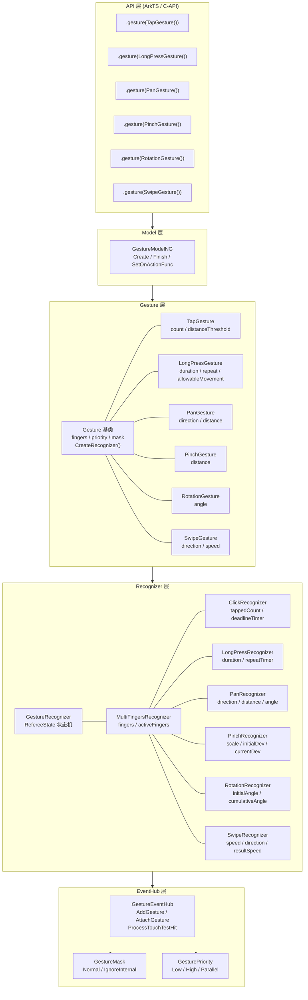
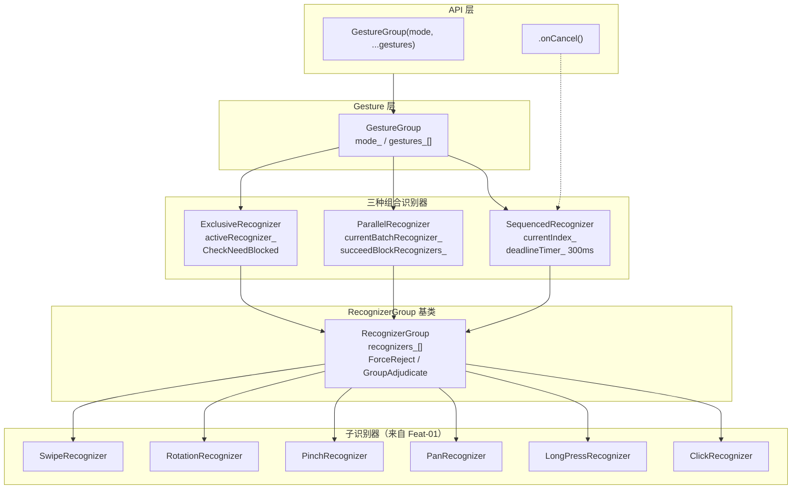
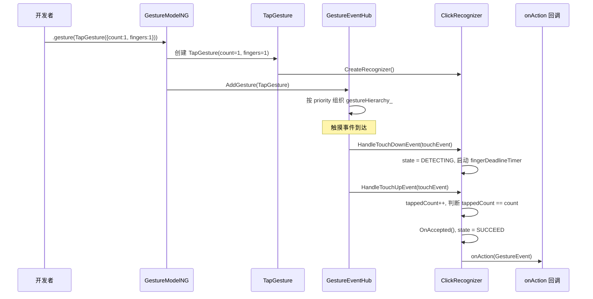
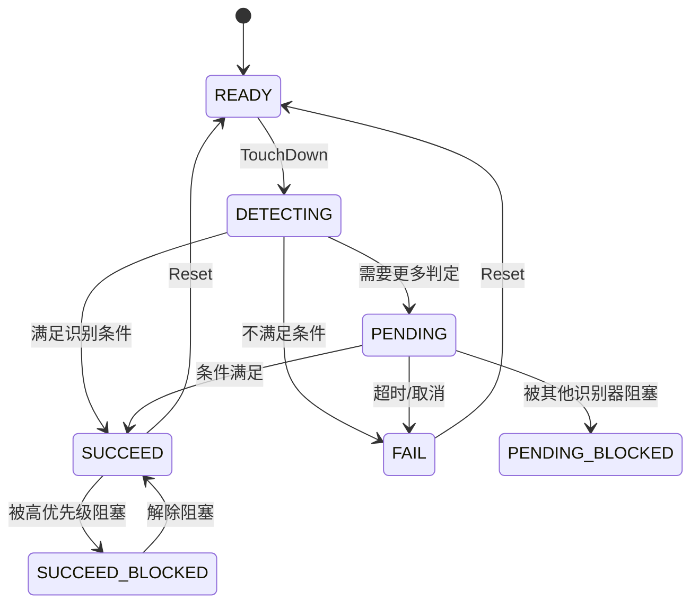

# 架构设计

> 手势能力功能域架构设计：覆盖基础手势（Feat-01）、组合手势（Feat-02）、手势判定（Feat-03）、手势拦截（Feat-04）与手势识别异常恢复增强（Feat-05）。仅 NG 框架（components_ng）。

## 设计元数据

| 字段 | 内容 |
|------|------|
| Design ID | DESIGN-Func-04-04-06 |
| 关联需求 | 已有能力补录（无独立 requirement.md） |
| 关联 Epic | 无 |
| 目标 Feature | Feat-01 基础手势, Feat-02 组合手势, Feat-03 手势判定, Feat-04 手势拦截, Feat-05 手势识别异常恢复增强 |
| 复杂度 | 复杂 |
| 目标版本 | API 7（TapGesture/PanGesture），API 8（LongPress/Pinch/Rotation/Swipe） |
| Owner | ArkUI SIG |
| 状态 | Baselined（Feat-01~Feat-04）+ Draft（Feat-05 增量设计） |

## 需求基线

| 项 | 补充说明 |
|----|----------|
| 问题陈述 | 应用开发者需要通过声明式 API 为组件绑定手势交互（点击、长按、拖动、捏合、旋转、滑动），并控制手势优先级和并行关系 |
| 核心目标 | （Feat-01）提供 6 种基本手势类型 + 3 种挂载 API + GestureMask，覆盖单指到多指、瞬时到连续的完整手势交互场景；（Feat-02）提供 GestureGroup 三种组合模式（Sequential/Parallel/Exclusive）+ onCancel 回调 + 嵌套支持；（Feat-03）提供 GestureReferee 仲裁机制，包括 GestureScope 管理、Adjudicate 流程、阻塞/解除阻塞、Delay 延迟接受和 Bridge Mode；（Feat-04）提供 5 层手势拦截机制：Hit Test 层（hitTestBehavior/onTouchIntercept/onChildTouchTest）、手势收集层（onGestureCollectIntercept）、手势识别层（preventBegin/TouchRestrict）、事件响应层（monopolizeEvents/ResponseCtrl）、原始事件层（onTouch）；（Feat-05）在新一轮首个 down 前恢复未闭环识别器状态，并豁免双击与 swipe 的合法 pending |

## 上下文和现状

### 涉及仓和模块

| 仓库 | 模块路径 | 当前职责 | 本 Feature 影响 |
|------|-----------|----------|-----------------|
| ace_engine | `frameworks/core/components_ng/gestures/` | 手势类型定义（Gesture 子类） | 核心数据结构 |
| ace_engine | `frameworks/core/components_ng/gestures/recognizers/` | 手势识别器（Recognizer 子类） | 核心识别逻辑 |
| ace_engine | `frameworks/core/components_ng/gestures/gesture_info.h` | Gesture 基类、GesturePriority、GestureMask、PanDirection、SwipeDirection | 基础类型定义 |
| ace_engine | `frameworks/core/components_ng/event/gesture_event_hub.h/.cpp` | 组件级手势管理（注册、挂载、触摸事件分发） | 手势挂载入口 |
| ace_engine | `frameworks/core/components_ng/pattern/gesture/gesture_model.h/.cpp` | GestureModelNG（ArkTS→NG 桥接） | API 层 |
| ace_engine | `frameworks/bridge/declarative_frontend/jsview/js_gesture.cpp` | JS 桥接层 | 参数解析 |
| ace_engine | `interfaces/native/native_gesture.h` | C-API (NDK) 手势接口 | 多语言入口 |
| sdk-js | `api/@internal/component/ets/common.d.ts` | ArkTS 手势类型声明 | 类型定义 |
| ace_engine | `frameworks/core/components_ng/gestures/gesture_group.h/.cpp` | GestureGroup 组合手势定义 | Feat-02: 组合手势数据结构 |
| ace_engine | `frameworks/core/components_ng/gestures/recognizers/sequenced_recognizer.h/.cpp` | SequencedRecognizer 顺序识别器 | Feat-02: Sequence 模式 |
| ace_engine | `frameworks/core/components_ng/gestures/recognizers/parallel_recognizer.h/.cpp` | ParallelRecognizer 并行识别器 | Feat-02: Parallel 模式 |
| ace_engine | `frameworks/core/components_ng/gestures/recognizers/exclusive_recognizer.h/.cpp` | ExclusiveRecognizer 互斥识别器 | Feat-02: Exclusive 模式 |
| ace_engine | `frameworks/core/components_ng/gestures/recognizers/recognizer_group.h/.cpp` | RecognizerGroup 组合识别器基类 | Feat-02: 组合识别器公共逻辑 |
| ace_engine | `frameworks/core/components_ng/gestures/gesture_referee.h/.cpp` | GestureReferee 仲裁器 + GestureScope 竞争域 | Feat-03: 手势判定核心 |
| ace_engine | `frameworks/core/common/event_manager.cpp` | EventManager 触摸测试与 scope 注册 | Feat-03: Referee-EventHub 集成 |
| ace_engine | `frameworks/core/components_ng/event/event_constants.h` | HitTestMode 枚举定义 | Feat-04: hitTestBehavior 模式 |
| ace_engine | `frameworks/core/components_ng/event/response_ctrl.h/.cpp` | ResponseCtrl 首节点独占控制 | Feat-04: monopolizeEvents |
| ace_engine | `frameworks/core/event/touch_event.h` | TouchRestrict 触摸类型限制 | Feat-04: TouchRestrict |
| ace_engine | `frameworks/core/pipeline_ng/pipeline_context.cpp` | 触摸主流程（CheckDownEvent/TouchTest/Dispatch） | Feat-05: 首 down 恢复触发时序 |
| ace_engine | `frameworks/core/common/event_manager.h/.cpp` | TouchTest 前清理与 down 轮次信息（`lastDownFingerNumber_`） | Feat-05: 新一轮 down 恢复入口 |
| ace_engine | `frameworks/core/components_ng/gestures/recognizers/click_recognizer.*` | 双击识别与 pending 状态管理 | Feat-05: 双击 pending 豁免 |
| ace_engine | `frameworks/core/components_ng/gestures/recognizers/swipe_recognizer.*` | swipe 识别与 pending 状态管理 | Feat-05: swipe pending 豁免 |

### 适用架构规则

| Rule ID | 适用原因 | 设计结论 | 验证方式 |
|---------|----------|----------|----------|
| OH-ARCH-LAYERING | 手势涉及 API 层→Gesture 层→Recognizer 层→EventHub 层单向调用 | 严格单向：ArkTS→GestureModel→Gesture→Recognizer→GestureEventHub | 代码评审/依赖检查 |
| OH-ARCH-API-LEVEL | TapGesture/PanGesture @since 7，LongPress/Pinch/Rotation/Swipe @since 8，后续有 API 12 distanceThreshold 新增 | 各 API 标注 @since 版本号 | API 评审/XTS |
| OH-ARCH-COMPONENT-BUILD | 手势代码位于 ace_core_ng_source_set | 无需新增 BUILD.gn target | 构建验证 |

## 不涉及项承接

| 维度 | 设计结论 |
|------|----------|
| 性能 | 手势识别在 UI 线程同步执行，单帧内完成状态判定；回调执行不可阻塞 |
| 安全与权限 | N/A — 手势 API 无权限要求 |
| 兼容性 | API 8+ 各手势类型有 @since 差异；ClickRecognizer 多击 slop 阈值与 API 版本相关 |
| API/SDK | Public API（ArkTS + C-API 双通道） |
| IPC/跨进程 | N/A — 手势处理在 UI 线程内 |
| 构建与部件 | N/A — 无新增部件或 target |
| 手势组合（GestureGroup） | Feat-02 已覆盖：3 种组合模式 + onCancel + 嵌套支持 |
| 手势仲裁（GestureReferee） | Feat-03 已覆盖：Adjudicate 流程 + GestureScope + 阻塞/解除阻塞 + Delay + Bridge Mode |

## 关键设计决策

| 决策 ID | 问题 | 推荐方案 | 探索过的替代方案 | 取舍理由 | 影响 |
|---------|------|----------|-----------------|------|------|
| ADR-1 | 手势类型到识别器的映射命名 | TapGesture → ClickRecognizer（保持历史命名），其他 5 种 1:1 同名映射 | 方案A：全部改名（TapGesture→TapRecognizer） | ClickRecognizer 名称来自 Classic 框架历史，改名会破坏内部兼容性和测试用例引用 | 开发者需要注意 API 层（TapGesture）与实现层（ClickRecognizer）的名称差异 |
| ADR-2 | 统一状态机 vs 独立状态机 | 所有识别器共享 RefereeState 状态机（READY→DETECTING→PENDING/SUCCEED/FAIL），但回调类型差异化 | 方案A：每种手势独立状态机（代码重复多）；方案B：完全统一回调（Tap/Swipe 不需要 Update 回调却被迫实现） | 统一状态机减少重复逻辑，差异化回调通过可选 callback 实现（onAction 仅对离散手势，Start/Update/End/Cancel 对连续手势） | 6 种手势分为两类：离散（Tap/Swipe）仅 onAction；连续（LongPress/Pan/Pinch/Rotation）有完整生命周期 |
| ADR-3 | 手势识别阈值策略 | 每种手势使用硬编码常量+可配置参数的混合方式 | 方案A：全部硬编码（不可调）；方案B：全部可配置（过度灵活，增加复杂度） | 关键阈值通过构造参数暴露（如 distance、speed、duration），内部常量（如 multi-finger timeout 300ms、角度 45°）保持固定 | 开发者可调节手指数量、距离、速度、方向，但超时和角度阈值不可调 |
| ADR-4 | GestureMask 语义设计 | Normal（默认）：正常子组件手势处理；IgnoreInternal：仅抑制子组件内置手势，不影响用户自定义手势 | 方案A：三级 Mask（增加 SuppressAll）；方案B：仅 Normal（无 IgnoreInternal） | IgnoreInternal 满足父组件手势覆盖子组件内置手势（如滚动）但不影响子组件自定义手势的需求 | 父组件用 priorityGesture + IgnoreInternal 可拦截子组件的内置滚动但保留自定义 onTap |
| ADR-5 | isLimitFingerCount 语义 | false（默认）：fingers 为最低要求（≥ fingers 即可触发）；true：fingers 必须精确匹配 | 方案A：默认精确匹配（3 指手势在 4 指触摸时不触发，影响用户体验）；方案B：仅最低要求（无法区分 2 指和 3 指捏合） | 默认"最低要求"对多指手势更友好（3 指捏合可用 4 指触发），精确匹配供特殊场景使用 | 开发者需注意 isLimitFingerCount 默认 false 的"最低要求"语义 |
| ADR-F2-1 | Sequence 模式事件传递机制 | 前一手势成功后向下一手势发送合成 TouchDown 事件，两轮手势间有 300ms 超时 | 方案A：不传递事件（下一手势需要用户重新按下）；方案B：共享触摸状态（下一手势自动继承手指位置） | 合成事件传递让用户无需抬起手指即可完成序列（如长按后直接拖动），300ms 超时防止无限等待 | 开发者需注意序列手势间的 300ms 时间窗口 |
| ADR-F2-2 | onCancel 仅限 Sequence 模式 | 仅 SequencedRecognizer 设置 onActionCancel 回调，Parallel 和 Exclusive 模式不触发 | 方案A：三种模式均支持 onCancel；方案B：仅 Sequence 和 Exclusive 支持 | Parallel 模式下多个手势独立运行，"取消"语义不明确；Exclusive 由系统自动选择获胜者，无需通知取消 | 开发者在 Parallel/Exclusive 模式中不应依赖 onCancel |
| ADR-F2-3 | Exclusive 单赢家 + 失败转移 | activeRecognizer_ 失败后通过 UnBlockGesture 解除其他被阻塞的手势继续竞争 | 方案A：一旦 active 失败则整个组失败；方案B：所有手势重新开始竞争 | 失败转移提高互斥组的容错性（如 PanGesture 水平方向失败后自动尝试垂直方向） | 开发者可利用失败转移实现"方向自适应"的拖动 |
| ADR-F2-4 | GestureGroup 支持嵌套 | GestureGroup 可包含其他 GestureGroup，操作递归执行 | 方案A：禁止嵌套（简化实现）；方案B：限制最大嵌套深度 | 嵌套允许复杂组合（如 Sequence 内含 Exclusive 子组），无硬性深度限制 | 过深嵌套可能影响性能，但实际场景很少超过 2-3 层 |
| ADR-F3-1 | Scope-per-touchId 设计 | 每个 touchId 有独立 GestureScope，但阻塞检查跨所有 scope | 方案A：单全局 scope（多指手势互相干扰）；方案B：per-component scope（粒度过细） | 独立 scope 保证多指触摸互不干扰，跨 scope 检查保证全局一致性 | 多指手势判定正确 |
| ADR-F3-2 | Group 层级豁免阻塞 | CheckNeedBlocked 通过 gestureGroup_ 链向上遍历，同一 Group 内识别器不互相阻塞 | 方案A：不豁免（Group 内竞争由 Group 自行处理但 Group 外也会阻塞）；方案B：仅豁免直接父子 | Group 内部的仲裁由 Group（如 ExclusiveRecognizer）自行处理，Referee 不应干预 | Group 内部仲裁逻辑不被 Referee 打断 |
| ADR-F3-3 | BatchAdjudicate 分层路由 | 识别器先路由给父 Group，仅根级到达 Referee | 方案A：所有识别器直接到 Referee（Group 无法自行仲裁）；方案B：Group 注册为唯一识别器（丢失子识别器信息） | 分层路由让 Group 有完全的内部仲裁自主权，Referee 仅处理根级竞争 | Feat-02 组合手势的仲裁逻辑正确 |
| ADR-F3-4 | Delay 延迟接受机制 | RecognizerDelayStatus START/END 允许延迟内嵌容器识别器的接受 | 方案A：无延迟（内嵌容器手势可能过早获胜）；方案B：固定优先级（外层始终优先） | 延迟机制允许在特定场景下让外层容器有机会先处理手势 | 嵌套 Scroll+手势场景正确 |
| ADR-F4-1 | 拦截机制分层执行 | 5 层拦截按 Hit Test → 手势收集 → 手势识别 → 事件响应 → 原始事件有序执行 | 方案A：单一拦截点（无法精细控制）；方案B：全量回调（性能开销大） | 分层拦截允许各阶段有独立的控制点，开发者按需选择 | 各层拦截 API 的 @since 版本不同 |
| ADR-F4-2 | onTouchIntercept 优先于静态 hitTestBehavior | 动态回调覆盖静态配置 | 方案A：静态优先（无法动态响应）；方案B：互斥（两者不可共存） | 动态回调提供更灵活的控制，静态值作为默认回退 | 开发者需注意回调查询的性能影响 |
| ADR-F4-3 | monopolizeEvents 每触摸序列独立 | ResponseCtrl 在触摸序列结束后重置首节点记录 | 方案A：全局独占（跨序列持续）；方案B：仅当前事件独占 | 每序列独立确保不同触摸可由不同组件响应 | 触摸序列结束后 ResponseCtrl 自动重置 |
| ADR-F5-1 | 恢复触发点选择 | 在 `EventManager::CleanRefereeBeforeTouchTest` 执行“新一轮首个 DOWN 恢复” | 方案A：在 `DispatchTouchEvent(DOWN)` 恢复；方案B：依赖超时强清（`EVENT_CLEAR_DURATION`） | TouchTest 前恢复可避免脏状态进入本轮分发，且不依赖超时 | 恢复时序稳定，不影响 MOVE 热路径 |
| ADR-F5-2 | 豁免规则归属 | recognizer 级判定合法 pending 豁免（Click 双击、Swipe） | 方案A：Referee 内部按类型硬编码；方案B：EventManager 分支判断 | 豁免语义贴近 recognizer 状态机，扩展新豁免类型时改动面最小 | 规则集中、可测试、便于演进 |
| ADR-F5-3 | 恢复执行语义 | 使用 `ForceCleanRecognizer` 类路径做无回调状态重置 | 方案A：`OnRejected` 驱动恢复；方案B：`ResetStatus` 逐个手动清字段 | 避免应用侧回调副作用，同时复用现有清理语义 | 对外行为不新增回调，仅内部状态回收 |

## 设计骨架

### 骨架范围

| 骨架项 | 目标 | 不包含 | 验证方式 |
|--------|------|--------|----------|
| Gesture 基类 | fingers/priority/mask/callbacks 定义 | Recognizer 内部状态机 | 编译通过 |
| 6 种 Gesture 子类 | 各手势参数和 CreateRecognizer() | GestureGroup 组合 | 编译通过 |
| 6 种 Recognizer | HandleTouchDown/Move/Up/Cancel + 状态转换 | GestureReferee 仲裁 | 单测 |
| GestureEventHub | AddGesture/AttachGesture/ProcessTouchTestHit | 跨组件手势竞争 | 集成测试 |
| GestureModelNG | Create/Finish/SetOnActionFunc | GestureGroupModel | API 调用测试 |
| C-API | createTapGesture/addGestureToNode 等 | GROUP_GESTURE 相关 | C-API 调用测试 |

### 骨架 Spec 拆分

| Task ID | 目标 | 受影响文件 | AC |
|---------|------|------------|-----|
| TASK-SKELETON-1 | Gesture 基类与 GestureInfo 类型定义 | gesture_info.h | WHEN 创建 Gesture 子类 THEN fingers/priority/mask 正确存储 |
| TASK-SKELETON-2 | RefereeState 状态机 + MultiFingersRecognizer | gesture_recognizer.h, multi_fingers_recognizer.h | WHEN 触摸事件到达 THEN 状态正确转换 |
| TASK-SKELETON-3 | ClickRecognizer + LongPressRecognizer | click_recognizer.cpp, long_press_recognizer.cpp | WHEN 单击/长按 THEN 正确识别 |
| TASK-SKELETON-4 | PanRecognizer + SwipeRecognizer | pan_recognizer.cpp, swipe_recognizer.cpp | WHEN 拖动/滑动 THEN 方向和阈值正确 |
| TASK-SKELETON-5 | PinchRecognizer + RotationRecognizer | pinch_recognizer.cpp, rotation_recognizer.cpp | WHEN 捏合/旋转 THEN scale/angle 正确计算 |
| TASK-SKELETON-6 | GestureEventHub 挂载 + GestureMask | gesture_event_hub.cpp | WHEN gesture/priorityGesture/parallelGesture THEN 优先级和 Mask 正确 |

## 后续 Task 拆分

| Task ID | 目标 | 受影响文件 | 依赖 |
|---------|------|------------|------|
| TASK-1 | Feat-01 基础手势完整行为规格 | Feat-01-basic-gestures-spec.md | 本 Design |
| TASK-2 | Feat-02 组合手势完整行为规格 | Feat-02-gesture-group-spec.md | TASK-1 |
| TASK-3 | Feat-03 手势判定完整行为规格 | Feat-03-gesture-referee-spec.md | TASK-1 |
| TASK-4 | Feat-04 手势拦截完整行为规格 | Feat-04-gesture-intercept-spec.md | TASK-1, TASK-3 |
| TASK-5 | Feat-05 手势识别异常恢复增强 | Feat-05-gesture-recognizer-recovery-spec.md | TASK-1 |

## API 签名与权限

### 新增 API

| API 签名 | 类型 | d.ts 位置 | 权限要求 | SysCap |
|----------|------|-----------|----------|--------|
| `TapGesture(value?: { count?: number; fingers?: number })` | Public | `common.d.ts` | - | - |
| `LongPressGesture(value?: { fingers?: number; repeat?: boolean; duration?: number })` | Public | `common.d.ts` | - | - |
| `PanGesture(value?: { fingers?: number; direction?: PanDirection; distance?: number })` | Public | `common.d.ts` | - | - |
| `PinchGesture(value?: { fingers?: number; distance?: number })` | Public | `common.d.ts` | - | - |
| `RotationGesture(value?: { fingers?: number; angle?: number })` | Public | `common.d.ts` | - | - |
| `SwipeGesture(value?: { fingers?: number; direction?: SwipeDirection; speed?: number })` | Public | `common.d.ts` | - | - |
| `gesture(gesture: GestureType, mask?: GestureMask): T` | Public | `common.d.ts` | - | - |
| `priorityGesture(gesture: GestureType, mask?: GestureMask): T` | Public | `common.d.ts` | - | - |
| `parallelGesture(gesture: GestureType, mask?: GestureMask): T` | Public | `common.d.ts` | - | - |
| `GestureGroup(mode: GestureMode, ...gesture: GestureType[]): GestureGroupInterface` | Public | `gesture.d.ts` | - | - |
| `GestureGroupInterface.onCancel(event: () => void): GestureGroupInterface` | Public | `gesture.d.ts` | - | - |

**C-API (NDK)：**

| API | 参数 | 功能 |
|-----|------|------|
| `createTapGesture(countNum, fingersNum)` | 点击次数, 手指数 | 创建点击手势 |
| `createLongPressGesture(fingersNum, repeatResult, durationNum)` | 手指数, 是否重复, 持续时间 | 创建长按手势 |
| `createPanGesture(fingersNum, directions, distanceNum)` | 手指数, 方向掩码, 距离 | 创建平移手势 |
| `createPinchGesture(fingersNum, distanceNum)` | 手指数, 距离 | 创建捏合手势 |
| `createRotationGesture(fingersNum, angleNum)` | 手指数, 角度 | 创建旋转手势 |
| `createSwipeGesture(fingersNum, directions, speedNum)` | 手指数, 方向, 速度 | 创建滑动手势 |
| `addGestureToNode(node, recognizer, priority, mask)` | 节点, 识别器, 优先级, 掩码 | 挂载手势到节点 |
| `hitTestBehavior(value: HitTestMode): T` | Public | `common.d.ts` | - | - |
| `onTouchIntercept(callback: (event: TouchEvent) => HitTestMode): T` | Public | `common.d.ts` | - | - |
| `onGestureCollectIntercept(callback: GestureCollectInterceptCallback): T` | Public | `common.d.ts` | - | - |
| `onChildTouchTest(callback: (value: Array<TouchTestInfo>) => TouchResult): T` | Public | `common.d.ts` | - | - |
| `monopolizeEvents(monopolize: boolean): T` | Public | `common.d.ts` | - | - |
| `onTouch(event: (event: TouchEvent) => void): T` | Public | `common.d.ts` | - | - |

### 变更/废弃 API

| 原有 API | 变更类型 | 新 API | 迁移说明 |
|----------|----------|--------|----------|
| — | — | — | 无变更/废弃 API |

## 构建系统影响

### BUILD.gn 变更

```
无变更。手势实现位于 ace_core_ng_source_set，已有构建配置覆盖。
```

### bundle.json 变更

无变更。

## 可选设计扩展

### 架构图

<!-- 展开 -->



#### 组合手势架构图（Feat-02）



### 数据流/控制流

<!-- 展开 -->

| 步骤 | 调用方 | 被调用方 | 数据/接口 | 说明 |
|------|--------|----------|-----------|------|
| 1 | 开发者 ArkTS | GestureModelNG::Create | priorityNum, gestureMaskNum | 桥接层创建手势 |
| 2 | GestureModelNG | TapGesture::CreateRecognizer() | count, fingers, distanceThreshold | 创建对应识别器 |
| 3 | ViewAbstract::SetGesture | GestureEventHub::AddGesture | RefPtr\<Gesture\> | 挂载到组件 |
| 4 | GestureEventHub | CreateRecognizer → gestureHierarchy_ | RefPtr\<NGGestureRecognizer\> | 构建识别器层级 |
| 5 | 平台触摸事件 | GestureEventHub::ProcessTouchTestHit | TouchEvent | 触摸事件到达 |
| 6 | GestureEventHub | ClickRecognizer::HandleTouchDownEvent | TouchEvent | 分发给识别器 |
| 7 | ClickRecognizer | RefereeState::DETECTING | — | 开始识别 |
| 8 | ClickRecognizer::HandleTouchUpEvent | OnAccepted / OnRejected | GestureEvent | 识别完成 |
| 9 | 回调执行 | 开发者 onAction 回调 | GestureEvent | 触发用户回调 |

### 时序设计

<!-- 展开 -->



### 数据模型设计

<!-- 展开 -->

```typescript
// ArkTS API 层类型
type GestureType = TapGestureInterface | LongPressGestureInterface |
  PanGestureInterface | PinchGestureInterface | RotationGestureInterface |
  SwipeGestureInterface;

enum GestureMask { Normal, IgnoreInternal }
enum PanDirection { None, Horizontal, Left, Right, Vertical, Up, Down, All }
enum SwipeDirection { None, Horizontal, Vertical, All }
enum GestureMode { Sequence, Parallel, Exclusive }
```

#### 组合手势数据模型（Feat-02）

```cpp
// GestureGroup 参数
class GestureGroup : public Gesture {
    GestureMode mode_;
    std::vector<RefPtr<Gesture>> gestures_;
    // onCancel only set for Sequence mode
};

// RecognizerGroup 基类
class RecognizerGroup : public MultiFingersRecognizer {
protected:
    std::list<RefPtr<NGGestureRecognizer>> recognizers_;
    bool remainChildOnResetStatus_ = false;
};

// SequencedRecognizer
class SequencedRecognizer : public RecognizerGroup {
    int32_t currentIndex_ = 0;
    CancelableCallback<void()> deadlineTimer_;  // 300ms
    bool isEventHandoverNeeded_ = false;
};

// ParallelRecognizer
class ParallelRecognizer : public RecognizerGroup {
    RefPtr<NGGestureRecognizer> currentBatchRecognizer_;
    std::vector<RefPtr<NGGestureRecognizer>> succeedBlockRecognizers_;
};

// ExclusiveRecognizer
class ExclusiveRecognizer : public RecognizerGroup {
    RefPtr<NGGestureRecognizer> activeRecognizer_;
};
```

```cpp
// C++ 框架层数据结构

// 手势优先级
enum class GesturePriority { Begin = -1, Low = 0, High = 1, Parallel = 2, End };

// 手势掩码
enum class GestureMask { Begin = -1, Normal = 0, IgnoreInternal = 1, End };

// 识别器状态
enum class RefereeState { READY, DETECTING, PENDING, PENDING_BLOCKED,
    SUCCEED_BLOCKED, SUCCEED, FAIL };

// 手势基类
class Gesture {
    int32_t fingers_ = 1;
    bool isLimitFingerCount_ = false;
    GesturePriority priority_ = GesturePriority::Low;
    GestureMask gestureMask_ = GestureMask::Normal;
    // callbacks: onAction, onActionStart, onActionUpdate, onActionEnd, onActionCancel
    virtual RefPtr<NGGestureRecognizer> CreateRecognizer() = 0;
};

// TapGesture 参数
class TapGesture : public Gesture {
    int32_t count_ = 1;
    Dimension distanceThreshold_ = infinity;
};

// LongPressGesture 参数
class LongPressGesture : public Gesture {
    bool repeat_ = false;
    int32_t duration_ = 500;
    double allowableMovement_ = 15.0;
};

// PanGesture 参数
class PanGesture : public Gesture {
    PanDirection direction_;
    double distance_ = 0.0;
};

// PinchGesture 参数
class PinchGesture : public Gesture {
    double distance_ = 0.0;
};

// RotationGesture 参数
class RotationGesture : public Gesture {
    double angle_ = 1.0;
};

// SwipeGesture 参数
class SwipeGesture : public Gesture {
    SwipeDirection direction_;
    Dimension speed_;
};
```

### 算法与状态机

<!-- 展开 -->



## 详细设计

### 手势基类与状态机

所有手势识别器继承自 `GestureRecognizer`（`recognizers/gesture_recognizer.h`），核心状态机为 `RefereeState`：

| 状态 | 含义 |
|------|------|
| READY | 空闲，等待触摸事件 |
| DETECTING | 正在识别中 |
| PENDING | 需要更多信息才能判定（等待超时或更多手指） |
| PENDING_BLOCKED | 被其他识别器阻塞（等待仲裁结果） |
| SUCCEED | 识别成功 |
| SUCCEED_BLOCKED | 识别成功但被阻塞 |
| FAIL | 识别失败 |

关键虚方法：`HandleTouchDownEvent` / `HandleTouchMoveEvent` / `HandleTouchUpEvent` / `HandleTouchCancelEvent` / `OnAccepted` / `OnRejected` / `OnPending` / `OnBlocked`。

多指手势继承 `MultiFingersRecognizer`（`multi_fingers_recognizer.h`），提供 `fingers_`（手指数要求）、`isLimitFingerCount_`（是否严格匹配）、`activeFingers_`（活跃手指列表）等基础能力。

### TapGesture → ClickRecognizer

TapGesture 创建 ClickRecognizer（`click_recognizer.cpp`），非 TapRecognizer——历史命名保持兼容。

**关键阈值：**

| 常量 | 值 | 说明 |
|------|-----|------|
| `MULTI_FINGER_TIMEOUT` | 300ms | 多指按下等待超时 |
| `MULTI_TAP_TIMEOUT` | 300ms | 多击间隔超时 |
| `MAX_THRESHOLD` | 20.0 | 单次点击移动容差 |
| `MAX_THRESHOLD_MANYTAP` | 60vp | 多击焦距容差 |

**识别流程：**
1. DOWN → 追踪手指，若未达 `fingers_` 则启动 `fingerDeadlineTimer_`（300ms）
2. MOVE → 检查移动距离是否超过 `distanceThreshold_`（默认 inf）或 `MAX_THRESHOLD`（20vp）
3. UP → 所有手指抬起 → `tappedCount_++`
4. 若 `tappedCount_ == count_` → ACCEPT，否则启动 `tapDeadlineTimer_`（300ms）等待下次点击
5. 超时未达 `count_` → REJECT

### LongPressGesture → LongPressRecognizer

**关键阈值：**

| 常量 | 值 | 说明 |
|------|-----|------|
| `DEFAULT_LONGPRESS_DURATION` | 500ms | 默认长按时间 |
| `allowableMovement_` | 15.0px | 长按过程允许的最大移动 |

**识别流程：**
1. DOWN → 启动 `deadlineTimer_`（duration 毫秒）
2. MOVE → 检查移动是否超过 `allowableMovement_`
3. 超时 → ACCEPT，触发 onAction
4. 若 `repeat_ == true` → 启动 repeat timer，每隔 `duration_` 持续触发 onAction

**回调类型：** onAction（触发/重复触发）、onActionEnd（手指抬起）、onActionCancel（取消）

### PanGesture → PanRecognizer

**关键阈值：**

| 常量 | 值 | 说明 |
|------|-----|------|
| `DEFAULT_PAN_DISTANCE` | 5.0vp | 默认触发距离 |
| `angle_` | 45° | 方向判定角度阈值 |
| `MIN_SPEED_THRESHOLD` | 500.0f | 最小速度阈值 |

**方向过滤算法（`IsPanGestureAccept`）：**
1. 计算总位移（dx, dy）
2. 计算角度 θ = atan2(dy, dx)
3. ALL 方向 → 直接检查总距离
4. HORIZONTAL → 检查 |dx|，若 θ 与水平方向夹角 > 45° 则拒绝
5. VERTICAL → 检查 |dy|，类似角度判定

**回调类型：** onActionStart（识别成功）、onActionUpdate（移动中持续触发）、onActionEnd（手指抬起）、onActionCancel（取消）

### PinchGesture → PinchRecognizer

**关键阈值：**

| 常量 | 值 | 说明 |
|------|-----|------|
| `DEFAULT_PINCH_DISTANCE` | 5.0vp | 默认触发距离 |
| `DEFAULT_PINCH_FINGERS` | 2 | 默认手指数 |

**Scale 计算算法（`ComputeAverageDeviation`）：**
1. 计算焦点（所有活跃手指的平均 X/Y）
2. 计算各手指到焦点的平均偏差：`aveDev = sqrt(aveDevX² + aveDevY²)`
3. `scale_ = currentDev_ / initialDev_`

**识别流程：**
1. DOWN → 追踪手指，当手指数 ≥ fingers 时计算 `initialDev_`
2. MOVE → 计算 `currentDev_`，若 `|currentDev_ - initialDev_| ≥ distance_` → ACCEPT
3. 持续 MOVE → 更新 `scale_`，触发 onActionUpdate

### RotationGesture → RotationRecognizer

**关键阈值：**

| 常量 | 值 | 说明 |
|------|-----|------|
| `DEFAULT_ROTATION_FINGERS` | 2 | 默认手指数 |
| `ONE_CIRCLE` | 360.0 | 一圈角度 |
| 角度范围 | [-180°, 180°] | 归一化范围 |

**角度计算算法（`ComputeAngle`）：**
1. 取前两个活跃手指（`activeFingers_`）
2. 计算向量角度：`angle = atan2(fy - sy, fx - sx) * 180 / π`
3. 累计角度变化：`cumulativeAngle_`
4. 若 `|cumulativeAngle_| ≥ angle_` → ACCEPT

**角度归一化：** 将角度映射到 [-180°, 180°] 范围，跨 ±180° 边界时正确累加。

### SwipeGesture → SwipeRecognizer

**关键阈值：**

| 常量 | 值 | 说明 |
|------|-----|------|
| `DEFAULT_SLIDE_SPEED` | 300.0 vp/s | 默认速度阈值 |
| `SWIPE_MOVE_LIMITED` | 3.0 | 移动限制 |
| 方向角度容差 | 45° | 方向判定容差 |

**识别算法：**
1. MOVE → 通过 `CheckAngle()` 检查方向一致性（角度变化不超过 45°）
2. UP → 计算速度：`speed = distance / duration`
3. 若 `resultSpeed_ ≥ speed_` 且方向匹配 → ACCEPT
4. 方向判定：HORIZONTAL（|θ| ≤ 45°）、VERTICAL（||θ| - 90°| ≤ 45°）

**回调类型：** 仅 onAction（离散手势，识别完成时触发一次）

### 手势挂载与 GestureMask

通过 `GestureEventHub`（`gesture_event_hub.h`）实现手势挂载：

| API | 内部实现 | 说明 |
|-----|----------|------|
| `gesture()` | `AddGesture()` + priority=Low | 普通优先级手势 |
| `priorityGesture()` | `AddGesture()` + priority=High | 高优先级手势 |
| `parallelGesture()` | `AddGesture()` + priority=Parallel | 并行手势 |

**GestureMask 语义：**
- `Normal`（默认）：正常子组件手势处理，父子手势按优先级竞争
- `IgnoreInternal`：仅忽略子组件的内置手势（如 List 的滚动），不影响子组件通过 gesture() 添加的用户自定义手势

**isLimitFingerCount 语义：**
- `false`（默认）：`fingers` 为最低要求，触摸手指数 ≥ fingers 即可触发
- `true`：触摸手指数必须精确等于 `fingers`，多一个或少一个都不触发

### GestureGroup 组合手势

GestureGroup 通过 `gesture_group.h` 实现三种组合模式，`CreateRecognizer()` 根据模式创建对应 RecognizerGroup 子类：

| 模式 | 识别器类 | 核心变量 |
|------|----------|----------|
| Sequence | `SequencedRecognizer` | `currentIndex_`（当前手势索引）、`deadlineTimer_`（300ms 超时） |
| Parallel | `ParallelRecognizer` | `currentBatchRecognizer_`（当前请求识别器）、`succeedBlockRecognizers_`（被阻塞的成功列表） |
| Exclusive | `ExclusiveRecognizer` | `activeRecognizer_`（当前活跃识别器） |

三种识别器均继承 `RecognizerGroup`（`recognizer_group.h`），提供 `recognizers_`（子识别器列表）、`ForceReject()`（递归拒绝）、`GroupAdjudicate()`（向上传递仲裁）等公共能力。

#### SequencedRecognizer（顺序组合）

手势按顺序识别，前一个成功后自动推进到下一个：

1. DOWN/UP 事件仅分发给 `currentIndex_` 指向的子识别器
2. 子识别器 ACCEPT → `UpdateCurrentIndex()` 递增索引，向下一识别器发送合成 TouchDown
3. 子识别器 REJECT → 从 currentIndex_ 到末尾全部拒绝，触发 onCancel
4. `currentIndex_` 到达最后一个手势且 ACCEPT → 整个序列成功
5. UP 事件在 PENDING 状态启动 `deadlineTimer_`（300ms），超时则序列失败

**事件传递机制**：`SendTouchEventToNextRecognizer()` 向下一识别器发送合成 DOWN 事件。连续两个 LongPressRecognizer 时自动调整时间戳（beforeDuration），防止第二个立即触发。

**onCancel 回调**：仅在 Sequence 模式设置（`GestureGroup::CreateRecognizer` 仅对 Sequence 调用 `SetOnActionCancel`），触发条件：子手势 REJECT、超时、PENDING 状态重置。

#### ParallelRecognizer（并行组合）

所有子识别器同时接收触摸事件，多个子手势可同时成功：

1. HandleEvent 将事件分发给所有子识别器
2. 子手势 ACCEPT → 若组已 SUCCEED 则直接接受；若组被阻塞则加入 `succeedBlockRecognizers_`
3. 子手势 REJECT → 仅当所有子手势均失败（`CheckAllFailed`）时拒绝整个组
4. 组被接受 → 批量接受 `currentBatchRecognizer_` 和所有 `succeedBlockRecognizers_`

#### ExclusiveRecognizer（互斥组合）

仅一个子手势可获胜，先到先得：

1. 无 activeRecognizer_ 时广播事件给所有子手势（竞争阶段）
2. 子手势请求 PENDING → 通过 `CheckNeedBlocked` 检查是否有其他子手势已 PENDING，有则阻塞
3. 第一个成功的子手势成为 `activeRecognizer_`，后续 MOVE/DOWN 仅分发给它
4. activeRecognizer_ REJECT → `UnBlockGesture` 查找被阻塞的手势（PENDING_BLOCKED/SUCCEED_BLOCKED）继续竞争
5. 组接受 → activeRecognizer_ 被接受，所有其他子手势被 `ForceReject`
6. UP/CANCEL 事件始终广播给所有子手势（用于状态清理）

### GestureReferee 手势仲裁

GestureReferee 是手势系统的中央仲裁器（`gesture_referee.h`），负责在多个竞争的识别器中做出唯一判定。

#### GestureScope（竞争域）

每个 touchId 对应一个独立的 GestureScope（`gesture_referee.h`），管理该触摸事件上的竞争识别器集合：

| 成员 | 类型 | 用途 |
|------|------|------|
| `recognizers_` | `list<WeakPtr<NGGestureRecognizer>>` | 竞争识别器列表 |
| `touchId_` | `size_t` | 关联的触摸 ID |
| `isDelay_` | `bool` | 延迟关闭标志 |
| `hasGestureAccepted_` | `bool` | 是否已有手势获胜 |

关键方法：
- `AddMember` / `DelMember`：添加/移除识别器（Existed() 检查防重复）
- `CheckNeedBlocked`：检查是否需要阻塞（遍历查找 PENDING 状态的非同组识别器）
- `OnAcceptGesture`：接受手势并拒绝所有其他（winner-takes-all，跳过 Bridge Mode）
- `UnBlockGesture`：查找第一个 PENDING_BLOCKED/SUCCEED_BLOCKED 识别器

#### Adjudicate 流程

Recognizer 完成识别判定后通过 `BatchAdjudicate` 将请求路由到 Referee：

```
识别器 → BatchAdjudicate → 检查父 Group?
  ├── 有父 Group → Group.Adjudicate（Feat-02 组合仲裁）
  └── 无父 Group → GestureReferee.Adjudicate → Handle*Disposal
```

三种 Disposal 处理：

| Disposal | 处理流程 |
|----------|----------|
| ACCEPT | 检查 delay → 遍历所有 scope CheckNeedBlocked → 阻塞则 OnBlocked() → 无阻塞则 AboutToAccept + 通知所有 scope OnAcceptGesture |
| PENDING | 检查已 PENDING → 遍历所有 scope CheckNeedBlocked → 阻塞则 OnBlocked() → 无阻塞则 OnPending() |
| REJECT | 检查已 FAIL → OnRejected() → 若之前为 PENDING 则搜索所有 scope UnBlockGesture → 解除阻塞 |

#### 阻塞判定机制

`CheckNeedBlocked` 遍历 scope 中所有识别器：
1. 找到 PENDING 状态的识别器
2. 若与被检查识别器是同一实例 → 不阻塞
3. 通过 `gestureGroup_` 链向上遍历，若两者在同一 Group 层级 → 不阻塞（Group 豁免）
4. 否则 → 阻塞（返回 true）

#### Delay 延迟接受

`RecognizerDelayStatus` 控制延迟接受机制：
- `START`：内嵌容器识别器的 ACCEPT 请求被存储到 `delayRecognizer_` 而不立即处理
- `END`：`RecallOnAcceptGesture()` 处理延迟的识别器

#### Bridge Mode

Bridge Mode 识别器（`bridgeMode_=true`）：
- `OnAcceptGesture` 跳过 Bridge Mode 识别器，不调用 OnRejected
- `HandleEvent` 中直接返回 true，不处理触摸事件

### 手势拦截 (Feat-04)

手势拦截覆盖 5 层拦截机制，从触摸测试到原始事件消费，按管线顺序依次执行：

```
Touch Event → [Hit Test Layer] → [Gesture Collect Layer] → [Gesture Recognition Layer] → [Event Response Layer] → [Raw Event Layer]
```

#### Hit Test 层

`hitTestBehavior(HitTestMode)` 提供 7 种触摸测试模式，在 `FrameNode::TouchTest()` 中生效：

| 模式 | 自身 | 子组件 | 被标记节点 |
|------|------|--------|------------|
| Default | 参与 | 参与 | 屏蔽 |
| Block | 响应 | 阻止 | 阻止 |
| Transparent | 参与 | 参与 | 不屏蔽 |
| None | 不响应 | 正常 | 正常 |
| BlockHierarchy | 阻止低优先级兄弟和父节点 | — | — |
| BlockDescendants | 不响应 | 阻止所有后代 | — |
| TransparentSelf | 根据事件消费动态决定 | 正常 | 正常 |

`onTouchIntercept(callback)` 在 `GestureEventHub::ProcessTouchTestHit()` 中调用，回调返回值覆盖静态 `hitTestBehavior`。若未设置回调则退回静态值。回调接收 `TouchEventInfo`，返回 `HitTestMode`。

`onChildTouchTest(callback)` 在子组件触摸测试阶段调用，回调接收 `TouchTestInfo` 数组，返回 `TouchResult` 控制子组件的分发策略。

#### 手势收集层

`onGestureCollectIntercept(callback)` 在手势收集完成后、事件分发前执行（`GestureEventHub::OnCollectTouchTarget()`），提供 5 种干预策略：

| 策略 | 效果 |
|------|------|
| CONTINUE | 不干预 |
| DISCARD_LOWER | 阻止手势向祖先冒泡 |
| DISCARD_HIGHER | 丢弃所有已收集目标 |
| DISCARD_SELF | 丢弃自身但保留子组件 |
| DISCARD_LOWER_PRIORITY_SIBLINGS | 阻止低优先级兄弟节点 |

#### 手势识别层

- **preventBegin_**：`NGGestureRecognizer` 的内部标志。当 `IsPreventBegin()` 返回 true 时，`HandleEvent()` 直接返回 true 不处理触摸事件。通过 `SetPreBeginResult()` 设置。
- **TouchRestrict**：位标志枚举，从父组件传递到子组件。包含 CLICK、LONG_PRESS、SWIPE_LEFT/RIGHT/UP/DOWN 等位，对应类型的识别器在 `HandleEvent` 中检查 `touchRestrict_`，若匹配则不处理。

#### 事件响应层

`monopolizeEvents(true)` 通过 `ResponseCtrl` 实现首节点独占：
- `ResponseCtrl::TrySetFirstResponse(node)` 在首个节点 AboutToAccept 时记录首节点
- `ResponseCtrl::ShouldResponse(node)` 检查当前节点是否为首节点，非首节点返回 false
- 独占范围为单个触摸序列，序列结束后 `ResponseCtrl` 重置

#### 原始事件层

`onTouch(callback)` 在触摸事件到达手势识别器之前触发回调。回调接收 `TouchEvent`，可在回调中消费事件，影响后续手势识别。

### 手势识别异常恢复增强（Feat-05）

#### 时序与触发判定

Feat-05 不改现有主流程，只在已有链路插入恢复判定：

1. `PipelineContext::OnTouchEvent` 先调用 `EventManager::CheckDownEvent`（`pipeline_context.cpp:3577`）。
2. down 分支进入 `EventManager::TouchTest`，并在最前调用 `CleanRefereeBeforeTouchTest`（`event_manager.cpp:110-125`）。
3. 在 `CleanRefereeBeforeTouchTest` 增加“新一轮首个 down”恢复入口（当前函数位于 `event_manager.cpp:276-312`）。

触发条件：

- `touchPoint.type == TouchType::DOWN`
- `lastDownFingerNumber_ == 0`（上一轮无活动手指，见 `event_manager.h:606`）
- 非 post-event referee 路径（`eventHandleId / EVENT_HANDLE == 0`）

不触发场景：

- 重复同 id down（已由 `CheckDownEvent` 既有强清逻辑处理，`event_manager.cpp:1003-1033`）
- 多指第二根及后续 down（`lastDownFingerNumber_ > 0`）
- MOVE/UP/CANCEL

#### 恢复算法设计

恢复扫描下沉到 `GestureReferee`，复用已存在的递归遍历能力：

- `GestureReferee::ForEachRecognizer` 遍历所有 scope，并通过 `WalkRecognizerForEach` 递归到 `RecognizerGroup` 子识别器（`gesture_referee.cpp:620-669`）
- 扫描中仅处理 `state != READY` 的识别器
- 先做豁免判定，再执行重置

建议接口（实现阶段可微调命名）：

- `GestureReferee::RecoverRecognizersOnNewRoundDown()`
- `NGGestureRecognizer::CanRemainPendingOnNewRoundDown() const`（默认 false）

恢复语义：

- 对“非 READY 且非豁免”识别器执行 `ForceCleanRecognizer()`
- 不通过 `OnRejected()` 驱动恢复，避免新增应用侧回调副作用

#### 豁免判定

豁免只保留两类合法 pending：

| Recognizer | 豁免条件 |
|------------|----------|
| ClickRecognizer | `GetCount() == 2` 且 `state in {PENDING, PENDING_BLOCKED}` |
| SwipeRecognizer | `state in {PENDING, PENDING_BLOCKED}` |

依据：

- 双击 pending 来自 `ClickRecognizer::HandleTouchUpEvent` 的 `Adjudicate(PENDING)`（`click_recognizer.cpp:388-407`）
- swipe pending 来自 `SwipeRecognizer::HandleTouchUpEvent` 的 `Adjudicate(PENDING)`（`swipe_recognizer.cpp:195-198`）

其余状态（`DETECTING/SUCCEED_BLOCKED/SUCCEED/FAIL`）均按未闭环残留恢复。

#### 状态矩阵

| 当前状态 | 双击 Click | Swipe | 其他 Recognizer |
|----------|------------|-------|-----------------|
| READY | 保持 | 保持 | 保持 |
| DETECTING | 恢复 | 恢复 | 恢复 |
| PENDING | 豁免 | 豁免 | 恢复 |
| PENDING_BLOCKED | 豁免 | 豁免 | 恢复 |
| SUCCEED_BLOCKED | 恢复 | 恢复 | 恢复 |
| SUCCEED | 恢复 | 恢复 | 恢复 |
| FAIL | 恢复 | 恢复 | 恢复 |

#### 伪代码

```cpp
void EventManager::CleanRefereeBeforeTouchTest(TouchEvent touchPoint, bool needAppend)
{
    // ... existing logic
    if (touchPoint.type == TouchType::DOWN &&
        lastDownFingerNumber_ == 0 &&
        touchPoint.eventHandleId / EVENT_HANDLE == 0) {
        currentReferee->RecoverRecognizersOnNewRoundDown();
    }
    // ... existing logic
}

void GestureReferee::RecoverRecognizersOnNewRoundDown()
{
    ForEachRecognizer([&](const RefPtr<NGGestureRecognizer>& recognizer) {
        if (!recognizer || recognizer->GetRefereeState() == RefereeState::READY) {
            return true;
        }
        if (recognizer->CanRemainPendingOnNewRoundDown()) {
            return true;
        }
        recognizer->ForceCleanRecognizer();
        return true;
    });
}
```

#### 验证设计

UnitTest：

- `EventManager`：首个 down 才触发恢复、重复 down 兼容、多指第二根 down 不触发
- `gestures`：双击 pending 豁免、swipe pending 豁免、非豁免状态恢复、group 递归恢复

HostPreview：

- `examples/SpecTest/.../Feat-05-gesture-recognizer-recovery`
- 场景：单击、双击、swipe 默认行为与基线一致
- 目标：验证“内部恢复增强”不改变外显默认交互

## 风险和开放问题

| 项 | 类型 | 影响 | 处理方式 | Owner |
|----|------|------|----------|-------|
| TapGesture→ClickRecognizer 命名不一致 | 架构 | 低 | 历史兼容性保留，在文档和风险表中标注 | ArkUI SIG |
| ClickRecognizer 多击 slop 阈值 60vp 较大 | 架构 | 低 | 当前实现即规格，标注为设计决策 | 文档/标注 |
| Pan 方向判定角度硬编码 45° | 架构 | 低 | 不可配置，有明确需求时可考虑开放参数 | 文档/标注 |
| 手势回调在 UI 线程同步执行 | 性能 | 中 | 开发者回调不可执行耗时操作，否则阻塞手势响应 | 文档/标注 |
| Pinch scale 计算基于平均偏差比而非像素距离 | 架构 | 低 | 与主流框架（CSS/Android）算法一致，标注为设计决策 | 文档/标注 |
| onCancel 仅在 Sequence 模式生效 | 架构 | 低 | Parallel/Exclusive 不设置 onActionCancel，开发者不应在这些模式中依赖 onCancel | 文档/标注 |
| Sequence 事件传递机制对连续 LongPress 有特殊处理 | 架构 | 低 | beforeDuration 时间戳调整仅对连续 LongPress 生效，其他手势组合无特殊处理 | 文档/标注 |
| GestureGroup 嵌套无深度限制 | 性能 | 低 | 实际场景很少超过 2-3 层，但理论可无限嵌套 | 文档/标注 |
| GestureReferee 跨 scope 遍历阻塞检查 | 性能 | 低 | scope 数量通常 ≤ 手指数（≤10），遍历开销可忽略 | 文档/标注 |
| BatchAdjudicate 无 Referee 时直接拒绝 | 架构 | 低 | 边界条件，正常流程 Referee 始终存在 | 文档/标注 |
| Delay 机制依赖外部触发 END | 架构 | 低 | 若外部未设置 END 则延迟的识别器永远不会被处理 | 文档/标注 |
| hitTestBehavior 7 种模式语义复杂 | 架构 | 中 | 开发者容易混淆 Block/BlockDescendants/BlockHierarchy，需文档详尽说明 | 文档/标注 |
| onTouchIntercept 回调在触摸测试阶段同步执行 | 性能 | 中 | 回调执行时间直接影响触摸响应延迟，开发者需避免耗时操作 | 文档/标注 |
| onGestureCollectIntercept 5 种策略组合效果不直观 | 架构 | 低 | 多层拦截叠加时行为难以预测，标注为设计决策 | 文档/标注 |
| monopolizeEvents 独占范围仅限单触摸序列 | 架构 | 低 | 多指场景下每个触摸序列独立独占，可能不符合开发者直觉 | 文档/标注 |
| TouchRestrict 位标志从父向子传递但无回传机制 | 架构 | 低 | 子组件无法感知被限制的原因，调试困难 | 文档/标注 |
| Feat-05 误清合法 pending | 兼容性 | 中 | recognizer 级豁免 + 双击/swipe 专项单测 | ArkUI SIG |
| Feat-05 恢复入口误判为首 down | 架构 | 中 | 以 `lastDownFingerNumber_==0` 约束，并覆盖多指/重复 down 用例 | ArkUI SIG |
| Feat-05 扫描引入热路径抖动 | 性能 | 低 | 仅首 down 执行 O(n) 扫描，不进入 MOVE 路径 | ArkUI SIG |

## 设计审批

- [x] 需求基线已确认，设计覆盖 P0/P1 AC
- [x] 不涉及项已承接，N/A 和展开项都有结论
- [x] 涉及仓和模块职责清楚
- [x] 适用架构规则已识别并形成设计结论
- [x] 分层和子系统边界合规
- [x] API 变更有签名、权限、错误码和兼容性说明
- [x] BUILD.gn/bundle.json 影响明确
- [x] 设计输出和后续 Task 拆分明确
- [x] 关键设计决策有理由和影响说明
- [x] 风险和开放问题有 Owner

**结论:** Feat-01~Feat-04 已基线化，Feat-05 详细设计已补充，待本轮评审确认。
