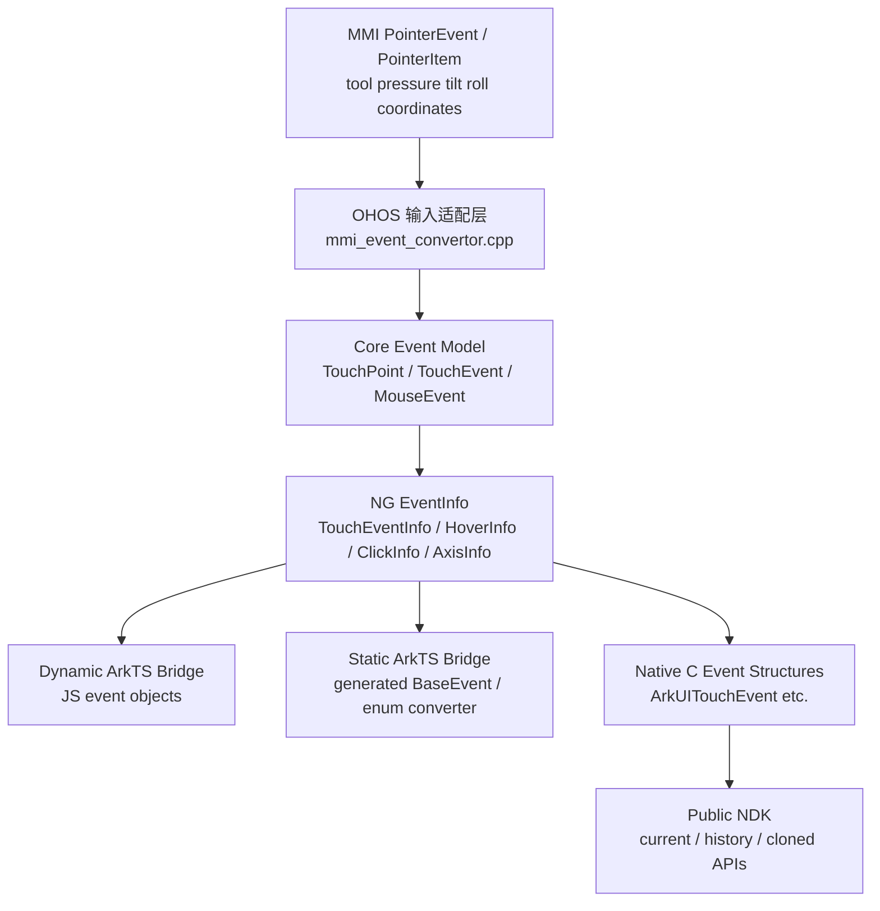
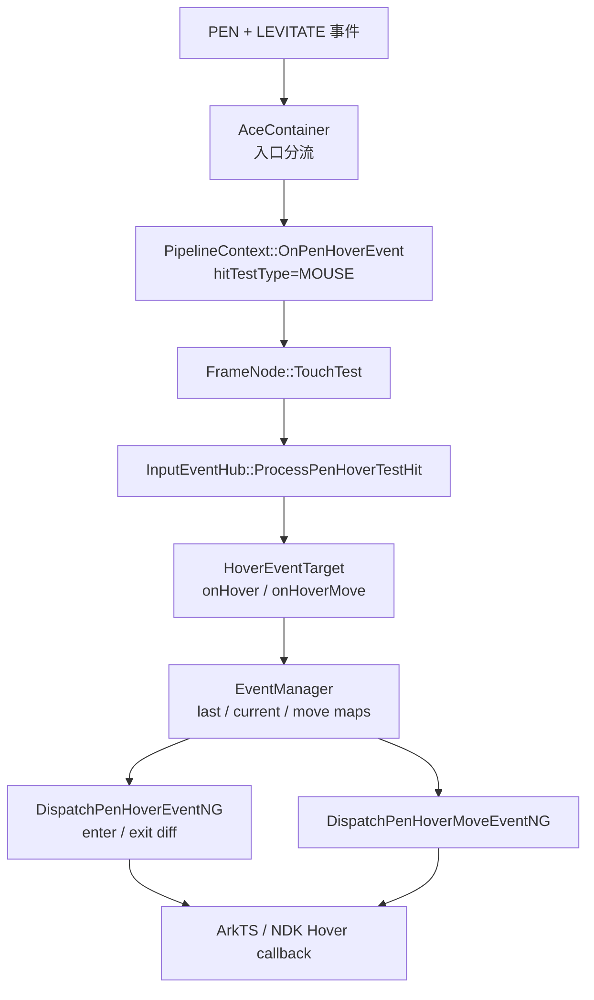
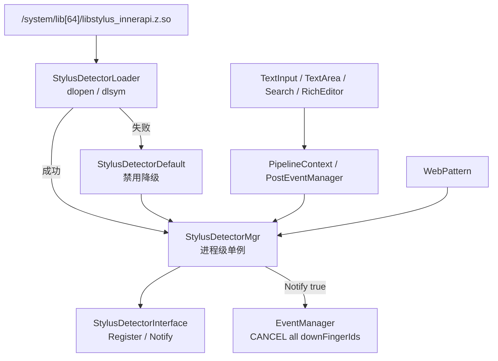
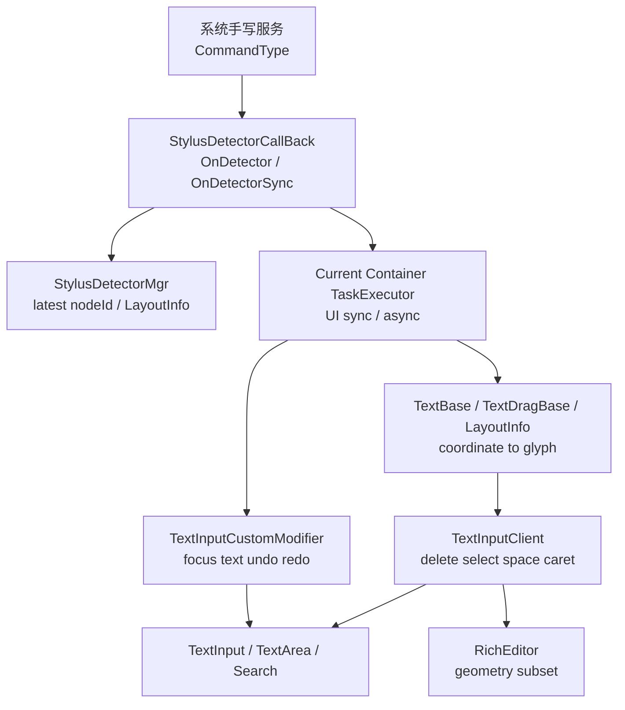
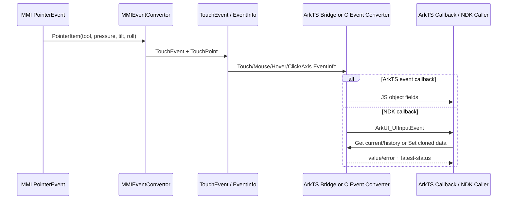
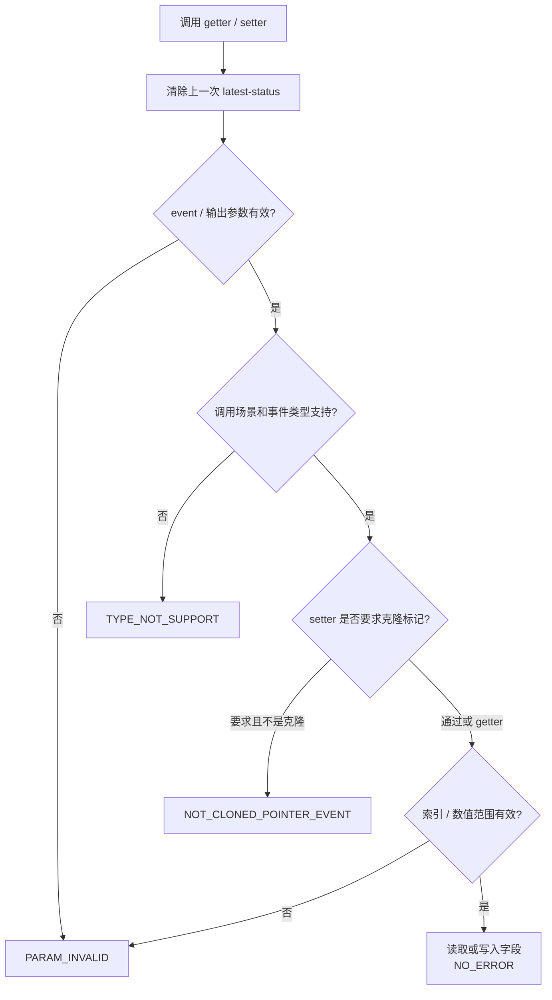
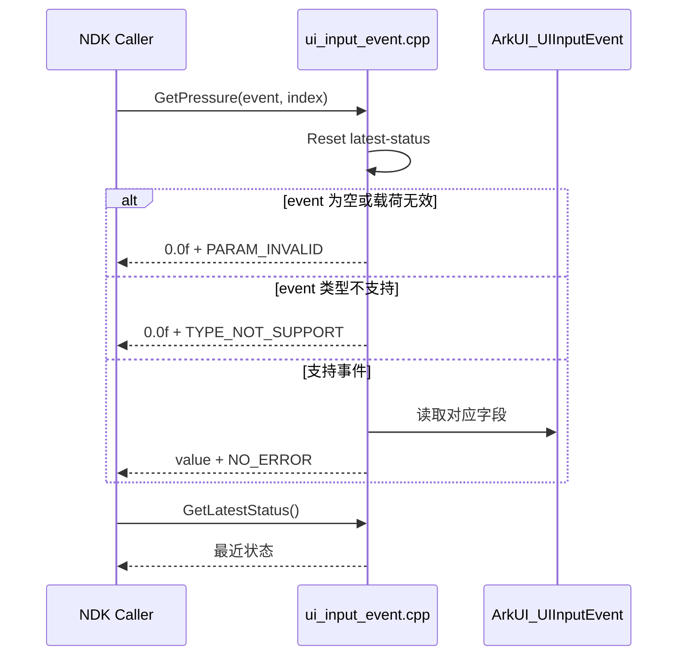

# 架构设计

> 手写笔能力功能域共享架构设计。覆盖 Feat-01“手写笔输入事件与数据暴露”、Feat-02“手写笔悬停命中与事件派发”、Feat-03“手写检测服务接入与触控拦截”和 Feat-04“手写编辑命令与文本组件协同”。

## 设计元数据

| 字段 | 内容 |
|------|------|
| Design ID | DESIGN-Func-04-04-08 |
| 关联需求 | 已有能力补录（无独立 requirement.md） |
| 关联 Epic | 无 |
| 目标 Feature | Feat-01 手写笔输入事件与数据暴露, Feat-02 手写笔悬停命中与事件派发, Feat-03 手写检测服务接入与触控拦截, Feat-04 手写编辑命令与文本组件协同 |
| 复杂度 | 复杂 |
| 目标版本 | ArkTS 现有事件字段（版本待 canonical SDK 复核）；NDK API 12/17/20/24 |
| Owner | ArkUI SIG |
| 状态 | Baselined（Feat-01～Feat-04 已有实现补录） |

## 需求基线

> 需求基线详见已有能力实现。以下仅列出设计阶段需要额外强调的要点。

| 项 | 补充说明（如需） |
|----|------------------|
| 核心目标 | 将 MMI 输入携带的工具类型、压力、倾角和旋转角贯通到 ArkUI 核心事件、ArkTS 事件对象和 NDK 接口；（Feat-02）将 Pen LEVITATE 事件路由到组件命中、进入/退出差分和 Hover Move 派发链；（Feat-03）在可编辑文本/Web 命中时接入可选系统手写服务并按 Notify 结果拦截触摸；（Feat-04）将服务命令路由到最近命中的 TextField/Search/RichEditor 并执行焦点、文本和几何编辑 |
| 行为基线 | 以当前实现为规格；Hover pressure 固定为零、普通 Touch getter 读取最后触点、克隆 hover-move rollAngle 写读不对称均作为现状记录 |
| API 双通道 | ArkTS 侧覆盖 Touch/Mouse/Hover/Click/Axis 事件数据；NDK 侧覆盖当前、历史和克隆事件接口 |
| 版本边界 | NDK tool/pressure/tilt/history 为 API 12，rollAngle 为 API 17，latest-status 为 API 20，克隆 setter 为 API 24 |
| SDK 验证边界 | 目标仓库基线未纳入 canonical `interface/sdk-js/api` 声明；仓内静态生成契约可验证字段形态，但动态 ArkTS 注释和 `@since` 仍需在匹配版本的 SDK 中复核 |

## 上下文和现状

### 涉及仓和模块

| 仓库 | 补充架构说明 |
|------|--------------|
| multimodalinput_input | 上游 MMI `PointerEvent::PointerItem` 提供 toolType、pressure、tiltX、tiltY、rollAngle 和高精度坐标；由适配层读取 |
| ace_engine `adapter/ohos/entrance/mmi_event_convertor.cpp` | 将 MMI 工具类型和姿态数据转换为 Ace `TouchPoint`、`TouchEvent`、`MouseEvent`；Pen 路径保留 double 坐标 |
| ace_engine `frameworks/core/event/` | 定义 SourceTool、TouchPoint、TouchEvent、MouseEvent 及 EventInfo 数据承载；Pen 使用专用 pointer ID 偏移 |
| ace_engine `frameworks/core/components_ng/event/touch_event.cpp` | 将 TouchEvent 当前触点、changedTouches 和 historyEvents 转换为 TouchEventInfo/TouchLocationInfo |
| ace_engine `frameworks/bridge/declarative_frontend/engine/functions/` | 动态 ArkTS Touch/Click 事件对象桥接，处理 optional tilt/roll 的默认零值 |
| ace_engine `frameworks/bridge/declarative_frontend/engine/jsi/nativeModule/` | 动态 ArkTS Hover/Axis/Mouse 等事件桥接，决定字段存在性和默认值 |
| ace_engine `frameworks/bridge/arkts_frontend/koala_projects/arkoala-arkts/` | 静态 ArkTS 生成契约和静态事件转换，公开 SourceTool 仅覆盖六类工具 |
| ace_engine `interfaces/native/ui_input_event.h` | Public NDK 输入事件 getter/setter 声明及 API 版本、参数和错误码说明 |
| ace_engine `interfaces/native/event/ui_input_event.cpp` | NDK 当前值、历史值和克隆事件读写实现，维护 latest-status |
| ace_engine `test/unittest/interfaces/ace_ui_input_event/` | NDK tool/pressure/tilt/roll getter 与部分 setter 的单元测试 |
| ace_engine `frameworks/core/pipeline_ng/pipeline_context.cpp` | （Feat-02）Pen Hover UI 线程入口、Mouse 型 hit-test 设置、派发顺序及落笔移出清理 |
| ace_engine `frameworks/core/common/event_manager_pen.cpp` | （Feat-02）Pen Hover 目标状态、last/current 差分、传播停止和 Hover Move 派发 |
| ace_engine `frameworks/core/components_ng/event/input_event_hub.cpp`、`input_event.cpp` | （Feat-02）仅收集已注册 onHover/onHoverMove 的 HoverEventTarget |
| ace_engine `frameworks/core/components_ng/base/frame_node.cpp` | （Feat-02）在 Mouse hit-test 分支中识别 Pen Hover 并转入专用目标收集 |
| ace_engine `frameworks/core/event/mouse_event.cpp` | （Feat-02）构造 Pen HoverInfo、坐标变换并回传 stopPropagation |
| ace_engine `test/unittest/core/event/event_manager_pen_test_ng.cpp` | （Feat-02）状态转换、差分派发、空链和传播停止单元测试 |
| ace_engine `adapter/ohos/osal/stylus_detector_loader.cpp`、`stylus_detector_mgr.cpp` | （Feat-03）动态装载系统手写服务、管理节点/监听器/当前目标并执行 Notify |
| ace_engine `interfaces/inner_api/ace/stylus/stylus_detector_interface.h` | （Feat-03）服务 enable/register/unregister/notify 与 callback 命令 Inner API |
| ace_engine `frameworks/core/pipeline_ng/pipeline_context.cpp`、`frameworks/core/common/event_manager.cpp` | （Feat-03）PEN DOWN 检测、Notify 成功后的手势域清理和全活动 pointer CANCEL |
| ace_engine `frameworks/core/components_ng/pattern/text_field/`、`rich_editor/`、`search/` | （Feat-03）文本组件登记、手写编辑资格和纵向 20vp 响应区扩展 |
| ace_engine `frameworks/core/components_ng/pattern/web/web_pattern.cpp` | （Feat-03）Web 可编辑位置检测、局部坐标 Notify 及触摸序列吞噬 |
| ace_engine `adapter/preview/osal/stylus_detector_mgr.cpp` | （Feat-03）Preview 全量 false/no-op 降级 |
| ace_engine `adapter/ohos/osal/stylus_detector_callback.cpp` | （Feat-04）13 类命令分派、UI Task 调度、全局坐标到 glyph 索引映射和组件操作 |
| ace_engine `frameworks/core/components_ng/pattern/text_input/bridge/text_input_dynamic_modifier.cpp` | （Feat-04）TextField 焦点键盘、set/get、undo/redo、canUndo/canRedo 实现 |
| ace_engine `frameworks/core/common/ime/text_input_client.h` | （Feat-04）DeleteRange、SetSelection、InsertOrDeleteSpace、SetCaretOffset 通用接口 |
| ace_engine `frameworks/core/components_ng/pattern/rich_editor/rich_editor_pattern.cpp` | （Feat-04）RichEditor 几何编辑、STYLUS 空格变更原因和默认删除原因 |

### 调用链层级分析

| 层 | 模块 | 职责 | 修改类型 |
|----|------|------|----------|
| 输入源层 | MMI `PointerEvent` / `PointerItem` | 产生 sourceType、toolType、pressure、tilt、rollAngle、坐标和历史采样 | 存量实现，不修改 |
| 平台适配层 | `adapter/ohos/entrance/mmi_event_convertor.cpp` | 枚举映射、姿态复制、高精度 Pen 坐标选择、Touch/Mouse 事件构造 | 存量实现，规格补录 |
| 核心事件模型层 | `frameworks/core/event/touch_event.h/.cpp`、`mouse_event.h/.cpp` | 保存 TouchPoint/TouchEvent/MouseEvent 字段，处理 Pen pointer ID，生成 HoverInfo 等 EventInfo | 存量实现，规格补录 |
| NG 事件封装层 | `frameworks/core/components_ng/event/touch_event.cpp` | 将当前、changed 和 history 数据写入 TouchEventInfo/TouchLocationInfo | 存量实现，规格补录 |
| 动态 ArkTS 桥接层 | `js_touch_function.cpp`、`js_click_function.cpp`、`arkts_native_common_bridge.cpp` | 创建 JS 事件对象，设置字段存在性、单位转换和缺省值 | 存量实现，规格补录 |
| 静态 ArkTS 桥接层 | `generated/component/common.ets`、`reverse_converter_enums.cpp` | 定义静态事件字段和公开 SourceTool 映射，处理内部扩展枚举降级 | 存量实现，规格补录 |
| Native 事件封装层 | `interfaces/native/node/event_converter.cpp` 等 C event 结构转换 | 将核心 EventInfo 转换为 ArkUITouchEvent/ArkUIMouseEvent/ArkUIHoverEvent/ArkUIClickEvent/ArkUIAxisEvent | 存量实现，规格补录 |
| NDK 接口层 | `interfaces/native/event/ui_input_event.cpp` | 按事件类型读取当前/历史值，修改克隆事件，输出错误码和 latest-status | 存量实现，规格补录 |
| 测试层 | `test/unittest/interfaces/ace_ui_input_event/` | 锁定支持矩阵、默认值、边界和异常返回 | 存量测试，识别覆盖缺口 |
| 输入入口层 | `adapter/ohos/entrance/ace_container.cpp` | （Feat-02）普通 HOVER_* 优先进入无障碍链，PEN + LEVITATE 三类型进入 OnPenHoverEvent | 存量实现，规格补录 |
| Pipeline 调度层 | `frameworks/core/pipeline_ng/pipeline_context.cpp` | （Feat-02）缩放坐标、构造 TouchRestrict、依次命中/enter-exit/move/RequestFrame，落笔时合成移出 | 存量实现，规格补录 |
| 命中与目标收集层 | `frame_node.cpp`、`input_event_hub.cpp`、`input_event.cpp` | （Feat-02）复用 Mouse hit-test，但只收集具备 Pen hover callback 的目标 | 存量实现，规格补录 |
| Hover 状态与派发层 | `frameworks/core/common/event_manager_pen.cpp` | （Feat-02）维护 last/current/move map 和全局 dispatch length，执行差分与传播停止 | 存量实现，规格补录 |
| 服务适配层 | `adapter/ohos/osal/stylus_detector_loader.cpp`、`stylus_detector_mgr.cpp` | （Feat-03）dlopen 可选系统 SO，失败使用默认实现；封装服务调用和进程级状态 | 存量实现，规格补录 |
| 文本组件资格层 | TextField/RichEditor/Search patterns | （Feat-03）节点登记、focus/visible/opacity/keyboard/password/OTP 资格和 20vp 扩展 | 存量实现，规格补录 |
| 原生触摸拦截层 | PipelineContext/EventManager | （Feat-03）PEN DOWN Notify 成功后清 gesture scope、目标并向全部活动 pointer 发 CANCEL | 存量实现，规格补录 |
| Web 拦截层 | `web_pattern.cpp` | （Feat-03）SetFocusByPosition 后通知服务，吞 DOWN/MOVE/UP/CANCEL | 存量实现，规格补录 |
| 服务命令回调层 | `adapter/ohos/osal/stylus_detector_callback.cpp` | （Feat-04）按 CommandType 路由最近 nodeId，并选择同步/异步 UI task | 存量实现，规格补录 |
| 文本组件操作层 | TextInput custom modifier、TextInputClient、RichEditorPattern | （Feat-04）执行文本替换、撤销栈、删除、选择、空格和光标操作 | 存量实现，规格补录 |
| 文本布局映射层 | TextBase/TextDragBase/LayoutInfoInterface | （Feat-04）全局坐标逆变换、Y 边界、X clamp 和 glyph position | 存量实现，规格补录 |

调用链完整性检查：

- [x] 已覆盖输入源、平台适配、核心模型、NG 封装、ArkTS 双前端、Native 封装、NDK 和测试层
- [x] 数据流保持自底向上转换，Public API 不反向依赖平台 MMI 类型
- [x] 本次为文档补录，各层修改类型均为“存量实现，不修改”

### 适用架构规则

| Rule ID | 适用原因 | 设计结论 | 验证方式 |
|---------|----------|----------|----------|
| OH-ARCH-LAYERING | 输入数据跨 MMI 适配、Core Event、Bridge 和 NDK 多层转换 | 调用方向固定为输入源→适配→核心事件→前端/NDK；公开层不得直接依赖 MMI PointerItem | 架构评审/依赖检查 |
| OH-ARCH-SUBSYSTEM | ace_engine 读取 multimodalinput_input 数据 | 仅适配层依赖 MMI 接口，核心事件层使用 Ace 自有 SourceTool 与事件结构 | 代码评审/依赖检查 |
| OH-ARCH-IPC-SAF | Feat-01 不发起 IPC 或 SA 调用 | 数据在已有输入分发链内传递，无新增 IPC/SAF 边界 | 集成测试 |
| OH-ARCH-API-LEVEL | 涉及 ArkTS 和 Public NDK 多版本 API | NDK 以 `ui_input_event.h` 的 `@since` 为准；缺失 canonical ArkTS SDK 声明作为风险保留 | API 评审/XTS |
| OH-ARCH-COMPONENT-BUILD | 仅补录现有实现 | 不新增 BUILD.gn target、source set 或 bundle 依赖 | 构建验证 |
| OH-ARCH-ERROR-LOG | NDK 浮点 getter 以默认零值返回错误 | API 20+ 使用 latest-status 区分 NO_ERROR、PARAM_INVALID、TYPE_NOT_SUPPORT | 单测 |
| OH-ARCH-EVENT-DISPATCH | Feat-02 涉及组件树命中、冒泡与传播停止 | Pen Hover 借用 Mouse hit-test，但目标过滤和状态派发由专用链负责；NDK Hover Move 的传播能力差异必须显式记录 | EventManager/NDK 集成测试 |
| OH-ARCH-IPC-SAF-F3 | Feat-03 通过可选系统 SO 对接外部手写服务 | Core 不直接依赖服务实现；adapter/osal 负责 dlopen 和默认降级，Inner API 不公开给应用 | 故障注入/集成测试 |
| OH-ARCH-LIFECYCLE-F3 | 管理器是进程级单例且跨 Container 保存当前状态 | 注册、注销、bundle 和 node 状态共享语义必须在多窗口测试中验证 | 生命周期/多窗口测试 |
| OH-ARCH-THREADING-F4 | 服务命令跨外部回调和 UI 组件状态 | 所有组件读写必须通过 Current Container TaskExecutor；同步和异步返回语义分别验证 | 线程/重入测试 |
| OH-ARCH-TEXT-COMPAT-F4 | TextField 与 RichEditor 能力矩阵不同 | Inner API 不承诺组件统一支持；RichEditor 部分支持必须显式暴露 | 组件矩阵测试 |

## 不涉及项承接

| 维度 | 设计结论 |
|------|----------|
| 悬停命中与派发 | Feat-02 已覆盖：入口识别、Mouse 型命中、目标收集、enter/exit 差分、Hover Move、传播停止和落笔清理 |
| 手写检测服务与触控拦截 | Feat-03 已覆盖：服务装载、文本/Web 资格、响应区、Notify 拦截、CANCEL 清理、生命周期和 Preview 降级 |
| 文本编辑命令与组件协同 | Feat-04 已覆盖：13 类命令、最近目标路由、TextField/RichEditor 支持矩阵、几何索引和线程异常 |
| 权限与安全 | 无新增权限、鉴权或敏感数据持久化；仅处理输入事件瞬态数据 |
| 持久化与迁移 | 不存储手写笔数据，不涉及数据库或配置格式迁移 |
| 渲染算法 | 不定义笔迹渲染、平滑或预测算法；只暴露原始/转换后的事件数据 |
| 构建与部件 | 无新增构建目标或部件依赖 |
| IPC/跨进程 | Feat-01 不新增 IPC；上游输入服务交付后的进程内事件转换为本设计范围 |

## 关键设计决策

| 决策 ID | 问题 | 推荐方案 | 探索过的替代方案 | 取舍理由 | 影响 |
|---------|------|----------|-----------------|----------|------|
| ADR-1 | 内部工具类型多于公开 SourceTool | 保持内部完整枚举，静态公开层仅映射 UNKNOWN/FINGER/PEN/MOUSE/TOUCHPAD/JOYSTICK，其他值降级为 `-1` | 方案A：公开全部内部类型；方案B：全部未知类型映射 UNKNOWN；方案C：按公开声明顺序重编号 | 当前转换实现明确对未覆盖类型返回 `-1`，公开枚举值与内部稳定数值保持一致且非连续 | 生态调用方不得假定 RUBBER/BRUSH 等内部类型可由公开枚举表示；`reverse_converter_enums.cpp:1089-1103` |
| ADR-2 | SDK 可选字段与运行时零值的关系 | 保留 `rollAngle` 可选契约，同时记录 Touch/Click/Hover 动态桥常将缺失值实体化为 `0` | 方案A：运行时省略字段；方案B：将 SDK 改成必选；方案C：统一用 NaN 表示缺失 | 当前桥接使用 `value_or(0)`，而静态生成 BaseEvent 仍声明 `rollAngle?`，两者属于不同层面的契约 | 测试需分别覆盖属性存在性和值，不把零值等同于“硬件一定提供数据” |
| ADR-3 | Hover 的 pressure 数据来源 | 保持 Hover pressure 固定 `0`，tilt/roll 从 HoverInfo 读取 | 方案A：从 MouseEvent force 透传；方案B：省略 pressure；方案C：复用 Touch pressure | 当前 HoverInfo 构造没有 force 赋值，动态桥显式写 `0.0f` | Hover 场景不能依赖 pressure 判断悬停距离或力度；`arkts_native_common_bridge.cpp:9748-9762` |
| ADR-4 | NDK 当前值、历史值和克隆值是否统一接口矩阵 | 分别维护三套支持矩阵，按真实事件存储结构读取或写入 | 方案A：所有 getter/setter 支持全部事件；方案B：统一转换为 Touch；方案C：不区分 current/history/cloned | 当前历史数据只存在 C touch 路径，克隆 pressure/tilt/roll setter 也仅支持 Touch，强行统一会隐藏错误码差异 | Spec、测试和文档必须按三种事件形态分别描述 |
| ADR-5 | 当前 Touch getter 的 pointerIndex 语义 | 固化现有“忽略 pointerIndex、读取最后触点”的实现行为 | 方案A：按 index 读取；方案B：index 非零返回错误；方案C：删除参数 | 已有实现和单测锁定最后触点行为；本任务只补录规格，不修改可观察行为 | 多触点调用方不能依赖当前 getter 的 pointerIndex 选择触点，历史 getter 才按 index 读取 |
| ADR-6 | NDK 浮点错误返回与有效零值冲突 | 保留 `0.0f` 返回，并在 API 20+ 通过 latest-status 消歧 | 方案A：返回 NaN；方案B：新增输出参数接口；方案C：抛出异常 | 兼容已有 C API 签名，同时提供明确错误状态旁路 | 低于 API 20 的调用方无法通过 latest-status 消歧，需要在调用前验证事件类型和索引 |
| ADR-7 | 克隆 hover-move rollAngle 写读字段不一致 | 如实记录 setter 写事件级字段、getter 读 actionTouchPoint 的现有行为 | 方案A：setter 同时写两处；方案B：getter 统一读事件级字段；方案C：禁止 hover-move setter | 改动任一侧都会改变现有行为，超出已有能力规格补录范围 | 作为高可见风险进入规格和测试设计，不提出实现修复；`ui_input_event.cpp:2334-2383,4892-4920` |
| ADR-F2-1 | 普通 Hover 与 Pen Hover 是否共用事件域 | 普通 HOVER_* 保持无障碍入口优先，Pen Hover 仅接受 PEN + LEVITATE_IN_WINDOW/MOVE/OUT | 方案A：统一为 HOVER_*；方案B：全部进入 Mouse Hover；方案C：按 sourceTool 在同一回调内区分 | 当前 AceContainer 分流和 IsPenHoverEvent 判定已形成独立事件域 | 测试和规格不得把 Accessibility Hover 与 Pen Levitate 混为一谈 |
| ADR-F2-2 | Pen Hover 如何复用组件命中 | hitTestType 使用 MOUSE，但 FrameNode 特判 Pen 并只收集 Pen onHover/onHoverMove 目标 | 方案A：复用完整 Mouse 目标链；方案B：使用普通 Touch 命中；方案C：单独实现组件树遍历 | 复用 response region 和坐标变换，同时隔离 mouse/hoverEffect/accessibility target | 回调注册不直接阻断命中，ProcessPenHoverTestHit 固定返回 false |
| ADR-F2-3 | 进入/退出状态如何计算 | 按 last/current 目标链做差分，并用 lastPenHoverDispatchLength_ 保存上一轮有效传播边界 | 方案A：每帧向全链发送 enter；方案B：仅保存单个叶子节点；方案C：忽略 stopPropagation | 差分避免重复回调，传播长度避免向未收到 enter 的节点发送不匹配退出 | enter/exit 顺序和拦截边界由 EventManager 状态共同决定 |
| ADR-F2-4 | Hover Move 是否只处理 LEVITATE_MOVE | 保持 Pipeline 对三种 Pen LEVITATE 事件均执行 move 目标更新和派发 | 方案A：仅 MOVE；方案B：IN/MOVE；方案C：按回调类型过滤 | 当前调用顺序无 type 分支，补录规格不得改变 | 注册 move 目标时 IN/OUT 也可能产生 move 回调，作为边界测试 |
| ADR-F2-5 | enter/exit 与 move 的事件身份键 | 保持 enter/exit 使用 GetEventIdentity，move 使用 event.id | 方案A：全部 originalId；方案B：全部 id；方案C：组合 key | 当前数据结构和 passThrough 语义已不同 | passThrough 与多身份场景登记为状态关联风险 |
| ADR-F2-6 | 前端传播停止能力 | ArkTS onHover/onHoverMove 与 NDK Hover Event 写回 stopPropagation；NDK Hover Move 保持不回写 | 方案A：NDK Move 也回写；方案B：所有 Hover 禁止停止；方案C：只允许 onHover | 当前 node modifier 和支持场景矩阵不对称 | NDK Hover Move 无法阻止后续目标派发，必须在接口兼容性中可见 |
| ADR-F2-7 | 悬停转落笔的状态清理 | PEN + DOWN + force 非零时合成 PROXIMITY_OUT，以空命中链触发退出 | 方案A：任意 Pen DOWN 清理；方案B：等待 LEVITATE_OUT；方案C：超时清理 | 当前压力门槛避免无压力 DOWN 触发该路径，但可能保留 hover 状态 | force=0 是关键边界；只记录现状，不调整条件 |
| ADR-F3-1 | 系统手写服务如何集成 | 在 adapter/osal 运行时 dlopen 固定系统 SO，失败永久回退默认实现 | 方案A：编译期强依赖；方案B：每次事件重试装载；方案C：Core 直接调用服务 | 可选装载支持不同产品，默认实现保持 Core 调用面稳定 | 服务缺失时不拦截；单例生命周期不承诺重连 |
| ADR-F3-2 | Register 与 Notify 谁决定拦截 | Notify bool 作为唯一最终判定，Register 结果仅保存 isRegistered_ | 方案A：Register 失败直接不 Notify；方案B：两者都成功才拦截；方案C：忽略 Notify | 当前原生与 Web 路径都直接返回 Notify 结果 | 注册失败但 Notify=true 仍吞触摸，回调可达性作为风险 |
| ADR-F3-3 | 文本命中与编辑资格是否合并 | 分两阶段：响应区扩展/命中后，再执行 IsTextEditableForStylus | 方案A：只扩展完全可编辑节点；方案B：不扩展；方案C：命中后不再校验 | 复用组件现有 hit-test，同时允许密码/OTP/自定义键盘在后阶段被拒绝 | TextField 自定义键盘/OTP 可能命中扩展区但最终不通知服务 |
| ADR-F3-4 | 原生拦截如何终止既有触摸竞争 | 清理当前 gesture scope 和 touch target，把事件改写为 falsified CANCEL，并向全部 downFingerIds 派发 | 方案A：只删除当前 Pen target；方案B：仅返回不清理；方案C：只取消当前 pointer | 保持已开始的多指/手势状态得到显式取消 | 笔指并发时会取消所有活动 pointer，是高影响边界 |
| ADR-F3-5 | 原生与 Web 通知坐标 | 原生使用 screenX/Y + componentId，Web 使用局部 x/y + resourceName，均收窄为 int | 方案A：统一 screen 坐标；方案B：统一局部坐标；方案C：使用 float 接口 | 当前服务接口 NotifyInfo 使用 int，Web 需要资源标识而非 FrameNode id | 坐标空间和精度差异必须在接口规格中分别声明 |
| ADR-F3-6 | 管理器生命周期与作用域 | 保持进程级单例和单份 node/layout/selection/register 状态 | 方案A：每 Container 一个实例；方案B：每 bundle 一个实例；方案C：每节点注册对象 | 当前静态 GetInstance 和服务接口围绕单例实现 | 多窗口、跨 bundle、最后节点注销归属存在共享状态风险 |
| ADR-F3-7 | Web 触摸序列如何拦截 | Notify 成功后 Web 保存 bool 标志，吞 DOWN/MOVE，并在 UP/CANCEL 清标志后返回 | 方案A：复用 EventManager CANCEL；方案B：每次 MOVE 重 Notify；方案C：只吞 DOWN | Web 自有 NWeb 分发链不经过原生文本的 touch target 清理 | Web 注册没有对应生命周期注销，作为不对称风险记录 |
| ADR-F4-1 | 命令如何定位目标组件 | 使用 StylusDetectorMgr 最近一次原生 Notify 保存的 nodeId/layoutInfo | 方案A：每条命令携带 node id；方案B：按当前焦点查找；方案C：保存节点强引用 | 当前服务命令接口不携带节点，manager 已提供最近目标状态 | CLEAR_HIT 不清状态，跨窗口/后续命令可能继续作用于旧节点 |
| ADR-F4-2 | 命令线程模型 | 焦点和几何命令同步 UI task；set/get/undo/redo 异步 UI task；能力查询同步 UI task | 方案A：全部同步；方案B：全部异步；方案C：直接在服务线程操作 | 组件状态只能在 UI 线程访问，同时文本操作避免阻塞服务线程 | 异步返回 0 只表示投递，不代表操作完成 |
| ADR-F4-3 | RichEditor 支持范围 | 仅支持 focus 和 delete/choice/space/move 几何命令，文本全量读写和撤销栈命令短路 | 方案A：与 TextField 完全一致；方案B：完全不支持 RichEditor；方案C：由服务侧判断 | RichEditor 实现 TextInputClient，具备几何编辑接口，但没有接入 TextField custom modifier | GET_TEXT 空串与真实空内容不可区分，必须标记部分支持 |
| ADR-F4-4 | 几何命令坐标映射 | 全局点减 paint offset，按需逆 render transform，Y 越界拒绝，X clamp 后由 LayoutInfo 映射 glyph | 方案A：X/Y 都拒绝；方案B：都 clamp；方案C：使用组件局部坐标输入 | 当前手写服务提供全局几何，横向 clamp 支持划过文本边界 | 横向越界仍可能编辑首尾文本，矩形结果再裁剪到 `[0,length]` |
| ADR-F4-5 | SET_TEXT 空值和 caret 语义 | 保持空字符串不清空，非空时 caret 使用 UTF-8 std::string::size | 方案A：空串清空；方案B：使用 UTF-16 length；方案C：保留原 caret | 当前 modifier 已实现该行为，补录不改变结果 | 非 ASCII 文本存在字节数与 UTF-16 索引不一致风险 |
| ADR-F4-6 | 选择菜单和光标手柄控制 | CHOICE_TEXT 使用 showMenu 控制菜单/强制手柄；MOVE_CURSOR 的 showHandle 当前不生效 | 方案A：两者统一控制；方案B：都忽略；方案C：服务端不传手柄选项 | 当前 ChoiceText 显式构造 SelectionOptions，HandleMoveCursor 未使用参数 | 服务端不得假定 MOVE_CURSOR 能显示或隐藏手柄 |
| ADR-F4-7 | 编辑变更原因 | RichEditor InsertOrDeleteSpace 使用 STYLUS，矩形 DeleteRange 默认使用 INPUT | 方案A：全部 STYLUS；方案B：全部 INPUT；方案C：新增专用删除重载调用 | 当前两个 TextInputClient 路径调用不同重载 | 手写编辑的 change reason 不统一，只记录兼容风险 |

## 设计骨架

### 骨架范围

| 骨架项 | 目标 | 不包含 | 验证方式 |
|--------|------|--------|----------|
| SourceTool 映射 | MMI、Ace 内部、静态 ArkTS 和 NDK 工具类型可追溯 | 新增公开工具枚举 | 枚举扫描/单测 |
| 核心事件数据 | TouchPoint/TouchEvent/EventInfo 携带 force、tiltX/Y、rollAngle、sourceTool | 笔迹算法和持久化 | 单测/源码审查 |
| ArkTS 事件桥接 | 明确 Touch/Click/Hover/Axis 的字段存在性和默认值 | 修改 SDK 声明 | ArkTS 集成测试 |
| NDK 当前值接口 | 固化支持事件、取值字段、默认值与错误状态 | 新增 getter | NDK 单测 |
| NDK 历史值接口 | 固化 Touch history 索引校验和返回行为 | 历史 tool/roll API | NDK 单测 |
| NDK 克隆值接口 | 固化克隆标记、类型、范围和写入字段 | 修改 setter 实现 | NDK 单测 |
| Pen Hover 专用链 | 固化入口分流、Mouse 型命中、目标差分和 Move 派发 | Accessibility Hover、手写服务拦截 | EventManager/Pipeline 单测 |
| 手写服务拦截链 | 固化动态装载、组件资格、20vp 扩展、Notify 和触摸取消 | 编辑命令具体实现 | 故障注入/Pipeline/Web 测试 |
| 手写编辑命令链 | 固化 13 类命令、组件矩阵、坐标索引和线程模型 | 新增公开编辑 API | Callback/TextInputClient/RichEditor 测试 |

### 骨架 Spec 拆分

| Task ID | 目标 | 受影响文件 | AC |
|---------|------|------------|-----|
| TASK-SKELETON-1 | 固化 ArkTS SourceTool 与 BaseEvent 字段契约 | `common.ets`、`reverse_converter_enums.cpp` | AC-1.1~2.4 |
| TASK-SKELETON-2 | 固化 NDK 当前事件 getter | `ui_input_event.h/.cpp` | AC-3.1~3.6 |
| TASK-SKELETON-3 | 固化 NDK 历史事件 getter | `ui_input_event.h/.cpp` | AC-4.1~4.4 |
| TASK-SKELETON-4 | 固化 NDK 克隆事件 setter | `ui_input_event.h/.cpp` | AC-5.1~5.7 |
| TASK-SKELETON-5 | 固化 API 版本和多设备差异 | `ui_input_event.h`、preview adapter | AC-6.1~6.4 |
| TASK-SKELETON-6 | 固化 Pen Hover 命中、enter/exit 和 move 状态 | `event_manager_pen.cpp`、`input_event.cpp`、`mouse_event.cpp` | Feat-02 AC-1.1~5.7 |
| TASK-SKELETON-7 | 固化手写服务装载、原生/Web 拦截及降级 | `stylus_detector_mgr.cpp`、`pipeline_context.cpp`、`web_pattern.cpp` | Feat-03 AC-1.1~6.3 |
| TASK-SKELETON-8 | 固化服务命令、TextField/RichEditor 操作和几何映射 | `stylus_detector_callback.cpp`、text input modifier、RichEditorPattern | Feat-04 AC-1.1~6.5 |

## 后续 Task 拆分

| Task ID | 目标 | 受影响文件 | 依赖 |
|---------|------|------------|------|
| TASK-1 | Feat-01 手写笔输入事件与数据暴露规格 | `Feat-01-stylus-input-event-data-spec.md` | 本 Design |
| TASK-2 | Feat-02 手写笔悬停命中与事件派发规格 | `Feat-02-stylus-hover-hit-dispatch-spec.md` | TASK-1；已合并共享设计 |
| TASK-3 | Feat-03 手写检测服务接入与触控拦截规格 | `Feat-03-handwriting-service-touch-interception-spec.md` | TASK-1, TASK-2；已合并共享设计 |
| TASK-4 | Feat-04 手写编辑命令与文本组件协同规格 | `Feat-04-handwriting-edit-command-text-coordination-spec.md` | TASK-1, TASK-3；已合并共享设计 |

## API 签名、Kit 与权限

### 新增 API

> 本 Feature 为已有 API 补录，下表列出纳入基线的现有签名。

| API 签名 | 类型 | Kit | d.ts 位置 | 权限要求 | SysCap |
|----------|------|-----|------------|----------|--------|
| `BaseEvent.pressure: number/double` | Public ArkTS | ArkUI | canonical d.ts 未随仓提供；静态生成契约 `common.ets:100` | 无 | ArkUI |
| `BaseEvent.tiltX/tiltY: number/double` | Public ArkTS | ArkUI | canonical d.ts 未随仓提供；静态生成契约 `common.ets:101-102` | 无 | ArkUI |
| `BaseEvent.rollAngle?: number/double` | Public ArkTS | ArkUI | canonical d.ts 未随仓提供；静态生成契约 `common.ets:103` | 无 | ArkUI |
| `BaseEvent.sourceTool: SourceTool` | Public ArkTS | ArkUI | canonical d.ts 未随仓提供；静态生成契约 `common.ets:104,8272-8279` | 无 | ArkUI |
| `int32_t OH_ArkUI_UIInputEvent_GetToolType(const ArkUI_UIInputEvent* event)` | Public NDK | ArkUI | `interfaces/native/ui_input_event.h:471` | 无 | ArkUI |
| `float OH_ArkUI_PointerEvent_GetPressure(const ArkUI_UIInputEvent* event, uint32_t pointerIndex)` | Public NDK | ArkUI | `interfaces/native/ui_input_event.h:749` | 无 | ArkUI |
| `float OH_ArkUI_PointerEvent_GetTiltX/Y(const ArkUI_UIInputEvent* event, uint32_t pointerIndex)` | Public NDK | ArkUI | `interfaces/native/ui_input_event.h:760-771` | 无 | ArkUI |
| `int32_t OH_ArkUI_PointerEvent_GetRollAngle(const ArkUI_UIInputEvent* event, double* rollAngle)` | Public NDK | ArkUI | `interfaces/native/ui_input_event.h:783` | 无 | ArkUI |
| `float OH_ArkUI_PointerEvent_GetHistoryPressure/TiltX/TiltY(...)` | Public NDK | ArkUI | `interfaces/native/ui_input_event.h:1013-1039` | 无 | ArkUI |
| `ArkUI_ErrorCode OH_ArkUI_ClonedEvent_SetToolType/SetPressure/SetPressureByIndex(...)` | Public NDK | ArkUI | `interfaces/native/ui_input_event.h:1570-1606` | 无 | ArkUI |
| `ArkUI_ErrorCode OH_ArkUI_ClonedEvent_SetTiltAngle/SetRollAngle(...)` | Public NDK | ArkUI | `interfaces/native/ui_input_event.h:1849-1867` | 无 | ArkUI |
| `onHover(value: ((isHover: boolean, event: HoverEvent) => void) \| undefined): this` | Public ArkTS | ArkUI | canonical d.ts 未随仓提供；生成契约 `common.ets:9509-9520` | 无 | ArkUI |
| `onHoverMove(value: ((event: HoverEvent) => void) \| undefined): this` | Public ArkTS | ArkUI | canonical d.ts 未随仓提供；生成契约 `common.ets:9521-9531` | 无 | ArkUI |
| `NODE_ON_HOVER_MOVE = 29` | Public NDK | ArkUI | `interfaces/native/native_node.h:10557-10566` | 无 | ArkUI |
| `NODE_ON_HOVER_EVENT = 27` | Public NDK | ArkUI | `interfaces/native/native_node.h:10527-10536` | 无 | ArkUI |
| `bool StylusDetectorInterface::IsEnable()` | InnerApi | Ace Core | `interfaces/inner_api/ace/stylus/stylus_detector_interface.h:83-92` | 系统 SO 可选 | 不公开 |
| `bool RegisterStylusInteractionListener(bundleName, callback)` | InnerApi | Ace Core | `stylus_detector_interface.h:84-87` | 系统 SO 可选 | 不公开 |
| `void UnRegisterStylusInteractionListener(bundleName)` | InnerApi | Ace Core | `stylus_detector_interface.h:87-89` | 系统 SO 可选 | 不公开 |
| `bool Notify(const NotifyInfo& notifyInfo)` | InnerApi | Ace Core | `stylus_detector_interface.h:89-92` | 系统 SO 可选 | 不公开 |
| `int32_t IStylusDetectorCallback::OnDetector(CommandType, void*, callback)` | InnerApi | Ace Core | `stylus_detector_interface.h:77-80` | 系统服务回调 | 不公开 |
| `bool IStylusDetectorCallback::OnDetectorSync(CommandType)` | InnerApi | Ace Core | `stylus_detector_interface.h:79-80` | 系统服务回调 | 不公开 |
| `CommandType` 13 类命令枚举 | InnerApi | Ace Core | `stylus_detector_interface.h:39-54` | 系统服务回调 | 不公开 |

### 变更/废弃 API

| 原有 API | 变更类型 | 新 API | 迁移说明 |
|----------|----------|--------|----------|
| 无 | 无 | 无 | 本次仅补录现有能力 |

## 构建系统影响

### BUILD.gn 变更

```text
无变更。本次仅新增规格和设计文档，不修改 ace_engine 源码或构建目标。
```

### bundle.json 变更

无变更，不新增 component，不修改部件依赖关系。

## 可选设计扩展

### 架构图



#### Pen Hover 命中与派发架构图（Feat-02）



#### 手写服务接入与拦截架构图（Feat-03）



#### 手写编辑命令协同架构图（Feat-04）



### 数据流/控制流

| 步骤 | 调用方 | 被调用方 | 数据/接口 | 说明 |
|------|--------|----------|-----------|------|
| 1 | MMI Input | Ace adapter | PointerItem tool/pressure/tilt/roll | 输入服务提供原始触点和姿态数据 |
| 2 | `mmi_event_convertor.cpp` | TouchPoint/TouchEvent | `GetSourceTool`、`ConvertTouchPoint`、`ConvertTouchEvent` | 复制数据并对 Pen 坐标使用 double 精度 |
| 3 | Core Event | NG event converter | TouchEventInfo/TouchLocationInfo | 选择当前、changed、history 触点并保存 optional 姿态 |
| 4A | EventInfo | Dynamic/Static ArkTS bridge | BaseEvent 派生事件对象 | 生成 ArkTS 属性并执行枚举转换和缺省值处理 |
| 4B | EventInfo | C event converter | ArkUITouchEvent 等 | 为 NDK 包装不同事件类型的存储结构 |
| 5 | NDK caller | `ui_input_event.cpp` | getter/setter/latest-status | 读取当前/历史值或修改用户创建的克隆事件 |

### 时序设计



### 数据模型设计

ArkTS 静态生成契约：

```typescript
interface BaseEvent {
  pressure: double;
  tiltX: double;
  tiltY: double;
  rollAngle?: double;
  sourceTool: SourceTool;
}
```

核心 C++ 数据形态：

```cpp
struct TouchPoint {
    float force;
    std::optional<float> tiltX;
    std::optional<float> tiltY;
    std::optional<float> rollAngle;
    SourceTool sourceTool;
};
```

| 数据 | 存储方案 | 生命周期 | 说明 |
|------|----------|----------|------|
| 当前触点姿态 | TouchEvent action/last touch point、Mouse/Click/Hover/Axis 专有结构 | 单次事件分发 | 不持久化 |
| 历史触点姿态 | ArkUITouchEvent historyEvents 数组 | 单次事件分发 | NDK 仅公开 pressure/tiltX/tiltY |
| 克隆事件姿态 | 用户创建的 ArkUI_UIInputEvent 内部事件结构 | 创建至销毁/投递 | setter 原位写入 |
| latest-status | NDK 输入事件 API 状态存储 | 下一次相关 API 调用前 | 每次调用先清除旧状态 |

#### Pen Hover 状态数据模型（Feat-02）

```cpp
std::unordered_map<int32_t, HoverTestResult> lastPenHoverResultsMap_;
std::unordered_map<int32_t, HoverTestResult> curPenHoverResultsMap_;
std::unordered_map<int32_t, HoverTestResult> curPenHoverMoveResultsMap_;
uint32_t lastPenHoverDispatchLength_ = 0;
```

| 状态 | Key | 内容 | 更新规则 |
|------|-----|------|----------|
| lastPenHoverResultsMap_ | `event.GetEventIdentity()` | 上一轮有效 onHover 目标链 | IN 清空；OUT/MOVE 接收旧 current |
| curPenHoverResultsMap_ | `event.GetEventIdentity()` | 本轮 onHover 目标链 | IN/MOVE 替换；OUT 清空 |
| curPenHoverMoveResultsMap_ | `event.id` | 本轮 onHoverMove 目标链 | 每次 Pen Hover TouchTest 覆盖 |
| lastPenHoverDispatchLength_ | 全局单值 | 上一轮 enter 传播停止长度 | 每轮 enter/exit 派发重置并按拦截更新 |

#### 手写服务状态数据模型（Feat-03）

```cpp
struct NotifyInfo {
    int componentId;
    int x;
    int y;
    std::string bundleName;
    std::string resourceName;
};

class StylusDetectorMgr {
    std::unordered_map<int32_t, WeakPtr<FrameNode>> textFieldNodes_;
    std::unordered_map<int32_t, WeakPtr<LayoutInfoInterface>> textFieldLayoutInfos_;
    StylusDetectorInstance engine_;
    bool isRegistered_;
    int32_t nodeId_;
    WeakPtr<LayoutInfoInterface> layoutInfo_;
    int32_t sInd_;
    int32_t eInd_;
    bool showMenu_;
};
```

| 数据 | 作用域 | 更新时机 | 关键约束 |
|------|--------|----------|----------|
| textFieldNodes_/LayoutInfos | 进程单例 | 组件 attach/destroy | WeakPtr；仅四类文本 tag |
| nodeId_/layoutInfo_ | 进程单例当前目标 | 最近一次原生 Notify 前 | 后续命令不携带 node id |
| isRegistered_ | 进程单例 | 每次合格 DOWN/最后节点移除 | 不参与 Notify 拦截判定 |
| NotifyInfo.x/y | 单次通知 | 原生 screen 或 Web local float 收窄 | int 精度 |
| Web isNeedInterceptedTouchEvent_ | 单 WebPattern | Notify true 至 UP/CANCEL | 吞后续 PEN MOVE/UP/CANCEL |

#### 手写编辑命令数据模型（Feat-04）

```cpp
enum class CommandType {
    COMMAND_REQUEST_FOCUS, COMMAND_CLEAR_HIT,
    COMMAND_SET_TEXT, COMMAND_GET_TEXT,
    COMMAND_UNDO, COMMAND_REDO,
    COMMAND_CANUNDO, COMMAND_CANREDO,
    COMMAND_DELETE_TEXT, COMMAND_CHOICE_TEXT,
    COMMAND_INSERT_SPACE, COMMAND_MOVE_CURSOR,
    COMMAND_INVALID
};

struct StylusGestureRect { float Left; float Top; float Width; float Height; };
struct MoveCursorOption { int32_t x; int32_t y; bool showHandle; };
struct ChoiceTextOption { StylusGestureRect rect; bool showMenu; };
struct ResultData { int errorCode; std::string errorMessage; std::string resultData; };
```

| 命令族 | 调度 | data 类型 | TextField/Search | RichEditor |
|--------|------|-----------|------------------|------------|
| REQUEST_FOCUS | UI sync | 无 | 焦点+键盘 | 仅焦点 |
| SET/GET_TEXT | UI async | std::string*/callback | 支持 | no-op/空串 |
| UNDO/REDO | UI async | 无 | 支持 | no-op |
| CANUNDO/CANREDO | UI sync | 无 | 返回栈状态 | false |
| DELETE/CHOICE/SPACE/MOVE | UI sync | rect/option | 支持 | 支持 |
| CLEAR_HIT/INVALID | 当前线程返回 | 无 | -1 | -1 |

### 算法与状态机

Feat-01 不引入长生命周期状态机。NDK 调用状态按以下决策顺序计算：



### 测试性设计

| 测试层级 | 测试目标 | Mock 策略 | 验证方式 |
|----------|----------|-----------|----------|
| Core 单测 | TouchEvent/TouchPoint 保存 force、tilt、roll、sourceTool 和 Pen ID | 构造 TouchEvent/TouchPoint | 字段与 ID 断言 |
| Adapter 单测 | MMI 工具枚举和 Pen 高精度坐标转换 | Mock PointerEvent/PointerItem | 转换后字段断言 |
| ArkTS 集成 | Touch/Click/Hover/Axis 字段存在性和默认值 | 构造 EventInfo 并触发桥接 | JS 属性断言 |
| NDK getter 单测 | 支持类型、空载荷、最后触点、历史索引、latest-status | 构造 ArkUI_UIInputEvent | 返回值与状态断言 |
| NDK setter 单测 | 克隆标记、数值边界、事件类型和写入字段 | 构造用户创建/非用户创建事件 | 错误码与回读断言 |
| 真机集成 | 真实 Pen pressure/tilt/roll 数据贯通 | 支持姿态传感的手写笔 | ArkTS/NDK 数据对比 |
| Preview 集成 | preview 缺少 rollAngle 的降级行为 | Preview PointerEvent | 缺省值断言 |

### 异常传播时序图



| 异常场景 | 返回行为 | 状态/错误码 | 恢复方式 |
|----------|----------|-------------|----------|
| 空 event 或空载荷 | UNKNOWN、`0.0f` 或 PARAM_INVALID | PARAM_INVALID | 修正参数后重新调用 |
| 不支持事件类型 | 默认值或 PARAM_INVALID | TYPE_NOT_SUPPORT | 按支持矩阵选择 API |
| 历史索引越界 | `0.0f` | PARAM_INVALID | 先读取 history size/pointer count |
| 非克隆事件调用 setter | 不写入 | NOT_CLONED_POINTER_EVENT | 使用 CreateClonedPointerEvent/CreatePointerEvent 创建事件 |
| 倾角或压力非法 | 不写入 | PARAM_INVALID | pressure 使用非负值，tilt 使用 `[-90,90]` |

### 资源所有权矩阵

| 资源 | 创建方 | 持有方 | 销毁触发 | 实际释放 | 异常回收 |
|------|--------|--------|----------|----------|----------|
| MMI PointerEvent | 输入服务 | 事件分发链 shared_ptr | 分发结束 | shared_ptr 引用归零 | 既有输入框架负责 |
| TouchEvent/EventInfo | Ace adapter/Core | 当前分发栈或事件队列 | 回调结束 | 值对象/RefPtr 机制 | 既有事件队列负责 |
| ArkTS JS 事件对象 | Bridge | JS VM | GC | JS VM | Native pointer 字段使用既有 release callback |
| ArkUI_UIInputEvent | Native event converter/用户创建 API | 调用方及框架 | 回调结束或显式销毁 | 既有 Native API | setter 不改变所有权 |

### 接口参数规约

| 接口 | 参数 | 类型 | 合法范围 | 非法处理 | 边界说明 |
|------|------|------|----------|----------|----------|
| GetPressure/GetTiltX/Y | pointerIndex | uint32_t | API 声明要求触点范围内 | 当前普通 Touch 实现不校验该值并取最后触点 | 历史 getter 会严格校验 index |
| GetRollAngle | rollAngle | double* | 非空 | PARAM_INVALID | 成功时写出 double |
| History getters | historyIndex/pointerIndex | uint32_t | 均小于对应数组长度 | 返回 `0.0f` + PARAM_INVALID | 仅 C touch |
| SetToolType | toolType | int32_t | UNKNOWN 至 JOYSTICK 公开枚举 | PARAM_INVALID | touch/mouse/axis |
| SetPressure | pressure | float | `>= 0` | PARAM_INVALID | 当前不限制上界 |
| SetPressureByIndex | pointerIndex | int32_t | `[0,touchPointSize)` | PARAM_INVALID | hover-move 被拒绝 |
| SetTiltAngle | tiltX/tiltY | float | 各自 `[-90,90]` | PARAM_INVALID | `-90`、`90` 为合法闭区间边界 |
| SetRollAngle | rollAngle | float | 当前实现未限制 | 非 Touch 为 TYPE_NOT_SUPPORT | setter 写事件级字段 |

### 线程与并发模型

| 操作 | 发起线程 | 回调线程 | 跨进程边界 | 线程安全 | 重入约束 |
|------|----------|----------|------------|----------|----------|
| MMI 事件转换 | 输入分发线程/平台入口 | 不适用 | 输入服务边界在本设计上游 | 事件对象按分发链传递 | 不在同一对象上并发写 |
| ArkTS 事件对象创建与回调 | UI 线程 | UI 线程 | 无 | 单线程访问 EventInfo | 应用回调不得长期阻塞 UI 线程 |
| NDK getter | UI 事件回调线程 | 同步返回 | 无 | 只读当前事件结构 | 调用期间 event 必须有效 |
| NDK cloned setter | 调用线程 | 同步返回 | 无 | 原位修改用户创建事件 | 同一 cloned event 不应并发写 |
| latest-status | 当前调用线程 | 同步返回 | 无 | 与最近一次输入事件 API 调用关联 | 下一次相关调用会覆盖旧状态 |

## 详细设计

### MMI 工具类型与姿态转换

`GetSourceTool` 将 MMI FINGER、PEN、RUBBER、BRUSH、PENCIL、AIRBRUSH、MOUSE、LENS、TOUCHPAD 转换为 Ace 内部 `SourceTool`，未知值转为 UNKNOWN（`adapter/ohos/entrance/mmi_event_convertor.cpp:120-151`）。`ConvertTouchPoint` 复制 pressure 和姿态字段，并在 Pen 路径保留 double 坐标；`ConvertTouchEvent` 对 Pen 再次以 `GetWindowXPos/GetDisplayXPos/GetGlobalX` 覆盖坐标（`mmi_event_convertor.cpp:174-210,303-319,471-483`）。

Pen 的 pointer ID 与普通触点隔离：`TouchPoint::CovertId` 和 `TouchEvent::CovertId` 加上 `TOUCH_TOOL_BASE_ID + SourceTool::PEN`（`frameworks/core/event/touch_event.cpp:26-43,406-423`）。该设计避免同一输入序列中 Pen 与其他工具 ID 冲突，但对外数据使用者不得直接把内部转换后的 ID 当作原始 MMI pointer ID。

### 核心事件与 EventInfo 数据传递

TouchEvent 通过 `SetForce`、`SetTiltX`、`SetTiltY`、`SetRollAngle`、`SetSourceTool` 保存事件级数据（`frameworks/core/event/touch_event.cpp:119-166`）。NG Touch 事件封装对当前最后触点、changedTouches 和 historyEvents 分别调用 EventInfo setter（`frameworks/core/components_ng/event/touch_event.cpp:168-178,216-229,266-279,316-329`）。

Hover 由 MouseEvent 派生 EventInfo 时只设置 sourceTool、tiltX、tiltY、rollAngle，没有设置 force（`frameworks/core/event/mouse_event.cpp:58-86`）；因此动态 ArkTS Hover 桥将 pressure 明确写为 `0.0f`（`arkts_native_common_bridge.cpp:9748-9762`）。

### ArkTS 事件数据暴露

静态生成 `BaseEvent` 将 pressure、tiltX、tiltY、sourceTool 定义为必选，将 rollAngle 定义为可选（`frameworks/bridge/arkts_frontend/koala_projects/arkoala-arkts/arkui-ohos/generated/component/common.ets:94-104`）。静态 `SourceTool` 使用 UNKNOWN=0、FINGER=1、PEN=2、MOUSE=7、TOUCHPAD=9、JOYSTICK=10（`common.ets:8272-8279`）；内部扩展工具经 `AssignArkValue` 进入 default 分支并写 `-1`（`reverse_converter_enums.cpp:1089-1103`）。

动态 Touch 和 Click 桥对 optional tiltX/tiltY/rollAngle 调用 `value_or(0.0f)`，因此运行时通常创建这些属性并写零值（`js_touch_function.cpp:74-80`、`js_click_function.cpp:63-67`）。Hover 同样创建 tilt/roll 属性且 pressure 固定为零；Axis 属性列表包含 pressure、tiltX、tiltY、sourceTool，但不包含 rollAngle（`arkts_native_common_bridge.cpp:9748-9762,11478-11513`）。

### NDK 当前事件读取

`OH_ArkUI_UIInputEvent_GetToolType` 通过事件类型 handler map 支持 C touch、mouse、axis、focus-axis、hover、click 和内部 AxisEvent。空 event 或空载荷返回 UNKNOWN + PARAM_INVALID，未知类型返回 UNKNOWN + TYPE_NOT_SUPPORT（`interfaces/native/event/ui_input_event.cpp:336-453`）。

当前 pressure getter 支持 C touch、mouse、click：普通 touch 直接返回 `touchPointes[touchPointSize - 1]`，忽略 pointerIndex；hover-move touch 返回成功状态的 `0.0f`。tiltX/Y 支持普通 touch、hover-move touch、click、hover，普通 touch 同样读取最后触点（`ui_input_event.cpp:2215-2332`）。

rollAngle getter 对 Touch 按 subKind 分三路：hover-move 读取 actionTouchPoint，ON_TOUCH 读取事件级字段，其他 Touch 读取最后触点；Click/Hover 读取各自字段。空输出指针、空事件或无有效触点返回 PARAM_INVALID，不支持类型通过 latest-status 标记 TYPE_NOT_SUPPORT（`ui_input_event.cpp:2334-2383`）。

### NDK 历史事件读取

历史 pressure、tiltX、tiltY 仅处理 C_TOUCH_EVENT_ID，并通过 `isHistoryCTouchEventParamValid` 校验 historyEvents、historySize、historyIndex、touchPointes、touchPointSize 和 pointerIndex。有效时精确读取指定历史事件的指定触点；参数错误返回 `0.0f + PARAM_INVALID`，非 Touch 返回 `0.0f + TYPE_NOT_SUPPORT`（`ui_input_event.cpp:2843-2910`）。当前头文件没有历史 tool type 或历史 rollAngle API。

### NDK 克隆事件写入

所有相关 setter 先校验 event 非空及 `isCreatedByUser=true`；失败分别返回 PARAM_INVALID 和 NOT_CLONED_POINTER_EVENT。SetToolType 支持 touch/mouse/axis；pressure、tilt、roll 只支持 Touch（`ui_input_event.cpp:4268-4384,4861-4920`）。

pressure 必须非负，ByIndex 还要求 index 非负且小于 touchPointSize；两种 pressure setter 都拒绝 hover-move Touch。tiltX/Y 各自限制在闭区间 `[-90,90]`。rollAngle 当前没有范围校验，写入 Touch 事件级字段；hover-move getter 则读取 actionTouchPoint，形成已记录的字段不对称。

### API 版本与错误状态

Public NDK 头文件将工具类型、pressure、tiltX/Y 及历史 pressure/tilt 标为 API 12，将 rollAngle 标为 API 17，将 latest-status 标为 API 20，将克隆 tool/pressure/tilt/roll setter 标为 API 24（`interfaces/native/ui_input_event.h:464-472,741-784,1003-1041,1556-1621,1832-1868,2150-2165`）。

返回 float 的 getter 使用 `0.0f` 同时表示有效零值和错误默认值。API 20+ 调用方在 getter 后立即读取 `OH_ArkUI_UIInputEvent_GetLatestStatus`；每次相关 API 调用会清除旧状态，因此不得在其他输入事件 API 调用后再读取前一次结果状态。

### Pen Hover 入口与命中

AceContainer 对普通 HOVER_ENTER/MOVE/EXIT/CANCEL 优先调用 Accessibility Hover；其他事件只有在 `TouchEvent::IsPenHoverEvent()` 判定为 PEN + LEVITATE_IN_WINDOW/LEVITATE_MOVE/LEVITATE_OUT_WINDOW 时才进入 `OnPenHoverEvent`（`adapter/ohos/entrance/ace_container.cpp:1350-1367`、`frameworks/core/event/touch_event.cpp:509-514`）。

Pipeline 将 Pen Hover 的 hitTestType 设置为 MOUSE、inputEventType 设置为 TOUCH_SCREEN，然后依次执行 `PenHoverTest`、enter/exit 派发、move 派发和 RequestFrame（`frameworks/core/pipeline_ng/pipeline_context.cpp:5051-5077`）。FrameNode 在 Mouse 命中分支识别 Pen Hover，InputEventHub 只收集具备 onHover/onHoverMove callback 的专用 HoverEventTarget，不收集普通 mouse、hoverEffect 或 accessibility target（`frameworks/core/components_ng/base/frame_node.cpp:4213-4217`、`input_event_hub.cpp:74-91`、`input_event.cpp:176-257`）。

### Pen Hover 进入/退出差分

`UpdatePenHoverNode` 按 `event.GetEventIdentity()` 维护 last/current 链：IN 清空 last 并设置 current，OUT 把 current 移入 last 后清 current，其他事件执行 last←current、current←新命中（`frameworks/core/common/event_manager_pen.cpp:41-64`）。`GetEventIdentity()` 在 passThrough 模式返回 id，否则返回 originalId（`frameworks/core/event/touch_event.cpp:521-527`）。

`DispatchPenHoverEventNG` 先向 last 中离开有效链的目标发送 false，再向 current 中新进入目标发送 true。回调返回 false 时保存 `lastPenHoverDispatchLength_` 并停止进入传播；最后一轮再向 current 无效尾部中曾存在于 last 有效部分的目标补发退出（`event_manager_pen.cpp:78-135`）。该长度为 EventManager 单一全局字段，并不按 event identity 分桶。

### Pen Hover Move 与传播差异

move 目标链使用 `event.id` 保存，与 enter/exit 的 event identity key 不同。派发按链顺序进行，`HandlePenHoverMoveEvent` 返回 false 时停止（`event_manager_pen.cpp:66-75,137-149`）。Pipeline 对三种 Pen LEVITATE 事件都无条件调用 move 更新和派发，因此只要命中 move target，IN/OUT 也可能触发 onHoverMove。

ArkTS onHover/onHoverMove 都把 JS stopPropagation 写回 HoverInfo；NDK NODE_ON_HOVER_EVENT 也写回，但 NODE_ON_HOVER_MOVE 在发送同步事件后不读取传播状态，且 `OH_ArkUI_PointerEvent_SetStopPropagation` 支持场景不含 S_NODE_ON_HOVER_MOVE（`arkts_native_common_bridge.cpp:9768-9798,9812-9842`、`node_common_modifier.cpp:13259-13404`、`interfaces/native/event/ui_input_event.cpp:3134-3159`）。因此 NDK Hover Move 当前不能阻止后续目标派发。

### Pen Hover 移出与状态生命周期

`HandlePenHoverOut` 仅在 sourceTool=PEN、type=DOWN 且 force 非零时合成 PROXIMITY_OUT，以空命中链更新并派发退出；任一条件不满足即返回（`pipeline_context.cpp:5080-5093`）。current vector 清空时 map key 不被 erase，通用 `EventManager::ClearResults()` 也不清三张 Pen Hover map，状态主要依赖后续事件覆盖（`event_manager_pen.cpp:54-63`、`event_manager.cpp:2445-2452`）。

### 手写服务动态装载与降级

`StylusDetectorLoader` 根据进程位宽打开 `/system/lib64/libstylus_innerapi.z.so` 或 `/system/lib/libstylus_innerapi.z.so`，解析 Create/Destroy 导出符号并用自定义 deleter 管理服务实例（`adapter/ohos/osal/stylus_detector_loader.cpp:24-87`）。StylusDetectorMgr 是函数静态单例；构造阶段任何装载或创建失败都会绑定 `StylusDetectorDefault`，当前没有运行时重新装载路径（`adapter/ohos/osal/stylus_detector_mgr.cpp:52-75,204-211`）。Preview manager 的 enable/register/notify/intercept 均返回 false 或 no-op（`adapter/preview/osal/stylus_detector_mgr.cpp:26-65`）。

### 原生文本资格与响应区

TextInput、TextArea、RichEditor、SearchField attach 时只向 manager 登记 FrameNode 和 LayoutInfo，销毁回调移除登记；服务 callback 在每次合格 PEN DOWN 时注册（`stylus_detector_mgr.cpp:23-29,154-202`）。FindHitFrameNode 跳过 GestureRecognizer，只接受具备 TextBase 且 `IsTextEditableForStylus` 成功的 FrameNode，并排除 TextInput 清除按钮和 TextField 语音按钮（`stylus_detector_mgr.cpp:82-120,212-230`）。

TextField/RichEditor 对 PEN DOWN 可在纵向上、下各扩展 20vp，水平方向不扩展（`frameworks/core/common/stylus/stylus_detector_mgr.h:35-36`、`text_field_pattern.cpp:11744-11767`、`rich_editor_pattern.cpp:13681-13699`）。TextField 的扩展判定只排除密码模式；自定义键盘和 OTP 可能先参与扩展命中，再被编辑资格检查拒绝。

### Notify 与原生触摸取消

合格原生目标使用当前 Container bundle、FrameNode id 和 screenX/screenY 构造 NotifyInfo；float 坐标写入 int 字段。manager 保存最近 nodeId/layoutInfo、重置选择状态、调用 Register 并直接返回 Notify 结果（`stylus_detector_mgr.cpp:122-172`）。因此 Register=false 不阻止 Notify=true 导致拦截。

Pipeline 在 Notify=true 时调用 `ClearTouchTestTargetForPenStylus`：清理当前新旧手势竞争域、删除当前 touch target，把事件标为 falsified CANCEL，并遍历 `downFingerIds_` 向所有活动 pointer 派发取消（`frameworks/core/pipeline_ng/pipeline_context.cpp:3934-3953`、`frameworks/core/common/event_manager.cpp:1416-1435`）。PostEvent DOWN 使用 postEventTouchTestResults_ 复用同一检测和清理（`post_event_manager.cpp:600-623`）。

### Web 手写触摸拦截

WebPattern 在 PEN DOWN 时先调用 `SetFocusByPosition`，成功后以 inspector id 作为 resourceName、componentId=-1、Web 局部触点坐标构造 Notify；Notify=true 时设置 Pattern 级拦截标志并请求焦点（`frameworks/core/components_ng/pattern/web/web_pattern.cpp:5345-5373`、`stylus_detector_mgr.cpp:232-254`）。标志存在期间 PEN MOVE 直接返回，UP/CANCEL 清标志后返回，不交给 NWeb（`web_pattern.cpp:5389-5400,5455-5462,5528-5537`）。

### 手写服务监听器生命周期

每次可拦截 DOWN 都重新创建 callback 并 Register。只有已登记文本节点全部移除时才使用当时 `Container::Current()` bundleName 注销；Web 注册路径没有与 Web 生命周期对称的注销调用（`stylus_detector_mgr.cpp:154-202,232-254`）。manager 的节点表、当前 node/layout、选择状态和 isRegistered_ 都是进程级单份状态，多 Container/bundle 会共享。

### 手写服务命令路由与线程模型

IStylusDetectorCallback 定义 OnDetector 和 OnDetectorSync，CommandType 包含 focus、clear、set/get、undo/redo、canUndo/canRedo、delete/choice/space/move 和 invalid 共 13 类（`interfaces/inner_api/ace/stylus/stylus_detector_interface.h:39-80`）。回调先从进程级 manager 读取最近 nodeId，再取 `Container::CurrentSafely()` 的 Pipeline 和 TaskExecutor；命令不携带节点 ID（`adapter/ohos/osal/stylus_detector_callback.cpp:371-443`）。

REQUEST_FOCUS、DELETE_TEXT、CHOICE_TEXT、INSERT_SPACE、MOVE_CURSOR 使用 PostSyncTask；SET_TEXT、GET_TEXT、UNDO、REDO 使用 PostTask 并立即返回 0；CANUNDO/CANREDO 通过 OnDetectorSync 使用 PostSyncTask。CLEAR_HIT 直接返回 -1，不清 nodeId/layoutInfo/选择状态；INVALID 和未知命令也返回 -1。

### TextField 与 RichEditor 命令矩阵

TextInput/TextArea/Search/SearchField 通过 TextInputCustomModifier 支持焦点键盘、set/get、undo/redo 和 canUndo/canRedo（`frameworks/core/components_ng/pattern/text_input/bridge/text_input_dynamic_modifier.cpp:4887-4959`）。SET_TEXT 仅在非空时覆盖文本，caret 使用 `std::string::size()`，再标记 measure dirty；空字符串不清空。GET_TEXT 返回 TextField 文本。

RichEditor 在焦点命令中只请求焦点；SET_TEXT、UNDO、REDO 直接短路，GET_TEXT 回调空串，CANUNDO/CANREDO 返回 false。RichEditor 仍实现 TextInputClient，因此支持 delete、choice、space 和 move 几何命令（`stylus_detector_callback.cpp:37-304,416-443`）。

### 手写几何命令映射

`GetGlyphPositionByGlobalOffset` 先以节点 paint rect global offset 将全局点转为局部点；存在 render transform 时执行逆变换。Y 超出 textRect 直接返回无效索引，X 则 clamp 到 textContentRect 左右边界，再调用 manager 最近 LayoutInfo 的 `GetGlyphPositionAtCoordinate`（`stylus_detector_callback.cpp:306-337`）。矩形命令用左右边中点获得起止 glyph，并通过 `CalculateIntersectedRegion` 裁剪到 `[0,textLength]`（`:339-358`）。

DELETE_TEXT 调用 TextInputClient::DeleteRange；CHOICE_TEXT 使用 manager 的 start/end/showMenu 做重复过滤，并按 showMenu 选择 HIDE 或 SHOW+forceShowHandle；INSERT_SPACE 使用矩形中心；MOVE_CURSOR 接受 `[0,textLength]` 闭区间并 SetCaretOffset + measure dirty（`stylus_detector_callback.cpp:157-304`）。MoveCursorOption.showHandle 传入 HandleMoveCursor 后未使用。

### 编辑变更原因与结果回调

RichEditor InsertOrDeleteSpace 对插入/删除都使用 STYLUS 操作/变更原因，但矩形删除调用 TextInputClient::DeleteRange 的默认重载，RichEditor 默认映射到 TextChangeReason::INPUT（`frameworks/core/components_ng/pattern/rich_editor/rich_editor_pattern.cpp:13709-13754`）。因此同属手写命令的 change reason 当前不统一。

ResultData 的 errorCode/errorMessage 无默认初始化。SET_TEXT 在校验 data 前直接将其解引用为 std::string，GET_TEXT 仅显式初始化 resultData 为空串（`stylus_detector_interface.h:33-37`、`stylus_detector_callback.cpp:70-119`）。规格只承诺当前可观察 callback 数据，不承诺稳定结构化错误码。

## 风险和开放问题

| 项 | 类型 | 影响 | 处理方式 | Owner |
|----|------|------|----------|-------|
| 目标仓库基线未纳入 canonical ArkTS `common.d.ts/common.static.d.ets` | API | 高 | 规格明确标注未经 canonical d.ts 验证；取得匹配版本的 SDK 证据后复核字段注释、`@since`、单位和 rollAngle 语义，不以内部实现替代公开契约 | ArkUI API Owner |
| 内部 SourceTool 扩展类型在静态公开转换中返回 `-1` | API | 中 | 在兼容性和 AC 中保持可见，测试 RUBBER/BRUSH/PENCIL/AIRBRUSH/LENS 降级行为 | ArkUI Frontend Owner |
| SDK 可选 rollAngle 与动态桥常写 `0` 存在属性存在性差异 | API | 中 | 类型契约与运行时行为分开验证，不将零值解释为硬件已提供旋转角 | ArkUI Frontend Owner |
| Hover pressure 固定为 `0` | 架构 | 中 | 为 Hover 建立独立规则，不复用 Touch pressure 断言 | ArkUI Event Owner |
| 普通 Touch pressure/tilt getter 忽略 pointerIndex | API | 高 | 如实固化最后触点行为并保留单测；本次不修改实现 | ArkUI NDK Owner |
| cloned hover-move rollAngle setter/getter 写读字段不对称 | API | 高 | 作为边界场景补充回读测试，记录当前可观察结果；本次不修改实现 | ArkUI NDK Owner |
| API 24 setter 成功路径测试覆盖不足 | 测试 | 中 | 后续测试任务补充 tool type、pressure、tilt、roll 成功写入及回读矩阵 | ArkUI Test Owner |
| Preview 模型缺少 rollAngle | 测试 | 低 | Preview 与真机分别声明适配结论，Preview 不作为真机 roll 能力证明 | ArkUI Preview Owner |
| Pen Hover 普通 HOVER_* 与 LEVITATE 事件域分裂 | 架构 | 中 | 规格、日志和测试分别覆盖 Accessibility Hover 与 Pen Hover，不复用事件类型假设 | ArkUI Event Owner |
| Hover Move 对 IN/OUT 不做类型过滤 | API | 中 | 将 IN/OUT 触发 move callback 作为边界行为和回归测试；本次不修改 Pipeline 顺序 | ArkUI Event Owner |
| enter/exit 与 move 使用不同身份 key | 架构 | 中 | 覆盖 passThrough、originalId 与 event.id 不一致场景 | ArkUI Event Owner |
| lastPenHoverDispatchLength_ 跨 identity 共享 | 架构 | 中 | 增加多 Pen identity/多窗口交错事件测试，记录现有全局语义 | ArkUI Event Owner |
| NDK Hover Move 不支持 stopPropagation 回写 | API | 高 | 在 NDK 兼容声明中明确，测试后续目标仍会派发 | ArkUI NDK Owner |
| Pen DOWN 的 hover 清理依赖 force 非零 | API | 中 | 覆盖 force=0 与 force>0 两个边界，不将 DOWN 一概视为清理 | ArkUI Pipeline Owner |
| Pen Hover map key 与专用 map 可能保留 | 测试 | 中 | 通过长序列/窗口销毁测试观察状态覆盖和内存增长，当前不改变生命周期 | ArkUI Event Owner |
| 系统 SO/导出符号装载失败后无重试 | 架构 | 中 | 定义为默认禁用降级，不承诺运行时恢复；用故障注入验证普通触摸继续 | ArkUI Adapter Owner |
| Register 失败不阻止 Notify=true 拦截 | API | 高 | 分别记录 Register/Notify 结果并补充回调不可达测试；本次不修改判定 | Stylus Service Owner |
| 每次 DOWN 重复注册且 Web 无对称注销 | 架构 | 高 | 生命周期测试覆盖监听器覆盖、Web 销毁和最后文本节点注销 | Stylus Service Owner |
| 进程单例跨 Container/bundle 共享当前状态 | 架构 | 高 | 多窗口/多实例测试验证 node、layout、bundle 注销归属 | ArkUI Container Owner |
| 原生与 Web 坐标空间不同且收窄为 int | API | 中 | 接口规格分别声明 screen/local，覆盖小数截断和变换坐标 | Stylus Service Owner |
| 原生拦截向全部 downFingerIds 派发 CANCEL | 架构 | 高 | 增加笔指并发场景，验证其他活动 pointer 的取消行为 | ArkUI Event Owner |
| TextField 扩展命中与编辑资格条件不完全一致 | 测试 | 中 | 分别验证密码、自定义键盘、OTP 的 hit 与 Notify 结果 | ArkUI Text Owner |
| Preview 全量禁用手写服务 | 测试 | 低 | 明确 Preview 只验证普通触摸降级，不作为系统服务能力证明 | ArkUI Preview Owner |
| RichEditor 仅部分支持命令 | API | 高 | 在服务协议和组件矩阵中明确 focus+geometry 子集；GET_TEXT 空串不得解释为真实内容 | ArkUI Text Owner |
| MoveCursorOption.showHandle 当前未生效 | API | 中 | 作为边界行为补充 true/false 对照测试；本次不修改实现 | ArkUI Text Owner |
| SET_TEXT 空串不清空且非 ASCII caret 使用 UTF-8 字节数 | API | 高 | 覆盖空串、中文、emoji 和组合字符，记录当前 caret 结果 | ArkUI Text Owner |
| ResultData 错误字段未初始化且 SET_TEXT null data 先解引用 | API | 高 | 故障注入仅记录异常风险，不承诺稳定错误码；服务侧不得传 null | Stylus Service Owner |
| CLEAR_HIT 不清最近 node/选择状态 | 架构 | 高 | 覆盖命中节点切换、节点销毁和跨窗口后续命令，记录旧目标路由现状 | ArkUI Stylus Owner |
| RichEditor 手写变更原因 STYLUS/INPUT 不统一 | API | 中 | 变更回调测试分别锁定 space 和 delete 原因 | ArkUI RichEditor Owner |
| 横向越界坐标会 clamp 到文本边界 | API | 中 | 几何命令测试覆盖 X 两侧越界与 Y 越界差异 | ArkUI Text Owner |
| StylusDetectorCallBack 命令分派直接单测不足 | 测试 | 高 | 补充 13 命令矩阵、线程调度、RichEditor 子集和异常输入测试 | ArkUI Test Owner |

## 设计审批

- [x] 需求基线已确认，设计覆盖 P0/P1 AC
- [x] 不涉及项已承接，N/A 和展开项都有结论
- [x] 涉及仓和模块职责清楚
- [x] 调用链层级分析完整，每层覆盖到位
- [x] 适用架构规则已识别并形成设计结论
- [x] 分层和子系统边界合规
- [x] API 变更有签名、权限、错误码和兼容性说明
- [x] BUILD.gn/bundle.json 影响明确
- [x] 设计输出和后续 Task 拆分明确
- [x] 关键设计决策有理由和影响说明
- [x] 风险和开放问题有 Owner

**结论:** 通过（已有实现补录）。
