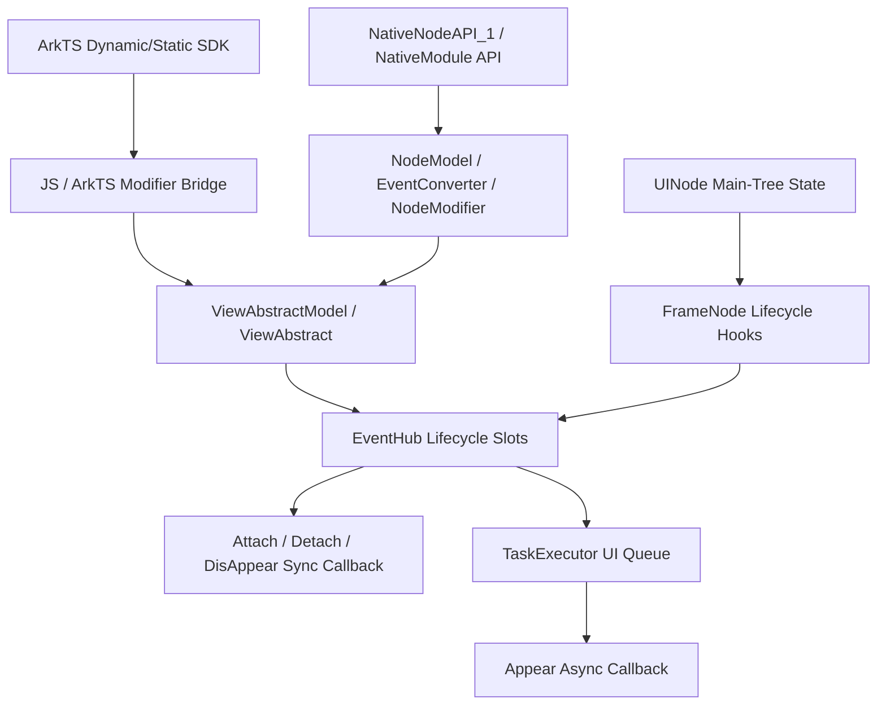
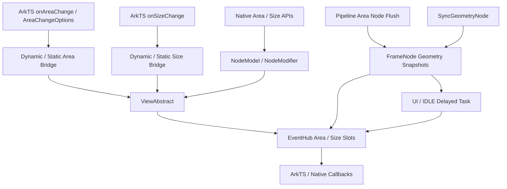
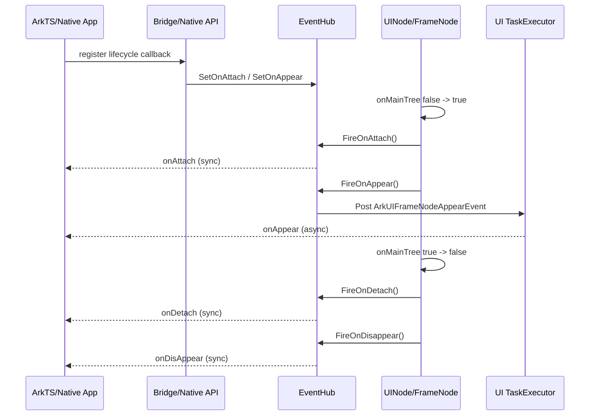
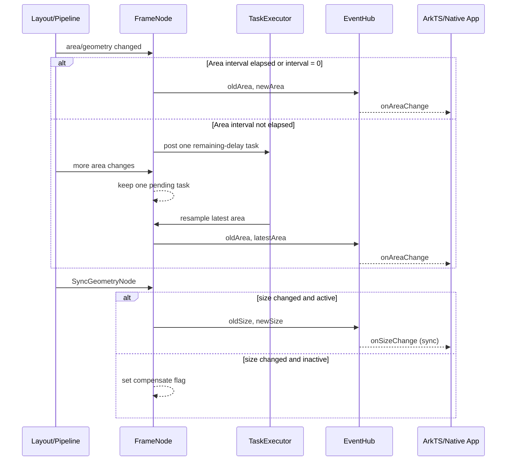
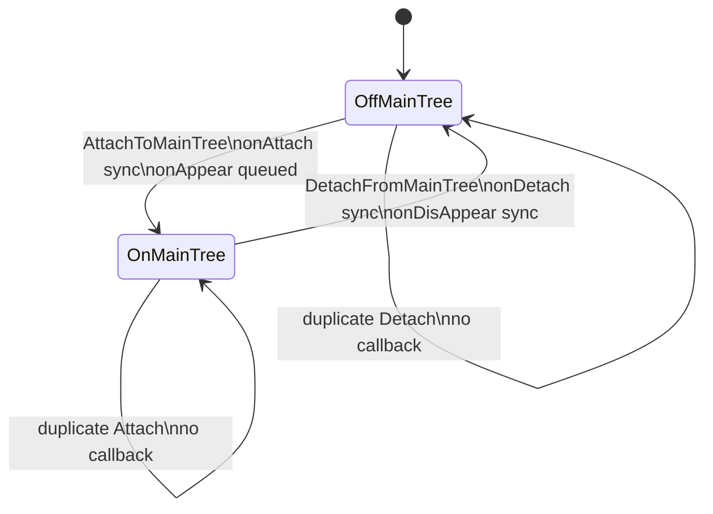
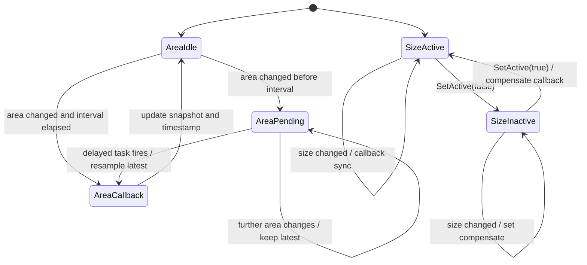
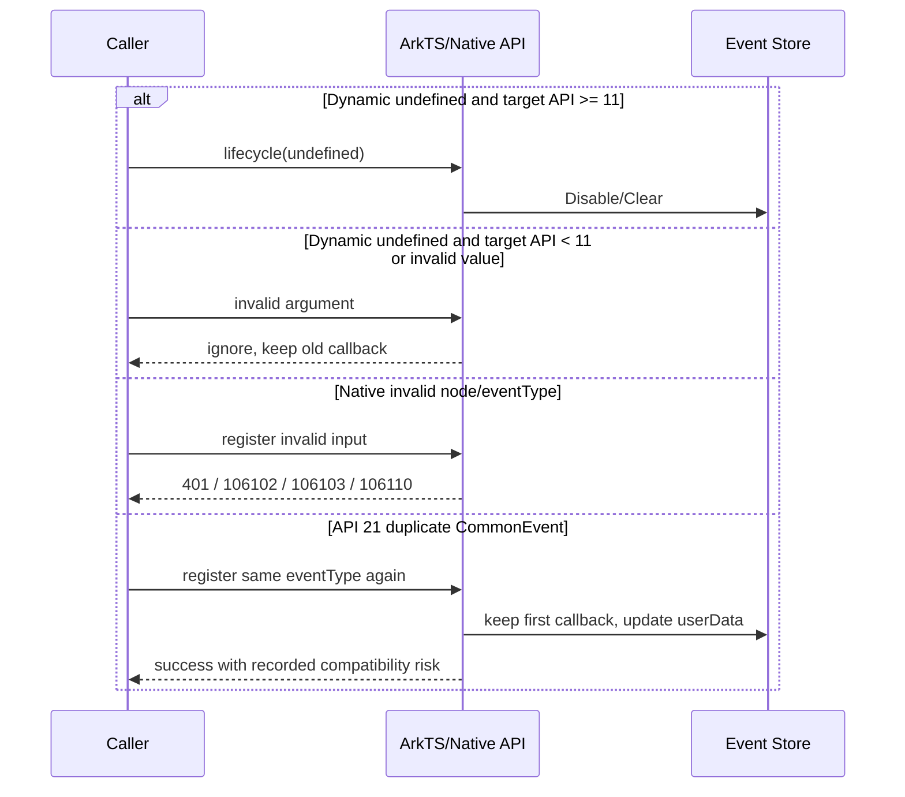
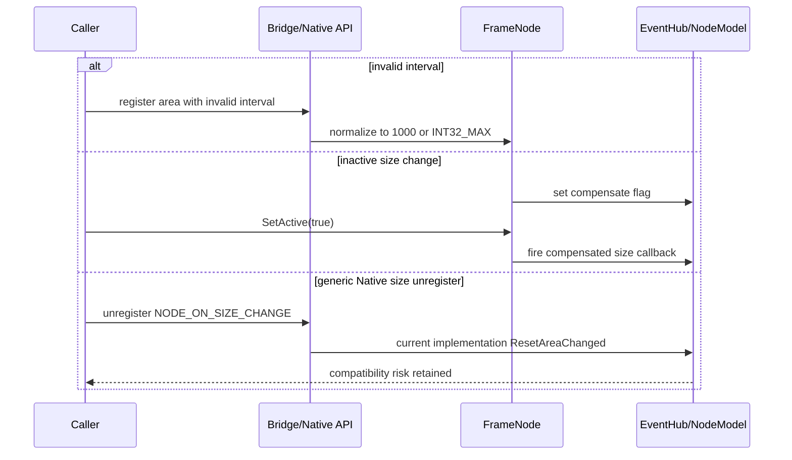

# 架构设计

> 确认组件相关事件域的目标仓和模块架构约束、关键设计决策与 Spec 拆分方向。本文件是 Func-04-04-09 下所有 Feat 共用的设计基线。

## 设计元数据

| 属性 | 值 |
|------|-----|
| Design ID | DESIGN-Func-04-04-09 |
| 关联需求 | 已有能力补录（无独立 requirement.md） |
| 关联 Epic | 无 |
| 目标 Feature | Feat-01 组件挂载与显隐生命周期事件, Feat-02 组件区域与尺寸变化事件 |
| 复杂度 | 复杂 |
| 目标版本 | ArkTS API 7/8/12/26，Static API 23/26，Native API 12/20/21/26 |
| Owner | ArkUI SIG |
| 状态 | Baselined（已有实现补录） |

## 需求基线

> 需求基线详见 proposal.md。以下仅列出设计阶段需要额外强调的要点。

| 项 | 补充说明（如需） |
|----|------------------|
| 实现即规格 | 固化当前 ace_engine 行为；可疑行为仅登记风险，不在本次补录中修改 |
| 范围边界 | Feat-01 仅覆盖 `onAppear`、`onDisAppear`、`onAttach`、`onDetach`，不覆盖焦点、区域、尺寸和可见区域事件 |
| 通道范围 | 覆盖 ArkTS Dynamic、ArkTS Static、NativeNodeAPI_1 和 API 21 NativeModule CommonEvent |
| 行为深度 | 覆盖注册、清理、重复注册、触发条件、顺序、异步时机、重挂载、转场和版本差异 |
| 重点决策 | 强调主树状态驱动、同步/异步时序和单槽/版本化清理语义 |
| Feat-02 补充范围 | 覆盖 `onAreaChange`、`AreaChangeOptions`、`onSizeChange` 的 ArkTS/Native 全链路、完整行为和版本差异 |
| Feat-02 重点决策 | 区分 Area/Size 快照与触发条件；固化尾沿节流、生命周期缓存继承和 Native/Legacy 风险 |

## 上下文和现状

### 涉及仓和模块

| 仓库 | 补充架构说明 |
|------|--------------|
| `arkui_ace_engine` | 提供 Dynamic/Static 桥接、ViewAbstract、Native Node、EventHub、FrameNode/UINode 生命周期与测试 |
| `interface_sdk-js` | 提供 Dynamic/Static ArkTS 公共接口签名、SysCap 和 `@since` 声明；Dynamic 证据与目标源码 checkout 版本不完全匹配 |
| `arkui_ace_engine`（Feat-02） | 提供 area/size 前端桥接、Pipeline area 节点调度、FrameNode 几何快照、interval 延迟任务、Native payload 与测试 |
| `interface_sdk-js`（Feat-02） | 声明 Area、SizeOptions、AreaChangeOptions、Dynamic/Static 版本和布局触发契约 |

### 调用链层级分析

| 层 | 模块 | 职责 | 修改类型 |
|----|------|------|----------|
| ArkTS SDK 声明层 | `interface/sdk-js/api/@internal/component/ets/common.d.ts`; `api/arkui/component/common.static.d.ets` | 声明四个生命周期接口、开放版本和 Static `undefined` 清理形态 | 无代码修改，规格补录 |
| Dynamic 直接桥接层 | `frameworks/bridge/declarative_frontend/jsview/js_interactable_view.cpp:381-445` | 校验回调参数，按目标 API 决定 `undefined` 是否清理 | 无代码修改，规格补录 |
| Dynamic Modifier 桥接层 | `ArkComponent.ts`; `arkts_native_common_bridge.cpp:9357-9502` | 提供 set/reset 分支并转入 ViewAbstract | 无代码修改，规格补录 |
| Static 桥接层 | `generated/component/common.ets`; `common_method_modifier.cpp:4205-4257` | 将 callback/undefined 序列化为 Set/Disable | 无代码修改，规格补录 |
| View 抽象层 | `view_abstract_model_ng.h:1239-1257`; `view_abstract.cpp:3435-3460,10050-10079` | 将前端或 Native 设置映射到当前 FrameNode 的 EventHub | 无代码修改，规格补录 |
| Native Public API 层 | `interfaces/native/native_node.h:10214-10384,13080-13107,14317-14346` | 暴露 API 12 泛型事件和 API 21 CommonEvent 入口 | 无代码修改，规格补录 |
| Native 映射层 | `event_converter.cpp:175-178,373-376`; `node_model.cpp:535-647,1779-1825`; `node_utils.cpp:822-910` | 校验事件、保存 targetId/userData/callback 并映射到 NodeModifier | 无代码修改，规格补录 |
| Native Modifier 层 | `node_common_modifier.cpp:12436-12501,13656-13681` | 构造生命周期事件包装回调或 Reset 对应事件槽 | 无代码修改，规格补录 |
| 事件存储层 | `frameworks/core/components_ng/event/event_hub.cpp:608-645,673-728,795-817` | 保存单回调槽并执行同步回调或投递异步任务 | 无代码修改，规格补录 |
| 生命周期驱动层 | `frameworks/core/components_ng/base/ui_node.cpp:1020-1119`; `frame_node.cpp:1874-1900,2162-2183` | 管理主树状态，驱动 attach/appear/detach/disappear 调用顺序 | 无代码修改，规格补录 |
| 调度层 | `TaskExecutor` | 在 UI 队列执行 `ArkUIFrameNodeAppearEvent` | 无代码修改，规格补录 |
| Legacy 兼容层 | `view_abstract_model_impl.h:231-234,304-307`; `view_abstract_model_impl.cpp:1176-1189` | 仅实现 appear/disappear，attach/detach 和 Disable 为空实现 | 无代码修改，兼容风险登记 |
| 测试层 | `test/unittest/core/event/`; `test/unittest/interfaces/`; `test/unittest/capi/modifiers/` | 验证 EventHub、ViewAbstract、Native 事件映射和清理 | 无代码修改，覆盖缺口登记 |
| Pipeline area 调度层 | `pipeline_context.cpp:1358-1373,5688-5725`; `event_hub.cpp:37-57` | 在帧 flush 中遍历 area 节点，并在 Context attach/detach 时维护节点集合 | （Feat-02）无代码修改，规格补录 |
| 几何快照与回调层 | `frame_node.cpp:2350-2572,7200-7263`; `event_hub.cpp:464-505,819-860,1260-1297` | 保存 area/size 快照、比较变化、节流合并、active 补偿并执行各通道回调 | （Feat-02）无代码修改，规格补录 |
| 几何同步层 | `frame_node.cpp:6550-6600`; `layout_wrapper.cpp:217-239,262-288` | 在布局几何同步后触发 Size，并计算 Area 的安全区/position 修正 | （Feat-02）无代码修改，规格补录 |

检查结果：

- [x] 调用链从 SDK/Public API 到主树状态驱动和任务调度均已覆盖
- [x] 每层职责边界清晰，无反向依赖
- [x] 所有层均明确为“存量实现规格补录”，不修改产品代码

### 适用架构规则

| Rule ID | 适用原因 | 设计结论 | 验证方式 |
|---------|----------|----------|----------|
| OH-ARCH-LAYERING | 涉及 SDK、Bridge、ViewAbstract、EventHub、FrameNode 多层调用 | 保持 Public API → Bridge/Modifier → ViewAbstract → EventHub → 生命周期驱动的单向依赖 | 架构评审/源码依赖检查 |
| OH-ARCH-SUBSYSTEM | 涉及 `interface_sdk-js` 与 `arkui_ace_engine` 两仓 | SDK 只声明契约，ace_engine 实现行为；差异必须在 Spec 风险中显式可见 | SDK/API 审查 |
| OH-ARCH-IPC-SAF | 不涉及跨进程或 SA | N/A，不引入 IPC/SAF | 设计评审 |
| OH-ARCH-API-LEVEL | 涉及 API 7/8/11/12/20/21/23/26 | 严格保留 `@since`、目标 API 清理门槛、Area interval 和 Native 支持矩阵 | API 评审/XTS |
| OH-ARCH-COMPONENT-BUILD | 不修改组件或构建依赖 | BUILD.gn/bundle.json 均无变更 | 构建差异检查 |
| OH-ARCH-ERROR-LOG | Native API 暴露错误码 | 记录公开错误码及实现可返回的 500/线程错误分支，不引入新错误码 | C API 单测/源码审查 |

## 不涉及项承接

| 维度 | 设计结论 |
|------|----------|
| 新增/变更 API | 不新增或修改接口，仅补录现有 API 行为 |
| ABI/数据格式 | 不修改 ABI、结构体布局、配置文件或持久化格式 |
| 构建与依赖 | 不修改 BUILD.gn、bundle.json 或跨子系统依赖 |
| 安全与权限 | 不引入权限、敏感数据、IPC 或系统服务调用 |
| 多设备适配 | 通用 FrameNode/UINode 行为，手机、平板、折叠屏无差异 |
| 其他事件 | Feat-01 不含区域/尺寸；Feat-02 纳入 area/size，但可见区域、焦点、输入、手势和绘制完成事件仍不属于本域当前规格 |

## 关键设计决策

| 决策 ID | 问题 | 推荐方案 | 探索过的替代方案 | 取舍理由 | 影响 |
|---------|------|----------|------------------|----------|------|
| ADR-1 | 四个事件应以什么状态作为触发源 | 以 UINode 的 `onMainTree_` 状态迁移作为唯一生命周期触发源 | 1. 以 visibility 属性变化触发；2. 以 active 状态变化触发；3. 以可见面积变化触发 | 真实实现仅在 AttachToMainTree/DetachFromMainTree 链路调用四事件；其他状态有独立通知机制 | AC-2.1~AC-2.6；避免与 04-04-10 可见区域事件混淆 |
| ADR-2 | 挂载和卸载回调是否统一为同步或异步 | 保留实现中的不对称时序：attach 同步、appear 异步，detach/disappear 同步 | 1. 全部同步；2. 全部异步；3. 只记录逻辑顺序而忽略可观察时机 | TaskExecutor 投递是既有可观察行为；统一描述会掩盖快速挂卸载边界 | AC-2.1, AC-2.2, AC-2.7；决定任务队列测试策略 |
| ADR-3 | 回调注册和清理采用什么语义 | 每事件单槽、重复注册覆盖；按 Dynamic API 11 门槛和 Static `undefined` 规则描述清理 | 1. 多监听列表；2. 所有版本 `undefined` 都清理；3. 非函数输入自动清理 | EventHub 使用四个独立 `std::function`，Bridge 对 `undefined` 有版本分支且非法输入静默忽略 | AC-1.1~AC-1.5；决定兼容性与重入边界 |
| ADR-F2-1 | Area 与 Size 是否共用几何变化定义 | 分别使用 Area 的 frame rect + parent offset 快照，以及 Size 的 paint rect size 快照 | 1. 两者都按完整 Rect 比较；2. 两者都只比较 size；3. 由前端统一过滤 | 当前实现存储、触发位置和数据语义均不同；合并定义会错误触发或漏触发 | Feat-02 AC-1.1~AC-1.3, AC-3.1~AC-3.4 |
| ADR-F2-2 | Area interval 如何处理连续变化 | 保留单 pending 延迟任务并在尾沿采集最新 area | 1. 每次变化都排队；2. 只采 interval 起点值；3. 固定周期轮询 | 当前实现以剩余间隔投递任务并在执行时重新采样，能合并中间状态 | Feat-02 AC-2.1~AC-2.6 |
| ADR-F2-3 | 离树、重挂和 inactive 时如何处理快照 | Area 离树保留快照并在重挂后继续比较；Size inactive 设置补偿标志并在 active 时补偿 | 1. 离树清空全部快照；2. inactive 丢弃变化；3. 重挂强制零值首回调 | 实现分别通过 Pipeline 集合和 compensate 标志维持连续性 | Feat-02 AC-3.4~AC-4.4 |
| ADR-F2-4 | Native/Legacy 实现偏差如何进入设计 | 按实现事实登记兼容风险，不修改行为或静默对齐契约 | 1. 以头文件说明覆盖源码；2. 在规格中隐藏偏差；3. 本次直接修复 | “实现即规格”要求保留 Size 注销误清 Area、CommonEvent callback 替换偏差和 Legacy 空实现 | Feat-02 AC-5.6, AC-5.7, AC-6.3 |

## 设计骨架

### 骨架范围

| 骨架项 | 目标 | 不包含 | 验证方式 |
|--------|------|--------|----------|
| ArkTS 生命周期契约 | 固化四接口的版本、注册和清理行为 | 不修改 SDK 声明 | SDK/Bridge 源码审查 |
| 主树生命周期状态机 | 固化真实触发条件、幂等和重挂载行为 | 不覆盖 visibility/active/可见面积 | Host 单测 |
| 生命周期时序 | 固化 attach/appear/detach/disappear 的同步异步关系 | 不改变任务调度 | 可控 TaskExecutor 单测 |
| Native 事件接入 | 固化 API 12/21 支持矩阵、错误码和数据传递 | 不新增 Native 事件类型 | C API 单测 |
| 兼容性边界 | 固化 Legacy、目标 API 和 SDK 版本差异 | 不修复差异 | 双管线测试/风险审查 |
| Area 快照与节流 | 固化位置/父偏移触发、首次快照、间隔归一化和尾沿合并 | 不覆盖可见区域 ratio 监听 | Host/Bridge 可控时钟测试 |
| Size 同步与补偿 | 固化 size-only 去重、几何同步回调和 inactive 补偿 | 不把位置/transform 当作 size 变化 | Host 几何同步测试 |
| Native 几何事件 | 固化12项 Area、4项 Size payload 与 API 12/20/21/26 支持矩阵 | 不修复当前注销/重复注册偏差 | C API 回归测试 |

### 骨架 Spec 拆分

| Task ID | 目标 | 受影响文件 | AC |
|---------|------|------------|----|
| TASK-SKELETON-1 | 形成 Feat-01 生命周期事件完整规格和设计基线 | `Feat-01-component-mount-visibility-lifecycle-events-spec.md`; `design.md` | AC-1.1~AC-4.4 |
| TASK-SKELETON-2 | 增量形成 Feat-02 区域与尺寸变化事件规格和共享设计 | `Feat-02-component-area-size-change-events-spec.md`; `design.md` | Feat-02 AC-1.1~AC-6.4 |

## 后续 Task 拆分

| Task ID | 目标 | 受影响文件 | 依赖 |
|---------|------|------------|------|
| TASK-04-04-09-F1 | 基于现有实现补录组件挂载与显隐生命周期事件规格 | `Feat-01-component-mount-visibility-lifecycle-events-spec.md`; `design.md` | 已确认范围、源码证据和关键发现 |
| TASK-04-04-09-F2 | 基于现有实现补录组件区域与尺寸变化事件 | `Feat-02-component-area-size-change-events-spec.md`; `design.md` 增量章节 | 已确认范围、版本、增量策略、源码证据和关键发现 |

## API 签名、Kit 与权限

### 新增 API

> 本次无新增 API。下表记录本设计覆盖的存量接口。

| API 签名 | 类型 | Kit | d.ts 位置 | 权限要求 | SysCap |
|----------|------|-----|------------|----------|--------|
| `onAppear(event: () => void): T` | Public | ArkUI | `common.d.ts:22222-22260` | 无 | `SystemCapability.ArkUI.ArkUI.Full` |
| `onDisAppear(event: () => void): T` | Public | ArkUI | `common.d.ts:22262-22300` | 无 | `SystemCapability.ArkUI.ArkUI.Full` |
| `onAttach(callback: Callback<void>): T` | Public | ArkUI | `common.d.ts:22302-22312` | 无 | `SystemCapability.ArkUI.ArkUI.Full` |
| `onDetach(callback: Callback<void>): T` | Public | ArkUI | `common.d.ts:22314-22324` | 无 | `SystemCapability.ArkUI.ArkUI.Full` |
| `ArkUI_NativeNodeAPI_1::registerNodeEvent(...)` | Public C API | ArkUI Native | `native_node.h:13080-13099` | 无；主线程调用 | N/A |
| `ArkUI_NativeNodeAPI_1::unregisterNodeEvent(...)` | Public C API | ArkUI Native | `native_node.h:13101-13107` | 无；主线程调用 | N/A |
| `OH_ArkUI_NativeModule_RegisterCommonEvent(...)` | Public C API | ArkUI Native | `native_node.h:14317-14332` | 无；主线程调用 | N/A |
| `OH_ArkUI_NativeModule_UnregisterCommonEvent(...)` | Public C API | ArkUI Native | `native_node.h:14334-14346` | 无；主线程调用 | N/A |
| `onAreaChange(event: (oldValue: Area, newValue: Area) => void): T` | Public | ArkUI | `common.d.ts:22721-22746` | 无 | `SystemCapability.ArkUI.ArkUI.Full` |
| `onAreaChange(event: AreaChangeCallback, options?: AreaChangeOptions): T` | Public | ArkUI | `common.d.ts:22748-22764,27077-27116` | 无 | `SystemCapability.ArkUI.ArkUI.Full` |
| `onSizeChange(event: SizeChangeCallback): T` | Public | ArkUI | `common.d.ts:25412-25438` | 无 | `SystemCapability.ArkUI.ArkUI.Full` |
| Static `onAreaChange(...): this` | Public | ArkUI | `common.static.d.ets:12835-12856,15123-15153` | 无 | `SystemCapability.ArkUI.ArkUI.Full` |
| Static `onSizeChange(event: SizeChangeCallback \| undefined): this` | Public | ArkUI | `common.static.d.ets:14196-14206` | 无 | `SystemCapability.ArkUI.ArkUI.Full` |
| `NODE_EVENT_ON_AREA_CHANGE` / `NODE_ON_SIZE_CHANGE` | Public C API | ArkUI Native | `native_node.h:10247-10278,10568-10576` | 无；主线程注册 | N/A |
| `OH_ArkUI_NativeModule_RegisterCommonAreaApproximateChangeEvent(...)` | Public C API | ArkUI Native | `native_node.h:14378-14408` | 无；主线程调用 | N/A |

### 变更/废弃 API

| 原有 API | 变更类型 | 新 API | 迁移说明 |
|----------|----------|--------|----------|
| — | — | — | 本次无接口变更或废弃 |

## 构建系统影响

### BUILD.gn 变更

```text
文件路径: N/A
变更说明: Feat-01/Feat-02 仅新增 specs 文档和注册元数据，不修改 ace_engine 构建目标、源文件列表或依赖。
```

### bundle.json 变更

无新增 component，不修改依赖关系。

## 可选设计扩展

### 架构图



#### 区域与尺寸事件架构图（Feat-02）



### 数据流/控制流

| 步骤 | 调用方 | 被调用方 | 数据/接口 | 说明 |
|------|--------|----------|-----------|------|
| 1 | ArkTS SDK | Dynamic/Static Bridge | callback 或 `undefined` | Dynamic 按目标 API 判定清理；Static 缺失值直接 Disable |
| 2 | Native 应用 | NativeNodeAPI_1/NativeModule | node、eventType、targetId/userData/callback | 校验节点、线程和事件支持范围 |
| 3 | Bridge/Native Modifier | ViewAbstract | Set/Disable 生命周期函数 | 定位目标 FrameNode |
| 4 | ViewAbstract | EventHub | 四类 `std::function<void()>` | 单槽保存、覆盖或清理 |
| 5 | UINode | FrameNode | Attach/Detach 主树状态迁移 | `onMainTree_` 守卫保证幂等 |
| 6 | FrameNode | EventHub | FireOnAttach/Appear/Detach/Disappear | 应用固定顺序 |
| 7 | EventHub | 调用方/TaskExecutor | 同步回调或 UI Task | appear 异步，其余同步 |
| 8（Feat-02） | PipelineContext | FrameNode | area 节点集合与帧 flush | 仅 attach Context 的 area 节点参与普通检测 |
| 9（Feat-02） | Layout/RenderContext | FrameNode | frame rect、parent offset、paint rect | 分别形成 Area 与 Size 快照 |
| 10（Feat-02） | FrameNode | TaskExecutor/EventHub | interval、pending、old/new 快照 | Area 可尾沿延迟；Size 在 geometry sync 同步触发 |
| 11（Feat-02） | EventHub/Native Modifier | ArkTS/Native 回调 | Area 4字段或 Native 12项；Size 2字段或 Native 4项 | 统一 px→vp 后派发 |

### 时序设计



#### Area interval 与 Size 同步时序（Feat-02）



### 数据模型设计

```cpp
// EventHub 中每种生命周期事件各自持有一个用户回调槽。
std::function<void()> onAppear_;
std::function<void()> onDisappear_;
std::function<void()> onAttach_;
std::function<void()> onDetach_;

// Native API 12 以 eventType 为键保存事件元数据。
struct InnerEventExtraParam {
    int32_t targetId;
    ArkUI_NodeHandle node;
    void* userData;
};
```

#### 区域与尺寸快照数据模型（Feat-02）

```cpp
// FrameNode 中用于 Area 与 Size 的独立快照和节流状态。
RectF lastFrameRect_;
OffsetF lastParentOffsetToWindow_;
std::optional<RectF> lastFrameNodeRect_;
int32_t onAreaChangeMinInterval_;
bool isOnAreaChangeCallbackPending_;
int64_t lastOnAreaChangeTimeStamp_;
```

| 数据 | 存储位置 | 生命周期 | 更新语义 |
|------|----------|----------|----------|
| ArkTS/泛型 Native 用户回调 | `EventHub` | 随 FrameNode/EventHub；显式 Disable/Reset 时清理 | 单槽覆盖 |
| API 12 targetId/userData | `ArkUI_NodeHandle::extraData` 的 eventMap | 注册到注销或节点清理 | 相同 eventType 更新 |
| API 21 callback | `commonEventListeners` | 当前实现注销不擦除 callback map 项 | `insert` 保留首次 callback，风险项 |
| API 21 userData | `extraCommonData` 的 eventMap | 注册到注销 | 相同 eventType 更新 |
| Area old/new 快照 | `FrameNode::lastFrameRect_`、`lastParentOffsetToWindow_` | 节点生命周期；detach 不清理 | 每次有效 Area 派发后更新 |
| Size old/new 快照 | `FrameNode::lastFrameNodeRect_` | 节点生命周期；重注册不强制清零 | 每次有效 Size 处理后更新 |
| Area interval 状态 | FrameNode interval、timestamp、pending 字段 | interval 注册到节点销毁/重设 | 单 pending 尾沿合并 |
| inactive Size 补偿标志 | EventHub | inactive size 变化到下一次 active | 补偿触发后清除 |

### 算法与状态机



状态迁移依据 `ui_node.cpp:1020-1039,1077-1098`；回调顺序依据 `frame_node.cpp:1874-1884,2162-2183` 和 `event_hub.cpp:608-645,683-728`。

#### Area interval 与 Size active 状态（Feat-02）



### 测试性设计

| 测试层级 | 测试目标 | Mock 策略 | 验证方式 |
|----------|----------|-----------|----------|
| EventHub Host 单测 | 单槽覆盖、清理、同步触发和 Detach 顺序 | 计数器/回调替换 | `event_hub_test_ng.cpp:515-600,2057-2098` |
| ViewAbstract Host 单测 | 按 FrameNode 设置和 Disable 四事件 | Mock ViewStackProcessor/FrameNode | `view_abstract_test_six_ng.cpp:202-262`; `view_abstract_test_ng_for_property_config.cpp:330-456` |
| 主树状态单测 | 幂等、重挂载、visibility/active 不触发、转场边界 | 测试 FrameNode + 可控 PipelineContext | 新增回归用例建议，产品代码不变 |
| 异步时序单测 | appear 任务与快速 detach 的可观察顺序 | 可控 TaskExecutor，手动 drain UI queue | 新增回归用例建议 |
| Static C API Modifier 单测 | set/disable attach/detach | 直接 Fire EventHub | `common_method_modifier_test9.cpp:585-670` |
| Native Node 单测 | 四事件 converter、注册/注销、错误码 | NativeNode 测试节点和 receiver | `native_node_test.cpp:2759-2787,3054-3081,10165-10199` |
| SDK/XTS | 接口版本、签名和跨设备一致性 | 无 | SDK 检查/XTS |
| Area Host 单测（Feat-02） | frame rect/parent offset 去重、普通与 interval 首次触发、离树重挂 | 可控 PipelineContext/时钟 | `frame_node_test_ng_coverage.cpp:1079-1243`; `view_abstract_test_six_ng.cpp:265-330` |
| Size Host 单测（Feat-02） | size-only 去重、同步时机和 inactive 补偿 | Mock RenderContext/FrameNode | `frame_node_test_ng_coverage_new.cpp:1492-1572`; `event_hub_test_ng.cpp:1240-1357` |
| Bridge/Static 单测（Feat-02） | arguments.length、undefined/null、interval 非法值 | JS/ETS 参数化用例 | 当前缺少直接覆盖，登记补测 |
| Native C API 单测（Feat-02） | Area 12项、Size 4项、API矩阵、注销与重复注册 | Native receiver + 可控节点 | 当前 payload/注销/interval 覆盖不足，登记补测 |

### 异常传播时序图



| 异常场景 | 对外结果 | 恢复策略 | 规格映射 |
|----------|----------|----------|----------|
| Dynamic 旧版本 `undefined` 或非法值 | 静默忽略，保留旧回调 | 重新传入有效函数；API >= 11 可传 `undefined` 清理 | AC-1.3, AC-1.4 |
| Native 无效节点 | 返回 401 或对应实现错误码 | 修正节点后重新注册 | AC-3.1 |
| API 21 不支持 attach/detach | 返回 106110 | 改用 API 12 泛型 registerNodeEvent | AC-3.5 |
| API 21 重复注册 | 首次 callback 与最新 userData 组合 | 作为实现风险；调用方避免依赖覆盖语义 | AC-3.6 |
| Feat-02 省略 options | interval=0ms | 直接按每次有效 area 变化触发 | Feat-02 AC-2.1 |
| Feat-02 显式无效 options | interval 回退1000ms | 使用有效 interval 或完全省略第二实参 | Feat-02 AC-2.2, AC-2.3 |
| Feat-02 inactive Size | 不立即回调，设置补偿标志 | 下次 active 自动补偿 | Feat-02 AC-3.5 |
| Feat-02 泛型 Size 注销 | 当前误清 Area 槽 | 记录实现风险并用回归测试定界 | Feat-02 AC-5.6 |

#### Area/Size 异常与恢复时序（Feat-02）



### 资源所有权矩阵

| 资源 | 创建方 | 持有方 | 销毁触发 | 实际释放 | 异常回收 |
|------|--------|--------|----------|----------|----------|
| ArkTS 回调包装 | Bridge | EventHub | Disable、覆盖或 EventHub 销毁 | `std::function` 赋空/替换 | FrameNode 销毁随 EventHub 释放 |
| onAppear UI 任务 | EventHub | TaskExecutor | 任务执行完成 | TaskExecutor | EventHub 已销毁时 WeakPtr Upgrade 失败并返回 |
| API 12 `InnerEventExtraParam` | NodeModel | `extraData->eventMap` | unregister 或 ExtraData 清理 | 显式 delete | 空 map 时释放 ExtraData |
| API 21 callback map | NodeModel | `commonEventListeners` | 节点清理 | 节点生命周期清理 | 单事件注销不擦除 callback 项，登记风险 |
| API 21 userData 元数据 | NodeModel | `extraCommonData->eventMap` | unregister 或节点清理 | 显式 delete | 空 map 时释放 ExtraData |
| Area interval delayed task（Feat-02） | FrameNode | TaskExecutor | 延迟到期 | 任务执行完成 | EventHub/FrameNode 不可用时安全返回；清 callback 后跳过派发 |
| Area/Size 用户槽（Feat-02） | Bridge/Native Modifier | EventHub | reset、覆盖或节点销毁 | `std::function` 替换/赋空 | 回调执行前复制，允许重入修改 |
| Area/Size 快照（Feat-02） | FrameNode | FrameNode | 节点销毁 | 值类型随节点释放 | detach/重注册不清零，按连续快照处理 |

### 接口参数规约

| 接口 | 参数 | 类型 | 合法范围 | 非法处理 | 边界说明 |
|------|------|------|----------|----------|----------|
| Dynamic 生命周期接口 | event/callback | Function/undefined | 函数；目标 API >= 11 时可用 undefined 清理 | null/非函数静默忽略；API < 11 的 undefined 忽略 | SDK 声明未公开 undefined |
| Static 生命周期接口 | event/callback | Function/undefined | 函数或 undefined | undefined 清理 | API 23 static |
| NativeNodeAPI_1 注册 | node | ArkUI_NodeHandle | 有效且支持 Native 事件的节点 | 返回 401/106102/106103 | 主线程调用 |
| NativeNodeAPI_1 注册 | eventType | ArkUI_NodeEventType | 四个生命周期事件 | 不支持时返回错误码 | 四事件无业务 payload |
| NativeModule CommonEvent | eventType | ArkUI_NodeEventType | APPEAR/DISAPPEAR | ATTACH/DETACH 返回 106110 | API 21 白名单 |
| NativeModule CommonEvent | callback | 函数指针 | 非空 | 空指针返回 401 | 重复注册不替换首次 callback |
| Dynamic onAreaChange（Feat-02） | options | AreaChangeOptions/undefined | 完全省略或合法对象 | 第二实参存在但无效时回退1000ms | 与完全省略的0ms不同 |
| Area interval（Feat-02） | expectedUpdateInterval | int/float bridge value | 0..INT32_MAX | 负/NaN/-Inf→1000；+Inf/过大→INT32_MAX | 正小数截断 |
| Dynamic onSizeChange（Feat-02） | event | Function | 有效函数 | undefined/null/非函数保持旧回调 | Modifier reset 可清理 |
| Native Area/Size（Feat-02） | eventType | ArkUI_NodeEventType | AREA_CHANGE/ SIZE_CHANGE | 不支持时返回错误码 | Size 自API20；Area interval 另有API26入口 |

### 线程与并发模型

| 操作 | 发起线程 | 回调线程 | 跨进程边界 | 线程安全 | 重入约束 |
|------|----------|----------|------------|----------|----------|
| ArkTS 注册/清理 | UI 主线程 | N/A | 无 | 依赖 UI 线程模型 | 回调槽可被后续设置覆盖 |
| Native 注册/注销 | UI 主线程 | N/A | 无 | Public API 明确要求主线程 | 非主线程调用返回线程错误或不满足契约 |
| `onAttach` | UI 主线程 | UI 主线程，同步 | 无 | 单线程顺序 | 回调内可覆盖/清理，当前调用使用局部副本 |
| `onAppear` | UI 主线程投递 | UI TaskExecutor | 无 | WeakPtr 防止 EventHub 悬空 | 任务执行时读取当前回调槽 |
| `onDetach`/`onDisAppear` | UI 主线程 | UI 主线程，同步 | 无 | 单线程顺序 | 回调内可覆盖/清理，当前调用使用局部副本 |
| Area 普通回调（Feat-02） | Pipeline UI 帧 flush | UI 主线程 | 无 | Pipeline 单线程集合遍历 | 回调内可覆盖；本轮使用局部副本 |
| Area interval 回调（Feat-02） | UI/IDLE 延迟任务 | UI 主线程 | 无 | 单 pending 状态防止重复投递 | 执行时重新采样最新 area |
| Size 回调（Feat-02） | 几何同步阶段 | UI 主线程，同步 | 无 | active=false 时走补偿标志 | 回调状态变更可能进入动画闭包，SDK建议异步处理UI逻辑 |

| 并发/时序场景 | 设计结论 | 验证方式 |
|---------------|----------|----------|
| attach 后立即 detach，appear 任务尚未执行 | detach/disappear 可先执行，appear 任务不显式取消并在执行时读取当前槽 | 可控 TaskExecutor 单测 |
| 回调执行时重新注册或清理自身 | 本次调用使用局部副本；后续触发使用更新后的槽 | EventHub 重入单测 |
| 非主线程 Native 注册 | 不属于合法调用；验证错误返回，不承诺跨线程同步 | C API 错误路径测试 |
| Area interval pending 期间连续变化 | 保留单任务并在尾沿采最新状态 | 可控时钟/TaskExecutor 单测 |
| Area pending 期间清理 user callback | 任务仍执行但跳过用户回调并清 pending | 清理竞态单测 |
| inactive Size 连续变化 | 保留补偿标志，下一次 active 触发一次补偿 | 生命周期单测 |

## 详细设计

### ArkTS 注册与清理

Dynamic 直接桥接在 `js_interactable_view.cpp:381-445` 中按以下顺序处理四个接口：

1. 参数为 `undefined` 且 `IsDisableEventVersion()` 为真时调用 Disable 并返回；该门槛由 `js_utils.cpp:249-253` 定义为目标 API >= 11。
2. 参数为函数时构造无参回调并调用 `ViewAbstractModel::SetOn*`。
3. 其他输入不进入 Set 或 Disable，已有事件槽保持不变。

Dynamic Modifier 与 Static 路径均提供显式 Set/Reset；Static `common_method_modifier.cpp:4205-4257` 在 optional 值缺失时执行 Disable。最终 `ViewAbstract` 将回调存入 EventHub 的四个单槽，Set 直接赋值、Clear 置空，见 `event_hub.cpp:673-714,795-817`。

### 主树挂载与卸载

`UINode::AttachToMainTree` 在 `ui_node.cpp:1020-1039` 中先校验 `onMainTree_`，挂接 Context 并置为 true，再调用 `FrameNode::OnAttachToMainTree`。FrameNode 在 `frame_node.cpp:1874-1884` 中先 FireOnAttach，再 FireOnAppear。EventHub 的 attach 直接同步调用；appear 通过 `TaskExecutor::PostTask` 投递 `ArkUIFrameNodeAppearEvent`，见 `event_hub.cpp:608-630,683-688`。

`UINode::DetachFromMainTree` 在 `ui_node.cpp:1077-1098` 中先将 `onMainTree_` 置为 false并分离 Context，再进入 FrameNode detach。FrameNode 调用 `EventHub::OnDetachClear`；该函数固定依次 FireOnDetach、FireOnDisappear，见 `frame_node.cpp:2162-2183` 和 `event_hub.cpp:708-728`。

### 主树状态边界

- `NotifyVisibleChange` 只通知 Pattern 和 children visibility，不调用四个生命周期回调，见 `frame_node.cpp:2112-2151`。
- `SetActive` 只调用 Pattern 的 OnActive/OnInActive，见 `frame_node.cpp:2936-2960`。
- Attach/Detach 的 `onMainTree_` 守卫使重复操作幂等，见 `ui_node.cpp:1020-1024,1077-1081`。
- 有消失转场时，节点先执行逻辑 Detach，再移入 disappearing children 保留动画层级，见 `ui_node.cpp:373-412`。
- 离树不会清理四个用户回调；重新挂树仍可触发原回调，见 `event_hub.cpp:723-728`。

### 异步 appear 时序

`FireOnAppear` 只在投递时捕获 EventHub 的 WeakPtr，任务执行时再读取当前 `onAppear_`，见 `event_hub.cpp:615-629`。因此：

- attach 后、任务执行前覆盖回调时，任务调用更新后的回调。
- attach 后、任务执行前清理回调时，该次异步任务不调用用户回调。
- attach 后快速 detach 时，detach/disappear 可先同步完成，已投递 appear 任务没有离树取消逻辑。

以上均是当前实现边界，不定义为缺陷，也不提出调度修正。

### Native Node 事件接入

API 12 `registerNodeEvent` 在 `node_model.cpp:535-616` 中校验节点和事件，将相同 eventType 的 targetId/userData 更新到单项映射，再经 EventConverter 和 NodeModifier 写入 EventHub。`unregisterNodeEvent` 删除映射并 Reset 底层事件，见 `node_model.cpp:619-647`。四事件的 `ArkUI_NodeComponentEvent` 不含业务参数，枚举声明位于 `native_node.h:10228-10245,10368-10384`。

API 21 CommonEvent 入口的白名单在 `node_utils.cpp:822-845`，仅包含 appear/disappear。attach/detach 返回 106110。CommonEvent 使用独立的 FrameNode 事件槽，可与普通用户槽共存；但 `MakeCommonEventMap` 对 callback 使用 `map::insert`，清理时只删除 extraCommonData，见 `node_model.cpp:1779-1825`，因此重复注册和注销后重注册存在首次 callback 与最新 userData 组合的风险。

### Legacy 兼容路径

Legacy `ViewAbstractModelImpl` 对 onAppear/onDisAppear 写入旧 Component EventMarker，但 onAttach/onDetach 和四项 Disable 是空实现，见 `view_abstract_model_impl.h:231-234,304-307` 与 `view_abstract_model_impl.cpp:1176-1189`。规格必须将该差异保留在兼容性声明中，不把 NG 行为无条件推广到旧管线。

### Area 快照与触发条件

Area 使用 `lastFrameRect_` 与 `lastParentOffsetToWindow_` 两组快照。`frame_node.cpp:2381-2409,7200-7238` 在本地安全区修正后的矩形或父级窗口偏移变化时进入回调，因此父级移动可触发子节点 area；translate、scale、transform 等仅渲染变化不属于布局 area 契约。SDK 还明确区分 position 形式：`Position` 可触发，而 `Edges`/`LocalizedEdges` 不触发，见 `common.d.ts:22721-22746`。EventHub 在 `event_hub.cpp:1260-1297` 依次处理 inner/user 回调并更新快照。

普通注册在 `frame_node.cpp:2350-2358` 只设置回调并使用零初始快照，首次非零区域可形成零 oldValue。interval 注册在 `frame_node.cpp:2360-2378,7253-7263` 预置注册时当前 area，注册动作本身不产生首回调。

### AreaChangeOptions 与尾沿合并

Dynamic `onAreaChange(callback)` 完全省略第二实参时使用0ms；第二实参存在但无有效 interval 时使用1000ms，见 `js_view_abstract.cpp:8622-8658`、`ArkComponent.ts:2313-2323,5385-5390` 和 `arkts_native_common_bridge.cpp:9976-10008`。interval 归一化规则位于 `js_view_abstract.cpp:504-525`、`arkts_native_common_bridge.cpp:138-156` 与 Native `node_common_modifier.cpp:186-205`。

`frame_node.cpp:2442-2496` 在 interval 未到期时只投递一个剩余时长任务；pending 期间不重复投递。任务执行时重新获取当前 rect 和 parent offset，因此窗口内变化以最新值尾沿合并。清除 user callback 不取消任务，任务执行时发现回调缺失后只清 pending 状态。

### Area 生命周期与节流边界

EventHub 在 Context attach 时将 area 节点加入 Pipeline、detach 时移除，见 `event_hub.cpp:37-57`。回调和快照不随离树清除，重挂后由 `pipeline_context.cpp:5688-5725` 再次检测并与离树前快照比较。普通 area 在 `frame_node.cpp:2416-2429` 受 active 门禁约束。

当前实现还有两个需要原样记录的边界：interval 延迟任务执行时没有再次验证 active/main-tree；当 inner area callback 并存时，普通 HandleOnAreaChange 路径可能再次调用 user callback，形成 interval 旁路。证据为 `frame_node.cpp:2416-2429,2442-2496` 与 `event_hub.cpp:1266-1276`。

### Size 同步回调与 inactive 补偿

Size 使用 `RenderContext::GetPaintRectWithoutTransform()` 的 size 作为触发快照，只比较宽高；位置、父偏移和 transform 不触发，见 `frame_node.cpp:2529-2570`。`SyncGeometryNode` 在 RenderContext 同步后立即调用 Size 回调，因此回调发生在布局几何同步阶段，见 `frame_node.cpp:6550-6600`。

active=false 时 Size 不立即回调，而是在 EventHub 设置补偿标志；`SetActive(true)` 立即触发一次补偿并清标志，见 `frame_node.cpp:2546-2572,2936-2946`。用户、inner 和 JS FrameNode size 通道的顺序及局部副本保护位于 `event_hub.cpp:464-505,648-670`。

### Area/Size Native 数据与版本

API12 Area 泛型事件输出12项 vp 数据：旧/新 width、height、localX、localY、pageX、pageY，见 `native_node.h:10247-10278` 与 `node_common_modifier.cpp:12536-12576`。API20 Size 实现输出4项 vp 数据：oldWidth、oldHeight、newWidth、newHeight，见 `node_common_modifier.cpp:12579-12605`；public enum 注释未写 payload，作为契约缺口记录。

API21 CommonEvent 白名单只覆盖 Size，不含 Area；API26 通过 `OH_ArkUI_NativeModule_RegisterCommonAreaApproximateChangeEvent` 提供带 interval 的 Area 通道。API12 泛型 Size 注销在 `node_common_modifier.cpp:13698-13710` 当前错误调用 `ResetAreaChanged`。API21/26 CommonEvent 的 callback map 使用 `insert`，重复注册不替换首次 callback，而 userData 会更新，见 `node_model.cpp:1779-1825`。以上只登记风险，不在文档补录中修正。

### Area/Size Legacy 与前端差异

NG area/size 都是单用户槽覆盖。Legacy area 使用旧 AddOnAreaChangeEvent、忽略 minInterval且 `DisableOnAreaChange` 为空；Legacy size 为空实现，见 `view_abstract_model_impl.cpp:1289-1295` 与 `view_abstract_model_impl.h:259-263,308`。

Dynamic area 的 API>=11 undefined 可清理；Dynamic size direct 对 undefined/null/非函数保持旧回调，而 Modifier reset 可清理。Static API23 的 area/size 旧接口都允许 undefined 清理。Dynamic Area 对象还生成 `pos`/`globalPos` 兼容别名，但 SDK 公共契约仅为 width/height/position/globalPosition，见 `js_on_area_change_function.cpp:31-112`。

## 风险和开放问题

| 项 | 类型 | 影响 | 处理方式 | Owner |
|----|------|------|----------|-------|
| Dynamic SDK checkout 与目标 ace_engine 版本不完全匹配 | API | 中 | 规格记录当前核查来源；取得同版本 SDK 后复核签名、`@since` 和行号 | ArkUI SIG |
| Dynamic SDK 声明要求函数，但实现支持 API >= 11 的 `undefined` 清理 | API | 中 | 在兼容性和参数规约中同时记录声明与实现，不静默合并 | ArkUI SIG |
| Legacy 管线不实现 attach/detach 和 Disable | 架构 | 中 | 明确管线适用范围，补充双管线测试 | ArkUI SIG |
| 快速 attach/detach 时 pending appear 任务不显式取消 | 架构 | 中 | 作为可观察时序边界记录，使用可控 TaskExecutor 回归测试 | ArkUI SIG |
| API 21 CommonEvent 重复注册保留首次 callback、更新 userData | API | 高 | 记录当前实现风险并增加回归测试；本次不修改行为 | ArkUI SIG |
| Bridge/Static 直接单测和 attach/detach Native 注册测试不足 | 测试 | 中 | 在后续测试计划中补充分层用例 | ArkUI SIG |
| API 21 实现可能返回声明未列出的初始化错误 500 | API | 低 | 规格列出实现分支，后续 API 一致性审查确认 | ArkUI SIG |
| Area/Size SDK HEAD 与 ace_engine HEAD 相差4天，非 manifest 锁定同提交 | API | 中 | 记录当前 commit 时间差；同版本集成环境中复核签名和行号 | ArkUI SIG |
| 完全省略 options 为0ms，显式无效第二实参为1000ms | API | 中 | 在接口参数规约和 Bridge 参数存在性测试中显式覆盖 | ArkUI SIG |
| interval user callback 可能被 inner area callback 路径旁路 | 架构 | 高 | 按当前实现记录，新增 inner/user 并存节流回归测试 | ArkUI SIG |
| area interval 延迟任务缺少 active/main-tree 二次门禁 | 架构 | 中 | 记录时序边界，增加 detach/inactive pending 任务测试 | ArkUI SIG |
| API12 `ResetOnSizeChange` 当前调用 `ResetAreaChanged` | API | 高 | 明确注销风险并补充 Area+Size 同时注册的 C API 回归测试；本次不修改 | ArkUI SIG |
| API21/26 CommonEvent 重复注册不替换首次 callback | API | 高 | 显式记录与 API26 头文件说明的偏差并增加测试 | ArkUI SIG |
| Legacy area 忽略 interval/Disable，Legacy size 为空实现 | 架构 | 中 | 规格限定 NG 主路径并保留双管线兼容声明 | ArkUI SIG |
| Area/Size 前端参数、payload、生命周期和真实节流测试不足 | 测试 | 中 | 后续补充 Bridge/Static、可控时钟、重挂和 Native payload/注销用例 | ArkUI SIG |

## 设计审批

- [x] 需求基线已确认，设计覆盖 P0/P1 AC
- [x] 不涉及项已承接，N/A 和展开项都有结论
- [x] 涉及仓和模块职责清楚
- [x] 调用链层级分析完整，每层覆盖到位
- [x] 适用架构规则已识别并形成设计结论
- [x] 分层和子系统边界合规
- [x] API 变更有签名、权限、错误码和兼容性说明
- [x] BUILD.gn/bundle.json 影响明确
- [x] 设计输出和后续 Task 拆分明确
- [x] 关键设计决策有理由和影响说明
- [x] 风险和开放问题有 Owner

**结论:** 通过（已有实现补录）。
