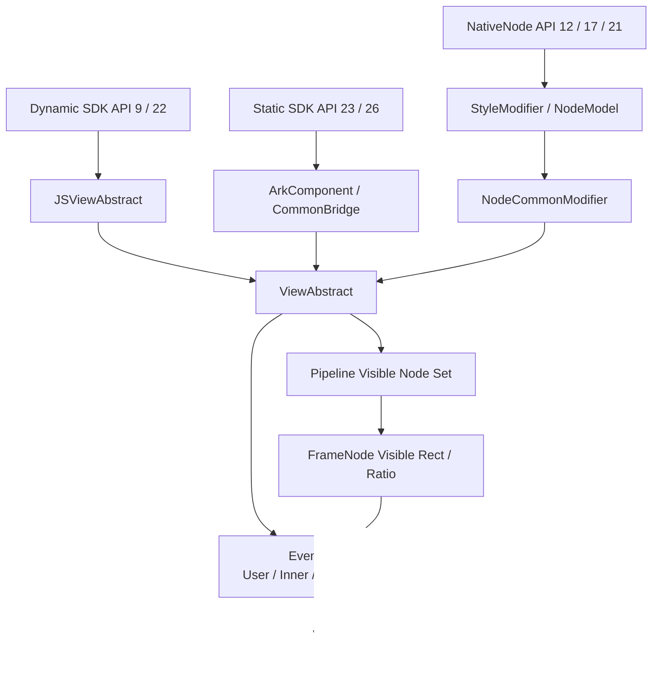
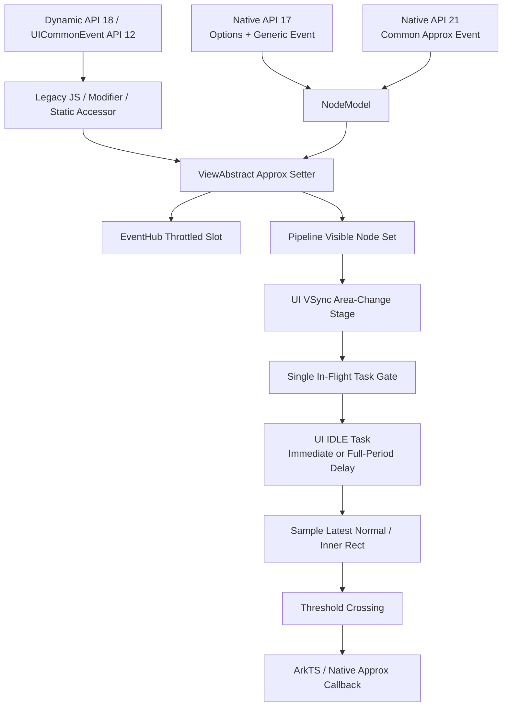
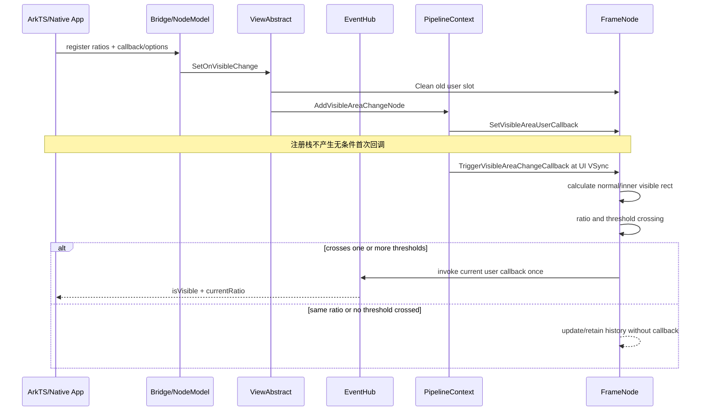
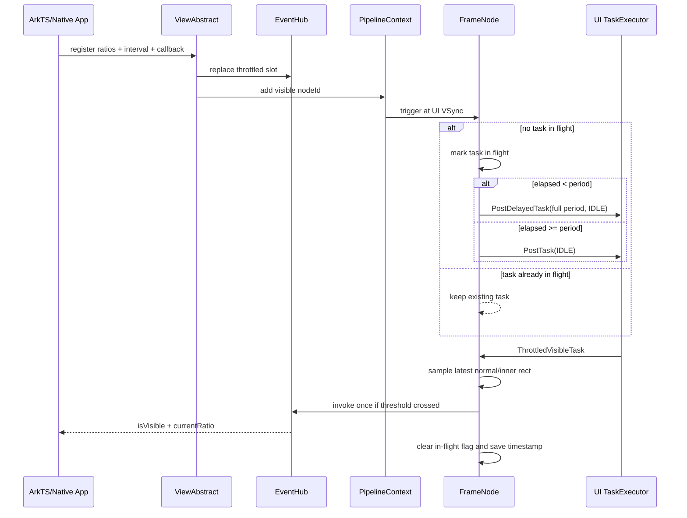
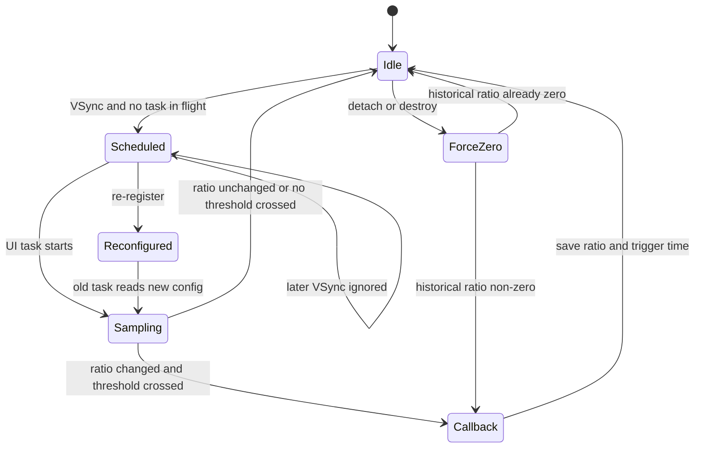
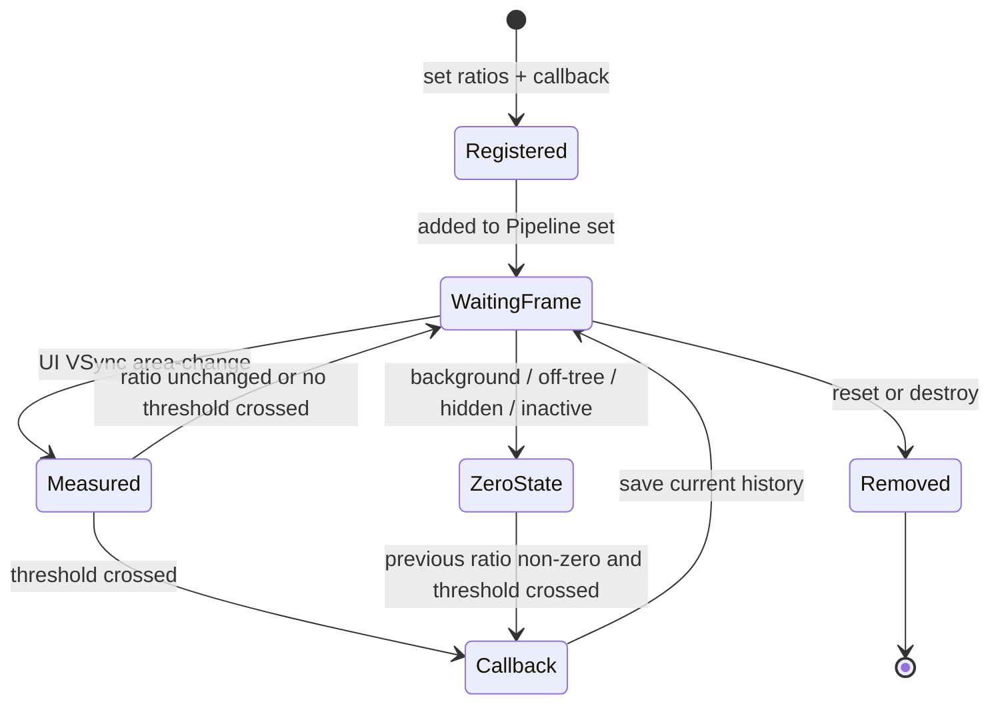
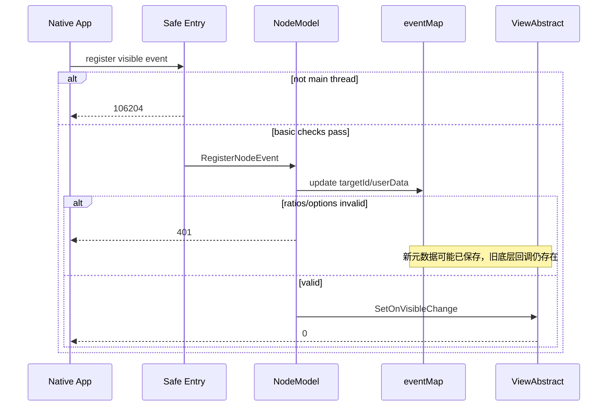

# 架构设计

> 确认目标仓和模块的架构约束、关键设计决策、Spec 拆分方向。

## 设计元数据

| 属性 | 值 |
|------|-----|
| Design ID | DESIGN-Func-04-04-10 |
| 关联需求 | 已有能力补录（无独立 requirement.md） |
| 关联 Epic | 无 |
| 目标 Feature | Feat-01 精确可见区域变化监听，Feat-02 近似可见区域变化监听 |
| 复杂度 | 复杂 |
| 目标版本 | Feat-01：Dynamic API 9/22，Static API 23/26，Native API 12/17/21；Feat-02：UICommonEvent API 12，Dynamic API 18，Native API 17/21 |
| Owner | ArkUI SIG |
| 状态 | Baselined（已有实现补录） |

## 需求基线

> 需求基线详见 proposal.md。以下仅列出设计阶段需要额外强调的要点。

| 项 | 补充说明（如需） |
|----|------------------|
| 实现即规格 | 以当前精确可见区域监听实现为行为基线，不在文档补录中修复偏差 |
| 覆盖通道 | 同时覆盖 ArkTS Dynamic、ArkTS Static、Modifier、Native Node 与 NG 核心链路 |
| 几何口径 | 比例为裁剪后轴对齐矩形面积与组件矩形面积之比，不引入遮挡和透明度模型 |
| 版本边界 | 保留 Dynamic 9/13/22、Static 23/26、Native 12/17/21 的分阶段开放 |
| 风险可见 | SDK、Bridge、Native options 和 reset 路径的偏差必须进入 Spec 兼容性与风险项 |
| 近似监听节流（Feat-02） | 以 UI VSync 驱动的单在途 IDLE 任务实现期望更新间隔；完整保留跨入口归一化、重注册和 Native 注销差异 |

## 上下文和现状

### 涉及仓和模块

| 仓库 | 补充架构说明 |
|------|--------------|
| `interface_sdk-js` | 定义 Dynamic/Static `onVisibleAreaChange` 的 Public API 契约和版本标记；本次仅核查，不修改 |
| `arkui_ace_engine` | 提供 JS/ArkTS Bridge、ViewAbstract、EventHub、FrameNode、Pipeline 和 Native Node 全链路实现 |
| `arkui_ace_engine/specs` | 新增 Feat-01 规格和本共享设计基线，并更新注册元数据 |
| `interface_sdk-js`（Feat-02） | canonical Dynamic SDK 证明 API 18 入口和 API 12 UICommonEvent；目标仓库基线未纳入同版本 Static SDK，版本风险单独登记 |
| `arkui_ace_engine`（Feat-02） | 增量覆盖近似监听 Bridge、Static accessor、节流任务、Native generic/CommonEvent 两条链路 |
| `arkui_ace_engine/specs`（Feat-02） | 新增 Feat-02 规格并增量合并本共享设计 |

### 调用链层级分析

| 层 | 模块 | 职责 | 修改类型 |
|----|------|------|----------|
| Dynamic SDK 层 | `interface/sdk-js/api/@internal/component/ets/common.d.ts:24494-24563` | 声明 API 9 两参、API 13 统一回调类型和 API 22 三参精确监听 | 无代码修改，规格补录 |
| Static SDK 层 | `interface/sdk-js/api/arkui/component/common.static.d.ets:13706-13734` | 声明 API 23 两参和 API 26 三参精确监听 | 无代码修改，规格补录 |
| Dynamic JS Bridge | `frameworks/bridge/declarative_frontend/jsview/js_view_abstract.cpp:12060-12105` | 校验参数、解析 ratios、构造 JS 回调并传递 `measureFromViewport` | 无代码修改，规格补录 |
| Attribute Modifier 层 | `frameworks/bridge/declarative_frontend/ark_component/src/ArkComponent.ts:4032-4042,5874-5887`；`frameworks/bridge/declarative_frontend/engine/jsi/nativeModule/arkts_native_common_bridge.cpp:11835-11884` | 维护 set/reset 语义并桥接到 FrameNode | 无代码修改，偏差登记 |
| View 抽象层 | `frameworks/core/components_ng/base/view_abstract.cpp:11533-11621` | 覆盖用户精确槽、加入/移除 Pipeline 节点集合 | 无代码修改，清理风险登记 |
| 回调存储层 | `frameworks/core/components_ng/event/event_hub.cpp:1205-1257` | 分别保存用户精确、内部精确、近似 ratios 与 callback 配置 | 无代码修改，规格补录 |
| 几何计算层 | `frameworks/core/components_ng/base/frame_node.cpp:7555-7702` | 逐祖先计算普通和 inner 可见矩形与组件矩形 | 无代码修改，规格补录 |
| 阈值判定层 | `frameworks/core/components_ng/base/frame_node.cpp:2668-2833` | 处理生命周期归零、面积比、历史比例、阈值穿越和最终回调 | 无代码修改，规格补录 |
| Pipeline 调度层 | `frameworks/core/pipeline_ng/pipeline_context.cpp:1325-1380,5638-5686,6087-6110` | 在 UI VSync area-change 阶段遍历已注册节点 | 无代码修改，规格补录 |
| Native Public API 层 | `interfaces/native/native_node.h:1904-1932,10214-10345,12931-13107`；`interfaces/native/native_type.h:3693-3807` | 暴露 ratio attribute、事件注册、options 与错误码契约 | 无代码修改，规格补录 |
| Native 映射层 | `interfaces/native/node/style_modifier.cpp:13186-13208`；`interfaces/native/node/node_model.cpp:550-648` | 校验 ratios/options、维护 eventMap 并映射到 CommonModifier | 无代码修改，偏差登记 |
| Native Modifier 层 | `frameworks/core/interfaces/native/node/node_common_modifier.cpp:8517-8534`；`frameworks/core/interfaces/native/node/node_api.cpp:718-729` | 构造 payload、调用 ViewAbstract、执行 reset | 无代码修改，规格补录 |
| 测试层 | `test/unittest/core/base/`；`test/unittest/core/event/`；`test/unittest/interfaces/` | 覆盖核心比例、槽位、options getter/setter；登记 Native 端到端缺口 | 无代码修改，测试风险登记 |
| Dynamic SDK 层（Feat-02） | `interface/sdk-js/api/@internal/component/ets/common.d.ts:24562-24574,29240-29272,29421-29432` | 声明 API 18 近似入口与 API 12 UICommonEvent；options 未声明源码中的 measure 字段 | 无代码修改，SDK 基线风险登记 |
| Dynamic/Modifier Bridge（Feat-02） | `frameworks/bridge/declarative_frontend/jsview/js_view_abstract.cpp:12108-12162`；`frameworks/bridge/declarative_frontend/ark_component/src/ArkComponent.ts:4046-4058,5888-5901` | 解析 options、默认值、set/reset 与前端归一化 | 无代码修改，跨入口差异登记 |
| Static 生成入口（Feat-02） | `frameworks/core/interfaces/native/implementation/common_method_modifier.cpp:7246-7283`；`frameworks/core/interfaces/native/implementation/ui_common_event_accessor.cpp:242-260` | 提供生成 CommonMethod 与 UICommonEvent 的设置/清理路径 | 无代码修改，清理差异登记 |
| 节流调度层（Feat-02） | `frameworks/core/components_ng/base/view_abstract.cpp:11548-11591`；`frameworks/core/components_ng/base/frame_node.cpp:2837-2903` | 归一化 period、维护单在途任务并在执行时采样最终比例 | 无代码修改，规格补录 |
| Native 便捷接口层（Feat-02） | `interfaces/native/native_node.h:14348-14376`；`interfaces/native/node/node_utils.cpp:936-970` | API 21 注册/注销近似 CommonEvent | 无代码修改，回调替换与注销差异登记 |
| Native generic 近似层（Feat-02） | `interfaces/native/node/node_model.cpp:550-647`；`frameworks/core/interfaces/native/node/node_api.cpp:718-750` | API 17 options + generic event 注册、metadata 与公共 reset | 无代码修改，非原子和残留监听风险登记 |

检查结果：

- [x] 调用链从 SDK/Public API 到 Bridge、存储、几何计算、VSync 调度和 Native 派发均已覆盖
- [x] 各层职责边界清晰，无反向依赖
- [x] 所有层均明确为存量实现规格补录，不修改产品代码

### 适用架构规则

| Rule ID | 适用原因 | 设计结论 | 验证方式 |
|---------|----------|----------|----------|
| OH-ARCH-LAYERING | 涉及 SDK、Bridge、ViewAbstract、EventHub、FrameNode、Pipeline 多层调用 | 保持 Public API → Bridge/Native Mapper → ViewAbstract → EventHub/FrameNode → Pipeline 的单向依赖 | 架构评审/依赖检查 |
| OH-ARCH-SUBSYSTEM | 涉及 `interface_sdk-js` 与 `arkui_ace_engine` | SDK 定义外部契约，ace_engine 实现；不一致必须在 Spec 中显式登记 | SDK/API 审查 |
| OH-ARCH-IPC-SAF | 不涉及跨进程或 SA | N/A，不引入 IPC/SAF | 设计评审 |
| OH-ARCH-API-LEVEL | 涉及 API 9/12/13/17/18/21/22/23/26 | 保留版本矩阵，不将高版本能力外推到低版本；Feat-02 Static/measure 版本不从源码反推 | API 评审/XTS |
| OH-ARCH-COMPONENT-BUILD | 不修改构建目标或部件依赖 | BUILD.gn 和 bundle.json 均无变化 | 构建差异检查 |
| OH-ARCH-ERROR-LOG | Native API 暴露错误码，核心路径记录触发原因 | 记录公开错误码、线程错误和实现 trace，不新增错误码 | C API 单测/hilog |

## 不涉及项承接

| 维度 | 设计结论 |
|------|----------|
| 新增/变更 API | 不新增或修改接口，仅补录存量 API 行为 |
| 近似可见区域监听 | Feat-01 不纳入；Feat-02 已覆盖 thresholds、interval、measure、ArkTS/Native 全链路 |
| 遮挡与透明度 | 不建立 occlusion 或 alpha 感知模型，沿用几何裁剪面积比 |
| ABI/持久化 | 不修改结构体 ABI、配置文件或存储格式 |
| 构建与依赖 | 不修改 BUILD.gn、bundle.json 或跨子系统依赖 |
| 安全与权限 | 不新增权限、敏感数据、IPC 或系统服务调用 |
| 多设备 | 通用 FrameNode/Pipeline 行为，手机、平板、折叠屏无独立实现分支 |

## 关键设计决策

| 决策 ID | 问题 | 推荐方案 | 探索过的替代方案 | 取舍理由 | 影响 |
|---------|------|----------|------------------|----------|------|
| ADR-1 | 可见比例采用什么口径 | 使用裁剪后的轴对齐 visible rect 面积除以 frame rect 面积 | 1. 计算兄弟遮挡；2. 叠加透明度；3. 使用非轴对齐多边形面积 | 当前实现只读取 RectF 宽高，其他方案会改变既有外部行为和计算成本 | AC-2.1~AC-2.5 |
| ADR-2 | `measureFromViewport` 如何影响裁剪 | false 使用逐祖先约束路径；true 使用 inner 路径，仅显式 clip、窗口边界和根节点继续裁剪 | 1. true 完全不裁剪；2. 两种模式行为相同；3. 只裁剪直接父节点 | 当前实现维护 normal/inner 两套矩形并在派发时按配置选择 | AC-2.3, AC-2.4 |
| ADR-3 | 空数组、多阈值和重复阈值如何派发 | 空数组保存但不回调；非空数组保留输入顺序和重复项，逐项判断后单次调用 callback，携带最终 ratio | 1. 拒绝空数组；2. 排序去重；3. 每跨一个阈值回调一次 | EventHub 保存原数组，FrameNode 只在遍历命中后调用一次 callback，最后命中的方向值保留 | AC-1.3, AC-1.7, AC-3.1~AC-3.3 |
| ADR-4 | 生命周期和调度采用什么模型 | 后台、离树、隐藏/inactive 统一折算 ratio=0；正常计算在 UI VSync area-change 阶段执行 | 1. 每个状态定义独立回调；2. 注册时同步首回调；3. 单独定时器轮询 | 统一归零和 VSync 批处理是现有可观察行为，可避免注册栈重入和独立轮询 | AC-3.4, AC-4.1~AC-4.4 |
| ADR-5 | 三类监听槽和 reset 如何描述 | 将用户精确、内部精确、近似视为独立槽；同时显式记录 `ResetVisibleChange` 无条件移除 Pipeline 节点风险 | 1. 视为同一槽；2. 隐藏 reset 偏差；3. 本次直接调整清理实现 | EventHub 数据模型独立，但 reset 路径与数据模型存在可观察不一致；补录必须保持风险可见 | AC-4.5, AC-4.6 |
| ADR-6 | 前端和 Native 参数差异如何进入规格 | SDK 契约作为外部接口基线，Bridge/Native 偏差写入兼容性与风险表 | 1. 只描述源码；2. 静默统一为 SDK；3. 本次修改实现 | 既满足外部契约权威性，又不掩盖当前实现事实 | AC-1.2, AC-1.5, AC-5.2, AC-5.7 |
| ADR-7 | Native 重注册和失败处理如何定义 | 成功重注册按单槽覆盖；失败注册保留“元数据可能已更新、底层旧回调仍在”的非原子风险 | 1. 假定失败完全回滚；2. 忽略 targetId/userData；3. 本次实现事务化 | eventMap 更新发生在 ratios/options 校验之前，必须按真实顺序描述 | AC-5.5, AC-5.6 |
| ADR-F2-1 | 近似监听的 interval 应理解为固定周期还是期望节流值 | 定义为 VSync 驱动的期望节流值；每节点至多一个 UI IDLE 任务在途 | 1. 独立固定定时器；2. 每次 VSync 都执行；3. 延迟剩余时间 | 当前实现由 VSync 触发，间隔不足时延迟完整 period，实际时点受 UI 队列影响 | Feat-02 AC-2.6, AC-3.1~AC-3.3 |
| ADR-F2-2 | 不同入口的 0、负数和低 interval 是否统一描述 | 保留 Legacy、Modifier、Static、Native options、Native convenience 五类归一化矩阵 | 1. 全部按 100 ms；2. 全部按 1000 ms；3. 仅记录核心下限 | 前端 truthiness、负数回退和 Native setter 产生可观察差异 | Feat-02 AC-2.1~AC-2.5 |
| ADR-F2-3 | 重注册时历史比例和在途任务如何处理 | 替换近似配置但保留历史采样、上次触发时间和在途任务；旧任务执行时读取新配置 | 1. 重置全部状态；2. 取消旧任务；3. 新旧任务并行 | 当前 setter 只替换 EventHub 槽，不重置 FrameNode 节流字段 | Feat-02 AC-4.1, AC-4.2 |
| ADR-F2-4 | 生命周期归零是否仍受 period 限制 | 正常采样受节流，`forceDisappear` 在历史比例非 0 时绕过 period 立即判断 ratio 0 | 1. 所有归零都等待 period；2. 销毁不回调；3. 无条件补发 ratio 0 | detach/销毁路径显式先处理 throttled forceDisappear，且依赖已有历史采样 | Feat-02 AC-4.4~AC-4.7 |
| ADR-F2-5 | Native generic 与 API 21 convenience 是否视为等价入口 | 分开描述能力、ID 语义、回调替换和注销；generic 可配置 measure，convenience 固定 false | 1. 统一成单一 Native 契约；2. 只记录便捷接口；3. 隐藏注销差异 | 两条链路的数据存储、派发和 reset 实现不同 | Feat-02 AC-5.1~AC-5.10 |
| ADR-F2-6 | Legacy ratios 双倍数组和 Static 清理差异如何处理 | 按实现事实登记兼容风险，不在规格补录中修复 | 1. 按 SDK 理想行为覆盖；2. 忽略前端差异；3. 本次修改产品代码 | “实现即规格”要求现状可追溯，修复需独立 SDD | Feat-02 AC-1.3~AC-1.8 |

## 设计骨架

### 骨架范围

| 骨架项 | 目标 | 不包含 | 验证方式 |
|--------|------|--------|----------|
| ArkTS 精确监听契约 | 固化 Dynamic/Static 版本、参数、覆盖和清理行为 | 不修改 SDK 声明 | SDK/Bridge 审查 |
| 可见矩形与比例 | 固化 normal/inner 裁剪路径和面积比公式 | 不覆盖遮挡、透明度或近似采样 | FrameNode Host 单测 |
| 阈值状态机 | 固化上下穿、端点、跨多阈值、去重和历史比例 | 不增加排序/去重 | 参数化单测 |
| 生命周期与 VSync | 固化归零、销毁清理和帧阶段调度 | 不改变 Pipeline 调度 | Pipeline 集成测试 |
| Native 精确事件 | 固化 12/17/21 矩阵、options、payload、错误码和注销 | 不覆盖 Feat-02 Native approximate API | C API 端到端测试 |
| 风险基线 | 固化 reset、Static 清理、options 默认值和失败注册偏差 | 不在文档任务中修复产品代码 | 风险审查 |
| 近似监听入口（Feat-02） | 固化 API 12/18、Static 生成入口和 ArkTS options 行为 | 不推断缺失的 Static/measure `@since` | SDK/Bridge 审查 |
| 近似节流状态（Feat-02） | 固化 100 ms 下限、单在途任务、尾沿采样和重注册继承 | 不承诺固定周期定时 | 可控时钟/VSync 测试 |
| Native 近似事件（Feat-02） | 固化 API 17 generic 与 API 21 convenience 的能力和偏差 | 不覆盖 Area approximate 事件 | Native C API 测试 |

### 骨架 Spec 拆分

| Task ID | 目标 | 受影响文件 | AC |
|---------|------|------------|----|
| TASK-SKELETON-1 | 形成 Feat-01 精确可见区域变化监听规格和设计基线 | `Feat-01-exact-visible-area-change-listening-spec.md`；`design.md` | AC-1.1~AC-5.9 |
| TASK-SKELETON-2 | 增量形成 Feat-02 近似可见区域变化监听规格和共享设计 | `Feat-02-approximate-visible-area-change-listening-spec.md`；`design.md` | Feat-02 AC-1.1~AC-5.10 |

## 后续 Task 拆分

| Task ID | 目标 | 受影响文件 | 依赖 |
|---------|------|------------|------|
| TASK-04-04-10-F1 | 基于现有实现补录精确可见区域变化监听规格 | `Feat-01-exact-visible-area-change-listening-spec.md`；`design.md` | 已确认范围、全版本覆盖、源码证据和全部关键发现 |
| TASK-04-04-10-F2 | 基于现有实现补录近似可见区域变化监听规格 | `Feat-02-approximate-visible-area-change-listening-spec.md`；`design.md` 增量章节 | 已确认全能力/全入口/全版本范围，采用推荐增量策略和全部关键发现 |

## API 签名、Kit 与权限

### 新增 API

> 本次无新增 API。下表记录本设计覆盖的存量接口。

| API 签名 | 类型 | Kit | d.ts 位置 | 权限要求 | SysCap |
|----------|------|-----|------------|----------|--------|
| Dynamic `onVisibleAreaChange(ratios: Array<number>, event: VisibleAreaChangeCallback): T` | Public | ArkUI | `interface/sdk-js/api/@internal/component/ets/common.d.ts:24494-24526` | 无 | `SystemCapability.ArkUI.ArkUI.Full` |
| Dynamic `onVisibleAreaChange(ratios: Array<number>, event: VisibleAreaChangeCallback, measureFromViewport: boolean): T` | Public | ArkUI | `interface/sdk-js/api/@internal/component/ets/common.d.ts:24528-24563` | 无 | `SystemCapability.ArkUI.ArkUI.Full` |
| Static `onVisibleAreaChange(ratios, event): this` | Public | ArkUI | `interface/sdk-js/api/arkui/component/common.static.d.ets:13706-13719` | 无 | `SystemCapability.ArkUI.ArkUI.Full` |
| Static `onVisibleAreaChange(ratios, event, measureFromViewport): this` | Public | ArkUI | `interface/sdk-js/api/arkui/component/common.static.d.ets:13721-13734` | 无 | `SystemCapability.ArkUI.ArkUI.Full` |
| `ArkUI_NativeNodeAPI_1::registerNodeEvent/unregisterNodeEvent` | Public C API | ArkUI Native | `interfaces/native/native_node.h:13080-13107` | 无；必须主线程调用 | N/A |
| `NODE_VISIBLE_AREA_CHANGE_RATIO` | Public C API | ArkUI Native | `interfaces/native/native_node.h:1904-1932` | 无；必须主线程设置 | N/A |
| `OH_ArkUI_VisibleAreaEventOptions_Create/Dispose/SetRatios/GetRatios` | Public C API | ArkUI Native | `interfaces/native/native_type.h:3693-3732,3774-3797` | 无 | N/A |
| `OH_ArkUI_VisibleAreaEventOptions_Set/GetMeasureFromViewport` | Public C API | ArkUI Native | `interfaces/native/native_type.h:3749-3772,3799-3807` | 无 | N/A |
| Dynamic `onVisibleAreaApproximateChange(options: VisibleAreaEventOptions, event: VisibleAreaChangeCallback | undefined): T` | Public | ArkUI | `interface/sdk-js/api/@internal/component/ets/common.d.ts:24562-24574` | 无 | `SystemCapability.ArkUI.ArkUI.Full` |
| `UICommonEvent.setOnVisibleAreaApproximateChange(options, callback)` | Public/Static Runtime | ArkUI | `interface/sdk-js/api/@internal/component/ets/common.d.ts:29421-29432` | 无 | `SystemCapability.ArkUI.ArkUI.Full` |
| `NODE_VISIBLE_AREA_APPROXIMATE_CHANGE_EVENT` + generic register/unregister | Public C API | ArkUI Native | `interfaces/native/native_node.h:10538-10555,13080-13107` | 无；必须主线程调用 | N/A |
| `OH_ArkUI_NativeModule_RegisterCommonVisibleAreaApproximateChangeEvent(...)` | Public C API | ArkUI Native | `interfaces/native/native_node.h:14348-14366` | 无；必须主线程调用 | N/A |
| `OH_ArkUI_NativeModule_UnregisterCommonVisibleAreaApproximateChangeEvent(...)` | Public C API | ArkUI Native | `interfaces/native/native_node.h:14368-14376` | 无；必须主线程调用 | N/A |

### 变更/废弃 API

| 原有 API | 变更类型 | 新 API | 迁移说明 |
|----------|----------|--------|----------|
| — | — | — | 本次无接口变更或废弃 |

## 构建系统影响

### BUILD.gn 变更

```text
文件路径: N/A
变更说明: Feat-01/Feat-02 仅新增 specs 文档和注册元数据，不修改 ace_engine 构建目标、源文件列表或依赖。
```

### bundle.json 变更

无新增 component，不修改依赖关系。

## 可选设计扩展

### 架构图



#### 近似可见区域监听架构图（Feat-02）



### 数据流/控制流

| 步骤 | 调用方 | 被调用方 | 数据/接口 | 说明 |
|------|--------|----------|-----------|------|
| 1 | ArkTS App | Dynamic/Static Bridge | ratios、callback、可选 measure | 执行参数校验和 set/reset 分支 |
| 2 | Native App | Attribute/Event API | ratio values 或 options、targetId/userData | 按版本校验并保存 eventMap |
| 3 | Bridge/Native Modifier | ViewAbstract | callback、ratioList、measure | 清理旧用户槽并注册新槽 |
| 4 | ViewAbstract | PipelineContext | nodeId | 将节点加入可见区域检测集合 |
| 5 | UI VSync | PipelineContext | nanoTimestamp | area-change 阶段遍历节点集合 |
| 6 | PipelineContext | FrameNode | TriggerVisibleAreaChangeCallback | 先处理失效状态，再计算可见矩形 |
| 7 | FrameNode | FrameNode | normal/inner rect、current/last ratio、thresholds | 计算比例并判断阈值穿越 |
| 8 | FrameNode | EventHub callback | isVisible、currentRatio | 单次派发最终结果 |
| 9 | Native wrapper | ArkUI_NodeEvent | data[0]/data[1]、targetId/userData | 同步发送 Native 组件事件 |
| 10（Feat-02） | ArkTS/Native App | Approx Bridge/NodeModel | options、interval、callback | 按入口执行默认值、归一化和事件 metadata 更新 |
| 11（Feat-02） | ViewAbstract | EventHub/Pipeline | period>0 callback 配置、nodeId | 写入 throttled slot 并加入共享节点集合 |
| 12（Feat-02） | PipelineContext | FrameNode | 每帧 TriggerVisibleAreaChangeCallback | 尝试投递单个近似任务 |
| 13（Feat-02） | UI IDLE Task | FrameNode | 最新 visible rect、历史 ratio、ratios | 任务执行时尾沿采样并单次回调 |
| 14（Feat-02） | forceDisappear | FrameNode/EventHub | ratio=0 | 历史非 0 时绕过 period 执行归零判断 |

### 时序设计



#### 近似监听节流时序（Feat-02）



### 数据模型设计

```cpp
struct VisibleCallbackInfo {
    VisibleRatioCallback callback;
    bool isCurrentVisible;
    uint32_t period;
    bool measureFromViewport;
};

struct VisibleAreaChangeConfig {
    std::vector<double> ratios;
    VisibleCallbackInfo callbackInfo;
};

struct VisibleAreaChangeCallbackSet {
    RefPtr<VisibleAreaChangeConfig> userVisibleAreaChange;
    RefPtr<VisibleAreaChangeConfig> innerVisibleAreaChange;
    RefPtr<VisibleAreaChangeConfig> throttledVisibleAreaChange;
};
```

#### 近似节流状态数据模型（Feat-02）

```cpp
// FrameNode 中近似监听的持久状态。
double lastThrottledVisibleRatio_ = 0.0;
double lastThrottledVisibleCbRatio_ = 0.0;
int64_t lastThrottledTriggerTime_ = 0;
bool throttledCallbackOnTheWay_ = false;

// EventHub throttled slot 中的关键字段。
VisibleAreaChangeConfig {
    std::vector<double> ratios;
    VisibleCallbackInfo {
        VisibleRatioCallback callback;
        uint32_t period;
        bool measureFromViewport;
    };
};
```

| 数据 | 存储位置 | 生命周期 | 更新语义 |
|------|----------|----------|----------|
| 用户精确 ratios/callback/measure | EventHub user slot | 注册到 reset、销毁或覆盖 | 单槽覆盖；重注册不重置 FrameNode 历史比例 |
| 内部精确配置 | EventHub inner slot | 内部注册到内部清理/销毁 | 与用户槽独立 |
| 近似配置 | EventHub throttled slot | Feat-02 注册到清理/销毁 | 与精确槽独立 |
| 最近检测/回调比例 | FrameNode | 节点生命周期 | 用于去重和跨阈值判断 |
| Pipeline 节点集合 | PipelineContext | 首个监听注册到移除/销毁 | 按 nodeId 去重 |
| Native eventMap 元数据 | ArkUI_NodeHandle extraData | 注册到注销/节点清理 | 相同 eventType 更新 targetId/userData |
| Native options | 调用方创建，Native API 读取 | Create 到 Dispose | ratios/interval/measure；当前 Create 未初始化 measure 字段 |
| 近似历史比例（Feat-02） | FrameNode | 节点生命周期 | 重注册不重置；采样/forceDisappear 后更新 |
| 近似任务状态（Feat-02） | FrameNode | 注册到节点销毁 | 同时最多一个任务在途；任务结束清标志并更新时间 |
| API 21 Common callback map（Feat-02） | NodeModel 全局 callback map | 首次注册后持续存在 | `insert` 保留首次 callback；注销不擦除 map 项 |

### 算法与状态机

可见比例公式依据 `frameworks/core/components_ng/base/frame_node.cpp:2742-2779`：

```text
if visibleRect.isEmpty or frameRect.isEmpty:
    currentRatio = 0
else:
    currentRatio = clamp(
        visibleRect.width * visibleRect.height /
        (frameRect.width * frameRect.height),
        0,
        1)
```

#### 近似任务状态机（Feat-02）



阈值派发依据 `frameworks/core/components_ng/base/frame_node.cpp:2783-2833`：

```text
handled = false
for threshold in ratios:
    if current > threshold and lastCallback <= threshold:
        isVisible = true
        handled = true
    else if current < threshold and lastCallback >= threshold:
        isVisible = false
        handled = true
    else if threshold ~= 0 and current ~= 0:
        isVisible = false
        handled = true
    else if threshold ~= 1 and current ~= 1:
        isVisible = true
        handled = true
if handled:
    callback(isVisible, current)
```



### 测试性设计

| 测试层级 | 测试目标 | Mock 策略 | 验证方式 |
|----------|----------|-----------|----------|
| Bridge 单测 | 参数个数、类型、端点归一化、undefined set/reset | Mock JS value 与 native module | 验证旧槽保留或清理 |
| FrameNode 单测 | normal/inner rect、面积比、端点和跨多阈值 | 构造父子 FrameNode 和固定 RectF | 参数化 ratios/current/last |
| Pipeline 单测 | 注册不回调、VSync 阶段回调、nodeId 去重 | Mock PipelineContext 与时间戳 | 验证调用次数和阶段 |
| 生命周期集成测试 | 后台、离树、隐藏、inactive、销毁归零 | 可控 onShow/main-tree/active 状态 | 验证 ratio 0 和去重 |
| EventHub/ViewAbstract 回归 | 三槽独立性和 reset 风险 | 同时安装 user/inner/throttled 槽 | 检查 Pipeline 集合保留性 |
| Native C API 端到端 | options、payload、targetId/userData、重注册和注销 | Native node + receiver | 验证事件对象和错误码 |
| Native 失败注入 | 元数据更新后 ratios/options 校验失败 | 先成功注册，再用非法配置重注册 | 验证非原子状态 |
| 近似时序测试（Feat-02） | 100 ms 下限、完整 period 延迟、单在途任务和尾沿采样 | Mock VSync timestamp、TaskExecutor 与当前时间 | 验证任务数量、delay 和执行时最终 ratio |
| 近似重注册测试（Feat-02） | 历史比例、timestamp 和在途任务继承 | 排队旧任务后替换 callback/ratios | 验证旧任务调用新 callback |
| Native convenience 测试（Feat-02） | callback map、eventId=0、注销清核心 | 两个不同 callback 重复注册 | 验证新配置 + 旧 callback 现状 |
| Native generic 注销测试（Feat-02） | metadata 删除后核心槽是否残留 | 注销后直接检查 EventHub/Pipeline | 固化 reset 表 nullptr 风险 |

### 异常传播时序图



| 异常场景 | 传播结果 | 恢复方式 |
|----------|----------|----------|
| Dynamic 参数非法 | Bridge 静默返回，不覆盖旧监听 | 重新传入有效参数或走 Modifier reset |
| Native ratios/options 非法 | 返回 401；失败前元数据可能已更新 | 显式注销后使用有效配置重新注册 |
| Native 非主线程调用 | 安全入口返回 106204 | 切换到主线程调用 |
| options measure 未初始化 | 契约与实现默认值存在偏差 | 使用前显式调用 SetMeasureFromViewport |
| Reset 移除 Pipeline 节点 | 其他可见区域槽可能失去调度 | 作为风险登记；当前文档不修复 |
| Feat-02 interval 跨入口不一致 | 同一 0/负值可得到 100 或 1000 ms | 按入口兼容矩阵测试，不静默统一 |
| Feat-02 generic 注销 | metadata 删除但核心近似槽可能残留 | 调用侧优先使用 API 21 convenience 注销；实现修复需独立 SDD |

### 资源所有权矩阵

| 资源 | 创建方 | 持有方 | 销毁触发 | 实际释放 | 异常回收 |
|------|--------|--------|----------|----------|----------|
| ArkTS callback 包装 | Bridge | EventHub user slot | reset、覆盖、FrameNode 销毁 | `std::function` 替换/清理 | 弱引用 FrameNode 避免悬挂 |
| Native `InnerEventExtraParam` | NodeModel | node extraData eventMap | unregister 或节点清理 | delete map value | 失败注册后仍需显式 unregister |
| `ArkUI_VisibleAreaEventOptions` | Native 调用方 | 调用方，注册时只读取 | `Dispose` | delete option | 空指针 Dispose 记录错误 |
| Pipeline nodeId | ViewAbstract/Pipeline | PipelineContext set | reset、detach、destroy | set erase | reset 与多槽并存风险需测试 |
| 近似 UI IDLE 任务（Feat-02） | FrameNode | TaskExecutor 队列中的弱引用闭包 | 任务执行或节点销毁 | 执行后清在途标志；节点销毁时弱引用失败退出 | 重注册不取消旧任务 |
| API 21 Common callback（Feat-02） | NodeModel | common callback map | 当前注销不删除 | 进程/全局清理 | 重复注册继续使用首次 callback |

### 接口参数规约

| 接口 | 参数 | 类型 | 合法范围 | 非法处理 | 边界说明 |
|------|------|------|----------|----------|----------|
| Dynamic `onVisibleAreaChange` | ratios | `Array<number>` | 契约为 [0,1] | 非数组静默忽略；端点外值压到 0/1 | 顺序/重复项保留 |
| Dynamic `onVisibleAreaChange` | event | function | 有效函数 | 非函数静默忽略并保留旧槽 | 直调 `undefined` 不等于 reset |
| ArkTS 三参接口 | measure | boolean | true/false | 非布尔按默认 false | Dynamic API 22、Static API 26 |
| `NODE_VISIBLE_AREA_CHANGE_RATIO` 直接路径 | `value[]` | float array | 至少 1 项且每项 [0,1] | 返回 401 | 不钳制 |
| `SetRatios` options 路径 | value/size | float array | 任意 float 输入 | 每项钳制到 [0,1] | 与直接路径不同 |
| Native 注册 | node/eventType | handle/enum | 有效节点与精确事件枚举 | 401/106102/106103/106204 | 必须主线程 |
| ArkTS approximate | expectedUpdateInterval | number | 推荐 >=100 ms | 不同入口对 0/负数归一化不同 | period 是期望值而非固定周期 |
| ArkTS approximate | ratios | number array | SDK 契约 [0,1] | Legacy/Common 钳制；Static UICommonEvent 入口不做同样钳制 | Legacy 额外生成前置 0 阈值 |
| Native options approximate | ratios value/size | float*/int32 | 非空且 size>0 | 越界钳制；size<=0 成功清空；空 value 正 size 有崩溃风险 | generic 注册要求结果非空 |
| Native convenience approximate | interval | float | 任意可转换值 | 截断到 int32，核心最低 100 ms | 无 measure 参数 |

### 线程与并发模型

| 操作 | 发起线程 | 回调线程 | 跨进程边界 | 线程安全 | 重入约束 |
|------|----------|----------|------------|----------|----------|
| ArkTS 注册/reset | UI 线程 | N/A | 无 | 依赖 UI 单线程模型 | 注册栈不同步回调 |
| Pipeline 精确检测 | UI VSync | UI 线程 | 无 | nodeId set 在 Pipeline 上下文使用 | 单节点单槽每轮最多一次用户回调 |
| ArkTS callback | UI 线程 | UI 线程 | 无 | callback 可重入注册/reset | 当前轮已复制 callback 后执行 |
| Native 注册/注销 | 主线程 | N/A | 无 | 公开契约要求主线程 | 失败注册可能留下非原子元数据 |
| Native event receiver | UI/主线程事件派发路径 | 同步 receiver 路径 | 无 | 事件对象仅回调期间有效 | receiver 内修改注册需覆盖测试 |
| 近似任务调度（Feat-02） | UI VSync | UI IDLE 任务 | 无 | `throttledCallbackOnTheWay_` 防止同节点重复任务 | 重注册不取消已排队任务 |
| Native convenience callback（Feat-02） | 主线程注册 | Async CommonEvent 派发路径 | 无 | callback map 未按重注册替换 | eventId 固定 0 |

| 并发/重入场景 | 设计结论 |
|---------------|----------|
| callback 内重注册 | 当前回调使用已复制 `std::function` 完成本次执行，新槽用于后续检测 |
| callback 内 reset | 本次 callback 已进入执行，reset 影响后续 Pipeline 调度 |
| 同一 VSync 跨多个阈值 | 只执行一次最终 callback |
| 多节点同时变化 | Pipeline 按节点集合逐个触发，各节点状态独立 |
| 近似 callback 内重注册（Feat-02） | 当前任务已取得 callback 后完成本次执行；新配置供后续任务使用 |
| 在途任务期间重注册（Feat-02） | 保留原调度时点，执行时读取 EventHub 中的新 ratios/period/measure |

## 详细设计

### ArkTS 注册、归一化与清理

Dynamic JS Bridge 只接受 2~3 个参数、数组 ratios 和函数 callback；非法输入直接返回。每个 ratio 经数值解析后在端点外压到 0 或 1，第三参数仅在布尔类型时生效，依据 `frameworks/bridge/declarative_frontend/jsview/js_view_abstract.cpp:12060-12105`。

Modifier 路径把 ratios/event 任一为 `undefined` 视为 reset，并通过 `CommonBridge::ResetOnVisibleAreaChange` 进入 `ViewAbstract::ResetVisibleChange`，依据 `frameworks/bridge/declarative_frontend/ark_component/src/ArkComponent.ts:4032-4042,5874-5887` 和 `frameworks/bridge/declarative_frontend/engine/jsi/nativeModule/arkts_native_common_bridge.cpp:11835-11884`。

### 可见矩形与 `measureFromViewport`

FrameNode 同时维护 normal 和 inner 可见矩形。normal 路径逐祖先用 parent paint rect 约束；inner 路径仅在显式 clip、窗口边界或根节点条件下约束。用户回调根据 `measureFromViewport` 选择 inner 或 normal 结果，依据 `frameworks/core/components_ng/base/frame_node.cpp:2713-2779,7555-7642`。

最终比例只使用轴对齐 RectF 宽高计算；代码未读取兄弟遮挡关系或透明度，因此这两类视觉因素不单独改变比例，依据 `frameworks/core/components_ng/base/frame_node.cpp:2742-2779`。

### 阈值穿越、端点和历史比例

FrameNode 仅在 currentRatio 与最近检测比例不近似相等时进入阈值处理。空 ratios 能保存配置但遍历不命中，因此不调用用户回调；非空 ratios 按存储顺序逐项判断，上穿写入 true，下穿写入 false，0/1 使用端点分支；遍历后最多调用一次 callback，方向采用最后一个命中项的判定结果，依据 `frameworks/core/components_ng/base/frame_node.cpp:2742-2833`。

新节点的历史比例初始为 0。注册本身不在调用栈同步回调；首次 area-change flush 若 currentRatio 上穿正阈值则产生 true 回调，若仍为 0 则被相同比例去重，依据 `frameworks/core/components_ng/base/frame_node.h:1889-1895` 和 `frameworks/core/components_ng/base/frame_node.cpp:2742-2833`。

EventHub 重注册只覆盖 ratios 和 callback 配置，FrameNode 的 `lastVisibleRatio_` 与 `lastVisibleCallbackRatio_` 不在该路径重置，因此新阈值相对于历史比例继续计算，依据 `frameworks/core/components_ng/event/event_hub.cpp:1205-1219` 和 `frameworks/core/components_ng/base/frame_node.cpp:9103-9108`。

### 生命周期归零与 Pipeline 调度

窗口后台、节点不在主树、自身不可见/不 active 或祖先不可见/不 active 均使 `IsFrameDisappear` 返回 true。仅当最近比例非 0 时才进入归零阈值处理，依据 `frameworks/core/components_ng/base/frame_node.cpp:2605-2710`。

注册只把 nodeId 加入 Pipeline 集合并保存回调；实际检测位于 UI VSync 的 area-change 阶段，依据 `frameworks/core/pipeline_ng/pipeline_context.cpp:1325-1380,5638-5686`。FrameNode 销毁时先强制归零，再清理三个槽和 Pipeline 集合，依据 `frameworks/core/components_ng/base/frame_node.cpp:8619-8643`。

### 槽位独立性与 reset 风险

EventHub 为用户精确、内部精确和近似监听维护独立配置，依据 `frameworks/core/components_ng/event/event_hub.cpp:1205-1257`。`CleanVisibleAreaUserCallback` 会在其他槽仍存在时保留 Pipeline 节点，但 `ViewAbstract::ResetVisibleChange` 随后无条件调用 `RemoveVisibleAreaChangeNode`，依据 `frameworks/core/components_ng/base/frame_node.cpp:8509-8527` 和 `frameworks/core/components_ng/base/view_abstract.cpp:11613-11621`。该不一致仅作为风险记录。

### Native ratio、options 与事件派发

API 12 直接 ratio attribute 要求至少一个 [0,1] 值，越界返回 401；API 17 `SetRatios` 则逐项钳制，依据 `interfaces/native/node/style_modifier.cpp:13186-13208` 和 `interfaces/native/node/native_node_extented.cpp:1252-1263`。

API 21 允许 `NODE_VISIBLE_AREA_CHANGE_RATIO.object` 携带 options。NodeModel 使用 options.ratios 和 `measureFromViewport`，忽略直接 `value[]`，且精确监听不读取 `expectedUpdateInterval`，依据 `interfaces/native/native_node.h:1904-1932` 和 `interfaces/native/node/node_model.cpp:564-587`。

Native wrapper 把方向写入 `data[0].i32`、比例写入 `data[1].f32`，eventMap 中的 targetId/userData 在派发时写入事件对象，依据 `frameworks/core/interfaces/native/node/node_common_modifier.cpp:8517-8534` 和 `interfaces/native/node/node_model.cpp:743-756`。

### Native 重注册、错误与注销

NodeModel 在 ratios/options 校验前更新 eventMap；成功时底层精确槽覆盖，失败时可能形成新元数据与旧底层回调并存。注销先删除 eventMap，再进入 reset handler 清理用户精确槽，依据 `interfaces/native/node/node_model.cpp:550-648`、`frameworks/core/interfaces/native/node/node_api.cpp:718-729` 和 `frameworks/core/components_ng/base/view_abstract.cpp:11613-11621`。

`OH_ArkUI_VisibleAreaEventOptions_Create` 仅初始化 interval，未初始化 `measureFromViewport`，而公开头文件声明默认 false，依据 `interfaces/native/node/native_node_extented.cpp:1229-1238`、`interfaces/native/node/node_extened.h:230-234` 和 `interfaces/native/native_type.h:3799-3807`。

### ArkTS 近似入口与参数归一化

Legacy Dynamic 只接受 options 对象和函数 callback，非法输入或 `undefined` 直接返回并保留旧监听；可用 canonical SDK 的 API 18 声明则允许 event 为 `undefined` 并要求 reset，依据 `frameworks/bridge/declarative_frontend/jsview/js_view_abstract.cpp:12108-12123` 和 `interface/sdk-js/api/@internal/component/ets/common.d.ts:24562-24574`。

Legacy ratios vector 先按输入 size 初始化，再对每项执行 `push_back`，最终产生 N 个前置 0 和 N 个钳制值；Modifier/Common Bridge 只传转换后的数组，依据 `frameworks/bridge/declarative_frontend/jsview/js_view_abstract.cpp:12124-12132` 和 `frameworks/bridge/declarative_frontend/engine/jsi/nativeModule/arkts_native_common_bridge.cpp:11920-11933`。

interval=0 在 Modifier/FrameNode 路径因 JS truthiness 变为 1000 ms，而 Legacy/Static 可进入核心后变为 100 ms；负数在 Legacy 恢复 1000 ms，在 Modifier/核心变为 100 ms，依据 `frameworks/bridge/declarative_frontend/jsview/js_view_abstract.cpp:12133-12140`、`frameworks/bridge/declarative_frontend/ark_component/src/ArkComponent.ts:4051-4057,6299-6301` 和 `frameworks/core/components_ng/base/view_abstract.cpp:11559-11569`。

### 近似节流任务与尾沿采样

ViewAbstract 将所有小于 100 ms 的核心输入提升为 100 ms，并把 `period>0` 的配置写入 EventHub throttled slot，依据 `frameworks/core/components_ng/base/view_abstract.cpp:11548-11591` 和 `frameworks/core/components_ng/event/event_hub.cpp:1205-1219`。

每次 VSync area-change 先调用 `ProcessThrottledVisibleCallback`。若已有任务在途则直接返回；否则根据距上次执行时间决定立即投递或延迟完整 period 的 UI IDLE 任务。任务执行时重新读取最新 normal/inner 可见矩形、当前回调配置和最终比例，依据 `frameworks/core/components_ng/base/frame_node.cpp:2837-2903` 和 `frameworks/core/pipeline_ng/pipeline_context.cpp:1362-1374,5674-5685`。

重注册只替换 EventHub 配置，不重置 `lastThrottledVisibleRatio_`、`lastThrottledVisibleCbRatio_`、`lastThrottledTriggerTime_` 或 `throttledCallbackOnTheWay_`；因此旧任务在原时点读取新配置，依据 `frameworks/core/components_ng/base/frame_node.h:1889-1896` 和 `frameworks/core/components_ng/base/frame_node.cpp:2837-2864,2891-2903`。

### 近似生命周期归零

后台、离主树、自身/祖先隐藏或 inactive 在任务执行时折算为 ratio 0。`forceDisappear` 在历史近似比例非 0 时绕过 period 立即执行归零阈值判断；若任务从未执行且历史仍为 0，则不补发归零回调，依据 `frameworks/core/components_ng/base/frame_node.cpp:2605-2665,2866-2877` 和 `frameworks/core/components_ng/event/event_hub.cpp:51-63`。

销毁随后清理用户精确、内部精确和近似槽及 Pipeline 登记；延迟任务只持有 FrameNode 弱引用，销毁后升级失败即退出，依据 `frameworks/core/components_ng/base/frame_node.cpp:786-805,8615-8625`。

### Native 近似 generic 与 convenience 链路

API 17 generic 链路通过 `ArkUI_VisibleAreaEventOptions` 和 `NODE_VISIBLE_AREA_APPROXIMATE_CHANGE_EVENT` 建立近似监听；API 21 options 才可设置 measure。API 21 convenience 函数没有 measure 参数并使用 false，依据 `interfaces/native/native_type.h:3693-3772`、`interfaces/native/native_node.h:10538-10555,14348-14376` 和 `interfaces/native/node/node_utils.cpp:936-958`。

options setter 对负数 interval 恢复 1000 ms，对 0~99 ms 钳制到 100 ms；convenience 的 float interval 转入 int32 核心后，负数和 0~99 ms 均变为 100 ms，依据 `interfaces/native/node/native_node_extented.cpp:1266-1278`、`frameworks/core/interfaces/native/node/node_common_modifier.cpp:11026-11045` 和 `frameworks/core/components_ng/base/view_abstract.cpp:11559-11569`。

两条链路均派发 direction 和 ratio，但 generic 保留调用方 eventId、实际 nodeId 和 userData，convenience 的 eventId 固定为 0。convenience callback map 使用 `insert`，重复注册或注销后重注册保留首次 callback；generic 公共 reset 表对近似事件为空，注销后可能只删除 metadata 而保留核心监听，依据 `frameworks/core/interfaces/native/node/node_common_modifier.cpp:10189-10207,11026-11045`、`interfaces/native/node/node_model.cpp:734-763,1779-1825` 和 `frameworks/core/interfaces/native/node/node_api.cpp:718-750`。

## 风险和开放问题

| 项 | 类型 | 影响 | 处理方式 | Owner |
|----|------|------|----------|-------|
| 目标仓库基线未纳入同版本的 canonical SDK；Dynamic/Static 行号来自已核查但版本基线未完全匹配的 SDK 证据 | API | 中 | 合入前用 manifest 匹配版本再次核对签名和 `@since`；不据此修改现有实现 | ArkUI API Owner |
| 当前仓 Static inner 声明只有两参，但 Dynamic Modifier/JS Bridge 已支持第三参 | API | 中 | 在兼容性矩阵显式记录，不静默推断所有 Static 版本均支持 | ArkUI Frontend Owner |
| Dynamic/Native 直接 ratios 与 options 的越界归一化策略不同 | API | 中 | 保留分通道规则并增加边界测试 | ArkUI API Owner |
| `ResetVisibleChange` 无条件移除 Pipeline 节点，可能影响内部精确或近似监听 | 架构 | 高 | 登记回归风险；后续实现变更需独立 SDD，不在本次补录修复 | ArkUI Framework Owner |
| Native options Create 未初始化 `measureFromViewport` | API | 高 | 规格记录契约偏差；测试使用前显式 Set；修复需独立变更 | ArkUI Native Owner |
| Native 失败重注册可能形成新元数据与旧回调的非原子状态 | API | 高 | 增加失败注入测试并在调用侧失败后显式注销 | ArkUI Native Owner |
| Native userData 在未预设 attribute 时还可能被解释为 ratios 指针 | API | 中 | 文档标注隐藏双重用途，端到端测试覆盖正常 userData | ArkUI Native Owner |
| 精确 Native C API 缺少 payload、重注册、失败回滚和注销的完整端到端测试；generated modifier 用例被禁用 | 测试 | 中 | 在后续测试任务补齐，不以现有局部单测替代 | ArkUI Test Owner |
| Feat-02 canonical SDK 与目标 ace_engine 非同一基线，Static/measure `@since` 无法确认 | API | 高 | 合入前按 manifest 获取同基线 interface_sdk-js 复核；当前不从源码反推版本 | ArkUI API Owner |
| Legacy Dynamic 近似 ratios 形成 N 个前置 0 和 N 个输入阈值 | API | 高 | 规格显式记录并增加 Legacy 回归测试；修复需独立变更 | ArkUI Frontend Owner |
| interval=0/负数在 ArkTS 与 Native 五类入口得到 100/1000 ms 不同结果 | API | 中 | 保留兼容矩阵和参数化测试，不统一描述 | ArkUI API Owner |
| 重注册继承历史比例、上次触发时间和在途任务 | 架构 | 中 | 增加可控任务测试，调用侧不假设重注册重新计时 | ArkUI Framework Owner |
| API 21 convenience 重复注册和注销后重注册保留首次 callback | API | 高 | 记录新配置 + 旧 callback 现状；修复 callback map 需独立 SDD | ArkUI Native Owner |
| generic 近似注销公共 reset 表为空，核心监听可能残留 | 架构 | 高 | 增加核心槽/Pipeline 断言；调用侧优先使用 convenience 注销 | ArkUI Native Owner |
| Native SetRatios 未完整校验 value/size，空 value 正 size 存在崩溃风险 | API | 高 | 规格登记异常边界；修复需独立安全变更 | ArkUI Native Owner |
| 近似节流、首次回调、跨多阈值、measure 和重注册在途任务缺少有效时序断言，Static accessor 测试被禁用 | 测试 | 中 | 后续测试任务补齐可控时钟/VSync/几何与 C API 端到端覆盖 | ArkUI Test Owner |

## 设计审批

- [x] 需求基线已确认，设计覆盖 P0/P1 AC
- [x] 不涉及项已承接，N/A 和展开项都有结论
- [x] 涉及仓和模块职责清楚
- [x] 调用链层级分析完整，每层覆盖到位
- [x] 适用架构规则已识别并形成设计结论
- [x] 分层和子系统边界合规
- [x] API 变更有签名、权限、错误码和兼容性说明
- [x] BUILD.gn/bundle.json 影响明确
- [x] 设计输出和后续 Task 拆分明确
- [x] 关键设计决策有理由和影响说明
- [x] 风险和开放问题有 Owner

**结论:** 通过（已有实现补录）。
