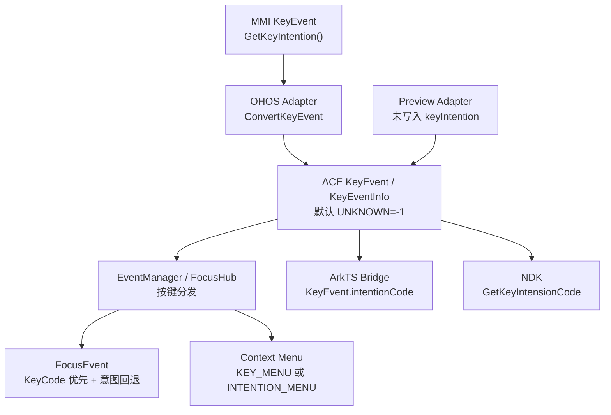
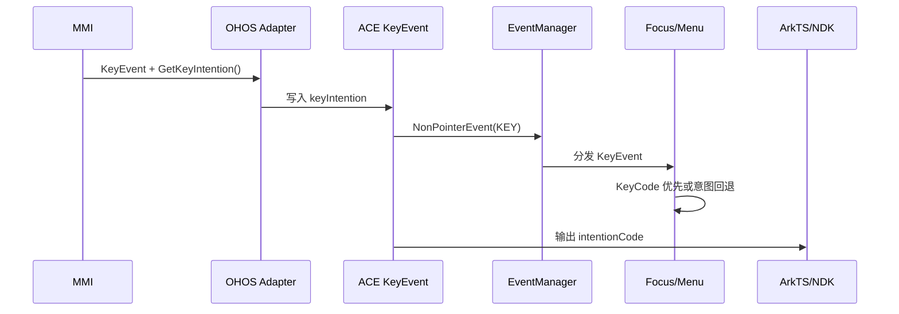
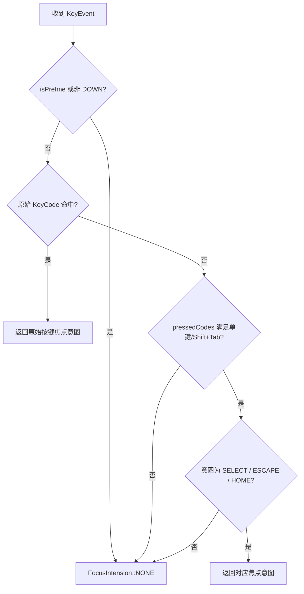
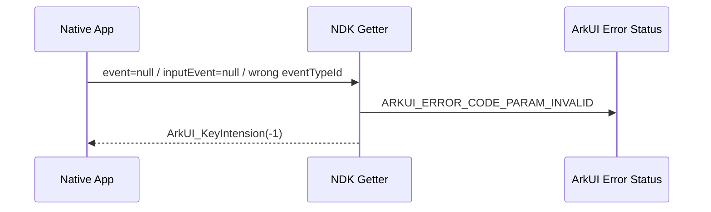

# 架构设计

> 确认目标仓和模块的架构约束、关键设计决策、Spec 拆分方向。

## 设计元数据

| 字段 | 内容 |
|------|------|
| Design ID | DESIGN-Func-04-04-11 |
| 关联需求 | 已有能力补录（无独立 requirement.md） |
| 关联 Epic | 无 |
| 目标 Feature | Feat-01 按键意图归一化（KeyIntention / IntentionCode） |
| 复杂度 | 标准 |
| 目标版本 | ArkTS 动态 API 10 起；NDK API 14 起；ArkTS 静态 API 23 起 |
| Owner | ArkUI SIG |
| 状态 | Baselined（已有实现补录） |

## 需求基线

> 本功能域没有独立 proposal.md。以下基线来自已确认的存量能力补录范围和 Func-04-04-11-Feat-01 规格。

| 项 | 补充说明（如需） |
|----|------------------|
| 全链路覆盖 | 覆盖 MMI 输入接入、KeyEvent 数据模型、ArkTS 动态/静态、NDK、焦点与菜单消费、Preview 差异 |
| 公开枚举契约 | ArkTS 以 interface_sdk-js 的 14 值 IntentionCode 为权威；NDK 使用范围更大的 ArkUI_KeyIntension |
| 行为保持 | 当前实现即规格，不修改物理键映射、焦点优先级或 Preview 行为 |
| 版本兼容 | 分别声明 ArkTS 动态 API 10、NDK API 14、ArkTS 静态 API 23 |
| 风险呈现 | 通道枚举差异与 Preview UNKNOWN 行为必须显式记录，不做静默统一 |

## 上下文和现状

### 涉及仓和模块

| 仓库 | 补充架构说明 |
|------|--------------|
| interface_sdk-js | IntentionCode、KeyEvent.intentionCode 及按键回调入口的公开契约源 |
| arkui_ace_engine / adapter | 将 MMI KeyEvent 转换为 ACE KeyEvent；OHOS 与 Preview 路径存在差异 |
| arkui_ace_engine / frameworks/core/event | KeyIntention 枚举、KeyEvent 和 KeyEventInfo 瞬态数据模型 |
| arkui_ace_engine / frameworks/core/common、components_ng/event | 非指针事件分发、焦点意图解析和组件行为消费 |
| arkui_ace_engine / frameworks/bridge | 将 KeyEventInfo.intentionCode 暴露给 ArkTS 回调 |
| arkui_ace_engine / interfaces/native | ArkUI_KeyIntension 与 NDK getter 的公开声明和参数校验 |

### 调用链层级分析

| 层 | 模块 | 职责 | 修改类型 |
|----|------|------|----------|
| SDK 契约层 | interface_sdk-js/api/@ohos.multimodalInput.intentionCode.d.ts、common.d.ts、common.static.d.ets | 定义 ArkTS 14 值 IntentionCode、KeyEvent.intentionCode 与动态/静态事件入口 | 存量补录，无代码修改 |
| 输入源层 | MMI::KeyEvent | 生成物理按键对应的 GetKeyIntention() 结果 | 外部上游，不修改 |
| 平台适配层 | adapter/ohos/entrance/mmi_event_convertor.cpp | 将 MMI 意图码直接写入 ACE KeyEvent.keyIntention | 存量补录，无代码修改 |
| 预览适配层 | adapter/preview/entrance/event_dispatcher.cpp | 转换 Preview 按键字段；当前未写入 keyIntention | 存量差异记录，无代码修改 |
| 事件模型层 | frameworks/core/event/key_event.h、event_constants.h | 定义 KeyIntention、默认 UNKNOWN、KeyEventInfo 复制语义 | 存量补录，无代码修改 |
| 分发层 | frameworks/core/common/event_manager.cpp | 将 KEY 类型 NonPointerEvent 交给按键事件处理链 | 存量补录，无代码修改 |
| 框架消费层 | components_ng/event/focus_event_handler.cpp、base/view_abstract_model_ng.cpp | 解析焦点意图和上下文菜单触发条件 | 存量补录，无代码修改 |
| ArkTS 桥接层 | arkts_native_frame_node_bridge.cpp、node_common_modifier.cpp | 将 GetKeyIntention() 写入 ArkTS/节点事件对象的 intentionCode | 存量补录，无代码修改 |
| NDK 层 | interfaces/native/native_key_event.h、event/key_event_impl.cpp | 声明 ArkUI_KeyIntension，校验并返回 NDK 事件意图码 | 存量补录，无代码修改 |

调用链证据：OHOS 适配写入见 adapter/ohos/entrance/mmi_event_convertor.cpp:867-875；事件默认值与复制见 frameworks/core/event/key_event.h:153-162,190-204；非指针事件分发见 frameworks/core/common/event_manager.cpp:3111-3123；ArkTS 输出见 frameworks/bridge/declarative_frontend/engine/jsi/nativeModule/arkts_native_frame_node_bridge.cpp:1465-1483；NDK 输出见 interfaces/native/event/key_event_impl.cpp:145-167。

### 适用架构规则

| Rule ID | 适用原因 | 设计结论 | 验证方式 |
|---------|----------|----------|----------|
| OH-ARCH-LAYERING | 涉及输入适配、事件模型、分发、消费和 API 暴露 | 保持 MMI→Adapter→KeyEvent→EventManager/FocusHub→Bridge/NDK 的单向数据流 | 架构评审/依赖检查 |
| OH-ARCH-SUBSYSTEM | ArkUI 依赖 MMI 产生意图码 | ACE 只消费 MMI 公开事件，不反向调用或维护生产映射 | 代码评审 |
| OH-ARCH-API-LEVEL | 动态、NDK、静态接口版本不同 | 以 canonical SDK 和 native_key_event.h 的 @since 为准 | API 评审/XTS |
| OH-ARCH-COMPONENT-BUILD | 本次不新增源码或目标 | BUILD.gn、bundle.json 均无变化 | 生成与构建检查 |
| OH-ARCH-ERROR-LOG | NDK getter 接收外部指针 | 空指针和错误 eventTypeId 返回 -1 并记录参数错误 | NDK 单测 |

## 不涉及项承接

| 维度 | 设计结论 |
|------|----------|
| 新增功能实现 | 不涉及；当前实现即规格，不修改产品源码 |
| 安全与权限 | 不新增权限；NDK 仅读取事件内标量值，并执行空指针与类型校验 |
| IPC/跨进程 | ACE 内部路径不新增 IPC；MMI 事件到达后的处理为现有同步数据传递 |
| 数据持久化 | 不涉及；KeyIntention 仅存在于瞬态 KeyEvent/KeyEventInfo |
| 构建与部件 | 不涉及；不修改 BUILD.gn、bundle.json 或部件依赖 |
| UI 渲染与布局 | 不涉及；意图码影响事件消费，不改变布局、绘制和资源 |
| 物理键映射算法 | 不在 ACE 生产路径定义；由 MMI GetKeyIntention() 提供结果 |

## 关键设计决策

| 决策 ID | 问题 | 推荐方案 | 探索过的替代方案 | 取舍理由 | 影响 |
|---------|------|----------|-----------------|----------|------|
| ADR-1 | ACE 是否重新计算按键意图 | OHOS 路径直接透传 MMI GetKeyIntention() | 方案A：在 ACE 维护完整物理键映射；方案B：仅对部分按键覆盖 MMI 结果 | 当前实现仅做枚举转换，避免两套映射漂移；证据为 mmi_event_convertor.cpp:867-875 | AC-1.1；物理键映射问题需向上游 MMI 定界 |
| ADR-2 | 无意图时的统一表示 | 使用 INTENTION_UNKNOWN=-1 作为 KeyEvent 默认值和降级值 | 方案A：使用 0；方案B：字段可选；方案C：抛出事件错误 | 内部枚举与 ArkTS/NDK 均已有 -1 未知值，默认构造安全；证据为 key_event.h:153-162 | AC-1.2、AC-4.4 |
| ADR-3 | ArkTS 与 NDK 枚举范围如何处理 | 分通道记录真实公开集合，不强制做并集或交集 | 方案A：ArkTS 静默接受全部内部值；方案B：NDK 缩减到 ArkTS 14 值；方案C：文档只写公共交集 | SDK 是 ArkTS 契约权威，而 NDK 头文件已公开扩展值；静默统一会误导调用方 | AC-1.3、AC-2.3 |
| ADR-4 | 焦点解析中原始 KeyCode 与意图码的优先级 | 保持原始 KeyCode 优先，意图码仅回退 SELECT/ESCAPE/HOME | 方案A：意图码始终优先；方案B：只使用原始 KeyCode；方案C：合并后冲突时报错 | 当前行为兼容方向键、Tab、Enter、Space 等历史焦点规则；证据为 focus_event_handler.cpp:28-80 | AC-3.1~AC-3.3 |
| ADR-5 | 菜单按键兼容方式 | action=DOWN 且 KEY_MENU 或 INTENTION_MENU 任一命中即触发 | 方案A：仅 KEY_MENU；方案B：仅 INTENTION_MENU；方案C：所有 action 均触发 | 双入口兼容未归一化与已归一化设备，DOWN 门禁避免抬键重复触发；证据为 view_abstract_model_ng.cpp:1158-1181 | AC-3.4 |
| ADR-6 | Preview 缺失意图码的处理 | 记录为环境差异并沿用默认 UNKNOWN | 方案A：在 Preview 新增映射；方案B：从 KeyCode 推断部分值；方案C：隐藏 intentionCode 字段 | 当前任务是存量规格补录，不能提出行为修复；默认 UNKNOWN 可安全降级 | AC-4.4 |

## 设计骨架

### 骨架范围

| 骨架项 | 目标 | 不包含 | 验证方式 |
|--------|------|--------|----------|
| SDK 契约 | 固化 ArkTS 14 值、字段形态和版本 | 修改 SDK 声明 | canonical SDK 审查 |
| 输入与事件模型 | 固化 MMI 透传和 UNKNOWN 默认值 | 在 ACE 新增映射算法 | 适配层/结构体单测 |
| 事件暴露 | 固化 ArkTS 与 NDK 输出行为 | 新增事件入口 | API/XTS、NDK 单测 |
| 框架消费 | 固化焦点与菜单优先级 | 扩展到所有组件私有按键逻辑 | Focus/Menu 单测 |
| 环境兼容 | 固化 OHOS 与 Preview 差异 | 修改 Preview 实现 | Preview 集成测试 |

### 骨架 Spec 拆分

| Task ID | 目标 | 受影响文件 | AC |
|---------|------|------------|-----|
| TASK-SKELETON-1 | MMI 输入、KeyEvent 默认值与 ArkTS 暴露 | Feat-01-key-intention-normalization-spec.md | AC-1.1~AC-1.4 |
| TASK-SKELETON-2 | NDK getter 与枚举范围 | Feat-01-key-intention-normalization-spec.md | AC-2.1~AC-2.3 |
| TASK-SKELETON-3 | 焦点和上下文菜单消费规则 | Feat-01-key-intention-normalization-spec.md | AC-3.1~AC-3.4 |
| TASK-SKELETON-4 | 版本和 Preview 兼容性 | Feat-01-key-intention-normalization-spec.md | AC-4.1~AC-4.4 |

## 后续 Task 拆分

| Task ID | 目标 | 受影响文件 | 依赖 |
|---------|------|------------|------|
| TASK-1 | Feat-01 按键意图归一化完整行为规格 | Feat-01-key-intention-normalization-spec.md | 本 Design |

## API 签名、Kit 与权限

### 新增 API

> 本次不新增代码；下表记录存量公开签名。

| API 签名 | 类型 | Kit | d.ts 位置 | 权限要求 | SysCap |
|----------|------|-----|------------|----------|--------|
| export enum IntentionCode | Public | InputKit | api/@ohos.multimodalInput.intentionCode.d.ts:21-171 | 无 | SystemCapability.MultimodalInput.Input.Core |
| KeyEvent.intentionCode: IntentionCode | Public | ArkUI | api/@internal/component/ets/common.d.ts:12794-12805；api/arkui/component/common.static.d.ets:6801-6810 | 无 | SystemCapability.ArkUI.ArkUI.Full |
| onKeyEvent(event: Callback<KeyEvent, boolean>): T | Public | ArkUI | api/@internal/component/ets/common.d.ts:21157-21181 | 无 | SystemCapability.ArkUI.ArkUI.Full |
| onKeyPreIme(event: Callback<KeyEvent, boolean>): T | Public | ArkUI | api/@internal/component/ets/common.d.ts:21199-21214 | 无 | SystemCapability.ArkUI.ArkUI.Full |
| onKeyEventDispatch(event: Callback<KeyEvent, boolean>): T | Public | ArkUI | api/@internal/component/ets/common.d.ts:21216-21232 | 无 | SystemCapability.ArkUI.ArkUI.Full |
| ArkUI_KeyIntension OH_ArkUI_KeyEvent_GetKeyIntensionCode(const ArkUI_UIInputEvent* event) | Public | ArkUI NDK | interfaces/native/native_key_event.h:530-537 | 无 | N/A |

### 变更/废弃 API

| 原有 API | 变更类型 | 新 API | 迁移说明 |
|----------|----------|--------|----------|
| 无 | 无 | 无 | 本次为存量能力补录 |

## 构建系统影响

### BUILD.gn 变更

无变更。本文档不修改产品源码，现有 adapter、ace_core、bridge 和 native interface 构建目标已覆盖相关实现。

### bundle.json 变更

无变更。不新增部件、不修改依赖关系。

## 可选设计扩展

### 架构图

架构证据：adapter/ohos/entrance/mmi_event_convertor.cpp:867-875；adapter/preview/entrance/event_dispatcher.cpp:110-126；frameworks/core/event/key_event.h:153-162,190-204；frameworks/core/common/event_manager.cpp:3111-3123。

### 数据流/控制流

| 步骤 | 调用方 | 被调用方 | 数据/接口 | 说明 |
|------|--------|----------|-----------|------|
| 1 | MMI | OHOS Adapter | MMI::KeyEvent::GetKeyIntention() | 上游生成归一化结果 |
| 2 | OHOS Adapter | ACE KeyEvent | KeyIntention | static_cast 后直接写入 |
| 3 | EventManager | 按键处理链 | NonPointerEvent / KeyEvent | KEY 事件进入 OnKeyEvent |
| 4 | KeyEvent | KeyEventInfo/NodeEvent | keyIntention/intentionCode | 复制为事件回调字段 |
| 5 | FocusEvent/Menu | 组件行为 | KeyCode + KeyIntention | 按优先级解析焦点或菜单 |
| 6 | NDK getter | Native 应用 | ArkUI_KeyIntension | 校验 event 后返回值 |

### 时序设计

### 数据模型设计

**ArkTS 契约**

interface_sdk-js/api/@ohos.multimodalInput.intentionCode.d.ts:21-171 定义 IntentionCode；api/@internal/component/ets/common.d.ts:12794-12805 定义 KeyEvent.intentionCode。

**框架模型**

frameworks/core/components_ng/event/event_constants.h:163-195 定义内部 KeyIntention；frameworks/core/event/key_event.h:153-162 定义 KeyEvent.keyIntention 默认值；同文件 190-204 将其复制到 KeyEventInfo。

| 数据 | 存储位置 | 生命周期 | 持久化 |
|------|----------|----------|--------|
| KeyIntention | KeyEvent.keyIntention | 单次事件分发 | 否 |
| KeyIntention | KeyEventInfo.keyIntention_ | 单次回调对象 | 否 |
| intentionCode | ArkUIKeyEvent/NodeEvent | 单次 Native 回调 | 否 |

### 算法与状态机

本特性在 ACE 生产路径没有独立归一化状态机。核心决策流程如下：

实现见 frameworks/core/components_ng/event/focus_event_handler.cpp:28-80。

### 测试性设计

| 测试层级 | 测试目标 | Mock 策略 | 验证方式 |
|----------|----------|-----------|----------|
| Adapter 单测 | MMI 意图值写入 KeyEvent | 构造 MMI::KeyEvent | 检查 keyIntention |
| Event model 单测 | 默认 UNKNOWN 与 KeyEventInfo 复制 | 构造 KeyEvent | 比较枚举值 |
| Focus 单测 | KeyCode 优先和 SELECT/ESCAPE/HOME 回退 | 构造 KeyEvent | FocusIntension 断言 |
| Menu 单测 | KEY_MENU/INTENTION_MENU + DOWN 门禁 | 构造 FocusHub 事件 | 菜单回调断言 |
| NDK Level0 | 有效值与非法输入 | 构造 ArkUI_UIInputEvent | 返回值和错误状态 |
| Preview 集成 | 未写入意图时的 UNKNOWN 降级 | Preview KeyEvent | ArkTS 回调字段断言 |

已有 NDK 证据：test/unittest/interfaces/ace_key_event/oh_arkui_keyevent_getkeyintensioncode_test.cpp:24-79；焦点证据：test/unittest/core/event/focus_event_handler_test_ng.cpp:180-194；菜单证据：test/unittest/core/base/view_abstract_model_test_ng.cpp:1023-1033。

### 异常传播时序图

| 异常场景 | 处理 | 恢复 |
|----------|------|------|
| event 为空 | 返回 -1 并记录参数错误 | 调用方停止读取该事件 |
| inputEvent 为空 | 返回 -1 并记录参数错误 | 调用方停止读取该事件 |
| eventTypeId 非按键事件 | 返回 -1 并记录参数错误 | 调用方改用匹配事件类型的 getter |
| Preview 无意图字段 | 保留 UNKNOWN | 应用按未知意图降级 |

实现见 interfaces/native/event/key_event_impl.cpp:145-167。

### 资源所有权矩阵

| 资源 | 创建方 | 持有方 | 销毁触发 | 实际释放 | 异常回收 |
|------|--------|--------|----------|----------|----------|
| MMI::KeyEvent shared_ptr | MMI/Adapter | KeyEvent.rawKeyEvent | 事件分发结束且引用归零 | shared_ptr | 自动引用计数 |
| KeyEvent | 输入分发路径 | 栈/事件队列 | 单次事件处理结束 | 自动对象 | 默认析构 |
| KeyEventInfo | 回调包装层 | 回调执行上下文 | 回调对象释放 | 框架事件对象 | 空指针检查 |

本特性不新增资源所有权关系。

### 接口参数规约

| 接口 | 参数 | 类型 | 合法范围 | 非法处理 | 边界说明 |
|------|------|------|----------|----------|----------|
| KeyEvent.intentionCode | 事件字段 | IntentionCode | ArkTS 14 个公开值 | 无值时 UNKNOWN=-1 | dynamic API 10+，static API 23+ |
| OH_ArkUI_KeyEvent_GetKeyIntensionCode | event | const ArkUI_UIInputEvent* | C_KEY_EVENT_ID 且 inputEvent 非空 | 返回 -1 + PARAM_INVALID | NDK API 14+ |

### 线程与并发模型

| 操作 | 发起线程 | 回调线程 | 跨进程边界 | 线程安全 | 重入约束 |
|------|----------|----------|------------|----------|----------|
| 平台 KeyEvent 转换 | 现有输入事件线程 | N/A | MMI 边界已在上游完成 | 事件对象单次写入 | 不新增重入 |
| EventManager 分发 | UI 事件处理线程 | UI 事件处理线程 | 无新增 | KeyEvent 按值/只读传递 | 回调消费规则沿用现状 |
| NDK getter | 调用线程 | 同步返回 | 无 | 只读 event 内容 | 调用期间 event 必须有效 |

本次不引入异步任务、锁、共享缓存或新的并发状态。

## 详细设计

### MMI 输入接入与默认值

OHOS ConvertKeyEvent 对非空 MMI::KeyEvent 调用 GetKeyIntention()，static_cast 为 KeyIntention 后直接写入 event.keyIntention，见 adapter/ohos/entrance/mmi_event_convertor.cpp:867-875。KeyEvent 构造时 keyIntention 默认初始化为 INTENTION_UNKNOWN，见 frameworks/core/event/key_event.h:153-162。因此生产路径以 MMI 为语义权威，缺失写入的路径安全降级为 -1。

### ArkTS 动态与静态契约

IntentionCode 模块声明其用途是把原始键盘事件映射为归一化交互意图，动态 API 10 起、静态 API 23 起，见 interface_sdk-js/api/@ohos.multimodalInput.intentionCode.d.ts:21-31。公开枚举包含 14 值，见同文件 31-171。动态 KeyEvent.intentionCode 是非可选字段且默认 UNKNOWN，见 api/@internal/component/ets/common.d.ts:12794-12805；静态字段见 api/arkui/component/common.static.d.ets:6801-6810。

动态 onKeyEvent、onKeyPreIme、onKeyEventDispatch 分别见 api/@internal/component/ets/common.d.ts:21157-21232；静态三个入口统一自 API 23 提供，见 api/arkui/component/common.static.d.ets:12166-12205。桥接层从 KeyEventInfo.GetKeyIntention() 构造 intentionCode 属性，见 frameworks/bridge/declarative_frontend/engine/jsi/nativeModule/arkts_native_frame_node_bridge.cpp:1465-1483。

### NDK 意图码读取

ArkUI_KeyIntension 与 getter 自 API 14 公开，见 interfaces/native/native_key_event.h:425-537。实现先检查 event、eventTypeId 和 inputEvent；有效事件返回 intentionCode，非法事件返回 -1 并设置参数错误，见 interfaces/native/event/key_event_impl.cpp:145-167。NDK Level0 测试覆盖空 event、空 inputEvent、有效扩展值和错误事件类型，见 test/unittest/interfaces/ace_key_event/oh_arkui_keyevent_getkeyintensioncode_test.cpp:24-79。

### 焦点意图解析

FocusEvent::GetFocusIntension 首先拒绝 PreIME 和非 DOWN 事件；随后按原始方向键、Tab、Home、End、Enter、Space 等规则解析；只有原始规则未命中时才调用 GetFocusIntensionFromKey，且仅识别 SELECT、ESCAPE、HOME，见 frameworks/core/components_ng/event/focus_event_handler.cpp:28-80。该顺序保证存量焦点键行为不被归一化意图覆盖。

### 上下文菜单消费

RegisterContextMenuKeyEvent 仅处理 DOWN；原始 KEY_MENU 或 INTENTION_MENU 任一命中即打开已绑定菜单，见 frameworks/core/components_ng/base/view_abstract_model_ng.cpp:1158-1181。该设计同时兼容能产生物理 Menu KeyCode 的设备和只提供归一化 Menu 意图的设备。

### Preview 兼容路径

Preview ConvertKeyEvent 复制 code、key、action、pressedCodes、时间戳、metaKey、deviceId、sourceType 和锁键状态，但没有写入 keyIntention，见 adapter/preview/entrance/event_dispatcher.cpp:110-126。由于 KeyEvent 默认值为 UNKNOWN，Preview 当前对意图码统一表现为 -1。本设计仅记录这一存量差异，不改变实现。

## 风险和开放问题

| 项 | 类型 | 影响 | 处理方式 | Owner |
|----|------|------|----------|-------|
| ArkTS 14 值与 NDK 扩展枚举范围不同 | API | 中 | 在 spec/API 表中分别列出真实公开范围，禁止静默合并 | ArkUI SIG |
| 内部 KeyIntention 比 ArkTS 和 NDK 均包含更多值 | API | 中 | 内部值仅作为实现模型记录，不推导为未声明的公开 API | ArkUI SIG |
| Preview 未写入 keyIntention | 测试 | 中 | 记录为环境兼容差异，Preview 用例断言 UNKNOWN | ArkUI SIG |
| 物理键到意图的映射由 MMI 提供 | 架构 | 中 | ACE 侧仅验证透传；映射正确性由 MMI 契约和测试负责 | MMI / ArkUI SIG |
| Public C API 保留 KeyIntension 的历史拼写 | API | 低 | 文档和代码严格使用既有符号，不做重命名 | ArkUI SIG |

## 设计审批

- [x] 需求基线已确认，设计覆盖 P0/P1 AC
- [x] 不涉及项已承接，N/A 和展开项都有结论
- [x] 涉及仓和模块职责清楚
- [x] 调用链层级分析完整，每层覆盖到位
- [x] 适用架构规则已识别并形成设计结论
- [x] 分层和子系统边界合规
- [x] API 变更有签名、权限、错误码和兼容性说明
- [x] BUILD.gn/bundle.json 影响明确
- [x] 设计输出和后续 Task 拆分明确
- [x] 关键设计决策有理由和影响说明
- [x] 风险和开放问题有 Owner

**结论:** 通过（已有实现补录）。
