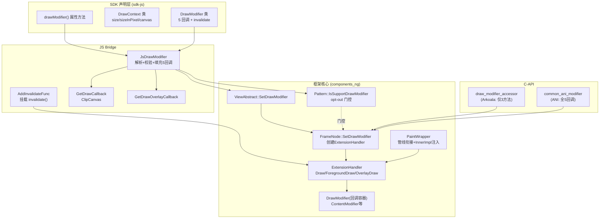
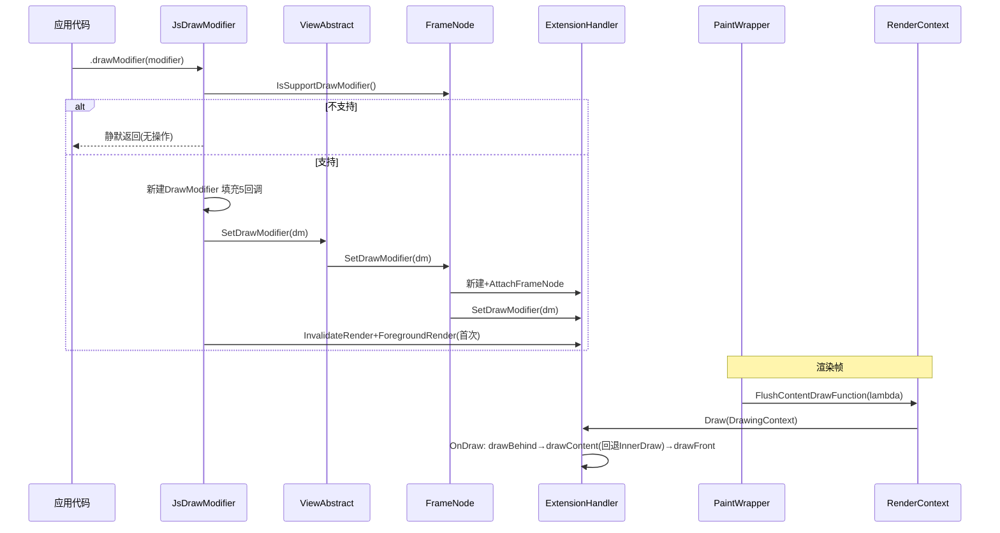

# 架构设计

> 动态绘制属性（DrawModifier）功能域的架构设计文档，补录已有实现。DrawModifier 通过 5 个绘制回调（drawBehind/drawContent/drawFront/drawForeground/drawOverlay）为任意 FrameNode 提供自定义绘制能力，经 ExtensionHandler 中转分发并与原生绘制互为回退。

## 设计元数据

| 字段 | 内容 |
|------|------|
| Design ID | DESIGN-Func-04-05-01 |
| 关联需求 | 已有能力补录（无独立 requirement.md） |
| 关联 Epic | 无 |
| 目标 Feature | Feat-01 DrawModifier 装配与组件门控, Feat-02 分层绘制回调分发, Feat-03 主动刷新机制 |
| 复杂度 | 复杂 |
| 目标版本 | 动态 API 11 起（DrawContext）、12 起（DrawModifier 类），API 20/23 有行为扩展，静态 API 23 起、26.0.0 补齐 drawForeground |
| Owner | ArkUI SIG |
| 状态 | Baselined（已有实现补录） |

## 需求基线

| 项 | 内容 |
|----|------|
| 问题陈述 | 开发者需要在 ArkUI 组件的各个绘制阶段插入自定义绘制逻辑（背景层、内容层、前景层、覆盖层），并能主动触发重绘，而无需为每个组件定制 Pattern |
| 核心目标 | （Feat-01）提供 `drawModifier(modifier)` 属性方法将 DrawModifier 绑定到组件 FrameNode，通过 ExtensionHandler 挂载，并以 Pattern 门控排除自定义渲染组件；（Feat-02）提供 drawBehind/drawContent/drawFront/drawForeground/drawOverlay 五个回调，按固定顺序分发，drawContent 等替换原生绘制、其余叠加，并提供 DrawContext（size/sizeInPixel/canvas）作为绘制入参；（Feat-03）提供 `invalidate()` 主动刷新接口，经 InvalidateRender/ForegroundRender 置位 needRender_，由帧调度消费触发重绘 |
| P0 AC | （Feat-01）drawModifier 绑定后仅作用于当前组件 FrameNode 不影响子节点；不支持组件被静默拒绝；同一 DrawModifier 实例仅绑定一个组件；（Feat-02）分层按 Behind→Content→Front→Foreground→Overlay 顺序执行；drawContent 覆盖原生内容绘制；（Feat-03）invalidate() 触发下一帧重绘；API 版本差异在 NeedRender 判定中体现 |

## 上下文和现状

### 涉及仓和模块

| 仓库 | 模块/路径 | 当前职责 | 本 Feature 影响 |
|------|-----------|----------|-----------------|
| ace_engine | `frameworks/core/components_ng/base/modifier.h` | DrawModifier 类（5 个回调成员）、DrawingContext 结构体、DrawModifierFunc 类型别名 | 核心数据结构 |
| ace_engine | `frameworks/core/components_ng/base/modifier.cpp` | ContentModifier/OverlayModifier/ForegroundModifier 与 ExtensionHandler 互连 | Feat-02: 共用 ExtensionHandler |
| ace_engine | `frameworks/core/components_ng/base/extension_handler.h/cpp` | ExtensionHandler：持有 DrawModifier，三段式 Draw/ForegroundDraw/OverlayDraw 分发，InvalidateRender 刷新 | 分发与刷新核心 |
| ace_engine | `frameworks/core/components_ng/base/frame_node.h/cpp` | FrameNode::SetDrawModifier 挂载、IsSupportDrawModifier 门控、Measure 路径门控、needRerender 消费 | 挂载与帧调度 |
| ace_engine | `frameworks/core/components_ng/base/view_abstract.h/cpp` | ViewAbstract::SetDrawModifier 框架入口 | API 层 |
| ace_engine | `frameworks/core/components_ng/base/view_abstract_model.h` | ViewAbstractModel 抽象接口 SetDrawModifier | API 层抽象 |
| ace_engine | `frameworks/core/components_ng/base/view_abstract_model_static.h/cpp` | 静态模型实现，转调 FrameNode | API 层 |
| ace_engine | `frameworks/core/components_ng/base/view_abstract_model_ng.h` | NG 模型实现，转调 ViewAbstract | API 层 |
| ace_engine | `frameworks/core/components_ng/render/paint_wrapper.cpp` | PaintWrapper 将 ExtensionHandler 衔接到 RenderContext 绘制管线 | Feat-02: 管线衔接 |
| ace_engine | `frameworks/core/components_ng/pattern/pattern.h` | Pattern::IsSupportDrawModifier 默认门控（opt-out） | Feat-01: 门控 |
| ace_engine | `frameworks/core/components_ng/pattern/{canvas,effect_component,distortion_component,video,video_state_machine,union_effect_container}` | 6 个重写门控为 false 的自定义渲染组件 | Feat-01: opt-out 列表 |
| ace_engine | `frameworks/bridge/declarative_frontend/jsview/js_view_abstract.cpp` | JsDrawModifier 入口、AddInvalidateFunc、GetDrawCallback/GetDrawOverlayCallback | JS Bridge |
| ace_engine | `frameworks/bridge/declarative_frontend/jsview/models/view_abstract_model_impl.h` | 旧（非 NG）模型 SetDrawModifier 空实现 | 旧栈不支持 |
| ace_engine | `frameworks/core/interfaces/native/implementation/draw_modifier_accessor.cpp` | Arkoala 生成式 C-API（仅 drawBehind/drawContent/invalidate） | C-API |
| ace_engine | `frameworks/core/interfaces/native/implementation/draw_modifier_peer_impl.h` | DrawModifierPeer 结构（frameNode + drawModifier） | C-API |
| ace_engine | `frameworks/core/interfaces/native/ani/common_ani_modifier.cpp` | ANI C-API（全部 5 回调 + invalidate） | C-API |
| sdk-js | `api/@internal/component/ets/common.d.ts` | DrawModifier 类声明 + drawModifier() 属性方法（动态） | 类型定义 |
| sdk-js | `api/arkui/component/common.static.d.ets` | DrawModifier 类声明 + drawModifier() 属性方法（静态） | 类型定义 |
| sdk-js | `api/arkui/Graphics.d.ts` | DrawContext 类声明（size/sizeInPixel/canvas） | 类型定义 |

### 调用链层级分析

| 层 | 模块 | 职责 | 修改类型 |
|----|------|------|----------|
| SDK 声明 | `sdk-js/api/@internal/component/ets/common.d.ts` + `arkui/component/common.static.d.ets` | DrawModifier 类（5 回调 + invalidate）、drawModifier() 属性方法、@since 版本标注 | 存量分析 |
| SDK 声明 | `sdk-js/api/arkui/Graphics.d.ts` + `Graphics.static.d.ets` | DrawContext 类（size/sizeInPixel/canvas） | 存量分析 |
| JS Bridge | `declarative_frontend/jsview/js_view_abstract.cpp` | JsDrawModifier 解析 modifier 对象、校验 IsSupportDrawModifier、新建 NG::DrawModifier 填充 5 回调、AddInvalidateFunc 挂载 invalidate()、API 版本分支（<20 静默拒绝非对象、≥20 移除路径） | 存量分析 |
| 模型抽象 | `core/components_ng/base/view_abstract_model.h` | ViewAbstractModel::SetDrawModifier 纯虚接口 | 存量分析 |
| 模型实现 | `view_abstract_model_static.cpp` / `view_abstract_model_ng.h` | 转 ViewAbstract::SetDrawModifier / frameNode->SetDrawModifier | 存量分析 |
| API 层 | `core/components_ng/base/view_abstract.cpp` | ViewAbstract::SetDrawModifier 转调 FrameNode | 存量分析 |
| 挂载载体 | `core/components_ng/base/frame_node.cpp` | SetDrawModifier 创建 ExtensionHandler 并 AttachFrameNode；IsSupportDrawModifier 门控委托 Pattern | 存量分析 |
| 门控层 | `core/components_ng/pattern/pattern.h` | IsSupportDrawModifier 默认 true（opt-out）；6 个组件重写 false | 存量分析 |
| 分发核心 | `core/components_ng/base/extension_handler.cpp` | Draw/ForegroundDraw/OverlayDraw 三段式；OnDraw 按 drawBehind→drawContent→drawFront 顺序；OnForegroundDraw/OnOverlayDraw 单回调；无回调时 InnerDraw 回退 | 存量分析 |
| 管线衔接 | `core/components_ng/render/paint_wrapper.cpp` | extensionHandler 存在时，将 Flush*DrawFunction 回调替换为构造 DrawingContext 调用 ExtensionHandler，原 contentDraw/foregroundDraw/overlayDraw 注入为 InnerImpl | 存量分析 |
| 刷新链 | `extension_handler.cpp` InvalidateRender/OverlayRender/ForegroundRender + `frame_node.cpp` needRerender 消费 | 置位 needRender_，帧调度按 NeedRender()/HasDrawModifier() 强制重画 | 存量分析 |
| C-API (Arkoala) | `core/interfaces/native/implementation/draw_modifier_accessor.cpp` | 仅暴露 drawBehind/drawContent/invalidate，CallbackHelper 包装 Ark 回调，Ark_DrawContext 与 DrawingContext reinterpret_cast 互转 | 存量分析 |
| C-API (ANI) | `core/interfaces/native/ani/common_ani_modifier.cpp` | SetDrawModifier 暴露全部 5 回调函数指针 + invalidate | 存量分析 |

### 适用架构规则

| Rule ID | 适用原因 | 设计结论 | 验证方式 |
|---------|----------|----------|----------|
| OH-ARCH-LAYERING | DrawModifier 经 JS Bridge→Model→ViewAbstract→FrameNode→ExtensionHandler 多层调用 | 调用方向自顶向下单向，ExtensionHandler 不回调上层；分层清晰 | 代码评审/依赖检查 |
| OH-ARCH-API-LEVEL | drawModifier() / DrawModifier / DrawContext 均为 Public API（@stagemodelonly @crossplatform @atomicservice） | 级别 Public，SysCap SystemCapability.ArkUI.ArkUI.Full，无额外权限 | API 评审/XTS |
| OH-ARCH-COMPONENT-BUILD | 无新增 BUILD.gn/bundle.json 依赖，复用现有 modifier/extension_handler/frame_node 模块 | 无构建影响 | 构建验证 |
| OH-ARCH-ERROR-LOG | 不支持组件静默拒绝（JsDrawModifier 直接 return），无错误码抛出 | 门控失败为静默无操作，无日志/错误码 | 单测 |

## 不涉及项承接

| 维度 | 设计结论 |
|------|----------|
| 持久化 | 不涉及。DrawModifier 为运行时内存对象，无持久化 |
| 跨进程/IPC | 不涉及。DrawModifier 全程同进程内调度 |
| 新增系统权限 | 不涉及。无权限要求 |
| 新增 SysCap | 不涉及。归属 SystemCapability.ArkUI.ArkUI.Full |
| 新增依赖 | 不涉及。复用现有 ace_engine 内模块 |

## 关键设计决策

| 决策 ID | 问题 | 推荐方案 | 探索过的替代方案 | 取舍理由 | 影响 |
|---------|------|----------|------------------|----------|------|
| ADR-1 | DrawModifier 如何介入组件绘制而不污染各组件 Pattern | 作为回调容器（modifier.h:90-100，5 个 DrawModifierFunc 成员，无虚函数），经 ExtensionHandler 中转分发，不派生独立 Pattern | (a) 为每组件新增 DrawModifierPattern；(b) 直接在 RenderContext 注入回调 | 方案(a)侵入所有 Pattern；方案(b)绕过分发回退逻辑。回调容器+ExtensionHandler 使任意 FrameNode 无差别获得能力，且 OnDraw 内无回调时回退 InnerDraw 保留原生绘制 | Feat-01/02 |
| ADR-2 | 哪些组件不应支持 DrawModifier | 采用 opt-out 门控：Pattern::IsSupportDrawModifier 默认 true（pattern.h:119-122），仅自定义渲染组件重写为 false | (a) opt-in 白名单；(b) 无门控全部支持 | opt-in 需维护白名单且新组件易遗漏；自定义渲染组件（Canvas/Video/Effect 等）自有渲染管线，挂载 DrawModifier 会破坏其绘制，opt-out 更安全 | Feat-01 |
| ADR-3 | API 版本演进如何反映到刷新语义 | 以 API 20 为分界：NeedRender()（extension_handler.cpp:181-187）≥20 仅看 needRender_，<20 看 drawModifier_||needRender_；needRerender 消费（frame_node.cpp:6524-6531）≥20 额外考虑 HasDrawModifier()&&!skippedMeasure | (a) 统一不看版本；(b) 全量重画无 skippedMeasure 优化 | <20 时挂载即强制每帧重画保证可见性；≥20 引入 skippedMeasure 避免无谓重绘，仅 measure 跳过时且有 DrawModifier 仍重画 | Feat-03 |
| ADR-F2-1 | 分层回调用替换还是叠加原生绘制 | drawContent/drawForeground/drawOverlay 替换对应 Inner（无回调时回退 InnerDraw/InnerForegroundDraw/InnerOverlayDraw）；drawBehind/drawFront 仅叠加（OnDraw 中 drawBehind 先画→drawContent 替换→drawFront 后画，extension_handler.cpp:125-140） | (a) 全部替换；(b) 全部叠加 | drawContent 语义为"内容"应可覆盖原生；drawBehind/drawFront 语义为背景/前景装饰应叠加保留原生；SDK 文档明确 drawContent "default will be replaced if set" | Feat-02 |
| ADR-F2-2 | DrawModifier 与既有 ContentModifier/OverlayModifier/ForegroundModifier 如何共存 | 共用同一 ExtensionHandler：PaintWrapper 以 `!contentModifier`/`!foregroundModifier`/`!overlayModifier` 守卫（paint_wrapper.cpp:192-226），存在对应 Modifier 时不注入原生 draw 为 InnerImpl，但 ExtensionHandler.Draw 仍调用，ContentModifier.onDraw 经 SetInnerDrawImpl 成为回退 | (a) 二者互斥；(b) 独立 ExtensionHandler | Modifier 体系与 DrawModifier 通过 Inner*Impl 互为回退，同一 ExtensionHandler 统一分发，避免双重绘制 | Feat-02 |
| ADR-F3-1 | invalidate() 应触发哪些刷新段 | JS 路径 AddInvalidateFunc 同时调用 InvalidateRender + ForegroundRender（js_view_abstract.cpp:10556-10557），不调 OverlayRender；C-API（Arkoala/ANI）仅调 InvalidateRender | (a) 三段全调；(b) 仅 InvalidateRender | JS 路径覆盖 content+foreground 两段最常用场景；overlay 较少主动刷新。C-API 与 JS 路径行为不一致——标注为风险 R-2 | Feat-03 |

## 设计骨架

### 骨架范围

| 骨架项 | 目标 | 不包含 | 验证方式 |
|--------|------|--------|----------|
| DrawModifier 装配链 | drawModifier()→FrameNode→ExtensionHandler 挂载，Pattern 门控 | 刷新、绘制分发 | 单测 + 集成 |
| 分层绘制分发 | OnDraw/OnForegroundDraw/OnOverlayDraw 顺序与回退 | 装配、刷新 | 单测 |
| 刷新机制 | invalidate()→needRender_→needRerender | 装配、绘制分发 | 单测 |

### 骨架 Spec 拆分

| Task ID | 目标 | 受影响文件 | AC |
|---------|------|-----------|----|
| TASK-SKELETON-1 | DrawModifier 装配与组件门控 | modifier.h, frame_node.cpp, extension_handler.h, pattern.h, js_view_abstract.cpp | Feat-01 AC |
| TASK-SKELETON-2 | 分层绘制回调分发 | extension_handler.cpp, paint_wrapper.cpp, modifier.cpp | Feat-02 AC |
| TASK-SKELETON-3 | 主动刷新机制 | extension_handler.cpp, frame_node.cpp, js_view_abstract.cpp | Feat-03 AC |

## 后续 Task 拆分

| Task ID | 目标 | 受影响文件 | 依赖 |
|---------|------|-----------|------|
| Feat-01 | DrawModifier 装配与组件门控规格补录 | spec + 本设计基线 | 无（基线） |
| Feat-02 | 分层绘制回调分发规格补录 | spec + 本设计增量合并 | Feat-01 |
| Feat-03 | 主动刷新机制规格补录 | spec + 本设计增量合并 | Feat-01 |

## API 签名、Kit 与权限

### 新增 API

> 补录已有 API，非新增。

| API 签名 | 类型 | Kit | d.ts 位置 | 权限要求 | SysCap |
|----------|------|-----|-----------|----------|--------|
| `drawModifier(modifier: DrawModifier \| undefined): T` (动态 @since 12) / `default drawModifier(modifier: DrawModifier \| undefined): this` (静态 @since 23) | Public | ArkUI | `@internal/component/ets/common.d.ts:19562` / `arkui/component/common.static.d.ets:11479` | 无 | SystemCapability.ArkUI.ArkUI.Full |
| `class DrawModifier` (动态 @since 12 / 静态 @since 23) | Public | ArkUI | `@internal/component/ets/common.d.ts:6249` / `arkui/component/common.static.d.ets:2754` | 无 | SystemCapability.ArkUI.ArkUI.Full |
| `drawBehind?(drawContext: DrawContext): void` (动态 @since 12 / 静态 @since 23) | Public | ArkUI | 同 DrawModifier 类 | 无 | 同上 |
| `drawContent?(drawContext: DrawContext): void` (动态 @since 12 / 静态 @since 23) | Public | ArkUI | 同上 | 无 | 同上 |
| `drawFront?(drawContext: DrawContext): void` (动态 @since 12 / 静态 @since 23) | Public | ArkUI | 同上 | 无 | 同上 |
| `drawForeground(drawContext: DrawContext): void` (动态 @since 20 / 静态 @since 26.0.0) | Public | ArkUI | 同上 | 无 | 同上 |
| `drawOverlay(drawContext: DrawContext): void` (动态 @since 23 / 静态 @since 23) | Public | ArkUI | 同上 | 无 | 同上 |
| `invalidate(): void` (动态 @since 12 / 静态 @since 23) | Public | ArkUI | 同上 | 无 | 同上 |
| `class DrawContext` (动态 @since 11 / 静态 @since 23) | Public | ArkUI | `arkui/Graphics.d.ts:81` / `Graphics.static.d.ets:69` | 无 | SystemCapability.ArkUI.ArkUI.Full |
| `get size(): Size` (动态 @since 11 / 静态 @since 23) | Public | ArkUI | `arkui/Graphics.d.ts:93` | 无 | 同上 |
| `get sizeInPixel(): Size` (动态 @since 12 / 静态 @since 23) | Public | ArkUI | `arkui/Graphics.d.ts:105` | 无 | 同上 |
| `get canvas(): drawing.Canvas` (动态 @since 11 / 静态 @since 23) | Public | ArkUI | `arkui/Graphics.d.ts:117` | 无 | 同上 |

### 变更/废弃 API

无变更或废弃。drawForeground 在静态 API 26.0.0 才补齐（动态侧 20 已有），属版本对齐，非废弃。

## 构建系统影响

### BUILD.gn 变更

无变更。DrawModifier 复用现有 `frameworks/core/components_ng/base:base` 模块（modifier.h/extension_handler.h）与 `render:paint_wrapper`，未新增源文件或依赖。

### bundle.json 变更

无变更。

## 可选设计扩展

### 架构图



### 数据流/控制流

| 步骤 | 调用方 | 被调用方 | 数据/接口 | 说明 |
|------|--------|----------|-----------|------|
| 1 装配 | JS `.drawModifier(m)` | JsDrawModifier | modifier 对象 | 校验 IsSupportDrawModifier，新建 NG::DrawModifier 填充 5 回调 |
| 2 装配 | JsDrawModifier | ViewAbstractModel::SetDrawModifier | RefPtr<DrawModifier> | 经模型层转调 |
| 3 装配 | ViewAbstract | FrameNode::SetDrawModifier | drawModifier | 无 ExtensionHandler 则新建并 AttachFrameNode |
| 4 装配 | FrameNode | ExtensionHandler::SetDrawModifier | drawModifier_ 赋值 | 仅赋值，无校验 |
| 5 绘制 | PaintWrapper | ExtensionHandler::Draw | DrawingContext{canvas,w,h} | FlushContentDrawFunction 回调内构造 |
| 6 绘制 | ExtensionHandler | OnDraw→drawBehindFunc/drawContentFunc/drawFrontFunc | DrawingContext | 按 Behind→Content→Front 顺序，Content 无回调回退 InnerDraw |
| 7 刷新 | JS invalidate() | AddInvalidateFunc lambda | — | 取 FrameNode→ExtensionHandler |
| 8 刷新 | AddInvalidateFunc | InvalidateRender+ForegroundRender | — | 置 needRender_=true，无回调则 MarkNeedRenderOnly |
| 9 刷新 | 帧调度 | frame_node needRerender 判定 | NeedRender()/HasDrawModifier() | 强制 MarkDirtyNode(PROPERTY_UPDATE_RENDER) |

### 时序设计



### 数据模型设计

**ArkTS 层类型（SDK 契约）**

```typescript
// common.d.ts / common.static.d.ets
declare class DrawModifier {
  drawBehind?(drawContext: DrawContext): void;
  drawContent?(drawContext: DrawContext): void;
  drawFront?(drawContext: DrawContext): void;
  drawForeground(drawContext: DrawContext): void;
  drawOverlay(drawContext: DrawContext): void;
  invalidate(): void;
}
// Graphics.d.ts / Graphics.static.d.ets
export class DrawContext {
  get size(): Size;
  get sizeInPixel(): Size;
  get canvas(): drawing.Canvas;
}
```

**C++ 框架层结构**

```cpp
// frameworks/core/components_ng/base/modifier.h:82-100
struct DrawingContext { RSCanvas& canvas; float width = 0; float height = 0; };
using DrawModifierFunc = std::function<void(NG::DrawingContext& drawingContext)>;
class DrawModifier : public virtual AceType {
public:
    DrawModifierFunc drawBehindFunc;
    DrawModifierFunc drawContentFunc;
    DrawModifierFunc drawFrontFunc;
    DrawModifierFunc drawForegroundFunc;
    DrawModifierFunc drawOverlayFunc;
};
// extension_handler.h:145-157 (私有成员)
// std::function innerDrawImpl_/innerForegroundDrawImpl_/innerOverlayDrawImpl_
// std::function invalidateRender_/overlayRender_/foreGroundRender_
// bool needRender_ = true;
// RefPtr<NG::DrawModifier> drawModifier_;
// FrameNode* node_;
```

| 数据结构 | 存储位置 | 说明 |
|----------|----------|------|
| DrawModifier（5 回调容器） | ExtensionHandler::drawModifier_ | 框架侧，JS 回调经 DrawModifierFunc 包装 |
| DrawingContext | PaintWrapper 栈上构造 | {canvas,width,height}，绘制时传入 |
| needRender_ | ExtensionHandler 私有 bool | 刷新标志，Draw 时复位 false，InvalidateRender 置 true |
| Inner*Impl | ExtensionHandler 私有 std::function | 原生绘制回退实现，由 PaintWrapper 注入 |

### 接口参数规约

| 接口 | 参数 | 类型 | 合法范围 | 非法处理 | 边界说明 |
|------|------|------|----------|----------|----------|
| drawModifier(modifier) | modifier | DrawModifier \| undefined | DrawModifier 实例或 undefined | API<20 非对象静默返回；API≥20 非对象（含 undefined）执行移除路径 SetDrawModifier(nullptr) | 默认值 undefined |
| DrawModifier 回调 | drawContext | DrawContext | 非 null（框架构造） | N/A | size=组件 px 尺寸，sizeInPixel=px，canvas=drawing.Canvas |
| invalidate() | 无 | — | — | — | 无重载，不可继承覆盖 |

### 线程与并发模型

| 操作 | 发起线程 | 回调线程 | 跨进程边界 | 线程安全 | 重入约束 |
|------|----------|----------|-----------|----------|----------|
| drawModifier() 装配 | UI 主线程 | — | 无 | 单线程 UI，无需锁 | 同组件重复设置覆盖前值 |
| 绘制回调执行 | 渲染线程 | 渲染线程 | 无 | 同 RenderContext 录制上下文 | 不可在回调内同步调用 invalidate 重入 |
| invalidate() | UI 主线程 | — | 无 | 单线程 | 置位即可，幂等 |

## 详细设计

### 装配与组件门控

**装配调用链**（Feat-01 基线）：

1. `JSViewAbstract::JsDrawModifier`（js_view_abstract.cpp:10582）注册为静态方法 `drawModifier`（:10501）。
2. 取 FrameNode，调用 `IsSupportDrawModifier()`（:10589，委托 `frame_node.cpp:967-971` → `pattern_->IsSupportDrawModifier()`）；不支持直接 return（:10590-10592），**静默无操作、无日志**。
3. API 版本分支：
   - `Container::LessThanAPITargetVersion(VERSION_TWENTY) && !info[0]->IsObject()` → return（:10584-10586）：旧版本非对象入参被忽略。
   - `GreatOrEqualAPITargetVersion(VERSION_TWENTY) && !info[0]->IsObject()` → `SetDrawModifier(nullptr)` + 触发 `InvalidateRender()`+`ForegroundRender()`（或无 handler 则 `MarkDirtyNode(PROPERTY_UPDATE_RENDER)`）后 return（:10593-10605）：API≥20 支持"移除"语义。
4. 支持 + 入参为对象：新建 `NG::DrawModifier`（:10607），通过 `getDrawModifierFunc`/`getDrawOverlayModifierFunc` lambda 从 JS 对象读取 `drawBehind`/`drawContent`/`drawFront`/`drawForeground`/`drawOverlay` 五个方法名，非函数则返回 nullptr（:10609-10634），赋值到 5 个 `*Func` 成员。
5. `ViewAbstractModel::GetInstance()->SetDrawModifier(drawModifier)`（:10636）→ `ViewAbstract::SetDrawModifier`（view_abstract.cpp:3933）→ `FrameNode::SetDrawModifier`（frame_node.cpp:958-965）。
6. `FrameNode::SetDrawModifier`：若无 `extensionHandler_` 则 `MakeRefPtr<ExtensionHandler>()` + `AttachFrameNode(this)`，再 `extensionHandler_->SetDrawModifier(drawModifier)`（:960-964）。
7. `AddInvalidateFunc`（:10637，定义于 :10536）：在 JS drawModifier 对象上挂 `invalidate` 函数（持有 FrameNode 弱引用），并立即触发一次刷新（:10566-10573）。

**门控机制**（Feat-01 基线）：

- `Pattern::IsSupportDrawModifier()` 默认返回 `true`（pattern.h:119-122），即**绝大多数组件默认支持 DrawModifier**。
- 6 个自定义渲染组件重写为 `false`（opt-out）：
  | 组件 Pattern | 文件 | 行 |
  |---|---|---|
  | Canvas | `pattern/canvas/canvas_pattern.h` | 64 |
  | EffectComponent | `pattern/effect_component/effect_component_pattern.h` | 43 |
  | DistortionComponent | `pattern/distortion_component/distortion_component_pattern.h` | 66 |
  | Video | `pattern/video/video_pattern.h` | 64 |
  | VideoStateMachine | `pattern/video/video_state_machine_pattern.h` | 74 |
  | UnionEffectContainer | `pattern/union_effect_container/union_effect_container_pattern.h` | 36 |
- 旧（非 NG）模型 `view_abstract_model_impl.h:422` 的 `SetDrawModifier` 为空实现 `{}`，即旧栈不支持 DrawModifier。

**唯一性约束**：SDK 文档声明 "Each DrawModifier instance can be set for only one component. Repeated setting is not allowed."（common.d.ts:6241, common.static.d.ets:2748），且 "A custom modifier applies only to the FrameNode of the currently bound component, not to its subnodes."（common.d.ts:19554）。源码 `ExtensionHandler::SetDrawModifier`（extension_handler.h:106-109）仅赋值 `drawModifier_ = drawModifier`，**未做实例唯一性校验**；FrameNode::SetDrawModifier 每次调用都新建 DrawModifier 覆盖。唯一性为 SDK 契约层约束，源码层不强制——见风险 R-1。

**Measure 路径门控**：`frame_node.cpp:6189` 仅当 `extensionHandler_ && !extensionHandler_->HasDrawModifier()` 时才注入 InnerMeasure（:6192-6198）并走 ExtensionHandler.Measure；有 DrawModifier 时跳过 extension measure 注入，走原生 measure（:6200+）。即 DrawModifier 不接管 measure/layout，只接管 draw。

### 分层绘制回调分发（Feat-02）

**三段式分发入口**（extension_handler.cpp:52-68）：`Draw`/`ForegroundDraw`/`OverlayDraw` 各自复位 `needRender_=false` 后调 `OnDraw`/`OnForegroundDraw`/`OnOverlayDraw`。

**OnDraw 顺序**（extension_handler.cpp:125-140）：
1. `drawModifier_->drawBehindFunc` 存在则调用（:127-129）——背景层，content 之前。
2. `drawModifier_->drawContentFunc` 存在则调用，**否则回退 `InnerDraw`**（:131-135）——内容层，替换原生 content 绘制。
3. `drawModifier_->drawFrontFunc` 存在则调用（:137-139）——前景层，content 之后。

**OnForegroundDraw**（:116-123）：`drawForegroundFunc` 存在则调用，否则回退 `InnerForegroundDraw`。
**OnOverlayDraw**（:142-149）：`drawOverlayFunc` 存在则调用，否则回退 `InnerOverlayDraw`。

**Inner* 回退来源**：PaintWrapper（paint_wrapper.cpp:188-226）在 extensionHandler 存在时，将原生 `contentDraw`/`foregroundDraw`/`overlayDraw`（来自 NodePaintImpl）经 `SetInnerDrawImpl`/`SetInnerForegroundDrawImpl`/`SetInnerOverlayDrawImpl` 注入为 Inner 实现（:194-196, :205-207, :217-219），并把 `Flush*DrawFunction` 的回调替换为构造 `DrawingContext{canvas, width, height}` 后调 `extensionHandler->Draw/ForegroundDraw/OverlayDraw`（:197-201, :209-213, :221-225）。无 extensionHandler 时走原 `Flush*DrawFunction(contentDraw)` 路径（:227-237）。

**与 ContentModifier/OverlayModifier/ForegroundModifier 共存**：PaintWrapper 以 `!contentModifier`/`!foregroundModifier`/`!overlayModifier` 守卫（:192, :203, :215）——存在对应 Modifier 时不注入原生 draw 为 InnerImpl（由 Modifier 自身经 `modifier.cpp:31-37` 的 `SetExtensionHandler` 绑定 onDraw 为 Inner）；但 ExtensionHandler.Draw 仍被调用。即 Modifier 体系与 DrawModifier 通过同一 ExtensionHandler 互为回退（ADR-F2-2）。

**DrawContext 构造**：PaintWrapper 从 `GetGeometryNode()->GetFrameSize()` 取 width/height（:189-191），与 RSCanvas 组成 DrawingContext。JS 侧 `GetDrawCallback`（js_view_abstract.cpp:12935-12988）将 DrawingContext 转为 JS DrawContext 对象：`size` 经 `Px2VpWithCurrentDensity` 转 vp（:12948-12949），`sizeInPixel` 保持 px（:12953-12954），`canvas` 经 `JsCanvas::CreateJsCanvas` 包装并 `ClipCanvas(width, height)`（:12963-12968）。

**drawOverlay 越界能力**：SDK 文档声明 overlay "can draw outside the bounds of the component"（common.d.ts:6307, common.static.d.ets:2802）。但 `GetDrawOverlayCallback`（:12990-13043）与 `GetDrawCallback` 结构一致，**同样调用 `ClipCanvas(width, height)`**（:13023）裁剪画布到 bounds——drawOverlay 实际不能绘制到组件外，与 SDK 文档声明矛盾，定义为风险 R-2（不修改实现）。

### 主动刷新机制（Feat-03）

**invalidate() JS 路径**（AddInvalidateFunc，js_view_abstract.cpp:10536-10580）：
1. lambda 取 FrameNode 弱引用（:10547-10552）。
2. 有 ExtensionHandler 则 `InvalidateRender()` + `ForegroundRender()`（:10555-10557）；无则 `MarkDirtyNode(PROPERTY_UPDATE_RENDER)`（:10559）。
3. AddInvalidateFunc 在挂载时立即触发一次刷新（:10566-10573），即首次 `drawModifier()` 调用即触发重绘。

**InvalidateRender/OverlayRender/ForegroundRender**（extension_handler.cpp:151-179）：有对应 `invalidateRender_`/`overlayRender_`/`foreGroundRender_` 回调则调用，否则 `node_->MarkNeedRenderOnly()`；统一置 `needRender_=true`。

**NeedRender 版本门控**（extension_handler.cpp:181-187）：
- `GreatOrEqualTargetAPIVersion(VERSION_TWENTY)`：返回 `needRender_`。
- 否则：返回 `drawModifier_ || needRender_`（即 <20 挂载 DrawModifier 即视为需重画）。

**needRerender 消费**（frame_node.cpp:6521-6534）：
- `needRerender` 由 `OnDirtyLayoutWrapperSwap` 累积。
- `≥VERSION_TWENTY`：`needRerender = needRerender || (extensionHandler_ && (NeedRender() || (HasDrawModifier() && !skippedMeasure)))`（:6524-6528）——即有 DrawModifier 且未跳过 measure 时强制重画。
- `<VERSION_TWENTY`：`needRerender = needRerender || (extensionHandler_ && NeedRender())`（:6529-6530）。
- 满足则 `MarkDirtyNode(true, true, PROPERTY_UPDATE_RENDER)`（:6532-6533）。

**C-API 刷新路径**：Arkoala `draw_modifier_accessor.cpp` 的 `InvalidateImpl`（:50）与 ANI `common_ani_modifier.cpp:1389-1399` 的 `Invalidate` 均仅调 `InvalidateRender()`（不调 ForegroundRender），与 JS 路径行为不一致——见风险 R-2。

## 风险和开放问题

| 项 | 类型 | 影响 | 处理方式 | Owner |
|----|------|------|----------|-------|
| R-1 DrawModifier 实例唯一性源码未强制 | API | 中 | SDK 契约要求"一个实例仅绑定一个组件、不可重复设置"，但 ExtensionHandler::SetDrawModifier 仅赋值覆盖，未校验。当前补录按 SDK 契约描述行为，标注源码未强制为风险，不修改实现 | ArkUI SIG |
| R-2 drawOverlay 实际不能绘制到组件外（doc 与实现矛盾） | API | 中 | SDK 文档声明 overlay 可越界绘制（common.d.ts:6307），但 GetDrawOverlayCallback 调 ClipCanvas(width,height)（js_view_abstract.cpp:13023）裁剪画布到 bounds，实际不能越界。doc 与实现矛盾，定义为风险（不修改实现） | ArkUI SIG |
| R-3 invalidate() JS 与 C-API 行为不一致 | API | 中 | JS 路径调 InvalidateRender+ForegroundRender，C-API 仅调 InvalidateRender。补录如实记录两路径差异，不强行统一 | ArkUI SIG |
| R-4 drawFront 文档语义动态/静态不一致 | API | 低 | 动态 d.ts 注释 "after drawing associated Node"，静态扩展为 "after associated Node and its children"。补录以静态版（含 children）为准并标注差异 | ArkUI SIG |
| R-5 Arkoala C-API 仅暴露 3 方法 | API | 低 | draw_modifier_accessor 仅导出 drawBehind/drawContent/invalidate，未暴露 drawFront/drawForeground/drawOverlay；ANI 暴露全部 5 个。补录如实记录 | ArkUI SIG |

## 设计审批

- [x] 需求基线已确认，设计覆盖 P0/P1 AC
- [x] 不涉及项已承接，N/A 和展开项都有结论
- [x] 涉及仓和模块职责清楚
- [x] 调用链层级分析完整，每层覆盖到位
- [x] 适用架构规则已识别并形成设计结论
- [x] 分层和子系统边界合规
- [x] API 变更有签名、权限、错误码和兼容性说明
- [x] BUILD.gn/bundle.json 影响明确（无变更）
- [x] 设计输出和后续 Task 拆分明确
- [x] 关键设计决策有理由和影响说明
- [x] 风险和开放问题有 Owner

**结论:** 通过（已有实现补录）
