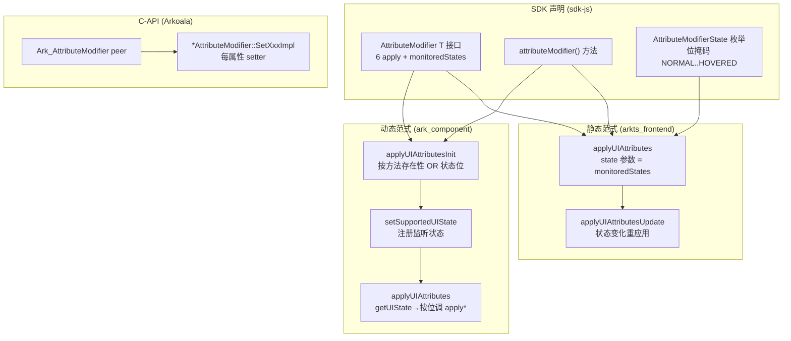
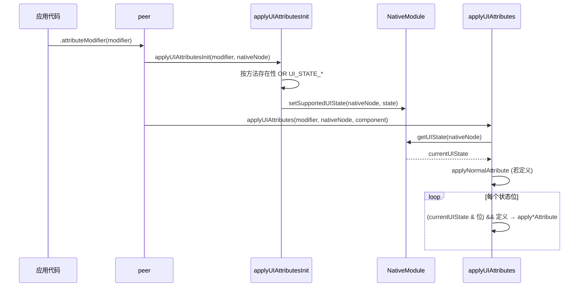

# 架构设计

> 动态属性（AttributeModifier）功能域的架构设计文档，补录已有实现。AttributeModifier 是 ArkUI 的动态属性更新通路：通过 `.attributeModifier(modifier)` 将一个实现 `AttributeModifier<T>` 接口的对象绑定到组件，由框架按组件 UI 状态（Normal/Pressed/Focused/Disabled/Selected/Hovered）位掩码分发到对应 `apply*Attribute` 回调，实现属性的状态驱动动态更新。

## 设计元数据

| 字段 | 内容 |
|------|------|
| Design ID | DESIGN-Func-04-05-02 |
| 关联需求 | 已有能力补录（无独立 requirement.md） |
| 关联 Epic | 无 |
| 目标 Feature | Feat-01 AttributeModifier 装配与状态监听, Feat-02 多状态属性应用与按位分发 |
| 复杂度 | 复杂 |
| 目标版本 | 动态 API 11 起（AttributeModifier 接口），@atomicservice 12；applyHoveredAttribute 动态 @since 26.0.0；静态 API 23 起（含 monitoredStates），applyHoveredAttribute 静态 @since 26.0.0 |
| Owner | ArkUI SIG |
| 状态 | Baselined（已有实现补录） |

## 需求基线

| 项 | 内容 |
|----|------|
| 问题陈述 | 开发者需要在不修改组件源码的前提下，按组件的 UI 状态（按下/聚焦/禁用/选中/悬停）动态应用一组属性，且属性更新可声明式地随状态变化重应用 |
| 核心目标 | （Feat-01）提供 `.attributeModifier(modifier)` 将 AttributeModifier 绑定到组件，注册需监听的 UI 状态位掩码；（Feat-02）提供 6 个 `apply*Attribute` 回调，框架按当前 UI 状态位与回调存在性分发调用，状态变化时重新应用 |
| P0 AC | （Feat-01）attributeModifier 绑定后框架按 modifier 上已定义的 apply* 方法注册对应 UI 状态监听；（Feat-02）applyNormalAttribute 始终调用；其余 5 个按当前状态位条件调用；applyHoveredAttribute 在 API 26.0.0 后可用 |

## 上下文和现状

### 涉及仓和模块

| 仓库 | 模块/路径 | 当前职责 | 本 Feature 影响 |
|------|-----------|----------|-----------------|
| ace_engine | `frameworks/bridge/declarative_frontend/ark_component/src/ArkComponent.ts` | 动态范式 apply 分发：applyUIAttributesInit/applyUIAttributes | Feat-01/02 分发核心 |
| ace_engine | `frameworks/bridge/declarative_frontend/ark_modifier/src/common_modifier.ts` | CommonModifier 命令式基类（属 04-05-06，此处仅引用 applyNormalAttribute 转发） | 边界引用 |
| ace_engine | `frameworks/bridge/arkts_frontend/koala_projects/arkoala-arkts/arkui-preprocessed/arkui/hooks/modifiers/ArkCommonModifier.ets` | 静态范式 apply 分发：applyUIAttributes/applyUIAttributesUpdate | Feat-01/02 静态分发 |
| ace_engine | `frameworks/core/interfaces/native/generated/interface/arkoala_api_generated.h` | C-API：Ark_AttributeModifier peer、Ark_AttributeModifierState 枚举 | C-API 类型 |
| ace_engine | `frameworks/core/interfaces/native/implementation/*_modifier.cpp` | Arkoala 生成式每属性 setter（*AttributeModifier::SetXxxImpl） | C-API 实现 |
| sdk-js | `api/@internal/component/ets/common.d.ts` | AttributeModifier<T> 接口 + attributeModifier() 方法（动态） | 类型定义 |
| sdk-js | `api/arkui/component/common.static.d.ets` | AttributeModifier<T> 静态接口 + monitoredStates | 类型定义 |
| sdk-js | `api/arkui/component/enums.static.d.ets` | AttributeModifierState 枚举（位掩码） | 类型定义 |

### 调用链层级分析

| 层 | 模块 | 职责 | 修改类型 |
|----|------|------|----------|
| SDK 声明 | `sdk-js/api/@internal/component/ets/common.d.ts` | AttributeModifier<T> 接口（6 apply）+ attributeModifier() 方法；@since 11/12 dynamic | 存量分析 |
| SDK 声明(静态) | `common.static.d.ets` + `enums.static.d.ets` | 静态 AttributeModifier<T>（含 monitoredStates）+ AttributeModifierState 枚举；@since 23 static | 存量分析 |
| 动态分发 | `ark_component/src/ArkComponent.ts` | applyUIAttributesInit（按方法存在性 OR 状态位→setSupportedUIState）、applyUIAttributes（getUIState→按位调 apply*） | 存量分析 |
| 动态命令式(边界) | `ark_modifier/src/*_modifier.ts` | 命令式 Modifier 类实现 AttributeModifier<T>（属 04-05-06，applyNormalAttribute 转发 ModifierUtils） | 边界引用 |
| 静态分发 | `arkui-preprocessed/arkui/hooks/modifiers/ArkCommonModifier.ets` | applyUIAttributes/applyUIAttributesUpdate（按 state 位调 apply*），UI_STATE_* 常量 | 存量分析 |
| 静态 Modifier(边界) | `arkui-preprocessed/arkui/*Modifier.ets` | 生成式 Modifier 类 applyModifierPatch0（属 04-05-06） | 边界引用 |
| 原生状态机 | `getUINativeModule().setSupportedUIState/getUIState` | 注册/查询组件 UI 状态位掩码（NativeModule 桥） | 存量分析 |
| C-API 类型 | `arkoala_api_generated.h` | Ark_AttributeModifier/AttributeModifierPeer、Ark_AttributeModifierState 枚举 | 存量分析 |
| C-API 实现 | `implementation/*_modifier.cpp` | GeneratedModifier 命名空间 *AttributeModifier::SetXxxImpl 每属性 setter | 存量分析 |

### 适用架构规则

| Rule ID | 适用原因 | 设计结论 | 验证方式 |
|---------|----------|----------|----------|
| OH-ARCH-LAYERING | 经 SDK→TS 分发→原生模块→C-API 多层 | 调用方向自顶向下；TS 分发层不直接持有 FrameNode，经 NativeModule 桥 | 代码评审 |
| OH-ARCH-API-LEVEL | attributeModifier/AttributeModifier 为 Public API | 级别 Public，SysCap SystemCapability.ArkUI.ArkUI.Full，无额外权限 | API 评审/XTS |
| OH-ARCH-COMPONENT-BUILD | 无新增依赖 | 复用 ark_component/ark_modifier/arkts_frontend 模块 | 构建验证 |

## 不涉及项承接

| 维度 | 设计结论 |
|------|----------|
| 命令式 Modifier 类 | 不涉及。CommonModifier/XxxModifier 命令式类体系属 04-05-06，本域仅覆盖 AttributeModifier 通路（接口+绑定+状态分发） |
| 持久化 | 不涉及。运行时内存对象 |
| 跨进程/IPC | 不涉及 |
| 新增权限/SysCap | 不涉及。归属 SystemCapability.ArkUI.ArkUI.Full |

## 关键设计决策

| 决策 ID | 问题 | 推荐方案 | 探索过的替代方案 | 取舍理由 | 影响 |
|---------|------|----------|------------------|----------|------|
| ADR-1 | 如何让框架知道需监听哪些 UI 状态 | applyUIAttributesInit 按 modifier 上各 apply*Attribute 方法是否 `!== undefined` 来 OR 对应 UI_STATE_* 位，再 setSupportedUIState(nativeNode, state)（ArkComponent.ts:40-56） | (a) 全量监听所有状态；(b) 用户显式声明监听集 | 全量监听浪费；显式声明增负担。按方法存在性自动推断最贴合"定义才监听"语义，且与可选回调（带 `?`）一致 | Feat-01 |
| ADR-2 | applyNormalAttribute 与其余 5 个的分发时机差异 | applyNormalAttribute 始终调用（若定义）；其余 5 个仅在 (currentUIState & 对应位) 且方法定义时调用（ArkComponent.ts:63-80） | (a) 全部按状态位条件调用；(b) Normal 也按状态 | Normal 表"无状态/默认态"，应无条件应用以建立基线属性；状态态在前者之上叠加。SDK 文档 applyNormalAttribute 为 "normal update attribute function" | Feat-02 |
| ADR-3 | 动态与静态范式如何对齐状态枚举 | 静态 AttributeModifierState 枚举为位掩码（NORMAL=0/PRESSED=1/FOCUSED=1<<1/DISABLED=1<<2/SELECTED=1<<3/HOVERED=1<<4），与动态 UI_STATE_* 常量一一对应；静态 monitoredStates(): int 返回监听位掩码替代"方法存在性推断" | (a) 两范式用不同枚举值；(b) 静态也用方法存在性推断 | 静态范式可静态分析，monitoredStates 显式声明更高效；枚举值对齐保证语义一致 | Feat-01/02 |
| ADR-F2-1 | applyHoveredAttribute 为何晚于其余 5 个 | 动态 @since 26.0.0、静态 @since 26.0.0，作为后增状态回调；对应 AttributeModifierState.HOVERED=1<<4（enums.static.d.ets:4835，@since 26.0.0 staticonly） | (a) 一开始就含 HOVERED；(b) 永不加 | 悬停状态作为后增能力，按 API 版本演进逐步引入；旧版本 modifier 不定义 applyHoveredAttribute 即不监听 HOVERED | Feat-02 |

## 设计骨架

### 骨架范围

| 骨架项 | 目标 | 不包含 | 验证方式 |
|--------|------|--------|----------|
| 装配与状态监听 | attributeModifier() 绑定 + setSupportedUIState 状态位注册 | 多状态分发细节 | 单测 |
| 多状态应用 | applyUIAttributes 按位分发 6 个 apply | 装配、命令式类 | 单测 |

### 骨架 Spec 拆分

| Task ID | 目标 | 受影响文件 | AC |
|---------|------|-----------|----|
| TASK-SKELETON-1 | AttributeModifier 装配与状态监听 | ArkComponent.ts, common.d.ts, enums.static.d.ets | Feat-01 AC |
| TASK-SKELETON-2 | 多状态属性应用与按位分发 | ArkComponent.ts, ArkCommonModifier.ets | Feat-02 AC |

## 后续 Task 拆分

| Task ID | 目标 | 受影响文件 | 依赖 |
|---------|------|-----------|------|
| Feat-01 | AttributeModifier 装配与状态监听规格补录 | spec + 本设计基线 | 无（基线） |
| Feat-02 | 多状态属性应用与按位分发规格补录 | spec + 本设计增量合并 | Feat-01 |

## API 签名、Kit 与权限

### 新增 API

> 补录已有 API，非新增。

| API 签名 | 类型 | Kit | d.ts 位置 | 权限要求 | SysCap |
|----------|------|-----|-----------|----------|--------|
| `attributeModifier(modifier: AttributeModifier<T>): T` (动态 @since 11, @atomicservice @since 12) / `default attributeModifier(modifier: AttributeModifier<T> \| undefined): this` (静态 @since 23) | Public | ArkUI | `@internal/component/ets/common.d.ts:25179` / `arkui/component/<component>.static.d.ets` | 无 | SystemCapability.ArkUI.ArkUI.Full |
| `interface AttributeModifier<T>` (动态 @since 11/12 / 静态 @since 23) | Public | ArkUI | `common.d.ts:18450` / `common.static.d.ets:10787` | 无 | 同上 |
| `applyNormalAttribute?(instance: T): void` (动态 @since 11/12 / 静态 @since 23) | Public | ArkUI | `common.d.ts:18471` / `common.static.d.ets:10796` | 无 | 同上 |
| `applyPressedAttribute?(instance: T): void` (动态 @since 11/12 / 静态 @since 23) | Public | ArkUI | `common.d.ts:18492` / `common.static.d.ets:10806` | 无 | 同上 |
| `applyFocusedAttribute?(instance: T): void` (动态 @since 11/12 / 静态 @since 23) | Public | ArkUI | `common.d.ts:18513` / `common.static.d.ets:10816` | 无 | 同上 |
| `applyDisabledAttribute?(instance: T): void` (动态 @since 11/12 / 静态 @since 23) | Public | ArkUI | `common.d.ts:18534` / `common.static.d.ets:10826` | 无 | 同上 |
| `applySelectedAttribute?(instance: T): void` (动态 @since 11/12 / 静态 @since 23) | Public | ArkUI | `common.d.ts:18555` / `common.static.d.ets:10836` | 无 | 同上 |
| `applyHoveredAttribute?(instance: T): void` (动态 @since 26.0.0 / 静态 @since 26.0.0) | Public | ArkUI | `common.d.ts:18567` / `common.static.d.ets:10846` | 无 | 同上 |
| `monitoredStates(): int` (静态 @since 23 staticonly) | Public | ArkUI | `common.static.d.ets:10858` | 无 | 同上 |
| `enum AttributeModifierState` (静态 @since 23 staticonly, HOVERED @since 26.0.0) | Public | ArkUI | `enums.static.d.ets:4781` | 无 | 同上 |

### 变更/废弃 API

无变更或废弃。applyHoveredAttribute 为 API 26.0.0 后增回调，属版本演进。

## 构建系统影响

### BUILD.gn 变更

无变更。复用现有 ark_component/arkts_frontend 模块。

### bundle.json 变更

无变更。

## 可选设计扩展

### 架构图



### 数据流/控制流

| 步骤 | 调用方 | 被调用方 | 数据/接口 | 说明 |
|------|--------|----------|-----------|------|
| 1 装配 | `.attributeModifier(m)` | peer 存 modifier | modifier 对象 | 绑定到组件 |
| 2 注册 | applyUIAttributesInit | setSupportedUIState | state 位掩码 | 按已定义 apply* OR 状态位 |
| 3 查询 | applyUIAttributes | getUIState | currentUIState | 取当前状态位 |
| 4 Normal | applyUIAttributes | applyNormalAttribute | component | 始终调用（若定义） |
| 5 状态态 | applyUIAttributes | applyHovered/Pressed/Focused/Disabled/Selected | component | 按 currentUIState & 位 条件调用 |
| 6 重应用 | 状态变化 | applyUIAttributesUpdate(静态) | newState | 状态变化重应用对应 apply* |

### 时序设计



### 数据模型设计

**ArkTS 层（SDK 契约）**

```typescript
// common.d.ts:18450
declare interface AttributeModifier<T> {
  applyNormalAttribute?(instance: T): void;   // @since 11/12
  applyPressedAttribute?(instance: T): void;  // @since 11/12
  applyFocusedAttribute?(instance: T): void;  // @since 11/12
  applyDisabledAttribute?(instance: T): void; // @since 11/12
  applySelectedAttribute?(instance: T): void; // @since 11/12
  applyHoveredAttribute?(instance: T): void;  // @since 26.0.0
}
// common.static.d.ets:10787 (静态多 monitoredStates)
// enums.static.d.ets:4781
enum AttributeModifierState { NORMAL=0, PRESSED=1, FOCUSED=1<<1, DISABLED=1<<2, SELECTED=1<<3, HOVERED=1<<4 }
```

**框架层（TS 分发，ArkComponent.ts）**

```typescript
// ArkComponent.ts:40-56 applyUIAttributesInit
// state |= UI_STATE_HOVERED (若 applyHoveredAttribute !== undefined) ... 等
// getUINativeModule().setSupportedUIState(nativeNode, state)
// ArkComponent.ts:59-81 applyUIAttributes
// applyNormalAttribute 始终调；其余按 (currentUIState & UI_STATE_X) && 定义 调
```

| 数据结构 | 存储位置 | 说明 |
|----------|----------|------|
| state 位掩码 | NativeModule（经 setSupportedUIState） | 组件需监听的 UI 状态集合 |
| currentUIState | NativeModule（经 getUIState） | 组件当前 UI 状态位 |
| modifier 对象 | peer | 用户 AttributeModifier 实例 |

### 接口参数规约

| 接口 | 参数 | 类型 | 合法范围 | 非法处理 | 边界说明 |
|------|------|------|----------|----------|----------|
| attributeModifier(modifier) | modifier | AttributeModifier<T> \| undefined | 实例或 undefined | undefined 视为不绑定/移除 | 动态无 undefined 重载（静态有） |
| apply*Attribute(instance) | instance | T | 组件 Attribute 实例 | — | 框架传入，开发者只读设置属性 |
| monitoredStates() | 返回 | int | 位掩码 | 默认 0 | 静态范式声明监听集 |

## 详细设计

### AttributeModifier 装配与状态监听

**装配入口**：`.attributeModifier(modifier)`（common.d.ts:25179，动态 @since 11/@atomicservice 12；静态 @since 23，每组件 static.d.ets 各自声明联合类型重载如 `attributeModifier(AttributeModifier<ButtonAttribute> | AttributeModifier<CommonMethod> | undefined): this`）。动态范式不在 declarative_frontend C++（js_view_abstract.cpp 仅注册 drawModifier/gestureModifier），实现在 ark_component TS + 原生模块。

**状态监听注册**（ArkComponent.ts:40-56 `applyUIAttributesInit`）：
1. 依次检查 `modifier.applyHoveredAttribute/applyPressedAttribute/applyFocusedAttribute/applyDisabledAttribute/applySelectedAttribute` 是否 `!== undefined`（:40-54）。
2. 每个已定义的方法将其对应 `UI_STATE_*` 位 OR 进 `state`（:41/44/47/50/53）。
3. 调 `getUINativeModule().setSupportedUIState(nativeNode, state)`（:56）注册需监听的状态集合。
4. 注意：`applyNormalAttribute` 不参与状态位（Normal 不是状态态），不进 setSupportedUIState。

**静态范式状态声明**（ArkCommonModifier.ets:36 `applyUIAttributes<T,MethodSet>(modifier, attributeSet, state=0)`）：静态范式不靠方法存在性推断，而是由 `monitoredStates(): int`（common.static.d.ets:10858，@since 23 staticonly）显式返回监听位掩码，作为 `state` 参数传入。UI_STATE_NORMAL/PRESSED/FOCUSED/DISABLED/SELECTED/HOVERED 常量定义于 ArkCommonModifier.ets:29-34，与 AttributeModifierState 枚举值对齐。

**C-API 类型**：`arkoala_api_generated.h:307` `Ark_AttributeModifier`（AttributeModifierPeer 句柄）、`:4106` `Ark_AttributeModifierState` 枚举（对应 AttributeModifierState）。每组件 `implementation/*_modifier.cpp` 的 `GeneratedModifier::*AttributeModifier::SetXxxImpl` 为属性 setter，经 `Get*StaticModifier()` 返回函数指针表。

### 多状态属性应用与按位分发（Feat-02）

**动态分发**（ArkComponent.ts:59-81 `applyUIAttributes`）：
1. 先调 `applyUIAttributesInit` 注册状态（:60）。
2. `currentUIState = getUINativeModule().getUIState(nativeNode)`（:61）取当前状态位。
3. `applyNormalAttribute` 定义则**始终调用**（:63-65）——建立默认态基线属性。
4. 其后按顺序检查每个状态态：`(currentUIState & UI_STATE_X) && (modifier.applyXAttribute !== undefined)` 同时满足才调用（:66-80）：
   - HOVERED（:66-68）、PRESSED（:69-71）、FOCUSED（:72-74）、DISABLED（:75-77）、SELECTED（:78-80）。
5. 即"状态位命中 + 方法定义"双条件，缺一则该态不应用。

**静态分发与重应用**（ArkCommonModifier.ets:36 `applyUIAttributes` + :55 `applyUIAttributesUpdate`）：
- `applyUIAttributes(modifier, attributeSet, state)`：先 `applyNormalAttribute`，再按 `state & UI_STATE_*` 调对应态（与动态逻辑同构）。
- `applyUIAttributesUpdate(...)`：状态变化时按新 `state` 位重应用对应 `apply*`，实现声明式状态驱动重应用。

**applyHoveredAttribute 版本差异**（ADR-F2-1）：动态 `@since 26.0.0 dynamic`（common.d.ts:18567）、静态 `@since 26.0.0 static`（common.static.d.ets:10846）；对应 `AttributeModifierState.HOVERED = 1 << 4`（enums.static.d.ets:4835，@since 26.0.0 staticonly）。API < 26.0.0 时 modifier 不定义 `applyHoveredAttribute`，applyUIAttributesInit 不置 UI_STATE_HOVERED 位，悬停态不监听不应用。

**与命令式 Modifier 类的边界**（属 04-05-06）：命令式 `CommonModifier`/`XxxModifier`（ark_modifier/src/*_modifier.ts）实现 `AttributeModifier<T>`，其 `applyNormalAttribute` 转发 `ModifierUtils.applySetOnChange/applyAndMergeModifier`，把 ModifierWithKey 的属性 merge 到目标组件。即命令式类是 AttributeModifier 通路的一种"实现者"，属性应用经 ModifierWithKey 而非直接调组件 setter——该机制属 04-05-06，本域仅记录边界。

## 风险和开放问题

| 项 | 类型 | 影响 | 处理方式 | Owner |
|----|------|------|----------|-------|
| R-1 动态范式不在 declarative_frontend C++ | 架构 | 中 | js_view_abstract.cpp 无 attributeModifier 绑定，实现在 ark_component TS + 原生模块。补录如实记录，C++ 层标注"未实现" | ArkUI SIG |
| R-2 ModifierUpdateStage 枚举不存在 | API | 低 | 任务假设的 ModifierUpdateStage 在 SDK 与源码均零命中；实际状态枚举为 AttributeModifierState（位掩码）。补录以实际为准 | ArkUI SIG |
| R-3 动态 attributeModifier 无 undefined 重载 | API | 低 | 动态 `.attributeModifier(modifier: AttributeModifier<T>): T` 无 undefined（common.d.ts:25179）；静态有 `| undefined`。补录如实记录版本差异 | ArkUI SIG |
| R-4 静态 monitoredStates 文档枚举名笔误 | API | 低 | common.static.d.ets:10858 doc 注释把枚举写成 "ModifierState"，实际为 AttributeModifierState。补录以实际为准并标注 | ArkUI SIG |

## 设计审批

- [x] 需求基线已确认，设计覆盖 P0/P1 AC
- [x] 不涉及项已承接，N/A 和展开项都有结论
- [x] 涉及仓和模块职责清楚
- [x] 调用链层级分析完整，每层覆盖到位
- [x] 适用架构规则已识别并形成设计结论
- [x] 分层和子系统边界合规
- [x] API 变更有签名、权限、错误码和兼容性说明
- [x] BUILD.gn/bundle.json 影响明确（无变更）
- [x] 设计输出和后续 Task 拆分明确
- [x] 关键设计决策有理由和影响说明
- [x] 风险和开放问题有 Owner

**结论:** 通过（已有实现补录）
