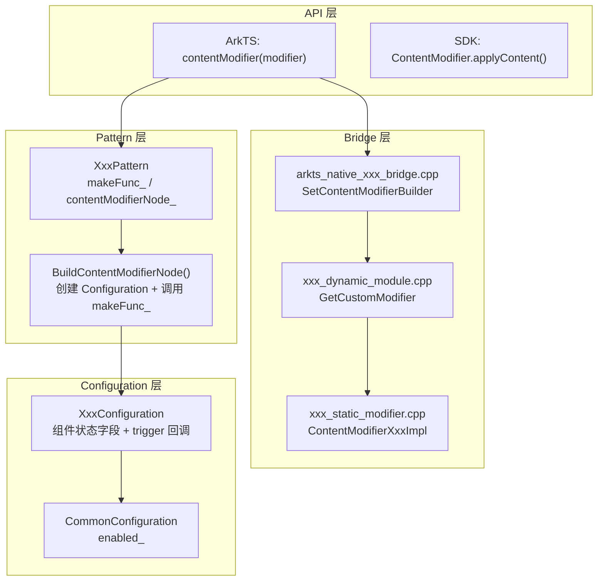

# 架构设计

> 表单类组件 ContentModifier 允许开发者用自定义 Builder 替换 Button/Checkbox/CheckboxGroup/Radio/Rating/Select/Slider/Toggle 的默认渲染内容，通过 Configuration 对象暴露组件状态与触发回调。

## 设计元数据

| 字段 | 内容 |
|------|------|
| Design ID | DESIGN-Func-04-05-03 |
| 关联需求 | 已有能力补录（无独立 requirement.md） |
| 关联 Epic | 无 |
| 目标 Feature | Feat-01 表单类组件自定义内容 |
| 复杂度 | 中等 |
| 目标版本 | API 12 起支持动态版本，API 18 起 Optional 变体，API 21 起 CheckboxGroup |
| Owner | ArkUI SIG |
| 状态 | Baselined（已有实现补录） |

## 需求基线

| 字段 | 内容 |
|------|------|
| 问题陈述 | 表单类组件需要支持自定义内容替换原生渲染，同时保留组件的状态语义和事件触发能力 |
| 核心目标 | （Feat-01）提供 ContentModifier 基础契约 + 7 个表单组件的 contentModifier() 方法，每个组件通过 Configuration 暴露状态字段与 triggerClick/triggerChange 回调 |
| P0 AC | AC-1.1 ~ AC-1.4（基础契约）、AC-2.1 ~ AC-2.3（Button）、AC-3.1 ~ AC-3.3（Checkbox）、AC-4.1 ~ AC-4.3（Radio）、AC-5.1 ~ AC-5.3（Slider）、AC-6.1 ~ AC-6.3（Toggle）、AC-7.1 ~ AC-7.3（Select）、AC-8.1 ~ AC-8.3（reset/Optional/动态加载） |

## 上下文和现状

### 涉及仓和模块

| 仓库 | 模块路径 | 当前职责 | 本 Feature 影响 |
|------|----------|----------|-----------------|
| ace_engine | `frameworks/core/components_ng/base/modifier.h` | ContentModifier 基类定义 | 全量涉及 |
| ace_engine | `frameworks/core/components_ng/base/common_configuration.h` | CommonConfiguration 及各组件 Configuration | 全量涉及 |
| ace_engine | `frameworks/core/components_ng/pattern/button/` | Button Pattern + Model + Bridge | 全量涉及 |
| ace_engine | `frameworks/core/components_ng/pattern/checkbox/` | Checkbox/CheckboxGroup Pattern + Model | 全量涉及 |
| ace_engine | `frameworks/core/components_ng/pattern/radio/` | Radio Pattern + Model | 全量涉及 |
| ace_engine | `frameworks/core/components_ng/pattern/select/` | Select Pattern + Model | 全量涉及 |
| ace_engine | `frameworks/core/components_ng/pattern/slider/` | Slider Pattern + Model | 全量涉及 |
| ace_engine | `frameworks/core/components_ng/pattern/toggle/` | Toggle Pattern + Model | 全量涉及 |
| ace_engine | `frameworks/bridge/declarative_frontend/arkts_native/` | 各组件 ArkTS Native Bridge | 全量涉及 |

### 调用链层级分析

| 层 | 模块 | 职责 | 修改类型 |
|----|------|------|----------|
| SDK API | `interface/sdk-js/api/@internal/component/ets/common.d.ts:18580` | ContentModifier\<T\> 接口，applyContent() 返回 WrappedBuilder\<[T]\> | 无修改（规格补录） |
| SDK API | `common.d.ts:18608` | CommonConfiguration\<T\>，含 enabled/contentModifier | 无修改（规格补录） |
| ArkTS Bridge | `frameworks/bridge/declarative_frontend/arkts_native/arkts_native_button_bridge.cpp:1305` | SetContentModifierBuilder，解析 makeContentModifierNode | 无修改（规格补录） |
| Dynamic Module | `frameworks/bridge/declarative_frontend/arkts_native/button_dynamic_module.cpp:77` | GetCustomModifier("contentModifier") 动态加载 | 无修改（规格补录） |
| Static Modifier | `frameworks/bridge/declarative_frontend/arkts_native/button_static_modifier.cpp:294` | ContentModifierButtonImpl 实现 | 无修改（规格补录） |
| C-API Helper | `interfaces/native/node/button/bridge/button_content_modifier_helper.h:21` | GENERATED_ArkUIButtonContentModifier 结构体 | 无修改（规格补录） |
| Pattern | `frameworks/core/components_ng/pattern/button/button_pattern.cpp:1443` | BuildContentModifierNode，创建 Configuration 并调用 makeFunc_ | 无修改（规格补录） |
| Model | `frameworks/core/components_ng/pattern/button/button_model_ng.h:28` | ButtonConfiguration（label_/pressed_） | 无修改（规格补录） |

### 适用架构规则

| 规则 ID | 设计结论 |
|---------|----------|
| OH-ARCH-01 | ContentModifier 遵循 Modifier-Configuration-Pattern 三层架构 |
| OH-ARCH-02 | 每个 Configuration 继承 CommonConfiguration，暴露组件特有字段 |
| OH-ARCH-03 | 动态模块加载通过 DynamicModuleHelper::GetInstance().GetDynamicModule() 按需加载 |

## 不涉及项承接

| 维度 | 结论 |
|------|------|
| 性能 | N/A — ContentModifier 构建在属性变更时触发，无额外性能设计 |
| 安全与权限 | N/A — ContentModifier 为纯 UI 自定义，不涉及安全敏感操作 |
| 兼容性 | 展开设计 — API 12/18/21 版本差异需兼容性声明 |
| API/SDK | 展开设计 — ArkTS API 签名需与 SDK 定义交叉验证 |
| IPC/跨进程 | N/A — ContentModifier 为进程内 UI 构造，不涉及 IPC |
| 构建与部件 | N/A — 各组件源码已包含在现有 source set 中 |

## 关键设计决策

| 决策 ID | 问题 | 推荐方案 | 探索过的替代方案 | 取舍理由 | 影响 |
|---------|------|----------|------------------|----------|------|
| ADR-1 | 如何让自定义内容感知组件状态 | 通过 Configuration 对象暴露字段（label/selected/isOn/value 等）和 trigger 回调 | 直接传递 FrameNode 让开发者读取属性 | Configuration 提供稳定 ABI，不暴露内部实现 | 每个组件需定义独立 Configuration 类 |
| ADR-2 | contentModifier 节点如何挂载到组件 | Pattern 存储 RefPtr\<FrameNode\> contentModifierNode_，作为子节点插入位置 0 | 替换组件自身渲染 | 保留组件行为框架（事件/布局），仅替换内容渲染 | FireBuilder 在 makeFunc_ 为空时移除自定义节点恢复默认 |
| ADR-3 | 动态版本如何加载 modifier 实现 | 通过 DynamicModuleHelper 按组件名动态加载 shared library，GetCustomModifier 获取实现 | 编译期静态链接 | 动态加载减少包体积，按需加载 | std::call_once 保证单次加载，缓存结果 |
| ADR-4 | API 18 引入 Optional 变体的策略 | Checkbox/Radio/Select 的 contentModifier 增加 optional 参数重载 | 统一使用非 optional 版本 | Optional 变体允许传 undefined 清除 modifier | SDK 类型签名分两个重载 |
| ADR-5 | triggerClick/triggerChange 回调设计 | Configuration 持有函数对象，开发者调用后触发组件原生行为（选中/点击） | 直接修改 Configuration 字段后手动刷新 | 回调模式保证状态一致性，由组件内部处理副作用 | Configuration 字段为只读快照 |

## 设计骨架

### 骨架范围

| 骨架项 | 目标 | 不包含 | 验证方式 |
|--------|------|--------|----------|
| ContentModifier 基类 | onDraw/AttachProperty/SetContentChange | 具体组件 Configuration | 代码审查 |
| CommonConfiguration | enabled 字段 | 组件特有字段 | 代码审查 |
| 各组件 Configuration | 组件状态字段 + trigger 回调 | Pattern 布局逻辑 | 单元测试 |
| Pattern apply 机制 | makeFunc_ + contentModifierNode_ 管理 | 默认渲染逻辑 | 单元测试 |

### 骨架 Spec 拆分

| Task ID | 目标 | 受影响文件 | AC |
|---------|------|------------|-----|
| TASK-SKELETON-1 | ContentModifier 基类 + CommonConfiguration | `modifier.h`, `common_configuration.h` | AC-1.1 ~ AC-1.4 |
| TASK-SKELETON-2 | Button/Checkbox/Radio Configuration + contentModifier | 各组件 model_ng.h, pattern.cpp | AC-2.1~3.3, AC-4.1~5.3 |
| TASK-SKELETON-3 | Select/Slider/Toggle Configuration + contentModifier | 各组件 model_ng.h, pattern.cpp | AC-6.1~7.3 |
| TASK-SKELETON-4 | reset/Optional 变体 + 动态模块加载 | 各组件 d.ts, dynamic_module.cpp | AC-8.1 ~ AC-8.3 |

## 后续 Task 拆分

| Task ID | 目标 | 受影响文件 | 依赖 |
|---------|------|------------|------|
| TASK-1 | 表单类组件 ContentModifier 全部行为规格 | Feat-01-content-modifier-form-spec.md | 无 |

## API 签名、Kit 与权限

### 新增 API

| API 签名 | 类型 | d.ts 位置 | 权限要求 | SysCap |
|----------|------|-----------|----------|--------|
| `interface ContentModifier<T> { applyContent(): WrappedBuilder<[T]> }` | Public | `common.d.ts:18580` | - | ArkUI |
| `class CommonConfiguration<T> { enabled: boolean; contentModifier?: ContentModifier<T> }` | Public | `common.d.ts:18608` | - | ArkUI |
| `contentModifier(modifier: ContentModifier<T>): T` | Public | 各组件 d.ts | - | ArkUI |

### 变更/废弃 API

| 原有 API | 变更类型 | 新 API | 迁移说明 |
|----------|----------|--------|----------|
| — | — | — | 无变更/废弃 API |

## 构建系统影响

### BUILD.gn 变更

```
无变更。各组件 ContentModifier 实现已包含在现有 source set 和 dynamic module 中。
```

### bundle.json 变更

无变更。

## 可选设计扩展

### 架构图



### 数据流/控制流

| 步骤 | 调用方 | 被调用方 | 数据/接口 | 说明 |
|------|--------|----------|-----------|------|
| 1 | ArkTS | Pattern::SetBuilderFunc | ContentModifier makeFunc | 存储 makeFunc_ 回调 |
| 2 | Pattern | FireBuilder | — | 检查 makeFunc_ 是否有值 |
| 3 | FireBuilder | BuildContentModifierNode | — | 从 PaintProperty/EventHub 读取状态 |
| 4 | BuildContentModifierNode | XxxConfiguration | 状态字段 + enabled | 构造 Configuration 对象 |
| 5 | BuildContentModifierNode | makeFunc_(config) | WrappedBuilder | 调用开发者 Builder 返回 FrameNode |
| 6 | FireBuilder | host->AddChild | contentModifierNode_ | 挂载到位置 0 |
| 7 | FireBuilder | MarkNeedFrameFlushDirty | PROPERTY_UPDATE_MEASURE | 触发重测量 |

### 数据模型设计

**ArkTS (API 层类型)**

```typescript
// common.d.ts:18580
interface ContentModifier<T> {
    applyContent(): WrappedBuilder<[T]>;
}

// common.d.ts:18608
interface CommonConfiguration<T> {
    enabled: boolean;
    contentModifier?: ContentModifier<T>;
}

// button.d.ts:219
interface ButtonConfiguration extends CommonConfiguration {
    label: ResourceStr;
    pressed: boolean;
    triggerClick: Callback;
}
```

**C++ (框架层结构)**

```cpp
// modifier.h:327
class ContentModifier : public Modifier {
    virtual void onDraw(DrawingContext& Context) = 0;
    void AttachProperty(const RefPtr<PropertyBase>& prop);
    void SetContentChange();  // changeCount_ +1 触发重渲染
};

// common_configuration.h:22
class CommonConfiguration {
    bool enabled_ = false;
};

// button_model_ng.h:28
class ButtonConfiguration : public CommonConfiguration {
    std::string label_;
    bool pressed_;
};
```

## 详细设计

### ContentModifier 基类契约

**入口**: `modifier.h:327-391`

ContentModifier 继承 Modifier，提供：
- `onDraw(DrawingContext&)`: 纯虚函数，子类实现自定义绘制
- `AttachProperty(prop)`: 将属性注册到 `attachedProperties_`，属性变更时触发重渲染
- `SetContentChange()`: 递增 `changeCount_`（PropertyInt），通知渲染系统内容已变更
- `SetExtensionHandler(handler)`: 设置扩展处理器

### Configuration 对象设计

每个表单组件定义独立 Configuration 类，继承 CommonConfiguration：

| 组件 | Configuration 类 | 关键字段 | 回调 | d.ts 行 |
|------|-------------------|----------|------|---------|
| Button | ButtonConfiguration | label_/pressed_ | triggerClick | button.d.ts:219 |
| Checkbox | CheckBoxConfiguration | name_/selected_ | triggerChange | checkbox.d.ts:84 |
| CheckboxGroup | CheckBoxGroupConfiguration | name_/status_ | triggerChange | checkboxgroup.d.ts:188 |
| Radio | RadioConfiguration | value_/checked_ | triggerChange | radio.d.ts:370 |
| Select | MenuItemConfiguration | value_/icon_/symbolIcon_/selected_ | — | select.d.ts:1265 |
| Slider | SliderConfiguration | value_/min_/max_/step_ | triggerChange | slider.d.ts:505 |
| Toggle | ToggleConfiguration | isOn_ | triggerChange | toggle.d.ts:203 |

### Pattern apply 机制

以 Button 为例 (`button_pattern.cpp:1439-1457`)：

```
1. 检查 contentModifierNode_ != nullptr（UseContentModifier）
2. 从 PaintProperty/EventHub 读取状态字段
3. 构造 ButtonConfiguration(label, pressed, enabled)
4. 调用 makeFunc_(config) 获取自定义 FrameNode
5. 移除旧 contentModifierNode_，添加新节点到位置 0
6. MarkNeedFrameFlushDirty(PROPERTY_UPDATE_MEASURE)
```

### 动态模块加载

**入口**: `button_dynamic_module.cpp:77-84`

```
1. DynamicModuleHelper::GetInstance().GetDynamicModule("Button")
2. ->GetCustomModifier("contentModifier") 返回 Modifier 实现
3. std::call_once 保证单次加载
4. ContentModifierHelperAccessor 负责 C++ Configuration ↔ ArkTS Configuration 转换
```

### Bridge 层 SetContentModifierBuilder

**入口**: `arkts_native_button_bridge.cpp:1305-1334`

```
1. 从 jsObject 获取 "makeContentModifierNode" 函数 (L1334)
2. 构造 ButtonConfiguration (L1323-1328)
3. 调用 ButtonModelNG::SetBuilderFunc (L1318)
4. Pattern 存储 makeFunc_ 到 std::optional<XxxMakeCallback>
```

## 风险和开放问题

| 项 | 类型 | 影响 | 处理方式 | Owner |
|----|------|------|----------|-------|
| API 18 Optional 变体引入新重载 | 兼容性 | 中 | 在兼容性声明中标注，旧代码非 optional 版本仍可用 | ArkUI SIG |
| CheckboxGroup contentModifier @since 21 晚于其他组件 | 版本 | 中 | 在规格中明确版本差异 | ArkUI SIG |
| Select 使用 menuItemContentModifier 而非 contentModifier | 命名 | 低 | SDK 方法名与组件不一致，在规格中说明 | ArkUI SIG |
| 动态模块加载失败时回退默认渲染 | 异常 | 中 | makeFunc_ 为空时 FireBuilder 移除自定义节点恢复默认 | ArkUI SIG |
| triggerClick/triggerChange 回调为只读快照 | 架构 | 低 | Configuration 字段不反映回调后的状态变更，需开发者自行同步 | ArkUI SIG |

## 设计审批

- [x] 需求基线已确认，设计覆盖 P0/P1 AC
- [x] 不涉及项已承接，N/A 和展开项都有结论
- [x] 涉及仓和模块职责清楚
- [x] 适用架构规则已识别并形成设计结论
- [x] 分层和子系统边界合规
- [x] API 变更有签名、权限、错误码和兼容性说明
- [x] BUILD.gn/bundle.json 影响明确
- [x] 设计输出和后续 Task 拆分明确
- [x] 关键设计决策有理由和影响说明
- [x] 风险和开放问题有 Owner

**结论:** 通过（已有实现补录）
