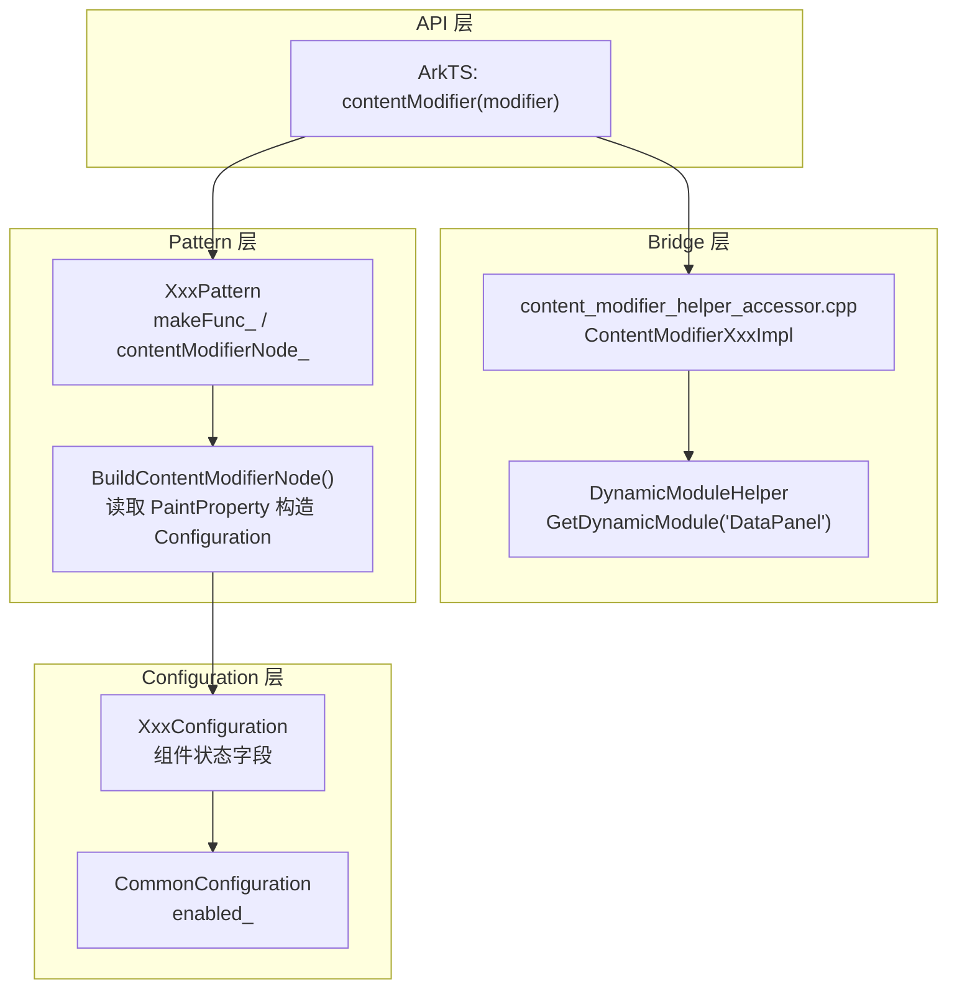

# 架构设计

> 信息展示类组件 ContentModifier 允许开发者用自定义 Builder 替换 DataPanel/Gauge/Progress/Rating/LoadingProgress/TextClock/TextTimer 的默认渲染内容，通过 Configuration 对象暴露组件状态与触发回调。

## 设计元数据

| 字段 | 内容 |
|------|------|
| Design ID | DESIGN-Func-04-05-04 |
| 关联需求 | 已有能力补录（无独立 requirement.md） |
| 关联 Epic | 无 |
| 目标 Feature | Feat-01 信息展示类组件自定义内容 |
| 复杂度 | 中等 |
| 目标版本 | API 12 起支持动态版本，API 18 起 Rating Optional 变体 |
| Owner | ArkUI SIG |
| 状态 | Baselined（已有实现补录） |

## 需求基线

| 字段 | 内容 |
|------|------|
| 问题陈述 | 信息展示类组件需要支持自定义内容替换原生渲染，同时保留组件的状态语义和事件触发能力 |
| 核心目标 | （Feat-01）提供 7 个展示组件的 contentModifier() 方法，每个组件通过 Configuration 暴露状态字段与 triggerChange 回调 |
| P0 AC | AC-1.1 ~ AC-1.3（DataPanel）、AC-2.1 ~ AC-2.3（Gauge）、AC-3.1 ~ AC-3.3（Progress）、AC-4.1 ~ AC-4.3（Rating）、AC-5.1 ~ AC-5.3（LoadingProgress）、AC-6.1 ~ AC-6.3（TextClock）、AC-7.1 ~ AC-7.3（TextTimer）、AC-8.1 ~ AC-8.2（动态加载/reset） |

## 上下文和现状

### 涉及仓和模块

| 仓库 | 模块路径 | 当前职责 | 本 Feature 影响 |
|------|----------|----------|-----------------|
| ace_engine | `frameworks/core/components_ng/pattern/data_panel/` | DataPanel Pattern + Model + Bridge | 全量涉及 |
| ace_engine | `frameworks/core/components_ng/pattern/gauge/` | Gauge Pattern + Model | 全量涉及 |
| ace_engine | `frameworks/core/components_ng/pattern/progress/` | Progress Pattern + Model | 全量涉及 |
| ace_engine | `frameworks/core/components_ng/pattern/rating/` | Rating Pattern + Model | 全量涉及 |
| ace_engine | `frameworks/core/components_ng/pattern/loading_progress/` | LoadingProgress Pattern + Model | 全量涉及 |
| ace_engine | `frameworks/core/components_ng/pattern/text_clock/` | TextClock Pattern + Model | 全量涉及 |
| ace_engine | `frameworks/core/components_ng/pattern/text_timer/` | TextTimer Pattern + Model | 全量涉及 |
| ace_engine | `frameworks/bridge/declarative_frontend/arkts_native/` | 各组件 Bridge + 动态模块 | 全量涉及 |

### 调用链层级分析

| 层 | 模块 | 职责 | 修改类型 |
|----|------|------|----------|
| SDK API | `data_panel.d.ts:400` | DataPanel contentModifier 方法 | 无修改（规格补录） |
| ArkTS Bridge | `content_modifier_helper_accessor.cpp:259-289` | ContentModifierDataPanelImpl Configuration 转换 | 无修改（规格补录） |
| Dynamic Module | `content_modifier_helper_accessor.cpp:132-147` | GetDataPanelModifierWithCache 动态加载 | 无修改（规格补录） |
| C-API Helper | `data_panel/bridge/data_panel_content_modifier_helper.h:23` | GENERATED_ArkUIDataPanelContentModifier 结构体 | 无修改（规格补录） |
| Pattern | `data_panel_pattern.cpp:88-106` | FireBuilder，makeFunc_ 为空时移除自定义节点 | 无修改（规格补录） |
| Pattern | `data_panel_pattern.cpp:108-132` | BuildContentModifierNode，读取 PaintProperty 构造 Configuration | 无修改（规格补录） |
| Model | `data_panel_model_ng.h:37` | DataPanelConfiguration（values_/maxValue_） | 无修改（规格补录） |

### 适用架构规则

| 规则 ID | 设计结论 |
|---------|----------|
| OH-ARCH-01 | ContentModifier 遵循 Modifier-Configuration-Pattern 三层架构 |
| OH-ARCH-02 | 每个 Configuration 继承 CommonConfiguration，暴露组件特有字段 |
| OH-ARCH-03 | 动态模块加载通过 DynamicModuleHelper 按组件名按需加载，std::call_once 缓存 |

## 不涉及项承接

| 维度 | 结论 |
|------|------|
| 性能 | N/A — ContentModifier 构建在属性变更时触发，无额外性能设计 |
| 安全与权限 | N/A — ContentModifier 为纯 UI 自定义，不涉及安全敏感操作 |
| 兼容性 | 展开设计 — API 12/18 版本差异需兼容性声明 |
| API/SDK | 展开设计 — ArkTS API 签名需与 SDK 定义交叉验证 |
| IPC/跨进程 | N/A — ContentModifier 为进程内 UI 构造，不涉及 IPC |
| 构建与部件 | N/A — 各组件源码已包含在现有 source set 中 |

## 关键设计决策

| 决策 ID | 问题 | 推荐方案 | 探索过的替代方案 | 取舍理由 | 影响 |
|---------|------|----------|------------------|----------|------|
| ADR-1 | 展示组件 Configuration 如何暴露数据状态 | 通过 values/value/maxValue/rating 等字段暴露组件当前状态 | 直接传递 FrameNode 让开发者读取属性 | Configuration 提供稳定 ABI，不暴露内部实现 | 每个组件需定义独立 Configuration 类 |
| ADR-2 | TextClock/TextTimer 的动态时间字段如何处理 | TextClockConfiguration 包含 timeValue，TextTimerConfiguration 包含 elapsedTime | 仅暴露静态配置 | 动态时间字段允许自定义内容实时反映计时状态 | timeValue/elapsedTime 随计时更新触发 makeFunc_ 重新调用 |
| ADR-3 | DataPanel Configuration 中 values 类型 | 使用 std::vector\<double\> 传递数据数组 | 使用 string 编码 | double 数组直接映射 SDK number[] 类型 | DataPanelConfiguration 持有 values_ 引用 |
| ADR-4 | Rating contentModifier API 18 Optional 变体 | 增加可选参数重载 | 统一非 optional 版本 | Optional 变体允许传 undefined 清除 modifier | SDK 类型签名分两个重载 |
| ADR-5 | triggerChange 回调设计 | RatingConfiguration 持有 triggerChange，开发者调用后触发原生评分变更 | 直接修改 Configuration 字段 | 回调模式保证状态一致性 | Configuration 字段为只读快照 |

## 设计骨架

### 骨架范围

| 骨架项 | 目标 | 不包含 | 验证方式 |
|--------|------|--------|----------|
| 各组件 Configuration | 组件状态字段 + trigger 回调 | modifier.h 绘制基类（不涉及） | 单元测试 |
| Pattern apply 机制 | makeFunc_ + contentModifierNode_ + BuildContentModifierNode + FireBuilder | 默认渲染逻辑 | 单元测试 |
| 动态模块加载 | DynamicModuleHelper + ContentModifierHelperAccessor | 静态编译 | 代码审查 |

### 骨架 Spec 拆分

| Task ID | 目标 | 受影响文件 | AC |
|---------|------|------------|-----|
| TASK-SKELETON-1 | DataPanel/Gauge/Progress Configuration + contentModifier | 各组件 model_ng.h, pattern.cpp | AC-1.1~3.3 |
| TASK-SKELETON-2 | Rating/LoadingProgress Configuration + contentModifier | 各组件 model_ng.h, pattern.cpp | AC-4.1~5.3 |
| TASK-SKELETON-3 | TextClock/TextTimer Configuration + contentModifier | 各组件 model_ng.h, pattern.cpp | AC-6.1~7.3 |
| TASK-SKELETON-4 | 动态模块加载 + reset + Rating Optional | content_modifier_helper_accessor.cpp, rating.d.ts | AC-8.1~8.2 |

## 后续 Task 拆分

| Task ID | 目标 | 受影响文件 | 依赖 |
|---------|------|------------|------|
| TASK-1 | 信息展示类组件 ContentModifier 全部行为规格 | Feat-01-content-modifier-display-spec.md | 无 |

## API 签名、Kit 与权限

### 新增 API

| API 签名 | 类型 | d.ts 位置 | 权限要求 | SysCap |
|----------|------|-----------|----------|--------|
| `contentModifier(modifier: ContentModifier<T>): T` | Public | 各组件 d.ts | - | ArkUI |

### 变更/废弃 API

| 原有 API | 变更类型 | 新 API | 迁移说明 |
|----------|----------|--------|----------|
| — | — | — | 无变更/废弃 API |

## 构建系统影响

### BUILD.gn 变更

```
无变更。各组件 ContentModifier 实现已包含在现有 source set 和 dynamic module 中。
```

### bundle.json 变更

无变更。

## 可选设计扩展

### 架构图



### 数据流/控制流

| 步骤 | 调用方 | 被调用方 | 数据/接口 | 说明 |
|------|--------|----------|-----------|------|
| 1 | ArkTS | Pattern::SetBuilderFunc | ContentModifier makeFunc | 存储 makeFunc_ 回调 |
| 2 | Pattern | FireBuilder | — | 检查 makeFunc_ 是否有值（`data_panel_pattern.cpp:92`） |
| 3 | FireBuilder | BuildContentModifierNode | — | 从 PaintProperty/EventHub 读取状态 |
| 4 | BuildContentModifierNode | XxxConfiguration | 状态字段 + enabled | 构造 Configuration 对象（`data_panel_pattern.cpp:130`） |
| 5 | BuildContentModifierNode | makeFunc_(config) | WrappedBuilder | 调用开发者 Builder 返回 FrameNode（`data_panel_pattern.cpp:131`） |
| 6 | FireBuilder | host->AddChild | contentModifierNode_ | 挂载到位置 0（`data_panel_pattern.cpp:104`） |
| 7 | FireBuilder | MarkNeedFrameFlushDirty | PROPERTY_UPDATE_MEASURE | 触发重测量（`data_panel_pattern.cpp:96,105`） |

### 数据模型设计

**ArkTS (API 层类型)**

```typescript
// data_panel.d.ts:244 (@since 12)
interface DataPanelConfiguration extends CommonConfiguration {
    values: number[];
    maxValue: number;
}

// rating.d.ts:203 (@since 12)
interface RatingConfiguration extends CommonConfiguration {
    rating: number;
    indicator: boolean;
    stars: number;
    stepSize: number;
    triggerChange: Callback;
}
```

**C++ (框架层结构)**

```cpp
// data_panel_model_ng.h:37
class DataPanelConfiguration : public CommonConfiguration {
    std::vector<double>& values_;
    double maxValue_;
};

// gauge_model_ng.h:23
class GaugeConfiguration : public CommonConfiguration {
    double value_;
    double min_;
    double max_;
};

// progress_date.h:110
class ProgressConfiguration : public CommonConfiguration {
    double value_;
    double total_;
};
```

## 详细设计

### Configuration 对象设计

每个展示组件定义独立 Configuration 类，继承 CommonConfiguration：

| 组件 | Configuration 类 | 关键字段 | 回调 | C++ 定义位置 |
|------|-------------------|----------|------|-------------|
| DataPanel | DataPanelConfiguration | values_/maxValue_ | — | data_panel_model_ng.h:37 |
| Gauge | GaugeConfiguration | value_/min_/max_ | — | gauge_model_ng.h:23 |
| Progress | ProgressConfiguration | value_/total_ | — | progress_date.h:110 |
| Rating | RatingConfiguration | starNum_/isIndicator_/rating_/stepSize_ | triggerChange | rating_model_ng.h:25 |
| LoadingProgress | LoadingProgressConfiguration | enableloading_ | — | loading_progress_model_ng.h:28 |
| TextClock | TextClockConfiguration | timeZoneOffset_/started_/timeValue_ | — | text_clock_model_ng.h:24 |
| TextTimer | TextTimerConfiguration | count_/isCountDown_/started_/elapsedTime_/startTime_ | — | text_timer_model_ng.h:24 |

### Pattern apply 机制（以 DataPanel 为例）

**入口**: `data_panel_pattern.cpp:88-106`

```
1. FireBuilder 检查 makeFunc_.has_value() (L92)
2. IF makeFunc_ 无值:
   - host->RemoveChildAndReturnIndex(contentModifierNode_) (L93)
   - contentModifierNode_ = nullptr (L94)
   - host->AddChild(nullptr, 0) (L95) 恢复默认
   - MarkNeedFrameFlushDirty(PROPERTY_UPDATE_MEASURE) (L96)
   - RETURN
3. 调用 BuildContentModifierNode() (L99)
4. 移除旧子节点，添加新 contentModifierNode_ 到位置 0 (L101-104)
5. MarkNeedFrameFlushDirty(PROPERTY_UPDATE_MEASURE) (L105)
```

### BuildContentModifierNode（以 DataPanel 为例）

**入口**: `data_panel_pattern.cpp:108-132`

```
1. 检查 makeFunc_ 有值 (L110)
2. 获取 host FrameNode 和 PaintProperty (L111-113)
3. 从 PaintProperty 读取 values 数组 (L117-124)
   - IF values 有值且 size > 0: 复制到 tmpArry
   - ELSE: tmpArry = {0.0f}
4. 从 EventHub 获取 enabled (L126-128)
5. 从 PaintProperty 读取 max，默认值 DEFAULT_MAX_VALUE=100 (L129)
6. 构造 DataPanelConfiguration(tmpArry, max, enabled) (L130)
7. 调用 makeFunc_.value()(config) 返回 FrameNode (L131)
```

### 动态模块加载（以 DataPanel 为例）

**入口**: `content_modifier_helper_accessor.cpp:132-147, 259-289`

```
1. GetDataPanelModifierWithCache (L132-147)
2. std::call_once 保证单次加载
3. DynamicModuleHelper::GetInstance().GetDynamicModule("DataPanel")
4. ->GetCustomModifier("contentModifier") 返回 Modifier 实现
5. ContentModifierDataPanelImpl (L259-289):
   - 将 C++ DataPanelConfiguration 转换为 Ark_DataPanelConfiguration
   - GetOrCreateContentBoxNode 获取内容容器
   - ReplaceContentBoxNodeChild 替换子节点
```

## 风险和开放问题

| 项 | 类型 | 影响 | 处理方式 | Owner |
|----|------|------|----------|-------|
| Rating Optional 变体 API 18 | 兼容性 | 中 | 在兼容性声明中标注，旧代码非 optional 版本仍可用 | ArkUI SIG |
| 动态模块加载失败时回退默认渲染 | 异常 | 中 | makeFunc_ 为空时 FireBuilder 移除自定义节点恢复默认 | ArkUI SIG |
| TextClock/TextTimer 时间字段触发频繁重建 | 性能 | 低 | timeValue/elapsedTime 变更触发 makeFunc_ 重新调用，可能有性能开销 | ArkUI SIG |
| triggerChange 回调为只读快照 | 架构 | 低 | Configuration 字段不反映回调后的状态变更，需开发者自行同步 | ArkUI SIG |

## 设计审批

- [x] 需求基线已确认，设计覆盖 P0/P1 AC
- [x] 不涉及项已承接，N/A 和展开项都有结论
- [x] 涉及仓和模块职责清楚
- [x] 适用架构规则已识别并形成设计结论
- [x] 分层和子系统边界合规
- [x] API 变更有签名、权限、错误码和兼容性说明
- [x] BUILD.gn/bundle.json 影响明确
- [x] 设计输出和后续 Task 拆分明确
- [x] 关键设计决策有理由和影响说明
- [x] 风险和开放问题有 Owner

**结论:** 通过（已有实现补录）
