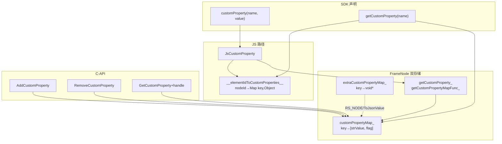

# 架构设计

> 自定义属性（customProperty）功能域的架构设计文档，补录已有实现。customProperty 通过 `.customProperty(name, value)` 为组件设置任意键值对自定义属性，经 `FrameNode.getCustomProperty(name)` 读取，采用 JS 侧 Map + FrameNode 双存储 + 懒加载物化机制，并提供 C-API（NDK）读写通路。

## 设计元数据

| 字段 | 内容 |
|------|------|
| Design ID | DESIGN-Func-04-05-05 |
| 关联需求 | 已有能力补录（无独立 requirement.md） |
| 关联 Epic | 无 |
| 目标 Feature | Feat-01 自定义属性设置读取与双存储 |
| 复杂度 | 复杂 |
| 目标版本 | 动态 customProperty/getCustomProperty @since 12 dynamic；静态 @since 23 static；C-API Add/Remove @since 13、Get+handle @since 14；API 26.0.0 起自定义组件支持 |
| Owner | ArkUI SIG |
| 状态 | Baselined（已有实现补录） |

## 需求基线

| 项 | 内容 |
|----|------|
| 问题陈述 | 开发者需要为组件附加任意键值对自定义属性（非框架预定义属性），供后续读取、跨节点传递或调试序列化 |
| 核心目标 | （Feat-01）提供 `.customProperty(name, value)` 设置、`FrameNode.getCustomProperty(name)` 读取；FrameNode 双存储（customPropertyMap_ 字符串化 + extraCustomPropertyMap_ 原生指针）+ 懒加载物化；C-API Add/Remove/GetCustomProperty；API 26.0.0 起自定义组件支持设置读取 |
| P0 AC | customProperty 设置后可经 getCustomProperty 读回；value=undefined 触发移除；C-API Add 后 Get 可读；transferDynamic 创建的 FrameNode getCustomProperty 抛 100031 |

## 上下文和现状

### 涉及仓和模块

| 仓库 | 模块/路径 | 当前职责 | 本 Feature 影响 |
|------|-----------|----------|-----------------|
| ace_engine | `frameworks/bridge/declarative_frontend/jsview/js_view_abstract.cpp` | JsCustomProperty 入口 + ParseJsFunc/ParseJsGetFunc/JsGetCustomMapFunc 回调工厂 | JS bridge |
| ace_engine | `frameworks/bridge/declarative_frontend/ark_component/src/ArkComponent.ts` | JS 侧 __elementIdToCustomProperties__ Map + __set/get/removeCustomProperty__ 全局 | JS 存储 |
| ace_engine | `frameworks/core/components_ng/base/frame_node.h/cpp` | FrameNode 双存储 + 3 回调 + 懒加载物化 | 核心存储 |
| ace_engine | `frameworks/core/components_ng/base/view_abstract.cpp` | ViewAbstract::AddCustomProperty/RemoveCustomProperty 静态转发 | API 层 |
| ace_engine | `frameworks/bridge/declarative_frontend/ark_node/src/frame_node.ts` | getCustomProperty 读取（JS 优先，回退 C-API） | 读取入口 |
| ace_engine | `frameworks/bridge/declarative_frontend/ark_node/src/trans_frame_node.ts` | transferDynamic 创建的 FrameNode getCustomProperty 抛 100031 | 边界 |
| ace_engine | `interfaces/native/native_node.h` + `native_type.h` | C-API 声明 Add/Remove/Get + ArkUI_CustomProperty handle | C-API |
| ace_engine | `interfaces/native/node/node_utils.cpp` + `frameworks/core/interfaces/native/node/frame_node_modifier.cpp` | C-API 实现 + modifier 转发 | C-API 实现 |
| ace_engine | `frameworks/core/interfaces/native/ani/common_ani_modifier.cpp` | ANI 侧 SetCustomPropertyCallBack/GetCustomProperty | ANI |
| sdk-js | `api/@internal/component/ets/common.d.ts` | customProperty() setter（动态） | 类型定义 |
| sdk-js | `api/arkui/FrameNode.d.ts` | getCustomProperty() reader（动态） | 类型定义 |
| sdk-js | `api/arkui/component/common.static.d.ets` | CustomProperty 类型 + 静态 setter | 类型定义 |
| sdk-js | `api/arkui/FrameNode.static.d.ets` | 静态 getCustomProperty | 类型定义 |

### 调用链层级分析

| 层 | 模块 | 职责 | 修改类型 |
|----|------|------|----------|
| SDK 声明(setter) | `common.d.ts:19582` / `common.static.d.ets:11491` | customProperty(name, value) 设置 | 存量分析 |
| SDK 声明(reader) | `FrameNode.d.ts:991` / `FrameNode.static.d.ets:801` | getCustomProperty(name) 读取 | 存量分析 |
| JS bridge | `js_view_abstract.cpp:10502/13137` | JsCustomProperty 注册 + 构建 set/get/getMap 回调 | 存量分析 |
| JS 存储 | `ArkComponent.ts:6678-6758` | __elementIdToCustomProperties__ Map + __set/get/removeCustomProperty__ 全局 | 存量分析 |
| 框架存储 | `frame_node.cpp:8371-8456` | SetJSCustomProperty/GetJSCustomProperty/GetCapiCustomProperty/AddCustomProperty/RemoveCustomProperty/SetCustomPropertyMapFlagByKey | 存量分析 |
| API 转发 | `view_abstract.cpp:11875` | AddCustomProperty/RemoveCustomProperty 静态转发 FrameNode | 存量分析 |
| 读取入口 | `frame_node.ts:770` | getCustomProperty JS 优先回退 C-API | 存量分析 |
| 边界 | `trans_frame_node.ts:30` | transferDynamic FrameNode getCustomProperty 抛 100031 | 存量分析 |
| C-API 声明 | `native_node.h:13745/13754/13767` + `native_type.h:276/3515/3524` | Add/Remove/Get + handle Destroy/GetStringValue | 存量分析 |
| C-API 实现 | `node_utils.cpp:244/256/268` + `frame_node_modifier.cpp:933/945/1002` | NDK 入口 + modifier 转发 | 存量分析 |
| ANI | `common_ani_modifier.cpp:477/492` | SetCustomPropertyCallBack/GetCustomProperty | 存量分析 |

### 适用架构规则

| Rule ID | 适用原因 | 设计结论 | 验证方式 |
|---------|----------|----------|----------|
| OH-ARCH-LAYERING | 经 JS bridge→FrameNode→C-API 多层 | 设置经 JS 回调到 FrameNode，读取 JS 优先回退 C-API | 代码评审 |
| OH-ARCH-API-LEVEL | customProperty/getCustomProperty + C-API 为 Public | 级别 Public，SysCap SystemCapability.ArkUI.ArkUI.Full | API 评审/XTS |
| OH-ARCH-COMPONENT-BUILD | 无新增依赖 | 复用 frame_node/node_utils 模块 | 构建验证 |

## 不涉及项承接

| 维度 | 设计结论 |
|------|----------|
| 持久化 | 不涉及。运行时内存，组件销毁随 FrameNode 回收（teardown 调 __removeCustomProperties__） |
| 跨进程/IPC | 不涉及 |
| 新增权限/SysCap | 不涉及。归属 SystemCapability.ArkUI.ArkUI.Full |
| 属性约束 | 不涉及。键为任意字符串、值为开放递归类型 CustomProperty，无枚举约束 |

## 关键设计决策

| 决策 ID | 问题 | 推荐方案 | 探索过的替代方案 | 取舍理由 | 影响 |
|---------|------|----------|------------------|----------|------|
| ADR-1 | 自定义属性值存储在哪 | FrameNode 双存储：customPropertyMap_（unordered_map<string, vector<string>>，[stringifiedValue, freshnessFlag]）+ extraCustomPropertyMap_（unordered_map<string, void*>，原生指针侧信道如 RS_NODE/ToJsonValue）+ JS 侧 __elementIdToCustomProperties__ Map（Object 值源） | (a) 仅 JS Map；(b) 仅 FrameNode；(c) RenderContext | JS Map 保原始 Object；FrameNode 保字符串化值供 C-API/Inspector；双存兼顾 JS 原始值与原生访问，懒加载桥接二者 | Feat-01 |
| ADR-2 | 读取如何保证 JS 设值后原生侧可见 | 懒加载物化：SetJSCustomProperty 设值后 SetCustomPropertyMapFlagByKey 置 flag "0"（stale）；GetJSCustomProperty 遇 flag "0" 经 getCustomProperty_ 回调向 JS Map 重取并缓存置 "1" | (a) 设值即同步物化到原生；(b) 永远走 JS 回调 | flag "0" 标记 stale 触发下次读取时物化，避免每次读取都跨 JS；flag "1" 直接返回缓存。平衡性能与一致性 | Feat-01 |
| ADR-3 | C-API 与 JS 路径如何区分 | GetCapiCustomProperty 直接读 customPropertyMap_[key][0]（不查 flag）；GetJSCustomProperty 查 flag（"1" 返回缓存/"0" 回调重取）；C-API AddCustomProperty 直写 {value,"1"} | (a) 统一一条路径 | C-API 设的值 flag 恒 "1"（原生源，无 stale）；JS 设的值经 flag 协调懒物化。两路径语义不同但共用 customPropertyMap_ | Feat-01 |
| ADR-4 | 自定义组件支持的范围演进 | 动态 common.d.ts:19567-19571 文档：API < 26.0.0 自定义组件不支持；API ≥ 26.0.0 起支持设置读取。静态 common.static.d.ets:11482 仍注明 "does not work for custom components" | (a) 一开始就支持；(b) 永不支持 | 自定义组件（@Component）与系统组件的属性链路不同，26.0.0 扩展支持属版本演进；静态文档未同步更新——标注风险 | Feat-01 |

## 设计骨架

### 骨架范围

| 骨架项 | 目标 | 不包含 | 验证方式 |
|--------|------|--------|----------|
| 设置读取与双存储 | customProperty 设置 + getCustomProperty 读取 + 双存储 + 懒加载 + C-API | — | 单测/XTS |

### 骨架 Spec 拆分

| Task ID | 目标 | 受影响文件 | AC |
|---------|------|-----------|----|
| TASK-SKELETON-1 | 自定义属性设置读取与双存储 | frame_node.cpp, js_view_abstract.cpp, ArkComponent.ts, native_node.h | Feat-01 AC |

## 后续 Task 拆分

| Task ID | 目标 | 受影响文件 | 依赖 |
|---------|------|-----------|------|
| Feat-01 | 自定义属性设置读取与双存储规格补录 | spec + 本设计基线 | 无（基线） |

## API 签名、Kit 与权限

### 新增 API

> 补录已有 API，非新增。

| API 签名 | 类型 | Kit | d.ts 位置 | 权限要求 | SysCap |
|----------|------|-----|-----------|----------|--------|
| `customProperty(name: string, value: Optional<Object>): T` (动态 @since 12) / `default customProperty(name: string, value: CustomProperty): this` (静态 @since 23) | Public | ArkUI | `common.d.ts:19582` / `common.static.d.ets:11491` | 无 | SystemCapability.ArkUI.ArkUI.Full |
| `getCustomProperty(name: string): Object \| undefined` (动态 @since 12) / `getCustomProperty(name: string): CustomProperty` (静态 @since 23) | Public | ArkUI | `FrameNode.d.ts:991` / `FrameNode.static.d.ets:801` | 无 | 同上 |
| `type CustomProperty` (静态 @since 23) | Public | ArkUI | `common.static.d.ets:11431` | 无 | 同上 |
| `OH_ArkUI_NodeUtils_AddCustomProperty(node, name, value)` (C-API @since 13) | Public | ArkUI NDK | `native_node.h:13745` | 无 | 同上 |
| `OH_ArkUI_NodeUtils_RemoveCustomProperty(node, name)` (C-API @since 13) | Public | ArkUI NDK | `native_node.h:13754` | 无 | 同上 |
| `OH_ArkUI_NodeUtils_GetCustomProperty(node, name, handle)` (C-API @since 14) | Public | ArkUI NDK | `native_node.h:13767` | 无 | 同上 |
| `OH_ArkUI_CustomProperty_Destroy(handle)` / `OH_ArkUI_CustomProperty_GetStringValue(handle)` (C-API @since 14) | Public | ArkUI NDK | `native_type.h:3515/3524` | 无 | 同上 |

### 变更/废弃 API

无。

## 构建系统影响

### BUILD.gn 变更

无变更。

### bundle.json 变更

无变更。

## 可选设计扩展

### 架构图



### 数据流/控制流

| 步骤 | 调用方 | 被调用方 | 数据/接口 | 说明 |
|------|--------|----------|-----------|------|
| 1 JS设值 | customProperty(name,value) | JsCustomProperty | set 回调 | 构建 set/get/getMap 回调 |
| 2 JS设值 | SetJSCustomProperty | __setCustomProperty__ | value | 写 JS Map；成功置 flag "0" |
| 3 JS读 | getCustomProperty(name) | __getCustomProperty__ | key | 先读 JS Map |
| 4 JS读回退 | getCustomProperty | getCustomPropertyCapiByKey | key | JS miss → 原生 |
| 5 原生读(J) | GetJSCustomProperty | getCustomProperty_ 回调 | key | flag "0" → JS 重取物化置 "1" |
| 6 原生读(C) | GetCapiCustomProperty | customPropertyMap_ | key | flag 不查，直读 [0] |
| 7 C设值 | AddCustomProperty | customPropertyMap_ | {value,"1"} | 直写 flag "1" |
| 8 teardown | SetRemoveCustomProperties | __removeCustomProperties__ | nodeId | 节点销毁清理 JS Map |

### 数据模型设计

**ArkTS 层（SDK 契约）**

```typescript
// common.d.ts:19582
customProperty(name: string, value: Optional<Object>): T;  // Optional<T> = T | undefined
// FrameNode.d.ts:991
getCustomProperty(name: string): Object | undefined;
// common.static.d.ets:11431
type CustomProperty = undefined | null | Object | Record<string, CustomProperty> | Array<CustomProperty>;
```

**C++ 框架层（frame_node.h）**

```cpp
// frame_node.h:1960
std::unordered_map<std::string, std::vector<std::string>> customPropertyMap_;  // [stringifiedValue, flag]
// frame_node.h:1962
std::unordered_map<std::string, void*> extraCustomPropertyMap_;  // RS_NODE/ToJsonValue 等原生指针
// frame_node.h:1861-1863
std::function<void()> removeCustomProperties_;
std::function<std::string(const std::string& key)> getCustomProperty_;
std::function<std::string()> getCustomPropertyMapFunc_;
```

| 数据结构 | 存储位置 | 说明 |
|----------|----------|------|
| __elementIdToCustomProperties__ | ArkComponent.ts:6678 | JS 侧 nodeId→Map<key,Object>，Object 值源 |
| customPropertyMap_ | FrameNode | key→[stringifiedValue, flag]，flag "1"=有效/"0"=stale |
| extraCustomPropertyMap_ | FrameNode | key→void*，原生指针侧信道（RS_NODE/ToJsonValue） |
| getCustomProperty_ 等 3 回调 | FrameNode | JS 桥回调，懒物化用 |

### 接口参数规约

| 接口 | 参数 | 类型 | 合法范围 | 非法处理 | 边界说明 |
|------|------|------|----------|----------|----------|
| customProperty(name, value) | name | string | 任意非空字符串 | — | 键无约束 |
| customProperty(name, value) | value | Object \| undefined | 任意 Object；undefined 触发移除 | undefined → __removeCustomProperty__ | Optional<Object> |
| getCustomProperty(name) | name | string | 任意 | miss 返回 undefined | transferDynamic 抛 100031 |
| OH_ArkUI_NodeUtils_AddCustomProperty | name/value | char* | 非 null | 返回 ARKUI_ERROR_CODE_PARAM_INVALID | 主线程 |

## 详细设计

### 自定义属性设置读取与双存储

**设置链**（JsCustomProperty，js_view_abstract.cpp:13137-13150）：
1. 取 FrameNode，构建三个回调：ParseJsFunc（:13096，调 JS `__setCustomProperty__(nodeId, key, value)`，value===undefined 触发 __removeCustomProperty__）、ParseJsGetFunc（:13045，调 `__getCustomPropertyString__(nodeId, key)`）、JsGetCustomMapFunc（:13071，调 `__getCustomPropertyMapString__(nodeId)`）。
2. `frameNode->SetJSCustomProperty(func, getFunc, std::move(getMapFunc))`（frame_node.cpp:8371）：先 `func()` 执行设置（写 JS Map），非 CNode 缓存 getCustomProperty_/getCustomPropertyMapFunc_。
3. 设置成功后 `frameNode->SetCustomPropertyMapFlagByKey(key)`（:8426）置 flag "0"（stale），下次原生读时经回调物化。
4. `frameNode->SetRemoveCustomProperties(...)`（:13117）注册 teardown 回调 `__removeCustomProperties__(nodeId)`，节点销毁时清理 JS Map。

**JS 侧存储**（ArkComponent.ts:6678-6758）：`__elementIdToCustomProperties__`（:6678）为 nodeId→Map<key,Object> 源；`__setCustomProperty__`（:6758）按 value===undefined 分发 __setValidCustomProperty__（:6680）/__removeCustomProperty__（:6692）。

**读取链**（frame_node.ts:770 getCustomProperty）：
1. 解析 nodeId（考虑 commonViewParentId），先 `__getCustomProperty__(nodeId, key)`（:781）读 JS Map。
2. JS miss → 回退原生 `getCustomPropertyCapiByKey(nodePtr, key)`（:783）→ frame_node_modifier.cpp:898 → `frameNode->GetCapiCustomProperty`（frame_node.cpp:8403）。
3. 原生读（GetJSCustomProperty :8386）：查 customPropertyMap_；flag "1" 返回缓存 [0]；flag "0" 经 getCustomProperty_(key) 回调向 JS Map 重取、缓存、置 "1"（懒物化）。
4. C-API 读（GetCapiCustomProperty :8403）：直读 customPropertyMap_[key][0]，不查 flag。

**C-API 链**：`OH_ArkUI_NodeUtils_AddCustomProperty`（node_utils.cpp:244）→ frame_node_modifier.cpp:933 AddCustomProperty → ViewAbstract::AddCustomProperty → frameNode->AddCustomProperty（:8413）直写 {value,"1"}。`OH_ArkUI_NodeUtils_GetCustomProperty`（node_utils.cpp:268）→ getCustomProperty（frame_node_modifier.cpp:1002）先 GetCapiCustomProperty 后 GetJSCustomProperty，包装成 ArkUI_CustomProperty{char* value}，调用方用 OH_ArkUI_CustomProperty_Destroy 释放。

**边界**：transferDynamic 创建的 FrameNode getCustomProperty 抛 BusinessError 100031（trans_frame_node.ts:30）。CNode 节点 SetJSCustomProperty 不缓存回调（frame_node.cpp:8375 IsCNode 提前 return）。Inspector 序列化（frame_node.cpp:1770-1780）对非 JS 更新节点直接 dump customPropertyMap_，否则经 getCustomPropertyMapFunc_。

**API 26.0.0 自定义组件支持**（ADR-4）：动态 common.d.ts:19567-19571 文档 API < 26.0.0 自定义组件不支持、≥ 26.0.0 起支持；静态 common.static.d.ets:11482 仍注明 "does not work for custom components"（文档未同步）。

## 风险和开放问题

| 项 | 类型 | 影响 | 处理方式 | Owner |
|----|------|------|----------|-------|
| R-1 静态文档与动态不一致 | API | 中 | 静态 common.static.d.ets:11482 仍注明自定义组件不支持，动态已记录 26.0.0 起支持。补录以动态为准，标注静态文档未同步 | ArkUI SIG |
| R-2 transferDynamic FrameNode 不可读 | API | 低 | trans_frame_node.ts:30 抛 100031。补录如实记录边界 | ArkUI SIG |
| R-3 JS 值字符串化 | 架构 | 中 | customPropertyMap_ 存 stringifiedValue，Object 经 JSON 序列化；原生读回为字符串，非原始 Object。补录如实记录 | ArkUI SIG |
| R-4 extraCustomPropertyMap_ 原生指针侧信道 | 架构 | 低 | extraCustomPropertyMap_ 存 void*（RS_NODE/ToJsonValue），非用户自定义属性，属框架内部。补录记录但不作为用户 API | ArkUI SIG |

## 设计审批

- [x] 需求基线已确认，设计覆盖 P0/P1 AC
- [x] 不涉及项已承接，N/A 和展开项都有结论
- [x] 涉及仓和模块职责清楚
- [x] 调用链层级分析完整，每层覆盖到位
- [x] 适用架构规则已识别并形成设计结论
- [x] 分层和子系统边界合规
- [x] API 变更有签名、权限、错误码和兼容性说明
- [x] BUILD.gn/bundle.json 影响明确（无变更）
- [x] 设计输出和后续 Task 拆分明确
- [x] 关键设计决策有理由和影响说明
- [x] 风险和开放问题有 Owner

**结论:** 通过（已有实现补录）
