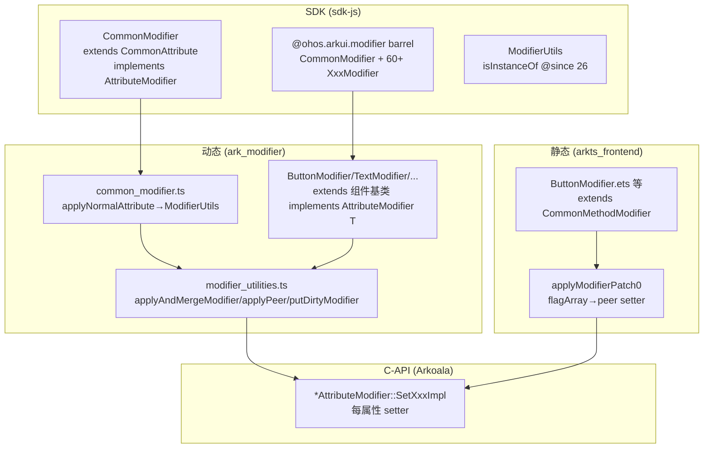

# 架构设计

> 组件Modifier（命令式 Modifier 类体系）功能域的架构设计文档，补录已有实现。本域覆盖 `CommonModifier` 基类、60+ 具体组件命令式 Modifier 类（ButtonModifier/TextModifier/…）、`@ohos.arkui.modifier` barrel 导出，以及 `ModifierWithKey` 装配与 `ModifierUtils` 属性应用机制。命令式 Modifier 类实现 `AttributeModifier<T>`，其 `applyNormalAttribute` 经 ModifierUtils 将 ModifierWithKey 属性 merge 到目标组件实例并调原生 setter。

## 设计元数据

| 字段 | 内容 |
|------|------|
| Design ID | DESIGN-Func-04-05-06 |
| 关联需求 | 已有能力补录（无独立 requirement.md） |
| 关联 Epic | 无 |
| 目标 Feature | Feat-01 命令式 Modifier 基类与类体系, Feat-02 ModifierUtils 对外接口（applyAndMergeModifier/applySetOnChange/putDirtyModifier/isInstanceOf）；ModifierWithKey 装配机制与原生 setter 落地链属框架内部实现，方案见本文「详细设计」段，不进 spec 固化 |
| 复杂度 | 复杂 |
| 目标版本 | CommonModifier/XxxModifier 动态 @since 12（crossplatform @since 20）、静态 @since 23；ModifierUtils.isInstanceOf @since 26.0.0 dynamiconly |
| Owner | ArkUI SIG |
| 状态 | Baselined（已有实现补录） |

## 需求基线

| 项 | 内容 |
|----|------|
| 问题陈述 | 开发者需要一种命令式、可复用的属性设置对象，把一组属性设置封装为 Modifier 实例，可传给 `.attributeModifier()` 复用，并支持属性变更时自动重应用 |
| 核心目标 | （Feat-01）提供 CommonModifier 基类 + 60+ XxxModifier 组件命令式 Modifier 类 + @ohos.arkui.modifier barrel 导出，各类实现 AttributeModifier<T>，applyNormalAttribute 转发 ModifierUtils；（Feat-02）提供 ModifierWithKey 装配（属性键值 + stageValue + applyPeer 调原生 setter）与 ModifierUtils（applyAndMergeModifier 合并、applySetOnChange、isInstanceOf 实例判定） |
| P0 AC | CommonModifier/XxxModifier 可实例化并传 attributeModifier；applyNormalAttribute 经 ModifierUtils 合并 ModifierWithKey 属性到目标；属性 setter 命中各组件 Model 静态 setter；ModifierUtils.isInstanceOf 可判定实例组件类型 |

## 上下文和现状

### 涉及仓和模块

| 仓库 | 模块/路径 | 当前职责 | 本 Feature 影响 |
|------|-----------|----------|-----------------|
| ace_engine | `frameworks/bridge/declarative_frontend/ark_modifier/src/common_modifier.ts` | CommonModifier 命令式基类（extends ArkComponent implements AttributeModifier） | Feat-01 核心 |
| ace_engine | `frameworks/bridge/declarative_frontend/ark_modifier/src/*_modifier.ts` | 60+ 具体组件 Modifier 类（ButtonModifier/TextModifier/…） | Feat-01 |
| ace_engine | `frameworks/bridge/declarative_frontend/ark_modifier/src/modifier_utilities.ts` | ModifierUtils（applyAndMergeModifier/applySetOnChange/applyPeer/putDirtyModifier）+ dist/arkModifier.js | Feat-02 核心 |
| ace_engine | `frameworks/bridge/declarative_frontend/ark_modifier/types/attributes.d.ts` | attributeModifier() peer 声明 | Feat-01 边界 |
| ace_engine | `frameworks/bridge/arkts_frontend/koala_projects/.../arkui-preprocessed/arkui/*Modifier.ets` | 静态生成式 Modifier 类（ButtonModifier.ets 等） | Feat-01 静态 |
| ace_engine | `frameworks/bridge/arkts_frontend/koala_projects/.../arkui-preprocessed/arkui/CommonMethodModifier.ets` | 静态基类 attributeModifier 占位（throw Not implemented） | Feat-01 边界 |
| ace_engine | `frameworks/core/components_ng/pattern/<comp>/bridge/*_static_modifier.cpp` | Arkoala 生成每属性 setter 命名空间（*AttributeModifier::SetXxxImpl） | Feat-02 C-API 落地 |
| ace_engine | `frameworks/core/interfaces/native/implementation/*_modifier.cpp` | GeneratedModifier 原生 setter 实现 | Feat-02 C-API |
| sdk-js | `api/arkui/CommonModifier.d.ts` / `CommonModifier.static.d.ets` | CommonModifier 类声明 | 类型定义 |
| sdk-js | `api/@ohos.arkui.modifier.d.ts` / `.static.d.ets` | barrel re-export CommonModifier + 60+ XxxModifier + ModifierUtils | 类型定义 |
| sdk-js | `api/arkui/ModifierUtils.d.ts` | ModifierUtils 类（isInstanceOf） | 类型定义 |

### 调用链层级分析

| 层 | 模块 | 职责 | 修改类型 |
|----|------|------|----------|
| SDK 声明 | `CommonModifier.d.ts:44` / `@ohos.arkui.modifier.d.ts` | CommonModifier 类 + barrel 导出 60+ XxxModifier + ModifierUtils | 存量分析 |
| SDK 声明(静态) | `CommonModifier.static.d.ets:33` / `@ohos.arkui.modifier.static.d.ets` | 静态 CommonModifier + 静态 barrel | 存量分析 |
| 命令式基类(动态) | `common_modifier.ts:16` | CommonModifier extends ArkComponent implements AttributeModifier；applyNormalAttribute 转发 ModifierUtils | 存量分析 |
| 具体类(动态) | `*_modifier.ts`（button_modifier.ts:148 等） | ButtonModifier 等 extends 组件基类 implements AttributeModifier<T> | 存量分析 |
| 装配(动态) | `modifier_utilities.ts` | applyAndMergeModifier/applySetOnChange/applyPeer/putDirtyModifier/stageValue | 存量分析 |
| 静态类 | `*Modifier.ets`（ButtonModifier.ets:31） | extends CommonMethodModifier，applyModifierPatch0 按 flagArray 调 peer setter | 存量分析 |
| 静态基类 | `CommonMethodModifier.ets:9340` | attributeModifier 占位 throw Not implemented（真实挂接由 hooks/peer） | 存量分析 |
| C-API 生成 | `*bridge/*_static_modifier.cpp` | *AttributeModifier::SetXxxImpl 每属性 setter（转 FrameNode Model 静态 setter） | 存量分析 |
| C-API 实现 | `implementation/*_modifier.cpp` | GeneratedModifier 原生实现 | 存量分析 |

### 适用架构规则

| Rule ID | 适用原因 | 设计结论 | 验证方式 |
|---------|----------|----------|----------|
| OH-ARCH-LAYERING | 命令式类→ModifierUtils→peer setter→Model 静态 setter | 自顶向下；命令式类是 AttributeModifier 通路（04-05-02）的一种实现者 | 代码评审 |
| OH-ARCH-API-LEVEL | CommonModifier/XxxModifier/ModifierUtils 为 Public | 级别 Public，SysCap SystemCapability.ArkUI.ArkUI.Full | API 评审/XTS |
| OH-ARCH-COMPONENT-BUILD | 无新增依赖 | 复用 ark_modifier/arkts_frontend 模块 | 构建验证 |

## 不涉及项承接

| 维度 | 设计结论 |
|------|----------|
| AttributeModifier 通路本身 | 不涉及。attributeModifier() 绑定 + apply* 状态分发属 04-05-02，本域仅覆盖命令式 Modifier 类实现 |
| DrawModifier 绘制回调 | 不涉及。属 04-05-01 |
| ContentModifier<T>.applyContent 内容定制 | 不涉及。属 04-05-03/04 |
| C++ Modifier 绘制基类 | 不涉及。modifier.h 的 ContentModifier/OverlayModifier/ForegroundModifier 是引擎内部绘制基类，非本域命令式类 |
| 持久化/跨进程/权限 | 不涉及 |

## 关键设计决策

| 决策 ID | 问题 | 推荐方案 | 探索过的替代方案 | 取舍理由 | 影响 |
|---------|------|----------|------------------|----------|------|
| ADR-1 | 命令式 Modifier 类如何复用属性设置 | CommonModifier extends ArkComponent（持有 nativePtr 的组件代理）implements AttributeModifier<CommonAttribute>，使其既是组件代理可调属性方法、又是 AttributeModifier 可传 .attributeModifier()（common_modifier.ts:16） | (a) 独立类不继承组件；(b) 仅实现接口不继承 | 继承 ArkComponent 使命令式类直接可链式调属性方法（如 modifier.backgroundColor()），且 nativePtr 指向真实组件节点，applyNormalAttribute 时 merge 到目标实例 | Feat-01 |
| ADR-2 | applyNormalAttribute 如何把属性落到目标组件 | 经 ModifierUtils.applySetOnChange(this) + applyAndMergeModifier(instance, this)（common_modifier.ts:25-28）：前者标记变更、后者把 this._modifiersWithKeys merge 到 instance._modifiersWithKeys 并逐个 applyPeer 调原生 setter | (a) 直接在 applyNormalAttribute 内逐属性调 setter；(b) 反射 | ModifierWithKey 装配模式把"属性名→值+setter"解耦，merge 复用、applyPeer 统一调原生 setter，支持增量变更重应用 | Feat-02 |
| ADR-3 | 静态范式命令式类如何落属性 | 生成式 *Modifier.ets（ButtonModifier.ets:31 extends CommonMethodModifier）的 applyNormalAttribute/Pressed/... 为空实现，真正落属性靠 applyModifierPatch0(peer, flagArray)（:58/65）按 _flagArray 标志调 peer.setTypeAttribute 等 peer setter | (a) 与动态同逻辑；(b) 静态也用 ModifierWithKey | 静态范式可静态分析，用 flagArray 标志位驱动 peer setter 更高效；与动态 ModifierWithKey 模式不同但语义对齐 | Feat-01 |
| ADR-F2-1 | 如何判定一个对象是否为某组件的命令式 Modifier | ModifierUtils.isInstanceOf<T extends CommonMethod<T>>(instance, componentName): boolean（ModifierUtils.d.ts:29，@since 26.0.0 dynamiconly） | (a) instanceof；(b) 无判定能力 | 命令式类继承体系复杂（多级 extends），isInstanceOf 提供按组件名判定，供运行时类型分流；仅动态范式 26.0.0 后可用 | Feat-02 |

## 设计骨架

### 骨架范围

| 骨架项 | 目标 | 不包含 | 验证方式 |
|--------|------|--------|----------|
| 命令式类体系 | CommonModifier + 60+ XxxModifier + barrel | ModifierWithKey 装配细节 | 单测/XTS |
| ModifierWithKey 装配 | ModifierWithKey/ModifierMap + ModifierUtils | 类体系 | 单测 |

### 骨架 Spec 拆分

| Task ID | 目标 | 受影响文件 | AC |
|---------|------|-----------|----|
| TASK-SKELETON-1 | 命令式 Modifier 基类与类体系 | common_modifier.ts, *_modifier.ts, CommonModifier.d.ts | Feat-01 AC |
| TASK-SKELETON-2 | ModifierWithKey 装配与 ModifierUtils | modifier_utilities.ts, ModifierUtils.d.ts | Feat-02 AC |

## 后续 Task 拆分

| Task ID | 目标 | 受影响文件 | 依赖 |
|---------|------|-----------|------|
| Feat-01 | 命令式 Modifier 基类与类体系规格补录 | spec + 本设计基线 | 无（基线） |
| Feat-02 | ModifierUtils 对外接口规格补录（applyAndMergeModifier/applySetOnChange/putDirtyModifier/isInstanceOf）；ModifierWithKey 装配与落地链作为内部方案见本设计详细设计 | spec + 本设计增量合并 | Feat-01 |

## API 签名、Kit 与权限

### 新增 API

> 补录已有 API，非新增。

| API 签名 | 类型 | Kit | d.ts 位置 | 权限要求 | SysCap |
|----------|------|-----|-----------|----------|--------|
| `class CommonModifier extends CommonAttribute implements AttributeModifier<CommonAttribute>` (动态 @since 12, crossplatform @since 20 / 静态 @since 23) | Public | ArkUI | `CommonModifier.d.ts:44` / `CommonModifier.static.d.ets:33` | 无 | SystemCapability.ArkUI.ArkUI.Full |
| `applyNormalAttribute?(instance: CommonAttribute): void` (动态 @since 12) | Public | ArkUI | `CommonModifier.d.ts:56` | 无 | 同上 |
| `class ButtonModifier`/`TextModifier`/... (60+, 动态 @since 12) | Public | ArkUI | `@ohos.arkui.modifier.d.ts` barrel | 无 | 同上 |
| `class ModifierUtils` (动态 @since 26.0.0 dynamiconly) | Public | ArkUI | `ModifierUtils.d.ts:29` | 无 | 同上 |
| `static isInstanceOf<T extends CommonMethod<T>>(instance: T, componentName: string): boolean` (动态 @since 26.0.0 dynamiconly) | Public | ArkUI | `ModifierUtils.d.ts` | 无 | 同上 |

### 变更/废弃 API

无。

## 构建系统影响

### BUILD.gn 变更

无变更。

### bundle.json 变更

无变更。

## 可选设计扩展

### 架构图



### 数据流/控制流

| 步骤 | 调用方 | 被调用方 | 数据/接口 | 说明 |
|------|--------|----------|-----------|------|
| 1 实例化 | new ButtonModifier() | ArkComponent 构造 | nativePtr, classType | 持有组件节点代理 |
| 2 设属性 | modifier.backgroundColor(v) | ArkComponent 属性方法 | ModifierWithKey | 属性存入 _modifiersWithKeys + stageValue |
| 3 装配 | .attributeModifier(modifier) | AttributeModifier 通路 | modifier | 绑定（04-05-02） |
| 4 应用 | applyNormalAttribute(instance) | ModifierUtils.applyAndMergeModifier | instance, this | merge _modifiersWithKeys 到 instance |
| 5 落属性 | applyAndMergeModifier | applyPeer | nativePtr, isUndefined | 逐属性调原生 setter |
| 6 原生 | applyPeer | *AttributeModifier::SetXxxImpl | node, value | C-API setter |
| 7 Model | SetXxxImpl | ButtonModelStatic::SetXxx | frameNode | 框架属性落地 |

### 数据模型设计

**ArkTS 层（SDK 契约）**

```typescript
// CommonModifier.d.ts:44
export declare class CommonModifier extends CommonAttribute implements AttributeModifier<CommonAttribute> {
  applyNormalAttribute?(instance: CommonAttribute): void;  // @since 12 dynamic
}
// ModifierUtils.d.ts:29
export declare class ModifierUtils {
  static isInstanceOf<T extends CommonMethod<T>>(instance: T, componentName: string): boolean;  // @since 26.0.0 dynamiconly
}
```

**框架层（TS，common_modifier.ts / modifier_utilities.ts）**

```typescript
// common_modifier.ts:16
class CommonModifier extends ArkComponent implements AttributeModifier<CommonAttribute> {
  constructor(nativePtr: KNode, classType: ModifierType) { /* default EXPOSE_MODIFIER */ super(nativePtr, classType); }
  applyNormalAttribute(instance: CommonAttribute): void {
    ModifierUtils.applySetOnChange(this);
    ModifierUtils.applyAndMergeModifier<CommonAttribute, ArkComponent, ArkComponent>(instance, this);
  }
}
```

| 数据结构 | 存储位置 | 说明 |
|----------|----------|------|
| nativePtr | ArkComponent（继承） | 组件节点原生句柄 |
| _modifiersWithKeys | Modifier 实例 | ModifierMap：属性名→ModifierWithKey |
| stageValue | ModifierWithKey | 暂存值，applyPeer 时调 setter |
| _flagArray | 静态 *Modifier.ets | 静态范式属性变更标志位 |

### 接口参数规约

| 接口 | 参数 | 类型 | 合法范围 | 非法处理 | 边界说明 |
|------|------|------|----------|----------|----------|
| CommonModifier 构造 | nativePtr, classType | KNode, ModifierType | 非 null | — | classType 默认 EXPOSE_MODIFIER |
| applyNormalAttribute(instance) | instance | CommonAttribute | 组件实例 | — | 框架传入 |
| isInstanceOf(instance, componentName) | instance, componentName | T, string | 组件实例, 组件名 | 非匹配返回 false | @since 26.0.0 dynamiconly |

## 详细设计

### 命令式 Modifier 基类与类体系

**CommonModifier 基类**（common_modifier.ts:16）：
- `class CommonModifier extends ArkComponent implements AttributeModifier<CommonAttribute>`。继承 ArkComponent 使其持有 nativePtr（组件节点代理）并可链式调属性方法；实现 AttributeModifier 使其可传 `.attributeModifier()`。
- 构造 `CommonModifier(nativePtr, classType)`（:18-23）：classType 默认 `ModifierType.EXPOSE_MODIFIER`，调 super(nativePtr, classType)。
- `applyNormalAttribute(instance)`（:25-28）：调 `ModifierUtils.applySetOnChange(this)` 标记变更 + `ModifierUtils.applyAndMergeModifier(instance, this)` 合并属性。

**SDK 声明**（CommonModifier.d.ts:44）：`export declare class CommonModifier extends CommonAttribute implements AttributeModifier<CommonAttribute>`，@since 12 dynamic（crossplatform @since 20 dynamic），唯一成员 `applyNormalAttribute?(instance: CommonAttribute): void`（:56，@since 12 dynamic）。静态 `CommonModifier.static.d.ets:33` @since 23 static。

**具体组件 Modifier 类**（ark_modifier/src/*_modifier.ts，60+）：如 `ButtonModifier extends LazyArkButtonComponent implements AttributeModifier<ButtonAttribute>`（button_modifier.ts:148），每个对应一个组件，继承该组件的 Ark 基类并实现 AttributeModifier<对应Attribute>。所有类经 `@ohos.arkui.modifier.d.ts` barrel 导出（CommonModifier + 60+ XxxModifier + ModifierUtils）。

**静态范式**（arkui-preprocessed/arkui/*Modifier.ets）：如 `ButtonModifier.ets:31 extends CommonMethodModifier implements ButtonAttribute, AttributeModifier<ButtonAttribute>`，生成的 applyNormalAttribute/Pressed/.../Selected（:39-43）为空实现，真正落属性靠 `applyModifierPatch0(peer, flagArray)`（:58/65）按 `_Button_flagArray` 标志调 peer setter（如 `peer.setTypeAttribute(...)`，:69）。静态基类 `CommonMethodModifier.ets:9340` 的 `attributeModifier(value)` 占位 `throw new Error('Not implemented')`——真实挂接由 hooks/peer 完成，不在基类。

**与 AttributeModifier 通路边界**（属 04-05-02）：命令式类是 AttributeModifier<T> 的实现者，`.attributeModifier(modifier)` 装配与 apply* 状态分发属 04-05-02；本域仅覆盖命令式类自身（类体系 + applyNormalAttribute 转发 ModifierUtils）。

### ModifierWithKey 装配与 ModifierUtils（Feat-02）

> **边界说明**：以下为框架内部实现方案（ModifierWithKey 装配机制、stageValue/applyPeer、原生 setter 落地链）。spec（Feat-02）仅固化 ModifierUtils 对外接口（applyAndMergeModifier/applySetOnChange/putDirtyModifier/isInstanceOf）的可观测行为；内部实现细节在此设计文档承载，不进 spec 固化。

**属性装配模式**（modifier_utilities.ts）：命令式 Modifier 类的属性设置（如 `modifier.backgroundColor(v)`）经 ArkComponent 属性方法写入 `_modifiersWithKeys`（ModifierMap：属性名→ModifierWithKey），ModifierWithKey 持 stageValue（暂存值）与 applyPeer（调原生 setter 的回调）。

**applyAndMergeModifier**（modifier_utilities.ts）：`applyAndMergeModifier<T,M,C>(instance, modifier)` 把 modifier 的 _modifiersWithKeys merge 到目标组件 instance 的 _modifiersWithKeys，逐个 `attributeModifierWithKey.applyPeer(arkModifier.nativePtr, isUndefined)`（arkModifier.js:144-145）命中各属性原生 setter。

**applySetOnChange**：`ModifierUtils.applySetOnChange(this)` 标记 modifier 已变更，触发重应用。

**putDirtyModifier**（arkModifier.js:92）：`ModifierUtils.putDirtyModifier(arkModifier, attributeModifierWithKey, hostInstanceId)` 置 stageValue 后调 applyPeer。

**原生落地**：applyPeer 调 `*AttributeModifier::SetXxxImpl(node, value)`（button_static_modifier.cpp:156 起 `namespace ButtonAttributeModifier { SetTypeImpl/SetStateEffectImpl/SetFontColorImpl/... }`，每属性一个 `SetXxxImpl(Ark_NativePointer node, const Opt_* value)`），转 FrameNode 后调 `ButtonModelStatic::SetXxx`。

**ModifierUtils.isInstanceOf**（ModifierUtils.d.ts:29，@since 26.0.0 dynamiconly）：`static isInstanceOf<T extends CommonMethod<T>>(instance: T, componentName: string): boolean`，按组件名判定实例是否为对应组件的命令式 Modifier，供运行时类型分流。仅动态范式 26.0.0 后可用。

## 风险和开放问题

| 项 | 类型 | 影响 | 处理方式 | Owner |
|----|------|------|----------|-------|
| R-1 CommonModifier crossplatform @since 20 | API | 低 | CommonModifier.d.ts 有两 @since 块：@since 12（无 crossplatform）与 @since 20 dynamic（crossplatform）。补录以 @since 12 为引入、crossplatform @since 20 | ArkUI SIG |
| R-2 静态 attributeModifier 占位抛异常 | 架构 | 中 | CommonMethodModifier.ets:9340 的 attributeModifier 抛 Not implemented，真实挂接由 hooks/peer。补录如实记录 | ArkUI SIG |
| R-3 ModifierUtils 仅动态 26.0.0 | API | 中 | ModifierUtils/isInstanceOf @since 26.0.0 dynamiconly，静态范式不可用。补录如实记录版本差异 | ArkUI SIG |
| R-4 60+ XxxModifier 数量动态 | API | 低 | 具体组件 Modifier 类随组件增减，补录以 CommonModifier 基类 + 模式为准，不逐一枚举全部 60+ | ArkUI SIG |

## 设计审批

- [x] 需求基线已确认，设计覆盖 P0/P1 AC
- [x] 不涉及项已承接，N/A 和展开项都有结论
- [x] 涉及仓和模块职责清楚
- [x] 调用链层级分析完整，每层覆盖到位
- [x] 适用架构规则已识别并形成设计结论
- [x] 分层和子系统边界合规
- [x] API 变更有签名、权限、错误码和兼容性说明
- [x] BUILD.gn/bundle.json 影响明确（无变更）
- [x] 设计输出和后续 Task 拆分明确
- [x] 关键设计决策有理由和影响说明
- [x] 风险和开放问题有 Owner

**结论:** 通过（已有实现补录）
