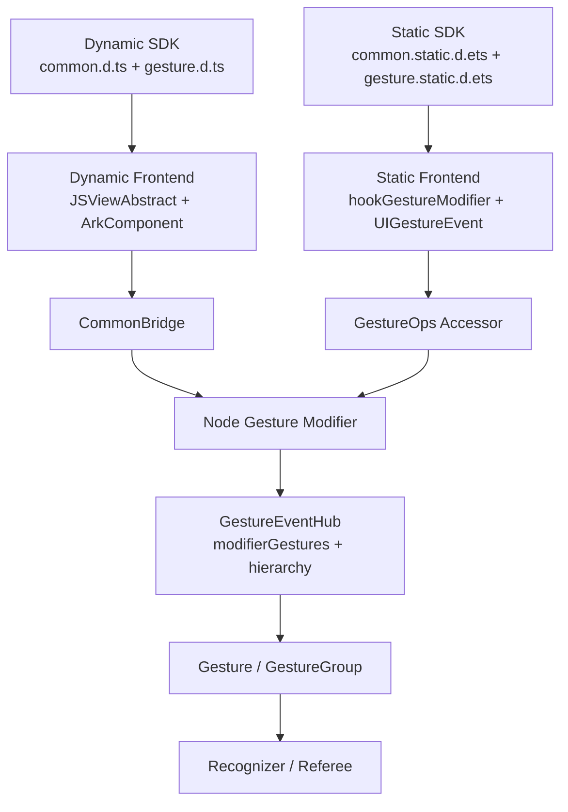
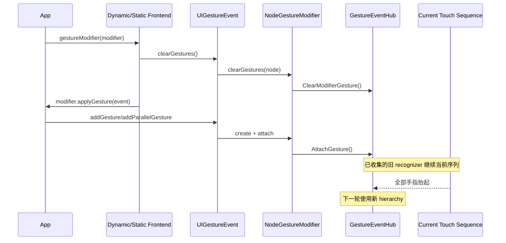
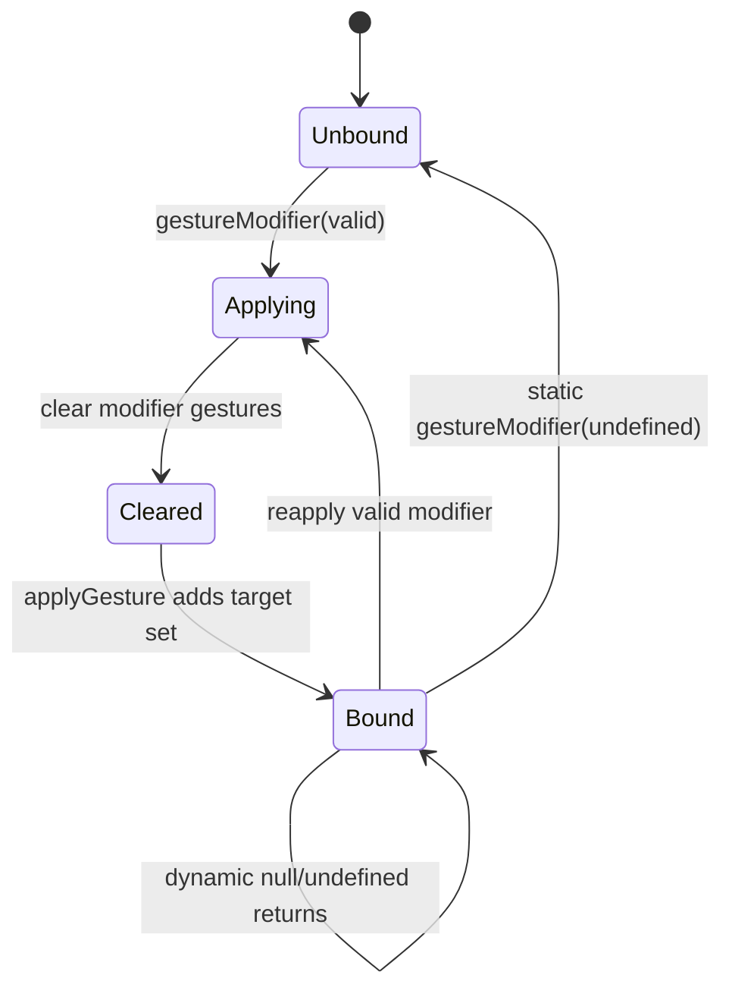
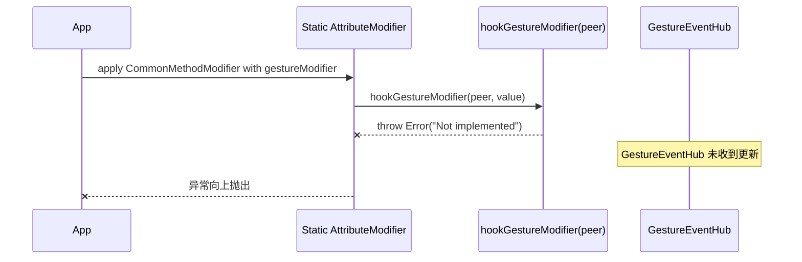

# 架构设计

> 确认 gestureModifier 已有实现的目标仓和模块、架构约束、关键设计决策及 Spec 拆分方向。

## 设计元数据

| 字段 | 内容 |
|------|------|
| Design ID | DESIGN-Func-04-05-07 |
| 关联需求 | 已有能力补录（无独立 requirement.md） |
| 关联 Epic | 无 |
| 目标 Feature | Feat-01 gestureModifier 动态手势配置 |
| 复杂度 | 复杂 |
| 目标版本 | API 12～23 |
| Owner | ArkUI SIG |
| 状态 | Baselined（已有实现补录） |

## 需求基线

> 该功能域记录已有能力；当前实现是规格基线，SDK 与源码偏差必须显式保留。

| 项 | 补充说明（如需） |
|----|------------------|
| 动态配置 | 应用通过 GestureModifier.applyGesture 按状态重建节点的 Modifier 手势集合 |
| 生命周期 | 活动触摸序列继续使用已收集 recognizer；配置切换从下一轮生效 |
| 管理能力 | 支持普通/高优先级/父子并行添加、按 tag 递归删除和全量清理 |
| Handler 范围 | 六类基础 Handler、GestureGroupHandler 及 API 12～23 参数演进 |
| 多前端 | 动态 API 12 与静态 API 23 分通道记录，不静默统一冲突契约 |
| Native 边界 | 公开 Native C API 仅覆盖 recognizer add/remove，不具备完整 tag/clear/allowedTypes 等价面 |

## 上下文和现状

### 涉及仓和模块

| 仓库 | 补充架构说明 |
|------|--------------|
| interface/sdk-js | `common.d.ts`/`gesture.d.ts` 定义动态 Public 契约；`*.static.d.ets` 定义静态契约 |
| ace_engine dynamic frontend | ArkComponent 保存 UIGestureEvent 与 Handler 列表，通过 CommonBridge 调用 Node Modifier |
| ace_engine static frontend | Koala handwritten hook 维护组件侧 UIGestureEvent，通过 GestureOps 调用 Native accessor |
| ace_engine NG core | GestureEventHub 持有 modifierGestures、备份和 recognizer hierarchy，负责 reconcile/recollect |
| ace_engine gesture | Gesture/Recognizer/Group 实现参数、tag、allowedTypes、优先级与组合行为 |
| ace_engine Native | `native_gesture.h` 提供公开 recognizer API；内部 `ArkUIGestureModifier` 支撑前端桥接 |

### 调用链层级分析

| 层 | 模块 | 职责 | 修改类型 |
|----|------|------|----------|
| Dynamic SDK | `interface/sdk-js/api/@internal/component/ets/common.d.ts`、`gesture.d.ts` | Public API、Handler 和版本契约 | 存量核验，无代码修改 |
| Static SDK | `interface/sdk-js/api/arkui/component/common.static.d.ets`、`gesture.static.d.ets` | 静态 API 23 类型契约 | 存量核验，无代码修改 |
| Dynamic 入口 | `js_view_abstract.cpp`、`ArkComponent.ts` | 调用全局 modifier 函数、维护 UIGestureEvent、clear/apply、Handler 分发 | 存量核验 |
| Dynamic Bridge | `arkts_native_common_bridge.cpp` | 解析 Handler 参数并调用 gesture node modifier | 存量核验 |
| Static 入口 | `koala.../src/hooks/index.ets`、`src/component/common.ets` | 静态 clear/apply、GestureOps 调用 | 存量核验；peer hook 风险 |
| Static Accessor | `frameworks/core/interfaces/native/implementation/gesture_ops_accessor.cpp` | 静态序列化操作落到内部 Modifier API | 存量核验 |
| Node Modifier | `frameworks/core/interfaces/native/node/node_gesture_modifier.cpp` | 创建 Gesture、设置 priority/mask、attach/remove/clear | 存量核验 |
| Gesture Core | `gesture_info.h`、`gesture_group.cpp`、recognizers | tag、SourceTool、组内递归、识别行为 | 存量核验 |
| EventHub | `gesture_event_hub.cpp` | Modifier Gesture 权威存储、hierarchy reconcile/recollect | 存量核验 |
| Public Native | `interfaces/native/native_gesture.h` | 对外 recognizer 创建和节点 add/remove | 能力边界核验 |
| Test | `test/unittest/core/event/`、`test/unittest/core/gestures/` | clear/remove/SourceTool 等现有回归 | 补录覆盖与缺口 |

### 适用架构规则

| Rule ID | 适用原因 | 设计结论 | 验证方式 |
|---------|----------|----------|----------|
| OH-ARCH-LAYERING | 涉及 SDK、双前端、bridge、node modifier、core | 保持 SDK → 前端 → Native bridge/accessor → GestureEventHub 单向调用 | 架构评审/依赖检查 |
| OH-ARCH-SUBSYSTEM | 动态和静态前端共享 NG Gesture Core | 两前端分别转换契约，不共享前端状态对象 | 多前端测试 |
| OH-ARCH-API-LEVEL | API 12～23 多阶段演进 | Public API 以 canonical SDK `@since` 为准 | API 评审/XTS |
| OH-ARCH-COMPONENT-BUILD | 仅规格补录 | BUILD.gn/bundle.json 无变更 | diff 检查 |
| OH-ARCH-ERROR-LOG | Public 接口返回 void/组件，无错误码 | 边界采用 no-op、默认回退或实现抛错，按实际路径记录 | 单测/源码检查 |

## 不涉及项承接

| 维度 | 设计结论 |
|------|----------|
| 产品代码 | 不修改；只新增规格、设计和注册元数据 |
| API/ABI | 不改变 Public/System/InnerAPI 签名、枚举、结构体或错误码 |
| 持久化 | 手势配置仅在前端对象和 GestureEventHub 内存中保存 |
| IPC/权限 | 不涉及跨进程、SA、权限申请或隐私数据 |
| UI 样式 | 不涉及布局、绘制、字体、主题或深色模式 |
| 性能指标 | 不新增无现有基线支持的固定耗时/内存数值 |

## 关键设计决策

| 决策 ID | 问题 | 推荐方案 | 探索过的替代方案 | 取舍理由 | 影响 |
|---------|------|----------|-----------------|----------|------|
| ADR-1 | Modifier 更新采用差量还是全量 | 每次有效 apply 先 clear 再执行 applyGesture 重建 | A. 按 Modifier identity 跳过；B. 对 Handler 做逐项 diff；C. 全量重建 | 当前动态/静态实现均为全量重放，规格必须反映实现 | applyGesture 需完整描述目标集合 |
| ADR-2 | 活动手势更新如何生效 | 当前触摸序列继续，下一轮使用新 hierarchy，clear 不主动 Cancel | A. 立即取消当前序列；B. 当前 recognizer 热替换；C. 下一轮生效 | SDK 明确下一轮生效，EventHub 当前序列已持有 recognizer 引用 | 避免中途切换导致回调断裂 |
| ADR-3 | Parallel 如何公开表达 | `addParallelGesture` 独立方法映射内部 Parallel priority | A. 给 GesturePriority 增加 Parallel；B. 使用 PRIORITY；C. 独立入口 | Public 枚举只有 NORMAL/PRIORITY，现有实现固定内部 Parallel | 文档不得虚构枚举成员 |
| ADR-4 | tag 删除匹配范围 | 删除全部同名顶层和任意嵌套组子项，不存在 tag 为 no-op | A. 只删首项；B. 只删顶层；C. 全量递归 | EventHub/Group 均无首项 break，并有递归实现 | 重复 tag 不是唯一键 |
| ADR-5 | 动态/静态冲突如何记录 | 分通道记录契约并列入兼容性风险 | A. 以动态覆盖静态；B. 以静态覆盖动态；C. 合并为共同子集 | 两套 canonical SDK 都是各自前端契约 | Pan 单位、fingers、distanceMap 不得静默归一 |
| ADR-6 | Native 是否视为完整等价入口 | 公开 C API 仅记录 recognizer add/remove；内部 ArkUIGestureModifier 不冒充 Public | A. 把内部函数写成 Public；B. 忽略 Native；C. 明确能力缺口 | `native_gesture.h` 未公开 tag/clear/allowedTypes 完整等价接口 | API 表标注“此代码在 ace_engine 中未找到” |
| ADR-7 | 静态 AttributeModifier peer hook 是否纳入支持 | 标为当前实现偏差/风险，不计入支持行为 | A. 假设生成代码可用；B. 忽略异常；C. 显式记录 | peer overload 直接抛 `Not implemented` 且无测试 | 后续变更需先补实现和回归 |

## 设计骨架

### 骨架范围

| 骨架项 | 目标 | 不包含 | 验证方式 |
|--------|------|--------|----------|
| Modifier 生命周期 | clear/apply、null/undefined、下一轮生效 | 产品代码修复 | 前端/EventHub 单测 |
| UIGestureEvent | add/addParallel/remove/clear | 普通 gesture()/priorityGesture() 详细规格 | Bridge/EventHub 单测 |
| Handler 家族 | 六类基础 Handler、Group、参数版本 | 基础 recognizer 完整算法 | SDK/参数映射测试 |
| 多前端兼容 | 动态 API 12～23、静态 API 23 | API 26 以后新增能力主体 | SDK diff/静态测试 |
| Native 边界 | Public 与内部接口区分 | 扩展 Native API | 头文件检查 |

### 骨架 Spec 拆分

| Task ID | 目标 | 受影响文件 | AC |
|---------|------|------------|-----|
| TASK-SKELETON-1 | 固化 Modifier 应用与更新生命周期 | Feat-01 spec、ArkComponent/hooks/EventHub 证据 | AC-1.1～AC-1.5 |
| TASK-SKELETON-2 | 固化添加、优先级、Mask 和 Group 映射 | Feat-01 spec、Bridge/Node Modifier 证据 | AC-2.1～AC-2.5 |
| TASK-SKELETON-3 | 固化 tag 删除、clear 和层级更新 | Feat-01 spec、EventHub/Group 证据 | AC-3.1～AC-3.5 |
| TASK-SKELETON-4 | 固化 API 12～23 Handler 演进 | Feat-01 spec、SDK 证据 | AC-4.1～AC-4.7 |
| TASK-SKELETON-5 | 固化多前端差异和 Native/静态风险 | Feat-01 spec、SDK/Native/Static 证据 | AC-5.1～AC-5.4 |

## 后续 Task 拆分

| Task ID | 目标 | 受影响文件 | 依赖 |
|---------|------|------------|------|
| TASK-1 | 生成并基线化 gestureModifier 全量规格 | `Feat-01-gesture-modifier-dynamic-configuration-spec.md` | 本 Design、SDK/源码审计 |

## API 签名、Kit 与权限

### 新增 API

> 下列为已有 API 的规格补录。“新增”表示加入本功能域设计基线，不表示新增产品接口。

| API 签名 | 类型 | Kit | d.ts 位置 | 权限要求 | SysCap |
|----------|------|-----|------------|----------|--------|
| `gestureModifier(modifier: GestureModifier): T` | Public dynamic API 12 | ArkUI | `common.d.ts:25203-25220` | 无 | ArkUI.Full |
| `gestureModifier(modifier: GestureModifier \| undefined): this` | Public static API 23 | ArkUI | `common.static.d.ets:14045-14054` | 无 | ArkUI.Full |
| `GestureModifier.applyGesture(event: UIGestureEvent): void` | Public API 12/23 static | ArkUI | `common.d.ts:30502-30528`；`common.static.d.ets:16609-16626` | 无 | ArkUI.Full |
| `UIGestureEvent.addGesture(handler, priority?, mask?): void` | Public API 12/23 static | ArkUI | `common.d.ts:30440-30458`；`common.static.d.ets:16561-16576` | 无 | ArkUI.Full |
| `UIGestureEvent.addParallelGesture(handler, mask?): void` | Public API 12/23 static | ArkUI | `common.d.ts:30460-30476`；`common.static.d.ets:16577-16590` | 无 | ArkUI.Full |
| `UIGestureEvent.removeGestureByTag(tag): void` | Public API 12/23 static | ArkUI | `common.d.ts:30478-30490`；`common.static.d.ets:16591-16600` | 无 | ArkUI.Full |
| `UIGestureEvent.clearGestures(): void` | Public API 12/23 static | ArkUI | `common.d.ts:30492-30499`；`common.static.d.ets:16601-16607` | 无 | ArkUI.Full |
| `GestureHandler.tag(tag): Handler` | Public API 12/23 static | ArkUI | `gesture.d.ts:2203-2225`；`gesture.static.d.ets:1522-1539` | 无 | ArkUI.Full |
| `GestureHandler.allowedTypes(types): Handler` | Public API 14/23 static | ArkUI | `gesture.d.ts:2226-2237`；`gesture.static.d.ets:1540-1549` | 无 | ArkUI.Full |
| 六类 `*GestureHandler`、`GestureGroupHandler` | Public API 12/23 static | ArkUI | `gesture.d.ts:2240-3102`；`gesture.static.d.ets:1551-2138` | 无 | ArkUI.Full |

### 变更/废弃 API

| 原有 API | 变更类型 | 新 API | 迁移说明 |
|----------|----------|--------|----------|
| Handler 基础集 | 变更（API 14） | `allowedTypes` | API 14+ 可限定 SourceTool |
| Handler Options | 变更（API 15） | `isFingerCountLimited` | API 15+ 可要求精确手指数 |
| 连续 Handler cancel | 变更（API 18） | `onActionCancel(Callback<GestureEvent>)` | 保留旧无事件重载 |
| Pan Handler | 变更（API 19） | `distanceMap` | 动态 API 19；静态 API 26 |
| LongPress Handler | 变更（API 22） | `allowableMovement` | 非正值采用默认处理 |
| Tap Handler | 变更（API 23） | `distanceThreshold` | 默认 Infinity |

## 构建系统影响

### BUILD.gn 变更

```text
无变更。本次仅新增 specs 文档与 registry 元数据。
```

### bundle.json 变更

无变更；不新增组件、依赖或 SysCap。

## 可选设计扩展

### 架构图



### 数据流/控制流

| 步骤 | 调用方 | 被调用方 | 数据/接口 | 说明 |
|------|--------|----------|-----------|------|
| 1 | 应用组件 | gestureModifier | GestureModifier/undefined | 动态不接受 undefined 契约；静态可清理 |
| 2 | 前端入口 | UIGestureEvent.clearGestures | node/peer | 有效 apply 前全清 |
| 3 | 前端入口 | GestureModifier.applyGesture | UIGestureEvent | 应用通过 if/else 描述目标集合 |
| 4 | applyGesture | add/addParallel/remove/clear | Handler/tag/mask/priority | 前端转换为 bridge/accessor 调用 |
| 5 | Node Modifier | GestureEventHub | Gesture 对象 | Attach/Remove/Clear Modifier 集合 |
| 6 | GestureEventHub | recognizer hierarchy | CreateRecognizer/ReconcileFrom | 可 reconcile 则复用，否则 recollect |
| 7 | 下一轮 TouchTest | 当前 hierarchy | recognizer 列表 | 活动旧序列不被 clear 主动取消 |

### 时序设计



### 数据模型设计

```typescript
interface GestureModifier {
  applyGesture(event: UIGestureEvent): void;
}

interface UIGestureEvent {
  addGesture(handler: GestureHandler, priority?: GesturePriority, mask?: GestureMask): void;
  addParallelGesture(handler: GestureHandler, mask?: GestureMask): void;
  removeGestureByTag(tag: string): void;
  clearGestures(): void;
}
```

| 存储位置 | 数据 | 生命周期 | 权威性 |
|----------|------|----------|--------|
| Dynamic ArkComponent | 每节点 UIGestureEvent、`_gestures` Handler 数组 | 节点创建至销毁回调 | 前端镜像 |
| Static CommonMethodComponent | UIGestureEvent 引用和 PeerNode | 组件实例生命周期 | 前端句柄 |
| GestureEventHub | modifierGestures、backupModifierGestures | FrameNode/EventHub 生命周期 | Gesture 配置权威存储 |
| GestureEventHub | modifierGestureHierarchy | 当前配置对应 recognizer 层级 | 识别层权威存储 |

### 算法与状态机



### 测试性设计

| 测试层级 | 测试目标 | Mock 策略 | 验证方式 |
|----------|----------|-----------|----------|
| SDK | 签名、@since、默认值、动态/静态差异 | 无 | 声明扫描 |
| Dynamic Frontend | clear/apply、null/undefined、本地列表同步 | Mock UINativeModule | TS/前端单测 |
| Static Frontend | component hook、undefined、peer hook 异常 | Mock GestureOps/PeerNode | ETS 单测 |
| NG Core | attach/clear/remove/reconcile | FrameNode/EventHub 测试夹具 | gtest |
| Gesture | Group tag 递归、SourceTool 过滤 | Gesture/Recognizer 测试夹具 | gtest |
| Native | Public C API 能力边界 | 头文件/接口测试 | C API 编译测试 |

### 异常传播时序图



| 异常场景 | 传播/处理 |
|----------|-----------|
| 动态 null/undefined | 入口 return，无错误码、无清理 |
| tag 不存在 | EventHub no-op，无错误码 |
| 未知 Handler 类型 | 前端跳过，不创建 Gesture |
| 静态 AttributeModifier peer hook | 抛 Not implemented，更新未到达 EventHub |
| 非允许 SourceTool | recognizer 吞掉 Touch/Axis，CANCEL 放行 |

### 资源所有权矩阵

| 资源 | 创建方 | 持有方 | 销毁触发 | 实际释放 | 异常回收 |
|------|--------|--------|----------|----------|----------|
| Dynamic UIGestureEvent | ArkComponent | `__mapOfModifier__` 对应组件 | FrameNode 销毁 | destructor callback 删除 map 条目 | weak node invalid 时操作 return |
| Static UIGestureEvent | hookGestureModifier | CommonMethodComponent | undefined/组件销毁 | setGestureEvent(undefined) 或组件释放 | peer 不存在时 GestureOps 不调用 |
| Gesture | Node Modifier | GestureEventHub lists | clear/remove/节点销毁 | RefPtr/引用计数 | attach 后按接口约定减引用 |
| Recognizer hierarchy | GestureEventHub | GestureEventHub/当前 touch result | recollect/节点销毁/触摸结束 | RefPtr | 当前序列持有引用直至结束 |

### 接口参数规约

| 接口 | 参数 | 类型 | 合法范围 | 非法处理 | 边界说明 |
|------|------|------|----------|----------|----------|
| gestureModifier | modifier | GestureModifier | 实现 applyGesture | 动态 null/undefined return；静态 undefined clear | 动态不支持 attributeModifier 内调用 |
| addGesture | priority | GesturePriority | NORMAL/PRIORITY | bridge/node modifier 默认回退 Normal/Low | Parallel 使用独立入口 |
| addGesture/addParallel | mask | GestureMask | Normal/IgnoreInternal | 非法值回退 Normal | 默认 Normal |
| removeGestureByTag | tag | string | 任意字符串 | 不存在 no-op | 空串只匹配显式空 tag |
| allowedTypes | types | SourceTool[] | SDK 枚举集合 | 0 位图按当前实现允许全部 | CANCEL 不过滤 |

### 线程与并发模型

| 操作 | 发起线程 | 回调线程 | 跨进程边界 | 线程安全 | 重入约束 |
|------|----------|----------|------------|----------|----------|
| gestureModifier/applyGesture | UI/ArkTS 执行线程 | 同步调用 | 无 | 依赖 UI 节点线程模型 | apply 中应构建完整集合，不递归再次设置自身 |
| add/remove/clear | UI/ArkTS 执行线程 | 同步 Native 调用 | 无 | GestureEventHub 在 UI 管线使用 | 当前序列 recognizer 不热替换 |
| Gesture callbacks | UI 输入处理线程 | 应用回调 | 无 | 沿用 Gesture 线程模型 | 回调不得长期阻塞输入处理 |

## 详细设计

### Modifier 应用与重置

动态 `JSViewAbstract::JsGestureModifier` 调用全局 `__gestureModifier__`（`frameworks/bridge/declarative_frontend/jsview/js_view_abstract.cpp:13164-13177`）。全局入口按 element id 复用 ArkComponent；有效 modifier 调用 `applyGesture` 前执行 `clearGestures`（`frameworks/bridge/declarative_frontend/ark_component/src/ArkComponent.ts:6652-6675`）。动态 null/undefined 在入口返回，不清理旧配置。

静态普通组件 hook 对 undefined 执行 clear 并清除 UIGestureEvent 引用；有效值复用/创建 event，先 clear 后 apply（`frameworks/bridge/arkts_frontend/koala_projects/arkoala-arkts/arkui-ohos/src/hooks/index.ets:182-201`）。

### 添加、优先级与 Mask

动态 UIGestureEvent 根据 `gestureType` 把六类 Handler 和 Group 转换为 Native 调用（`ArkComponent.ts:6479-6550`）。`addParallelGesture` 复用 addGesture，并传内部 Parallel priority（`ArkComponent.ts:6552-6554`）；静态实现固定传数值 2（`koala.../src/component/common.ets:66-72`）。Node Modifier 对 priority/mask 做范围校验并写入 Gesture，EventHub 创建 recognizer 时复制到 recognizer（`node_gesture_modifier.cpp:753-774`；`gesture_event_hub.cpp:728-733`）。

### tag 删除与层级更新

EventHub 遍历全部 modifierGestures：顶层 tag 命中即删除，组节点递归调用 `RemoveChildrenByTag`；列表发生变化时设置 needRecollect 并更新 hierarchy（`gesture_event_hub.cpp:1421-1440`）。组递归删除不在首个匹配停止（`gesture_group.cpp:143-157`）。不存在 tag 不改变集合；测试见 `gesture_event_hub_test_two_ng.cpp:122-140`，嵌套组测试见 `gesture_event_hub_test_ng_property_config.cpp:790-825`。

### Recognizer 层级复用

`UpdateModifierGestureHierarchy` 在列表数量一致且无需 recollect 时逐项创建临时 recognizer，并调用 `ReconcileFrom`；任一项失败则清空并重建全部 modifier hierarchy（`gesture_event_hub.cpp:675-700`）。TouchTest 已将当前 hierarchy 的 recognizer 引用复制到本轮结果（`gesture_event_hub.cpp:573-595`），因此后续 clear 不主动取消当前序列。

### Handler 和 SourceTool 演进

Handler 家族动态 API 12、静态 API 23；allowedTypes API 14、isFingerCountLimited API 15、带 GestureEvent 的 cancel API 18、动态 Pan distanceMap API 19、LongPress allowableMovement API 22、Tap distanceThreshold API 23。SourceTool 集合转换为位图，0 位图被 recognizer 视为允许全部；Touch/Axis 非允许来源被过滤，但 CANCEL 放行（`gesture_info.h:203-213`；`gesture_recognizer.cpp:93-135,216-229`）。

### 多前端与 Native 边界

动态前端额外维护 `_gestures` Handler 数组并与 Native 操作同步（`ArkComponent.ts:6462-6466,6479-6487,6555-6577`）；静态 UIGestureEvent 只保存 PeerNode 并直接调用 GestureOps（`koala.../src/component/common.ets:53-85`）。

公开 `native_gesture.h` 提供按 recognizer 的 add/remove（`interfaces/native/native_gesture.h:1153-1174`）。按 tag 删除、clear 和 allowedTypes 的完整公开 C API 等价接口：**此代码在 ace_engine 中未找到**。内部 `ArkUIGestureModifier` 的相关函数仅用于框架桥接（`frameworks/core/interfaces/arkoala/arkoala_api.h:5877-5880`）。

### 静态实现偏差

静态普通组件 overload 已实现 clear/apply，但生成的 CommonMethodModifier peer 路径调用的 overload 直接抛 `Not implemented`（`koala.../src/hooks/index.ets:178-201`；`generated/CommonMethodModifier.ets:2965-2979`）。当前未找到覆盖该 peer 路径的单元测试，故该路径作为风险而非支持行为。

## 风险和开放问题

| 项 | 类型 | 影响 | 处理方式 | Owner |
|----|------|------|----------|-------|
| 动态 null/undefined 与静态 undefined 清理语义不同 | API | 中 | 兼容表和双前端场景分别验证 | ArkUI SIG |
| 活动序列更新无主动 Cancel | 架构 | 中 | 明确下一轮生效并覆盖长按/拖动中的切换 | ArkUI SIG |
| 动态 Pan distance 单位与静态文档不一致 | API | 高 | 分通道记录，SDK 修订前不统一描述 | ArkUI SIG |
| Pinch/Rotation 静态默认 fingers 与动态不一致 | API | 高 | 分通道测试默认值，不静默合并 | ArkUI SIG |
| 静态 distanceMap 直到 API 26 才开放 | API | 中 | API 23 规格标为未开放，API 26 仅兼容注记 | ArkUI SIG |
| Public Native 缺少 tag/clear/allowedTypes 等价接口 | API | 中 | 明确 C API 未实现，不引用内部表为 Public | ArkUI SIG |
| 静态 AttributeModifier peer hook 抛 Not implemented | 架构 | 高 | 标为实现偏差；后续需实现与测试后才能基线支持 | ArkUI SIG |
| 静态嵌套 GestureGroupHandler 路径缺少专项测试 | 测试 | 中 | 增加嵌套 Group Handler 构建和 tag 删除回归 | ArkUI SIG |
| 现有 tag 删除测试未验证活动序列回调 | 测试 | 中 | 增加 hierarchy 与当前 recognizer 生命周期验证 | ArkUI SIG |

## 设计审批

- [x] 需求基线已确认，设计覆盖 P0/P1 AC
- [x] 不涉及项已承接，N/A 和展开项都有结论
- [x] 涉及仓和模块职责清楚
- [x] 调用链层级分析完整，每层覆盖到位
- [x] 适用架构规则已识别并形成设计结论
- [x] 分层和子系统边界合规
- [x] API 变更有签名、权限、错误码和兼容性说明
- [x] BUILD.gn/bundle.json 影响明确
- [x] 设计输出和后续 Task 拆分明确
- [x] 关键设计决策有理由和影响说明
- [x] 风险和开放问题有 Owner

**结论:** 通过（已有实现补录）。
