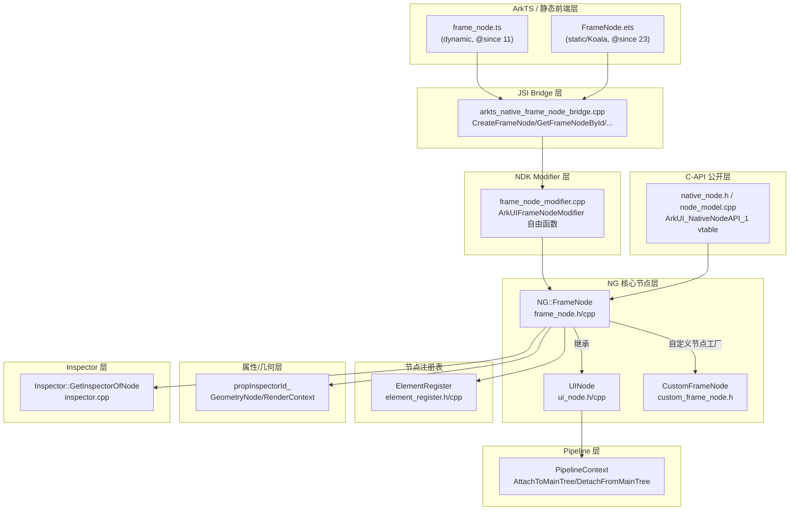

# 架构设计

> 确认目标仓和模块的架构约束、关键设计决策、Spec 拆分方向。本设计为 FrameNode 功能域（04-06-02）的共享基线，由全部 8 个 Feat 复用。

## 设计元数据

| Field | Content |
|-------|---------|
| Design ID | `DESIGN-Func-04-06-02` |
| 关联需求 | 已有能力补录（无独立 requirement.md） |
| 关联 Epic | 自定义节点能力 / FrameNode |
| 目标 Feature | Feat-01 节点创建、身份与内省；Feat-02 树结构与挂载管理；Feat-03 布局与度量；Feat-04 坐标转换与位置查询；Feat-05 渲染上下文与视觉状态；Feat-06 事件交互与 UIState；Feat-07 节点动画；Feat-08 生命周期、回收与跨语言（全部 8 Feat 已 Baselined） |
| 复杂度 | 复杂 |
| 目标版本 | API 11 — API 26.0.0（动态起始于 11，静态起始于 23） |
| Owner | ArkUI SIG |
| 状态 | Baselined（已有实现补录） |

## 需求基线

> 需求基线详见 proposal.md（本功能域为存量补录，无独立 requirement）。以下仅列出设计阶段需强调的要点。

| 项 | 补充说明 |
|----|----------|
| 实现即规格 | FrameNode 已在 ace_engine 实现，本设计固化为长期规格；存疑行为仅标注风险，不提议修复 |
| FuncID 边界 | 04-06-02 仅覆盖 FrameNode 类本身；typeNode 工厂+TypedFrameNode 接口属 04-06-07，NodeAdapter 属 04-06-06，BuilderNode 属 04-06-04 |
| 双形式 | 动态(.d.ts) @since 11+ 与静态(.static.d.ets) @since 23+ 并行，签名差异需在规格体现 |

## 上下文和现状

### 涉及仓和模块

| 仓库 | 补充架构说明 |
|------|-------------|
| openharmony/arkui_ace_engine | FrameNode 核心实现仓：NG 引擎层（frame_node/ui_node）、Bridge 层（ark_node + JSI）、C-API Modifier 层、Kit 层 |
| openharmony/interface_sdk_js | SDK 类型定义仓：FrameNode.d.ts（动态）/ FrameNode.static.d.ets（静态）为公开契约源头 |
| openharmony/arkui_ace_engine (interfaces/inner_api/ace_kit) | Kit 公开 C++ 接口（Kit::FrameNode，布局/度量子集，与 ArkTS FrameNode API 不同） |

### 调用链层级分析

| 层 | 模块 | 职责 | 修改类型 |
|----|------|------|----------|
| L1 ArkTS 运行时 | `frameworks/bridge/declarative_frontend/ark_node/src/frame_node.ts` | ArkTS FrameNode 类：构造分发、状态守卫、引用持有、isDisposed/isTransferred/isMinimized 桩 | 补录（无修改） |
| L1' 静态前端 | `frameworks/bridge/arkts_frontend/koala_projects/arkoala-arkts/arkui-preprocessed/arkui/FrameNode.ets` | Koala 静态前端 FrameNode（含 isMinimized/isTransferred 桩） | 补录 |
| L2 JSI Bridge | `frameworks/bridge/declarative_frontend/engine/jsi/nativeModule/arkts_native_frame_node_bridge.cpp` | CreateFrameNode/CreateFrameNodes/GetFrameNodeById/GetId/GetInspectorInfo/GetCustomProperty 等 JSI 桥接 | 补录 |
| L3 NDK Modifier | `frameworks/core/interfaces/native/node/frame_node_modifier.cpp` | ArkUIFrameNodeModifier 自由函数：GetInspectorId/GetIdByNodePtr/GetNodeType/IsModifiable/IsOnMainTree/GetCustomPropertyCapiByKey | 补录 |
| L4 C-API 公开 | `interfaces/native/native_node.h`、`interfaces/native/node/node_model.cpp` | ArkUI_NodeHandle / ArkUI_NativeNodeAPI_1 vtable：createNode/disposeNode 等（NDK 通道） | 补录 |
| L5 Kit(C++ 公开) | `interfaces/inner_api/ace_kit/include/ui/view/frame_node.h`、`.../frame_node_impl.cpp` | Kit::FrameNode 抽象（布局/度量子集，**非** Feat-01 ArkTS API 的 C++ 后端） | 补录（边界澄清） |
| L6 NG 核心节点 | `frameworks/core/components_ng/base/frame_node.h`、`frame_node.cpp`、`ui_node.h`、`ui_node.cpp` | NG::FrameNode : UINode + LayoutWrapper；构造/析构/工厂/树原语/身份/内省 | 补录 |
| L6' 自定义节点 | `frameworks/core/components_ng/pattern/custom_frame_node/custom_frame_node.h` | CustomFrameNode::GetOrCreateCustomFrameNode（用户自定义节点 tag="CustomFrameNode"） | 补录 |
| L7 节点注册表 | `frameworks/core/pipeline/base/element_register.h`、`element_register.cpp` | ElementRegister：MakeUniqueId()（elementId 分配）、itemMap_（全局 int-id→RefPtr） | 补录 |
| L8 属性/几何层 | `frameworks/core/components_ng/property/property.h`、`layout/layout_property.h`、`base/geometry_node.h`、`render/render_context.h` | Property/GeometryNode/RenderContext：节点身份相关存储（propInspectorId_、nodeId_） | 补录 |
| L9 Pipeline | `frameworks/core/pipeline_ng/pipeline_context.h`、`ui_task_scheduler.h` | 主树挂载（AttachToMainTree/DetachFromMainTree）、任务调度 | 补录 |
| L10 Inspector | `frameworks/core/components_ng/base/inspector.cpp` | Inspector::GetInspectorOfNode / GetInspectorChildren（getInspectorInfo JSON 生成） | 补录 |

> 检查项：[x] 每层已覆盖 [x] 职责边界清晰（Kit 层与 ArkTS API 层为不同通道，需澄清） [x] 修改类型为补录（无代码变更）

### 适用架构规则

| Rule ID | 适用原因 | 设计结论 | 验证方式 |
|---------|----------|----------|----------|
| OH-ARCH-LAYERING | ArkTS→JSI→Modifier→NG Core 多层调用 | 调用方向自上而下单向，禁止 NG Core 反向调用 ArkTS；反向通知走回调 | 架构评审/依赖检查 |
| OH-ARCH-SUBSYSTEM | 跨 ace_engine 与 interface_sdk_js | ace_engine 不得反向依赖具体应用；SDK 契约为公开 API 权威 | API 评审 |
| OH-ARCH-API-LEVEL | 16 个 Public API 跨 API11-26 | 全部 Public 开放范围，SysCap=SystemCapability.ArkUI.ArkUI.Full；版本演进见兼容性声明 | API 评审/XTS |
| OH-ARCH-COMPONENT-BUILD | 无 BUILD.gn/bundle.json 变更（存量补录） | 无新增依赖 | 构建验证 |
| OH-ARCH-ERROR-LOG | 100026/100021/401 错误码 | 100026 为 ArkTS 前端守卫（非引擎抛出）；100021/401 为标准参数守卫 | 单测 |

## 不涉及项承接

| 维度 | 设计结论 |
|------|----------|
| 公开 API 签名变更 | 不涉及（存量补录，签名固化为规格） |
| BUILD.gn/bundle.json | 不涉及（无代码变更） |
| 跨子系统新增依赖 | 不涉及 |
| C-API(NativeNodeAPI) 全集 | 本设计仅涉及 Feat-01 相关 createNode/disposeNode/lookup；完整 C-API 由其他 Feat/功能域覆盖 |
| Kit::FrameNode 公开接口 | 边界澄清：Kit 层为布局/度量子集，**非** Feat-01 ArkTS API 后端；二者独立 |
| typeNode/TypedFrameNode/NodeAdapter/BuilderNode | 不涉及（属 04-06-07/04-06-06/04-06-04） |

## 关键设计决策

| 决策 ID | 问题 | 推荐方案 | 探索过的替代方案 | 取舍理由 | 影响 |
|---------|------|----------|------------------|----------|------|
| ADR-1 | 节点身份如何对外暴露三种维度 | getId() 返回 inspector id 字符串（propInspectorId_，默认""）、getUniqueId() 返回 elementId 整数、getNodeType() 返回 tag 字符串——三元组语义分离 | (a) 统一返回结构体 (b) getId 返回 tag | 三者语义不同且各有用途；统一结构体增加跨语言开销；tag 已由 getNodeType 承载。现状为历史演进结果，固化为规格 | AC-4.1..4.4；下游不得混淆 |
| ADR-2 | 可改性判定标准 | 双判据：native 层 GetTag()=="CustomFrameNode"、ArkTS 层 _nativeRef 非空；二者皆真才可改。框架树节点取回为不可改 ProxyFrameNode（弱引用） | (a) 单纯强引用判据 (b) 全局可改 | 双判据防止用户修改框架构建的节点子树（破坏树一致性）；ProxyFrameNode 弱引用避免持有已移除节点 | AC-5.1..5.4；受限 API 抛 100021 |
| ADR-3 | getFrameNodeById/ByUniqueId 查找范围 | 实例方法、子树 BFS（含 this），非全局。全局 int-id 查找仅在 C-API 层独立实现 | (a) 全局查找 (b) 仅子树不含 this | 子树范围避免误跨 UIContext；全局查找有 C-API 通道满足 NDK 需求 | AC-3.1..3.6 |
| ADR-4 | dispose 与 disposeTree 语义分离 | dispose() 幂等、释放 JS 引用、不脱离父节点（引擎 RefPtr 可能存活）；disposeTree() 脱离父 + DFS 递归释放子树 | (a) dispose 即脱离父 (b) 统一 dispose 递归 | 分离允许"释放引用但保留树位置"的中间态（过渡动画场景）；disposeTree 满足整树回收。SDK NOTE 警告 dispose 后查询崩溃 | AC-7.1..7.5 |
| ADR-5 | isTransferred/isMinimized 未实现的处置 | 固化为恒 false 桩，标注为风险项（实现 IS 规格）。isTransferred 真实逻辑在 ComponentContent/trans_frame_node；isMinimized 无 C++ 状态机 | (a) 延迟到实现后补录 (b) 删除 API 声明 | API 已在 SDK 声明，下游已可能依赖；固化为规格明确当前行为，风险表标注供后续决策 | AC-6.4,6.5；风险项 |
| ADR-6 | 100026 错误码归属 | 仅 ArkTS 层 isDisposed 守卫抛出；C++ 对 disposed 节点返回安全默认值(false/""/-1) | (a) C++ 引擎抛出 (b) 不抛错直接返回默认 | 前端守卫集中可维护；C++ 防御性默认避免引擎层崩溃；isOnMainTree 仍需明确错误信号 | AC-6.3；接口规格错误码 |
| ADR-7 | getCustomProperty 两层存储 | ArkTS __getCustomProperty__（带 COMMON_VIEW 父节点间接寻址）优先，native GetCapiCustomProperty(customPropertyMap_) fallback；C-API 值恒字符串 | (a) 单层 native 存储 (b) 单层 ArkTS 存储 | 两层支持 ArkTS 装饰器属性与 C-API 属性共存；COMMON_VIEW 间接寻址支持自定义组件渲染型节点；非字符串对象仅存 ArkTS 侧 | AC-9.1..9.4 |
| ADR-F2-1 | 跨树 adopt 与常规树操作的关系 | adoptedChildren_ 与 children_ 分离；已 adopt 节点拒绝常规 appendChild/insertChildAfter/moveTo（106206→100025/100027）；moveTo 源类型白名单(Stack/XComponent/EmbeddedComponent) | (a) 统一子列表 (b) 仅常规树 | 分离链表支持混合挂载（RenderNode adopt 至 FrameNode）；白名单限制避免破坏不可移动组件树 | Feat-02 AC-1.3,7.1,6.4 |
| ADR-F3-1 | 度量结果单位与直接写入语义 | getMeasuredSize/getLayoutPosition 直读 px；位置查询走 modifier VP 转换返 vp；setMeasuredSize/setLayoutPosition 直接写 geometry 无 dirty，须另触发方可见 | (a) 统一 vp (b) 统一 px | geometry 层物理 px 与 API 层 vp 分离历史演进；直接写入无 dirty 允许批量设置后统一触发 | Feat-03 AC-3.3,4 |
| ADR-F4-1 | 含变换位置查询与跨节点转换约束 | WithTransform 应用 GetPointTransformRotate 链；convertPosition 须 FindSameParentComponent 共同祖先；convertPositionTo/FromWindow 须 IsOnMainTree | (a) 全局变换统一 (b) 无变换 | 矩阵链精确反映图形变换；共同祖先约束避免跨树误转；主树前置保证窗口坐标有效 | Feat-04 AC-2,4,5 |
| ADR-F5-1 | isAttached 与 isOnMainTree 的语义错位 | isAttached 实际调用 isVisible 父链检查（行为等同 isVisible）；主树语义由 isOnMainTree 承载；bridge 函数名与 modifier 调用名互换 | (a) 修正命名 (b) 固化现状 | 历史命名已发布，修正破坏兼容；固化为规格+风险标注，下游须用 isOnMainTree 查主树 | Feat-05 AC-3.1 |
| ADR-F6-1 | UIState 位掩码与 excludeInner 优先级 | UIState 为 bit flags(NORMAL=0 不可注册)；addSupportedUIStates 注册 userStateStyleSubscribers；excludeInner=true 抑制内部组件该状态处理 | (a) 枚举非位掩码 (b) 无 excludeInner | 位掩码支持组合；excludeInner 允许外层 handler 胜出避免内部重复处理 | Feat-06 AC-3.1,3.3 |
| ADR-F7-1 | 动画属性 ROTATION 方向与 size 校验 | ROTATION X/Y 在 RS 侧取负（arkui/RS 角度方向相反）；getNodePropertyValue 返 [-angleX,-angleY,angleZ]；size 不匹配 RS 侧静默跳过 | (a) 不取负 (b) 抛错 | 取负对齐 RS 角度系；静默跳过避免动画中断 | Feat-07 AC-1.2,3.1 |
| ADR-F8-1 | recycle/reuse 非池管理与跨语言 tag 白名单 | recycle/reuse 仅触发 OnRecycle/OnReuse 回调（不移入回收池）；setCrossLanguageOptions attributeSetting=true 须 tag 在白名单（CustomFrameNode 抛 100022）；treeOperating 门控仅 C 节点+ENABLE | (a) recycle 入池 (b) 全 tag 允许 | 池管理由 LazyForEach/Repeat 框架负责避免重复；白名单限制跨语言至内置组件 | Feat-08 AC-1.3,2.4,4.3 |

## 设计骨架

### 骨架范围

| 骨架项 | 目标 | 不包含 | 验证方式 |
|--------|------|--------|----------|
| FrameNode 功能域基线 | 固化 FrameNode 类的核心架构与 8 Feat 拆分方向 | typeNode/TypedFrameNode/NodeAdapter/BuilderNode | 架构评审 + index.md 生成 |
| 调用链 10 层 | 自 ArkTS 至 Inspector 全链路覆盖 | 非本功能域的组件 Pattern 细节 | 依赖检查 |

### 骨架 Spec 拆分

| Task ID | 目标 | 受影响文件 | AC |
|---------|------|----------|----|
| TASK-SKELETON-1 | 注册 04-06-02 + 8 Feat + 生成 design.md 基线 | registry/functions.yaml, registry/features.yaml, index.md, design.md | — |
| TASK-SKELETON-2 | Feat-01 规格生成 | Feat-01-node-creation-identity-introspection-spec.md | AC-1.1..9.4 |

## 后续 Task 拆分

| Task ID | 目标 | 受影响文件 | 依赖 |
|---------|------|----------|------|
| TASK-01 | Feat-01 节点创建、身份与内省规格 | `04-common-capability/06-custom-node/02-frame-node/Feat-01-node-creation-identity-introspection-spec.md` | 基线 |
| TASK-02 | Feat-02 树结构与挂载管理规格 | `04-common-capability/06-custom-node/02-frame-node/Feat-02-tree-structure-mounting-spec.md` | 基线 |
| TASK-03 | Feat-03 布局与度量规格 | `04-common-capability/06-custom-node/02-frame-node/Feat-03-layout-measurement-spec.md` | 基线 |
| TASK-04 | Feat-04 坐标转换与位置查询规格 | `04-common-capability/06-custom-node/02-frame-node/Feat-04-position-coordinate-conversion-spec.md` | 基线 |
| TASK-05 | Feat-05 渲染上下文与视觉状态规格 | `04-common-capability/06-custom-node/02-frame-node/Feat-05-render-context-visual-state-spec.md` | 基线 |
| TASK-06 | Feat-06 事件交互与 UIState 规格 | `04-common-capability/06-custom-node/02-frame-node/Feat-06-event-interaction-ui-state-spec.md` | 基线 |
| TASK-07 | Feat-07 节点动画规格 | `04-common-capability/06-custom-node/02-frame-node/Feat-07-node-animation-spec.md` | 基线 |
| TASK-08 | Feat-08 生命周期、回收与跨语言规格 | `04-common-capability/06-custom-node/02-frame-node/Feat-08-lifecycle-recycle-cross-language-spec.md` | 基线 |

## API 签名、Kit 与权限

### 新增 API

> 全部为存量 Public API 补录，无新增签名。下表列 Feat-01 范围 API 的契约位置。

| API 签名 | 类型 | Kit | d.ts 位置 | 权限要求 | SysCap |
|----------|------|-----|----------|----------|--------|
| `constructor(uiContext: UIContext)` (dyn) / `constructor(uiContext, options?: FrameNodeOptions)` (static) | Public | — | FrameNode.d.ts:460 / FrameNode.static.d.ets:402 | 无 | SystemCapability.ArkUI.ArkUI.Full |
| `static createFrameNodes(uiContext, count): FrameNode[]` | Public | — | FrameNode.d.ts:1644 / FrameNode.static.d.ets:1256 | 无 | 同上 |
| `getFrameNodeById(id: string): FrameNode\|null` | Public | — | FrameNode.d.ts:1661 / FrameNode.static.d.ets:1267 | 无 | 同上 |
| `getFrameNodeByUniqueId(id: int): FrameNode\|null` | Public | — | FrameNode.d.ts:1678 / FrameNode.static.d.ets:1286 | 无 | 同上 |
| `getId(): string` | Public | — | FrameNode.d.ts:862 / FrameNode.static.d.ets:719 | 无 | 同上 |
| `getUniqueId(): number\|int` | Public | — | FrameNode.d.ts:874 / FrameNode.static.d.ets:729 | 无 | 同上 |
| `getNodeType(): string` | Public | — | FrameNode.d.ts:888 / FrameNode.static.d.ets:740 | 无 | 同上 |
| `isModifiable(): boolean` | Public | — | FrameNode.d.ts:494 / FrameNode.static.d.ets:423 | 无 | 同上 |
| `isDisposed(): boolean` | Public | — | FrameNode.d.ts:960 / FrameNode.static.d.ets:639 | 无 | 同上 |
| `isTransferred(): boolean` | Public | — | FrameNode.d.ts:1500 / FrameNode.static.d.ets:1174 | 无 | 同上 |
| `isOnMainTree(): boolean` (throws 100026) | Public | — | FrameNode.d.ts:1629 / FrameNode.static.d.ets:1243 | 无 | 同上 |
| `isMinimized(): boolean` (staticonly) | Public | — | FrameNode.static.d.ets:1311（无动态） | 无 | 同上 |
| `dispose(): void` | Public | — | FrameNode.d.ts:751 / FrameNode.static.d.ets:619 | 无 | 同上 |
| `disposeTree(): void` | Public | — | FrameNode.d.ts:1255 / FrameNode.static.d.ets:988 | 无 | 同上 |
| `getInspectorInfo(): Object` | Public | — | FrameNode.d.ts:978 / FrameNode.static.d.ets:790 | 无 | 同上 |
| `getCustomProperty(name: string): Object\|undefined / CustomProperty` | Public | — | FrameNode.d.ts:991 / FrameNode.static.d.ets:801 | 无 | 同上 |

### 变更/废弃 API

无。全部为存量补录，无变更或废弃。

## 构建系统影响

### BUILD.gn 变更

```
无变更（存量补录，未新增/修改源码）
```

### bundle.json 变更

无新增 component，无依赖关系修改。

## 可选设计扩展

### 架构图



> 注：Kit::FrameNode（interfaces/inner_api/ace_kit）为独立的布局/度量公开 C++ 接口通道，经 FrameNodeImpl 包装 NG::FrameNode，**非** ArkTS FrameNode API 的后端，图中未画以避免混淆。

### 数据流/控制流

| 步骤 | 调用方 | 被调用方 | 数据/接口 | 说明 |
|------|--------|----------|-----------|------|
| 1 | ArkTS frame_node.ts | JSI bridge | createFrameNode(this) | 构造分发 |
| 2 | JSI bridge | ElementRegister | MakeUniqueId() | 分配 elementId（单调递增） |
| 3 | JSI bridge | CustomFrameNode | GetOrCreateCustomFrameNode(nodeId) | 创建 NG::FrameNode，tag="CustomFrameNode" |
| 4 | JSI bridge | frame_node.ts | {nodeId, nativeStrongRef, rawPtr_} | 返回强引用 |
| 5 | frame_node.ts | ElementIdToOwningFrameNode_ | set(nodeId, WeakRef(this)) | 注册归属 |
| 6 | getFrameNodeById | UINode | GetFrameNodeByIdInSubTree(id) | BFS 子树匹配 propInspectorId_ |
| 7 | getInspectorInfo | frame_node_modifier | GetInspectorInfo(node) | 取 JSON |
| 8 | frame_node_modifier | Inspector | GetInspectorOfNode | 生成结构 JSON |
| 9 | getCustomProperty | frame_node.ts | __getCustomProperty__(nodeId, key) | ArkTS 层优先（带 COMMON_VIEW 间接寻址） |
| 10 | getCustomProperty fallback | frame_node_modifier | GetCapiCustomProperty(node, key) | native fallback customPropertyMap_ |

### 数据模型设计

**ArkTS 层类型（API 契约）:**
```typescript
class FrameNode {
  private _nodeId: number;        // elementId，-1 表示未关联实体
  private _isDisposed: boolean;   // ArkTS 层释放标志
  private _nativeRef: NativeStrongRef | null;  // 强引用持有 RefPtr<FrameNode>
  private nodePtr_: number | null; // 原生指针
  // dispose 后 _isDisposed=true 且 nodePtr_=null
}
interface FrameNodeOptions { supportMultiThread?: boolean; }  // staticonly @since 26.0.0
```

**C++ 层存储（NG::FrameNode / UINode）:**
```cpp
// UINode（基类，frame_node.h 继承）
int32_t nodeId_;                       // = elementId（来自 ElementRegister::MakeUniqueId）
std::optional<std::string> propInspectorId_;  // 用户 .id() 设置值，getId() 读此
bool onMainTree_ = false;              // isOnMainTree() 读此
// FrameNode 自有
std::unordered_map<string, vector<string>> customPropertyMap_;  // key→[value, flag]
std::unordered_map<string, void*> extraCustomPropertyMap_;      // 指针存储（如 ToJsonValue fn）
std::function<void()> removeCustomProperties_;
```

| 存储项 | 位置 | 关联 API | 说明 |
|--------|------|----------|------|
| nodeId_ | UINode | getUniqueId | 进程全局单调递增，稳定于节点生命周期 |
| propInspectorId_ | UINode | getId / getFrameNodeById | 用户字符串，默认未设置(getId 返回"") |
| onMainTree_ | UINode | isOnMainTree | AttachToMainTree 置 true，Detach 置 false |
| customPropertyMap_ | FrameNode | getCustomProperty | C-API 层存储，值恒字符串，flag"1"=已缓存"0"=需重取 |
| _isDisposed / _nativeRef | ArkTS frame_node.ts | isDisposed / isModifiable | 前端层状态，无 C++ 专用标志 |

### 测试性设计

| 测试层级 | 测试目标 | Mock 策略 | 验证方式 |
|----------|----------|-----------|----------|
| Host 单测 | 构造/身份/内省 API 行为 | Mock UIContext/PipelineContext | `test/unittest/core/base/frame_node_test_ng*.cpp` |
| Host 单测 | isDisposed/isOnMainTree 守卫 | 构造 disposed 节点 | frame_node_test_ng，断言 100026 |
| Host 单测 | getInspectorInfo JSON | Mock Inspector | `frame_node_test_ng_dump.cpp` |
| C-API 单测 | getCustomProperty 两层 | C-API set/get | `capi_all_accessors_test` |

### 资源所有权矩阵

| 资源 | 创建方 | 持有方 | 销毁触发 | 实际释放 | 异常回收 |
|------|--------|--------|----------|----------|----------|
| NG::FrameNode (RefPtr) | CustomFrameNode::GetOrCreateCustomFrameNode | ArkTS NativeStrongRef + 父节点子列表 | dispose() 释放 NativeStrongRef | RefPtr 引用计数归零→~FrameNode | 父节点仍持有则引擎侧存活 |
| ElementIdToOwningFrameNode_ 注册项 | 构造时 | frame_node.ts Map | dispose() | Map.delete | dispose 幂等保证 |
| customPropertyMap_ | AddCustomProperty | FrameNode | ~FrameNode | removeCustomProperties_() | 析构统一清理 |
| getInspectorInfo char* | bridge GetCustomPropertyCapiByKey | bridge 局部 | 调用后立即 | FreeCustomPropertyCharPtr delete[] | 桥接函数内释放 |

## 详细设计

### 节点构造与工厂创建

构造分发逻辑（`frame_node.ts:115` constructor）：
```
new FrameNode(uiContext, type?, options?, nativePointer?):
  if uiContext invalid: throw BusinessError(401)
  dispatch by type:
    'BuilderRootFrameNode' -> only RenderNode, early return
    'ProxyFrameNode'/'InternalBatchFrameNode' -> early return (caller fills)
    undefined/'CustomFrameNode' & no nativePointer:
      getUINativeModule().frameNode.createFrameNode(this)  // JSI bridge :292
    with nativePointer: createTransFrameNode(this)         // wrap existing
    other type (e.g. 'Text'): createTypedFrameNode(this, type, options)  // -> 04-06-07
  sync instanceId_ via __JSScopeUtil__
  result = {nodeId, nativeStrongRef, rawPtr_}
  if result invalid (nodeId==-1): early return (half-init, no finalizer)
  _nativeRef = result.nativeStrongRef
  _nodeId = result.nodeId
  register ElementIdToOwningFrameNode_.set(nodeId, WeakRef(this))
```

C++ 侧 CreateFrameNode（`arkts_native_frame_node_bridge.cpp:292`）：
```
nodeId = ElementRegister::MakeUniqueId()  // nextUniqueElementId_++ (element_register.cpp:181)
node = CustomFrameNode::GetOrCreateCustomFrameNode(nodeId)  // tag="CustomFrameNode", pattern=CustomFrameNodePattern
node->SetExclusiveEventForChild(true)
node->SetIsArkTsFrameNode(true)
node->renderContext->SetNeedDebugBoundary(true)
// reads onMeasure/onLayout from JS object -> ExtensionCustomNode
return {nodeId, nativeStrongRef, rawPtr_}
```

批量创建（`arkts_native_frame_node_bridge.cpp:703` CreateFrameNodes）：循环 N 次，每次与单次相同路径，无池化。count<=0 返回[]，非整数抛 401。

### 节点身份三元组

| API | native 读取路径 | 返回 | 默认值 |
|-----|----------------|------|--------|
| getId() | frame_node_modifier.cpp:563 GetInspectorId → currentNode->GetInspectorId() (propInspectorId_) | string | "" |
| getUniqueId() | frame_node_modifier.cpp:434 GetIdByNodePtr → currentNode->GetId() (nodeId_) | number/int | -1 |
| getNodeType() | frame_node_modifier.cpp:577 GetNodeType → currentNode->GetTag() | string | "" |

### 可改性双判据

- ArkTS 层（`frame_node.ts:353`）：`isModifiable()` = `_nativeRef !== undefined && _nativeRef !== null`；ImmutableFrameNode override 返回 false
- native 层（`frame_node_modifier.cpp:66`）：`IsModifiable(node)` = `frameNode->GetTag() == "CustomFrameNode"`
- checkType() 守卫（`frame_node.ts:350`）：isModifiable() false 时抛 100021

### 子树查找

`UINode::GetFrameNodeByIdInSubTree(id)`（`ui_node.cpp:2027`）：
```
if id empty: return nullptr
BFS subtree (include this):
  match FrameNode where propInspectorId_ == id
  return first match
return nullptr
```
`GetFrameNodeByUniqueIdInSubTree(uid)`（`ui_node.cpp:2039`）：uid<0 → nullptr；BFS 匹配 GetId()==uid。
命中后 `convertToFrameNode`（`frame_node.ts:372`）：若 ArkTS 已拥有该 nodeId 则返回；若 native 不可改则 ProxyFrameNode 弱引用；否则 null。

### dispose / disposeTree

dispose（`frame_node.ts:241`，幂等）：
```
if isDisposed(): return
_isDisposed = true
if nodePtr_: fire lifecycle callback; renderNode_?.dispose()
ElementIdToOwningFrameNode_.delete(nodeId)
_nodeId = -1; _nativeRef = null; nodePtr_ = null
// NOT call native destroy; C++ RefPtr refcount releases later
// NOT remove from parent's child list
```
disposeTree（`frame_node.ts:273`）：先脱离父（父 NodeContainer→clean，否则 removeChild）；再 `disposeTreeRecursively(this)` DFS（firstChildWithoutExpand + nextSiblingWithoutExpand 链）后 dispose 自身。
TypedFrameNode.dispose（`:1292`）：额外 `_nativeRef?.dispose()` 显式释放。
C++ ~FrameNode（`frame_node.cpp:786`）：fire destroyCallbacks、removeCustomProperties_、pattern_->DetachFromFrameNode、若 IsOnMainTree 则 OnDetachFromMainTree、CleanupPipelineResources、FireOnNodeDestroyCallback。

### 自定义属性两层存储

getCustomProperty（`frame_node.ts:770`）：
```
if name === undefined: return undefined
effectiveNodeId = this._nodeId
commonViewParentId = getCommonViewParentId(nodePtr)  // COMMON_VIEW 父间接寻址
if commonViewParentId valid: effectiveNodeId = commonViewParentId
val = __getCustomProperty__(effectiveNodeId, name)  // ArkTS 装饰器属性
if val !== undefined: return val
// fallback native
return getCustomPropertyCapiByKey(nodePtr, name)  // frame_node_modifier.cpp:898
```
native GetCapiCustomProperty（`frame_node.cpp:8403`）：`customPropertyMap_.find(key)`，命中返回 value[0]，否则 false。值作为 char* 拷贝，调用后 FreeCustomPropertyCharPtr 释放。

### 树结构与混合挂载（Feat-02）

树原语位于基类 UINode（`ui_node.cpp:229` AddChild / `:292` AddChildAfter / `:318` AddChildBefore / `:373` RemoveChild / `:482` ReplaceChild / `:531` MountToParent）。可改性守卫：checkType→isModifiable，ProxyFrameNode 未开 treeOperating 抛 100021。

**adopted 独立链表**（`ui_node.cpp:742` AdoptChild）：adoptedChildren_ 与 children_ 分离；SetIsAdopted(true)+SetAdoptParent；已 adopt 节点拒绝常规树操作（106206→100025/100027）。moveTo 源类型白名单（Stack/XComponent/EmbeddedComponent，`frame_node_modifier.cpp:1156`），不支持时 native 返错但 bridge 丢弃返回码→JS 静默 no-op。

**ExpandMode 过滤**（`frame_node_modifier.cpp:299` getChild）：默认 EXPAND(1) 触发 GetAllChildrenWithBuild；NOT_EXPAND 不 build；LAZY_EXPAND 先不 build 未命中再 EXPAND；ChildrenCountMode 三模式分别统计（ALL_EXPAND/ONLY_EXPANDED=CurrentFrameCount/ALL_NOT_EXPAND=TotalChildCount）。

### 度量与布局管线（Feat-03）

measure（`view_model.cpp:1011` MeasureNode）拆 LayoutConstraint 为 6 浮点→FrameNode::Measure（`frame_node.cpp:6080`）：clone oldGeometry、BeforeCreateLayoutWrapper、选 constraint（layoutRect/parent/root）、PreMeasure、MeasureContent+Measure、像素圆整、设 PROPERTY_UPDATE_LAYOUT。min==max 设 selfIdealSize 精确。layout（`view_model.cpp:1043` LayoutNode）→SetMarginFrameOffset+FrameNode::Layout（`:6248`）→OnLayoutFinish+schedule SyncGeometryNode。

**单位差异**：getMeasuredSize/getLayoutPosition 直读 geometry px（`bridge:1942,2025`）；getUserConfig*/position 查询走 modifier VP 转换返 vp。setMeasuredSize/setLayoutPosition 直接写 geometry 无 dirty，须另触发方可见。**dirty 分级**：setNeedsLayout→MarkDirty(MEASURE_SELF_AND_PARENT) layout 脏；invalidate→pattern->Invalidate()+RequestNextFrame render 脏（仅 CustomFrameNode，`frame_node_modifier.cpp:84`）；invalidateAttributes→MarkModifyDone（无新帧）。

### 坐标与变换（Feat-04）

无变换变体累加父 paintRectWithoutTransform offset（`frame_node.cpp:4756` GetOffsetRelativeToWindow）；WithTransform 额外应用本节点+各祖先 GetPointTransformRotate（`:4864`）。浮动窗口 scale 由 GetFinalOffsetRelativeToWindow（`:4818`）×windowScale 应用至 Screen/Display/ScreenWithTransform，Window/WindowWithTransform 不乘。

convertPosition（`frame_node.cpp:5088` ConvertPoint）：FindSameParentComponent 共同祖先→inverse 上行+forward 下行矩阵链转 target 局部；无共同祖先抛 100024。convertPositionTo/FromWindow（`:5139`）须 IsOnMainTree（否则 100028）+非 disposed（否则 100026），复用 ConvertPositionToWindow(fromWindow) ±offset 翻转。

### 渲染、事件与动画（Feat-05/06/07）

**isAttached quirk**（`bridge:2183`）：isAttached 实际调用 isVisible 父链检查（行为等同 isVisible）；主树语义由 isOnMainTree 承载；bridge 函数名与 modifier 调用名互换。isInRenderState→rsNode GetIsOnTheTree（`rosen_render_context.h:618`）。onDraw 经 SetDrawFunc→CustomFrameNodePattern SetDrawCallback→RenderNodeModifier；FireDrawCallback 构建 {size,sizeInPixel,canvas}（`arkts_native_render_node_bridge.cpp:197`）。

**UIState 位掩码**（`state_style_manager.h:36`）：NORMAL=0 不可注册（返 false+warn）；PRESSED/FOCUSED/DISABLED/SELECTED/HOVERED 位 flags；addSupportedUIStates 注册 userStateStyleSubscribers+AddPressedListener/AddHoverListener；excludeInner=true 抑制内部组件该状态处理（外层胜出）。

**动画属性映射**（`rosen_render_context.cpp:8819`）：ROTATION(3) X/Y 取负（arkui/RS 角度方向）；TRANSLATION(2)/SCALE(2)/OPACITY(1)；OPACITY clamp [0,1]+MarkNeedDrawNode(<1.0)；size 不匹配静默跳过。createAnimation 返是否生成动画（end==当前返 false）；cancelAnimations 空→true，任一非法→false；getNodePropertyValue 返 staging 值。

### 生命周期与跨语言（Feat-08）

recycle/reuse（`frame_node.cpp:5432/5448`）：OnRecycle fire destroyCallbacks+ResetGeometryTransition+pattern OnRecycle+UINode 递归；OnReuse pattern OnReuse+UINode 递归。仅触发回调，不移入回收池（池管理由 LazyForEach/Repeat 框架）。

**跨语言 tag 白名单**（`frame_node_modifier.cpp:55-64,805`）：CROSS_LANGUAGE_NODE_TYPE_ARRAY 仅内置组件（Scroll/Swiper/List/.../XComponent，不含 CustomFrameNode）；attributeSetting==true 须 tag 在数组否则 PARAM_INVALID→100022；treeOperating 显式(false) 跳过校验。门控：checkIfCanCrossLanguageAttributeSetting=isModifiable\|\|native；checkIfCanCrossLanguageTreeOperating=IsCNode()&&ENABLE（仅 C 节点+ENABLE 可树操作）。

## 风险和开放问题

| 项 | 类型 | 影响 | 处理方式 | Owner |
|----|------|------|----------|-------|
| isTransferred() 恒 false（API23 声明未实现） | API | 中 | 固化为规格+风险标注；真实逻辑在 ComponentContent，由 04-06-05 覆盖 | ArkUI SIG |
| isMinimized() 恒 false 且无动态形式（API26 staticonly 声明未实现） | API | 中 | 固化为规格+风险标注；后续实现时更新 | ArkUI SIG |
| dispose 不脱离父节点，与用户直觉可能不符 | API | 中 | SDK NOTE 警告；disposeTree 满足整树回收需求 | ArkUI SIG |
| getId≠tag 易混淆（返回 inspector id 非 tag） | API | 低 | 规格三元组说明；下游文档需澄清 | ArkUI SIG |
| 100026 仅 ArkTS 层抛出，C++ 返回默认 | 架构 | 低 | 错误码归属明确；前端守卫集中 | ArkUI SIG |
| getInspectorInfo 高频调用性能下降 | 性能 | 低 | SDK NOTE 标注调试用途 | ArkUI SIG |
| getCustomProperty C-API 值恒字符串，非字符串对象仅 ArkTS 侧 | API | 低 | 规格行为场景说明 | ArkUI SIG |
| insertChildAfter null sibling 触发 100021 但 native 已插首位（Feat-02） | API | 中 | 固化 quirk+风险标注；下游须传有效 sibling | ArkUI SIG |
| moveTo 源类型不支持时 JS 静默 no-op（Feat-02） | API | 中 | native 限制源类型白名单但 bridge 丢弃返回码 | ArkUI SIG |
| getFirstChildIndexWithoutExpand 失败哨兵不一致（Feat-02） | API | 低 | 无子返 4294967295(uint32 -1)，node null 返 -1 | ArkUI SIG |
| 度量结果 px 与位置查询 vp 单位不一致（Feat-03） | API | 中 | 规格说明；下游须注意单位 | ArkUI SIG |
| setMeasuredSize int32 截断失精度（Feat-03） | API | 低 | 规格约束说明 | ArkUI SIG |
| convertPosition this disposed 误抛 100024（Feat-04） | API | 中 | 未预检 isDisposed，null ptr→100024（应 100026） | ArkUI SIG |
| isAttached 等同 isVisible 非 主树语义（Feat-05） | 架构 | 中 | 固化 quirk；主树语义用 isOnMainTree | ArkUI SIG |
| onDraw 动态可选/静态必填不一致（Feat-05） | API | 低 | 类型层强制，非运行时检查 | ArkUI SIG |
| getInteractionEventBindingInfo 仅支持 ON_CLICK（Feat-06） | API | 低 | 其他 EventQueryType 返 undefined | ArkUI SIG |
| ROTATION X/Y 取负与 size 静默跳过（Feat-07） | API | 中 | 规格固化方向差异；size 错误静默不应用 | ArkUI SIG |
| recycle/reuse 不移入回收池（Feat-08） | API | 中 | 规格说明；池管理由 LazyForEach/Repeat 框架 | ArkUI SIG |
| setCrossLanguageOptions tag 白名单（Feat-08） | API | 中 | attributeSetting=true 仅内置组件，CustomFrameNode 抛 100022 | ArkUI SIG |

## 设计审批

- [x] 需求基线已确认，设计覆盖 P0/P1 AC
- [x] 不涉及项已承接，N/A 和展开项都有结论
- [x] 涉及仓和模块职责清楚
- [x] 调用链层级分析完整，每层覆盖到位（L1-L10 全覆盖）
- [x] 适用架构规则已识别并形成设计结论
- [x] 分层和子系统边界合规（Kit 层与 ArkTS API 通道边界已澄清）
- [x] API 变更有签名、权限、错误码和兼容性说明
- [x] BUILD.gn/bundle.json 影响明确（无变更）
- [x] 设计输出和后续 Task 拆分明确（8 Feat Task 列表）
- [x] 关键设计决策有理由和影响说明（ADR-1..7 含替代方案与取舍）
- [x] 风险和开放问题有 Owner

**结论:** 通过（已有实现补录）
