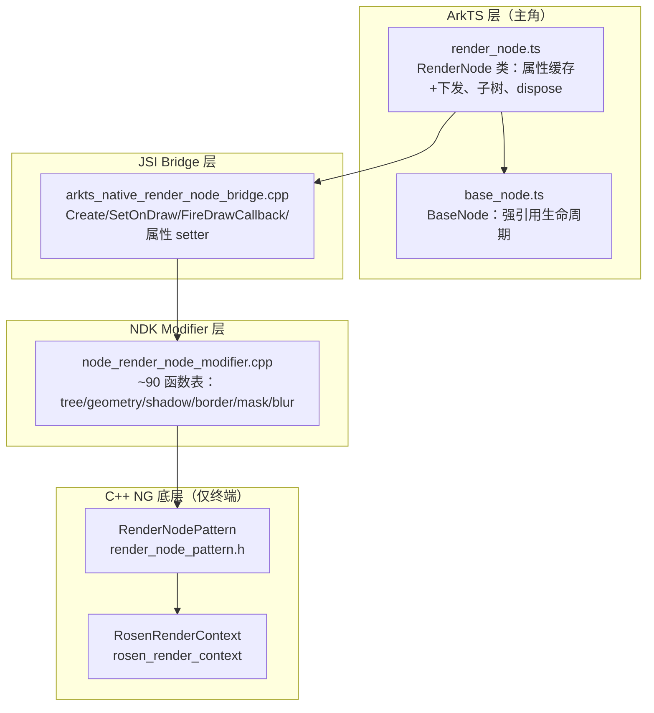

# 架构设计

> 确认目标仓和模块的架构约束、关键设计决策、Spec 拆分方向。本设计为 RenderNode 功能域（04-06-03）的共享基线。主角是 ArkTS `RenderNode` 类；C++ `NG::RenderNode`/Rosen 仅为底层能力提供者。

## 设计元数据

| Field | Content |
|-------|---------|
| Design ID | `DESIGN-Func-04-06-03` |
| 关联需求 | 已有能力补录（无独立 requirement.md） |
| 关联 Epic | 自定义节点能力 / RenderNode |
| 目标 Feature | Feat-01 RenderNode 全量规格（单一整体，覆盖全部公开 API） |
| 复杂度 | 复杂 |
| 目标版本 | API 11（dynamic 起始）— API 26.0.0 |
| Owner | ArkUI SIG |
| 状态 | Baselined（已有实现补录） |

## 需求基线

| 项 | 补充说明 |
|----|----------|
| 实现即规格 | RenderNode 已在 ace_engine 实现，固化为长期规格；存疑行为仅标注风险 |
| 主角边界 | ArkTS `RenderNode`（render_node.ts + SDK RenderNode.d.ts/.static.d.ets）为规格对象；C++ 仅底层能力 |
| 无事件/显式动画 API | ArkTS RenderNode 无公开事件/动画 API（事件在 BaseNode；动画经属性 setter 隐式） |

## 上下文和现状

### 涉及仓和模块

| 仓库 | 补充架构说明 |
|------|-------------|
| openharmony/arkui_ace_engine | RenderNode ArkTS 实现（render_node.ts）、JSI bridge、NDK modifier、底层 RenderNodePattern |
| openharmony/interface_sdk_js | SDK 类型定义：RenderNode.d.ts（动态）/ RenderNode.static.d.ets（静态）+ Graphics.d.ts |

### 调用链层级分析

| 层 | 模块 | 职责 | 修改类型 |
|----|------|------|----------|
| L1 ArkTS 运行时 | `frameworks/bridge/declarative_frontend/ark_node/src/render_node.ts` | ArkTS `RenderNode` 类：属性 setter/getter 缓存+下发 native、子树操作、dispose、draw 声明 | 补录 |
| L1' 共享基类 | `frameworks/bridge/declarative_frontend/ark_node/src/base_node.ts` | `BaseNode`：native 强引用生命周期、instanceId 同步（FrameNode/BuilderNode/RenderNode 共享） | 补录 |
| L2 JSI Bridge | `frameworks/bridge/declarative_frontend/engine/jsi/nativeModule/arkts_native_render_node_bridge.cpp` | `RenderNodeBridge::*`：Create/SetOnDraw/FireDrawCallback/AppendChild/各属性 setter；错误码映射 | 补录 |
| L3 NDK Modifier | `frameworks/core/interfaces/native/node/node_render_node_modifier.cpp`、`render_node.h` | ArkTS RenderNode 的 native 修饰器函数表（~90 函数：tree/geometry/shadow/border/mask/blur/animatable property） | 补录 |
| L4 C++ NG 底层 | `frameworks/core/components_ng/pattern/render_node/render_node_pattern.h`、`render_context`、`rosen_render_context` | 底层绘制能力（RenderNodePattern 持 draw 回调；Rosen RSCanvasNode）。**非规格对象，深入时再查** | 补录（边界） |

> 检查项：[x] 每层已覆盖 [x] 职责边界清晰（ArkTS 为主轴，C++ 仅终端） [x] 修改类型为补录

### 适用架构规则

| Rule ID | 适用原因 | 设计结论 | 验证方式 |
|---------|----------|----------|----------|
| OH-ARCH-LAYERING | ArkTS→JSI→Modifier→NG 多层 | 自上而下单向；反向走回调 | 架构评审 |
| OH-ARCH-API-LEVEL | 40+ Public API 跨 API11-26 | 全部 Public，SysCap=SystemCapability.ArkUI.ArkUI.Full | API 评审/XTS |
| OH-ARCH-ERROR-LOG | 100025(adopt) | appendChild/insertChildAfter 抛 100025（child 已 adopt） | 单测 |

## 不涉及项承接

| 维度 | 设计结论 |
|------|----------|
| 公开 API 签名变更 | 不涉及（存量补录） |
| BUILD.gn/bundle.json | 不涉及 |
| 事件 API | 不涉及（ArkTS RenderNode 无公开事件 API；事件在 BaseNode 不暴露） |
| 显式动画 API | 不涉及（动画经属性 setter 隐式 + NDK animatable modifier） |

## 关键设计决策

| 决策 ID | 问题 | 推荐方案 | 探索过的替代方案 | 取舍理由 | 影响 |
|---------|------|----------|------------------|----------|------|
| ADR-1 | 属性 getter 返回值来源 | getter 返回 ArkTS 缓存值（非 native 往返），setter 缓存+下发 native | (a) 每次 native 往返 | 缓存减少跨语言开销；与 SDK 默认值一致 | 全部属性 getter |
| ADR-2 | draw 回调机制 | draw 为用户重写方法，经 SetOnDraw 注入 RenderNodePattern；FireDrawCallback 构建 DrawContext{size,sizeInPixel,canvas} | (a) 直接传 canvas | DrawContext 提供 vp/px 双单位；canvas 为临时命令录制 | Feat-01 绘制簇 |
| ADR-3 | frame/position/size 优先级 | frame 设 size+position；后设置的胜出 | (a) 固定优先级 | 允许灵活设置；文档明示顺序 | Feat-01 帧几何 |
| ADR-4 | 子树 adopt 错误 | appendChild/insertChildAfter 对已 adopt child 抛 100025（"FrameNode cannot be adopted"） | (a) 静默忽略 | 明确错误防误用 | Feat-01 子树 |
| ADR-5 | lengthMetricsUnit 作用域 | 仅本地缓存，被后续 length 型 setter 读取（不下发 native） | (a) 立即生效 | 作为单位上下文，影响后续 size/position/borderWidth 等 | Feat-01 帧几何 |

## 设计骨架

### 骨架范围

| 骨架项 | 目标 | 不包含 | 验证方式 |
|--------|------|--------|----------|
| RenderNode 全量规格 | 固化 ArkTS RenderNode 全部公开 API 行为 | 事件/显式动画（无公开 API） | 架构评审 + index.md |

### 骨架 Spec 拆分

| Task ID | 目标 | 受影响文件 | AC |
|---------|------|----------|----|
| TASK-SKELETON-1 | 注册 04-06-03 + Feat-01 + design.md | registry, index.md, design.md | — |
| TASK-SKELETON-2 | Feat-01 全量规格 | Feat-01-render-node-full-spec.md | AC 全量 |

## 后续 Task 拆分

| Task ID | 目标 | 受影响文件 | 依赖 |
|---------|------|----------|------|
| TASK-01 | RenderNode 全量规格（单一 Feat） | `04-common-capability/06-custom-node/03-render-node/Feat-01-render-node-full-spec.md` | 基线 |

## API 签名、Kit 与权限

### 新增 API

全部为存量 Public API 补录，契约见 SDK `RenderNode.d.ts`/`.static.d.ets`。主要分组：constructor/dispose/isDisposed/label、size/position/frame/lengthMetricsUnit、backgroundColor/shadow*、border*、shapeMask/shapeClip/clipToFrame、pivot/scale/translation/rotation/transform、opacity/markNodeGroup、draw/invalidate、appendChild/insertChildAfter/removeChild/clearChildren/getChild/getFirstChild/getNextSibling/getPreviousSibling、backgroundBlur/contentBlur/foregroundBlur。权限：无；SysCap：SystemCapability.ArkUI.ArkUI.Full。

### 变更/废弃 API

无。

## 构建系统影响

无变更（存量补录）。

## 可选设计扩展

### 架构图



### 数据模型设计

**ArkTS 层（API 契约）:**
```typescript
class RenderNode {
  private _nativeRef: NativeStrongRef;  // 强引用底层节点
  nodePtr: NodePtr;
  // 属性 TS 缓存（getter 返回此，非 native 往返）
  sizeValue: Size; positionValue: Position; opacityValue: number; ...
  baseNode_: BaseNode; _frameNode: WeakRef<FrameNode>;
  childrenList: Array<RenderNode>;  // 子树 getter 操作此
}
```

| 存储项 | 位置 | 关联 API | 说明 |
|--------|------|----------|------|
| _nativeRef/nodePtr | render_node.ts | dispose/isDisposed | 强引用底层；dispose 释放 |
| 属性缓存 *Value | render_node.ts | 全部 getter | getter 返回缓存，setter 下发+缓存 |
| childrenList | render_node.ts | getFirstChild/getNextSibling 等 | 子树 getter 操作 TS 数组，非 native 往返 |
| lengthMetricsUnit | render_node.ts | length-bearing setters | 本地单位上下文 |

## 详细设计

### 属性 setter/getter 模式
每个视觉 setter：校验 undefined/null → 缓存 TS *Value → 下发 `getUINativeModule().renderNode.*`。getter 返回缓存值（非 native 往返）。`set frame` 委托 size+position。`set transform` clamp 至 16 元素（默认单位矩阵）。`set lengthMetricsUnit` 仅本地缓存。

### draw 与重绘
`draw(context: DrawContext)` 为用户重写方法（非 render_node.ts 直接实现）。经 SetOnDraw 注入 RenderNodePattern；FireDrawCallback 构建 DrawContext{size(vp),sizeInPixel(px),canvas(临时命令录制)}，SaveCanvas/ClipCanvas 后调用，RestoreCanvas/ResetCanvas 后清理。`invalidate()` 触发重绘。

### 子树与 adopt
appendChild/insertChildAfter：调 native，检查 ERROR_CODE_NODE_IS_ADOPTED→抛 100025（"FrameNode cannot be adopted"），再 addBuilderNode。removeChild/clearChildren 调 removeBuilderNode/clearBuilderNode+removeChild/clearChildren。sibling/child getter 操作 TS childrenList。

### dispose
幂等（isDisposed 守卫）；fire 生命周期回调；dispose _nativeRef；baseNode_.disposeNode()；reset _frameNode nodePtr；null nodePtr。

## 风险和开放问题

| 项 | 类型 | 影响 | 处理方式 | Owner |
|----|------|------|----------|-------|
| getter 返回缓存非实时 | API | 低 | 规格明示；缓存与 native 一致（setter 同步） | ArkUI SIG |
| frame/position/size 优先级"后设胜出" | API | 低 | 规格明示顺序 | ArkUI SIG |
| shadowRadius API26 默认哨兵 -1 | API | 低 | 规格标注版本差异 | ArkUI SIG |
| clipToFrame 默认随 apiTargetVersion 变 | API | 低 | 规格 API12 前后默认差异 | ArkUI SIG |
| 无公开事件/动画 API | 架构 | 低 | 规格不涉及；事件在 BaseNode，动画隐式 | ArkUI SIG |

## 设计审批

- [x] 需求基线已确认，设计覆盖 P0/P1 AC
- [x] 不涉及项已承接
- [x] 涉及仓和模块职责清楚
- [x] 调用链层级分析完整（L1-L4）
- [x] 适用架构规则已识别
- [x] 分层边界合规（ArkTS 主轴，C++ 终端）
- [x] API 变更有签名/权限/错误码说明
- [x] BUILD.gn/bundle.json 影响明确（无变更）
- [x] 设计输出和 Task 拆分明确
- [x] 关键设计决策有理由（ADR-1..5）
- [x] 风险和开放问题有 Owner

**结论:** 通过（已有实现补录）
