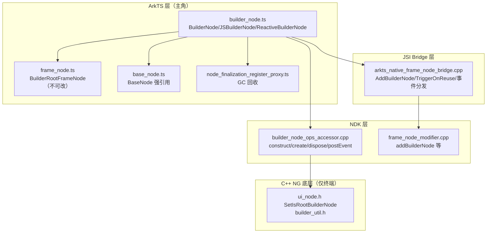

# 架构设计

> 确认目标仓和模块的架构约束、关键设计决策、Spec 拆分方向。本设计为 BuilderNode 功能域（04-06-04）的共享基线，由 8 个 Feat 复用。主角是 ArkTS `BuilderNode` 类；C++ 仅为底层能力提供者。

## 设计元数据

| Field | Content |
|-------|---------|
| Design ID | `DESIGN-Func-04-06-04` |
| 关联需求 | 已有能力补录（无独立 requirement.md） |
| 关联 Epic | 自定义节点能力 / BuilderNode |
| 目标 Feature | Feat-01 创建释放与渲染类型；Feat-02 构建与更新；Feat-03 FrameNode 访问；Feat-04 渲染类型与纹理；Feat-05 复用与回收；Feat-06 输入事件分发；Feat-07 冻结策略；Feat-08 响应式变体 |
| 复杂度 | 复杂 |
| 目标版本 | API 11（dynamic 起始）— API 26.0.0 |
| Owner | ArkUI SIG |
| 状态 | Baselined（已有实现补录） |

## 需求基线

| 项 | 补充说明 |
|----|----------|
| 实现即规格 | BuilderNode 已在 ace_engine 实现，固化为长期规格 |
| 主角边界 | ArkTS `BuilderNode`（builder_node.ts + SDK BuilderNode.d.ts/.static.d.ets）为规格对象；C++ 仅底层 |
| 叶子节点约束 | BuilderNode 仅可用作叶子节点；@Link 不可跨边界；@Reusable 不允许（抛 100030）；@Prop 允许 |
| 动态/静态差异 | BuildOptions/RenderOptions 字段、build 重载、arg 类型（Object vs RecordData/T）动态静态不同 |

## 上下文和现状

### 涉及仓和模块

| 仓库 | 补充架构说明 |
|------|-------------|
| openharmony/arkui_ace_engine | BuilderNode ArkTS 实现（builder_node.ts）、JSI bridge（折叠进 frame_node_bridge）、NDK accessor |
| openharmony/interface_sdk_js | SDK：BuilderNode.d.ts（动态）/ BuilderNode.static.d.ets（静态）+ 模块入口 |

### 调用链层级分析

| 层 | 模块 | 职责 | 修改类型 |
|----|------|------|----------|
| L1 ArkTS 运行时 | `frameworks/bridge/declarative_frontend/ark_node/src/builder_node.ts` | `BuilderNode`/`BuilderNodeCommonBase`/`JSBuilderNode`/`ReactiveBuilderNode`：build/update/dispose/reuse/recycle/事件分发；instanceId 同步 | 补录 |
| L1' 不可改根节点 | `frameworks/bridge/declarative_frontend/ark_node/src/frame_node.ts` | `BuilderRootFrameNode extends ImmutableFrameNode`：appendChild 等抛 100021 | 补录 |
| L1'' 共享基类 | `frameworks/bridge/declarative_frontend/ark_node/src/base_node.ts` | `BaseNode`：create/createReactive、native 强引用、instanceId | 补录 |
| L1''' 终结注册 | `frameworks/bridge/declarative_frontend/ark_node/src/node_finalization_register_proxy.ts` | `BuilderNodeFinalizationRegisterProxy`：GC 触发后端节点回收 | 补录 |
| L2 JSI Bridge | `frameworks/bridge/declarative_frontend/engine/jsi/nativeModule/arkts_native_frame_node_bridge.cpp` | 折叠实现：AddBuilderNode/RemoveBuilderNode/ClearBuilderNode/TriggerOnReuse/TriggerOnRecycle/UpdateConfiguration/事件分发 | 补录 |
| L3 NDK accessor | `frameworks/core/interfaces/native/implementation/builder_node_ops_accessor.cpp`、`node_api.cpp`(IsBuilderNode) | 静态/Arkoala 侧 accessor：construct/create/dispose/setOptions/postTouchEvent 等 | 补录 |
| L3' 动态 modifier | `frameworks/core/interfaces/native/node/frame_node_modifier.cpp` | addBuilderNode/removeBuilderNode/clearBuilderNode | 补录 |
| L4 C++ NG 底层 | `frameworks/core/components_ng/base/ui_node.h`(SetIsRootBuilderNode)、`frameworks/core/common/builder_util.h` | 根 builder 节点标志 + 工具。**非规格对象，深入时再查** | 补录（边界） |

> 检查项：[x] 每层已覆盖 [x] 职责边界清晰 [x] 修改类型为补录

### 适用架构规则

| Rule ID | 适用原因 | 设计结论 | 验证方式 |
|---------|----------|----------|----------|
| OH-ARCH-LAYERING | ArkTS→JSI→accessor→NG | 自上而下单向 | 架构评审 |
| OH-ARCH-API-LEVEL | 25+ Public API 跨 API11-26 | 全部 Public，SysCap=SystemCapability.ArkUI.ArkUI.Full | API 评审/XTS |
| OH-ARCH-ERROR-LOG | 401/100025/100030/140109 | 参数/adopt/@Reusable/nesting Proxy 写错误 | 单测 |

## 不涉及项承接

| 维度 | 设计结论 |
|------|----------|
| 公开 API 签名变更 | 不涉及（存量补录） |
| BUILD.gn/bundle.json | 不涉及 |
| @Link 跨边界同步 | 不涉及（不支持） |
| DevEco Previewer | 不涉及（BuilderNode 不可用） |

## 关键设计决策

| 决策 ID | 问题 | 推荐方案 | 探索过的替代方案 | 取舍理由 | 影响 |
|---------|------|----------|------------------|----------|------|
| ADR-1 | BuilderNode 根节点可改性 | BuilderRootFrameNode 不可改（appendChild 等抛 100021），仅用于挂载 | (a) 可改 | 防止外部破坏 builder 构建的子树 | Feat-03 |
| ADR-2 | build 参数语义 | 按值传递，状态更新须显式 update()；内部变量用 @Prop | (a) 自动响应 | 显式控制；@Builder 无状态 | Feat-02 |
| ADR-3 | 纹理渲染生效条件 | RENDER_TYPE_TEXTURE 仅 XComponentNode 或根为自定义组件的 BuilderNode 生效 | (a) 全类型生效 | 限制支持的根组件避免不一致 | Feat-04 |
| ADR-4 | @Reusable 限制 | builder 内自定义组件不支持 @Reusable，抛 100030 | (a) 允许 | 复用由 BuilderNode reuse/recycle 统一管理 | Feat-05 |
| ADR-5 | 事件坐标转换 | postTouchEvent 坐标 px 转父坐标系；postInputEvent 用窗口坐标；同 timestamp 仅一次 | (a) 统一坐标系 | 触摸/输入语义不同 | Feat-06 |
| ADR-6 | 响应式多参数 | ReactiveBuilderNode 用多参数 @Builder，V2(@ObservedV2) 自动更新，V1 须 flushState() | (a) 单参数 | 多参数支持响应式数据绑定 | Feat-08 |

## 设计骨架

### 骨架 Spec 拆分

| Task ID | 目标 | 受影响文件 | AC |
|---------|------|----------|----|
| TASK-01 | Feat-01 创建释放与渲染类型 | Feat-01-creation-dispose-render-type-spec.md | AC-1 |
| TASK-02 | Feat-02 构建与更新 | Feat-02-build-update-spec.md | AC-2 |
| TASK-03 | Feat-03 FrameNode 访问 | Feat-03-framenode-access-spec.md | AC-3 |
| TASK-04 | Feat-04 渲染类型与纹理 | Feat-04-render-type-texture-spec.md | AC-4 |
| TASK-05 | Feat-05 复用与回收 | Feat-05-reuse-recycle-spec.md | AC-5 |
| TASK-06 | Feat-06 输入事件分发 | Feat-06-input-event-dispatch-spec.md | AC-6 |
| TASK-07 | Feat-07 冻结策略 | Feat-07-freeze-policy-spec.md | AC-7 |
| TASK-08 | Feat-08 响应式变体 | Feat-08-reactive-variant-spec.md | AC-8 |

## 后续 Task 拆分

| Task ID | 目标 | 受影响文件 | 依赖 |
|---------|------|----------|------|
| TASK-01 | Feat-01 创建释放与渲染类型 | `04-common-capability/06-custom-node/04-builder-node/Feat-01-creation-dispose-render-type-spec.md` | 基线 |
| TASK-02 | Feat-02 构建与更新 | `Feat-02-build-update-spec.md` | 基线 |
| TASK-03 | Feat-03 FrameNode 访问 | `Feat-03-framenode-access-spec.md` | 基线 |
| TASK-04 | Feat-04 渲染类型与纹理 | `Feat-04-render-type-texture-spec.md` | 基线 |
| TASK-05 | Feat-05 复用与回收 | `Feat-05-reuse-recycle-spec.md` | 基线 |
| TASK-06 | Feat-06 输入事件分发 | `Feat-06-input-event-dispatch-spec.md` | 基线 |
| TASK-07 | Feat-07 冻结策略 | `Feat-07-freeze-policy-spec.md` | 基线 |
| TASK-08 | Feat-08 响应式变体 | `Feat-08-reactive-variant-spec.md` | 基线 |

## API 签名、Kit 与权限

### 新增 API

全部存量 Public 补录，契约见 `BuilderNode.d.ts`/`.static.d.ets`。主要分组：constructor/dispose/isDisposed、build/update/updateConfiguration、getFrameNode、reuse/recycle、postTouchEvent/postInputEvent/postInputEventWithStrategy、inheritFreezeOptions、ReactiveBuilderNode(build/flushState)。权限：无；SysCap：SystemCapability.ArkUI.ArkUI.Full。

### 变更/废弃 API

无。

## 构建系统影响

无变更（存量补录）。

## 可选设计扩展

### 架构图



### 数据模型设计

**ArkTS 层:**
```typescript
class BuilderNode<Args> {
  _JSBuilderNode: JSBuilderNode;  // 持有
  nodePtr_: NodePtr;
  _isDisposed: boolean;
}
class JSBuilderNode extends BaseNode {
  uiContext_; frameNode_: BuilderRootFrameNode;
  _nativeRef: NativeStrongRef;
  _supportNestingBuilder; bindedViewOfBuilderNode;
  // freeze flags: inheritFreeze/allowFreezeWhenInactive/parentallowFreeze/isFreeze
}
```

| 存储项 | 位置 | 关联 API | 说明 |
|--------|------|----------|------|
| _JSBuilderNode/nodePtr_ | builder_node.ts | dispose/isDisposed | 委托 + 强引用 |
| frameNode_ | JSBuilderNode | getFrameNode | 不可改根 FrameNode |
| freeze flags | JSBuilderNode | inheritFreezeOptions | 冻结策略状态 |

## 详细设计

### 创建与不可改根
constructor(uiContext, options?) 创建 JSBuilderNode（持 uiContext_），注册 BuilderNodeFinalizationRegisterProxy（GC 回收）。build 后创建 BuilderRootFrameNode（不可改，appendChild 等抛 100021）。

### 构建与更新
build(builder, arg?, options?)：sync instanceId；读 nestingBuilderSupported/lazyBuildSupported/enableProvideConsumeCrossing/localStorage；buildWithNestingBuilder（nesting 时 params 包 Proxy，写抛 140109）→ super.create → nodePtr_ + NativeStrongRef + BuilderRootFrameNode。update(arg)：frozen 则暂存，否则 partial update。updateConfiguration()：重跑 update funcs + forceCompleteRerender + native updateConfiguration。

### 复用与回收
reuse(param?)：遍历 childrenWeakrefMap 调 aboutToReuseInternal；V2(@ReusableV2) since 26。recycle()：调 aboutToRecycleInternal。@Reusable 抛 100030。

### 事件分发
postTouchEvent(event)：px 坐标转父坐标系；同 timestamp 仅一次；UIExtensionComponent 不支持；返是否消费。postInputEvent(event)：窗口坐标；鼠标左键自动转触摸。postInputEventWithStrategy(event, strategy?)：允许多次转发。

### 响应式变体
ReactiveBuilderNode(@since 22)：多参数 @Builder；build(builder, config, ...args)；V2(@ObservedV2) 自动更新；V1 须 flushState()。

## 风险和开放问题

| 项 | 类型 | 影响 | 处理方式 | Owner |
|----|------|------|----------|-------|
| BuilderRootFrameNode 不可改 | API | 低 | 规格明示抛 100021 | ArkUI SIG |
| @Reusable 抛 100030 | API | 低 | 规格明示 | ArkUI SIG |
| 嵌入 RenderNode 时 selfIdealSize 须显式 | API | 低 | 规格明示默认 [0,0] | ArkUI SIG |
| 动态/静态 BuildOptions 字段不同 | API | 中 | 规格分动态/静态标注 | ArkUI SIG |
| postInputEvent 动态@20/静态@26 版本差 | API | 低 | 规格 @since 标注 | ArkUI SIG |
| 无独立 builder_node 单测 | 测试 | 中 | 复用 node_container/builder_util 测试 | ArkUI SIG |

## 设计审批

- [x] 需求基线已确认，设计覆盖 P0/P1 AC
- [x] 不涉及项已承接
- [x] 涉及仓和模块职责清楚
- [x] 调用链层级分析完整（L1-L4）
- [x] 适用架构规则已识别
- [x] 分层边界合规（ArkTS 主轴，C++ 终端）
- [x] API 变更有签名/权限/错误码说明
- [x] BUILD.gn/bundle.json 影响明确（无变更）
- [x] 设计输出和 Task 拆分明确（8 Feat）
- [x] 关键设计决策有理由（ADR-1..6）
- [x] 风险和开放问题有 Owner

**结论:** 通过（已有实现补录）
