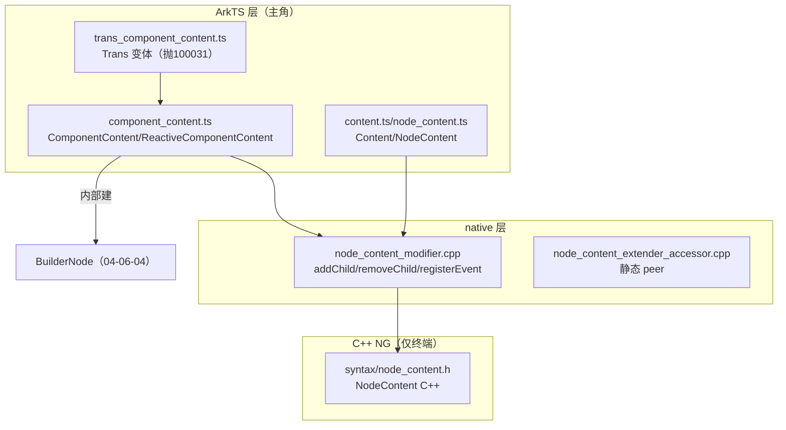

# 架构设计

> 确认目标仓和模块的架构约束、关键设计决策。本设计为 ComponentContent 功能域（04-06-05）共享基线，由 5 个 Feat 复用。主角 ArkTS ComponentContent；C++ 仅底层。

## 设计元数据

| Field | Content |
|-------|---------|
| Design ID | `DESIGN-Func-04-06-05` |
| 关联需求 | 已有能力补录 |
| 关联 Epic | 自定义节点能力 / ComponentContent |
| 目标 Feature | Feat-01 创建与释放；Feat-02 更新配置冻结；Feat-03 复用回收；Feat-04 ReactiveComponentContent；Feat-05 NodeContent 与 Transfer |
| 复杂度 | 标准 |
| 目标版本 | API 12（起始）— API 26.0.0 |
| Owner | ArkUI SIG |
| 状态 | Baselined |

## 需求基线

| 项 | 补充说明 |
|----|----------|
| 实现即规格 | ComponentContent 已实现，固化为规格 |
| 主角边界 | ArkTS ComponentContent（component_content.ts + SDK）为规格对象；底层用 BuilderNode |
| 动态/静态差异 | 静态无 inheritFreezeOptions；静态 ReactiveComponentContent 无 update；ComponentContentBase 仅静态 |

## 上下文和现状

### 涉及仓和模块

| 仓库 | 补充架构说明 |
|------|-------------|
| arkui_ace_engine | ComponentContent ArkTS 实现、NodeContent modifier、底层 NodeContent |
| interface_sdk_js | SDK：ComponentContent.d.ts/.static.d.ets、Content.d.ts、NodeContent.d.ts |

### 调用链层级分析

| 层 | 模块 | 职责 | 修改类型 |
|----|------|------|----------|
| L1 ArkTS 运行时 | `frameworks/bridge/declarative_frontend/ark_node/src/component_content.ts` | ComponentContent/ComponentContentCommonBase/ReactiveComponentContent：创建(内部建 BuilderNode)、dispose、update、reuse/recycle、isDisposed/isTransferred | 补录 |
| L1' Content/NodeContent | `.../ark_node/src/content.ts`、`node_content.ts` | Content 基类（onAttach/Detach hooks）；NodeContent：addFrameNode/removeFrameNode | 补录 |
| L1'' Transfer | `.../ark_node/src/trans_component_content.ts` | Trans 变体：isTransferred=true，reuse/update 等抛 100031 | 补录 |
| L2 JSI/native | `frameworks/core/interfaces/native/node/node_content_modifier.cpp`、`node_content_extender_accessor.cpp` | NodeContent modifier（addChild/removeChild/registerEvent）+ 静态 extender accessor | 补录 |
| L3 C++ NG 底层 | `frameworks/core/components_ng/syntax/node_content.h` | NodeContent C++（AddNode/RemoveNode/OnAttach/Detach）。**非规格对象** | 补录（边界） |

> 注：ComponentContent 无独立 JSI bridge，native ops 折叠进 frame_node native module（createNodeContent/addFrameNodeToNodeContent/removeFrameNodeFromNodeContent）。

### 适用架构规则

| Rule ID | 适用原因 | 设计结论 | 验证方式 |
|---------|----------|----------|----------|
| OH-ARCH-LAYERING | ArkTS→native→NG | 自上而下单向 | 架构评审 |
| OH-ARCH-API-LEVEL | ~8 Public API 跨 12-26 | 全 Public | API 评审 |
| OH-ARCH-ERROR-LOG | 100025/100031/401 | adopt/Trans不支持/参数 | 单测 |

## 不涉及项承接

| 维度 | 设计结论 |
|------|----------|
| 公开 API 签名变更 | 不涉及 |
| BUILD.gn/bundle.json | 不涉及 |
| getTreeNode/setAttachNode | 不涉及（非公开 SDK API，内部方法） |

## 关键设计决策

| 决策 ID | 问题 | 推荐方案 | 取舍理由 | 影响 |
|---------|------|----------|----------|------|
| ADR-1 | ComponentContent 底层实现 | 内部用 BuilderNode（build+update+reuse/recycle 委托） | 复用 BuilderNode 机制，避免重复 | Feat-01..04 |
| ADR-2 | Transfer 变体只读 | Trans 变体 reuse/update/recycle/updateConfiguration/inheritFreezeOptions/flushState 抛 100031 | 转换产生的节点不应被修改 | Feat-05 |
| ADR-3 | NodeContent adopt 错误 | addFrameNode 对已 adopt 节点抛 100025 | 防止重复挂载 | Feat-05 |
| ADR-4 | 动态/静态差异 | 静态无 inheritFreezeOptions；静态 ReactiveCC 无 update + ctor 签名不同 | 静态范式简化 | Feat-02,04 |

## 设计骨架

### 骨架 Spec 拆分

| Task ID | 目标 | 受影响文件 | AC |
|---------|------|----------|----|
| TASK-01 | Feat-01 创建与释放 | Feat-01-creation-dispose-spec.md | AC-1 |
| TASK-02 | Feat-02 更新配置冻结 | Feat-02-update-config-freeze-spec.md | AC-2 |
| TASK-03 | Feat-03 复用回收 | Feat-03-reuse-recycle-spec.md | AC-3 |
| TASK-04 | Feat-04 ReactiveComponentContent | Feat-04-reactive-component-content-spec.md | AC-4 |
| TASK-05 | Feat-05 NodeContent 与 Transfer | Feat-05-node-content-transfer-spec.md | AC-5 |

## 后续 Task 拆分

| Task ID | 目标 | 受影响文件 | 依赖 |
|---------|------|----------|------|
| TASK-01 | Feat-01 创建与释放 | `05-component-content/Feat-01-creation-dispose-spec.md` | 基线 |
| TASK-02 | Feat-02 更新配置冻结 | `Feat-02-update-config-freeze-spec.md` | 基线 |
| TASK-03 | Feat-03 复用回收 | `Feat-03-reuse-recycle-spec.md` | 基线 |
| TASK-04 | Feat-04 ReactiveComponentContent | `Feat-04-reactive-component-content-spec.md` | 基线 |
| TASK-05 | Feat-05 NodeContent 与 Transfer | `Feat-05-node-content-transfer-spec.md` | 基线 |

## API 签名、Kit 与权限

全部存量 Public 补录，契约见 `ComponentContent.d.ts`/`.static.d.ets`/`Content.d.ts`/`NodeContent.d.ts`。主要：constructor(3 重载)/dispose/isDisposed/isTransferred/update/updateConfiguration/inheritFreezeOptions/reuse/recycle + ReactiveComponentContent(flushState) + NodeContent(addFrameNode/removeFrameNode)。权限：无；SysCap：SystemCapability.ArkUI.ArkUI.Full。

## 构建系统影响

无变更。

## 可选设计扩展

### 架构图

## 详细设计

### ComponentContent 与 BuilderNode 关系
ComponentContent 内部创建 BuilderNode（build 委托），update/reuse/recycle/dispose 均委托 builderNode_。dispose 触发 fireArkUIObjectLifecycleCallback('ComponentContent') + detachFromParent + 释放引用。

### Transfer 变体
Trans 变体经 transferDynamic 产生，isTransferred=true；reuse/update/recycle/updateConfiguration/inheritFreezeOptions/flushState 抛 100031。

### NodeContent
NodeContent 是 ContentSlot 管理器；addFrameNode/removeFrameNode 管理 FrameNode 子节点；已 adopt 抛 100025。

## 风险和开放问题

| 项 | 类型 | 影响 | 处理方式 | Owner |
|----|------|------|----------|-------|
| 无独立 component_content 单测 | 测试 | 中 | 复用 content_slot_syntax 测试 + examples | ArkUI SIG |
| 静态无 inheritFreezeOptions | API | 低 | 规格分动态/静态标注 | ArkUI SIG |
| Trans 变体抛 100031 | API | 低 | 规格明示 | ArkUI SIG |

## 设计审批

- [x] 需求基线已确认
- [x] 不涉及项已承接
- [x] 职责清楚
- [x] 调用链完整（L1-L3）
- [x] 架构规则已识别
- [x] 分层合规（ArkTS 主轴）
- [x] API 有签名/错误码
- [x] 构建无影响
- [x] Task 拆分明确（5 Feat）
- [x] ADR 有理由（ADR-1..4）
- [x] 风险有 Owner

**结论:** 通过（已有实现补录）
