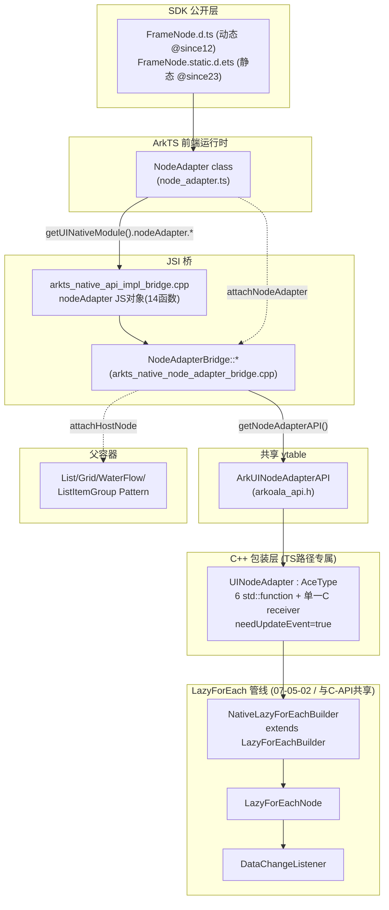
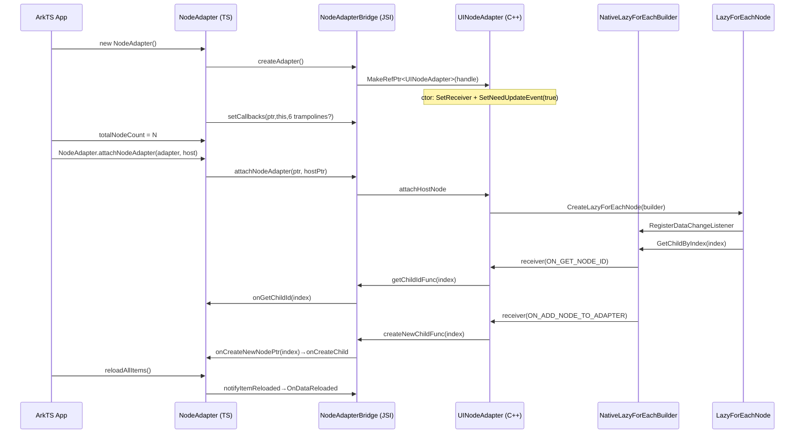

# 架构设计

> 确认目标仓和模块的架构约束、关键设计决策、Spec 拆分方向。

## 设计元数据

| Field | Content |
|-------|---------|
| Design ID | `DESIGN-Func-04-06-06` |
| 关联需求 | 已有能力补录（无独立 requirement.md） |
| 关联 Epic | 无 |
| 目标 Feature | Feat-01 NodeAdapter ArkTS 前端规格（基线） |
| 复杂度 | 标准 |
| 目标版本 | 动态版 `@ohos.arkui.node` / `FrameNode.d.ts`（`@since 12 dynamic`，`isDisposed()` 除外为 `@since 20 dynamic`）；静态版 `@ohos.arkui.node.static` / `FrameNode.static.d.ets`（`@since 23 static`） |
| Owner | ArkUI SIG |
| 状态 | Baselined（已有实现补录） |

> 范围说明：本设计以 **TS（ArkTS）侧 NodeAdapter** 为基线 Feat-01。NodeAdapter 的 C-API/NDK 公开层（19 个 `OH_ArkUI_NodeAdapter_*`）为另一独立 Feat，后续按增量并入（5B 路径）补录。底层懒渲染管线（`NativeLazyForEachBuilder`/`LazyForEachNode`/`LazyForEachBuilder`/`DataChangeListener`）与 C-API 路径**共用**，详见 07-05-02，本设计不重复展开。

## 需求基线

> 需求基线详见 proposal.md。以下仅列出设计阶段需要额外强调的要点。

| 项 | 补充说明 |
|----|---------|
| 补录而非新增 | 当前实现即规格，可疑行为只能标注为风险/备注 |
| 复用 LazyForEach 管线 | TS `NodeAdapter` 经 `UINodeAdapter`→`NativeLazyForEachBuilder extends LazyForEachBuilder` 复用 LazyForEachNode/LazyForEachBuilder/DataChangeListener（07-05-02），不重新实现懒渲染 |
| TS↔Native 桥接 | 公开 `NodeAdapter` class（单一类，无 Controller）经 JSI `NodeAdapterBridge`→C++ `UINodeAdapter`（AceType 包装）→`ArkUINodeAdapterAPI` vtable→引擎 |
| 双 SDK 声明 | 动态版（`@since 12 dynamic`，`@crossplatform`/`@atomicservice`，`number`，可选回调）与静态版（`@since 23 static`，`int`，必填回调）并存；静态版作为兼容性变体记录 |

## 上下文和现状

### 涉及仓和模块

| 仓库 | 补充架构说明 |
|------|-------------|
| `arkui_ace_engine` | TS 侧 NodeAdapter 全部实现：SDK 运行时（`node_adapter.ts`）、JSI 桥（`NodeAdapterBridge`）、C++ 包装（`UINodeAdapter`）均在本仓 |
| `interface/sdk-js` | 公开 SDK 类型声明：`arkui/FrameNode.d.ts`（动态，L3410-3681）、`arkui/FrameNode.static.d.ets`（静态，L3616-3821）；经 `@ohos.arkui.node(.static)` 与 `@kit.ArkUI` re-export |

> 仓、模块、当前职责、影响类型详见 proposal.md「影响范围」。

### 调用链层级分析

| 层 | 模块 | 职责 | 修改类型 |
|----|------|------|---------|
| 1. SDK 声明层 | `interface/sdk-js/api/arkui/FrameNode.d.ts`（L3410-3681）/ `FrameNode.static.d.ets`（L3616-3821） | 公开 `NodeAdapter` class（19 成员 + 6 回调 + 2 静态 attach/detach），`@since`/`@syscap`/`@crossplatform`/`@atomicservice` 契约 | 不修改（SDK 权威） |
| 2. ArkTS 前端运行时层 | `frameworks/bridge/declarative_frontend/ark_node/src/node_adapter.ts`（220L） | `NodeAdapter` class 实现：字段（`nativePtr_`/`nativeRef_`/`nodeRefs_`/`count_`/`attachedNodeRef_`/`_isDisposed`）、6 用户回调、构造/生命周期/计数/变更/查询/6 native trampoline/静态 attach | 现状（Feat-01） |
| 3. JSI 桥注册层 | `frameworks/bridge/declarative_frontend/engine/jsi/nativeModule/arkts_native_api_impl_bridge.cpp`（L601-630） | 注册 `nodeAdapter` JS 对象（14 函数属性）→`NodeAdapterBridge::*` 静态方法 | 现状（Feat-01） |
| 4. JSI 桥实现层 | `.../nativeModule/arkts_native_node_adapter_bridge.{h,cpp}`（343L） | `NodeAdapterBridge::CreateNodeAdapter/SetCallbacks/Notify*/GetAllItems/AttachNodeAdapter/DetachNodeAdapter` 等；JS↔C 值/指针/回调 marshalling | 现状（Feat-01） |
| 5. UINodeAdapter 包装层 | `frameworks/core/interfaces/native/node/node_adapter_impl.{h,cpp}`（UINodeAdapter L178-237） | `UINodeAdapter : AceType` 持 raw handle + 6 `std::function`；ctor 自动注册单一 C receiver + `SetNeedUpdateEvent(true)` | 现状（Feat-01） |
| 6. ArkUINodeAdapterAPI vtable 层 | `frameworks/core/interfaces/arkoala/arkoala_api.h`（L10518-10559） | `ArkUINodeAdapterEventType`、`ArkUINodeAdapterEvent`、`ArkUINodeAdapterAPI` vtable——TS/NDK/CJ 汇聚点 | 现状（与 C-API 共享） |
| 7. NativeLazyForEachBuilder 层 | `node_adapter_impl.cpp` | `extends LazyForEachBuilder`，C 回调↔引擎桥 | 现状（与 C-API 共享） |
| 8. LazyForEachNode 管线层 | `frameworks/core/components_ng/syntax/lazy_for_each_node.*` | `CreateLazyForEachNode`、`GetFrameChildByIndex` | 现状（07-05-02 承接） |
| 9. LazyForEachBuilder 基类层 | `.../syntax/lazy_for_each_builder.h` | `OnGetTotalCount/OnGetChildByIndex/OnItemDeleted` 纯虚 | 现状（07-05-02 承接） |
| 10. DataChangeListener 层 | `frameworks/core/components_v2/foreach/lazy_foreach_component.h` | `OnDataReloaded/OnDataBulk*/OnDataMoveToNewPlace` | 现状（07-05-02 承接） |
| 11. 父容器 Pattern 层 | List/Grid/WaterFlow/ListItemGroup Pattern | `OnAttachAdapter`/`DetachHostNodeAdapter`（容器自定义 attach） | 现状（跨特性） |

检查项：
- [x] 调用链每一层都已覆盖（SDK→TS 运行时→JSI 注册→JSI 实现→UINodeAdapter→vtable→NativeLazyForEachBuilder→LazyForEachNode→Builder→DataChangeListener→Pattern）
- [x] 每层职责边界清晰（TS 驱动 JSI 桥，引擎复用 LazyForEach 管线）
- [x] 每层修改类型明确（TS 专属层 1-5 为 Feat-01；6-7 与 C-API 共享；8-11 复用 07-05-02）

### 适用架构规则

| Rule ID | 适用原因 | 设计结论 | 验证方式 |
|---------|---------|---------|---------|
| OH-ARCH-LAYERING | SDK→TS 运行时→JSI 桥→UINodeAdapter→vtable 多层 | 调用方向自顶向下；TS 经 UINodeAdapter 接入复用 LazyForEach 管线，不直接渲染 | 架构评审/依赖检查 |
| OH-ARCH-SUBSYSTEM | 仅本仓 + SDK，无跨子系统 | 不引入子系统外依赖 | 依赖检查 |
| OH-ARCH-API-LEVEL | 动态 `@since 12`（`isDisposed` @since 20）；静态 `@since 23` | Public，无新增权限 | API 评审/XTS |
| OH-ARCH-COMPONENT-BUILD | 现状无 BUILD.gn/bundle.json 变更 | 无构建影响 | 构建验证 |
| OH-ARCH-ERROR-LOG | TS 侧负参数静默忽略（无错误码）；native 侧 no-listener 106104（C-API 路径） | TS 守卫在前，错误码见 native | UT |

## 不涉及项承接

> proposal.md 已完成 N/A 判定。本节仅对标记「涉及」且需展开设计的维度给出结论。

| 维度 | 设计结论 |
|------|----------|
| 跨进程/SA | 不涉及 |
| 持久化 | 不涉及 |
| 权限 | 不涉及（Public 无权限） |
| 国际化/RTL | 子节点随父容器 |
| 多范式兼容 | 动态版（`@since 12`，Declarative Frontend）+ 静态版（`@since 23`，ArkTS Frontend/arkoala 生成）；C-API/NDK 为独立 Feat（后续补录） |
| 范围边界 | LazyForEach 管线（LazyForEachNode/Builder/DataChangeListener）详见 07-05-02；C-API 公开层详见后续 C-API Feat |

## 关键设计决策

| 决策 ID | 问题 | 推荐方案 | 探索过的替代方案 | 取舍理由 | 影响 |
|--------|------|---------|----------------|---------|------|
| ADR-1 | TS 与 native 的桥接粒度 | 公开**单一 `NodeAdapter` class**（无 Controller），经 JSI `NodeAdapterBridge` 调 14 个 native 函数；handle 包装为 C++ `UINodeAdapter`（AceType） | (a) 暴露 Controller + Adapter 双类；(b) 直暴露 raw C handle | 单一类简化 ArkTS 用法；`UINodeAdapter` 承载 std::function 回调与单一 receiver，屏蔽 C vtable 细节 | 无 `NodeAdapterController`；`nativePtr_` 实为 `UINodeAdapter*` |
| ADR-2 | 回调注册时机 | 构造函数 `setCallbacks` 时按 `this.onXxx !== undefined` **绑定 trampoline**：attach/detach 无条件注册；`onGetChildId/onCreateChild/onDisposeChild/onUpdateChild` 仅当构造时已定义才注册 | (a) 延迟注册（构造后属性 setter 触发）；(b) 全部无条件注册 | 构造时一次性绑定，避免 setter 复杂度；子类方法覆写（原型链）构造时可见→注册生效 | 构造后赋值实例字段回调**不生效**（使用约束，见 RISK-1） |
| ADR-3 | 节点复用事件（ON_UPDATE_NODE）门控 | TS 路径在 `UINodeAdapter` ctor `SetNeedUpdateEvent(true)`→cache hit 时 fire `ON_UPDATE_NODE`→路由到 `onUpdateChild` | (a) 默认 false（同 raw C-API）；(b) 用户显式开关 | ArkTS 复用场景需回调更新 TS 状态；与 raw C-API（false）相反 | TS 侧 `onUpdateChild` 触发，复用语义≠C-API（见 RISK-2） |
| ADR-4 | 非法数值入参处理 | 类级 NOTE「Negative input parameters are ignored」；TS 在 `totalNodeCount/reloadItem/removeItem/insertItem/moveItem` 守卫 `<0` 直接 `return`（静默 no-op） | (a) 抛异常；(b) 返回错误码 | 与 ArkTS LazyForEach 风格一致；静默忽略，无错误反馈 | 返回值/无异常不指示成功（见 RISK-3） |
| ADR-5 | attach 宿主绑定模型 | **静态** `attachNodeAdapter(adapter,node): boolean`（非实例方法）；native 前做 TS 预校验（null/`isModifiable`/`allowChildCount<=1`）+ 容器白名单；native 侧走 `Pattern::OnAttachAdapter` 双路径 | (a) 实例 `adapter.attachTo(node)`；(b) 仅 native 校验 | 静态 API 与 `FrameNode` 模型一致；TS 预校验快速失败，减少 native 往返 | 可绑定容器白名单 11 个；返回 false 多源（见 RISK-4） |
| ADR-6 | dispose 顺序与有效性 | `_isDisposed=true`→fire 生命周期回调→detach host→`nativeRef_.dispose()`→置空 `nativePtr_`；`isDisposed() = _isDisposed && nativePtr_==null` | (a) 同步销毁 native；(b) 保留 nativePtr | 先解绑宿主再释放，避免悬垂；`isDisposed` 双条件防误判 | dispose 后 `nativePtr_` 置空，后续调用风险（SDK 文档示可能 crash，见 RISK-5） |
| ADR-7 | 静态版（@since 23）差异处理 | 静态版作为**兼容性变体**记录（`int`/必填回调/无 `@crossplatform`/无 `@atomicservice`），不单独成 Feat | (a) 静态版独立 Feat；(b) 仅规格动态版 | 同一 class 同一运行时语义，差异为类型/版本注解；独立 Feat 颗粒度过细 | 静态版差异见 spec 兼容性声明 |

## 设计骨架

### 骨架范围

| 骨架项 | 目标 | 不包含 | 验证方式 |
|--------|------|--------|---------|
| 生命周期 | constructor（native handle 创建+回调绑定）/dispose/isDisposed/totalNodeCount | LazyForEach 管线（07-05-02） | UT |
| 回调与事件流 | 6 回调注册时机 + 6 native trampoline + ON_UPDATE_NODE（needUpdateEvent） | C-API receiver 模型（C-API Feat） | UT |
| 数据变更 | reloadAllItems/reloadItem/removeItem/insertItem/moveItem + 负参守卫 + native notifyItem* | DataChangeListener 细节（07-05-02） | UT |
| 宿主绑定 | 静态 attachNodeAdapter/detachNodeAdapter + TS 预校验 + 容器白名单 | Pattern::OnAttachAdapter 双路径（C-API Feat/跨特性） | UT |
| 查询 | getAllAvailableItems（NodeInfo→FrameNode 反查） | — | UT |

### 骨架 Spec 拆分

| Task ID | 目标 | 受影响文件 | AC |
|---------|------|----------|-----|
| TASK-SKELETON-1 | Feat-01 NodeAdapter ArkTS 前端规格全量基线 | `node_adapter.ts`、`arkts_native_node_adapter_bridge.*`、`node_adapter_impl.{h,cpp}`、`FrameNode.d.ts`、`FrameNode.static.d.ets` | AC-1.1~6.x |

## 后续 Task 拆分

| Task ID | 目标 | 受影响文件 | 依赖 |
|---------|------|----------|------|
| T-1 | Feat-01 NodeAdapter ArkTS 前端规格（基线，本设计已承接） | `Feat-01-nodeadapter-arkts-frontend-spec.md` + 本 design.md | — |
| T-2 | C-API/NDK 公开层补录（后续，5B 增量并入本 design.md） | 待创建 `Feat-02-*-spec.md` | T-1 |

## API 签名、Kit 与权限

> 本节承接 spec.md「API 变更分析」中识别的 API，给出签名、权限和 d.ts 位置等实现细节。

### 新增 API

无新增（存量补录）。

### 变更/废弃 API

| 原有 API | 变更类型 | 新 API | 迁移说明 |
|---------|---------|--------|---------|
| `NodeAdapter` class（动态 `@since 12 dynamic`） | 既有 | — | `isDisposed()` 为 `@since 20 dynamic` 后增；其余成员 `@since 12` |
| `NodeAdapter` class（静态 `@since 23 static`） | 既有 | — | `int` 类型、必填回调、无 `@crossplatform`/`@atomicservice` |
| `static attachNodeAdapter/detachNodeAdapter` | 既有 | — | 宿主绑定静态入口 |

> SDK 位置：`interface/sdk-js/api/arkui/FrameNode.d.ts`（动态 L3410-3681）、`FrameNode.static.d.ets`（静态 L3616-3821）；re-export：`@ohos.arkui.node(.static)`、`@kit.ArkUI`。Kit：ArkUI（ArkUI Full）；权限：无；SysCap：`SystemCapability.ArkUI.ArkUI.Full`。运行时：`frameworks/bridge/declarative_frontend/ark_node/src/node_adapter.ts`。

## 构建系统影响

### BUILD.gn 变更

无变更（存量补录）。`node_adapter.ts` 已纳入 `frameworks/bridge/declarative_frontend/ark_node/` 现有构建目标；JSI 桥纳入 `engine/jsi/nativeModule/`；`UINodeAdapter` 纳入 `frameworks/core/interfaces/native/node/`。

### bundle.json 变更

无变更。

## 可选设计扩展

### 架构图



### 数据流/控制流

| 步骤 | 调用方 | 被调用方 | 数据/接口 | 说明 |
|------|--------|---------|----------|------|
| 1 | TS `new NodeAdapter()` | `nodeAdapter.createAdapter()` | `NativeStrongRef` | 桥 `CreateNodeAdapter` 包 handle 为 `UINodeAdapter` RefPtr，返回 `nativePtr_=UINodeAdapter*` |
| 2 | TS ctor | `nodeAdapter.setCallbacks(...)` | 8 参数（ptr/this/attach/detach/getId/create/dispose/update） | 按构造时 `!==undefined` 绑定 trampoline |
| 3 | TS `attachNodeAdapter(adapter,node)` | `nodeAdapter.attachNodeAdapter` | bool | TS 预校验→native `attachHostNode`→lazy 建 LazyForEachNode |
| 4 | engine GetChildByIndex | UINodeAdapter OnEventReceived | event(type) | switch 分发到 std::function→JSI 弱引用回 TS trampoline |
| 5 | TS `onCreateNewNodePtr(index)` | user `onCreateChild(index)` | FrameNode | push `nodeRefs_`，返 `node.getNodePtr()` |
| 6 | TS `reloadAllItems()` | `notifyItemReloaded`→DataChangeListener | — | 复用管线 dirty |

### 时序设计



### 数据模型设计

**ArkTS 层（`node_adapter.ts`）**

```ts
interface NodeInfo { nodeId: number, nodePtr: NodePtr }   // L16-19
class NodeAdapter {
    nativePtr_: NodePtr;              // = UINodeAdapter* (经 getNativeHandle)
    nativeRef_: NativeStrongRef;      // createAdapter() 返回
    nodeRefs_: Array<FrameNode>;      // 强引用已创建子节点，防 GC
    count_: number;                   // totalNodeCount 缓存
    attachedNodeRef_: WeakRef<FrameNode>;  // 宿主弱引用
    _isDisposed: boolean;
    onAttachToNode?/onDetachFromNode?/onGetChildId?/onCreateChild?/onDisposeChild?/onUpdateChild?;  // 6 用户回调
}
```

**Framework 层（C++）**

```cpp
class UINodeAdapter : public AceType {
    ArkUINodeAdapterHandle handle_;
    std::function attach/detach/getChildId/createNewChild/disposeChild/updateChild;  // 6 slots
    // ctor: SetUserData(this)+SetReceiver(lambda)+SetNeedUpdateEvent(true)
};
```

| 结构 | 存储方案 | 生命周期 |
|------|---------|---------|
| `NodeAdapter`（TS） | JS 堆（GC） | new→GC（dispose 显式释放 native） |
| `nativeRef_`（NativeStrongRef） | TS 持有 | new→dispose |
| `UINodeAdapter`（C++ RefPtr） | `NativeStrongRef` 内部 RefPtr | createAdapter→nativeRef.dispose |
| `nodeRefs_`（TS Array） | TS 强引用 | onCreateChild push→onDisposeChild/detach splice |
| `attachedNodeRef_`（WeakRef） | TS 弱引用 | onAttachToNode→onDetachFromNode |

### 测试性设计

| 测试层级 | 测试目标 | Mock 策略 | 验证方式 |
|---------|---------|----------|---------|
| UT | 构造/回调绑定时机 | Mock `getUINativeModule().nodeAdapter` | `node_adapter` TS UT |
| UT | 负参守卫 | 边界值注入 | TS UT |
| UT | attach 预校验 | Mock FrameNode `isModifiable`/`allowChildCount` | TS UT |
| UT | dispose 顺序/isDisposed | Mock nativeRef/host | TS UT |
| XTS | ArkTS 端到端 NodeAdapter 绑定容器 | 真实 List/Grid/WaterFlow | `test/xts` |

### 资源所有权矩阵

| 资源 | 创建方 | 持有方 | 销毁触发 | 实际释放 | 异常回收 |
|------|--------|--------|---------|---------|---------|
| `NodeAdapter`（TS） | App `new` | App 引用 | GC（dispose 显式） | GC | — |
| `UINodeAdapter`（RefPtr） | `CreateNodeAdapter` | `nativeRef_` 内部 | `nativeRef_.dispose()` | RefPtr release | — |
| `nodeRefs_` 子 FrameNode | user `onCreateChild` | TS `nodeRefs_` 强引用 | `onDisposeChild`/detach splice | GC | — |
| `attachedNodeRef_`（WeakRef） | `onAttachToNodePtr` | TS 弱引用 | `onDetachFromNodePtr` 清空 | GC | deref 为 undefined 时跳过 |

### 接口参数规约

> 见 spec.md「接口规格→参数约束」。要点：`count/start/from/to` `[0,+∞)`，负数静默忽略；`onGetChildId` 须保证 id 唯一。

### 线程与并发模型

| 操作 | 发起线程 | 回调线程 | 跨进程边界 | 线程安全 | 重入约束 |
|------|---------|---------|----------|---------|---------|
| TS API（构造/mutator/attach） | UI（JS） | 同 | 无 | 单线程 UI | 不可在 trampoline 内重入 mutator |
| 6 native trampoline | engine（UI） | UI（JS） | 无 | 单线程 | — |
| `attachNodeAdapter` | UI（JS） | 同 | 无 | 单线程 | — |

## 详细设计

### 构造与回调绑定（constructor）

`new NodeAdapter()`（`node_adapter.ts:36-47`）：`nativeRef_=getUINativeModule().nodeAdapter.createAdapter()`（L37）→桥 `CreateNodeAdapter` 调 `getNodeAdapterAPI()->create()` 包为 `UINodeAdapter` RefPtr，`nativePtr_=nativeRef_.getNativeHandle()`（L38，即 `UINodeAdapter*`）。随后 `setCallbacks(ptr,this, onAttachToNodePtr, onDetachFromNodePtr, onGetChildId??..., onCreateChild?onCreateNewNodePtr:undef, onDisposeChild?onDisposeNodePtr:undef, onUpdateChild?onUpdateNodePtr:undef)`（L39-45）：attach/detach trampoline **无条件**注册；`onGetChildId/onCreateChild/onDisposeChild/onUpdateChild` 仅当构造时 `this.onXxx!==undefined` 才注册对应 trampoline。`_isDisposed=false`（L46）。

### 生命周期（dispose/isDisposed/totalNodeCount）

`dispose()`（L53-65）：`_isDisposed=true`→若 `nativePtr_` 存在则 `fireArkUIObjectLifecycleCallback(WeakRef(this),'NodeAdapter',getNodeType()||'NodeAdapter',nativePtr_)`→`hostNode=attachedNodeRef_?.deref()`，非空则 `NodeAdapter.detachNodeAdapter(hostNode)`→`nativeRef_.dispose()`→`nativePtr_=null`。`isDisposed()`（L67-69）=`_isDisposed && (nativePtr_===undefined||null)`。`totalNodeCount` setter（L71-77）`count<0` 直接 return，否则 `setTotalNodeCount`+缓存 `count_`；getter（L79-81）返 `count_`。

### 6 native trampoline 与事件分发

`onAttachToNodePtr(target)`（L130-143）：按 `target.nodeId` 经 `FrameNodeFinalizationRegisterProxy.ElementIdToOwningFrameNode_` 反查 FrameNode，`deref()` 为 undefined 则 return；`frameNode.setAdapterRef(this)`+`attachedNodeRef_=WeakRef(frameNode)`，再触发 user `onAttachToNode(frameNode)`。`onDetachFromNodePtr()`（L145-157）：触发 user `onDetachFromNode()`，清宿主 `setAdapterRef(undefined)`，`nodeRefs_.splice(0,length)` 清空。`onCreateNewNodePtr(index)`（L159-168）：user `onCreateChild(index)`→FrameNode，去重 push `nodeRefs_`，返 `node.getNodePtr()`；无回调返 null。`onDisposeNodePtr(id,node)`（L170-182）：反查 FrameNode→user `onDisposeChild(id,frameNode)`+从 `nodeRefs_` 移除。`onUpdateNodePtr(id,node)`（L184-192）：反查 FrameNode→user `onUpdateChild(id,frameNode)`。事件分发源自 `UINodeAdapter::OnEventReceived`（`node_adapter_impl.cpp`）按 `event->type` switch→对应 std::function→JSI 弱引用回 TS trampoline；`ON_UPDATE_NODE`（cache hit）经 `needUpdateEvent_=true` 触发。

### 数据变更通知

`reloadAllItems()`（L83-85）→`notifyItemReloaded`；`reloadItem(start,count)`（L87-92）`<0` return→`notifyItemChanged`；`removeItem`（L94-99）→`notifyItemRemoved`；`insertItem`（L101-106）→`notifyItemInserted`；`moveItem(from,to)`（L108-113）`<0` return→`notifyItemMoved`。桥转发至 `getNodeAdapterAPI()->notifyItem*`→`NativeLazyForEachBuilder`→`DataChangeListener`（07-05-02）。

### 宿主绑定（static attach/detach）

`attachNodeAdapter(adapter,node)`（L194-212）：`node==null/undefined`→false；`!node.isModifiable()`→false；若 node 有 `attribute_` 且 `allowChildCount` 定义，`allowChildCount()<=1`→false；否则 `nodeAdapter.attachNodeAdapter(adapter.nativePtr_,node.getNodePtr())` 返 bool。`detachNodeAdapter(node)`（L214-219）：null 守卫→`nodeAdapter.detachNodeAdapter(node.getNodePtr())`，native 侧 `detachHostNode`+`markDirty(MEASURE_SELF_AND_PARENT)`。

### 查询（getAllAvailableItems）

`getAllAvailableItems()`（L115-128）：`nodeAdapter.getAllItems(nativePtr_)`→`Array<NodeInfo>`，逐项按 `nodeId` 反查 `ElementIdToOwningFrameNode_`，`has` 才 push `deref()` 的 FrameNode，返回当前已实例化子节点（含预加载）。

## 风险和开放问题

| 项 | 类型 | 影响 | 处理方式 | Owner |
|----|------|------|---------|-------|
| RISK-1 回调注册依赖构造时绑定：构造后赋值实例字段（`a.onCreateChild=...` 或子类实例箭头函数字段）的 4 个回调（getId/create/dispose/update）**不生效**（setCallbacks 已跑）；仅子类方法覆写（原型链）构造时可见才注册 | API | 中 | spec R-* / ADR-2 标注；文档约束用子类方法覆写 | ArkUI SIG |
| RISK-2 TS 路径 `needUpdateEvent_=true`：cache hit 时 fire `ON_UPDATE_NODE`→`onUpdateChild`，与 raw C-API（false 不 fire）相反；跨范式复用语义不一致 | API | 中 | spec R-* / ADR-3 / 兼容性声明标注 | ArkUI SIG |
| RISK-3 负参静默忽略：`totalNodeCount/reloadItem/removeItem/insertItem/moveItem` 入参 `<0` 直接 return，无异常/无错误码，返回值/无副作用不指示成功 | API | 中 | spec R-* / ADR-4 标注；类级 NOTE 已声明 | ArkUI SIG |
| RISK-4 attach 返回 false 多源：TS 预校验（null/!isModifiable/allowChildCount<=1）与 native（已绑定/容器不支持/Path 失败）均可致 false，无法区分来源 | API | 低 | spec R-* / ADR-5 标注 | ArkUI SIG |
| RISK-5 dispose 后 nativePtr 置空：后续 API（mutator/attach/getAllAvailableItems）以 null `nativePtr_` 调 native，SDK 文档示「可能 crash 或返回默认值」；`isDisposed()` 用于前置校验 | API | 中 | spec R-* / ADR-6 / `isDisposed` @since 20 兼容性标注 | ArkUI SIG |
| RISK-6 `getAllAvailableItems` 反查可能丢项：`ElementIdToOwningFrameNode_` 中 `deref()` 为 undefined 或 `has` 为 false 的 NodeInfo 被跳过，返回数组可能少于 native 实际持有 | API | 低 | spec R-* 标注 | ArkUI SIG |
| RISK-7 静态版（@since 23）实现路径未在本 Feat 深入探查（arkts_frontend/arkoala 生成），仅按 `.static.d.ets` 声明记录差异 | 测试 | 低 | spec 兼容性声明标注「静态版运行时未深入验证」 | ArkUI SIG |

## 设计审批

- [x] 需求基线已确认，设计覆盖 P0/P1 AC
- [x] 不涉及项已承接，N/A 和展开项都有结论
- [x] 涉及仓和模块职责清楚
- [x] 调用链层级分析完整，每层覆盖到位
- [x] 适用架构规则已识别并形成设计结论
- [x] 分层和子系统边界合规
- [x] API 变更有签名、权限、错误码和兼容性说明
- [x] BUILD.gn/bundle.json 影响明确
- [x] 设计输出和后续 Task 拆分明确
- [x] 关键设计决策有理由和影响说明
- [x] 风险和开放问题有 Owner

**结论:** 通过（已有实现补录）
