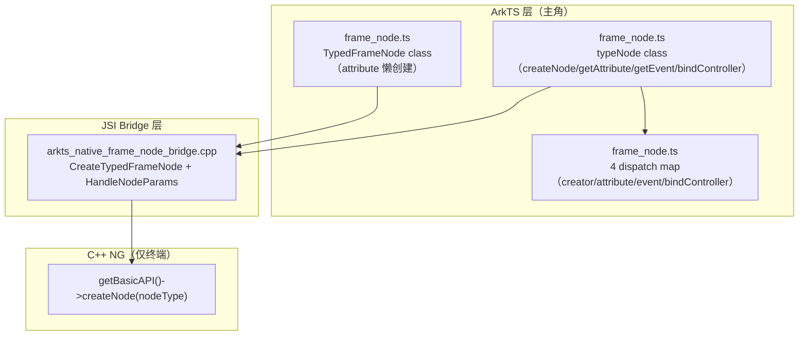

# 架构设计

> 确认目标仓和模块的架构约束、关键设计决策。本设计为 TypedFrameNode 功能域（04-06-07）共享基线，由 4 个 Feat 复用。主角 ArkTS TypedFrameNode + typeNode 工厂；C++ 仅底层。边界：04-06-07 只覆盖 TypedFrameNode + typeNode 工厂；FrameNode 基类属 04-06-02。

## 设计元数据

| Field | Content |
|-------|---------|
| Design ID | `DESIGN-Func-04-06-07` |
| 关联需求 | 已有能力补录 |
| 关联 Epic | 自定义节点能力 / TypedFrameNode |
| 目标 Feature | Feat-01 TypedFrameNode 类型；Feat-02 typeNode 动态工厂；Feat-03 typeNode 静态工厂；Feat-04 组件支持矩阵 |
| 复杂度 | 复杂（40 组件矩阵） |
| 目标版本 | API 12（dynamic 起始）— API 26.0.0 |
| Owner | ArkUI SIG |
| 状态 | Baselined |

## 需求基线

| 项 | 补充说明 |
|----|----------|
| 实现即规格 | TypedFrameNode + typeNode 已实现 |
| 主角边界 | ArkTS TypedFrameNode（frame_node.ts + SDK FrameNode.d.ts/.static.d.ets）为规格对象 |
| 与 FrameNode 边界 | TypedFrameNode extends FrameNode；基类方法属 04-06-02，本域只覆盖类型化扩展 |
| 动态/静态范式差异 | 动态用 string-literal 重载 createNode；静态用命名函数 createXxxNode |

## 上下文和现状

### 涉及仓和模块

| 仓库 | 补充架构说明 |
|------|-------------|
| arkui_ace_engine | TypedFrameNode ArkTS 实现（frame_node.ts）、JSI bridge、typed node 创建路径 |
| interface_sdk_js | SDK：FrameNode.d.ts/.static.d.ets（TypedFrameNode + typeNode 声明在此） |

### 调用链层级分析

| 层 | 模块 | 职责 | 修改类型 |
|----|------|------|----------|
| L1 ArkTS 运行时 | `frameworks/bridge/declarative_frontend/ark_node/src/frame_node.ts` | TypedFrameNode class（attribute 懒创建）、typeNode class（createNode/getAttribute/getEvent/bindController 全 TS 实现经 dispatch map）、4 个 dispatch map（creator/attribute/event/bindController） | 补录 |
| L2 JSI Bridge | `frameworks/bridge/declarative_frontend/engine/jsi/nativeModule/arkts_native_frame_node_bridge.cpp` | CreateTypedFrameNode/CreateTransTypedFrameNode（typeMap 40 组件）+ HandleNodeParams（按组件类型解析参数）；getAttribute/getEvent/bindController 无独立 C++ bridge（纯 TS） | 补录 |
| L3 C++ NG 底层 | `getBasicAPI()->createNode(nodeType)` | 按 nodeType 创建 NG FrameNode。**非规格对象** | 补录（边界） |

> 注：getAttribute/getEvent/bindController 完全在 TS 实现（经 dispatch map + 各组件 native modifier），不经独立 C++ bridge。

### 适用架构规则

| Rule ID | 适用原因 | 设计结论 | 验证方式 |
|---------|----------|----------|----------|
| OH-ARCH-LAYERING | ArkTS→JSI→NG | 自上而下；accessor 纯 TS | 架构评审 |
| OH-ARCH-API-LEVEL | 40 组件 × createNode/getAttribute/getEvent/bindController | 全 Public | API 评审 |
| OH-ARCH-ERROR-LOG | 401/100021/100023 | 参数/不可改/控制器错误 | 单测 |

## 不涉及项承接

| 维度 | 设计结论 |
|------|----------|
| FrameNode 基类方法 | 不涉及（属 04-06-02） |
| 公开 API 签名变更 | 不涉及 |
| BUILD.gn/bundle.json | 不涉及 |

## 关键设计决策

| 决策 ID | 问题 | 推荐方案 | 取舍理由 | 影响 |
|---------|------|----------|----------|------|
| ADR-1 | 动态 vs 静态工厂范式 | 动态用 string-literal 重载 createNode('X')；静态用命名函数 createXxxNode | 动态运行时分发灵活；静态编译期类型安全 | Feat-02,03 |
| ADR-2 | accessor 纯 TS 实现 | getAttribute/getEvent/bindController 全 TS（dispatch map + 各组件 native modifier），无独立 C++ bridge | 减少跨语言开销；TS dispatch map 维护 | Feat-02,03 |
| ADR-3 | attribute 懒创建 | TypedFrameNode.attribute 首次访问时经 attrCreator_ 构造 ArkComponent | 延迟创建减少开销 | Feat-01 |
| ADR-4 | 40 组件分波引入 | createNode 分 @since 12/14/18 三波；accessor 分 19/20/24/26 | 渐进交付 | Feat-04 |

## 设计骨架

### 骨架 Spec 拆分

| Task ID | 目标 | 受影响文件 | AC |
|---------|------|----------|----|
| TASK-01 | Feat-01 TypedFrameNode 类型 | Feat-01-typedframenode-type-spec.md | AC-1 |
| TASK-02 | Feat-02 typeNode 动态工厂 | Feat-02-typenode-dynamic-factory-spec.md | AC-2 |
| TASK-03 | Feat-03 typeNode 静态工厂 | Feat-03-typenode-static-factory-spec.md | AC-3 |
| TASK-04 | Feat-04 组件支持矩阵 | Feat-04-component-matrix-spec.md | AC-4 |

## 后续 Task 拆分

| Task ID | 目标 | 受影响文件 | 依赖 |
|---------|------|----------|------|
| TASK-01 | Feat-01 TypedFrameNode 类型 | `07-typed-frame-node/Feat-01-typedframenode-type-spec.md` | 基线 |
| TASK-02 | Feat-02 typeNode 动态工厂 | `Feat-02-typenode-dynamic-factory-spec.md` | 基线 |
| TASK-03 | Feat-03 typeNode 静态工厂 | `Feat-03-typenode-static-factory-spec.md` | 基线 |
| TASK-04 | Feat-04 组件支持矩阵 | `Feat-04-component-matrix-spec.md` | 基线 |

## API 签名、Kit 与权限

全部存量 Public 补录，契约见 `FrameNode.d.ts`/`.static.d.ets`（TypedFrameNode + typeNode）。主要：TypedFrameNode（initialize/attribute）+ typeNode（createNode/getAttribute/getEvent/bindController 动态；createXxxNode/getXxxAttribute/getXxxEvent/bindXxxController 静态）。权限：无；SysCap：SystemCapability.ArkUI.ArkUI.Full。

## 构建系统影响

无变更。

## 可选设计扩展

### 架构图

## 详细设计

### TypedFrameNode 类型
动态 `interface TypedFrameNode<C,T> extends FrameNode`（initialize:C, readonly attribute:T）；静态 `abstract class TypedFrameNode<T> extends FrameNode`（get attribute():T）。attribute 懒创建（attrCreator_ 构造 ArkComponent）。

### typeNode 动态工厂
`class typeNode`：createNode(context, type, options?) 经 __creatorMap__ 分发（40 组件）；getAttribute(node, nodeType) 校验 nodeType 匹配 + 跨语言检查后经 __attributeMap__；getEvent 经 __eventMap__；bindController 经 __bindControllerCallbackMap__（调各组件 native modifier，错误 401/100023/100021）。

### typeNode 静态工厂
命名函数 createXxxNode/getXxxAttribute/getXxxEvent/bindXxxController（40 组件）+ abstract XxxFrameNode extends TypedFrameNode + type Xxx = XxxFrameNode。options?: FrameNodeOptions @since 26.0.0。

### 组件支持矩阵
40 组件分波：createNode @since 12(24)/14(9)/18(7)；动态 accessor getAttribute @since 20/getEvent @since 19/bindController @since 15(Scroll)/20；静态 accessor @since 23 基线/24(文本输入)/26(滚动容器+GridRow)。

## 风险和开放问题

| 项 | 类型 | 影响 | 处理方式 | Owner |
|----|------|------|----------|-------|
| 40 组件矩阵维护成本 | API | 中 | Feat-04 集中列矩阵 | ArkUI SIG |
| 动态/静态范式差异 | API | 中 | 规格分动态/静态 | ArkUI SIG |
| accessor 纯 TS | 架构 | 低 | 规格明示无独立 C++ bridge | ArkUI SIG |
| XComponent 3 重载 | API | 低 | 规格列重载 | ArkUI SIG |

## 设计审批

- [x] 需求基线已确认
- [x] 不涉及项已承接
- [x] 职责清楚
- [x] 调用链完整（L1-L3）
- [x] 架构规则已识别
- [x] 分层合规（ArkTS 主轴）
- [x] API 有签名/错误码
- [x] 构建无影响
- [x] Task 拆分明确（4 Feat）
- [x] ADR 有理由（ADR-1..4）
- [x] 风险有 Owner

**结论:** 通过（已有实现补录）
