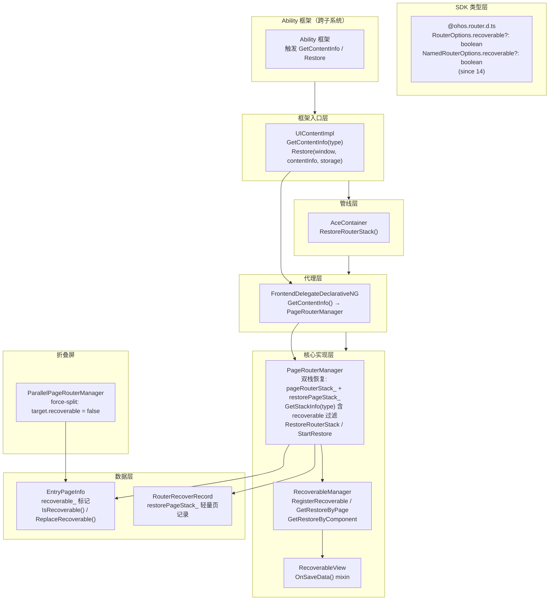

# 路由栈恢复架构设计

> 路由栈恢复（RouterOptions.recoverable / NamedRouterOptions.recoverable 标记过滤 + restorePageStack_ 惰性恢复 + RecoverableManager 组件级状态持久化 + ContentInfoType 三场景区分 + FA/Stage 双模型差异）的架构约束、双栈恢复策略、组件级状态保存/恢复生命周期、关键设计决策与 Spec 拆分方向。

## 设计元数据

| Field | Content |
|-------|---------|
| Design ID | DESIGN-Func-04-07-02 |
| 关联需求 | 已有能力补录（无独立 requirement.md） |
| 关联 Epic | 无 |
| 目标 Feature | Feat-01（路由栈保存与恢复机制） |
| 复杂度 | 较高（recoverable 标记过滤 + restorePageStack_ 惰性恢复 + RecoverableManager 组件级状态 + ContentInfoType 三场景 + FA/Stage 双模型差异） |
| 目标版本 | API 14+ (recoverable since 14) |
| Owner | ArkUI SIG |
| 状态 | Baselined（已有实现补录） |

## 需求基线

> 需求基线详见 proposal.md。以下仅列出设计阶段需要额外强调的要点。

| 项 | 补充说明 |
|----|----------|
| recoverable 标记过滤 | RouterOptions.recoverable / NamedRouterOptions.recoverable (since 14, default true) 控制页面是否纳入恢复数据；recoverable=false 的页面在 RESOURCESCHEDULE_RECOVERY 场景下被跳过 |
| 惰性恢复策略 | RestoreRouterStack 仅立即恢复栈顶页，其余页面以 RouterRecoverRecord 形式存储在 restorePageStack_；back() 到栈底且 restorePageStack_ 非空时 StartRestore() 逐步恢复 |
| 组件级状态持久化 | RecoverableManager 注册组件 save 回调，存储 RestoreInfo per page/component；RecoverableView mixin 提供 Pattern 级 OnSaveData() 自定义状态 |
| ContentInfoType 三场景 | CONTINUATION(1) 分布式跨设备迁移；APP_RECOVERY(2) 应用崩溃恢复；RESOURCESCHEDULE_RECOVERY(3) 资源调度杀应用恢复（最关联 recoverable 过滤） |
| FA/Stage 双模型差异 | Stage 模型完整 recoverable 过滤 + RecoverableManager + RecoverableView + 惰性 restorePageStack_；FA 模型旧管线无 per-page recoverable 过滤和组件级状态持久化 |
| 无显式恢复公共 API | 恢复由框架自动处理（UIContentImpl.Restore → AceContainer.RestoreRouterStack → PageRouterManager.RestoreRouterStack）；开发者仅通过 recoverable 字段控制恢复范围 |

## 上下文和现状

### 涉及仓和模块

| 仓库 | 模块 | 当前职责 | 影响类型 | 补充架构说明 |
|------|------|----------|----------|-------------|
| ace_engine | `interface/sdk-js/api/@ohos.router.d.ts` | RouterOptions.recoverable?: boolean (since 14) 类型定义 | 公共接口 | Dynamic API 字段，SysCap ArkUI.ArkUI.Lite |
| ace_engine | `interface/sdk-js/api/@ohos.router.d.ts` | NamedRouterOptions.recoverable?: boolean (since 14) 类型定义 | 公共接口 | Dynamic API 字段，SysCap ArkUI.ArkUI.Lite |
| ace_engine | `interfaces/napi/kits/router/js_router.cpp` | NAPI 解析 recoverable 参数 → 传递到 FrontendDelegate | NAPI 入口 | NAPI 层解析 RouterOptions/NamedRouterOptions 中 recoverable 字段 |
| ace_engine | `frameworks/bridge/declarative_frontend/ng/page_router_manager.h/.cpp` | PageRouterManager 核心：restorePageStack_ 惰性恢复栈、GetStackInfo 序列化（含 recoverable 过滤）、RestoreRouterStack 恢复、StartRestore 惰性恢复触发 | 核心实现 | 双恢复栈 pageRouterStack_ + restorePageStack_，恢复栈存储 RouterRecoverRecord |
| ace_engine | `frameworks/core/components_ng/pattern/page/page_info.h` | EntryPageInfo 存储 recoverable_ 标记；IsRecoverable()/ReplaceRecoverable() 方法 | 数据模型 | recoverable_ 存于每页 PageInfo，MovePageToFront() 通过 ReplaceRecoverable() 更新 |
| ace_engine | `frameworks/core/recovery/recoverable_manager.h/.cpp` | RecoverableManager 注册组件 save 回调、GetRestoreByPage()/GetRestoreByComponent() 收集/分发组件状态 | 状态持久化 | RegisterRecoverable() 遍历树找到 Page/NavDestination，生成 globalComponentId |
| ace_engine | `frameworks/core/recovery/recoverableView.h` | RecoverableView mixin 提供 Pattern 级 OnSaveData() override | 状态持久化 | 自定义组件状态保存接口 |
| ace_engine | `adapter/ohos/entrance/ui_content_impl.cpp` | UIContentImpl.GetContentInfo(type) / Restore(window, contentInfo, storage) | 框架入口 | Save/Restore 生命周期入口 |
| ace_engine | `frameworks/core/pipeline_ng/pipeline_context.cpp` | AceContainer.RestoreRouterStack() | 管线层 | AceContainer 转发恢复调用到 PageRouterManager |
| ace_engine | `frameworks/bridge/declarative_frontend/ng/frontend_delegate_impl.cpp` | FrontendDelegateDeclarativeNG.GetContentInfo() 代理 | 代理层 | 代理层转发 GetContentInfo 到 PageRouterManager |
| ace_engine | `advanced_ui_component/parallelpanel/parallel_page_router_manager.cpp` | ParallelPageRouterManager 强制设置 target.recoverable = false | 折叠屏 | Force-split 二次面板页面不纳入恢复 |

### 调用链层级分析

| 层 | 模块 | 职责 | 修改类型 |
|----|------|------|----------|
| SDK 类型层 | `@ohos.router.d.ts` RouterOptions/NamedRouterOptions recoverable | recoverable boolean 字段定义 | 无修改（已有实现补录） |
| NAPI 层 | `js_router.cpp` | 解析 recoverable 参数 → FrontendDelegate | 无修改 |
| FrontendDelegate 层 | `frontend_delegate_impl.cpp` | 代理转发 Push/Replace 参数含 recoverable | 无修改 |
| UIContent 入口层 | `ui_content_impl.cpp` | GetContentInfo(type)/Restore(window, contentInfo, storage) | 无修改 |
| AceContainer 管线层 | `pipeline_context.cpp` | RestoreRouterStack() → PageRouterManager | 无修改 |
| PageRouterManager 层 | `page_router_manager.cpp` | GetStackInfo(含 recoverable 过滤)/RestoreRouterStack/StartRestore 惰性恢复 | 无修改 |
| RecoverableManager 层 | `recoverable_manager.cpp` | RegisterRecoverable/GetRestoreByPage/GetRestoreByComponent | 无修改 |
| PageInfo 数据层 | `page_info.h` EntryPageInfo | recoverable_ 标记存储 | 无修改 |

检查项：
- [x] 调用链每一层都已覆盖（从最上层到最底层）
- [x] 每层职责边界清晰，无跨层违规调用
- [x] 每层修改类型明确

### 适用架构规则

| Rule ID | 适用原因 | 设计结论 | 验证方式 |
|---------|----------|----------|----------|
| OH-ARCH-LAYERING | UIContent → AceContainer → FrontendDelegate → PageRouterManager → RecoverableManager 逐层传递；Save/Restore 严格从框架入口到引擎核心层单向调用 | 调用方向严格单向向下；UIContentImpl 仅做入口分发，核心恢复逻辑在 PageRouterManager 和 RecoverableManager | 代码评审/依赖检查 |
| OH-ARCH-SUBSYSTEM | 路由栈恢复涉及 ace_engine + Ability 框架协作（跨子系统边界） | Ability 框架通过 UIContent.GetContentInfo/Restore 跨子系统调用 ace_engine；ace_engine 不反向调用 Ability | 代码评审 |
| OH-ARCH-API-LEVEL | RouterOptions.recoverable (Dynamic since 14), NamedRouterOptions.recoverable (Dynamic since 14), Static (since 23); inner APIs not public | 仅 2 个 optional boolean 字段新增，无显式恢复公共 API；inner API (RestoreRouterStack/GetStackInfo) 不暴露给开发者 | API 评审/XTS |
| OH-ARCH-ERROR-LOG | UIContentErrorCode enum for restore failures; no public BusinessError for recoverable | 恢复失败通过 UIContentErrorCode 内部枚举报告；recoverable 标记无错误码（默认值保证安全） | 单测/hilog |
| OH-ARCH-COMPONENT-BUILD | 源码在 ace_core_ng_source_set，RecoverableManager 在 recovery module | 无新增 BUILD.gn target | 构建验证 |

## 不涉及项承接

| 维度 | 需求阶段结论 | 设计阶段处理方式 | 设计结论 |
|------|---------|-------------|----------|
| 性能 | 展开 | 展开设计 | 惰性恢复避免一次性加载全部页面；RecoverableManager save callback 在页面序列化时同步调用 |
| 安全与权限 | N/A | 保持 N/A | recoverable 无权限要求 |
| 兼容性 | 展开 | 展开设计 | recoverable since 14; FA 模型旧管线无 recoverable 过滤 |
| IPC/跨进程 | 展开 | 展开设计 | 路由栈恢复涉及 Ability 框架→ace_engine 跨子系统调用 |
| 构建与部件 | N/A | 保持 N/A | 无新增部件 |
| API/SDK | 展开 | 展开设计 | 仅 2 个 optional boolean 字段新增，需与 SDK .d.ts 交叉验证 |

## 关键设计决策

| 决策 ID | 问题 | 推荐方案 | 探索过的替代方案 | 取舍理由 | 影响 |
|---------|------|----------|-----------------|----------|------|
| ADR-1 | 惰性恢复策略 vs 一次性恢复 | 仅恢复栈顶页（立即加载 FrameNode），其余存为 RouterRecoverRecord 在 restorePageStack_；back() 到栈底触发 StartRestore 逐步恢复 | 一次性恢复全部页面到 pageRouterStack_ | 一次性恢复内存开销大，低内存设备风险高；惰性恢复仅栈顶页有 FrameNode，其余为轻量 RouterRecoverRecord | Feat-01 所有恢复 AC |
| ADR-2 | recoverable 标记过滤策略 | RESOURCESCHEDULE_RECOVERY 场景下 GetStackInfo 跳过 recoverable=false 的页面；recoverable=true (默认) 正常纳入 | 所有场景均纳入所有页面 | 资源调度杀应用恢复场景下，某些页面（如折叠屏二次面板）不应恢复；其他场景（CONTINUATION/APP_RECOVERY）需完整栈信息 | recoverable 过滤仅在 RESOURCESCHEDULE_RECOVERY 生效 |
| ADR-3 | 组件级状态持久化 | RecoverableManager 注册 save callback；RecoverableView mixin 提供 Pattern 级 OnSaveData()；RegisterRecoverable() 遍历树找到 Page/NavDestination 生成 globalComponentId | 仅恢复路由栈 URI/params，不恢复组件状态 | 仅恢复栈信息丢失用户交互状态（表单输入、滚动位置等）；组件级状态恢复提升用户体验 | Feat-01 组件状态 AC |
| ADR-4 | FA vs Stage 双模型兼容 | NG 管线共享恢复逻辑；FA 模型旧管线使用简化序列化（无 per-page recoverable 过滤、无 RecoverableManager） | FA 模型也实现完整 recoverable 过滤 | FA 模型为历史遗留，完整实现维护成本高且场景少；NG 管线为推荐路径 | FA 旧管线恢复能力受限 |
| ADR-5 | ContentInfoType 三场景区分 | CONTINUATION(1)/APP_RECOVERY(2)/RESOURCESCHEDULE_RECOVERY(3) 三种场景通过 type 参数区分；recoverable 过滤仅在 RESOURCESCHEDULE_RECOVERY 生效 | 统一场景不区分 | 不同场景恢复需求不同：分布式迁移需完整栈+组件状态；崩溃恢复需完整栈；资源调度杀应用可选择性恢复 | GetStackInfo(type) 按 type 分支处理 |

## 设计骨架

### 骨架范围

| 骨架项 | 目标 | 不包含 | 验证方式 |
|--------|------|--------|----------|
| recoverable 标记与过滤 | recoverable 字段解析→PageInfo 存储→GetStackInfo 过滤 | 折叠屏 force-split recoverable=false |
| 惰性恢复策略 | RestoreRouterStack 双栈恢复 + StartRestore 惰性触发 | FA 旧管线简化恢复 |
| 组件级状态持久化 | RecoverableManager 注册/保存/恢复组件状态 | NavDestination 组件级恢复 |
| ContentInfoType 场景区分 | 三场景 GetStackInfo 分支 + 恢复生命周期 | 分布式迁移细节 |

### 骨架 Spec 拆分

| Task ID | 目标 | 受影响文件 | AC |
|---------|------|-----------|-----|
| TASK-SKELETON-1 | Feat-01: 路由栈保存与恢复机制 spec | Feat-01-router-stack-save-restore-spec.md | AC-1.1 ~ AC-1.x |

## 后续 Task 拆分

| Task ID | 目标 | 受影响文件 | 依赖 |
|---------|------|-----------|------|
| TASK-01 | Feat-01 spec（路由栈保存与恢复机制） | Feat-01-router-stack-save-restore-spec.md | 无 |

## API 签名、Kit 与权限

### 新增 API

> 已有实现补录，无新增 API。以下列出路由栈恢复涉及的 Public API 签名供 spec 参考。

| API 签名 | 类型 | Kit | d.ts 位置 | 权限要求 | SysCap |
|----------|------|-----|----------|----------|--------|
| `RouterOptions.recoverable?: boolean` (since 14, default true) | Public | ArkUI | `@ohos.router.d.ts` | 无 | SystemCapability.ArkUI.ArkUI.Lite |
| `NamedRouterOptions.recoverable?: boolean` (since 14, default true) | Public | ArkUI | `@ohos.router.d.ts` | 无 | SystemCapability.ArkUI.ArkUI.Lite |

### 变更/废弃 API

| 原有 API | 变更类型 | 新 API | 迁移说明 |
|----------|----------|--------|----------|
| 无 | 无 | 无 | recoverable 为新增 optional 字段，不影响已有签名 |

## 构建系统影响

### BUILD.gn 变更

```
文件路径: frameworks/core/recovery/BUILD.gn
变更说明: 无变更（已有实现补录）
```

### bundle.json 变更

无变更。

## 可选设计扩展

### 架构图



### 数据流/控制流

#### Save 生命周期

| 步骤 | 调用方 | 被调用方 | 数据/接口 | 说明 |
|------|--------|----------|-----------|------|
| 1 | Ability 框架 | UIContentImpl.GetContentInfo(type) | ContentInfoType (1/2/3) | 按场景触发 |
| 2 | UIContentImpl | FrontendDelegateDeclarativeNG.GetContentInfo() | type | 代理转发 |
| 3 | FrontendDelegate | PageRouterManager.GetStackInfo(type) | type | 核心序列化入口 |
| 4 | PageRouterManager | 遍历 pageRouterStack_ | PageInfo.recoverable_ | RESOURCESCHEDULE_RECOVERY 场景跳过 recoverable=false |
| 5 | PageRouterManager | RecoverableManager.GetRestoreByPage(pageId) | componentInfo | 收集每页组件状态 |
| 6 | PageRouterManager | 序列化 pageRouterStack_ + componentInfo → JSON | contentInfo string | 输出恢复数据 |

#### Restore 生命周期

| 步骤 | 调用方 | 被调用方 | 数据/接口 | 说明 |
|------|--------|----------|-----------|------|
| 1 | Ability 框架 | UIContentImpl.Restore(window, contentInfo, storage) | contentInfo JSON | 恢复触发 |
| 2 | UIContentImpl | AceContainer.RestoreRouterStack() | contentInfo | 管线转发 |
| 3 | AceContainer | PageRouterManager.RestoreRouterStack() | contentInfo | 核心恢复入口 |
| 4 | PageRouterManager | 顶部页面 → RestorePageWithTargetInner(info, TOP) | RouterRecoverRecord → FrameNode | 立即恢复栈顶 |
| 5 | PageRouterManager | 其余页面 → restorePageStack_ | RouterRecoverRecord | 惰性存储 |
| 6 | PageRouterManager | RecoverableManager.GetRestoreByComponent(id) | RestoreInfo | 分发组件状态到恢复的组件 |

#### 惰性恢复触发

| 步骤 | 调用方 | 被调用方 | 数据/接口 | 说明 |
|------|--------|----------|-----------|------|
| 1 | 用户 | back() | 无 | 返回操作 |
| 2 | PageRouterManager | pageRouterStack_.size() == 1 && restorePageStack_ 非空 | 条件判断 | 栈底触发惰性恢复 |
| 3 | PageRouterManager | StartRestore() | 无 | 启动惰性恢复 |
| 4 | PageRouterManager | RestorePageWithTargetInner(info, BELLOW_TOP) | RouterRecoverRecord | 下方插入新页 |
| 5 | PageRouterManager | PopPage() → 当前栈顶页弹出 | 无 | 切换到恢复页 |

### 数据模型设计

**TypeScript (API 层)**:

```typescript
interface RouterOptions {
  url: string;
  params?: Object;
  recoverable?: boolean;  // since 14, default true
}
interface NamedRouterOptions {
  name: string;
  params?: Object;
  recoverable?: boolean;  // since 14, default true
}
```

**C++ (Framework 层)**:

| 结构体 | 文件 | 说明 |
|--------|------|------|
| PageRouterManager | `page_router_manager.h` | 双恢复栈管理器；pageRouterStack_: std::list<RefPtr<PageInfo>>；restorePageStack_: std::list<RouterRecoverRecord> |
| EntryPageInfo | `page_info.h` | 页面信息含 recoverable_ 标记；IsRecoverable()/ReplaceRecoverable() 方法 |
| RouterRecoverRecord | `page_router_manager.h` | 惰性恢复页记录：url/name/path/params/index/recoverable |
| RecoverableManager | `recoverable_manager.h` | 组件状态管理器：saveCallbacks_ + restoreInfo_ per page/component |
| RecoverableView | `recoverableView.h` | Pattern mixin：OnSaveData() 自定义状态 |
| ContentInfoType | `ui_content_impl.h` | 枚举：CONTINUATION(1)/APP_RECOVERY(2)/RESOURCESCHEDULE_RECOVERY(3) |
| RestorePageDestination | `page_router_manager.h` | 枚举：TOP(0)/BELLOW_TOP(1)/BOTTOM(2) 恢复位置 |

**存储方案**:

| 数据类别 | 存储位置 | 说明 |
|----------|----------|------|
| 活跃路由栈 | PageRouterManager::pageRouterStack_ | std::list<RefPtr<PageInfo>>，当前显示页面栈 |
| 惰性恢复栈 | PageRouterManager::restorePageStack_ | std::list<RouterRecoverRecord>，待恢复页记录 |
| recoverable 标记 | EntryPageInfo::recoverable_ | bool，since 14，控制是否纳入恢复数据 |
| 组件状态信息 | RecoverableManager::restoreInfo_ | RestoreInfo per page/component，含 globalComponentId |
| 恢复数据序列化 | contentInfo JSON string | pageRouterStack_ + componentInfo，由 GetStackInfo(type) 生成 |

### 详细设计

#### recoverable 标记传递与存储

`js_router.cpp` 解析 RouterOptions/NamedRouterOptions 中的 recoverable 字段，传递到 FrontendDelegate::Push/Replace。PageRouterManager::PushPage 创建 PageInfo 时调用 `pageInfo->SetRecoverable(recoverable)` 存入 EntryPageInfo::recoverable_。

默认值: recoverable 未指定时默认为 true（`js_router.cpp` 解析逻辑）。

MovePageToFront() (RouterMode.Single) 通过 ReplaceRecoverable() 更新 recoverable 标记。

源码: `page_router_manager.cpp:PushPage` + `page_info.h:EntryPageInfo`

#### GetStackInfo recoverable 过滤

PageRouterManager::GetStackInfo(type) 遍历 pageRouterStack_:

- RESOURCESCHEDULE_RECOVERY (type=3): 跳过 `IsRecoverable() == false` 的页面
- CONTINUATION (type=1) / APP_RECOVERY (type=2): 包含所有页面（不做 recoverable 过滤）

每页序列化含: url/name/path/params/index + RecoverableManager.GetRestoreByPage(pageId) 收集的 componentInfo。

源码: `page_router_manager.cpp:GetStackInfo`

#### RestoreRouterStack 惰性恢复

PageRouterManager::RestoreRouterStack(contentInfo):

1. 解析 contentInfo JSON → 页面列表
2. 顶部页面: RestorePageWithTargetInner(info, TOP) → 立即创建 FrameNode 推入 pageRouterStack_ 栈顶
3. 其余页面: 存为 RouterRecoverRecord 推入 restorePageStack_（从栈底到栈顶顺序）
4. 组合栈大小 = pageRouterStack_.size() + restorePageStack_.size()

RestorePageDestination 枚举:

| 值 | 含义 | 使用场景 |
|----|------|----------|
| TOP (0) | 恢复到 pageRouterStack_ 栈顶 | RestoreRouterStack 立即恢复顶部页 |
| BELLOW_TOP (1) | 恢复到当前栈顶下方，再弹出当前栈顶 | StartRestore 惰性恢复 |
| BOTTOM (2) | 恢复到 pageRouterStack_ 栈底 | 不常用 |

源码: `page_router_manager.cpp:RestoreRouterStack` + `RestorePageWithTargetInner`

#### StartRestore 惰性恢复触发

PageRouterManager::PopPage (back()) 检查:
- pageRouterStack_.size() == 1 && restorePageStack_ 非空 → 调用 StartRestore()

StartRestore() 逻辑:
1. 从 restorePageStack_ 取出栈顶记录 (RouterRecoverRecord)
2. RestorePageWithTargetInner(info, BELLOW_TOP) → 在当前栈顶下方插入新页
3. PopPage() → 弹出当前栈顶页（切换到恢复页）

源码: `page_router_manager.cpp:StartRestore` + `PopPage`

#### RecoverableManager 组件级状态

RecoverableManager 注册流程:

1. 组件在 OnModifyDone() 中调用 RecoverableManager.RegisterRecoverable()
2. RegisterRecoverable() 遍历组件树找到最近的 Page/NavDestination 节点
3. 生成 globalComponentId = pageId + componentId
4. 注册 saveCallback (从 RecoverableView.OnSaveData() 获取)

RecoverableManager 保存流程 (GetStackInfo 调用时):
1. RecoverableManager.GetRestoreByPage(pageId) → 遍历该页所有注册组件
2. 每个 saveCallback 执行 → 收集 RestoreInfo
3. RestoreInfo 附加到页面序列化数据

RecoverableManager 恢复流程 (RestoreRouterStack 后):
1. 恢复的组件在 OnModifyDone() 中调用 RecoverableManager.GetRestoreByComponent(globalComponentId)
2. 获取 RestoreInfo → 传递给组件恢复状态

源码: `recoverable_manager.cpp` + `recoverableView.h`

#### 折叠屏 Force-split

ParallelPageRouterManager (折叠屏并行面板) 在创建二次面板页面时强制设置 `target.recoverable = false`，避免二次面板页面纳入恢复数据（恢复时仅需恢复主面板页面）。

源码: `parallel_page_router_manager.cpp`

#### FA vs Stage 模型差异

| 特性 | Stage 模型 (NG 管线) | FA 模型 (旧管线) |
|------|---------------------|-----------------|
| recoverable 过滤 | per-page IsRecoverable() 检查 | 无 per-page 过滤 |
| RecoverableManager | 完整注册/保存/恢复 | 无组件级状态持久化 |
| 惰性恢复 | restorePageStack_ + StartRestore | 简化恢复（旧管线） |
| NG 管线路径 | 共享 PageRouterManager | 共享 PageRouterManager |

源码: `page_router_manager.cpp` (NG 管线共享) + FA 旧管线独立路径

## 风险和开放问题

| 项 | 类型 | 影响 | 处理方式 | Owner |
|----|------|------|----------|-------|
| recoverable 过滤仅在 RESOURCESCHEDULE_RECOVERY 生效，CONTINUATION/APP_RECOVERY 不过滤 | 行为 | 中 | spec 注明场景差异；开发者需理解 recoverable 仅影响资源调度恢复 | ArkUI SIG |
| FA 旧管线无 recoverable 过滤和组件级状态持久化 | 兼容性 | 中 | spec 注明 FA 旧管线限制；推荐使用 Stage 模型 NG 管线 | ArkUI SIG |
| 惰性恢复仅恢复栈顶页，其余在 back 时逐步恢复；恢复过程中用户可能感知延迟 | 性能 | 低 | spec 注明惰性恢复策略；StartRestore 恢复单页开销可控 | ArkUI SIG |
| 无显式恢复公共 API，恢复完全由框架自动处理 | API | 低 | spec 注明恢复触发方式；开发者仅通过 recoverable 控制恢复范围 | ArkUI SIG |
| RecoverableManager saveCallback 在序列化时同步调用，可能影响 GetStackInfo 性能 | 性能 | 低 | spec 注明同步调用约束；回调应轻量 | ArkUI SIG |

## 设计审批

- [x] 需求基线已确认，设计覆盖 P0/P1 AC
- [x] 不涉及项已承接，N/A 和展开项都有结论
- [x] 涉及仓和模块职责清楚
- [x] 调用链层级分析完整，每层覆盖到位
- [x] 适用架构规则已识别并形成设计结论
- [x] 分层和子系统边界合规
- [x] API 变更有签名、权限、错误码和兼容性说明
- [x] BUILD.gn/bundle.json 影响明确
- [x] 设计输出和后续 Task 拆分明确
- [x] 关键设计决策有理由和影响说明
- [x] 风险和开放问题有 Owner

**结论:** 通过（已有实现补录）
