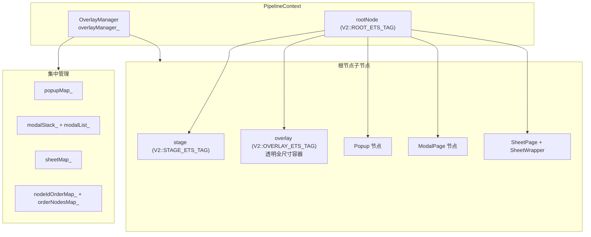

# 架构设计

> 浮层能力是 ArkUI 根视图层的 OverlayManager 机制，负责将 popup/menu/sheet/modal/dialog 等浮层节点挂载到根节点并集中管理生命周期、z-index 排序与子窗路由。

## 设计元数据

| 字段 | 内容 |
|------|------|
| Design ID | DESIGN-Func-04-08-03 |
| 关联需求 | 已有能力补录（无独立 requirement.md） |
| 关联 Epic | 无 |
| 目标 Feature | Feat-01 浮层能力 |
| 复杂度 | 高 |
| 目标版本 | API 7 起支持，API 12 引入 overlayManager NAPI 模块 |
| Owner | ArkUI SIG |
| 状态 | Baselined（已有实现补录） |

## 需求基线

| 字段 | 内容 |
|------|------|
| 问题陈述 | ArkUI 需要统一的浮层挂载机制，将 popup/menu/sheet/modal/dialog 等浮层节点挂载到根节点并提供 z-index 排序、子窗路由、生命周期管理与返回键拦截 |
| 核心目标 | （Feat-01）固化 OverlayManager 的浮层挂载、ShowPopup/ShowMenu/BindSheet/BindContentCover 生命周期、LevelMode OVERLAY/EMBEDDED 路由、子窗分发与 openOrderOverlay NAPI API 行为 |
| P0 AC | AC-1.1~1.5（OverlayManager 创建与挂载）、AC-2.1~2.4（popup 生命周期）、AC-3.1~3.3（modal/sheet 生命周期）、AC-4.1~4.4（LevelMode 与 z-index）、AC-5.1~5.4（NAPI overlayManager）、AC-6.1~6.3（子窗路由与返回键） |

## 上下文和现状

### 涉及仓和模块

| 仓库 | 模块路径 | 当前职责 | 本 Feature 影响 |
|------|----------|----------|-----------------|
| ace_engine | `frameworks/core/components_ng/pattern/overlay/overlay_manager.h/.cpp` | OverlayManager 核心类与全部浮层管理方法 | 全量涉及 |
| ace_engine | `frameworks/core/pipeline_ng/pipeline_context.h/.cpp` | 创建 OverlayManager 并绑定到 rootNode | 全量涉及 |
| ace_engine | `frameworks/base/subwindow/subwindow_manager.h/.cpp` | 子窗路由 ShowPopupNG/ShowMenuNG/ShowBindSheetNG | 全量涉及 |
| ace_engine | `frameworks/core/components_ng/base/view_abstract.cpp` | BindPopup/BindMenu/BindSheet/BindContentCover 桥接层路由决策 | 全量涉及 |
| ace_engine | `interfaces/napi/kits/overlay/js_overlay.cpp` | NAPI `@ohos.overlayManager` 模块导出 | 全量涉及 |
| ace_engine | `interfaces/inner_api/ace_kit/include/ui/view/overlay/overlay_manager.h` | Inner API Kit `Ace::Kit::OverlayManager` 抽象 | 全量涉及 |

### 调用链层级分析

| 层 | 模块 | 职责 | 修改类型 |
|----|------|------|----------|
| Pipeline | `pipeline_context.cpp:2097-2193` | SetupRootElement 创建 rootNode + OverlayManager | 无修改（规格补录） |
| Pipeline | `pipeline_context.cpp:2155,2283` | `overlayManager_ = MakeRefPtr<OverlayManager>(frameNode)` | 无修改（规格补录） |
| Core NG | `overlay_manager.h:143` / `.cpp` (7514 行) | OverlayManager 类：popupMap_/modalStack_/sheetMap_ + ShowPopup/BindSheet/BindContentCover/MountToParentWithService | 无修改（规格补录） |
| Bridge | `view_abstract.cpp:4615-4772` | BindPopup 子窗 vs Overlay 路由决策 | 无修改（规格补录） |
| Subwindow | `subwindow_manager.cpp:494-527` | ShowPopupNG/ShowMenuNG/ShowBindSheetNG 子窗分发 | 无修改（规格补录） |
| NAPI | `js_overlay.cpp:401-411` | `@ohos.overlayManager` 10 个导出函数 | 无修改（规格补录） |
| Inner API | `overlay_manager_impl.cpp:26-86` | Kit 层包装 NG::OverlayManager | 无修改（规格补录） |

### 适用架构规则

| 规则 ID | 设计结论 |
|---------|----------|
| OH-ARCH-01 | OverlayManager 由 PipelineContext 拥有，绑定到 stage 节点的父节点（浮层作为 stage 的兄弟节点） |
| OH-ARCH-02 | 子窗与 Overlay 双路径：IsShowInSubWindow 时走 SubwindowManager 子窗 OverlayManager，否则走主 OverlayManager |
| OH-ARCH-03 | SceneBoard 窗口模式下 FindWindowScene 将浮层挂载到 WindowScene 而非全局根，实现逐窗口隔离 |
| OH-ARCH-04 | modalStack_(LIFO) + modalList_(遍历) 双结构支持返回键 LIFO 弹出与批量清理 |
| OH-ARCH-05 | LevelMode::OVERLAY 挂载到全局根，LevelMode::EMBEDDED 通过 DialogManager::GetEmbeddedOverlay 挂载到页面级 OverlayManager |

## 不涉及项承接

| 维度 | 结论 |
|------|------|
| 性能 | N/A — 浮层挂载为 O(1)，z-index 查找为 O(log n)（std::map） |
| 安全与权限 | N/A — 浮层为纯 UI 机制 |
| 兼容性 | 展开设计 — API 12/26 版本门控差异 |
| 构建与部件 | N/A — 源码已包含在既有 source set 中 |

## 关键设计决策

| 决策 ID | 问题 | 推荐方案 | 探索过的替代方案 | 取舍理由 | 影响 |
|---------|------|----------|------------------|----------|------|
| ADR-1 | OverlayManager 绑定到哪个节点 | stage 节点的父节点（浮层作为 stage 兄弟） | 绑定到绝对根节点 | 挂载在 stage 旁可避免被 stage 裁剪 | 原子服务时插入到 AppBar 前 |
| ADR-2 | popup/menu 子窗 vs Overlay 路由 | IsShowInSubWindow 检查后双路径分发 | 统一走 Overlay | 子窗可跨窗口显示浮层 | 需维护两套 OverlayManager |
| ADR-3 | modal 栈结构 | modalStack_(stack) + modalList_(list) 双结构 | 仅 stack | stack 支持 LIFO 返回键弹出，list 支持遍历清理 | 需同步维护两个容器 |
| ADR-4 | z-index 管理 | nodeIdOrderMap_ + orderNodesMap_(std::map<double,...>) | 单一 vector 排序 | std::map 有序查找 O(log n)，支持插入到指定位置 | PutLevelOrder/PopLevelOrder 维护双 map |
| ADR-5 | EMBEDDED 模式路由 | DialogManager::GetEmbeddedOverlay(uniqueId) 查找页面级 OverlayManager | 仅全局 Overlay | 支持在 NavDestination 内挂载浮层 | popupInfo.embeddedOveraly 字段路由 |
| ADR-6 | overlay 容器节点 | CreateOverlayNode 创建 OVERLAY_ETS_TAG 透明全尺寸容器 | 直接挂载到 root | 透明容器隔离浮层 hit-test | HitTestMode::HTMTRANSPARENT_SELF |

## 设计骨架

### 骨架范围

| 骨架项 | 目标 | 不包含 | 验证方式 |
|--------|------|--------|----------|
| OverlayManager 创建 | PipelineContext::SetupRootElement 绑定到 stage 父节点 | 子窗 OverlayManager | 代码审查 |
| popup 生命周期 | ShowPopup/MountPopup/HidePopup/ErasePopup | popup 内部布局 | 代码审查 |
| modal/sheet 生命周期 | HandleModalShow/HandleModalPop/OnBindSheet/CleanSheet | sheet 内部布局 | 代码审查 |
| LevelMode 与 z-index | OVERLAY/EMBEDDED 路由 + nodeIdOrderMap_ | 具体浮层内容 | 代码审查 |
| NAPI overlayManager | addFrameNode/openOrderOverlay/showNode 等 10 个导出 | ANI 实现 | 代码审查 |

### 骨架 Spec 拆分

| Task ID | 目标 | 受影响文件 | AC |
|---------|------|------------|-----|
| TASK-SKELETON-1 | OverlayManager 创建与挂载 | `pipeline_context.cpp:2097-2193,2155` | AC-1.1~1.5 |
| TASK-SKELETON-2 | popup 生命周期 | `overlay_manager.cpp:946-1591` | AC-2.1~2.4 |
| TASK-SKELETON-3 | modal/sheet 生命周期 | `overlay_manager.cpp:3201-4502` | AC-3.1~3.3 |
| TASK-SKELETON-4 | LevelMode 与 z-index | `overlay_manager.cpp:1964-2132,6938-6975` | AC-4.1~4.4 |
| TASK-SKELETON-5 | NAPI overlayManager | `js_overlay.cpp:401-411` | AC-5.1~5.4 |

## 后续 Task 拆分

| Task ID | 目标 | 受影响文件 | 依赖 |
|---------|------|------------|------|
| TASK-1 | 浮层能力全部行为规格 | Feat-01-overlay-capability-spec.md | 无 |

## API 签名、Kit 与权限

### 新增 API

| API 签名 | 类型 | d.ts 位置 | 权限要求 | SysCap |
|----------|------|-----------|----------|--------|
| `OverlayManager` (C++ 类) | InnerApi | `overlay_manager.h:143` | - | ArkUI |
| `addFrameNode(node, index?)` | Public(NAPI) | `@ohos.overlayManager` | - | ArkUI |
| `openOrderOverlay(node, options)` | Public(NAPI) | `@ohos.overlayManager` | - | ArkUI |
| `setOverlayManagerOptions(options)` | Public(NAPI) | `@ohos.overlayManager` | - | ArkUI |

### 变更/废弃 API

| 原有 API | 变更类型 | 新 API | 迁移说明 |
|----------|----------|--------|----------|
| — | — | — | 无变更/废弃 API |

## 构建系统影响

### BUILD.gn 变更

无变更。

### bundle.json 变更

无变更。

## 可选设计扩展

### 架构图



### 数据流/控制流

| 步骤 | 调用方 | 被调用方 | 数据/接口 | 说明 |
|------|--------|----------|-----------|------|
| 1 | PipelineContext | OverlayManager::OverlayManager(rootNode) | rootNodeWeak_ | 构造时绑定根节点 |
| 2 | ViewAbstract::BindPopup | OverlayManager::ShowPopup | targetId + PopupInfo | 路由决策后分发 |
| 3 | OverlayManager | MountToParentWithService | rootNode + popupNode + levelOrder | 挂载到根 |
| 4 | OverlayManager | UpdatePopupMap / ErasePopup | targetId | popupMap_ 增删 |
| 5 | OverlayManager | HandleModalShow | buildNodeFunc + ModalPresentationPattern | 创建 ModalPage 节点 |
| 6 | OverlayManager | SaveSheetPageNode | sheetKey + sheetMap_ | sheet 注册 |

### 数据模型设计

```cpp
struct PopupInfo {
    int32_t popupId;
    WeakPtr<FrameNode> target;
    RefPtr<FrameNode> popupNode;
    bool isCurrentOnShow;
    bool focusable;
    bool isAvoidKeyboard;
    bool isTips;
    RefPtr<OverlayManager> embeddedOveraly; // EMBEDDED 模式
};
struct DismissTarget { int32_t targetIdOfModal; SheetKey sheetKey; bool targetIsSheet; };
struct OverlayManagerInfo { bool renderRootOverlay; bool enableBackPressedEvent; function<bool()> onBackPress; };
```

## 详细设计

### OverlayManager 创建与绑定

**入口**: `PipelineContext::SetupRootElement` (`pipeline_context.cpp:2097-2193`)

1. `rootNode_ = FrameNode::CreateFrameNodeWithTree(V2::ROOT_ETS_TAG, ...)` with RootPattern
2. `stageNode = FrameNode::CreateFrameNode(V2::STAGE_ETS_TAG, ...)`
3. `frameNode = installationFree_ ? atomicService->GetParent() : stageNode->GetParent()`
4. `overlayManager_ = MakeRefPtr<OverlayManager>(frameNode)` — 绑定到 stage 父节点

### Popup 生命周期

**Show** (`overlay_manager.cpp:946-974`): UpdatePopupMap → MountPopup → ShowPopupAnimationNG
**Mount** (`overlay_manager.cpp:1264-1339`): MountToParentWithService → MarkDirtyNode(PROPERTY_UPDATE_MEASURE_SELF) → isCurrentOnShow=true
**Hide** (`overlay_manager.cpp:1369-1436`): checkAndSetExitingStatus → HidePopupAnimation → ErasePopup
**Erase** (`overlay_manager.cpp:1562-1591`): RemoveChildWithService → MarkDirtyNode → popupMap_.erase

### Modal/Sheet 生命周期

**HandleModalShow** (`overlay_manager.cpp:3268-3359`): buildNodeFunc → CreateFrameNode(MODAL_PAGE_TAG) → MountToParentWithService → modalStack_.push + modalList_.emplace_back → transition
**HandleModalPop** (`overlay_manager.cpp:3361-3416`): GetModal → ModalPageLostFocus → onWillDisappear → transition out → RemoveChildWithService → RemoveModal
**OnBindSheetInner** (`overlay_manager.cpp:4284-4351`): createSheetPage(SHEET_PAGE_TAG) → SetSheetProperty → SaveSheetPageNode → MountSheetWrapperAndChildren → PlaySheetTransition
**CloseSheet** (`overlay_manager.cpp:3721-3740`): sheetMap_ 查找 → sheetPatternModifier dismiss

### LevelMode 路由与 z-index

**FindWindowScene** (`overlay_manager.cpp:5324-5338`): SceneBoard 模式下遍历父节点找 WINDOW_SCENE_ETS_TAG，否则返回 rootNodeWeak_
**GetEmbeddedNode** (`overlay_manager.cpp:938-944`): popupInfo.embeddedOveraly 非空时返回嵌入式根，否则返回全局根
**MountToParentWithOrder** (`overlay_manager.cpp:6938-6975`): GetNextNodeWithOrder 查找插入位置 → MountToParentBefore/MountToParent → PutLevelOrder 注册
**PutLevelOrder** (`overlay_manager.cpp:1980-1991`): nodeIdOrderMap_[nodeId] = order + orderNodesMap_[order].push_back

### 返回键拦截

**RemoveOverlay** (`overlay_manager.cpp:2491-2552`): indexer popup 清理 → onBackPress 回调 → RemoveOverlayCommon(dialog/menu/bubble) → RemoveModalInOverlay/RemoveAllModalInOverlay → RemoveNonKeyboardOverlay

## 风险和开放问题

| 项 | 类型 | 影响 | 处理方式 | Owner |
|----|------|------|----------|-------|
| 子窗与 Overlay 双路径维护复杂 | 架构 | 高 | 文档化路由决策逻辑 | ArkUI SIG |
| modalStack_ 与 modalList_ 需同步 | 架构 | 中 | DeleteModal 后从 modalList_ 重建 modalStack_ | ArkUI SIG |
| @ohos.overlayManager 无独立 d.ts | 文档 | 中 | 以 NAPI 导出函数为准 | ArkUI SIG |
| API 26 ThemeScopeId 门控 | 兼容性 | 低 | 兼容性声明标注 | ArkUI SIG |

## 设计审批

- [x] 需求基线已确认
- [x] 不涉及项已承接
- [x] 涉及仓和模块职责清楚
- [x] 适用架构规则已识别
- [x] API 变更有签名说明
- [x] BUILD.gn/bundle.json 影响明确
- [x] 关键设计决策有理由和影响说明
- [x] 风险和开放问题有 Owner

**结论:** 通过（已有实现补录）
