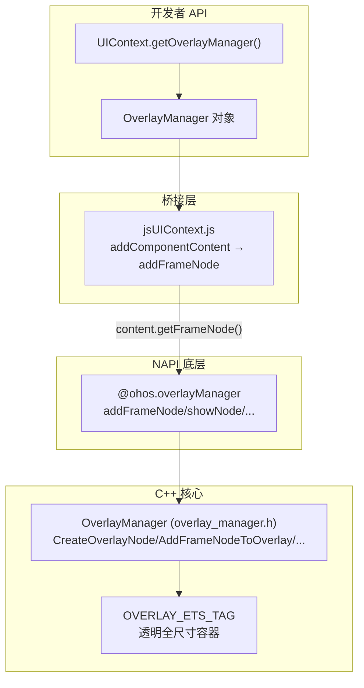

# 架构设计

> 浮层能力（OverlayManager）是 ArkUI 提供的在 Page 之上、Dialog/Popup/Menu/Sheet/Toast 之下展示自定义 UI 内容的浮层管理能力，通过 `UIContext.getOverlayManager()` 获取 OverlayManager 对象，支持添加/删除/显示/隐藏 ComponentContent 节点与 z-index 层级管理。

## 设计元数据

| 字段 | 内容 |
|------|------|
| Design ID | DESIGN-Func-04-08-03 |
| 关联需求 | 已有能力补录（无独立 requirement.md） |
| 关联 Epic | 无 |
| 目标 Feature | Feat-01 浮层能力 |
| 复杂度 | 中等 |
| 目标版本 | API 12 起支持 OverlayManager 类，API 18 起 addComponentContentWithOrder，API 15 起 OverlayManagerOptions，API 26 起 openOrderOverlay |
| Owner | ArkUI SIG |
| 状态 | Baselined（已有实现补录） |

## 需求基线

| 字段 | 内容 |
|------|------|
| 问题陈述 | 应用需要在 Page 之上但 Dialog/Popup/Menu 等之下展示常驻悬浮内容（如悬浮球、常驻提示），且需控制多个浮层节点的层级顺序 |
| 核心目标 | （Feat-01）固化 OverlayManager 的 addComponentContent/removeComponentContent/showComponentContent/hideComponentContent/showAllComponentContents/hideAllComponentContents/addComponentContentWithOrder/openOrderOverlay/setOverlayManagerOptions API 行为与层级约束 |
| P0 AC | AC-1.1~1.4（添加节点）、AC-2.1~2.2（删除节点）、AC-3.1~3.3（显示/隐藏）、AC-4.1~4.3（有序添加与 LevelOrder）、AC-5.1~5.3（openOrderOverlay 与 LevelMode）、AC-6.1~6.3（OverlayManagerOptions）、AC-7.1~7.4（层级约束与事件） |

## 上下文和现状

### 涉及仓和模块

| 仓库 | 模块路径 | 当前职责 | 本 Feature 影响 |
|------|----------|----------|-----------------|
| ace_engine | `frameworks/core/components_ng/pattern/overlay/overlay_manager.h/.cpp` | OverlayManager 核心：CreateOverlayNode/AddFrameNodeToOverlay/ShowNodeOnOverlay 等 | 全量涉及 |
| ace_engine | `frameworks/bridge/declarative_frontend/engine/jsUIContext.js:1914-1968` | OverlayManager 桥接层：addComponentContent → addFrameNode 委托 | 全量涉及 |
| ace_engine | `interfaces/napi/kits/overlay/js_overlay.cpp` | NAPI `@ohos.overlayManager` 底层导出 | 全量涉及 |
| ace_engine | `frameworks/core/components_ng/pattern/overlay/overlay_options.h` | OrderOverlayOptions 结构 |
| ace_engine | `frameworks/core/components_ng/pattern/overlay/level_mode.h` / `level_order.h` | LevelMode 枚举 / LevelOrder 类 |

### 调用链层级分析

| 层 | 模块 | 职责 | 修改类型 |
|----|------|------|----------|
| SDK API | `arkts-apis-uicontext-overlaymanager.md` | OverlayManager 类公开 API 定义 | 无修改（规格补录） |
| Bridge | `jsUIContext.js:1914-1968` | addComponentContent → ohos_overlayManager.addFrameNode(content.getFrameNode(), index) | 无修改（规格补录） |
| NAPI | `js_overlay.cpp:46,99,204,239,256,273,290,305,320,379` | @ohos.overlayManager 底层 addFrameNode/addFrameNodeWithOrder/openOrderOverlay/removeFrameNode/showNode/hideNode/showAllFrameNodes/hideAllFrameNodes/setOverlayManagerOptions/getOverlayManagerOptions | 无修改（规格补录） |
| Core NG | `overlay_manager.h:559-595` | CreateOverlayNode/AddFrameNodeToOverlay/AddFrameNodeWithOrder/OpenOrderOverlay/RemoveFrameNodeOnOverlay/ShowNodeOnOverlay/HideNodeOnOverlay/ShowAllNodesOnOverlay/HideAllNodesOnOverlay/SetOverlayManagerOptions/GetOverlayManagerOptions | 无修改（规格补录） |

### 适用架构规则

| 规则 ID | 设计结论 |
|---------|----------|
| OH-ARCH-01 | OverlayManager 通过 UIContext.getOverlayManager() 获取，绑定到 PipelineContext 的 overlayManager_ |
| OH-ARCH-02 | 浮层层级在 Page 之上、Dialog/Popup/Menu/BindSheet/BindContentCover/Toast 之下 |
| OH-ARCH-03 | 桥接层通过 content.getFrameNode() 从 ComponentContent 提取 FrameNode，委托给 NAPI @ohos.overlayManager |
| OH-ARCH-04 | index 参数控制层级：≥0 越大越高、相同 index 后添加更高、<0/null/undefined 最高 |
| OH-ARCH-05 | LevelOrder(@since 18) 和 OrderOverlayOptions(@since 26) 提供精确 z-index 控制 |

## 不涉及项承接

| 维度 | 结论 |
|------|------|
| 性能 | N/A — 浮层操作为 O(1)，z-index 查找 O(log n) |
| 安全与权限 | N/A — 纯 UI 机制 |
| 兼容性 | 展开设计 — API 12/15/18/19/26 版本演进 |
| 构建与部件 | N/A |

## 关键设计决策

| 决策 ID | 问题 | 推荐方案 | 探索过的替代方案 | 取舍理由 | 影响 |
|---------|------|----------|------------------|----------|------|
| ADR-1 | 浮层节点容器 | CreateOverlayNode 创建 OVERLAY_ETS_TAG 透明全尺寸容器插入 stage 之后 | 直接挂载到 root | 透明容器隔离浮层 hit-test | HitTestMode::HTMTRANSPARENT_SELF |
| ADR-2 | API 分层 | UIContext.getOverlayManager() 高层 API + @ohos.overlayManager NAPI 底层 API | 仅高层 API | NAPI 支持 C 侧直接操作 FrameNode | 桥接层 content.getFrameNode() 转换 |
| ADR-3 | z-index 控制 | index 参数(@since 12) + LevelOrder(@since 18) + OrderOverlayOptions(@since 26) 三级演进 | 仅 index | LevelOrder 支持精确浮点排序，OrderOverlayOptions 支持 EMBEDDED 模式 | 三级 API 共存 |
| ADR-4 | 重复添加处理 | 同一 ComponentContent 添加多次只保留最后一次 | 报错或保留全部 | 避免重复节点，开发者无感 | removeComponentContent 只需调用一次 |
| ADR-5 | 显示/隐藏无动画 | 节点 show/hide 时无默认动画 | 默认淡入淡出 | 常驻浮层场景无需动画干扰 | 开发者自行添加动画 |
| ADR-6 | 事件机制 | WrappedBuilder 装饰的组件优先接收事件 | 事件透传到 Page | 默认拦截，HitTestMode.Transparent 透传 | 需开发者设置 hitTestBehavior |

## 设计骨架

### 骨架范围

| 骨架项 | 目标 | 不包含 | 验证方式 |
|--------|------|--------|----------|
| OverlayManager 获取 | UIContext.getOverlayManager() | popup/sheet/modal 生命周期 | 代码审查 |
| 添加节点 | addComponentContent + addComponentContentWithOrder | popup 内部布局 | 代码审查 |
| 删除节点 | removeComponentContent | modal 弹出 | 代码审查 |
| 显示/隐藏 | showComponentContent/hideComponentContent/showAll/hideAll | sheet 动画 | 代码审查 |
| 有序浮层 | openOrderOverlay + OrderOverlayOptions | dialog 管理 | 代码审查 |
| 选项配置 | setOverlayManagerOptions/getOverlayManagerOptions | — | 代码审查 |

### 骨架 Spec 拆分

| Task ID | 目标 | 受影响文件 | AC |
|---------|------|------------|-----|
| TASK-SKELETON-1 | 添加/删除节点 | `jsUIContext.js:1914-1937` / `overlay_manager.cpp` | AC-1.1~1.4, AC-2.1~2.2 |
| TASK-SKELETON-2 | 显示/隐藏节点 | `jsUIContext.js:1940-1961` | AC-3.1~3.3 |
| TASK-SKELETON-3 | 有序添加与 openOrderOverlay | `jsUIContext.js:1924-1931,1964-1968` | AC-4.1~4.3, AC-5.1~5.3 |
| TASK-SKELETON-4 | OverlayManagerOptions | `jsUIContext.js:1900-1912` | AC-6.1~6.3 |

## 后续 Task 拆分

| Task ID | 目标 | 受影响文件 | 依赖 |
|---------|------|------------|------|
| TASK-1 | 浮层能力全部行为规格 | Feat-01-overlay-capability-spec.md | 无 |

## API 签名、Kit 与权限

### 新增 API

| API 签名 | 类型 | d.ts 位置 | 权限要求 | SysCap |
|----------|------|-----------|----------|--------|
| `getOverlayManager(): OverlayManager` | Public | `arkts-apis-uicontext-uicontext.md#getoverlaymanager12` | - | ArkUI.Full |
| `addComponentContent(content: ComponentContent, index?: number): void` | Public | `arkts-apis-uicontext-overlaymanager.md#addcomponentcontent12` | - | ArkUI.Full |
| `addComponentContentWithOrder(content: ComponentContent, levelOrder?: LevelOrder): void` | Public | `#addcomponentcontentwithorder18` | - | ArkUI.Full |
| `removeComponentContent(content: ComponentContent): void` | Public | `#removecomponentcontent12` | - | ArkUI.Full |
| `showComponentContent(content: ComponentContent): void` | Public | `#showcomponentcontent12` | - | ArkUI.Full |
| `hideComponentContent(content: ComponentContent): void` | Public | `#hidecomponentcontent12` | - | ArkUI.Full |
| `showAllComponentContents(): void` | Public | `#showallcomponentcontents12` | - | ArkUI.Full |
| `hideAllComponentContents(): void` | Public | `#hideallcomponentcontents12` | - | ArkUI.Full |
| `openOrderOverlay(content: ComponentContent, options?: OrderOverlayOptions): Promise<void>` | Public | `#openorderoverlay` (@since 26) | - | ArkUI.Full |
| `setOverlayManagerOptions(options: OverlayManagerOptions): void` | Public | `arkts-apis-uicontext-i.md#overlaymanageroptions15` (@since 15) | - | ArkUI.Full |

### 变更/废弃 API

| 原有 API | 变更类型 | 新 API | 迁移说明 |
|----------|----------|--------|----------|
| — | — | — | 无变更/废弃 API |

## 构建系统影响

### BUILD.gn 变更

无变更。

### bundle.json 变更

无变更。

## 可选设计扩展

### 架构图



### 数据流/控制流

| 步骤 | 调用方 | 被调用方 | 数据/接口 | 说明 |
|------|--------|----------|-----------|------|
| 1 | 开发者 | UIContext.getOverlayManager() | — | 获取 OverlayManager 对象 |
| 2 | 开发者 | OverlayManager.addComponentContent(content, index) | ComponentContent + index | 桥接层提取 getFrameNode() |
| 3 | jsUIContext | @ohos.overlayManager.addFrameNode(frameNode, index) | FrameNode + index | NAPI 委托 |
| 4 | NAPI | OverlayManager::AddFrameNodeToOverlay | node + index | CreateOverlayNode + 挂载 |
| 5 | OverlayManager | CreateOverlayNode | OVERLAY_ETS_TAG | 透明容器插入 stage 之后 |
| 6 | OverlayManager | PutLevelOrder | nodeId + order | 注册到 nodeIdOrderMap_ |

### 数据模型设计

```typescript
// OrderOverlayOptions (@since 26)
interface OrderOverlayOptions {
    levelOrder?: LevelOrder;   // 默认 clamp(0)
    levelMode?: LevelMode;     // 默认 OVERLAY
    levelUniqueId?: number;    // 仅 EMBEDDED 时生效
}
// OverlayManagerOptions (@since 15)
interface OverlayManagerOptions {
    renderRootOverlay: boolean;
    enableBackPressedEvent: boolean;
    onBackPress: () => boolean;
}
```

## 详细设计

### 浮层容器创建

**入口**: `OverlayManager::CreateOverlayNode` (`overlay_manager.cpp:6016-6045`)

1. 检查 overlayNode_ 是否已存在，已存在则返回
2. 获取 rootNode 和 stageNode
3. 根据 overlayInfo_.renderRootOverlay 创建 OVERLAY_ETS_TAG 节点（FrameNode 或 CommonNode）
4. 设置 HitTestMode::HTMTRANSPARENT_SELF（透明 hit-test）
5. 设置理想尺寸 100% x 100%
6. `rootNode->AddChildAfter(overlayNode_, stageNode)` 插入到 stage 之后

### 添加节点

**入口**: `OverlayManager::AddFrameNodeToOverlay` (`overlay_manager.h:560`)

1. CreateOverlayNode 确保容器存在
2. 根据 index 计算层级位置
3. 将 FrameNode 挂载到 overlayNode_ 容器
4. 同一 ComponentContent 重复添加时只保留最后一次

### 有序添加

**入口**: `OverlayManager::AddFrameNodeWithOrder` (`overlay_manager.h:561`) / `OpenOrderOverlay` (`overlay_manager.h:564`)

1. AddFrameNodeWithOrder(@since 18): 通过 LevelOrder 指定精确 z-index
2. OpenOrderOverlay(@since 26): 通过 OrderOverlayOptions 指定 levelOrder + levelMode + levelUniqueId
3. LevelMode=EMBEDDED 时通过 levelUniqueId 查找页面级 OverlayManager

### 显示/隐藏

**入口**: `ShowNodeOnOverlay` / `HideNodeOnOverlay` (`overlay_manager.h:568-569`)

1. 在 overlayNode_ 子节点中查找目标 FrameNode
2. 设置可见性（无默认动画）
3. ShowAllNodesOnOverlay / HideAllNodesOnOverlay 批量操作

## 风险和开放问题

| 项 | 类型 | 影响 | 处理方式 | Owner |
|----|------|------|----------|-------|
| API < 19 不支持侧滑关闭 | 兼容性 | 中 | 需在 onBackPress 中添加关闭逻辑 | ArkUI SIG |
| 同一 ComponentContent 重复添加只保留最后 | 行为 | 低 | 文档化说明 | ArkUI SIG |
| 事件默认被 WrappedBuilder 拦截 | 行为 | 中 | 需设置 HitTestMode.Transparent 透传 | ArkUI SIG |
| @ohos.overlayManager NAPI 无独立 d.ts | 文档 | 低 | 以 SDK OverlayManager 类 API 为准 | ArkUI SIG |

## 设计审批

- [x] 需求基线已确认
- [x] 不涉及项已承接
- [x] 涉及仓和模块职责清楚
- [x] 适用架构规则已识别
- [x] API 变更有签名说明
- [x] BUILD.gn/bundle.json 影响明确
- [x] 关键设计决策有理由和影响说明
- [x] 风险和开放问题有 Owner

**结论:** 通过（已有实现补录）
