# 架构设计

> 确认焦点机制功能域的目标仓和模块架构约束、关键设计决策、Spec 拆分方向。本文件是 `Func-04-09-01` 所有 Feat 共享的设计基线。

## 设计元数据

| 属性 | 值 |
|------|-----|
| Design ID | DESIGN-Func-04-09-01 |
| 关联需求 | 已有能力补录（无独立 requirement.md） |
| 关联 Epic | 无 |
| 目标 Feature | Feat-01 焦点树与节点状态模型，Feat-02 焦点请求、清除与切换事务，Feat-03 焦点导航与遍历算法，Feat-04 焦点域、分组与优先级，Feat-05 默认焦点、FocusView 与焦点恢复，Feat-06 焦点激活与视觉指示 |
| 复杂度 | 复杂 |
| 目标版本 | 当前 NG 实现；Feat-06 Native 激活 API 自 API 15 提供且键盘点击存在 Target API 18 分支，Feat-04 公共属性自 API 23 提供，Feat-05 UIExtensionWindow 恢复存在 Target API 26 分支 |
| Owner | ArkUI SIG |
| 状态 | Baselined（已有实现补录） |

## 需求基线

> 本功能域为已有实现补录，无独立 proposal.md。以下结论来自用户确认的 Feat 拆分、范围问答和 ace_engine 源码取证。

| 项 | 补充说明（如需） |
|----|------------------|
| 功能域边界 | `04-09-01` 描述焦点框架内部机制；公共 ArkTS 焦点属性由 `04-03-03-Feat-05` 承接 |
| Feat-01 范围 | 覆盖节点类型、宿主、焦点树投影、可聚焦性、生命周期输入和 FreeNode 最终一致性 |
| Feat-02 范围 | 覆盖请求调度、立即准入、按 ID 同步/异步语义、层级切换、失焦移除、FocusGuard 提交、窗口事务合并和 FreeNode 延迟清理 |
| Feat-03 范围 | 覆盖按键意图、事件路由、nextFocus、Tab/Shift+Tab、线性与首尾遍历、tabIndex、PROJECT_AREA、自定义算法及 FocusView 运行时边界 |
| Feat-04 范围 | 覆盖 focusScopeId 注册、焦点组与嵌套边界、arrowKeyStepOut、PRIOR/PREVIOUS 列表顺序、优先历史接入及生命周期清理 |
| Feat-05 范围 | 覆盖 defaultFocus/groupDefaultFocus、FocusView 合法性与 ViewRoot、show/hide/close 栈、首次与历史恢复、modal、autoFocusTransfer、窗口及 API 26 分支 |
| Feat-06 范围 | 覆盖 focus active 原因与准入、输入自动激活/失活、跨窗口同步、focused 状态样式、FocusStyle/FocusPaintParam/FocusBox、焦点链兜底与清理、API 18 点击门槛 |
| 完整 NG 路径 | 覆盖 FrameNode/EventHub 主路径、FreeNode/多线程分支及已有 UT |
| 版本策略 | 记录全部可识别的 Target API/Container 分支；Feat-06 固化 Target API 18 inactive 键盘点击门槛；Feat-05 固化 UIExtensionWindow 在 Target API 26 起仅于 focus active 时重置 ViewRoot 标志的差异 |
| 实现原则 | 当前实现即规格；不在补录过程中修正、重构或扩展产品行为 |

## 上下文和现状

### 涉及仓和模块

| 仓库 | 补充架构说明 |
|------|--------------|
| `arkui_ace_engine` | `frameworks/core/components_ng/event/` 定义 FocusPattern、FocusState、FocusHub 和基础判定；`base/` 提供 FrameNode 所有权与 UINode 焦点树投影；`base/*multi_thread*` 提供 FreeNode 挂树后任务；`test/unittest/core/event/focus_core/` 提供 UT 证据 |
| `arkui_ace_engine`（Feat-02） | `frameworks/core/pipeline_ng/` 提供 dirty focus 调度与按 ID 查找；`components_ng/manager/focus/` 提供 FocusGuard 事务；`interfaces/napi/`、`interfaces/ets/ani/` 和 `interfaces/native/` 提供既有请求/清除入口；`test/unittest/core/pipeline/` 与 `core/manager/` 提供事务证据 |
| `arkui_ace_engine`（Feat-03） | `frameworks/core/components_ng/event/focus_event_handler.cpp` 负责意图和事件路由；`focus_hub.cpp` 负责线性、空间、tabIndex、首尾和自定义算法；`core/common/key_event_manager.cpp` 提供 NG tabIndex 生产分发；List/Grid Pattern 和 FocusManager 提供自定义算法与 FocusView 接入 |
| `arkui_ace_engine`（Feat-04） | `components_ng/manager/focus/focus_manager.*` 维护 Scope/priority 注册表；`focus_hub.*` 实现注册、分组和候选选择；动态/静态前端与 Native Style Modifier 提供 API 23 属性入口；`focus_hub_multithread.cpp` 处理 FreeNode 延迟注册 |
| `arkui_ace_engine`（Feat-05） | `components_ng/manager/focus/focus_view.*` 定义 ViewRoot 和恢复策略；`focus_manager.*` 维护普通/modal View 栈和窗口恢复；`focus_hub.cpp` 接入默认节点、ViewRoot 与步进 View；`pipeline_context.cpp` 在帧末刷新当前 View |
| `arkui_ace_engine`（Feat-06） | `focus_manager.*` 维护 active 状态与跨窗口同步；`pipeline_context.cpp`、`key_event_manager.cpp` 接入 pointer/key 输入；`focus_hub.*`、`focus_box.*` 定义状态样式、焦点框参数、焦点链绘制和清理；Native/ArkTS 入口提供激活与 focusBox 配置 |

### 调用链层级分析

| 层 | 模块 | 职责 | 修改类型 |
|----|------|------|----------|
| 组件 Pattern 层 | `frameworks/core/components_ng/pattern/pattern.cpp:114-117` 及各组件 Pattern | 提供 FocusPattern，定义组件初始 FocusType 与默认 focusable | 存量行为补录 |
| 节点生命周期层 | `frameworks/core/components_ng/base/frame_node.cpp:1051-1054,4637-4684` | 在非 DISABLE Pattern 初始化时创建 FocusHub，并在 FrameNode 中幂等缓存 | 存量行为补录 |
| 事件宿主层 | `frameworks/core/components_ng/event/event_hub.cpp:766-785,1073-1098` | 委托 FrameNode 创建/查询 FocusHub；提供 enabled 生效值与开发者值 | 存量行为补录 |
| 焦点状态层 | `frameworks/core/components_ng/event/focus_state.h:31-96` | 保存当前焦点、FocusType、宿主弱引用和历史焦点弱引用链 | 存量行为补录 |
| 焦点规则层 | `frameworks/core/components_ng/event/focus_hub.cpp:217-306,736-1028,2234-2270` | 实现焦点树查询、NODE/SCOPE 判定、显式/隐式优先级和生命周期通知 | 存量行为补录 |
| UI 树投影层 | `frameworks/core/components_ng/base/ui_node.cpp:929-1017` | 将普通 UINode 树投影为 SCOPE/NODE/DISABLE 焦点关系并定义 Screen 边界 | 存量行为补录 |
| 多线程调度层 | `frameworks/core/components_ng/event/focus_hub_multithread.cpp:22-57`、`base/ui_node_multi_thread.cpp:105-130` | 将 FreeNode 的焦点树副作用延迟到挂主树后执行 | 存量行为补录 |
| 验证层 | `test/unittest/core/event/focus_core/` | 验证创建、父链、类型矩阵、优先级、whole-path 与历史叶节点 | 规格追溯补齐 |
| 开放入口层（Feat-02） | `interfaces/napi/kits/focus_controller/js_focus_controller.cpp:26-101`、`interfaces/native/node/native_interface_focus.cpp:24-48` | 将 ArkTS/ANI/C API 请求与清除入口适配到 Pipeline/ViewAbstract | （Feat-02）存量接口行为核验 |
| 请求调度层（Feat-02） | `frameworks/core/pipeline_ng/pipeline_context.cpp:1803-1881,5436-5480` | 维护 NODE、SCOPE、按 ID 三个单槽位并在 UI 帧 Flush | （Feat-02）存量行为补录 |
| 请求与层级切换层（Feat-02） | `frameworks/core/components_ng/event/focus_hub.cpp:505-715,1263-1280,1384-1407,2480-2539` | 执行准入、父 Scope 切换、失焦、移除和按 ID 调度 | （Feat-02）存量行为补录 |
| 事务提交层（Feat-02） | `frameworks/core/components_ng/manager/focus/focus_manager.cpp:398-569` | 以最外层 FocusGuard 合并候选焦点、监听通知、history 清理和重绘触发 | （Feat-02）存量行为补录 |
| 验证层（Feat-02） | `test/unittest/core/event/focus_core/`、`test/unittest/core/pipeline/`、`test/unittest/core/manager/` | 验证请求结果、切换、移除、槽位清理与 FocusManager 字段状态 | （Feat-02）规格追溯补齐 |
| 按键事件层（Feat-03） | `frameworks/core/components_ng/event/focus_event_handler.cpp:28-225`、`focus_hub.cpp:309-361` | 将 KeyEvent 归一化为 FocusIntension，并按 KeyProcessingMode 路由节点、祖先与导航 | （Feat-03）存量行为补录 |
| 导航算法层（Feat-03） | `frameworks/core/components_ng/event/focus_hub.cpp:1098-1524,2189-2327,2542-2729,3252-3328` | 执行用户指定目标、线性/空间/tabIndex、首尾、TabStop 和焦点组边界算法 | （Feat-03）存量行为补录 |
| 组件与视图接入层（Feat-03） | `frameworks/core/common/key_event_manager.cpp:536-550`、List/Grid Pattern、`components_ng/manager/focus/focus_manager.cpp:76-120` | 分发 tabIndex，按 Pattern 注入自定义算法，并维护步进进入 FocusView 的视图栈语义 | （Feat-03）存量行为补录 |
| 验证层（Feat-03） | `test/unittest/core/event/focus_core/`、`linear_focus_test.h`、Container/FocusView 相关 UT | 验证意图、遍历、RTL、tabIndex、几何寻焦和运行时边界 | （Feat-03）规格追溯补齐 |
| 属性入口层（Feat-04） | `js_view_abstract.cpp:13480-13520`、`arkts_native_common_bridge.cpp:11042-11112`、`style_modifier.cpp:1813-1902` | 解析 focusScopeId/focusScopePriority 默认值、枚举和错误结果 | （Feat-04）既有 API 行为核验 |
| 域注册层（Feat-04） | `focus_manager.cpp:329-395` | 以 ID 维护 Scope WeakPtr 和 priority WeakPtr list | （Feat-04）存量行为补录 |
| 分组与优先选择层（Feat-04） | `focus_hub.cpp:2773-3055` | 注册/清理 Scope、维护 group 边界、筛选后代候选并改写历史链 | （Feat-04）存量行为补录 |
| 多线程与生命周期层（Feat-04） | `focus_hub_multithread.cpp:59-90`、`focus_manager.cpp:182-203` | FreeNode attach 后注册，FocusView 关闭时清理域和 priority | （Feat-04）存量行为补录 |
| 默认属性与搜索层（Feat-05） | `js_view_abstract.cpp:13345-13363`、`focus_hub.cpp:2300-2357` | 设置 default/groupDefault 标记，并在 FocusView 边界内按树序搜索 | （Feat-05）既有 API 行为核验 |
| FocusView 模型层（Feat-05） | `components_ng/manager/focus/focus_view.cpp:23-428` | 解析 ViewRoot Scope、维护根聚焦标志并执行首次/历史恢复 | （Feat-05）存量行为补录 |
| View 栈与窗口恢复层（Feat-05） | `focus_manager.cpp:76-228,572-623,743-777`、`pipeline_context.cpp:1885-1908` | 维护 show/hide/close、modal、autoFocusTransfer、窗口和 API 26 恢复分支 | （Feat-05）存量行为补录 |
| 激活状态层（Feat-06） | `focus_manager.cpp:626-751`、`key_event_manager.cpp:707-717`、`pipeline_context.cpp:3915-3929,5138-5142` | 根据 API、key、activeMark、joystick 和 pointer 切换状态并同步窗口 | （Feat-06）存量行为补录 |
| 视觉选择与渲染层（Feat-06） | `focus_hub.cpp:1662-1679,1773-2071`、`focus_type.h`、`focus_box.h` | 选择 focused state/边框/回调，计算颜色宽度边距，沿焦点链绘制和清理 | （Feat-06）存量行为补录 |
| 开放入口层（Feat-06） | `native_interface_focus.h:79-98`、`native_interface_focus.cpp:50-63`、`js_view_abstract.cpp:9563-9595` | 暴露 API 15 激活、自动转移和 focusBox 样式配置 | （Feat-06）既有 API 行为核验 |

- [x] 调用链每一层都已覆盖（从组件 Pattern 到焦点模型、树投影、多线程与验证）
- [x] 每层职责边界清晰，无跨层违规调用
- [x] 每层修改类型明确，均为文档补录而非产品修改

### 适用架构规则

| Rule ID | 适用原因 | 设计结论 | 验证方式 |
|---------|----------|----------|----------|
| OH-ARCH-LAYERING | Pattern、FrameNode、EventHub、FocusHub 和 UINode 存在分层调用 | Pattern 提供配置，FrameNode 持有实例，EventHub 委托，FocusHub 执行规则，UINode 提供树关系；禁止反向建立第二所有权 | 架构评审/UT |
| OH-ARCH-SUBSYSTEM | Feat-01 全部位于 ace_engine NG 子系统 | 不新增跨子系统依赖；公共接口仓不受影响 | 依赖检查 |
| OH-ARCH-IPC-SAF | 无 IPC/SA 调用 | N/A，不建立跨进程信任边界 | 源码审查 |
| OH-ARCH-API-LEVEL | 不新增 Public/System/Inner API，但 Feat-02 需核验既有 ArkTS/C API 行为 | Public C API 以 `native_interface_focus.h` 为准；目标仓库基线未纳入 ArkTS canonical SDK 类型目录，仓内 ETS/NAPI 签名标记为未经 canonical d.ts 验证 | API 评审 |
| OH-ARCH-COMPONENT-BUILD | 使用既有 `components_ng/base` 与 `components_ng/event` 构建目标 | 无 BUILD.gn 或 bundle.json 修改 | `generate_site`/构建配置审查 |
| OH-ARCH-ERROR-LOG | 请求失败通过一次性分类回调和整数错误码回报 | 不新增错误码；沿用 150001/150002/150003，现有日志继续使用 ACE_FOCUS 标签 | UT/hilog 审查 |

## 不涉及项承接

| 维度 | 设计结论 |
|------|----------|
| 公共 API | 不新增或变更 ArkTS、System API、InnerAPI、C-API；Feat-02 仅核验既有 `focusController.requestFocus/clearFocus` 与 `OH_ArkUI_FocusRequest/FocusClear` 行为 |
| 安全与权限 | 无权限、敏感数据、IPC、SA 或持久化，安全专项设计不适用 |
| 焦点请求事务 | Feat-02 已覆盖 `RequestFocusImmediately`、按 ID 请求、Switch/Lost/Remove、FocusGuard、窗口合并与 FreeNode 延迟清理 |
| 导航算法 | Feat-03 已覆盖 Tab、方向键、几何寻焦、nextStep/tabStop 接入、tabIndex、自定义算法及 FocusView 导航边界 |
| 焦点域与优先级 | Feat-04 已覆盖 scopeId、group、priority、优先节点选择及生命周期清理；Feat-01 只保留 FocusDependence 对基础可聚焦性的作用 |
| FocusView 与恢复 | Feat-05 已覆盖页面/弹窗栈、默认焦点、ViewRoot、modal、自动转移和窗口恢复 |
| 视觉与激活 | Feat-06 已覆盖 FocusStyleType、FocusPaintParam、FocusBox、焦点激活、focused 状态样式和绘制清理；Feat-01 只承接字段初始化 |
| 旧管线 | 用户已确认只覆盖完整 NG 路径，不将旧 FocusNode/FocusScope 作为本设计基线 |

## 关键设计决策

| 决策 ID | 问题 | 推荐方案 | 探索过的替代方案 | 取舍理由 | 影响 |
|---------|------|----------|------------------|----------|------|
| ADR-1 | 焦点树应如何从 UI 树获得 | 使用 SCOPE/NODE/DISABLE 压缩投影；普通父链与 Screen boundary-aware 父链分别服务根查询和 whole-path 校验 | 1. 直接复用普通 FrameNode 父子树；2. 所有焦点节点都作为父节点；3. 根查询也强制 Screen 截断 | 当前实现通过 `UINode::GetFocusParent*` 明确区分投影和边界；直接复用 UI 树会把非焦点容器和 NODE 错当焦点作用域 | AC-2.1~2.4, AC-3.5 |
| ADR-2 | 当前节点与子节点可聚焦判定是否使用同一祖先扫描 | 保留 `IsFocusableNode` 扫描祖先可见性、`IsChildFocusableNode` 仅检查自身的双入口设计 | 1. 两者都扫描完整祖先；2. 两者都只检查自身；3. 缓存祖先结果 | 子树递归时父级已经承担祖先约束，重复扫描会增加成本；直接查询当前节点则必须补齐祖先可见性 | AC-3.2, AC-3.3 |
| ADR-3 | SCOPE 在没有可聚焦子节点时如何判定 | SELF/AUTO 允许自身承接，CHILD 必须存在可聚焦投影子节点 | 1. 所有 SCOPE 都必须有子节点；2. 所有 SCOPE 都可由自身承接；3. AUTO 动态改为 CHILD | 当前 `FocusDependence` 三态提供组件级策略，统一成单一规则会改变现有 SCOPE 行为 | AC-3.4, AC-3.6 |
| ADR-4 | 组件默认 focusable 与开发者显式设置如何竞争 | 首次显式设置锁定优先级，后续隐式更新被忽略；隐式可聚焦 SCOPE 将 CHILD 调整为 AUTO | 1. 后写覆盖前写；2. 隐式值始终优先；3. 每次重新读取 Pattern | 显式设置代表应用意图，必须避免布局/手势等内部逻辑在后续覆盖；AUTO 允许隐式可聚焦 Scope 自身承接 | AC-4.1, AC-4.2 |
| ADR-5 | 历史焦点叶节点如何存储 | 使用 `lastWeakFocusNode_` 弱引用链，查询时沿链寻找最后有效候选 | 1. 强引用子节点；2. 每次从树全量搜索 currentFocus；3. 在 FocusManager 维护全局路径数组 | 弱引用避免所有权环和额外全局同步；代价是不校验真实后代关系、环路或 currentFocus，需要记录风险 | AC-2.5 |
| ADR-6 | enabled/visible 是否复制到 FocusHub | FocusHub 实时读取 EventHub/FrameNode；SetEnabled/SetShow 仅作为失焦通知，不缓存真实状态 | 1. 在 FocusHub 复制布尔状态；2. 仅依赖调用方保证一致；3. 由全局 FocusManager 缓存 | 单一状态源避免 EventHub、FrameNode 和 FocusHub 三方漂移；实时查询可反映祖先 visible，通知入口只负责副作用 | AC-3.2, AC-4.3~4.5 |
| ADR-7 | FreeNode 如何执行焦点树清理 | 状态字段立即变化，主焦点树副作用通过 after-attach task 延迟执行 | 1. FreeNode 线程立即操作焦点树；2. 禁止 FreeNode 修改焦点状态；3. 挂树时丢弃旧操作并重新计算 | 当前 FREE_NODE_CHECK 避免非主树/错误线程修改主焦点结构，同时保留属性设置结果；代价是短暂中间态和最终一致性 | AC-5.1~5.3 |
| ADR-F2-1 | Pipeline 如何保存同帧焦点请求 | 保留 NODE、SCOPE、按 ID 三个 WeakPtr 单槽位；同类后写覆盖前写，按 ID 槽在 FlushFocus 中优先执行 | 1. 建立 FIFO 请求队列；2. 所有请求共用一个槽；3. 调用时立即同步执行 | 当前实现以每帧最终意图为单位而非逐请求执行；按 ID 入口需要独立的同步/异步返回与清槽语义 | Feat-02 AC-1.1~1.2, AC-2.7 |
| ADR-F2-2 | 按 ID 同步和异步请求返回值如何解释 | 同步 bool 表示严格预检查结果，异步 bool 表示当前快照可聚焦性；两者都不作为最终事务提交证明 | 1. bool 统一表示最终获焦；2. 异步不可聚焦时不入槽；3. 同步 Flush 返回最终执行结果 | `FlushRequestFocus` 无返回值且运行时状态可再次拦截；异步入口允许下一帧状态恢复后成功 | Feat-02 AC-2.4~2.6 |
| ADR-F2-3 | 请求失败如何跨入口回传 | 保留一次性 `RequestFocusResult` callback 与整数 result code 双通道，公共入口按各自适配层映射 | 1. 只保留整数码；2. 只保留回调；3. 事务提交后统一回报成功/失败 | 现有 NAPI/ANI、ViewAbstract 与内部立即请求依赖不同通道；统一改造会改变既有错误粒度和时序 | Feat-02 AC-1.4~1.6, AC-2.8 |
| ADR-F2-4 | 父子焦点切换如何合并为原子事务 | FocusGuard 仅由最外层启动和提交；嵌套请求共享 switchingFocus，最后一次 UpdateCurrentFocus 决定候选终点 | 1. 每层 Scope 单独提交；2. 使用嵌套计数逐层提交；3. 请求结束后扫描 currentFocus 树 | 扁平最外层事务避免父链递归产生多次监听和重绘，同时保留最外层 startReason | Feat-02 AC-3.2~3.6 |
| ADR-F2-5 | 普通事务结束的可观测顺序 | 先清最终候选 history，再通知 old/new 监听者，随后提交 Manager current/reset，最后 clear→paint 并整理 modal 栈 | 1. 先提交 current 再通知；2. 先绘制再通知；3. 保留最终候选 history | 当前监听参数显式携带候选新焦点，回调内 Manager current 仍为旧值；调整顺序会破坏重入观察语义 | Feat-02 AC-3.5~3.7 |
| ADR-F2-6 | 聚焦子节点移除失败时如何恢复 | 依次尝试 TAB 后继、SHIFT_TAB 前驱、停留 FocusView 根，否则递归 RemoveSelf | 1. 直接清空焦点；2. 只尝试前向节点；3. 总是停留父 Scope | 当前顺序兼顾自然遍历、反向回退和 ViewRoot 恢复锚点；候选算法继续由 Feat-03 承接 | Feat-02 AC-4.3~4.7 |
| ADR-F2-7 | 窗口切换与 FreeNode 如何延迟提交 | 窗口内多步更新合并到 WindowFocusMoveEnd 一次 report/paint；FreeNode RemoveSelf 延迟到 attach 后执行 | 1. 每步窗口移动立即提交；2. FreeNode 立即修改主树；3. 丢弃延迟操作 | 两类场景都要求只在稳定 UI 主树上下文提交最终状态；代价是中间态和最终一致性 | Feat-02 AC-5.1~5.3 |
| ADR-F3-1 | 按键回调和导航应如何排序 | 先完成内部与用户回调，再按 KeyProcessingMode 在当前层或祖先链结束后执行 travel | 1. 内部回调成功后不再调用用户回调；2. 任何模式都在当前节点立即导航；3. 只分发事件不执行导航 | 当前实现同时保留组件回调可观测性和祖先优先模式；短路用户回调或混淆模式会改变事件消费语义 | Feat-03 AC-1.4~1.6 |
| ADR-F3-2 | 用户 nextFocus 失败时是否阻断默认算法 | 仅成功请求时短路；目标缺失、弱引用失效或请求失败时继续默认算法，并显式记录与公共属性规格的差异 | 1. 配置存在即阻断；2. 目标不存在时强制停留；3. 失败时抛出错误 | `RequestUserNextFocus` 返回 false 后 `RequestNextFocusByKey` 继续 switch；文档补录必须以源码现状为基线而不能静默理想化 | Feat-03 AC-2.1~2.2 |
| ADR-F3-3 | 默认线性遍历是否循环及如何处理无历史游标 | 保持 lastWeakFocusNode 游标和非循环边界；无历史时首项初始化导致正向从第二项开始、反向失败 | 1. 始终从首项/尾项开始；2. 在线性边界循环；3. 每次按几何排序 | 当前实现依赖历史游标维护树内顺序；首轮不对称属于需锁定的兼容风险而非补录时修正项 | Feat-03 AC-3.1~3.4 |
| ADR-F3-4 | Tab 候选如何接入分组与默认目标 | 按 priority child→specified child→矩形/历史→直接请求；priority 定义归 Feat-04，GROUP_DEFAULT 定义归 Feat-05 | 1. 直接请求 Scope；2. 指定子优先于 priority；3. 在 Feat-03 重复定义优先级和默认焦点 | 现有调用顺序跨 Feat 复用统一入口，拆分规格时只在 Feat-03 固定接入次序 | Feat-03 AC-3.6, AC-4.6 |
| ADR-F3-5 | tabIndex 列表如何排序和越界 | 收集正值 whole-path 候选，稳定升序；有记忆时双向循环，无记忆时统一从索引 0 开始 | 1. 相同值按 FrameId；2. Shift+Tab 首次从尾项；3. 边界不循环 | 兼容既有 KeyEventManager 主 View 分发和祖先 lastTabIndexNodeId 传播；首次反向行为需定向 UT 固化 | Feat-03 AC-4.1~4.7 |
| ADR-F3-6 | PROJECT_AREA 如何选择候选 | 投影面积只用于方向准入，方向键取中心距离平方最小；Tab 采用全局 RTL 的两阶段同行/换行模型 | 1. 投影面积越大越优先；2. 全部按普通线性顺序；3. 使用组件局部 RTL 统一所有算法 | 当前几何实现明确分离准入和排序，并对 Tab 做纵向平移与带符号最大距离选择 | Feat-03 AC-5.1~5.3 |
| ADR-F3-7 | Pattern 自定义算法和跨 Scope 目标如何约束 | 每次移动前刷新回调；false/空目标走 step-out；有效目标直接 TryRequestFocus，当前不追加 Scope 后代校验 | 1. 缓存一次算法；2. 强制目标属于当前 Scope；3. 自定义失败后再走默认算法 | List/Grid 依赖 Pattern 动态提供候选；增加结构校验或默认回退都会改变现有组件行为 | Feat-03 AC-5.4~5.5 |
| ADR-F3-8 | FocusView/窗口 Tab 边界如何处理 | 普通 View 回退头尾；focusWindowId 正向延迟 50 ms；DynamicRender 和反向特殊分支立即尝试并返回 false | 1. 所有分支同步；2. 所有分支统一延迟；3. 不做 FocusView 回退 | 现有运行时分支用于窗口焦点框和动态渲染边界；提前返回可能遗留 isFocusingByTab，作为风险而非设计性修复 | Feat-03 AC-2.3~2.5, AC-5.7 |
| ADR-F4-1 | Scope 和 priority 如何共用注册表 | 每个 ID 保存一个 Scope WeakPtr 和一条 priority WeakPtr list，允许两类角色任意先后注册 | 1. 两张独立 map；2. Scope 强引用候选；3. 仅 Scope 存在后才允许 priority | 单条目模型支持属性构建顺序不确定并避免所有权环；删除条件由 Scope/列表共同决定 | Feat-04 AC-2.1~2.5 |
| ADR-F4-2 | 同一 ID 的 Scope 唯一性如何处理 | 有效 Scope 不被替换；失效 WeakPtr 可由新 Scope 接管；同一 Scope 重设参数只更新 group/step-out | 1. 后写覆盖；2. 重复即清空旧 Scope；3. 允许多个 Scope | 导航和恢复需要唯一域根；弱引用失效后仍需允许恢复注册 | Feat-04 AC-1.2~1.5, AC-2.1~2.3 |
| ADR-F4-3 | PRIOR 和 PREVIOUS 如何排序 | PREVIOUS 插入列表头，PRIOR 追加列表尾；查找首个有效结构后代 | 1. 按数值升序；2. PRIOR 永远高于 PREVIOUS；3. 仅保存单候选 | PREVIOUS 表达最近恢复目标，后设优先；PRIOR 表达首次进入候选，保留最早配置顺序 | Feat-04 AC-3.2~3.7 |
| ADR-F4-4 | 已有历史是否被 priority 覆盖 | 普通 Scope 保留历史；非嵌套 Group 尝试 PREVIOUS 并作为原子候选接受 | 1. PRIOR 始终覆盖历史；2. 所有 Scope 都改写 PREVIOUS；3. Group 忽略 priority | 历史恢复优先于首次进入配置，Group 则需要保持原子边界和返回语义 | Feat-04 AC-4.1~4.5 |
| ADR-F4-5 | priority 候选的有效范围 | 必须是当前 Scope 的焦点结构后代且 whole-path 可聚焦，失效/跨树候选跳过 | 1. 仅按 ID 匹配；2. 允许跨 Scope；3. 注册时缓存结构归属 | 属性配置可能早于挂树或树结构变化，选择时实时校验可避免错误目标 | Feat-04 AC-3.5~3.6 |
| ADR-F4-6 | FreeNode 何时更新域注册表 | 属性操作排入 after-attach 任务，在 UI 主树上下文执行同一套注册/清理逻辑 | 1. FreeNode 线程直接写 FocusManager；2. 丢弃属性；3. attach 时全量重建 | 复用现有 FREE_NODE_CHECK，避免非主树线程访问 Pipeline Manager | Feat-04 AC-5.4~5.5 |
| ADR-F4-7 | 可疑重复和 ID 变更行为如何规格化 | 记录当前“更换 Scope ID 不先移除旧映射”和“重复 priority 可追加重复 WeakPtr”为风险，不在补录中修正 | 1. 文档隐藏差异；2. 自动按理想行为描述；3. 同步修改产品代码 | 已有特性补录必须以实现为准，任何修复需单独变更和兼容评估 | Feat-04 AC-1.3~1.4, AC-3.7 |
| ADR-F5-1 | 默认焦点何时可以覆盖历史 | 仅在 FocusView 从未成功显示且 ViewRoot 尚无聚焦子节点时尝试 DEFAULT，后续显示优先恢复根或历史叶 | 1. 每次显示都请求 default；2. default 永远优先于历史；3. 完全忽略 default | 首次入口需要确定目标，但用户已形成的历史不能被静态默认配置反复覆盖 | Feat-05 AC-4.2~4.6 |
| ADR-F5-2 | 外层 View 的默认搜索如何处理嵌套 View | 遇到合法 Entry FocusView 时截断递归，不搜索其内部 default/groupDefault | 1. 穿透所有嵌套 View；2. 只搜索直接子节点；3. 以 FrameId 全局排序 | View 是恢复和 modal 的隔离边界，穿透会使外层入口误选内层页面目标 | Feat-05 AC-1.2~1.3 |
| ADR-F5-3 | ViewRoot 如何表示“根承接焦点” | 以 `isViewRootScopeFocused` 与 ViewRoot dependence SELF/AUTO 联动；子节点获焦时取消根标志 | 1. 只保存布尔值；2. 只修改 dependence；3. 清空历史链 | 联动状态允许根暂时承接窗口焦点，同时保留历史供后续按键扩展 | Feat-05 AC-2.3~2.4, AC-4.4 |
| ADR-F5-4 | show/hide/close 是否统一迁移焦点 | 分别保持现有语义，并由 modal、父子关系、autoFocusTransfer 和 detach 状态决定是否失焦或清栈 | 1. 三者都等价 close；2. 所有操作强制迁移；3. 只维护栈不处理焦点 | 页面暂隐、永久关闭和树分离的生命周期不同，统一处理会破坏恢复与弹层交互 | Feat-05 AC-3.1~3.6 |
| ADR-F5-5 | 非自动焦点转移如何恢复 | 默认请求失败时重排 View 栈；CLOSE 状态回到当前 ViewRoot，普通 close 在非 detach 时可直接忽略 | 1. 始终恢复历史叶；2. 始终清空当前焦点；3. 忽略开关 | 开关语义要求应用自行控制叶节点迁移，框架只维护可恢复的 ViewRoot 锚点 | Feat-05 AC-3.5, AC-4.3 |
| ADR-F5-6 | UIExtensionWindow API 26 如何兼容旧恢复 | API 26 起仅 focus active 时取消根标志；旧版本无条件取消，然后都调用 RequestDefaultFocus | 1. 所有版本统一新行为；2. 所有版本统一旧行为；3. 不区分 active | 保留旧应用行为，同时让新版本 inactive 窗口停在根锚点，等待激活后扩展 | Feat-05 AC-5.3~5.5 |
| ADR-F6-1 | active 状态变化应如何准入 | 先处理 USE_API 的 autoInactive 配置和同值幂等，再按 reason 应用 ACTIVE_MARK、系统开关、Tab 主题和 pointer 自动失活规则 | 1. 所有原因统一准入；2. API 永远强制成功；3. pointer 永远失活 | 不同输入来源承担兼容和产品策略，统一规则会改变 Tab、显式 API 与 activeMark 行为 | Feat-06 AC-1.1~1.5 |
| ADR-F6-2 | 输入激活是否只改变布尔状态 | ViewRoot 以 SELF 承接时先 TriggerFocusMove，再激活；返回扩展或激活任一成功 | 1. 只激活不移动；2. 先激活后移动；3. 强制总返回 true | 首次 Tab/方向输入既用于显露焦点框，也用于把根锚点扩展到实际控件 | Feat-06 AC-2.1~2.4 |
| ADR-F6-3 | active 变化的跨窗口与通知顺序 | 先同步主/子窗口，再通知两类监听器，最后本窗口 paint/clear | 1. 先绘制后通知；2. 只同步状态不通知；3. 每窗口独立 | 组件需尽早观察新模式，窗口间通过同值检查避免递归；视觉失败不回滚已发布状态 | Feat-06 AC-3.1~3.5 |
| ADR-F6-4 | focused state style 与边框如何竞争 | `UI_STATE_FOCUSED` 优先并视为已处理；随后按 FORCE_NONE、自定义区域/矩形和普通边框选择 | 1. 状态样式与边框叠加；2. 边框永远优先；3. 只允许一种全局样式 | 状态样式由组件自行呈现完整焦点视觉，继续画边框会造成重复反馈 | Feat-06 AC-4.1~4.4 |
| ADR-F6-5 | 焦点框参数如何回退 | FocusBox 字段优先，FocusPaintParam 次之，TokenTheme/AppTheme 兜底；INNER/OUTER 决定默认 padding | 1. 组件参数覆盖 FocusBox；2. 缺字段使用零值；3. 固定系统颜色宽度 | 公共 focusBox 应覆盖组件默认，同时允许按字段局部配置和主题动态适配 | Feat-06 AC-4.5~4.6 |
| ADR-F6-6 | 全焦点链无视觉时如何处理 | 非 ViewRoot 尾节点临时 FORCE_BORDER，ClearAll 后恢复 NONE；ViewRoot 不强制兜底 | 1. 不显示任何视觉；2. 在根节点统一画框；3. 永久修改 style | 键盘模式需有最终可见指示，但根锚点可能代表未扩展状态，不应生成误导性边框 | Feat-06 AC-5.1~5.6 |
| ADR-F6-7 | inactive 键盘点击如何兼容 | Target API 18 起统一拒绝；旧版本保留 AppTheme `NeedFocusHandleClick` 分支 | 1. 所有版本拒绝；2. 所有版本允许；3. 与 active 无关 | 新应用获得一致安全门槛，旧应用避免因升级系统而丢失既有键盘点击 | Feat-06 AC-6.1~6.4 |

## 设计骨架

### 骨架范围

| 骨架项 | 目标 | 不包含 | 验证方式 |
|--------|------|--------|---------|
| 状态与所有权 | 固化 FocusType、FocusPattern、FocusState、FrameNode 单一持有及 EventHub 委托 | 公共属性 API 与视觉字段行为 | VM-1, VM-2 |
| 焦点树投影 | 固化父链、Screen 边界、主树过滤、根与历史叶节点 | 导航候选排序和焦点事务写入 | VM-3~VM-5 |
| 可聚焦性 | 固化 NODE/SCOPE、FocusDependence、whole-path 和外部状态输入 | RequestFocus 错误码与切换事务 | VM-6, VM-7 |
| 生命周期优先级 | 固化显式/隐式 focusable 与 EventHub enabled 双值恢复 | 组件业务状态机 | VM-8, VM-9 |
| FreeNode | 固化状态立即变化和挂树后副作用 | scopeId/priority 多线程行为细节 | VM-10 |
| 请求调度（Feat-02） | 固化三单槽、按 ID 优先、同步/异步返回和 Container 查找边界 | 导航候选算法 | Feat-02 VM-1~VM-4 |
| 层级事务（Feat-02） | 固化 SwitchFocus、最外层 FocusGuard、history/监听/current/paint 提交顺序 | 焦点框绘制算法 | Feat-02 VM-5~VM-8 |
| 清除与移除（Feat-02） | 固化 Lost/Remove 恢复矩阵、ViewRoot 保历史和窗口事务合并 | FocusView 恢复目标算法 | Feat-02 VM-9~VM-12 |
| FreeNode 清理（Feat-02） | 固化 RemoveSelf attach 前后最终一致性 | 其他 FreeNode 属性行为 | Feat-02 VM-13 |
| 事件与 Tab 边界（Feat-03） | 固化意图、KeyProcessingMode、nextFocus、TabStop 和 FocusView 运行时分支 | 公共按键属性声明、焦点视觉激活 | Feat-03 VM-1~VM-5 |
| 线性与分组遍历（Feat-03） | 固化 lastWeakFocusNode 游标、RTL、Home/End、候选接入和 step-out | priority/group 属性定义 | Feat-03 VM-6, VM-7 |
| tabIndex 与空间算法（Feat-03） | 固化稳定排序、循环、PROJECT_AREA 和 Pattern 自定义回调 | 默认焦点与恢复目标定义 | Feat-03 VM-8~VM-12 |
| 域注册与分组（Feat-04） | 固化 Scope 唯一注册、group/nesting/step-out 和清理 | 导航算法与视觉绘制 | Feat-04 VM-1, VM-2, VM-5, VM-6 |
| 优先节点（Feat-04） | 固化 PRIOR/PREVIOUS 顺序、后代过滤和历史接入 | 默认焦点与 FocusView 恢复策略 | Feat-04 VM-3, VM-4 |
| 默认节点与 ViewRoot（Feat-05） | 固化 default/groupDefault 搜索边界、根 Scope 解析和 SELF/AUTO 联动 | 普通请求准入与视觉绘制 | Feat-05 VM-1, VM-2 |
| View 栈与恢复（Feat-05） | 固化 show/hide/close、modal、首次/历史、窗口和 autoFocusTransfer | 域优先节点定义与激活视觉细节 | Feat-05 VM-3~VM-6 |
| 激活状态机（Feat-06） | 固化 reason 准入、输入切换、跨窗口同步和监听通知 | 焦点目标选择与 View 恢复 | Feat-06 VM-1~VM-3 |
| 视觉焦点链（Feat-06） | 固化 UI state、FocusStyle/Box 参数优先级、兜底、z-index 和清理 | RenderContext 底层绘制实现 | Feat-06 VM-4~VM-7 |

### 骨架 Spec 拆分

| Task ID | 目标 | 受影响文件 | AC |
|---------|------|------------|----|
| TASK-SKELETON-1 | 补录状态模型、Pattern 初始化和 FocusHub 幂等创建 | `Feat-01-focus-tree-node-state-model-spec.md` | AC-1.1~1.5 |
| TASK-SKELETON-2 | 补录焦点树投影、边界和历史叶节点 | `Feat-01-focus-tree-node-state-model-spec.md` | AC-2.1~2.5 |
| TASK-SKELETON-3 | 补录 NODE/SCOPE 与 whole-path 判定 | `Feat-01-focus-tree-node-state-model-spec.md` | AC-3.1~3.6 |
| TASK-SKELETON-4 | 补录状态优先级与生命周期输入 | `Feat-01-focus-tree-node-state-model-spec.md` | AC-4.1~4.6 |
| TASK-SKELETON-5 | 补录 FreeNode 最终一致性 | `Feat-01-focus-tree-node-state-model-spec.md` | AC-5.1~5.3 |
| TASK-SKELETON-F2-1 | 补录普通请求调度和立即准入 | `Feat-02-focus-request-clear-switch-transaction-spec.md` | Feat-02 AC-1.1~1.7 |
| TASK-SKELETON-F2-2 | 补录按 ID 请求、三单槽和结果通道 | `Feat-02-focus-request-clear-switch-transaction-spec.md` | Feat-02 AC-2.1~2.8 |
| TASK-SKELETON-F2-3 | 补录 SCOPE 切换、FocusGuard 和提交时序 | `Feat-02-focus-request-clear-switch-transaction-spec.md` | Feat-02 AC-3.1~3.7 |
| TASK-SKELETON-F2-4 | 补录失焦、清除和节点移除恢复 | `Feat-02-focus-request-clear-switch-transaction-spec.md` | Feat-02 AC-4.1~4.7 |
| TASK-SKELETON-F2-5 | 补录窗口合并和 FreeNode 延迟清理 | `Feat-02-focus-request-clear-switch-transaction-spec.md` | Feat-02 AC-5.1~5.3 |
| TASK-SKELETON-F3-1 | 补录按键意图、回调顺序和 KeyProcessingMode | `Feat-03-focus-navigation-traversal-algorithm-spec.md` | Feat-03 AC-1.1~1.6 |
| TASK-SKELETON-F3-2 | 补录 nextFocus、Tab/FocusView 边界和 TabStop | `Feat-03-focus-navigation-traversal-algorithm-spec.md` | Feat-03 AC-2.1~2.7 |
| TASK-SKELETON-F3-3 | 补录线性、Home/End、RTL 和焦点组遍历 | `Feat-03-focus-navigation-traversal-algorithm-spec.md` | Feat-03 AC-3.1~3.7 |
| TASK-SKELETON-F3-4 | 补录 tabIndex 收集、排序、循环和分发 | `Feat-03-focus-navigation-traversal-algorithm-spec.md` | Feat-03 AC-4.1~4.7 |
| TASK-SKELETON-F3-5 | 补录 PROJECT_AREA、自定义算法、首尾和 FocusView 接入 | `Feat-03-focus-navigation-traversal-algorithm-spec.md` | Feat-03 AC-5.1~5.7 |
| TASK-SKELETON-F4-1 | 补录属性参数、Scope 注册与撤销 | `Feat-04-focus-scope-group-priority-spec.md` | Feat-04 AC-1.1~1.6 |
| TASK-SKELETON-F4-2 | 补录 FocusManager 域表生命周期 | `Feat-04-focus-scope-group-priority-spec.md` | Feat-04 AC-2.1~2.5 |
| TASK-SKELETON-F4-3 | 补录 PRIOR/PREVIOUS 列表和候选过滤 | `Feat-04-focus-scope-group-priority-spec.md` | Feat-04 AC-3.1~3.7 |
| TASK-SKELETON-F4-4 | 补录优先历史接入和聚焦顺序 | `Feat-04-focus-scope-group-priority-spec.md` | Feat-04 AC-4.1~4.6 |
| TASK-SKELETON-F4-5 | 补录 group 边界、生命周期和 FreeNode | `Feat-04-focus-scope-group-priority-spec.md` | Feat-04 AC-5.1~5.6 |
| TASK-SKELETON-F5-1 | 补录 default/groupDefault 属性与树搜索 | `Feat-05-default-focus-focusview-recovery-spec.md` | Feat-05 AC-1.1~1.5 |
| TASK-SKELETON-F5-2 | 补录 FocusView 合法性、Entry View 和 ViewRoot | `Feat-05-default-focus-focusview-recovery-spec.md` | Feat-05 AC-2.1~2.5 |
| TASK-SKELETON-F5-3 | 补录 show/hide/close 和 modal View 栈 | `Feat-05-default-focus-focusview-recovery-spec.md` | Feat-05 AC-3.1~3.6 |
| TASK-SKELETON-F5-4 | 补录首次默认、根与历史叶恢复顺序 | `Feat-05-default-focus-focusview-recovery-spec.md` | Feat-05 AC-4.1~4.6 |
| TASK-SKELETON-F5-5 | 补录窗口、特殊容器和 API 26 恢复 | `Feat-05-default-focus-focusview-recovery-spec.md` | Feat-05 AC-5.1~5.6 |
| TASK-SKELETON-F6-1 | 补录 active reason、准入和 API 自动失活策略 | `Feat-06-focus-activation-visual-indicator-spec.md` | Feat-06 AC-1.1~1.5 |
| TASK-SKELETON-F6-2 | 补录 key/pointer 激活、失活和 ViewRoot 扩展 | `Feat-06-focus-activation-visual-indicator-spec.md` | Feat-06 AC-2.1~2.6 |
| TASK-SKELETON-F6-3 | 补录跨窗口同步、监听和 paint/clear | `Feat-06-focus-activation-visual-indicator-spec.md` | Feat-06 AC-3.1~3.5 |
| TASK-SKELETON-F6-4 | 补录 focused state、FocusStyle 和参数优先级 | `Feat-06-focus-activation-visual-indicator-spec.md` | Feat-06 AC-4.1~4.6 |
| TASK-SKELETON-F6-5 | 补录焦点链选择、兜底、z-index 和清理 | `Feat-06-focus-activation-visual-indicator-spec.md` | Feat-06 AC-5.1~5.6 |
| TASK-SKELETON-F6-6 | 补录 Target API 18 inactive 键盘点击门槛 | `Feat-06-focus-activation-visual-indicator-spec.md` | Feat-06 AC-6.1~6.4 |

## 后续 Task 拆分

| Task ID | 目标 | 受影响文件 | 依赖 |
|---------|------|------------|------|
| TASK-01 | 基线化 Feat-01 焦点树与节点状态模型 | `Feat-01-focus-tree-node-state-model-spec.md`、`design.md` | 已有 ace_engine 实现与 UT |
| TASK-02 | 基线化 Feat-02 焦点请求、清除与切换事务 | `Feat-02-focus-request-clear-switch-transaction-spec.md`、`design.md` | TASK-01、已有请求/事务实现与 UT |
| TASK-03 | 基线化 Feat-03 焦点导航与遍历算法 | `Feat-03-focus-navigation-traversal-algorithm-spec.md`、`design.md` | TASK-01, TASK-02、已有导航实现与 UT |
| TASK-04 | 基线化 Feat-04 焦点域、分组与优先级 | `Feat-04-focus-scope-group-priority-spec.md`、`design.md` | TASK-01, TASK-03、已有域注册与优先选择实现 |
| TASK-05 | 基线化 Feat-05 默认焦点、FocusView 与焦点恢复 | `Feat-05-default-focus-focusview-recovery-spec.md`、`design.md` | TASK-01, TASK-02、已有 FocusView/FocusManager 实现 |
| TASK-06 | 基线化 Feat-06 焦点激活与视觉指示 | `Feat-06-focus-activation-visual-indicator-spec.md`、`design.md` | TASK-01、已有 FocusManager/FocusHub/RenderContext 实现 |

## API 签名、Kit 与权限

### 新增 API

| API 签名 | 类型 | Kit | d.ts 位置 | 权限要求 | SysCap |
|----------|------|-----|----------|----------|--------|
| N/A | N/A | N/A | N/A | 无 | N/A |

Feat-01 仅补录 `frameworks/core/` 内部 C++ 行为，不新增开放 API。内部方法名和源码位置用于实现追溯，不构成 SDK 稳定性承诺。

### 既有 API 行为核验（Feat-02）

| API 签名 | 类型 | Kit | 声明位置 | 权限要求 | SysCap |
|----------|------|-----|----------|----------|--------|
| `focusController.requestFocus(key: string): void` | Public ArkTS/ANI | ArkUI | `interfaces/ets/ani/focuscontroller/ets/@ohos.arkui.focusController.ets:19-26`；目标仓库基线未纳入 canonical SDK d.ts | 无新增权限 | 仓内 ETS 未声明；以 SDK 发布声明为准 |
| `focusController.clearFocus(): void` | Public ArkTS/ANI | ArkUI | `interfaces/ets/ani/focuscontroller/ets/@ohos.arkui.focusController.ets:19-26`；目标仓库基线未纳入 canonical SDK d.ts | 无新增权限 | 仓内 ETS 未声明；以 SDK 发布声明为准 |
| `OH_ArkUI_FocusRequest(ArkUI_NodeHandle)` | Public C API，since 15 | ArkUI | `interfaces/native/native_interface_focus.h:16-69` | 无 | `SystemCapability.ArkUI.ArkUI.Full` |
| `OH_ArkUI_FocusClear(ArkUI_ContextHandle)` | Public C API，since 15 | ArkUI | `interfaces/native/native_interface_focus.h:16-77` | 无 | `SystemCapability.ArkUI.ArkUI.Full` |
| `PipelineContext::RequestFocus(const std::string&, bool)` | Inner C++ | N/A | `frameworks/core/pipeline_ng/pipeline_context.h:623` | 无 | N/A |

Feat-02 不新增或变更接口。ArkTS 行为由仓内 ETS/ANI/NAPI 实现交叉核验，但因目标仓库基线未纳入 `interface/sdk-js/api/`，不得将仓内声明替代为 canonical SDK 契约；该缺口保留在风险表。

### 既有内部导航入口核验（Feat-03）

| API 签名 | 类型 | Kit | 声明位置 | 权限要求 | SysCap |
|----------|------|-----|----------|----------|--------|
| `bool FocusHub::RequestNextFocusByKey(const FocusEvent&)` | Inner C++ | N/A | `frameworks/core/components_ng/event/focus_hub.h:827`、`focus_hub.cpp:1121-1148` | 无 | N/A |
| `bool FocusHub::HandleFocusByTabIndex(const KeyEvent&)` | Inner C++ | N/A | `frameworks/core/components_ng/event/focus_hub.h:419`、`focus_hub.cpp:2558-2602` | 无 | N/A |
| `ScopeFocusAlgorithm::getNextFocusNode` | Inner C++ Pattern 扩展点 | N/A | `frameworks/core/components_ng/event/focus_hub.h:261-285` | 无 | N/A |

Feat-03 不新增或变更接口。上述方法仅用于实现追溯；公共 `nextFocus`、`tabIndex`、`tabStop` 等属性声明由 `Func-04-03-03-Feat-05` 承接。

### 既有焦点域 API 核验（Feat-04）

| API 签名 | 类型 | Kit | 声明位置 | 权限要求 | SysCap |
|----------|------|-----|----------|----------|--------|
| `focusScopeId(id: string, isGroup?: boolean, arrowStepOut?: boolean): T` | Public ArkTS，since 23 | ArkUI | `frameworks/bridge/declarative_frontend/ark_component/types/index.d.ts:832`；目标仓库基线未纳入 canonical SDK | 无 | 以 SDK 发布声明为准 |
| `focusScopePriority(scopeId: string, priority?: FocusPriority): T` | Public ArkTS，since 23 | ArkUI | `frameworks/bridge/declarative_frontend/ark_component/types/index.d.ts:833`；目标仓库基线未纳入 canonical SDK | 无 | 以 SDK 发布声明为准 |
| `ArkUI_FocusPriority` | Public C enum，since 23 | ArkUI | `interfaces/native/native_type.h:1337-1349` | 无 | ArkUI Full |
| `FocusHub::SetFocusScopeId/SetFocusScopePriority` | Inner C++ | N/A | `frameworks/core/components_ng/event/focus_hub.h:667-700` | 无 | N/A |

Feat-04 不新增或变更接口。动态、静态和 Native 属性入口最终汇入 FocusHub；canonical SDK 缺口保留在风险表。

### 既有默认焦点与 FocusView API 核验（Feat-05）

| API 签名 | 类型 | Kit | 声明位置 | 权限要求 | SysCap |
|----------|------|-----|----------|----------|--------|
| `defaultFocus(value: boolean): T` | Public ArkTS | ArkUI | `frameworks/bridge/declarative_frontend/ark_component/types/index.d.ts:828`；目标仓库基线未纳入 canonical SDK | 无 | 以 SDK 发布声明为准 |
| `groupDefaultFocus(value: boolean): T` | Public ArkTS | ArkUI | `frameworks/bridge/declarative_frontend/ark_component/types/index.d.ts:829`；目标仓库基线未纳入 canonical SDK | 无 | 以 SDK 发布声明为准 |
| `FocusView::FocusViewShow/Hide/Close/RequestDefaultFocus` | Inner C++ | N/A | `frameworks/core/components_ng/manager/focus/focus_view.h:51-68` | 无 | N/A |
| `FocusManager::WindowFocus/SetFocusViewRootScope` | Inner C++ | N/A | `frameworks/core/components_ng/manager/focus/focus_manager.h` | 无 | N/A |

Feat-05 不新增或变更接口。FocusView 和 FocusManager 方法仅用于实现追溯；canonical SDK 缺口保留在风险表。

### 既有焦点激活与视觉 API 核验（Feat-06）

| API 签名 | 类型 | Kit | 声明位置 | 权限要求 | SysCap |
|----------|------|-----|----------|----------|--------|
| `OH_ArkUI_FocusActivate(context, isActive, isAutoInactive)` | Public C，since 15 | ArkUI | `interfaces/native/native_interface_focus.h:79-89` | 无 | ArkUI Full |
| `focusBox(style: FocusBoxStyle): T` | Public ArkTS | ArkUI | `frameworks/bridge/declarative_frontend/ark_component/types/index.d.ts:831`；目标仓库基线未纳入 canonical SDK | 无 | 以 SDK 发布声明为准 |
| `FocusManager::SetIsFocusActive` | Inner C++ | N/A | `frameworks/core/components_ng/manager/focus/focus_manager.h:343-353` | 无 | N/A |
| `FocusHub::PaintAllFocusState/ClearAllFocusState` | Inner C++ | N/A | `frameworks/core/components_ng/event/focus_hub.h:597-606` | 无 | N/A |

Feat-06 不新增或变更接口。Native API 以公开头文件为准；ArkTS focusBox 的 canonical SDK 注解缺口保留在风险表。

### 变更/废弃 API

| 原有 API | 变更类型 | 新 API | 迁移说明 |
|----------|----------|--------|---------|
| N/A | N/A | N/A | 无 API 迁移 |

## 构建系统影响

### BUILD.gn 变更

```text
文件路径: frameworks/core/components_ng/base/BUILD.gn
变更说明: 无；frame_node.cpp 与 ui_node 多线程实现已在既有目标中编译。

文件路径: frameworks/core/components_ng/event/BUILD.gn
变更说明: 无；event_hub.cpp、focus_hub.cpp、focus_hub_multithread.cpp 已在既有目标中编译。

文件路径: frameworks/core/pipeline_ng/BUILD.gn
变更说明: 无；pipeline_context.cpp 的 dirty focus 调度为既有实现。

文件路径: frameworks/core/components_ng/manager/focus/BUILD.gn
变更说明: 无；FocusManager/FocusGuard 为既有实现。

文件路径: interfaces/napi/kits/focus_controller/BUILD.gn、interfaces/native/node/BUILD.gn
变更说明: 无；Feat-02 仅核验既有开放入口，不修改构建目标。

文件路径: frameworks/core/common/BUILD.gn、frameworks/core/components_ng/pattern/list/BUILD.gn、grid/BUILD.gn
变更说明: 无；Feat-03 的 KeyEventManager 分发和 List/Grid 自定义焦点算法均为既有实现。

文件路径: frameworks/core/components_ng/manager/focus/BUILD.gn、frameworks/core/interfaces/native/BUILD.gn
变更说明: 无；Feat-04 的域注册表、优先选择和属性入口均为既有目标。

文件路径: frameworks/core/components_ng/manager/focus/BUILD.gn、frameworks/core/pipeline_ng/BUILD.gn
变更说明: 无；Feat-05 的 FocusView、View 栈、Pipeline Flush 和窗口恢复均为既有目标。

文件路径: frameworks/core/components_ng/manager/focus/BUILD.gn、frameworks/core/components_ng/event/BUILD.gn、frameworks/core/pipeline_ng/BUILD.gn
变更说明: 无；Feat-06 的 active 状态、输入接入、FocusBox 与焦点链绘制均为既有目标。
```

### bundle.json 变更

无新增 component、依赖或 SysCap，`bundle.json` 不变。

## 可选设计扩展

### 架构图

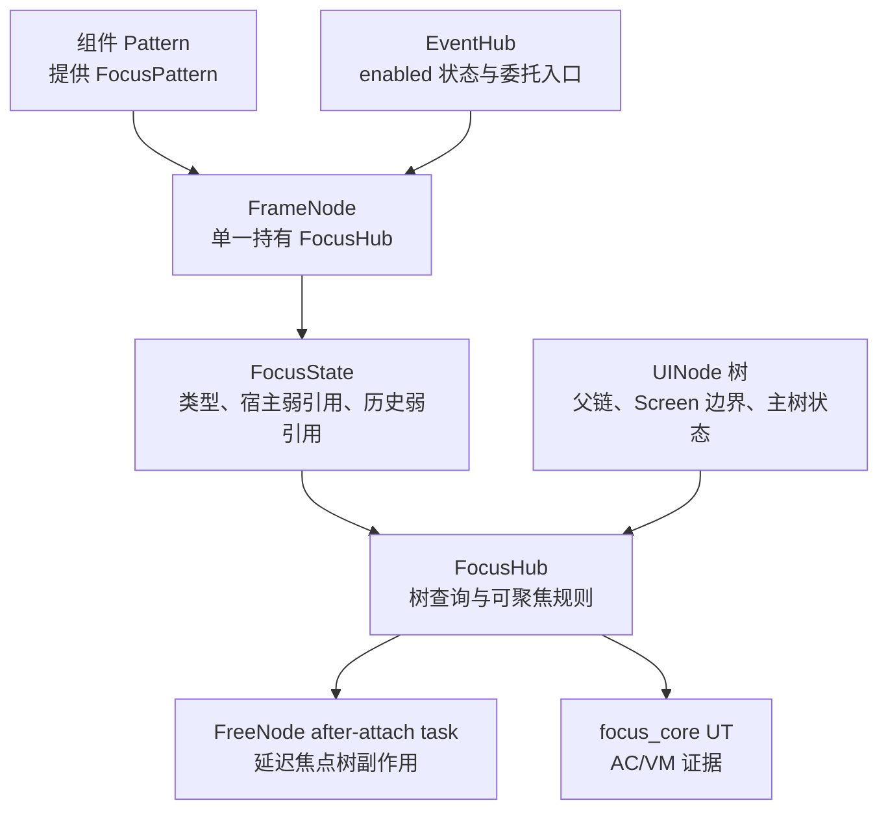

#### 焦点请求与切换事务架构图（Feat-02）

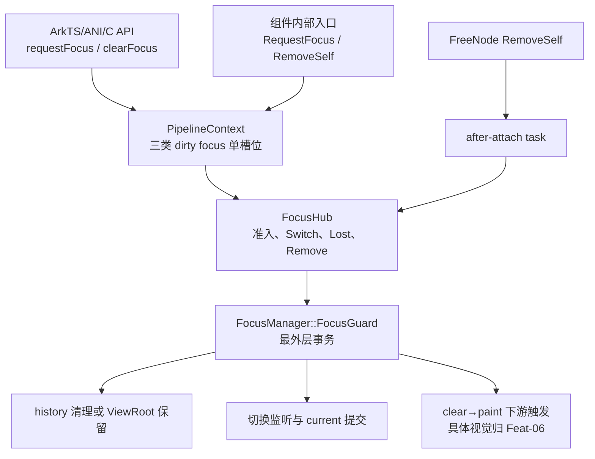

#### 焦点导航与遍历架构图（Feat-03）

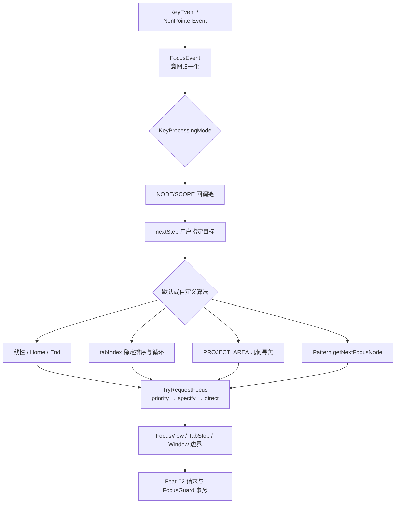

#### 焦点域与优先级架构图（Feat-04）

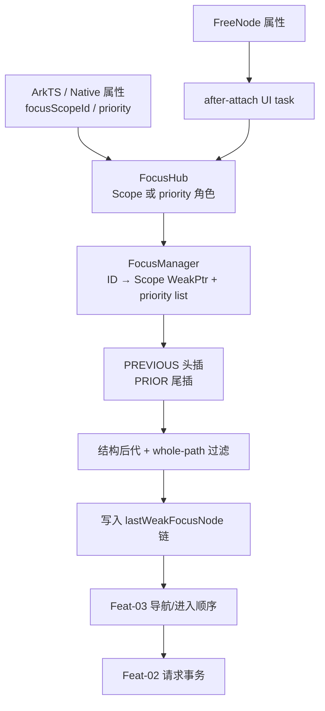

#### 默认焦点与 FocusView 恢复架构图（Feat-05）

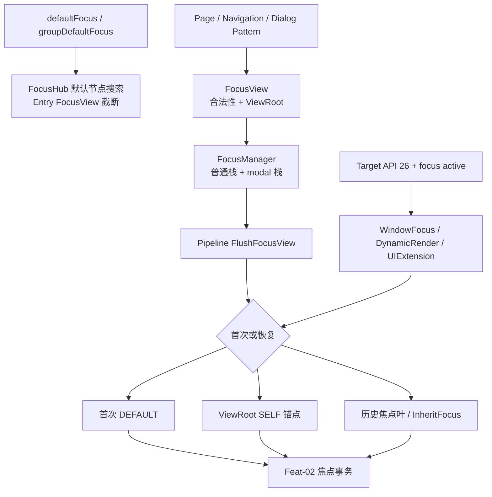

#### 焦点激活与视觉指示架构图（Feat-06）

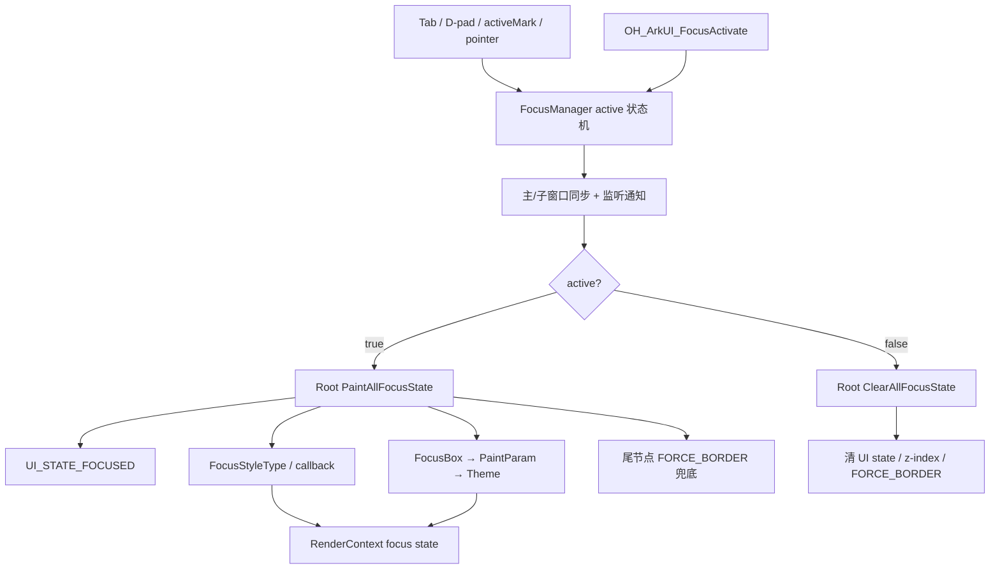

### 数据流/控制流

| 步骤 | 调用方 | 被调用方 | 数据/接口 | 说明 |
|------|--------|----------|-----------|------|
| 1 | 组件 Pattern | `Pattern::GetFocusPattern` | FocusType、focusable、视觉配置 | 组件提供初始焦点配置 |
| 2 | FrameNode 初始化 | `GetOrCreateFocusHub` | FocusPattern | 非 DISABLE 主动创建；其他场景惰性创建 |
| 3 | EventHub/FrameNode 调用方 | FrameNode 缓存 | `focusHub_` | EventHub 只委托，不复制所有权 |
| 4 | FocusHub | UINode/FrameNode/EventHub | 父链、主树、visible、enabled | 实时构造树关系和判定输入 |
| 5 | FocusHub | FocusHub 子节点 | `AnyChildFocusHub` | 对主树做压缩投影遍历 |
| 6 | FreeNode FocusHub | after-attach task 队列 | RemoveSelf 等副作用 | 属性先更新，主树副作用延迟 |
| 7 | ArkTS/ANI/C API（Feat-02） | PipelineContext/ViewAbstract | 节点 ID 或 NodeHandle | 同步入口设置 callback/result code，清焦入口转到 ViewRoot |
| 8 | FocusHub/Pipeline（Feat-02） | dirty focus 槽 | NODE、SCOPE、按 ID WeakPtr | 后写覆盖；按 ID 优先 Flush 并清三槽 |
| 9 | FocusHub（Feat-02） | 父 SCOPE | `SwitchFocus`、lastWeakFocusNode | 沿父链更新候选并使旧子失焦 |
| 10 | FocusGuard（Feat-02） | FocusManager | current/switching/start/update/end reason | 最外层析构统一提交、通知和触发重绘 |
| 11 | RemoveChild（Feat-02） | 导航/FocusView/父 Scope | TAB、SHIFT_TAB、ViewRoot 标记 | 按固定恢复顺序处理失效聚焦子节点 |
| 12 | KeyEventManager/FocusHub（Feat-03） | FocusEventHandler | KeyEvent、FocusIntension、KeyProcessingMode | 先执行回调链，再按模式决定导航时点 |
| 13 | RequestNextFocusByKey（Feat-03） | nextStep/default algorithm | 用户目标、FocusStep、lastWeakFocusNode | 用户目标成功最高优先级；失败继续默认算法 |
| 14 | 默认/自定义算法（Feat-03） | TryRequestFocus | 线性游标、tabIndex 列表、RectF、WeakPtr 候选 | 候选最终统一进入 Feat-02 请求事务 |
| 15 | Tab/FocusView 边界（Feat-03） | Pipeline/FocusManager | isFocusingByTab、focusWindowId、DynamicRender、isTriggerByStep | 普通头尾回退或特殊运行时转移，并更新 FocusView 栈 |
| 16 | 属性入口（Feat-04） | ViewAbstract/FocusHub | scopeId、isGroup、arrowStepOut、priority | 前端解析默认值并创建或查询 FocusHub |
| 17 | FocusHub（Feat-04） | FocusManager 域表 | Scope WeakPtr、priority WeakPtr list | 注册唯一 Scope，维护优先节点顺序和清理角色 |
| 18 | Scope 聚焦（Feat-04） | priority candidate/历史链 | PRIOR/PREVIOUS、lastWeakFocusNode | 首次进入或 Group 恢复时接入候选 |
| 19 | 属性与 FocusHub（Feat-05） | 默认节点搜索 | default/groupDefault、Entry FocusView | 按树序选择并在嵌套 View 边界截断 |
| 20 | FocusView（Feat-05） | FocusManager View 栈 | ViewRoot、根聚焦标志、show/hide/close | 管理父子 View、modal 和自动转移边界 |
| 21 | Pipeline/Window（Feat-05） | RequestDefaultFocus | neverShown、根历史、焦点叶、Target API | 按首次默认→根锚点→历史叶顺序恢复 |
| 22 | Key/Pointer/API（Feat-06） | FocusManager | FocusActiveReason、autoFocusInactive | 进行系统/主题/输入来源准入并更新 active |
| 23 | FocusManager（Feat-06） | 关联窗口与监听器 | active bool | 先同步和通知，再从 Root 触发 paint/clear |
| 24 | FocusHub 焦点链（Feat-06） | EventHub/RenderContext | UI_STATE_FOCUSED、Style、Box、PaintParam | 选择单点视觉、参数回退和兜底边框 |

### 时序设计

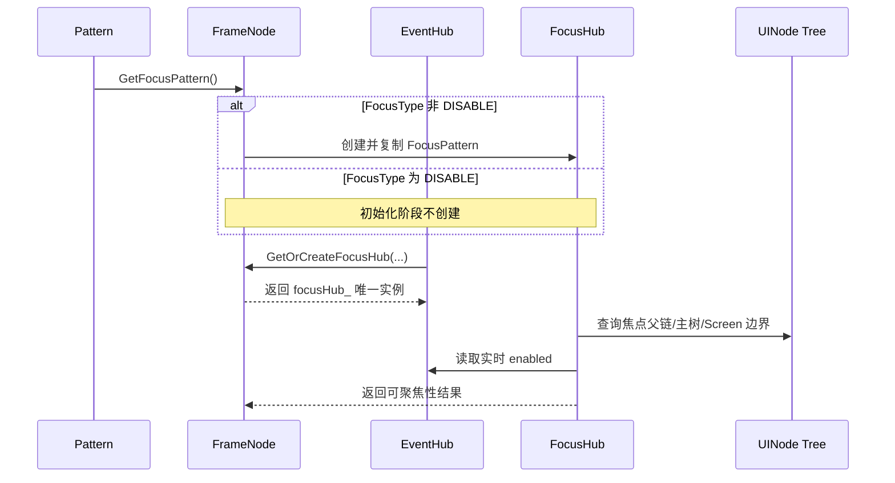

#### 焦点请求事务时序（Feat-02）

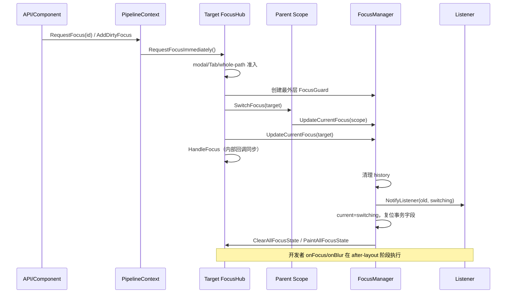

#### 焦点导航时序（Feat-03）

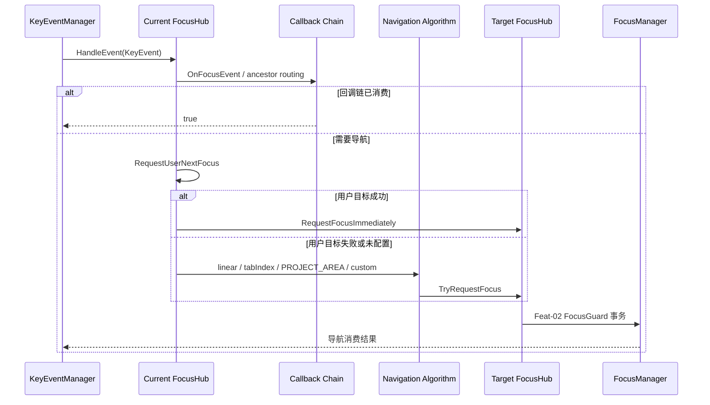

### 数据模型设计

```cpp
enum class FocusType : int32_t { DISABLE = 0, NODE = 1, SCOPE = 2 };
enum class FocusDependence : int32_t { CHILD = 0, SELF = 1, AUTO = 2 };

class FocusState {
    bool currentFocus_ { false };
    WeakPtr<EventHub> eventHub_;
    WeakPtr<FrameNode> frameNode_;
    FocusType focusType_ { FocusType::DISABLE };
    WeakPtr<FocusHub> lastWeakFocusNode_;
};
```

#### 请求与事务数据模型（Feat-02）

```cpp
class PipelineContext {
    WeakPtr<FrameNode> dirtyFocusNode_;
    WeakPtr<FrameNode> dirtyFocusScope_;
    WeakPtr<FrameNode> dirtyRequestFocusNode_;
};

class FocusManager {
    WeakPtr<FocusHub> currentFocus_;
    RefPtr<FocusHub> switchingFocus_;
    std::optional<bool> isSwitchingFocus_;
    std::optional<SwitchingStartReason> startReason_;
    std::optional<SwitchingUpdateReason> updateReason_;
    std::optional<SwitchingEndReason> endReason_;
    RequestFocusCallback requestCallback_;
    int32_t requestFocusResult_;
};
```

#### 导航数据模型（Feat-03）

```cpp
struct ScopeFocusAlgorithm {
    ScopeType scopeType;
    ScopeFocusDirection direction;
    bool isVertical;
    bool isLeftToRight;
    std::function<bool(FocusStep, WeakPtr<FocusHub>, WeakPtr<FocusHub>&)> getNextFocusNode;
};

class FocusHub {
    std::map<int32_t, NextFocusValue> nextStep_;
    ScopeFocusAlgorithm focusAlgorithm_;
    WeakPtr<FocusHub> lastWeakFocusNode_;
    int32_t lastTabIndexNodeId_;
    RectF rect_;
    bool arrowKeyStepOut_;
    bool isSwitchByEnter_;
};
```

#### 焦点域数据模型（Feat-04）

```cpp
enum class FocusPriority : int32_t {
    AUTO = 0,
    PRIOR = 2000,
    PREVIOUS = 3000,
};

using FocusHubScopeMap = std::unordered_map<
    std::string,
    std::pair<WeakPtr<FocusHub>, std::list<WeakPtr<FocusHub>>>>;
```

| 数据 | 创建/来源 | 存储位置 | 生命周期/约束 |
|------|-----------|----------|---------------|
| FocusPattern | 组件 Pattern | 临时值，构造时复制 | 定义初始类型与 focusable；视觉字段由 Feat-06 解释 |
| FocusHub | FrameNode | `FrameNode::focusHub_` 强引用 | 每个 FrameNode 最多一个；FrameNode 销毁后释放 |
| 宿主关系 | FrameNode 或 EventHub | FocusState 弱引用 | 不延长宿主生命周期；FrameNode 优先、EventHub 回退 |
| 当前焦点 | 焦点事务 | `FocusState::currentFocus_` | 字段归 Feat-01；写入时序归 Feat-02 |
| 历史叶节点 | 焦点事务 | `lastWeakFocusNode_` 弱引用链 | 不校验后代关系或环路，失效时回退到最后有效节点 |
| enabled | 组件/框架内部 | EventHub 生效值 + developerEnabled 值 | FocusHub 实时读取，不复制 |
| visible | FrameNode/LayoutProperty | FrameNode 及祖先实时状态 | 当前节点判定按入口决定是否扫描祖先 |
| dirtyFocusNode/Scope | RequestFocus | PipelineContext WeakPtr 单槽 | 同类后写覆盖；Flush 后清理 |
| dirtyRequestFocusNode | 按 ID 请求 | PipelineContext WeakPtr 单槽 | 优先于普通 NODE/SCOPE Flush |
| switchingFocus | FocusGuard 事务 | FocusManager 临时候选 | 仅事务中由 UpdateCurrentFocus 更新，最后一次更新胜出 |
| requestCallback | API 适配层 | FocusManager 一次性回调 | 失败触发后立即清空；成功不显式触发 |
| requestFocusResult | ViewAbstract 同步入口 | FocusManager int32 | 调用前后 reset，失败路径写 150001~150003 |
| FocusEvent/FocusIntension | KeyEvent/NonPointerEvent | 调用栈临时值 | 仅 KEY+DOWN+非 preIME 形成普通导航意图 |
| nextStep | 公共 nextFocus 属性 | FocusHub map | 以 FocusIntension 为键；成功请求时短路，失败继续默认算法 |
| ScopeFocusAlgorithm | Pattern | FocusHub 调用期快照 | 每次 RequestNextFocus 前重新读取；回调目标使用 WeakPtr |
| 线性游标 | 焦点事务历史 | `lastWeakFocusNode_` | 非循环；无历史时存在首轮正反向不对称 |
| tabIndex 候选 | 当前焦点树 | 调用期 list<pair<int32_t, WeakPtr>> | 仅正值 whole-path 候选；稳定升序；调用结束释放 |
| tabIndex 记忆 | 成功的 tabIndex 导航 | `lastTabIndexNodeId_` | 成功后向当前 Hub 及焦点祖先传播 FrameId |
| PROJECT_AREA 矩形 | FrameNode transform/Geometry | 调用期 RectF | 每次导航实时计算；不缓存跨布局帧结果 |
| focusScopeId | 公共属性/内部组件 | FocusHub string | 非空时标识 Scope 或 priority 所属域；角色由 isFocusScope/focusPriority 区分 |
| Scope 注册 | SetFocusScopeId | FocusManager map 的 first WeakPtr | 同一 ID 有效 Scope 唯一；失效后可替换 |
| priority 列表 | SetFocusScopePriority | FocusManager map 的 second list | PREVIOUS 头插、PRIOR 尾插；可先于 Scope 存在 |
| group 边界 | focusScopeId 可选参数 | FocusHub isGroup/arrowKeyStepOut | 仅非嵌套 group 对方向键原子边界生效 |

### 算法与状态机

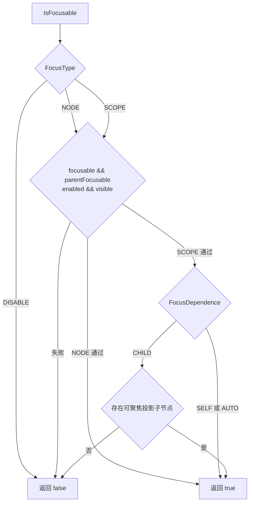

焦点父链算法：

1. 从宿主 UINode 的普通父节点开始向上遍历。
2. 非 FrameNode 或 FocusType=DISABLE 时继续向上。
3. FocusType=SCOPE 时返回该 FrameNode 作为焦点父节点。
4. FocusType=NODE 时终止并返回空，NODE 不作为后代的焦点作用域。
5. boundary-aware 变体在处理 FrameNode 前先判断 Screen 标签并终止。

实现证据：`frameworks/core/components_ng/base/ui_node.cpp:929-971`。

#### 请求与提交状态机（Feat-02）

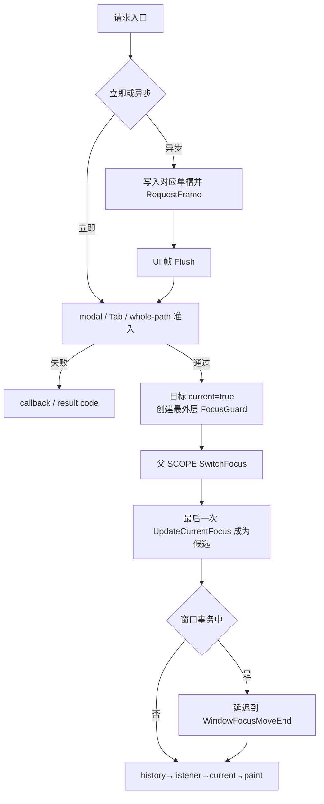

#### 导航算法状态机（Feat-03）

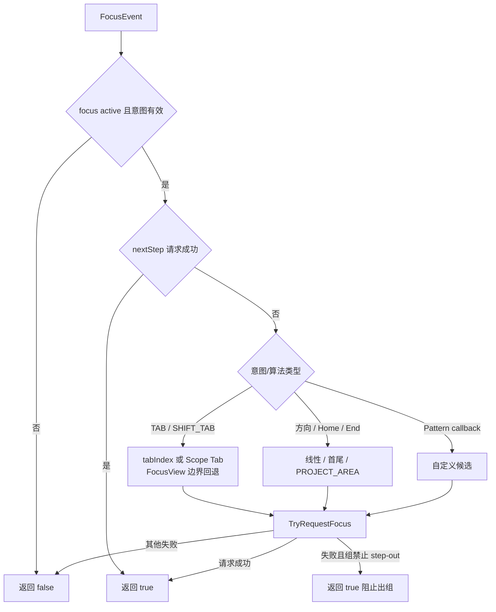

### 测试性设计

| 测试层级 | 测试目标 | Mock 策略 | 验证方式 |
|----------|----------|-----------|---------|
| Core UT | FocusPattern 初始化和 FocusHub 幂等创建 | 自定义 Pattern 注入 FocusPattern | `focus_test_base.cpp:46-121`、新增创建矩阵 UT |
| Core UT | SCOPE/NODE/DISABLE 父链和 Screen 边界 | 构造 FrameNodeOnTree 与 Screen 节点 | 父链/根/whole-path 断言 |
| Core UT | 可聚焦性矩阵 | 直接设置 focusable、parentFocusable、enabled、visible、dependence | 参数化 UT |
| Core UT | 历史弱引用叶节点 | 构造多级 lastWeakFocusNode 链 | 有效链、失效链、SELF、跨树和环路保护审查 |
| 多线程 UT | FreeNode 延迟副作用 | ThreadSafeNodeScope + after-attach task | 挂树前后字段与 currentFocus/树关系断言 |
| 回归测试 | 公共焦点属性不变 | 复用 `04-03-03-Feat-05` 关联 UT | focusable/defaultFocus 等现有回归 |
| Pipeline UT（Feat-02） | 三单槽与按 ID 优先 | 直接写 dirtyFocusNode/Scope/Request 槽 | 后写覆盖、按 ID 先 Flush、三槽清理 |
| Core UT（Feat-02） | 立即请求与结果通道 | 构造 modal、Tab、whole-path、同步预检查状态 | bool、callback、150001~150003 矩阵 |
| 事务 UT（Feat-02） | FocusGuard 嵌套和提交顺序 | 双层 guard + FocusChange listener | 仅一次提交、最后 update、监听内 current 仍为旧值 |
| 移除 UT（Feat-02） | RemoveChild 恢复矩阵 | Mock TAB/SHIFT_TAB 与 FocusView root | 后继、前驱、根停留、递归移除 |
| 多线程 UT（Feat-02） | FreeNode RemoveSelf 最终一致性 | 显式 SetIsFree + MarkNodeNotFree | attach 前未清理，pending task 后完成迁移 |
| 事件 UT（Feat-03） | 意图与 KeyProcessingMode | 参数化 event type/action/preIME/pressedCodes，构造 NODE/SCOPE 祖先链 | 映射矩阵、内部/用户回调顺序、两种路由模式 |
| Core UT（Feat-03） | 线性、Home/End 与焦点组 | 构造真实多子节点树和 LTR/RTL LayoutDirection | 首轮游标、不循环、短路顺序、step-out |
| KeyEventManager UT（Feat-03） | tabIndex 分发 | 主 View + 正值/同值/失效 WeakPtr 候选 | 稳定排序、首次 Shift+Tab、取模循环、祖先记忆 |
| 几何 UT（Feat-03） | PROJECT_AREA | 参数化 RectF、transform、零尺寸、等距和全局 RTL | 投影准入、中心距离、两阶段 Tab 换行 |
| 组件 UT（Feat-03） | Pattern 自定义算法 | List/Grid Pattern 回调和跨 Scope 候选 | 每次刷新、false/失效目标、TryRequestFocus 结果 |
| Container/FocusView UT（Feat-03） | Tab 边界与 View 栈 | Mock focusWindowId、DynamicRender、TaskExecutor、FocusView | 50 ms 延迟、返回值、isFocusingByTab、恢复历史抑制 |

### 异常传播时序图

Feat-01 的宿主失效仍通过空返回和确定默认值收敛。Feat-02 新增对既有请求失败传播链的设计记录，但不新增错误码或跨进程重试。Feat-03 的导航失败以 false、默认算法回退或焦点组消费收敛，不新增异常通道。

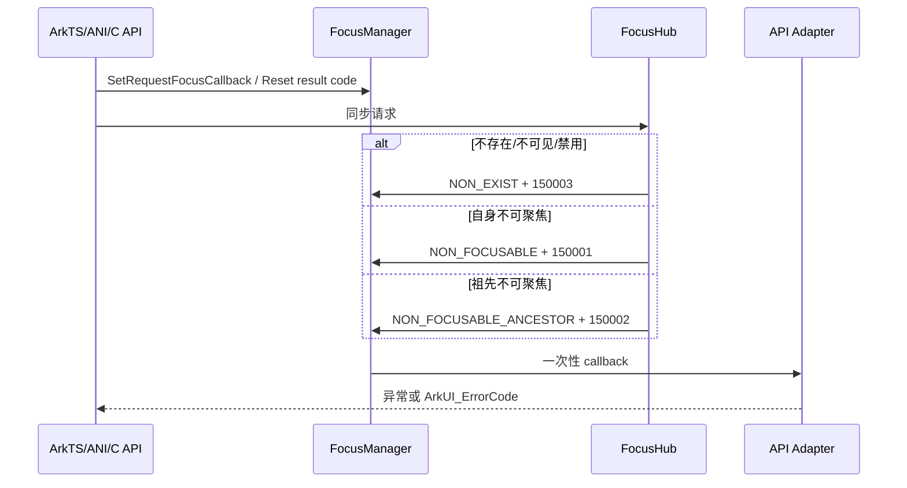

| 异常场景 | 处理方式 | 关联 AC |
|----------|----------|---------|
| FrameNode/EventHub 弱引用失效 | GetFrameNode 返回空，名称/ID 使用确定默认值 | AC-1.5 |
| 历史焦点弱引用失效 | GetFocusLeaf 返回最后一个有效候选 | AC-2.5 |
| FreeNode 无法立即操作主焦点树 | 加入 after-attach task，挂树后执行 | AC-5.1~5.3 |
| 按 ID 目标不存在或状态不满足同步预检查 | callback 报分类结果，适用路径同步写 150001~150003 | Feat-02 AC-2.3~2.4 |
| 异步目标当前不可聚焦 | 返回 false 但保留已调度请求，下一帧重新按实时状态准入 | Feat-02 AC-2.6 |
| modal/Tab/whole-path 阻断立即请求 | 返回 false；Tab 和 whole-path 通过现有回调通道定界 | Feat-02 AC-1.3~1.6 |
| nextFocus 目标缺失或请求失败 | 返回 false 后继续同一意图的默认导航算法 | Feat-03 AC-2.2 |
| 线性/空间/自定义算法无候选 | 返回 false；焦点组且禁止方向键跳出时返回 true 消费 | Feat-03 AC-3.2~3.7, AC-5.1~5.5 |
| tabIndex 目标 WeakPtr 失效或不可聚焦 | 本次 HandleFocusByTabIndex 返回 false，后续普通事件链可继续处理 | Feat-03 AC-4.5, AC-4.7 |
| focusWindowId 正向 Tab 边界 | 同步返回 false 并投递 50 ms UI 任务，由任务处理头节点和窗口失焦 | Feat-03 AC-2.5 |

### 资源所有权矩阵

| 资源 | 创建方 | 持有方 | 销毁触发 | 实际释放 | 异常回收 |
|------|--------|--------|----------|----------|----------|
| FocusHub | FrameNode | `FrameNode::focusHub_` | FrameNode 销毁或引用释放 | RefPtr 计数归零 | 宿主弱引用不阻止释放 |
| EventHub | FrameNode | `FrameNode::eventHub_` | FrameNode 生命周期结束 | RefPtr 计数归零 | FocusState 仅持 WeakPtr |
| 历史焦点节点 | 焦点事务 | 无强所有权，仅 WeakPtr | 子节点销毁 | 自动失效 | GetFocusLeaf 回退 |
| after-attach task | FreeNode | UINode 延后任务队列 | 节点挂主树或节点释放 | 执行后清理/随节点释放 | lambda 使用 WeakClaim 防止悬空访问 |
| dirty focus 槽（Feat-02） | PipelineContext | 三个 WeakPtr 字段 | Flush 或后写覆盖 | Reset/WeakPtr 失效 | 无队列积压；失效节点在 Flush 时清槽 |
| FocusGuard（Feat-02） | 请求/移除调用栈 | 栈对象，最外层持有 FocusManager RefPtr | 最外层作用域结束 | 析构调用 FocusSwitchingEnd | 嵌套 guard 不持 manager，不重复提交 |
| request callback（Feat-02） | API 适配层 | FocusManager std::function | 失败触发或入口显式 reset | 置空 | 一次性语义防止悬空栈引用 |
| switching focus（Feat-02） | FocusManager | 事务期间 RefPtr | ReportFocusSwitching/reset | currentFocus_ 接收 WeakPtr | 无有效候选时按空焦点提交 |
| 导航候选列表（Feat-03） | FocusHub 调用栈 | 局部 list | 单次导航返回 | 自动释放 | 候选节点使用 RefPtr/WeakPtr，失效时跳过或返回 false |
| 自定义算法目标（Feat-03） | 组件 Pattern 回调 | WeakPtr 输出 | 单次 RequestNextFocus | 调用后释放 | 升级失败走 step-out，不解引用失效目标 |
| focusWindowId 延迟任务（Feat-03） | Tab 边界 | TaskExecutor UI 队列 | 50 ms 后执行或对象失效 | 执行后释放 | lambda 使用 WeakClaim 和 ContainerScope |

### 接口参数规约

不涉及 Public/System/Inner API 变更。本节不新增可供 code-gen 消费的开放接口参数。Feat-02 对既有请求/清除入口进行约束；Feat-03 仅核验 `RequestNextFocusByKey`、`HandleFocusByTabIndex` 和 `ScopeFocusAlgorithm` 等内部入口。公共 `nextFocus/tabIndex/tabStop` 参数继续由 `Func-04-03-03-Feat-05` 定义。目标仓库基线未纳入 ArkTS canonical SDK d.ts，因此仓内实现仅作为行为核验，不替代发布契约。

### 线程与并发模型

| 操作 | 发起线程 | 回调线程 | 跨进程边界 | 线程安全 | 重入约束 |
|------|----------|----------|------------|----------|----------|
| 普通 FrameNode 创建/查询 FocusHub | UI 主线程 | 同步返回 | 无 | 依赖主线程模型 | `GetOrCreateFocusHub` 幂等，不重配已有实例 |
| FreeNode 修改 focusable/type/show/enabled 通知 | 隔离构建线程 | 字段同步更新；树副作用延迟 | 无 | 字段操作后通过 FREE_NODE_CHECK 分流 | 不得在 FreeNode 线程直接遍历/修改主焦点树 |
| after-attach task | 节点挂主树流程 | UI 主树上下文 | 无 | WeakClaim 校验对象存活 | 每个排队操作按队列执行，规格不承诺跨操作合并 |
| 普通/按 ID 请求（Feat-02） | UI 主线程或同步投递到 UI | 内部状态同步；开发者回调 after-layout | 无 | AddDirty/Flush 使用 CHECK_RUN_ON(UI) | 同帧同类请求后写覆盖，不支持 FIFO 重入假设 |
| FocusGuard（Feat-02） | UI 调用栈 | 切换监听同步，开发者 onFocus/onBlur 延后 | 无 | 最外层 guard 串行提交 | 监听回调内 Manager current 仍为旧值，禁止假设已提交 |
| 窗口焦点事务（Feat-02） | UI 窗口切换流程 | WindowFocusMoveEnd 一次通知 | 无 | isSwitchingWindow_ 合并中间步骤 | 多次 Update 仅最后候选对外提交 |
| 普通键盘导航（Feat-03） | UI 事件分发线程 | 节点/用户回调同步；最终焦点回调按 Feat-02 延后 | 无 | FocusManager current event 仅在 travel 调用期设置 | 回调消费和导航时点由 KeyProcessingMode 决定 |
| Pattern 自定义导航（Feat-03） | UI 导航调用栈 | 同步返回候选 | 无 | 每次调用重新读取算法，目标为 WeakPtr | 回调不得假设 FocusHub 已完成事务提交 |
| focusWindowId Tab 边界（Feat-03） | UI 事件线程 | 50 ms 后回到同 instance UI 线程 | 无 | ContainerScope + WeakClaim | 延迟期间节点/窗口可能失效，任务必须空检查 |

| 并发场景 | 当前行为 | 风险控制 | 验证 |
|----------|----------|----------|------|
| FreeNode 上 SetFocusable(false) | focusable 立即为 false，RemoveSelf 延迟 | 挂树前子焦点遍历排除 off-main-tree 节点 | VM-10 |
| 延迟任务执行前节点销毁 | WeakPtr 升级失败后直接返回 | 不访问已释放 FocusHub | 多线程 UT |
| FreeNode 与非 Free 树混挂 | UINode 树转为非 Free，执行挂树后任务 | 由 UI 树挂载流程串行化 | `ui_node.cpp:793-821` 审查 |
| 同帧多次普通请求（Feat-02） | 相同类型只保留最后节点 | 以单槽语义建立回归测试，不承诺逐请求回调 | Feat-02 VM-3 |
| 嵌套 FocusGuard（Feat-02） | 内层共享外层事务并覆盖候选 | 最外层析构唯一提交 | Feat-02 VM-6, VM-7 |
| FreeNode RemoveSelf（Feat-02） | attach 前 pending，attach 后执行普通事务 | WeakClaim + MarkNodeNotFree 串行化 | Feat-02 VM-13 |
| nextFocus 回调后默认算法（Feat-03） | 用户目标请求失败时在同一调用栈继续默认算法 | 以单次事件返回值作为消费结果，禁止调用方假设配置存在即阻断 | Feat-03 VM-3 |
| Tab 特殊边界提前返回（Feat-03） | focusWindowId/DynamicRender 分支在普通 flag 复位前返回 | 定向断言 isFocusingByTab，风险保留且不在补录中修改 | Feat-03 VM-4 |
| Scrollable 首尾导航（Feat-03） | 同步滚动到头尾后 FlushUITasks，再遍历可能新物化节点 | 仅在 UI Pipeline 上执行，测试滚动前后树变化 | Feat-03 VM-12 |

## 详细设计

### 节点类型、初始化与所有权

`FocusType` 只有 DISABLE、NODE、SCOPE 三类（`frameworks/core/components_ng/event/focus_type.h:23-27`）。`Pattern::GetFocusPattern()` 默认返回 DISABLE 且不可聚焦（`frameworks/core/components_ng/pattern/pattern.cpp:114-117`）。FrameNode 完成 Pattern 绑定后，仅在类型非 DISABLE 时主动调用 `GetOrCreateFocusHub`（`frameworks/core/components_ng/base/frame_node.cpp:1051-1054`）。

所有 `GetOrCreateFocusHub` 重载都先检查 `focusHub_`；存在时直接返回，不使用新参数重新配置。实际强所有权位于 FrameNode，EventHub 入口仅获取宿主 FrameNode 后委托（`frame_node.cpp:4637-4684`、`event_hub.cpp:766-785`）。

FocusState 可由 FrameNode 或 EventHub 弱引用构造。`GetFrameNode()` 优先升级 FrameNode，失败时从 EventHub 回取宿主（`focus_state.h:31-41`、`focus_hub.cpp:194-202`）。这一双入口保留内部迁移兼容，但不形成双重所有权。

### 焦点树投影与边界

焦点父链不是普通 FrameNode 父链。`GetFocusParent` 向上跳过非 FrameNode 和 DISABLE 节点；遇 SCOPE 返回；遇 NODE 直接终止。`GetFocusParentWithBoundary` 额外在 Screen 标签处终止（`frameworks/core/components_ng/base/ui_node.cpp:929-971`）。因此 `GetRootFocusHub` 的非 boundary 上界和 `IsFocusableWholePath` 的 Screen 上界可能不同，这是既有设计而非冲突。

子树遍历只处理 `IsOnMainTree()` 的节点；遇 NODE/SCOPE 后将其作为一个投影节点，不再下钻；DISABLE/非 FrameNode 作为透明容器继续递归（`frameworks/core/components_ng/event/focus_hub.cpp:117-162,268-283`）。

`lastWeakFocusNode_` 是历史路径缓存，不是结构父子关系。`GetFocusLeaf` 沿弱引用下钻，遇 SELF、不可聚焦或失效引用时返回最后有效候选（`focus_hub.cpp:242-253`）。当前实现不校验真实后代关系、currentFocus 或环路，必须在风险和测试性设计中保持可见。

### NODE、SCOPE 与整路径可聚焦性

NODE 的基础门槛为 `focusable_ && parentFocusable_`。`IsFocusableNode` 读取自身 EventHub enabled、FrameNode visible，并向上扫描所有 FrameNode 祖先的 visible；`IsChildFocusableNode` 只检查自身，供父 Scope 的递归判定使用（`focus_hub.cpp:811-887`）。祖先 enabled 不在 `IsFocusableNode` 的 UI 祖先循环中读取，而由 whole-path 对每个焦点祖先逐层执行 NODE 门槛补齐。

SCOPE 先通过 NODE 门槛，再按 FocusDependence 分派：SELF/AUTO 返回 true；CHILD 调用 `AnyChildFocusHub`，至少一个投影子节点可聚焦才返回 true（`focus_hub.cpp:786-809`）。

`IsFocusableWholePath` 沿 boundary-aware 父链调用祖先 `IsFocusableNode`，最终调用目标 `IsFocusable`；`IsSelfFocusableWholePath` 最终只调用目标 `IsFocusableNode`（`focus_hub.cpp:2234-2270`）。祖先 Scope 的 CHILD 聚合结果不单独阻断其已存在目标后代。

### 显式/隐式优先级与生命周期输入

`SetFocusable` 的显式调用将 `isFocusableExplicit_` 设为 true；此后 isExplicit=false 的内部写入直接返回。隐式可聚焦 SCOPE 若原为 CHILD dependence，则切换为 AUTO（`focus_hub.cpp:889-913`）。这保证开发者显式配置不被组件内部动态行为覆盖。

enabled 的真实值来自 EventHub，visible 来自 FrameNode 与祖先。FocusHub 的 `SetEnabled(false)` 和 `SetShow(false)` 只调用 RemoveSelf，不保存状态（`focus_hub.cpp:959-998`）。EventHub 同时维护 `enabled_` 和 `developerEnabled_`：公开设置同步两者，内部临时设置只改生效值，恢复时回到开发者值（`event_hub.cpp:1073-1098`）。

`SetParentFocusable(false)` 更新本地门槛并关闭后代 FocusView（`focus_hub.cpp:736-761`）；本 Feat 只定义门槛立即生效，FocusView 关闭与恢复由 Feat-05 补录。

### FreeNode 最终一致性

FreeNode 上 `RemoveSelf` 通过 `FREE_NODE_CHECK` 转入 `RemoveSelfMultiThread`，把 `RemoveSelfExecuteFunction` 封装为 after-attach task（`frameworks/core/components_ng/event/focus_hub.cpp:661-684`、`focus_hub_multithread.cpp:22-57`）。节点转为非 Free 并挂主树时执行该任务（`frameworks/core/components_ng/base/ui_node_multi_thread.cpp:105-130`）。

因此状态字段与焦点树副作用不是同一时刻提交：例如 `SetFocusable(false)` 先更新 focusable，随后 RemoveSelf 延迟。此期间节点尚未挂主树，`AnyChildFocusHub` 的 `IsOnMainTree` 过滤使其不参与 CHILD-SCOPE 判定。规格采用最终一致性描述，不承诺挂树前的 currentFocus 清理已完成。

### 请求调度与立即准入（Feat-02）

`FocusHub::RequestFocus()` 是普通异步入口。当前节点已经聚焦时直接返回；否则取得宿主 FrameNode 和当前 Pipeline，并调用 `AddDirtyFocus`。宿主未挂主树仅输出时机警告，不阻止请求进入 Pipeline（`frameworks/core/components_ng/event/focus_hub.cpp:1263-1280`）。

Pipeline 使用 `dirtyFocusNode_`、`dirtyFocusScope_`、`dirtyRequestFocusNode_` 三个 WeakPtr 单槽位。`AddDirtyFocus` 根据 FocusType 写 NODE 或 SCOPE 槽，`AddDirtyRequestFocus` 写按 ID 槽；每次写入均请求一帧，同类后写覆盖前写（`frameworks/core/pipeline_ng/pipeline_context.h:1541-1543`、`pipeline_context.cpp:5463-5480`）。

`FlushFocus()` 先调用 `FlushRequestFocus()`。按 ID 槽有效时，立即请求完成后同时清 NODE、SCOPE 和按 ID 槽并返回；因此同帧按 ID 请求对普通请求具有事实优先级。按 ID 槽为空时才继续处理普通 NODE，再处理普通 SCOPE（`pipeline_context.cpp:1803-1881`）。

`RequestFocusImmediately()` 先执行 modal FocusView 检查；Inner 再检查 Pipeline/FocusManager、Tab 模式可聚焦性、当前焦点幂等和 whole-path 可聚焦性。通过后先设置目标 `currentFocus_` 与 FocusReason，创建 FocusGuard，沿父 SCOPE 执行 SwitchFocus，再更新最终候选并调用 HandleFocus（`focus_hub.cpp:505-584`）。Feat-02 只消费 Feat-01 的可聚焦性结论，不复制判定模型。

### 按 ID 请求、开放入口与结果回传（Feat-02）

`PipelineContext::RequestFocus` 优先从 focused WindowScene 根搜索，缺失时使用普通 root；modal 栈有效时在 Pipeline 入口拦截。当前为子 Pipeline 且本地查找失败时，调用父 Pipeline 继续搜索（`frameworks/core/pipeline_ng/pipeline_context.cpp:5436-5460`）。目标 FocusHub 先查当前树，再在当前 Container 不是 sub-container 时枚举子容器；当前已是 sub-container 时不反向枚举（`frameworks/core/components_ng/event/focus_hub.cpp:2480-2539`）。

同步请求使用 `IsSyncRequestFocusable` 区分不存在/不可见/禁用、自身不可聚焦和祖先不可聚焦，分别触发 NON_EXIST/NON_FOCUSABLE/NON_FOCUSABLE_ANCESTOR，并在适用路径写 150003/150001/150002（`focus_hub.cpp:937-956`、`frameworks/base/error/error_code.h:174-176`）。预检查通过后写按 ID 槽并调用无返回值的 `FlushRequestFocus`，因此同步 bool 只证明预检查通过，不证明 Flush 阶段最终获焦（`focus_hub.cpp:2495-2509`、`pipeline_context.cpp:1853-1881`）。

异步按 ID 请求只要找到目标就写按 ID 槽，即使当前 `IsFocusable()` 为 false，函数仍会请求下一帧；其 false 只描述当前快照，不表示请求未调度（`focus_hub.cpp:2495-2509`）。这一路径允许 enabled/visible/focusable 在下一帧前恢复。

结果回传有两个独立通道。`RequestFocusCallback` 在触发后立即清空；整数 `requestFocusResult_` 由 ViewAbstract 同步入口在调用前后 reset，失败分支写错误码，成功依赖默认 0。Tab 不可聚焦只触发分类回调，没有同步写整数码（`frameworks/core/components_ng/manager/focus/focus_manager.h:219-250`、`focus_hub.cpp:546-560`、`frameworks/core/components_ng/base/view_abstract.cpp:10338-10354`）。

既有 NAPI/ANI `requestFocus` 使用同步请求并将分类回调映射为 150001~150003；`clearFocus` 转到 `LostFocusToViewRoot`（`interfaces/napi/kits/focus_controller/js_focus_controller.cpp:26-101`、`interfaces/ets/ani/focuscontroller/src/focusController.cpp:140-180`）。Native C API 通过 ViewAbstract 请求 NodeHandle 或按 Context 清焦，公开头文件声明 ArkUI Kit、Full SysCap 和 since 15（`interfaces/native/native_interface_focus.h:16-77`、`interfaces/native/node/native_interface_focus.cpp:24-48`）。

### SCOPE 切换与 FocusGuard 提交（Feat-02）

`SwitchFocus` 只允许 SCOPE。它先把 `lastWeakFocusNode_` 指向新子节点；若 Scope 已聚焦，则用当前 Scope 更新 FocusManager 候选并使不同旧子 LostFocus；若 Scope 未聚焦，则递归请求自身，使新子变化沿父链汇入同一事务（`frameworks/core/components_ng/event/focus_hub.cpp:1384-1407`）。当前实现直接解引用传入的新子节点，调用方必须保证非空；规格将其记录为前置约束，不在补录中修改实现。

`FocusManager::FocusGuard` 是扁平的最外层 RAII 事务。`CreateFocusGuard` 发现 `isSwitchingFocus_` 已为 true 时直接返回，内层 guard 不保存 manager，析构时不结束事务；内层仍可调用 `UpdateCurrentFocus` 覆盖 switchingFocus，因此最后一次 update 成为候选终点，startReason 保留最外层原因（`frameworks/core/components_ng/manager/focus/focus_manager.cpp:398-404,541-569`）。

普通 `FocusSwitchingEnd` 的顺序为：对最终 switchingFocus 递归 `ClearLastFocusNode`，调用 listener 通知 current→switching，随后把 current 更新为 switching 并 reset 事务字段，再执行 `PaintFocusState` 和 modal 栈整理。`PaintFocusState` 在焦点激活时对根 Hub 先 ClearAllFocusState 再 PaintAllFocusState（`focus_manager.cpp:276-289,440-451,485-510`）。因此 listener 回调参数包含候选新焦点，但回调期间 `GetCurrentFocus()` 仍返回旧焦点。

Hub 的内部 onFocus/onBlur 与 currentFocus 字段同步变化，开发者回调通过 after-layout task 延后；最外层 guard 在请求函数返回前提交 Manager，所以“节点内部状态已变化”“Manager current 已提交”“开发者回调已执行”是三个不同观察点（`frameworks/core/components_ng/event/focus_hub.cpp:540-584,641-650,1547-1659`）。

### 失焦、清除与节点移除恢复（Feat-02）

`LostFocus` 仅在节点当前聚焦时写 BlurReason、清 currentFocus 并触发 OnBlur，重复调用不会重复回调。`LostSelfFocus` 不是直接 LostFocus，而是显式调用 `SetFocusable(false)` 后再恢复 true，利用 false 阶段触发 RemoveSelf；最终节点仍可聚焦，但显式设置标记会保留（`frameworks/core/components_ng/event/focus_hub.cpp:641-659,889-913`）。

`RemoveSelf` 对普通子节点委托直接父 SCOPE 的 `RemoveChild`；父为 Screen FocusHub 或当前节点自身为 FocusView 时停止向上传播，仅在自身当前聚焦时建立 guard 并 LostFocus。focusScopeId/priority 的清理独立于当前聚焦状态（`focus_hub.cpp:661-684`）。

`RemoveChild` 首先要求入参是当前 SCOPE 的直接焦点子节点。聚焦子被移除时，如果不要求跳过迁移，则先尝试 TAB 后继，再尝试 SHIFT_TAB 前驱；两者均失败时，当前 Scope 是 FocusView root 则清历史子并设置根聚焦标记，否则递归 RemoveSelf，最后使被移除子 LostFocus（`focus_hub.cpp:686-715`）。TAB/SHIFT_TAB 的候选计算归 Feat-03，Feat-02 只固定调用顺序和结果处理。

`LostFocusToViewRoot` 为 history 清理特例。它把当前 ViewRoot 标记为根聚焦，使用 ViewRoot 建立 `LOST_FOCUS_TO_VIEW_ROOT` guard，并使历史子节点 LostFocus；FocusSwitchingEnd 识别该 startReason 后不执行最终候选的 ClearLastFocusNode，使历史链可由 Feat-05 后续恢复（`focus_hub.cpp:595-621`、`focus_manager.cpp:503-507`）。

### 窗口事务与 FreeNode 延迟清理（Feat-02）

`WindowFocusMoveStart` 置窗口切换标记。窗口切换期间 FocusGuard 析构不会立即 report/paint，只保存结束原因并结束当前 switching 标记；`WindowFocusMoveEnd` 清窗口标记后，以最后候选执行一次 `WINDOW_FOCUS` report 和 paint（`frameworks/core/components_ng/manager/focus/focus_manager.cpp:485-538,579-585`）。该设计将窗口内多步移动合并为一个可观测事务。

FreeNode 上 `RemoveSelf` 由 `FREE_NODE_CHECK` 转到 `RemoveSelfMultiThread`，把普通清理封装为 after-attach task。`MarkNodeNotFree` 将节点设为非 Free、加入 ElementRegister，并执行 pending tasks；此时 `RemoveSelfExecuteFunction` 才按普通父 Scope/Screen/FocusView 分支完成迁移、失焦和 scope 注册清理（`frameworks/base/utils/multi_thread.h:19-29`、`frameworks/core/components_ng/event/focus_hub_multithread.cpp:22-57`、`frameworks/core/components_ng/base/ui_node_multi_thread.cpp:39-51,105-130`）。

因此 FreeNode attach 前可以观察到 RemoveSelf 副作用尚未完成，attach 后才达到与普通节点一致的最终状态。现有 `RemoveSelfMultiThread` 命名 UT 未完整覆盖真实 Free→MarkNodeNotFree→pending task 时序，Feat-02 VM-13 要求补充该对照验证。

### 按键意图与事件路由（Feat-03）

`FocusEvent::GetFocusIntension` 只接受 KEY、DOWN、非 preIME 输入。方向键在检查 pressedCodes 数量前直接映射，因此即使同时按下修饰键仍产生 UP/DOWN/LEFT/RIGHT；其他物理键通常要求 `pressedCodes.size()==1`，唯一组合键例外是 exactly Shift+Tab。SELECT/ESC/HOME 还可由 KeyIntention 补充映射（`frameworks/core/components_ng/event/focus_event_handler.cpp:28-81`）。

事件到达当前 NODE 后，`HandleKeyEvent` 依次执行内部回调和用户回调，不对内部 true 做用户回调短路，再合并消费结果。`FOCUS_NAVIGATION` 模式在当前层未消费时立即 `HandleFocusTravel`；`ANCESTOR_EVENT` 模式先返回事件结果，由 `HandleEvent` 在祖先链均未消费后调用 `HandleFocusNavigation`（`focus_event_handler.cpp:107-225`、`focus_hub.cpp:309-361`）。

`HandleFocusTravel` 要求 Pipeline focus active。`TabJustTriggerOnKeyEvent` 只阻断普通 travel，并在返回前调用 `ScrollToLastFocusIndex`；它不抹除此前已经执行的节点内部/用户回调。正常 travel 临时将 FocusEvent 写入 FocusManager，完成 `RequestNextFocusByKey` 后复位。

### nextFocus、TabStop 与 FocusView 边界（Feat-03）

`RequestNextFocusByKey` 首先调用 `RequestUserNextFocus`。nextStep 可保存 Inspector ID 或节点 WeakPtr；解析且请求成功时直接返回 true。目标缺失、弱引用失效或请求失败时返回 false，随后继续 switch 到默认 Tab、方向、Enter/Esc 或 Home/End 算法（`focus_hub.cpp:1098-1148`）。这与公共焦点属性规格中“目标不存在则停留当前组件”的描述不一致，设计以当前源码为基线并在风险表保留跨规格修订项。

Tab/Shift+Tab 在焦点组内直接拒绝。组外导航期间写 `isFocusingByTab=true`；普通路径在末尾复位。内部遍历失败且当前 FocusView 负责边界时，普通容器分别回退头/尾。focusWindowId 的正向 Tab 投递 50 ms UI 任务，DynamicRender 正向及两类运行时反向分支立即尝试头/尾并返回 false（`focus_hub.cpp:1150-1209`）。这些提前返回位于普通复位语句之前，源码可观察到 flag 遗留风险。

Enter 仅使 tabStop SCOPE 设置 `isSwitchByEnter_` 并进入子树。Esc 仅从当前 FocusView 焦点叶沿 boundary-aware 父链查找最近 tabStop 祖先，且不越过 ViewRoot（`focus_hub.cpp:1212-1248`）。TabStop 属性声明仍由公共属性规格承接。

### 线性、首尾与焦点组遍历（Feat-03）

`RequestNextFocus` 先验证 lastWeakFocusNode 仍为 current 并计算相对矩形，再从 Pattern 刷新 ScopeFocusAlgorithm。无自定义回调时，Home/End 对非嵌套焦点组取头尾后代；PROJECT_AREA 走空间算法；轴向受限 Scope 对不匹配方向调用 `IsArrowKeyStepOut`；其他输入走线性遍历（`focus_hub.cpp:1282-1340,1488-1524`）。

线性遍历使用 `lastWeakFocusNode_` 在投影子列表中的位置作为游标，不做首尾循环。没有历史游标时先把迭代器置于首项，因此正向会自增到第二项，反向会立即到达边界并失败。LEFT/RIGHT 的前后方向使用组件 `LayoutDirection` 覆盖后的 `IsComponentDirectionRtl`；Tab 前后方向不使用该局部翻转（`focus_hub.cpp:1409-1453,3099-3116`）。

`TryRequestFocus` 对 Tab 依次尝试 priority child、specified child、矩形/历史接受和直接请求；非 Tab 进入非嵌套焦点组时把组作为原子节点直接请求。`arrowKeyStepOut=false` 的焦点组在方向键搜索失败时返回 true 消费事件，Tab 不受此限制（`focus_hub.cpp:1362-1371,1456-1475,2074-2108`）。优先级和默认节点的定义分别归 Feat-04、Feat-05。

### tabIndex 遍历（Feat-03）

`KeyEventManager::DispatchTabIndexEventNG` 从 main View FocusHub 调用 `HandleFocusByTabIndex`，成功时优先消费事件（`frameworks/core/common/key_event_manager.cpp:536-550`）。候选收集只加入 `tabIndex>0` 且 whole-path 可聚焦的节点，并仅在 SCOPE 中递归；排序使用 `list::sort` 按数值升序，相同值保持收集顺序（`focus_hub.cpp:2273-2282,2558-2581`）。

存在有效 `lastTabIndexNodeId_` 时，Tab/Shift+Tab 分别加一/减一并取模循环；没有记忆时两种方向都从索引 0 开始。目标请求成功后，FrameId 写入当前 Hub 及全部焦点祖先。首次进入 Scope 时可优先请求 GROUP_DEFAULT 子节点，但其定义与恢复语义由 Feat-05 承接（`focus_hub.cpp:2285-2327,2542-2602`）。

### PROJECT_AREA 与自定义算法（Feat-03）

PROJECT_AREA 使用 transform-relative offset 和 Geometry size 构造候选矩形，过滤自身、空节点、无 Geometry 和不可聚焦节点。`GetProjectAreaOnRect` 只判断候选是否在移动方向越过边界且正交轴重叠；投影面积大于零后，方向键以中心距离平方最小选择，投影面积数值不参与排序，等距时保留先遍历候选（`focus_hub.cpp:2623-2729`）。

Tab/Shift+Tab 在 PROJECT_AREA 中是两阶段算法：先按应用全局 RTL 映射为水平步长；失败后把候选纵向平移一个当前节点高度，按全局 RTL 转换方向并选择带符号距离最大值，形成同行优先、再模拟换行的行为。该 RTL 来源不同于线性算法的组件局部方向；`ScopeFocusAlgorithm::isLeftToRight` 当前未在这条路径消费。

Pattern 提供 `getNextFocusNode` 时，每次移动前重新读取回调。只有 success=true 且输出 WeakPtr 可升级时才进入 `TryRequestFocus`；否则直接按 `IsArrowKeyStepOut` 收敛，不再回退默认算法。当前实现没有校验自定义目标属于当前 Scope 后代，跨 Scope 候选仍会直接进入通用请求准入（`focus_hub.cpp:1282-1295,1343-1359,1517-1524`）。

### 首尾滚动与 FocusView 步进接入（Feat-03）

`GetHeadOrTailChild` 先检查 whole-path、Tab 模式、loop、焦点组和 TabStop 原子边界。ScrollablePattern 提供 scroll-index 能力时，先滚动到头/尾并同步 `FlushUITasks`，再遍历可能新物化的节点；每个候选还先经过节点级 `GetNextFocusNodeCustom` hook，最后按 CHILD/AUTO 规则返回后代或自身（`focus_hub.cpp:3252-3328`）。

步进导航聚焦新节点后，`UpdateFocusView` 对合法且不同的 FocusView 调用 `FocusViewShow(true)`。FocusManager 在 `isTriggerByStep=true` 时更新 View 栈但跳过 `SetLastWeakFocusToPreviousInFocusView`，避免把步进来源写成恢复历史（`focus_hub.cpp:2732-2770`、`frameworks/core/components_ng/manager/focus/focus_manager.cpp:76-120`）。恢复链构造和 View 栈策略的完整定义归 Feat-05。

### 焦点域注册与生命周期（Feat-04）

FocusManager 的 `focusHubScopeMap_` 以字符串 ID 保存 `{Scope WeakPtr, priority WeakPtr list}`。新 ID 创建条目；已有有效 Scope 拒绝替换，失效 Scope 可被接管。删除 Scope 时，priority list 为空则删条目，否则只清 Scope；priority 节点可在 Scope 之前注册（`frameworks/core/components_ng/manager/focus/focus_manager.cpp:329-395`）。

`SetFocusScopeId` 仅对 SCOPE 生效。空 ID 移除当前注册并复位 group/step-out；非空 ID 先注册，成功后写状态。重复同一有效 Scope ID 会进入注册失败分支，但允许更新现有 group/step-out。当前从 ID A 改为新 ID B 前不移除 A 映射，旧条目可能继续指向同一 Hub，作为兼容风险保留（`focus_hub.cpp:2773-2805`）。

节点移除调用 `RemoveFocusScopeIdAndPriority` 按角色清理；FocusView 关闭会对被移出栈的 View Hub执行相同清理。FreeNode 路径将设置/清理操作排入 after-attach UI 任务，attach 前不直接更新 FocusManager（`focus_hub.cpp:2807-2821`、`focus_manager.cpp:182-203`、`focus_hub_multithread.cpp:59-90`）。

### 优先列表与历史接入（Feat-04）

`FocusPriority` 固定为 AUTO=0、PRIOR=2000、PREVIOUS=3000。PREVIOUS 节点插入列表头，PRIOR 追加列表尾，因此最近设置的 PREVIOUS 优先，若没有 PREVIOUS 则最早设置的 PRIOR 优先。重复设置同一非 AUTO 配置不会先删除旧项，可累积重复 WeakPtr；移除时 list::remove 会清除全部相等项（`focus_hub.cpp:2823-2861`、`focus_manager.cpp:357-384`）。

候选选择按列表顺序跳过失效 WeakPtr，并要求候选是当前 Scope 的结构后代且 whole-path 可聚焦。无历史 Scope 将候选到域根的整条 `lastWeakFocusNode_` 链写入。普通 Scope 已有历史时不让 PRIOR 覆盖；非嵌套 Group 会尝试 PREVIOUS，并保持组被接受的返回语义（`focus_hub.cpp:2883-3007`）。

`OnFocusScope` 的顺序为 priority→组件 custom→普通历史/树序。同步按 ID 请求在 Flush 前调用 `SetLastWeakFocusNodeToPreviousNode`；FocusView 非 step 恢复也会沿历史链寻找可应用 PREVIOUS 的 Scope。完整 View 恢复策略由 Feat-05 补录（`focus_hub.cpp:1727-1758,2488-2507,2952-3039`）。

### 焦点组与嵌套边界（Feat-04）

`IsNestingFocusGroup` 只要发现任一 group 祖先即返回 true。`IsInFocusGroup` 只认可自身或祖先中的非嵌套 group，并在向上遇到 FocusView 时停止，避免组语义跨 View 泄漏（`focus_hub.cpp:2863-2880,3042-3055`）。

非嵌套 group 在 Feat-03 中作为原子节点处理：普通 Tab 不在组内遍历，方向键失败时 `arrowKeyStepOut=false` 使事件被消费并阻止出组。Home/End 和嵌套组采用不同接入规则，具体导航顺序由 Feat-03 固化。

### 默认节点搜索与组默认接入（Feat-05）

`defaultFocus` 和 `groupDefaultFocus` 只向 FocusHub 写入布尔标记，动态前端遇到非 boolean 参数时忽略设置。`GetChildFocusNodeByType` 以焦点树顺序递归，返回首个同时命中标记且自身可聚焦的节点；遇到合法 Entry FocusView 时停止进入该子树，避免外层页面选中内层页面默认节点（`js_view_abstract.cpp:13345-13363`、`focus_hub.cpp:2330-2357`）。

tabIndex 首次进入 SCOPE 时，如果该 Scope 尚未使用过组默认节点，会先搜索 GROUP_DEFAULT。候选还必须 whole-path 可聚焦；成功请求后才更新 tabIndex 记忆，但 `isDefaultGroupHasFocused` 在请求前置 true，因此失败后不会在同一 Scope 再次尝试组默认，作为现状兼容风险保留（`focus_hub.cpp:2300-2312`）。

### FocusView 根 Scope 与边界（Feat-05）

FocusView 优先使用显式 `rootScopeSpecified_`；否则从自身 Hub 按 `GetRouteOfFirstScope()` 返回的逐层索引寻找 ViewRoot。路径失效退回 View Hub；最终目标不是 SCOPE 或命中 Screen Hub 时改用其父 Hub。根不等于 View Hub 时，View Hub dependence 被设置为 AUTO（`focus_view.cpp:158-199`）。

`isViewRootScopeFocused_` 与根 Scope dependence 强联动：true 对应 SELF，false 对应 AUTO。子节点请求成功且其父节点就是某个 ViewRoot 时会取消该 View 的根标志。`LostFocusToViewRoot` 则在无 modal 时把当前 ViewRoot 标记为根聚焦，使历史子失焦，但通过 Feat-02 的特殊事务原因保留历史链（`focus_view.cpp:245-256`、`focus_hub.cpp:560-621`）。

Navbar、NavDestination 和 Menu 在 show 前额外要求 FocusView Hub whole-path 自身可聚焦。一般 FocusView 的合法性和 Entry View 身份由 Pattern 虚方法提供；外层默认搜索、当前 View 更新和 modal 栈都以这些边界为准。

### FocusView 栈与生命周期（Feat-05）

show 要求 View 有父 FocusHub。当前 View 相同、当前 View 是新 View 的子 View或 modal 栈阻断时不改栈；其他路径在自动转移开启且不是进入当前 View 子 View时先使旧 View 失焦，再将新 View 去重追加到栈尾并更新 lastFocusView。非步进 show 还调用 `SetLastWeakFocusToPreviousInFocusView`，步进 show 则明确跳过该历史改写（`focus_manager.cpp:76-120`）。

hide 不从普通栈删除 View，只在自动转移开启时使其失焦，并在隐藏当前 View或其父 View时清空 lastFocusView；当前 modal 属于被隐藏 View 子树时 hide 被拦截。close 的语义更强：自动转移关闭且不是 detach-from-tree 时直接忽略，否则使 View 失焦、清 show 标志，移除自身和子 View、modal 条目及域注册。栈空会清 lastFocusView 并报告错误，栈顶变化则选择新的 lastFocusView（`focus_manager.cpp:148-228`）。

### 首次默认与历史恢复顺序（Feat-05）

Pipeline 帧末通过 `FlushFocusView` 检查 lastFocusView；当 ViewRoot 尚未 current 或 View 从未完成聚焦，且 View Hub 可聚焦时调用 `RequestDefaultFocus`。该方法先验证 View Hub 是可聚焦 SCOPE、ViewRoot 有效、Manager 存在且 modal 栈无有效项（`pipeline_context.cpp:1885-1908`、`focus_view.cpp:307-327`）。

恢复顺序不是无条件的固定列表，而由状态分支决定：首次显示、ViewRoot 无聚焦子节点且 DEFAULT whole-path 可聚焦时优先请求 DEFAULT；自动转移关闭且未完成默认请求时改由 `RearrangeViewStack` 收敛；自动转移开启时，若根标志和历史路径允许则请求 ViewRoot，否则取 View Hub 的焦点叶，当前 View Hub 已 current 时执行 InheritFocus，其他情况以 VIEW_SWITCH 原因请求历史叶（`focus_view.cpp:285-359`）。成功请求会清 `neverShown_`，防止静态 default 重复覆盖用户历史。

### 窗口、特殊容器与 API 26 恢复（Feat-05）

`WindowFocus(false)` 不执行恢复；重新获焦时建立 WINDOW_FOCUS 合并事务。当前 View 曾聚焦但 View Hub 已失焦时，自动转移关闭请求 ViewRoot，开启时请求历史焦点叶；其他情况交由容器分支处理。DynamicRender 总是取消根标志后请求默认/历史恢复（`focus_manager.cpp:579-623,754-763`）。

UIExtensionWindow 在 Target API 26 前无条件取消 ViewRoot 根标志。Target API 26 起仅在 FocusManager 已 focus active 时取消；inactive 时保留根标志，然后仍调用 `RequestDefaultFocus`。Pipeline 的帧末刷新使用相同版本条件，确保窗口恢复和普通帧刷新一致（`focus_manager.cpp:764-776`、`pipeline_context.cpp:1898-1906`）。最后如果 Pipeline 根 FocusHub 尚未 current，会临时切换 dependence=SELF 请求根焦点，再恢复原值并 RequestFrame。

### focus active 状态机与输入接入（Feat-06）

FocusManager 以 `FocusActiveReason` 区分 POINTER_EVENT、DEFAULT、USE_API、KEY_TAB、ACTIVE_MARK 和 JOYSTICK_DPAD。USE_API 在同值判断之前更新 `autoFocusInactive_`，因此 API 可只修改后续 pointer 自动失活策略而不触发通知或重绘。状态确有变化时，ACTIVE_MARK 直接通过；普通激活受系统 `focusCanBeActive` 限制，KEY_TAB 还受 AppTheme `NeedFocusActiveByTab` 限制；pointer 自动失活在 `autoFocusInactive_=false` 时被拒绝（`focus_manager.cpp:626-715`）。

Key DOWN 携带 activeMark 时显式激活或失活；Tab、joystick 方向键和开启 directionalKeyFocus 的普通方向键可调用 `ExtendOrActivateFocus`。当前 ViewRoot 以 SELF 承接焦点时先 `TriggerFocusMove`，再切 active，函数返回两者逻辑或。触摸 DOWN 和鼠标右键 PRESS 以 POINTER_EVENT 请求失活；inactive 状态下 FocusHub 不执行 travel 或 focus scroll（`focus_manager.cpp:718-751`、`key_event_manager.cpp:707-717`、`pipeline_context.cpp:3915-3929,5138-5142`、`focus_hub.cpp:339-361,2397-2406`）。

### 跨窗口同步、通知和视觉刷新（Feat-06）

状态变化先写 `isFocusActive_` 并尝试同步关联主/子窗口；接收方只有在状态不同才递归调用，避免无限往返。随后依次通知 FocusActiveChangeCallback 和 IsFocusActiveUpdateEvent，最后当前窗口 active 时从 Root `PaintAllFocusState`，inactive 时 `ClearAllFocusState`。因此 Pipeline、Root 或 Hub 缺失时，状态同步和监听通知可能已完成，但本次返回 false且无视觉刷新（`focus_manager.cpp:411-420,626-685`）。

普通焦点切换事务结束时，FocusManager 仅在 Pipeline active 时清全链再绘制当前链。active 的切换与焦点目标的切换共用 `PaintAllFocusState/ClearAllFocusState`，但不共用 FocusGuard 事务；组件监听可能先于 RenderContext 更新观察到新 active 值（`focus_manager.cpp:276-289,498-509`）。

### focused 状态样式与焦点框参数（Feat-06）

`PaintFocusState` 首先要求 Pipeline active 且当前链需要视觉。节点具有 `UI_STATE_FOCUSED` 状态样式时，更新 EventHub 当前 UI state 并直接返回已处理，不叠加 FocusStyle 边框。否则 NONE 返回未处理，FORCE_NONE 返回已处理但不绘制；CUSTOM_REGION 调用内部 Rect 回调并验证矩形，CUSTOM_BORDER 要求 FocusPaintParam paintRect，其余类型交给 RenderContext（`focus_hub.cpp:1662-1679,1773-1816`）。

颜色优先级为 FocusBox.strokeColor、FocusPaintParam.paintColor、TokenTheme InteractiveFocus、AppTheme focus color；宽度为 FocusBox.strokeWidth、FocusPaintParam.paintWidth、主题宽度；边距为 FocusBox.margin、FocusPaintParam.focusPadding，再按 INNER_BORDER 使用负主题宽度、OUTER_BORDER/FORCE_BORDER 使用主题外边距。宽度近零被视为成功处理但不提交描边（`focus_hub.cpp:1819-1923`）。公共 `focusBox` 允许负 margin、正 strokeWidth 和颜色，并支持资源更新；Native Attribute 固定要求三个值。

### 焦点链选择、兜底与清理（Feat-06）

`PaintAllFocusState` 从当前 Hub 开始：自身处理视觉时记录 lastFocusStateNode、必要时把未显式 z-index 的 RenderContext 提升到 `INT32_MAX`，并停止向历史子链查找；自身未处理时仅递归到 current 且可聚焦的历史子。全链无样式、无回调且尾节点不是 ViewRoot 时临时设为 FORCE_BORDER 兜底；ViewRoot 返回而不强制画框（`focus_hub.cpp:1925-1971`）。

清理时先复位 `UI_STATE_FOCUSED`，按条件调用清理回调，再清 RenderContext。曾提升的 z-index 会复位并触发父节点重排。`ClearAllFocusState` 沿历史链递归，并把临时 FORCE_BORDER 恢复为 NONE；FRAME_DESTROY 失焦仍清视觉，但跳过普通清理回调（`focus_hub.cpp:2013-2047`、`focus_hub.cpp:1653-1657`）。

### Target API 18 inactive 键盘点击（Feat-06）

焦点 key handler 先执行内部和用户 key 回调，任一消费即结束。否则 inactive 状态在 Target API 18 起直接拒绝 SELECT/SPACE 焦点点击；旧版本只有 AppTheme `NeedFocusHandleClick=false` 时拒绝。通过门槛后，非 TabStop 的 SELECT 转换为 SPACE 并调用 OnClick，TabStop SELECT 保持原意图不触发该转换（`focus_event_handler.cpp:190-225`）。

## 风险和开放问题

| 项 | 类型 | 影响 | 处理方式 | Owner |
|----|------|------|----------|-------|
| 根查询使用非 boundary 父链，而 whole-path 使用 Screen boundary，调用方可能误认为上界相同 | 架构 | 中 | 在 ADR-1、AC-2.3 和 VM-3 固化差异，并补充 Screen 边界 UT | ArkUI Focus Owner |
| `IsFocusableNode` 与 `IsChildFocusableNode` 的祖先扫描不同，祖先 enabled/visible 组合缺少完整矩阵 UT | 测试 | 中 | VM-6/VM-7 增加祖先状态参数化用例 | ArkUI Focus Owner |
| AUTO 空子树现有 UT 不充分，可能被误写成必须存在子节点 | 测试 | 中 | 以源码规则为基线并补充 AUTO+空子树断言 | ArkUI Focus Owner |
| lastWeakFocusNode 不校验真实后代关系、跨树引用或环路 | 架构 | 中 | 规格只描述当前行为；新增风险 UT，不在补录中修改实现 | ArkUI Focus Owner |
| 可聚焦性查询可能通过 `GetEventHub<EventHub>()` 惰性创建 EventHub | 架构 | 低 | 记录判定可能伴随宿主对象创建，不引入“纯函数”承诺 | ArkUI Focus Owner |
| FreeNode 状态与焦点树副作用分离，挂树前存在短暂中间态 | 架构 | 高 | ADR-7 和 VM-10 固化最终一致性；补充挂树前后时序 UT | ArkUI MultiThread Owner |
| 多线程 FocusHub 现有 UT 名称和覆盖内容混杂，追溯粒度不足 | 测试 | 中 | 后续测试任务按 AC-5.1~5.3 建立独立用例 | ArkUI Test Owner |
| Pipeline 三类请求是单槽位而非队列，同帧后写覆盖可能被调用方误认为 FIFO | 兼容 | 高 | ADR-F2-1 与 Feat-02 VM-3 固化覆盖和按 ID 优先语义 | ArkUI Focus Owner |
| 同步按 ID 返回 true 只表示预检查通过，Flush 阶段仍可能被 modal 或状态变化拦截 | 兼容 | 高 | 在接口规格和 ADR-F2-2 显式限制返回值含义，补充预检查/最终状态分离 UT | ArkUI API Owner |
| 异步按 ID 返回 false 仍已调度，调用方可能错误重试并覆盖单槽请求 | 兼容 | 中 | 以当前实现为规格，VM-2/VM-3 覆盖 false+scheduled 组合 | ArkUI API Owner |
| callback 与整数错误码不完全对称，Tab 失败只触发 callback，旧整数结果存在误用风险 | 测试 | 中 | ADR-F2-3 与 VM-4 增加双通道矩阵，不在补录中统一实现 | ArkUI Focus Owner |
| FocusGuard 嵌套没有计数，内层 update 可覆盖候选但不能覆盖最外层 startReason | 架构 | 高 | ADR-F2-4 与 VM-6 验证仅提交一次、最后 update 和原因保持 | ArkUI Focus Owner |
| listener 通知发生在 Manager current 更新前，回调内重入查询看到旧焦点 | 兼容 | 高 | ADR-F2-5 与 VM-7 固化通知时序，禁止文档承诺回调内 current 已更新 | ArkUI Focus Owner |
| `SwitchFocus` 对新子节点无空保护，错误内部调用会解引用空节点 | 可靠性 | 中 | 将有效 child 列为内部前置条件并补充风险审查，不在补录中修改产品代码 | ArkUI Focus Owner |
| RemoveChild 的 skip、TAB/SHIFT_TAB、ViewRoot 和递归移除分支缺少独立完整矩阵 UT | 测试 | 高 | ADR-F2-6 与 VM-10 建立参数化恢复矩阵 | ArkUI Test Owner |
| 普通事务清 history 与 LOST_FOCUS_TO_VIEW_ROOT 保 history 缺对照时序 UT | 测试 | 中 | VM-11 增加相同树结构下的 startReason 对照 | ArkUI Test Owner |
| 窗口多步更新只应一次 report/paint，现有 UT 未验证监听和绘制次数 | 测试 | 中 | ADR-F2-7 与 VM-12 增加计数和最终候选断言 | ArkUI Test Owner |
| FreeNode RemoveSelf 现有 UT 未真实驱动 Free→attach→pending task | 测试 | 高 | Feat-02 VM-13 显式设置 Free 状态并验证 attach 前后最终一致性 | ArkUI MultiThread Owner |
| 目标仓库基线未纳入 canonical SDK d.ts，ArkTS requestFocus/clearFocus 仅完成仓内 ETS/ANI/NAPI 核验 | API | 中 | 规格标记未经 canonical d.ts 验证；后续基于匹配版本的完整 OpenHarmony 基线补做 SDK 权威核验 | ArkUI API Owner |
| 公共焦点属性规格声明 nextFocus 目标不存在时停留当前节点，但内部实现会继续默认算法 | 兼容 | 高 | ADR-F3-2 与 Feat-03 VM-3 固化源码现状；后续统一跨规格契约，不在本次改产品行为 | ArkUI API Owner |
| 线性遍历无历史游标时正向从第二项开始、反向立即失败，首轮方向不对称 | 兼容 | 高 | ADR-F3-3 与 VM-6 增加真实多节点树回归，禁止文档误写成对称首尾起点 | ArkUI Focus Owner |
| focusWindowId/DynamicRender Tab 特殊分支在普通复位前提前返回，可能遗留 `isFocusingByTab=true` | 可靠性 | 高 | ADR-F3-8 与 VM-4 断言返回值和 flag；作为现状风险单独评估修复 | ArkUI Focus Owner |
| PROJECT_AREA 使用全局 RTL，线性 LEFT/RIGHT 使用组件局部方向，局部 RTL 容器可能出现算法差异 | 兼容 | 中 | ADR-F3-6 与 VM-10 构造全局/局部方向不一致矩阵 | ArkUI i18n Owner |
| PROJECT_AREA 投影面积只准入、等距由遍历顺序决定，现有 UT 未锁定远近和 tie 规则 | 测试 | 中 | VM-9 增加投影更大但中心更远、等距、零面积和 transform 用例 | ArkUI Test Owner |
| 自定义 ScopeFocusAlgorithm 不校验候选属于当前 Scope，错误回调可返回跨树目标 | 架构 | 高 | ADR-F3-7 与 VM-11 固化当前准入边界，组件回调评审需检查目标归属 | ArkUI Component Owner |
| `ScopeFocusAlgorithm::isLeftToRight` 当前未在核心导航路径消费，字段语义可能被组件误解 | 架构 | 低 | 设计中标明未消费，新增静态审查和组件接入文档，不承诺其改变核心 RTL | ArkUI Focus Owner |
| TabStop 首尾遍历会滚动并同步 FlushUITasks，虚拟化节点物化后的顺序缺完整集成 UT | 测试 | 中 | Feat-03 VM-12 覆盖滚动前后树变化、自定义 hook 和 CHILD/AUTO 回退 | ArkUI Test Owner |
| API 18 起 focus inactive 禁止键盘触发点击，SELECT→SPACE 邻接行为可能被误归入导航算法 | 兼容 | 中 | Feat-03 仅记录输入约束，完整激活与点击策略由 Feat-06 统一规格化 | ArkUI Focus Owner |
| Scope 从 ID A 改为新 ID B 前未移除 A 注册，旧 ID 可能继续指向同一 Hub | 可靠性 | 高 | ADR-F4-7 与 Feat-04 VM-1 增加换 ID 注册表断言；修复需单独兼容评估 | ArkUI Focus Owner |
| 同一节点重复设置 PRIOR/PREVIOUS 可在列表累积重复 WeakPtr | 内存 | 中 | ADR-F4-7 与 VM-3 固化重复设置和一次移除清理全部项的行为 | ArkUI Focus Owner |
| priority 列表查找跳过但不清理失效 WeakPtr，长期动态树可能积累空项 | 内存 | 中 | VM-2/VM-3 增加失效 WeakPtr 长列表回归；当前仅在显式移除时整理 | ArkUI Focus Owner |
| 非嵌套 Group 已有历史时 AcceptFocusOfPriorityChild 即使无 PREVIOUS 也返回 true | 兼容 | 中 | ADR-F4-4 与 VM-4 固化返回值和历史不变组合，禁止误写成必定选中 priority | ArkUI Focus Owner |
| 动态 focusScopePriority 仅参数长度恰为 2 时读取 priority，额外参数会降级 AUTO | API | 低 | 前端参数 UT 覆盖 length=1/2/>2，并在接口规格标明当前解析规则 | ArkUI API Owner |
| Native Style Modifier 对 size=0/空 string 的校验顺序存在边界风险 | 可靠性 | 中 | Feat-04 VM-7 覆盖空 AttributeItem/string 和非法 enum，不在补录中修改入口 | ArkUI Native API Owner |
| 同一 View 可配置多个 default/groupDefault，实际按焦点树首个命中，结构变化会改变默认目标 | 兼容 | 中 | ADR-F5-1/F5-2 与 Feat-05 VM-1 固化树序和 View 边界；不承诺唯一性 | ArkUI API Owner |
| GROUP_DEFAULT 在请求前设置“已使用”标志，请求失败后后续 Tab 不再重试该默认节点 | 可靠性 | 中 | Feat-05 VM-1 增加不可聚焦和请求失败后的二次进入断言 | ArkUI Focus Owner |
| `GetViewRootScope` 路径索引失效会退回 View Hub，非 Scope/Screen 情况再取父节点，调用方可能误认为始终返回 Scope | 架构 | 高 | ADR-F5-3 与 VM-2 覆盖越界、非 Scope、Screen 和空父节点组合 | ArkUI Focus Owner |
| hide 清 lastFocusView 但不从普通 View 栈删除对应项，后续 show/close 重排依赖栈内旧 WeakPtr | 兼容 | 中 | ADR-F5-4 与 VM-3 固化 hide 后栈内容和下一次恢复行为 | ArkUI Focus Owner |
| autoFocusTransfer=false 且普通 close 非 detach 时直接忽略，View show 标志和栈项可能继续保留 | 兼容 | 高 | ADR-F5-5 与 VM-3 覆盖普通 close/detach 对照，并在组件生命周期评审中明确调用方式 | ArkUI Component Owner |
| close 后栈为空或新栈顶不可聚焦只记录错误，不自动寻找其他可聚焦 View | 可靠性 | 高 | Feat-05 VM-3 固化错误报告和 lastFocusView 状态；修复需单独设计 |
| API 26 UIExtensionWindow inactive 时保留 ViewRoot 标志，旧版本则强制恢复叶节点，跨版本可观察焦点位置差异 | 兼容 | 高 | ADR-F5-6 与 VM-5 建立 API 25/26、active/inactive 四象限测试 | ArkUI Window Owner |
| 目标仓库基线未纳入 canonical SDK d.ts，defaultFocus/groupDefaultFocus 的发布版本与完整注解未完成权威核验 | API | 中 | 规格标记未经 canonical d.ts/d.ets 验证；基于匹配版本的完整 SDK 基线补做核验 | ArkUI API Owner |
| USE_API 在状态同值时仍可修改 autoFocusInactive，但返回 false，调用方可能把 false 误解为配置未生效 | API | 高 | ADR-F6-1 与 Feat-06 VM-1 固化“策略已更新、状态未变化”的双结果 | ArkUI API Owner |
| ACTIVE_MARK 在状态变化时提前返回 true，绕过系统禁止激活和 pointer 自动失活保护 | 兼容 | 高 | ADR-F6-1 与 VM-1 对比 ACTIVE_MARK、USE_API、DEFAULT；不在补录中重排准入 | ArkUI Focus Owner |
| 跨窗口同步和监听发生在当前窗口 visual root 校验前，绘制失败时外部已观察到新 active | 可靠性 | 高 | ADR-F6-3 与 VM-3 构造缺 Root/Hub 场景并验证不回滚状态 | ArkUI Window Owner |
| SyncWindowsFocus 子窗口回父窗口的 containerId 解析路径需结合真实容器拓扑验证 | 架构 | 中 | VM-3 使用真实主/子窗口上下文验证同步方向和递归终止 | ArkUI Window Owner |
| FocusBox strokeWidth 近零仍被视为视觉已处理，可能提升 z-index且阻止后代/兜底边框 | 兼容 | 高 | Feat-06 VM-4/VM-5 固化零宽、lastFocusStateNode 和 z-index 组合 | ArkUI Render Owner |
| 全链无样式会临时改写尾节点 FocusStyleType=FORCE_BORDER，异常中断 ClearAll 可能延长临时状态 | 可靠性 | 中 | ADR-F6-6 与 VM-5 覆盖激活/失活、切焦和销毁清理 | ArkUI Focus Owner |
| FocusStyle 非 NONE 才清 RenderContext；仅依赖 UI state 或 FocusBox 的组合需防止旧绘制残留 | 测试 | 中 | VM-4/VM-5 覆盖 style 动态切换、状态样式和自定义 Box 清理 | ArkUI Render Owner |
| Target API 18 前 inactive 键盘点击受主题开关影响，设备主题差异可能导致相同应用行为不同 | 兼容 | 中 | ADR-F6-7 与 VM-6 固化 API 17 的 theme true/false 矩阵 | ArkUI Theme Owner |
| 目标仓库基线未纳入 canonical SDK d.ts，focusBox 的公开版本、LengthMetrics 和资源类型注解未完成权威核验 | API | 中 | 规格标记未经 canonical d.ts/d.ets 验证；基于匹配版本的完整 SDK 基线补做核验 | ArkUI API Owner |

## 设计审批

- [x] 需求基线已确认，设计覆盖 P0/P1 AC
- [x] 不涉及项已承接，N/A 和展开项都有结论
- [x] 涉及仓和模块职责清楚
- [x] 调用链层级分析完整，每层覆盖到位
- [x] 适用架构规则已识别并形成设计结论
- [x] 分层和子系统边界合规
- [x] API 变更有签名、权限、错误码和兼容性说明
- [x] BUILD.gn/bundle.json 影响明确
- [x] 设计输出和后续 Task 拆分明确
- [x] 关键设计决策有理由和影响说明
- [x] 风险和开放问题有 Owner

**结论:** 通过（已有实现补录）
