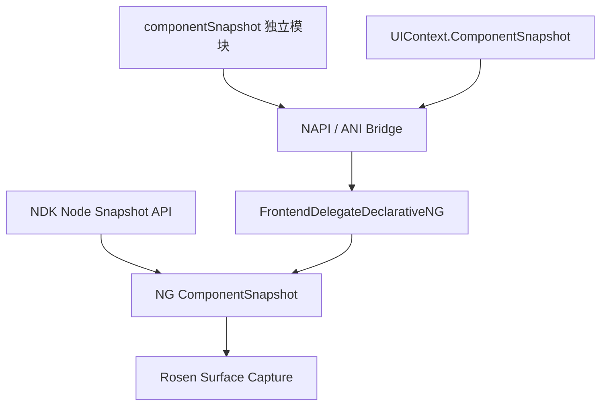
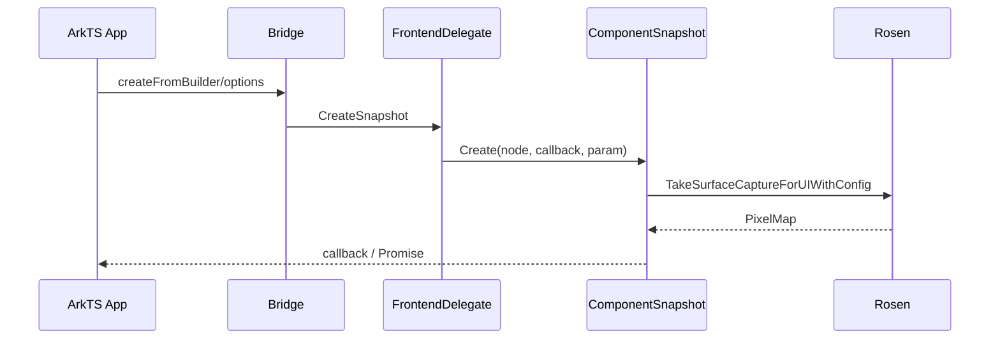

# 架构设计

> 组件截图由独立 ArkTS 模块、UIContext 服务和 C API 提供，最终均通过 NG `ComponentSnapshot` 调用 Rosen 截获 PixelMap；本文为已有实现补录的共享基线。

## 设计元数据

| 字段 | 内容 |
|------|------|
| Design ID | DESIGN-Func-04-10-01 |
| 关联需求 | 已有能力补录（无独立 requirement.md） |
| 关联 Epic | 无 |
| 目标 Feature | Feat-01、Feat-02、Feat-03、Feat-04、Feat-05 |
| 复杂度 | 复杂 |
| 目标版本 | API 10 起，持续扩展至 API 26 |
| Owner | ArkUI SIG |
| 状态 | Baselined（已有实现补录） |

## 需求基线

| 项 | 补充说明 |
|----|----------|
| 三通道接口 | 覆盖独立 `componentSnapshot` 模块、`UIContext.ComponentSnapshot` 和 C API。 |
| 离屏能力 | Builder 与 `ComponentContent` 创建离屏节点，异步得到 PixelMap。 |
| 选项与资源 | 统一描述 scale、region、色彩/HDR、超时、PixelMap/Options 生命周期。 |

## 上下文和现状

### 涉及仓和模块

| 仓库 | 补充架构说明 |
|------|----------------|
| interface_sdk-js | `@ohos.arkui.componentSnapshot.d.ts` 和 `@ohos.arkui.UIContext.d.ts` 定义 ArkTS 契约。 |
| ace_engine | `interfaces/napi/kits/component_snapshot/js_component_snapshot.cpp` 导出独立动态模块。 |
| ace_engine | `frameworks/bridge/declarative_frontend/ng/frontend_delegate_declarative_ng.cpp` 连接前端与 NG 截图服务。 |
| ace_engine | `frameworks/core/components_ng/render/adapter/component_snapshot.cpp` 创建离屏节点并请求 Rosen 截图。 |
| ace_engine | `interfaces/native/node/node_component_snapshot.cpp` 实现 C API。 |

### 调用链层级分析

| 层 | 模块 | 职责 | 修改类型 |
|----|------|------|----------|
| SDK | `UIContext.d.ts:4020-4353` | UIContext 截图接口、版本和 Promise 契约 | 无修改（规格补录） |
| SDK | `componentSnapshot.d.ts:517-700` | 旧独立模块与 API 18 弃用 | 无修改（规格补录） |
| ArkTS/NAPI/ANI | `js_component_snapshot.cpp:534-926`、`componentSnapshot_module.cpp:451-540` | 参数解析、异步回调和前端差异 | 无修改（规格补录） |
| Delegate | `frontend_delegate_declarative_ng.cpp:1487-1528` | 将 Builder/ComponentContent 转到 ComponentSnapshot | 无修改（规格补录） |
| NG Render | `component_snapshot.cpp:468-598,601-745` | 离屏节点处理、同步/异步 Rosen 捕获 | 无修改（规格补录） |
| C API | `native_node.h:14090-14129`、`native_type.h:3570-3635` | 节点同步捕获、Options 生命周期 | 无修改（规格补录） |

### 适用架构规则

| Rule ID | 适用原因 | 设计结论 | 验证方式 |
|---------|----------|----------|----------|
| OH-ARCH-LAYERING | API 经过桥接、Delegate、NG 和 Rosen | 公共入口不直接访问 Rosen，统一下沉到 ComponentSnapshot | 调用链审查 |
| OH-ARCH-API-LEVEL | API 10/12/15/18/20/23/26 递进 | 每个 Feat 标记 since、弃用和 System API | SDK 对照 |
| OH-ARCH-ERROR-LOG | 截图可超时、离屏配置可不支持 | 把错误码和异常回调作为契约的一部分 | 代码审查 |

## 不涉及项承接

| 维度 | 设计结论 |
|------|----------|
| UI 组件 Pattern | 不适用；截图为服务类，不创建独立可视组件 Pattern/Model。 |
| 截图后 PixelMap 编解码/文件保存 | 不属于 ArkUI 截图接口。 |
| 构建与部件 | 无变更；ANI/NAPI/C API 均为既有模块。 |

## 关键设计决策

| 决策 ID | 问题 | 推荐方案 | 探索过的替代方案 | 取舍理由 | 影响 |
|---------|------|----------|------------------|----------|------|
| ADR-1 | 接口面组织 | 旧模块、UIContext、C API 分 Feat 描述 | 只记录 UIContext；按实现文件分组 | 三个公开通道的版本和资源契约不同 | 全部 Feat |
| ADR-2 | 离屏执行链 | Builder/Content 经 Delegate→ComponentSnapshot→Rosen | 前端直接截图；组件 Pattern 截图 | 当前实现集中在 NG 渲染服务 | Feat-03 |
| ADR-3 | 自动色彩/HDR | 离屏 create API 拒绝 `isAuto=true` | 自动降级为手动默认；忽略配置 | 静态和 NAPI 实现明确报告不支持 | Feat-04 |
| ADR-4 | C 资源所有权 | 调用方释放 PixelMap 和 SnapshotOptions | 引擎隐式释放；复用 ArkTS Promise 语义 | C API 显式创建/销毁且为同步调用 | Feat-05 |
| ADR-5 | 旧模块 | 保留完整 API 10-18 行为并标记迁移 | 从规格删除旧模块 | SDK 仍公开声明，需防止存量回归 | Feat-01 |

## 设计骨架

### 骨架范围

| 骨架项 | 目标 | 不包含 | 验证方式 |
|--------|------|--------|----------|
| 独立模块 | get/create/getSync 与弃用 | PixelMap 消费 | SDK/NAPI 审查 |
| UIContext | 已挂载、范围、离屏内容截图 | 组件内部绘制 | SDK/NG 审查 |
| 选项与 C API | 参数、错误码、所有权、尺寸限制 | 平台文件输出 | 头文件/实现审查 |

### 骨架 Spec 拆分

| Task ID | 目标 | 受影响文件 | AC |
|---------|------|--------------|----|
| TASK-SKELETON-1 | 独立模块与迁移 | `componentSnapshot.d.ts` | Feat-01 AC |
| TASK-SKELETON-2 | 已挂载和范围截图 | `UIContext.d.ts`、`component_snapshot.cpp` | Feat-02 AC |
| TASK-SKELETON-3 | Builder 与 Content 离屏截图 | `frontend_delegate_declarative_ng.cpp` | Feat-03 AC |
| TASK-SKELETON-4 | Options、错误码与前端差异 | NAPI/ANI modules | Feat-04 AC |
| TASK-SKELETON-5 | C API 和尺寸限制 | `native_node.h`、`native_type.h` | Feat-05 AC |

## 后续 Task 拆分

| Task ID | 目标 | 受影响文件 | 依赖 |
|---------|------|--------------|------|
| TASK-1 | 独立模块接口与迁移规格 | Feat-01 | 无 |
| TASK-2 | UIContext 已挂载节点与范围截图规格 | Feat-02 | ADR-1 |
| TASK-3 | UIContext 离屏 Builder/Content 截图规格 | Feat-03 | ADR-2 |
| TASK-4 | 选项、错误码与跨前端差异规格 | Feat-04 | ADR-3 |
| TASK-5 | C API 节点截图与尺寸限制规格 | Feat-05 | ADR-4 |

## API 签名、Kit 与权限

### 新增 API

| API 签名 | 类型 | Kit | d.ts 位置 | 权限要求 | SysCap |
|----------|------|-----|-----------|----------|--------|
| `componentSnapshot.get/createFromBuilder/getSync` | Public（已弃用） | ArkUI | `componentSnapshot.d.ts:517-700` | 无 | ArkUI |
| `UIContext.getComponentSnapshot()` | Public | ArkUI | `UIContext.d.ts:5830-5832` | 无 | ArkUI |
| `ComponentSnapshot.get/createFromBuilder/createFromComponent` | Public | ArkUI | `UIContext.d.ts:4050-4314` | 无 | ArkUI |
| `ComponentSnapshot.getWithRange` | System | ArkUI | `UIContext.d.ts:4338-4341` | System API | ArkUI |
| `OH_ArkUI_GetNodeSnapshot` | Public C API | ArkUI NDK | `native_node.h:14090-14105` | 无 | ArkUI |

### 变更/废弃 API

| 原有 API | 变更类型 | 新 API | 迁移说明 |
|----------|----------|--------|----------|
| `@ohos.arkui.componentSnapshot.get/createFromBuilder` | 废弃（API 18） | `UIContext.ComponentSnapshot` 对应方法 | 从 UIContext 获取服务实例后调用同类方法。 |

## 构建系统影响

### BUILD.gn 变更

无变更，涉及的 NAPI、ANI 与 C API 均已在现有构建目标中注册。

### bundle.json 变更

无变更。

## 可选设计扩展

### 架构图



### 数据流/控制流

| 步骤 | 调用方 | 被调用方 | 数据/接口 | 说明 |
|------|--------|----------|-----------|------|
| 1 | ArkTS/C | Bridge 或 C API | target、Builder、Options | 解析/校验参数。 |
| 2 | Bridge | FrontendDelegate | 回调、`SnapshotParam` | 构建或查找目标节点。 |
| 3 | Delegate | ComponentSnapshot | `Create/Get/GetSync` | 处理离屏节点或现有节点。 |
| 4 | ComponentSnapshot | Rosen | `TakeSurfaceCaptureForUIWithConfig` | 完成 PixelMap 捕获。 |

### 时序设计



### 数据模型设计

```typescript
interface SnapshotOptions { scale?: number; waitUntilRenderFinished?: boolean; region?: SnapshotRegionType; colorMode?: ColorModeOptions; dynamicRangeMode?: DynamicRangeModeOptions }
```

```cpp
struct SnapshotParam { int32_t delay; bool checkImageStatus; SnapshotOptions options; };
```

### 资源所有权矩阵

| 资源 | 创建方 | 持有方 | 销毁触发 | 实际释放 | 异常回收 |
|------|--------|--------|----------|----------|----------|
| 离屏节点 | ComponentSnapshot | NG 流程 | 截图完成/失败 | 既有节点生命周期 | 回调返回错误 |
| ArkTS PixelMap | Rosen | ArkTS 调用方 | 应用释放 | ArkTS runtime | Promise/callback 错误 |
| C PixelMap | 系统 | C 调用方 | 使用完成 | `OH_PixelmapNative_Release` | 调用方检查错误码 |
| C SnapshotOptions | `OH_ArkUI_CreateSnapshotOptions` | C 调用方 | 使用完成 | `OH_ArkUI_DestroySnapshotOptions` | 调用方释放 |

## 详细设计

### 独立模块和 UIContext 检索

旧模块的 NAPI 导出在 `js_component_snapshot.cpp:914-926`；UIContext 类声明在 `UIContext.d.ts:4020-4353`，两者共享 NG 截图服务但版本和弃用语义不同。

### 离屏 Builder 与 ComponentContent

Delegate 分别在 `frontend_delegate_declarative_ng.cpp:1518-1528` 和 `1487-1492` 调用 `ComponentSnapshot::Create`；后者在 `component_snapshot.cpp:468-598` 处理离屏节点并请求 Rosen。

### 选项、异常和 C API

`SnapshotParam` 默认 delay 和 `checkImageStatus` 定义于 `snapshot_param.h:88-98`。离屏 auto 色彩/HDR 被 ANI 显式拒绝，见 `componentSnapshot_module.cpp:464-471`。C API 生命周期与同步错误码由 `native_node.h:14090-14129` 定义。

## 风险和开放问题

| 项 | 类型 | 影响 | 处理方式 | Owner |
|----|------|------|----------|-------|
| 独立模块仍在 SDK 可见 | API | 高 | 单独保留 Feat-01 与弃用迁移 | ArkUI SIG |
| 静态 Promise 可为 null | API | 中 | 在兼容表中逐前端声明 | ArkUI SIG |
| 离屏 auto 配置不支持 | API | 中 | 以错误码和 AC 固化 | ArkUI SIG |
| C 资源泄漏 | API | 高 | C Feat 明确释放责任 | ArkUI SIG |

## 设计审批

- [x] 需求基线已确认，设计覆盖 P0/P1 AC
- [x] 不涉及项已有结论
- [x] 涉及仓和模块职责清晰
- [x] 调用链层级分析完整
- [x] 适用架构规则已形成结论
- [x] 分层和子系统边界合规
- [x] API 签名、权限与兼容性已声明
- [x] BUILD.gn/bundle.json 影响明确
- [x] 后续 Task 拆分明确
- [x] 关键设计决策有理由和影响
- [x] 风险有 Owner

**结论:** 通过（已有实现补录）
