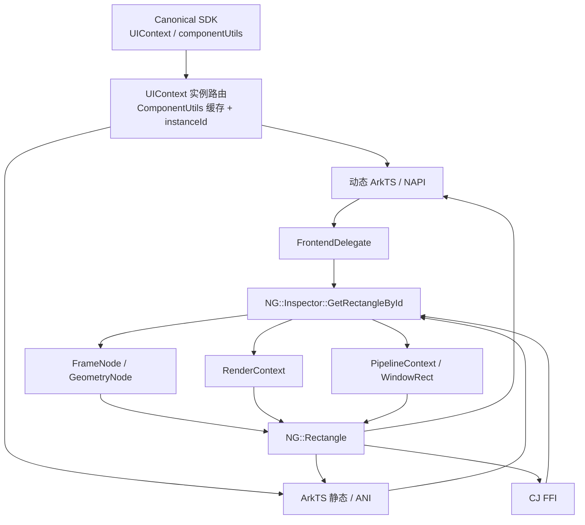
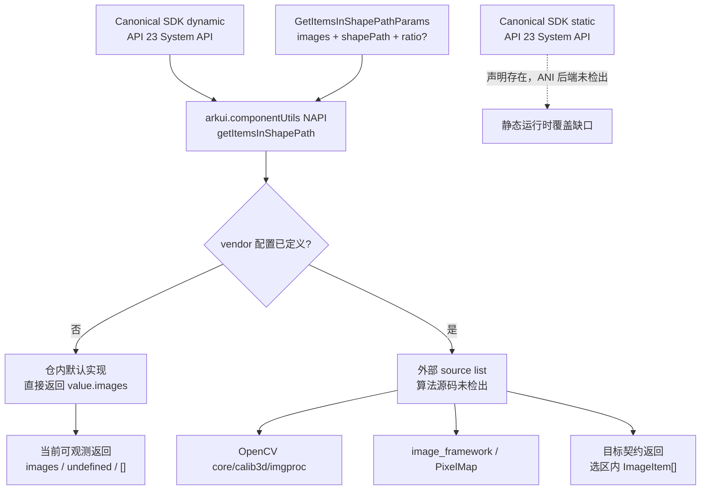
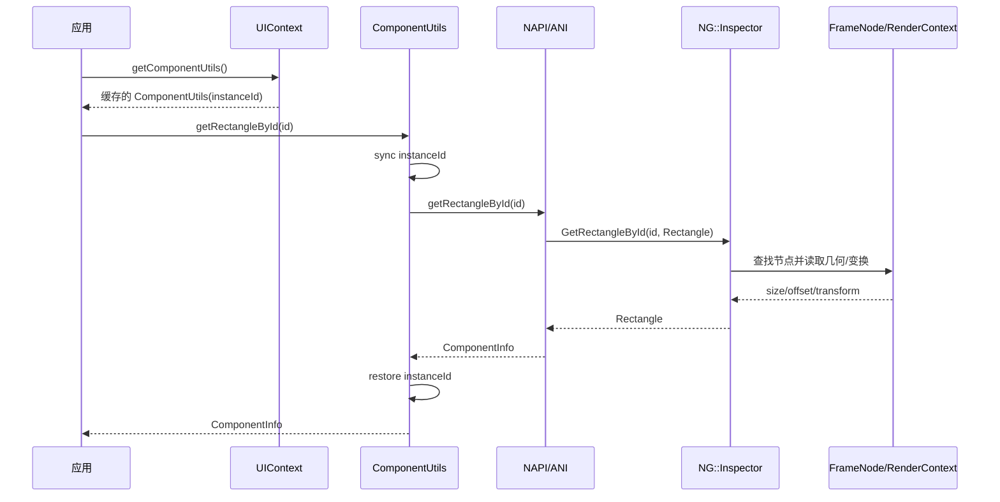
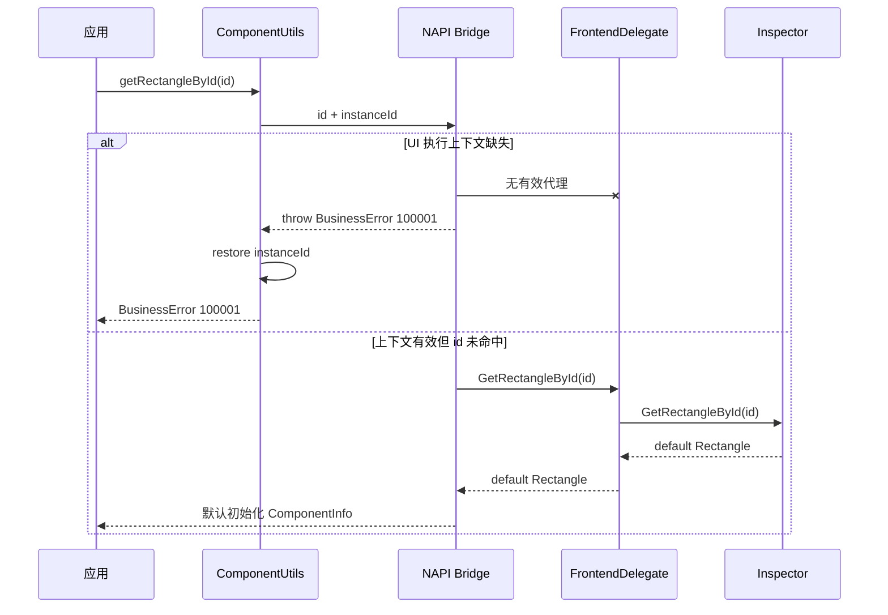

# 架构设计

> 确认 ComponentUtils 组件信息查询域的架构约束、关键设计决策、Spec 拆分方向和已有实现边界。

## 设计元数据

| 字段 | 内容 |
|------|------|
| Design ID | DESIGN-Func-04-11-01 |
| 关联需求 | 已有能力补录（无独立 requirement.md/proposal.md） |
| 关联 Epic | 无 |
| 目标 Feature | Feat-01 组件几何信息查询，Feat-02 形状区域图像项筛选 |
| 复杂度 | 复杂 |
| 目标版本 | Feat-01：API 10 起、API 18 起推荐 UIContext 入口；Feat-02：API 23 System API |
| Owner | ArkUI SIG |
| 状态 | Baselined（已有实现补录） |

## 需求基线

> 本功能域没有独立 proposal.md。基线由 canonical SDK 契约、已注册 Func/Feat 边界和当前 ace_engine 实现共同构成；当前实现中的可疑行为只记录为风险，不在规格补录中修改。

| 项 | 补充说明（如需） |
|----|------------------|
| 公开能力 | Feat-01 覆盖 `getRectangleById` 及 `UIContext.getComponentUtils`；Feat-02 覆盖模块级 `getItemsInShapePath` System API |
| 返回模型 | `ComponentInfo` 固定包含 size、三类 offset、translate、scale、rotate、transform |
| 版本基线 | Feat-01：API 10 引入、API 11 支持 Atomic Service、API 18 废弃模块级入口并迁移到 UIContext；Feat-02：API 23 dynamic/static、System API、Stage-only |
| 异常基线 | UI 执行上下文缺失抛 `100001`；组件 id 未命中返回默认初始化结果 |
| 功能域边界 | Feat-02 的 canonical SDK 声明筛选契约；仓内默认实现仅透传 `images`，vendor 算法、ANI/CJ/UIContext/NDK/ArkUI-X 等价实现不在当前检出范围 |

## 上下文和现状

### 涉及仓和模块

| 仓库 | 补充架构说明 |
|------|--------------|
| `interface_sdk-js` | `@ohos.arkui.componentUtils.d.ts` 定义 Feat-01 数据模型、历史入口和废弃迁移，并定义 Feat-02 API 23 dynamic System API；`@ohos.arkui.componentUtils.static.d.ets` 定义 Feat-02 static 声明；`@ohos.arkui.UIContext.d.ts` 定义 Feat-01 实例入口 |
| `arkui_ace_engine/frameworks/bridge/declarative_frontend/engine` | 动态 ArkTS UIContext 缓存 ComponentUtils，以 `withInstanceId` 包裹 NAPI 调用 |
| `arkui_ace_engine/interfaces/napi/kits/componentutils` | 动态 ArkTS NAPI 模块、Feat-01 参数解析/容器路由/返回对象封装；（Feat-02）导出 `getItemsInShapePath`、提供默认透传实现并按 GN 配置选择 vendor source list |
| `arkui_ace_engine/interfaces/ets/ani/componentUtils` | ArkTS 静态接口声明、ANI native 绑定和返回对象封装 |
| `arkui_ace_engine/frameworks/bridge/cj_frontend/interfaces/cj_ffi` | CJ FFI 数据模型和 Rectangle 到 CComponentInfo 的转换 |
| `arkui_ace_engine/frameworks/bridge/js_frontend` | FrontendDelegate 将 NAPI 查询转发给 Inspector |
| `arkui_ace_engine/frameworks/core/components_ng/base` | Inspector 节点查找、几何提取、动态组件偏移和变换分解 |
| `arkui_ace_engine/frameworks/bridge/common/utils` | `Rectangle` 跨桥接中间数据模型 |
| `arkui_ace_engine/test/unittest/core/base` | Inspector 底层尺寸、偏移、百分比变换和异常路径单元测试 |
| `arkui_x/test/xts/arkui/crossplatform/componentutilsxts` | 模块级 NAPI 公开 API 的 size/translate/scale/rotate/transform 和错误输入测试 |
| `arkui_ace_engine/build/ace_ext.gni` | （Feat-02）从 `ace_engine_ext` 或产品 vendor 路径装载可选构建配置 |
| `arkui_ace_engine/bundle.json` | （Feat-02）部件依赖清单包含 image_framework 与 opencv；实际目标链接由 vendor 配置分支决定 |

### 调用链层级分析

| 层 | 模块 | 职责 | 修改类型 |
|----|------|------|----------|
| 1. SDK 契约层 | `interface/sdk-js/api/@ohos.arkui.UIContext.d.ts`、`@ohos.arkui.componentUtils.d.ts`、`@ohos.arkui.componentUtils.static.d.ets` | 定义 Feat-01 入口/版本/ComponentInfo；（Feat-02）定义 API 23 dynamic/static System API、ImageItem 和筛选参数 | 文档补录，不改 SDK |
| 2. UIContext 实例路由层 | `frameworks/bridge/declarative_frontend/engine/jsUIContext.js`、Koala `UIContextImpl.ets` | 创建/缓存 ComponentUtils，切换并恢复 instanceId | 文档补录，不改实现 |
| 3. 语言桥接层 | NAPI `js_component_utils.cpp`、`js_mistouch_prevention.cpp`，ANI `componentUtils.cpp`，CJ `cj_component_utils_ffi.cpp` | Feat-01 参数转换/路由/返回对象构造；（Feat-02）动态 NAPI 导出和默认 `images` 透传，ANI/CJ 等价入口未检出 | 文档补录，记录偏差 |
| 4. Frontend 代理层 | `frameworks/bridge/js_frontend/frontend_delegate.cpp` | 将动态前端调用转发到 NG Inspector | 文档补录 |
| 5. 查询服务层 | `frameworks/core/components_ng/base/inspector.cpp` | 按 inspectorId 搜索离屏节点和主树，提取 Rectangle | 文档补录 |
| 6. 节点几何层 | FrameNode、GeometryNode、RenderContext、PipelineContext | 提供 frame size、PaintRect、窗口偏移、变换属性和窗口矩形 | 文档补录 |
| 7. 验证层 | `test/unittest/core/base/inspector_test_ng.cpp` | 验证核心查询、动态组件偏移、PX/PERCENT 换算和空上下文 | 补齐验证映射，不改测试 |
| 8. 产品扩展构建层 | `interfaces/napi/kits/componentutils/BUILD.gn`、`build/ace_ext.gni`、vendor/ace_engine_ext 外部配置 | （Feat-02）在仓内默认实现与外部算法实现之间进行编译期替换 | 记录替换边界；外部源码未检出 |

调用方向保持“SDK/UIContext → 语言桥接 → FrontendDelegate/Inspector → FrameNode/RenderContext/PipelineContext”，底层节点与渲染对象不反向依赖语言桥接。

### 适用架构规则

| Rule ID | 适用原因 | 设计结论 | 验证方式 |
|---------|----------|----------|----------|
| OH-ARCH-LAYERING | 涉及 SDK、桥接、查询核心和节点几何多层调用 | 维持单向分层，所有语言通道复用 `NG::Inspector::GetRectangleById` | 架构评审、依赖检查 |
| OH-ARCH-SUBSYSTEM | SDK 契约仓与 ace_engine 实现仓协同 | 仅通过公开声明和语言桥接连接，不引入新的跨子系统依赖 | SDK/代码联合评审 |
| OH-ARCH-IPC-SAF | 查询依赖当前进程内 Pipeline | 不涉及 IPC 或 SA；禁止扩展为跨进程组件搜索 | 集成测试 |
| OH-ARCH-API-LEVEL | Public API 存在版本迁移 | 保留 API 10 契约，API 18 通过 deprecated/useinstead 引导迁移 | API 检查、XTS |
| OH-ARCH-COMPONENT-BUILD | NAPI 和 ANI 分别由现有构建目标承载 | 文档补录不修改 BUILD.gn/bundle.json | 构建配置审查 |
| OH-ARCH-ERROR-LOG | 上下文缺失和节点未命中语义不同 | 前者错误码 `100001`，后者日志告警并返回默认值 | 故障注入、日志检查 |
| OH-ARCH-API-LEVEL-F2 | Feat-02 为 API 23 System API 且限制 Stage 模型 | dynamic/static 声明保持一致；不推导未声明的 crossplatform、atomicservice 或权限能力 | SDK 标签检查 |
| OH-ARCH-COMPONENT-BUILD-F2 | Feat-02 支持产品源码替换 | `vendor_configs.ace_engine_mistouch_prevention` 存在时使用外部 source list，否则编译仓内默认实现；两条路径互斥 | GN source 清单和双配置构建 |

## 不涉及项承接

| 维度 | 设计结论 |
|------|----------|
| 安全与权限 | 不新增权限、敏感数据或跨进程信任边界；仅查询当前 UI 执行上下文中的组件几何 |
| 数据持久化 | 不存储查询结果，不涉及格式迁移 |
| 网络与 IPC | 不涉及网络、Binder、SA 或跨进程调用 |
| 产品源码变更 | 本次仅补录 specs、registry 和生成索引，不改变当前实现 |
| 未检出 vendor 算法 | 不根据 OpenCV/image_framework 依赖推导形状相交、像素采样、旋转处理或阈值边界；仅记录替换接口 |

## 关键设计决策

| 决策 ID | 问题 | 推荐方案 | 探索过的替代方案 | 取舍理由 | 影响 |
|---------|------|----------|------------------|----------|------|
| ADR-1 | 如何表达模块级入口与 UIContext 入口的关系 | 保留两条历史实现路径，API 18 起将 UIContext 实例入口作为推荐路径 | 仅记录旧模块入口；将旧入口视为已删除；把 ComponentUtils 设计为进程全局单例 | canonical SDK 明确给出 deprecated/useinstead；实例入口能绑定正确窗口和 instanceId，旧入口仍需兼容 | Spec AC-1.1~AC-1.4、API 迁移、UIContext 测试 |
| ADR-2 | 节点未命中应抛错还是返回默认值 | 固化当前行为：搜索离屏节点和主树，未命中返回默认初始化 ComponentInfo；仅上下文缺失抛 `100001` | 未命中也抛 `100001`；仅搜索主树；返回 null/undefined | 当前 Inspector 早退且 NAPI 仍构造对象，现有测试验证零值；不能在补录中发明新异常 | Spec AC-1.5、AC-2.1~AC-2.3、异常验证 |
| ADR-3 | 坐标和百分比变换如何统一 | 使用当前 Rectangle 模型：local/window/screen 分层；dynamic component 叠加宿主偏移；百分比按未变换 PaintRect 换算为 vp | 所有坐标统一为屏幕坐标；按变换后矩形换算百分比；忽略 dynamic component 宿主偏移 | 与现有 Inspector 实现和 UT 一致，能够解释多窗口、动态组件和变换中心边界 | Spec AC-2.4~AC-3.5、设备适配 |
| ADR-4 | 多前端矩阵封装差异如何处理 | 记录 NAPI 最终保序、ANI 索引 0 默认值、CJ 直接复制为 float，并建立对比验证 | 假定三通道完全一致；选择单一通道要求其他通道修复；忽略 CJ/ANI | “当前实现即规格”要求偏差可见；canonical SDK 只定义列优先契约，不能由文档静默修正实现 | Spec AC-3.6、AC-4.1~AC-4.5、风险 RISK-1 |
| ADR-F2-1 | SDK 的区域筛选契约与仓内默认透传实现如何同时表达 | API 表面与目标行为以 canonical SDK 为准；默认实现的透传、缺参和错误类型结果作为显式实现偏差记录 | 只写 SDK 理想行为；把默认透传视为完整筛选；在文档中静默统一两者 | 外部契约和当前可观测行为都必须可追溯，不能用文档掩盖重大偏差 | Feat-02 AC-1.1~AC-2.5、RISK-F2-1 |
| ADR-F2-2 | 缺失或非法输入的返回语义如何固化 | 按默认 NAPI 当前行为记录：无参返回新 `[]`，缺 `images` 返回 `undefined`，任意 `images` 值原样返回 | 统一抛参数错误；统一返回空数组；强制转换为数组 | 源码未执行参数校验，规格补录不能发明错误码或修复 | Feat-02 AC-2.2~AC-2.5、RISK-F2-2 |
| ADR-F2-3 | dynamic/static SDK 声明与实现覆盖不一致如何处理 | 分离“声明存在”和“运行时实现检出”两种结论；当前只确认动态 NAPI 导出 | 由 static 声明推定 ANI 已实现；用 NAPI 能力代替所有前端 | 防止静态或跨语言调用者得到无法兑现的能力承诺 | Feat-02 AC-3.4、RISK-F2-3 |
| ADR-F2-4 | vendor 算法不可见时设计可描述到什么程度 | 仅记录 GN source replacement、依赖和验证责任，不推断算法 | 依据依赖猜测 OpenCV 算法；把 vendor 行为等同默认透传；忽略产品替换 | 当前代码只能证明编译边界；算法、阈值和测试必须由实际 vendor 源码取证 | Feat-02 AC-3.1~AC-3.5、RISK-F2-4 |

## 设计骨架

### 骨架范围

| 骨架项 | 目标 | 不包含 | 验证方式 |
|--------|------|--------|----------|
| 公共数据模型 | 对齐 SDK `ComponentInfo` 与 C++ `Rectangle` 的字段映射 | 不新增字段或可选字段 | SDK/源码对照 |
| 实例路由 | 固化 UIContext 缓存、instanceId 切换和上下文错误 | 不改变 UIContext 生命周期 | 集成测试 |
| 节点与几何查询 | 固化离屏节点、主树、尺寸、坐标和 dynamic component 偏移 | 不扩展跨窗口搜索 | Inspector UT |
| 变换分解 | 固化 center、scale、rotate、translate 和 matrix4 | 不改变 RenderContext 存储 | Inspector UT |
| 多前端封装 | 明确 NAPI/ANI/CJ 的当前输出行为 | 不在文档任务中修复偏差 | 对比测试 |
| 形状区域图像项筛选 | 对齐 API 23 System API 契约、默认 NAPI 透传、静态通道缺口和 vendor 替换边界 | 不推导未检出的筛选算法或修改产品源码 | SDK 扫描、NAPI 参数矩阵、GN 双配置构建 |

### 骨架 Spec 拆分

| Task ID | 目标 | 受影响文件 | AC |
|---------|------|------------|----|
| TASK-SKELETON-1 | 补录 Feat-01 组件几何信息查询规格 | `Feat-01-component-geometry-query-spec.md` | AC-1.1~AC-4.5 |
| TASK-SKELETON-2 | 建立共享 ComponentUtils 设计基线 | `design.md` | AC-1.1~AC-4.5 |
| TASK-SKELETON-F2 | 将 Feat-02 增量合并到共享设计基线 | `Feat-02-shape-path-image-filter-spec.md`、`design.md` | Feat-02 AC-1.1~AC-3.5 |

## 后续 Task 拆分

| Task ID | 目标 | 受影响文件 | 依赖 |
|---------|------|------------|------|
| TASK-04-11-01-F1 | 组件几何信息查询规格补录与注册 | `Feat-01-component-geometry-query-spec.md`、`registry/features.yaml` | 无 |
| TASK-04-11-01-F2 | 补录形状区域图像项筛选，明确 API 23 System API、默认占位实现、vendor 可替换构建和通道覆盖边界 | `Feat-02-shape-path-image-filter-spec.md`、本 design.md 增量章节、`registry/features.yaml` | Feat-01 共享架构基线 |
| TASK-04-11-01-TEST | 补充 NAPI/ANI/CJ 公开返回对象和矩阵一致性验证 | ComponentUtils 相关测试目录 | Feat-01 AC/VM |
| TASK-04-11-01-F2-TEST | 补充 Feat-02 默认 NAPI 参数矩阵、dynamic/static 通道和 vendor 产品筛选验证 | ComponentUtils 相关测试目录、产品扩展测试目录 | Feat-02 AC/VM、实际 vendor 源码 |

## API 签名、Kit 与权限

### 新增 API

> 下表为历史已有 API 的设计补录。

| API 签名 | 类型 | Kit | d.ts 位置 | 权限要求 | SysCap |
|----------|------|-----|------------|----------|--------|
| `UIContext.getComponentUtils(): ComponentUtils` | Public | ArkUI | `interface/sdk-js/api/@ohos.arkui.UIContext.d.ts:3210-3225` | 无 | `SystemCapability.ArkUI.ArkUI.Full` |
| `ComponentUtils.getRectangleById(id: string): componentUtils.ComponentInfo` | Public | ArkUI | `interface/sdk-js/api/@ohos.arkui.UIContext.d.ts:2198-2218` | 无 | `SystemCapability.ArkUI.ArkUI.Full` |
| `componentUtils.getItemsInShapePath(value: GetItemsInShapePathParams): Array<ImageItem>` | System | ArkUI | dynamic `@ohos.arkui.componentUtils.d.ts:446-598`；static `@ohos.arkui.componentUtils.static.d.ets:386-537` | 无；Stage 模型限定 | `SystemCapability.ArkUI.ArkUI.Full` |

ArkUI NDK C-API 未提供等价公开接口。CJ `FFIOHOSAceFrameworkComponentUtilsGetById` 是语言 FFI 通道，不作为 NDK Public API。

### 变更/废弃 API

| 原有 API | 变更类型 | 新 API | 迁移说明 |
|----------|----------|--------|----------|
| `componentUtils.getRectangleById(id: string): ComponentInfo` | API 18 废弃 | `UIContext.getComponentUtils().getRectangleById(id)` | 从目标窗口/页面取得 UIContext，避免依赖隐式当前实例 |

## 构建系统影响

### BUILD.gn 变更

```text
文件路径: interfaces/napi/kits/componentutils/BUILD.gn
变更说明: 无。本次沿用 napi_componentutils_static；Feat-01 使用 js_component_utils.cpp。

文件路径: interfaces/ets/ani/componentUtils/BUILD.gn
变更说明: 无。本次沿用 componentUtils_ani 与 componentUtils 静态 ABC 目标。

文件路径: interfaces/napi/kits/componentutils/BUILD.gn
变更说明: （Feat-02）默认编译 js_mistouch_prevention.cpp；定义 vendor_configs.ace_engine_mistouch_prevention 时改用 ace_engine_mistouch_prevention_mode 外部 source list，并加入 opencv、image_framework 和 PixelMap 依赖。

文件路径: build/ace_ext.gni
变更说明: （Feat-02）从 ace_engine_ext/build/config.gni 或产品 vendor 路径加载 vendor_configs；后加载的产品配置覆盖前者。
```

### bundle.json 变更

本次文档补录不修改 `bundle.json`。当前部件依赖清单已在 `bundle.json:95,120` 包含 `image_framework` 与 `opencv`；具体 ComponentUtils 目标仅在启用 vendor 配置时链接对应依赖。

## 可选设计扩展

### 架构图



#### 形状区域图像项筛选架构图（Feat-02）



### 数据流/控制流

| 步骤 | 调用方 | 被调用方 | 数据/接口 | 说明 |
|------|--------|----------|-----------|------|
| 1 | 应用 | UIContext | `getComponentUtils()` | 获取绑定 instanceId 的缓存对象 |
| 2 | ComponentUtils | NAPI/ANI | `getRectangleById(id)` | 同步传递 inspector id |
| 3 | NAPI | Container/EngineHelper | CurrentId、SafelyId、FrontendDelegate | 上下文无效时抛 `100001` |
| 4 | NAPI Delegate / ANI / CJ | Inspector | `GetRectangleById(key, rectangle)` | 所有通道汇合到共享查询核心 |
| 5 | Inspector | InspectorOffscreenNodesMgr/根树 | inspector id | 先离屏节点，后根树 |
| 6 | Inspector | GeometryNode/RenderContext/PipelineContext | size、offset、transform、window rect | 逐字段填充 Rectangle |
| 7 | 桥接层 | 语言运行时 | ComponentInfo | NAPI/ANI/CJ 按各自结构封装 |

#### 形状筛选数据流（Feat-02）

| 步骤 | 调用方 | 被调用方 | 数据/接口 | 说明 |
|------|--------|----------|-----------|------|
| F2-1 | 系统应用 | `arkui.componentUtils` NAPI | `GetItemsInShapePathParams` | API 23 System API，Stage 模型限定 |
| F2-2 | `JSGetItemsInShapePath` | `MistouchPrevention::GetItemsInShapePath` | 第一个 NAPI 实参 | NAPI 模块固定导出同一函数名 |
| F2-3A | 默认构建 | `js_mistouch_prevention.cpp` | `value.images` | 不读取 `shapePath`、`ratio` 或 ImageItem 内容，直接返回属性值 |
| F2-3B | vendor 构建 | 外部 source list | 输入模型与外部依赖 | 当前检出范围仅确认替换机制，无法确认算法 |
| F2-4 | NAPI | 系统应用 | `ImageItem[]` 或默认实现的实际值 | 默认实现可能返回 `[]`、`undefined` 或任意 `images` 值 |

### 时序设计



### 数据模型设计

```typescript
interface ComponentInfo {
  size: Size;
  localOffset: Offset;
  windowOffset: Offset;
  screenOffset: Offset;
  translate: TranslateResult;
  scale: ScaleResult;
  rotate: RotateResult;
  transform: Matrix4Result; // exactly 16 numbers
}
```

```cpp
struct Rectangle {
    SizeF size;
    OffsetF localOffset;
    OffsetF windowOffset;
    Rect screenRect;
    TranslateOption translate;
    ScaleOption scale;
    RotateOption rotate;
    Matrix4 matrix4;
};
```

#### 形状筛选数据模型（Feat-02）

```typescript
interface Rotation2D {
  angle: double;
  centerX: double;
  centerY: double;
}

interface ImageItem {
  image: PixelMap;
  rect: common2D.Rect;
  rotation?: Rotation2D;
  zIndex: int;
}

interface GetItemsInShapePathParams {
  images: Array<ImageItem>;
  shapePath: Array<common2D.Point>;
  ratio?: double; // SDK default: 0.15
}
```

| 模型 | 创建方 | 存储周期 | 转换目标 |
|------|--------|----------|----------|
| `NG::Rectangle` | 语言桥接调用栈 | 单次同步查询 | NAPI JS object、ANI object、CJ CComponentInfo |
| `ComponentInfo` | NAPI/ANI 运行时 | 由语言运行时管理 | 应用返回值 |
| `CComponentInfo.transform` | CJ FFI | 调用返回后由 CJ FFI 约定管理 | 16 个 float 数组 |
| `GetItemsInShapePathParams` | API 23 System API 调用方 | 单次同步调用 | dynamic NAPI 或产品 vendor 实现 |
| `ImageItem[]` | API 调用方；符合契约的实现返回筛选子集 | 由 ArkTS 运行时管理 | 默认实现保持 `images` 引用；vendor 行为以实际源码为准 |

### 算法与状态机

```text
GetRectangleById(id):
  frameNode = GetFrameNodeByKey(id, notDetach=true)
  if frameNode is null:
    return default Rectangle
  rectangle.size = frameNode.geometry.frameSize
  if renderContext is null:
    return partially populated Rectangle
  rectangle.localOffset = renderContext.paintRectWithTransform.offset
  rectangle.windowOffset = frameNode.offsetRelativeToWindow
  if dynamic component:
    rectangle.windowOffset += pipeline.hostParentOffsetToWindow
  rectangle.screenRect = pipeline.currentWindowRect
  rectangle.matrix4 = renderContext.transformMatrix or identity
  resolve transform center from PX/PERCENT to vp
  rectangle.scale = renderContext.scale or (1, 1, 1)
  rectangle.rotate = renderContext.rotate or zero rotation
  resolve translate x/y PERCENT against untransformed PaintRect; convert x/y/z to vp
```

#### 默认形状筛选状态机（Feat-02）

```text
GetItemsInShapePath(info):
  create new empty array
  read at most one argument
  if no first argument:
    return new empty array
  read firstArgument.images
  if property lookup fails:
    return new empty array
  return images property value

Observable default-path consequences:
  value.images exists -> return the exact property value
  value is {} -> property lookup yields JavaScript undefined
  shapePath and ratio -> never inspected
  extra arguments -> ignored
```

### 测试性设计

| 测试层级 | 测试目标 | Mock 策略 | 验证方式 |
|----------|----------|-----------|----------|
| SDK 检查 | 签名、字段、since/deprecated/useinstead | 无 | canonical d.ts 静态扫描 |
| UIContext 集成 | 对象缓存、instanceId 路由、异常恢复 | 多 UIContext/Container mock | JS/ANI 集成测试 |
| Inspector UT | 主树/离屏节点、默认值、动态组件、PX/PERCENT | MockPipelineContext、MockRenderContext | 现有 `inspector_test_ng.cpp` |
| NAPI XTS | size/translate/scale/rotate/transform、未知 id、动态更新 | 真实组件页 | 现有 ComponentUtils XTS |
| NAPI UT | local/window/screen offset、索引映射、100001 | NAPI env 和 FrontendDelegate mock | 补充桥接单测 |
| ANI UT | 8 字段和矩阵 0~15 索引 | ANI env/class mock | 新增桥接单测 |
| CJ UT | float 精度、16 元素分配与释放 | Rectangle 固定样本 | 新增 FFI 单测 |
| 跨通道对比 | NAPI/ANI/CJ 对同一 Rectangle 的结果 | 固定非对称 4×4 矩阵 | 差异快照测试 |
| Feat-02 SDK 检查 | dynamic/static 签名、System API、Stage-only、API 23、ratio 默认值 | 无 | canonical 声明静态扫描 |
| Feat-02 默认 NAPI UT | `images` 引用透传、无参、缺属性、非数组、多实参 | NAPI 参数对象矩阵 | 严格相等和返回类型断言 |
| Feat-02 vendor 集成 | 选择区域、旋转、层级、ratio 边界和 PixelMap 内容 | 依赖实际 vendor 源码与固定图像样本 | 产品扩展测试；当前仓无现成证据 |
| Feat-02 通道覆盖 | dynamic NAPI、static ANI、CJ、NDK、UIContext、ArkUI-X | 符号扫描和最小调用样例 | 声明/实现能力矩阵 |

### 异常传播时序图



| 异常场景 | 传播/恢复 | 外部结果 |
|----------|-----------|----------|
| FrontendDelegate 缺失 | NAPI 构造增强上下文信息并抛错；UIContext `finally` 恢复 instanceId | `100001` |
| Pipeline/root/id 未命中 | Inspector 记录日志并早退 | 默认初始化 ComponentInfo |
| RenderContext/PipelineContext 缺失 | Inspector 停止后续计算 | 部分字段已写，其余默认 |
| 矩阵通道差异 | 不自动修复，交由兼容性验证定界 | 各通道维持当前可观测结果 |
| Feat-02 无实参 | 默认 NAPI 记录错误日志并返回新空数组 | `[]` |
| Feat-02 缺少 `images` | 属性读取结果为 JavaScript `undefined` | `undefined`，偏离 SDK 数组返回类型 |
| Feat-02 非数组 `images` | 不校验、不转换，直接返回属性值 | 任意 JavaScript 值 |
| Feat-02 static/其他前端入口缺失 | 不由 dynamic NAPI 能力推定其可用性 | 作为通道覆盖风险，不伪造降级路径 |

### 资源所有权矩阵

| 资源 | 创建方 | 持有方 | 销毁触发 | 实际释放 | 异常回收 |
|------|--------|--------|----------|----------|----------|
| UIContext ComponentUtils 对象 | UIContext | UIContext 缓存字段 | UIContext 生命周期结束 | JS/ArkTS 运行时 | 无独立 native 资源 |
| `NG::Rectangle` | 桥接调用栈 | 当前调用栈 | 函数返回 | 栈自动释放 | 早退自动释放 |
| NAPI/ANI 返回对象 | 语言桥接 | 语言运行时 | GC | JS/ANI Runtime | native 创建失败返回 null/异常 |
| CJ transform 数组 | CJ FFI | CJ 调用方 | FFI 调用方完成使用 | 按 CJ FFI 内存约定释放 | malloc 失败时 head 为 null、size 仍为 16 |

### 接口参数规约

| 接口 | 参数 | 类型 | 合法范围 | 非法处理 | 边界说明 |
|------|------|------|----------|----------|----------|
| `ComponentUtils.getRectangleById` | id | string | 任意 ArkTS string；通常为组件 inspector id | 非 string 在 NAPI 参数断言处失败 | 空字符串也参与搜索；仅未命中时返回默认值 |
| `componentUtils.getRectangleById` | id | string | 同上 | 同上 | NAPI 固定 UTF-8 缓冲区为 1024 字节，超长输入存在通道差异风险 |
| `componentUtils.getItemsInShapePath` | value | `GetItemsInShapePathParams` | SDK 要求 `images`、`shapePath`，`ratio` 可选且默认 `0.15` | 默认 NAPI 无参返回 `[]`，缺 `images` 返回 `undefined`，非数组原样返回 | SDK 未声明 ratio 数值边界；默认实现不读取 shapePath/ratio |

### 线程与并发模型

| 操作 | 发起线程 | 回调线程 | 跨进程边界 | 线程安全 | 重入约束 |
|------|----------|----------|------------|----------|----------|
| `getComponentUtils()` | 当前 ArkTS 执行线程 | 无回调 | 否 | UIContext 实例字段缓存 | 同一 UIContext 同步访问 |
| `getRectangleById()` | 具有 UI 执行上下文的调用线程 | 无回调 | 否 | 依赖当前 Container/Pipeline | 同步查询期间组件树应保持当前帧一致性 |
| Inspector 节点遍历 | UI 查询调用链 | 无回调 | 否 | 只读遍历 | 不启动异步任务，不跨线程回调 |
| `getItemsInShapePath()` 默认实现 | 当前 ArkTS/NAPI 调用线程 | 无回调 | 否 | 仅读取参数对象属性，无共享状态 | 同步返回输入属性引用；vendor 线程模型需按外部源码验证 |

## 详细设计

### UIContext 实例路由与 API 迁移

动态前端在 `frameworks/bridge/declarative_frontend/engine/jsUIContext.js:599-604` 对 `ComponentUtils` 进行 null-check 惰性创建并缓存。`ComponentUtils` 构造器在 `jsUIContext.js:1359-1362` 保存 instanceId 并加载 `arkui.componentUtils` NAPI 模块；查询方法在 `jsUIContext.js:1363-1369` 通过 `withInstanceId` 包裹调用。`withInstanceId` 在 `jsUIContext.js:2036-2042` 使用 `try/finally`，保证异常路径恢复原 instanceId。

ArkTS 静态前端的 `ComponentUtilsImpl` 在 `frameworks/bridge/arkts_frontend/koala_projects/arkoala-arkts/arkui-ohos/src/base/UIContextImpl.ets:267-279` 执行实例同步、native 查询和恢复。canonical SDK 在 `@ohos.arkui.componentUtils.d.ts:826-847` 将模块级入口标记为 API 18 废弃，并通过 `@useinstead` 指向 UIContext 类方法；实例方法签名位于 `@ohos.arkui.UIContext.d.ts:2198-2218`。

### 容器路由与查询入口

NAPI `interfaces/napi/kits/componentutils/js_component_utils.cpp:28-68` 读取字符串 id，优先使用 `ContainerScope::CurrentId()`，否则回退到 `Container::SafelyId()`；取得 Container 后经 `EngineHelper::GetDelegateByContainer` 获取 FrontendDelegate。代理缺失时构造增强上下文信息并抛 `100001`。代理存在时，`frameworks/bridge/js_frontend/frontend_delegate.cpp:118-121` 直接转发到 `NG::Inspector::GetRectangleById`。

ANI 在 `interfaces/ets/ani/componentUtils/src/componentUtils.cpp:179-208` 直接转换字符串并调用 Inspector；CJ 在 `frameworks/bridge/cj_frontend/interfaces/cj_ffi/cj_component_utils_ffi.cpp:23-64` 使用相同核心入口。

### 节点搜索与坐标计算

`frameworks/core/components_ng/base/inspector.cpp:636-660` 的 `GetFrameNodeByKey` 先读取当前 PipelineContext，再遍历 InspectorOffscreenNodesMgr，最后遍历根节点树。`GetRectangleById` 在 `inspector.cpp:690-705` 以 `notDetach=true` 查找 FrameNode，未命中时记录日志并返回；命中后读取 GeometryNode frame size、含变换 PaintRect 的 localOffset 和 FrameNode windowOffset。

dynamic component 的特殊处理位于 `inspector.cpp:706-714`：仅当 Container 是 dynamic render 且 UIContentType 为 DYNAMIC_COMPONENT 时，将 `hostParentOffsetToWindow` 加到 windowOffset。NAPI/CJ 的 screenOffset 在 `js_component_utils.cpp:129-130` 和 `cj_component_utils_ffi.cpp:36-37` 中按 `windowOffset + screenRect.offset` 计算。

### 变换中心、缩放、旋转和平移

`inspector.cpp:723-725` 从 RenderContext 读取 matrix4，默认单位矩阵。`inspector.cpp:726-740` 以 50%/50% 为默认 transform center：任一轴为 PERCENT 时，在 PaintRect 有效的前提下按对应轴尺寸换算为 px 再转 vp；否则直接转 vp。

`inspector.cpp:741-755` 读取 scale 和 rotate。scale 默认 x/y=1、z 固定为 1；rotate 返回 x/y/z、angle，并复用同一 centerX/centerY。`inspector.cpp:756-770` 对 translate.x/y 的百分比分别使用 PaintRect width/height 换算，其他单位直接转 vp，translate.z 始终直接转 vp。

### 返回对象封装与矩阵偏差

NAPI 在 `interfaces/napi/kits/componentutils/js_component_utils.cpp:121-224` 创建 8 字段 JS 对象。matrix4 在 `js_component_utils.cpp:146-178` 使用行列交换式中间下标，但设置数组元素时再次反向取值，最终元素 0~15 与内部 matrix4 同序。

ANI 在 `interfaces/ets/ani/componentUtils/src/componentUtils.cpp:156-176` 创建长度 16 的 vector，但循环从索引 1 开始，因此索引 0 保持 `std::vector<double>` 的默认值 0；其余字段在 `componentUtils.cpp:179-208` 构造为 ArkTS 对象。CJ 在 `cj_component_utils_ffi.cpp:53-64` malloc 16 个 float 并按内部矩阵索引直接复制。三者差异记录为兼容风险，不在本次文档补录中选定修复方向。

### 验证现状与缺口

现有 `test/unittest/core/base/inspector_test_ng.cpp:430-463,494-519,1264-1417,1479-1515` 覆盖默认 scale、未知 id、RenderContext 缺失、dynamic component windowOffset、transform center 的 PX/PERCENT、translate 的 VP/PERCENT 以及 Pipeline/root 缺失。`arkui_x/test/xts/arkui/crossplatform/componentutilsxts/.../ComponentUtils.test.ets:48-203` 进一步验证公开 NAPI 的 size、translate、scale、rotate、transform、未知 id 和动态更新。

现有 XTS 未直接断言 local/window/screen offset，也未覆盖 UIContext 多实例、NAPI 参数缓冲区边界、`100001`、ANI 索引 0、CJ 分配释放和跨通道结果；这些缺口由 TASK-04-11-01-TEST 承接。

### API 23 形状筛选契约与类型模型

canonical dynamic 声明在 `interface_sdk-js/api/@ohos.arkui.componentUtils.d.ts:446-598` 定义 `Rotation2D`、`ImageItem`、`GetItemsInShapePathParams` 和 `getItemsInShapePath`。static 声明在 `interface_sdk-js/api/@ohos.arkui.componentUtils.static.d.ets:386-537` 提供同构类型与函数。两条声明均标注 `@systemapi`、`@stagemodelonly` 和 `@since 23`，未标注 crossplatform、atomicservice、permission、throws、callback、Promise、deprecated 或 useinstead。

`ImageItem` 必须包含 `PixelMap image`、`common2D.Rect rect` 和 `int zIndex`，可选 `Rotation2D rotation`；旋转模型由 `angle`、`centerX`、`centerY` 三个 `double` 字段组成。`GetItemsInShapePathParams` 必须包含 `images` 与 `shapePath`，可选 `ratio`；SDK 文档在 dynamic `:575-585` 和 static `:514-524` 将其默认值声明为 `0.15`。外部契约要求返回位于选择区域内的 `ImageItem[]`，但未给出 ratio 合法范围、路径闭合规则、边界点归属、旋转矩形相交算法或错误码。

### 默认 NAPI 透传行为与返回类型偏差

`interfaces/napi/kits/componentutils/js_component_utils.cpp:227-237` 将模块导出的 `getItemsInShapePath` 转发给 `MistouchPrevention::GetItemsInShapePath`。仓内默认实现位于 `interfaces/napi/kits/componentutils/js_mistouch_prevention.cpp:25-46`：先创建空数组，只请求一个实参；无实参时返回该空数组；有实参时仅读取 `images` 命名属性并直接返回。该路径不读取 `shapePath`、`ratio`、PixelMap 像素、`rect`、`rotation` 或 `zIndex`，也不执行数组与元素校验。

因此，`{ images: imagesRef, shapePath }` 返回值与 `imagesRef` 保持同一对象标识；`{}` 的属性读取成功并得到 JavaScript `undefined`；`{ images: null }`、`{ images: 1 }` 等输入分别原样返回 `null`、`1`。当属性读取本身失败时返回预先创建的空数组。上述结果与 SDK 的 `Array<ImageItem>` 返回类型和区域筛选语义存在重大偏差，本设计只将其记录为当前默认路径行为，不把它解释成合格筛选算法。

### vendor 编译期替换与依赖边界

`interfaces/napi/kits/componentutils/BUILD.gn:19-46` 在 `napi_componentutils_static` 中始终编译 `js_component_utils.cpp`，并根据 `vendor_configs.ace_engine_mistouch_prevention` 是否定义选择实现源：未定义时加入仓内 `js_mistouch_prevention.cpp`；定义时加入 `ace_engine_mistouch_prevention_mode` 提供的外部 source list，同时链接 OpenCV core/calib3d/imgproc、image_framework image/image_native 和 PixelMap/PixelMap NDK 依赖。

`build/ace_ext.gni:16-41` 先尝试从 `//foundation/arkui/ace_engine_ext/build/config.gni` 导入 vendor 配置，再尝试从 `//vendor/${product_company}/foundation/ace/ace_engine_ext/ace_engine_ext.gni` 导入产品配置。当前检出范围没有对应 vendor 实现源，因此只能确认“默认实现与外部实现编译期互斥替换”的边界，不能确认形状相交、像素采样、旋转处理、zIndex 排序、ratio 比较或异常恢复算法。`bundle.json:95,120` 已列出 image_framework 和 opencv，但不能据此证明任一具体算法已实现。

### 声明通道与验证资产缺口

SDK 同时提供 dynamic 和 static API 23 声明，而当前 ace_engine 符号扫描仅在动态 NAPI 的 `js_component_utils.cpp:227-237` 检出导出与调用。ANI ComponentUtils、CJ FFI、UIContext 实例类、ArkUI NDK C-API 和 ArkUI-X 代码中未检出等价入口。设计上必须将“static 声明存在”与“ANI 运行时后端已实现”分开验证，不能由接口文件推定运行时能力。

当前仓库亦未检出 `getItemsInShapePath` 的专用 UT、XTS 或示例。默认 NAPI 至少需要覆盖返回引用标识、无实参、空对象、非数组 `images` 和额外实参；vendor 产品路径需基于实际算法源码建立矩形/旋转/层级/路径/ratio/透明像素的测试矩阵；static 与其他前端需通过最小调用和符号检查分别取证。这些验证缺口由 TASK-04-11-01-F2-TEST 承接。

## 风险和开放问题

| 项 | 类型 | 影响 | 处理方式 | Owner |
|----|------|------|----------|-------|
| RISK-1 ANI 矩阵索引 0 与 CJ float 精度不同于 NAPI | API | 高 | 保留现状描述；建立固定非对称矩阵的三通道对比测试，任何产品修复另行立项 | ArkUI Runtime |
| RISK-2 组件 id 未命中返回全默认对象，与上下文错误抛错语义差异较大 | API | 中 | 在接口规格、示例和异常测试中明确区分 | ArkUI API |
| RISK-3 离屏节点遍历数量可能影响同步查询时延 | 架构 | 中 | 保持 `skipoffscreenNodes=false` 的当前契约；用节点规模分档进行性能回归 | ArkUI NG |
| RISK-4 NAPI 使用 1024 字节固定字符串缓冲区 | API | 中 | 记录超长 UTF-8 id 的通道差异并补充边界测试，不在补录中改变实现 | ArkUI Runtime |
| RISK-5 ArkTS 静态实例恢复路径未使用 `try/finally` 结构 | 架构 | 中 | 通过异常注入验证 instanceId 恢复；修复需求独立评审 | ArkUI ArkTS Static |
| RISK-6 CJ transform malloc 失败时 size 仍设置为 16 | 测试 | 中 | 增加分配失败测试和调用方防护验证，产品语义调整另行立项 | ArkUI CJ |
| RISK-7 历史开发者文档将 translate 标为 px，而 canonical d.ts 与实现为 vp | API | 中 | 规格以 canonical SDK 和 `ConvertToVp()` 实现为准，文档修订另行处理 | ArkUI API Docs |
| RISK-F2-1 SDK 定义区域筛选，但仓内默认实现直接透传 `images` | API | 高 | 规格同时固化契约与当前偏差；产品可用性必须以 vendor 实现和集成测试为证据 | ArkUI API / Product Integration |
| RISK-F2-2 无参、缺属性和错误类型输入产生 `[]`、`undefined` 或任意值 | API | 高 | 建立默认 NAPI 参数矩阵测试；不在补录中发明统一错误码或修复行为 | ArkUI Runtime |
| RISK-F2-3 dynamic/static 声明与 dynamic-NAPI-only 检出结果不一致 | 兼容 | 高 | 分通道验证并标注 static ANI、CJ、NDK、UIContext、ArkUI-X 覆盖缺口 | ArkUI ArkTS Static / Runtime |
| RISK-F2-4 vendor 算法和专用测试未包含在当前检出代码中 | 架构 | 高 | 仅记录构建替换边界；产品集成必须提供实际源码、算法规格与验证证据 | Product Integration |

## 设计审批

- [x] 需求基线已确认，设计覆盖 P0/P1 AC
- [x] 不涉及项已承接，N/A 和展开项都有结论
- [x] 涉及仓和模块职责清楚
- [x] 调用链层级分析完整，每层覆盖到位
- [x] 适用架构规则已识别并形成设计结论
- [x] 分层和子系统边界合规
- [x] API 变更有签名、权限、错误码和兼容性说明
- [x] BUILD.gn/bundle.json 影响明确
- [x] 设计输出和后续 Task 拆分明确
- [x] 关键设计决策有理由和影响说明
- [x] 风险和开放问题有 Owner

**结论:** 通过（已有实现补录）。
