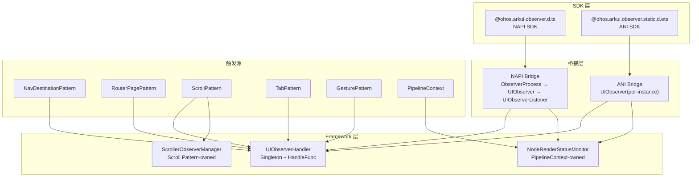
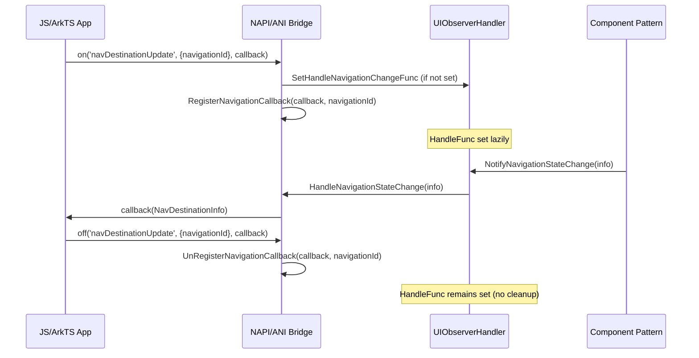

# 架构设计

> 无感监听（observer）功能域的架构设计文档，补录已有实现。

## 设计元数据

| 字段 | 内容 |
|------|------|
| Design ID | DESIGN-Func-04-11-02 |
| 关联需求 | 已有能力补录（无独立 requirement.md） |
| 关联 Epic | 无 |
| 目标 Feature | Feat-01 无感监听核心架构, Feat-02 无感监听接口全覆盖 |
| 复杂度 | 复杂 |
| 目标版本 | API 11 起支持，API 12/15/17/19/20/22/23 有接口扩展 |
| Owner | ArkUI SIG |
| 状态 | Baselined（已有实现补录） |

## 需求基线

| 项 | 内容 |
|----|------|
| 问题陈述 | 开发者需要通过 `@ohos.arkui.observer` 无感监听 UI 生命周期和状态变化事件（Navigation/Router/Scroll/Tab/Gesture/NodeRender 等），无需显式在组件声明中绑定回调 |
| 核心目标 | （Feat-01）提供 UIObserverHandler 单例 + HandleFunc 惰性注册 + NAPI/ANI 双桥接路径的核心架构，支持 scoped on/off 监听注册和 Notify 通知分发；（Feat-02）覆盖所有 23+ on() API 的完整接口规格，包括 NavDestinationState 10 值扩展、RouterPageState、ScrollEventType、TabContentState、GestureListenerType 等枚举行为定义 |
| P0 AC | （Feat-01）UIObserverHandler 单例正确注册和分发 HandleFunc；NAPI/ANI 双路径均可独立注册和回调；off/once/unsubscribe 正确清理监听器；（Feat-02）每个 on() 类型在对应 context scope 下正确触发和回调；NavDestinationState 全 10 值行为正确；异常注册（重复 on、无效 scope）返回 401 错误码 |

## 上下文和现状

### 涉及仓和模块

| 仓库 | 模块/路径 | 当前职责 | 本 Feature 影响 |
|------|-----------|----------|-----------------|
| ace_engine | `frameworks/core/components_ng/base/observer_handler.h/.cpp` | UIObserverHandler 单例，存储 HandleFunc 函数指针，Notify 分发 | 核心架构 |
| ace_engine | `interfaces/napi/kits/observer/js_ui_observer.cpp/.h` | ObserverProcess 单例，NAPI on/off/once 参数解析与分发 | NAPI 桥接层 |
| ace_engine | `interfaces/napi/kits/observer/ui_observer.cpp/.h` | UIObserver 静态类，NAPI 路径监听器存储和 Handle 回调 | NAPI 桥接层 |
| ace_engine | `interfaces/napi/kits/observer/ui_observer_listener.cpp/.h` | UIObserverListener，封装 napi_ref，构建回调参数并调用 JS callback | NAPI 桥接层 |
| ace_engine | `interfaces/napi/kits/observer/gesture/gesture_observer.cpp/.h` | GestureObserver，NAPI 手势监听注册 | NAPI 手势桥接 |
| ace_engine | `interfaces/ets/ani/observer/src/observer.cpp` | UiObserver 实例（per UIContext），ANI 路径注册/Handle/分发 | ANI 桥接层 |
| ace_engine | `interfaces/ets/ani/observer/ets/@ohos.arkui.observer.ets` | ArkTS 侧 UIObserver 类定义，native 方法声明 | ANI ArkTS 层 |
| ace_engine | `frameworks/core/components_ng/base/node_render_status_monitor.h/.cpp` | NodeRenderStatusMonitor，逐节点渲染状态监听，最多 64 节点 | Node 级监听 |
| ace_engine | `frameworks/core/components_ng/pattern/scrollable/scroller_observer_manager.h/.cpp` | ScrollerObserverManager，Scroll 组件内部事件分发 | 组件级监听 |
| ace_engine | `frameworks/core/components_ng/pattern/navigation/nav_destination_pattern.cpp` | NavDestination 状态变更 Notify 触发源 | 通知触发源 |
| ace_engine | `frameworks/core/components_ng/pattern/nav_router/nav_router_pattern.cpp` | Navigation 切换 Notify 触发源 | 通知触发源 |
| ace_engine | `frameworks/core/pipeline_ng/pipeline_context.h/.cpp` | PipelineContext，持有 NodeRenderStatusMonitor，驱动 layout/draw Notify | 管线层 |
| sdk-js | `interface/sdk-js/api/@ohos.arkui.observer.d.ts` | NAPI 路径 SDK 接口声明（1349 行） | SDK 类型定义 |
| sdk-js | `interface/sdk-js/api/@ohos.arkui.observer.static.d.ets` | ANI 路径 SDK 接口声明（1096 行） | SDK 类型定义 |

### 调用链层级分析

| 层 | 模块 | 职责 | 修改类型 |
|----|------|------|----------|
| SDK d.ts | `@ohos.arkui.observer.d.ts` / `.static.d.ets` | 定义 uiObserver namespace 的 on/off 函数签名、枚举、接口类型 | 存量分析 |
| NAPI 桥接 | `interfaces/napi/kits/observer/js_ui_observer` | ObserverProcess 单例，解析 on(type, options, callback) 参数，按 type 字符串分发到 Process*Register 方法；HandleFunc 惰性注册（布尔标志） | 存量分析 |
| NAPI 监听存储 | `interfaces/napi/kits/observer/ui_observer` | UIObserver 静态类，维护所有监听器存储 map（static members），Register/UnRegister/Handle 静态方法 | 存量分析 |
| NAPI 回调构建 | `interfaces/napi/kits/observer/ui_observer_listener` | UIObserverListener，封装 napi_ref，On* 方法构建 napi_value 参数对象并调用 JS callback | 存量分析 |
| ANI ArkTS 层 | `interfaces/ets/ani/observer/ets/@ohos.arkui.observer.ets` | ArkTS UIObserver 类，native on/off 方法声明，nativeObserverAddr 字段持有 C++ 实例指针 | 存量分析 |
| ANI 桥接 | `interfaces/ets/ani/observer/src/observer.cpp` | UiObserver 实例（per UIContext），Register* / UnRegister* / Handle* 方法使用 ani_ref / ani_fn_object；HandleFunc 惰性注册使用 std::call_once | 存量分析 |
| Framework 单例 | `frameworks/core/components_ng/base/observer_handler` | UIObserverHandler 单例，存储 HandleFunc 函数指针（NAPI 用 func_ / ANI 用 funcForAni_ 双指针），Notify* 方法检查双指针并回调到桥接层 Handle 方法 | 存量分析 |
| Node 级监听 | `frameworks/core/components_ng/base/node_render_status_monitor` | NodeRenderStatusMonitor，逐 FrameNode 注册（最多 64），WalkThroughAncestorForStateListener 遍历祖先链确定 ABOUT_TO_RENDER_IN/OUT 状态 | 存量分析 |
| 组件级管理 | `frameworks/core/components_ng/pattern/scrollable/scroller_observer_manager` | ScrollerObserverManager，Scroll 组件内部 touch/reach/scroll-start/stop/did-scroll/area-change 事件分发 | 存量分析 |
| 通知触发源 | Navigation/Router/Scroll/Tab/Gesture Pattern 等 | 各组件 Pattern 在状态变更时调用 UIObserverHandler::Notify* 方法触发通知分发 | 存量分析 |
| 管线层 | `frameworks/core/pipeline_ng/pipeline_context` | PipelineContext 持有 NodeRenderStatusMonitor（懒创建），在 post-layout/draw 阶段驱动 WalkThroughAncestorForStateListener | 存量分析 |

检查项：
- [x] 调用链每一层都已覆盖（SDK → NAPI/ANI → Framework 单例 → Node/组件级 → 触发源 → 管线）
- [x] 每层职责边界清晰，无跨层违规调用
- [x] 每层修改类型明确（全部存量分析）

### 适用架构规则

| Rule ID | 适用原因 | 设计结论 | 验证方式 |
|---------|----------|----------|----------|
| OH-ARCH-LAYERING | Observer 涉及 SDK → Bridge → Framework → 触发源单向调用 | SDK(d.ts) → Bridge(NAPI/ANI) → Framework(UIObserverHandler) → Pattern Notify，严格单向；Notify 反向回调通过 HandleFunc 指针 | 代码评审/依赖检查 |
| OH-ARCH-API-LEVEL | 所有 on/off 均为 Public API，API 11 起开放，12/15/17/20/22/23 扩展 | @since 标注每个枚举值和接口扩展版本，新值不破坏旧签名 | API 评审/XTS |
| OH-ARCH-COMPONENT-BUILD | observer 模块属于 ace_engine，NAPI 模块名为 arkui.observer | 无需新增 BUILD.gn target，已有 napi_module_register | 构建验证 |
| OH-ARCH-ERROR-LOG | on/off 参数校验错误返回 401 错误码 | 所有参数校验在 Bridge 层完成，401 错误码通过 napi_throw / ani_env.Throw 抛出 | 单测/XTS |

## 不涉及项承接

| 维度 | 设计结论 |
|------|----------|
| 跨进程 IPC | 不涉及 — Observer 全部在 UI 线程内进程内回调 |
| 数据持久化 | 不涉及 — 监听器存储在进程内存中，不持久化 |
| 硬件抽象 | 不涉及 — 纯软件事件分发 |
| 安全权限 | 不涉及 — Observer API 无权限要求（ohos.permission 无需） |

## 关键设计决策

| 决策 ID | 问题 | 推荐方案 | 探索过的替代方案 | 取舍理由 | 影响 |
|---------|------|----------|------------------|----------|------|
| ADR-1 | HandleFunc 注册时机：启动时全部注册 vs 首次 on() 惰性注册 | 惰性注册（lazy HandleFunc）：首次 on(type) 时设置对应 HandleFunc 指针，布尔标志防重复 | A: 启动时注册全部 HandleFunc；B: 每次 on() 都重新注册 | A 会导致启动开销，observer 可能有 20+ 类型但只用到 3-5 个；B 无必要开销且可能并发问题；惰性注册零启动开销且安全 | Feat-01 AC-1.1~1.3 |
| ADR-2 | 桥接路径：NAPI-only vs NAPI + ANI 双路径 | NAPI + ANI 双路径，UIObserverHandler 维护 func_（NAPI 原函数指针）和 funcForAni_（std::function）双指针 | A: 仅 NAPI 路径；B: 仅 ANI 路径；C: 双路径 | OpenHarmony 同时支持 JS(NAPI) 和 ArkTS-static(ANI) 运行时；双路径确保两种运行时均可独立使用 observer；双指针设计避免互相干扰 | Feat-01 AC-1.4~1.6 |
| ADR-3 | Context scope 粒度：全局唯一 vs 多级 scoped | 多级 scoped：支持 global/UIAbilityContext/UIContext/{id}/{navigationId}/{navigationUniqueId} 五级，各 on() 类型按需支持 | A: 全局唯一监听器；B: 仅 UIContext scoped；C: 多级 scoped | 不同事件需要不同粒度：NavDestination 需指定 Navigation 容器，Scroll 需指定 Scroll 组件 ID，RouterPage 需指定 UIAbilityContext；全局监听器会收到无关事件 | Feat-02 全部 AC |
| ADR-4 | NodeRenderState 监听架构：走 UIObserverHandler vs 独立 NodeRenderStatusMonitor | 独立 NodeRenderStatusMonitor（挂载于 PipelineContext），不走 UIObserverHandler Notify 路径 | A: 走 UIObserverHandler Notify 路径；B: 独立 NodeRenderStatusMonitor | NodeRenderState 需逐节点遍历祖先链判断可见性（性能敏感），不属于全局广播型事件；独立 monitor 限制最多 64 节点且懒创建，避免性能影响 | Feat-01 AC-1.7 |
| ADR-5 | ScrollEvent 双路径：UIObserver scrollEvent vs ScrollerObserverManager | 双路径共存：UIObserver scrollEvent (全局/ID scoped) + ScrollerObserverManager (组件内部回调)；两者事件类型不同 | A: 仅 UIObserver scrollEvent；B: 仅 ScrollerObserverManager；C: 双路径共存 | ScrollerObserverManager 处理的是组件内部交互事件（touch/reach/start/stop/area-change）；UIObserver scrollEvent 处理的是状态变化事件（SCROLL_START/SCROLL_STOP）；职责不同 | Feat-02 AC-3 |
| ADR-6 | NavDestinationState 扩展方式：追加枚举值 vs 新枚举类型 | 追加枚举值到 NavDestinationState：API 11 → ON_SHOWN=0/ON_HIDDEN=1(2 值)，API 12 → +6 值(ON_APPEAR=2/ON_DISAPPEAR=3/ON_WILL_SHOW=4/ON_WILL_HIDE=5/ON_WILL_APPEAR=6/ON_WILL_DISAPPEAR=7 + ON_BACKPRESS=100)，API 17 → +2 值(ON_ACTIVE=8/ON_INACTIVE=9) | A: 新枚举类型（如 NavDestinationStateV2）；B: 追加枚举值 | 追加枚举值保持向后兼容（旧代码 ON_SHOWN=0/ON_HIDDEN=1 仍有效）；新枚举类型会导致迁移成本；ON_BACKPRESS=100 跳号设计避免与未来值冲突 | Feat-02 AC-2 |

## 设计骨架

### 骨架范围

| 骨架项 | 目标 | 不包含 | 验证方式 |
|--------|------|--------|----------|
| UIObserverHandler 单例 | 定义 HandleFunc 惰性注册和 Notify 分发机制 | 各 on() 类型具体参数解析 | 代码评审 |
| NAPI/ANI 双桥接 | 定义双路径注册、回调、监听器存储 | 手势监听 ANI 细节 | 代码评审 |
| Context scope 分级 | 定义 5 级 scope 和各 on() 类型 scope 支持 | 非 observer 相关的 scope | XTS |
| NodeRenderStatusMonitor | 定义逐节点监听、64 限制、祖先链遍历 | 非渲染状态相关的节点监听 | 单测 |
| on/off/once/unsubscribe 生命周期 | 定义注册、去注册、一次性、返回取消函数四种模式 | 组件声明式回调（如 .onAppear） | XTS |

### 骨架 Spec 拆分

| Task ID | 目标 | 受影响文件 | AC |
|---------|------|------------|----|
| TASK-SKELETON-1 | Feat-01 核心架构规格 | observer_handler.h/.cpp, js_ui_observer.cpp, ui_observer.cpp, observer.cpp, node_render_status_monitor | AC-1.1~1.10 |
| TASK-SKELETON-2 | Feat-02 全接口覆盖规格 | @ohos.arkui.observer.d.ts, .static.d.ets, all Process*Register, all Handle* methods | AC-2.1~10 |

## 后续 Task 拆分

| Task ID | 目标 | 受影响文件 | 依赖 |
|---------|------|------------|------|
| TASK-1 | Feat-01 核心架构规格编写 | design.md, Feat-01 spec | 无 |
| TASK-2 | Feat-02 全接口覆盖规格编写 | Feat-02 spec | TASK-1 |

## API 签名、Kit 与权限

### 新增 API

#### A. NAPI namespace 路径 (`uiObserver.on(...)` in observer.d.ts)

| API 签名 | 类型 | Kit | d.ts 位置 | 权限要求 | SysCap |
|----------|------|-----|-----------|----------|--------|
| `uiObserver.on(type: 'navDestinationUpdate', callback: Callback<NavDestinationInfo>)` | Public | ArkUI | `api/@ohos.arkui.observer.d.ts` | 无 | SystemCapability.ArkUI.ArkUI.Full |
| `uiObserver.on(type: 'navDestinationUpdate', options: {navigationId: ResourceStr}, callback)` | Public | ArkUI | `api/@ohos.arkui.observer.d.ts` | 无 | SystemCapability.ArkUI.ArkUI.Full |
| `uiObserver.on(type: 'scrollEvent', callback: Callback<ScrollEventInfo>)` | Public | ArkUI | `api/@ohos.arkui.observer.d.ts` @since 12 | 无 | SystemCapability.ArkUI.ArkUI.Full |
| `uiObserver.on(type: 'scrollEvent', options: ObserverOptions, callback)` | Public | ArkUI | `api/@ohos.arkui.observer.d.ts` @since 12 | 无 | SystemCapability.ArkUI.ArkUI.Full |
| `uiObserver.on(type: 'routerPageUpdate', context: UIAbilityContext\|UIContext, callback)` | Public | ArkUI | `api/@ohos.arkui.observer.d.ts` | 无 | SystemCapability.ArkUI.ArkUI.Full |
| `uiObserver.on(type: 'densityUpdate', context: UIContext, callback: Callback<DensityInfo>)` | Public | ArkUI | `api/@ohos.arkui.observer.d.ts` @since 12 | 无 | SystemCapability.ArkUI.ArkUI.Full |
| `uiObserver.on(type: 'willDraw', context: UIContext, callback: Callback<void>)` | Public | ArkUI | `api/@ohos.arkui.observer.d.ts` @since 12 | 无 | SystemCapability.ArkUI.ArkUI.Full |
| `uiObserver.on(type: 'didLayout', context: UIContext, callback: Callback<void>)` | Public | ArkUI | `api/@ohos.arkui.observer.d.ts` @since 12 | 无 | SystemCapability.ArkUI.ArkUI.Full |
| `uiObserver.on(type: 'tabContentUpdate', callback)` | Public | ArkUI | `api/@ohos.arkui.observer.d.ts` @since 12 | 无 | SystemCapability.ArkUI.ArkUI.Full |
| `uiObserver.on(type: 'tabContentUpdate', options: ObserverOptions, callback)` | Public | ArkUI | `api/@ohos.arkui.observer.d.ts` @since 12 | 无 | SystemCapability.ArkUI.ArkUI.Full |
| `uiObserver.on(type: 'navDestinationSwitch', context: UIAbilityContext\|UIContext, callback)` | Public | ArkUI | `api/@ohos.arkui.observer.d.ts` @since 12 | 无 | SystemCapability.ArkUI.ArkUI.Full |
| `uiObserver.on(type: 'navDestinationSwitch', context: UIAbilityContext\|UIContext, observerOptions: NavDestinationSwitchObserverOptions, callback)` | Public | ArkUI | `api/@ohos.arkui.observer.d.ts` @since 12 | 无 | SystemCapability.ArkUI.ArkUI.Full |

#### B. UIObserver 实例方法 on(type) 路径 (`UIObserver.on(...)` in UIContext.d.ts)

| API 签名 | 类型 | Kit | d.ts 位置 | 权限要求 | SysCap |
|----------|------|-----|-----------|----------|--------|
| `UIObserver.on(type: 'navDestinationUpdateByUniqueId', navigationUniqueId: number, callback)` | Public | ArkUI | `api/@ohos.arkui.UIContext.d.ts` @since 20 | 无 | SystemCapability.ArkUI.ArkUI.Full |
| `UIObserver.on(type: 'willClick', callback)` | Public | ArkUI | `api/@ohos.arkui.UIContext.d.ts` @since 12 | 无 | SystemCapability.ArkUI.ArkUI.Full |
| `UIObserver.on(type: 'didClick', callback)` | Public | ArkUI | `api/@ohos.arkui.UIContext.d.ts` @since 12 | 无 | SystemCapability.ArkUI.ArkUI.Full |
| `UIObserver.on(type: 'tabChange', callback: Callback<TabContentInfo>)` | Public | ArkUI | `api/@ohos.arkui.UIContext.d.ts` @since 22 | 无 | SystemCapability.ArkUI.ArkUI.Full |
| `UIObserver.on(type: 'tabChange', config: ObserverOptions, callback: Callback<TabContentInfo>)` | Public | ArkUI | `api/@ohos.arkui.UIContext.d.ts` @since 22 | 无 | SystemCapability.ArkUI.ArkUI.Full |
| `UIObserver.on(type: 'beforePanStart', callback: PanListenerCallback)` | Public | ArkUI | `api/@ohos.arkui.UIContext.d.ts` @since 19 | 无 | SystemCapability.ArkUI.ArkUI.Full |
| `UIObserver.on(type: 'beforePanEnd', callback: PanListenerCallback)` | Public | ArkUI | `api/@ohos.arkui.UIContext.d.ts` @since 19 | 无 | SystemCapability.ArkUI.ArkUI.Full |
| `UIObserver.on(type: 'afterPanStart', callback: PanListenerCallback)` | Public | ArkUI | `api/@ohos.arkui.UIContext.d.ts` @since 19 | 无 | SystemCapability.ArkUI.ArkUI.Full |
| `UIObserver.on(type: 'afterPanEnd', callback: PanListenerCallback)` | Public | ArkUI | `api/@ohos.arkui.UIContext.d.ts` @since 19 | 无 | SystemCapability.ArkUI.ArkUI.Full |
| `UIObserver.on(type: 'nodeRenderState', nodeIdentity: NodeIdentity, callback: NodeRenderStateChangeCallback)` | Public | ArkUI | `api/@ohos.arkui.UIContext.d.ts` @since 20 | 无 | SystemCapability.ArkUI.ArkUI.Full |
| `UIObserver.on(type: 'textChange', callback: Callback<TextChangeEventInfo>)` | Public | ArkUI | `api/@ohos.arkui.UIContext.d.ts` @since 22 | 无 | SystemCapability.ArkUI.ArkUI.Full |
| `UIObserver.on(type: 'textChange', identity: ObserverOptions, callback: Callback<TextChangeEventInfo>)` | Public | ArkUI | `api/@ohos.arkui.UIContext.d.ts` @since 22 | 无 | SystemCapability.ArkUI.ArkUI.Full |
| `UIObserver.on(type: 'windowSizeLayoutBreakpointChange', callback: Callback<WindowSizeLayoutBreakpointInfo>)` | Public | ArkUI | `api/@ohos.arkui.UIContext.d.ts` @since 22 | 无 | SystemCapability.ArkUI.ArkUI.Full |

#### C. UIObserver 命名方法路径 (`UIObserver.onXxx(...)` in UIContext.d.ts)

| API 签名 | 类型 | Kit | d.ts 位置 | 权限要求 | SysCap |
|----------|------|-----|-----------|----------|--------|
| `UIObserver.onSwiperContentUpdate(callback: Callback<SwiperContentInfo>)` | Public | ArkUI | `api/@ohos.arkui.UIContext.d.ts` @since 22 | 无 | SystemCapability.ArkUI.ArkUI.Full |
| `UIObserver.onSwiperContentUpdate(config: ObserverOptions, callback: Callback<SwiperContentInfo>)` | Public | ArkUI | `api/@ohos.arkui.UIContext.d.ts` @since 22 | 无 | SystemCapability.ArkUI.ArkUI.Full |
| `UIObserver.onRouterPageSizeChange(callback: Callback<RouterPageInfo>)` | Public | ArkUI | `api/@ohos.arkui.UIContext.d.ts` @since 23 | 无 | SystemCapability.ArkUI.ArkUI.Full |
| `UIObserver.onNavDestinationSizeChange(callback: Callback<NavDestinationInfo>)` | Public | ArkUI | `api/@ohos.arkui.UIContext.d.ts` @since 23 | 无 | SystemCapability.ArkUI.ArkUI.Full |
| `UIObserver.onNavDestinationSizeChangeByUniqueId(navigationUniqueId: number, callback: Callback<NavDestinationInfo>)` | Public | ArkUI | `api/@ohos.arkui.UIContext.d.ts` @since 23 | 无 | SystemCapability.ArkUI.ArkUI.Full |

#### D. 枚举与全局手势监听 (in UIContext.d.ts)

| API 签名 | 类型 | Kit | d.ts 位置 | 权限要求 | SysCap |
|----------|------|-----|-----------|----------|--------|
| `GestureListenerType` enum (TAP=0, LONG_TAP=1, DOUBLE_TAP=2, PINCH=3, FLICK=4, ROTATION=5) | Public | ArkUI | `api/@ohos.arkui.UIContext.d.ts` @since 20 | 无 | SystemCapability.ArkUI.ArkUI.Full |
| `UIObserver.addGlobalGestureListener(type: GestureListenerType, option: GestureObserverConfigs, callback: GestureListenerCallback)` | Public | ArkUI | `api/@ohos.arkui.UIContext.d.ts` @since 20 | 无 | SystemCapability.ArkUI.ArkUI.Full |
| `UIObserver.removeGlobalGestureListener(type: GestureListenerType, callback?: GestureListenerCallback)` | Public | ArkUI | `api/@ohos.arkui.UIContext.d.ts` @since 20 | 无 | SystemCapability.ArkUI.ArkUI.Full |

### 变更/废弃 API

| 原有 API | 变更类型 | 新 API | 迁移说明 |
|----------|----------|--------|----------|
| NavDestinationState (API 11: ON_SHOWN=0, ON_HIDDEN=1) | 变更（扩展枚举值） | NavDestinationState (API 12: +ON_APPEAR=2/ON_DISAPPEAR=3/ON_WILL_SHOW=4/ON_WILL_HIDE=5/ON_WILL_APPEAR=6/ON_WILL_DISAPPEAR=7, ON_BACKPRESS=100; API 17: +ON_ACTIVE=8/ON_INACTIVE=9) | 旧值不变，新增值向后兼容 |

## 构建系统影响

### BUILD.gn 变更

```
文件: interfaces/napi/kits/observer/BUILD.gn
变更说明: 已有 napi_module_register(arkui.observer)，无新增 target
```

```
文件: interfaces/ets/ani/observer/BUILD.gn
变更说明: 已有 ANI observer target，无新增 target
```

### bundle.json 变更

无新增 component 或修改依赖关系。Observer 模块属于 ace_engine 已有部件。

## 可选设计扩展

### 架构图



### 数据流/控制流

| 步骤 | 调用方 | 被调用方 | 数据/接口 | 说明 |
|------|--------|----------|-----------|------|
| 1 | JS/ArkTS | ObserverProcess::ProcessRegister / UiObserver::Register* | type, options, callback | on(type, options, callback) 注册 |
| 2 | ObserverProcess / UiObserver | UIObserverHandler::Set*HandleFunc | HandleFunc 指针 | 首次注册时惰性设置 HandleFunc |
| 3 | ObserverProcess / UiObserver | UIObserver::Register*Callback | listener, context/id | 将 UIObserverListener 存入 scoped map |
| 4 | Component Pattern | UIObserverHandler::Notify* | event info struct | 状态变更时 Notify |
| 5 | UIObserverHandler | UIObserver::Handle* / UiObserver::Handle* | event info struct | 检查双指针，回调到桥接层 |
| 6 | UIObserver / UiObserver | UIObserverListener::On* / ani_fn_object Call | napi_value / ani_ref | 构建参数对象并回调 JS/ArkTS |
| 7 | JS/ArkTS | ObserverProcess::ProcessUnRegister / UiObserver::UnRegister* | type, options, callback? | off(type, options?, callback?) 去注册 |
| 8 | ObserverProcess / UiObserver | UIObserver::UnRegister*Callback | listener, context/id | 从 scoped map 移除 listener |
| 9 | PipelineContext | NodeRenderStatusMonitor::WalkThroughAncestorForStateListener | FrameNode* | 逐节点遍历祖先链 |
| 10 | NodeRenderStatusMonitor | NodeRenderStatusHandleFunc | node, state | 回调到桥接层 |

### 时序设计



### 线程与并发模型

| 操作 | 发起线程 | 回调线程 | 跨进程边界 | 线程安全 | 重入约束 |
|------|----------|----------|------------|----------|----------|
| on/off 注册 | JS 主线程 (TaskThread) | — | 无 | UIObserver 静态 map 需同 instanceId 内操作 | 同 type+scope 重复 on 替换旧 listener |
| Notify 触发 | UI 主线程 (TaskThread) | JS 主线程 (TaskThread) | 无 | 同线程无竞争 | Notify 中不可调用 off（可能迭代中删除） |
| NodeRenderStatus Walk | UI 主线程 | JS 主线程 | 无 | PipelineContext 懒创建 monitor | 同线程 |

并发场景：

| 场景 | 线程模型 | 安全措施 |
|------|----------|----------|
| 多 UIContext 实例注册 | 每个 UIContext 有独立 instanceId | 监听器 map 按 instanceId 分区 |
| 同 type 多次 on | 同 JS 主线程 | 新 listener 替换旧 listener（同一 scope） |
| on/off 与 Notify 同时发生 | 同 TaskThread | JS 单线程模型保证顺序 |

### 接口参数规约

| 接口 | 参数 | 类型 | 合法范围 | 非法处理 | 边界说明 |
|------|------|------|----------|----------|----------|
| on(type, callback) | type | string | 法定 type 字符串（见新增 API 表） | 401 ParameterError | type 不匹配返回 401 |
| on(type, options, callback) | options.navigationId | ResourceStr | 非 null/undefined | 401 ParameterError | 空字符串不报错但无匹配 |
| UIObserver.on(type: 'navDestinationUpdateByUniqueId', navigationUniqueId, callback) | navigationUniqueId | number | 正整数 | 401 ParameterError | 0/负数返回 401 |
| on(type, context, callback) | context | UIAbilityContext \| UIContext | 非 null/undefined | 401 ParameterError | 类型不匹配返回 401 |
| on(type, options, callback) | options.id | string | 非 null/undefined | 401 ParameterError | 空字符串不报错但无匹配 |
| UIObserver.on(type: 'nodeRenderState', nodeIdentity, callback) | nodeIdentity | NodeIdentity (string \| number) | number 正整数或 string inspectorId | 401 ParameterError | 无匹配节点时不回调 |
| on(type, callback) | callback | Callback\<T\> \| (info: T) => void | 非 null/undefined | 401 ParameterError | callback 为 null/undefined 返回 401 |
| off(type, callback?) | callback | 同 on | 可选，不传则移除该 scope 全部监听器 | 不匹配 callback 不报错，静默无操作 | — |
| UIObserver.onXxx(callback / config, callback) | callback / config | 同 on / ObserverOptions | 同 on | 401 ParameterError | 命名方法无 type 参数 |
| UIObserver.onNavDestinationSizeChangeByUniqueId(navigationUniqueId, callback) | navigationUniqueId | number | 正整数 | 401 ParameterError | 0/负数返回 401 |
| UIObserver.addGlobalGestureListener(type, option, callback) | type / option | GestureListenerType / GestureObserverConfigs | TAP=0~ROTATION=5 | 401 ParameterError | — |

## 详细设计

### UIObserverHandler 单例与 HandleFunc 惰性注册

UIObserverHandler 使用 Meyer's singleton 模式（`static UIObserverHandler instance`，observer_handler.cpp:156-159）。每个 HandleFunc 类型维护两个指针：

1. `*HandleFunc_`（NAPI 路径）：原始函数指针类型如 `void (*)(const NavDestinationInfo&)`，由 `ObserverProcess` 首次注册时通过布尔标志 `isXxxHandleFuncSetted_` 防重复设置
2. `*HandleFuncForAni_`（ANI 路径）：`std::function` 类型，由 `UiObserver` 首次注册时通过 `std::call_once` 防重复设置

`Notify*` 方法检查双指针：

```cpp
// observer_handler.cpp NotifyNavigationStateChange 示例
void UIObserverHandler::NotifyNavigationStateChange(const NavDestinationInfo& info)
{
    if (handleNavigationChangeFunc_) {
        (*handleNavigationChangeFunc_)(info);  // NAPI path
    }
    if (handleNavigationChangeFuncForAni_) {
        handleNavigationChangeFuncForAni_(info);  // ANI path
    }
}
```

HandleFunc 指针一旦设置不再清理（off 不清除 HandleFunc，仅移除 listener from map）。这是设计选择而非遗漏——减少 HandleFunc 的设置/清理开销，且下次 on() 无需重新设置。

### Context Scope 与监听器存储

NAPI 路径监听器存储在 `UIObserver` 静态类中，使用 `std::unordered_map<std::string, std::list<UIObserverListener>>` 按 scope key 分区：

- **global scope**: key = `"0"` (default instanceId)
- **UIAbilityContext scope**: key = `abilityInfo.name` 字符串
- **UIContext scope**: key = `"instanceId_"` 字符串 (如 `"1"`, `"2"`)
- **{id} scope**: key = `id` 字符串 (如 `"myScroll"`)
- **{navigationId} scope**: key = `navigationId` 字符串
- **{navigationUniqueId} scope**: key = `uniqueId` 数字的字符串形式

ANI 路径使用 `UiObserver` 实例成员 map（per UIContext instanceId），因此天然按 instanceId 分区。

### NodeRenderStatusMonitor 独立架构

NodeRenderStatusMonitor 不走 UIObserverHandler Notify 路径，而是直接挂载于 PipelineContext（pipeline_context.h:1657 `RefPtr<NodeRenderStatusMonitor> nodeRenderStatusMonitor_`）。懒创建于首次 `nodeRenderState` on() 注册时（pipeline_context.cpp:8160-8163）。

注册限制最多 64 节点（`MAX_NODE_RENDER_STATE_LISTENERS`，node_render_status_monitor.cpp:27）。状态判定通过 `WalkThroughAncestorForStateListener` 遍历祖先链，检查每个祖先的 `IsVisible()`, `IsActive()`, `IsOnMainTree()` 三项条件（node_render_status_monitor.cpp:175-213）：

- 全部祖先满足三项 → `ABOUT_TO_RENDER_IN`
- 任一祖先不满足 → `ABOUT_TO_RENDER_OUT`

### NavDestinationState 枚举扩展

| 值 | 名称 | @since | 含义 |
|----|------|--------|------|
| 0 | ON_SHOWN | 11 | NavDestination 已显示 |
| 1 | ON_HIDDEN | 11 | NavDestination 已隐藏 |
| 2 | ON_APPEAR | 12 | NavDestination 已出现（挂载到组件树） |
| 3 | ON_DISAPPEAR | 12 | NavDestination 已消失（从组件树卸载） |
| 4 | ON_WILL_SHOW | 12 | NavDestination 即将显示 |
| 5 | ON_WILL_HIDE | 12 | NavDestination 即将隐藏 |
| 6 | ON_WILL_APPEAR | 12 | NavDestination 即将出现（即将挂载到组件树） |
| 7 | ON_WILL_DISAPPEAR | 12 | NavDestination 即将消失（即将从组件树卸载） |
| 100 | ON_BACKPRESS | 12 | 用户按下返回键 |
| 8 | ON_ACTIVE | 17 | NavDestination 已激活 |
| 9 | ON_INACTIVE | 17 | NavDestination 已失活 |

ON_BACKPRESS=100 跳号设计避免与未来值冲突（值 10-99 预留给未来扩展）。API 11 仅支持 ON_SHOWN(0)/ON_HIDDEN(1)。

## 风险和开放问题

| 项 | 类型 | 影响 | 处理方式 | Owner |
|----|------|------|----------|-------|
| HandleFunc 指针永不清理 | 架构 | 低 — 少量函数指针常驻内存 | 视为设计选择（惰性注册+永不清理）；off 仅移除 listener | ArkUI SIG |
| NAPI 监听器存储使用 static map | 架构 | 中 — 多 instanceId 场景下 map 增长 | 按 instanceId 分区 key 管理；ANI 路径天然 per-instance | ArkUI SIG |
| NodeRenderStatusMonitor 64 节点上限 | API | 中 — 大量节点监听场景可能溢出 | 注册超限静默失败不报错（⚠️ 风险说明：开发者无感知超限） | ArkUI SIG |
| NavDestinationState ON_BACKPRESS=100 跳号 | API | 低 — 开发者可能困惑于值跳跃 | d.ts 注释已说明，规格文档标注 | ArkUI SIG |
| GestureObserver NAPI/ANI 路径不对称 | 架构 | 中 — ANI 手势监听使用独立 static map on UIObserverHandler | 规格文档标注差异；后续版本对齐 | ArkUI SIG |

## 设计审批

- [x] 需求基线已确认，设计覆盖 P0/P1 AC
- [x] 不涉及项已承接，N/A 和展开项都有结论
- [x] 涉及仓和模块职责清楚
- [x] 调用链层级分析完整，每层覆盖到位
- [x] 适用架构规则已识别并形成设计结论
- [x] 分层和子系统边界合规
- [x] API 变更有签名、权限、错误码和兼容性说明
- [x] BUILD.gn/bundle.json 影响明确
- [x] 设计输出和后续 Task 拆分明确
- [x] 关键设计决策有理由和影响说明
- [x] 风险和开放问题有 Owner

**结论:** 通过（已有实现补录）
