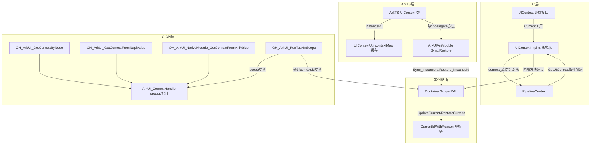

# 特性规格

## 概述

| 属性 | 值 |
|------|-----|
| 特性名称 | UIContext入口架构与实例路由 |
| 特性编号 | Func-04-12-01-Feat-01 |
| 优先级 | P1 |
| 目标版本 | API 10+ |
| 复杂度 | 标准 |
| 状态 | Baselined |

UIContext 是 ArkUI 框架的多实例上下文门面（Facade），为路由、弹窗、动画、拖拽等 UI 能力提供统一入口和实例路由基础。本 Feat 覆盖 UIContext 入口架构（纯虚接口 + UIContextImpl 委托门面）与实例路由机制（ContainerScope RAII、Sync/Restore、C-API scope），合并原 Feat-01（入口与委托架构）与原 Feat-02（构造器、实例身份查询、实例路由基础设施）中的"入口架构 + 实例路由"内容。不含 resolveUIContext/window-free API 及 getXxx 工厂方法（归属 Feat-02）。

**架构要点**：
- Kit 层：UIContext（纯虚接口）→ UIContextImpl（持有 PipelineContext* context_，全委托，不持业务状态）
- ArkTS 层：UIContext 类持有 instanceId_: int32 + 18 delegate 子对象
- C-API：ArkUI_ContextHandle（即 ArkUI_Context*，内部仅 { int32_t id }）轻量实例路由令牌
- 实例路由：Kit 层 ContainerScope RAII；ArkTS 层 Sync_InstanceId / Restore_InstanceId；C-API OH_ArkUI_RunTaskInScope



## 本次变更范围（Delta）

| 类型 | 内容 | 说明 |
|------|------|------|
| ADDED | UIContext 纯虚接口 + UIContextImpl 委托实现（Kit 层）、ArkTS UIContext 类、C-API ArkUI_Context 结构体 | 类定义与委托门面架构 |
| ADDED | UIContext::Current()、PipelineContext::GetUIContext()、OH_ArkUI_GetContextByNode()、GetContextFromNapiValue()、GetContextFromAniValue() | 工厂入口点 |
| ADDED | ContainerScope RAII、Sync_InstanceId/Restore_InstanceId、ArkUI_Context.id、OH_ArkUI_RunTaskInScope() | 实例路由机制 |
| ADDED | INSTANCE_ID_UNDEFINED/INSTANCE_ID_PLATFORM 常量、InstanceIdGenReason 枚举、ContainerType 枚举、Task/ArkUIObjectLifecycleCallback 类型别名 | 共享基础设施 |
| ADDED | UIContextImpl Reset() 安全降级机制 | 生命周期安全边界 |
| ADDED | UIContextHelper (JSI) uiContextMap_ 缓存与 getOrCreateUIContextById | ArkTS 动态前端缓存门面 |
| ADDED | JSScopeUtil (__JSScopeUtil__) SyncInstanceId/RestoreInstanceId/GetCallingScopeUIContext | ArkTS 动态前端实例路由桥 |
| ADDED | ContainerScope ENABLE_CONTAINER_SCOPE_TRACKING (PushCurrent/PopCurrent/Diagnose) | 实例路由诊断模式 |

## 输入文档

| 文档 | 版本/日期 | 说明 |
|------|-----------|------|
| `interfaces/inner_api/ace_kit/include/ui/view/ui_context.h` | 2025 | Kit 层 UIContext 纯虚接口定义 |
| `interfaces/inner_api/ace_kit/src/view/ui_context_impl.h` | 2025 | Kit 层 UIContextImpl 实现 |
| `interfaces/inner_api/ace_kit/src/view/ui_context_impl.cpp` | 2025 | UIContext::Current() 工厂 + 委托实现 |
| `frameworks/core/pipeline_ng/pipeline_context.h:1114,1649` | 当前 | PipelineContext::GetUIContext() 声明 + uiContextImpl_ 成员 |
| `frameworks/core/pipeline_ng/pipeline_context.cpp:7924-7931` | 当前 | GetUIContext() 惰性初始化实现 |
| `frameworks/core/common/container_scope.h:58-152` | 2021-2026 | ContainerScope RAII 定义 + InstanceIdGenReason 枚举 |
| `frameworks/core/common/container_scope.cpp:673-721` | 2021-2026 | ContainerScope 构造/析构 + UpdateCurrent/RestoreCurrent |
| `frameworks/core/common/container_scope.cpp:383-401` | 当前 | SafelyId 降级查询链实现 |
| `frameworks/core/common/container_scope.cpp:403-425` | 当前 | CurrentIdWithReason 解析链实现 |
| `frameworks/core/common/container_scope.cpp:507-620` | 当前 | ENABLE_CONTAINER_SCOPE_TRACKING PushCurrent/PopCurrent/Diagnose |
| `frameworks/core/common/container_consts.h:21-42` | 当前 | INSTANCE_ID_UNDEFINED / INSTANCE_ID_PLATFORM / ContainerType |
| `interfaces/inner_api/ace/node_module_inner.h:21-23` | 当前 | ArkUI_Context { int32_t id } 结构体完整定义 |
| `interfaces/native/native_type.h:187-194` | 当前 | ArkUI_Context / ArkUI_ContextHandle 定义 |
| `interfaces/native/native_node.h:13710-13717` | 当前 | OH_ArkUI_GetContextByNode() 声明 |
| `interfaces/native/native_node.h:13944-13957` | 当前 | OH_ArkUI_RunTaskInScope() 声明 |
| `interfaces/native/native_node_napi.h:49-58` | 当前 | OH_ArkUI_GetContextFromNapiValue() 声明 |
| `interfaces/native/native_node_ani.h:38-48` | 当前 | OH_ArkUI_NativeModule_GetContextFromAniValue() 声明 |
| `interfaces/native/node/node_adapter_impl.cpp:256-268` | 当前 | OH_ArkUI_GetContextByNode() 实现 |
| `interfaces/native/node/native_node_napi.cpp:174-208` | 当前 | OH_ArkUI_GetContextFromNapiValue() 实现 |
| `interfaces/native/node/native_node_ani.cpp:229-244` | 当前 | OH_ArkUI_NativeModule_GetContextFromAniValue() 实现 |
| `interfaces/native/node/node_utils.cpp:793-804` | 当前 | OH_ArkUI_RunTaskInScope() 实现 |
| `@ohos.arkui.UIContext.ts:735-799` | 当前 | ArkTS 静态前端 UIContext 类定义 + 构造函数 |
| `UIContextImpl.ets:102-125` | 当前 | ArkTS delegate 子对象 Sync/Restore 模式示例 |
| `UIContextUtil.ets:20-110` | 当前 | ArkTS UIContextUtil 工厂 + contextMap_ 管理 |
| `ui_context_helper.h/cpp` | 当前 | JSI 层 UIContextHelper 缓存门面 |
| `js_scope_util.h/cpp` | 当前 | JSScopeUtil __JSScopeUtil__ 桥接 |
| `container_scope.cpp:100-117` | 当前 | thread_local currentId_ / recentActiveId_ / isIsolatedThread_ 定义 |
| `test/unittest/interfaces/ace_kit/ui_context_impl_test.cpp` | 当前 | Kit 层 UIContextImpl 单元测试 |
| `test/unittest/frameworks/core/common/container_scope_test.cpp` | 当前 | ContainerScope 单元测试 |

## 用户故事

| US-ID | 用户故事 | 关联 AC |
|-------|----------|---------|
| US-1 | 组件开发者（C++ Kit 层）通过 UIContext::Current() 获取当前线程所属实例的 UIContext，以便调用 UI 能力（如 RunScopeUITask、GetFontScale），无活跃 PipelineContext 时安全返回 nullptr | AC-1.1, AC-1.2 |
| US-2 | 引擎内部开发者通过 PipelineContext::GetUIContext() 惰性创建 UIContextImpl 并缓存到 uiContextImpl_，后续直接返回缓存引用 | AC-2.1, AC-2.2 |
| US-3 | UI 能力模块开发者通过 UIContext 纯虚接口调用方法（如 RunScopeUITask、GetInstanceId），UIContextImpl 将所有调用委托给 context_（PipelineContext 原指针），无需直接接触 PipelineContext | AC-3.1, AC-3.2 |
| US-4 | 跨子系统调用者（NAPI/ANI/C-API）在非 UI 线程或跨实例场景调用 UI 能力时，必须先通过 ContainerScope RAII 或 OH_ArkUI_RunTaskInScope() 切换到目标 instanceId，调用完成后自动恢复原 ID | AC-4.1, AC-4.2, AC-4.3 |
| US-5 | ArkTS 应用开发者通过 UIContext.getCallingScopeUIContext() / getAllUIContexts() 等静态工厂获取 UIContext，或通过 UIContextUtil.getOrCreateUIContextById(instanceId) 按 ID 获取缓存对象 | AC-5.1, AC-5.2 |
| US-6 | NDK Native 模块开发者通过 OH_ArkUI_GetContextByNode(node) 从节点获取 ArkUI_ContextHandle，或通过 OH_ArkUI_GetContextFromNapiValue / OH_ArkUI_NativeModule_GetContextFromAniValue 从 ArkTS 值桥接获取 | AC-6.1, AC-6.2, AC-6.3 |
| US-7 | 引擎生命周期管理者在 PipelineContext 销毁前调用 UIContextImpl::Reset() 将 context_ 置 nullptr，所有方法通过 CHECK_NULL_VOID / CHECK_NULL_RETURN 安全降级 | AC-7.1, AC-7.2 |

## 验收追溯

| AC ID | 用户故事 | 验收条件 |
|-------|----------|----------|
| AC-1.1 | US-1 | WHEN 调用 UIContext::Current() 且当前线程有活跃 PipelineContext THEN 返回非空 RefPtr\<UIContext> 指向该 Pipeline 的 UIContextImpl |
| AC-1.2 | US-1 | WHEN 调用 UIContext::Current() 且当前线程无活跃 PipelineContext THEN 返回 nullptr |
| AC-2.1 | US-2 | WHEN 首次调用 PipelineContext::GetUIContext() THEN 创建 UIContextImpl(this) 并缓存到 uiContextImpl_ |
| AC-2.2 | US-2 | WHEN 再次调用 PipelineContext::GetUIContext() THEN 直接返回已缓存的 uiContextImpl_ 而不重新创建 |
| AC-3.1 | US-3 | WHEN 通过 UIContext 接口调用 RunScopeUITask THEN UIContextImpl 将任务委托给 context_->GetTaskExecutor() 并建立 ContainerScope(context_->GetInstanceId()) |
| AC-3.2 | US-3 | WHEN UIContextImpl 的 context_ 为 nullptr THEN RunScopeUITask 等 void 返回方法通过 CHECK_NULL_VOID 安全跳过，有返回值方法返回默认值 |
| AC-4.1 | US-4 | WHEN 在跨实例场景调用 UI 能力 THEN ContainerScope(id) 构造时 UpdateCurrent(id)，析构时 RestoreCurrent(restoreId_) |
| AC-4.2 | US-4 | WHEN 调用 OH_ArkUI_RunTaskInScope(uiContext, userData, callback) THEN callback 执行期间 instanceId 切换到 uiContext->id |
| AC-4.3 | US-4 | WHEN ArkTS delegate 方法调用 THEN _Common_Sync_InstanceId(instanceId_) 切换 currentId_，调用后 _Common_Restore_InstanceId() 恢复 |
| AC-5.1 | US-5 | WHEN 调用 UIContext.getCallingScopeUIContext() 且有活跃实例 THEN 返回对应 instanceId 的 UIContext 对象 |
| AC-5.2 | US-5 | WHEN 调用 UIContextUtil.getOrCreateUIContextById(id) 且 contextMap_ 中已存在 THEN 返回缓存的 UIContext 对象而不重新构造 |
| AC-6.1 | US-6 | WHEN 调用 OH_ArkUI_GetContextByNode(node) 且节点有效 THEN 返回 new ArkUI_Context({ .id = instanceId }) |
| AC-6.2 | US-6 | WHEN 调用 OH_ArkUI_GetContextFromNapiValue(env, value, &context) 且 value 含 instanceId_ THEN 创建 ArkUI_ContextHandle 并返回 ERROR_CODE_NO_ERROR |
| AC-6.3 | US-6 | WHEN 调用 OH_ArkUI_NativeModule_GetContextFromAniValue(env, value, &handle) 且 value 含 instanceId_ THEN 创建 ArkUI_ContextHandle 并返回 ERROR_CODE_NO_ERROR |
| AC-7.1 | US-7 | WHEN UIContextImpl::Reset() 已被调用 THEN context_ == nullptr，GetInstanceId() 返回 -1，GetColorMode() 返回 COLOR_MODE_UNDEFINED |
| AC-7.2 | US-7 | WHEN UIContextImpl 析构 THEN 调用 Reset() 确保 context_ 释放 |

## 规则定义

### R-1: UIContext 纯委托门面

**类型**: 行为

UIContextImpl 不持业务状态，所有方法委托 context_（PipelineContext 原指针）。UIContext 为纯虚接口，UIContextImpl 为唯一实现类。

来源验证：`interfaces/inner_api/ace_kit/src/view/ui_context_impl.h:86`（context_ = nullptr 私有成员），`ui_context_impl.cpp:58-306`（全部方法 CHECK_NULL + 委托实现）。

### R-2: context_ 可 nullptr 安全降级

**类型**: 边界

Reset() 或 PipelineContext 销毁后 context_ 为 nullptr，所有 void 返回方法通过 CHECK_NULL_VOID 跳过操作，有返回值方法通过 CHECK_NULL_RETURN 返回默认值（GetInstanceId → -1, GetColorMode → COLOR_MODE_UNDEFINED, GetFontScale → 1.0f, GetOverlayManager → nullptr）。

来源验证：`ui_context_impl.cpp:53-56`（Reset() 置 nullptr），`ui_context_impl.cpp:60-65`（RunScopeUITaskSync CHECK_NULL_VOID），`ui_context_impl.cpp:277-281`（GetInstanceId CHECK_NULL_RETURN -1）。

### R-3: UIContext::Current() 无活跃 Pipeline 返回 nullptr

**类型**: 边界

UIContext::Current() 内部调用 NG::PipelineContext::GetCurrentContextSafelyWithCheck()，若返回 nullptr 则 UIContext::Current() 返回 nullptr。

来源验证：`ui_context_impl.cpp:41-46`。

### R-4: GetUIContext() 惰性单次创建

**类型**: 行为

首次调用 PipelineContext::GetUIContext() 时 MakeRefPtr\<UIContextImpl>(this) 创建并缓存到 uiContextImpl_，后续调用直接返回缓存引用。

来源验证：`pipeline_context.cpp:7924-7931`，`pipeline_context.h:1649`（RefPtr\<Kit::UIContextImpl> uiContextImpl_ 成员）。

### R-5: ContainerScope RAII 构造切换 / 析构恢复

**类型**: 行为

ContainerScope(id) 构造时调用 UpdateCurrent(id) 切换 currentId_ 到 id，析构时调用 UpdateCurrent(restoreId_) 恢复原 id。restoreId_ 在构造时从 CurrentId() 快照。

来源验证：`container_scope.h:142`（restoreId_ = CurrentId()），`container_scope.cpp:673-676`（构造 UpdateCurrent），`container_scope.cpp:710-721`（析构 UpdateCurrent(restoreId_)）。

### R-6: ContainerScope(id, false) 不切换 currentId_

**类型**: 边界

ContainerScope(id, false) 构造时不执行 UpdateCurrent，析构时不恢复。仅当 enable=true 时才切换。

来源验证：`container_scope.cpp:678-691`（if enable 判断）。

### R-7: UIContextImpl 跨子系统查询方法内部建立 ContainerScope

**类型**: 行为

GetToken()、GetDisplayInfo()、GetWindowMode() 等跨子系统方法内部建立 ContainerScope(context_->GetInstanceId()) 确保实例路由正确。

来源验证：`ui_context_impl.cpp:190-206`（GetToken/GetDisplayInfo 内部 ContainerScope scope）。

### R-8: ArkTS Sync/Restore 模式

**类型**: 行为

每个 delegate 方法调用前执行 _Common_Sync_InstanceId(instanceId_) 切换 currentId_，调用后执行 _Common_Restore_InstanceId() 恢复。

来源验证：`UIContextImpl.ets:108-124`（FontImpl.registerFont Sync/Restore 配对），`@ohos.arkui.UIContext.ts:873-876`（isFollowingSystemFontScale Sync/Restore），`ArkUIAniModule.ts:124-126`（native static _Common_Sync_InstanceId/_Common_Restore_InstanceId/_Common_Get_Current_InstanceId）。

### R-9: ArkUI_Context 仅含 { int32_t id }

**类型**: 边界

C-API Handle 为极轻量令牌，仅含 int32_t id，不持 PipelineContext 指针。通过 instanceId 路由到目标 PipelineContext。

来源验证：`node_module_inner.h:21-23`。

### R-10: OH_ArkUI_GetContextByNode 从节点提取 instanceId

**类型**: 行为

OH_ArkUI_GetContextByNode(node) 从节点通过 basicAPI->getContextByNode 提取 instanceId，new ArkUI_Context({ .id = instanceId }) 返回。instanceId < 0 时返回 nullptr。

来源验证：`node_adapter_impl.cpp:256-268`。

### R-11: OH_ArkUI_GetContextByNode(nullptr) 返回 nullptr

**类型**: 异常

node 为 nullptr 时 CHECK_NULL_RETURN(node, nullptr) 直接返回 nullptr。

来源验证：`node_adapter_impl.cpp:256-258`。

### R-12: OH_ArkUI_GetContextFromNapiValue 缺 instanceId_ 返回 ERROR_CODE_PARAM_INVALID

**类型**: 异常

napi_has_named_property 检查 instanceId_ 属性不存在，或 napi_typeof 不是 napi_number，或 napi_get_value_int32 失败时返回 ERROR_CODE_PARAM_INVALID。

来源验证：`native_node_napi.cpp:174-208`。

### R-13: OH_ArkUI_NativeModule_GetContextFromAniValue env 为 nullptr 或获取 instanceId_ 失败

**类型**: 异常

env 为 nullptr 或 Object_GetFieldByName_Int("instanceId_") 失败时返回 ERROR_CODE_PARAM_INVALID。

来源验证：`native_node_ani.cpp:229-244`。

### R-14: OH_ArkUI_RunTaskInScope 通过 context->id 切换实例后执行 callback

**类型**: 行为

OH_ArkUI_RunTaskInScope reinterpret_cast\<ArkUI_Context*>(uiContext) 获取 id，通过 getNodeModifiers()->getFrameNodeModifier()->runScopedTask(context->id, userData, callback) 执行。

来源验证：`node_utils.cpp:793-804`。

### R-15: OH_ArkUI_RunTaskInScope 空 uiContext/callback 返回错误码

**类型**: 异常

uiContext 为 nullptr 返回 ARKUI_ERROR_CODE_UI_CONTEXT_INVALID；callback 为 nullptr 返回 ARKUI_ERROR_CODE_CALLBACK_INVALID；impl 为 nullptr 返回 ARKUI_ERROR_CODE_CAPI_INIT_ERROR。

来源验证：`node_utils.cpp:793-801`。

### R-16: INSTANCE_ID_UNDEFINED = -1

**类型**: 边界

ContainerScope currentId_ 默认值、线程局部初始值（DEFAULT_ID = -1）、Reset 后 GetInstanceId 返回值。

来源验证：`container_consts.h:35`。

### R-17: INSTANCE_ID_PLATFORM = -2

**类型**: 边界

平台级实例 ID，用于 AceEngine 平台容器注册。

来源验证：`container_consts.h:36`。

### R-18: UIContextImpl 析构调用 Reset()

**类型**: 恢复

UIContextImpl 析构函数调用 Reset() 确保 context_ 置 nullptr。

来源验证：`ui_context_impl.cpp:48-51`。

### R-19: GetInstanceId() 当 context_ 为 nullptr 返回 -1

**类型**: 边界

CHECK_NULL_RETURN(context_, -1) 返回 INSTANCE_ID_UNDEFINED 值。

来源验证：`ui_context_impl.cpp:277-281`。

### R-20: ContainerScope 析构恢复原 instanceId

**类型**: 恢复

restoreId_ 保存构造前 CurrentId() 值，析构时 UpdateCurrent(restoreId_) 恢复。ENABLE_CONTAINER_SCOPE_TRACKING 模式下通过 PopCurrent 恢复。

来源验证：`container_scope.h:142`，`container_scope.cpp:710-721`。

### R-21: GetOverlayManager() 惰性创建

**类型**: 行为

首次调用 MakeRefPtr\<OverlayManagerImpl>(context_)，后续返回缓存 overlayManager_。context_ 为 nullptr 时返回 nullptr。

来源验证：`ui_context_impl.cpp:114-122`。

### R-22: ArkTS UIContextUtil.contextMap_ 缓存

**类型**: 行为

getOrCreateUIContextById(id) 先查 contextMap_，不存在则 new UIContext(id) 并存入。

来源验证：`UIContextUtil.ets:33-40`。

### R-23: ArkTS UIContext.instanceId_ 默认值 -1

**类型**: 边界

无参构造器 instanceId_ 保持默认值 -1，有参构造器 instanceId_ = 传入值。

来源验证：`@ohos.arkui.UIContext.ts:736`，`@ohos.arkui.UIContext.ts:765-766`。

### R-24: ArkUI_ContextHandle 为 opaque 指针

**类型**: 边界

typedef struct ArkUI_Context* ArkUI_ContextHandle，用户不可直接访问 .id 成员。

来源验证：`native_type.h:187-194`。

### R-25: ContainerScope::SafelyId() 降级查询链

**类型**: 行为

降级优先级：0 容器 → INSTANCE_ID_UNDEFINED；1 容器 → SingletonId()；多容器 → RecentActiveId → RecentForegroundId → DefaultId()。

来源验证：`container_scope.cpp:383-401`。

### R-26: ContainerScope::CurrentIdWithReason() 解析链

**类型**: 行为

解析优先级：SCOPE（currentId ≥ 0）→ UNDEFINED（0 容器）→ SINGLETON（1 容器）→ ACTIVE（RecentActive ≥ 0）→ FOREGROUND（RecentForeground ≥ 0）→ DEFAULT（最大 ID）。InstanceIdGenReason 枚举值与 SDK ResolveStrategy 一一对应。

来源验证：`container_scope.cpp:403-425`，`container_scope.h:29-36`（InstanceIdGenReason 枚举）。

### R-27: 隔离线程 base 查询返回 thread-local 值

**类型**: 行为

MarkIsolatedThread() 后 ContainerCount/SingletonId/RecentActiveId/RecentForegroundId/DefaultId 查 isIsolatedThread_，返回 thread-local localContainerSet_/localRecentActiveId_/localRecentForegroundId_ 值。

来源验证：`container_scope.h:110-117`，`container_scope.cpp:114-117`（isIsolatedThread_ 定义）。

### R-28: API_VERSION_LIMIT = 1000 取模

**类型**: 边界

GetApiTargetVersion() 返回 AceApplicationInfo::GetInstance().GetApiTargetVersion() % API_VERSION_LIMIT。

来源验证：`ui_context_impl.cpp:39,144-147`。

### R-29: UIContextHelper JSI 缓存门面

**类型**: 行为

UIContextHelper::uiContextMap_ 按 instanceId 缓存 JSValueRef Global 引用，GetUIContext 查缓存不存在时建立 ContainerScope(instanceId) 并调用 ArkTSUtils::GetContext(vm) 获取后存入。

来源验证：`ui_context_helper.h:25-36`，`ui_context_helper.cpp:41-54`。

### R-30: JSScopeUtil __JSScopeUtil__ 动态前端桥

**类型**: 行为

JSScopeUtil 提供 SyncInstanceId/RestoreInstanceId/GetCallingScopeUIContext/GetLastFocusedUIContext/GetLastForegroundUIContext/GetAllUIContexts/ResolveUIContext 静态方法，动态前端（JSI）通过 __JSScopeUtil__ 全局对象调用。ResolveUIContext 内部调用 ContainerScope::CurrentIdWithReason() 返回 instanceId + reason 二元组。

来源验证：`js_scope_util.h:25-38`，`js_scope_util.cpp:126-134`。

### R-31: ENABLE_CONTAINER_SCOPE_TRACKING 诊断模式

**类型**: 行为

编译宏 ENABLE_CONTAINER_SCOPE_TRACKING 启用时 ContainerScope 构造器接受 fileId/line 参数，通过 PushCurrent/PopCurrent 维护 activeStack_/activeOrder_，提供 Diagnose/IsStackBalanced/GetStackHistory/GetActiveFrames 诊断 API。CurrentIdSourceType 枚举区分来源（RAII_SCOPE/JS_FRONTEND/NATIVE_INTERFACE/ANI_INTERFACE/CANGJIE_FRONTEND/CONTAINER_INDIRECT）。

来源验证：`container_scope.h:38-56`（CurrentIdSourceType/ContainerScopeLogLevel 枚举），`container_scope.h:69-71`（追踪构造器），`container_scope.h:119-133`（追踪 API），`container_scope.cpp:507-620`（PushCurrent/PopCurrent/Diagnose 实现）。

### R-32: ArkTS UIContext 构造器创建 delegate 子对象

**类型**: 行为

有参构造器 UIContext(instanceId) 创建 18 个 delegate 子对象（focusController_/componentUtils_/componentSnapshot_/dragController_/atomicServiceBar_/contextMenuController_/cursorController_/font_/measureUtils_/magnifier_/textMenuController_/detachedRootEntryManager_/router_ 等），每个持有 instanceId_。

来源验证：`@ohos.arkui.UIContext.ts:765-782`。

## 验证映射

| VM-ID | 验证方法 | 关联 US/AC/R | 验证重点 |
|-------|----------|-------------|----------|
| VM-1 | 代码审查 + 单元测试 | US-1/AC-1.1/R-1 | ui_context_impl_test.cpp：UIContext::Current() 有 Pipeline 返回非空 |
| VM-2 | 单元测试 | US-1/AC-1.2/R-3 | UIContext::Current() 无 Pipeline 时返回 nullptr |
| VM-3 | 单元测试 | US-2/AC-2.1/R-4 | GetUIContext() 首次创建 UIContextImpl |
| VM-4 | 单元测试 | US-2/AC-2.2/R-4 | GetUIContext() 两次调用同一对象 |
| VM-5 | 代码审查 | US-3/AC-3.1/R-1,R-7 | UIContextImpl 委托 + 内部 ContainerScope |
| VM-6 | 单元测试 | US-3/AC-3.2/R-2 | Reset 后调用各方法：GetInstanceId=-1, GetColorMode=UNDEFINED |
| VM-7 | 单元测试 | US-4/AC-4.1/R-5 | ContainerScope 构造/析构切换 currentId_ |
| VM-8 | 单元测试 | US-4/AC-4.1/R-6 | ContainerScope(id, false) 不切换 |
| VM-9 | 代码审查 + ArkTS 集成测试 | US-4/AC-4.3/R-8 | Sync_InstanceId/Restore_InstanceId 配对调用 |
| VM-10 | 单元测试 | US-4/AC-4.2/R-14 | OH_ArkUI_RunTaskInScope 切换实例后执行 callback |
| VM-11 | 单元测试 | US-4/AC-4.2/R-15 | OH_ArkUI_RunTaskInScope 空 uiContext/callback 返回错误码 |
| VM-12 | 单元测试 | US-5/AC-5.1/R-26 | getCallingScopeUIContext 存在调用域返回 UIContext |
| VM-13 | 代码审查 | US-5/AC-5.2/R-22 | UIContextUtil.contextMap_ 缓存：getOrCreateUIContextById |
| VM-14 | 单元测试 | US-6/AC-6.1/R-10 | OH_ArkUI_GetContextByNode 从节点提取 instanceId |
| VM-15 | 单元测试 | US-6/AC-6.1/R-11 | OH_ArkUI_GetContextByNode(node) 当 node 为 nullptr 返回 nullptr |
| VM-16 | 单元测试 | US-6/AC-6.2/R-12 | OH_ArkUI_GetContextFromNapiValue 缺少 instanceId_ 返回 ERROR_CODE_PARAM_INVALID |
| VM-17 | 单元测试 | US-6/AC-6.3/R-13 | OH_ArkUI_NativeModule_GetContextFromAniValue 失败返回 ERROR_CODE_PARAM_INVALID |
| VM-18 | 代码审查 | R-9,R-24 | ArkUI_Context 仅含 int32_t id；ArkUI_ContextHandle opaque |
| VM-19 | 代码审查 | R-16,R-17 | INSTANCE_ID_UNDEFINED = -1；INSTANCE_ID_PLATFORM = -2 |
| VM-20 | 代码审查 | US-7/AC-7.2/R-18 | UIContextImpl 析构调用 Reset() |
| VM-21 | 单元测试 | US-7/AC-7.1/R-19 | GetInstanceId() 当 context_ 为 nullptr 返回 -1 |
| VM-22 | 单元测试 | US-4/R-5,R-20 | ContainerScope 析构恢复原 instanceId |
| VM-23 | 代码审查 | R-21 | OverlayManager 惰性创建 |
| VM-24 | 代码审查 | R-23 | ArkTS UIContext.instanceId_ 默认值 -1 |
| VM-25 | 代码审查 | R-25 | ContainerScope::SafelyId() 降级查询链 |
| VM-26 | 单元测试 | R-26 | ContainerScope::CurrentIdWithReason() 解析链优先级 |
| VM-27 | 单元测试 | R-27 | ContainerScope 隔离线程 MarkIsolatedThread |
| VM-28 | 单元测试 | R-28 | API_VERSION_LIMIT = 1000 取模运算 |
| VM-29 | 代码审查 | R-29 | UIContextHelper JSI 缓存门面 getOrCreateUIContextById |
| VM-30 | 代码审查 | R-30 | JSScopeUtil __JSScopeUtil__ 动态前端桥 |
| VM-31 | 代码审查 + 条件编译测试 | R-31 | ENABLE_CONTAINER_SCOPE_TRACKING 诊断模式 |
| VM-32 | 代码审查 | R-32 | ArkTS UIContext 构造器创建 18+ delegate 子对象 |

## API 变更分析

### 新增 API

本特性不新增 API。所有描述的 API 已存在于当前代码库，本规格仅是对既有架构的规格化归档。

### 变更/废弃 API

无变更或废弃 API。本特性纯规格归档，不涉及 API 签名变化。

## 接口规格

### 接口定义

#### Kit 层 UIContext 纯虚接口

来源：`interfaces/inner_api/ace_kit/include/ui/view/ui_context.h:45-102`

```cpp
namespace OHOS::Ace::Kit {

using Task = std::function<void()>;
using ArkUIObjectLifecycleCallback = std::function<void(void*)>;

class ACE_FORCE_EXPORT UIContext : public AceType {
    DECLARE_ACE_TYPE(UIContext, AceType);
public:
    static RefPtr<UIContext> Current();

    virtual void RunScopeUITaskSync(Task&& task, const std::string& name) = 0;
    virtual void RunScopeUITask(Task&& task, const std::string& name) = 0;
    virtual void RunScopeUIDelayedTask(Task&& task, const std::string& name, uint32_t delayTime) = 0;

    virtual void OnBackPressed() = 0;

    virtual ColorMode GetLocalColorMode() = 0;
    virtual ColorMode GetColorMode() = 0;
    virtual float GetFontScale() = 0;

    virtual bool GetConfigPerform() = 0;
    virtual int32_t GetInstanceId() = 0;
    virtual bool HasDarkResource(const RefPtr<ResourceObject>& resObj) = 0;
    using ColorInvertFunc = std::function<uint32_t(uint32_t)>;
    virtual ColorInvertFunc GetInvertFunc(int32_t instanceId, const std::string& nodeTag) = 0;

    virtual RefPtr<OverlayManager> GetOverlayManager() = 0;

    virtual void AddAfterLayoutTask(Task&& task, bool isFlushInImplicitAnimationTask = false) = 0;
    virtual void RequestFrame() = 0;

    virtual int32_t GetApiTargetVersion() = 0;
    virtual bool GreatOrEqualTargetAPIVersion(int32_t version) = 0;
    virtual int32_t GetContainerModalTitleHeight() = 0;
    virtual int32_t GetContainerModalButtonsWidth() = 0;
    virtual NG::OffsetF GetContainerModalButtonsOffset() = 0;
    virtual void RegisterArkUIObjectLifecycleCallback(ArkUIObjectLifecycleCallback&& callback) = 0;
    virtual void UnregisterArkUIObjectLifecycleCallback() = 0;

    virtual sptr<IRemoteObject> GetToken() = 0;

    virtual RefPtr<DisplayInfo> GetDisplayInfo() = 0;
    virtual WindowMode GetWindowMode() = 0;
    virtual bool GetIsMidScene() = 0;
    virtual bool IsAccessibilityEnabled() = 0;

    virtual int32_t RegisterSurfaceChangedCallback(
        std::function<void(int32_t, int32_t, int32_t, int32_t, WindowSizeChangeReason)>&& callback) = 0;
    virtual void UnregisterSurfaceChangedCallback(int32_t callbackId) = 0;
    virtual int32_t RegisterFoldStatusChangedCallback(std::function<void(FoldStatus)>&& callback) = 0;
    virtual void UnRegisterFoldStatusChangedCallback(int32_t callbackId) = 0;
    virtual int32_t RegisterRotationEndCallback(std::function<void()>&& callback) = 0;
    virtual void UnregisterRotationEndCallback(int32_t callbackId) = 0;
    virtual void AddWindowSizeChangeCallback(int32_t nodeId) = 0;
};

}
```

#### Kit 层 UIContextImpl

来源：`interfaces/inner_api/ace_kit/src/view/ui_context_impl.h:32-88`

```cpp
namespace OHOS::Ace::Kit {

class UIContextImpl : public UIContext {
    DECLARE_ACE_TYPE(UIContextImpl, UIContext);
public:
    UIContextImpl(NG::PipelineContext* context) : context_(context) {}
    ~UIContextImpl();
    void Reset();
    RefPtr<PipelineBase> GetPipelineContext();
    // 所有 UIContext 纯虚方法的 override 实现
private:
    NG::PipelineContext* context_ = nullptr;
    RefPtr<OverlayManager> overlayManager_;
};

}
```

#### UIContext::Current() 工厂

来源：`interfaces/inner_api/ace_kit/src/view/ui_context_impl.cpp:41-46`

```cpp
RefPtr<UIContext> UIContext::Current()
{
    const auto& pipeline = NG::PipelineContext::GetCurrentContextSafelyWithCheck();
    CHECK_NULL_RETURN(pipeline, nullptr);
    return pipeline->GetUIContext();
}
```

#### PipelineContext::GetUIContext() 惰性工厂

来源：`frameworks/core/pipeline_ng/pipeline_context.cpp:7924-7931`

```cpp
RefPtr<Kit::UIContext> PipelineContext::GetUIContext()
{
    if (uiContextImpl_) {
        return uiContextImpl_;
    }
    uiContextImpl_ = AceType::MakeRefPtr<Kit::UIContextImpl>(this);
    return uiContextImpl_;
}
```

PipelineContext 成员：`frameworks/core/pipeline_ng/pipeline_context.h:1649`

```cpp
RefPtr<Kit::UIContextImpl> uiContextImpl_;
```

#### ContainerScope RAII

来源：`frameworks/core/common/container_scope.h:58-148`、`container_scope.cpp:673-721`

```cpp
class ACE_EXPORT ContainerScope final {
public:
    template<typename T>
    explicit ContainerScope(T) = delete;

    explicit ContainerScope(int32_t id);
    ContainerScope(int32_t id, bool enable);
    ~ContainerScope();

    static int32_t CurrentId();
    static int32_t CurrentLocalId();
    static int32_t DefaultId();
    static int32_t SingletonId();
    static int32_t RecentActiveId();
    static int32_t RecentForegroundId();
    static int32_t SafelyId();
    static std::pair<int32_t, InstanceIdGenReason> CurrentIdWithReason();
    static const std::string ReasonToDescription(InstanceIdGenReason reason);
    static const std::set<int32_t> GetAllUIContexts();

    static void Add(int32_t id);
    static void Remove(int32_t id);
    static void RemoveAndCheck(int32_t id);

    static uint32_t ContainerCount();

    static void UpdateCurrent(int32_t id);
    static void RestoreCurrent(int32_t id);
    static void UpdateLocalCurrent(int32_t id);
    static void UpdateSingleton(int32_t id);
    static void UpdateRecentActive(int32_t id);
    static void UpdateRecentForeground(int32_t id);
    static void CheckIdChange(int32_t id);

    static void MarkIsolatedThread();
    static bool IsIsolatedThread();
    static void AddLocal(int32_t id);
    static void RemoveLocal(int32_t id);
    static void ResetIsolatedThread();

#ifdef ENABLE_CONTAINER_SCOPE_TRACKING
    explicit ContainerScope(int32_t id, const char* fileId, int32_t line = 0);
    ContainerScope(int32_t id, bool enable, const char* fileId, int32_t line = 0);
    static uint64_t PushCurrent(int32_t id, const char* fileId, int32_t line, int32_t sourceType);
    static void PopCurrent(uint64_t uid, int32_t restoreId, const char* fileId, int32_t line, int32_t sourceType);
    static std::vector<CurrentIdStackFrame> GetStackHistory();
    static std::vector<CurrentIdStackFrame> GetActiveFrames();
    static void ClearHistory();
    static void EnableTracking(bool enable);
    static bool IsTrackingEnabled();
    static void SetMaxHistorySize(size_t size);
    static bool IsStackBalanced();
    static std::string Diagnose();
    static void SetLogCallback(ContainerScopeLogCallback callback);
    static ContainerScopeLogCallback GetLogCallback();
#endif

private:
    int32_t restoreId_ = CurrentId();
#ifdef ENABLE_CONTAINER_SCOPE_TRACKING
    uint64_t pushedUid_ = 0;
    bool pushed_ = false;
#endif
    ACE_DISALLOW_COPY_AND_MOVE(ContainerScope);
};
```

构造/析构行为（`container_scope.cpp:673-721`）：
- `ContainerScope(id)`：`UpdateCurrent(id)` 切换 currentId_ 到 id
- `ContainerScope(id, enable)`：当 enable=true 时切换；false 不操作
- `~ContainerScope()`：ENABLE_CONTAINER_SCOPE_TRACKING 时 PopCurrent(pushedUid_, restoreId_)；否则 UpdateCurrent(restoreId_) 恢复原 id

#### InstanceIdGenReason 枚举

来源：`frameworks/core/common/container_scope.h:29-36`

```cpp
enum class InstanceIdGenReason : uint32_t {
    SCOPE = 0,
    ACTIVE,
    DEFAULT,
    SINGLETON,
    FOREGROUND,
    UNDEFINED,
};
```

#### ENABLE_CONTAINER_SCOPE_TRACKING 附属枚举

来源：`frameworks/core/common/container_scope.h:40-56`

```cpp
enum class CurrentIdSourceType : int32_t {
    RAII_SCOPE = 0,
    JS_FRONTEND = 1,
    NATIVE_INTERFACE = 2,
    ANI_INTERFACE = 3,
    CANGJIE_FRONTEND = 4,
    CONTAINER_INDIRECT = 5,
};

enum class ContainerScopeLogLevel : int32_t {
    DEBUG = 0,
    INFO = 1,
    WARN = 2,
    ERROR = 3,
};
```

#### 共享常量与枚举

来源：`frameworks/core/common/container_consts.h:21-42`

```cpp
enum ContainerType {
    STAGE_CONTAINER = 1,
    FA_CONTAINER = 2,
    PA_SERVICE_CONTAINER = 3,
    PA_DATA_CONTAINER = 4,
    PA_FORM_CONTAINER = 5,
    FA_SUBWINDOW_CONTAINER = 6,
    DC_CONTAINER = 7,
    WINDOW_FREE_CONTAINER = 9,
    COMPONENT_SUBWINDOW_CONTAINER = 10,
    PLUGIN_SUBCONTAINER = 20,
};
constexpr int32_t INSTANCE_ID_UNDEFINED = -1;
constexpr int32_t INSTANCE_ID_PLATFORM = -2;
constexpr int32_t CONTAINER_ID_DIVIDE_SIZE = 100000;
constexpr int32_t MIN_PLUGIN_SUBCONTAINER_ID = PLUGIN_SUBCONTAINER * CONTAINER_ID_DIVIDE_SIZE;
constexpr int32_t MIN_SUBCONTAINER_ID = COMPONENT_SUBWINDOW_CONTAINER * CONTAINER_ID_DIVIDE_SIZE;
constexpr int32_t MIN_PA_SERVICE_ID = PA_SERVICE_CONTAINER * CONTAINER_ID_DIVIDE_SIZE;
constexpr int32_t WINDOW_FREE_CONTAINER_ID = WINDOW_FREE_CONTAINER * CONTAINER_ID_DIVIDE_SIZE;
```

#### C-API ArkUI_Context 结构体与 Handle

来源：`interfaces/inner_api/ace/node_module_inner.h:21-23`

```c
struct ArkUI_Context {
    int32_t id;
};
```

来源：`interfaces/native/native_type.h:187-194`

```c
struct ArkUI_Context;
typedef struct ArkUI_Context* ArkUI_ContextHandle;
```

#### C-API 入口函数

来源：`interfaces/native/native_node.h:13717`

```c
ArkUI_ContextHandle OH_ArkUI_GetContextByNode(ArkUI_NodeHandle node);
```

来源：`interfaces/native/native_node_napi.h:58`

```c
int32_t OH_ArkUI_GetContextFromNapiValue(napi_env env, napi_value value, ArkUI_ContextHandle* context);
```

来源：`interfaces/native/native_node_ani.h:48`

```c
int32_t OH_ArkUI_NativeModule_GetContextFromAniValue(ani_env* env, ani_object value, ArkUI_ContextHandle* context);
```

来源：`interfaces/native/native_node.h:13957`

```c
int32_t OH_ArkUI_RunTaskInScope(ArkUI_ContextHandle uiContext, void* userData, void(*callback)(void* userData));
```

#### ArkTS 静态前端 UIContext 类

来源：`@ohos.arkui.UIContext.ts:735-799`

```typescript
export class UIContext {
    instanceId_: int32 = -1;
    router_: Router;
    focusController_: FocusControllerImpl;
    componentUtils_: ComponentUtilsImpl;
    componentSnapshot_: ComponentSnapshotImpl;
    dragController_: DragControllerImpl;
    atomicServiceBar_: AtomicServiceBarInternal;
    uiInspector_: UIInspectorImpl | null = null;
    contextMenuController_: ContextMenuControllerImpl;
    smartGestureController_: SmartGestureControllerImpl | null = null;
    overlayManager_: OverlayManagerImpl | null = null;
    promptAction_: PromptActionImpl | null = null;
    keyboardAvoidMode_: KeyboardAvoidMode = KeyboardAvoidMode.OFFSET;
    cursorController_: CursorControllerImpl;
    font_: FontImpl;
    measureUtils_: MeasureUtilsImpl;
    magnifier_: MagnifierImpl;
    textMenuController_: TextMenuControllerImpl;
    detachedRootEntryManager_: DetachedRootEntryManager;
    isDebugMode_: boolean = false;
    callbacks: Array<() => void>;

    static windowFreeInstanceId: int32 = -1;
    static initFlag_ = false;

    constructor(instanceId: int32) {
        this.instanceId_ = instanceId;
        this.focusController_ = new FocusControllerImpl(this.instanceId_);
        this.componentUtils_ = new ComponentUtilsImpl(this.instanceId_);
        this.componentSnapshot_ = new ComponentSnapshotImpl(this.instanceId_);
        this.dragController_ = new DragControllerImpl(this.instanceId_);
        this.atomicServiceBar_ = new AtomicServiceBarInternal(this.instanceId_);
        this.contextMenuController_ = new ContextMenuControllerImpl(this.instanceId_);
        this.cursorController_ = new CursorControllerImpl(this.instanceId_);
        this.font_ = new FontImpl(this.instanceId_);
        this.measureUtils_ = new MeasureUtilsImpl(this.instanceId_);
        this.magnifier_ = new MagnifierImpl(this.instanceId_);
        this.textMenuController_ = new TextMenuControllerImpl(this.instanceId_);
        this.detachedRootEntryManager_ = new DetachedRootEntryManager(this);
        this.isDebugMode_ = ArkUIAniModule._IsDebugMode(this.instanceId_) !== 0;
        this.router_ = new RouterImpl(this.instanceId_);
        this.callbacks = new Array<() => void>();
    }

    constructor() {
        this.focusController_ = new FocusControllerImpl(this.instanceId_);
        this.componentUtils_ = new ComponentUtilsImpl(this.instanceId_);
        this.componentSnapshot_ = new ComponentSnapshotImpl(this.instanceId_);
        this.dragController_ = new DragControllerImpl(this.instanceId_);
        this.atomicServiceBar_ = new AtomicServiceBarInternal(this.instanceId_);
        this.contextMenuController_ = new ContextMenuControllerImpl(this.instanceId_);
        this.cursorController_ = new CursorControllerImpl(this.instanceId_);
        this.font_ = new FontImpl(this.instanceId_);
        this.measureUtils_ = new MeasureUtilsImpl(this.instanceId_);
        this.magnifier_ = new MagnifierImpl(this.instanceId_);
        this.textMenuController_ = new TextMenuControllerImpl(this.instanceId_);
        this.detachedRootEntryManager_ = new DetachedRootEntryManager(this);
        this.isDebugMode_ = ArkUIAniModule._IsDebugMode(this.instanceId_) !== 0;
        this.router_ = new RouterImpl(this.instanceId_);
        this.callbacks = new Array<() => void>();
    }

    public getInstanceId(): int32 { return this.instanceId_; }
    public isAvailable(): boolean;

    static getCallingScopeUIContext(): UIContext | undefined;
    static getLastFocusedUIContext(): UIContext | undefined;
    static getLastForegroundUIContext(): UIContext | undefined;
    static getAllUIContexts(): Array<UIContext>;
    static resolveUIContext(): ResolvedUIContext;
}
```

#### ArkTS UIContextUtil 工厂与缓存

来源：`UIContextUtil.ets:20-110`

```typescript
export class UIContextUtil {
    static contextMap_: Map<int32, UIContext> = new Map<int32, UIContext>();
    static availableInstanceIds_: Set<int32> = new Set<int32>();
    static isAvailableCountMap_: Map<int32, int32> = new Map<int32, int32>();
    public static envContextMap: Map<int32, Map<string, Object>> = new Map<int32, Map<string, Object>>();

    static getOrCreateCurrentUIContext(): UIContext;
    static getCurrentInstanceId(): int32;
    static getOrCreateUIContextById(instanceId: int32): UIContext;
    static addAvailableInstanceId(instanceId: int32): void;
    static removeAvailableInstanceId(instanceId: int32): void;
    static addUIContext(instanceId: int32, uiContext: UIContext): void;
    static removeUIContext(instanceId: int32): void;
    static getUIContextById(instanceId: int32): UIContext | undefined;
    static resolveUIContext(): Array<int>;
}
```

#### ArkTS Sync/Restore 模式

来源：`UIContextImpl.ets:108-124`

```typescript
public registerFont(options: font.FontOptions): void {
    ArkUIAniModule._Common_Sync_InstanceId(this.instanceId_);
    GlobalScope_ohos_font.registerFont(options);
    ArkUIAniModule._Common_Restore_InstanceId();
}
```

来源：`ArkUIAniModule.ts:124-126`

```typescript
native static _Common_Sync_InstanceId(id: KInt): void
native static _Common_Restore_InstanceId(): void
native static _Common_Get_Current_InstanceId(): KInt
```

#### UIContextHelper (JSI) 缓存门面

来源：`ui_context_helper.h:25-36`

```cpp
class UIContextHelper final {
public:
    static void AddUIContext(panda::EcmaVM* vm, int32_t instanceId, panda::Local<panda::JSValueRef> uiContext);
    static void RemoveUIContext(int32_t instanceId);
    static panda::Local<panda::JSValueRef> GetUIContext(panda::EcmaVM* vm, int32_t instanceId);
    static bool HasUIContext(int32_t instanceId);
    static void RegisterRemoveUIContextFunc();
private:
    static std::unordered_map<int32_t, panda::Global<panda::JSValueRef>> uiContextMap_;
    static std::shared_mutex uiContextMapMutex_;
};
```

来源：`ui_context_helper.cpp:41-54`

```cpp
panda::Local<panda::JSValueRef> UIContextHelper::GetUIContext(EcmaVM* vm, int32_t instanceId)
{
    std::shared_lock<std::shared_mutex> lock(uiContextMapMutex_);
    auto iter = uiContextMap_.find(instanceId);
    if (iter == uiContextMap_.end()) {
        ContainerScope scope(instanceId);
        lock.unlock();
        auto uiContext = ArkTSUtils::GetContext(vm);
        AddUIContext(vm, instanceId, uiContext);
        return uiContext;
    }
    auto uiContext = iter->second;
    return uiContext.ToLocal();
}
```

#### JSScopeUtil (__JSScopeUtil__) 动态前端桥

来源：`js_scope_util.h:25-38`

```cpp
class JSScopeUtil : public Referenced {
public:
    JSScopeUtil();
    ~JSScopeUtil() = default;
    static void JSBind(BindingTarget globalObj);
    static void SyncInstanceId(const JSCallbackInfo& info);
    static void RestoreInstanceId(const JSCallbackInfo& info);
    static void GetCallingScopeUIContext(const JSCallbackInfo& info);
    static void GetLastFocusedUIContext(const JSCallbackInfo& info);
    static void GetLastForegroundUIContext(const JSCallbackInfo& info);
    static void GetAllUIContexts(const JSCallbackInfo& info);
    static void ResolveUIContext(const JSCallbackInfo& info);
};
```

来源：`js_scope_util.cpp:126-134`

```cpp
void JSScopeUtil::ResolveUIContext(const JSCallbackInfo& info)
{
    auto currentIdWithReason = ContainerScope::CurrentIdWithReason();
    JSRef<JSArray> jsCurrentIdWithReason = JSRef<JSArray>::New();
    jsCurrentIdWithReason->SetValueAt(0, JSRef<JSVal>::Make(ToJSValue(GetMainInstanceId(currentIdWithReason.first))));
    jsCurrentIdWithReason->SetValueAt(
        1, JSRef<JSVal>::Make(ToJSValue(static_cast<int32_t>(currentIdWithReason.second))));
    info.SetReturnValue(jsCurrentIdWithReason);
}
```

#### ContainerScope::CurrentIdWithReason 解析链

来源：`container_scope.cpp:403-425`

```cpp
std::pair<int32_t, InstanceIdGenReason> ContainerScope::CurrentIdWithReason()
{
    int32_t currentId = CurrentId();
    if (currentId >= 0) {
        return { currentId, InstanceIdGenReason::SCOPE };
    }
    uint32_t containerCount = ContainerCount();
    if (containerCount == 0) {
        return { INSTANCE_ID_UNDEFINED, InstanceIdGenReason::UNDEFINED };
    }
    if (containerCount == 1) {
        return { SingletonId(), InstanceIdGenReason::SINGLETON };
    }
    currentId = ContainerScope::RecentActiveId();
    if (currentId >= 0) {
        return { currentId, InstanceIdGenReason::ACTIVE };
    }
    currentId = ContainerScope::RecentForegroundId();
    if (currentId >= 0) {
        return { currentId, InstanceIdGenReason::FOREGROUND };
    }
    return { ContainerScope::DefaultId(), InstanceIdGenReason::DEFAULT };
}
```

#### InstanceIdGenReason → ResolveStrategy 映射

| C++ InstanceIdGenReason | 值 | SDK ResolveStrategy | 值 |
|---|---|---|---|
| SCOPE | 0 | CALLING_SCOPE | 0 |
| ACTIVE | 1 | LAST_FOCUS | 1 |
| DEFAULT | 2 | MAX_INSTANCE_ID | 2 |
| SINGLETON | 3 | UNIQUE | 3 |
| FOREGROUND | 4 | LAST_FOREGROUND | 4 |
| UNDEFINED | 5 | UNDEFINED | 5 |

## 兼容性声明

| 层面 | 声明 |
|------|------|
| Kit 层接口 | UIContext 纯虚接口稳定；新增纯虚方法不破坏既有 UIContextImpl（需 override），删除需废弃流程 |
| C-API ABI | ArkUI_ContextHandle 为 opaque 指针（仅含 int32_t id），ABI 稳定；GetContextByNode @since 12；GetContextFromNapiValue @since 12；GetContextFromAniValue @since 22；RunTaskInScope @since 20 |
| ArkTS 前端 | UIContext 类公共 API 签名不变；instanceId_ 为内部属性，应用不应直接访问 |
| 多实例 | ContainerScope 在所有实例类型（STAGE/FA/PA/DC/WINDOW_FREE）下行为一致；隔离线程场景 MarkIsolatedThread 后行为独立 |
| 预览模式 | PREVIEW 下 DefaultId() = 0（单实例），非 PREVIEW 下 = INSTANCE_ID_UNDEFINED (-1) |

## 架构约束

| 约束 ID | 描述 | 来源 |
|----------|------|------|
| ADR-1 | UIContext 纯委托门面模式：UIContextImpl 不持有业务逻辑，仅持有 context_ 原始指针并委托，所有业务逻辑在 PipelineContext 及其子系统 | ui_context_impl.h:86 ui_context_impl.cpp |
| ADR-2 | 实例路由必须先切换再调用：跨子系统（NAPI/ANI/TaskExecutor）调用 UI 能力前必须通过 ContainerScope RAII 或 RunTaskInScope 切换到目标 instanceId，调用完成后自动恢复 | ui_context_impl.cpp:63 container_scope.cpp:673-721 node_utils.cpp:793-804 |
| ADR-3 | UIContextImpl 惰性单例绑定：每个 PipelineContext 最多一个 UIContextImpl（uiContextImpl_），生命周期由 PipelineContext 管理 | pipeline_context.cpp:7924-7931 |
| ADR-4 | UIContextImpl 原始指针弱引用：context_ 为 NG::PipelineContext* 原始指针（非 RefPtr），Reset() 后置 nullptr，UIContextImpl 不拥有 PipelineContext 生命周期 | ui_context_impl.h:86 |
| ADR-5 | ArkUI_Context 轻量令牌设计：C-API ArkUI_Context 仅含 int32_t id，不持有 C++ 对象指针，通过 instanceId 路由到 PipelineContext | node_module_inner.h:21-23 |
| ADR-6 | ArkTS UIContextUtil 缓存门面：contextMap_ 按 instanceId 缓存 UIContext 对象，避免重复构造 delegate 子对象 | UIContextUtil.ets:21-23 |
| ADR-7 | UIContextHelper JSI 缓存门面：uiContextMap_ 按 instanceId 缓存 JSValueRef Global 引用，GetUIContext 缓存不存在时建立 ContainerScope 并获取 | ui_context_helper.h:34 ui_context_helper.cpp:41-54 |
| ADR-8 | 实例 ID 空间分域：ContainerType × CONTAINER_ID_DIVIDE_SIZE 分域，STAGE=100000~199999，FA=200000~299999，WINDOW_FREE=900000~999999 | container_consts.h:22-42 |
| ADR-9 | ContainerScope RAII 线程局部：currentId_ 为 thread_local，不可跨线程传递 | container_scope.cpp:102 |
| ADR-10 | 隔离线程独立容器集：dc/card 场景 MarkIsolatedThread 后 base 查询返回 thread-local 值，SafelyId/CurrentIdWithReason 自然正确 | container_scope.h:110-117 container_scope.cpp:114-117 |

**风险记录**：

| 风险 ID | 描述 | 影响 | 建议 |
|----------|------|------|------|
| RK-1 | C-API 类型命名不一致：ArkUI_ContextHandle 而非 UIContextHandle，与 Kit 层 UIContext 名称不同，增加开发者认知负担 | 低 | 后续版本统一命名或文档标注映射关系 |
| RK-2 | UIContextImpl 持有原始指针 context_：若 PipelineContext 先销毁而 UIContextImpl 仍被持有（RefPtr），context_ 为 nullptr 后功能降级但不崩溃，调用者需感知 | 中 | 调用前通过 UIContext::Current() 检查 pipeline 是否活跃，或依赖 AC-7.1 的默认值降级 |
| RK-3 | OH_ArkUI_GetContextByNode 返回 new ArkUI_Context：调用者需负责释放，否则内存泄漏 | 中 | 文档强调调用者 ownership；或提供 OH_ArkUI_ReleaseContext API |
| RK-4 | ArkTS Sync/Restore 手动配对：约 40+ 处 Sync_InstanceId 需与 Restore_InstanceId 精确配对，遗漏导致实例 ID 混淆 | 高 | ENABLE_CONTAINER_SCOPE_TRACKING 诊断模式可用于检测不配对；建议自动化生成 Sync/Restore 包装 |
| RK-5 | ArkUI_ContextHandle 生命周期与 PipelineContext 不绑定：instanceId 对应的 Container 销毁后 Handle 仍有效（id 值不变），RunTaskInScope 对已销毁实例无法路由 | 中 | 调用者应在 RunTaskInScope 前确认实例存活 |

## 非功能性需求

| 维度 | 需求 | 度量 | 来源 |
|------|------|------|------|
| 性能 | UIContext::Current() 首次获取：GetCurrentContextSafelyWithCheck() + GetUIContext() 惰性创建 | ≤ 1ms（热路径） | pipeline_context.cpp:7924-7931 |
| 性能 | ContainerScope RAII 切换：UpdateCurrent/RestoreCurrent 仅 thread_local 写 | ≤ 0.01ms | container_scope.cpp:673-721 |
| 内存 | UIContextImpl 实例：1 个原始指针 + 1 个 RefPtr\<OverlayManager>（惰性） | ≤ 16 bytes 常驻 | ui_context_impl.h:86-87 |
| 内存 | ArkUI_Context 实例：1 个 int32_t id | ≤ 4 bytes | node_module_inner.h:21-23 |
| 内存 | ArkTS UIContext 实例：instanceId_ + 18 delegate 子对象引用 | 每实例 ~200 bytes | @ohos.arkui.UIContext.ts:735-799 |
| 可靠性 | Reset() 后所有方法安全降级不崩溃 | 100% 方法覆盖 CHECK_NULL | ui_context_impl.cpp |
| 可测试性 | ContainerScope 可通过 unit test 验证 currentId_ 切换/恢复 | container_scope_test.cpp | container_scope.cpp |
| 可调试性 | ENABLE_CONTAINER_SCOPE_TRACKING 模式提供 Push/Pop 堆栈诊断 | Diagnose() 输出完整栈追踪 | container_scope.cpp:507-620 |

## 多设备适配声明

| 设备类型 | 适配说明 | 限定条件 |
|----------|----------|----------|
| 手机（rk3568） | 标准多实例场景，STAGE_CONTAINER | ContainerScope 多实例行为一致 |
| 平板 | 同手机，多窗口 ContainerScope 多实例行为一致 | 无特殊限定 |
| 折叠屏 | FoldStatus 回调通过 UIContext 接口暴露 | RegisterFoldStatusChangedCallback |
| 预览器 | DEFAULT_ID = 0（单实例），ContainerScope::DefaultId() 固定返回 0 | PREVIEW 模式限定 |
| 动态组件（DC） | DC_CONTAINER (7)，MarkIsolatedThread() 隔离线程管理 | isDynamicRender_=true |
| 卡片（Form） | PA_FORM_CONTAINER (5)，同样使用隔离线程机制 | isDynamicRender_=true |
| 无窗口容器 | WINDOW_FREE_CONTAINER (9)，instanceId ∈ [900000, 999999] | atomicservice only |

## 全局特性影响

| 影响范围 | 说明 | 影响级别 |
|----------|------|----------|
| 所有 Kit 层组件 | 通过 UIContext::Current() 获取 UIContext 后访问 UI 能力 | 高 |
| 所有 C-API 调用 | 通过 ArkUI_ContextHandle instanceId 路由到目标 PipelineContext | 高 |
| 所有 ArkTS 前端模块 | Sync_InstanceId/Restore_InstanceId 是跨子系统调用的基础前提 | 高 |
| PipelineContext | uiContextImpl_ 成员生命周期与 PipelineContext 绑定 | 高 |
| TaskExecutor | RunScopeUITask/RunScopeUITaskSync 内部建立 ContainerScope | 中 |
| UIContextHelper | JSI 层缓存门面，GetUIContext 查缓存不存在时建立 ContainerScope 获取 | 中 |
| NAPI 模块 | OH_ArkUI_GetContextFromNapiValue 桥接 ArkTS ↔ Native | 中 |
| ANI 模块 | OH_ArkUI_NativeModule_GetContextFromAniValue 桥接 ArkTS ↔ Native | 中 |

## Spec 自审清单

- [x] 所有 AC 有 WHEN/THEN 格式
- [x] 所有规则有类型标签（行为/边界/异常/恢复）
- [x] 无占位符文本（无 TBD/TODO/待定）
- [x] 代码引用含 file:line
- [x] 范围边界明确（不含 resolveUIContext/window-free API，归属 Feat-02）
- [x] 兼容性声明覆盖 Kit/C-API/ArkTS/多实例/预览模式
- [x] 架构约束含 ADR 和风险记录
- [x] 非功能性需求含性能/内存/可靠性/可调试性
- [x] Delta 表使用 | 类型 | 内容 | 说明 | 格式，类型为 ADDED/MODIFIED/REMOVED
- [x] 验证映射 VM-N 格式
- [x] 多设备适配声明含限定条件列
- [x] 全局特性影响含影响级别列
- [x] 常量/枚举/类型别名完整列出
- [x] ArkTS 静态前端 + JSI 动态前端双桥覆盖
- [x] ENABLE_CONTAINER_SCOPE_TRACKING 诊断模式纳入规格
- [x] context-references YAML 格式

## context-references

```yaml
kit_uicontext_interface: interfaces/inner_api/ace_kit/include/ui/view/ui_context.h
kit_uicontextimpl_header: interfaces/inner_api/ace_kit/src/view/ui_context_impl.h
kit_uicontextimpl_cpp: interfaces/inner_api/ace_kit/src/view/ui_context_impl.cpp
pipeline_context_header: frameworks/core/pipeline_ng/pipeline_context.h
pipeline_context_cpp: frameworks/core/pipeline_ng/pipeline_context.cpp
container_scope_header: frameworks/core/common/container_scope.h
container_scope_cpp: frameworks/core/common/container_scope.cpp
container_consts_header: frameworks/core/common/container_consts.h
capi_arkui_context_inner: interfaces/inner_api/ace/node_module_inner.h
capi_native_type: interfaces/native/native_type.h
capi_native_node: interfaces/native/native_node.h
capi_native_node_napi: interfaces/native/native_node_napi.h
capi_native_node_ani: interfaces/native/native_node_ani.h
capi_node_adapter_impl: interfaces/native/node/node_adapter_impl.cpp
capi_native_node_napi_cpp: interfaces/native/node/native_node_napi.cpp
capi_native_node_ani_cpp: interfaces/native/node/native_node_ani.cpp
capi_node_utils: interfaces/native/node/node_utils.cpp
arkts_uicontext_ts: frameworks/bridge/arkts_frontend/koala_projects/arkoala-arkts/arkui-ohos/@ohos.arkui.UIContext.ts
arkts_uicontextimpl_ets: frameworks/bridge/arkts_frontend/koala_projects/arkoala-arkts/arkui-ohos/src/base/UIContextImpl.ets
arkts_uicontextutil_ets: frameworks/bridge/arkts_frontend/koala_projects/arkoala-arkts/arkui-ohos/src/base/UIContextUtil.ets
arkts_arkui_animodule_ts: frameworks/bridge/arkts_frontend/koala_projects/arkoala-arkts/arkui-ohos/src/ani/arkts/ArkUIAniModule.ts
jsi_uicontext_helper_h: frameworks/bridge/declarative_frontend/engine/jsi/nativeModule/ui_context_helper.h
jsi_uicontext_helper_cpp: frameworks/bridge/declarative_frontend/engine/jsi/nativeModule/ui_context_helper.cpp
js_scope_util_h: frameworks/bridge/declarative_frontend/jsview/js_scope_util.h
js_scope_util_cpp: frameworks/bridge/declarative_frontend/jsview/js_scope_util.cpp
unittest_uicontext_impl: test/unittest/interfaces/ace_kit/ui_context_impl_test.cpp
unittest_container_scope: test/unittest/frameworks/core/common/container_scope_test.cpp
archived_old_feat01: specs/04-common-capability/12-ui-context/01-ui-context-interface/archive/2026-07-22-refactor-5to5/Feat-01-uicontext-entry-architecture-spec.md
archived_old_feat02: specs/04-common-capability/12-ui-context/01-ui-context-interface/archive/2026-07-22-refactor-5to5/Feat-02-uicontext-core-lifecycle-static-factory-spec.md
```
