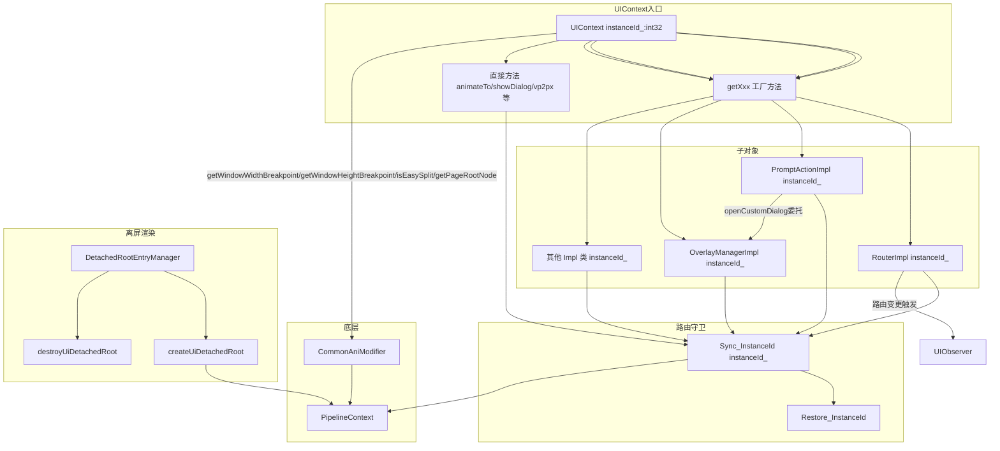

# 特性规格

## 概述

| 属性 | 值 |
|------|-----|
| 特性名称 | 子对象工厂与直接方法 |
| 特性编号 | Func-04-12-01-Feat-03 |
| 优先级 | P1 |
| 目标版本 | API 10+ |
| 复杂度 | 复杂 |
| 状态 | Baselined |

本特性规格定义 UIContext 子对象工厂方法（getXxx 系列）及直接方法（动画、弹窗、半模态、密度转换、节点查询等）的完整行为契约。UIContext 作为 ArkUI 实例级别的上下文入口，通过工厂方法返回绑定到特定 instanceId 的子对象实例，并通过直接方法提供动画、弹窗、密度转换、节点查询等模块级功能。

工厂方法覆盖约 18 个 getXxx 方法：getRouter、getPromptAction、getOverlayManager、getComponentUtils、getComponentSnapshot、getFocusController、getDragController、getCursorController、getSmartGestureController、getUIObserver、getUIInspector、getMediaQuery、getFont、getMeasureUtils、getKeyboardAvoidMode、getMagnifier、getContextMenuController、getTextMenuController，以及 DetachedRoot 管理（getDetachedRootEntryManager）、AtomicServiceBar（getAtomicServiceBar）。

直接方法覆盖：showAlertDialog/showActionSheet/showDatePickerDialog/showTimePickerDialog/showTextPickerDialog、animateTo/animateToImmediately/keyframeAnimateTo/createAnimator、openBindSheet/updateBindSheet/closeBindSheet、vp2px/px2vp/fp2px/px2fp/lpx2px/px2lpx、getFrameNodeById/getFrameNodeByUniqueId、freezeUINode、getWindowWidthBreakpoint/getWindowHeightBreakpoint、getPageRootNode、getPageInfoByUniqueId、setResourceManagerCacheMaxCountForHSP（静态）、isEasySplit、getDetachedRootEntryManager 等。

不含 runScopedTask（归属 Feat-02），不含 resolveUIContext / window-free 容器管理（归属 Feat-02），不含纯虚接口架构（归属 Feat-01）。

## 本次变更范围（Delta）

| 类型 | 内容 | 说明 |
|------|------|------|
| ADDED | getRouter, getPromptAction, getOverlayManager, getComponentUtils, getComponentSnapshot, getFocusController, getDragController, getUIInspector, getUIObserver, getMediaQuery, getFont, getMeasureUtils, getCursorController, getSmartGestureController, getAtomicServiceBar, getContextMenuController, getTextMenuController, getMagnifier, getDetachedRootEntryManager, getLuminanceSampler | 约 20 个工厂方法，返回绑定 instanceId 的子对象 |
| ADDED | animateTo, animateToImmediately, keyframeAnimateTo, createAnimator | 动画模块 |
| ADDED | showAlertDialog, showActionSheet, showDatePickerDialog, showTimePickerDialog, showTextPickerDialog | 弹窗模块 |
| ADDED | openBindSheet, updateBindSheet, closeBindSheet | 半模态模块 |
| ADDED | getFrameNodeById, getFrameNodeByUniqueId, getAttachedFrameNodeById, getPageInfoByUniqueId, getNavigationInfoByUniqueId | 节点查询模块 |
| ADDED | vp2px, px2vp, fp2px, px2fp, lpx2px, px2lpx | 密度转换模块 |
| ADDED | setKeyboardAvoidMode, getKeyboardAvoidMode, setPixelRoundMode, getPixelRoundMode | 键盘避让/像素对齐模块 |
| ADDED | setOverlayManagerOptions, getOverlayManagerOptions | OverlayManager 初始化选项 |
| ADDED | freezeUINode(string/number), enableSwipeBack, recycleInvisibleImageMemory, isFollowingSystemFontScale, getMaxFontScale, clearResourceCache | 系统/性能控制 |
| ADDED | postFrameCallback, postDelayedFrameCallback, dispatchKeyEvent | 帧调度/事件调度 |
| ADDED | Sync_InstanceId(instanceId_) / Restore_InstanceId() 路由守卫 | 所有子对象调用的统一路由模式 |
| ADDED | PromptAction <-> OverlayManager (openCustomDialog 委托 overlay) | 模块间互依赖 |
| ADDED | Router <-> UIObserver (路由状态变更触发 observer) | 模块间互依赖 |
| ADDED | animateTo <-> animateToImmediately (VSync 时序差异) | 动画模块内部差异 |
| ADDED | getWindowWidthBreakpoint(): WidthBreakpoint | 窗口宽度断点查询 |
| ADDED | getWindowHeightBreakpoint(): HeightBreakpoint | 窗口高度断点查询 |
| ADDED | getPageRootNode(): FrameNode | null | 页面根节点获取 |
| ADDED | getPageInfoByUniqueId(uniqueId: number): PageInfo | 页面信息查询 |
| ADDED | setResourceManagerCacheMaxCountForHSP(count: number): void (静态) | HSP 资源管理器缓存上限设置 |
| ADDED | isEasySplit(): boolean | 分屏模式判断 |

## 输入文档

| 文档 | 来源 | 关键提取 |
|------|------|----------|
| @ohos.arkui.UIContext.d.ts | interface/sdk-js/api/ | 工厂方法签名、子对象类定义、直接方法签名、since 版本号 |
| UIContextImpl.ets | frameworks/bridge/arkts_frontend/koala_projects/arkoala-arkts/arkui-ohos/src/base/ | Sync_InstanceId/Restore_InstanceId 路由守卫实现、子对象 Impl 类 |
| @ohos.arkui.UIContext.ts | frameworks/bridge/arkts_frontend/koala_projects/arkoala-arkts/arkui-ohos/ | ArkTS UIContext 类定义、getWindowWidthBreakpoint/getWindowHeightBreakpoint/getPageRootNode/isEasySplit |
| jsUIContext.js | frameworks/bridge/declarative_frontend/engine/ | Declarative Frontend UIContext 实现、setResourceManagerCacheMaxCountForHSP |
| ui_context.h / ui_context_impl.h | interfaces/inner_api/ace_kit/ | Kit 层 UIContext 声明及 OverlayManager 委托模式 |
| common_module.cpp | frameworks/bridge/arkts_frontend/...src/ani/native/common/ | getWindowWidthBreakpoint/getWindowHeightBreakpoint/isEasySplit/getPageRootNode ANI 原生实现 |
| @ohos.router.d.ts | interface/sdk-js/api/ | Router API 签名及错误码 |
| @ohos.promptAction.d.ts | interface/sdk-js/api/ | PromptAction API 签名 |

## 用户故事

| US-ID | 用户故事 | 关联 AC |
|-------|---------|---------|
| US-03.1 | 作为应用开发者，我希望通过 UIContext 的 getXxx 工厂方法获取子对象后，所有后续 API 调用自动路由到正确的 UI 实例，无需手动管理 instanceId，以便在多实例场景下安全使用各模块功能 | AC-03.1, AC-03.2, AC-03.3 |
| US-03.2 | 作为应用开发者，我希望通过 uiContext.getRouter() 获取 Router 实例后，调用 pushUrl/replaceUrl/back/clear/getState 等路由操作，以便在多实例场景下安全执行页面跳转和栈管理 | AC-03.4, AC-03.5, AC-03.6 |
| US-03.3 | 作为应用开发者，我希望通过 uiContext.getPromptAction() 获取 PromptAction 实例后，调用 showToast/showDialog/showActionMenu/openCustomDialog/closeCustomDialog/openPopup/updatePopup/closePopup/openMenu/updateMenu/closeMenu 等交互弹窗操作 | AC-03.7, AC-03.8, AC-03.9 |
| US-03.4 | 作为应用开发者，我希望通过 uiContext.getOverlayManager() 获取 OverlayManager 实例后，调用 addComponentContent/removeComponentContent/showComponentContent/hideComponentContent 等浮层管理操作 | AC-03.10, AC-03.11 |
| US-03.5 | 作为应用开发者，我希望通过 uiContext.getComponentUtils() 和 uiContext.getComponentSnapshot() 分别获取查询和截图实例后，调用 getRectangleById/get/createFromBuilder/createFromComponent 等查询/截图操作 | AC-03.12, AC-03.13 |
| US-03.6 | 作为应用开发者，我希望通过 uiContext.getFocusController() 获取 FocusController 实例后，调用 requestFocus/clearFocus/activate/setAutoFocusTransfer/setKeyProcessingMode/isActive 等焦点控制操作 | AC-03.14, AC-03.15 |
| US-03.7 | 作为应用开发者，我希望通过 uiContext.getDragController() 获取 DragController 实例后，调用 executeDrag/createDragAction/getDragPreview 等拖拽操作 | AC-03.16, AC-03.17 |
| US-03.8 | 作为应用开发者，我希望通过 uiContext.getUIObserver() 和 uiContext.getUIInspector() 获取观察者实例后，调用 on/off 的多种事件类型及 createComponentObserver | AC-03.18, AC-03.19 |
| US-03.9 | 作为应用开发者，我希望通过 uiContext.getMediaQuery() 获取 MediaQuery 实例后，调用 matchMediaSync | AC-03.20 |
| US-03.10 | 作为应用开发者，我希望通过 uiContext.getFont() 获取 Font 实例后，调用 registerFont/getSystemFontList/getFontByName | AC-03.21 |
| US-03.11 | 作为应用开发者，我希望通过 uiContext.getMeasureUtils() 获取 MeasureUtils 实例后，调用 measureText/measureTextSize/getParagraphs | AC-03.22 |
| US-03.12 | 作为应用开发者，我希望通过 uiContext.getCursorController() 获取 CursorController 实例后，调用 restoreDefault/setCursor/setCustomCursor | AC-03.23, AC-03.24 |
| US-03.13 | 作为应用开发者，我希望通过 uiContext.getSmartGestureController() 获取 SmartGestureController 实例后，调用 enableSmartTapAndSlideGestures/registerMonitor/unregisterMonitor/clearMonitors/requestSelected/clearSelected | AC-03.25 |
| US-03.14 | 作为应用开发者，我希望直接在 UIContext 上调用 setKeyboardAvoidMode/getKeyboardAvoidMode 设置/获取键盘避让模式 | AC-03.26, AC-03.27 |
| US-03.15 | 作为应用开发者，我希望直接在 UIContext 上调用 showAlertDialog/showActionSheet/showDatePickerDialog/showTimePickerDialog/showTextPickerDialog | AC-03.28, AC-03.29, AC-03.30 |
| US-03.16 | 作为应用开发者，我希望直接在 UIContext 上调用 animateTo/animateToImmediately/keyframeAnimateTo/createAnimator | AC-03.31, AC-03.32, AC-03.33, AC-03.34 |
| US-03.17 | 作为应用开发者，我希望直接在 UIContext 上调用 openBindSheet/updateBindSheet/closeBindSheet | AC-03.35, AC-03.36, AC-03.37 |
| US-03.18 | 作为应用开发者，我希望直接在 UIContext 上调用 vp2px/px2vp/fp2px/px2fp/lpx2px/px2lpx | AC-03.38 |
| US-03.19 | 作为应用开发者，我希望直接在 UIContext 上调用 getFrameNodeById/getFrameNodeByUniqueId | AC-03.39, AC-03.40 |
| US-03.20 | 作为应用开发者，我希望通过 uiContext.getMagnifier() 获取 Magnifier 实例后，调用 bind/show/unbind | AC-03.41 |
| US-03.21 | 作为应用开发者，我希望通过 uiContext.getContextMenuController() 获取 ContextMenuController 实例后，调用 close | AC-03.42 |
| US-03.22 | 作为应用开发者，我希望通过 uiContext.getTextMenuController() 获取 TextMenuController 实例后，调用 setMenuOptions/disableSystemServiceMenuItems | AC-03.43 |
| US-03.23 | 作为应用开发者，我希望通过 uiContext.getAtomicServiceBar() 获取 AtomicServiceBar 实例后，调用 setVisible/setBackgroundColor/setTitleContent 等 | AC-03.44 |
| US-03.24 | 作为应用开发者，我希望通过 uiContext 内部机制（DetachedRootEntryManager）管理 createUiDetachedRoot/destroyUiDetachedRoot | AC-03.45 |
| US-03.25 | 作为应用开发者，我希望直接在 UIContext 上调用 getWindowWidthBreakpoint/getWindowHeightBreakpoint 获取当前窗口断点信息 | AC-03.46, AC-03.47 |
| US-03.26 | 作为应用开发者，我希望直接在 UIContext 上调用 getPageRootNode() 获取当前页面的根 FrameNode | AC-03.48 |
| US-03.27 | 作为应用开发者，我希望直接在 UIContext 上调用 getPageInfoByUniqueId(uniqueId) 获取页面路由和导航信息 | AC-03.49 |
| US-03.28 | 作为应用开发者，我希望通过 UIContext 静态方法 setResourceManagerCacheMaxCountForHSP(count) 设置 HSP 资源管理器缓存上限 | AC-03.50 |
| US-03.29 | 作为应用开发者，我希望直接在 UIContext 上调用 isEasySplit() 判断当前实例是否处于分屏模式 | AC-03.51 |

## 验收追溯

| AC 编号 | 用户故事 | 验收条件 |
|---------|---------|---------|
| AC-03.1 | US-03.1 | 每个 getXxx 工厂方法返回的子对象实例携带 instanceId_ 字段，后续所有 API 调用均执行 Sync_InstanceId(instanceId_) 前置守卫和 Restore_InstanceId() 后置恢复 |
| AC-03.2 | US-03.1 | 多实例场景下，各子对象 API 调用路由到对应 instanceId 的 PipelineContext，不会串实例 |
| AC-03.3 | US-03.1 | 工厂方法返回的子对象实例生命周期与 UIContext 绑定，UIContext 对应 UI 实例销毁后，子对象 API 调用不 crash（抛出 BusinessError 100001 或返回 undefined/null） |
| AC-03.4 | US-03.2 | getRouter() 返回 Router 实例，pushUrl/replaceUrl/back/clear/getState/getParams/getLength/getStackSize/showAlertBeforeBackPage/hideAlertBeforeBackPage/pushNamedRoute/replaceNamedRoute/getStateByIndex/getStateByUrl 均路由到正确实例 |
| AC-03.5 | US-03.2 | Router.pushUrl 参数错误抛出 BusinessError 401；URI 错误抛出 BusinessError 100002/200002；栈溢出抛出 BusinessError 100003 |
| AC-03.6 | US-03.2 | Router.back(index, params) 按指定索引返回页面，params 传递到目标页面 |
| AC-03.7 | US-03.3 | getPromptAction() 返回 PromptAction 实例，showToast/showDialog/showActionMenu/openCustomDialog/closeCustomDialog/openPopup/updatePopup/closePopup/openMenu/updateMenu/closeMenu/openToast/closeToast/openCustomDialogWithController/presentCustomDialog/getTopOrder/getBottomOrder 均路由到正确实例 |
| AC-03.8 | US-03.3 | PromptAction.openCustomDialog(ComponentContent) 与 PromptAction.openCustomDialog(CustomDialogOptions) 两种重载均可正常工作，前者委托 OverlayManager 管理浮层节点 |
| AC-03.9 | US-03.3 | PromptAction.openPopup/updatePopup/closePopup/openMenu/updateMenu/closeMenu 使用 TargetInfo 绑定目标节点，TargetInfo.id 支持 string 和 number |
| AC-03.10 | US-03.4 | getOverlayManager() 返回 OverlayManager 实例，addComponentContent/removeComponentContent/showComponentContent/hideComponentContent/showAllComponentContents/hideAllComponentContents/addComponentContentWithOrder/openOrderOverlay 均路由到正确实例 |
| AC-03.11 | US-03.4 | setOverlayManagerOptions 在首次获取 OverlayManager 之前调用返回 true，否则返回 false |
| AC-03.12 | US-03.5 | getComponentUtils() 返回 ComponentUtils 实例，getRectangleById 返回 componentUtils.ComponentInfo |
| AC-03.13 | US-03.5 | getComponentSnapshot() 返回 ComponentSnapshot 实例，get/getSync/getWithUniqueId/getSyncWithUniqueId/createFromBuilder/createFromComponent/getWithRange/getSizeLimitation 均路由到正确实例 |
| AC-03.14 | US-03.6 | getFocusController() 返回 FocusController 实例，requestFocus/clearFocus/activate/setAutoFocusTransfer/setKeyProcessingMode/isActive 均路由到正确实例 |
| AC-03.15 | US-03.6 | requestFocus 对不存在/不可聚焦节点抛出 BusinessError 150001/150002/150003 |
| AC-03.16 | US-03.7 | getDragController() 返回 DragController 实例，executeDrag/createDragAction/getDragPreview/setDragEventStrictReportingEnabled/cancelDataLoading/notifyDragStartRequest/enableDropDisallowedBadge/interruptFollowHandMorphDropAnimation 均路由到正确实例 |
| AC-03.17 | US-03.7 | executeDrag 的 CustomBuilder 参数使用 createUiDetachedRoot 创建离屏根节点，drag 完成后调用 destroyUiDetachedRoot 清理 |
| AC-03.18 | US-03.8 | getUIObserver() 返回 UIObserver 实例，on/off 支持所有声明的事件类型，回调在对应 instanceId 的 PipelineContext 中执行 |
| AC-03.19 | US-03.8 | getUIInspector() 返回 UIInspector 实例，createComponentObserver(id) 支持 string 和 number 类型参数 |
| AC-03.20 | US-03.9 | getMediaQuery() 返回 MediaQuery 实例，matchMediaSync 返回 mediaQuery.MediaQueryListener |
| AC-03.21 | US-03.10 | getFont() 返回 Font 实例，registerFont/getSystemFontList/getFontByName 均路由到正确实例 |
| AC-03.22 | US-03.11 | getMeasureUtils() 返回 MeasureUtils 实例，measureText 返回 number(px)，measureTextSize 返回 SizeOptions(px)，getParagraphs 返回 Array&lt;Paragraph&gt; |
| AC-03.23 | US-03.12 | getCursorController() 返回 CursorController 实例，restoreDefault/setCursor/setCustomCursor 均路由到正确实例 |
| AC-03.24 | US-03.12 | setCustomCursor 接受 PixelMap 参数及可选 focusX/focusY 热点坐标 |
| AC-03.25 | US-03.13 | getSmartGestureController() 返回 SmartGestureController 实例，enableSmartTapAndSlideGestures/registerMonitor/unregisterMonitor/clearMonitors/requestSelected/clearSelected 均路由到正确实例 |
| AC-03.26 | US-03.14 | setKeyboardAvoidMode 设置 OFFSET/RESIZE/OFFSET_WITH_CARET/RESIZE_WITH_CARET/NONE 五种模式 |
| AC-03.27 | US-03.14 | getKeyboardAvoidMode 返回当前设置的模式值 |
| AC-03.28 | US-03.15 | showAlertDialog 接受 AlertDialogParamWithConfirm/AlertDialogParamWithButtons/AlertDialogParamWithOptions |
| AC-03.29 | US-03.15 | showActionSheet 接受 ActionSheetOptions |
| AC-03.30 | US-03.15 | showDatePickerDialog/showTimePickerDialog/showTextPickerDialog 各接受对应 Options 类型 |
| AC-03.31 | US-03.16 | animateTo 在当前 instanceId 的 PipelineContext 中执行动画闭包 |
| AC-03.32 | US-03.16 | animateToImmediately 立即派发动画，避免 VSync 延迟导致动画不执行 |
| AC-03.33 | US-03.16 | keyframeAnimateTo 接受 KeyframeAnimateParam 和 Array&lt;KeyframeState&gt; |
| AC-03.34 | US-03.16 | createAnimator 接受 AnimatorOptions 或 AnimatorOptions|SimpleAnimatorOptions，返回 AnimatorResult |
| AC-03.35 | US-03.17 | openBindSheet 接受 ComponentContent 和可选 SheetOptions/targetId |
| AC-03.36 | US-03.17 | updateBindSheet 支持增量更新（partialUpdate=true）和全量更新（partialUpdate=false） |
| AC-03.37 | US-03.17 | closeBindSheet 关闭对应 ComponentContent 的半模态面板 |
| AC-03.38 | US-03.18 | vp2px/px2vp/fp2px/px2fp/lpx2px/px2lpx 各返回 number 类型转换结果 |
| AC-03.39 | US-03.19 | getFrameNodeById 返回 FrameNode|null |
| AC-03.40 | US-03.19 | getFrameNodeByUniqueId 返回 FrameNode|null |
| AC-03.41 | US-03.20 | getMagnifier() 返回 Magnifier 实例，bind/show/unbind 均路由到正确实例 |
| AC-03.42 | US-03.21 | getContextMenuController() 返回 ContextMenuController 实例，close 路由到正确实例 |
| AC-03.43 | US-03.22 | getTextMenuController() 返回 TextMenuController 实例，setMenuOptions/disableSystemServiceMenuItems 路由到正确实例 |
| AC-03.44 | US-03.23 | getAtomicServiceBar() 返回 Nullable&lt;AtomicServiceBar&gt;，各 setter/getter 方法路由到正确实例 |
| AC-03.45 | US-03.24 | createUiDetachedRoot/destroyUiDetachedRoot 在正确 instanceId 下创建/销毁离屏渲染根节点 |
| AC-03.46 | US-03.25 | getWindowWidthBreakpoint() 在 Sync_InstanceId/Restore_InstanceId 守卫下执行，返回 WidthBreakpoint 枚举值（WIDTH_XS=0, WIDTH_SM=1, WIDTH_MD=2, WIDTH_LG=3, WIDTH_XL=4） |
| AC-03.47 | US-03.25 | getWindowHeightBreakpoint() 在 Sync_InstanceId/Restore_InstanceId 守卫下执行，返回 HeightBreakpoint 枚举值（HEIGHT_SM=0, HEIGHT_MD=1, HEIGHT_LG=2） |
| AC-03.48 | US-03.26 | getPageRootNode() 在 isAvailable 校验后执行，isAvailable()=false 时抛出 BusinessError 120007；Sync_InstanceId 守卫下调用 _GetPageRootNode 获取节点指针，返回 FrameNode|null |
| AC-03.49 | US-03.27 | getPageInfoByUniqueId(uniqueId) 查询 NavDestinationInfo 和 RouterPageInfo，返回 PageInfo{routerPageInfo, navDestinationInfo} |
| AC-03.50 | US-03.28 | setResourceManagerCacheMaxCountForHSP(count) 为静态方法，通过 getUINativeModule().resource.setResourceManagerCacheMaxCountForHSP(count) 调用原生模块 |
| AC-03.51 | US-03.29 | isEasySplit() 在 withInstanceId/Sync_InstanceId 守卫下调用 _Common_IsEasySplit(instanceId)，底层调用 PipelineContext::IsDisplayInForceSplitMode() |

## 规则定义

### R-03.1: 工厂方法统一路由守卫 [行为]

所有子对象 Impl 类的每个公开方法必须在方法体开头调用 `ArkUIAniModule._Common_Sync_InstanceId(this.instanceId_)` 并在方法体结尾调用 `ArkUIAniModule._Common_Restore_InstanceId()`。此规则确保多实例场景下调用路由到正确的 PipelineContext。

源码依据: @ohos.arkui.UIContext.ts 中所有 Impl 类方法均遵循此模式。getWindowWidthBreakpoint:1225-1232, getWindowHeightBreakpoint:1236-1244, getPageRootNode:1328-1347。

### R-03.2: 工厂方法返回实例绑定 instanceId [行为]

每个 getXxx 工厂方法必须将当前 UIContext 的 instanceId 传递给子对象构造函数，子对象以 `this.instanceId_ = instanceId` 形式持有。工厂方法每次调用均返回新实例或按需缓存实例。

源码依据: @ohos.arkui.UIContext.ts 所有 Impl 类构造函数均接受 instanceId 参数。

### R-03.3: PromptAction <-> OverlayManager 委托规则 [行为]

PromptAction.openCustomDialog(ComponentContent) 的实现委托 OverlayManager 管理弹窗浮层节点。内部流程:
1. 获取 ComponentContent 的 KPointer (getNodePtr)
2. 提取 BaseDialogOptions 中的 levelOrder/transition/material 等内部参数
3. 调用 promptAction.openCustomDialog1(contentPtr, options, optionsInternal)

此委托路径意味着 PromptAction 依赖 OverlayManager 的浮层基础设施。

源码依据: UIContextImpl.ets PromptActionImpl.openCustomDialog 方法。

### R-03.4: Router <-> UIObserver 观察者联动规则 [行为]

Router 状态变更（pushUrl/replaceUrl/back/clear）触发 UIObserver 的 routerPageUpdate 事件。此联动通过 PipelineContext 的 PageRouterManager 和 UIObserverManager 协调实现。

### R-03.5: animateTo 与 animateToImmediately VSync 差异规则 [行为]

animateTo 在下一个 VSync 噪帧派发动画闭包，动画参数在闭包执行时生效。animateToImmediately 立即派发动画闭包，避免因 VSync 延迟导致动画不执行或 onFinish 回调不触发。

源码依据: @ohos.arkui.UIContext.ts animateToImmediately 的 @systemapi 标注变更（since 12 systemapi -> since 23 publicapi）。

### R-03.6: DetachedRoot 离屏渲染管理规则 [行为]

openCustomDialog(CustomDialogOptions)/executeDrag(CustomBuilder)/createFromBuilder(CustomBuilder) 等需要离屏渲染的 API 使用 createUiDetachedRoot 创建 PeerNode 根节点，完成后调用 destroyUiDetachedRoot 清理。DetachedRootEntryManager 维护 detachedRoots_ 和 freezedRoots_ 两个 Map 来管理生命周期。

源码依据: UIContextImpl.ets DetachedRootEntryManager 类（detachedRoots_:1629, freezedRoots_:1630）。

### R-03.7: ComponentContent KPointer 提取规则 [行为]

OverlayManager/PromptAction 等模块在使用 ComponentContent 时，通过 content.getNodePtr() 获取底层 KPointer，如果 undefined 则默认为 0。此规则确保 API 层面以 ComponentContent 为标识，内部以 KPointer 传递给原生模块。

源码依据: @ohos.arkui.UIContext.ts OverlayManagerImpl.addComponentContent, PromptActionImpl.openCustomDialog。

### R-03.8: KeyboardAvoidMode 仅影响页面布局规则 [边界]

setKeyboardAvoidMode 设置的避让模式仅影响页面布局，不影响弹窗类组件（Dialog/Popup/Menu/BindSheet/BindContentCover/Toast/OverlayManager）。弹窗类组件的避让行为由 CustomDialogControllerOptions 控制。

### R-03.9: OverlayManagerOptions 初始化时序规则 [边界]

setOverlayManagerOptions 必须在首次 getOverlayManager 之前调用才返回 true；若 OverlayManager 已初始化则返回 false。OverlayManagerOptions 包含 renderRootOverlay（默认 true）和 enableBackPressedEvent（默认 false）两个选项。

### R-03.10: freezeUINode 双 ID 规则 [行为]

freezeUINode 支持两种参数形式: (id: string, isFrozen: boolean) 按 inspector id 冻结, (uniqueId: number, isFrozen: boolean) 按 uniqueId 冻结。解冻通过 isFrozen=false 实现，不存在单独的 unfreezeUINodeById API。此 API 为 @systemapi，仅系统应用可调用。

源码依据: jsUIContext.js:1051-1058, @ohos.arkui.UIContext.ts:1183-1194。

### R-03.11: TargetInfo 绑定规则 [行为]

PromptAction.openPopup/openMenu 及 OverlayManager 相关 API 使用 TargetInfo 确定绑定目标节点。TargetInfo.id 支持 string（inspector id）和 number（UniqueId），componentId 为可选字段用于缩小 id: string 查找范围。

### R-03.12: SmartGestureController Monitor 回调规则 [行为]

registerMonitor 注册的回调以逆序触发（最后注册最先执行）。当回调返回 GestureHandlingResolution.isConsumed=true 时，后续回调不执行。重复注册同一回调仅首次生效。回调返回值必须为有效 GestureHandlingResolution 实例。

### R-03.13: ComponentSnapshot 离屏截图延迟规则 [行为]

createFromBuilder 默认延迟 300ms 触发截图指令，最大延迟不超过 500ms。syncLoad=true 或使用 PixelMap 资源时可将 delay 设为 0 强制立即截图。

### R-03.14: Breakpoint 查询错误降级规则 [异常]

getWindowWidthBreakpoint/getWindowHeightBreakpoint 在底层返回负值时（ret < 0），表示获取当前窗口失败，此时降级返回默认枚举值（WidthBreakpoint.WIDTH_XS / HeightBreakpoint.HEIGHT_SM）并在 Restore_InstanceId 前记录 console.error。

源码依据: @ohos.arkui.UIContext.ts:1224-1234 (getWindowWidthBreakpoint), :1235-1245 (getWindowHeightBreakpoint), common_module.cpp:1366-1382（底层实现）。

### R-03.15: getPageRootNode 可用性校验规则 [异常]

getPageRootNode() 在执行前调用 isAvailable() 校验，如果 UIContext 对应的 UI 实例已销毁或无效，抛出 BusinessError(120007, 'The UIContext is not available')。正常情况下在 Sync_InstanceId 守卫下调用 _GetPageRootNode 获取节点指针，通过 FrameNodeExtender.createByRawPtr 构造 FrameNode 对象，节点不在树上或指针为 nullptr 时返回 null。

源码依据: @ohos.arkui.UIContext.ts:1324-1349, jsUIContext.js:1104-1117。

### R-03.16: isEasySplit 实例绑定规则 [行为]

isEasySplit() 调用 ArkUIAniModule._Common_IsEasySplit(this.instanceId_)，底层通过 PipelineContext::GetContextByContainerId(instanceId) 获取对应 PipelineContext 并调用 IsDisplayInForceSplitMode()。获取 context 失败时返回 false。

源码依据: @ohos.arkui.UIContext.ts:1496-1498, common_module.cpp:90-97, common_ani_modifier.cpp:120-128。

### R-03.17: setResourceManagerCacheMaxCountForHSP 静态无实例规则 [行为]

setResourceManagerCacheMaxCountForHSP(count) 为 UIContext 的静态方法，不绑定任何 UIContext 实例，直接通过 getUINativeModule().resource.setResourceManagerCacheMaxCountForHSP(count) 调用原生模块。此方法影响全局 HSP 资源管理器缓存上限。

源码依据: jsUIContext.js:486-488。

### R-03.18: getPageInfoByUniqueId 页面信息合成规则 [行为]

getPageInfoByUniqueId(uniqueId) 查询两个信息源: ArkUIAniModule._CustomNode_QueryNavDestinationInfo1(uniqueId) 获取 navDestinationInfo, ArkUIAniModule._CustomNode_QueryRouterPageInfo1(uniqueId) 获取 routerPageInfo。结果合成为 PageInfo{navDestinationInfo, routerPageInfo}。若 routerPageInfo 存在，设置其 context 字段为当前 UIContext 实例。

源码依据: @ohos.arkui.UIContext.ts:1307-1318, jsUIContext.js:877-880。

### R-03.19: UIContext isAvailable 校验规则 [边界]

UIContext 对应的 UI 实例销毁后（如 window 关闭、多次 loadContent 后旧实例失效），isAvailable() 返回 false。通过 new UIContext() 创建的对象无对应 UI 实例，isAvailable() 返回 false。调用方应在异步任务中使用此校验避免操作已销毁实例。

## 验证映射

| VM-ID | 验证方法 | 关联 US/AC/R | 验证重点 |
|-------|---------|-------------|---------|
| VM-03.1 | 代码审查 | AC-03.1, R-03.1 | 每个 Impl 类方法体包含 Sync_InstanceId + Restore_InstanceId |
| VM-03.2 | 多实例 UT | AC-03.2, R-03.1, R-03.2 | 创建两个 UIContext，分别调用 getRouter().pushUrl，验证路由到各自实例的 PageRouterManager |
| VM-03.3 | 销毁实例 UT | AC-03.3, R-03.2 | UIContext 对应实例销毁后调用子对象方法，验证抛出 BusinessError 100001 或返回 undefined |
| VM-03.4 | Router UT | AC-03.4, R-03.1, R-03.2 | pushUrl/replaceUrl/back/clear/getState 路由验证 |
| VM-03.5 | Router 错误码 UT | AC-03.5, R-03.1 | 传入无效参数/URI/栈满场景验证错误码 |
| VM-03.6 | PromptAction UT | AC-03.7, R-03.1, R-03.2 | showToast/showDialog/openCustomDialog 路由验证 |
| VM-03.7 | PromptAction 委托 UT | AC-03.8, R-03.3 | openCustomDialog(ComponentContent) 验证 OverlayManager 浮层节点创建 |
| VM-03.8 | OverlayManager UT | AC-03.10, R-03.1, R-03.2 | addComponentContent/removeComponentContent 路由验证 |
| VM-03.9 | OverlayManagerOptions UT | AC-03.11, R-03.9 | setOverlayManagerOptions 在 getOverlayManager 前后调用返回值验证 |
| VM-03.10 | ComponentUtils UT | AC-03.12, R-03.1 | getRectangleById 路由验证 |
| VM-03.11 | ComponentSnapshot UT | AC-03.13, R-03.1, R-03.6 | get/createFromBuilder/createFromComponent 路由及离屏根节点验证 |
| VM-03.12 | FocusController UT | AC-03.14, R-03.1, R-03.2 | requestFocus/clearFocus/activate 路由验证 |
| VM-03.13 | DragController UT | AC-03.16, R-03.1, R-03.2, R-03.6 | executeDrag/createDragAction 路由及离屏根节点验证 |
| VM-03.14 | UIObserver UT | AC-03.18, R-03.1, R-03.4 | on('routerPageUpdate') + Router.pushUrl 联动验证 |
| VM-03.15 | MediaQuery UT | AC-03.20, R-03.1 | matchMediaSync 路由验证 |
| VM-03.16 | Font UT | AC-03.21, R-03.1 | registerFont/getSystemFontList 路由验证 |
| VM-03.17 | MeasureUtils UT | AC-03.22, R-03.1 | measureText/measureTextSize 路由验证 |
| VM-03.18 | CursorController UT | AC-03.23, R-03.1 | restoreDefault/setCursor 路由验证 |
| VM-03.19 | SmartGestureController UT | AC-03.25, R-03.12 | registerMonitor 回调逆序执行验证 |
| VM-03.20 | KeyboardAvoidMode UT | AC-03.26, R-03.8 | set OFFSET/RESIZE 等模式验证 |
| VM-03.21 | animateTo UT | AC-03.31, R-03.5 | 动画闭包在 VSync 噪帧执行验证 |
| VM-03.22 | animateToImmediately UT | AC-03.32, R-03.5 | 动画立即派发验证 |
| VM-03.23 | openBindSheet UT | AC-03.35, R-03.7 | ComponentContent KPointer 提取验证 |
| VM-03.24 | DetachedRoot UT | AC-03.45, R-03.6 | createUiDetachedRoot/destroyUiDetachedRoot 生命周期验证 |
| VM-03.25 | Magnifier UT | AC-03.41, R-03.1 | bind/show/unbind 路由验证 |
| VM-03.26 | getWindowWidthBreakpoint UT | AC-03.46, R-03.14 | 正常返回 WIDTH_XS~WIDTH_XL，窗口失效时降级返回 WIDTH_XS |
| VM-03.27 | getWindowHeightBreakpoint UT | AC-03.47, R-03.14 | 正常返回 HEIGHT_SM~HEIGHT_LG，窗口失效时降级返回 HEIGHT_SM |
| VM-03.28 | getPageRootNode UT | AC-03.48, R-03.15 | isAvailable=false 时抛 BusinessError 120007；正常时返回 FrameNode|null |
| VM-03.29 | getPageInfoByUniqueId UT | AC-03.49, R-03.18 | 验证 navDestinationInfo + routerPageInfo 合成结果 |
| VM-03.30 | setResourceManagerCacheMaxCountForHSP UT | AC-03.50, R-03.17 | 验证静态调用不依赖 UIContext 实例 |
| VM-03.31 | isEasySplit UT | AC-03.51, R-03.16 | 分屏模式返回 true，非分屏返回 false，context 失效时返回 false |

## API 变更分析

### 新增 API

本特性规格涵盖的全部 API 均为已有实现，本规格仅做归约描述。

#### 工厂方法

| API | 返回类型 | since | syscap |
|-----|---------|-------|--------|
| getFont() | Font | 10 | ArkUI.ArkUI.Full |
| getMediaQuery() | MediaQuery | 10 | ArkUI.ArkUI.Full |
| getUIInspector() | UIInspector | 10 | ArkUI.ArkUI.Full |
| getRouter() | Router | 10 | ArkUI.ArkUI.Full |
| getPromptAction() | PromptAction | 10 | ArkUI.ArkUI.Full |
| getComponentUtils() | ComponentUtils | 10 | ArkUI.ArkUI.Full |
| getUIObserver() | UIObserver | 11 | ArkUI.ArkUI.Full |
| getOverlayManager() | OverlayManager | 12 | ArkUI.ArkUI.Full |
| getDragController() | DragController | 11 | ArkUI.ArkUI.Full |
| getMeasureUtils() | MeasureUtils | 12 | ArkUI.ArkUI.Full |
| getFocusController() | FocusController | 12 | ArkUI.ArkUI.Full |
| getCursorController() | CursorController | 12 | ArkUI.ArkUI.Full |
| getContextMenuController() | ContextMenuController | 12 | ArkUI.ArkUI.Full |
| getComponentSnapshot() | ComponentSnapshot | 12 | ArkUI.ArkUI.Full |
| getAtomicServiceBar() | Nullable&lt;AtomicServiceBar&gt; | 11 | ArkUI.ArkUI.Full |
| getTextMenuController() | TextMenuController | 16 | ArkUI.ArkUI.Full |
| getMagnifier() | Magnifier | 22 | ArkUI.ArkUI.Full |
| getLuminanceSampler(target: TargetInfo) | LuminanceSampler|undefined | 23 | ArkUI.ArkUI.Full (@systemapi) |
| getSmartGestureController() | SmartGestureController | 26 | ArkUI.ArkUI.Full |
| getDetachedRootEntryManager() | DetachedRootEntryManager | 内部 | 内部 |

#### 直接模块方法

| API | since | syscap |
|-----|-------|--------|
| animateTo(value: AnimateParam, event: () => void) | 10 | ArkUI.ArkUI.Full |
| animateToImmediately(param: AnimateParam, processor: Callback&lt;void&gt;) | 12 | ArkUI.ArkUI.Full |
| keyframeAnimateTo(param: KeyframeAnimateParam, keyframes: Array&lt;KeyframeState&gt;) | 11 | ArkUI.ArkUI.Full |
| createAnimator(options: AnimatorOptions) | 10 | ArkUI.ArkUI.Full |
| createAnimator(options: AnimatorOptions|SimpleAnimatorOptions) | 18 | ArkUI.ArkUI.Full |
| showAlertDialog(options: AlertDialogParamWithConfirm|AlertDialogParamWithButtons|AlertDialogParamWithOptions) | 10 | ArkUI.ArkUI.Full |
| showActionSheet(value: ActionSheetOptions) | 10 | ArkUI.ArkUI.Full |
| showDatePickerDialog(options: DatePickerDialogOptions) | 10 | ArkUI.ArkUI.Full |
| showTimePickerDialog(options: TimePickerDialogOptions) | 10 | ArkUI.ArkUI.Full |
| showTextPickerDialog(options: TextPickerDialogOptions) | 10 | ArkUI.ArkUI.Full |
| openBindSheet&lt;T&gt;(bindSheetContent: ComponentContent&lt;T&gt;, sheetOptions?: SheetOptions, targetId?: number) | 12 | ArkUI.ArkUI.Full |
| updateBindSheet&lt;T&gt;(bindSheetContent: ComponentContent&lt;T&gt;, sheetOptions: SheetOptions, partialUpdate?: boolean) | 12 | ArkUI.ArkUI.Full |
| closeBindSheet&lt;T&gt;(bindSheetContent: ComponentContent&lt;T&gt;) | 12 | ArkUI.ArkUI.Full |
| getFrameNodeById(id: string) | 12 | ArkUI.ArkUI.Full |
| getAttachedFrameNodeById(id: string) | 12 | ArkUI.ArkUI.Full |
| getFrameNodeByUniqueId(id: number) | 12 | ArkUI.ArkUI.Full |
| getPageInfoByUniqueId(id: number) | 12 | ArkUI.ArkUI.Full |
| getNavigationInfoByUniqueId(id: number) | 12 | ArkUI.ArkUI.Full |
| vp2px(value: number) | 12 | ArkUI.ArkUI.Full |
| px2vp(value: number) | 12 | ArkUI.ArkUI.Full |
| fp2px(value: number) | 12 | ArkUI.ArkUI.Full |
| px2fp(value: number) | 12 | ArkUI.ArkUI.Full |
| lpx2px(value: number) | 12 | ArkUI.ArkUI.Full |
| px2lpx(value: number) | 12 | ArkUI.ArkUI.Full |
| setKeyboardAvoidMode(value: KeyboardAvoidMode) | 11 | ArkUI.ArkUI.Full |
| getKeyboardAvoidMode() | 11 | ArkUI.ArkUI.Full |
| setPixelRoundMode(mode: PixelRoundMode) | 18 | ArkUI.ArkUI.Full |
| getPixelRoundMode() | 18 | ArkUI.ArkUI.Full |
| setOverlayManagerOptions(options: OverlayManagerOptions) | 15 | ArkUI.ArkUI.Full |
| getOverlayManagerOptions() | 15 | ArkUI.ArkUI.Full |
| freezeUINode(id: string, isFrozen: boolean) | 18 | ArkUI.ArkUI.Full (@systemapi) |
| freezeUINode(uniqueId: number, isFrozen: boolean) | 18 | ArkUI.ArkUI.Full (@systemapi) |
| enableSwipeBack(enabled: Optional&lt;boolean&gt;) | 18 | ArkUI.ArkUI.Circle |
| recycleInvisibleImageMemory(enabled: boolean) | 23 | ArkUI.ArkUI.Full (@systemapi) |
| postFrameCallback(frameCallback: FrameCallback) | 12 | ArkUI.ArkUI.Full |
| postDelayedFrameCallback(frameCallback: FrameCallback, delayTime: number) | 12 | ArkUI.ArkUI.Full |
| isAvailable() | 20 | ArkUI.ArkUI.Full |
| getId() | 22 | ArkUI.ArkUI.Full |
| dispatchKeyEvent(node: number|string, event: KeyEvent) | 15 | ArkUI.ArkUI.Full |
| setDynamicDimming(id: string, value: number) | 12 | ArkUI.ArkUI.Full (@systemapi) |
| getWindowWidthBreakpoint() | 12 | ArkUI.ArkUI.Full |
| getWindowHeightBreakpoint() | 12 | ArkUI.ArkUI.Full |
| getPageRootNode() | 22 | ArkUI.ArkUI.Full |
| getPageInfoByUniqueId(uniqueId: number) | 12 | ArkUI.ArkUI.Full |
| static setResourceManagerCacheMaxCountForHSP(count: number) | 10 | ArkUI.ArkUI.Full |
| isEasySplit() | 10 | ArkUI.ArkUI.Full |

### 变更/废弃 API

| API | 变更类型 | since | 替代 |
|-----|---------|-------|------|
| Router.getLength() | 废弃 | 23 | Router.getStackSize() |
| PromptAction.showActionMenu(options, callback: ActionMenuSuccessResponse) | 废弃 | 11 | PromptAction.showActionMenu(options, callback: AsyncCallback&lt;ActionMenuSuccessResponse&gt;) |

## 接口规格

### 接口定义

#### 工厂方法接口

```
class UIContext {
    getFont(): Font
    getMediaQuery(): MediaQuery
    getUIInspector(): UIInspector
    getRouter(): Router
    getPromptAction(): PromptAction
    getComponentUtils(): ComponentUtils
    getUIObserver(): UIObserver
    getOverlayManager(): OverlayManager
    getDragController(): DragController
    getMeasureUtils(): MeasureUtils
    getFocusController(): FocusController
    getCursorController(): CursorController
    getContextMenuController(): ContextMenuController
    getComponentSnapshot(): ComponentSnapshot
    getAtomicServiceBar(): Nullable<AtomicServiceBar>
    getTextMenuController(): TextMenuController
    getMagnifier(): Magnifier
    getLuminanceSampler(target: TargetInfo): LuminanceSampler | undefined
    getSmartGestureController(): SmartGestureController
    getDetachedRootEntryManager(): DetachedRootEntryManager
    setOverlayManagerOptions(options: OverlayManagerOptions): boolean
    getOverlayManagerOptions(): OverlayManagerOptions
}
```

#### Router 子对象接口

```
class Router {
    pushUrl(options: RouterOptions): Promise<void>
    pushUrl(options: RouterOptions, mode: RouterMode): Promise<void>
    pushUrl(options: RouterOptions, callback: AsyncCallback<void>): void
    pushUrl(options: RouterOptions, mode: RouterMode, callback: AsyncCallback<void>): void
    replaceUrl(options: RouterOptions): Promise<void>
    replaceUrl(options: RouterOptions, mode: RouterMode): Promise<void>
    replaceUrl(options: RouterOptions, callback: AsyncCallback<void>): void
    replaceUrl(options: RouterOptions, mode: RouterMode, callback: AsyncCallback<void>): void
    back(options?: RouterOptions): void
    back(index: number, params?: Object): void
    clear(): void
    getLength(): string
    getStackSize(): number
    getState(): RouterState
    getStateByIndex(index: number): RouterState | undefined
    getStateByUrl(url: string): Array<RouterState>
    getParams(): Object
    showAlertBeforeBackPage(options: EnableAlertOptions): void
    hideAlertBeforeBackPage(): void
    pushNamedRoute(options: NamedRouterOptions): Promise<void>
    pushNamedRoute(options: NamedRouterOptions, mode: RouterMode): Promise<void>
    pushNamedRoute(options: NamedRouterOptions, callback: AsyncCallback<void>): void
    pushNamedRoute(options: NamedRouterOptions, mode: RouterMode, callback: AsyncCallback<void>): void
    replaceNamedRoute(options: NamedRouterOptions): Promise<void>
    replaceNamedRoute(options: NamedRouterOptions, mode: RouterMode): Promise<void>
    replaceNamedRoute(options: NamedRouterOptions, callback: AsyncCallback<void>): void
    replaceNamedRoute(options: NamedRouterOptions, mode: RouterMode, callback: AsyncCallback<void>): void
}
```

#### PromptAction 子对象接口

```
class PromptAction {
    showToast(options: ShowToastOptions): void
    openToast(options: ShowToastOptions): Promise<number>
    closeToast(toastId: number): void
    showDialog(options: ShowDialogOptions, callback: AsyncCallback<ShowDialogSuccessResponse>): void
    showDialog(options: ShowDialogOptions): Promise<ShowDialogSuccessResponse>
    showActionMenu(options: ActionMenuOptions, callback: AsyncCallback<ActionMenuSuccessResponse>): void
    showActionMenu(options: ActionMenuOptions): Promise<ActionMenuSuccessResponse>
    openCustomDialog<T>(dialogContent: ComponentContent<T>, options?: BaseDialogOptions): Promise<void>
    openCustomDialog(options: CustomDialogOptions): Promise<number>
    openCustomDialogWithController<T>(dialogContent: ComponentContent<T>, controller: DialogController, options?: BaseDialogOptions): Promise<void>
    presentCustomDialog(builder: CustomBuilder|CustomBuilderWithId, controller?: DialogController, options?: DialogOptions): Promise<number>
    updateCustomDialog<T>(dialogContent: ComponentContent<T>, options: BaseDialogOptions): Promise<void>
    closeCustomDialog<T>(dialogContent: ComponentContent<T>): Promise<void>
    closeCustomDialog(dialogId: number): void
    getTopOrder(): LevelOrder
    getBottomOrder(): LevelOrder
    openPopup<T>(content: ComponentContent<T>, target: TargetInfo, options?: PopupCommonOptions): Promise<void>
    updatePopup<T>(content: ComponentContent<T>, options: PopupCommonOptions, partialUpdate?: boolean): Promise<void>
    closePopup<T>(content: ComponentContent<T>): Promise<void>
    openMenu<T>(content: ComponentContent<T>, target: TargetInfo, options?: MenuOptions): Promise<void>
    updateMenu<T>(content: ComponentContent<T>, options: MenuOptions, partialUpdate?: boolean): Promise<void>
    closeMenu<T>(content: ComponentContent<T>): Promise<void>
}
```

#### OverlayManager 子对象接口

```
class OverlayManager {
    addComponentContent(content: ComponentContent, index?: number): void
    addComponentContentWithOrder(content: ComponentContent, levelOrder?: LevelOrder): void
    removeComponentContent(content: ComponentContent): void
    showComponentContent(content: ComponentContent): void
    hideComponentContent(content: ComponentContent): void
    showAllComponentContents(): void
    hideAllComponentContents(): void
    openOrderOverlay(content: ComponentContent, options?: OrderOverlayOptions): Promise<void>
}
```

#### ComponentUtils 子对象接口

```
class ComponentUtils {
    getRectangleById(id: string): componentUtils.ComponentInfo
}
```

#### ComponentSnapshot 子对象接口

```
class ComponentSnapshot {
    get(id: string, callback: AsyncCallback<PixelMap>, options?: SnapshotOptions): void
    get(id: string, options?: SnapshotOptions): Promise<PixelMap>
    getSync(id: string, options?: SnapshotOptions): PixelMap
    getWithUniqueId(uniqueId: number, options?: SnapshotOptions): Promise<PixelMap>
    getSyncWithUniqueId(uniqueId: number, options?: SnapshotOptions): PixelMap
    createFromBuilder(builder: CustomBuilder, callback: AsyncCallback<PixelMap>, delay?: number, checkImageStatus?: boolean, options?: SnapshotOptions): void
    createFromBuilder(builder: CustomBuilder, delay?: number, checkImageStatus?: boolean, options?: SnapshotOptions): Promise<PixelMap>
    createFromComponent<T>(content: ComponentContent<T>, delay?: number, checkImageStatus?: boolean, options?: SnapshotOptions): Promise<PixelMap>
    getWithRange(start: NodeIdentity, end: NodeIdentity, isStartRect: boolean, options?: SnapshotOptions): Promise<PixelMap>
    getSizeLimitation(): SnapshotSizeLimitation
}
```

#### FocusController 子对象接口

```
class FocusController {
    clearFocus(): void
    requestFocus(key: string): void
    activate(isActive: boolean, autoInactive?: boolean): void
    isActive(): boolean
    setAutoFocusTransfer(isAutoFocusTransfer: boolean): void
    setKeyProcessingMode(mode: KeyProcessingMode): void
}
```

#### DragController 子对象接口

```
class DragController {
    executeDrag(custom: CustomBuilder|DragItemInfo, dragInfo: DragInfo, callback: AsyncCallback<DragEventParam>): void
    executeDrag(custom: CustomBuilder|DragItemInfo, dragInfo: DragInfo): Promise<DragEventParam>
    createDragAction(customArray: Array<CustomBuilder|DragItemInfo>, dragInfo: DragInfo): DragAction
    getDragPreview(): DragPreview
    setDragEventStrictReportingEnabled(enable: boolean): void
    notifyDragStartRequest(requestStatus: DragStartRequestStatus): void
    cancelDataLoading(key: string): void
    enableDropDisallowedBadge(enabled: boolean): void
    interruptFollowHandMorphDropAnimation(): boolean
}
```

#### UIObserver 子对象接口

```
class UIObserver {
    on(type: 'navDestinationUpdate', options: { navigationId: ResourceStr }, callback: Callback<NavDestinationInfo>): void
    on(type: 'navDestinationUpdate', callback: Callback<NavDestinationInfo>): void
    off(type: 'navDestinationUpdate', options: { navigationId: ResourceStr }, callback?: Callback<NavDestinationInfo>): void
    off(type: 'navDestinationUpdate', callback?: Callback<NavDestinationInfo>): void
    on(type: 'navDestinationUpdateByUniqueId', navigationUniqueId: number, callback: Callback<NavDestinationInfo>): void
    off(type: 'navDestinationUpdateByUniqueId', navigationUniqueId: number, callback?: Callback<NavDestinationInfo>): void
    on(type: 'scrollEvent', options: ObserverOptions, callback: Callback<ScrollEventInfo>): void
    on(type: 'scrollEvent', callback: Callback<ScrollEventInfo>): void
    off(type: 'scrollEvent', options: ObserverOptions, callback?: Callback<ScrollEventInfo>): void
    off(type: 'scrollEvent', callback?: Callback<ScrollEventInfo>): void
    on(type: 'routerPageUpdate', callback: Callback<RouterPageInfo>): void
    off(type: 'routerPageUpdate', callback?: Callback<RouterPageInfo>): void
    on(type: 'densityUpdate', callback: Callback<DensityInfo>): void
    off(type: 'densityUpdate', callback?: Callback<DensityInfo>): void
    on(type: 'willDraw', callback: Callback<void>): void
    off(type: 'willDraw', callback?: Callback<void>): void
    on(type: 'didLayout', callback: Callback<void>): void
    off(type: 'didLayout', callback?: Callback<void>): void
    on(type: 'navDestinationSwitch', callback: Callback<NavDestinationSwitchInfo>): void
    on(type: 'navDestinationSwitch', observerOptions: NavDestinationSwitchObserverOptions, callback: Callback<NavDestinationSwitchInfo>): void
    off(type: 'navDestinationSwitch', callback?: Callback<NavDestinationSwitchInfo>): void
    off(type: 'navDestinationSwitch', observerOptions: NavDestinationSwitchObserverOptions, callback?: Callback<NavDestinationSwitchInfo>): void
    on(type: 'willClick', callback: ClickEventListenerCallback): void
    off(type: 'willClick', callback?: ClickEventListenerCallback): void
    on(type: 'didClick', callback: ClickEventListenerCallback): void
    off(type: 'didClick', callback?: ClickEventListenerCallback): void
    on(type: 'beforePanStart', callback: PanListenerCallback): void
    off(type: 'beforePanStart', callback?: PanListenerCallback): void
    on(type: 'beforePanEnd', callback: PanListenerCallback): void
    off(type: 'beforePanEnd', callback?: PanListenerCallback): void
    on(type: 'afterPanStart', callback: PanListenerCallback): void
    off(type: 'afterPanStart', callback?: PanListenerCallback): void
    on(type: 'afterPanEnd', callback: PanListenerCallback): void
    off(type: 'afterPanEnd', callback?: PanListenerCallback): void
    on(type: 'tabContentUpdate', options: ObserverOptions, callback: Callback<TabContentInfo>): void
    on(type: 'tabContentUpdate', callback: Callback<TabContentInfo>): void
    off(type: 'tabContentUpdate', options: ObserverOptions, callback?: Callback<TabContentInfo>): void
    off(type: 'tabContentUpdate', callback?: Callback<TabContentInfo>): void
    on(type: 'tabChange', config: ObserverOptions, callback: Callback<TabContentInfo>): void
    on(type: 'tabChange', callback: Callback<TabContentInfo>): void
    off(type: 'tabChange', config: ObserverOptions, callback?: Callback<TabContentInfo>): void
    off(type: 'tabChange', callback?: Callback<TabContentInfo>): void
    on(type: 'windowSizeLayoutBreakpointChange', callback: Callback<WindowSizeLayoutBreakpointInfo>): void
    off(type: 'windowSizeLayoutBreakpointChange', callback?: Callback<WindowSizeLayoutBreakpointInfo>): void
    on(type: 'nodeRenderState', nodeIdentity: NodeIdentity, callback: NodeRenderStateChangeCallback): void
    off(type: 'nodeRenderState', nodeIdentity: NodeIdentity, callback?: NodeRenderStateChangeCallback): void
    on(type: 'textChange', callback: Callback<TextChangeEventInfo>): void
    on(type: 'textChange', identity: ObserverOptions, callback: Callback<TextChangeEventInfo>): void
    off(type: 'textChange', callback?: Callback<TextChangeEventInfo>): void
    off(type: 'textChange', identity: ObserverOptions, callback?: Callback<TextChangeEventInfo>): void
    addGlobalGestureListener(type: GestureListenerType, option: GestureObserverConfigs, callback: GestureListenerCallback): void
    removeGlobalGestureListener(type: GestureListenerType, callback?: GestureListenerCallback): void
    onSwiperContentUpdate(callback: Callback<SwiperContentInfo>): void
    offSwiperContentUpdate(callback?: Callback<SwiperContentInfo>): void
    onSwiperContentUpdate(config: ObserverOptions, callback: Callback<SwiperContentInfo>): void
    offSwiperContentUpdate(config: ObserverOptions, callback?: Callback<SwiperContentInfo>): void
    onRouterPageSizeChange(callback: Callback<RouterPageInfo>): void
    offRouterPageSizeChange(callback?: Callback<RouterPageInfo>): void
    onNavDestinationSizeChange(callback: Callback<NavDestinationInfo>): void
    offNavDestinationSizeChange(callback?: Callback<NavDestinationInfo>): void
    onNavDestinationSizeChangeByUniqueId(navigationUniqueId: number, callback: Callback<NavDestinationInfo>): void
    offNavDestinationSizeChangeByUniqueId(navigationUniqueId: number, callback?: Callback<NavDestinationInfo>): void
}
```

#### UIInspector 子对象接口

```
class UIInspector {
    createComponentObserver(id: string): inspector.ComponentObserver
    createComponentObserver(id: string | number): inspector.ComponentObserver
}
```

#### MediaQuery 子对象接口

```
class MediaQuery {
    matchMediaSync(condition: string): mediaQuery.MediaQueryListener
}
```

#### Font 子对象接口

```
class Font {
    registerFont(options: font.FontOptions): void
    getSystemFontList(): Array<string>
    getFontByName(fontName: string): font.FontInfo
}
```

#### MeasureUtils 子对象接口

```
class MeasureUtils {
    measureText(options: MeasureOptions): number
    measureTextSize(options: MeasureOptions): SizeOptions
    getParagraphs(styledString: StyledString, options?: TextLayoutOptions): Array<Paragraph>
}
```

#### CursorController 子对象接口

```
class CursorController {
    restoreDefault(): void
    setCursor(value: PointerStyle): void
    setCustomCursor(value: PixelMap, focusX?: number, focusY?: number): void
}
```

#### SmartGestureController 子对象接口

```
class SmartGestureController {
    enableSmartTapAndSlideGestures(enabled: boolean): void
    registerMonitor(monitorCallback: Callback<BaseGestureHandlingProposal, GestureHandlingResolution>): void
    unregisterMonitor(monitorCallback: Callback<BaseGestureHandlingProposal, GestureHandlingResolution>): void
    clearMonitors(): void
    requestSelected(id: string): void
    clearSelected(): void
}
```

#### ContextMenuController 子对象接口

```
class ContextMenuController {
    close(): void
}
```

#### TextMenuController 子对象接口

```
class TextMenuController {
    setMenuOptions(options: TextMenuOptions): void
    static disableSystemServiceMenuItems(disable: boolean): void
    static disableMenuItems(items: Array<TextMenuItemId>): void
}
```

#### Magnifier 子对象接口

```
class Magnifier {
    bind(id: string): void
    show(x: number, y: number): void
    unbind(): void
}
```

#### AtomicServiceBar 子对象接口

```
interface AtomicServiceBar {
    setVisible(visible: boolean): void
    setBackgroundColor(color: Nullable<Color|number|string>): void
    setTitleContent(content: string): void
    setTitleFontStyle(font: FontStyle): void
    setIconColor(color: Nullable<Color|number|string>): void
    getBarRect(): Frame
    onBarRectChange(callback: Callback<Frame>): void
}
```

#### LuminanceSampler 子对象接口

```
class LuminanceSampler {
    setBackgroundLuminanceSamplingConfigs(configs: BackgroundLuminanceSamplingConfigs): void
    onBackgroundLuminanceChange(samplingCallback: Callback<number>): void
    offBackgroundLuminanceChange(samplingCallback?: Callback<number>): void
}
```

#### KeyboardAvoidMode 枚举

```
const enum KeyboardAvoidMode {
    OFFSET = 0,
    RESIZE = 1,
    OFFSET_WITH_CARET = 2,
    RESIZE_WITH_CARET = 3,
    NONE = 4
}
```

#### OverlayManagerOptions 接口

```
interface OverlayManagerOptions {
    renderRootOverlay?: boolean
    enableBackPressedEvent?: boolean
}
```

#### TargetInfo 接口

```
interface TargetInfo {
    id: string | number
    componentId?: number
}
```

#### WidthBreakpoint 枚举

```
const enum WidthBreakpoint {
    WIDTH_XS = 0,
    WIDTH_SM = 1,
    WIDTH_MD = 2,
    WIDTH_LG = 3,
    WIDTH_XL = 4
}
```

源码依据: ohos_mock.ts:49-55, @ohos.arkui.UIContext.ts:1224-1234。

#### HeightBreakpoint 枚举

```
const enum HeightBreakpoint {
    HEIGHT_SM = 0,
    HEIGHT_MD = 1,
    HEIGHT_LG = 2
}
```

源码依据: ohos_mock.ts:43-47, @ohos.arkui.UIContext.ts:1235-1245。

#### PageInfo 接口

```
interface PageInfo {
    routerPageInfo?: uiObserver.RouterPageInfo;
    navDestinationInfo?: uiObserver.NavDestinationInfo;
}
```

源码依据: @ohos.arkui.UIContext.ts:1925-1928。

#### DetachedRootEntryManager (内部类)

```
class DetachedRootEntryManager {
    detachedRoots_: Map<KPointer, DetachedRootEntry>
    freezedRoots_: Map<KPointer, DetachedRootEntry>
    getDetachedRoots(): Map<KPointer, DetachedRootEntry>
    setDetachedRootNode(nativeNode: KPointer, rootNode: ComputableState<IncrementalNode>): void
    createUiDetachedRoot(peerFactory: () => PeerNode, builder: () => void): PeerNode
    createUiDetachedRootT<T>(peerFactory: () => PeerNode, builder: (arg: T) => void, arg: T): PeerNode
    destroyUiDetachedRoot(ptr: KPointer): boolean
    freezeDetachedFreeRoot(ptr: KPointer): void
    unfreezeDetachedFreeRoot(ptr: KPointer): void
}
```

源码依据: UIContextImpl.ets:1627-1738。

#### 新增直接方法接口

```
class UIContext {
    getWindowWidthBreakpoint(): WidthBreakpoint
    getWindowHeightBreakpoint(): HeightBreakpoint
    getPageRootNode(): FrameNode | null
    getPageInfoByUniqueId(uniqueId: number): PageInfo
    isEasySplit(): boolean
}
static setResourceManagerCacheMaxCountForHSP(count: number): void
```

## 兼容性声明

| 兼容性维度 | 声明 |
|-----------|------|
| API 版本兼容 | 所有 getXxx 工厂方法自 API 10 起引入，后续版本新增工厂方法（getOverlayManager since 12, getComponentSnapshot since 12, getMagnifier since 22, getSmartGestureController since 26 等）不破坏已有调用 |
| 废弃 API 兼容 | Router.getLength() 自 API 23 废弃，但仍可用，返回类型为 string；替代方法 getStackSize() 返回 number |
| 多实例兼容 | 所有子对象 Impl 类遵循 Sync_InstanceId/Restore_InstanceId 路由守卫，确保多实例场景不串实例 |
| 跨平台兼容 | Router/PromptAction/OverlayManager/ComponentUtils/ComponentSnapshot/FocusController/CursorController/UIObserver/Font/MediaQuery/MeasureUtils/DragController 标注 @crossplatform（部分 since 版本差异） |
| ABI 兼容 | ui_context.h/ui_context_impl.h 的 Kit 层接口为纯虚类，新增虚方法需确保二进制兼容（仅在尾部新增） |

## 架构约束



| 约束编号 | 约束内容 |
|---------|---------|
| ARC-03.1 | 所有子对象必须通过 UIContext.getXxx 工厂方法获取，不允许直接构造子对象 Impl 类 |
| ARC-03.2 | 子对象 Impl 类必须持有 instanceId_ 字段并在所有方法调用时执行 Sync_InstanceId/Restore_InstanceId |
| ARC-03.3 | Kit 层 (ui_context.h) UIContext 为纯虚类，子模块通过 RefPtr&lt;UIContext&gt; -> PipelineContext 委托链调用 |
| ARC-03.4 | PromptAction.openCustomDialog(ComponentContent) 必须通过 OverlayManager 浮层基础设施管理弹窗节点 |
| ARC-03.5 | DetachedRootEntryManager 管理离屏渲染根节点生命周期，不允许外部直接操作 detachedRoots_/freezedRoots_ Map |
| ARC-03.6 | animateTo/animateToImmediately 的动画闭包必须在 UI 线程执行，不允许跨线程调用 |
| ARC-03.7 | UIObserver.on/off 的回调函数在对应 instanceId 的 PipelineContext 事件循环中触发 |
| ARC-03.8 | setOverlayManagerOptions 必须在首次 getOverlayManager 之前调用，否则返回 false 且选项不生效 |
| ARC-03.9 | freezeUINode/recycleInvisibleImageMemory/setDynamicDimming 为 @systemapi，仅系统应用可调用 |
| ARC-03.10 | getWindowWidthBreakpoint/getWindowHeightBreakpoint/getPageRootNode/isEasySplit 在 Sync_InstanceId 守卫下调用 CommonAniModifier |

## 非功能性需求

| 需求编号 | 需求内容 | 验证方式 | 验证指标 |
|---------|---------|---------|---------|
| NFR-03.1 | 工厂方法调用延迟 < 1μs（仅构造对象 + 设置 instanceId） | 性能基准测试 | 调用耗时均值 |
| NFR-03.2 | Sync_InstanceId/Restore_InstanceId 路由守卫额外开销 < 0.5μs/次 | 性能基准测试 | 调用耗时均值 |
| NFR-03.3 | animateTo 闭包执行在下一个 VSync 噪帧完成，animateToImmediately 在当前帧完成 | 时序测试 | 帧到达时间 |
| NFR-03.4 | ComponentSnapshot.createFromBuilder 离屏截图最大延迟 500ms | 时序测试 | 截图完成时间 |
| NFR-03.5 | UIObserver.on/off 注册/注销不触发冗余布局 | 布局计数测试 | 布局次数 |
| NFR-03.6 | OverlayManager.addComponentContent 在下一帧完成浮层节点挂载 | 时序测试 | 挂载完成帧号 |
| NFR-03.7 | Router.pushUrl/replaceUrl 的 Promise 在页面加载完成后 resolve | 异步测试 | Promise resolve 时序 |
| NFR-03.8 | 多实例场景下各 UIContext 的子对象调用互不干扰，线程安全由 PipelineContext 保证 | 多实例并发测试 | 实例路由正确率 |
| NFR-03.9 | getFrameNodeById/getFrameNodeByUniqueId/getPageRootNode 在节点不在树上时返回 null，不 crash | 异常输入测试 | 返回值类型 |

## 多设备适配声明

| 设备类型 | 适配说明 | 限制说明 | 验证方式 | 验证重点 |
|---------|---------|---------|---------|---------|
| 手机 | 全部 API 可用，KeyboardAvoidMode.OFFSET 为默认避让模式 | 无 | 功能测试 | 全 API 覆盖 |
| 平板 | 全部 API 可用，getSystemFontList 仅在 2-in-1 设备有效返回非空列表 | 无 | 功能测试 | Font API |
| 抺叠屏 | 全部 API 可用，MediaQuery.matchMediaSync 可响应折叠状态变化，isEasySplit 在分屏模式下返回 true | 无 | 功能测试 | MediaQuery/isEasySplit |
| 穿戴设备 | 全部 API 可用，但 Dialog/Sheet 类 API 因屏幕尺寸限制建议使用精简内容 | 屏幕尺寸限制 | 功能测试 | Dialog/Sheet API |
| 2-in-1 设备 | CursorController.setCursor/setCustomCursor 对鼠标设备有效，SmartGestureController 仅在支持智能手势的设备生效 | SmartGestureController 可能不生效 | 功能测试 | CursorController |

## 全局特性影响

| 影响维度 | 说明 | 影响范围 | 验证方式 |
|---------|------|---------|---------|
| 路由系统 | Router 子对象通过 UIContext 路由守卫绑定到特定 PageRouterManager，pushUrl/replaceUrl/back 触发 UIObserver.routerPageUpdate | PageRouterManager, UIObserver | 联动测试 |
| 弹窗系统 | PromptAction 子对象与 OverlayManager 存在委托关系，openCustomDialog(ComponentContent) 委托 OverlayManager 管理浮层 | OverlayManager, PromptAction | 委托测试 |
| 动画系统 | animateTo/animateToImmediately/keyframeAnimateTo/createAnimator 的动画闭包在 PipelineContext 的 AnimationManager 中管理 | AnimationManager | 时序测试 |
| 节点树管理 | getFrameNodeById/getFrameNodeByUniqueId/getPageRootNode 依赖 PipelineContext 的节点树查询能力 | PipelineContext | 查询测试 |
| 帧调度 | postFrameCallback/postDelayedFrameCallback 依赖 PipelineContext 的 VSync 噪帧调度 | PipelineContext | 帧调度测试 |
| 离屏渲染 | DetachedRootEntryManager 为 openCustomDialog/executeDrag/createFromBuilder/createFromComponent 提供独立渲染根节点 | DetachedRootEntryManager | 生命周期测试 |
| 上下文管理 | getHostContext 返回 Ability 级 Context，getSharedLocalStorage 返回 LocalStorage 实例 | Context, LocalStorage | 上下文测试 |
| 键盘避让 | setKeyboardAvoidMode 影响页面级键盘避让行为，不影响弹窗类组件 | PipelineContext | 避让模式测试 |
| 断点查询 | getWindowWidthBreakpoint/getWindowHeightBreakpoint 影响响应式布局断点判断 | WidthBreakpoint, HeightBreakpoint | 断点值测试 |
| 分屏判断 | isEasySplit 影响分屏模式下的 UI 行为判断 | PipelineContext::IsDisplayInForceSplitMode | 分屏模式测试 |

## Spec 自审清单

- [x] 所有 getXxx 工厂方法是否覆盖（约 20 个工厂方法）
- [x] 所有直接模块方法是否覆盖（animateTo 系列、弹窗系列、BindSheet 系列、节点查询系列、密度转换系列、键盘避让系列、性能控制系列等）
- [x] R-03.1 路由守卫规则是否与源码一致（与 @ohos.arkui.UIContext.ts 一致）
- [x] R-03.3 PromptAction <-> OverlayManager 委托规则是否与源码一致（与 PromptActionImpl.openCustomDialog 委托实现一致）
- [x] R-03.5 animateTo/animateToImmediately VSync 差异是否声明
- [x] R-03.6 DetachedRoot 离屏渲染管理是否与源码一致（与 DetachedRootEntryManager 类一致）
- [x] R-03.14 Breakpoint 查询错误降级规则是否与源码一致（与 @ohos.arkui.UIContext.ts handleBreakpointError 一致）
- [x] R-03.15 getPageRootNode 可用性校验规则是否与源码一致（与 @ohos.arkui.UIContext.ts isAvailable 校验一致）
- [x] R-03.16 isEasySplit 实例绑定规则是否与源码一致（与 common_ani_modifier.cpp IsEasySplit 一致）
- [x] R-03.17 setResourceManagerCacheMaxCountForHSP 静态无实例规则是否与源码一致（与 jsUIContext.js:486 一致）
- [x] AC 验收条件是否可测试（每个 AC 均有明确验证方式和可构造的测试场景）
- [x] 废弃 API 是否声明替代（Router.getLength -> getStackSize 已声明）
- [x] @systemapi/@atomicservice 标注是否与 SDK 一致
- [x] 跨平台标注是否与 SDK 一致
- [x] 新增 6 个 API 是否覆盖（getWindowWidthBreakpoint, getWindowHeightBreakpoint, getPageRootNode, getPageInfoByUniqueId, setResourceManagerCacheMaxCountForHSP, isEasySplit）
- [x] 不存在占位符文本
- [x] 不添加注释

## context-references

```yaml
api_definitions:
  - path: interface/sdk-js/api/@ohos.arkui.UIContext.d.ts
    description: UIContext SDK API 定义
  - path: interface/sdk-js/api/@ohos.router.d.ts
    description: Router API 定义
  - path: interface/sdk-js/api/@ohos.promptAction.d.ts
    description: PromptAction API 定义
  - path: interface/sdk-js/api/@ohos.font.d.ts
    description: Font API 定义
  - path: interface/sdk-js/api/@ohos.mediaquery.d.ts
    description: MediaQuery API 定义
  - path: interface/sdk-js/api/@ohos.measure.d.ts
    description: MeasureUtils 依赖的 MeasureOptions
  - path: interface/sdk-js/api/@ohos.arkui.componentUtils.d.ts
    description: ComponentUtils API 定义
  - path: interface/sdk-js/api/@ohos.arkui.componentSnapshot.d.ts
    description: ComponentSnapshot API 定义
  - path: interface/sdk-js/api/@ohos.arkui.dragController.d.ts
    description: DragController API 定义
  - path: interface/sdk-js/api/@ohos.arkui.observer.d.ts
    description: UIObserver API 定义
  - path: interface/sdk-js/api/@ohos.animator.d.ts
    description: createAnimator 选项类型
implementation:
  - path: frameworks/bridge/arkts_frontend/koala_projects/arkoala-arkts/arkui-ohos/@ohos.arkui.UIContext.ts
    description: ArkTS UIContext 类定义含 getWindowWidthBreakpoint:1224-1234 getWindowHeightBreakpoint:1235-1244 getPageRootNode:1324-1349 isEasySplit:1496-1498 getPageInfoByUniqueId:1307-1318
  - path: frameworks/bridge/arkts_frontend/koala_projects/arkoala-arkts/arkui-ohos/src/base/UIContextImpl.ets
    description: UIContextImpl 子对象实现含 DetachedRootEntryManager:1627-1738 Sync_InstanceId守卫全Impl方法
  - path: frameworks/bridge/declarative_frontend/engine/jsUIContext.js
    description: Declarative Frontend UIContext 含 setResourceManagerCacheMaxCountForHSP:486-488 getWindowWidthBreakpoint:950-954 getWindowHeightBreakpoint:956-960 getPageRootNode:1104-1117 isEasySplit:1119-1123 getPageInfoByUniqueId:877-880
  - path: frameworks/bridge/arkts_frontend/koala_projects/arkoala-arkts/arkui-ohos/src/ani/native/common/common_module.cpp
    description: ANI 原生实现含 getWindowWidthBreakpoint:1366-1372 getWindowHeightBreakpoint:1375-1382 isEasySplit:90-97 getPageRootNode:1940-1944
  - path: frameworks/bridge/arkts_frontend/koala_projects/arkoala-arkts/arkui-ohos/src/ani/native/common/common_module.h
    description: ANI 原生声明含 getWindowWidthBreakpoint:89 getWindowHeightBreakpoint:90
  - path: frameworks/bridge/arkts_frontend/koala_projects/arkoala-arkts/arkui-ohos/src/ani/arkts/ArkUIAniModule.ts
    description: ArkUIAniModule 含 _Common_getWindowWidthBreakpoint:446 _Common_getWindowHeightBreakpoint:447 _Common_IsEasySplit
  - path: frameworks/core/interfaces/native/ani/common_ani_modifier.cpp
    description: Kit 层 ANI 实现含 IsEasySplit:120-128
  - path: frameworks/core/interfaces/ani/ani_api.h
    description: ANI API 声明含 isEasySplit:691
kit_layer:
  - path: interfaces/inner_api/ace_kit/include/ui/view/ui_context.h
    description: Kit 层 UIContext 纯虚接口声明
  - path: interfaces/inner_api/ace_kit/src/view/ui_context_impl.h
    description: Kit 层 UIContextImpl 声明及 OverlayManager 委托模式
c_api:
  - path: interfaces/native/implementation/
    description: C-API 头文件各 native_*.h
```