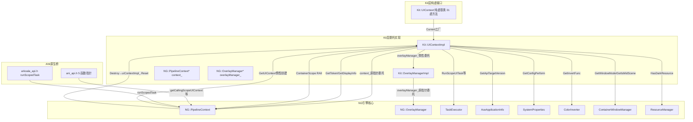

# 特性规格

## 概述

| 属性 | 值 |
|------|-----|
| 特性名称 | UIContext Kit层内部接口与委托实现 |
| 特性编号 | Func-04-12-01-Feat-05 |
| 优先级 | P1 |
| 目标版本 | API 10+ |
| 复杂度 | 标准 |
| 状态 | Baselined |

本 Feat 规格 covers Kit 层 UIContext 内部接口体系与委托实现细节：Kit::UIContext 纯虚基类定义的 31 个虚拟方法（按功能域分为任务调度、页面操作、UI 信息查询、暗色模式/配置、Overlay 管理、管线任务、API 版本、容器模态、生命周期回调、Token/Display/Window、Surface/Fold/Rotation 回调共 11 个域）；Kit::UIContextImpl 持有 NG::PipelineContext* 原指针（context_）并对所有虚拟方法逐一委托，方法内部按需建立 ContainerScope(instanceId) 确保实例路由正确；Kit::OverlayManager / OverlayManagerImpl 四方法委托子体系；PipelineContext::uiContextImpl_ 成员的生命周期绑定（惰性创建 + Destroy 时 Reset）；ANI 原生接口 5 个多实例解析函数指针（getCallingScopeUIContext / getLastFocusedUIContext / getLastForegroundUIContext / getAllInstanceIds / resolveUIContext）+ arkoala_api.h runScopedTask。

本规格严格遵循"实现即规格"原则，所有描述基于 ace_engine 当前源码，不提出任何变更建议。



## 本次变更范围（Delta）

| 类型 | 内容 | 说明 |
|------|------|------|
| ADDED | Kit::UIContext 纯虚基类 31 个虚拟方法定义（ui_context.h:45-102） | 按 11 功能域组织的接口层规格化归档 |
| ADDED | Kit::UIContextImpl 委托实现类（ui_context_impl.h:32-88, ui_context_impl.cpp:38-304） | 持 context_ 原指针全委托 + ContainerScope RAII + 惰性 OverlayManager |
| ADDED | Kit::OverlayManager 纯虚基类 4 方法（overlay_manager.h:28-43） | CloseDialog / GetRootNode / ShowMenu / GetSafeAreaInsets |
| ADDED | Kit::OverlayManagerImpl 委托实现（overlay_manager_impl.h:28-45, overlay_manager_impl.cpp:24-85） | 持 overlayManager_ 原指针全委托 |
| ADDED | PipelineContext::uiContextImpl_ 成员 + GetUIContext() 惰性工厂 + Destroy() Reset（pipeline_context.h:1114,1649, pipeline_context.cpp:7924-7931,6005） | 生命周期绑定与安全降级 |
| ADDED | ANI 原生接口 5 函数指针 + arkoala_api.h runScopedTask（ani_api.h:685-689, arkoala_api.h:9725） | 多实例解析与 scoped task 执行 |
| ADDED | UIContextImpl::Reset() 安全降级模式（ui_context_impl.cpp:53-56） | context_ 置 nullptr 后所有方法 CHECK_NULL 降级 |
| ADDED | API_VERSION_LIMIT = 1000 取模常量（ui_context_impl.cpp:39） | GetApiTargetVersion() % 1000 |

## 输入文档

| 文档 | 版本/日期 | 说明 |
|------|-----------|------|
| `interfaces/inner_api/ace_kit/include/ui/view/ui_context.h` | 2025 | Kit 层 UIContext 纯虚基类完整定义 |
| `interfaces/inner_api/ace_kit/src/view/ui_context_impl.h` | 2025 | Kit 层 UIContextImpl 实现类声明 |
| `interfaces/inner_api/ace_kit/src/view/ui_context_impl.cpp` | 2025 | UIContext::Current() + 所有委托实现 + Reset() |
| `interfaces/inner_api/ace_kit/include/ui/view/overlay/overlay_manager.h` | 2025-2026 | Kit 层 OverlayManager 纯虚基类定义 |
| `interfaces/inner_api/ace_kit/src/view/overlay/overlay_manager_impl.h` | 2025-2026 | Kit 层 OverlayManagerImpl 实现类声明 |
| `interfaces/inner_api/ace_kit/src/view/overlay/overlay_manager_impl.cpp` | 2025-2026 | OverlayManagerImpl 委托实现 + Reset() |
| `frameworks/core/pipeline_ng/pipeline_context.h:1114,1649` | 当前 | GetUIContext() 声明 + uiContextImpl_ 成员 |
| `frameworks/core/pipeline_ng/pipeline_context.cpp:7924-7931` | 当前 | GetUIContext() 惰性初始化实现 |
| `frameworks/core/pipeline_ng/pipeline_context.cpp:6005` | 当前 | Destroy() → uiContextImpl_.Reset() |
| `frameworks/core/interfaces/ani/ani_api.h:685-689` | 当前 | ANI 5 个多实例解析函数指针 |
| `frameworks/core/interfaces/arkoala/arkoala_api.h:9725` | 当前 | runScopedTask 函数指针声明 |
| `test/unittest/interfaces/ace_kit/ui_context_impl_test.cpp` | 当前 | Kit 层 UIContextImpl 单元测试覆盖 |

## 用户故事

| US-ID | 用户故事 | 关联 AC |
|-------|----------|---------|
| US-1 | Kit 层组件开发者通过 UIContext::Current() 获取当前线程 UIContext 后，调用 RunScopeUITask / RunScopeUITaskSync / RunScopeUIDelayedTask 提交任务到 UI 线程，任务执行期间自动建立 ContainerScope(instanceId) 确保实例路由正确 | AC-1.1, AC-1.2 |
| US-2 | Kit 层组件开发者通过 UIContext 接口查询 UI 信息（ColorMode / FontScale / ConfigPerform / HasDarkResource / GetInvertFunc），UIContextImpl 委托到 PipelineContext / AceApplicationInfo / SystemProperties / ResourceManager / ColorInverter，无 context_ 时安全返回默认值 | AC-2.1, AC-2.2 |
| US-3 | Kit 层组件开发者通过 UIContext::GetOverlayManager() 获取 OverlayManager 后调用 CloseDialog / GetRootNode / ShowMenu / GetSafeAreaInsets，OverlayManagerImpl 委托到 NG::OverlayManager | AC-3.1, AC-3.2 |
| US-4 | Kit 层组件开发者通过 UIContext 接口注册/注销 Surface / Fold / Rotation 回调及 WindowSizeChange 监听，UIContextImpl 委托到 PipelineContext 对应方法 | AC-4.1 |
| US-5 | Kit 层组件开发者通过 UIContext 接口获取 Token / DisplayInfo / WindowMode / IsMidScene / IsAccessibilityEnabled，UIContextImpl 对跨子系统查询建立 ContainerScope(instanceId) 确保实例路由 | AC-5.1, AC-5.2 |
| US-6 | 引擎生命周期管理者在 PipelineContext 销毁时调用 Destroy()，触发 uiContextImpl_.Reset() 将 context_ 置 nullptr，UIContextImpl 所有方法通过 CHECK_NULL 安全降级 | AC-6.1, AC-6.2 |
| US-7 | ANI 原生桥开发者通过 ani_api.h 5 个函数指针（getCallingScopeUIContext / getLastFocusedUIContext / getLastForegroundUIContext / getAllInstanceIds / resolveUIContext）和 arkoala_api.h runScopedTask 实现多实例路由与 scoped task 执行 | AC-7.1 |

## 验收追溯

| AC ID | 用户故事 | 验收条件 |
|-------|----------|----------|
| AC-1.1 | US-1 | WHEN 调用 RunScopeUITask(task, name) 且 context_ 非空 THEN 建立 ContainerScope(context_->GetInstanceId()) 后委托 context_->GetTaskExecutor()->PostTask(task, UI, name) |
| AC-1.2 | US-1 | WHEN 调用 RunScopeUITaskSync 且 context_ 为 nullptr THEN CHECK_NULL_VOID(context_) 跳过操作，不崩溃 |
| AC-2.1 | US-2 | WHEN 调用 GetColorMode() 且 context_ 非空 THEN 委托 context_->GetColorMode() 返回 static_cast\<ColorMode>(值) |
| AC-2.2 | US-2 | WHEN 调用 GetFontScale() 且 context_ 为 nullptr THEN CHECK_NULL_RETURN(context_, 1.0f) 返回默认值 |
| AC-3.1 | US-3 | WHEN 调用 GetOverlayManager() THEN 首次创建 OverlayManagerImpl(context_) 并缓存 overlayManager_，后续返回缓存 |
| AC-3.2 | US-3 | WHEN 调用 OverlayManagerImpl::CloseDialog(dialogNode) THEN DynamicCast 为 FrameNodeImpl 获取 aceNode 后委托 overlayManager_->CloseDialog(aceNode) |
| AC-4.1 | US-4 | WHEN 调用 RegisterSurfaceChangedCallback(callback) THEN 委托 context_->RegisterSurfaceChangedCallback(std::move(callback)) 返回 callbackId |
| AC-5.1 | US-5 | WHEN 调用 GetToken() 且 context_ 非空 THEN 建立 ContainerScope(context_->GetInstanceId()) 后委托 Container::Current()->GetToken() |
| AC-5.2 | US-5 | WHEN 调用 GetToken() 且 context_ 为 nullptr THEN CHECK_NULL_RETURN(context_, nullptr) |
| AC-6.1 | US-6 | WHEN PipelineContext::Destroy() 被调用 THEN uiContextImpl_.Reset() 将 context_ 置 nullptr |
| AC-6.2 | US-6 | WHEN Reset() 后调用 GetInstanceId() THEN CHECK_NULL_RETURN(context_, -1) |
| AC-7.1 | US-7 | WHEN ANI 前端调用 getCallingScopeUIContext(instanceId&) THEN 通过 ContainerScope::CurrentIdWithReason() 解析当前活跃实例 |

## 规则定义

### R-1: UIContextImpl 纯委托门面不持业务状态

**类型**: 行为

UIContextImpl 仅持 context_(NG::PipelineContext* 原指针) 和 overlayManager_(RefPtr\<OverlayManager> 惰性缓存)，不持有业务逻辑状态。所有方法委托到 PipelineContext / AceApplicationInfo / SystemProperties / ColorInverter / ResourceManager / Container 等引擎子系统。

来源验证：`ui_context_impl.h:86-87`（context_ = nullptr + overlayManager_ 两私有成员），`ui_context_impl.cpp:58-304`（全方法 CHECK_NULL + 委托实现）。

### R-2: context_ 可 nullptr 安全降级（void 方法跳过、有返回值方法返回默认值）

**类型**: 边界

Reset() 或 PipelineContext 销毁后 context_ 为 nullptr，所有 void 返回方法通过 CHECK_NULL_VOID(context_) 跳过操作；有返回值方法通过 CHECK_NULL_RETURN 返回以下默认值：
- GetLocalColorMode / GetColorMode → ColorMode::COLOR_MODE_UNDEFINED
- GetFontScale → 1.0f
- GetInstanceId → -1
- GetOverlayManager → nullptr
- GetApiTargetVersion → AceApplicationInfo::GetInstance().GetApiTargetVersion() % API_VERSION_LIMIT（不依赖 context_）
- GetContainerModalTitleHeight / GetContainerModalButtonsWidth → 0
- GetContainerModalButtonsOffset → OffsetF()（默认构造）
- GetToken → nullptr
- GetDisplayInfo → nullptr
- GetWindowMode → WindowMode::WINDOW_MODE_UNDEFINED
- GetIsMidScene → false
- RegisterSurfaceChangedCallback / RegisterFoldStatusChangedCallback / RegisterRotationEndCallback → 0

来源验证：`ui_context_impl.cpp:53-56`（Reset() 置 nullptr），`ui_context_impl.cpp:60`（RunScopeUITaskSync CHECK_NULL_VOID），`ui_context_impl.cpp:98`（GetLocalColorMode CHECK_NULL_RETURN UNDEFINED），`ui_context_impl.cpp:110`（GetFontScale CHECK_NULL_RETURN 1.0f），`ui_context_impl.cpp:277-281`（GetInstanceId CHECK_NULL_RETURN -1），`ui_context_impl.cpp:232-233`（RegisterSurfaceChangedCallback CHECK_NULL_RETURN 0）。

### R-3: 任务调度三方法内部建立 ContainerScope(instanceId) 确保实例路由

**类型**: 行为

RunScopeUITaskSync / RunScopeUITask / RunScopeUIDelayedTask 三方法内部建立 ContainerScope(context_->GetInstanceId()) RAII，任务执行期间 currentId_ 切换到对应 instanceId，结束后自动恢复。

来源验证：`ui_context_impl.cpp:58-65`（RunScopeUITaskSync ContainerScope scope），`ui_context_impl.cpp:67-74`（RunScopeUITask ContainerScope scope），`ui_context_impl.cpp:76-83`（RunScopeUIDelayedTask ContainerScope scope）。

### R-4: RunScopeUITaskSync 委托 PostSyncTask

**类型**: 行为

RunScopeUITaskSync 委托 context_->GetTaskExecutor()->PostSyncTask(task, TaskExecutor::TaskType::UI, name)，同步执行任务。

来源验证：`ui_context_impl.cpp:58-65`。

### R-5: RunScopeUITask 委托 PostTask

**类型**: 行为

RunScopeUITask 委托 context_->GetTaskExecutor()->PostTask(task, TaskExecutor::TaskType::UI, name)，异步投递任务。

来源验证：`ui_context_impl.cpp:67-74`。

### R-6: RunScopeUIDelayedTask 委托 PostDelayedTask

**类型**: 行为

RunScopeUIDelayedTask 委托 context_->GetTaskExecutor()->PostDelayedTask(task, TaskExecutor::TaskType::UI, delayTime, name)，延迟投递任务。

来源验证：`ui_context_impl.cpp:76-83`。

### R-7: OnBackPressed 双层回退逻辑

**类型**: 行为

OnBackPressed 先委托 context_->OnBackPressed() 尧行内返回逻辑（StageManager / TextManager / BackPressHandler / Frontend），若结果为 false 则回退到 EngineHelper::GetCurrentDelegate()->Back("")。

来源验证：`ui_context_impl.cpp:85-94`。

### R-8: OnBackPressed context_ 为 nullptr 时跳过

**类型**: 异常

CHECK_NULL_VOID(context_) 跳过 OnBackPressed 整体操作，不回退到 EngineHelper。

来源验证：`ui_context_impl.cpp:85-87`。

### R-9: GetLocalColorMode 委托 context_->GetLocalColorMode() + static_cast

**类型**: 行为

GetLocalColorMode 委托 context_->GetLocalColorMode() 并 static_cast\<ColorMode> 转换，因 NG::PipelineContext 返回 Ace::ColorMode 而 Kit 层期望 Kit::ColorMode。

来源验证：`ui_context_impl.cpp:96-100`。

### R-10: GetColorMode 同 static_cast 模式

**类型**: 行为

GetColorMode 委托 context_->GetColorMode() + static_cast\<ColorMode> 转换。

来源验证：`ui_context_impl.cpp:102-106`。

### R-11: GetFontScale 委托 context_->GetFontScale()

**类型**: 行为

直接委托 context_->GetFontScale() 返回 float，默认值 1.0f。

来源验证：`ui_context_impl.cpp:108-112`。

### R-12: GetConfigPerform 委托 SystemProperties::ConfigChangePerform()

**类型**: 行为

GetConfigPerform 不依赖 context_，委托全局 SystemProperties::ConfigChangePerform()。

来源验证：`ui_context_impl.cpp:272-275`。

### R-13: HasDarkResource 双路径查询

**类型**: 行为

HasDarkResource 查 ResourceManager::GetInstance().GetOrCreateResourceAdapter(resObj) 获取 resourceAdapter：
- 当 resId == -1 且 params 非空且 params.back().value 有值时：StringUtils::StringSplitter 按 '.' 分割后调 resourceAdapter->ExistDarkResByName(splitter.back(), type)
- 否则调 resourceAdapter->ExistDarkResById(std::to_string(resId))

resObj 为 nullptr 时直接返回 false。

来源验证：`ui_context_impl.cpp:283-298`。

### R-14: GetInvertFunc 委托 ColorInverter::GetInstance().GetInvertFunc(instanceId, nodeTag)

**类型**: 行为

GetInvertFunc 不依赖 context_，委托全局 ColorInverter::GetInstance().GetInvertFunc(instanceId, nodeTag) 返回 std::function\<uint32_t(uint32_t)>。

来源验证：`ui_context_impl.cpp:301-304`。

### R-15: GetOverlayManager 惰性创建 OverlayManagerImpl

**类型**: 行为

GetOverlayManager 首次调用时 MakeRefPtr\<OverlayManagerImpl>(context_) 创建并缓存 overlayManager_，后续直接返回缓存。context_ 为 nullptr 时 CHECK_NULL_RETURN(context_, nullptr)。

来源验证：`ui_context_impl.cpp:114-122`。

### R-16: AddAfterLayoutTask 委托 context_->AddAfterLayoutTask(std::move(task), isFlushInImplicitAnimationTask)

**类型**: 行为

AddAfterLayoutTask 委托 PipelineContext 对应方法，isFlushInImplicitAnimationTask 参数透传，默认值 false。

来源验证：`ui_context_impl.cpp:132-136`。

### R-17: RequestFrame 委托 context_->RequestFrame()

**类型**: 行为

直接委托 PipelineContext::RequestFrame()。

来源验证：`ui_context_impl.cpp:138-142`。

### R-18: GetApiTargetVersion 取模 API_VERSION_LIMIT = 1000

**类型**: 边界

GetApiTargetVersion 不依赖 context_，委托 AceApplicationInfo::GetInstance().GetApiTargetVersion() % API_VERSION_LIMIT。API_VERSION_LIMIT = 1000 定义在 ui_context_impl.cpp:39。负值取模行为依赖 C++ 实现（-10 % 1000 = -10）。

来源验证：`ui_context_impl.cpp:39,144-147`。

### R-19: GreatOrEqualTargetAPIVersion 委托 AceApplicationInfo::GetInstance().GreatOrEqualTargetAPIVersion(static_cast\<PlatformVersion>(version))

**类型**: 行为

GreatOrEqualTargetAPIVersion 不依赖 context_，委托 AceApplicationInfo::GetInstance().GreatOrEqualTargetAPIVersion()。注意 GetApiTargetVersion 先取模再比较，GreatOrEqualTargetAPIVersion 直接委托 AceApplicationInfo 原值比较。

来源验证：`ui_context_impl.cpp:149-152`。

### R-20: GetContainerModalTitleHeight 委托 context_->GetContainerModalTitleHeight()

**类型**: 行为

GetContainerModalTitleHeight 委托 PipelineContext 对应方法，context_ 为 nullptr 返回 0。

来源验证：`ui_context_impl.cpp:154-158`。

### R-21: GetContainerModalButtonsWidth 从 GetContainerModalButtonsRect 提取

**类型**: 行为

GetContainerModalButtonsWidth 调用 context_->GetContainerModalButtonsRect(containerModal, buttonsRect) 获取 buttonsRect 后返回 static_cast\<int32_t>(buttonsRect.Width())。context_ 为 nullptr 返回 0。

来源验证：`ui_context_impl.cpp:160-167`。

### R-22: GetContainerModalButtonsOffset 从 GetContainerModalButtonsRect 提取

**类型**: 行为

GetContainerModalButtonsOffset 调用 context_->GetContainerModalButtonsRect(containerModal, buttonsRect) 后返回 buttonsRect.GetOffset()。context_ 为 nullptr 返回默认构造的 OffsetF()。

来源验证：`ui_context_impl.cpp:181-188`。

### R-23: RegisterArkUIObjectLifecycleCallback / UnregisterArkUIObjectLifecycleCallback 委托 context_

**类型**: 行为

Register 委托 context_->RegisterArkUIObjectLifecycleCallback(std::move(callback))，Unregister 委托 context_->UnregisterArkUIObjectLifecycleCallback()。context_ 为 nullptr 时 CHECK_NULL_VOID 跳过。

来源验证：`ui_context_impl.cpp:169-179`。

### R-24: GetToken 建立 ContainerScope(instanceId) 后委托 Container::Current()->GetToken()

**类型**: 行为

GetToken 建立 ContainerScope(context_->GetInstanceId()) 后通过 Container::Current() 获取 Container 再调 GetToken()。Container 为 nullptr 时返回 nullptr。

来源验证：`ui_context_impl.cpp:190-197`。

### R-25: GetDisplayInfo 建立 ContainerScope(instanceId) 后委托 Container::Current()->GetDisplayInfo()

**类型**: 行为

GetDisplayInfo 建立 ContainerScope(context_->GetInstanceId()) 后通过 Container::Current() 获取 Container 再调 GetDisplayInfo()。Container 为 nullptr 时返回 nullptr。

来源验证：`ui_context_impl.cpp:199-206`。

### R-26: GetWindowMode 委托 context_->GetWindowManager()->GetWindowMode()

**类型**: 行为

GetWindowMode 不建立 ContainerScope，通过 context_->GetWindowManager() 获取 WindowManager 后调 GetWindowMode()。WindowManager 为 nullptr 时返回 WINDOW_MODE_UNDEFINED。

来源验证：`ui_context_impl.cpp:208-214`。

### R-27: GetIsMidScene 委托 context_->GetWindowManager()->GetIsMidScene(isMidScene)

**类型**: 行为

GetIsMidScene 不建立 ContainerScope，通过 context_->GetWindowManager() 获取 WindowManager 后调 GetIsMidScene(isMidScene) 写入 bool 并返回。WindowManager 为 nullptr 时返回 false。

来源验证：`ui_context_impl.cpp:215-223`。

### R-28: IsAccessibilityEnabled 委托 AceApplicationInfo::GetInstance().IsAccessibilityEnabled()

**类型**: 行为

IsAccessibilityEnabled 不依赖 context_，委托全局 AceApplicationInfo::GetInstance().IsAccessibilityEnabled()。

来源验证：`ui_context_impl.cpp:224-227`。

### R-29: Register/Unregister Surface/Fold/Rotation 回调委托 context_ 对应方法

**类型**: 行为

七个 Surface/Fold/Rotation 回调方法直接委托 PipelineContext 对应方法：
- RegisterSurfaceChangedCallback → context_->RegisterSurfaceChangedCallback(std::move(callback)) 返回 callbackId
- UnregisterSurfaceChangedCallback → context_->UnregisterSurfaceChangedCallback(callbackId)
- RegisterFoldStatusChangedCallback → context_->RegisterFoldStatusChangedCallback(std::move(callback)) 返回 callbackId
- UnRegisterFoldStatusChangedCallback → context_->UnRegisterFoldStatusChangedCallback(callbackId)
- RegisterRotationEndCallback → context_->RegisterRotationEndCallback(std::move(callback)) 返回 callbackId
- UnregisterRotationEndCallback → context_->UnregisterRotationEndCallback(callbackId)
- AddWindowSizeChangeCallback → context_->AddWindowSizeChangeCallback(nodeId)

来源验证：`ui_context_impl.cpp:229-270`。

### R-30: Surface/Fold/Rotation 回调 context_ 为 nullptr 时安全降级

**类型**: 边界

Register 类方法 CHECK_NULL_RETURN(context_, 0) 返回 0 作为无效 callbackId；Unregister 类 void 方法 CHECK_NULL_VOID(context_) 跳过；AddWindowSizeChangeCallback CHECK_NULL_VOID(context_) 跳过。

来源验证：`ui_context_impl.cpp:232`（RegisterSurfaceChangedCallback），`ui_context_impl.cpp:238`（UnregisterSurfaceChangedCallback），`ui_context_impl.cpp:266-269`（AddWindowSizeChangeCallback）。

### R-31: OverlayManagerImpl::CloseDialog DynamicCast FrameNodeImpl 桥接

**类型**: 行为

CloseDialog(RefPtr\<FrameNode>& dialogNode) 先 DynamicCast\<FrameNodeImpl>(dialogNode) 获取 aceNode（NG::FrameNode*），再委托 overlayManager_->CloseDialog(aceNode)。dialogNode 为 nullptr 或 DynamicCast 失败时 CHECK_NULL_VOID 跳过。

来源验证：`overlay_manager_impl.cpp:43-52`。

### R-32: OverlayManagerImpl::GetRootNode 桥接 NG::UINode → Kit::FrameNode

**类型**: 行为

GetRootNode() 调用 overlayManager_->GetRootNode().Upgrade() 获取 strongNode，再通过 FrameNode::GetFrameNode(reinterpret_cast\<ArkUINodeHandle>(DynamicCast\<NG::FrameNode>(strongNode).GetRawPtr())) 转换为 Kit::FrameNode。overlayManager_ 为 nullptr 返回 nullptr。

来源验证：`overlay_manager_impl.cpp:54-62`。

### R-33: OverlayManagerImpl::ShowMenu DynamicCast 桥接

**类型**: 行为

ShowMenu(targetId, offset, RefPtr\<FrameNode>& menu) 先 DynamicCast\<FrameNodeImpl>(menu) 获取 aceMenuNode，再委托 overlayManager_->ShowMenu(targetId, offset, aceMenuNode)。menu 为 nullptr 或 DynamicCast 失败时 CHECK_NULL_VOID 跳过。

来源验证：`overlay_manager_impl.cpp:64-73`。

### R-34: OverlayManagerImpl::GetSafeAreaInsets DynamicCast 桥接

**类型**: 行为

GetSafeAreaInsets(RefPtr\<FrameNode>& frameNode, bool useCurrentWindow) 先 DynamicCast\<FrameNodeImpl>(frameNode) 获取 aceFrameNode，再委托 overlayManager_->GetSafeAreaInsets(aceFrameNode, useCurrentWindow)。frameNode 为 nullptr 或 DynamicCast 失败时返回默认构造 SafeAreaInsets{}。

来源验证：`overlay_manager_impl.cpp:75-84`。

### R-35: OverlayManagerImpl 构造时从 context_ 获取 NG::OverlayManager 原指针

**类型**: 行为

OverlayManagerImpl 构造器调用 context->GetOverlayManager() 并 AceType::RawPtr() 转为 NG::OverlayManager* 存入 overlayManager_。context 为 nullptr 时 overlayManager_ 保持 nullptr。

来源验证：`overlay_manager_impl.cpp:26-31`。

### R-36: OverlayManagerImpl::Reset() 置 overlayManager_ 为 nullptr

**类型**: 恢复

Reset() 将 overlayManager_ = nullptr，析构函数调用 Reset() 确保 overlayManager_ 释放。

来源验证：`overlay_manager_impl.cpp:38-41`。

### R-37: PipelineContext::GetUIContext() 惰性单次创建

**类型**: 行为

首次调用 PipelineContext::GetUIContext() 时 MakeRefPtr\<Kit::UIContextImpl>(this) 创建并缓存到 uiContextImpl_，后续调用直接返回 uiContextImpl_ 而不重新创建。

来源验证：`pipeline_context.cpp:7924-7931`，`pipeline_context.h:1649`（RefPtr\<Kit::UIContextImpl> uiContextImpl_）。

### R-38: PipelineContext::Destroy() → uiContextImpl_.Reset()

**类型**: 恢复

PipelineContext::Destroy() 调用 uiContextImpl_.Reset()，触发 UIContextImpl::Reset() 将 context_ 置 nullptr，UIContextImpl 进入安全降级状态。

来源验证：`pipeline_context.cpp:6005`。

### R-39: UIContextImpl::GetPipelineContext() 返回 AceType::Claim(context_)

**类型**: 行为

GetPipelineContext() 当 context_ 非空时返回 AceType::Claim(context_) 包装为 RefPtr\<PipelineBase>，context_ 为 nullptr 返回 nullptr。

来源验证：`ui_context_impl.cpp:124-130`。

### R-40: ANI 5 函数指针多实例解析

**类型**: 行为

ani_api.h:685-689 定义 5 个函数指针用于多实例解析：
- getCallingScopeUIContext(int32_t& instance)：获取当前调用域实例 ID
- getLastFocusedUIContext(int32_t& instance)：获取最后聚焦实例 ID
- getLastForegroundUIContext(int32_t& instance)：获取最后前台实例 ID
- getAllInstanceIds(std::vector\<int32_t>& instance)：获取所有实例 ID 列表
- resolveUIContext(std::vector\<int32_t>& instance)：解析实例上下文

来源验证：`ani_api.h:685-689`。

### R-41: arkoala_api.h runScopedTask(instanceId, userData, callback)

**类型**: 行为

arkoala_api.h:9725 定义 runScopedTask(ArkUI_Int32 instanceId, void* userData, void (*callback)(void* userData)) 函数指针，在指定 instanceId 作用域内执行 callback。

来源验证：`arkoala_api.h:9725`。

### R-42: UIContext::Current() 通过 PipelineContext::GetCurrentContextSafelyWithCheck() 获取 Pipeline

**类型**: 行为

UIContext::Current() 调用 NG::PipelineContext::GetCurrentContextSafelyWithCheck()，若返回 nullptr 则 UIContext::Current() 返回 nullptr；否则返回 pipeline->GetUIContext()。

来源验证：`ui_context_impl.cpp:41-46`。

### R-43: UIContextImpl 析构调用 Reset()

**类型**: 恢复

UIContextImpl 析构函数调用 Reset() 确保 context_ 置 nullptr。

来源验证：`ui_context_impl.cpp:48-51`。

### R-44: GetInstanceId 当 context_ 为 nullptr 返回 -1

**类型**: 边界

CHECK_NULL_RETURN(context_, -1) 返回值等于 INSTANCE_ID_UNDEFINED。

来源验证：`ui_context_impl.cpp:277-281`。

### R-45: HasDarkResource(resObj == nullptr) 返回 false

**类型**: 异常

resObj 为 nullptr 时直接返回 false，不尝试 GetOrCreateResourceAdapter。

来源验证：`ui_context_impl.cpp:283-287`。

## 验证映射

| VM-ID | 验证方法 | 关联 US/AC/R | 验证重点 |
|-------|----------|-------------|----------|
| VM-1 | 单元测试 | US-1/AC-1.1/R-3,R-4 | RunScopeUITaskSync 委托 PostSyncTask + ContainerScope |
| VM-2 | 单元测试 | US-1/AC-1.2/R-2 | RunScopeUITaskSync context_=nullptr 时 CHECK_NULL_VOID 跳过 |
| VM-3 | 单元测试 | US-1/R-5,R-6 | RunScopeUITask 委托 PostTask + RunScopeUIDelayedTask 委托 PostDelayedTask |
| VM-4 | 单元测试 | US-2/AC-2.1/R-9,R-10 | GetLocalColorMode/GetColorMode 委托 + static_cast |
| VM-5 | 单元测试 | US-2/AC-2.2/R-2 | GetFontScale context_=nullptr 返回 1.0f |
| VM-6 | 单元测试 | US-2/R-12 | GetConfigPerform 委托 SystemProperties::ConfigChangePerform |
| VM-7 | 单元测试 | US-2/R-18 | GetApiTargetVersion % API_VERSION_LIMIT 取模运算 |
| VM-8 | 单元测试 | US-2/R-19 | GreatOrEqualTargetAPIVersion 委托 AceApplicationInfo |
| VM-9 | 单元测试 | US-2/R-44 | GetInstanceId context_=nullptr 返回 -1 |
| VM-10 | 单元测试 | US-2/R-45 | HasDarkResource(nullptr) 返回 false |
| VM-11 | 单元测试 | US-2/R-14 | GetInvertFunc 委托 ColorInverter |
| VM-12 | 代码审查 | US-3/AC-3.1/R-15 | GetOverlayManager 惰性创建 OverlayManagerImpl |
| VM-13 | 代码审查 | US-3/AC-3.2/R-31,R-32,R-33,R-34 | OverlayManagerImpl 四方法 DynamicCast 桥接 + 委托 |
| VM-14 | 单元测试 | US-4/AC-4.1/R-29 | RegisterSurfaceChangedCallback/FoldStatusChangedCallback/RotationEndCallback 委托 |
| VM-15 | 单元测试 | US-5/AC-5.1/R-24,R-25 | GetToken/GetDisplayInfo ContainerScope + Container::Current() |
| VM-16 | 单元测试 | US-5/AC-5.2/R-2 | GetToken context_=nullptr 返回 nullptr |
| VM-17 | 单元测试 | US-5/R-26,R-27 | GetWindowMode/GetIsMidScene 委托 WindowManager |
| VM-18 | 单元测试 | US-5/R-28 | IsAccessibilityEnabled 委托 AceApplicationInfo |
| VM-19 | 代码审查 | US-6/AC-6.1/R-38 | PipelineContext::Destroy() → uiContextImpl_.Reset() |
| VM-20 | 单元测试 | US-6/AC-6.2/R-2 | Reset 后 GetInstanceId=-1, GetColorMode=UNDEFINED, GetFontScale=1.0f |
| VM-21 | 代码审查 | US-7/AC-7.1/R-40 | ANI 5 函数指针多实例解析 |
| VM-22 | 代码审查 | US-7/R-41 | arkoala_api.h runScopedTask |
| VM-23 | 代码审查 | US-1/R-42 | UIContext::Current() 工厂逻辑 |
| VM-24 | 代码审查 | R-37 | GetUIContext() 惰性单次创建 |
| VM-25 | 代码审查 | R-7,R-8 | OnBackPressed 双层回退 + nullptr 跳过 |
| VM-26 | 代码审查 | R-20,R-21,R-22 | ContainerModal 三方法委托 |
| VM-27 | 代码审查 | R-35,R-36 | OverlayManagerImpl 构造获取原指针 + Reset |
| VM-28 | 代码审查 | R-13 | HasDarkResource 双路径（byName/byId） |
| VM-29 | 代码审查 | R-39 | GetPipelineContext() AceType::Claim 包装 |

## API 变更分析

### 新增 API

本特性不新增 API。所有描述的 API 已存在于当前代码库，本规格仅是对既有 Kit 层内部接口与委托实现的规格化归档。

### 变更/废弃 API

无变更或废弃 API。本特性纯规格归档，不涉及 API 签名变化。

## 接口规格

### 接口定义

#### Kit::UIContext 纯虚基类

来源：`interfaces/inner_api/ace_kit/include/ui/view/ui_context.h:45-102`

```cpp
namespace OHOS::Ace::Kit {

using Task = std::function<void()>;
using ArkUIObjectLifecycleCallback = std::function<void(void*)>;

class ACE_FORCE_EXPORT UIContext : public AceType {
    DECLARE_ACE_TYPE(UIContext, AceType);
public:
    static RefPtr<UIContext> Current();

    virtual void RunScopeUITaskSync(Task&& task, const std::string& name) = 0;
    virtual void RunScopeUITask(Task&& task, const std::string& name) = 0;
    virtual void RunScopeUIDelayedTask(Task&& task, const std::string& name, uint32_t delayTime) = 0;

    virtual void OnBackPressed() = 0;

    virtual ColorMode GetLocalColorMode() = 0;
    virtual ColorMode GetColorMode() = 0;
    virtual float GetFontScale() = 0;

    virtual bool GetConfigPerform() = 0;
    virtual int32_t GetInstanceId() = 0;
    virtual bool HasDarkResource(const RefPtr<ResourceObject>& resObj) = 0;
    using ColorInvertFunc = std::function<uint32_t(uint32_t)>;
    virtual ColorInvertFunc GetInvertFunc(int32_t instanceId, const std::string& nodeTag) = 0;

    virtual RefPtr<OverlayManager> GetOverlayManager() = 0;

    virtual void AddAfterLayoutTask(Task&& task, bool isFlushInImplicitAnimationTask = false) = 0;
    virtual void RequestFrame() = 0;

    virtual int32_t GetApiTargetVersion() = 0;
    virtual bool GreatOrEqualTargetAPIVersion(int32_t version) = 0;
    virtual int32_t GetContainerModalTitleHeight() = 0;
    virtual int32_t GetContainerModalButtonsWidth() = 0;
    virtual NG::OffsetF GetContainerModalButtonsOffset() = 0;
    virtual void RegisterArkUIObjectLifecycleCallback(ArkUIObjectLifecycleCallback&& callback) = 0;
    virtual void UnregisterArkUIObjectLifecycleCallback() = 0;

    virtual sptr<IRemoteObject> GetToken() = 0;

    virtual RefPtr<DisplayInfo> GetDisplayInfo() = 0;
    virtual WindowMode GetWindowMode() = 0;
    virtual bool GetIsMidScene() = 0;
    virtual bool IsAccessibilityEnabled() = 0;

    virtual int32_t RegisterSurfaceChangedCallback(
        std::function<void(int32_t, int32_t, int32_t, int32_t, WindowSizeChangeReason)>&& callback) = 0;
    virtual void UnregisterSurfaceChangedCallback(int32_t callbackId) = 0;
    virtual int32_t RegisterFoldStatusChangedCallback(std::function<void(FoldStatus)>&& callback) = 0;
    virtual void UnRegisterFoldStatusChangedCallback(int32_t callbackId) = 0;
    virtual int32_t RegisterRotationEndCallback(std::function<void()>&& callback) = 0;
    virtual void UnregisterRotationEndCallback(int32_t callbackId) = 0;
    virtual void AddWindowSizeChangeCallback(int32_t nodeId) = 0;
};

}
```

#### Kit::UIContextImpl 委托实现类

来源：`interfaces/inner_api/ace_kit/src/view/ui_context_impl.h:32-88`

```cpp
namespace OHOS::Ace::Kit {

class UIContextImpl : public UIContext {
    DECLARE_ACE_TYPE(UIContextImpl, UIContext);
public:
    UIContextImpl(NG::PipelineContext* context) : context_(context) {}
    ~UIContextImpl();

    void Reset();
    RefPtr<PipelineBase> GetPipelineContext();

    void RunScopeUITaskSync(Task&& task, const std::string& name) override;
    void RunScopeUITask(Task&& task, const std::string& name) override;
    void RunScopeUIDelayedTask(Task&& task, const std::string& name, uint32_t delayTime) override;

    void OnBackPressed() override;

    ColorMode GetLocalColorMode() override;
    ColorMode GetColorMode() override;
    float GetFontScale() override;

    bool GetConfigPerform() override;
    int32_t GetInstanceId() override;
    bool HasDarkResource(const RefPtr<ResourceObject>& resObj) override;
    ColorInvertFunc GetInvertFunc(int32_t instanceId, const std::string& nodeTag) override;

    RefPtr<OverlayManager> GetOverlayManager() override;

    void AddAfterLayoutTask(Task&& task, bool isFlushInImplicitAnimationTask = false) override;
    void RequestFrame() override;

    int32_t GetApiTargetVersion() override;
    bool GreatOrEqualTargetAPIVersion(int32_t version) override;
    int32_t GetContainerModalTitleHeight() override;
    int32_t GetContainerModalButtonsWidth() override;
    NG::OffsetF GetContainerModalButtonsOffset() override;
    void RegisterArkUIObjectLifecycleCallback(ArkUIObjectLifecycleCallback&& callback) override;
    void UnregisterArkUIObjectLifecycleCallback() override;
    sptr<IRemoteObject> GetToken() override;

    RefPtr<DisplayInfo> GetDisplayInfo() override;
    WindowMode GetWindowMode() override;
    bool GetIsMidScene() override;
    bool IsAccessibilityEnabled() override;

    int32_t RegisterSurfaceChangedCallback(
        std::function<void(int32_t, int32_t, int32_t, int32_t, WindowSizeChangeReason)>&& callback) override;
    void UnregisterSurfaceChangedCallback(int32_t callbackId) override;
    int32_t RegisterFoldStatusChangedCallback(std::function<void(FoldStatus)>&& callback) override;
    void UnRegisterFoldStatusChangedCallback(int32_t callbackId) override;
    int32_t RegisterRotationEndCallback(std::function<void()>&& callback) override;
    void UnregisterRotationEndCallback(int32_t callbackId) override;
    void AddWindowSizeChangeCallback(int32_t nodeId) override;

private:
    NG::PipelineContext* context_ = nullptr;
    RefPtr<OverlayManager> overlayManager_;
};

}
```

#### UIContext::Current() 工厂

来源：`interfaces/inner_api/ace_kit/src/view/ui_context_impl.cpp:41-46`

```cpp
RefPtr<UIContext> UIContext::Current()
{
    const auto& pipeline = NG::PipelineContext::GetCurrentContextSafelyWithCheck();
    CHECK_NULL_RETURN(pipeline, nullptr);
    return pipeline->GetUIContext();
}
```

#### API_VERSION_LIMIT 常量

来源：`interfaces/inner_api/ace_kit/src/view/ui_context_impl.cpp:39`

```cpp
constexpr int32_t API_VERSION_LIMIT = 1000;
```

#### Kit::OverlayManager 纯虚基类

来源：`interfaces/inner_api/ace_kit/include/ui/view/overlay/overlay_manager.h:28-43`

```cpp
namespace OHOS::Ace::Kit {

class OverlayManager : public AceType {
    DECLARE_ACE_TYPE(OverlayManager, AceType);
public:
    virtual void CloseDialog(RefPtr<FrameNode>& dialogNode) = 0;
    virtual WeakPtr<FrameNode> GetRootNode() const = 0;
    virtual void ShowMenu(const int32_t targetId, const NG::OffsetF& offset, RefPtr<FrameNode>& menu) = 0;
    virtual NG::SafeAreaInsets GetSafeAreaInsets(
        const RefPtr<FrameNode>& frameNode, bool useCurrentWindow = false) = 0;
};

}
```

#### Kit::OverlayManagerImpl 委托实现类

来源：`interfaces/inner_api/ace_kit/src/view/overlay/overlay_manager_impl.h:28-45`

```cpp
namespace OHOS::Ace::Kit {

class OverlayManagerImpl : public OverlayManager {
    DECLARE_ACE_TYPE(OverlayManagerImpl, OverlayManager);
public:
    OverlayManagerImpl(NG::PipelineContext* context);
    ~OverlayManagerImpl();

    void Reset();

    void CloseDialog(RefPtr<FrameNode>& dialogNode) override;
    WeakPtr<FrameNode> GetRootNode() const override;
    void ShowMenu(const int32_t targetId, const NG::OffsetF& offset, RefPtr<FrameNode>& menu) override;
    NG::SafeAreaInsets GetSafeAreaInsets(const RefPtr<FrameNode>& frameNode, bool useCurrentWindow = false) override;
private:
    NG::OverlayManager* overlayManager_ = nullptr;
};

}
```

#### PipelineContext::GetUIContext() 惰性工厂

来源：`frameworks/core/pipeline_ng/pipeline_context.cpp:7924-7931`

```cpp
RefPtr<Kit::UIContext> PipelineContext::GetUIContext()
{
    if (uiContextImpl_) {
        return uiContextImpl_;
    }
    uiContextImpl_ = AceType::MakeRefPtr<Kit::UIContextImpl>(this);
    return uiContextImpl_;
}
```

PipelineContext 成员：`frameworks/core/pipeline_ng/pipeline_context.h:1649`

```cpp
RefPtr<Kit::UIContextImpl> uiContextImpl_;
```

#### PipelineContext::Destroy() → uiContextImpl_.Reset()

来源：`frameworks/core/pipeline_ng/pipeline_context.cpp:6005`

```cpp
uiContextImpl_.Reset();
PipelineBase::Destroy();
```

#### ANI 原生接口 5 函数指针

来源：`frameworks/core/interfaces/ani/ani_api.h:685-689`

```cpp
void(*getCallingScopeUIContext)(int32_t& instance);
void(*getLastFocusedUIContext)(int32_t& instance);
void(*getLastForegroundUIContext)(int32_t& instance);
void(*getAllInstanceIds)(std::vector<int32_t>& instance);
void(*resolveUIContext)(std::vector<int32_t>& instance);
```

#### arkoala_api.h runScopedTask 函数指针

来源：`frameworks/core/interfaces/arkoala/arkoala_api.h:9725`

```cpp
void (*runScopedTask)(ArkUI_Int32 instanceId, void* userData, void (*callback)(void* userData));
```

#### UIContextImpl 关键委托实现摘要

来源：`interfaces/inner_api/ace_kit/src/view/ui_context_impl.cpp:58-304`

| 方法 | 委托目标 | ContainerScope | context_=nullptr 默认值 |
|------|----------|---------------|------------------------|
| RunScopeUITaskSync | context_->GetTaskExecutor()->PostSyncTask(UI, name) | scope(context_->GetInstanceId()) | CHECK_NULL_VOID 跳过 |
| RunScopeUITask | context_->GetTaskExecutor()->PostTask(UI, name) | scope(context_->GetInstanceId()) | CHECK_NULL_VOID 跳过 |
| RunScopeUIDelayedTask | context_->GetTaskExecutor()->PostDelayedTask(UI, delayTime, name) | scope(context_->GetInstanceId()) | CHECK_NULL_VOID 跳过 |
| OnBackPressed | context_->OnBackPressed(); 若 false → EngineHelper::GetCurrentDelegate()->Back("") | 无 | CHECK_NULL_VOID 跳过 |
| GetLocalColorMode | static_cast\<ColorMode>(context_->GetLocalColorMode()) | 无 | COLOR_MODE_UNDEFINED |
| GetColorMode | static_cast\<ColorMode>(context_->GetColorMode()) | 无 | COLOR_MODE_UNDEFINED |
| GetFontScale | context_->GetFontScale() | 无 | 1.0f |
| GetConfigPerform | SystemProperties::ConfigChangePerform() | 无 | 不依赖 context_ |
| GetInstanceId | context_->GetInstanceId() | 无 | -1 |
| HasDarkResource | ResourceManager::GetOrCreateResourceAdapter(resObj) 双路径 | 无 | false(resObj=nullptr) |
| GetInvertFunc | ColorInverter::GetInstance().GetInvertFunc(instanceId, nodeTag) | 无 | 不依赖 context_ |
| GetOverlayManager | MakeRefPtr\<OverlayManagerImpl>(context_) 惰性缓存 | 无 | nullptr |
| AddAfterLayoutTask | context_->AddAfterLayoutTask(std::move(task), flag) | 无 | CHECK_NULL_VOID 跳过 |
| RequestFrame | context_->RequestFrame() | 无 | CHECK_NULL_VOID 跳过 |
| GetApiTargetVersion | AceApplicationInfo::GetInstance().GetApiTargetVersion() % 1000 | 无 | 不依赖 context_ |
| GreatOrEqualTargetAPIVersion | AceApplicationInfo::GetInstance().GreatOrEqualTargetAPIVersion(cast(version)) | 无 | 不依赖 context_ |
| GetContainerModalTitleHeight | context_->GetContainerModalTitleHeight() | 无 | 0 |
| GetContainerModalButtonsWidth | context_->GetContainerModalButtonsRect → buttonsRect.Width() | 无 | 0 |
| GetContainerModalButtonsOffset | context_->GetContainerModalButtonsRect → buttonsRect.GetOffset() | 无 | OffsetF() 默认构造 |
| RegisterArkUIObjectLifecycleCallback | context_->RegisterArkUIObjectLifecycleCallback(std::move(cb)) | 无 | CHECK_NULL_VOID 跳过 |
| UnregisterArkUIObjectLifecycleCallback | context_->UnregisterArkUIObjectLifecycleCallback() | 无 | CHECK_NULL_VOID 跳过 |
| GetToken | Container::Current()->GetToken() | scope(context_->GetInstanceId()) | nullptr |
| GetDisplayInfo | Container::Current()->GetDisplayInfo() | scope(context_->GetInstanceId()) | nullptr |
| GetWindowMode | context_->GetWindowManager()->GetWindowMode() | 无 | WINDOW_MODE_UNDEFINED |
| GetIsMidScene | context_->GetWindowManager()->GetIsMidScene(isMidScene) | 无 | false |
| IsAccessibilityEnabled | AceApplicationInfo::GetInstance().IsAccessibilityEnabled() | 无 | 不依赖 context_ |
| RegisterSurfaceChangedCallback | context_->RegisterSurfaceChangedCallback(std::move(cb)) | 无 | 0 |
| UnregisterSurfaceChangedCallback | context_->UnregisterSurfaceChangedCallback(callbackId) | 无 | CHECK_NULL_VOID 跳过 |
| RegisterFoldStatusChangedCallback | context_->RegisterFoldStatusChangedCallback(std::move(cb)) | 无 | 0 |
| UnRegisterFoldStatusChangedCallback | context_->UnRegisterFoldStatusChangedCallback(callbackId) | 无 | CHECK_NULL_VOID 跳过 |
| RegisterRotationEndCallback | context_->RegisterRotationEndCallback(std::move(cb)) | 无 | 0 |
| UnregisterRotationEndCallback | context_->UnregisterRotationEndCallback(callbackId) | 无 | CHECK_NULL_VOID 跳过 |
| AddWindowSizeChangeCallback | context_->AddWindowSizeChangeCallback(nodeId) | 无 | CHECK_NULL_VOID 跳过 |

#### OverlayManagerImpl 委托实现摘要

来源：`interfaces/inner_api/ace_kit/src/view/overlay/overlay_manager_impl.cpp:24-85`

| 方法 | 委托目标 | DynamicCast 桥接 | overlayManager_=nullptr 默认值 |
|------|----------|-----------------|-------------------------------|
| CloseDialog | overlayManager_->CloseDialog(aceNode) | FrameNodeImpl → aceNode | CHECK_NULL_VOID 跳过 |
| GetRootNode | FrameNode::GetFrameNode(NG::FrameNode rawPtr) | overlayManager_->GetRootNode().Upgrade() → Kit::FrameNode | nullptr |
| ShowMenu | overlayManager_->ShowMenu(targetId, offset, aceMenuNode) | FrameNodeImpl → aceMenuNode | CHECK_NULL_VOID 跳过 |
| GetSafeAreaInsets | overlayManager_->GetSafeAreaInsets(aceFrameNode, useCurrentWindow) | FrameNodeImpl → aceFrameNode | SafeAreaInsets{} |

## 兼容性声明

| 层面 | 声明 |
|------|------|
| Kit 层接口 | UIContext 纯虚接口稳定；新增纯虚方法需 UIContextImpl override 实现，删除需废弃流程；ColorInvertFunc 类型别名与 OverlayManager 依赖 ui_context.h 导出 |
| 委托实现 | UIContextImpl 持 context_ 原指针（非 RefPtr），Reset() 后所有方法安全降级不崩溃；overlayManager_ 惰性缓存与 context_ 生命周期绑定 |
| OverlayManager | OverlayManager 纯虚接口 4 方法稳定；OverlayManagerImpl DynamicCast\<FrameNodeImpl> 桥接依赖 FrameNodeImpl 实现 |
| ANI/Arkoala 原生桥 | ani_api.h 5 函数指针与 arkoala_api.h runScopedTask 为引擎内部桥接，不面向应用开发者；ABI 变化需同步更新 ani_api.h / arkoala_api.h |
| 多实例 | ContainerScope RAII 仅在任务调度（3 方法）和跨子系统查询（GetToken/GetDisplayInfo 2 方法）内部建立；其他方法直接委托不切换实例 |

## 架构约束

| 约束 ID | 描述 | 来源 |
|----------|------|------|
| ADR-1 | UIContextImpl 纯委托门面：不持业务状态，仅 context_ 原指针 + overlayManager_ 惰性缓存，全委托 | ui_context_impl.h:86-87 ui_context_impl.cpp |
| ADR-2 | context_ 原指针弱引用：NG::PipelineContext* 非 RefPtr，Reset() 置 nullptr，UIContextImpl 不拥有 PipelineContext 生命周期 | ui_context_impl.h:86 |
| ADR-3 | OverlayManagerImpl 同样原指针弱引用：NG::OverlayManager* overlayManager_ 非 RefPtr，Reset() 置 nullptr | overlay_manager_impl.h:44 |
| ADR-4 | OverlayManagerImpl 构造时从 PipelineContext 获取 overlayManager_ 原指针：AceType::RawPtr(context->GetOverlayManager()) | overlay_manager_impl.cpp:28-30 |
| ADR-5 | UIContextImpl 惰性单例绑定：每个 PipelineContext 最多一个 UIContextImpl（uiContextImpl_），生命周期由 PipelineContext 管理 | pipeline_context.cpp:7924-7931 |
| ADR-6 | 任务调度三方法内部建立 ContainerScope(instanceId)：确保任务执行期间实例路由正确 | ui_context_impl.cpp:63,72,81 |
| ADR-7 | 跨子系统查询方法内部建立 ContainerScope(instanceId)：GetToken / GetDisplayInfo | ui_context_impl.cpp:193,202 |
| ADR-8 | 全方法 CHECK_NULL 安全降级：Reset() 后 context_=nullptr，void 方法跳过，有返回值方法返回默认值 | ui_context_impl.cpp |
| ADR-9 | DynamicCast\<FrameNodeImpl> 桥接模式：Kit::FrameNode 与 NG::FrameNode 之间通过 FrameNodeImpl::GetAceNode() 和 FrameNode::GetFrameNode(rawPtr) 双向桥接 | overlay_manager_impl.cpp:47-52,54-62 |
| ADR-10 | API_VERSION_LIMIT = 1000 取模：GetApiTargetVersion 对 AceApplicationInfo 原值取模 | ui_context_impl.cpp:39,144-147 |

**风险记录**：

| 风险 ID | 描述 | 影响 | 建议 |
|----------|------|------|------|
| RK-1 | context_ 原指针弱引用：PipelineContext 先销毁而 UIContextImpl 仍被持有时 context_=nullptr 后功能降级，调用者需感知 | 中 | 调用前通过 UIContext::Current() 检查 pipeline 是否活跃 |
| RK-2 | overlayManager_ 原指针弱引用：NG::OverlayManager 生命周期由 PipelineContext 管理，OverlayManagerImpl 不拥有；若 PipelineContext 重建 OverlayManager 则 overlayManager_ 指针失效 | 中 | OverlayManagerImpl 构造时获取指针，Reset() 后置 nullptr |
| RK-3 | DynamicCast\<FrameNodeImpl> 依赖：OverlayManagerImpl 四方法依赖 FrameNodeImpl 实现，若传入非 FrameNodeImpl 的 FrameNode 则 DynamicCast 返回 nullptr | 低 | 确保 Kit 层所有 FrameNode 均为 FrameNodeImpl 实现 |
| RK-4 | API_VERSION_LIMIT 取模负值行为：GetApiTargetVersion 对负值取模结果依赖 C++ 实现（-10 % 1000 = -10），测试已验证此行为 | 低 | 应用应避免设置负值 API target version |
| RK-5 | ANI 函数指针注册时机：5 函数指针在 ani_api.h 结构体中声明，实现注册时机依赖引擎初始化流程，未在 Kit 层规格中覆盖 | 低 | 后续规格补充 ANI 桥接注册流程 |

## 非性能需求

| 维度 | 需求 | 度量 | 来源 |
|------|------|------|------|
| 性能 | RunScopeUITaskSync 同步任务执行：ContainerScope RAII + PostSyncTask | ≤ 1ms | ui_context_impl.cpp:58-65 |
| 性能 | GetOverlayManager 惰性创建：首次 MakeRefPtr + 后续缓存返回 | 首次 ≤ 0.1ms，后续 ≤ 0.01ms | ui_context_impl.cpp:114-122 |
| 内存 | UIContextImpl 常驻：1 PipelineContext* + 1 RefPtr\<OverlayManager>（惰性） | ≤ 16 bytes 常驻 | ui_context_impl.h:86-87 |
| 内存 | OverlayManagerImpl 常驻：1 NG::OverlayManager* | ≤ 8 bytes | overlay_manager_impl.h:44 |
| 可靠性 | Reset() 后全方法安全降级不崩溃 | 100% 方法覆盖 CHECK_NULL | ui_context_impl.cpp |
| 可测试性 | UIContextImpl 单元测试覆盖任务调度、API 版本、颜色模式、回调注册 | ui_context_impl_test.cpp | test/unittest/interfaces/ace_kit/ui_context_impl_test.cpp |

## 多设备适配声明

| 设备类型 | 适配说明 | 限定条件 |
|----------|----------|----------|
| 手机（rk3568） | 标准多实例 STAGE_CONTAINER，ContainerScope RAII 行为一致 | 无特殊限定 |
| 平板 | 多窗口场景，GetWindowMode 返回 WINDOW_MODE_FLOATING | 无特殊限定 |
| 折叠屏 | FoldStatus 回调通过 RegisterFoldStatusChangedCallback 注册 | FoldStatus 枚举覆盖 |
| 预览器 | DEFAULT_ID = 0 单实例，GetUIContext() 惰性创建唯一 UIContextImpl | PREVIEW 模式限定 |
| 动态组件 / 卡片 | PA_FORM_CONTAINER / DC_CONTAINER，context_ 为对应 PipelineContext | isDynamicRender_=true |

## 全局特性影响

| 影响范围 | 说明 | 影响级别 |
|----------|------|----------|
| Kit 层所有组件 | 通过 UIContext::Current() 获取 UIContext 后调用 31 方法访问 UI 能力 | 高 |
| PipelineContext | uiContextImpl_ 成员生命周期绑定，Destroy 时 Reset | 高 |
| NG::OverlayManager | OverlayManagerImpl 持原指针委托，生命周期依赖 PipelineContext | 中 |
| TaskExecutor | RunScopeUITask 三方法内部建立 ContainerScope + PostTask | 中 |
| ANI / Arkoala 原生桥 | 5 函数指针 + runScopedTask 实现多实例路由 | 中 |

## Spec 自审清单

- [x] 所有 AC 有 WHEN/THEN 格式
- [x] 所有规则有类型标签（行为/边界/异常/恢复）
- [x] 无占位符文本（无 TBD/TODO/待定）
- [x] 代码引用含 file:line
- [x] 范围边界明确（仅 Kit 层内部接口与委托实现，不含 ArkTS/C-API 外层规格）
- [x] 兼容性声明覆盖 Kit 层接口/委托实现/OverlayManager/ANI 原生桥/多实例 ContainerScope
- [x] 架构约束含 ADR 和风险记录
- [x] 非性能需求含性能/内存/可靠性/可测试性
- [x] Delta 表使用 | 类型 | 内容 | 说明 | 格式，类型为 ADDED/MODIFIED/REMOVED
- [x] 验证映射 VM-N 格式
- [x] 多设备适配声明含限定条件列
- [x] 全局特性影响含影响级别列
- [x] 接口规格含委托实现摘要表（方法/委托目标/ContainerScope/默认值）
- [x] OverlayManagerImpl 托实现摘要表含 DynamicCast 桥接列
- [x] context-references YAML 格式
- [x] 特性标题为"UIContext Kit层内部接口与委托实现"
- [x] 特性编号为 Func-04-12-01-Feat-05

## context-references

```yaml
kit_uicontext_interface: interfaces/inner_api/ace_kit/include/ui/view/ui_context.h
kit_uicontextimpl_header: interfaces/inner_api/ace_kit/src/view/ui_context_impl.h
kit_uicontextimpl_cpp: interfaces/inner_api/ace_kit/src/view/ui_context_impl.cpp
kit_overlay_manager_interface: interfaces/inner_api/ace_kit/include/ui/view/overlay/overlay_manager.h
kit_overlay_manager_impl_header: interfaces/inner_api/ace_kit/src/view/overlay/overlay_manager_impl.h
kit_overlay_manager_impl_cpp: interfaces/inner_api/ace_kit/src/view/overlay/overlay_manager_impl.cpp
pipeline_context_header: frameworks/core/pipeline_ng/pipeline_context.h
pipeline_context_cpp: frameworks/core/pipeline_ng/pipeline_context.cpp
ani_api_header: frameworks/core/interfaces/ani/ani_api.h
arkoala_api_header: frameworks/core/interfaces/arkoala/arkoala_api.h
unittest_uicontext_impl: test/unittest/interfaces/ace_kit/ui_context_impl_test.cpp
ace_application_info: frameworks/core/common/ace_application_info.h
system_properties: frameworks/base/utils/system_properties.h
color_inverter: frameworks/core/common/color_inverter.h
resource_manager: frameworks/core/common/resource/resource_manager.h
container_scope_header: frameworks/core/common/container_scope.h
container_window_manager: frameworks/core/pipeline/container_window_manager.h
```
