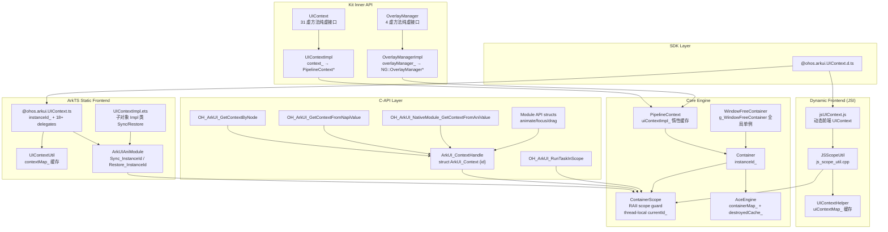
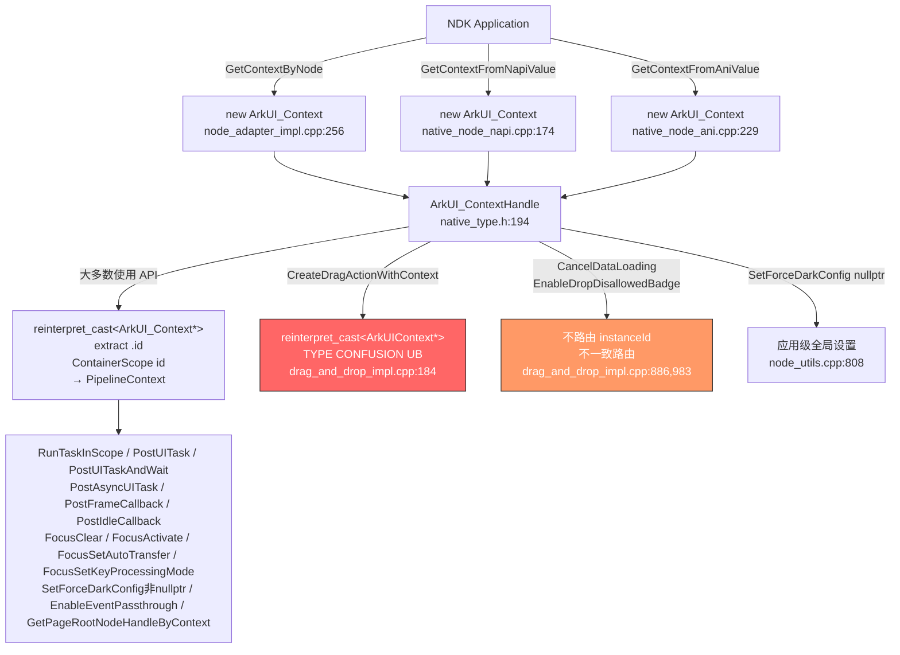
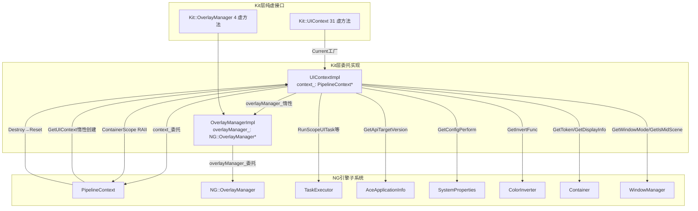
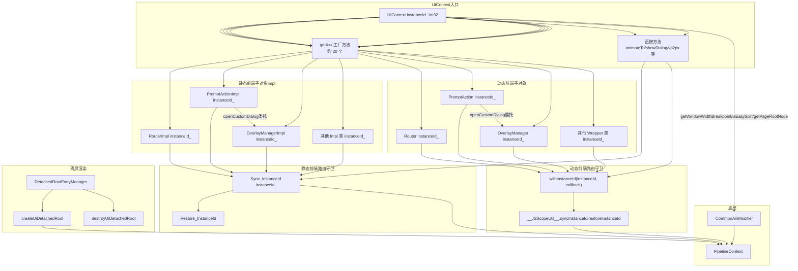
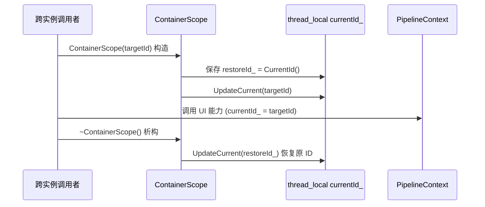

# UIContext 接口功能域设计

## 设计元数据

| 字段 | 内容 |
|------|------|
| Design ID | DESIGN-Func-04-12-01 |
| 功能域 | UIContext 接口 (04-12-01) |
| 版本 | 2.0 |
| 状态 | Baselined |
| 作者 | ArkUI SIG |
| 日期 | 2026-07-23 |
| 目标版本 | API 10–26 |
| 复杂度 | 关键 |
| 关联 Feat | Feat-01: UIContext入口架构与实例路由, Feat-02: UIContext实例解析与作用域调度, Feat-03: 子对象工厂与直接方法, Feat-04: C-API UIContextHandle接口 |

## 需求基线

| 项 | 补充说明 |
|----|----------|
| UIContext 是应用级 UI 上下文的唯一入口 | 所有模块功能（路由、弹窗、动画、拖拽、Overlay 等）通过 UIContext.getXxx() 工厂方法获取 |
| 多窗口/多实例是核心场景 | UIContext 必须确保 instanceId 路由到正确的 Container/PipelineContext |
| C-API UIContextHandle 是 NDK 场景的入口 | ArkUI_ContextHandle 持有 instanceId，所有 C-API 子模块函数通过此路由 |
| Kit 层 UIContext 是引擎内部接口层 | UIContextImpl 持 PipelineContext* 原指针委托，OverlayManagerImpl 持 OverlayManager* 原指针委托 |
| 子对象工厂方法约 20 个 | getRouter/getPromptAction/getOverlayManager 等返回绑定 instanceId 的子对象 |
| 直接方法约 30+ 个 | animateTo/showAlertDialog/vp2px/getFrameNodeById 等直接在 UIContext 上调用 |

## 当前状态与上下文

### 涉及仓和模块

| 仓库 | 补充架构说明 |
|------|-------------|
| ace_engine (interfaces/inner_api/ace_kit/) | Kit 层 UIContext 纯虚接口 + UIContextImpl 委托实现 + OverlayManager/OverlayManagerImpl |
| ace_engine (frameworks/core/pipeline_ng/) | PipelineContext::GetUIContext() 惰性工厂 + uiContextImpl_ 成员 + Destroy 时 Reset |
| ace_engine (frameworks/core/common/) | ContainerScope RAII + InstanceIdGenReason 枚举 + AceEngine::containerMap_ + destroyedUIContextCache_ |
| ace_engine (frameworks/bridge/arkts_frontend/) | ArkTS 静态前端 @ohos.arkui.UIContext.ts + UIContextImpl.ets + UIContextUtil.ets + ArkUIAniModule Sync/Restore |
| ace_engine (frameworks/bridge/declarative_frontend/) | JSI 动态前端 jsUIContext.js + js_scope_util.cpp + ui_context_helper.cpp |
| ace_engine (interfaces/native/) | C-API 层 ArkUI_ContextHandle + OH_ArkUI_GetContextByNode + Module API structs |
| ace_engine (frameworks/core/interfaces/ani/) | ANI 原生桥 ani_api.h 5 函数指针 + arkoala_api.h runScopedTask |
| interface/sdk-js (外部仓) | SDK 类型定义 @ohos.arkui.UIContext.d.ts |

### 适用架构规则

| Rule ID | 适用原因 | 设计结论 | 验证方式 |
|---------|----------|----------|----------|
| OH-ARCH-LAYERING | UIContext 跨越 SDK→前端→Kit→管线→容器 5 层 | UIContext 作为 facade 委托到 PipelineContext，不跨层违规调用 | 架构评审 |
| OH-ARCH-SUBSYSTEM | UIContext 横跨多个子系统（路由/弹窗/动画/Overlay） | 通过 getXxx 工厂方法隔离子系统边界，UIContext 不直接实现子系统逻辑 | 代码评审 |
| OH-ARCH-API-LEVEL | UIContext 涉及 Public API（@since 10–26）和 InnerApi（Kit层） | Public API 通过 SDK d.ts 定义；InnerApi 通过 ace_kit 定义；C-API 通过 native_node.h 定义 | API 评审/XTS |
| OH-ARCH-COMPONENT-BUILD | UIContext 横跨 ace_kit/declarative_frontend/arkts_frontend/native 模块 | 各模块独立 BUILD.gn，无新增依赖 | 构建验证 |
| OH-ARCH-ERROR-LOG | C-API 返回错误码（ARKUI_ERROR_CODE_*） | InnerApi 返回 nullptr 或默认值；C-API 返回 int32_t 错误码 | 单测/hilog |

## 不涉及项承接

| 维度 | 设计结论 |
|------|----------|
| 新增 Public API | 不涉及 — 全部为已有实现补录 |
| 新增构建依赖 | 不涉及 — 无 bundle.json/BUILD.gn 变更 |
| 跨进程 IPC | 不涉及 — UIContext 仅为同进程 facade |
| 数据持久化 | 不涉及 — UIContext 无持久化存储 |
| 安全权限 | 不涉及 — UIContext 无新权限要求 |

## 架构决策记录 (ADR)

### ADR-1: 委托门面模式 (Feat-01 baseline)

| 属性 | 值 |
|------|-----|
| 决策ID | ADR-F1-1 |
| 决策 | UIContext 纯虚接口 + UIContextImpl 持 PipelineContext* context_ 原指针全委托，不持业务状态 |
| 上下文 | Kit 层需要统一入口访问 PipelineContext 子系统能力，但不应直接暴露 PipelineContext |
| 探索过的替代方案 | A) UIContext 直接持有各子系统 RefPtr；B) UIContext 作为独立子系统 |
| 取舍理由 | A 增加生命周期耦合；B 增加架构复杂度；委托 facade 最简且与已有 PipelineContext 一致 |
| 影响 | 所有 getXxx 工厂方法和 31 个虚拟方法均委托到 PipelineContext 子系统 |
| 源码引用 | ui_context_impl.h:86（context_ = nullptr 私有成员），ui_context_impl.cpp:58-306（全方法 CHECK_NULL + 委托），ui_context.h:45-102（31 虚方法声明） |

UIContextImpl 仅持 `context_`(NG::PipelineContext* 原指针) 和 `overlayManager_`(RefPtr\<OverlayManager> 惰性缓存)，所有方法委托到 PipelineContext / AceApplicationInfo / SystemProperties / ColorInverter / ResourceManager / Container 等引擎子系统。

### ADR-2: ContainerScope RAII 实例路由 (Feat-01 baseline)

| 属性 | 值 |
|------|-----|
| 决策 | ContainerScope RAII scope guard 管理 thread-local currentId_ 栈，构造时切换、析构时恢复 |
| 上下文 | 多窗口场景下跨子系统（NAPI/ANI/TaskExecutor）调用 UI 能力前必须路由到正确实例 |
| 探索过的替代方案 | A) 每个方法显式传 instanceId 参数；B) 全局变量存储当前 ID |
| 取舍理由 | A 增加每个 API 参数负担；B 不支持多线程；RAII scope guard 自动恢复、线程安全 |
| 影响 | 所有 UIContext 方法调用前必须先设置 ContainerScope；Kit 层任务调度三方法和跨子系统查询内部建立 ContainerScope |
| 源码引用 | container_scope.h:58-148（ContainerScope 定义），container_scope.cpp:673-721（构造/析构），container_scope.cpp:100-117（thread_local currentId_），ui_context_impl.cpp:63,72,81,193,202（内部 ContainerScope 建立） |

三层路由实现：
1. Kit层（C++内部）: `ContainerScope(context_->GetInstanceId())` RAII guard
2. ArkTS静态前端: `ArkUIAniModule._Common_Sync_InstanceId(instanceId_)` / `_Common_Restore_InstanceId()`
3. ArkTS动态前端: `withInstanceId(instanceId, callback)` → `__JSScopeUtil__.syncInstanceId(instanceId)` / `__JSScopeUtil__.restoreInstanceId()` (js_scope_util.cpp:55-94)
4. C-API层: `reinterpret_cast<ArkUI_Context*>(handle)->id` → `ContainerScope(id)`

### ADR-3: 惰性创建与缓存 (Feat-01 baseline)

| 属性 | 值 |
|------|-----|
| 决策 | UIContextImpl 通过 PipelineContext::GetUIContext() 惰性创建并缓存到 uiContextImpl_；OverlayManager 通过 GetOverlayManager() 惰性创建并缓存到 overlayManager_ |
| 上下文 | 避免增加 PipelineContext 初始化成本，同时避免桥接层复杂度 |
| 探索过的替代方案 | A) PipelineContext 构造时立即创建；B) 首次 JS 侧 getUIContext() 时创建 |
| 取舍理由 | A 增加 PipelineContext 初始化成本；B 增加桥接层复杂度；lazy-init 最简 |
| 影响 | UIContextImpl 的 context_ 可能在 Reset() 后为 nullptr；overlayManager_ 同样依赖 context_ |
| 源码引用 | pipeline_context.cpp:7924-7931（GetUIContext 惰性创建），pipeline_context.h:1649（uiContextImpl_ 成员），ui_context_impl.cpp:114-122（GetOverlayManager 惰性创建） |

双前端缓存对比：
- **静态前端**: UIContextUtil::contextMap_ 按 instanceId 缓存 UIContext 对象（UIContextUtil.ets:21-23），getOrCreateUIContextById 先查缓存不存在则 new UIContext(id) 并存入
- **动态前端**: UIContextHelper::uiContextMap_ 按 instanceId 缓存 JSValueRef Global 引用（ui_context_helper.h:34, ui_context_helper.cpp:41-54），GetUIContext 查缓存不存在时建立 ContainerScope(instanceId) 并调用 ArkTSUtils::GetContext(vm) → __getUIContext__(instanceId) 创建后存入（jsUIContext.js:2050-2052）

### ADR-4: 多实例解析策略 (Feat-02 incremental)

| 属性 | 值 |
|------|-----|
| 决策ID | ADR-F2-1 |
| 决策 | ContainerScope::CurrentIdWithReason() 实现严格优先级解析链：SCOPE → UNDEFINED → SINGLETON → ACTIVE → FOREGROUND → DEFAULT |
| 上下文 | 多窗口/多实例场景下 resolveUIContext() 需自动决策当前有效实例，无需手动判断 |
| 探索过的替代方案 | A) 仅使用 CurrentId；B) 仅使用 SingletonId |
| 取舍理由 | A 在多窗口场景下无法自动切换；B 在单窗口场景下冗余；决策链覆盖所有场景 |
| 影响 | resolveUIContext 返回 ResolvedUIContext 含 strategy 字段；InstanceIdGenReason 与 SDK ResolveStrategy 映射 |
| 源码引用 | container_scope.cpp:403-425（CurrentIdWithReason 实现），container_scope.h:29-36（InstanceIdGenReason 枚举），js_scope_util.cpp:126-134（ResolveUIContext 桥接） |

InstanceIdGenReason → ResolveStrategy 映射：

| C++ InstanceIdGenReason | 值 | SDK ResolveStrategy | 值 |
|---|---|---|---|
| SCOPE | 0 | CALLING_SCOPE | 0 |
| ACTIVE | 1 | LAST_FOCUS | 1 |
| DEFAULT | 2 | MAX_INSTANCE_ID | 2 |
| SINGLETON | 3 | UNIQUE | 3 |
| FOREGROUND | 4 | LAST_FOREGROUND | 4 |
| UNDEFINED | 5 | UNDEFINED | 5 |

### ADR-5: C-API ContextHandle Bridge (Feat-04 incremental)

| 属性 | 值 |
|------|-----|
| 决策ID | ADR-F4-1 |
| 决策 | ArkUI_ContextHandle 为 opaque 指针 typedef，内部仅含 `{ int32_t id }` 轻量令牌；所有使用 API 通过 reinterpret_cast 提取 id 后 ContainerScope(id) 路由 |
| 上下文 | C-API 需要 NDK 场景的 UI 实例入口，3 个创建 API 从节点/NAPI/ANI 桥接获取 |
| 探索过的替代方案 | A) ArkUI_ContextHandle 直接持有 PipelineContext* 指针 |
| 取舍理由 | A 增加 ABI 耦合和生命周期管理难度；轻量令牌 + instanceId 路由最简最稳 |
| 影响 | 堆分配无 Destroy API 导致系统性内存泄漏（每次 8 字节）；CreateDragActionWithContext 存在 TYPE CONFUSION UB |
| 源码引用 | node_module_inner.h:21-23（ArkUI_Context 结构体），native_type.h:187-194（typedef），node_adapter_impl.cpp:256-268（GetContextByNode 实现），drag_and_drop_impl.cpp:184（TYPE CONFUSION） |

兼容性风险标注：
- MEMORY LEAK (P1): 3 个创建 API 均堆分配但无 Destroy/Release API，每次 8 字节不可回收
- TYPE CONFUSION (P1): CreateDragActionWithContext 将 ArkUI_Context* reinterpret_cast 到 ArkUIContext*，C++ UB
- NAMING INCONSISTENCY (P2): ArkUI_ContextHandle 与 ArkTS UIContextHandle 语义不对齐
- INCONSISTENT ROUTING (P2): CancelDataLoading/EnableDropDisallowedBadge 不路由 instanceId
- DUAL TYPEDEF (P2): ArkUI_ContextHandle 在 native_type.h:194 和 drag_and_drop.h:146 重复定义
- VESTIGIAL PARAM (P3): CancelDataLoading uiContext 参数未使用，参数名拼写为 "uiContent"
- NO NULL SAFETY: 大多数使用 API 对 contextHandle 参数不做 null 检查

### ADR-6: Window-Free Container Lifecycle (Feat-02 incremental)

| 属性 | 值 |
|------|-----|
| 决策ID | ADR-F2-2 |
| 决策 | 全局单例 g_WindowFreeContainer static 指针，仅允许一个 Window-Free 实例，Destroy 后 static 清空 |
| 上下文 | 原子化服务场景需无窗口 UI 实例进行离屏渲染或后台逻辑处理 |
| 探索过的替代方案 | A) 支持多个 Window-Free 实例 |
| 取舍理由 | A 增加 ID 管理/生命周期复杂度；当前仅需一个场景需求 |
| 影响 | Window-Free UIContext 不支持窗口生命周期方法；getWindowName/getWindowId 返回 undefined |
| 源码引用 | window_free_container.cpp:176-227（Create 实现），window_free_container.cpp:229-238（Destroy 实现），container_consts.h:35-42（WINDOW_FREE_CONTAINER = 9, ID ∈ [900000, 999999]） |

Window-Free Container 特征：PseudoEventCallback（无真实窗口事件）、width=0 height=0、usePlatformAsUIThread=true useUIAsJSThread=true（单线程模型）、isDynamicRender_=true（不参与前台/焦点追踪）。

### ADR-7: Kit::UIContext Interface Segregation (Feat-01 baseline 概述)

| 属性 | 值 |
|------|-----|
| 决策ID | ADR-F1-2 |
| 决策 | Kit::UIContext 纯虚基类定义 39 个虚拟方法，按功能域组织；UIContextImpl 逐一委托到 PipelineContext 子系统，按需建立 ContainerScope |
| 上下文 | Kit 层需要为引擎内部组件提供统一 UI 能力访问入口；本 Feat 仅做概述级描述，不独立展开 |
| 探索过的替代方案 | A) 每个功能域独立接口类；B) 一个大接口包含所有方法 |
| 取舍理由 | A 过度碎片化增加使用复杂度；B 缺乏功能域组织但实际可行；当前选择 B 但按域组织方法声明 |
| 影响 | 新增纯虚方法需 UIContextImpl override；OverlayManager 子体系 4 方法独立纯虚类 |
| 源码引用 | ui_context.h:45-102（39 虚方法声明），ui_context_impl.h:32-88（UIContextImpl 声明），overlay_manager.h:28-43（OverlayManager 4 虚方法） |

Kit::UIContext 纯虚接口核心方法分组（概述级，不独立展开）：

| 域 | 方法数 | 代表方法 |
|----|--------|----------|
| 任务调度 | 3 | RunScopeUITaskSync, RunScopeUITask, RunScopeUIDelayedTask |
| 页面操作 | 1 | OnBackPressed |
| UI 信息查询 | 3 | GetLocalColorMode, GetColorMode, GetFontScale |
| 暗色/配置/身份 | 4 | GetConfigPerform, GetInstanceId, HasDarkResource, GetInvertFunc |
| Overlay 管理 | 1 | GetOverlayManager → Kit::OverlayManager(4虚方法) |
| 管线任务 | 2 | AddAfterLayoutTask, RequestFrame |
| API 版本/容器模态 | 5 | GetApiTargetVersion, GreatOrEqualTargetAPIVersion, ContainerModal 三方法 |
| 生命周期回调 | 2 | RegisterArkUIObjectLifecycleCallback, Unregister |
| Token/Display/Window | 5 | GetToken, GetDisplayInfo, GetWindowMode, GetIsMidScene, IsAccessibilityEnabled |
| Surface/Fold/Rotation | 7 | Register/Unregister SurfaceChanged, FoldStatus, RotationEnd, AddWindowSizeChange |
| 静态工厂 | 1 | UIContext::Current() |

### ADR-F3-1: 子对象工厂统一路由守卫 (Feat-03 incremental)

| 属性 | 值 |
|------|-----|
| 决策ID | ADR-F3-1 |
| 决策 | 所有子对象 Impl 类的每个公开方法必须在方法体开头调用 Sync_InstanceId(instanceId_) 并在结尾调用 Restore_InstanceId()；所有 getXxx 工厂方法返回绑定 instanceId 的子对象实例 |
| 上下文 | 约 20 个 getXxx 工厂方法返回的子对象在多实例场景下需确保 API 调用路由到正确 PipelineContext |
| 探索过的替代方案 | A) 子对象不持有 instanceId，每次调用从 ContainerScope 获取 |
| 取舍理由 | A 在异步回调中无法获取正确 instanceId；子对象绑定 instanceId + Sync/Restore 最可靠 |
| 影响 | 约 40+ 处 Sync_InstanceId 需与 Restore_InstanceId 精确配对，遗漏导致实例 ID 混淆 |
| 源码引用 | UIContextImpl.ets:108-124（FontImpl.registerFont Sync/Restore），@ohos.arkui.UIContext.ts:765-782（构造器创建 18+ delegate 子对象），@ohos.arkui.UIContext.ts:873-876（isFollowingSystemFontScale Sync/Restore），jsUIContext.js:2036-2043（withInstanceId 函数定义），jsUIContext.js:425-427（动态前端构造器仅存 instanceId_），js_scope_util.cpp:55-71（SyncInstanceId → ContainerScope::UpdateCurrent），js_scope_util.cpp:73-94（RestoreInstanceId → ContainerScope::UpdateCurrent） |

### ADR-F2-3: 隔离线程独立容器集 (Feat-02 incremental)

| 属性 | 值 |
|------|-----|
| 决策ID | ADR-F2-3 |
| 决策 | dc/card 隔离线程 MarkIsolatedThread() 后，ContainerCount/SingletonId/RecentActiveId/RecentForegroundId/DefaultId 查询返回 thread-local 值（localContainerSet_/localRecentActiveId_/localRecentForegroundId_） |
| 上下文 | dc/card 场景下全局 containerSet_ 与隔离线程的实例 ID 混乱 |
| 探索过的替代方案 | A) 仅使用全局追踪 |
| 取舍理由 | A 在 dc/card 场景下跨线程实例 ID 混乱；双写机制确保隔离线程查询正确 |
| 影响 | 隔离线程的 SafelyId/CurrentIdWithReason 自然正确 |
| 源码引用 | container_scope.h:110-117（isIsolatedThread_ + localContainerSet_），container_scope.cpp:114-117（thread-local 定义） |

### ADR-F2-4: destroyedUIContextCache_ 缓存策略 (Feat-02 incremental)

| 属性 | 值 |
|------|-----|
| 决策ID | ADR-F2-4 |
| 决策 | AceEngine 维护 destroyedUIContextCache_ 上限 10 条，溢出淘汰 destroyTime_ 最小条目；AddContainer 时若 instanceId 在缓存中存在先删除旧条目 |
| 上下文 | 容器销毁后需要追踪历史 instanceId 信息，用于 GetEnhancedContextBNotFoundMessage 错误增强 |
| 探索过的替代方案 | A) 无缓存直接丢弃 |
| 取舍理由 | A 导致错误信息不够详细；10 条缓存足够覆盖典型场景 |
| 影响 | MAX_DESTROYED_CACHE_SIZE=10，UIContextCacheInfo 含 instanceId/createTime/destroyTime/windowId/windowName |
| 源码引用 | ace_engine.h:84-85（destroyedUIContextCache_ + UIContextCacheInfo），ace_engine.cpp:150-158（AddToDestroyedCache 淘汰逻辑） |

## 架构图

### ADR-8: 静态/动态前端双路径实例路由 (baseline)

| 属性 | 值 |
|------|-----|
| 决策 | UIContext 实例路由在静态前端和动态前端分别通过不同桥接层实现，但行为语义一致 |
| 上下文 | 两种前端范式并行运行，需确保行为一致 |
| 探索过的替代方案 | A) 统一为单一桥接层 |
| 取舍理由 | A 需改造已有前端架构，成本高；双路径桥接+行为一致验证更务实 |
| 影响 | 所有 API 规格文档需同时标注两条路径的源码引用；ANI 函数指针 6 条 + js_scope_util NAPI 7 条需对齐 |
| 源码引用 | ArkUIAniModule.ts:124-126, js_scope_util.h:25-38, ani_api.h:685-689, arkoala_api.h:9725 |

双路径对比：

| 维度 | 静态前端 | 动态前端 |
|------|-----------|-----------|
| 实例路由 | ArkUIAniModule._Common_Sync_InstanceId(instanceId_) / _Common_Restore_InstanceId() (静态前端每个delegate方法) | withInstanceId(instanceId, callback) → __JSScopeUtil__.syncInstanceId(instanceId) / restoreInstanceId() (动态前端每个delegate方法) |
| 桥接层 | ANI 函数指针 (ani_api.h:685-689, arkoala_api.h:9725) | NAPI (js_scope_util.cpp:126-134) |
| 缓存 | UIContextUtil.contextMap_ (UIContextUtil.ets:21) | UIContextHelper.uiContextMap_ (ui_context_helper.h:34) |
| C-API获取 | OH_ArkUI_NativeModule_GetContextFromAniValue (ANI路径) | OH_ArkUI_GetContextFromNapiValue (NAPI路径) |
| 子对象工厂 | getXxx → new Impl(instanceId_) → Sync/Restore | getXxx → new Wrapper(instanceId) → withInstanceId → NAPI |
| 目标层 | ContainerScope(id) RAII → PipelineContext | ContainerScope(id) RAII → PipelineContext |

### 全局架构



### C-API Bridge Architecture



### Kit 层委托架构



### ArkTS 子对象工厂路由守卫



### ContainerScope RAII 实例路由



## 资源所有权矩阵

| 资源 | 创建方 | 持有方 | 销毁触发 | 实际释放 | 异常回收 |
|------|--------|--------|----------|----------|----------|
| UIContextImpl (RefPtr) | PipelineContext::GetUIContext() (`pipeline_context.cpp:7924-7931`) | PipelineContext::uiContextImpl_ (`pipeline_context.h:1649`) | PipelineContext Destroy (`pipeline_context.cpp:6005`) | uiContextImpl_.Reset() → UIContextImpl::Reset() 置 context_=nullptr | Reset() 后所有方法 CHECK_NULL 安全降级 |
| OverlayManagerImpl (RefPtr) | UIContextImpl::GetOverlayManager() (`ui_context_impl.cpp:114-122`) | UIContextImpl::overlayManager_ | UIContextImpl Reset/析构 | overlayManager_ RefPtr 引用计数归零 | overlayManager_ = nullptr |
| ArkUI_Context (heap) | OH_ArkUI_GetContextByNode 等 (`node_adapter_impl.cpp:256`, `native_node_napi.cpp:174`, `native_node_ani.cpp:229`) | 调用方 | 无 Destroy API | 不可回收（内存泄漏） | 无（系统性 P1 风险） |
| Window-Free Container | WindowFreeContainer::Create (`window_free_container.cpp:176-227`) | g_WindowFreeContainer static 指针 | destroyUIContextWithoutWindow (`window_free_container.cpp:229-238`) | DestroyContainer + RemoveAndCheck + g_WindowFreeContainer.Reset() | 静态指针清空 |
| JS UIContextProxy (NAPI) | frontend->GetContextValue() | UIContextHelper::uiContextMap_ (`ui_context_helper.h:34`) | RemoveUIContext | Global\<JSValueRef> reset | EngineHelper::removeUIContextFunc_ |
| ArkTS UIContext 对象 | UIContextUtil.getOrCreateUIContextById (`UIContextUtil.ets:33-40`) | UIContextUtil::contextMap_ (`UIContextUtil.ets:21`) | removeUIContext | contextMap_.delete(instanceId) | 引用计数归零 |
| ArkTS delegate 子对象 | UIContext 构造器 (`@ohos.arkui.UIContext.ts:765-782`) | UIContext 实例成员 | UIContext 对象销毁 | 随 UIContext 一起释放 | 无 |
| OverlayManagerImpl NG::OverlayManager* 原指针 | OverlayManagerImpl 构造器 (`overlay_manager_impl.cpp:28-30`) 从 context->GetOverlayManager() + AceType::RawPtr() | OverlayManagerImpl::overlayManager_ (`overlay_manager_impl.h:44`) | OverlayManagerImpl Reset/析构 | overlayManager_ = nullptr（原指针不拥有生命周期） | NG::OverlayManager 由 PipelineContext 管理 |
| destroyedUIContextCache_ | AceEngine::AddToDestroyedCache (`ace_engine.cpp:150-158`) | AceEngine::destroyedUIContextCache_ (`ace_engine.h:84-85`) | 溢出淘汰 destroyTime_ 最小条目 | vector erase | MAX_DESTROYED_CACHE_SIZE=10 |

## 调用链层级分析

| 层 | 模块 | 职责 | 关键路由机制 |
|----|------|------|-------------|
| SDK 层 | @ohos.arkui.UIContext.d.ts | 公共 API 类型定义、@since 版本标注 | 无（纯类型定义） |
| ArkTS 静态前端 | @ohos.arkui.UIContext.ts | UIContext 类定义、instanceId_、getXxx 工厂、Sync_InstanceId 路由 | Sync_InstanceId(instanceId_) / Restore_InstanceId() |
| ArkTS ANI 桥接 | common_ani_modifier.cpp, ArkUIAniModule.ts | ANI 层 CreateWindowFreeContainer、ResolveUIContext、SyncInstanceId | ContainerScope(id) RAII |
| 动态前端 JS 桥接 | js_scope_util.cpp, ui_context_helper.cpp | JSScopeUtil 绑定、UIContextHelper 实例映射 | ContainerScope(instanceId) + ArkTSUtils::GetContext(vm) |
| Kit 层 | ui_context.h, ui_context_impl.cpp | UIContext 纯虚接口 + UIContextImpl 委托实现 | ContainerScope(context_->GetInstanceId()) 内部建立 |
| 管线层 | pipeline_context.cpp | PipelineContext::GetUIContext() lazy-init、uiContextImpl_ 持有 | 惰性创建 + Destroy 时 Reset |
| 容器层 | container.h, container_scope.cpp | Container 管理、ContainerScope RAII scope guard、实例 ID 追踪 | thread-local currentId_ 栈 + 全局 containerSet_ |
| 引擎层 | ace_engine.h, ace_engine.cpp | AceEngine::containerMap_ 全局容器注册、destroyedUIContextCache_ | containerMap_ + destroyedCache_ |
| C-API 层 | node_adapter_impl.cpp, native_type.h | OH_ArkUI_GetContextByNode, ArkUI_Context {.id} 创建 | reinterpret_cast→extract id→ContainerScope(id) |
| C-API Module API 层 | native_animate.h, native_interface_focus.h, drag_and_drop.h | animateTo/Focus/Drag 等 Module API struct（需 ContextHandle） | vtable dispatch + contextHandle->id 路由 |

典型调用链（Kit 层 RunScopeUITaskSync）：

```
调用者 → UIContext::Current()
  → NG::PipelineContext::GetCurrentContextSafelyWithCheck()
  → pipeline->GetUIContext() [惰性创建 UIContextImpl]
  → uiContext->RunScopeUITaskSync(task, name)
    → UIContextImpl: CHECK_NULL_VOID(context_)
    → ContainerScope(context_->GetInstanceId()) [RAII 切换 currentId_]
    → context_->GetTaskExecutor()->PostSyncTask(task, UI, name)
    → ~ContainerScope() [恢复 currentId_]
```

典型调用链（C-API RunTaskInScope）：

```
NDK Application → OH_ArkUI_RunTaskInScope(uiContext, userData, callback)
  → reinterpret_cast<ArkUI_Context*>(uiContext)->id
  → getNodeModifiers()->getFrameNodeModifier()->runScopedTask(context->id, userData, callback)
  → ContainerScope(context->id) [RAII 切换 currentId_]
  → callback(userData)
  → ~ContainerScope() [恢复 currentId_]
```

典型调用链（ArkTS 静态前端 getRouter().pushUrl）：

```
ArkTS 静态前端 App → uiContext.getRouter()
  → new RouterImpl(this.instanceId_) [或缓存返回]
  → router.pushUrl(options)
    → ArkUIAniModule._Common_Sync_InstanceId(this.instanceId_) [切换 currentId_]
    → RouterImpl native pushUrl 调用
    → PageRouterManager::PushUrl() [通过 currentId_ 路由到正确实例]
    → ArkUIAniModule._Common_Restore_InstanceId() [恢复 currentId_]
```

典型调用链（ArkTS 动态前端 getRouter().pushUrl）：

```
ArkTS 动态前端 App → uiContext.getRouter()
  → new Router(this.instanceId_) [每次 getter 创建新对象]
  → router.pushUrl(options)
    → withInstanceId(this.instanceId_, () => { ... })
      → __JSScopeUtil__.syncInstanceId(instanceId_) [切换 currentId_ via js_scope_util.cpp:55-71]
      → globalThis.requireNapi('router').push(options)
      → __JSScopeUtil__.restoreInstanceId() [恢复 currentId_ via js_scope_util.cpp:73-94]
```

典型调用链（动态前端 UIContextHelper 缓存获取）：

```
动态前端引擎 → CallGetUIContextFunc(instanceId)
  → UIContextHelper::GetUIContext(vm, instanceId)
    → uiContextMap_.find(instanceId) [查缓存]
    → 缓存不存在: ContainerScope(instanceId) [RAII 切换]
    → ArkTSUtils::GetContext(vm) → JS __getUIContext__(instanceId)
    → jsUIContext.js: __getUIContext__(instanceId) → new UIContext(instanceId)
    → UIContextHelper::AddUIContext(vm, instanceId, uiContext) [存入 uiContextMap_]
    → ~ContainerScope() [恢复 currentId_]
```

典型调用链（动态前端 resolveUIContext）：

```
动态前端 App → UIContext.resolveUIContext()
  → __JSScopeUtil__.resolveUIContext()
    → js_scope_util.cpp JSScopeUtil::ResolveUIContext(info)
    → ContainerScope::CurrentIdWithReason() [解析链 SCOPE→UNDEFINED→SINGLETON→ACTIVE→FOREGROUND→DEFAULT]
    → GetMainInstanceId(pair.first) [子容器 ID 映射到主容器 ID]
    → 返回 [instanceId, reason] 二元组
  → new ResolvedUIContext(contextInfo[0], contextInfo[1]) [jsUIContext.js:1133-1138]
```

典型调用链（动态前端 runScopedTask）：

```
动态前端 App → uiContext.runScopedTask(callback)
  → jsUIContext.js:721-726
  → withInstanceId(this.instanceId_, callback)
    → __JSScopeUtil__.syncInstanceId(instanceId_) [切换 currentId_]
    → callback() [执行用户回调]
    → __JSScopeUtil__.restoreInstanceId() [finally 恢复 currentId_]
```

## 设计骨架与任务分解

### Feat-01: UIContext入口架构与实例路由

| Task ID | 目标 | 受影响文件 | AC 范围 |
|---------|------|-----------|---------|
| TASK-F01-1 | UIContext 纯虚接口 + UIContextImpl 委托门面架构 | ui_context.h:45-102, ui_context_impl.h:32-88, ui_context_impl.cpp:38-306 | AC-1.1~AC-7.2 |
| TASK-F01-2 | ContainerScope RAII 实例路由 + thread-local currentId_ | container_scope.h:58-148, container_scope.cpp:673-721, container_scope.cpp:100-117 | AC-4.1~AC-4.3 |
| TASK-F01-3 | C-API ArkUI_Context 结构体 + 3 个创建 API + RunTaskInScope | node_module_inner.h:21-23, native_type.h:187-194, node_adapter_impl.cpp:256-268, node_utils.cpp:793-804 | AC-6.1~AC-6.3 |
| TASK-F01-4 | ArkTS Sync/Restore 路由守卫 + UIContextHelper JSI 缓存 + JSScopeUtil | @ohos.arkui.UIContext.ts:735-799, UIContextImpl.ets:108-124, ui_context_helper.h:25-36, js_scope_util.h:25-38 | AC-4.3, AC-5.1~AC-5.2 |
| TASK-F01-5 | 共享基础设施常量/枚举 + ENABLE_CONTAINER_SCOPE_TRACKING 诊断 | container_consts.h:21-42, container_scope.h:29-56, container_scope.cpp:507-620 | R-16~R-31 |

### Feat-02: UIContext实例解析与作用域调度

| Task ID | 目标 | 受影响文件 | AC 范围 |
|---------|------|-----------|---------|
| TASK-F02-1 | ContainerScope::CurrentIdWithReason 解析链 + InstanceIdGenReason 映射 | container_scope.cpp:403-425, container_scope.h:29-36, js_scope_util.cpp:126-134 | AC-2.1~AC-2.6 |
| TASK-F02-2 | resolveUIContext / getCallingScopeUIContext / getAllUIContexts 静态工厂 | jsUIContext.js:429-462, @ohos.arkui.UIContext.ts:718-733, js_container_utils.cpp | AC-2.7~AC-2.9 |
| TASK-F02-3 | Window-Free Container 创建/销毁 + PseudoEventCallback | window_free_container.cpp:176-238, jsUIContext.js:469-484 | AC-2.11~AC-2.12 |
| TASK-F02-4 | runScopedTask / getHostContext / getSharedLocalStorage 作用域绑定 | jsUIContext.js:721-726, jsUIContext.js:808-818 | AC-2.13~AC-2.15 |
| TASK-F02-5 | isAvailable / getId / getWindowName / getWindowId 身份查询 | jsUIContext.js:595-596, jsUIContext.js:1061-1062 | AC-2.8~AC-2.10, AC-2.18~AC-2.19 |
| TASK-F02-6 | destroyedUIContextCache_ + RemoveAndCheck + 隔离线程双写 | ace_engine.h:84-85, container_scope.cpp:662-671, container_scope.h:110-117 | AC-2.6, R-11 |

### Feat-03: 子对象工厂与直接方法

| Task ID | 目标 | 受影响文件 | AC 范围 |
|---------|------|-----------|---------|
| TASK-F03-1 | 约 20 个 getXxx 工厂方法 + instanceId_ 绑定 + Sync/Restore 路由守卫 | @ohos.arkui.UIContext.ts:765-782, UIContextImpl.ets | AC-03.1~AC-03.3 |
| TASK-F03-2 | Router / PromptAction / OverlayManager 子对象接口 | @ohos.arkui.UIContext.d.ts Router/PromptAction/OverlayManager | AC-03.4~AC-03.11 |
| TASK-F03-3 | animateTo/animateToImmediately/keyframeAnimateTo/createAnimator | @ohos.arkui.UIContext.ts animateTo 系列 | AC-03.31~AC-03.34 |
| TASK-F03-4 | showAlertDialog/showActionSheet/DatePicker/TimePicker/TextPicker | jsUIContext.js showDialog 系列 | AC-03.28~AC-03.30 |
| TASK-F03-5 | openBindSheet/updateBindSheet/closeBindSheet 半模态 | jsUIContext.js BindSheet 系列 | AC-03.35~AC-03.37 |
| TASK-F03-6 | vp2px/px2vp/fp2px/px2fp/lpx2px/px2lpx 密度转换 | jsUIContext.js density 系列 | AC-03.38 |
| TASK-F03-7 | getFrameNodeById/getFrameNodeByUniqueId/getPageRootNode 节点查询 | @ohos.arkui.UIContext.ts:1324-1349 | AC-03.39~AC-03.40, AC-03.48~AC-03.49 |
| TASK-F03-8 | DetachedRootEntryManager 离屏渲染管理 | UIContextImpl.ets:1627-1738 | AC-03.45 |
| TASK-F03-9 | getWindowWidthBreakpoint/getWindowHeightBreakpoint/isEasySplit | @ohos.arkui.UIContext.ts:1224-1245, common_module.cpp | AC-03.46~AC-03.51 |

### Feat-04: C-API UIContextHandle接口

| Task ID | 目标 | 受影响文件 | AC 范围 |
|---------|------|-----------|---------|
| TASK-F04-1 | ArkUI_ContextHandle typedef + ArkUI_Context 结构体 + 3 个创建 API | native_type.h:187-194, node_module_inner.h:21-23, node_adapter_impl.cpp:256-268 | AC-04.1.1~AC-04.1.11 |
| TASK-F04-2 | RunTaskInScope / PostUITask / PostUITaskAndWait / PostAsyncUITask 任务投递 | node_utils.cpp:793-804, node_model_safely.cpp | AC-04.2.1~AC-04.2.7 |
| TASK-F04-3 | PostFrameCallback / PostIdleCallback 帧回调 | native_node_napi.cpp:684-734 | AC-04.2.5~AC-04.2.6 |
| TASK-F04-4 | FocusClear / FocusActivate / FocusSetAutoTransfer / FocusSetKeyProcessingMode | native_interface_focus.cpp:35-82 | AC-04.3.1~AC-04.3.5 |
| TASK-F04-5 | CreateDragActionWithContext + SetDragEventStrictReport + CancelDataLoading + EnableDropDisallowedBadge | drag_and_drop_impl.cpp:184,631,886,983 | AC-04.4.1~AC-04.4.5 |
| TASK-F04-6 | animateTo / keyframeAnimateTo / createAnimator vtable | native_animate.h:98-102, animate_impl.cpp:25,67,164 | AC-04.5.1~AC-04.5.4 |
| TASK-F04-7 | SetForceDarkConfig / EnableEventPassthrough / GetPageRootNodeHandleByContext | node_utils.cpp:808,1068, native_node_napi.cpp:734 | AC-04.6.1~AC-04.6.4 |


## 兼容性约束

| 层面 | 声明 |
|------|------|
| Kit 层接口 | UIContext 纯虚接口稳定；新增纯虚方法需 UIContextImpl override，删除需废弃流程；ColorInvertFunc 类型别名与 OverlayManager 依赖 ui_context.h 导出 |
| 委托实现 | UIContextImpl 持 context_ 原指针（非 RefPtr），Reset() 后所有方法安全降级不崩溃；overlayManager_ 惰性缓存与 context_ 生命周期绑定 |
| OverlayManager | OverlayManager 纯虚接口 4 方法稳定；OverlayManagerImpl DynamicCast\<FrameNodeImpl> 桥接依赖 FrameNodeImpl 实现 |
| C-API ABI | ArkUI_ContextHandle 为 opaque 指针（仅含 int32_t id），ABI 稳定；GetContextByNode @since 12；GetContextFromNapiValue @since 12；GetContextFromAniValue @since 22；RunTaskInScope @since 20 |
| C-API 内存 | 3 个创建 API 堆分配无 Destroy API（P1 内存泄漏）；CreateDragActionWithContext TYPE CONFUSION UB（P1） |
| ArkTS 前端 | UIContext 类公共 API 签名不变；instanceId_ 为内部属性，应用不应直接访问 |
| 多实例 | ContainerScope 在所有实例类型（STAGE/FA/PA/DC/WINDOW_FREE）下行为一致；隔离线程场景 MarkIsolatedThread 后行为独立 |
| API 版本差异 | getId @since 10；runScopedTask/getHostContext/getSharedLocalStorage/getWindowName/getWindowId/isAvailable @since 12；createUIContextWithoutWindow/destroyUIContextWithoutWindow @since 17 atomicservice only；resolveUIContext 系列/new UIContext() @since 22 crossplatform |
| 预览模式 | PREVIEW 下 DefaultId() = 0（单实例），非 PREVIEW 下 = INSTANCE_ID_UNDEFINED (-1) |
| DynamicCast 桥接 | OverlayManagerImpl 四方法依赖 FrameNodeImpl 实现，若传入非 FrameNodeImpl 的 FrameNode 则 DynamicCast 返回 nullptr |

## 风险和开放问题

| 风险 ID | 描述 | 影响 | 处理方式 |
|---------|------|------|----------|
| RK-1 | C-API 3 个创建 API 堆分配无 Destroy API：每次调用产生 8 字节不可回收堆对象 | P1 高 | 文档标注调用者 ownership；未来版本提供 OH_ArkUI_ReleaseContext API |
| RK-2 | OH_ArkUI_CreateDragActionWithContext TYPE CONFUSION：reinterpret_cast ArkUI_Context* 到 ArkUIContext*，C++ UB | P1 高 | 标注风险；ArkUIContext 布局变更需同步审查 |
| RK-3 | UIContextImpl 持有原始指针 context_：PipelineContext 先销毁而 UIContextImpl 仍被持有时功能降级 | P2 中 | 调用前通过 UIContext::Current() 检查 pipeline 是否活跃 |
| RK-4 | ArkTS Sync/Restore 手动配对：约 40+ 处需精确配对，遗漏导致实例 ID 混淆 | P2 中 | ENABLE_CONTAINER_SCOPE_TRACKING 诊断模式可检测不配对 |
| RK-5 | ArkUI_ContextHandle 命名不一致：与 ArkTS UIContextHandle 语义不对齐 | P2 中 | 后续版本统一命名或文档标注映射关系 |
| RK-6 | CancelDataLoading/EnableDropDisallowedBadge 不路由 instanceId：破坏统一桥接模式 | P2 中 | 标注不一致路由；未来版本考虑统一 |
| RK-7 | ArkUI_ContextHandle 双 typedef ODR 风险：native_type.h 和 drag_and_drop.h 重复定义 | P2 中 | 标注风险；未来版本合并到单一头文件 |
| RK-8 | Window-Free 单例限制：同一进程仅允许一个实例 | P3 低 | 当前仅需一个；若未来需求多实例需重新设计 |
| RK-9 | 大多数 C-API 使用 API 无 null 检查：contextHandle nullptr 时段错误 | P2 中 | 标注风险；SetForceDarkConfig nullptr 有明确语义为例外 |
| RK-10 | ResolveStrategy↔InstanceIdGenReason 语义偏移（LAST_FOCUS↔ACTIVE, MAX_INSTANCE_ID↔DEFAULT） | P3 低 | 标注映射关系文档 |
| RK-11 | API_VERSION_LIMIT 取模负值行为依赖 C++ 实现 | P3 低 | 测试已验证；应用应避免设置负值 |
| RK-12 | OverlayManagerImpl overlayManager_ 原指针弱引用：若 PipelineContext 重建 OverlayManager 则指针失效 | P2 中 | Reset() 后置 nullptr |
| RK-13 | DynamicCast\<FrameNodeImpl> 桥接依赖：传入非 FrameNodeImpl 的 FrameNode 则 DynamicCast 返回 nullptr | P3 低 | 确保 Kit 层所有 FrameNode 均为 FrameNodeImpl 实现 |

## 设计审批

- [x] 需求基线已确认，设计覆盖 P0/P1 AC
- [x] 不涉及项已承接，N/A 和展开项都有结论
- [x] 涉及仓和模块职责清楚
- [x] 调用链层级分析完整，每层覆盖到位
- [x] 适用架构规则已识别并形成设计结论
- [x] 分层和子系统边界合规
- [x] API 变更有签名、权限、错误码和兼容性说明
- [x] BUILD.gn/bundle.json 影响明确（无新增变更）
- [x] 设计输出和后续 Task 拆分明确
- [x] 关键设计决策有理由和影响说明
- [x] 风险和开放问题有 Owner
- [x] 架构图使用 Mermaid 语法
- [x] 资源所有权矩阵完整
- [x] 调用链层级分析含 Kit/C-API/ArkTS 静态前端三条典型路径 + 动态前端四条典型路径（withInstanceId, UIContextHelper缓存, resolveUIContext, runScopedTask）

**结论:** 通过（已有实现补录，4-Feat 增量合并结构，Kit::UIContext 仅在 Feat-01 概述）
