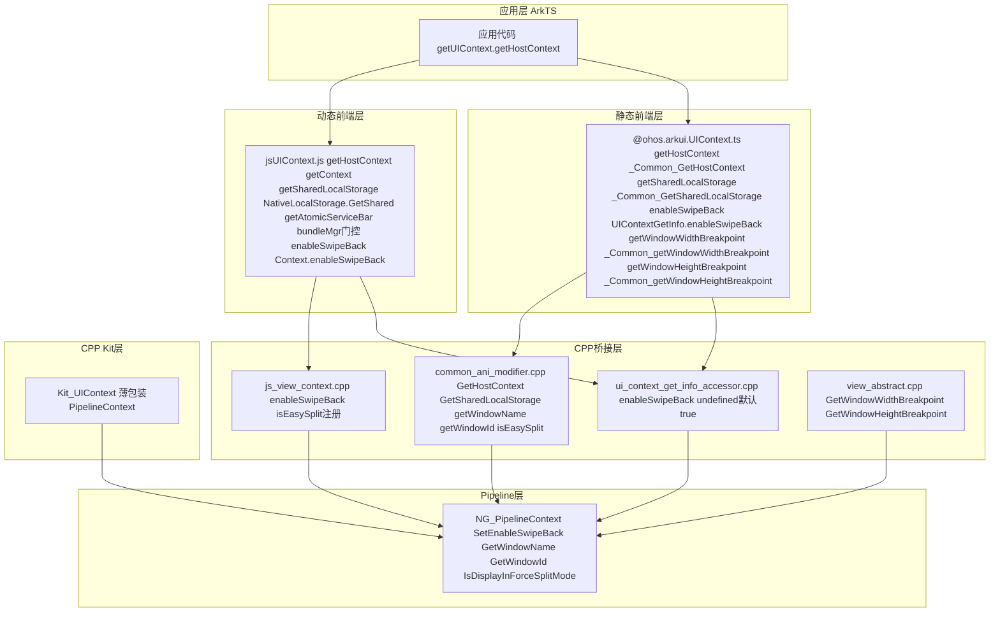

# 架构设计

> 确认目标仓和模块的架构约束、关键设计决策、Spec 拆分方向。

## 设计元数据

| Field | Content |
|-------|---------|
| Design ID | DESIGN-Func-04-12-02 |
| 关联需求 | 已有能力补录（无独立 requirement.md） |
| 关联 Epic | 无 |
| 目标 Feature | Feat-01: Ability上下文与窗口信息 |
| 复杂度 | 标准 |
| 目标版本 | API 10+ (部分 API @since 11, 12) |
| Owner | ArkUI SIG |
| 状态 | Baselined（已有实现补录） |

## 需求基线

| 项 | 补充说明 |
|----|----------|
| UIContext 需提供 Ability 级上下文获取能力 | 通过 `getHostContext()` / `getSharedLocalStorage()` 将 Ability 层信息桥接到 UI 层 |
| 窗口断点信息是响应式布局的关键输入 | `WidthBreakpoint` / `HeightBreakpoint` 基于不同计算模型（VP 阈值 vs 宽高比），需明确规格化 |
| 原子化服务状态栏需门控保护 | `getAtomicServiceBar()` 仅对 `bundleType == 1` 的应用返回有效实例 |
| 滑动返回手势需实例级控制 | `enableSwipeBack()` 是 UIContext 级设置而非全局设置 |
| 窗口标识信息用于多窗口场景 | `getWindowName()` / `getWindowId()` / `isEasySplit()` 在多实例管理中提供窗口级元信息 |

## 上下文和现状

### 涉及仓和模块

| 仓库 | 补充架构说明 |
|------|-------------|
| ace_engine | Ability 上下文与窗口信息的完整实现（动态前端 + 静态前端 + C++ 核心） |
| interface/sdk-js (外部仓) | `@ohos.arkui.UIContext.d.ts` 公共 SDK 类型定义（本仓未 checkout） |

### 调用链层级分析

| 层 | 模块 | 职责 | 修改类型 |
|----|------|------|----------|
| 应用层 (ArkTS) | `UIContext` (ArkTS) | 应用代码通过 `getUIContext().getHostContext()` 等 API 获取 Ability/窗口信息 | 已有实现补录 |
| 动态前端 | `jsUIContext.js` | 动态（声明式）前端实现：lazy 初始化 + `withInstanceId` 上下文隔离 | 已有实现补录 |
| 静态前端 | `@ohos.arkui.UIContext.ts` | 静态 ArkTS 前端实现：eager 初始化 + ANI Sync/Restore 上下文隔离 | 已有实现补录 |
| ANI 桥接层 | `common_ani_modifier.cpp` | 静态前端 C 桥接：GetHostContext / GetSharedLocalStorage / enableSwipeBack / getWindowName / getWindowId / isEasySplit | 已有实现补录 |
| JSI/NAPI 桥接层 | `js_view_context.cpp` | 动态前端 C++ 注册：enableSwipeBack / isEasySplit | 已有实现补录 |
| C++ 核心层 | `view_abstract.cpp` | Breakpoint 计算逻辑：GetWindowWidthBreakpoint / GetWindowHeightBreakpoint | 已有实现补录 |
| Pipeline 层 | `pipeline_context.cpp` | SetEnableSwipeBack / GetWindowName / GetWindowId / IsDisplayInForceSplitMode | 已有实现补录 |
| 原生访问器 | `ui_context_get_info_accessor.cpp` | 静态前端 enableSwipeBack 原生入口（undefined 默认启用） | 已有实现补录 |
| C++ Kit 层 | `ui_context_impl.cpp` | `Kit::UIContext` 提供 C++ 侧等价 API（薄包装 PipelineContext） | 已有实现补录 |

### 适用架构规则

| Rule ID | 适用原因 | 设计结论 | 验证方式 |
|---------|----------|----------|----------|
| OH-ARCH-LAYERING | 调用链跨 ArkTS → JSI/NAPI → C++ 核心 → Pipeline 四层 | 调用方向单向向下，不允许反向依赖 | 代码评审 |
| OH-ARCH-API-LEVEL | 所有 API 为 Public API (@since 10/11/12) | 签名稳定性受 SDK 兼容性约束 | API 评审/XTS |
| OH-ARCH-COMPONENT-BUILD | 无新增构建目标 | 无 BUILD.gn/bundle.json 变更 | 构建验证 |
| OH-ARCH-GATE-CHECK | getAtomicServiceBar 有 bundleType 门控 | 非 Atomic Service 应用调用返回 undefined，无副作用 | 单元测试 |

## 不涉及项承接

| 维度 | 设计结论 |
|------|----------|
| 构建系统影响 | 无变更（纯存量代码补录） |
| 权限变更 | 无新增权限要求 |
| IPC/跨进程 | 无跨进程调用（所有 API 在进程内通过 Pipeline/Container 获取） |
| 新增 API | 无新增 API（本设计为已有实现补录规格化） |
| API 签名变更 | 无签名变更 |
| C-API 层变更 | 无新增 C-API（Breakpoint 等信息通过 ArkUI_Context 侧接口获取） |

## 关键设计决策

| 决策 ID | 问题 | 推荐方案 | 探索过的替代方案 | 取舍理由 | 影响 |
|---------|------|----------|-----------------|----------|------|
| ADR-1 | HeightBreakpoint 使用宽高比而非绝对 VP 阈值 | 保留现状：HeightBreakpoint 基于 H/W 宽高比（阈值 0.8/1.2），WidthBreakpoint 基于 VP 阈值（320/600/840/1440） | 统一为 VP 阈值或统一为宽高比 | HeightBreakpoint 基于宽高比可更好地响应横竖屏切换和折叠屏场景；相同物理高度在不同宽度设备上产生不同结果更符合响应式设计意图 | 开发者需理解两种断点的计算差异，文档需明确标注 |
| ADR-2 | AtomicServiceBar 门控检查：bundleType == 1 | 保留动态前端 JS 层门控逻辑，静态前端通过 ANI 层实现同等门控 | 统一为 TypeScript 层门控或 C++ 层门控 | 动态前端依赖 `bundle.bundleManager.getBundleInfoForSelfSync` 在 JS 层完成检查，静态前端通过 ANI 桥接在原生层完成检查；两种实现路径等效但代码位置不同 | 开发者需预期非 Atomic Service 应用返回 undefined |
| ADR-3 | getHostContext 返回 UIAbilityContext 或 ExtensionContext | 保留动态端语义：根据宿主类型自动返回对应 Context 子类 | 固定返回 UIAbilityContext | UI 实例可能运行在 UIAbility 或 Extension（如 ServiceExtension、FormExtension）场景，返回类型应与宿主匹配 | API 签名需标注为 `UIAbilityContext | ExtensionContext | undefined` |
| ADR-4 | enableSwipeBack 是 UIContext 级而非全局级设置 | 保留现状：每个 UIContext 实例独立控制滑动返回 | 改为全局设置 | 不同 UI 实例（多窗口）可能需要不同的滑动返回策略；UIContext 级设置提供实例隔离 | 开发者需在每个需要控制的 UIContext 上独立调用 |

## 设计骨架

### 骨架范围

| 骨架项 | 目标 | 不包含 | 验证方式 |
|--------|------|--------|----------|
| Ability 上下文获取 | getHostContext / getSharedLocalStorage / getAtomicServiceBar 的获取与门控 | LocalStorage 的状态管理 API（非 UIContext 职责） | 单测/XTS |
| 窗口断点计算 | WidthBreakpoint / HeightBreakpoint 的计算模型与阈值 | 响应式布局组件的具体使用方式 | 单测/XTS |
| 窗口交互控制 | enableSwipeBack 的实例级设置 | 滑动返回手势的底层实现（RootPattern 职责） | 单测/XTS |
| 窗口信息查询 | getWindowName / getWindowId / isEasySplit | 窗口创建/销毁/大小调整（WindowManager 职责） | 单测/XTS |

### 骨架 Spec 拆分

| Task ID | 目标 | 受影响文件 | AC |
|---------|------|-----------|-----|
| TASK-SKELETON-1 | Ability 上下文获取规格 | Feat-01 spec AC-01~03 | getHostContext / getSharedLocalStorage / getAtomicServiceBar |
| TASK-SKELETON-2 | 窗口断点计算规格 | Feat-01 spec AC-04 | WidthBreakpoint / HeightBreakpoint 计算模型 |
| TASK-SKELETON-3 | 窗口交互与信息查询规格 | Feat-01 spec AC-05~07 | enableSwipeBack / getWindowName / getWindowId / isEasySplit |

## 后续 Task 拆分

| Task ID | 目标 | 受影响文件 | 依赖 |
|---------|------|-----------|------|
| TASK-1 | Feat-01 规格文档 | `Feat-01-ability-context-window-info-spec.md` | 无 |
| TASK-2 | Breakpoint 单测覆盖（如需要） | `test/unittest/` 相关目录 | TASK-1 |
| TASK-3 | enableSwipeBack / isEasySplit 单测覆盖 | `test/unittest/` 相关目录 | TASK-1 |

## API 签名、Kit 与权限

### 新增 API

> 以下为已有实现的 API 补录，非新增。

| API 签名 | 类型 | Kit | d.ts 位置 | 权限要求 | SysCap | @since |
|----------|------|-----|-----------|----------|--------|--------|
| `getHostContext(): UIAbilityContext \| ExtensionContext \| undefined` | Public | ArkUI | `@ohos.arkui.UIContext.d.ts` (外部仓) | 无 | SysCap.ArkUI.ArkUI.Full | 10 |
| `getSharedLocalStorage(): LocalStorage \| undefined` | Public | ArkUI | 同上 | 无 | 同上 | 10 |
| `getAtomicServiceBar(): AtomicServiceBarController \| undefined` | Public | ArkUI | 同上 | 无 | 同上 | 11 |
| `getWindowWidthBreakpoint(): WidthBreakpoint` | Public | ArkUI | 同上 | 无 | 同上 | 11 |
| `getWindowHeightBreakpoint(): HeightBreakpoint` | Public | ArkUI | 同上 | 无 | 同上 | 11 |
| `enableSwipeBack(enabled: boolean): void` | Public | ArkUI | 同上 | 无 | 同上 | 11 |
| `getWindowName(): string \| undefined` | Public | ArkUI | 同上 | 无 | 同上 | 12 |
| `getWindowId(): number \| undefined` | Public | ArkUI | 同上 | 无 | 同上 | 12 |
| `isEasySplit(): boolean` | Public | ArkUI | 同上 | 无 | 同上 | 12 |

枚举类型（已有实现补录）：

| 枚举签名 | 类型 | @since | 值定义 |
|----------|------|--------|--------|
| `WidthBreakpoint` | Public | 11 | WIDTH_XS=0, WIDTH_SM=1, WIDTH_MD=2, WIDTH_LG=3, WIDTH_XL=4 |
| `HeightBreakpoint` | Public | 11 | HEIGHT_SM=0, HEIGHT_MD=1, HEIGHT_LG=2 |

> **注**: `getWindowName()` / `getWindowId()` / `isEasySplit()` 虽与 04-12-01 Feat-01（UIContext 核心生命周期）有部分共用，但在本设计中作为 Ability/窗口信息桥接 API 一起规格化。04-12-01 design.md 中已在 API 表列出但未展开详细设计，本设计补充完整行为规格。

### 变更/废弃 API

| 原有 API | 变更类型 | 新 API | 迁移说明 |
|----------|----------|--------|----------|
| 无 | — | — | 无变更 |

## 构建系统影响

### BUILD.gn 变更

无变更。

### bundle.json 变更

无变更。

## 可选设计扩展

### 架构图



### 数据流/控制流

| 步骤 | 调用方 | 被调用方 | 数据/接口 | 说明 |
|------|--------|----------|-----------|------|
| 1 | 应用代码 | UIContext.getHostContext() | `()` | 获取宿主 Ability 上下文 |
| 2a | 动态前端 | getContext() | `()` | JS 全局方法，返回 UIAbilityContext 或 ExtensionContext |
| 2b | 静态前端 | ArkUIAniModule._Common_GetHostContext | `(instanceId)` | ANI 桥接 → Frontend::GetHostContext() |
| 3 | 应用代码 | UIContext.getSharedLocalStorage() | `()` | 获取共享 LocalStorage |
| 4a | 动态前端 | NativeLocalStorage.GetShared() | `()` | JS 层获取当前实例的共享存储 |
| 4b | 静态前端 | _Common_GetSharedLocalStorage | `()` | ANI 桥接 → Frontend::GetSharedStorage(currentInstance) |
| 5 | 应用代码 | UIContext.getAtomicServiceBar() | `()` | 获取原子化服务状态栏控制器 |
| 6 | 动态前端 | bundleMgr.getBundleInfoForSelfSync | `()` → `bundleType == 1` | JS 层门控检查 |
| 7 | 应用代码 | UIContext.getWindowWidthBreakpoint() | `()` | 获取宽度断点 |
| 8 | C++ 核心 | ViewAbstract::GetWindowWidthBreakpoint | `()` → width VP → 枚举 | 基于绝对 VP 阈值 |
| 9 | 应用代码 | UIContext.getWindowHeightBreakpoint() | `()` | 获取高度断点 |
| 10 | C++ 核心 | ViewAbstract::GetWindowHeightBreakpoint | `()` → H/W → 枚举 | **基于宽高比**，非绝对 VP |
| 11 | 应用代码 | UIContext.enableSwipeBack(true/false) | `(enabled)` | 设置滑动返回 |
| 12 | Pipeline | PipelineContext::SetEnableSwipeBack | `(isEnable)` | 写入 RootPattern |
| 13 | 应用代码 | UIContext.getWindowName() | `()` | 获取窗口名称 |
| 14 | Pipeline | PipelineContext::GetWindowName | `()` → string | 从 Window 获取 |
| 15 | 应用代码 | UIContext.getWindowId() | `()` | 获取窗口 ID |
| 16 | Pipeline | PipelineContext::GetWindowId | `()` → int32 | 从 Window 获取 |

### 线程与并发模型

| 操作 | 发起线程 | 执行线程 | 线程安全 | 重入约束 |
|------|----------|----------|----------|----------|
| `getHostContext()` | UI 线程 | UI 线程 | getContext() 是线程局部 | 可重入 |
| `getSharedLocalStorage()` | UI 线程 | UI 线程 | NativeLocalStorage.GetShared 使用实例 ID 确定实例 | 可重入 |
| `getAtomicServiceBar()` | UI 线程 | UI 线程 | bundleMgr.getBundleInfoForSelfSync 为同步 NAPI | 非并发安全（内部缓存 atomServiceBar） |
| `getWindowWidthBreakpoint()` | UI 线程 | UI 线程 | Container::Current() 使用线程局部 | 可重入 |
| `getWindowHeightBreakpoint()` | UI 线程 | UI 线程 | 同上 | 可重入 |
| `enableSwipeBack()` | UI 线程 | UI 线程 | PipelineContext 单实例 | 单次调用 |
| `getWindowName()` | UI 线程 | UI 线程 | 同上 | 可重入 |
| `getWindowId()` | UI 线程 | UI 线程 | 同上 | 可重入 |
| `isEasySplit()` | UI 线程 | UI 线程 | 同上 | 可重入 |

### 接口参数规约

| 接口 | 参数 | 类型 | 合法范围 | 非法处理 | 边界说明 |
|------|------|------|----------|----------|----------|
| getHostContext | (无参数) | — | — | 返回 undefined | Frontend 不可获取时返回 undefined |
| getSharedLocalStorage | (无参数) | — | — | 返回 undefined/null | SharedStorage 不存在时返回 undefined |
| getAtomicServiceBar | (无参数) | — | — | bundleType != 1 返回 undefined；bundleMgr 不可获取返回 undefined | 仅 Atomic Service 应用有效 |
| getWindowWidthBreakpoint | (无参数) | — | — | container null → -2 (WIDTH_XS)；window null → -3 (WIDTH_XS) | 容器/窗口不存在时返回错误码映射为默认枚举值 |
| getWindowHeightBreakpoint | (无参数) | — | — | 同上 | width=0 时 aspectRatio=0 → HEIGHT_SM |
| enableSwipeBack | enabled | boolean | true/false | undefined → 等同 true | 非布尔类型时动态前端忽略（js_view_context.cpp:1403-1408） |
| getWindowName | (无参数) | — | — | 空字符串 | 窗口不存在时返回空字符串 |
| getWindowId | (无参数) | — | — | -1 (动态) / undefined (静态) | 容器不存在时返回 -1 |
| isEasySplit | (无参数) | — | — | false | PipelineContext 不可获取时返回 false |

## 详细设计

### getHostContext 与 getSharedLocalStorage

#### getHostContext

**动态前端** (`jsUIContext.js:808-811`)：
```javascript
getHostContext() {
    return withInstanceId(this.instanceId_, () => {
        return getContext();
    });
}
```
调用 JS 全局函数 `getContext()`，该函数由 AbilityRuntime 框架注入。在 UIAbility 场景返回 `UIAbilityContext`，在 Extension 场景返回 `ExtensionContext`。

**静态前端** (`@ohos.arkui.UIContext.ts:975-977`)：
```typescript
getHostContext(): Context | undefined {
    return ArkUIAniModule._Common_GetHostContext(this.instanceId_);
}
```
通过 ANI 桥接调用 C++ 层 `Frontend::GetHostContext()`，返回值为 NAPI 包装的 Context 对象。

**C++ 桥接** (`common_ani_modifier.cpp:130-143`)：
```cpp
// 通过 Frontend->GetHostContext() 获取宿主上下文
// Frontend 实现中根据 Ability 类型返回不同 Context 子类
```

**返回值类型差异**：
- 动态前端：`UIAbilityContext | ExtensionContext | undefined`（通过 getContext() 的运行时类型）
- 静态前端：`Context | undefined`（类型系统为通用 Context，运行时实际为 UIAbilityContext 或 ExtensionContext）
- SDK d.ts：`Context | undefined`（使用通用类型，但 JSDoc 注释说明运行时子类型）

#### getSharedLocalStorage

**动态前端** (`jsUIContext.js:814-817`)：
```javascript
getSharedLocalStorage() {
    return withInstanceId(this.instanceId_, () => {
        return NativeLocalStorage.GetShared();
    });
}
```

**静态前端** (`@ohos.arkui.UIContext.ts:924-926`)：
```typescript
public getSharedLocalStorage(): LocalStorage | undefined {
    return ArkUIAniModule._Common_GetSharedLocalStorage();
}
```

**C++ 桥接** (`common_ani_modifier.cpp:292-309`)：
```cpp
// 通过 Frontend->GetSharedStorage(currentInstance) 获取共享 LocalStorage
// currentInstance 由 Container::CurrentIdSafely() 确定
```

`NativeLocalStorage.GetShared()` 是 JS 层的同步调用，返回与当前 UI 实例绑定的共享 LocalStorage 实例。不同 UI 实例的共享 LocalStorage 是独立的。

**返回值差异**：
- 动态前端：返回 `LocalStorage | null`（NativeLocalStorage.GetShared 在不存在时返回 null）
- 静态前端：返回 `LocalStorage | undefined`

### getAtomicServiceBar 与 bundleType 门控

**动态前端** (`jsUIContext.js:765-777`)：
```javascript
getAtomicServiceBar() {
    const bundleMgr = globalThis.requireNapi('bundle.bundleManager');
    if (!bundleMgr || !bundleMgr.BundleFlag) {
        return undefined;
    }
    let data = bundleMgr.getBundleInfoForSelfSync(bundleMgr.BundleFlag.GET_BUNDLE_INFO_WITH_APPLICATION);
    if (data.appInfo.bundleType == 1) {
        this.atomServiceBar = new AtomicServiceBar(this.instanceId_);
        return this.atomServiceBar;
    } else {
        return undefined;
    }
}
```

门控逻辑三步：
1. 获取 `bundle.bundleManager` NAPI 模块 → 若模块不可获取，直接返回 `undefined`
2. 同步获取 Bundle 信息 → `getBundleInfoForSelfSync(GET_BUNDLE_INFO_WITH_APPLICATION)`
3. 检查 `bundleType == 1` → 仅 Atomic Service 应用才创建 AtomicServiceBar 实例

**静态前端** (`@ohos.arkui.UIContext.ts:993-995`)：
```typescript
public getAtomicServiceBar(): Nullable<AtomicServiceBar> {
    return this.atomicServiceBar_;
}
```
静态前端在构造时通过 `AtomicServiceBarInternal` 创建实例 (`@ohos.arkui.UIContext.ts:771,788`)，门控检查在 ANI 层完成。`Nullable<T>` 类型在 TS 层对应 `T | undefined`。

**AtomicServiceBar 控制器能力** (`jsUIContext.js:1847-1887`)：
- `setVisible(visible: boolean)` — 控制状态栏可见性
- `setBackgroundColor(color: string)` — 设置背景色
- `setTitleContent(builder: CustomBuilder)` — 设置标题内容
- `setTitleFontStyle(fontStyle: AtomicServiceBarFontStyle)` — 设置标题字体样式
- `setIconColor(color: string)` — 设置图标颜色
- `getBarRect(): Rect` — 获取状态栏矩形区域
- `onBarRectChange(callback: (rect: Rect) => void)` — 监听状态栏矩形区域变化

### WidthBreakpoint/HeightBreakpoint 断点计算

#### WidthBreakpoint（绝对 VP 阈值）

**C++ 核心实现** (`view_abstract.cpp:12209-12234`)：
```cpp
int32_t ViewAbstract::GetWindowWidthBreakpoint() {
    auto container = Container::Current();
    CHECK_NULL_RETURN(container, -2);  // container is null
    auto window = container->GetWindow();
    CHECK_NULL_RETURN(window, -3);     // window is null
    double density = PipelineBase::GetCurrentDensity();
    double width = 0.0;
    if (NearZero(density)) {
        width = window->GetCurrentWindowRect().Width();  // density=0 时直接使用像素值
    } else {
        width = window->GetCurrentWindowRect().Width() / density;  // 转换为 VP
    }
    WidthBreakpoint breakpoint;
    if (width < WIDTH_BREAKPOINT_320VP) {
        breakpoint = WidthBreakpoint::WIDTH_XS;
    } else if (width < WIDTH_BREAKPOINT_600VP) {
        breakpoint = WidthBreakpoint::WIDTH_SM;
    } else if (width < WIDTH_BREAKPOINT_840VP) {
        breakpoint = WidthBreakpoint::WIDTH_MD;
    } else if (width < WIDTH_BREAKPOINT_1440VP) {
        breakpoint = WidthBreakpoint::WIDTH_LG;
    } else {
        breakpoint = WidthBreakpoint::WIDTH_XL;
    }
    return static_cast<uint32_t>(breakpoint);
}
```

阈值常量 (`view_abstract.cpp:92-95`)：
```
WIDTH_BREAKPOINT_320VP = 320.0
WIDTH_BREAKPOINT_600VP = 600.0
WIDTH_BREAKPOINT_840VP = 840.0
WIDTH_BREAKPOINT_1440VP = 1440.0
```

计算步骤：
1. 获取当前 Container → Window → 窗口矩形 Width
2. 使用 display density 将像素值转换为 VP（density=0 时直接使用像素值）
3. 依据 VP 阈值进行五级划分（XS/SM/MD/LG/XL）

枚举定义 (`view_abstract.cpp:90`)：
```cpp
enum class WidthBreakpoint { WIDTH_XS, WIDTH_SM, WIDTH_MD, WIDTH_LG, WIDTH_XL };
```

#### HeightBreakpoint（宽高比计算 — **关键差异**）

**C++ 核心实现** (`view_abstract.cpp:12237-12260`)：
```cpp
int32_t ViewAbstract::GetWindowHeightBreakpoint() {
    auto container = Container::Current();
    CHECK_NULL_RETURN(container, -2);  // container is null
    auto window = container->GetWindow();
    CHECK_NULL_RETURN(window, -3);     // window is null
    auto width = window->GetCurrentWindowRect().Width();
    auto height = window->GetCurrentWindowRect().Height();
    auto aspectRatio = 0.0;
    if (NearZero(width)) {
        aspectRatio = 0.0;   // width=0 时宽高比取 0
    } else {
        aspectRatio = height / width;  // 宽高比 = 高度/宽度
    }
    HeightBreakpoint breakpoint;
    if (aspectRatio < HEIGHT_ASPECTRATIO_THRESHOLD1) {  // 0.8
        breakpoint = HeightBreakpoint::HEIGHT_SM;
    } else if (aspectRatio < HEIGHT_ASPECTRATIO_THRESHOLD2) {  // 1.2
        breakpoint = HeightBreakpoint::HEIGHT_MD;
    } else {
        breakpoint = HeightBreakpoint::HEIGHT_LG;
    }
    return static_cast<uint32_t>(breakpoint);
}
```

阈值常量 (`view_abstract.cpp:96-97`)：
```
HEIGHT_ASPECTRATIO_THRESHOLD1 = 0.8
HEIGHT_ASPECTRATIO_THRESHOLD2 = 1.2
```

**关键差异说明**：
- WidthBreakpoint 使用 **绝对 VP 阈值**：先转 VP，再按阈值划分
- HeightBreakpoint 使用 **宽高比 (H/W)**：不转 VP，直接用像素值计算 H/W 比值，再按比值划分
- 原因：HeightBreakpoint 基于宽高比可更好地响应横竖屏切换和折叠屏场景。相同物理高度在不同宽度设备上产生不同结果，更符合响应式设计意图

**静态前端错误处理** (`@ohos.arkui.UIContext.ts:1213-1222`)：
```typescript
private handleBreakpointError(ret: int32, type: string) {
    if (ret === -1) {
        console.error("some error occurred while initializing the ANI environment...");
    }
    if (ret === -2) {
        console.error("failed to retrieve the current container...");
    }
    if (ret === -3) {
        console.error("failed to retrieve the current window...");
    }
}
```

当 C++ 层返回负值错误码时：
- 静态前端打印错误日志并返回默认枚举值（WIDTH_XS / HEIGHT_SM）
- 动态前端通过 `getUINativeModule().common.getWindowWidthBreakpoint()` 调用，依赖 C++ 层返回

### enableSwipeBack

**动态前端** (`jsUIContext.js:1032-1035`)：
```javascript
enableSwipeBack(enabled) {
    withInstanceId(this.instanceId_, () => {
        Context.enableSwipeBack(enabled);
    });
}
```

**C++ NAPI 桥接** (`js_view_context.cpp:1401-1414`)：
```cpp
void JSViewContext::SetEnableSwipeBack(const JSCallbackInfo& info) {
    if (info.Length() < 1) { return; }
    if (!info[0]->IsBoolean()) { return; }  // 非布尔类型时静默忽略
    auto container = Container::CurrentSafely();
    CHECK_NULL_VOID(container);
    auto pipelineContext = container->GetPipelineContext();
    CHECK_NULL_VOID(pipelineContext);
    pipelineContext->SetEnableSwipeBack(info[0]->ToBoolean());
}
```

**静态前端** (`@ohos.arkui.UIContext.ts:1196-1199`)：
```typescript
public enableSwipeBack(enabled: boolean | undefined): void {
    ArkUIAniModule._Common_Sync_InstanceId(this.instanceId_)
    UIContextGetInfo.enableSwipeBack(enabled);
    ArkUIAniModule._Common_Restore_InstanceId()
}
```

**ANI 桥接** (`ui_context_get_info_accessor.cpp:52-62`)：
```cpp
// undefined 参数 → 默认启用（等同于 true）
// 实现: bool isEnable = true; if (value != undefined) isEnable = value;
```

**Pipeline 层** (`pipeline_context.cpp:7907-7913`)：
```cpp
void PipelineContext::SetEnableSwipeBack(bool isEnable) {
    // 写入 RootPattern，控制滑动返回手势的启用/禁用
    auto rootPattern = GetRootPattern();
    CHECK_NULL_VOID(rootPattern);
    rootPattern->SetEnableSwipeBack(isEnable);
}
```

**行为差异**：
- 动态前端：非布尔参数时静默忽略（不调用 Pipeline）
- 静态前端：`undefined` 参数等同于 `true`（默认启用）
- 两者的差异是因为动态前端在 NAPI 层做类型检查，静态前端在 ANI 层将 undefined 转为 true

**UIContext 级设置**：`enableSwipeBack` 是每个 UIContext 实例独立的设置，通过 `PipelineContext::SetEnableSwipeBack()` 写入对应实例的 `RootPattern`。不同 UI 实例（多窗口）可独立控制滑动返回。

## 风险和开放问题

| 项 | 类型 | 影响 | 处理方式 | Owner |
|----|------|------|----------|-------|
| HeightBreakpoint 与 WidthBreakpoint 计算模型差异 | API | 中 | 文档需明确标注；开发者易误解 HeightBreakpoint 为绝对高度分类 | ArkUI SIG |
| getAtomicServiceBar 门控在动态/静态前端实现路径不同 | 架构 | 低 | 行为等效（仅 bundleType==1 返回有效实例），实现路径不影响 API 行为 | ArkUI SIG |
| enableSwipeBack 参数处理差异（动态忽略/静态 undefined=true） | API | 中 | 需在兼容性声明中标注；开发者应始终传入明确的 boolean 值 | ArkUI SIG |
| getHostContext 返回类型在动态/静态前端类型系统不一致 | API | 低 | SDK d.ts 使用通用 `Context` 类型，运行时实际返回 UIAbilityContext 或 ExtensionContext | ArkUI SIG |
| interface/sdk-js 仓未 checkout，API @since 版本未经 d.ts 验证 | 测试 | 低 | 依赖动态前端 jsUIContext.js 的 class-level @since 标注 | ArkUI SIG |
| Breakpoint 错误码 -2/-3 在动态前端未做显式错误处理 | 架构 | 低 | 动态前端依赖 C++ 层返回值直接传递到 JS 层；静态前端有显式 handleBreakpointError | ArkUI SIG |

## 设计审批

- [x] 需求基线已确认，设计覆盖 P0/P1 AC
- [x] 不涉及项已承接，N/A 和展开项都有结论
- [x] 涉及仓和模块职责清楚
- [x] 调用链层级分析完整，每层覆盖到位
- [x] 适用架构规则已识别并形成设计结论
- [x] 分层和子系统边界合规
- [x] API 变更有签名、权限、错误码和兼容性说明
- [x] BUILD.gn/bundle.json 影响明确
- [x] 设计输出和后续 Task 拆分明确
- [x] 关键设计决策有理由和影响说明
- [x] 风险和开放问题有 Owner

**结论:** 通过（已有实现补录）
