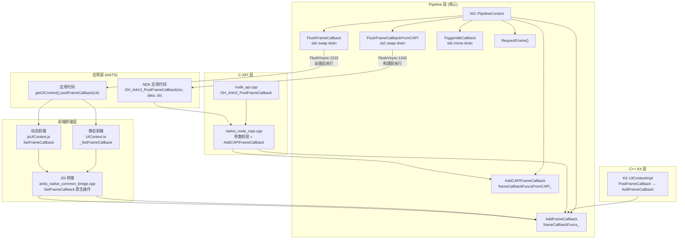
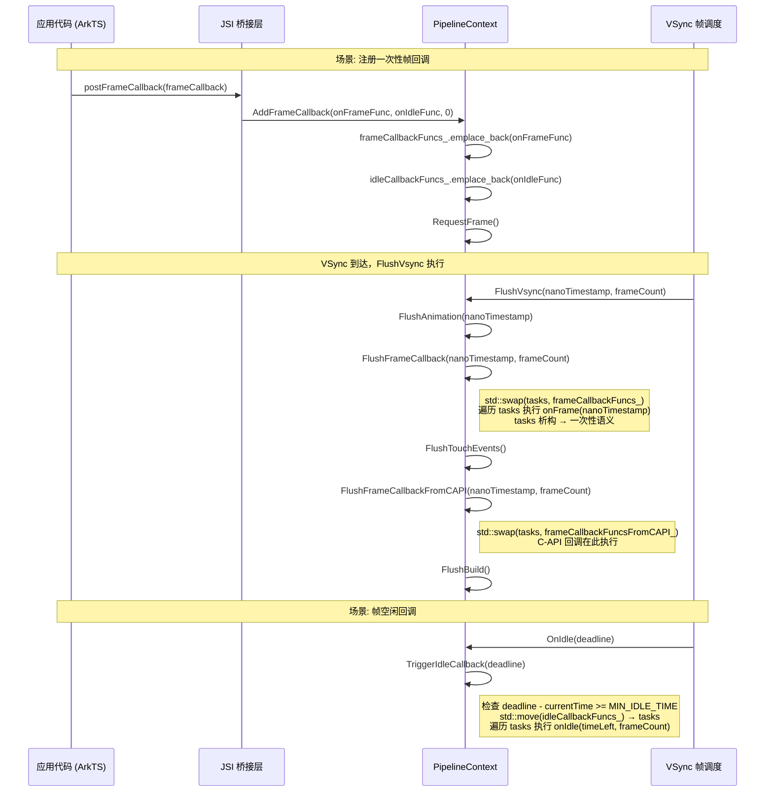

# 架构设计

> 确认目标仓和模块的架构约束、关键设计决策、Spec 拆分方向。

## 设计元数据

| Field | Content |
|-------|---------|
| Design ID | DESIGN-Func-04-12-03 |
| 关联需求 | 已有能力补录（无独立 requirement.md） |
| 关联 Epic | UI上下文 (04-12) |
| 目标 Feature | Feat-01: Frame回调与动画调度 |
| 复杂度 | 标准 |
| 目标版本 | API 12+ (动态版), API 23+ (静态版), API 16+ (C-API OH_ArkUI_PostFrameCallback), API 20+ (C-API OH_ArkUI_PostIdleCallback) |
| Owner | ArkUI SIG |
| 状态 | Baselined（已有实现补录） |

## 需求基线

| 项 | 补充说明 |
|----|----------|
| postFrameCallback 提供一次性帧回调机制 | 开发者通过 UIContext.postFrameCallback 注册 onFrame/onIdle 回调，回调在下一帧被执行后自动从列表中移除，不会自动重注册 |
| postDelayedFrameCallback 提供延迟帧回调机制 | 开发者通过 UIContext.postDelayedFrameCallback 在指定毫秒数后注册帧回调，延迟到期后回调进入帧调度列表 |
| ArkTS 与 C-API 帧回调时序存在差异 | ArkTS 帧回调在 FlushAnimation 后执行，C-API 帧回调在 FlushBuild 前、FlushTouchEvents 前执行，两者不在同一 drain 阶段 |
| 帧空闲回调仅在剩余时间充足时执行 | onIdle/OH_ArkUI_PostIdleCallback 回调仅在帧空闲时间 >= MIN_IDLE_TIME (1ms) 时执行，否则推迟到下一帧 |
| C-API 帧回调必须线程安全 | OH_ArkUI_PostFrameCallback/OH_ArkUI_PostIdleCallback 必须在 UI 线程调用，非 UI 线程返回错误码 |

## 上下文和现状

### 涉及仓和模块

| 仓库 | 补充架构说明 |
|------|-------------|
| ace_engine | 帧回调完整实现：ArkTS 桥接层 + PipelineContext 核心 + C-API 层 |
| interface/sdk-js (外部仓) | `@ohos.arkui.UIContext.d.ts` / `UIContext.static.d.ets` 公共 SDK 类型定义（本仓未 checkout） |

### 调用链层级分析

| 层 | 模块 | 职责 | 修改类型 |
|----|------|------|----------|
| 应用层 (ArkTS) | `UIContext` (ArkTS) | 应用代码通过 `getUIContext().postFrameCallback(frameCallback)` 注册帧回调 | 已有实现补录 |
| 静态前端 | `@ohos.arkui.UIContext.ts` | 静态 ArkTS 前端桥接：postFrameCallback → ArkUIAniModule._SetFrameCallback | 已有实现补录 |
| 动态前端 | `jsUIContext.js` | 动态声明式前端桥接：postFrameCallback → jsBridge 调用 SetFrameCallback | 已有实现补录 |
| JSI 桥接层 | `arkts_native_common_bridge.cpp` | SetFrameCallback 原生操作：解析 FrameCallback 参数，调用 PipelineContext::AddFrameCallback | 已有实现补录 |
| Pipeline 层 | `pipeline_context.h/.cpp` | 帧回调核心实现：AddFrameCallback 注册、FlushFrameCallback/FlushFrameCallbackFromCAPI drain、TriggerIdleCallback 空闲回调 | 已有实现补录 |
| C-API 层 | `node_api.cpp` / `native_node_napi.cpp` | OH_ArkUI_PostFrameCallback/OH_ArkUI_PostIdleCallback 实现：参数校验 + AddCAPIFrameCallback/AddFrameCallback | 已有实现补录 |
| C++ Kit 层 | `ui_context.h` / `ui_context_impl.cpp` | Kit::UIContext PostFrameCallback 薄包装 PipelineContext::AddFrameCallback | 已有实现补录 |

### 适用架构规则

| Rule ID | 适用原因 | 设计结论 | 验证方式 |
|---------|----------|----------|----------|
| OH-ARCH-LAYERING | 调用链跨 ArkTS→JSI→Pipeline→C-API 四层 | 调用方向单向向下，不允许反向依赖；C-API 直接调用 Pipeline 层不经过 JSI | 代码评审 |
| OH-ARCH-API-LEVEL | postFrameCallback 是 Public API (@since 12) | 签名稳定性受 SDK 兼容性约束；C-API 使用 ArkUI_ErrorCode 返回值 | API 评审/XTS |
| OH-ARCH-COMPONENT-BUILD | 无新增构建目标 | 无 BUILD.gn/bundle.json 变更 | 构建验证 |
| OH-ARCH-THREAD-SAFETY | C-API 帧回调必须在 UI 线程调用 | PipelineContext::CheckThreadSafe() 检查；非 UI 线程返回错误码 | C-API 单测 |

## 不涉及项承接

| 维度 | 设计结论 |
|------|----------|
| 动画 API (animateTo/animateToImmediately/keyframeAnimateTo/createAnimator) | 属于 04-12-01 Feat-04，本设计不覆盖 |
| DynamicSyncScene/setFrameRateRange | 属于 04-12-01 Feat-04，本设计不覆盖 |
| 构建系统影响 | 无变更（纯存量代码补录） |
| 权限变更 | 无新增权限要求 |
| IPC/跨进程 | 无跨进程调用（帧回调为进程内 VSync 帧调度机制） |

## 关键设计决策

| 决策 ID | 问题 | 推荐方案 | 探索过的替代方案 | 取舍理由 | 影响 |
|---------|------|----------|-----------------|----------|------|
| ADR-1 | postFrameCallback 回调的生命周期语义：一次性 vs 持续注册 | 采用一次性语义：每帧通过 std::swap drain 回调列表，回调执行后从列表移除 | 持续注册（回调执行后保留在列表中，每帧自动触发） | 一次性语义与 Web requestAnimationFrame 一致；持续注册场景下开发者忘记移除回调会导致内存泄漏和性能退化；开发者可自行在回调末尾重新调用 postFrameCallback 实现持续帧回调 | 开发者需注意一次性语义，每帧需重新注册 |
| ADR-2 | ArkTS 与 C-API 帧回调执行时序不一致 | 保留双列表独立 drain 设计：ArkTS 帧回调在 FlushAnimation 后执行（FlushVsync:1215），C-API 帧回调在 FlushBuild 前/FlushTouchEvents 前执行（FlushVsync:1242） | 统一时序，合并为单一回调列表在同一个 drain 阶段 | ArkTS 帧回调需要在动画刷新后读取动画中间态属性（如位置偏移），C-API 帧回调更关注构建前属性修改；两者时序需求不同 | 下游消费者需关注 API 类型的时序差异 |
| ADR-3 | 回调列表使用 std::list 而非优先级队列 | 保留 std::list + emplace_back 的插入顺序执行机制 | 使用优先级队列按优先级排序执行 | 帧回调场景下优先级差异不明显；插入顺序执行更简单可预测，避免优先级管理的额外复杂度 | 回调按注册顺序执行，无优先级机制 |
| ADR-4 | 空闲回调 MIN_IDLE_TIME 门槛设置 | 保留 1ms (MIN_IDLE_TIME) 门槛：剩余空闲时间 < 1ms 时推迟回调到下一帧 | 移除门槛，任何剩余时间都执行回调 | 1ms 门槛确保回调有足够执行时间完成有意义的工作；低于 1ms 执行回调大概率无法完成有意义操作且增加帧延迟风险 | 极短空闲帧不会触发空闲回调 |
| ADR-5 | C-API 帧回调与空闲回调拆分为独立 API | OH_ArkUI_PostFrameCallback（帧回调，API 16+）和 OH_ArkUI_PostIdleCallback（空闲回调，API 20+）为独立 C 函数 | 合并为单一 OH_ArkUI_PostFrameCallback 包含帧回调 + 空闲回调 | C-API 追求最小化参数和明确语义；拆分后每个 API 参数更简洁，错误码处理更独立；API 版本演进也更灵活 | C-API 调用者需分别调用两个 API |
| ADR-6 | 延迟帧回调基于 PostDelayedTask 而非直接延迟执行 | 保留 PostDelayedTask 机制：延迟到期后回调加入 frameCallbackFuncs_ 并 RequestFrame | 直接在延迟时间点执行回调 | 帧回调必须在 VSync 帧调度中执行以保证时序正确性；PostDelayedTask 延迟到期后加入帧回调列表等待下一个 VSync 执行，确保回调在正确的帧阶段执行 | 延迟精度取决于 VSync 周期，不是毫秒级精确 |

## 设计骨架

### 骨架范围

| 骨架项 | 目标 | 不包含 | 验证方式 |
|--------|------|--------|----------|
| postFrameCallback 一次性帧回调 | 注册、drain 执行、一次性语义 | 动画 API（animateTo 等，04-12-01 Feat-04） | 单测/XTS |
| postDelayedFrameCallback 延迟帧回调 | PostDelayedTask 延迟注册、WeakClaim 生命周期保护 | DynamicSyncScene 帧率偏好（04-12-01 Feat-04） | 单测 |
| onIdle 帧空闲回调 | MIN_IDLE_TIME 门槛、推迟执行 | — | 单测 |
| C-API OH_ArkUI_PostFrameCallback | 参数校验、线程安全检查、独立 drain | OH_ArkUI_PostIdleCallback 独立规格（同本 Feat） | C-API 单测 |
| C-API OH_ArkUI_PostIdleCallback | 参数校验、空闲回调 drain | — | C-API 单测 |

### 骨架 Spec 拆分

| Task ID | 目标 | 受影响文件 | AC |
|---------|------|-----------|-----|
| TASK-SKELETON-1 | 帧回调与调度完整规格 | Feat-01 spec | AC-1.1~5.3 |

## 后续 Task 拆分

| Task ID | 目标 | 受影响文件 | 依赖 |
|---------|------|-----------|------|
| TASK-1 | Feat-01 规格文档 | `Feat-01-frame-callback-scheduling-spec.md` | 无 |

## API 签名、Kit 与权限

### 新增 API

> 以下为已有实现的 API 补录，非新增。

| API 签名 | 类型 | Kit | d.ts 位置 | 权限要求 | SysCap |
|----------|------|-----|-----------|----------|--------|
| `postFrameCallback(frameCallback: FrameCallback): void` | Public (ArkTS) | ArkUI | `@ohos.arkui.UIContext.d.ts` (外部仓) | 无 | SysCap.ArkUI.ArkUI.Full |
| `postDelayedFrameCallback(frameCallback: FrameCallback, delayTime: number): void` | Public (ArkTS 动态版) | ArkUI | 同上 | 无 | 同上 |
| `postDelayedFrameCallback(frameCallback: FrameCallback, delayTime: long): void` | Public (ArkTS 静态版) | ArkUI | `@ohos.arkui.UIContext.static.d.ets` (外部仓) | 无 | 同上 |
| `abstract class FrameCallback { onFrame?(frameTimeInNano: number): void; onIdle?(timeLeftInNano: number): void }` (动态版) | Public (ArkTS) | ArkUI | 同上 | 无 | 同上 |
| `abstract class FrameCallback { onFrame?(frameTimeInNano: long): void; onIdle?(timeLeftInNano: long): void }` (静态版) | Public (ArkTS) | ArkUI | 同上 | 无 | 同上 |
| `int32_t OH_ArkUI_PostFrameCallback(ArkUI_ContextHandle uiContext, void* userData, void (*callback)(uint64_t nanoTimestamp, uint32_t frameCount, void* userData))` | Public (C-API) | ArkUI | `native_node_napi.h` | 无 | 同上 |
| `int32_t OH_ArkUI_PostIdleCallback(ArkUI_ContextHandle uiContext, void* userData, void (*callback)(uint64_t nanoTimeLeft, uint32_t frameCount, void* userData))` | Public (C-API) | ArkUI | `native_node_napi.h` | 无 | 同上 |
| `void Kit::UIContext::PostFrameCallback(std::function<void(uint64_t)>&& callback)` | Inner (C++ Kit) | ArkUI | `ui_context.h` | 无 | N/A |

### 变更/废弃 API

| 原有 API | 变更类型 | 新 API | 迁移说明 |
|----------|----------|--------|----------|
| 无 | — | — | 无变更 |

## 构建系统影响

### BUILD.gn 变更

无变更。

### bundle.json 变更

无变更。

## 可选设计扩展

### 架构图



### 时序设计



### 线程与并发模型

| 操作 | 发起线程 | 回调线程 | 线程安全 | 重入约束 |
|------|----------|----------|----------|----------|
| ArkTS postFrameCallback | UI 线程 | UI 线程 (VSync 回调) | JSI 层在 UI 线程执行 | 回调中可再次调用 postFrameCallback |
| C-API OH_ArkUI_PostFrameCallback | 必须为 UI 线程 | UI 线程 (VSync 回调) | CheckThreadSafe() 校验 | 非 UI 线程返回 ERROR_CODE_NATIVE_IMPL_NOT_MAIN_THREAD |
| postDelayedFrameCallback 延迟回调 | UI 线程注册 | UI 线程 (PostDelayedTask → VSync) | WeakClaim(this) 防止 Pipeline 销毁后执行 | Pipeline 销毁后 Upgrade() 返回 nullptr，回调不执行 |
| onIdle 空闲回调 | UI 级注册 | UI 线程 (OnIdle) | 同帧回调 | 回调后重新获取时间，可判断是否继续执行 |
| Kit::UIContext::PostFrameCallback | UI 线程 | UI 线程 | 薄包装 AddFrameCallback | 同帧回调约束 |

### 接口参数规约

| 接口 | 参数 | 类型 | 合法范围 | 非法处理 | 边界说明 |
|------|------|------|----------|----------|----------|
| postFrameCallback | frameCallback | FrameCallback | 非 null/undefined 的 FrameCallback 实例 | null/undefined 时 JSI 层短路返回 undefined，不注册回调 | onFrame/onIdle 至少一个需已定义 |
| postDelayedFrameCallback | delayTime | number (动态) / long (静态) | >= 0 为立即注册；> 0 为延迟毫秒数 | <= 0 时等同于 postFrameCallback | 延迟精度取决于 VSync 周期 |
| OH_ArkUI_PostFrameCallback | uiContext | ArkUI_ContextHandle | 有效的 UI 上下文句柄 | nullptr 返回 ARKUI_ERROR_CODE_UI_CONTEXT_INVALID | — |
| OH_ArkUI_PostFrameCallback | callback | void(*)(uint64_t, uint32_t, void*) | 有效的函数指针 | nullptr 返回 ARKUI_ERROR_CODE_CALLBACK_INVALID | 必须在 UI 线程调用 |
| OH_ArkUI_PostIdleCallback | callback | void(*)(uint64_t, uint32_t, void*) | 有效的函数指针 | nullptr 返回 ARKUI_ERROR_CODE_CALLBACK_INVALID | API 20+ |

## 详细设计

### postFrameCallback 一次性回调机制

postFrameCallback 是 UIContext 上的帧回调注册接口，其核心设计是**一次性语义**（one-shot）：回调在注册后的下一个 VSync 帧中被执行，执行后自动从回调列表中移除，不会在后续帧中自动再次执行。开发者如需持续帧回调，必须在每帧回调末尾重新调用 postFrameCallback。

**一次性语义的实现机制**（pipeline_context.cpp:7177-7191）：

```cpp
void PipelineContext::FlushFrameCallback(uint64_t nanoTimestamp, uint64_t frameCount)
{
    if (frameCount == UINT64_MAX) {
        RequestFrame();
        return;
    }
    if (!frameCallbackFuncs_.empty()) {
        decltype(frameCallbackFuncs_) tasks;
        std::swap(tasks, frameCallbackFuncs_);  // ← 一次性语义的关键：swap 移出
        for (const auto& frameCallbackFunc : tasks) {
            frameCallbackFunc(nanoTimestamp);
        }
    }
}
```

`std::swap(tasks, frameCallbackFuncs_)` 将当前帧所有回调移到临时 `tasks` 列表，原 `frameCallbackFuncs_` 变为空列表。遍历执行 `tasks` 后，临时对象析构销毁所有回调。下一帧 `frameCallbackFuncs_` 为空，不会自动再次执行。

**注册路径**（pipeline_context.cpp:6340-6352）：

```cpp
void PipelineContext::AddFrameCallback(
    FrameCallbackFunc&& frameCallbackFunc, IdleCallbackFunc&& idleCallbackFunc, int64_t delayMillis)
{
    if (delayMillis <= 0) {
        if (frameCallbackFunc != nullptr) {
            frameCallbackFuncs_.emplace_back(std::move(frameCallbackFunc));
        }
        if (idleCallbackFunc != nullptr) {
            idleCallbackFuncs_.emplace_back(std::move(idleCallbackFunc));
        }
        RequestFrame();
        return;
    }
    // delayMillis > 0: PostDelayedTask 延迟注册路径（见 ADR-6）
}
```

**ArkTS 前端桥接**：
- 动态版（jsUIContext.js:966-976）：postFrameCallback 调用 `__JSScopeUtil__.syncInstanceId` 后，通过 jsBridge 调用 SetFrameCallback，传入 onFrame 和 onIdle 回调函数。
- 静态版（@ohos.arkui.UIContext.ts:1083-1095）：postFrameCallback 调用 `ArkUIAniModule._SetFrameCallback`，传入解析后的 onFrame 和 onIdle 回调函数。

**JSI 桥接层**（arkts_native_common_bridge.cpp:10901-10957）：
- 解析 FrameCallback 参数：若 firstArg 为 null/undefined，短路返回 undefined（不注册回调，不 RequestFrame）。
- 提取 onFrame 和 onIdle 方法，创建 `std::function` 包装器，调用 `PipelineContext::AddFrameCallback`。

### PipelineContext AddFrameCallback / FlushFrameCallback

PipelineContext 维护三个独立的回调列表（pipeline_context.h:1633-1635）：

```cpp
std::list<FrameCallbackFuncFromCAPI> frameCallbackFuncsFromCAPI_;  // C-API 帧回调
std::list<IdleCallbackFunc> idleCallbackFuncs_;                    // 空闲回调（ArkTS + C-API 共享）
std::list<FrameCallbackFunc> frameCallbackFuncs_;                  // ArkTS 帧回调
```

类型定义（pipeline_context.h:70-72）：

```cpp
using FrameCallbackFunc = std::function<void(uint64_t nanoTimestamp)>;
using FrameCallbackFuncFromCAPI = std::function<void(uint64_t nanoTimestamp, uint32_t frameCount)>;
using IdleCallbackFunc = std::function<void(uint64_t nanoTimestamp, uint32_t frameCount)>;
```

**关键差异**：ArkTS 帧回调签名仅含 nanoTimestamp；C-API 帧回调签名额外包含 frameCount 参数。两者使用独立的列表和独立的 drain 函数。

**AddCAPIFrameCallback**（pipeline_context.cpp:6379-6384）：

```cpp
void PipelineContext::AddCAPIFrameCallback(FrameCallbackFuncFromCAPI&& frameCallbackFuncFromCAPI)
{
    if (frameCallbackFuncFromCAPI != nullptr) {
        frameCallbackFuncsFromCAPI_.emplace_back(std::move(frameCallbackFuncFromCAPI));
    }
}
```

注意 AddCAPIFrameCallback 不自动调用 RequestFrame()，RequestFrame 由 C-API 层调用者负责。

**FlushFrameCallbackFromCAPI**（pipeline_context.cpp:7193-7207）：

与 FlushFrameCallback 完全相同的 drain 机制（std::swap），但操作 `frameCallbackFuncsFromCAPI_` 列表，回调签名包含 frameCount 参数。

**TriggerIdleCallback**（pipeline_context.cpp:6386-6401）：

```cpp
void PipelineContext::TriggerIdleCallback(int64_t deadline)
{
    if (idleCallbackFuncs_.empty()) { return; }
    int64_t currentTime = GetSysTimestamp();
    if (deadline - currentTime < MIN_IDLE_TIME) {
        RequestFrame();
        return;
    }
    decltype(idleCallbackFuncs_) tasks(std::move(idleCallbackFuncs_));
    for (const auto& IdleCallbackFunc : tasks) {
        IdleCallbackFunc(deadline - currentTime, GetFrameCount());
        currentTime = GetSysTimestamp();  // ← 每次回调后更新时间
    }
}
```

空闲回调也使用一次性语义（std::move drain），并有 MIN_IDLE_TIME (1ms) 门槛保护。每执行一个回调后重新获取当前时间，判断是否还有足够的空闲时间继续执行后续回调。

**postDelayedFrameCallback 延迟注册路径**（pipeline_context.cpp:6353-6377）：

延迟机制基于 TaskExecutor::PostDelayedTask。延迟到期后回调通过 `WeakClaim(this)` 弱引用安全地加入 frameCallbackFuncs_/idleCallbackFuncs_，并调用 RequestFrame。PipelineContext 销毁后 `weak.Upgrade()` 返回 nullptr，回调不执行。

### ArkTS vs C-API 回调执行时序差异

在 FlushVsync 帧调度管线中（pipeline_context.cpp:1172-1289），帧回调的执行时序如下：

```
FlushVsync(nanoTimestamp, frameCount):
  1. ProcessDelayTasks()
  2. DispatchDisplaySync(nanoTimestamp)
  3. FlushZindexUpdate()
  4. FlushAnimation(nanoTimestamp)                 // 动画刷新
  5. FlushFrameCallback(nanoTimestamp, frameCount) // ← ArkTS 帧回调在此执行 (line 1215)
  6. FlushModifierAnimation(nanoTimestamp)
  7. FlushTouchEvents()                            // 触摸事件分发
  8. FlushFrameCallbackFromCAPI(nanoTimestamp, frameCount) // ← C-API 帧回调在此执行 (line 1242)
  9. FlushBuild()                                  // 组件树构建
  10. FlushTask()                                  // 布局任务
  11. TryCallNextFrameLayoutCallback()
```

**时序差异的影响**：

| 回调类型 | 执行位置 | 可访问的状态 | 适用场景 |
|----------|----------|-------------|----------|
| ArkTS 帧回调 | FlushAnimation 后 (step 5) | 动画中间态已更新；组件树尚未重建 | 读取动画属性中间值、在动画刷新后修改属性 |
| C-API 帧回调 | FlushBuild 前 (step 8) | 动画已刷新；触摸事件已处理；组件树尚未重建 | 在构建前修改 C-API 节点属性，确保属性变更在本帧生效 |

这种差异是由设计意图驱动的（ADR-2）：ArkTS 帧回调需要动画刷新后的属性中间值，C-API 帧回调更关注构建前的属性修改时机。两者使用独立的回调列表和独立的 drain 函数，互不干扰。

**frameCount == UINT64_MAX 的特殊语义**：

FlushFrameCallback 和 FlushFrameCallbackFromCAPI 在 frameCount == UINT64_MAX 时仅调用 RequestFrame()，不执行任何回调。这是用于 recover vsync 场景的特殊处理：当系统从 vsync 丢失恢复时，仅请求新帧而不执行回调，避免在恢复帧中执行过时的回调逻辑。

## 风险和开放问题

| 项 | 类型 | 影响 | 处理方式 | Owner |
|----|------|------|----------|-------|
| 开发者可能误解一次性语义为持续回调 | API | 高 | 在 SDK 文档和示例中强调 one-shot 语义；对比 Web requestAnimationFrame 的类似行为 | ArkUI SIG |
| ArkTS 与 C-API 回调时序差异可能导致行为不一致预期 | 架构 | 中 | 在 spec 兼容性声明中明确标注时序差异；开发者需根据 API 类型选择合适的回调时机 | ArkUI SIG |
| interface/sdk-js 仓未 checkout，API @since 版本未经 d.ts 验证 | 测试 | 低 | 依赖动态前端 jsUIContext.js 和静态前端 UIContext.ts 的 @since 标注 | ArkUI SIG |
| 空闲回调 MIN_IDLE_TIME 门槛在高帧率设备（120Hz+）下可能频繁推迟 | 性能 | 低 | 1ms 门槛在 8.33ms 帧周期下约 12% 空闲比例，通常足够；极端场景推迟到下一帧不影响功能 | ArkUI SIG |
| std::list 内存碎片：高频注册帧回调场景下频繁 emplace_back/splice | 性能 | 低 | std::list 节点按需分配，单帧回调数量通常 < 10；如需优化可考虑 std::vector 但需注意迭代器稳定性 | ArkUI SIG |
| PostDelayedTask 延迟精度取决于 VSync 周期 | API | 低 | 在 spec 中明确说明延迟精度为"毫秒级粗略"，实际执行在延迟到期后的下一个 VSync 帧 | ArkUI SIG |

## 设计审批

- [x] 需求基线已确认，设计覆盖 P0/P1 AC
- [x] 不涉及项已承接，N/A 和展开项都有结论
- [x] 涉及仓和模块职责清楚
- [x] 调用链层级分析完整，每层覆盖到位
- [x] 适用架构规则已识别并形成设计结论
- [x] 分层和子系统边界合规
- [x] API 变更有签名、权限、错误码和兼容性说明
- [x] BUILD.gn/bundle.json 影响明确
- [x] 设计输出和后续 Task 拆分明确
- [x] 关键设计决策有理由和影响说明
- [x] 风险和开放问题有 Owner

**结论:** 通过（已有实现补录）
