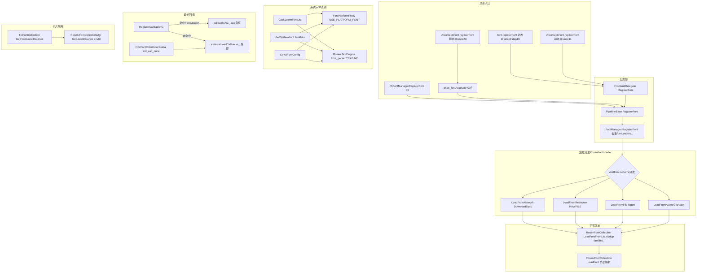

# 特性规格

## 概述

| 属性 | 值 |
|------|-----|
| 特性名称 | 字体注册与查询全能力 |
| 特性编号 | Func-04-13-01-Feat-01 |
| 优先级 | P1 |
| 目标版本 | API 9+（动态）/ API 23+（静态） |
| 复杂度 | 复杂 |
| 状态 | Draft |

本 Feat 覆盖 ArkUI ace_engine 中字体注册功能域（FuncID 04-13-01）的全部能力：自定义字体注册与加载、系统字体查询、UI 字体配置查询、字体加载异步回调与文本节点重建、应用自定义/主题字体、卡片字体隔离，以及跨子系统字体 API 引用与消费方 fontFamily 名称设置器。

**架构要点**：
- 注册入口：ArkTS 动态 `font.registerFont`（@since 9，@deprecated since 18）→ `UIContext.Font.registerFont`（@since 11，推荐）；ArkTS 静态 `UIContext.Font.registerFont`（@since 23）；全局 `font.getUIFontConfig`（@since 11，未弃用）；Cangjie FFI `FfiFontManagerRegisterFont`；Arkoala 生成 C 桥 `GENERATED_ArkUIGlobalScope_ohos_fontAccessor`
- 统一汇聚点：`PipelineBase::RegisterFont`（pipeline_base.cpp:388）→ `FontManager::RegisterFont`（font_manager.cpp:60，按 familyName 去重存 `fontLoaders_`）
- 加载分发：`RosenFontLoader::AddFont` 按 familySrc URL scheme 分发到 network/resource/file/asset 四路径
- 字节落地：所有路径汇入 `RosenFontCollection::LoadFontFromList`（rosen_font_collection.cpp:42），dedup `families_` 后调用外部 `Rosen::FontCollection::LoadFont`（TTF/OTF 解析在 graphic_2d，不在本仓）
- 系统字体查询双路径：`FontPlatformProxy`（USE_PLATFORM_FONT，外部委托）vs `Rosen::TextEngine::Font_parser`（TEXGINE_SUPPORT_FOR_OHOS）
- 异步回调双路径：ace 自有 `FontLoader` 命中 → `callbacksNG_`；未命中（外部 graphics2d 加载）→ `externalLoadCallbacks_` + `NG::FontCollection::Global()` 全局加载完成回调（`std::call_once` 注册）
- 卡片隔离：`TxtFontCollection::GetFormLocalInstance` → `Rosen::FontCollectionMgr::GetLocalInstance(envId)`，按 NativeEngine runtimeId 隔离
- 应用/主题默认字体：`AceContainer::CheckAndSetFontFamily` 探测 `/data/themes/a|b/app/fonts/` → `FontManager::SetFontFamily` → `RosenFontLoader::SetDefaultFontFamily` → `LoadFontFamily`/`LoadThemeFont`；`appCustomFont_` 在布局期静默覆盖空 fontFamily



## 本次变更范围（Delta）

> lineage: new — 全新特性首份 spec，全量为 ADDED。

| 类型 | 内容 | 说明 |
|------|------|------|
| ADDED | `font.registerFont(options: FontOptions): void`（@since 9 dynamic，@deprecated since 18） | 自定义字体注册入口（全局，已弃用） |
| ADDED | `font.getSystemFontList(): Array<string>`（@since 10 dynamic，@deprecated since 18） | 系统字体名列表（全局，已弃用） |
| ADDED | `font.getFontByName(fontName: string): FontInfo`（@since 10 dynamic，@deprecated since 18） | 单个系统字体详情（全局，已弃用） |
| ADDED | `font.getUIFontConfig(): UIFontConfig`（@since 11 dynamic，未弃用） | UI 字体配置（仅全局，无 UIContext.Font 等价物） |
| ADDED | `UIContext.getFont(): Font`（@since 11 dynamic / @since 23 static） | UIContext 字体子对象入口 |
| ADDED | `UIContext.Font.registerFont/getSystemFontList/getFontByName`（@since 11 dynamic / @since 23 static） | 推荐替代路径（无 getUIFontConfig） |
| ADDED | `FontOptions`/`FontInfo`/`UIFontConfig`/`UIFontGenericInfo`/`UIFontAliasInfo`/`UIFontAdjustInfo`/`UIFontFallbackGroupInfo`/`UIFontFallbackInfo` 接口 | 类型定义 |
| ADDED | NAPI 模块 `@ohos.font`（`js_font.cpp`）+ Cangjie FFI（`cj_font_ffi.cpp`）+ Arkoala C 桥（`global_scope_ohos_font_accessor.cpp`） | 多前端绑定 |
| ADDED | `FontManager`/`FontLoader`/`RosenFontLoader`/`RosenFontCollection`/`RosenFontManager` 实现链 | 注册存储与加载分发 |
| ADDED | `FontPlatformProxy`/`FontPlatform`/texgine 双路径系统字体查询 | 系统字体枚举构建期二选一 |
| ADDED | `RegisterCallbackNG`/`externalLoadCallbacks_`/`formLoadCallbacks_`/`NG::FontCollection::Global()` 异步加载回调 | 字体加载完成→文本重渲染 |
| ADDED | `AceContainer::CheckAndSetFontFamily`/`SetAppCustomFont`/`GetAppCustomFont`/布局期 appCustomFont 覆盖 | 应用/主题默认字体路径 |
| ADDED | `TxtFontCollection::GetFormLocalInstance`/`Rosen::FontCollectionMgr` 卡片字体隔离 | 按 NativeEngine runtimeId 隔离 |
| ADDED | 组件 `fontFamily(...)` 属性设置器（Text/Button/TextInput 等）+ NDK `OH_ArkUI_TextStyle_SetFontFamily` 系列 | 已注册字体消费方（不同功能域，本文记录引用关系） |
| ADDED | 跨子系统引用：`@ohos.fontManager`（installFont/uninstallFont，Localization 子系统）、`@ohos.graphics.text.FontCollection`（loadFontSync/unloadFontSync，Graphics 子系统） | ace SDK 文档推荐替代，实现不在本仓 |

## 输入文档

| 文档 | 版本/日期 | 说明 |
|------|-----------|------|
| `interface/sdk-js/api/@ohos.font.d.ts` | 当前 | 动态全局 font 命名空间 + 8 接口定义 |
| `interface/sdk-js/api/@ohos.arkui.UIContext.d.ts` | 当前 | 动态 UIContext.Font 类（registerFont/getSystemFontList/getFontByName） |
| `interface/sdk-js/api/@ohos.font.static.d.ets` | 当前 | 静态全局 font（仅 getUIFontConfig）+ 8 接口 |
| `interface/sdk-js/api/@ohos.arkui.UIContext.static.d.ets` | 当前 | 静态 UIContext.Font 类 |
| `interface/sdk-js/api/@internal/component/ets/units.d.ts` | 当前 | 动态 Font 接口（family 字段引用已注册字体） |
| `interface/sdk-js/api/arkui/component/units.static.d.ets` | 当前 | 静态 Font 接口 |
| `interface/sdk-js/api/@ohos.fontManager.d.ts` | 当前 | 跨子系统引用（Localization，installFont/uninstallFont） |
| `interface/sdk-js/api/@ohos.graphics.text.d.ts` | 当前 | 跨子系统引用（Graphics，FontCollection.loadFontSync） |
| `interfaces/napi/kits/font/js_font.cpp` | 当前 | NAPI 模块 @ohos.font 绑定实现 |
| `frameworks/bridge/cj_frontend/interfaces/cj_ffi/font/cj_font_ffi.cpp` | 当前 | Cangjie FFI 绑定 |
| `frameworks/core/interfaces/native/implementation/global_scope_ohos_font_accessor.cpp` | 当前 | Arkoala 静态前端 C 桥 |
| `frameworks/bridge/js_frontend/frontend_delegate.h:330` | 当前 | FrontendDelegate 纯虚 RegisterFont 等 |
| `frameworks/core/pipeline/pipeline_base.cpp:388` | 当前 | PipelineBase::RegisterFont 汇聚点 |
| `frameworks/core/common/font_manager.h:88` / `.cpp:60` | 当前 | FontManager 注册存储与去重 |
| `frameworks/core/common/font_loader.h:25` | 当前 | FontLoader 抽象基类 |
| `frameworks/core/components/font/font_loader_creator.cpp:27` | 当前 | FontLoader::Create 工厂（Rosen 守卫） |
| `frameworks/core/components/font/rosen_font_loader.h:27` / `.cpp:44` | 当前 | RosenFontLoader scheme 分发 |
| `frameworks/core/components/font/rosen_font_collection.h:29` / `.cpp:42` | 当前 | RosenFontCollection 字节落地与 dedup |
| `frameworks/core/components_ng/render/font_collection.h:30` | 当前 | NG::FontCollection 回调注册 |
| `frameworks/core/components_ng/render/adapter/txt_font_collection.h:30` / `.cpp:88` | 当前 | TxtFontCollection 卡片隔离 |
| `frameworks/core/common/font/font_platform.h:24` / `font_platform_proxy.h:26` | 当前 | FontPlatformProxy 系统字体委托 |
| `adapter/ohos/entrance/ace_container.cpp:3516` | 当前 | CheckAndSetFontFamily 主题字体加载 |
| `frameworks/core/components_ng/pattern/text/span_node.cpp:1188` | 当前 | SpanItem::FontRegisterCallback |
| `frameworks/core/components_ng/pattern/text/text_pattern.cpp:166` | 当前 | TextPattern 字体节点注册/注销 |
| `test/unittest/core/common/font/font_manager_test.cpp` | 当前 | FontManager 单元测试 |

## 用户故事

| US-ID | 用户故事 | 关联 AC |
|-------|----------|---------|
| US-1 | 应用开发者通过 `font.registerFont`（动态全局，@since 9）或 `UIContext.getFont().registerFont`（动态 @since 11 / 静态 @since 23，推荐）注册自定义字体到当前 UI 实例的 FontManager，注册后用 familyName 在文本组件 fontFamily 中引用 | AC-1.1, AC-1.2, AC-1.3, AC-1.4, AC-1.5 |
| US-2 | 应用开发者按不同资源来源（网络 URL、resource rawfile、file/memory/internal 绝对路径、asset 资产名）注册字体，框架按 familySrc URL scheme 自动分发到对应加载路径 | AC-2.1, AC-2.2, AC-2.3, AC-2.4 |
| US-3 | 应用开发者通过 `font.getSystemFontList`/`getFontByName`（动态全局，@deprecated since 18）或 `UIContext.Font` 等价方法（动态 @since 11 / 静态 @since 23）查询当前系统已安装字体列表与单个字体详情（path/postScriptName/weight/width/italic 等） | AC-3.1, AC-3.2, AC-3.3 |
| US-4 | 应用开发者通过 `font.getUIFontConfig`（动态全局 @since 11，未弃用；静态 @since 23）查询 UI 字体配置（fontDir/generic/alias/adjust/fallbackGroups），用于字体回退策略定制 | AC-4.1, AC-4.2 |
| US-5 | 文本组件（Text/Span/RichEditor/TextInput 等）在 fontFamily 设置已注册自定义字体后，框架经 `RegisterCallbackNG` 注册异步回调；字体加载完成时回调触发文本节点 dirty + SetFontReady + ClearParagraphCache 重渲染 | AC-5.1, AC-5.2, AC-5.3 |
| US-6 | 卡片（form）渲染场景下，字体注册与系统字体查询按 NativeEngine runtimeId 隔离，不同卡片实例字体集合互不串扰 | AC-6.1, AC-6.2, AC-6.3 |
| US-7 | 系统主题/应用自定义字体变更时，`AceContainer::CheckAndSetFontFamily` 探测主题字体目录并加载为默认字体；`appCustomFont_` 在文本布局期静默覆盖空 fontFamily | AC-7.1, AC-7.2, AC-7.3 |
| US-8 | 跨子系统调用方通过 `@ohos.fontManager.installFont/uninstallFont`（Localization，系统应用）安装系统字体，或通过 `@ohos.graphics.text.FontCollection.loadFontSync/unloadFontSync`（Graphics，推荐替代）注册字体；NDK Native 模块通过 `OH_ArkUI_TextStyle_SetFontFamily` 设置消费已注册字体族名 | AC-8.1, AC-8.2, AC-8.3 |

## 验收追溯

| AC ID | 用户故事 | 验收条件 |
|-------|----------|----------|
| AC-1.1 | US-1 | WHEN 调用 `UIContext.getFont().registerFont({familyName:"MyFont", familySrc:"..."})` 且 familySrc 合法 THEN 调用经 `FrontendDelegate::RegisterFont` → `PipelineBase::RegisterFont` → `FontManager::RegisterFont`，FontManager 将 familyName 加入 `fontNames_` 并创建 `RosenFontLoader` 加入 `fontLoaders_`，方法返回 void |
| AC-1.2 | US-1 | WHEN 对同一 familyName 重复调用 registerFont THEN `FontManager::RegisterFont` 在 `fontLoaders_` 中查到同名 FontLoader 后提前 return，不重复创建 Loader、不重复加载（font_manager.cpp:67-72） |
| AC-1.3 | US-1 | WHEN 调用 `font.registerFont`（全局）在 API ≥ 18 场景 THEN 编译/运行仍可用但标记 `@deprecated since 18`，`@useinstead ohos.arkui.UIContext.Font#registerFont`，应迁移到 `UIContext.Font.registerFont` |
| AC-1.4 | US-1 | WHEN 调用 registerFont 传入参数非对象、或 familyName/familySrc 解析失败（非 string/非 Resource）THEN `JSRegisterFont` 返回 `nullptr`（undefined 到 JS），不抛异常、不注册（js_font.cpp:76-89） |
| AC-1.5 | US-1 | WHEN 调用 registerFont 时无活跃 FrontendDelegate（`EngineHelper::GetCurrentDelegateSafely()` 返回 null）THEN `JSRegisterFont` 返回 `nullptr`，不注册（js_font.cpp:100-103） |
| AC-2.1 | US-2 | WHEN familySrc 以 `http`/`https` 开头 THEN `RosenFontLoader::AddFont` 走 `LoadFromNetwork`，后台任务调 `DownloadManager::DownloadSync`，成功后 UI 线程 `LoadFontFromList` + `isLoaded_=true` + `NotifyCallbacks`（rosen_font_loader.cpp:52-54,73-114） |
| AC-2.2 | US-2 | WHEN familySrc 以 `resource://RAWFILE/...` 开头 THEN `LoadFromResource` 经 ResourceWrapper→GetRawFileData 读字节后 `PostLoadFontTask` → `LoadFontFromList`（rosen_font_loader.cpp:55-57,221） |
| AC-2.3 | US-2 | WHEN familySrc 含 `:`（file://、memory://、internal://app/）THEN `LoadFromFile` 经 `RemovePathHead` 去前缀后 fopen/fread 读字节，再 `PostLoadFontTask` → `LoadFontFromList`（rosen_font_loader.cpp:58-61,118-200） |
| AC-2.4 | US-2 | WHEN familySrc 为裸资产名（无 scheme）THEN `LoadFromAsset` 经 `context->GetAssetManager()->GetAsset` 读字节，再 `PostLoadFontTask` → `LoadFontFromList`（rosen_font_loader.cpp:62-65,270） |
| AC-2.5 | US-2 | WHEN `RosenFontLoader::AddFont` 时 context 为 nullptr 或 familySrc 为空 THEN 记录 `TAG_LOGW` 警告并 return，不加载、不抛异常（rosen_font_loader.cpp:47-50） |
| AC-2.6 | US-2 | WHEN 网络字体下载失败 THEN `failCallback` 仅记录 `TAG_LOGW`，不重试、不向 JS 报错（registerFont 已返回 void），`isLoaded_` 保持 false，已注册回调不触发（rosen_font_loader.cpp:104-108） |
| AC-3.1 | US-3 | WHEN 调用 `UIContext.Font.getSystemFontList()` THEN 经 NAPI `JSgetSystemFontList` → `FontManager::GetSystemFontList`，返回 `Array<string>` 系统字体名列表（js_font.cpp:109, font_manager.cpp:120-141） |
| AC-3.2 | US-3 | WHEN 调用 `UIContext.Font.getFontByName(name)` 且存在该系统字体 THEN 返回 `FontInfo`（path/postScriptName/fullName/family/subfamily/weight/width/italic/monoSpace/symbolic）；不存在时返回空对象（js_font.cpp:133-156） |
| AC-3.3 | US-3 | WHEN 构建启用 `USE_PLATFORM_FONT` THEN `GetSystemFontList`/`GetSystemFont` 经 `FontPlatformProxy` 外部委托查询；WHEN 启用 `TEXGINE_SUPPORT_FOR_OHOS` THEN 经 `Rosen::TextEngine::Font_parser::GetVisibilityFonts(locale)` 查询（font_manager.cpp:122-139） |
| AC-4.1 | US-4 | WHEN 调用 `font.getUIFontConfig()` THEN 返回 `UIFontConfig`（fontDir/generic/alias/adjust/fallbackGroups）；该方法**未弃用**，全局命名空间独有，`UIContext.Font` 无等价物（font_manager.cpp:143, @ohos.font.d.ts:550） |
| AC-4.2 | US-4 | WHEN 静态前端调用 `font.getUIFontConfig()`（@since 23 static）THEN 经 Arkoala `GetUIFontConfigImpl` → `pipeline->GetUIFontConfig`（global_scope_ohos_font_accessor.cpp:155） |
| AC-5.1 | US-5 | WHEN 文本组件挂载且其 textStyle 含 fontFamily 列表 THEN `TextPattern::OnAttachToFrameNode` 调 `fontManager->AddFontNodeNG(host)`（text_pattern.cpp:166-176）；`SpanItem::FontRegisterCallback` 为每个 family 调 `RegisterCallbackNG(frameNode, familyName, cb)`（span_node.cpp:1188-1224） |
| AC-5.2 | US-5 | WHEN `RegisterCallbackNG` 在 `fontLoaders_` 命中已加载 FontLoader THEN 立即或加载完成时触发回调：`MarkDirtyNode(PROPERTY_UPDATE_MEASURE)` + `SetFontReady(true)` + `ClearParagraphCache` + `OnPropertyChangeMeasure`（span_node.cpp:1188-1224, font_manager.cpp:378-400） |
| AC-5.3 | US-5 | WHEN `RegisterCallbackNG` 未命中 FontLoader（字体经 graphics2d 外部加载）THEN 回调存入 `externalLoadCallbacks_`，并经 `std::call_once` 在 `NG::FontCollection::Global()` 注册全局加载完成回调；外部加载完成时 `OnLoadFontFinished` 触发匹配回调（font_manager.cpp:402, 483-549, txt_font_collection.cpp:25） |
| AC-5.4 | US-5 | WHEN 文本组件从树分离 THEN `TextPattern::OnDetachFromFrameNode` 调 `RemoveFontNodeNG` + `UnRegisterCallbackNG` + `RemoveVariationNodeNG` + `RemoveHybridRenderNode`（text_pattern.cpp:188-217） |
| AC-6.1 | US-6 | WHEN 处于 form-render 卡片渲染上下文 THEN `FontCollection::Current()` 返回 `TxtFontCollection::GetFormLocalInstance()`，经 `Rosen::FontCollectionMgr::GetLocalInstance(envId)` 按 NativeEngine runtimeId 获取独立 FontCollection（txt_font_collection.cpp:74, 88-106） |
| AC-6.2 | US-6 | WHEN 卡片字体注册完成回调注册 THEN 存入 `formLoadCallbacks_`（按 runtimeId 分发），与全局 `externalLoadCallbacks_` 隔离，`NotifyFormFontChange` 仅触发同 runtimeId 卡片回调（font_manager.cpp:519-549） |
| AC-6.3 | US-6 | WHEN 预览构建（`#ifndef PREVIEW`）THEN 跳过 `FontCollectionMgr`，runtimeId 视为 0，无 per-form local 实例（txt_font_collection.cpp:18,27,48,90） |
| AC-7.1 | US-7 | WHEN AceContainer 启动且 `fontManager->IsUseAppCustomFont()` 返回 false THEN `CheckAndSetFontFamily` 探测 `/data/themes/a/app/fonts/` 与 `/data/themes/b/app/fonts/`，命中后 `GetFontFamilyName` + `SetFontFamily(familyName, fullPath)` 加载主题字体（ace_container.cpp:3516-3545） |
| AC-7.2 | US-7 | WHEN 应用配置含 fontFamily THEN `AceContainer` 调 `fontManager->SetAppCustomFont(parsedConfig.fontFamily)` 仅存储 name；布局期 `span_node`/`multiple_paragraph`/`text_field_layout_algorithm` 在 textStyle 无 fontFamily 时用 `GetAppCustomFont()` 静默覆盖（ace_container.cpp:3655-3658, span_node.cpp:884-886, multiple_paragraph_layout_algorithm.cpp:159-162, text_field_layout_algorithm.cpp:954） |
| AC-7.3 | US-7 | WHEN `FontManager::SetFontFamily` 被调用 THEN 创建 `RosenFontLoader` 调 `SetDefaultFontFamily` → `RosenFontCollection::LoadFontFamily` → `LoadThemeFont`；`LoadThemeFont` 先 `ClearThemeFont()` 再加载，size 不匹配再次 `ClearThemeFont()`（font_manager.cpp:88-94, rosen_font_collection.cpp:70-84） |
| AC-8.1 | US-8 | WHEN 系统应用调用 `fontManager.installFont(path)`（@ohos.fontManager，@since 19 dynamic/23 static，需 `ohos.permission.UPDATE_FONT`）THEN 由 Localization 子系统处理系统字体安装；ace_engine 不实现该方法，仅 SDK 文档引用 |
| AC-8.2 | US-8 | WHEN 应用调用 `FontCollection.loadFontSync(name, path)`（@ohos.graphics.text，@since 12 dynamic/23 static，推荐替代 ace registerFont）THEN 由 Graphics 子系统加载；ace 文档在 `@ohos.font.d.ts:30`、`text.d.ts:527`、`canvas.d.ts:2507` 明确推荐该路径 |
| AC-8.3 | US-8 | WHEN NDK Native 模块设置文本样式字体族 THEN 调 `OH_ArkUI_TextStyle_SetFontFamily(textStyle, fontFamily)`（native_styled_string_descriptor.h:637）/`OH_ArkUI_TextEditorTextStyle_SetFontFamily`（native_type.h:6318）等设置族名，这些是已注册字体的消费方，不注册字体文件 |
| AC-8.4 | US-8 | WHEN 在 ace_engine 仓内检索 NDK 字体注册 API THEN 无 `OH_ArkUI_RegisterFont`/`ArkUI_RegisterFont` 符号；`interfaces/native/libace.ndk.json` 仅暴露族名设置器；注册仅经 NAPI/FFI/前端委托/Arkoala 生成 C 桥 |

## 规则定义

### R-1: 注册统一汇聚到 FontManager

**类型**: 行为

所有前端入口（NAPI `JSRegisterFont`、Cangjie FFI `FfiFontManagerRegisterFont`、Arkoala `RegisterFontImpl`、前端委托 `FrontendDelegate::RegisterFont` 系列）均经 `PipelineBase::RegisterFont` 汇聚到 `FontManager::RegisterFont`，不存在组件级 Pattern/Model 注册路径。

来源验证：`js_font.cpp:105`（delegate->RegisterFont）、`cj_font_ffi.cpp:22`（pipeline->RegisterFont）、`global_scope_ohos_font_accessor.cpp:133`（pipeline->RegisterFont）、`pipeline_base.cpp:388`（fontManager_->RegisterFont）、`font_manager.cpp:60`。无 `FontModel`/`FontRegisterModel` 类（grep frameworks/ 无匹配）。

### R-2: familyName 双层去重

**类型**: 边界

注册去重在两层：(1) `FontManager::RegisterFont` 先将 familyName 加入 `fontNames_`（若不存在），再遍历 `fontLoaders_`，若存在同名 FontLoader 则提前 return 不重复创建（font_manager.cpp:63-72）；(2) `RosenFontCollection::LoadFontFromList` 用 `families_` 集合 dedup，已加载 family 不再调用 `Rosen::FontCollection::LoadFont`（rosen_font_collection.cpp:42-60）。

### R-3: familySrc scheme 分发优先级

**类型**: 行为

`RosenFontLoader::AddFont` 按 familySrc 前缀分发：`http`/`https`（FONT_SRC_NETWORK）→ network；`resource`（FONT_SRC_RESOURCE，正则 `resource://RAWFILE/(.*)`）→ resource；含 `:` → file；其余 → asset。判定顺序固定为 network→resource→file→asset。

来源验证：`rosen_font_loader.cpp:52-65`，常量定义于 `font_loader_creator.cpp`（`FONT_SRC_NETWORK="http"`、`FONT_SRC_RESOURCE="resource"`）。

### R-4: 空入参与无委托静默降级

**类型**: 异常

`registerFont` 入参非对象、familyName/familySrc 解析失败、无活跃 FrontendDelegate 时，`JSRegisterFont` 返回 `nullptr`（undefined 到 JS），不抛异常、不注册。`RosenFontLoader::AddFont` 在 context 为 nullptr 或 familySrc 为空时记 `TAG_LOGW` 警告并 return。

来源验证：`js_font.cpp:76-103`，`rosen_font_loader.cpp:47-50`。

### R-5: 网络字体下载失败不报错不重试

**类型**: 异常

网络字体下载失败时 `failCallback` 仅记 `TAG_LOGW`，不重试、不向 JS 上抛错误（registerFont 返回 void 已无返回通道），`isLoaded_` 保持 false，已注册回调不触发。

来源验证：`rosen_font_loader.cpp:104-108`。

### R-6: 字体字节不在 ace 解析

**类型**: 边界

ace_engine 只负责读取字体文件字节（network/resource/file/asset 四路径均汇入 `RosenFontCollection::LoadFontFromList`），TTF/OTF 字形解析与 glyph cache 由外部 Rosen 图形引擎（`Rosen::FontCollection::LoadFont`，位于 graphic_2d 仓）完成。ace 持 `fontCollection_` 为不透明 `std::shared_ptr<Rosen::FontCollection>`。

来源验证：`rosen_font_collection.cpp:42-60`（LoadFontFromList→fontCollection_->LoadFont）、`:23`（`#ifndef USE_ROSEN_DRAWING` 则 Skia 路径）。

### R-7: 系统字体查询构建期双路径

**类型**: 边界

`GetSystemFontList`/`GetSystemFont`/`GetUIFontConfig` 行为由构建宏决定：`USE_PLATFORM_FONT`（frameworks/core/BUILD.gn:689,1241）→ `FontPlatformProxy` 外部委托；否则 `ENABLE_ROSEN_BACKEND`+`TEXGINE_SUPPORT_FOR_OHOS` → `Rosen::TextEngine::Font_parser`/`FontConfigJson::ParseFile`。`FontPlatformProxy::SetDelegate` 在本仓无调用方（推测：由外部 font-service 系统模块注册）。

来源验证：`font_manager.cpp:122-141`(PLATFORM)、`:128-139`(texgine)、`:143-183`(UIFontConfig)、`font_platform_proxy.h:26`。

### R-8: 异步加载回调双路径

**类型**: 行为

`RegisterCallbackNG(node, familyName, cb)` 先遍历 `fontLoaders_` 匹配 familyName：命中则 `SetOnLoadedNG` 存入 `callbacksNG_`，加载完成时触发；未命中则调 `RegisterTextEngineLoadCallback` 存入 `externalLoadCallbacks_`（form 场景存 `formLoadCallbacks_`），并经 `std::call_once load_font_flag_` 在 `NG::FontCollection::Global()` 注册全局 load/unload finish 回调，外部加载完成时 `OnLoadFontChanged`→`NotifyFontChange`/`NotifyFormFontChange` 触发匹配回调。

来源验证：`font_manager.cpp:378-402`、`:483-549`，`span_node.cpp:1188-1224`。

### R-9: 加载完成回调触发文本重渲染

**类型**: 行为

字体加载完成回调内执行：`MarkDirtyNode(PROPERTY_UPDATE_MEASURE)` 标记节点需重新 measure、`ClearParagraphCache()` 清段落缓存、`SetFontReady(true)` 标记字体就绪、`OnPropertyChangeMeasure()` 触发 measure；若任一 family 命中自定义字体则 `pattern->SetIsCustomFont(true)` + `modifier->SetIsCustomFont(true)`。

来源验证：`span_node.cpp:1188-1224`、`multiple_paragraph_layout_algorithm.cpp:450-480`。

### R-10: 卡片字体按 NativeEngine runtimeId 隔离

**类型**: 行为

form-render 上下文下 `FontCollection::Current()` 返回 `TxtFontCollection::GetFormLocalInstance()`，经 `Rosen::FontCollectionMgr::GetLocalInstance(envId)` 获取独立 FontCollection（envId 由 NativeEngine runtimeId 解析）；非 form 上下文返回 `TxtFontCollection::GetInstance()`（全局）。`NotifyFormFontChange` 仅触发同 runtimeId 卡片回调。

来源验证：`txt_font_collection.cpp:74, 88-106`、`font_manager.cpp:519-549`。

### R-11: 预览构建无 per-form 隔离

**类型**: 边界

`#ifndef PREVIEW` 下 `TxtFontCollection::GetFormLocalInstance` 跳过 `FontCollectionMgr`，runtimeId 视为 0，无 per-form local 实例，所有 form 共用全局 FontCollection。

来源验证：`txt_font_collection.cpp:18,27,48,90`。

### R-12: 非对称弃用迁移

**类型**: 边界

弃用非对称：`font.registerFont`/`getSystemFontList`/`getFontByName` 自 API 18 弃用，`@useinstead ohos.arkui.UIContext.Font#<method>`，应迁移到 `UIContext.Font` 等价方法；`font.getUIFontConfig` **未弃用**，仍仅全局命名空间，`UIContext.Font` 无 `getUIFontConfig` 等价物。静态全局 `font` 命名空间仅暴露 `getUIFontConfig`（`@since 23 static`），`registerFont`/`getSystemFontList`/`getFontByName` 静态仅经 `UIContext.Font`。

来源验证：`@ohos.font.d.ts:485/512/534`(deprecated since 18) vs `:550`(not deprecated)、`@ohos.font.static.d.ets:324`、`@ohos.arkui.UIContext.static.d.ets:77/86/96`。

### R-13: appCustomFont 静默覆盖空 fontFamily

**类型**: 行为

`FontManager::SetAppCustomFont` 仅存储 familyName（不加载文件）。布局期 `span_node`、`multiple_paragraph_layout_algorithm`、`text_field_layout_algorithm` 在 textStyle 无 fontFamily 且 `fontManager->GetAppCustomFont()` 非空时，用 appCustomFont 静默覆盖 fontFamily。覆盖优先级：组件显式 fontFamily > appCustomFont > 系统默认。

来源验证：`ace_container.cpp:3655-3658`、`span_node.cpp:884-886`、`multiple_paragraph_layout_algorithm.cpp:159-162`、`text_field_layout_algorithm.cpp:954`、`font_manager.cpp:110-118`。

### R-14: 主题字体 LoadThemeFont 防御性 ClearThemeFont

**类型**: 恢复

`RosenFontCollection::LoadThemeFont` 先调 `fontCollection_->ClearThemeFont()` 再加载新主题字体，加载后若 size 不匹配再次 `ClearThemeFont()`，避免残留旧主题字形污染。

来源验证：`rosen_font_collection.cpp:70-84`。

### R-15: 无 NDK 字体注册 C-API

**类型**: 边界

ace_engine 不提供 NDK 字体注册 C-API。`interfaces/native/libace.ndk.json` 无 `OH_ArkUI_RegisterFont`/`ArkUI_RegisterFont` 符号；`interfaces/native/` 仅暴露族名设置器（`OH_ArkUI_TextStyle_SetFontFamily` 等，消费方）。注册经 NAPI/FFI/前端委托/Arkoala 生成 C 桥（`GENERATED_ArkUIGlobalScope_ohos_fontAccessor`，仅服务静态前端）。

来源验证：`interfaces/native/libace.ndk.json`（无 registerFont 符号）、`frameworks/core/interfaces/native/generated/interface/arkoala_api_generated.h:29979-29984`（Arkoala 访问器结构）。

### R-16: 跨子系统引用 API 不在本仓实现

**类型**: 边界

`@ohos.fontManager.installFont/uninstallFont`（Localization 子系统，@since 19/23，系统应用，需 `ohos.permission.UPDATE_FONT`）与 `@ohos.graphics.text.FontCollection.loadFontSync/loadFont/unloadFontSync`（Graphics 子系统，@since 12/20/23）实现均不在 ace_engine 仓。ace SDK 文档（`@ohos.font.d.ts:30`、`text.d.ts:527`、`canvas.d.ts:2507`）明确推荐 `FontCollection.loadFontSync` 作为 registerFont 的现代替代。

## 验证映射

| 编号 | 对应规格项 | 验证方式 | 验证重点 |
|------|-----------|----------|---------|
| VM-1 | AC-1.1, R-1 | 单元测试 `test/unittest/core/common/font/font_manager_test.cpp` | registerFont 后 `fontLoaders_` 含对应 Loader、`fontNames_` 含 familyName |
| VM-2 | AC-1.2, R-2 | 单元测试 | 同 familyName 二次注册后 `fontLoaders_` size 不增 |
| VM-3 | AC-1.4, AC-1.5, R-4 | NAPI 单元测试 | 非对象/解析失败/无 delegate 返回 undefined 不抛异常 |
| VM-4 | AC-2.1~2.4, R-3 | 集成测试 + 源码 grep | 四 scheme 前缀分别进入对应 LoadFrom* 方法 |
| VM-5 | AC-2.5, AC-2.6, R-4, R-5 | 单元测试 | 空 familySrc/下载失败仅记警告不崩溃 |
| VM-6 | AC-2.1~2.4, R-6 | 源码 trace | 字节经 `RosenFontCollection::LoadFontFromList` 交外部 Rosen |
| VM-7 | AC-3.3, R-7 | 构建配置验证 | USE_PLATFORM_FONT/TEXGINE_SUPPORT_FOR_OHOS 双路径分别激活 |
| VM-8 | AC-5.1~5.4, R-8, R-9 | 集成测试 | 文本节点挂载/分离注册/注销回调，加载完成 dirty+SetFontReady |
| VM-9 | AC-5.3, R-8 | 单元测试 | 未命中 FontLoader 时存入 externalLoadCallbacks_，全局回调触发 |
| VM-10 | AC-6.1~6.3, R-10, R-11 | form 场景集成测试 + PREVIEW 构建对比 | 卡片按 runtimeId 隔离；预览无隔离 |
| VM-11 | AC-7.1~7.3, R-13, R-14 | 主题字体集成测试 | 主题目录命中加载、appCustomFont 静默覆盖、LoadThemeFont 防御 clear |
| VM-12 | AC-8.4, R-15 | ndk.json grep | 无 registerFont NDK 符号 |
| VM-13 | AC-8.1, AC-8.2, R-16 | SDK 文档交叉验证 | fontManager/graphics.text 实现不在本仓，ace 文档推荐替代 |

## API 变更分析

### 新增 API

> lineage: new，全部为既有实现的 ADDED 文档化。

| API 名称 | 开放范围 | 入参概要 | 返回值 | 错码范围 | 功能描述 | 关联 AC |
|----------|----------|----------|--------|----------|----------|---------|
| `font.registerFont(options: FontOptions): void` | Public (动态, @since 9, @deprecated 18) | `{familyName: string\|Resource, familySrc: string\|Resource}` | void | 无（失败静默返回 undefined） | 注册自定义字体到当前实例 | AC-1.1, AC-1.3 |
| `font.getSystemFontList(): Array<string>` | Public (动态, @since 10, @deprecated 18) | 无 | `Array<string>` | 无 | 系统字体名列表 | AC-3.1 |
| `font.getFontByName(fontName: string): FontInfo` | Public (动态, @since 10, @deprecated 18) | `fontName: string` | `FontInfo` 或空对象 | 无 | 单个系统字体详情 | AC-3.2 |
| `font.getUIFontConfig(): UIFontConfig` | Public (动态 @since 11 / 静态 @since 23, 未弃用) | 无 | `UIFontConfig` | 无 | UI 字体配置（全局独有） | AC-4.1, AC-4.2 |
| `UIContext.getFont(): Font` | Public (动态 @since 11 / 静态 @since 23) | 无 | `Font` 子对象 | 无 | UIContext 字体入口 | AC-1.1 |
| `UIContext.Font.registerFont(options): void` | Public (动态 @since 11 / 静态 @since 23) | 同上 | void | 无 | 推荐注册入口 | AC-1.1, AC-1.3 |
| `UIContext.Font.getSystemFontList(): Array<string>` | Public (动态 @since 11 / 静态 @since 23) | 无 | `Array<string>` | 无 | 推荐查询入口 | AC-3.1 |
| `UIContext.Font.getFontByName(name): FontInfo` | Public (动态 @since 11 / 静态 @since 23) | `name: string` | `FontInfo` | 无 | 推荐查询入口 | AC-3.2 |
| `FfiFontManagerRegisterFont(familyName, familySrc)` | FFI (Cangjie) | `const char*` ×2 | 无 | 无 | Cangjie 前端注册 | AC-1.1 |
| Arkoala `ohos_fontAccessor.registerFont(options)` | 内部 C 桥（生成, 服务静态前端） | `const Ark_font_FontOptions*` | void | 无 | 静态前端注册 | AC-1.1 |
| `OH_ArkUI_TextStyle_SetFontFamily(style, fontFamily)` | Public NDK | `OH_ArkUI_TextStyle*`, `const char*` | `ArkUI_ErrorCode` | ARKUI_ERROR_CODE_* | 文本样式族名设置（消费方） | AC-8.3 |
| `OH_ArkUI_TextEditorTextStyle_SetFontFamily(style, fontFamily)` | Public NDK | `OH_ArkUI_TextEditorTextStyle*`, `const char*` | `ArkUI_ErrorCode` | ARKUI_ERROR_CODE_* | 富文本编辑器样式族名设置（消费方） | AC-8.3 |

### 变更/废弃 API

| API 名称 | 变更类型 | 影响场景 | 迁移指引 | 关联 AC |
|----------|----------|----------|----------|---------|
| `font.registerFont` | 废弃 (@since 18) | 全局注册自定义字体 | 改用 `UIContext.getFont().registerFont`；ace 文档另推荐 `@ohos.graphics.text.FontCollection.loadFontSync`（@since 12）作为现代字体引擎路径 | AC-1.3 |
| `font.getSystemFontList` | 废弃 (@since 18) | 全局查询系统字体列表 | 改用 `UIContext.getFont().getSystemFontList` | AC-3.1 |
| `font.getFontByName` | 废弃 (@since 18) | 全局查询单个系统字体 | 改用 `UIContext.getFont().getFontByName` | AC-3.2 |
| `font.getUIFontConfig` | 未废弃（保持现状） | 全局查询 UI 字体配置 | 无需迁移；`UIContext.Font` 无等价物，仍用全局 `font.getUIFontConfig` | AC-4.1 |

## 接口规格

### 接口定义

**[UIContext.Font.registerFont]**

| 属性 | 值 |
|------|-----|
| 函数签名 | `registerFont(options: font.FontOptions): void` |
| 返回值 | `void` — 无返回；失败时静默 |
| 开放范围 | Public（动态 @since 11 / 静态 @since 23） |
| 错误码 | 无（不抛异常，失败返回 undefined） |
| 关联 AC | AC-1.1, AC-1.2, AC-1.3 |

**参数约束**

| 参数 | 类型 | 必填 | 默认值 | 约束条件 |
|------|------|------|--------|---------|
| options.familyName | `string \| Resource` | 是 | 无 | 非空字符串或 Resource；空/非法时返回 undefined 不注册 |
| options.familySrc | `string \| Resource` | 是 | 无 | 按 scheme 分发：`http(s)://`/`resource://RAWFILE/...`/含`:`绝对路径/裸资产名 |

**行为场景**

| # | 触发条件 | 预期行为 | 关联 AC |
|---|----------|----------|---------|
| 1 | options 为合法对象、familyName/familySrc 合法、有活跃 delegate | 经 NAPI→FrontendDelegate→PipelineBase→FontManager 注册，fontLoaders_ 新增 Loader | AC-1.1 |
| 2 | 同 familyName 重复注册 | FontManager 提前 return，不重复创建 Loader | AC-1.2 |
| 3 | API ≥ 18 调用全局 font.registerFont | 标记 @deprecated，应迁移 UIContext.Font.registerFont | AC-1.3 |
| 4 | options 非对象或解析失败 | 返回 undefined，不抛异常 | AC-1.4 |
| 5 | 无活跃 FrontendDelegate | 返回 undefined，不注册 | AC-1.5 |
| 6 | familySrc 为空 | RosenFontLoader 记 TAG_LOGW 并 return，不加载 | AC-2.5 |
| 7 | 网络下载失败 | 仅记警告，不重试不报错 | AC-2.6 |

**[font.getUIFontConfig]**

| 属性 | 值 |
|------|-----|
| 函数签名 | `getUIFontConfig(): UIFontConfig` |
| 返回值 | `UIFontConfig` — `{fontDir, generic, fallbackGroups}` |
| 开放范围 | Public（动态 @since 11 / 静态 @since 23，**未弃用**） |
| 错误码 | 无 |
| 关联 AC | AC-4.1, AC-4.2 |

**参数约束**

| 参数 | 类型 | 必填 | 默认值 | 约束条件 |
|------|------|------|--------|---------|
| （无） | — | — | — | 全局命名空间独有，UIContext.Font 无等价物 |

**行为场景**

| # | 触发条件 | 预期行为 | 关联 AC |
|---|----------|----------|---------|
| 1 | 动态全局调用 | 经 NAPI→FontManager::GetUIFontConfig，返回 UIFontConfig | AC-4.1 |
| 2 | 静态全局调用 (@since 23) | 经 Arkoala GetUIFontConfigImpl→pipeline->GetUIFontConfig | AC-4.2 |
| 3 | 通过 UIContext.Font 调用 | 不可用（无等价方法） | AC-4.1 |

> **复杂度裁剪：** 其余 API（getSystemFontList/getFontByName、NAPI/FFI/Arkoala 内部绑定、NDK 族名设置器）接口规格同上表格结构，因篇幅此处省略详细表，行为由 AC-3.1/3.2/8.3 完整覆盖。

## 兼容性声明

- **已有 API 行为变更:** 是。`font.registerFont`/`getSystemFontList`/`getFontByName` 自 API 18 标记 `@deprecated`，`@useinstead ohos.arkui.UIContext.Font#<method>`，但行为本身未变更（仍可用，仅警告迁移）。`font.getUIFontConfig` 保持未弃用，全局独有。
- **配置文件格式变更:** 否。UIFontConfig 返回结构（fontDir/generic/alias/adjust/fallbackGroups）自 API 11 引入未变。
- **数据存储格式变更:** 否。FontManager 内部 `fontLoaders_`/`fontNames_`/`families_` 存储结构未变。
- **最低支持版本:** API 9（动态 registerFont 初版）/ API 23（静态前端）。
- **API 版本号策略:** 全版本 `@since` 标注。动态 9/10/11 + 弃用 18 + UIContext.Font 11 + 静态 23；跨子系统 fontManager 19/23、graphics.text 12/20/23。
- **跨子系统行为差异风险:** ace 文档明确推荐 `@ohos.graphics.text.FontCollection.loadFontSync`（Graphics 子系统）作为 registerFont 现代替代（`@ohos.font.d.ts:30`），二者加载的字体集合是否互通取决于 `NG::FontCollection::Global()` 与 Graphics FontCollection 是否同一实例（推测：动态前端下 TxtFontCollection 持 `Rosen::FontCollection::Create()`，与 Graphics FontCollection 共享底层，但需 graphics 侧确认）。

## 架构约束

| 关键约束 | 约束说明 | 影响 AC |
|----------|----------|---------|
| 统一汇聚 | 所有注册入口必经 PipelineBase::RegisterFont→FontManager::RegisterFont，禁止组件级 Pattern/Model 直接注册 | AC-1.1 |
| familyName 去重 | 同 familyName 不重复创建 FontLoader、不重复 LoadFont | AC-1.2 |
| scheme 分发顺序固定 | network→resource→file→asset，不可乱序（`:` 判定必须在 resource 之后） | AC-2.1~2.4 |
| 字节解析外置 | ace 不解析 TTF/OTF，仅读字节交 Rosen；字形解析失败属 graphics 子系统责任 | AC-2.1~2.4 |
| 构建宏决定系统字体路径 | USE_PLATFORM_FONT 与 TEXGINE_SUPPORT_FOR_OHOS 互斥，构建期锁定 | AC-3.3 |
| 卡片 runtimeId 隔离 | form-render 必经 GetFormLocalInstance，PREVIEW 无隔离 | AC-6.1~6.3 |
| appCustomFont 覆盖优先级 | 组件显式 > appCustomFont > 系统默认，静默覆盖不可关闭 | AC-7.2 |
| 无 NDK 注册 | NDK 仅消费方族名设置，注册必经 ArkTS/FFI/Arkoala | AC-8.4 |

## 非功能性需求

| 类型 | 指标/阈值 | 验证方式 | 证据 |
|------|----------|----------|------|
| 性能 | 网络字体注册后下载完成到首次文本重渲染 ≤ 1 帧（UI 线程任务） | 集成测试 trace UI 任务时序 | rosen_font_loader.cpp:90-102 PostTask UI |
| 性能 | 同 familyName 重复注册去重 O(n) 遍历 fontLoaders_，n 通常 ≤ 几十 | 单元测试 | font_manager.cpp:67-72 |
| 内存 | 每注册 family 一个 FontLoader + 字节缓冲（LoadFromList 后字节交 Rosen 不常驻 ace） | 内存分析 | rosen_font_collection.cpp:42-60 |
| 可靠性 | 下载失败/文件不存在/解析失败均静默降级，不崩溃不阻塞 | 单元测试 + 异常注入 | R-4, R-5 |
| 可测试性 | AutoUI 测试模式下 `IsDefaultFontChanged()` 强制返回 true 以高精度渲染 | 测试构建 | font_manager.cpp:96-102 |
| 自动化维测 | `TAG_LOGI/TAG_LOGW` ACE_FONT 标签贯穿注册/加载/失败路径 | hilog 过滤 | js_font.cpp:104, rosen_font_loader.cpp:48,83,106 |
| 定界定位 | ace 与 graphics 字形解析责任边界：ace 读字节成功即交 Rosen，Rosen LoadFont 失败不回传 ace | 源码 trace | R-6 |

## 多设备适配声明

| 设备类型 | 行为差异 | 规格/约束 | 验证方式 | 证据 |
|----------|----------|----------|----------|------|
| 手机 | 无差异 | 基线 | — | — |
| 平板 | 无差异 | 基线 | — | — |
| 折叠屏 | 无差异 | 字体注册与设备形态无关 | — | — |
| 卡片（form） | 有差异 | 按 NativeEngine runtimeId 隔离 FontCollection | form 集成测试 | AC-6.1~6.3 |
| 预览构建 | 有差异 | 无 per-form 隔离，runtimeId=0 | PREVIEW 构建对比 | AC-6.3 |

## 全局特性影响

| 特性 | 适用？ | 结论 | 关联场景 |
|------|--------|------|----------|
| 无障碍 | 否 | 字体注册不直接影响无障碍；familyName 通过文本组件消费方间接影响 | — |
| 大字体 | 是 | `fontWeightScale_` 经 `VaryFontCollectionWithFontWeightScale` 影响已注册字体变体；`fontScale` 由 SetFontScaleAndWeightScale 设置 | AC-7.1 |
| 深色模式 | 否 | 字体注册与颜色模式无关 | — |
| 多窗口/分屏 | 是 | 多窗口多 UIContext 实例下，每实例 FontManager 独立，字体注册互不影响 | AC-1.1 |
| 多用户 | 是 | 主题字体路径 `/data/themes/a|b/app/fonts/` 按用户分区（a/b）探测 | AC-7.1 |
| 版本升级 | 是 | API 18 弃用迁移路径需保留向后兼容；@since 23 静态前端新增路径 | AC-1.3, AC-4.2 |
| 生态兼容 | 是 | 推荐跨子系统 FontCollection.loadFontSync 作为现代替代；ace registerFont 与 graphics FontCollection 字体集合互通性需 graphics 侧确认 | AC-8.2 |

## 行为场景（可选，Gherkin）

```gherkin
Feature: 字体注册与查询全能力
  作为 应用开发者
  我想要 注册自定义字体并查询系统字体配置
  以便 在文本组件中使用自定义字体族并实现字体回退策略

  Scenario: 注册 resource rawfile 自定义字体并消费
    Given 当前 UIContext 活跃且 familySrc 为 "resource://RAWFILE/myfont.ttf"
    When 调用 UIContext.getFont().registerFont({familyName:"MyFont", familySrc:"resource://RAWFILE/myfont.ttf"})
    Then 经 PipelineBase::RegisterFont→FontManager::RegisterFont 创建 RosenFontLoader 加入 fontLoaders_
    And RosenFontLoader::AddFont 命中 FONT_SRC_RESOURCE 分支走 LoadFromResource
    And GetRawFileData 读字节后 LoadFontFromList→Rosen::FontCollection::LoadFont
    And 文本组件 fontFamily:"MyFont" 经 RegisterCallbackNG 注册回调
    And 加载完成时回调触发 MarkDirtyNode(PROPERTY_UPDATE_MEASURE)+SetFontReady(true)+ClearParagraphCache

  Scenario: 同 familyName 重复注册去重
    Given FontManager 已存在 familyName="MyFont" 的 FontLoader
    When 再次调用 registerFont({familyName:"MyFont", familySrc:"..."})
    Then FontManager::RegisterFont 遍历 fontLoaders_ 命中同名 Loader 提前 return
    And 不重复创建 Loader、不重复调用 LoadFont

  Scenario Outline: familySrc scheme 分发
    Given familySrc 为 <src>
    When RosenFontLoader::AddFont 执行
    Then 进入 <path> 加载路径

    Examples:
      | src | path |
      | "https://example.com/f.ttf" | LoadFromNetwork |
      | "resource://RAWFILE/f.ttf" | LoadFromResource |
      | "file:///data/f.ttf" | LoadFromFile |
      | "memory://..." | LoadFromFile |
      | "myfont.ttf" | LoadFromAsset |

  Scenario: 网络字体下载失败静默降级
    Given familySrc 为 "https://invalid.example.com/f.ttf"
    When DownloadSync 失败
    Then failCallback 仅记 TAG_LOGW 警告
    And 不重试、不向 JS 上抛错误（registerFont 已返回 void）
    And isLoaded_ 保持 false，已注册回调不触发

  Scenario: 卡片字体按 runtimeId 隔离
    Given 处于 form-render 卡片上下文且 NativeEngine runtimeId=100
    When FontCollection::Current() 调用
    Then 返回 TxtFontCollection::GetFormLocalInstance()
    And 经 Rosen::FontCollectionMgr::GetLocalInstance(100) 获取独立 FontCollection
    And 卡片 A 字体注册不影响卡片 B（runtimeId=200）

  Scenario: appCustomFont 静默覆盖空 fontFamily
    Given FontManager::GetAppCustomFont() 返回 "AppThemeFont" 且 textStyle 无 fontFamily
    When span_node 布局执行
    Then SetFontFamilies(ConvertStrToFontFamilies("AppThemeFont")) 静默覆盖
    And 覆盖优先级：组件显式 fontFamily > appCustomFont > 系统默认

  Scenario: API 18 弃用迁移
    Given 应用目标 API ≥ 18 且使用全局 font.registerFont
    When 编译/运行
    Then 标记 @deprecated since 18，@useinstead ohos.arkui.UIContext.Font#registerFont
    But font.getUIFontConfig 不被标记弃用，仍仅全局命名空间可用
```

## Spec 自审清单

- [x] 无"待定""TBD""TODO"等占位符
- [x] 所有 AC 使用 WHEN/THEN 格式，可独立测试
- [x] 范围边界明确（覆盖 ace 自有 API + 框架内部行为 + 跨子系统引用 + 消费方设置器，跨子系统实现不在本仓已标注）
- [x] 无语义模糊表述
- [x] AC 与规则表交叉一致（每个 AC 至少关联一条规则，每条规则至少关联一个 AC）
- [x] 规则表每条通过 5 项质量检查（可复现/可观测/边界值/关联AC/无冲突）

## context-references

```yaml
context-queries:
  - repo: "openharmony/graphic_2d"
    query: "Rosen::FontCollection::LoadFont/LoadThemeFont/ClearThemeFont 的 TTF/OTF 解析与 glyph cache 行为，与 ace RosenFontCollection::LoadFontFromList 的字节传入契约"
  - repo: "openharmony/graphic_2d"
    query: "Rosen::FontCollectionMgr::GetLocalInstance(envId) 的 envId 与 NativeEngine runtimeId 映射，per-instance 字体集合隔离边界"
  - repo: "openharmony/miscservices/fontmanager"
    query: "@ohos.fontManager installFont/uninstallFont 的系统字体安装路径与 ace FontPlatformProxy 委托关系"
  - repo: "openharmony/graphic_2d"
    query: "@ohos.graphics.text.FontCollection 与 ace NG::FontCollection::Global() 是否共享底层 Rosen::FontCollection，影响 registerFont 与 loadFontSync 字体互通性"
```

**关键文档：**
- `interface/sdk-js/api/@ohos.font.d.ts` — 动态全局 font 命名空间 + 8 接口
- `interface/sdk-js/api/@ohos.arkui.UIContext.d.ts` — 动态 UIContext.Font 类
- `interface/sdk-js/api/@ohos.font.static.d.ets` / `@ohos.arkui.UIContext.static.d.ets` — 静态前端
- `interface/sdk-js/api/@ohos.fontManager.d.ts` — 跨子系统系统字体安装（Localization）
- `interface/sdk-js/api/@ohos.graphics.text.d.ts` — 跨子系统字体引擎（Graphics，推荐替代）
