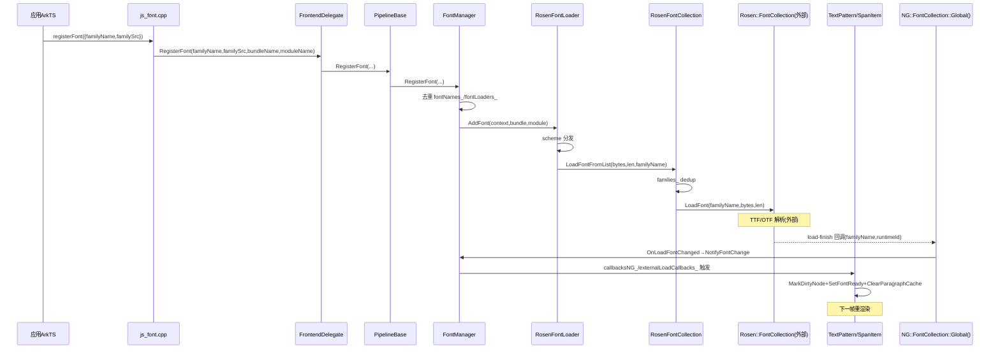
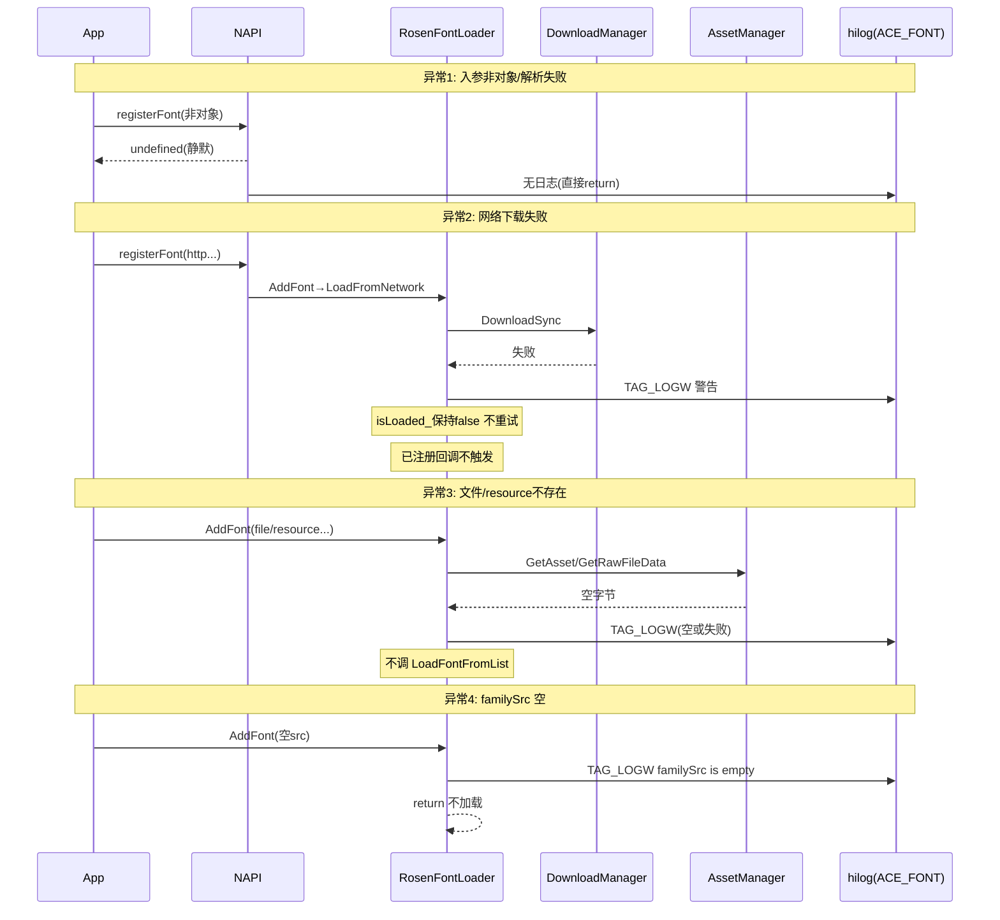

# 字体注册功能域设计

> 确认目标仓和模块的架构约束、关键设计决策、Spec 拆分方向。

## 设计元数据

| 字段 | 内容 |
|------|------|
| Design ID | DESIGN-Func-04-13-01 |
| 功能域 | 字体注册 (04-13-01) |
| 版本 | 1.0 |
| 状态 | Baselined（已有实现补录） |
| 作者 | ArkUI SIG |
| 日期 | 2026-07-28 |
| 目标版本 | API 9–23+ |
| 复杂度 | 复杂 |
| 关联 Feat | Feat-01: 字体注册与查询全能力 |
| 关联需求 | 已有能力补录（无独立 requirement.md） |

## 需求基线

| 项 | 补充说明 |
|----|----------|
| 字体注册是管线级服务而非组件级 Pattern | 所有注册入口必经 PipelineBase::RegisterFont→FontManager，无 FontModel/FontRegisterModel 类 |
| 字体字节解析外置到 graphic_2d | ace 仅读字节交 Rosen::FontCollection::LoadFont，TTF/OTF 解析不在本仓 |
| API 非对称弃用 | font.registerFont/getSystemFontList/getFontByName 自 18 弃用→UIContext.Font；getUIFontConfig 未弃用仍全局独有 |
| 卡片字体按 NativeEngine runtimeId 隔离 | form-render 经 TxtFontCollection::GetFormLocalInstance→FontCollectionMgr::GetLocalInstance(envId) |
| 跨子系统引用不在本仓实现 | @ohos.fontManager(Localization)、@ohos.graphics.text.FontCollection(Graphics) 实现 external |

## 上下文和现状

### 涉及仓和模块

| 仓库 | 补充架构说明 |
|------|-------------|
| ace_engine (interfaces/napi/kits/font/) | NAPI 模块 @ohos.font 绑定（JSRegisterFont 等 4 方法） |
| ace_engine (frameworks/bridge/cj_frontend/interfaces/cj_ffi/font/) | Cangjie FFI 字体绑定 |
| ace_engine (frameworks/bridge/declarative_frontend/, js_frontend/, card_frontend/, plugin_frontend/) | 5 个前端委托实现 FrontendDelegate::RegisterFont |
| ace_engine (frameworks/core/interfaces/native/implementation/) | Arkoala 生成 C 桥 global_scope_ohos_font_accessor（服务静态前端） |
| ace_engine (frameworks/core/pipeline/) | PipelineBase::RegisterFont 汇聚点 + PipelineContext::LoadSystemFont |
| ace_engine (frameworks/core/common/) | FontManager 抽象 + FontLoader 抽象 + FontChangeObserver + FontPlatformProxy |
| ace_engine (frameworks/core/components/font/) | RosenFontLoader/RosenFontCollection/RosenFontManager 具体实现 + 字体创建工厂 |
| ace_engine (frameworks/core/components_ng/render/) | NG::FontCollection 回调注册 + TxtFontCollection/TxtParagraph 适配 |
| ace_engine (frameworks/core/components_ng/pattern/text/) | TextPattern/SpanItem/MultipleParagraphLayoutAlgorithm 字体回调集成 |
| ace_engine (adapter/ohos/entrance/) | AceContainer::CheckAndSetFontFamily 主题字体 + SetAppCustomFont |
| ace_engine (interfaces/native/) | NDK 族名设置器（消费方，非注册） |
| interface/sdk-js (外部仓) | @ohos.font.d.ts / @ohos.arkui.UIContext.d.ts / .static.d.ets / @ohos.fontManager.d.ts / @ohos.graphics.text.d.ts |
| graphic_2d (外部仓) | Rosen::FontCollection::LoadFont/LoadThemeFont/ClearThemeFont + FontCollectionMgr |
| Localization (外部仓) | @ohos.fontManager installFont/uninstallFont 系统字体安装 |

### 调用链层级分析

| 层 | 模块 | 职责 | 修改类型 |
|----|------|------|----------|
| L1 SDK 声明 | interface/sdk-js/api/@ohos.font.d.ts, @ohos.arkui.UIContext.d.ts, .static.d.ets | 公开 API 契约 | 已有（补录） |
| L2 NAPI/FFI/Arkoala 绑定 | interfaces/napi/kits/font/js_font.cpp, cj_font_ffi.cpp, global_scope_ohos_font_accessor.cpp | JS/Cangjie/静态 C 桥到 C++ | 已有 |
| L3 前端委托 | FrontendDelegate（declarative_frontend/js_frontend/card_frontend/plugin_frontend/cj_frontend_abstract） | 跨前端统一注册接口 | 已有 |
| L4 管线汇聚 | PipelineBase::RegisterFont | 单一汇聚 chokepoint | 已有 |
| L5 FontManager 注册存储 | frameworks/core/common/font_manager.cpp | familyName 去重、fontLoaders_ 存储、回调注册 | 已有 |
| L6 FontLoader 分发 | frameworks/core/components/font/rosen_font_loader.cpp | familySrc URL scheme 分发到 network/resource/file/asset | 已有 |
| L7 RosenFontCollection 字节落地 | frameworks/core/components/font/rosen_font_collection.cpp | dedup families_、调外部 Rosen::FontCollection::LoadFont | 已有 |
| L8 外部图形引擎（跨仓） | graphic_2d Rosen::FontCollection | TTF/OTF 字形解析与 glyph cache | 外部（不修改） |
| L9 系统字体查询 | FontPlatformProxy / Rosen::TextEngine::Font_parser | 构建期二选一系统字体枚举 | 已有 |
| L10 异步加载回调 | font_manager.cpp RegisterCallbackNG + externalLoadCallbacks_ + NG::FontCollection::Global | 加载完成→文本节点重渲染 | 已有 |
| L11 卡片字体隔离 | txt_font_collection.cpp GetFormLocalInstance + FontCollectionMgr | per-NativeEngine FontCollection | 已有 |
| L12 文本组件消费 | TextPattern/SpanItem/MultipleParagraphLayoutAlgorithm | fontFamily 设置 + RegisterCallbackNG + dirty 重渲染 | 已有 |
| L13 主题/应用默认字体 | AceContainer::CheckAndSetFontFamily + SetAppCustomFont + 布局期覆盖 | 主题字体加载 + appCustomFont 静默覆盖 | 已有 |
| L14 NDK 消费方 | interfaces/native/ OH_ArkUI_TextStyle_SetFontFamily 等 | 族名设置（非注册） | 已有 |
| L15 跨子系统引用 | @ohos.fontManager / @ohos.graphics.text.FontCollection | 系统字体安装 / 字体引擎替代 | 外部（不修改） |

检查项：
- [x] 调用链每一层都已覆盖（L1 SDK → L15 跨子系统）
- [x] 每层职责边界清晰，无跨层违规调用（L8/L15 外部仓边界明确）
- [x] 每层修改类型明确（均为"已有补录"，无新修改）

### 适用架构规则

| Rule ID | 适用原因 | 设计结论 | 验证方式 |
|---------|----------|----------|----------|
| OH-ARCH-LAYERING | 注册跨越 SDK→NAPI/FFI→前端委托→Pipeline→FontManager→FontLoader→RosenFontCollection→外部 Rosen 共 8 层 | 调用方向单向自顶向下，FontManager 为汇聚点，无反向调用 | 架构评审/依赖检查 |
| OH-ARCH-SUBSYSTEM | 引用 graphic_2d(Rosen)、Localization(fontManager)、Graphics(graphics.text) 三个跨子系统 | ace 仅读字节交 Rosen；跨子系统 API 仅文档引用不直接实现 | 代码评审/依赖检查 |
| OH-ARCH-API-LEVEL | 涉及 Public API（@since 9–23）、InnerApi（FontManager）、C-API（NDK 族名设置器） | Public 经 SDK d.ts；InnerApi 经 frameworks/core/common/；C-API 经 interfaces/native/ | API 评审/XTS |
| OH-ARCH-COMPONENT-BUILD | 横跨 napi_kits/font、bridge、core/common、core/components/font、core/components_ng/render、adapter/ohos | 各模块独立 BUILD.gn，USE_PLATFORM_FONT/TEXGINE_SUPPORT_FOR_OHOS/ENABLE_ROSEN_BACKEND 宏控制 | 构建验证 |
| OH-ARCH-ERROR-LOG | NAPI 失败静默返回 undefined、NDK 返回 ARKUI_ERROR_CODE_*、内部 TAG_LOGI/TAG_LOGW(ACE_FONT) | Public API 无错误码抛出；内部日志贯穿注册/加载/失败 | 单测/hilog |

## 不涉及项承接

| 维度 | 设计结论 |
|------|----------|
| 新增 Public API | 不涉及 — 全部为已有实现补录 |
| 新增构建依赖 | 不涉及 — 无 bundle.json/BUILD.gn 新增依赖 |
| 跨进程 IPC | 不涉及 — FontManager 为同进程管线级服务 |
| 数据持久化 | 不涉及 — 字体注册仅在内存 fontLoaders_/families_ |
| 安全权限 | 不涉及 — ace font API 无权限；跨子系统 fontManager.installFont 需 ohos.permission.UPDATE_FONT 但不在本仓 |
| TTF/OTF 字形解析 | 不涉及 — 由 graphic_2d Rosen::FontCollection::LoadFont 外部实现 |

## 关键设计决策

### ADR-1: 字体注册统一汇聚到 FontManager（非组件 Pattern）

| 属性 | 值 |
|------|-----|
| 决策ID | ADR-1 |
| 决策 | 所有注册入口（NAPI/FFI/Arkoala/前端委托）必经 PipelineBase::RegisterFont→FontManager::RegisterFont，不存在组件级 FontModel/FontRegisterModel 注册路径 |
| 上下文 | 字体是管线级共享资源，多组件共享同一已注册字体族，需统一存储与去重 |
| 探索过的替代方案 | A) 每组件 Pattern 自持字体注册；B) 独立 FontPattern 全局单例 |
| 取舍理由 | A 导致同字体多次注册、去重复杂、生命周期耦合组件；B 重复 FontManager 职责；统一汇聚到 FontManager 最简且与已有管线架构一致 |
| 影响 | 字体注册与组件 Pattern 解耦；文本组件仅经 RegisterCallbackNG 订阅加载完成 |
| 源码引用 | js_font.cpp:105, cj_font_ffi.cpp:22, global_scope_ohos_font_accessor.cpp:133, pipeline_base.cpp:388, font_manager.cpp:60 |

### ADR-2: 字体字节解析外置到 graphic_2d（ace 不解析 TTF/OTF）

| 属性 | 值 |
|------|-----|
| 决策ID | ADR-2 |
| 决策 | ace 仅读字体文件字节（network/resource/file/asset 四路径），统一交 RosenFontCollection::LoadFontFromList→Rosen::FontCollection::LoadFont；字形解析与 glyph cache 在 graphic_2d |
| 上下文 | 字形解析需 Skia/Rosen 绘制栈深度集成，ace 不重复实现 |
| 探索过的替代方案 | A) ace 内嵌 freetype 解析；B) 字节缓存常驻 ace |
| 取舍理由 | A 与 Rosen 绘制栈双轨易不一致；B 字节常驻增加内存且与 glyph cache 重复；外置到 Rosen 单一解析路径 |
| 影响 | 字体加载完成时点由 Rosen 决定；ace 经 NG::FontCollection::Global() 全局回调感知；定界：ace 读字节成功即交 Rosen，Rosen LoadFont 失败不回传 ace |
| 源码引用 | rosen_font_collection.cpp:42-60, :23(#ifndef USE_ROSEN_DRAWING Skia 路径) |

### ADR-3: 系统字体查询构建期双路径（FontPlatformProxy vs texgine）

| 属性 | 值 |
|------|-----|
| 决策ID | ADR-3 |
| 决策 | GetSystemFontList/GetSystemFont/GetUIFontConfig 行为由构建宏决定：USE_PLATFORM_FONT→FontPlatformProxy 外部委托；否则 ENABLE_ROSEN_BACKEND+TEXGINE_SUPPORT_FOR_OHOS→Rosen::TextEngine::Font_parser |
| 上下文 | 不同设备/构建配置下系统字体来源不同（外部 font-service vs Rosen texgine） |
| 探索过的替代方案 | A) 运行时动态选择；B) 统一仅 texgine |
| 取舍理由 | A 增加运行时分支与不确定性；B 排除非 texgine 设备；构建期二选一最稳定且与设备能力对齐 |
| 影响 | 不同构建配置下系统字体列表字段来源不同；FontPlatformProxy::SetDelegate 在本仓无调用方（推测：外部 font-service 注册） |
| 源码引用 | font_manager.cpp:122-141(PLATFORM), :128-139(texgine), :143-183(UIFontConfig), font_platform_proxy.h:26, frameworks/core/BUILD.gn:689,1241 |

### ADR-4: 卡片字体按 NativeEngine runtimeId 隔离

| 属性 | 值 |
|------|-----|
| 决策ID | ADR-4 |
| 决策 | form-render 上下文下 FontCollection::Current() 返回 GetFormLocalInstance()，经 Rosen::FontCollectionMgr::GetLocalInstance(envId) 按 NativeEngine runtimeId 获取独立 FontCollection；非 form 返回全局 GetInstance() |
| 上下文 | 多卡片实例并发渲染时字体集合需隔离，避免互相污染 |
| 探索过的替代方案 | A) 所有卡片共用全局集合；B) 每卡片独立 FontManager |
| 取舍理由 | A 卡片字体互相串扰；B 重复 FontManager 职责且系统字体查询冗余；per-NativeEngine FontCollection 在 Rosen 层隔离最彻底 |
| 影响 | 卡片字体注册回调按 runtimeId 分发到 formLoadCallbacks_；NotifyFormFontChange 仅触发同 runtimeId 回调；PREVIEW 构建无隔离（runtimeId=0） |
| 源码引用 | txt_font_collection.cpp:74,88-106, font_manager.cpp:519-549 |

### ADR-5: appCustomFont 静默覆盖空 fontFamily（不显式 API）

| 属性 | 值 |
|------|-----|
| 决策ID | ADR-5 |
| 决策 | FontManager::SetAppCustomFont 仅存 name（不加载文件）；布局期 span_node/multiple_paragraph/text_field_layout_algorithm 在 textStyle 无 fontFamily 且 appCustomFont 非空时静默覆盖 |
| 上下文 | 主题/应用配置的默认字体需在用户未显式设置 fontFamily 时生效，又不应破坏显式设置 |
| 探索过的替代方案 | A) 全局强制覆盖所有 fontFamily；B) 组件显式 API 设置默认字体 |
| 取舍理由 | A 破坏显式 fontFamily 优先级；B 增加组件 API 表面；静默覆盖优先级链"组件显式 > appCustomFont > 系统默认"最自然 |
| 影响 | 隐式默认字体行为，对用户不可见；需作为兼容性风险记录 |
| 源码引用 | ace_container.cpp:3655-3658, span_node.cpp:884-886, multiple_paragraph_layout_algorithm.cpp:159-162, text_field_layout_algorithm.cpp:954, font_manager.cpp:110-118 |

### ADR-6: API 非对称弃用（getUIFontConfig 未弃用，仍全局独有）

| 属性 | 值 |
|------|-----|
| 决策ID | ADR-6 |
| 决策 | font.registerFont/getSystemFontList/getFontByName 自 18 弃用→UIContext.Font 等价；getUIFontConfig 未弃用，仍仅全局命名空间，UIContext.Font 无 getUIFontConfig 等价物 |
| 上下文 | UIContext 实例化后字体注册/查询应绑定实例；但 getUIFontConfig 是全局配置查询，不属于单实例范畴 |
| 探索过的替代方案 | A) 全部弃用迁移到 UIContext.Font；B) 全部保留全局 |
| 取舍理由 | A 需为 getUIFontConfig 在 UIContext.Font 增加方法但语义是全局配置；B 与实例化方向相悖；非对称弃用符合语义分层 |
| 影响 | 迁移指南需区分 4 API 不同弃用状态；静态全局 font 命名空间仅暴露 getUIFontConfig，其余静态仅经 UIContext.Font |
| 源码引用 | @ohos.font.d.ts:485/512/534(deprecated) vs :550(not), @ohos.font.static.d.ets:324, @ohos.arkui.UIContext.static.d.ets:77/86/96 |

### ADR-7: 无 NDK 字体注册 C-API（仅族名设置器）

| 属性 | 值 |
|------|-----|
| 决策ID | ADR-7 |
| 决策 | ace_engine 不提供 NDK 字体注册 C-API；interfaces/native/ 仅暴露族名设置器（OH_ArkUI_TextStyle_SetFontFamily 等，消费方）；注册经 NAPI/FFI/Arkoala 生成 C 桥 |
| 上下文 | NDK 场景下字体注册需求较低，且 NAPI/Arkoala 已覆盖；NDK 直接注册会绕过 PipelineBase 汇聚 |
| 探索过的替代方案 | A) 新增 OH_ArkUI_RegisterFont NDK；B) NDK 直接调 Rosen |
| 取舍理由 | A 破坏统一汇聚 ADR-1 且需新增 ndk.json 符号；B 跨层违规且绕过 FontManager 去重；维持现状最稳 |
| 影响 | NDK 应用注册字体需经 ArkTS font.registerFont/UIContext.Font；Arkoala 生成 C 桥仅服务静态前端 |
| 源码引用 | interfaces/native/libace.ndk.json(无 registerFont 符号), arkoala_api_generated.h:29979-29984 |

## 设计骨架

### 骨架范围

| 骨架项 | 目标 | 不包含 | 验证方式 |
|--------|------|--------|----------|
| 注册统一汇聚 | PipelineBase::RegisterFont chokepoint | 组件 Pattern 注册 | 单测 font_manager_test |
| familyName 去重 | fontLoaders_ + families_ 双层 dedup | 跨 family 别名 | 单测 |
| scheme 分发 | network/resource/file/asset 四路径 | 跨 scheme 回退 | 集成测试 |
| 异步回调双路径 | callbacksNG_ + externalLoadCallbacks_ | 跨 family 回调合并 | 单测 + 集成 |
| 卡片隔离 | per-runtimeId FontCollection | 跨卡片字体迁移 | form 集成测试 |
| 系统字体双路径 | FontPlatformProxy + texgine | 运行时切换 | 构建配置验证 |

### 骨架 Spec 拆分

| Task ID | 目标 | 受影响文件 | AC |
|---------|------|-----------|-----|
| TASK-SKELETON-1 | 字体注册与查询全能力补录 | Feat-01-font-registration-full-capability-spec.md | AC-1.1~8.4 |

## 后续 Task 拆分

| Task ID | 目标 | 受影响文件 | 依赖 |
|---------|------|-----------|------|
| TASK-1 | Feat-01 spec 补录（本 Feat 已完成） | specs/04-common-capability/13-font-text/01-font-registration/Feat-01-font-registration-full-capability-spec.md | 无 |
| TASK-2（未来） | 跨子系统 FontCollection 互通性验证 | （graphics 侧确认） | TASK-1 |
| TASK-3（未来） | FontPlatformProxy 外部 delegate 注册路径确认 | （font-service 侧确认） | TASK-1 |

## API 签名、Kit 与权限

### 新增 API

| API 签名 | 类型 | Kit | d.ts 位置 | 权限要求 | SysCap |
|----------|------|-----|-----------|----------|--------|
| `font.registerFont(options: FontOptions): void` | Public | ArkUI | @ohos.font.d.ts:485 | 无 | SystemCapability.ArkUI.ArkUI.Full |
| `font.getSystemFontList(): Array<string>` | Public | ArkUI | @ohos.font.d.ts:512 | 无 | SystemCapability.ArkUI.ArkUI.Full |
| `font.getFontByName(fontName): FontInfo` | Public | ArkUI | @ohos.font.d.ts:534 | 无 | SystemCapability.ArkUI.ArkUI.Full |
| `font.getUIFontConfig(): UIFontConfig` | Public | ArkUI | @ohos.font.d.ts:550 | 无 | SystemCapability.ArkUI.ArkUI.Full |
| `UIContext.getFont(): Font` | Public | ArkUI | @ohos.arkui.UIContext.d.ts:4910 | 无 | SystemCapability.ArkUI.ArkUI.Full |
| `UIContext.Font.registerFont/getSystemFontList/getFontByName` | Public | ArkUI | @ohos.arkui.UIContext.d.ts:82/106/128 | 无 | SystemCapability.ArkUI.ArkUI.Full |
| 静态等价（@since 23 static） | Public | ArkUI | @ohos.font.static.d.ets / @ohos.arkui.UIContext.static.d.ets | 无 | 同上 |
| `OH_ArkUI_TextStyle_SetFontFamily(style, family)` | Public NDK | ArkUI | native_styled_string_descriptor.h:637 | 无 | 同上 |
| `OH_ArkUI_TextEditorTextStyle_SetFontFamily(style, family)` | Public NDK | ArkUI | native_type.h:6318 | 无 | 同上 |
| `OH_ArkUI_TextEditorPlaceholderOptions_SetFontFamily(opts, family)` | Public NDK | ArkUI | native_type.h:5599 | 无 | 同上 |
| 跨子系统 `fontManager.installFont/uninstallFont` | System | LocalizationKit | @ohos.fontManager.d.ts:50/70 | ohos.permission.UPDATE_FONT | SystemCapability.Global.FontManager |
| 跨子系统 `FontCollection.loadFontSync/unloadFontSync` | Public | Graphics | @ohos.graphics.text.d.ts:1559/1658 | 无 | SystemCapability.Graphics.Drawing |

### 变更/废弃 API

| 原有 API | 变更类型 | 新 API | 迁移说明 |
|----------|----------|--------|----------|
| `font.registerFont` (@since 9) | 废弃 (@since 18) | `UIContext.getFont().registerFont` | 绑定 UIContext 实例；ace 文档另推荐 `@ohos.graphics.text.FontCollection.loadFontSync`（@since 12）作为现代字体引擎替代 |
| `font.getSystemFontList` (@since 10) | 废弃 (@since 18) | `UIContext.getFont().getSystemFontList` | 绑定 UIContext 实例 |
| `font.getFontByName` (@since 10) | 废弃 (@since 18) | `UIContext.getFont().getFontByName` | 绑定 UIContext 实例 |
| `font.getUIFontConfig` (@since 11) | 未废弃 | 无（保持全局） | UIContext.Font 无等价物，仍用全局 |

## 构建系统影响

### BUILD.gn 变更

```text
无新增变更（已有实现补录）。
现有构建宏控制：
- frameworks/core/BUILD.gn:689,1241 — USE_PLATFORM_FONT
- ENABLE_ROSEN_BACKEND — 选择 Rosen 实现 vs nullptr
- TEXGINE_SUPPORT_FOR_OHOS — OHOS texgine 系统字体路径
- USE_ROSEN_DRAWING — Skia vs Rosen 绘制
- NG_BUILD — NG UINode/FrameNode 路径 vs legacy RenderNode
- PREVIEW — 预览构建无 per-form 隔离
```

### bundle.json 变更

无新增变更。ace_engine 已依赖 graphic_2d（Rosen::FontCollection）、Localization（fontManager SDK）、Graphics（graphics.text SDK）外部模块，本次补录不新增依赖。

## 可选设计扩展

### 架构图

```mermaid
graph TB
    subgraph L1_SDK声明
        FontDts[@ohos.font.d.ts 动态全局]
        UICTDts[@ohos.arkui.UIContext.d.ts 动态Font类]
        FontStatic[@ohos.font.static.d.ets 静态全局]
        UICTStatic[@ohos.arkui.UIContext.static.d.ets 静态Font类]
    end
    subgraph L2_绑定层
        NAPI[js_font.cpp NAPI]
        FFI[cj_font_ffi.cpp Cangjie]
        Arkoala[global_scope_ohos_font_accessor.cpp 生成C桥]
    end
    subgraph L3_前端委托
        Delegate[FrontendDelegate 5前端实现]
    end
    subgraph L4_L5_汇聚与存储
        Pipeline[PipelineBase RegisterFont]
        FontMgr[FontManager RegisterFont 去重]
        FontLoaders[fontLoaders_ list]
        FontNames[fontNames_ dedup]
    end
    subgraph L6_L7_加载与落地
        RosenLoader[RosenFontLoader AddFont scheme分发]
        RFC[RosenFontCollection LoadFontFromList families_dedup]
    end
    subgraph L8_外部
        Rosen[Rosen FontCollection LoadFont graphic_2d]
    end
    subgraph L9_系统字体
        Platform[FontPlatformProxy USE_PLATFORM_FONT]
        Texgine[Rosen TextEngine Font_parser TEXGINE]
    end
    subgraph L10_异步回调
        RegCB[RegisterCallbackNG]
        ACECB[callbacksNG_]
        ExtCB[externalLoadCallbacks_]
        GlobalCB[NG FontCollection Global call_once]
    end
    subgraph L11_卡片隔离
        FormLocal[TxtFontCollection GetFormLocalInstance]
        FCMgr[Rosen FontCollectionMgr GetLocalInstance envId]
    end
    subgraph L12_消费
        TextPattern[TextPattern SpanItem]
    end
    subgraph L13_主题默认
        AceCont[AceContainer CheckAndSetFontFamily]
        AppCustom[appCustomFont_ 静默覆盖]
    end
    FontDts --> NAPI
    UICTDts --> NAPI
    FontStatic --> Arkoala
    UICTStatic --> Arkoala
    NAPI --> Delegate
    FFI --> Pipeline
    Arkoala --> Pipeline
    Delegate --> Pipeline
    Pipeline --> FontMgr
    FontMgr --> FontLoaders
    FontMgr --> FontNames
    FontMgr --> RosenLoader
    RosenLoader -->|network/resource/file/asset| RFC
    RFC --> Rosen
    RegCB -->|命中FontLoader| ACECB
    RegCB -->|未命中| ExtCB
    GlobalCB --> ExtCB
    FormLocal --> FCMgr
    ACECB --> TextPattern
    TextPattern -->|fontFamily设置| RegCB
    AceCont -->|SetFontFamily| RosenLoader
    AppCustom -->|布局期覆盖| TextPattern
```

### 数据流/控制流

| 步骤 | 调用方 | 被调用方 | 数据/接口 | 说明 |
|------|--------|----------|-----------|------|
| 1 | 应用 ArkTS | `font.registerFont`/`UIContext.Font.registerFont` | `FontOptions{familyName,familySrc}` | 入口 |
| 2 | NAPI/FFI/Arkoala | `FrontendDelegate::RegisterFont` | familyName, familySrc, bundleName, moduleName | 跨前端统一 |
| 3 | 前端委托 | `PipelineBase::RegisterFont` | 同上 | 单一汇聚 |
| 4 | Pipeline | `FontManager::RegisterFont` | familyName, context, bundleName, moduleName | 去重 |
| 5 | FontManager | `FontLoader::Create` + `fontLoaders_.emplace_back` | familyName, familySrc | 存储 |
| 6 | FontManager | `RosenFontLoader::AddFont` | context, bundleName, moduleName | scheme 分发 |
| 7 | RosenFontLoader | `LoadFromNetwork/Resource/File/Asset` | 字节读取 | 异步（network）或同步 |
| 8 | RosenFontLoader | `RosenFontCollection::LoadFontFromList` | bytes, len, familyName | dedup families_ |
| 9 | RosenFontCollection | `Rosen::FontCollection::LoadFont` | bytes, len | 外部解析（跨仓） |
| 10 | Rosen（外部） | `NG::FontCollection::Global()` load-finish 回调 | familyName, runtimeId | 加载完成通知 |
| 11 | FontManager | `NotifyFontChange`/`NotifyFormFontChange` | 遍历 callbacksNG_/externalLoadCallbacks_/formLoadCallbacks_ | 触发文本重渲染 |
| 12 | 文本组件 | `MarkDirtyNode`+`SetFontReady`+`ClearParagraphCache` | PROPERTY_UPDATE_MEASURE | 重渲染 |

### 时序设计



### 数据模型设计

**TypeScript（API 层类型）**

```typescript
interface FontOptions { familyName: string | Resource; familySrc: string | Resource; }
interface FontInfo { path; postScriptName; fullName; family; subfamily; weight: number; width: number; italic: boolean; monoSpace: boolean; symbolic: boolean; }
interface UIFontConfig { fontDir: Array<string>; generic: Array<UIFontGenericInfo>; fallbackGroups: Array<UIFontFallbackGroupInfo>; }
// + UIFontGenericInfo/UIFontAliasInfo/UIFontAdjustInfo/UIFontFallbackGroupInfo/UIFontFallbackInfo
```

**C++（框架层结构）**

```cpp
// frameworks/core/common/font_manager.h
class FontManager {
    std::list<RefPtr<FontLoader>> fontLoaders_;        // 注册存储
    std::vector<std::string> fontNames_;              // family dedup
    std::set<WeakPtr<RenderNode>> fontNodes_;         // legacy 字体节点
    std::set<WeakPtr<NG::UINode>> fontNodesNG_;       // NG 字体节点
    std::set<WeakPtr<NG::UINode>> variationNodesNG_; // weight-scale 变化节点
    std::set<WeakPtr<FontChangeObserver>> observers_;
    std::map<WeakPtr<NG::UINode>, std::map<std::string, std::function<void()>>> externalLoadCallbacks_;
    std::map<WeakPtr<NG::UINode>, std::map<std::string, FormLoadFontCallbackInfo>> formLoadCallbacks_;
    std::string appCustomFont_;                        // 应用自定义默认字体名
    float fontWeightScale_ = 1.0f;
    bool isDefaultFontChanged_ = false;
};

// frameworks/core/components/font/rosen_font_collection.h
class RosenFontCollection {
    std::shared_ptr<Rosen::FontCollection> fontCollection_;  // 外部不透明
    std::unordered_set<std::string> families_;               // 字节落地 dedup
    std::vector<std::string> currentFamily_;                 // 主题字体 diff
};
```

**存储方案**

| 数据 | 存储位置 | 生命周期 | 持久化 |
|------|----------|----------|--------|
| 已注册 FontLoader | FontManager::fontLoaders_ | 与 PipelineContext 同生命周期 | 否（内存） |
| family dedup 名单 | FontManager::fontNames_ | 同上 | 否 |
| 已加载 family 集合 | RosenFontCollection::families_ | 进程单例 | 否 |
| 外部加载回调 | FontManager::externalLoadCallbacks_ | 弱引用，节点销毁自动清 | 否 |
| form 加载回调 | FontManager::formLoadCallbacks_（按 runtimeId） | 同上 | 否 |
| appCustomFont 名 | FontManager::appCustomFont_ | 与 PipelineContext 同生命周期 | 否 |
| 主题字体字节 | Rosen::FontCollection（外部） | 进程单例 | 否 |

### 测试性设计

| 测试层级 | 测试目标 | Mock 策略 | 验证方式 |
|----------|----------|-----------|----------|
| 单元测试 | FontManager::RegisterFont 去重 | Mock FontLoader | test/unittest/core/common/font/font_manager_test.cpp |
| 单元测试 | NAPI JSRegisterFont 参数校验 | Mock napi_env | napi 单测 |
| 单元测试 | RosenFontLoader scheme 分发 | Mock PipelineContext/AssetManager | loader 单测 |
| 集成测试 | 异步加载→文本重渲染 | 真实 RosenFontCollection + Mock Rosen | 端到端 |
| 集成测试 | 卡片 runtimeId 隔离 | 双 form-render context | form 集成 |
| 构建验证 | USE_PLATFORM_FONT/TEXGINE 宏路径 | 双构建 | 构建配置对比 |
| 异常注入 | 网络下载失败/文件不存在/解析失败 | Mock DownloadSync/Asset | 静默降级验证 |
| AutoUI | IsDefaultFontChanged 强制 true | GetDebugAutoUIEnabled | 高精度渲染 |

### 异常传播时序图



### 资源所有权矩阵

| 资源 | 创建方 | 持有方 | 销毁触发 | 实际释放 | 异常回收 |
|------|--------|--------|----------|----------|----------|
| FontLoader | FontManager::RegisterFont | FontManager::fontLoaders_ | PipelineContext 销毁 | fontLoaders_ 析构 | 弱引用自动清 |
| 字体字节缓冲 | RosenFontLoader::LoadFrom* | 临时（交 Rosen 后不常驻 ace） | LoadFontFromList 调用后 | Rosen 内部 cache | 失败不缓存 |
| callbacksNG_ | SpanItem::FontRegisterCallback | FontManager::callbacksNG_ | 节点销毁（弱引用） | WeakPtr 失效 | 自动清 |
| externalLoadCallbacks_ | RegisterTextEngineLoadCallback | FontManager::externalLoadCallbacks_ | 节点销毁 | WeakPtr 失效 | 自动清 |
| formLoadCallbacks_ | form-render 注册 | FontManager::formLoadCallbacks_（按 runtimeId） | 卡片销毁 | WeakPtr 失效 | 自动清 |
| Rosen::FontCollection | RosenFontCollection::GetFontCollection（call_once） | RosenFontCollection::fontCollection_（进程单例） | 进程退出 | 静态析构 | 无（进程级） |

### 接口参数规约

| 接口 | 参数 | 类型 | 合法范围 | 非法处理 | 边界说明 |
|------|------|------|----------|----------|----------|
| registerFont | options | object | {familyName, familySrc} | 非对象返回 undefined | — |
| registerFont | familyName | string\|Resource | 非空字符串或 Resource | 解析失败返回 undefined | 空字符串不阻塞但语义未定义 |
| registerFont | familySrc | string\|Resource | scheme 前缀决定路径 | 空 src 记警告 return | `:` 判定须在 resource 之后 |
| getFontByName | fontName | string | 已存在系统字体名 | 不存在返回空对象 | — |
| OH_ArkUI_TextStyle_SetFontFamily | fontFamily | const char* | 已注册字体族名 | 返回 ARKUI_ERROR_CODE_PARAM_INVALID | nullptr/空串错误码 |

### 线程与并发模型

| 操作 | 发起线程 | 回调线程 | 跨进程边界 | 线程安全 | 重入约束 |
|------|----------|----------|-----------|----------|----------|
| registerFont（同步） | UI | UI | 无 | PipelineContext 串行 | 同 familyName 重入去重 |
| LoadFromNetwork | UI→BACKGROUND | UI（successCallback） | 无（同进程 DownloadSync） | UI 回调串行 | 同 familyName 不重入（dedup） |
| LoadFromFile/Resource/Asset | UI→IO（GetRawFileData） | UI（PostLoadFontTask） | 无 | UI 回调串行 | 同上 |
| LoadFontFromList→Rosen | UI | UI→外部 | 无 | Rosen 内部线程安全 | families_ dedup |
| RegisterCallbackNG | UI（layout 时） | UI | 无 | FontManager 串行 | 同节点同 family 不重入 |
| OnLoadFontFinished | 外部线程→UI | UI | 无 | Global call_once 注册 | — |
| NotifyFormFontChange | UI | UI | 无 | 按 runtimeId 分发 | 卡片间隔离 |

## 详细设计

### 注册统一汇聚与去重

`PipelineBase::RegisterFont`（pipeline_base.cpp:388）是所有前端入口的单一汇聚点：

```cpp
void PipelineBase::RegisterFont(familyName, familySrc, bundleName, moduleName) {
    if (fontManager_) {
        fontManager_->RegisterFont(familyName, familySrc, AceType::Claim(this), bundleName, moduleName);
    }
}
```

`FontManager::RegisterFont`（font_manager.cpp:60-86）双层去重：
1. `fontNames_` 检查并加入 familyName（无返回）
2. 遍历 `fontLoaders_`，若存在同名 `GetFamilyName() == familyName` 则提前 return（不重复创建）
3. 否则 `FontLoader::Create` + `fontLoaders_.emplace_back` + `fontLoader->AddFont` + `SetVariationChanged`

### RosenFontLoader scheme 分发

`RosenFontLoader::AddFont`（rosen_font_loader.cpp:44-66）按 familySrc 前缀分发，顺序固定：

```cpp
if (context == nullptr || familySrc_.empty()) { TAG_LOGW; return; }
if (familySrc_.substr(0, strlen(FONT_SRC_NETWORK)) == FONT_SRC_NETWORK)   LoadFromNetwork(context);
else if (familySrc_.substr(0, strlen(FONT_SRC_RESOURCE)) == FONT_SRC_RESOURCE) LoadFromResource(context, bundleName, moduleName);
else if (familySrc_.find_first_of(':') != std::string::npos)             LoadFromFile(context);
else                                                                       LoadFromAsset(context);
```

四路径均汇入 `RosenFontCollection::LoadFontFromList`（rosen_font_collection.cpp:42-60），dedup `families_` 后调 `fontCollection_->LoadFont(familyName, data, len)`（外部）。

### 异步加载回调双路径

`FontManager::RegisterCallbackNG`（font_manager.cpp:378-402）：

1. 遍历 `fontLoaders_` 匹配 familyName
   - 命中：`fontLoader->SetOnLoadedNG(node, callback)` 存入 `callbacksNG_`（rosen_font_loader.cpp:55，若 isLoaded_ 已为 true 则回调 drop）
2. 未命中：`RegisterTextEngineLoadCallback`（font_manager.cpp:402）
   - 存入 `externalLoadCallbacks_`（form 场景存 `formLoadCallbacks_` 按 runtimeId）
   - `std::call_once load_font_flag_`：在 `NG::FontCollection::Global()` 注册全局 load/unload finish 回调（font_manager.cpp:483-501）
   - 外部加载完成 → `OnLoadFontFinished`（txt_font_collection.cpp:25）解析 runtimeId → `OnLoadFontChanged`→`NotifyFontChange`/`NotifyFormFontChange`（font_manager.cpp:519-549）触发匹配回调

回调内执行（span_node.cpp:1188-1224）：`MarkDirtyNode(PROPERTY_UPDATE_MEASURE)` + `SetFontReady(true)` + `ClearParagraphCache()` + `OnPropertyChangeMeasure()`。

### 卡片字体按 NativeEngine runtimeId 隔离

`FontCollection::Current()`（txt_font_collection.cpp:74）：

```cpp
// form-render 上下文 → GetFormLocalInstance()
static RefPtr<FontCollection> Current() {
    if (IsFormRenderContext()) return TxtFontCollection::GetFormLocalInstance();
    return TxtFontCollection::GetInstance();
}
```

`GetFormLocalInstance`（txt_font_collection.cpp:88-106）：`#ifndef PREVIEW` 下经 `Rosen::FontCollectionMgr::GetLocalInstance(envId)` 按 NativeEngine runtimeId 获取独立 FontCollection；`PREVIEW` 跳过，runtimeId=0 共用全局。

`NotifyFormFontChange`（font_manager.cpp:519-549）仅触发同 runtimeId 的 `formLoadCallbacks_` 回调。

### 主题/应用自定义默认字体

`AceContainer::CheckAndSetFontFamily`（ace_container.cpp:3516-3545）：
1. 若 `fontManager->IsUseAppCustomFont()` 返回 true 则提前 return
2. 探测 `/data/themes/a/app/fonts/` 与 `/data/themes/b/app/fonts/`（`IsFontFileExistInPath`）
3. 命中后 `GetFontFamilyName(path)` + 构建全路径
4. `fontManager->SetFontFamily(familyName, fullPath)`（g_mutexFontFamily 保护）
5. 路由到 `RosenFontLoader::SetDefaultFontFamily` → `RosenFontCollection::LoadFontFamily` → `LoadThemeFont`

`RosenFontCollection::LoadThemeFont`（rosen_font_collection.cpp:70-84）：防御性 `ClearThemeFont()`→`LoadThemeFont()`，size 不匹配再次 `ClearThemeFont()`。

`FontManager::SetAppCustomFont`（font_manager.cpp:110-118）仅存 name；布局期 `span_node.cpp:884-886`/`multiple_paragraph_layout_algorithm.cpp:159-162`/`text_field_layout_algorithm.cpp:954` 在 textStyle 无 fontFamily 且 `GetAppCustomFont()` 非空时 `SetFontFamilies(ConvertStrToFontFamilies(appCustomFont))` 静默覆盖。覆盖优先级：组件显式 > appCustomFont > 系统默认。

### 系统字体查询构建期双路径

`FontManager::GetSystemFontList`（font_manager.cpp:120-141）：

```cpp
#ifdef USE_PLATFORM_FONT
    auto fontPlatform = FontPlatformProxy::GetInstance().GetFontPlatform();
    if (fontPlatform) fontPlatform->GetSystemFontList(fontList);
#else
#ifdef ENABLE_ROSEN_BACKEND
#ifdef TEXGINE_SUPPORT_FOR_OHOS
    Rosen::TextEngine::Font_parser fontParser;
    auto locale = Localization::GetInstance()->GetFontLocale();
    systemFontList = fontParser.GetVisibilityFonts(locale);
    // 遍历填 fontList
#endif
#endif
#endif
```

`GetSystemFont`（font_manager.cpp:186-193）、`GetUIFontConfig`（font_manager.cpp:143-183）同样双路径。`FontPlatformProxy::SetDelegate` 在本仓无调用方（推测：外部 font-service 注册）。

## 风险和开放问题

| 项 | 类型 | 影响 | 处理方式 | Owner |
|----|------|------|----------|-------|
| TTF/OTF 解析在 graphic_2d 外部仓，ace 无法定界 | 架构 | 中 | 文档明确边界：ace 读字节成功即交 Rosen | ArkUI SIG |
| FontPlatformProxy::SetDelegate 调用方不在本仓 | 架构 | 中 | 推测外部 font-service 注册，需 font-service 侧确认 | 待确认 |
| 跨子系统 FontCollection.loadFontSync 与 ace registerFont 字体集合互通性 | 架构 | 中 | 需 graphics 侧确认是否共享底层 Rosen::FontCollection | 待确认 |
| appCustomFont 静默覆盖对用户不可见 | API | 中 | spec 已记录为兼容性风险；覆盖优先级链文档化 | ArkUI SIG |
| API 非对称弃用可能误导迁移 | API | 低 | spec 迁移指引明确区分 4 API 不同弃用状态 | ArkUI SIG |
| PREVIEW 构建无卡片隔离 | 构建 | 低 | 文档明确，预览场景共用全局集合 | ArkUI SIG |
| Rosen 失败不回传 ace | 架构 | 低 | 定界清晰：ace 不感知 Rosen 解析失败 | ArkUI SIG |

## 设计审批

- [x] 需求基线已确认，设计覆盖 P0/P1 AC
- [x] 不涉及项已承接，N/A 和展开项都有结论
- [x] 涉及仓和模块职责清楚
- [x] 调用链层级分析完整，每层覆盖到位（L1–L15）
- [x] 适用架构规则已识别并形成设计结论
- [x] 分层和子系统边界合规
- [x] API 变更有签名、权限、错误码和兼容性说明
- [x] BUILD.gn/bundle.json 影响明确（无新增变更）
- [x] 设计输出和后续 Task 拆分明确
- [x] 关键设计决策有理由和影响说明（ADR-1..7）
- [x] 风险和开放问题有 Owner

**结论:** 通过（已有实现补录）
