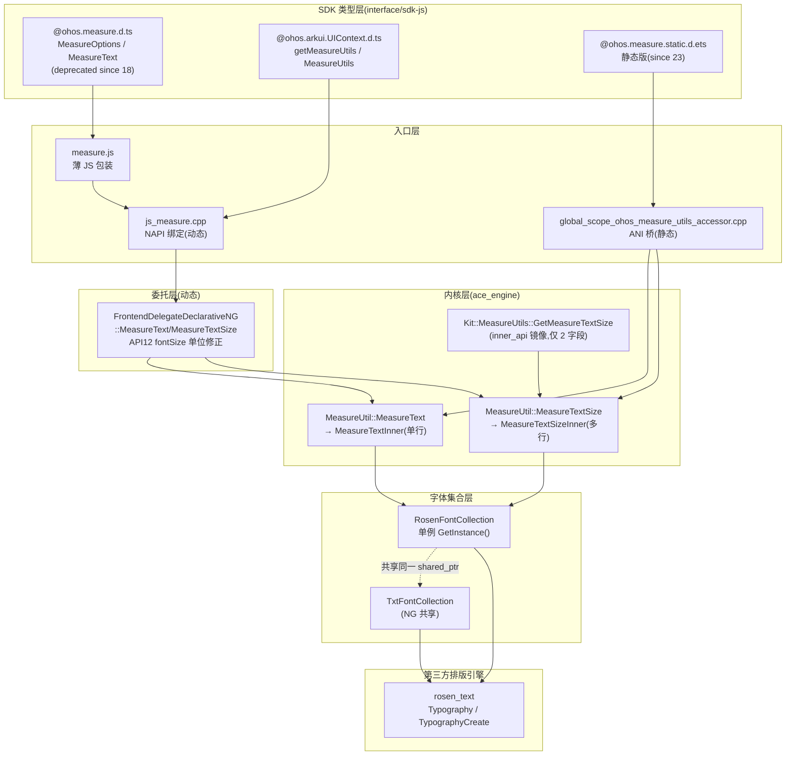
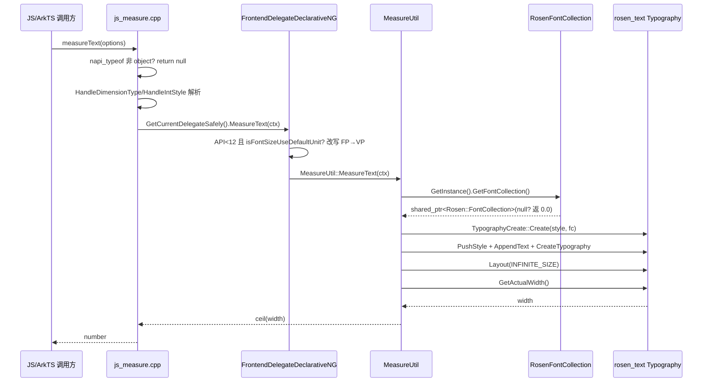
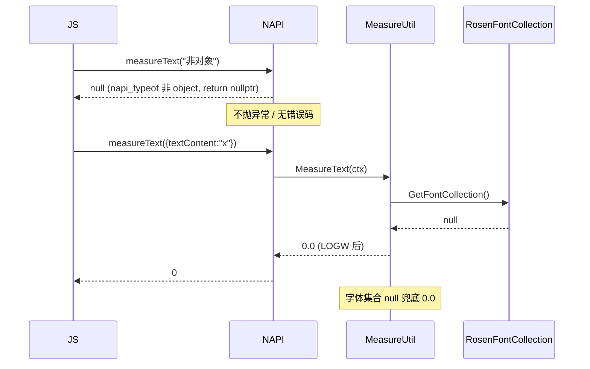

# 架构设计

> 确认目标仓和模块的架构约束、关键设计决策、Spec 拆分方向。本设计为"文本测量"功能域(`04-13-02`)的基线设计,由 Feat-01(独立文本测量能力)首立;Feat-02(段落级排版测量)、Feat-03(组件级行级度量查询)将以增量合并方式追加。

## 设计元数据

| Field | Content |
|-------|---------|
| Design ID | `DESIGN-Func-04-13-02` |
| 关联需求 | 已有能力补录(无独立 requirement.md) |
| 关联 Epic | 字体文本 - 文本测量 |
| 目标 Feature | Feat-01 独立文本测量能力(首立 baseline) |
| 复杂度 | 标准 |
| 目标版本 | API 9 起动态版;API 12 起 UIContext.MeasureUtils;API 18 起模块级废弃;API 23 起静态版 |
| Owner | ArkUI SIG |
| 状态 | Baselined(已有实现补录) |

## 需求基线

| 项 | 补充说明 |
|----|----------|
| standalone 测量三入口同内核 | 模块级 `@ohos.measure`、UI 上下文绑定 `UIContext.MeasureUtils`、静态 ArkTS `@ohos.measure` 三入口必须落到同一 `OHOS::Ace::MeasureUtil::MeasureText/MeasureTextSize`,共享同一 `RosenFontCollection` 单例 |
| 模块级废弃迁移 | API 18 起动态版 `MeasureText.measureText/measureTextSize` 标 `@deprecated`,指向 `UIContext.MeasureUtils`;静态版(since 23 static)未废弃 |
| measureText 单行契约 | `measureText` 仅测单行宽度,布局约束类参数(constraintWidth/maxLines/textAlign/overflow/lineHeight/baselineOffset/textCase/textIndent/wordBreak)被静默忽略;多行文本取最长行宽 |
| API 12 fontSize 单位修正 | 裸数字 fontSize 在 API<12 按 VP、API≥12 按 FP,经委托层 `isFontSizeUseDefaultUnit` flag + `GreatOrEqualTargetAPIVersion(VERSION_TWELVE)` 门控 |

## 上下文和现状

### 涉及仓和模块

| 仓库 | 补充架构说明 |
|------|-------------|
| `foundation/arkui/ace_engine` | NAPI 桥(`interfaces/napi/kits/measure`)、委托实现(`frameworks/bridge/declarative_frontend/ng`)、内核工具(`frameworks/base/utils`)、字体集合(`frameworks/core/components/font`、`frameworks/core/components_ng/render`)、静态 ANI 桥(`frameworks/core/interfaces/native/implementation`)、inner_api 镜像(`interfaces/inner_api/ace_kit`) |
| `interface/sdk-js` | 公开类型定义:`@ohos.measure.d.ts`/`.static.d.ets`、`@ohos.arkui.UIContext.d.ts`/`.static.d.ets`、`@internal/component/ets/text_common.d.ts`、`@internal/component/ets/units.d.ts`(SizeOptions) |

### 调用链层级分析

> 从最上层到最底层逐层扫描调用链路。三入口(动态模块级 / 动态 UIContext / 静态 ArkTS)汇入同一内核。

| 层 | 模块 | 职责 | 修改类型 |
|----|------|------|----------|
| L1 SDK 类型层 | `@ohos.measure.d.ts`、`@ohos.arkui.UIContext.d.ts`、`@ohos.measure.static.d.ets`、`@ohos.arkui.UIContext.static.d.ets` | 声明 `MeasureOptions` 接口、`MeasureText`/`MeasureUtils` 类与方法签名、`@since`/`@deprecated`/`@useinstead` 标注 | 不修改(补录) |
| L2 JS 入口层(动态) | `interfaces/napi/kits/measure/measure.js` | 薄 JS 包装:`MeasureText.measureText/measureTextSize` → `requireInternal("measure")` | 不修改 |
| L3 NAPI 绑定层(动态) | `interfaces/napi/kits/measure/js_measure.cpp` | 解析 options 对象为 `MeasureContext`(measureText 解析 6 属性、measureTextSize 解析全 15 属性),经 `EngineHelper::GetCurrentDelegateSafely()` 取委托;非对象入参返回 null | 不修改 |
| L3' ANI 桥层(静态) | `frameworks/core/interfaces/native/implementation/global_scope_ohos_measure_utils_accessor.cpp` | 静态前端经 `GlobalScope_ohos_measure_utilsAccessor` 将序列化 options 反序列化为 `MeasureContext`,直接调 `MeasureUtil::MeasureText/MeasureTextSize`(不经委托);含 API 12 fontSize 单位门控 | 不修改 |
| L4 委托层(动态) | `frameworks/bridge/declarative_frontend/ng/frontend_delegate_declarative_ng.cpp:676-692` | `FrontendDelegateDeclarativeNG::MeasureText/MeasureTextSize`:API 12 fontSize 单位修正(FP→VP 改写),转调 `MeasureUtil` | 不修改 |
| L5 内核工具层 | `frameworks/base/utils/measure_util.{h,cpp}` | `MeasureUtil::MeasureText` → `MeasureTextInner`(单行);`MeasureUtil::MeasureTextSize` → `MeasureTextSizeInner`(多行);构建 `Rosen::TypographyStyle`+`TextStyle`,经 `RosenFontCollection::GetInstance().GetFontCollection()` 创建 builder,Layout 后取 `GetActualWidth()`/`GetHeight()` | 不修改 |
| L5' inner_api 镜像层 | `interfaces/inner_api/ace_kit/include/ui/base/utils/measure_utils.h`、`interfaces/inner_api/ace_kit/src/utils/measure_utils.cpp` | `Kit::MeasureUtils::GetMeasureTextSize`:仅 2 字段(`data`+`fontSize`)的 `Kit::MeasureContext` → 映射到框架 `MeasureContext` 的 2 字段 → 调 `MeasureUtil::MeasureTextSize`;返回 `NG::SizeF` | 不修改 |
| L6 字体集合层 | `frameworks/core/components/font/rosen_font_collection.{h,cpp}`、`frameworks/core/components_ng/render/adapter/txt_font_collection.{h,cpp}`、`frameworks/core/components_ng/render/font_collection.h` | `RosenFontCollection` 单例持有与 NG `TxtFontCollection` 共享的 `shared_ptr<Rosen::FontCollection>`;`LoadFontFromList`/`LoadThemeFont` 变异共享集合 | 不修改 |
| L7 字体加载回调层 | `frameworks/core/common/font_manager.{h,cpp}`、`frameworks/core/common/font_loader.{h,cpp}` | `RegisterCallbackNG` 注册 NG 组件的字体加载回调;standalone `MeasureUtil` **不**注册回调,不自动重跑 | 不修改 |
| L8 第三方排版引擎 | rosen_text(`Rosen::Typography`/`TypographyCreate`/`TextStyle`/`FontCollection`) | 实际排版计算;由 L5 经 `rosen_text/*.h` 调入,非本仓代码 | 不涉及 |

检查项:
- [x] 调用链每一层都已覆盖(L1 SDK → L2/L3/L3' 入口 → L4 委托 → L5 内核 → L5' inner_api → L6 字体集合 → L7 回调 → L8 rosen_text)
- [x] 每层职责边界清晰(L3 NAPI 解析 + 取委托;L4 委托做单位修正;L5 内核做排版;L6 提供共享字体集合;L7 仅 NG 组件注册回调)
- [x] 每层修改类型明确(本设计为补录,全部"不修改")

### 适用架构规则

| Rule ID | 适用原因 | 设计结论 | 验证方式 |
|---------|----------|----------|----------|
| OH-ARCH-LAYERING | 涉及 SDK→NAPI/ANI→委托→内核→字体集合→第三方引擎多层调用 | 调用方向自顶向下;L3 NAPI 经 `EngineHelper` 取委托,L3' ANI 直接调内核;无跨层反向依赖 | 代码评审/依赖检查 |
| OH-ARCH-SUBSYSTEM | 涉及 NAPI Kits / 桥 / 内核 / 字体集合 / inner_api 多子系统 | NAPI Kits 经 `EngineHelper::GetCurrentDelegateSafely()` 调入 `frameworks/core`(已知边界违规,见 `interfaces/napi/kits/measure/CLAUDE.md`);inner_api 镜像经显式桥接 | 代码评审 |
| OH-ARCH-IPC-SAF | 不涉及跨进程/SA | N/A | — |
| OH-ARCH-API-LEVEL | 涉及 Public API 变更(deprecated since 18) | 动态版模块级 API 标 deprecated,`@useinstead` 指向 `UIContext.MeasureUtils`;静态版未废弃;SysCap=`SystemCapability.ArkUI.ArkUI.Full` | API 评审/XTS |
| OH-ARCH-COMPONENT-BUILD | 涉及 `interfaces/napi/kits/measure/BUILD.gn` | 已存在 `napi_measure_static` 模板与 `gen_measure_abc`;无新增构建目标 | 构建验证 |
| OH-ARCH-ERROR-LOG | 涉及零错误码设计 | measure 表面无 `@throws`/BusinessError;非对象入参返回 null;字体集合 null 时 `LOGW` 后返回 0 | 单测/hilog |

## 不涉及项承接

| 维度 | 设计结论 |
|------|----------|
| 组件级排版测量(`MeasureUtils.getParagraphs` + `@ohos.graphics.text.Paragraph`) | 由 Feat-02 承接,本设计不展开;standalone `MeasureUtil` 与 NG `Paragraph`/`TxtParagraph` 共享同一 `Rosen::FontCollection`,但 `Paragraph` 接口属另一能力簇 |
| 组件级行级度量查询(`LayoutManager`) | 由 Feat-03 承接;`LayoutManager` 由 Text/TextField/RichEditor 组件回调返回,非 standalone 测量 |
| `@ohos.graphics.drawing.Font.measureText` / `CanvasRenderingContext2D.measureText` | 属 graphics / canvas 模块,非 ace_engine 文本测量能力,不涉及 |
| `FrameNode.onMeasure`/`measure`/`setMeasuredSize` 与 NDK `measureNode` | 属通用节点测量(布局层),非文本测量,不涉及 |
| `MeasureContext::lineSpacing`/`lineBreakStrategy` 字段 | 框架 MeasureContext 中存在但 NAPI measure 路径从不填充、内核从不读取,属遗留死字段,不涉及规格 |

## 关键设计决策

| 决策 ID | 问题 | 推荐方案 | 探索过的替代方案 | 取舍理由 | 影响 |
|---------|------|----------|------------------|----------|------|
| ADR-1 | standalone 测量三入口如何统一? | 三入口(模块级 / UIContext / 静态)全部落到同一 `MeasureUtil::MeasureText/MeasureTextSize`,共享同一 `RosenFontCollection` 单例 | 替代 A:每入口独立实现排版;替代 B:UIContext 路径走独立字体集合 | 三入口数值一致是契约要求;独立实现会引入三套排版逻辑维护成本;共享集合保证字体注册后三入口都能读到 | AC-1.7, AC-1.8, AC-3.2;风险:共享集合并发访问需只读安全(L6) |
| ADR-2 | `measureText` 是否应尊重 `constraintWidth`/`maxLines` 等布局参数? | **不尊重**:NAPI 仅解析 6 属性(textContent/fontSize/fontStyle/fontWeight/fontFamily/letterSpacing),`MeasureTextInner` 仅在 TypographyStyle 设 `locale`,Layout 用 `INFINITE_SIZE`,返回 `ceil(GetActualWidth())` | 替代 A:measureText 也支持 constraintWidth(返回受限宽度);替代 B:measureText 与 measureTextSize 合并 | SDK JSDoc 明示 measureText 始终测单行宽度、布局参数不影响结果;支持 constraintWidth 会模糊 measureText(宽度)与 measureTextSize(宽高)职责边界;合并两 API 破坏向后兼容 | AC-1.1, R-5;需在规格显式声明忽略语义 + 风险项 |
| ADR-3 | `measureTextSize` 设 constraintWidth 时返回什么宽度? | 返回**约束宽度本身**(`context.constraintWidth.value().ConvertToPx()`),而非实际文本宽度 | 替代 A:返回实际文本宽度(不超过约束);替代 B:返回 max(实际, 约束) | 当前实现:设约束即返回约束(`measure_util.cpp:217`),语义为"该约束下的占位宽度";替代 A 会让调用方需自己取 max,替代 B 与未设约束的单行逻辑冲突 | AC-2.2;需在规格显式声明,易被误用为"测真实宽度" |
| ADR-4 | 裸数字 `fontSize` 的单位如何随 API 版本演进? | NAPI 层按 FP 解析并置 `isFontSizeUseDefaultUnit=true`;委托层在 target API < 12 时改写为 VP,API ≥ 12 保留 FP | 替代 A:全部按 VP(破坏 API 12 后语义);替代 B:全部按 FP(破坏 API<12 兼容) | API 12 起裸数字 fontSize 单位语义由 VP 改为 FP(与组件 Text 一致);为保 API<12 应用兼容,委托层做版本门控改写 | AC-1.6;跨版本兼容性差异需入兼容性声明 |
| ADR-5 | 模块级 `MeasureText.measureText/measureTextSize` 在 API 18 的废弃策略? | 类型层标 `@deprecated since 18` + `@useinstead`,运行时不禁用;迁移至 `UIContext.MeasureUtils` 数值零差异 | 替代 A:API 18 运行时抛错强制迁移;替代 B:不废弃 | 运行时禁用破坏存量应用;不废弃则多窗口上下文错配问题无法引导修复;类型层 deprecated + 文档引导是平衡 | AC-3.1, AC-3.2;静态版(since 23)未废弃,因静态前端天然上下文绑定 |
| ADR-6 | 非对象入参如何处理? | NAPI 层 `napi_typeof` 非 `napi_object` 时 `return nullptr`,JS 侧收到 null;不抛 BusinessError、无错误码 | 替代 A:抛 401 Invalid parameter;替代 B:静默返回 0 | 当前实现选择 null 返回 + 零错误码(整个 measure 表面无 `@throws`);替代 A 与全表无错误码设计不一致;替代 B 易掩盖调用方 bug | AC-1.4, AC-2.11;需在规格显式声明零错误码契约 |
| ADR-7 | standalone `MeasureUtil` 是否注册字体加载回调? | **不注册**:每次调用构建一次性 `Rosen::Typography`,字体加载后不自动重跑;但后续调用会读到已变异的共享 `Rosen::FontCollection` | 替代 A:注册回调并缓存测量结果;替代 B:standalone 持有自己的字体集合 | standalone API 无组件生命周期可挂载回调;缓存测量结果会引入缓存失效复杂度;共享集合保证后续调用正确,满足"调用即测量"语义 | R-12;字体加载时序约束需在规格声明;NG 组件自动重测属 Feat-03 范围 |
| ADR-8 | inner_api `Kit::MeasureContext` 是否镜像全部 18 字段? | **仅镜像 2 字段**(`data`+`fontSize`),桥接只映射这 2 个,其余 16 字段保持默认 | 替代 A:镜像全部字段;替代 B:inner_api 提供独立测量实现 | inner_api 面向特定系统消费者,仅需纯文本测量;镜像全部字段会扩大 inner_api ABI 表面;独立实现会重复维护 | (隐含约束)inner_api 测量能力受限,需在规格风险项声明 |
| ADR-9 | 静态 ArkTS 前端是否需要独立测量实现? | **不需要**:静态 `MeasureText`/`MeasureUtils` 经 ANI 桥 `global_scope_ohos_measure_utils_accessor.cpp` 直接调同一 `MeasureUtil` | 替代 A:静态前端独立实现排版;替代 B:静态前端经 declarative NG 委托 | 独立实现重复维护;经委托增加一层间接;ANI 桥直接调内核最简,且静态前端已天然 UI 上下文绑定(经 `instanceId` 同步) | AC-1.8;静态版返回 `double` 而非 `number` 是 ArkTS 类型系统要求 |

## 设计骨架

### 骨架范围

| 骨架项 | 目标 | 不包含 | 验证方式 |
|--------|------|--------|----------|
| standalone 测量三入口同内核 | 模块级/UIContext/静态三入口数值一致 | `getParagraphs`、`LayoutManager` | 单测:同 options 三入口断言一致 |
| measureText 单行契约 | 布局参数被静默忽略 | 多行宽度计算 | 单测:注入布局参数断言返回值不变 |
| measureTextSize 全字段语义 | constraintWidth/maxLines/overflow/lineHeight/baselineOffset/textCase/textIndent/wordBreak 各组合 | 段落级 `Paragraph` 度量 | 参数化单测 |
| API 12 单位修正 | 裸数字 fontSize VP/FP 切换 | 其他单位语义 | 单测:API 11 vs 12 |
| deprecated 迁移 | 模块级 → UIContext 数值零差异 | 静态版迁移(无需) | 集成测:API 18 设备 |

### 骨架 Spec 拆分

| Task ID | 目标 | 受影响文件 | AC |
|---------|------|-----------|----|
| TASK-SKELETON-1 | 验证三入口同内核 + 单行契约 + 全字段语义 + 单位修正 + 迁移 | `js_measure.cpp`、`measure_util.cpp`、`frontend_delegate_declarative_ng.cpp`、`global_scope_ohos_measure_utils_accessor.cpp` | AC-1.1 至 AC-3.3 |

## 后续 Task 拆分

| Task ID | 目标 | 受影响文件 | 依赖 |
|---------|------|-----------|------|
| TASK-01 | Feat-01 独立文本测量能力规格补录(本设计基线) | `specs/04-common-capability/13-font-text/02-text-measurement/design.md`、`Feat-01-standalone-text-measurement-spec.md`、`registry/features.yaml`、`registry/functions.yaml` | 无 |
| TASK-02(待) | Feat-02 段落级排版测量能力规格补录 | `Feat-02-...-spec.md`、本 design.md(增量合并) | TASK-01 |
| TASK-03(待) | Feat-03 组件级行级度量查询能力规格补录 | `Feat-03-...-spec.md`、本 design.md(增量合并) | TASK-01 |

## API 签名、Kit 与权限

### 新增 API

> N/A — 本设计为已有实现补录,无新增 API。存量 API 签名见下方"变更/废弃 API"与 spec.md"接口规格"。

### 变更/废弃 API

| 原有 API | 变更类型 | 新 API | 迁移说明 |
|----------|----------|--------|----------|
| `@ohos.measure.MeasureText.measureText(options: MeasureOptions): number` | 废弃(deprecated since 18,动态版) | `UIContext.getMeasureUtils().measureText(options): number` | `@useinstead ohos.arkui.UIContext.MeasureUtils#measureText`;数值零差异(同一 `MeasureUtil` 内核) |
| `@ohos.measure.MeasureText.measureTextSize(options: MeasureOptions): SizeOptions` | 废弃(deprecated since 18,动态版) | `UIContext.getMeasureUtils().measureTextSize(options): SizeOptions` | `@useinstead ohos.arkui.UIContext.MeasureUtils#measureTextSize`;数值零差异 |

> 静态版 `@ohos.measure.MeasureText.measureText/measureTextSize`(`@ohos.measure.static.d.ets`,since 23 static)未废弃。
> Kit: `@kit ArkUI`;SysCap: `SystemCapability.ArkUI.ArkUI.Full`;权限: 无;无 `@throws`/BusinessError。

## 构建系统影响

### BUILD.gn 变更

```text
文件路径: interfaces/napi/kits/measure/BUILD.gn
变更说明: 无变更。已有 gen_measure_abc + napi_measure_static 模板,foreach(item, ace_platforms) 实例化各平台目标。
```

### bundle.json 变更

无新增 component / 修改依赖关系。measure 模块属既有 ace_engine 部件。

## 可选设计扩展

### 架构图



### 数据流/控制流

| 步骤 | 调用方 | 被调用方 | 数据/接口 | 说明 |
|------|--------|----------|-----------|------|
| 1 | JS(measure.js) | NAPI(js_measure.cpp) | options 对象 | `requireInternal("measure").measureText(options)` |
| 2 | NAPI | EngineHelper | `GetCurrentDelegateSafely()` | 取当前 UI 上下文委托;多窗口下可能错配(ADR-5 废弃根因) |
| 3 | NAPI | Delegate | `MeasureContext`(by value) | NAPI 解析 6 属性(measureText)或 15 属性(measureTextSize) |
| 4 | Delegate | MeasureUtil | `MeasureContext`(可能单位修正后) | API<12 改写 fontSize 单位 FP→VP |
| 5 | MeasureUtil | RosenFontCollection | `GetInstance().GetFontCollection()` | 取共享 `shared_ptr<Rosen::FontCollection>`;首次 `std::call_once` 从 TxtFontCollection 抽取 |
| 6 | MeasureUtil | Rosen::TypographyCreate | `Create(style, fontCollection)` | 构建 builder;PushStyle + AppendText + CreateTypography |
| 7 | MeasureUtil | Rosen::Typography | `Layout(INFINITE_SIZE 或 constraintWidth.px)` | measureText 用 INFINITE_SIZE;measureTextSize 用 constraintWidth 或 INFINITE |
| 8 | MeasureUtil | Rosen::Typography | `GetActualWidth()` / `GetHeight()` | measureText 返 `ceil(actualWidth)`;measureTextSize 返 `Size(width, height+|baselineOffset|)` |
| 9 | 静态前端(idlize.ets) | ANI 桥(accessor.cpp) | 序列化 buffer | 静态路径不经委托,直接调 MeasureUtil |

### 时序设计



### 数据模型设计

TypeScript(API 层类型):

```typescript
// interface/sdk-js/api/@ohos.measure.d.ts:50
interface MeasureOptions {
  textContent: string | Resource;           // 必填
  constraintWidth?: number | string | Resource;
  fontSize?: number | string | Resource;
  fontStyle?: number | FontStyle;
  fontWeight?: number | string | FontWeight;
  fontFamily?: string | Resource;
  letterSpacing?: number | string;
  textAlign?: number | TextAlign;
  overflow?: number | TextOverflow;
  maxLines?: number;
  lineHeight?: number | string | Resource;
  baselineOffset?: number | string;
  textCase?: number | TextCase;
  textIndent?: number | string;
  wordBreak?: WordBreak;
}
// interface/sdk-js/api/@internal/component/ets/units.d.ts:2848
interface SizeOptions { width?: Length; height?: Length; }
```

C++(框架层结构体):

```cpp
// frameworks/base/utils/measure_util.h:31-51
struct MeasureContext {
    std::string textContent;                    // <- JS textContent
    std::string fontWeight;                     // <- JS fontWeight
    std::string fontFamily;                      // <- JS fontFamily
    bool isFontSizeUseDefaultUnit = false;       // 内部 flag(NAPI 裸数字 fontSize 时置 true)
    bool isReturnActualWidth = false;            // 内部 flag(仅 TextStyle 重载置 true)
    std::optional<Dimension> constraintWidth;
    std::optional<Dimension> fontSize;
    std::optional<Dimension> lineHeight;
    std::optional<Dimension> baselineOffset;
    std::optional<Dimension> letterSpacing;
    std::optional<Dimension> lineSpacing;       // 死字段(NAPI 不填,内核不读)
    std::optional<Dimension> textIndent;
    int32_t maxlines = 0;
    TextAlign textAlign = TextAlign::START;
    FontStyle fontStyle = FontStyle::NORMAL;
    TextOverflow textOverlayFlow = TextOverflow::CLIP;  // 字段名拼写错误"Overlay"
    TextCase textCase = TextCase::NORMAL;
    WordBreak wordBreak = WordBreak::BREAK_WORD;
    LineBreakStrategy lineBreakStrategy = LineBreakStrategy::GREEDY;  // 死字段
};
```

存储方案:

| 数据 | 存储位置 | 生命周期 |
|------|----------|----------|
| `MeasureContext` | 栈上(NAPI → 委托 → 内核 by value 传递) | 单次测量调用 |
| `Rosen::Typography` | `std::unique_ptr` 在 `MeasureTextInner`/`MeasureTextSizeInner` 内 | 单次测量调用结束即析构 |
| `Rosen::FontCollection` | `RosenFontCollection` 单例 + `TxtFontCollection` 单例共享 | 进程级(非 form 场景);form 场景 per-env |

### 算法与状态机

`MeasureTextSizeInner` 宽度计算决策流程:

```mermaid
graph TD
    A[MeasureTextSizeInner] --> B{constraintWidth 有值?}
    B -- 是 --> C[Layout constraintWidth.px]
    C --> D[width = constraintWidth.px]
    B -- 否 --> E[Layout INFINITE_SIZE]
    E --> F{GetLineCount==1 且<br/>!isReturnActualWidth?}
    F -- 是 --> G[width = max actualWidth, maxIntrinsicWidth]
    F -- 否 --> H[width = actualWidth]
    G --> I[width = min maxWidth, width]
    H --> I
    I --> J[width = ceil width]
    D --> K[height = GetHeight + |baselineOffset|]
    J --> K
    K --> L[return Size width, height]
```

### 测试性设计

| 测试层级 | 测试目标 | Mock 策略 | 验证方式 |
|----------|----------|-----------|---------|
| 单测(NAPI) | 6 属性解析集 / 非对象返回 null | mock `EngineHelper::GetCurrentDelegateSafely` | `js_measure.cpp` 黑盒 |
| 单测(委托) | API 12 单位修正门控 | mock `AceApplicationInfo::GreatOrEqualTargetAPIVersion` | `frontend_delegate_declarative_ng.cpp:676-692` |
| 单测(内核) | measureText 忽略布局参数 / measureTextSize 全字段 | mock `RosenFontCollection::GetFontCollection` 返 null → 0.0 兜底 | `measure_util.cpp:129-230` |
| 集成测 | 三入口数值一致 | 真实 `Rosen::FontCollection` | 同 options 走模块级/UIContext/静态 |
| 集成测 | deprecated 迁移零差异 | API 18 设备 | 模块级 vs UIContext |

### 异常传播时序图



异常场景表:

| 异常场景 | 触发条件 | 处理 | 恢复 |
|----------|----------|------|------|
| 非对象入参 | `measureText(string)` / `undefined` | NAPI `return nullptr` | 调用方收到 null,需自行校验 |
| 字体集合 null | `RosenFontCollection::GetFontCollection()` 返 null | `LOGW` + 返 0.0/Size(0,0) | 后续 `std::call_once` 初始化成功后调用方重试 |
| Rosen 后端不可用 | `GetRosenBackendEnabled()==false` 或无 `ENABLE_ROSEN_BACKEND` | 返 0.0/Size(0,0) 无日志 | 设备支持 Rosen 后端即恢复 |
| 字体未加载完成 | 首次测量时字体异步加载中 | 无回调,返回用回退字体测的值 | 调用方在字体加载完成事件后重新调用 |

### 资源所有权矩阵

| 资源 | 创建方 | 持有方 | 销毁触发 | 实际释放 | 异常回收 |
|------|--------|--------|----------|----------|----------|
| `Rosen::FontCollection` shared_ptr | `TxtFontCollection` 构造(`Rosen::FontCollection::Create()`) | `TxtFontCollection` + `RosenFontCollection` 共享 | 进程退出 / 单例析构 | shared_ptr 引用计数归零 | 进程级,无单次调用级回收 |
| `Rosen::Typography` unique_ptr | `MeasureTextInner`/`MeasureTextSizeInner`(`builder->CreateTypography()`) | `MeasureTextInner`/`MeasureTextSizeInner` 栈 | 函数返回 | unique_ptr 析构 | RAII,函数返回即释放 |
| `MeasureContext` | NAPI 栈 | NAPI → 委托(by value)→ 内核(const ref) | 调用链返回 | 栈自动 | RAII |

### 接口参数规约

| 接口 | 参数 | 类型 | 合法范围 | 非法处理 | 边界说明 |
|------|------|------|----------|----------|----------|
| measureText | options | object | MeasureOptions | 非对象返回 null | — |
| measureText | textContent | string \| Resource | 任意文本 | 空串返 0;Resource 不可解返空串 | 空文本边界 |
| measureText | fontSize | number \| string \| Resource | 正数;不可百分数 | NaN/负值无守卫传播至 Rosen | 缺省回退主题字号 |
| measureText | fontStyle | number \| FontStyle | [0,1] 步长 1 | 越界经 `ConvertTxtFontStyle` 转 Rosen 枚举 | 缺省 Normal |
| measureText | fontWeight | number \| string \| FontWeight | [100,900] 步长 100 | `StringUtils::StringToFontWeight` 解析失败用默认 | 缺省 400 |
| measureText | fontFamily | string \| Resource | 字体族名逗号列表 | 空串 → 空字体列表 → 默认字体 | 仅默认字体受支持 |
| measureText | letterSpacing | number \| string | 任意数值 | 缺省不应用 | 默认单位 VP |
| measureTextSize | constraintWidth | number \| string \| Resource | 正数;不可百分数 | 缺省用 INFINITE_SIZE;设则返约束本身 | — |
| measureTextSize | maxLines | number | [0, INT32_MAX] | 0 表示不设上限 | `GreatNotEqual(maxlines, 0.0)` 门控 |
| measureTextSize | overflow | number \| TextOverflow | [0,3] | 非 ELLIPSIS 不设省略号 | 缺省 CLIP |
| measureTextSize | lineHeight | number \| string \| Resource | 任意;百分数直作倍率 | ≈fontSize 或 ≤0 依 API6 门控 | — |
| measureTextSize | baselineOffset | number \| string | 任意 | `fabs` 取绝对值加入 height | 负值仍增大高度 |
| measureTextSize | textIndent | number \| string | 正值 | ≤0 不生效;百分数需 constraintWidth | — |
| measureTextSize | wordBreak | WordBreak | 枚举 | 缺省 BREAK_WORD;经 has_named_property 兼容性 | — |

### 线程与并发模型

| 操作 | 发起线程 | 回调线程 | 跨进程边界 | 线程安全 | 重入约束 |
|------|----------|----------|------------|----------|----------|
| `MeasureUtil::MeasureText/MeasureTextSize` | 调用方线程(JS UI 线程 / ArkTS 线程 / 内核其他线程) | 同步返回,无回调 | 否 | `RosenFontCollection::GetFontCollection()` 经 `std::call_once` 线程安全;`Rosen::Typography` 单次调用栈上 unique_ptr 无共享 | 可重入(每次调用独立 builder + paragraph) |
| 字体加载回调 `OnLoadFontFinished` | rosen_text 加载线程 | `FontManager::OnLoadFontChanged` 经 `PostTask(UI)` 切回 UI 线程 | 否 | `externalLoadCallbacks_` 经 `shared_lock` 读 | 不影响 standalone(其不注册回调) |

并发场景:

| 场景 | 行为 |
|------|------|
| 多线程同时调用 `MeasureUtil::MeasureText` | 各自构建独立 `Rosen::Typography`,共享只读 `Rosen::FontCollection`;`std::call_once` 保证初始化安全 |
| 调用 `MeasureText` 期间字体加载完成 | 共享 FontCollection 被变异(`LoadFontFromList`);standalone 不注册回调,当前调用可能用旧状态;下次调用读到新状态 |

## 详细设计

### Standalone 测量三入口同内核

三入口:

1. **动态模块级** `@ohos.measure.MeasureText.measureText/measureTextSize`(`js_measure.cpp:178, 343`)→ `EngineHelper::GetCurrentDelegateSafely()` → `FrontendDelegateDeclarativeNG::MeasureText/MeasureTextSize`(`frontend_delegate_declarative_ng.cpp:676-692`)→ `MeasureUtil::MeasureText/MeasureTextSize`(`measure_util.cpp:233, 246`)
2. **动态 UIContext** `UIContext.getMeasureUtils().measureText/measureTextSize`(`jsUIContext.js:804`)→ 同委托路径
3. **静态 ArkTS** `MeasureText.measureText/measureTextSize`(`@ohos.measure.ts:41-51`)→ `MeasureUtilsImpl`(`UIContextImpl.ets:140-162`)→ `GlobalScope_ohos_measure_utils_measureText_serialize`(`idlize.ets:3584-3614`)→ `global_scope_ohos_measure_utils_accessor.cpp:181-205 / 206-233` → 直接调 `MeasureUtil::MeasureText/MeasureTextSize`(不经委托)

三入口汇入同一 `OHOS::Ace::MeasureUtil::MeasureText/MeasureTextSize`,经 `RosenFontCollection::GetInstance().GetFontCollection()`(`measure_util.cpp:134, 180`)取与 NG `TxtFontCollection` 共享的 `shared_ptr<Rosen::FontCollection>`(`rosen_font_collection.cpp:33-40`)。

### measureText 单行测量实现

`MeasureTextInner`(`measure_util.cpp:129-175`):

1. 构建 `Rosen::TypographyStyle style`,**仅设** `style.locale = Localization::GetInstance()->GetFontLocale()`(:133)
2. 取 `RosenFontCollection::GetInstance().GetFontCollection()`;null 则 `LOGW` + 返 0.0(:134-138)
3. `Rosen::TypographyCreate::Create(style, fontCollection)` 建 builder(:139)
4. 内联构建 `Rosen::TextStyle txtStyle`:
   - fontSize:有值 `ConvertToPx`;无值取 `PipelineBase::GetCurrentContext()` 的 `TextTheme` 字号 `ConvertToPx`(:142-149)
   - locale(:150)、fontStyle(`ConvertTxtFontStyle`,:151)、fontWeight(`StringUtils::StringToFontWeight` + `ConvertTxtFontWeight` + 轴值公式 `((int+1)*100)*GetFontWeightScale()`,:152-160)、fontFamilies(`StringSplitter` 逗号分割,:161-162)、letterSpacing(`ConvertToPx`,:163-165)
   - **不读** lineHeight/textCase/baselineOffset/textIndent
5. `builder->PushStyle(txtStyle)`(:167)→ `builder->AppendText(Str8ToStr16(content))`(:168)→ `builder->CreateTypography()`(:169);null 返 0.0(:170-172)
6. `paragraph->Layout(Size::INFINITE_SIZE)`(:173)— 恒用无穷宽,constraintWidth 不生效
7. 返 `std::ceil(paragraph->GetActualWidth())`(:174)— 向上取整,多行取最长行(`GetActualWidth` 语义)

### measureTextSize 全字段测量实现

`MeasureTextSizeInner`(`measure_util.cpp:177-230`):

1. 取共享 `fontCollection`;null 返 `Size(0.0, 0.0)`(:180-184)
2. 构建 `Rosen::TypographyStyle style`:
   - `style.textAlign = ConvertTxtTextAlign(context.textAlign)`(:187)
   - `context.textOverlayFlow == ELLIPSIS` 时设 `style.ellipsis = u"\u2026"`(:188-190)
   - `GreatNotEqual(maxlines, 0.0)` 时设 `style.maxLines`(:191-193)
   - `style.wordBreakType = static_cast<Rosen::WordBreakType>(context.wordBreak)`(:194)
   - `style.locale`(:195)
3. `prepareTextStyleForMeasure(context)`(:198,见下)→ `PushStyle`(:199)
4. `StringUtils::TransformStrCase(content, textCase)` 应用大小写后 `AppendText`(:200-202)
5. `CreateTypography`;null 返 `Size(0.0, 0.0)`(:204-205)
6. `prepareParagraphForMeasure(context, paragraph)`(:207)— textIndent + Layout:
   - textIndent 正值 → `SetIndents({indent_px, 0.0})` 仅首行缩进;百分数需 constraintWidth(`measure_util.cpp:53-67, 109-127`)
   - constraintWidth 有值 → `Layout(constraintWidth.px)`;否则 `Layout(INFINITE_SIZE)`(:122-126)
7. 宽度计算(:208-217):
   - 单行且 `!isReturnActualWidth`:`max(actualWidth, maxIntrinsicWidth)`(:210-211)
   - 否则:`actualWidth`(:213)
   - `min(maxWidth, textWidth)`(:215)
   - constraintWidth 有值 → 返 `constraintWidth.px`(:217);否则 `ceil(sizeWidth)`(:217)
8. 高度计算(:219-223):`baselineOffset` 缺省 0;有值 `fabs(ConvertToPx)`;`heightFinal = GetHeight() + |baselineOffset|`
9. 返 `Size(sizeWidth, heightFinal)`(:229)

`prepareTextStyleForMeasure`(`measure_util.cpp:69-107`):与 `MeasureTextInner` 内联版差异 — 额外处理 `lineHeight`(:98-105,经 `ApplyLineHeightInNumUnit`);`CHECK_NULL_RETURN(pipelineContext, txtStyle)` 返部分填充。

`ApplyLineHeightInNumUnit`(`measure_util.cpp:36-51`):数值型 `heightScale = lineHeight.px / fontSize.px`(不等且均正);百分数直 `heightScale = Value()`;≈fontSize 或 ≤0 依 API 6 `BEGIN_VERSION` 门控决定 `heightOnly`。

### API 12 fontSize 单位修正

`FrontendDelegateDeclarativeNG::MeasureText/MeasureTextSize`(`frontend_delegate_declarative_ng.cpp:676-692`):

```cpp
if (context.isFontSizeUseDefaultUnit && context.fontSize.has_value() &&
    !AceApplicationInfo::GetInstance().GreatOrEqualTargetAPIVersion(PlatformVersion::VERSION_TWELVE)) {
    context.fontSize = Dimension(context.fontSize->Value(), DimensionUnit::VP);
}
```

- `isFontSizeUseDefaultUnit` 由 NAPI `HandleDimensionType` 在裸数字分支置 true(`js_measure.cpp:148-153`)
- 门控 `GreatOrEqualTargetAPIVersion(VERSION_TWELVE)`:API<12 改写 FP→VP,API≥12 保留 FP
- 静态 ANI 路径在 `global_scope_ohos_measure_utils_accessor.cpp:188-189` 同样实现:
  ```cpp
  auto fontSizeUnit = GreatOrEqualTargetAPIVersion(VERSION_TWELVE) ? FP : VP;
  context.fontSize = ConvertToDimension(options->fontSize, fontSizeUnit);
  ```

### 字体集合共享与 standalone 不重跑

- `RosenFontCollection::GetInstance().GetFontCollection()`(`rosen_font_collection.cpp:33-40`)经 `std::call_once` 从 `NG::TxtFontCollection::Current()` 抽取 `GetRawFontCollection()`,与 NG 组件文本渲染共用同一 `shared_ptr<Rosen::FontCollection>`
- 应用注册字体经 `RosenFontCollection::LoadFontFromList`/`LoadFontFamily` 变异该共享集合(`rosen_font_collection.cpp:42-60, 70-109`),对 standalone `MeasureUtil` 可见
- form 渲染使用独立 per-env 集合(`txt_font_collection.cpp:88-114`),与 standalone 不共享
- `FontManager::RegisterCallbackNG`(`font_manager.h:120-121`)仅由 NG 组件注册(`multiple_paragraph_layout_algorithm.cpp:446-459` 等);standalone `MeasureUtil` 不注册回调,字体加载后不自动重跑,但后续调用读到已变异集合

## 风险和开放问题

| 项 | 类型 | 影响 | 处理方式 | Owner |
|----|------|------|----------|-------|
| measureText 静默忽略布局参数易被误用 | API | 中 | 规格 R-5 显式声明 + 兼容性表标注;SDK JSDoc 已明示 | ArkUI SIG |
| measureTextSize 设 constraintWidth 返约束本身易被误用为"测真实宽度" | API | 中 | 规格 AC-2.2 + 接口规格行为场景表显式声明 | ArkUI SIG |
| API 12 fontSize 单位 VP→FP 切换致跨版本测量结果差异 | API | 中 | 兼容性声明 + AC-1.6 + VM-5 | ArkUI SIG |
| 模块级 API deprecated since 18 但运行时不禁用,存量代码迁移依赖应用自觉 | API | 低 | `@useinstead` 文档引导;UIContext 路径数值零差异降低迁移成本 | ArkUI SIG |
| 整个 measure 表面零错误码,非对象入参返 null,调用方 bug 难定位 | API | 中 | 规格 R-9 显式声明;建议调用方做入参校验 | ArkUI SIG |
| standalone API 不自动重测,字体加载时序依赖调用方重调 | 架构 | 中 | 规格 R-12 声明;NG 组件自动重测属 Feat-03 | ArkUI SIG |
| inner_api `Kit::MeasureContext` 仅 2 字段,与公开 API 18 字段严重不对等 | API | 中 | 规格 F7 风险项声明;inner_api 消费者只能测无样式纯文本 | ArkUI SIG |
| NAPI Kits 边界违规:`js_measure.cpp` 经 `EngineHelper` 调入 `frameworks/core` | 架构 | 低 | 已知问题,见 `interfaces/napi/kits/measure/CLAUDE.md`;暂不修复(废弃迁移至 UIContext 路径后该路径渐弱) | ArkUI SIG |
| `MeasureContext::textOverlayFlow` 字段名拼写错误("Overlay" 应为 "Overflow") | 构建 | 低 | 内部字段,无公开影响;暂不修复避免 ABI 风险 | ArkUI SIG |
| `MeasureContext::lineSpacing`/`lineBreakStrategy` 死字段 | 维护 | 低 | 不影响行为;清理需评估 ABI | ArkUI SIG |
| `MeasureTextSize(TextStyle, text)` 重载返 `0.0f` 而非 `Size(0,0)` 兜底 | 实现 | 低 | 内部不一致,无公开影响 | ArkUI SIG |

## 设计审批

- [x] 需求基线已确认,设计覆盖 P0/P1 AC
- [x] 不涉及项已承接,N/A 和展开项都有结论
- [x] 涉及仓和模块职责清楚
- [x] 调用链层级分析完整,每层覆盖到位(L1 SDK → L8 rosen_text)
- [x] 适用架构规则已识别并形成设计结论
- [x] 分层和子系统边界合规(NAPI Kits 边界违规已记为风险)
- [x] API 变更有签名、权限、错误码和兼容性说明
- [x] BUILD.gn/bundle.json 影响明确(无变更)
- [x] 设计输出和后续 Task 拆分明确
- [x] 关键设计决策有理由和影响说明(ADR-1 至 ADR-9)
- [x] 风险和开放问题有 Owner

**结论:** 通过(已有实现补录)
