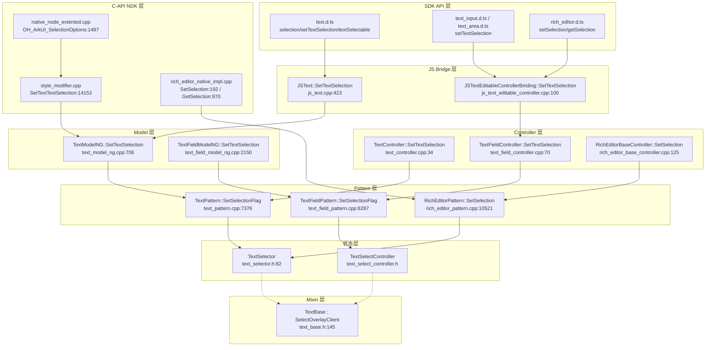
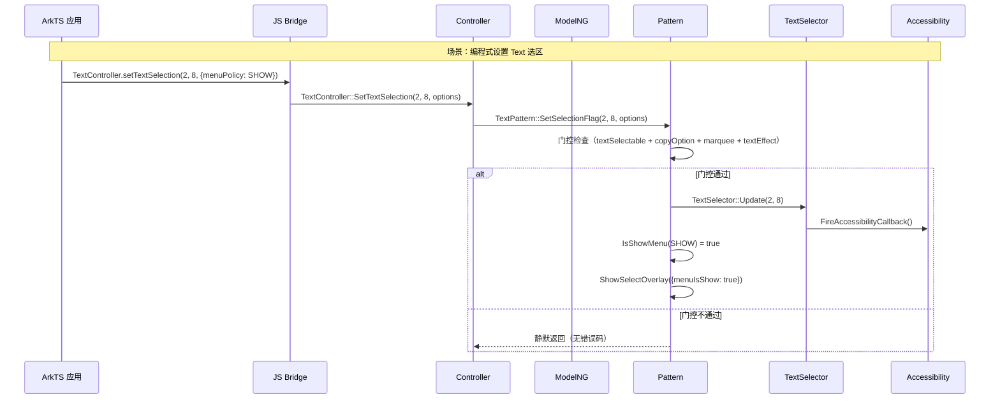
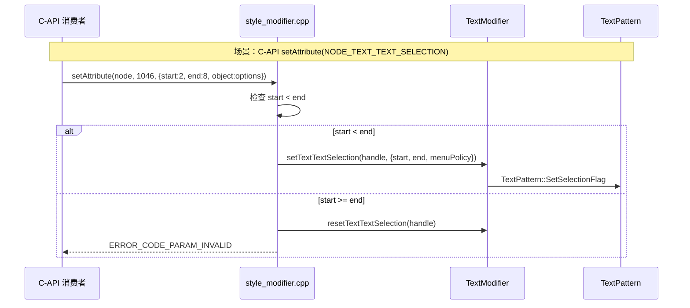

# 架构设计

> 确认目标仓和模块的架构约束、关键设计决策、Spec 拆分方向。

## 设计元数据

| Field | Content |
|-------|---------|
| Design ID | `DESIGN-Func-04-14-01` |
| 关联需求 | 已有能力补录（无独立 requirement.md） |
| 关联 Epic | 04-通用能力层 / 14-输入交互 / 01-文本选择 |
| 目标 Feature | Feat-01 选区状态模型与编程式选区、Feat-02 选择手柄/放大镜/选择高亮（待补录）、Feat-03 触摸/鼠标手势选区（待补录） |
| 复杂度 | 复杂 |
| 目标版本 | API 7–26 |
| Owner | ArkUI SIG |
| 状态 | Baselined（已有实现补录） |

## 需求基线

| 项 | 补充说明 |
|----|---------|
| 文本选择是跨组件通用能力 | 覆盖 Text、TextInput、TextArea、Search、RichEditor、SelectionContainer(@since 26) 六个组件 |
| 选区状态为运行时态 | `TextSelector` 选区范围不持久化到 `LayoutProperty`，仅在 Pattern 层维护 |
| 与 04-14-03（文本交互）边界 | 04-14-01 聚焦选区状态+选择 UI；光标/菜单/剪贴板/事件/拦截/长按触发属 04-14-03 |

## 上下文和现状

### 涉及仓和模块

| 仓库 | 补充架构说明 |
|------|------------|
| `foundation/arkui/ace_engine` | 文本选择实现完全在 ace_engine 仓内，不跨仓 |

### 调用链层级分析

| 层 | 模块 | 职责 | 修改类型 |
|----|------|------|---------|
| 1. SDK API 层 | `interface/sdk-js/api/@internal/component/ets/text.d.ts` 等 | 声明 `selection`/`setTextSelection`/`textSelectable`/`copyOption`/`getSelection` 公共 API | 不修改（已有） |
| 2. JS Bridge 层 | `frameworks/bridge/declarative_frontend/jsview/js_text.cpp`、`js_textfield.cpp`、`js_text_editable_controller.cpp` | JS 方法→C++ 函数绑定；`JSText::SetTextSelection` → `TextModel::SetTextSelection` | 不修改（已有） |
| 3. C-API Accessor 层 | `frameworks/core/interfaces/native/implementation/*_controller_accessor.cpp` | ArkTS 控制器 → C++ 控制器桥接；`TextControllerAccessor::SetTextSelectionImpl` | 不修改（已有） |
| 4. Controller 层 | `frameworks/core/components_ng/pattern/text/text_controller.cpp`、`text_field/text_field_controller.cpp`、`rich_editor/rich_editor_base_controller.cpp` | 控制器方法 → Pattern `SetSelectionFlag`/`SetSelection`；含参数校验、clamp、延迟 | 不修改（已有） |
| 5. Model 层 | `text_model_ng.cpp`、`text_field_model_ng.cpp`、`rich_editor_model_ng.cpp` | 静态方法入口，分发到 Pattern | 不修改（已有） |
| 6. Pattern 层 | `text_pattern.cpp`、`text_field_pattern.cpp`、`rich_editor_pattern.cpp` | 门控逻辑、选区设置、overlay 调度 | 不修改（已有） |
| 7. 状态层 | `text_field/text_selector.h`、`text_field/text_select_controller.h` | `TextSelector` 选区状态结构 + `TextSelectController` 选区/光标控制器 | 不修改（已有） |
| 8. Mixin 层 | `text/text_base.h`、`manager/select_overlay/select_overlay_client.h` | `TextBase` 混入（含 `textSelector_`）、`SelectOverlayClient` 接口 | 不修改（已有） |
| 9. C-API NDK 层 | `interfaces/native/node/style_modifier.cpp`、`native_node_extented.cpp`、`rich_editor_native_impl.cpp` | `NODE_TEXT_TEXT_SELECTION` 属性分发、`OH_ArkUI_SelectionOptions` 对象生命周期 | 不修改（已有） |

### 适用架构规则

| Rule ID | 适用原因 | 设计结论 | 验证方式 |
|---------|----------|----------|----------|
| OH-ARCH-LAYERING | 涉及 SDK→JS Bridge→C-API Accessor→Controller→Model→Pattern→State 多层调用 | 调用方向严格自上而下，Pattern 层不直接调用 SDK/JS Bridge | 架构评审/依赖检查 |
| OH-ARCH-API-LEVEL | 涉及 Public API 变更（已有 API 补录） | API 级别为 Public，@since 标注策略：全版本标注 API 7→26 | API 评审/XTS |
| OH-ARCH-ERROR-LOG | 涉及错误码（C-API `ERROR_CODE_PARAM_INVALID`） | C-API 层返回错误码；JS/控制器层静默返回（无错误码） | 单测/hilog |

## 不涉及项承接

| 维度 | 设计结论 |
|------|---------|
| 光标/插入点 | 属 04-14-03 Feat-01 光标(Caret)交互，本域不涉及 |
| 选择菜单 | 属 04-14-03 Feat-02 文本上下文菜单，本域仅涉及 `MenuPolicy` 对 overlay 可见性的影响 |
| 剪贴板 | 属 04-14-03 Feat-03 拖拽与剪贴板回调，本域不涉及 |
| 选区事件 | 属 04-14-03 Feat-04/05，本域仅确保选区变化时触发回调 |
| 长按触发 | 属 04-14-03 Feat-06 长按选择与实体识别，本域不涉及触发时机 |

## 关键设计决策

| 决策 ID | 问题 | 推荐方案 | 探索过的替代方案 | 取舍理由 | 影响 |
|---------|------|---------|-----------------|---------|------|
| ADR-1 | 选区状态如何表示方向？ | 方向无关的 `baseOffset`/`destinationOffset` 模型（base 为锚点，destination 为可移动端），`GetTextStart()/GetTextEnd()` 有序化返回 | A) 有序 `start`/`end` 对——需在拖拽方向翻转时交换；B) 范围+方向标志——增加状态 | 方向无关模型在 handle 拖拽时无需交换字段，减少状态管理复杂度；`GetTextStart/End` 有序化仅在读端处理 | TextSelector 被所有文本 Pattern 共用 |
| ADR-2 | 选区范围是否持久化？ | 选区范围为运行时态（ephemeral），不持久化到 LayoutProperty；`textSelectableMode` 则持久化 | A) 全部持久化——序列化开销大且选区不需跨渲染恢复；B) 全部运行时——textSelectableMode 需在 OnModifyDone 重读 | 选区是瞬态交互状态，不需跨渲染保持；textSelectableMode 是组件配置，需在 layout 重建时保留 | `TextLayoutProperty` 仅存 `TextSelectableMode`/`CopyOption`，不存选区范围 |
| ADR-3 | 三种 SelectionOptions 如何分层？ | 运行时 `SelectionOptions`(text_field_model.h:204, 含 MenuPolicy+HandlePolicy+forceShowHandle) / 缓存态 `TextSelectionOptions`(text_model.h:57) / C-API `ArkUI_SelectionOptions`(node_extened.h:250, 仅 MenuPolicy) | A) 统一为一种——C-API 无法暴露 HandlePolicy/forceShowHandle 等内部字段；B) 用继承——C ABI 不支持 C++ 继承 | 三层各有用途：运行时需完整控制、缓存态用于跨帧保持、C-API 仅暴露公共 MenuPolicy | Feat-01 规格必须精确区分 |
| ADR-4 | Text 编程式选区门控策略？ | 多重门控：`textSelectableMode != UNSELECTABLE && copyOption != None && textOverflow != MARQUEE && !textEffect_`，静默返回 | A) 返回错误码——JS 层无错误码机制；B) 日志提示——性能开销且非 API 契约 | 与 JS 层"无错误码"设计一致；MARQUEE/textEffect 场景下选区无视觉意义 | 调用方需自行确保门控条件满足 |
| ADR-5 | copyOption 语义如何统一？ | 因组件语义不同：Text 的 `None` 禁用选区（Text 是只读展示，选区目的即复制）；TextField 不门控（输入框选区用于编辑）；RichEditor 仅门控命令（选区用于编辑+复制分离） | A) 统一门控——TextField 选区对编辑必需，不能被 copyOption 禁用；B) 统一不门控——Text 在 MARQUEE 等场景不应可选 | 组件语义差异导致 copyOption 含义不同，统一会破坏组件功能 | Feat-01 规格需在兼容性声明中标注此差异 |
| ADR-6 | C-API MenuPolicy 支持是否统一？ | 不统一：Text 的 `NODE_TEXT_TEXT_SELECTION` 支持 `.object` 传 `ArkUI_SelectionOptions`；TextInput/TextArea 不支持 `.object`，MenuPolicy 仅通过控制器方法可达 | A) 统一支持 `.object`——TextInput/TextArea 的选区属性设计为仅 start/end，添加 object 会改变 ABI；B) 统一不支持——Text 已有此能力不可移除 | 历史实现差异，Text C-API 晚于 TextInput/TextArea 设计（@since 23 vs 基线），设计时已考虑 MenuPolicy | C-API 消费者需了解此不对称 |

## 设计骨架

### 骨架范围

| 骨架项 | 目标 | 不包含 | 验证方式 |
|--------|------|--------|---------|
| 选区状态模型规格化 | `TextSelector` 结构、`TextBase` mixin 的选区接口规格化 | 手柄绘制/放大镜 UI（Feat-02） | 单元测试 |
| 编程式选区 API 规格化 | `selection`/`setTextSelection`/`setSelection`/`getSelection` 规格化 | 选区事件回调（属 04-14-03） | 单元测试 + C-API 测试 |
| 选区权限规格化 | `textSelectable`/`copyOption`/`SelectionOptions`/`MenuPolicy` 规格化 | 菜单内容定制（属 04-14-03） | 单元测试 |

### 骨架 Spec 拆分

| Task ID | 目标 | 受影响文件 | AC |
|---------|------|----------|-----|
| TASK-SKELETON-1 | Feat-01 选区状态模型与编程式选区 | `text_selector.h`、`text_base.h`、`text_pattern.cpp`、`text_field_pattern.cpp`、`rich_editor_pattern.cpp`、`text_controller.cpp`、`text_field_controller.cpp`、`style_modifier.cpp`、`native_node_extented.cpp` | AC-1.1–7.10 |
| TASK-SKELETON-2 | Feat-02 选择手柄/放大镜/选择高亮（待补录） | `select_overlay_pattern.h`、`base_text_select_overlay.h`、`magnifier.h` | 待定 |
| TASK-SKELETON-3 | Feat-03 触摸/鼠标手势选区（待补录） | `text_base.h(TextGestureSelector)`、`select_overlay_property.h(SelectedByMouseInfo)` | 待定 |

## 后续 Task 拆分

| Task ID | 目标 | 受影响文件 | 依赖 |
|---------|------|----------|------|
| TASK-01 | Feat-01 选区状态模型与编程式选区规格补录 | `Feat-01-selection-state-programmatic-spec.md` | 无 |
| TASK-02 | Feat-02 选择手柄/放大镜/选择高亮规格补录 | 待创建 | TASK-01 |
| TASK-03 | Feat-03 触摸/鼠标手势选区规格补录 | 待创建 | TASK-01 |

## API 签名、Kit 与权限

### 新增 API

> 本域为已有实现补录，以下 API 均已存在于 SDK，不新增。

| API 签名 | 类型 | Kit | d.ts 位置 | 权限要求 | SysCap |
|----------|------|-----|-----------|---------|--------|
| `TextAttribute.selection(start, end)` | Public | ArkUI | `@internal/component/ets/text.d.ts:896` | 无 | ArkTS |
| `TextController.setTextSelection(start, end, options?)` | Public | ArkUI | `@internal/component/ets/text.d.ts:1990` | 无 | ArkTS |
| `TextInputController.setTextSelection(start, end, options?)` | Public | ArkUI | `@internal/component/ets/text_input.d.ts:785` | 无 | ArkTS |
| `TextAreaController.setTextSelection(start, end, options?)` | Public | ArkUI | `@internal/component/ets/text_area.d.ts:81` | 无 | ArkTS |
| `SearchController.setTextSelection(start, end, options?)` | Public | ArkUI | `@internal/component/ets/search.d.ts:92` | 无 | ArkTS |
| `RichEditorBaseController.setSelection(start, end, options?)` | Public | ArkUI | `@internal/component/ets/rich_editor.d.ts:2436` | 无 | ArkTS |
| `RichEditorController.getSelection()` | Public | ArkUI | `@internal/component/ets/rich_editor.d.ts:2789` | 无 | ArkTS |
| `TextAttribute.textSelectable(mode)` | Public | ArkUI | `@internal/component/ets/text.d.ts:1177` | 无 | ArkTS |
| `SelectionOptions { menuPolicy?: MenuPolicy }` | Public | ArkUI | `@internal/component/ets/common.d.ts:31003` | 无 | ArkTS |
| C-API `NODE_TEXT_TEXT_SELECTION` (=1046) | Public | ArkUI NDK | `interfaces/native/native_node.h:3016` | 无 | NDK |
| C-API `OH_ArkUI_SelectionOptions_*` | Public | ArkUI NDK | `interfaces/native/native_type.h:3834` | 无 | NDK |
| C-API `OH_ArkUI_TextEditorStyledStringController_SetSelection/GetSelection` | Public | ArkUI NDK | `interfaces/native/native_type.h:5700/6596` | 无 | NDK |

### 变更/废弃 API

无。

## 构建系统影响

### BUILD.gn 变更

无。本域为已有实现补录，不修改任何 `BUILD.gn` 文件。

### bundle.json 变更

无。

## 可选设计扩展

### 架构图



### 数据模型设计

**TypeScript（API 层类型）:**

```typescript
// 选区选项
interface SelectionOptions {
  menuPolicy?: MenuPolicy;  // @since 12
}

enum MenuPolicy {  // @since 12
  DEFAULT = 0, HIDE = 1, SHOW = 2
}

enum CopyOptions {  // @since 9
  None = 0, InApp = 1, LocalDevice = 2, CrossDevice = 3
}

enum TextSelectableMode {  // @since 12
  SELECTABLE_UNFOCUSABLE = 0, SELECTABLE_FOCUSABLE = 1, UNSELECTABLE = 2
}

// 选区查询结果
interface RichEditorSelection {
  selection: [number, number];
  spans: Array<RichEditorTextSpanResult | RichEditorImageSpanResult>;
}

interface TextRange {  // @since 15
  start: number; end: number;
}
```

**C++（框架层结构）:**

```cpp
// text_field/text_selector.h:82 — 核心选区状态
struct TextSelector {
    int32_t baseOffset = -1;        // 锚点（方向无关）
    int32_t destinationOffset = -1; // 可移动端（光标位置）
    std::optional<int32_t> aiStart, aiEnd;
    std::optional<int32_t> highlightStart, highlightEnd;
    RectF firstHandle, secondHandle;
    // GetTextStart() = min(baseOffset, destinationOffset)
    // GetTextEnd() = max(baseOffset, destinationOffset)
    // IsValid() = baseOffset > -1 && destinationOffset > -1
};

// text_field_model.h:204 — 运行时选区选项
struct SelectionOptions {
    MenuPolicy menuPolicy = MenuPolicy::DEFAULT;
    HandlePolicy handlePolicy = HandlePolicy::DEFAULT;
    bool forceShowHandle = false;
};

// text_model.h:57 — 缓存态选区选项
struct TextSelectionOptions {
    int32_t start = 0; int32_t end = 0;
    MenuPolicy menuPolicy = MenuPolicy::DEFAULT;
};
```

**C-API（NDK 层）:**

```c
// node/node_extened.h:250
struct ArkUI_SelectionOptions { ArkUI_MenuPolicy menuPolicy; };

// native_type.h:1755
typedef enum {
    ARKUI_MENU_POLICY_DEFAULT = 0,
    ARKUI_MENU_POLICY_HIDE = 1,
    ARKUI_MENU_POLICY_SHOW = 2,
} ArkUI_MenuPolicy;
```

### 数据流/控制流

| 步骤 | 调用方 | 被调用方 | 数据/接口 | 说明 |
|------|--------|----------|----------|------|
| 1 | ArkTS `selection(2, 8)` | JS Bridge | `JSText::SetTextSelection(info)` | JS 参数解析 |
| 2 | JS Bridge | Model | `TextModel::GetInstance()->SetTextSelection(2, 8)` | 无 MenuPolicy |
| 3 | Model | Pattern | `TextPattern::SetTextSelection(2, 8)` | 获取 FrameNode→Pattern |
| 4 | Pattern | 门控检查 | `textSelectableMode != UNSELECTABLE && copyOption != None && ...` | 四重门控 |
| 5 | Pattern | 状态层 | `TextSelector::Update(2, 8)` | 设置 baseOffset/destinationOffset |
| 6 | 状态层 | 无障碍 | `FireAccessibilityCallback()` | 通知选区变化 |
| 7 | Pattern | Overlay | `ShowSelectOverlay({menuIsShow, animation})` | 调度手柄+菜单（Feat-02） |

### 时序设计





## 详细设计

### TextSelector 选区状态结构

`TextSelector`（`frameworks/core/components_ng/pattern/text_field/text_selector.h:82`）是所有文本组件共享的选区状态数据结构。

**方向无关模型：**
- `baseOffset`（锚点）：选区起始端，值初始化为 -1
- `destinationOffset`（可移动端）：光标当前位置，值初始化为 -1
- `baseOffset` 可能大于、小于或等于 `destinationOffset`（方向无关）
- `GetTextStart()` 返回 `std::min(baseOffset, destinationOffset)` — 有序化起点
- `GetTextEnd()` 返回 `std::max(baseOffset, destinationOffset)` — 有序化终点

**有效性判定：**
- `IsValid()` = `baseOffset > -1 && destinationOffset > -1`
- `SelectNothing()` = `!IsValid() || baseOffset == destinationOffset`（空选区或无效）

**选区更新：**
- `Update(base, destination)` — 设置两端，若选区变化则触发 `FireAccessibilityCallback()`，更新 `lastValidStart`
- `Update(both)` — 收缩 base==dest（光标定位）
- `ReverseTextSelector()` — 若 `baseOffset > destinationOffset`，通过 `Update` 交换

**辅助字段：**
- `firstHandle` / `secondHandle`（`RectF`）：选择手柄位置（Feat-02 使用）
- `aiStart` / `aiEnd`（`optional<int32_t>`）：AI 实体识别选区
- `highlightStart` / `highlightEnd`（`optional<int32_t>`）：高亮区间
- `charCount`：文本字符总数（用于 `MoveSelectionRight` 边界）

### TextBase Mixin 与选区接口

`TextBase`（`frameworks/core/components_ng/pattern/text/text_base.h:145`）继承 `SelectOverlayClient`，是所有文本 Pattern 的选区混入基类。

**选区状态持有：**
- `TextSelector textSelector_`（protected 成员，text_base.h:316）
- `bool showSelect_ = true`、`bool afterDragSelect_ = false`、`MouseStatus mouseStatus_`

**虚方法接口（子类重写）：**
- `IsSelected()` — `textSelector_.IsValid() && !textSelector_.StartEqualToDest()`
- `GetSelectIndex(int32_t& start, int32_t& end)` — 读取 `textSelector_.GetTextStart()/GetTextEnd()`
- `GetCaretRect()` / `GetCaretMetrics()` / `GetCaretIndex()` / `GetCaretOffset()` — 光标信息
- `GetFirstHandleOffset()` / `GetSecondHandleOffset()` — 手柄位置
- `GetClipboard()` — 剪贴板访问

**静态工具方法：**
- `SetSelectionNode(SelectedByMouseInfo&)` — 注册鼠标选区节点到 `SelectOverlayManager`（text_base.cpp:31）
- `GetGraphemeClusterLength(str, extend, checkPrev)` — 返回字形簇长度（代理对=2，否则=1），用于按字形步进选区（text_base.cpp:39）
- `CalculateSelectedRect(...)` — 合并逐行选区矩形为完整高度选区矩形（text_base.cpp:55）

### 编程式选区分发链路

**Text 组件链路：**
```
ArkTS selection(start, end)                          [js_text.cpp:423]
  → TextModel::GetInstance()->SetTextSelection(start, end)  [text_model.h:233]
  → TextModelNG::SetTextSelection(start, end)                [text_model_ng.cpp:706]
  → TextPattern::SetTextSelection(start, end)                [text_pattern.cpp:1629]
  → 门控检查（textSelectable + copyOption + marquee + textEffect）
  → TextPattern::SetSelectionFlag(start, end, SelectionOptions{})  [text_pattern.cpp:7376]
  → ActSetSelectionFlag                                       [text_pattern.cpp:7405]
  → TextSelector::Update(start, end) + ShowSelectOverlay
```

**TextController 链路（@since 23，携带 MenuPolicy）：**
```
ArkTS TextController.setTextSelection(start, end, options)
  → TextControllerAccessor::SetTextSelectionImpl               [text_controller_accessor.cpp:65]
  → TextController::SetTextSelection(start, end, options)      [text_controller.cpp:34]
  → TextPattern::SetSelectionFlag(start, end, options)         [text_pattern.cpp:7376]
```

**TextInput/TextArea 控制器链路：**
```
ArkTS TextInputController.setTextSelection(start, end, options?)
  → TextInputControllerAccessor::SetTextSelectionImpl           [text_input_controller_accessor.cpp:43]
  → TextFieldController::SetTextSelection(start, end, options)  [text_field_controller.cpp:70]
  → 参数校验：start > end → return；start/end clamp 到 [0, textLength]
  → ScheduleTaskWithLayoutDeferral(SetSelectionFlag)            [text_field_controller.cpp:82]
  → TextFieldPattern::SetSelectionFlag(start, end, options)     [text_field_pattern.cpp:8287]
```

**RichEditor 控制器链路：**
```
ArkTS RichEditorController.setSelection(start, end, options?)
  → RichEditorBaseController::SetSelection(start, end, options)  [rich_editor_base_controller.cpp:125]
  → RichEditorPattern::SetSelection(start, end, options)        [rich_editor_pattern.cpp:10521]
  → 前置检查 HasFocus()；clamp 到文本长度；UpdateSelector
  → ProcessOverlayOnSetSelection                                [rich_editor_pattern.cpp:10559]
```

### C-API 选区属性分发

**`NODE_TEXT_TEXT_SELECTION` (=1046, @since 23)：**
- 处理函数：`SetTextTextSelection`（`style_modifier.cpp:14153`）
- 参数格式：`value[0].i32` (start), `value[1].i32` (end), `object` = `ArkUI_SelectionOptions*` (可选)
- 校验：`start >= end` → `resetTextTextSelection` + `ERROR_CODE_PARAM_INVALID`
- MenuPolicy：从 `item->object` 读取 `ArkUI_SelectionOptions*`，转换为 `ArkUIMenuPolicy`
- 分发：`getTextModifier()->setTextTextSelection(handle, &menuOption)`

**`NODE_TEXT_INPUT_TEXT_SELECTION` / `NODE_TEXT_AREA_TEXT_SELECTION`：**
- 处理函数：`SetTextInputTextSelection`（`style_modifier.cpp:6267`，TextArea 复用同一函数）
- 参数格式：仅 `value[0].i32` (start), `value[1].i32` (end)，**无 `.object`**
- 校验：`start > end` → `ERROR_CODE_PARAM_INVALID`
- 分发：`getTextInputModifier()->setTextInputTextSelection(handle, start, end)`

**`OH_ArkUI_SelectionOptions` 对象生命周期：**
- `OH_ArkUI_SelectionOptions_Create()`（`native_node_extented.cpp:1497`）：堆分配，`menuPolicy` 初始为 `ARKUI_MENU_POLICY_DEFAULT`
- `OH_ArkUI_SelectionOptions_Dispose(options)`（`:1506`）：`delete options`
- `OH_ArkUI_SelectionOptions_SetMenuPolicy(options, policy)`（`:1511`）：设置 `menuPolicy`
- `OH_ArkUI_SelectionOptions_GetMenuPolicy(options)`（`:1517`）：读取 `menuPolicy`，NULL 返回 `ARKUI_MENU_POLICY_DEFAULT`

### 无障碍选区驱动

**注册：**
- Text: `TextPattern::SetAccessibilityAction`（`text_pattern.cpp:6422`）注册 `ACTION_SET_SELECTION` + `ACTION_CLEAR_SELECTION`，受 `copyOption != None && textSelectableMode != UNSELECTABLE` 门控
- TextField: `text_field_pattern.cpp:9630` 注册 `ACTION_SET_SELECTION` → `SetSelectionFlag(start, end, nullopt, isForward)`
- RichEditor: `rich_editor_pattern.cpp:3313` 注册 → `SetSelection(start, end, nullopt, isForward)`

**查询：**
- `GetTextSelectionStart/End`（Text: `text_accessibility_property.cpp:57`，TextField: `text_field_accessibility_property.cpp:104`）返回有序化的选区范围

**回调通知：**
- `TextSelector::SetOnAccessibility(callback)` + `FireAccessibilityCallback()` — 在 `Update()` 选区变化时自动触发

## 风险和开放问题

| 项 | 类型 | 影响 | 处理方式 | Owner |
|----|------|------|---------|-------|
| C-API MenuPolicy 支持不对称（Text 支持 `.object`，TextInput/TextArea 不支持） | API | 中 | 已在 Feat-01 规格兼容性声明中标注；C-API 消费者需使用控制器方法获取 MenuPolicy | ArkUI SIG |
| copyOption 语义因组件不同（Text 禁用选区，TextField 不门控，RichEditor 仅门控命令） | API | 高 | 已在 Feat-01 规格兼容性声明中标注 | ArkUI SIG |
| Text 编程式选区静默失败无错误码 | API | 中 | 已在 Feat-01 规格风险中标注；ADR-4 记录设计决策 | ArkUI SIG |
| C-API getter 堆分配 `ArkUI_SelectionOptions*` 在静态全局缓冲区 | API | 低 | 已在 Feat-01 规格 R-22 中标注；调用方需注意生命周期 | ArkUI NDK |
| CopyOptions 枚举值命名差异（SDK `LocalDevice`/`CrossDevice` vs C++ `Local`/`Distributed`） | API | 低 | 已在 Feat-01 规格兼容性声明中标注 | ArkUI SDK |
| 三种 SelectionOptions 类型易混淆 | 架构 | 中 | ADR-3 记录分层设计；Feat-01 规格精确区分 | ArkUI SIG |

## 设计审批

- [x] 需求基线已确认，设计覆盖 P0/P1 AC
- [x] 不涉及项已承接，N/A 和展开项都有结论
- [x] 涉及仓和模块职责清楚
- [x] 调用链层级分析完整，每层覆盖到位（SDK→JS Bridge→C-API→Controller→Model→Pattern→State→Mixin→NDK）
- [x] 适用架构规则已识别并形成设计结论
- [x] 分层和子系统边界合规
- [x] API 变更有签名、权限、错误码和兼容性说明
- [x] BUILD.gn/bundle.json 影响明确（无变更）
- [x] 设计输出和后续 Task 拆分明确
- [x] 关键设计决策有理由和影响说明（ADR-1 至 ADR-6）
- [x] 风险和开放问题有 Owner

**结论:** 通过（已有实现补录）
