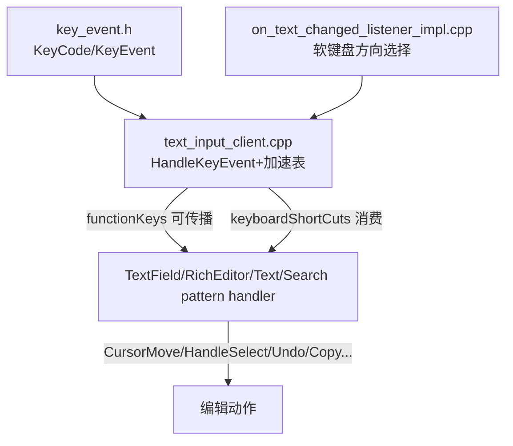
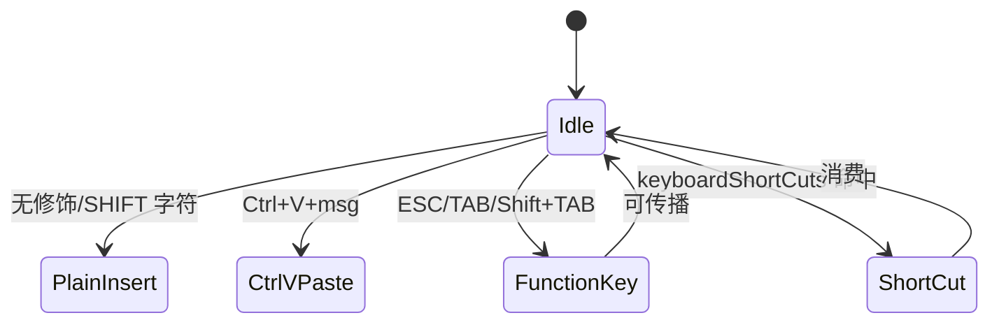

# 架构设计
> 确认目标仓和模块的架构约束、关键设计决策、Spec 拆分方向。

## 设计元数据

| Field | Content |
|-------|---------|
| Design ID | DESIGN-Func-04-14-02 |
| 关联需求 | 已有能力补录（无独立 requirement.md） |
| 关联 Epic | 无 |
| 目标 Feature | Feat-01 快捷键分发基础设施；Feat-02 导航与光标移动快捷键；Feat-03 选择快捷键；Feat-04 剪贴板与删除快捷键；Feat-05 撤销/重做快捷键；Feat-06 字体样式快捷键(RichEditor 专属) |
| 复杂度 | 关键 |
| 目标版本 | API 8+（与文本编辑组件同期演进；含 Mac KEY_META/numLock/PREVIEW 平台分支） |
| Owner | ArkUI SIG |
| 状态 | Baselined（已有实现补录） |

## 需求基线

| 项 | 补充说明 |
|----|------------------|
| 框架内部能力 | 无公共 API；快捷键分发经 `TextInputClient::HandleKeyEvent` 两静态加速表 `functionKeys_`/`keyboardShortCuts_`（~70 组合键→~20 handler） |
| 多组件复用 | Text(只读子集)/TextField(全量+undo 队列)/RichEditor(全量+三策略 undo+字体样式)/Search(委托 TextField) |
| 平台分支 | Mac KEY_META 镜像 Ctrl；numLock-off 小键盘重映射；PREVIEW 平台前向/后向反转 |
| 边界 | 选择状态机制→04-14-01；剪贴板/编辑回调→04-14-03；焦点遍历→04-14-04 |

## 上下文和现状

### 涉及仓和模块

| 仓库 | 补充架构说明 |
|------|--------------|
| ace_engine | 核心分发器在 `frameworks/core/common/ime/text_input_client.*`；handler 分布在各文本 pattern |

### 调用链层级分析

| 层 | 模块 | 职责 | 修改类型 |
|-----|------|------|----------|
| 键事件基础 | `frameworks/core/event/key_code.h`、`key_event.{h,cpp}`、`key_event_recognizer.*` | KeyCode 枚举、KeyEvent 结构、HasKey/IsCtrlWith/IsShiftWith/ConvertCodeToString、长按/重复识别 | 既有 |
| 分发器 | `frameworks/core/common/ime/text_input_client.{h,cpp}` | `KeyComb`/`CaretMoveIntent`/两加速表/HandleKeyEvent 分发顺序 | 既有 |
| TextField handler | `frameworks/core/components_ng/pattern/text_field/text_field_pattern.{h,cpp}` | OnKeyEvent/CursorMove/HandleSelect/HandleOnUndo/Redo/Copy/Paste/Cut/Delete/DeleteComb/PageUp-Down | 既有 |
| RichEditor handler | `frameworks/core/components_ng/pattern/rich_editor/rich_editor_pattern.{h,cpp}` | 同上 + HandleSelectFontStyle(Ctrl+B/I/U) + 三策略 undo | 既有 |
| RichEditor undo | `frameworks/core/components_ng/pattern/rich_editor/rich_editor_undo_manager.h` | RichEditorUndoManager(StyledString/Spans/String 三策略)/UndoRedoRecord | 既有 |
| Text(只读) | `frameworks/core/components_ng/pattern/text/text_pattern.cpp` | InitKeyEvent/UpdateShiftFlag/Ctrl+C/Ctrl+A/Shift+dir | 既有 |
| Search | `frameworks/core/components_ng/pattern/search/search_pattern.{h,cpp}` | OnKeyEvent 委托 textFieldPattern | 既有 |
| IME 侧路径 | `frameworks/core/components_ng/pattern/text_field/on_text_changed_listener_impl.cpp` | 软键盘方向选择 HandleSelect(DPAD→CaretMoveIntent) | 既有 |

### 适用架构规则

| Rule ID | 适用原因 | 设计结论 | 验证方式 |
|---------|----------|----------|----------|
| OH-ARCH-LAYERING | key_event→text_input_client→pattern handler | 单向调用 | 代码评审 |
| OH-ARCH-SUBSYSTEM | 跨 4 文本组件复用 TextInputClient | 共享分发器，各组件 handler 差异化 | 代码评审 |

## 不涉及项承接

| 维度 | 设计结论 |
|------|----------|
| 选择状态机制 | TextSelector 基/目 offset 归 04-14-01；本域只覆盖快捷键触发选择 |
| 剪贴板/编辑回调 | onCopy/onWillCopy/onCut/onPaste/onWillInsert/onDidInsert/onWillDelete/onDidDelete 回调归 04-14-03；本域只覆盖快捷键→handler 绑定 |
| 焦点遍历 | Tab/Shift+Tab/Esc/Enter 在 text-field 的文本专属拦截归本域 Feat-01；焦点遍历语义归 04-14-04 |
| 菜单内容 | 上下文菜单内容归 04-14-03 Feat-02；Shift+F10/MENU 触发菜单归本域 |

## 关键设计决策

| 决策 ID | 问题 | 推荐方案 | 探索过的替代方案 | 取舍理由 | 影响 |
|---------|------|----------|------------------|----------|------|
| ADR-1 | 统一分发器 | `TextInputClient` 基类 + 两静态加速表 | 各组件各自表 | 避免重复，集中维护组合键映射 | 单点修改影响 4 组件 |
| ADR-2 | 分发顺序 | Ctrl+V msg 特殊路径→纯字符插入→functionKeys(可传播)→keyboardShortCuts(消费)→false | 统一消费 | 纯字符与功能键需放行传播；Ctrl+V 优先处理 IME 文本 | 顺序敏感 |
| ADR-3 | Shift 锚点 | RecordOriginCaretPosition/ResetOriginCaretPosition + UpdateShiftFlag 同步 SelectionContainer | 每次 recompute | 锚点保持选择方向连续性 | 逻辑复杂 |
| ADR-4 | 平台分支 | Mac KEY_META 镜像 Ctrl；numLock-off 小键盘重映射；PREVIEW 前向/后向反转 | 平台抽象层 | 与系统键位一致 | 分支多 |
| ADR-5 | undo 三策略 | RichEditorUndoManager: StyledString/Spans/String | 单策略 | 匹配 RichEditor 三种数据模型 | 高复杂度 |

## 设计骨架

### 骨架范围

| 骨架项 | 目标 | 不包含 | 验证方式 |
|--------|------|--------|----------|
| 分发基础设施 | 加速表+分发顺序+平台分支 | handler 实现 | 单测 |
| 导航 | CursorMove 12 方向 | 光标绘制 | 单测 |
| 选择 | HandleSelect+全选 | selector 状态 | 单测 |
| 剪贴板+删除 | Ctrl+C/X/V/DEL/删词 | 回调接口 | 单测 |
| undo/redo | Ctrl+Z/Y+三策略 | — | 单测 |
| 字体样式 | Ctrl+B/I/U(RichEditor) | — | 单测 |

### 骨架 Spec 拆分

| Task ID | 目标 | 受影响文件 | AC |
|---------|------|-----------|----|
| TASK-TS-SKEL | 6 个 Feat 规格补录 | Feat-01..06-*-spec.md | 见各 Feat |

## 后续 Task 拆分

| Task ID | 目标 | 受影响文件 | 依赖 |
|---------|------|-----------|------|
| TASK-TS-01 | Feat-01 快捷键分发基础设施 | Feat-01-dispatch-infrastructure-spec.md | 无 |
| TASK-TS-02 | Feat-02 导航与光标移动 | Feat-02-navigation-caret-movement-spec.md | Feat-01 |
| TASK-TS-03 | Feat-03 选择快捷键 | Feat-03-selection-shortcuts-spec.md | Feat-01 |
| TASK-TS-04 | Feat-04 剪贴板与删除 | Feat-04-clipboard-deletion-shortcuts-spec.md | Feat-01 |
| TASK-TS-05 | Feat-05 撤销/重做 | Feat-05-undo-redo-shortcuts-spec.md | Feat-01 |
| TASK-TS-06 | Feat-06 字体样式(RichEditor) | Feat-06-font-style-shortcuts-spec.md | Feat-01 |

## API 签名、Kit 与权限

### 新增 API
无公共 API。内部接口：`TextInputClient::HandleKeyEvent`、`KeyComb`、`CaretMoveIntent`、`functionKeys_`/`keyboardShortCuts_` 静态表、各 `HandleOnXxx` handler。

### 变更/废弃 API
无。

## 构建系统影响

### BUILD.gn 变更
```
文件: frameworks/core/common/ime/BUILD.gn, frameworks/core/components_ng/pattern/text_field/BUILD.gn, pattern/rich_editor/BUILD.gn
变更说明: 既有 target，无新增依赖
```

### bundle.json 变更
无新增部件。

## 可选设计扩展

### 架构图



### 算法与状态机



## 详细设计

### 分发基础设施
`HandleKeyEvent` 顺序：UpdateShiftFlag→忽略非 DOWN→Ctrl+V msg 特殊路径 InsertValue→纯字符 InsertValue(isIME=true)→functionKeys_ 查表(ESCAPE/TAB/Shift+TAB，返回 bool 可传播)→keyboardShortCuts_ 查表(IsShortCutBlocked 门控，Shift+UP/DOWN RecordOriginCaretPosition 否则 Reset，消费)→false。Mac KEY_META 镜像 Ctrl；numLock-off 小键盘 0-9/DOT 重映射；isPreIme IME 合成边界。

### 导航
CursorMove(CaretMoveIntent): Left/Right/Up/Down/LeftWord/RightWord/ParagraghBegin/ParagraghEnd/LineBegin/LineEnd/Home/End；DPAD_*→方向；MOVE_HOME/END→LineBegin/End；Ctrl+DPAD→词/段落；Ctrl+MOVE_HOME/END→Home/End；PageUp/Down(IsTextArea 门控，滚动+光标重定位)；directionKeysMoveFocusOut_ 焦点外移；RTL 词方向(LTR 左词/RTL 右词)。

### 选择
HandleSelect(CaretMoveIntent) + HandleSelectExtend(ParagraghBegin/End)；Shift+DPAD→方向选择；Shift+MOVE_HOME/END→行选择；Ctrl+Shift+DPAD_LEFT/RIGHT→词选择；Ctrl+Shift+UP/DOWN→段落扩展；Ctrl+A→HandleOnSelectAll(isKeyEvent/inlineStyle/showMenu 分支+ReportSelectionChangeEvent)；Shift-flag 锚点保持；**异常：Ctrl+Shift+HOME/END 派发 CursorMove(Home/End) 而非 HandleSelect**——按实现记录。

### 剪贴板与删除
Ctrl+C/Ctrl+Insert/Ctrl+Numpad0→HandleOnCopy(true)；Ctrl+X→HandleOnCut；Ctrl+V/Shift+Insert/Shift+Numpad0/PASTE→HandleOnPaste；DEL→HandleOnDelete(backward=true)；FORWARD_DEL→HandleOnDelete(backward=false)；Ctrl+DEL→HandleOnDeleteComb(backward)；Ctrl+FORWARD_DEL/Ctrl+NumpadDot→HandleOnDeleteComb(forward)；Ctrl+D→HandleOnDelete(true)。门控：copyOption、IsInPasswordMode、preventDefault(RichEditor onPaste)。PREVIEW 前向/后向反转；RTL 删词方向。

### 撤销/重做
Ctrl+Z→HandleOnUndoAction；Ctrl+Y/Ctrl+Shift+Z→HandleOnRedoAction；Alt+DEL→HandleOnExtendUndoAction。TextField: operationRecords_/redoOperationRecords_ deque + RECORD_MAX_LENGTH cap + OnWillChangePreSetValue 门控。RichEditor: RichEditorUndoManager 三策略(StyledStringUndoManager/SpansUndoManager/StringUndoManager) + UndoRedoRecord(rangeBefore/After, styledStringBefore/After, optionsListBefore/After, selectionBefore, caretAffinityBefore, isOnlyStyleChange, restoreBuilderSpan, updateSpanTypes, deleteDirection) + preview-input 合并 + drag undo/redo + builder-span 恢复。Mac Cmd+Z/Cmd+Shift+Z/Cmd+Y。

### 字体样式(RichEditor)
Ctrl+B/I/U→HandleSelectFontStyle(KEY_B/I/U)→SetSelectSpanStyle/UpdateSelectSpanStyle/UpdateSelectStyledStringStyle 应用粗体/斜体/下划线。TextField no-op。

## 风险和开放问题

| 项 | 类型 | 影响 | 处理方式 | Owner |
|----|------|------|----------|-------|
| Ctrl+Shift+Home/End 派发 CursorMove 而非 HandleSelect | API | 中 | 按实现记录为既有行为 | ArkUI SIG |
| RichEditor undo 三策略高复杂度 | 架构 | 高 | 隔离到 Feat-05 | ArkUI SIG |
| Tab/Esc/Enter 文本拦截 vs 焦点遍历边界 | 架构 | 中 | 文本拦截归 02-Feat-01，焦点遍历归 04 | ArkUI SIG |

## 设计审批

- [x] 需求基线已确认，设计覆盖 P0/P1 AC
- [x] 不涉及项已承接
- [x] 涉及仓和模块职责清楚
- [x] 调用链层级分析完整
- [x] 适用架构规则已识别
- [x] 分层和子系统边界合规
- [x] API 变更有签名、权限、错误码和兼容性说明（无公共 API）
- [x] BUILD.gn/bundle.json 影响明确
- [x] 设计输出和后续 Task 拆分明确
- [x] 关键设计决策有理由和影响说明
- [x] 风险和开放问题有 Owner

**结论:** 通过（已有实现补录）
