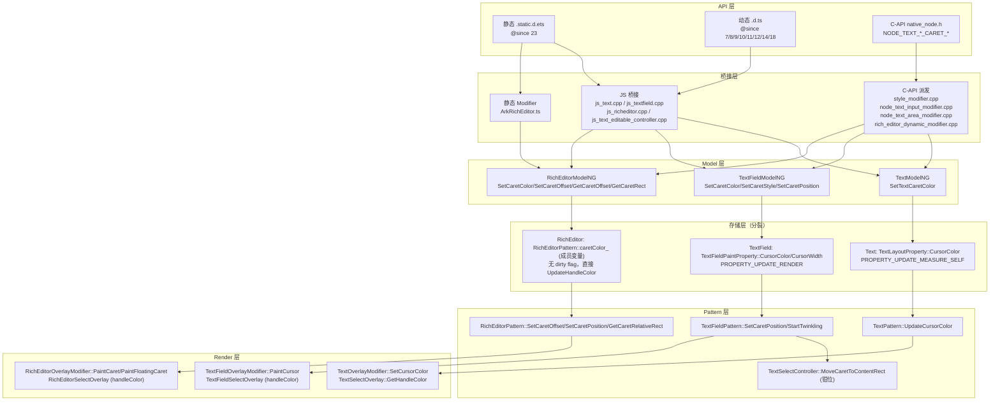
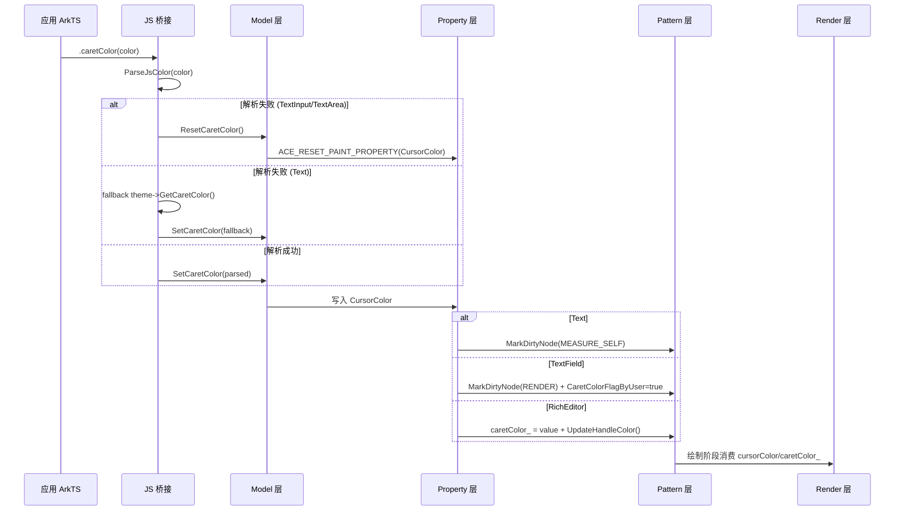

# 架构设计

> 文本交互功能域（04-14-03）的架构设计文档，补录已有实现。本功能域覆盖文本组件（Text/TextInput/TextArea/Search/RichEditor）的光标、上下文菜单、拖拽剪贴板、编辑拦截、交互触发、长按选择等交互能力。RichText 与放大镜（Magnifier）无公共 API，仅在内部实现备注中说明。

## 设计元数据

| 字段 | 内容 |
|------|------|
| Design ID | DESIGN-Func-04-14-03 |
| 关联需求 | 已有能力补录（无独立 requirement.md） |
| 关联 Epic | 无 |
| 目标 Feature | Feat-01 光标(Caret)交互, Feat-02 文本上下文菜单(Context Menu), Feat-03 拖拽与剪贴板回调, Feat-04 文本编辑拦截钩子, Feat-05 交互触发与状态回调, Feat-06 长按选择与实体识别 |
| 复杂度 | 复杂 |
| 目标版本 | API 7 起支持，API 8/9/10/11/12/14/18/22/23/24/26 有行为变更 |
| Owner | ArkUI SIG |
| 状态 | Baselined（已有实现补录） |

## 需求基线

| 项 | 内容 |
|----|------|
| 问题陈述 | 开发者需要通过声明式 API 控制文本组件的光标外观与位置、上下文菜单弹出与定制、文本拖拽与剪贴板回调、编辑拦截钩子、交互触发与状态回调、长按选择与实体识别等交互行为 |
| 核心目标 | （Feat-01）提供 caretColor/caretStyle/caretPosition/setCaretOffset/getCaretOffset/getCaretRect 光标交互能力，支持光标颜色/宽度/位置/偏移/矩形读取；（Feat-02）提供 copyOption/selectionMenuHidden/editMenuOptions/bindSelectionMenu/TextMenuController/MenuPolicy 上下文菜单能力；（Feat-03）提供 draggable/selectedDragPreviewStyle/onCopy/onWillCopy/onCut/onWillCut/onPaste 拖拽与剪贴板回调；（Feat-04）提供 onWillInsert/onDidInsert/onWillDelete/onDidDelete/onWillChange/onDidChange/onChange 编辑拦截钩子；（Feat-05）提供 enableKeyboardOnFocus/enableHapticFeedback/enablePreviewText/stopBackPress/selectAll/textSelectable/selection/selectedBackgroundColor/customKeyboard/keyboardAppearance/onWillAttachIME/onEditChange/onTextSelectionChange/onContentScroll/closeSelectionMenu/setTextSelection 交互触发与状态回调；（Feat-06）提供 enableDataDetector/dataDetectorConfig/enableSelectedDataDetector/enablePreviewMenu 长按选择与实体识别 |
| P0 AC | （Feat-01）caretColor 设置光标颜色生效；caretStyle 设置光标宽度与颜色生效；caretPosition 设置光标位置并支持负值/超范围处理；setCaretOffset/getCaretOffset/getCaretOffset 读写字符级偏移；getCaretRect 返回光标矩形 |

## 上下文和现状

### 涉及仓和模块

| 仓库 | 模块/路径 | 当前职责 | 本 Feature 影响 |
|------|-----------|----------|-----------------|
| ace_engine | `frameworks/core/components_ng/pattern/text/text_pattern.{h,cpp}` | Text 组件 Pattern，承载光标颜色属性派发与选择宿主 | Feat-01: caretColor 存储/派发 |
| ace_engine | `frameworks/core/components_ng/pattern/text/text_layout_property.h` | Text 布局属性，存储 CursorColor | Feat-01: caretColor 存储层 |
| ace_engine | `frameworks/core/components_ng/pattern/text/text_overlay_modifier.{h,cpp}` | Text 选择浮层 Modifier，消费 cursorColor | Feat-01: 光标颜色绘制 |
| ace_engine | `frameworks/core/components_ng/pattern/text/text_select_overlay.{h,cpp}` | Text 选择浮层，GetHandleColor 派发句柄颜色 | Feat-01: 句柄颜色 |
| ace_engine | `frameworks/core/components_ng/pattern/text_field/text_field_pattern.{h,cpp}` | TextInput/TextArea Pattern，承载光标位置/闪烁/绘制 | Feat-01: caretPosition/caretColor/caretStyle |
| ace_engine | `frameworks/core/components_ng/pattern/text_field/text_field_paint_property.h` | TextField 绘制属性，存储 CursorColor/CursorWidth/CaretColorFlagByUser | Feat-01: caretColor/caretStyle 存储层 |
| ace_engine | `frameworks/core/components_ng/pattern/text_field/text_field_overlay_modifier.{h,cpp}` | TextField 浮层 Modifier，PaintCursor 绘制光标 | Feat-01: 光标绘制与闪烁 |
| ace_engine | `frameworks/core/components_ng/pattern/text_field/text_field_controller.{h,cpp}` | TextInputController 方法实现，CaretPosition/GetCaretPosition | Feat-01: caretPosition 控制器方法 |
| ace_engine | `frameworks/core/components_ng/pattern/text_field/text_select_controller.{h,cpp}` | 选择控制器，MoveCaretToContentRect/UpdateCaretIndex 钳位 | Feat-01: 光标位置钳位逻辑 |
| ace_engine | `frameworks/core/components_ng/pattern/rich_editor/rich_editor_pattern.{h,cpp}` | RichEditor Pattern，caretColor_/caretPosition_/GetCaretRelativeRect | Feat-01: caretColor 成员变量/setCaretOffset/getCaretOffset/getCaretRect |
| ace_engine | `frameworks/core/components_ng/pattern/rich_editor/rich_editor_base_controller.cpp` | RichEditorBaseController 方法，GetCaretOffset/GetCaretRect/SetCaretOffset | Feat-01: 控制器方法 |
| ace_engine | `frameworks/core/components_ng/pattern/rich_editor/rich_editor_overlay_modifier.{h,cpp}` | RichEditor 浮层 Modifier，PaintCaret/PaintFloatingCaret | Feat-01: 光标绘制与闪烁 |
| ace_engine | `frameworks/core/components_ng/pattern/rich_editor/bridge/rich_editor_dynamic_modifier.cpp` | RichEditor 动态 Modifier，SetRichEditorCaretColor 等 | Feat-01: C-API 到 Pattern 桥接 |
| ace_engine | `frameworks/core/components_ng/pattern/text_field/text_field_model_ng.cpp` | TextField ModelNG，SetCaretColor/SetCaretStyle/SetCaretPosition | Feat-01: 属性设置入口 |
| ace_engine | `frameworks/core/components_ng/pattern/text_field/text_field_theme_wrapper.h` | TextField 主题包装，cursorColor_ = colors->Brand() | Feat-01: 默认值 token |
| ace_engine | `frameworks/core/components_ng/pattern/text/text_theme.cpp` | Text 主题，text_caret_color fallback #006CDE | Feat-01: 默认值 fallback |
| ace_engine | `frameworks/core/components_ng/pattern/rich_editor/rich_editor_theme.{h,cpp}` | RichEditor 主题，caret_color #007DFF | Feat-01: 默认值 |
| ace_engine | `frameworks/bridge/declarative_frontend/jsview/js_text.cpp` | Text JS 桥接，SetTextCaretColor | Feat-01: JS 桥接 |
| ace_engine | `frameworks/bridge/declarative_frontend/jsview/js_textfield.cpp` | TextInput/TextArea JS 桥接，SetCaretColor/SetCaretStyle/SetCaretPosition | Feat-01: JS 桥接 |
| ace_engine | `frameworks/bridge/declarative_frontend/jsview/js_text_editable_controller.cpp` | TextInputController JS 桥接，CaretPosition | Feat-01: 控制器方法 JS 桥接 |
| ace_engine | `frameworks/bridge/declarative_frontend/jsview/js_richeditor.cpp` | RichEditor JS 桥接，GetCaretOffset/SetCaretOffset/GetCaretRect | Feat-01: 控制器方法 JS 桥接 |
| ace_engine | `frameworks/bridge/declarative_frontend/ark_component/src/ArkRichEditor.ts` | RichEditor 静态 Modifier，RichEditorCaretColorModifier | Feat-01: 静态 API 桥接 |
| ace_engine | `interfaces/native/native_node.h` | C-API 枚举定义 NODE_TEXT_INPUT_CARET_COLOR/NODE_TEXT_AREA_CARET_COLOR/NODE_TEXT_EDITOR_CARET_COLOR/NODE_TEXT_INPUT_CARET_STYLE/NODE_TEXT_INPUT_CARET_OFFSET | Feat-01: C-API 声明 |
| ace_engine | `interfaces/native/node/style_modifier.cpp` | C-API 属性派发，SetCaretColor/SetCaretStyle/SetCaretOffset | Feat-01: C-API 派发 |
| ace_engine | `interfaces/native/node/node_text_input_modifier.cpp` | TextInput C-API 处理，SetTextInputCaretColor/SetTextInputCaretStyle | Feat-01: TextInput C-API 实现 |
| ace_engine | `interfaces/native/node/node_text_area_modifier.cpp` | TextArea C-API 处理，SetTextAreaCaretColor/SetTextAreaCaretStyle | Feat-01: TextArea C-API 实现 |
| ace_engine | `interfaces/native/node/rich_editor_native_impl.cpp` | RichEditor C-API 处理，OH_ArkUI_TextEditorStyledStringController_* | Feat-01: RichEditor C-API 实现 |
| sdk-js | `api/arkui/component/text.static.d.ets` | Text 静态 API 声明，caretColor | Feat-01: 静态类型 |
| sdk-js | `api/arkui/component/textInput.static.d.ets` | TextInput 静态 API 声明，caretColor/caretStyle/caretPosition | Feat-01: 静态类型 |
| sdk-js | `api/arkui/component/textArea.static.d.ets` | TextArea 静态 API 声明，caretColor/caretStyle | Feat-01: 静态类型 |
| sdk-js | `api/arkui/component/richEditor.static.d.ets` | RichEditor 静态 API 声明，caretColor/setCaretOffset/getCaretOffset/getCaretRect | Feat-01: 静态类型 |
| sdk-js | `api/arkui/component/textCommon.static.d.ets` | TextCommon 静态类型，CaretStyle/TextEditControllerEx | Feat-01: 共享类型 |
| sdk-js | `api/@internal/component/ets/text.d.ts` | Text 动态 API 声明 | Feat-01: 动态类型 |
| sdk-js | `api/@internal/component/ets/text_input.d.ts` | TextInput 动态 API 声明 | Feat-01: 动态类型 |
| sdk-js | `api/@internal/component/ets/text_area.d.ts` | TextArea 动态 API 声明 | Feat-01: 动态类型 |
| sdk-js | `api/@internal/component/ets/rich_editor.d.ts` | RichEditor 动态 API 声明 | Feat-01: 动态类型 |

### 调用链层级分析

| 层 | 模块 | 职责 | 修改类型 |
|----|------|------|----------|
| 静态 API 声明 | `interface/sdk-js/api/arkui/component/*.static.d.ets` + `textCommon.static.d.ets` | 定义 caretColor/caretStyle/caretPosition/setCaretOffset/getCaretOffset/getCaretRect 的静态签名，标注 `@since 23 static` | 存量分析 |
| 动态 API 声明 | `interface/sdk-js/api/@internal/component/ets/*.d.ts` + `text_common.d.ts` | 定义动态签名，标注 `@since 7/8/9/10/11/12/14/18 dynamic`，返回类型与静态存在差异 | 存量分析 |
| C-API 声明 | `interfaces/native/native_node.h` | 定义 NODE_TEXT_INPUT_CARET_COLOR/NODE_TEXT_AREA_CARET_COLOR/NODE_TEXT_EDITOR_CARET_COLOR/NODE_TEXT_INPUT_CARET_STYLE/NODE_TEXT_INPUT_CARET_OFFSET 枚举 | 存量分析 |
| C-API 派发 | `interfaces/native/node/style_modifier.cpp` | SetCaretColor/SetCaretStyle/SetTextInputCaretOffset 派发到各组件 Modifier | 存量分析 |
| C-API 实现 (TextInput) | `frameworks/core/interfaces/native/node/node_text_input_modifier.cpp` | SetTextInputCaretColor/SetTextInputCaretStyle/SetTextInputCaret 调用 TextFieldModelNG | 存量分析 |
| C-API 实现 (TextArea) | `frameworks/core/interfaces/native/node/node_text_area_modifier.cpp` | SetTextAreaCaretColor/SetTextAreaCaretStyle 调用 TextFieldModelNG | 存量分析 |
| C-API 实现 (RichEditor) | `frameworks/core/components_ng/pattern/rich_editor/bridge/rich_editor_dynamic_modifier.cpp` + `interfaces/native/node/rich_editor_native_impl.cpp` | SetRichEditorCaretColor/SetRichEditorCaretOffset/GetRichEditorCaretOffset/GetRichEditorCaretRect 调用 RichEditorModelNG | 存量分析 |
| 静态 Modifier (RichEditor) | `frameworks/bridge/declarative_frontend/ark_component/src/ArkRichEditor.ts` | RichEditorCaretColorModifier 调用 getUINativeModule().richEditor.setCaretColor/resetCaretColor | 存量分析 |
| JS 桥接 (Text) | `frameworks/bridge/declarative_frontend/jsview/js_text.cpp` | SetTextCaretColor 解析颜色、注册资源、调用 TextModel | 存量分析 |
| JS 桥接 (TextInput/TextArea) | `frameworks/bridge/declarative_frontend/jsview/js_textfield.cpp` | SetCaretColor/SetCaretStyle/SetCaretPosition 解析参数、API 12 版本分支、调用 TextFieldModel | 存量分析 |
| JS 桥接 (Controller) | `frameworks/bridge/declarative_frontend/jsview/js_text_editable_controller.cpp` + `js_richeditor.cpp` | CaretPosition/SetCaretOffset/GetCaretOffset/GetCaretRect 控制器方法桥接 | 存量分析 |
| Model 层 (Text) | `frameworks/core/components_ng/pattern/text/text_model_ng.cpp` | SetTextCaretColor/GetCaretColor/ResetCaretColor 更新 LayoutProperty | 存量分析 |
| Model 层 (TextField) | `frameworks/core/components_ng/pattern/text_field/text_field_model_ng.cpp` + `text_field_model_static.cpp` | SetCaretColor/SetCaretStyle/SetCaretPosition/ResetCaretColor 更新 PaintProperty 或直接调用 Pattern | 存量分析 |
| Model 层 (RichEditor) | `frameworks/core/components_ng/pattern/rich_editor/rich_editor_model_ng.cpp` | SetCaretColor/GetCaretColor/SetCaretOffset/GetCaretOffset/GetCaretRect | 存量分析 |
| Property 层 (Text) | `frameworks/core/components_ng/pattern/text/text_layout_property.h` | CursorColor 字段，PROPERTY_UPDATE_MEASURE_SELF dirty flag | 存量分析 |
| Property 层 (TextField) | `frameworks/core/components_ng/pattern/text_field/text_field_paint_property.h` | CursorColor/CursorWidth/CaretColorFlagByUser 字段，PROPERTY_UPDATE_RENDER dirty flag | 存量分析 |
| Pattern 层 (Text) | `frameworks/core/components_ng/pattern/text/text_pattern.cpp` | UpdateCursorColor 属性变更处理，GetCaretColor | 存量分析 |
| Pattern 层 (TextField) | `frameworks/core/components_ng/pattern/text_field/text_field_pattern.cpp` | SetCaretPosition/StartTwinkling/CaretColorFlagByUser 主题响应 | 存量分析 |
| Pattern 层 (RichEditor) | `frameworks/core/components_ng/pattern/rich_editor/rich_editor_pattern.cpp` | SetCaretColor/SetCaretOffset/SetCaretPosition/GetCaretPosition/GetCaretRelativeRect/CalculateCaretOffsetAndHeight | 存量分析 |
| Controller 层 (RichEditor) | `frameworks/core/components_ng/pattern/rich_editor/rich_editor_base_controller.cpp` | GetCaretOffset/GetCaretRect/SetCaretOffset 模式弱引用升级与派发 | 存量分析 |
| Controller 层 (TextInput) | `frameworks/core/components_ng/pattern/text_field/text_field_controller.cpp` | CaretPosition/GetCaretPosition 派发到 Pattern | 存量分析 |
| 选择控制器 | `frameworks/core/components_ng/pattern/text_field/text_select_controller.cpp` | MoveCaretToContentRect/UpdateCaretIndex 执行光标位置钳位 | 存量分析 |
| Render 层 (TextField) | `frameworks/core/components_ng/pattern/text_field/text_field_overlay_modifier.cpp` | PaintCursor 绘制光标线，消费 cursorColor_/cursorWidth_ | 存量分析 |
| Render 层 (RichEditor) | `frameworks/core/components_ng/pattern/rich_editor/rich_editor_overlay_modifier.cpp` | PaintCaret/PaintFloatingCaret 绘制光标，消费 caretColor_/caretWidth_ | 存量分析 |
| Render 层 (Text) | `frameworks/core/components_ng/pattern/text/text_overlay_modifier.cpp` + `text_paint_method.cpp` | SetCursorColor 存储颜色供选择浮层消费 | 存量分析 |
| 选择浮层 (Text) | `frameworks/core/components_ng/pattern/text/text_select_overlay.cpp` | GetHandleColor 派发句柄颜色，base_text_select_overlay 消费 | 存量分析 |
| 选择浮层 (TextField) | `frameworks/core/components_ng/pattern/text_field/text_field_select_overlay.cpp` | handlerColor 派发句柄颜色 | 存量分析 |
| 选择浮层 (RichEditor) | `frameworks/core/components_ng/pattern/rich_editor/rich_editor_select_overlay.cpp` | handlerColor 派发句柄颜色 | 存量分析 |
| 主题层 (Text) | `frameworks/core/components_ng/pattern/text/text_theme.cpp` + `text_theme_wrapper.h` | text_caret_color fallback #006CDE，token 主题不覆盖 caretColor | 存量分析 |
| 主题层 (TextField) | `frameworks/core/components_ng/pattern/text_field/textfield_theme.h` + `text_field_theme_wrapper.h` | cursor_color fallback Color()，cursorColor_ = colors->Brand() token | 存量分析 |
| 主题层 (RichEditor) | `frameworks/core/components_ng/pattern/rich_editor/rich_editor_theme.{h,cpp}` | caret_color #007DFF | 存量分析 |

### 适用架构规则

| Rule ID | 适用原因 | 设计结论 | 验证方式 |
|---------|----------|----------|----------|
| OH-ARCH-LAYERING | 光标交互涉及 JS 桥接/C-API → Model → Property/Pattern → Render 单向调用 | 严格单向：API 层 → Model 层 → Property/Pattern 层 → Render 层，无跨层回调 | 代码评审/依赖检查 |
| OH-ARCH-API-LEVEL | caretColor 跨组件 since 7/9/12/14/23 不一致；caretPosition 负值行为在 API 12 变更；静态 API 统一 since 23 | 各 API 标注 @since 版本号，行为变更通过 API 版本分支处理（如 js_textfield.cpp VERSION_TWELVE 分支） | API 评审/XTS |
| OH-ARCH-COMPONENT-BUILD | 光标交互属于 ace_core_ng，无新增 BUILD.gn target | 已在 ace_core_ng_source_set 中，无构建影响 | 构建验证 |
| OH-ARCH-ERROR-LOG | RichEditor C-API 返回 ArkUI_ErrorCode（NO_ERROR/PARAM_INVALID）；getCaretOffset 返回 -1 哨兵 | 错误码与哨兵值在接口规格中标注，Pattern 层失败通过返回值/哨兵传递 | 单测/hilog |

## 不涉及项承接

| 维度 | 需求阶段结论 | 设计阶段处理方式 | 设计结论 |
|------|---------|-------------|----------|
| 性能 | 是 | 展开设计 | caretColor 变更触发 PROPERTY_UPDATE_MEASURE_SELF（Text）或 PROPERTY_UPDATE_RENDER（TextField）；RichEditor 直接调 UpdateHandleColor 无 dirty flag；caretPosition 一次性调用不存储 |
| 安全与权限 | N/A | 保持 N/A | 光标交互无权限要求 |
| 兼容性 | 是 | 展开设计 | API 12 负值行为变更、静态/动态返回类型差异、默认值不一致需在风险表标注 |
| API/SDK | 是 | 展开设计 | ArkTS + C-API 双通道；TextArea 缺 caretStyle C-API；RichEditor 缺 caretStyle API |
| IPC/跨进程 | N/A | 保持 N/A | 光标交互仅在 UI 线程内处理 |
| 构建与部件 | N/A | 保持 N/A | 无新增部件或 target |

## 关键设计决策

| 决策 ID | 问题 | 推荐方案 | 探索过的替代方案 | 取舍理由 | 影响 |
|---------|------|----------|-----------------|------|------|
| ADR-1 | caretColor 在不同组件存储层不同（Text=LayoutProperty、TextField=PaintProperty、RichEditor=Pattern 成员） | 保持现状：按组件特性选择存储层 | 方案A：统一存储到 Pattern 成员变量（牺牲 Text 的脏节点机制、TextField 的属性快照）；方案B：统一存储到 PaintProperty（Text 选择浮层需要 LayoutProperty 阶段的颜色） | Text 在测量阶段就需要光标颜色（PROPERTY_UPDATE_MEASURE_SELF），TextField 仅在绘制阶段消费（PROPERTY_UPDATE_RENDER），RichEditor 选择浮层直接同步更新句柄颜色无需 dirty flag。按组件生命阶段选择存储层最合理 | 下游 SDD 需注意：新增文本类组件时，按其光标消费阶段选择存储层 |
| ADR-2 | caretColor 默认值跨组件不一致（Text fallback #006CDE、TextField token-brand、RichEditor #007DFF），SDK 文档统一标注 #007DFF | 保持现状：各组件主题独立维护默认值；在风险表标注 Text fallback 与文档不一致 | 方案A：统一 fallback 为 #007DFF（破坏 Text 历史主题资源契约）；方案B：统一走 token-brand（TextField 已是 token，但 Text/RichEditor 历史主题未对齐 token） | Text 历史主题 fallback #006CDE 早于 SDK 文档 #007DFF 的标注，资源可被主题覆盖；强行统一会破坏旧主题契约。当前实现 IS 规格，不一致仅作为风险标注 | 风险表 R-1：Text fallback 与 SDK 文档不一致，下游 SDD 修改时需对齐 |
| ADR-3 | caretStyle.color 与 caretColor 写同一 PaintProperty，无优先级；C-API NODE_TEXT_INPUT_CARET_STYLE 仅设宽不设色，与 ArkTS 不对称 | 保持现状：last-write-wins；C-API 仅暴露宽度（与内部 CaretStyle 结构体只有 caretWidth 字段对齐） | 方案A：定义优先级规则（caretStyle.color 优先于 caretColor）；方案B：C-API 也接受 color 参数 | JS 桥接将 caretStyle.color 拆分为独立 SetCaretColor 调用，与 caretColor 走同一入口，无歧义。C-API 内部 CaretStyle 结构体只承载 caretWidth，添加 color 字段需扩展 C-API ABI。当前实现 IS 规格，作为兼容性条目标注 | 兼容性表：C-API 与 ArkTS caretStyle 行为不一致；下游 SDD 若要统一需扩展 C-API |
| ADR-4 | caretPosition 负值处理在 API 12 变更（API<12 早退不操作；API>=12 负值钳为 0） | 保持现状：JS 桥接按 VERSION_TWELVE 分支处理 | 方案A：统一钳为 0（破坏 API<12 应用行为）；方案B：统一早退（API>=12 应用失去显式置 0 能力） | API 12 的"负值钳为 0"语义更符合直觉（开发者通过负值/undefined 显式置 0），旧版早退保持兼容。版本分支在 JS 桥接层处理，Pattern 层统一钳位 | 兼容性表：API 12 行为变更；AC-3.3/AC-3.4 区分版本 |
| ADR-5 | 超范围处理不对称：RichEditor setCaretOffset 超范围返回 false 且不移动；TextInput caretPosition 超范围钳位到末尾且移动 | 保持现状：按组件语义区分 | 方案A：RichEditor 也钳位（破坏"设置失败"语义，开发者无法区分"位置无效"与"位置有效"）；方案B：TextInput 也返回 false（caretPosition 返回 void 无法返回失败） | RichEditor setCaretOffset 返回 boolean，"失败"语义对开发者有诊断价值；TextInput caretPosition 返回 void，钳位是唯一合理行为。语义差异源于返回类型设计，非缺陷 | AC-3.5 vs AC-4.4 区分两组件语义；风险表 R-2：行为不对称，下游 SDD 需保留 |
| ADR-6 | 动态/静态返回类型分歧：动态 getCaretOffset 返回 number(-1 哨兵)；静态返回 int\|undefined。动态 getCaretRect @since 18；静态 @since 23 | 保持现状：动态保留 -1 哨兵（兼容旧应用）；静态使用 undefined（类型安全） | 方案A：动态也返回 undefined（破坏 API 10 旧应用对 number 的依赖）；方案B：静态也返回 -1（类型系统倒退） | 动态 API 历史更久，-1 哨兵已成事实标准；静态 API 后于动态设计，undefined 更类型安全。两套 API 并存是过渡期策略 | 兼容性表：动态/静态返回类型差异；AC-4.1/AC-4.2 区分 |
| ADR-7 | getCaretRect 在光标未闪烁时（caretTwinkling_=false，即未聚焦）返回 undefined；setCaretOffset 无编辑态守卫，可在非聚焦时调用但仅更新内部位置不闪烁 | 保持现状：getCaretRect 依赖 caretTwinkling_ 状态；setCaretOffset 不加 isEditing_ 守卫 | 方案A：getCaretRect 返回存储的位置矩形（不依赖闪烁态，但位置可能过期）；方案B：setCaretOffset 加 isEditing_ 守卫返回 false（限制非聚焦时设置） | getCaretRect 返回的是"当前可见光标矩形"，未闪烁时无可见光标，undefined 语义正确。setCaretOffset 允许非聚焦时预置位置，后续聚焦时光标出现在预置位置，符合开发者预期（先设位置再聚焦） | AC-4.5/AC-4.6 区分；详细设计展开 SetCaretOffset 非聚焦行为 |

## 设计骨架

### 骨架范围

| 骨架项 | 目标 | 不包含 | 验证方式 |
|--------|------|--------|----------|
| 光标颜色存储与派发 | caretColor 在 Text/TextField/RichEditor 三层存储与绘制链路 | RichText 无 caretColor API（不适用） | 单测验证属性设置与绘制 |
| 光标样式存储与派发 | caretStyle (width+color) 在 TextField 存储，C-API 仅 width | RichEditor 无 caretStyle API；TextArea 无 C-API caretStyle | 单测验证 |
| 光标位置设置与钳位 | caretPosition 属性与控制器方法，含 API 12 版本分支 | RichEditor 用 setCaretOffset 而非 caretPosition | 单测验证钳位与版本分支 |
| 光标偏移读写 | RichEditor setCaretOffset/getCaretOffset，含失败语义 | TextInput 用 caretPosition 而非 setCaretOffset | 单测验证返回值语义 |
| 光标矩形读取 | RichEditor getCaretRect，含未闪烁返回 undefined | TextInput 无 getCaretRect API | 单测验证未聚焦返回 undefined |

### 骨架 Spec 拆分

| Task ID | 目标 | 受影响文件 | AC |
|---------|------|-----------|-----|
| TASK-SKELETON-1 | 生成 Feat-01 光标交互规格 | `specs/04-common-capability/14-input-interaction/03-text-interaction/Feat-01-caret-interaction-spec.md` | AC-1.1~AC-4.6 |
| TASK-SKELETON-2 | 生成 Feat-02 文本上下文菜单规格（待启动） | `specs/04-common-capability/14-input-interaction/03-text-interaction/Feat-02-context-menu-spec.md` | 待定 |
| TASK-SKELETON-3 | 生成 Feat-03 拖拽与剪贴板回调规格（待启动） | `specs/04-common-capability/14-input-interaction/03-text-interaction/Feat-03-drag-clipboard-hooks-spec.md` | 待定 |
| TASK-SKELETON-4 | 生成 Feat-04 文本编辑拦截钩子规格（待启动） | `specs/04-common-capability/14-input-interaction/03-text-interaction/Feat-04-edit-interception-hooks-spec.md` | 待定 |
| TASK-SKELETON-5 | 生成 Feat-05 交互触发与状态回调规格（待启动） | `specs/04-common-capability/14-input-interaction/03-text-interaction/Feat-05-interaction-trigger-state-callback-spec.md` | 待定 |
| TASK-SKELETON-6 | 生成 Feat-06 长按选择与实体识别规格（待启动） | `specs/04-common-capability/14-input-interaction/03-text-interaction/Feat-06-longpress-data-detection-spec.md` | 待定 |

## 后续 Task 拆分

| Task ID | 目标 | 受影响文件 | 依赖 |
|---------|------|-----------|------|
| TASK-01 | 完成 Feat-01 光标交互规格补录 | `specs/04-common-capability/14-input-interaction/03-text-interaction/Feat-01-caret-interaction-spec.md` + `design.md` 基线 | 无（基线） |
| TASK-02 | 完成 Feat-02 文本上下文菜单规格补录 | `Feat-02-context-menu-spec.md` 增量合并到 `design.md` | TASK-01 |
| TASK-03 | 完成 Feat-03 拖拽与剪贴板回调规格补录 | `Feat-03-drag-clipboard-hooks-spec.md` 增量合并到 `design.md` | TASK-01 |
| TASK-04 | 完成 Feat-04 文本编辑拦截钩子规格补录 | `Feat-04-edit-interception-hooks-spec.md` 增量合并到 `design.md` | TASK-01 |
| TASK-05 | 完成 Feat-05 交互触发与状态回调规格补录 | `Feat-05-interaction-trigger-state-callback-spec.md` 增量合并到 `design.md` | TASK-01 |
| TASK-06 | 完成 Feat-06 长按选择与实体识别规格补录 | `Feat-06-longpress-data-detection-spec.md` 增量合并到 `design.md` | TASK-01 |

## API 签名、Kit 与权限

### 新增 API

> 本功能域为已有能力补录，下表为 Feat-01 涉及的公共 API 清单（按 SDK 静态声明为准）。

| API 签名 | 类型 | Kit | d.ts 位置 | 权限要求 | SysCap |
|----------|------|-----|-----------|----------|--------|
| `caretColor(color: ResourceColor \| undefined): this` (Text) | Public | ArkUI | `interface/sdk-js/api/arkui/component/text.static.d.ets:554` | 无 | ArkUI.Component |
| `caretColor(value: ResourceColor \| undefined): this` (TextInput) | Public | ArkUI | `interface/sdk-js/api/arkui/component/textInput.static.d.ets:995` | 无 | ArkUI.Component |
| `caretStyle(value: CaretStyle \| undefined): this` (TextInput) | Public | ArkUI | `interface/sdk-js/api/arkui/component/textInput.static.d.ets:1292` | 无 | ArkUI.Component |
| `caretColor(value: ResourceColor \| undefined): this` (TextArea) | Public | ArkUI | `interface/sdk-js/api/arkui/component/textArea.static.d.ets:286` | 无 | ArkUI.Component |
| `caretStyle(value: CaretStyle \| undefined): this` (TextArea) | Public | ArkUI | `interface/sdk-js/api/arkui/component/textArea.static.d.ets:400` | 无 | ArkUI.Component |
| `caretColor(value: ResourceColor \| undefined): this` (RichEditor) | Public | ArkUI | `interface/sdk-js/api/arkui/component/richEditor.static.d.ets:2171` | 无 | ArkUI.Component |
| `caretPosition(value: int \| undefined): this` (TextInput 属性) | Public | ArkUI | `interface/sdk-js/api/arkui/component/textInput.static.d.ets:1316` | 无 | ArkUI.Component |
| `TextInputController.caretPosition(value: int): void` | Public | ArkUI | `interface/sdk-js/api/arkui/component/textInput.static.d.ets:694` | 无 | ArkUI.Component |
| `TextEditControllerEx.setCaretOffset(offset: int): boolean \| undefined` | Public | ArkUI | `interface/sdk-js/api/arkui/component/textCommon.static.d.ets:421` | 无 | ArkUI.Component |
| `TextEditControllerEx.getCaretOffset(): int \| undefined` | Public | ArkUI | `interface/sdk-js/api/arkui/component/textCommon.static.d.ets:430` | 无 | ArkUI.Component |
| `RichEditorBaseController.getCaretRect(): RectResult \| undefined` | Public | ArkUI | `interface/sdk-js/api/arkui/component/richEditor.static.d.ets:1745` | 无 | ArkUI.Component |
| C-API `NODE_TEXT_INPUT_CARET_COLOR` | Public (NDK) | ArkUI | `interfaces/native/native_node.h:3728` | 无 | ArkUI.Component |
| C-API `NODE_TEXT_INPUT_CARET_STYLE` | Public (NDK) | ArkUI | `interfaces/native/native_node.h:3740` | 无 | ArkUI.Component |
| C-API `NODE_TEXT_AREA_CARET_COLOR` | Public (NDK) | ArkUI | `interfaces/native/native_node.h:4516` | 无 | ArkUI.Component |
| C-API `NODE_TEXT_EDITOR_CARET_COLOR` (`@since 24`) | Public (NDK) | ArkUI | `interfaces/native/native_node.h:6495` | 无 | ArkUI.Component |
| C-API `NODE_TEXT_INPUT_CARET_OFFSET` | Public (NDK) | ArkUI | `interfaces/native/native_node.h:4020` | 无 | ArkUI.Component |
| C-API `OH_ArkUI_TextEditorStyledStringController_SetCaretOffset` (`@since 24`) | Public (NDK) | ArkUI | `interfaces/native/native_type.h:5684` | 无 | ArkUI.Component |
| C-API `OH_ArkUI_TextEditorStyledStringController_GetCaretOffset` (`@since 24`) | Public (NDK) | ArkUI | `interfaces/native/native_type.h:5697` | 无 | ArkUI.Component |
| C-API `OH_ArkUI_TextEditorStyledStringController_GetCaretRect` (`@since 24`) | Public (NDK) | ArkUI | `interfaces/native/native_type.h:5771` | 无 | ArkUI.Component |

### 变更/废弃 API

| 原有 API | 变更类型 | 新 API | 迁移说明 |
|----------|----------|--------|----------|
| `caretColor` on TextInput (dynamic `@since 7`) | 变更 | `caretColor` on TextInput (static `@since 23`) | 静态 API 接受 `undefined` 重置；动态仅接受 `ResourceColor` |
| `caretPosition` 属性 (dynamic `@since 10`) | 变更 | `caretPosition` 属性 (static `@since 23`) | 静态 API 接受 `undefined`（解析为 0）；动态仅接受 `number` |
| `getCaretOffset` (dynamic `@since 10`, returns `number`) | 变更 | `getCaretOffset` (static `@since 23`, returns `int\|undefined`) | 返回类型从 -1 哨兵改为 undefined；下游需适配 |
| `getCaretRect` (dynamic `@since 18`) | 变更 | `getCaretRect` (static `@since 23`) | 行为一致，仅版本号差异 |
| `setCaretOffset` (dynamic `@since 10`, returns `boolean`) | 变更 | `setCaretOffset` (static `@since 23`, returns `boolean\|undefined`) | 静态返回类型增加 undefined |

## 构建系统影响

### BUILD.gn 变更

```text
无 BUILD.gn 变更。
光标交互能力属于 ace_core_ng 既有 source_set，所有相关文件已在 frameworks/core/components_ng/pattern/{text,text_field,rich_editor}/ 的 BUILD.gn 中编译。
C-API 实现属于 interfaces/native/node/ 既有 target，无新增。
```

### bundle.json 变更

```text
无 bundle.json 变更。
光标交互无新增部件依赖，无新增对外部件。
```

## 可选设计扩展

### 架构图



### 数据流/控制流

| 步骤 | 调用方 | 被调用方 | 数据/接口 | 说明 |
|------|--------|----------|-----------|------|
| 1 | 应用 ArkTS | JS 桥接 | `.caretColor(color)` | 应用设置光标颜色 |
| 2 | JS 桥接 | Model 层 | `ParseJsColor` → `Model::SetCaretColor` | 颜色解析失败走 reset 或 fallback |
| 3 | Model 层 | Property/Pattern | `ACE_UPDATE_LAYOUT_PROPERTY` 或 `ACE_UPDATE_PAINT_PROPERTY` 或 `pattern->SetCaretColor` | 按组件存储层写入 |
| 4 | Property/Pattern | FrameNode | `MarkDirtyNode(PROPERTY_UPDATE_MEASURE_SELF/RENDER)` 或直接 `UpdateHandleColor` | 触发重测/重绘或同步句柄颜色 |
| 5 | FrameNode | Render 层 | `PaintMethod::GetCursorColor` → `OverlayModifier::SetCursorColor` | 绘制阶段消费颜色 |
| 6 | Render 层 | 选择浮层 | `overlayInfo.handlerColor = caretColor` | 句柄颜色派发 |
| 7 | 应用 ArkTS | JS 桥接 → Model → Pattern | `controller.caretPosition(value)` | 设置光标位置 |
| 8 | Pattern | SelectController | `MoveCaretToContentRect(value)` | 钳位到 [0, length] |
| 9 | Pattern | OverlayModifier | `StartTwinkling()` (仅 HasFocus 时) | 启动闪烁 |
| 10 | 应用 ArkTS | JS 桥接 → Controller → Pattern | `controller.getCaretRect()` | 读取光标矩形 |
| 11 | Pattern | Controller | `GetCaretRelativeRect()` → 检查 `caretTwinkling_` | 未闪烁返回 RectF(-1,-1,-1,-1) |
| 12 | Controller | JS 桥接 | `CHECK_EQUAL_VOID(caretRect.IsValid(), false)` → undefined | 无效矩形转 undefined |

### 时序设计



### 数据模型设计

**TypeScript API 层类型**（来源 `interface/sdk-js/api/arkui/component/textCommon.static.d.ets`）:

```typescript
// textCommon.static.d.ets:759-778
export interface CaretStyle {
    width?: Length;          // @since 23 static
    color?: ResourceColor;  // @since 23 static
}

// textCommon.static.d.ets:141
export interface TextRange {
    start?: int;
    end?: int;
}

// textCommon.static.d.ets:394-439
export declare interface TextEditControllerEx extends TextBaseController {
    setCaretOffset(offset: int): boolean | undefined;  // @since 23 static
    getCaretOffset(): int | undefined;                  // @since 23 static
    // ...
}

// common.static.d.ets:14987
export interface RectResult {
    x: double;
    y: double;
    width: double;
    height: double;
}
```

**C++ 框架层结构体**:

```cpp
// frameworks/core/components_ng/pattern/text_field/text_field_model.h:164-166
struct CaretStyle {
    Dimension caretWidth;  // 仅 width，无 color 字段（C-API 对齐）
};

// frameworks/core/components_ng/pattern/text_field/text_field_paint_property.h:87-98
ACE_DEFINE_PROPERTY_ITEM_WITHOUT_GROUP(CursorColor, Color, PROPERTY_UPDATE_RENDER);
ACE_DEFINE_PROPERTY_ITEM_WITHOUT_GROUP(CursorWidth, Dimension, PROPERTY_UPDATE_RENDER);
ACE_DEFINE_PROPERTY_ITEM_WITHOUT_GROUP(CaretColorFlagByUser, bool, PROPERTY_UPDATE_RENDER);

// frameworks/core/components_ng/pattern/text/text_layout_property.h:210
ACE_DEFINE_PROPERTY_ITEM_WITHOUT_GROUP(CursorColor, Color, PROPERTY_UPDATE_MEASURE_SELF);

// frameworks/core/components_ng/pattern/rich_editor/rich_editor_pattern.h:1349,1377
int32_t caretPosition_ = 0;
std::optional<Color> caretColor_;
```

**存储方案**:

| 组件 | 存储位置 | Dirty Flag | 默认值来源 |
|------|----------|-----------|-----------|
| Text | `TextLayoutProperty::CursorColor` | PROPERTY_UPDATE_MEASURE_SELF | `text_theme.cpp:35` fallback `Color(0xff006cde)` |
| TextInput | `TextFieldPaintProperty::CursorColor` + `CaretColorFlagByUser` | PROPERTY_UPDATE_RENDER | `text_field_theme_wrapper.h:65` token `colors->Brand()` |
| TextArea | 同 TextInput | 同 TextInput | 同 TextInput |
| RichEditor | `RichEditorPattern::caretColor_` (成员变量) | 无（直接 `UpdateHandleColor`） | `rich_editor_theme.cpp:33` `Color(0xff007dff)` |
| TextInput caretPosition | 不存储（一次性调用 `pattern->SetCaretPosition`） | PROPERTY_UPDATE_RENDER（在 SetCaretPosition 末尾） | N/A |
| RichEditor caretPosition_ | `RichEditorPattern::caretPosition_` (成员变量) | 无（直接更新） | 默认 0 |

### 接口参数规约

| 接口 | 参数 | 类型 | 合法范围 | 非法处理 | 边界说明 |
|------|------|------|----------|----------|----------|
| `caretColor` (Text) | color | ResourceColor \| undefined | Color/String/Resource | undefined → fallback theme color（Text）；其他组件 → reset | Text fallback #006CDE 与 SDK 文档 #007DFF 不一致 |
| `caretColor` (TextInput/TextArea/RichEditor) | value | ResourceColor \| undefined | 同上 | undefined → ResetCaretColor（TextField）；RichEditor → reset to theme | 默认值因组件而异 |
| `caretStyle` (TextInput/TextArea) | value | CaretStyle \| undefined | {width?: Length, color?: ResourceColor} | width 缺失/negative → fallback theme cursorWidth (2vp)；color 缺失 → 不触及 caretColor | caretStyle.color 与 caretColor 写同一字段，last-write-wins |
| `caretPosition` (属性, TextInput) | value | int \| undefined | 0 ~ textLength | undefined → 0（静态 API）；API>=12 负值→0；API<12 负值→早退 | UTF-16 码元索引（非字形） |
| `TextInputController.caretPosition` | value | int | 0 ~ textLength | API>=12 负值→0；API<12 负值→不操作 | 同上 |
| `setCaretOffset` (RichEditor) | offset | int | 0 ~ textContentLength | 超范围→返回 false 不移动；负值→-1 触发 false；预览文本态→返回 false | 返回 boolean |
| `getCaretOffset` (RichEditor) | 无 | 返回 int \| undefined | 0 ~ textContentLength | 未绑定→undefined（静态）/ -1（动态） | 返回存储的 caretPosition_，非聚焦仍返回值 |
| `getCaretRect` (RichEditor) | 无 | 返回 RectResult \| undefined | x/y/width/height | 未绑定→undefined；未闪烁→undefined | 坐标系：相对 RichEditor 组件 |
| C-API `NODE_TEXT_INPUT_CARET_COLOR` | .value[0].u32 | uint32 | 0xARGB | 无（直接转换） | 颜色格式 0xARGB |
| C-API `NODE_TEXT_INPUT_CARET_STYLE` | .value[0].f32 | float | >0 | 无 | 仅宽度，无颜色（与 ArkTS 不对称） |
| C-API `NODE_TEXT_INPUT_CARET_OFFSET` (set) | .value[0].i32 | int32 | 0 ~ textLength | 负值 cast uint32 后钳位 | i32 → uint32 cast |
| C-API `NODE_TEXT_INPUT_CARET_OFFSET` (get) | 返回 i32 + f32 + f32 | index + X + Y | - | 未绑定时 index=-1 | X/Y 相对文本框 |

### 线程与并发模型

| 操作 | 发起线程 | 回调线程 | 跨进程边界 | 线程安全 | 重入约束 |
|------|----------|----------|-----------|----------|----------|
| `caretColor` 设置 | UI 线程 | UI 线程 | 否 | 是（属性写入） | 可重入，last-write-wins |
| `caretPosition` 设置 | UI 线程 | UI 线程 | 否 | 是（一次性调用） | 可重入 |
| `getCaretOffset` 读取 | UI 线程 | UI 线程 | 否 | 是（读成员变量） | 可重入 |
| `getCaretRect` 读取 | UI 线程 | UI 线程 | 否 | 是（读成员 + 检查闪烁态） | 闪烁态切换瞬间可能返回过期值 |
| `SetCaretPosition` (TextFieldPattern) | UI 线程 + FREE_NODE_CHECK 多线程委托 | UI 线程 | 否 | 是 | 可重入 |
| 光标闪烁动画 | UI 线程（ScheduledTask） | UI 线程 | 否 | 是（cursorTwinklingTask_ 单例） | 不可重入（先 Cancel 再 Schedule） |

## 详细设计

### 光标颜色与样式 (Caret Color & Style)

**光标颜色存储与派发链路**:

1. **Text 组件**: 应用 `.caretColor(color)` → `js_text.cpp:438 JSText::SetTextCaretColor` → `ParseJsColor` 失败时 fallback `theme->GetCaretColor()`（`js_text.cpp:451`）→ `TextModel::SetTextCaretColor` → `TextModelNG::SetTextCaretColor`（`text_model_ng.cpp:715`）→ `ACE_UPDATE_LAYOUT_PROPERTY(TextLayoutProperty, CursorColor, value)` → `MarkDirtyNode(PROPERTY_UPDATE_MEASURE_SELF)`。绘制阶段 `text_paint_method.cpp:200` 读取 `layoutProperty->GetCursorColorValue(theme->GetCaretColor())` 并推送到 `TextOverlayModifier::SetCursorColor`（`text_overlay_modifier.cpp:150`）。选择浮层 `text_select_overlay.cpp:667 GetHandleColor` 返回 `layoutProperty->GetCursorColor()`。

2. **TextInput/TextArea 组件**: 应用 `.caretColor(value)` → `js_textfield.cpp:506 JSTextField::SetCaretColor` → `ParseJsColor` 失败时调用 `TextFieldModel::ResetCaretColor`（`js_textfield.cpp:516`）→ `TextFieldModelNG::SetCaretColor`（`text_field_model_ng.cpp:447`）→ `ACE_UPDATE_PAINT_PROPERTY(TextFieldPaintProperty, CursorColor, value)` + 设置 `CaretColorFlagByUser=true`（`text_field_model_ng.cpp:450`）→ `MarkDirtyNode(PROPERTY_UPDATE_RENDER)`。绘制阶段 `text_field_paint_method.cpp:182` 读取 `paintProperty->GetCursorColorValue(theme->GetCursorColor())` 推送到 `TextFieldOverlayModifier::SetCursorColor`（`text_field_overlay_modifier.cpp:493`）。`PaintCursor`（`text_field_overlay_modifier.cpp:287-340`）使用 `cursorColor_->Get().ToColor()` 绘制光标线（`RSPen` + `CapStyle::ROUND_CAP`）。主题/色盲模式变更时，若 `!CaretColorFlagByUser` 则重新应用 `textFieldTheme->GetCursorColor()`（`text_field_pattern.cpp:6338`）。

3. **RichEditor 组件**: 应用 `.caretColor(value)` → `ArkRichEditor.ts:114 RichEditorCaretColorModifier` → `getUINativeModule().richEditor.setCaretColor(node, value)` → `rich_editor_dynamic_modifier.cpp:359 SetRichEditorCaretColor` → `RichEditorModelNG::SetCaretColor` → `RichEditorPattern::SetCaretColor`（`rich_editor_pattern.cpp:14906`）→ `caretColor_ = value` + `selectOverlay_->UpdateHandleColor()`（`rich_editor_pattern.cpp:14909`）。无 dirty flag。绘制阶段 `rich_editor_paint_method.cpp:142` 推送 `overlayMod->SetCaretColor(pattern->GetCaretColor().GetValue())` → `RichEditorOverlayModifier::PaintCaret`（`rich_editor_overlay_modifier.cpp:215-240`）使用 `caretColor_->Get()` 绘制（`RSPen` + `CapStyle::ROUND_CAP`）。句柄颜色 `rich_editor_pattern.cpp:9904 info.handleColor = GetCaretColor()`。

**光标样式 (caretStyle) 处理**:

- ArkTS `.caretStyle({width, color})` → `js_textfield.cpp:525 JSTextField::SetCaretStyle`：
  - `width`: `ParseJsDimensionVpNG` 失败/负值 → fallback `theme->GetCursorWidth()`（2vp，`textfield_theme.h:187`）；调用 `TextFieldModel::SetCaretStyle`（`js_textfield.cpp:558`）→ `TextFieldModelNG::SetCaretStyle`（`text_field_model_ng.cpp:459`）→ 仅当 `value.caretWidth.has_value()` 时 `ACE_UPDATE_PAINT_PROPERTY(TextFieldPaintProperty, CursorWidth, value)`。
  - `color`: 仅当 `paramObject->HasProperty("color")`（`js_textfield.cpp:562`）时处理；`ParseJsColor` 失败 → fallback `theme->GetCursorColor()`；调用 `TextFieldModel::SetCaretColor`（`js_textfield.cpp:574`）→ 写入同一 `CursorColor` PaintProperty。**last-write-wins**。
- C-API `NODE_TEXT_INPUT_CARET_STYLE` → `style_modifier.cpp:5438 SetCaretStyle` → `getTextInputModifier()->setTextInputCaret(node, value, unit, nullptr)` → `node_text_input_modifier.cpp:2577 SetTextInputCaret`（**仅 width**，无 color）→ `TextFieldModelNG::SetCaretStyle`。**C-API 不设置 color**。
- TextArea `SetTextAreaCaretStyle`（`node_text_area_modifier.cpp:1319`）实现完整 width+color，但**未接入 C-API 派发表**（`style_modifier.cpp` 仅注册 TextInput 的 caretStyle）。

**默认值表**:

| 组件 | caretColor 默认 | 来源 | SDK 文档 | 一致性 |
|------|----------------|------|----------|--------|
| Text | `#006CDE` | `text_theme.cpp:35` `GetAttr<Color>("text_caret_color", Color(0xff006cde))` | `#007DFF` | ❌ 不一致（fallback 可被资源覆盖） |
| TextInput | token `colors->Brand()` | `text_field_theme_wrapper.h:65` | `#007DFF` | ⚠️ 依赖 token，资源 fallback 为 `Color()`（黑色） |
| TextArea | 同 TextInput | 同 TextInput | `#007DFF` | 同 TextInput |
| RichEditor | `#007DFF` | `rich_editor_theme.cpp:33` `GetAttr<Color>("caret_color", Color(0xff007dff))` | `#007DFF` | ✅ 一致 |

### 光标位置与偏移 (Caret Position & Offset)

**TextInput caretPosition 属性与控制器方法**:

- **属性** `.caretPosition(value)`: `js_textfield.cpp:579 JSTextField::SetCaretPosition` → API 12 版本分支（`js_textfield.cpp:586`）：
  - `>= VERSION_TWELVE`: `ParseJsInt32` 失败或 `caretPosition < 0` → 钳为 0；调用 `TextFieldModel::SetCaretPosition`（`js_textfield.cpp:598`）。
  - `< VERSION_TWELVE`: `ParseJsInt32` 失败 → 早退；`caretPosition < 0` → 早退。
  - 静态 API: `text_field_model_static.cpp:367` `optValue.value_or(0)`（undefined → 0）。
  - Model 层 `TextFieldModelNG::SetCaretPosition`（`text_field_model_ng.cpp:467`）→ `pattern->SetCaretPosition(value)`，**不存储为属性**（一次性调用）。
- **控制器方法** `TextInputController.caretPosition(value)`: `js_text_editable_controller.cpp:65 JSTextEditableController::CaretPosition` → API 12 分支（`js_text_editable_controller.cpp:69`）：负值钳为 0（API>=12）/ 不操作（API<12）→ `TextFieldController::CaretPosition`（`text_field_controller.cpp:33`）→ `textFieldPattern->SetCaretPosition(value)` + `setCaretPosition_` 回调（如有）。
- **Pattern 层** `TextFieldPattern::SetCaretPosition`（`text_field_pattern.cpp:8263`）:
  1. `selectController_->MoveCaretToContentRect(position, TextAffinity::DOWNSTREAM, true, moveContent)`（`text_field_pattern.cpp:8267`）→ `TextSelectController::MoveCaretToContentRect`（`text_select_controller.cpp:540`）执行 `std::clamp(index, 0, utf16Length)`（`text_select_controller.cpp:546`）。
  2. `UpdateCaretInfoToController()`（`text_field_pattern.cpp:8268`）。
  3. `if (HasFocus() && !magnifierController_->GetShowMagnifier()) StartTwinkling()`（`text_field_pattern.cpp:8269-8271`）——**仅已聚焦时启动闪烁**。
  4. `CloseSelectOverlay()` + `CancelDelayProcessOverlay()` + `TriggerAvoidOnCaretChange()`。
  5. `MarkDirtyNode(PROPERTY_UPDATE_RENDER)`。
- **不触发 IME**: `SetCaretPosition` 不调用 `RequestFocus`/`RequestKeyboard`；仅在 `HasFocus()` 时启动闪烁。

**RichEditor setCaretOffset/getCaretOffset/getCaretRect**:

- **setCaretOffset(offset)**: `js_richeditor.cpp:1596 JSRichEditorController::SetCaretOffset` → 负值归一化为 -1（`js_richeditor.cpp:1602`）→ `RichEditorBaseController::SetCaretOffset`（`rich_editor_base_controller.cpp:48`）→ `RichEditorPattern::SetCaretOffset`（`rich_editor_pattern.cpp:2384`）:
  1. `if (IsPreviewTextInputting()) return false`（`rich_editor_pattern.cpp:2386`）——预览文本态守卫。
  2. `AdjustSelector(caretPosition, HandleType::SECOND)`（`rich_editor_pattern.cpp:2388`）。
  3. `bool success = SetCaretPosition(caretPosition)`（`rich_editor_pattern.cpp:2389`）→ `SetCaretPosition`（`rich_editor_pattern.cpp:2490`）:
     - `correctPos = std::clamp(pos, 0, GetTextContentLength())`（`rich_editor_pattern.cpp:2491`）。
     - `CHECK_NULL_RETURN((pos == correctPos), false)`（`rich_editor_pattern.cpp:2495`）——**pos != correctPos 直接返回 false，不更新 caretPosition_**。
     - 更新 `caretPosition_`、`lastCaretPosition_`、触发 `FireOnSelectionChange` 与 `caretChangeListener_`。
  4. `if (focusHub->IsCurrentFocus()) StartTwinkling()`（`rich_editor_pattern.cpp:2400`）——**仅已聚焦时启动闪烁**。
  5. `CloseSelectOverlay()` + `ResetSelection()`。
  6. `ForceTriggerAvoidOnCaretChange(true)`（`rich_editor_base_controller.cpp:53`）。
- **getCaretOffset()**: `js_richeditor.cpp:1533 JSRichEditorController::GetCaretOffset` → `RichEditorBaseController::GetCaretOffset`（`rich_editor_base_controller.cpp:32`）→ pattern null 时返回 -1（动态）/ undefined（静态）；否则返回 `RichEditorPattern::GetCaretPosition`（`rich_editor_pattern.cpp:2378`）= 成员变量 `caretPosition_`（默认 0）。**非聚焦仍返回存储值**（不返回 -1）。
- **getCaretRect()**: `js_richeditor.cpp:1581 JSRichEditorController::GetCaretRect` → `RichEditorBaseController::GetCaretRect`（`rich_editor_base_controller.cpp:41`）→ pattern null 时返回 `RectF(-1,-1,-1,-1)`；否则 `RichEditorPattern::GetCaretRelativeRect`（`rich_editor_pattern.cpp:14218`）:
  1. `CHECK_NULL_RETURN(caretTwinkling_, RectF(-1,-1,-1,-1))`（`rich_editor_pattern.cpp:14220`）——**未闪烁时返回无效矩形**。
  2. `auto [caretOffset, caretHeight] = CalculateCaretOffsetAndHeight()`（`rich_editor_pattern.cpp:14221`）。
  3. 返回 `RectF(caretOffset.GetX(), caretOffset.GetY(), caretWidth, caretHeight)`。
  - JS 桥接 `CHECK_EQUAL_VOID(caretRect.IsValid(), false)`（`js_richeditor.cpp:1586`）将无效矩形转为 `undefined`。

**坐标系与索引单位**:
- TextInput caretRect: 相对文本框局部坐标系（`native_node.h:4017` "X coordinate of the caret relative to the text box"）。
- RichEditor caretRect: 相对 RichEditor 组件坐标系（`rich_editor.d.ts:2503` "relative position of the caret in the RichEditor component"）。
- 索引单位: **UTF-16 码元索引**（非字形）。`text_select_controller.cpp:546` 使用 `GetTextUtf16Value().length()`；`text_editing_value_ng.h:43-55` 操作 `std::u16string`。代理对（如部分 emoji）计为 2 单位。

**光标闪烁动画**:
- TextInput: `TextFieldPattern::StartTwinkling`（`text_field_pattern.cpp:4090`）→ `ScheduleCursorTwinkling()` → `OnCursorTwinkling`（`text_field_pattern.cpp:4112`）切换 `cursorVisible_`。守卫: `isTransparent_ || !HasFocus() || focusIndex_ == CANCEL/UNIT || autoFillAnimationStatus != INIT` 时早退（`text_field_pattern.cpp:4095`）。
- RichEditor: `RichEditorPattern::StartTwinkling`（`rich_editor_pattern.cpp:3623`）→ `ScheduleCaretTwinkling()` → `OnCaretTwinkling`（`rich_editor_pattern.cpp:3643`）切换 `caretVisible_`。无 `HasFocus` 显式守卫（由调用方 `SetCaretOffset` 的 `IsCurrentFocus` 检查保证）。

## 风险和开放问题

| 项 | 类型 | 影响 | 处理方式 | Owner |
|----|------|------|----------|-------|
| Text caretColor fallback #006CDE 与 SDK 文档 #007DFF 不一致 | API | 中 | 风险标注，下游 SDD 修改时对齐；当前实现 IS 规格，不主动修复 | ArkUI SIG |
| C-API NODE_TEXT_INPUT_CARET_STYLE 仅设宽不设色，与 ArkTS caretStyle({width,color}) 不对称 | API | 中 | 兼容性声明标注；下游 SDD 若要统一需扩展 C-API ABI | ArkUI SIG |
| TextArea caretStyle 无对应 C-API（SetTextAreaCaretStyle 实现存在但未接入派发表） | API | 中 | 兼容性声明标注；下游 SDD 若要开放需注册到 style_modifier.cpp 派发表 | ArkUI SIG |
| C-API NODE_TEXT_AREA_CARET_COLOR 文档注释误写为 "background color" | API | 低 | 文档缺陷，不影响行为；下游 SDD 修正注释 | ArkUI SIG |
| RichEditor caretColor 无 dirty flag（直接 UpdateHandleColor），与 Text/TextField 脏节点机制不一致 | 架构 | 低 | ADR-1 已承接；下游 SDD 重构时考虑统一 | ArkUI SIG |
| RichEditor 无 caretStyle API（caretWidth 固定 2vp 常量） | API | 低 | 兼容性声明标注；下游 SDD 若要开放需新增 API | ArkUI SIG |
| setCaretOffset 超范围返回 false 不移动 vs caretPosition 超范围钳位移动，行为不对称 | API | 中 | ADR-5 已承接；下游 SDD 保留语义差异 | ArkUI SIG |
| 动态 getCaretOffset 返回 number(-1) vs 静态返回 int\|undefined，返回类型分歧 | API | 中 | ADR-6 已承接；下游 SDD 统一需破坏兼容 | ArkUI SIG |
| getCaretRect 依赖 caretTwinkling_ 状态，未聚焦时返回 undefined | 行为 | 低 | ADR-7 已承接；下游 SDD 保留 | ArkUI SIG |
| 光标索引单位为 UTF-16 码元而非字形，emoji 代理对计为 2 单位 | 行为 | 低 | 接口参数规约已标注；下游 SDD 若要改字形需全链路改造 | ArkUI SIG |
| 放大镜（Magnifier）无公共 API，纯内部平台默认行为 | 架构 | 低 | 不单独建 Feat；本 design.md 备注其存在，下游 SDD 若要开放需新增 API | ArkUI SIG |

## 设计审批

- [x] 需求基线已确认，设计覆盖 P0/P1 AC
- [x] 不涉及项已承接，N/A 和展开项都有结论
- [x] 涉及仓和模块职责清楚
- [x] 调用链层级分析完整，每层覆盖到位
- [x] 适用架构规则已识别并形成设计结论
- [x] 分层和子系统边界合规
- [x] API 变更有签名、权限、错误码和兼容性说明
- [x] BUILD.gn/bundle.json 影响明确
- [x] 设计输出和后续 Task 拆分明确
- [x] 关键设计决策有理由和影响说明
- [x] 风险和开放问题有 Owner

**结论:** 通过（已有实现补录）
