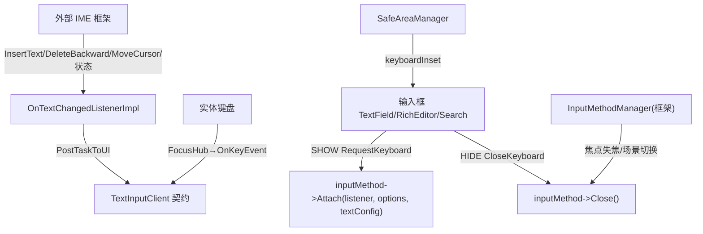
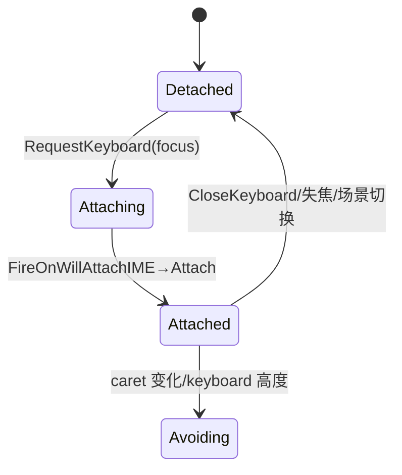

# 架构设计
> 确认目标仓和模块的架构约束、关键设计决策、Spec 拆分方向。

## 设计元数据

| Field | Content |
|-------|---------|
| Design ID | DESIGN-Func-04-14-04 |
| 关联需求 | 已有能力补录（无独立 requirement.md） |
| 关联 Epic | 无 |
| 目标 Feature | Feat-01 IME 框架交互与弹出收起控制；Feat-02 输入框避让显示；Feat-03 实体键盘切换（含外部 IME 框架，经全仓检索确认）；Feat-04 键盘输入处理契约；Feat-05 输入法交互公共 API |
| 复杂度 | 关键 |
| 目标版本 | API 8–12（onWillAttachIME/keyboardAppearance/enableKeyboardOnFocus/customKeyboard/onEditChange 动态 @since 8–12；静态 @since 23；UIContext.setKeyboardAvoidMode @since 11） |
| Owner | ArkUI SIG |
| 状态 | Baselined（已有实现补录；本设计替换此前错误范围的焦点遍历版本） |

## 需求基线

| 项 | 补充说明 |
|----|------------------|
| 域定义 | 输入法交互 = 输入框↔键盘（虚拟 IME + 实体）交互，非焦点导航 |
| SHOW 模型 | 输入框驱动：`TextFieldPattern::RequestKeyboard` → `inputMethod->Attach(textChangeListener_, attachOptions, textConfig, INNER_KIT_ARKUI)` |
| HIDE 模型 | 框架驱动：`InputMethodManager::CloseKeyboard*` → `inputMethod->Close()`/`RequestHideInput` |
| IME 回调 | 仅 `onWillAttachIME` 已实现（attach 前 fire）；无 Will-Detach/Did-Attach |
| 实体键盘 | 检测经全仓检索确认不在本仓（无 IsPhysicalKeyboard/InputDeviceManager），软硬切换决策属外部 IME 框架（MiscServices::InputMethodController） |
| 边界 | 焦点遍历/Tab/Esc/Enter 激活→未来 04-04-02 key-events/04-09-01 focus-mechanism；文本快捷键→04-14-02；编辑拦截回调→04-14-03 Feat-04；避让机制→04-02-01 Feat-05 |

## 上下文和现状

### 涉及仓和模块

| 仓库 | 补充架构说明 |
|------|--------------|
| ace_engine | 输入框侧 RequestKeyboard/CloseKeyboard + IME 框架管理器 InputMethodManager（adapter 分发）+ IME→输入框桥 OnTextChangedListenerImpl |
| 外部 | `miscservices_inputmethod`（InputMethodController）—— IME 框架，本仓经 adapter 调用 |

### 调用链层级分析

| 层 | 模块 | 职责 | 修改类型 |
|-----|------|------|----------|
| IME 框架管理器 | `frameworks/core/common/ime/input_method_manager.h` + `adapter/ohos/osal/input_method_manager_ohos.cpp` | 焦点驱动 show/hide/attach/detach 编排 | 既有 |
| 输入框 attach/show | `frameworks/core/components_ng/pattern/text_field/text_field_pattern.cpp`(RequestKeyboard/CloseKeyboard)、`rich_editor_pattern.cpp`、`search_pattern.cpp` | 输入框侧 IME 附挂/关闭 | 既有 |
| IME 事件 hub | `text_field_event_hub.h`、`rich_editor_event_hub.h` | onWillAttachIME 回调 | 既有 |
| IME→输入框桥 | `frameworks/core/components_ng/pattern/text_field/on_text_changed_listener_impl.cpp` | IME 文本/删除/光标/选择/状态回调→TextInputClient | 既有 |
| 输入处理契约 | `frameworks/core/common/ime/text_input_client.h` | TextInputClient 抽象（IME 与物理键共用） | 既有 |
| 避让 | `frameworks/core/components_ng/manager/safe_area/safe_area_manager.h`、`components/common/layout/constants.h`(KeyBoardAvoidMode) | 键盘 inset + 避让模式 | 既有 |
| 公共 API bridge | `frameworks/bridge/declarative_frontend/ark_modifier/src/text_input_modifier.ts`、`rich_editor_modifier.ts` | customKeyboard/keyboardAppearance/enableKeyboardOnFocus/onWillAttachIME/onEditChange | 既有 |

### 适用架构规则

| Rule ID | 适用原因 | 设计结论 | 验证方式 |
|---------|----------|----------|----------|
| OH-ARCH-LAYERING | 输入框→InputMethodManager→外部 IME | 调用方向单向 | 代码评审 |
| OH-ARCH-IPC-SAF | 跨进程 IME（UIExtension HideKeyboardAcrossProcesses） | 跨进程隐藏结论 | 集成测试 |
| OH-ARCH-API-LEVEL | 公共回调 @since 8–12/23；window API @since 11 | Public+System | API 评审/XTS |

## 不涉及项承接

| 维度 | 设计结论 |
|------|----------|
| 焦点遍历/Tab/Esc/Enter 激活 | 属焦点导航，未来 04-04-02/04-09-01；本域不覆盖 |
| 文本快捷键分发 | Ctrl+C/V/X/Z 等归 04-14-02；本域仅引用 TextInputClient::HandleKeyEvent 契约 |
| 编辑拦截回调 | onWillInsert/onDidInsert/onWillDelete/onDidDelete 归 04-14-03 Feat-04（消费本域契约） |
| 避让机制 | Page offset/resize/inset 同步归 04-02-01 Feat-05；本域只覆盖输入框侧响应 |
| IME 框架内部 | InputMethodController 软硬切换/检测属外部 miscservices_inputmethod；本域仅描述契约（检测经全仓检索确认不在本仓） |

## 关键设计决策

| 决策 ID | 问题 | 推荐方案 | 探索过的替代方案 | 取舍理由 | 影响 |
|---------|------|----------|------------------|----------|------|
| ADR-1 | SHOW/HIDE 责任划分 | SHOW 输入框驱动(RequestKeyboard→Attach)；HIDE 框架驱动(InputMethodManager) | 统一框架 | 输入框知道何时需键盘；框架知道何时关（失焦/场景切换） | 双向职责清晰 |
| ADR-2 | IME 回调集 | 仅 onWillAttachIME（attach 前 fire）；不臆造 Will-Detach/Did-Attach | 全生命周期 | 仅 Will-attach 实现，按实现记录；缺口标 to-do | 不臆造未实现 |
| ADR-3 | 避让分层 | 机制归 04-02-01；输入框侧 TriggerAvoidOnCaretChange+*_WITH_CARET+supportAvoidance 归本域 | 全归本域 | 复用机制，聚焦输入框响应 | 互引不重写 |
| ADR-4 | 实体键盘切换 | 范围限定为契约（isShowKeyboard 传入+面板状态消费）；检测经全仓检索确认不在本仓 | 自检检测 | 检测不在本仓，不臆造 | 经全仓检索确认属外部 IME |
| ADR-5 | 与 04-14-03 Feat-05 边界 | 本域拥有 onWillAttachIME/keyboardAppearance/enableKeyboardOnFocus/customKeyboard/onEditChange 的**输入法交互语义**；04-14-03 保留非键盘交互触发 | 各自归并 | 04-14-03 Feat-05 仍待补充，可重分配 | 两 design 显式列分拆 |

## 设计骨架

### 骨架范围

| 骨架项 | 目标 | 不包含 | 验证方式 |
|--------|------|--------|----------|
| IME show/hide | InputMethodManager+RequestKeyboard/CloseKeyboard | IME 内部 | 单测 |
| 避让 | KeyBoardAvoidMode+TriggerAvoidOnCaretChange | Page 机制 | 单测 |
| 实体键盘 | 契约+确认归属 | 外部 IME 检测 | 单测 |
| 输入处理契约 | TextInputClient+OnTextChangedListenerImpl | 快捷键表 | 单测 |
| 公共 API | customKeyboard 等 5 API | — | 单测 |

### 骨架 Spec 拆分

| Task ID | 目标 | 受影响文件 | AC |
|---------|------|-----------|----|
| TASK-KC-SKEL | 5 个 Feat 规格补录 | Feat-01..05-*-spec.md | 见各 Feat |

## 后续 Task 拆分

| Task ID | 目标 | 受影响文件 | 依赖 |
|---------|------|-----------|------|
| TASK-KC-01 | Feat-01 IME 框架交互与弹出收起控制 | Feat-01-ime-framework-show-hide-control-spec.md | 无 |
| TASK-KC-02 | Feat-02 输入框避让显示 | Feat-02-input-box-keyboard-avoidance-spec.md | Feat-01 |
| TASK-KC-03 | Feat-03 实体键盘切换 | Feat-03-physical-keyboard-switching-spec.md | Feat-01 |
| TASK-KC-04 | Feat-04 键盘输入处理契约 | Feat-04-keyboard-input-processing-contract-spec.md | Feat-01 |
| TASK-KC-05 | Feat-05 输入法交互公共 API | Feat-05-text-component-keyboard-control-api-spec.md | Feat-01 |

## API 签名、Kit 与权限

### 新增 API
公共 API（文本组件侧）：`customKeyboard(builder, options?)`、`keyboardAppearance(KeyboardAppearance)`、`enableKeyboardOnFocus(boolean)`、`onWillAttachIME(Callback<IMEClient>)`、`onEditChange(Callback<boolean>)`、`stopEditing()`(controller)、`IMEClient` 类型。Window/UIContext：`setKeyboardAvoidMode`+`KeyboardAvoidMode` 枚举（@since 11，外部 SDK 仓）。内部接口：`InputMethodManager::*`、`TextFieldPattern::RequestKeyboard/CloseKeyboard`、`TextInputClient`、`OnTextChangedListenerImpl`。

### 变更/废弃 API
无。

## 构建系统影响

### BUILD.gn 变更
```
文件: frameworks/core/common/ime/BUILD.gn, adapter/ohos/osal/BUILD.gn, pattern/text_field/BUILD.gn
变更说明: 既有 target，无新增依赖
```

### bundle.json 变更
无新增部件。

## 可选设计扩展

### 架构图



### 算法与状态机



## 详细设计

### IME 框架交互与弹出收起控制
`InputMethodManager` 焦点驱动：`OnFocusNodeChange`→`ManageFocusNode`→`ProcessKeyboard`/`ProcessKeyboardInWindowScene`/`CloseKeyboard(focusNode)`；窗口场景 `lastKeep_`；UIExtension 跨进程 `HideKeyboardAcrossProcesses`；模态页 `ProcessModalPageScene`；pipeline 销毁 `CloseKeyboardInPipelineDestroy`；`NeedSoftKeyboard`/`NeedToRequestKeyboardOnFocus` 判定；`CloseCustomKeyboard`→TextFieldManagerNG。输入框侧：`TextFieldPattern::RequestKeyboard`（custom 分支 RequestCustomKeyboard；标准 OnTextChangedListenerImpl+GetIMEClientInfo+FireOnWillAttachIME+Attach+attachOptions.isShowKeyboard；跨平台 RequestKeyboardCrossPlatForm→InputMethodManager::Attach）、`RichEditorPattern::RequestKeyboard`、`SearchPattern::RequestKeyboard`(委托 textField)、`CloseKeyboard` 系列。状态：curFocusNode_/lastFocusNodeId_/lastTextInputSessionId_/lastKeep_/isLastFocusUIExtension_/preTag_/windowFocus_。

### 输入框避让显示
`KeyBoardAvoidMode`(OFFSET/RESIZE/OFFSET_WITH_CARET/RESIZE_WITH_CARET/NONE, constants.h:891)；默认 OFFSET(safe_area_manager.h:420)；NONE 时 GetKeyboardInset 返回空。输入框侧：`TriggerAvoidOnCaretChange`→textFieldManager→TriggerAvoidOnCaretChange（caret 移动触发）；RichEditor ForceTriggerAvoidOnCaretChange；自定义键盘 `SetCustomKeyboardOption(supportAvoidance)`→keyboardAvoidance_（KeyboardOptions.supportAvoidance）。公共：UIContext/Window.setKeyboardAvoidMode+KeyboardAvoidMode（@since 11，C-API arkoala/ani/cjui 镜像）。机制（inset 同步/Page offset/resize/RESIZE+expand 例外/OverlayManager）归 04-02-01 Feat-05。

### 实体键盘切换
本仓仅：RequestKeyboard 传 `attachOptions.isShowKeyboard`（text_field_pattern.cpp:5971）；消费入站 `NotifyPanelStatusInfo`/`SetKeyboardStatus`/`NotifyKeyboardHeight`（on_text_changed_listener_impl.cpp:341/83/150）；物理键路由 FocusHub→pattern::OnKeyEvent→TextInputClient::HandleKeyEvent（text_input_client.h:164）；`SendKeyEventFromInputMethod` 空{}（IME 不经此转发键）。**检测不在本仓**（无 IsPhysicalKeyboard/InputDeviceManager）→软硬切换决策属外部 miscservices_inputmethod（经全仓检索确认不在本仓）。

### 键盘输入处理契约
`TextInputClient` 抽象（text_input_client.h:87）：UpdateEditingValue/PerformAction/InsertValue(isIME)/DeleteBackward/DeleteForward/SetInputMethodStatus/NotifyKeyboardClosed*/NotifyKeyboardHeight/GetLeft-RightTextOfCursor/GetTextIndexAtCursor/HandleSetSelection/HandleExtendAction/HandleKeyEvent/CursorMove/HandleSelect/HandleSelectExtend/SetSelection/DeleteRange/SetPreviewText/FinishTextPreview；合成态 text_editing_value+text_compose；FinishComposing 仅 CROSS_PLATFORM InputMethodManager。`OnTextChangedListenerImpl` 桥（on_text_changed_listener_impl.cpp）：InsertText→InsertValue(isIME=true)/DeleteBackward/DeleteForward/MoveCursor(Direction→CaretMoveIntent)/HandleSelect(keyCode→CaretMoveIntent)/HandleSetSelection/HandleExtendAction/SetKeyboardStatus/NotifyKeyboardHeight/SendKeyboardStatus/NotifyPanelStatusInfo/SetPreviewText/FinishTextPreview/ReceivePrivateCommand/AutoFillReceivePrivateCommand/OnDetach，全 PostTaskToUI。物理键路径与 04-14-02 共用 HandleKeyEvent（04-14-02 拥有 functionKeys_/keyboardShortCuts_ 表，本域拥有契约面）。

### 输入法交互公共 API
customKeyboard（builder+KeyboardOptions supportAvoidance, @since 10/23）、keyboardAppearance（KeyboardAppearance, @since 10/23）、enableKeyboardOnFocus（@since 10/23）、onWillAttachIME（Callback<IMEClient>, @since 12/23）、onEditChange（Callback<boolean>, @since 8/23）、stopEditing（controller）、IMEClient{nodeId, extraInfo}。Modifier bridge：text_input_modifier.ts/rich_editor_modifier.ts；Model：text_field_model/text_field_model_ng/rich_editor_model/search_model；ArkTS native bridge：arkts_native_rich_editor_bridge。边界：onWillAttachIME/keyboardAppearance/enableKeyboardOnFocus/customKeyboard/onEditChange 的**输入法交互语义**归本域；04-14-03 Feat-05 保留非键盘交互触发（enableHapticFeedback/enablePreviewText/selectAll/selection/selectedBackgroundColor/stopBackPress/closeSelectionMenu/setTextSelection/onTextSelectionChange/onContentScroll）。

## 风险和开放问题

| 项 | 类型 | 影响 | 处理方式 | Owner |
|----|------|------|----------|-------|
| 与 04-14-03 Feat-05 边界冲突（onWillAttachIME 等共享） | 架构 | 高 | 两 design 显式列分拆；本域拥有输入法交互语义 | ArkUI SIG |
| 实体键盘检测不在本仓 | 架构 | 中 | 经全仓检索确认属外部 IME；范围限契约 | ArkUI SIG |
| 仅 onWillAttachIME 实现（无 Will-Detach/Did-Attach） | API | 中 | 按实现记录；缺口标 to-do | ArkUI SIG |
| 与 04-14-02 共用 HandleKeyEvent 契约 | 架构 | 低 | 互引；本域拥有契约面，04-14-02 拥有快捷键表 | ArkUI SIG |
| SDK @since 需外部 SDK 仓确认 | API | 低 | 标注来源（03 design + bridge） | ArkUI SIG |

## 设计审批

- [x] 需求基线已确认，设计覆盖 P0/P1 AC
- [x] 不涉及项已承接
- [x] 涉及仓和模块职责清楚
- [x] 调用链层级分析完整
- [x] 适用架构规则已识别
- [x] 分层和子系统边界合规
- [x] API 变更有签名、权限、错误码和兼容性说明
- [x] BUILD.gn/bundle.json 影响明确
- [x] 设计输出和后续 Task 拆分明确
- [x] 关键设计决策有理由和影响说明
- [x] 风险和开放问题有 Owner

**结论:** 通过（已有实现补录；替换此前错误范围的焦点遍历版本）
