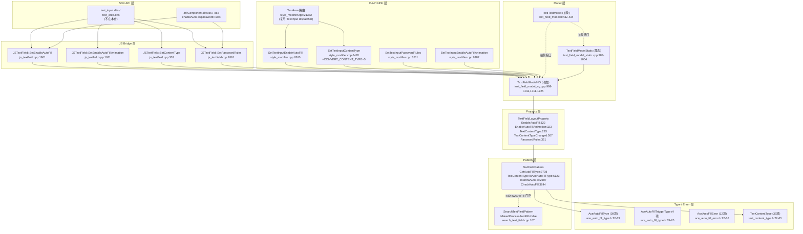
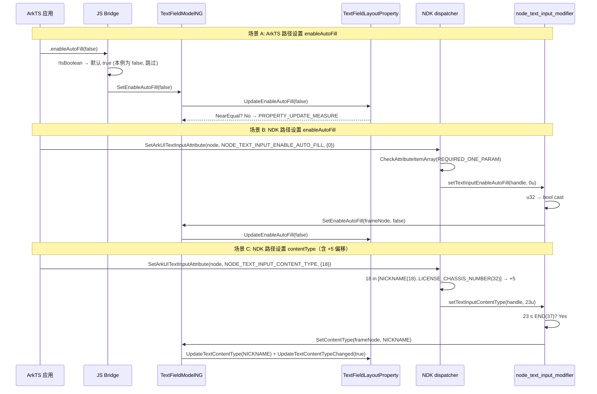

# 架构设计

> 确认目标仓和模块的架构约束、关键设计决策、Spec 拆分方向。本设计覆盖 `04-common-capability/14-input-interaction/05-autofill` 整个功能域，由 5 个 Feat 共享。

## 设计元数据

| Field | Content |
|-------|---------|
| Design ID | `DESIGN-Func-04-14-05` |
| 关联需求 | 已有能力补录（无独立 requirement.md） |
| 关联 Epic | 04-通用能力层 / 14-输入交互 / 05-自动补全能力（AutoFill） |
| 目标 Feature | Feat-01 TextInput/TextArea AutoFill 基础属性与类型枚举、Feat-02 TextInput AutoFill 动画与内容修饰（待补录）、Feat-03 AutoFill 标准触发模型与请求管线（待补录）、Feat-04 AutoFill 增强触发路径 MSDP 与 Secure Paste（待补录）、Feat-05 Web AutoFill 管线（待补录） |
| 复杂度 | 复杂 |
| 目标版本 | API 12–24 |
| Owner | ArkUI SIG |
| 状态 | Baselined（已有实现补录） |

## 需求基线

| 项 | 补充说明 |
|----|---------|
| AutoFill 是跨组件通用能力 | 覆盖 TextInput（主载体）、TextArea、Search（Pattern 覆写禁用）、Web（独立管线，Feat-05） |
| 属性基线 | `enableAutoFill`（默认 true）、`contentType`（39 项内部枚举/33 项 NDK）、`passwordRules`（TextInput 独有）、`enableAutoFillAnimation`（TextInput 独有） |
| 触发与请求管线（Feat-03） | `ProcessAutoFill`/`ProcessAutoFillOnFocus`/`ProcessAutoFillOnPaste`/`FrameNode::RequestAutoFill/ExecuteAutoFill`、`UiContent::DumpViewData/CheckNeedAutoSave`、`ViewDataWrap`/`PageNodeInfoWrap`/`HintToTypeWrap` 桥接、菜单 UI（`ARKUI_TEXT_MENU_ITEM_ID_AUTO_FILL`/`PASSWORD_VAULT` @since 24） |
| 增强触发路径（Feat-04） | MSDP（`TextFieldManager::ParseMSDPAutoFillJsonValue` 等）+ Secure Paste（`"autofill/secure"` MIME） |
| 与 04-14-01（文本选择）边界 | 04-14-05 聚焦自动填充属性/触发管线/动画；文本选择/复制/光标属 04-14-01/03 |
| 与 04-14-03（文本交互）边界 | 04-14-05 不涉及光标、菜单内容（除 AutoFill 菜单触发）、剪贴板回调 |

## 上下文和现状

### 涉及仓和模块

| 仓库 | 补充架构说明 |
|------|------------|
| `foundation/arkui/ace_engine` | AutoFill 实现完全在 ace_engine 仓内，不跨仓。`interface/sdk-js/api/` 不在本仓——ArkTS 公共方法签名以 in-repo 镜像 `frameworks/bridge/declarative_frontend/ark_component/export/arkComponent.d.ts` 为参考，未经 d.ts 验证（详见风险表） |
| `ability_base`（外部依赖） | `AbilityBase::AutoFillType` / `AbilityBase::ViewData` 由 `ViewDataWrap`/`PageNodeInfoWrap` 桥接到 Ace 类型——桥接行为详见 Feat-03 |

### 调用链层级分析

| 层 | 模块 | 职责 | 修改类型 |
|----|------|------|---------|
| 1. SDK API 层 | `interface/sdk-js/api/@internal/component/ets/text_input.d.ts`、`text_area.d.ts`（独立仓）；in-repo 镜像 `arkComponent.d.ts` | 声明 `.enableAutoFill`/`.contentType`/`.passwordRules`/`.enableAutoFillAnimation` 公共 API | 不修改（已有） |
| 2. JS Bridge 层 | `frameworks/bridge/declarative_frontend/jsview/js_textinput.cpp`、`js_textarea.cpp`、`js_textfield.cpp` | JS 方法→C++ 函数绑定；`JSTextField::SetEnableAutoFill/SetEnableAutoFillAnimation/SetContentType/SetPasswordRules` | 不修改（已有） |
| 3. C-API NDK 层 | `interfaces/native/node/style_modifier.cpp`、`node_text_input_modifier.cpp`、`node_text_area_modifier.cpp`、`frameworks/core/interfaces/arkoala/arkoala_api.h` | `NODE_TEXT_INPUT_*`/`NODE_TEXT_AREA_*` 属性分发；u32→bool/int32→enum cast；`CONVERT_CONTENT_TYPE` 偏移 | 不修改（已有） |
| 4. Static ArkTS 桥 | `frameworks/bridge/arkts_frontend/arkts_native_text_area_bridge.cpp` | 静态前端 TextArea 桥（使用 `arkoala_api.h:6069-6072` 的 dedicated TextArea 指针） | 不修改（已有） |
| 5. Model 层 | `frameworks/core/components_ng/pattern/text_field/text_field_model.h`（抽象）、`text_field_model_ng.h/.cpp`（动态）、`text_field_model_static.h/.cpp`（静态） | 抽象 Model 接口；NG 实现（FrameNode 静态/非静态方法）；Static 实现（`std::optional` nullopt 处理） | 不修改（已有） |
| 6. Property 层 | `frameworks/core/components_ng/pattern/text_field/text_field_layout_property.h` | `EnableAutoFill`/`EnableAutoFillAnimation`/`TextContentType`/`TextContentTypeChanged`/`PasswordRules` 属性声明（`ACE_DEFINE_PROPERTY_ITEM_WITHOUT_GROUP`） | 不修改（已有） |
| 7. Pattern 层 | `frameworks/core/components_ng/pattern/text_field/text_field_pattern.h/.cpp` | `GetAutoFillType`/`TextContentTypeToAceAutoFillType`/`IsShowAutoFill`/`CheckAutoFill`/`ProcessAutoFill`（Feat-03）；`contentTypeMap_` 静态映射表 | 不修改（已有） |
| 8. 类型/枚举层 | `frameworks/base/view_data/ace_auto_fill_type.h`、`ace_auto_fill_error.h`、`frameworks/core/components_ng/pattern/text_field/text_content_type.h` | `AceAutoFillType`/`AceAutoFillTriggerType`/`AceAutoFillError`/`TextContentType` 枚举定义 | 不修改（已有） |
| 9. ViewData 桥层 | `frameworks/base/view_data/view_data_wrap.h`、`page_node_info_wrap.h`、`hint_to_type_wrap.h` | `ViewDataWrap::ViewDataToType/HintToAutoFillType`、`PageNodeInfoWrap::SetAutoFillType/GetEnableAutoFill`、`HintToTypeWrap{autoFillType, metadata}`（桥接详情属 Feat-03） | 不修改（已有） |
| 10. NDK 头文件层 | `interfaces/native/native_node.h`、`interfaces/native/node_attributes/text_input.h`、`text_common.h` | `NODE_*` 属性枚举、`ArkUI_TextInputContentType` 枚举、`ARKUI_TEXT_MENU_ITEM_ID_*` 枚举 | 不修改（已有） |
| 11. Animation 层（Feat-02） | `frameworks/core/components_ng/pattern/text_field/auto_fill_controller.h/.cpp`、`text_field_content_modifier.h`、`text_field_layout_algorithm.h` | `AutoFillController` 状态机、`AutoFillAnimationStatus`/`AutoFillContentLengthMode`/`AutoFillInsertStatus`、`TextFieldContentModifier` 绘制/偏移 API、`CreateAutoFillParagraph` | 不修改（已有，Feat-02 补录） |
| 12. Web Pattern 层（Feat-05） | `frameworks/core/components_ng/pattern/web/web_pattern.h/.cpp`、`web_model.h/.cpp` | `WebPattern::RequestAutoFill`(3 重载)/`RequestPasswordAutoFill`/`RequestAutoSave`/`UpdateAutoFillPopup`/`CloseAutoFillPopup`/`ShiftFocusAfterAutoFill`、NWeb↔Ace 类型映射 | 不修改（已有，Feat-05 补录） |
| 13. Search Pattern 层 | `frameworks/core/components_ng/pattern/search/search_text_field.h/.cpp` | `SearchTextFieldPattern::IsNeedProcessAutoFill()` 覆写返回 false（Search 显式禁用 AutoFill） | 不修改（已有） |

### 适用架构规则

| Rule ID | 适用原因 | 设计结论 | 验证方式 |
|---------|----------|----------|----------|
| OH-ARCH-LAYERING | 涉及 SDK→JS Bridge→NDK→Model→Property→Pattern→Type→ViewData 多层调用 | 调用方向严格自上而下，Pattern 层不直接调用 SDK/JS Bridge；TextArea NDK 路由复用 TextInput-named dispatcher（结果等价） | 架构评审/依赖检查 |
| OH-ARCH-API-LEVEL | 涉及 Public API 变更（已有 API 补录） | API 级别为 Public，@since 标注策略：全版本标注 API 12→18→20→24 | API 评审/XTS |
| OH-ARCH-COMPONENT-BUILD | 涉及部件化 | 无 `BUILD.gn`/`bundle.json` 修改（已有实现补录） | 构建验证 |
| OH-ARCH-ERROR-LOG | 涉及错误码（C-API `ERROR_CODE_PARAM_INVALID`） | C-API 层返回错误码；JS/Model 层静默返回（无错误码）；`passwordRules` dispatcher 不调用 `CheckAttributeItemArray`（无错误码） | 单测/hilog |

## 不涉及项承接

| 维度 | 设计结论 |
|------|---------|
| 光标/插入点 | 属 04-14-03 Feat-01 光标(Caret)交互，本域不涉及 |
| 选择菜单 | 属 04-14-03 Feat-02 文本上下文菜单，本域仅涉及 `ARKUI_TEXT_MENU_ITEM_ID_AUTO_FILL`/`PASSWORD_VAULT` 的枚举存在性与触发（Feat-03） |
| 选区/复制 | 属 04-14-01，本域不涉及 |
| 文本菜单内容定制 | 属 04-14-03，本域仅记录菜单项枚举存在性（@since 24），菜单 UI 行为详见 Feat-03 |
| 动画管线 | 属 Feat-02（`AutoFillController` 状态机、`TextFieldContentModifier` 绘制 API）；本设计仅记录 `enableAutoFillAnimation` 属性的存在与默认值 |
| 触发管线 | 属 Feat-03（`ProcessAutoFill`/`FrameNode::RequestAutoFill`/`UiContent::DumpViewData`）；本设计仅记录属性存储层与类型解析优先级 |
| MSDP 与 Secure Paste | 属 Feat-04（`TextFieldManager::ParseMSDPAutoFillJsonValue`、`HandleOnAutoFillSecurePaste`、`"autofill/secure"` MIME） |
| Web AutoFill 管线 | 属 Feat-05（`WebPattern::RequestAutoFill`/`UpdateAutoFillPopup`/NWeb↔Ace 映射） |
| `interface/sdk-js/api/` d.ts 验证 | 该目录不在本仓；ArkTS 公共方法签名以 in-repo 镜像为参考，未经 d.ts 验证（详见风险表） |

## 关键设计决策

| 决策 ID | 问题 | 推荐方案 | 探索过的替代方案 | 取舍理由 | 影响 |
|---------|------|---------|-----------------|---------|------|
| ADR-1 | NDK 与内部枚举值域不一致如何处理？ | dispatcher 在 set/get 路径应用 `+5 CONVERT_CONTENT_TYPE` 偏移，桥接 NDK 33 项（0–32）与内部 39 项（-1…37）；偏移源于内部 5 项 time/date 类型（`PRECISE_TIME`/`HOUR_AND_MINUTE`/`DATE`/`MONTH`/`YEAR`）未在 NDK 暴露 | A) 内部枚举重排对齐 NDK——破坏既有代码依赖；B) NDK 暴露全部 39 项——会扩大 API 面，time/date 类型语义本就与 autofill 不同 | 偏移方案最小破坏；set 路径 `+5`（`style_modifier.cpp:6478-6482`）与 get 路径 `-5`（`6493-6498`）对称；但 NDK 未定义值 33–37 因不触发偏移分支而被错误接受（见 ADR-5 与风险表） | Feat-01 AC-2.5–2.7 |
| ADR-2 | `TextContentType::VISIBLE_PASSWORD` 与 `AceAutoFillType::ACE_PASSWORD` 名称发散如何记录？ | 在 `contentTypeMap_` 静态映射表（`text_field_pattern.cpp:194-261`）中显式声明 `VISIBLE_PASSWORD → ACE_PASSWORD`（同值 =1，异名）；其余 38 项按名称 1:1 对应（加 `ACE_` 前缀） | A) 重命名 `VISIBLE_PASSWORD` 为 `PASSWORD`——破坏既有 ArkTS API；B) 重命名 `ACE_PASSWORD` 为 `ACE_VISIBLE_PASSWORD`——破坏既有 `AceAutoFillType` 枚举与 `AbilityBase` 桥接 | 名称发散作为已知风险记录，不修改源码现状；下游按名称 switch 的代码需在跨 NDK/内部边界处显式处理 | Feat-01 AC-5.5 |
| ADR-3 | NDK 公开枚举 `NODE_TEXT_INPUT_ENABLE_FILL_ANIMATION`（无 `AUTO_`）与 dispatcher 函数名 `SetTextInputEnableAutoFillAnimation`（有 `Auto`）不匹配如何处理？ | 不修改枚举名（NDK 公开 API 不可改）；在 spec 与 d.ts 文档中明确标注名称不匹配；dispatcher 函数名保留 `Auto` 以与内部 `EnableAutoFillAnimation` 属性一致 | A) 重命名 NDK 枚举加 `AUTO_`——破坏 NDK 公开 API 兼容性；B) 重命名 dispatcher 函数去掉 `Auto`——破坏内部命名一致性 | NDK 公开 API 不可变，作为已知风险记录；下游消费者引用 `NODE_TEXT_INPUT_ENABLE_AUTO_FILL_ANIMATION`（带 AUTO_）会找不到，需引用 `NODE_TEXT_INPUT_ENABLE_FILL_ANIMATION` | Feat-01 AC-4.4 |
| ADR-4 | `TextContentType` 不参与 `ToJsonValue`/`Reset`/`Clone` 如何记录？ | 不修改源码现状（`text_field_layout_property.h:107-183,62-105,344-390`）；在 spec"非功能性需求"中明确 inspector dump 不显示 `contentType`；只有 `PasswordRules`/`EnableAutoFill`/`EnableAutoFillAnimation` 参与序列化 | A) 补全 `contentType` 序列化——已有实现现状如此，本域为补录不改；B) 完全移除 `TextContentTypeChanged` companion flag——会破坏 `SetContentType` 路径 | 源码现状作为 spec，已记录为已知限制（非缺陷）；如未来需 inspector 显示 `contentType`，需另开 Feat | Feat-01 AC-2.1, 非功能性需求-自动化维测 |
| ADR-5 | ArkTS `.contentType(999)` 越界不调用 `CastToTextContentType` clamp，NDK 路径却 clamp 如何记录？ | 不修改源码现状；在 spec 中明确两路径校验不对称（ArkTS raw `static_cast`，`js_textfield.cpp:316`；NDK bridge 检测并 clamp 至 `UNSPECIFIED`，`node_text_input_modifier.cpp:502-505`）；记录为风险 | A) 修复 ArkTS 路径调用 clamp——本域为补录不改实现；B) 移除 NDK clamp 使两路径一致——会扩大 NDK 接受范围 | 不对称作为已知风险记录；ArkTS 越界值为未定义行为（源码现状）；如修复需另开 Feat | Feat-01 AC-2.4, R-5 |
| ADR-6 | TextArea NDK 路由复用 TextInput-named dispatcher 而非 dedicated TextArea 函数指针如何记录？ | 不修改源码现状（`style_modifier.cpp:21376-21427`）；在 spec 中明确路由不对称但结果等价（两桥均调用相同 `TextFieldModelNG` 方法）；`arkoala_api.h:6069-6072` 的 dedicated TextArea 指针仅静态 ArkTS 桥使用（`arkts_native_text_area_bridge.cpp:2223`） | A) NDK 也改用 dedicated TextArea 指针——结果等价，但破坏既有 NDK dispatcher 表；B) 移除 dedicated TextArea 指针——会破坏静态前端桥 | 路由不对称作为已知行为记录；如未来重命名 TextInput dispatcher，TextArea NDK 静默破裂（风险表） | Feat-01 AC-1.10, AC-2.9, R-3, R-9 |
| ADR-7 | `enableAutoFill` 默认值跨层不一致如何记录？ | 不修改源码现状；在 spec 中明确：ArkTS/NDK/LayoutProperty/NDK 头文档 默认 `true`，但 `PageNodeInfoWrap::GetEnableAutoFill` 基类默认 `false`（具体子类覆写）；静态前端 `SetEnableAutoFill(nullopt)` 始终委托 NG `SetEnableAutoFill(node, true)`，**永不 reset** | A) 统一所有层默认 `true`——需修改 `PageNodeInfoWrap` 基类，破坏子类契约；B) 静态桥 nullopt 改为 reset——会改变静态前端"未设置"语义 | 跨层默认值不一致作为风险记录；下游跨层读取 `enableAutoFill` 需注意层级差异 | Feat-01 AC-1.3, AC-7.5, AC-8.1, R-19 |

## 设计骨架

### 骨架范围

| 骨架项 | 目标 | 不包含 | 验证方式 |
|--------|------|--------|---------|
| AutoFill 基础属性规格化 | `enableAutoFill`/`contentType`/`passwordRules`/`enableAutoFillAnimation` 4 属性规格化（ArkTS + NDK） | 动画管线（Feat-02）、触发管线（Feat-03）、Web（Feat-05） | 单元测试 + NDK 测试 |
| 类型枚举规格化 | `TextContentType`/`AceAutoFillType`/`AceAutoFillError`/`AceAutoFillTriggerType`/`ArkUI_TextInputContentType` 规格 + `+5` 偏移映射 | `ViewDataWrap` 桥接行为（Feat-03） | 静态枚举扫描 + 单元测试 |
| 平台门控规格化 | `IsShowAutoFill()` + `IsNeedProcessAutoFill()`（Search）规格化 | MSDP/Secure Paste 门控（Feat-04） | 单元测试 + 环境模拟 |

### 骨架 Spec 拆分

| Task ID | 目标 | 受影响文件 | AC |
|---------|------|----------|-----|
| TASK-SKELETON-1 | Feat-01 TextInput/TextArea AutoFill 基础属性与类型枚举 | `js_textinput.cpp`、`js_textarea.cpp`、`js_textfield.cpp`、`text_field_model*.h/.cpp`、`text_field_layout_property.h`、`text_content_type.h/.cpp`、`ace_auto_fill_type.h`、`ace_auto_fill_error.h`、`style_modifier.cpp`、`node_text_input_modifier.cpp`、`node_text_area_modifier.cpp`、`arkoala_api.h`、`native_node.h`、`text_input.h`、`text_common.h`、`text_field_pattern.h/.cpp`、`search_text_field.h/.cpp` | AC-1.1–8.4 |
| TASK-SKELETON-2 | Feat-02 TextInput AutoFill 动画与内容修饰（待补录） | `auto_fill_controller.h/.cpp`、`text_field_content_modifier.h`、`text_field_layout_algorithm.h` | 待定 |
| TASK-SKELETON-3 | Feat-03 AutoFill 标准触发模型与请求管线（待补录） | `text_field_pattern.h/.cpp`、`text_field_manager.h/.cpp`、`view_data_wrap.h`、`page_node_info_wrap.h`、`hint_to_type_wrap.h`、`ui_content.h`、`frame_node.h/.cpp` | 待定 |
| TASK-SKELETON-4 | Feat-04 AutoFill 增强触发路径（MSDP 与 Secure Paste）（待补录） | `text_field_manager.h/.cpp`、`text_field_pattern.h/.cpp`、`text_field_select_overlay.h` | 待定 |
| TASK-SKELETON-5 | Feat-05 Web AutoFill 管线（待补录） | `web_pattern.h/.cpp`、`web_model*.h/.cpp`、`auto_fill_trigger_state_holder.h` | 待定 |

## 后续 Task 拆分

| Task ID | 目标 | 受影响文件 | 依赖 |
|---------|------|----------|------|
| TASK-01 | Feat-01 TextInput/TextArea AutoFill 基础属性与类型枚举规格补录 | `Feat-01-textinput-textarea-base-attributes-spec.md` | 无 |
| TASK-02 | Feat-02 TextInput AutoFill 动画与内容修饰规格补录 | 待创建 | TASK-01 |
| TASK-03 | Feat-03 AutoFill 标准触发模型与请求管线规格补录 | 待创建 | TASK-01 |
| TASK-04 | Feat-04 AutoFill 增强触发路径（MSDP 与 Secure Paste）规格补录 | 待创建 | TASK-03 |
| TASK-05 | Feat-05 Web AutoFill 管线规格补录 | 待创建 | TASK-01 |

## API 签名、Kit 与权限

### 新增 API

> 本域为已有实现补录，以下 API 均已存在于 SDK，不新增。**注**：本仓不含 `interface/sdk-js/api/`，ArkTS 公共方法签名以 in-repo 镜像为参考，未经 d.ts 验证（详见风险表）。

| API 签名 | 类型 | Kit | d.ts 位置 | 权限要求 | SysCap |
|----------|------|-----|-----------|---------|--------|
| `TextInputAttribute.enableAutoFill(value: boolean)` | Public | ArkUI | `interface/sdk-js/api/@internal/component/ets/text_input.d.ts`（不在本仓；in-repo 镜像 `arkComponent.d.ts:867`） | 无 | ArkTS |
| `TextAreaAttribute.enableAutoFill(value: boolean)` | Public | ArkUI | `interface/sdk-js/api/@internal/component/ets/text_area.d.ts`（不在本仓） | 无 | ArkTS |
| `TextInputAttribute.contentType(value: TextContentType)` | Public | ArkUI | 同上 | 无 | ArkTS |
| `TextAreaAttribute.contentType(value: TextContentType)` | Public | ArkUI | 同上 | 无 | ArkTS |
| `TextInputAttribute.passwordRules(value: string)` | Public | ArkUI | `interface/sdk-js/api/@internal/component/ets/text_input.d.ts`（in-repo 镜像 `arkComponent.d.ts:868`） | 无 | ArkTS |
| `TextInputAttribute.enableAutoFillAnimation(value: boolean)` | Public | ArkUI | 同上 | 无 | ArkTS |
| C-API `NODE_TEXT_INPUT_ENABLE_AUTO_FILL` (=7034) | Public | ArkUI NDK | `interfaces/native/native_node.h:3945` | 无 | NDK |
| C-API `NODE_TEXT_INPUT_CONTENT_TYPE` (=7035) | Public | ArkUI NDK | `interfaces/native/native_node.h:3956` | 无 | NDK |
| C-API `NODE_TEXT_INPUT_PASSWORD_RULES` (=7037) | Public | ArkUI NDK | `interfaces/native/native_node.h:3968` | 无 | NDK |
| C-API `NODE_TEXT_INPUT_ENABLE_FILL_ANIMATION` (=7036, @since 20) | Public | ArkUI NDK | `interfaces/native/native_node.h:4180` | 无 | NDK |
| C-API `NODE_TEXT_AREA_ENABLE_AUTO_FILL` | Public | ArkUI NDK | `interfaces/native/native_node.h:4702` | 无 | NDK |
| C-API `NODE_TEXT_AREA_CONTENT_TYPE` | Public | ArkUI NDK | `interfaces/native/native_node.h:4713` | 无 | NDK |
| C-API enum `ArkUI_TextInputContentType`（33 项, @since 12/18） | Public | ArkUI NDK | `interfaces/native/node_attributes/text_input.h:95-221` | 无 | NDK |
| C-API enum `ARKUI_TEXT_MENU_ITEM_ID_AUTO_FILL` (=16, @since 24) | Public | ArkUI NDK | `interfaces/native/node_attributes/text_common.h:401` | 无 | NDK |
| C-API enum `ARKUI_TEXT_MENU_ITEM_ID_PASSWORD_VAULT` (=17, @since 24) | Public | ArkUI NDK | `interfaces/native/node_attributes/text_common.h:407` | 无 | NDK |

### 变更/废弃 API

无。

## 构建系统影响

### BUILD.gn 变更

无。本域为已有实现补录，不修改任何 `BUILD.gn` 文件。

### bundle.json 变更

无。

## 可选设计扩展

### 架构图



### 数据模型设计

**TypeScript（API 层类型）:**

```typescript
// ArkTS 公共枚举（NDK 暴露 33 项, 内部 39 项）
enum TextContentType {  // @since 12 (21 项) + @since 18 (12 项); 内部含 5 项 time/date
  USER_NAME = 0,
  VISIBLE_PASSWORD = 1,  // ↔ AceAutoFillType.ACE_PASSWORD (名称发散, 同值)
  NEW_PASSWORD = 2,
  // ... 共 39 项内部枚举
}
```

**C++（框架层结构）:**

```cpp
// text_field_layout_property.h:293-323 — 属性存储（5 项）
ACE_DEFINE_PROPERTY_ITEM_WITHOUT_GROUP(TextContentType, TextContentType, PROPERTY_UPDATE_MEASURE);
ACE_DEFINE_PROPERTY_ITEM_WITHOUT_GROUP(TextContentTypeChanged, bool, PROPERTY_UPDATE_MEASURE);
ACE_DEFINE_PROPERTY_ITEM_WITHOUT_GROUP(PasswordRules, std::string, PROPERTY_UPDATE_MEASURE);
ACE_DEFINE_PROPERTY_ITEM_WITHOUT_GROUP(EnableAutoFill, bool, PROPERTY_UPDATE_MEASURE);
ACE_DEFINE_PROPERTY_ITEM_WITHOUT_GROUP(EnableAutoFillAnimation, bool, PROPERTY_UPDATE_MEASURE);

// ace_auto_fill_type.h:22-63 — 39 项 AceAutoFillType + 4 项 AceAutoFillTriggerType
enum class AceAutoFillType { ACE_UNSPECIFIED=0, ACE_PASSWORD=1, ACE_USER_NAME=2, ... ACE_LICENSE_CHASSIS_NUMBER=38, END };
enum class AceAutoFillTriggerType { AUTO_REQUEST=0, MANUAL_REQUEST=1, PASTE_REQUEST=2, UNSPECIFIED=3 };

// ace_auto_fill_error.h:22-36 — 12 项错误码（镜像 ability autofill manager）
enum AceAutoFillError { ACE_AUTO_FILL_DEFAULT=-1, ACE_AUTO_FILL_SUCCESS=0, ... ACE_AUTO_FILL_PREVIOUS_REQUEST_NOT_FINISHED=10 };

// text_content_type.h:22-65 — 39 项 TextContentType
enum class TextContentType { BEGIN=-1, UNSPECIFIED=BEGIN, USER_NAME=0, VISIBLE_PASSWORD=1, ... LICENSE_CHASSIS_NUMBER=37, END };

// text_field_manager.h:30-36 — 传给系统 autofill 服务的字段信息
struct TextFieldInfo {
    int32_t nodeId = -1;
    TextInputType inputType;
    TextContentType contentType;
    int32_t autoFillContainerNodeId = -1;
    bool enableAutoFill = true;
};
```

**C-API（NDK 层）:**

```c
// text_input.h:95-221 — 33 项 NDK 公开枚举（21 @since 12 + 12 @since 18）
typedef enum {
    ARKUI_TEXTINPUT_CONTENT_TYPE_USER_NAME = 0,
    ARKUI_TEXTINPUT_CONTENT_TYPE_PASSWORD = 1,
    // ...
    ARKUI_TEXTINPUT_CONTENT_TYPE_FORMAT_ADDRESS = 20,  // @since 12 末
    ARKUI_TEXTINPUT_CONTENT_TYPE_PASSPORT_NUMBER = 21,  // @since 18 起
    // ...
    ARKUI_TEXTINPUT_CONTENT_TYPE_LICENSE_CHASSIS_NUMBER = 32,  // @since 18 末
} ArkUI_TextInputContentType;

// native_node.h:3945-3968, 4180, 4702-4713 — NDK 属性枚举
// NODE_TEXT_INPUT_ENABLE_AUTO_FILL (=7034, .value[0].i32, 默认 true)
// NODE_TEXT_INPUT_CONTENT_TYPE (=7035, .value[0].i32, ArkUI_TextInputContentType)
// NODE_TEXT_INPUT_PASSWORD_RULES (=7037, .string)
// NODE_TEXT_INPUT_ENABLE_FILL_ANIMATION (=7036, @since 20, .value[0].i32)
// NODE_TEXT_AREA_ENABLE_AUTO_FILL (.value[0].i32, 默认 true)
// NODE_TEXT_AREA_CONTENT_TYPE (.value[0].i32)

// style_modifier.cpp:279 — 偏移常量
constexpr int32_t CONVERT_CONTENT_TYPE = 5;
```

### 数据流/控制流

| 步骤 | 调用方 | 被调用方 | 数据/接口 | 说明 |
|------|--------|----------|----------|------|
| 1 | ArkTS `enableAutoFill(false)` | JS Bridge | `JSTextField::SetEnableAutoFill(info)` | undefined/非 boolean → 默认 `true` |
| 2 | JS Bridge | Model | `TextFieldModel::GetInstance()->SetEnableAutoFill(false)` | 抽象接口 |
| 3 | Model | Property | `ACE_UPDATE_LAYOUT_PROPERTY(TextFieldLayoutProperty, EnableAutoFill, false)` | 触发 `PROPERTY_UPDATE_MEASURE`（仅当值变化） |
| 4 | NDK C-API | dispatcher | `SetTextInputEnableAutoFill(node, item)` | `CheckAttributeItemArray(REQUIRED_ONE_PARAM)` 校验 |
| 5 | dispatcher | function pointer | `getTextInputModifier()->setTextInputEnableAutoFill(handle, u32)` | u32 cast |
| 6 | bridge | Model | `TextFieldModelNG::SetEnableAutoFill(frameNode, bool)` | 静态方法 |
| 7 | Model | Property | 同步骤 3 | 同路径汇合 |
| 8 | Runtime 查询 | Pattern | `TextFieldPattern::GetAutoFillType()` | 优先级 contentType > inputType > hint |
| 9 | Pattern | Type 映射 | `TextContentTypeToAceAutoFillType(type)` → `contentTypeMap_[type].first` | 1:1 名称映射（VISIBLE_PASSWORD↔ACE_PASSWORD 唯一发散） |
| 10 | Pattern | 平台门控 | `IsShowAutoFill()` | SceneBoardWindow/ScreenLock/AutoFillSupport 三重门控 |

### 时序设计



### 算法与状态机

**`GetAutoFillType()` 解析优先级（`text_field_pattern.cpp:3798-3816`）:**

```
1. if (contentType != UNSPECIFIED) → return TextContentTypeToAceAutoFillType(contentType)
2. if (inputType ∈ {VISIBLE_PASSWORD, NUMBER_PASSWORD}) → return ACE_PASSWORD
   else if (inputType == USER_NAME) → return ACE_USER_NAME
   else if (inputType == NEW_PASSWORD) → return ACE_NEW_PASSWORD
3. if (isNeedToHitType && !IsTriggerAutoFillPassword()) → return GetHintType().autoFillType
4. return ACE_UNSPECIFIED
```

**`SetContentType` companion flag 设置（`text_field_model_ng.cpp:406-408, 1410-1412`）:**

```
if (HasTextContentType() && GetTextContentTypeValue() != newValue) {
    UpdateTextContentTypeChanged(true);  // companion flag, PROPERTY_UPDATE_MEASURE
}
UpdateTextContentType(newValue);  // 主属性, PROPERTY_UPDATE_MEASURE
```

### 测试性设计

| 测试层级 | 测试目标 | Mock 策略 | 验证方式 |
|---------|---------|---------|---------|
| 单元测试 | `JSTextField::Set{EnableAutoFill,ContentType,PasswordRules,EnableAutoFillAnimation}` 4 方法 | Mock `TextFieldModel` | JS 单元测试 |
| 单元测试 | `TextFieldModelNG::Set*/Get*` | 创建 FrameNode + LayoutProperty | C++ 单元测试 |
| 单元测试 | `TextFieldModelStatic` nullopt 行为 | `std::optional` nullopt 注入 | C++ 单元测试 |
| 单元测试 | `TextFieldPattern::GetAutoFillType` 优先级 | Mock contentType/inputType/hint | C++ 单元测试 |
| 单元测试 | `TextFieldPattern::IsShowAutoFill` 平台门控 | Mock Container/ScreenLockManager/SystemProperties | C++ 单元测试 |
| C-API 测试 | NDK `NODE_TEXT_INPUT_*`/`NODE_TEXT_AREA_*` 设置/查询/重置 | 真实 FrameNode | `capi_all_modifiers_test` |
| C-API 测试 | `CONVERT_CONTENT_TYPE` 偏移对称性 | NDK 设值 + 内部查询对比 | C-API 单元测试 |
| 静态枚举扫描 | NDK 33 项 vs 内部 39 项枚举成员一致性 | 编译期 | 静态分析 |

## 详细设计

### AutoFill 基础属性存储层（Feat-01）

`TextFieldLayoutProperty` 通过 `ACE_DEFINE_PROPERTY_ITEM_WITHOUT_GROUP` 宏（`property.h:256-268`）声明 5 个 AutoFill 相关属性（`text_field_layout_property.h:293-323`）：

| 属性 | 类型 | Dirty Flag | ToJsonValue | Reset | Clone |
|------|------|-----------|-------------|-------|-------|
| `TextContentType` | `TextContentType` (enum) | `PROPERTY_UPDATE_MEASURE` | **否** | **否** | **否** |
| `TextContentTypeChanged` | `bool` | `PROPERTY_UPDATE_MEASURE` | **否** | **否** | **否** |
| `PasswordRules` | `std::string` | `PROPERTY_UPDATE_MEASURE` | 是（默认 `""`，`:120`） | 是（`:91`） | 是（`:372`） |
| `EnableAutoFill` | `bool` | `PROPERTY_UPDATE_MEASURE` | 是（默认 `true`，`:121`） | 是（`:92`） | 是（`:373`） |
| `EnableAutoFillAnimation` | `bool` | `PROPERTY_UPDATE_MEASURE` | 是（默认 `true`，`:122`） | 是（`:93`） | 是（`:374`） |

宏生成的 `Update<name>(value)` 方法在 `NearEqual`（值相等）时提前返回，不触发 `UpdatePropertyChangeFlag`——即同值重复设置不触发 dirty flag（`property.h:248-251`）。`Reset<name>()` 调用 `prop<name>_.reset()`，**不**触发 dirty flag——这是 `ACE_RESET_NODE_LAYOUT_PROPERTY` 宏的设计（`view_stack_processor.h:118-124`）。

### NDK 偏移桥接层（Feat-01）

`style_modifier.cpp:279` 定义 `CONVERT_CONTENT_TYPE = 5`，源于内部 `TextContentType` 含 5 项 NDK 未暴露的 time/date 类型（`PRECISE_TIME=18`/`HOUR_AND_MINUTE=19`/`DATE=20`/`MONTH=21`/`YEAR=22`），导致 NDK NICKNAME(18) 与内部 NICKNAME(23) 之间产生 +5 偏移。

Set 路径（`style_modifier.cpp:6478-6482`）：

```
if (value >= ARKUI_TEXTINPUT_CONTENT_TYPE_NICKNAME(18) &&
    value <= ARKUI_TEXTINPUT_CONTENT_TYPE_LICENSE_CHASSIS_NUMBER(32)) {
    value += CONVERT_CONTENT_TYPE(5);  // 18→23, 32→37
}
```

Get 路径（`style_modifier.cpp:6493-6498`）：

```
if (internalValue >= TextContentType::NICKNAME(23) &&
    internalValue <= TextContentType::LICENSE_CHASSIS_NUMBER(37)) {
    return internalValue - CONVERT_CONTENT_TYPE(5);  // 23→18, 37→32
}
```

**校验缺口（`style_modifier.cpp:6470-6484` + `node_text_input_modifier.cpp:498-507`）**：NDK 输入值 ∈ (32, 37]（即 33–37）不触发偏移分支（> 32），原值传入 bridge；bridge 检测 `value > END(37) ?` 否，错误地接受为有效内部值。NDK 未定义的 5 个值（33–37）被错误接受。源码现状如此，本域为补录不修改。

### 类型映射表（Feat-01）

`TextFieldPattern::contentTypeMap_`（`text_field_pattern.cpp:194-261`）为 `std::unordered_map<TextContentType, std::pair<AceAutoFillType, std::string>>`，共 39 条记录（含 UNSPECIFIED）。

名称 1:1 对应（加 `ACE_` 前缀），**唯一名称发散**：

| TextContentType | AceAutoFillType | 同值？ |
|----------------|----------------|--------|
| `VISIBLE_PASSWORD` (=1) | `ACE_PASSWORD` (=1) | 是（同值异名） |

`TextContentTypeToAceAutoFillType(type)`（`text_field_pattern.cpp:6123-6129`）：命中返回 `contentTypeMap_[type].first`；未命中回退 `contentTypeMap_[UNSPECIFIED].first = ACE_UNSPECIFIED`。

### 平台门控（Feat-01）

`TextFieldPattern::IsShowAutoFill()`（`text_field_pattern.cpp:2507-2517`）三重门控：

1. `Container::Current()->IsSceneBoardWindow()` → false
2. `ScreenLockManager::IsScreenLocked()` → false
3. 返回 `SystemProperties::IsAutoFillSupport()`

**关键**：函数**不查询**字段级 `enableAutoFill`/`contentType`；字段门控发生在后续 `CheckAutoFill`（`text_field_pattern.cpp:3844-3860`，Feat-03 补录）。Search 组件通过 `SearchTextFieldPattern::IsNeedProcessAutoFill()` 覆写（`search_text_field.cpp:167`）返回 false，**绕过** AutoFill 处理。

## 风险和开放问题

| 项 | 类型 | 影响 | 处理方式 | Owner |
|----|------|------|---------|-------|
| ArkTS `.contentType(999)` 越界不调用 `CastToTextContentType` clamp，NDK 路径 clamp 不对称 | API | 中 | 已在 Feat-01 spec 与 ADR-5 记录；不修改源码现状；如修复需另开 Feat | ArkUI SIG |
| NDK 枚举 `NODE_TEXT_INPUT_ENABLE_FILL_ANIMATION` 与 dispatcher 函数 `...EnableAutoFillAnimation` 名称不匹配 | API | 中 | 已在 Feat-01 spec 与 ADR-3 记录；下游需引用正确枚举名 | ArkUI SIG |
| `TextContentType`/`TextContentTypeChanged` 不参与 `ToJsonValue`/`Reset`/`Clone`，Inspector dump 看不到 contentType | 测试 | 低 | 已在 Feat-01 spec 非功能性需求记录为已知限制；源码现状如此 | ArkUI SIG |
| `TextContentType::VISIBLE_PASSWORD` ↔ `AceAutoFillType::ACE_PASSWORD` 同值异名 | API | 低 | 已在 ADR-2 记录；下游跨边界按名称 switch 需显式处理 | ArkUI SIG |
| TextArea NDK 路由复用 TextInput-named dispatcher，未来重命名会静默破裂 | 架构 | 低 | 已在 ADR-6 与 Feat-01 spec 记录；结果等价 | ArkUI SIG |
| NDK `NODE_TEXT_INPUT_CONTENT_TYPE` 接受未定义值 33–37（校验缺口） | API | 低 | 已在 ADR-1 与 Feat-01 AC-2.7 记录；不修改源码现状 | ArkUI SIG |
| `enableAutoFill` 默认值跨层不一致（ArkTS/NDK/LayoutProperty=true，PageNodeInfoWrap 基类=false） | 架构 | 低 | 已在 ADR-7 与 Feat-01 AC-8.1 记录；下游跨层读取需注意 | ArkUI SIG |
| `interface/sdk-js/api/` 不在本仓，ArkTS 公共方法 `@since` 未经 d.ts 验证 | 文档 | 中 | Feat-01 spec 中明确标注"未经 d.ts 验证"；需在 interface 仓交叉确认 | ArkUI SIG |
| `style_modifier.cpp:6477` 注释引用 "native_type.h" 已过时（实际枚举在 `text_input.h`） | 文档 | 低 | 本设计已记录正确文件路径；源码注释修复属另开任务 | ArkUI SIG |
| `passwordRules` dispatcher 不调用 `CheckAttributeItemArray`，无错误码 | API | 低 | 已在 Feat-01 AC-3.5 记录为已知行为 | ArkUI SIG |
| Feat-02..05 待补录 | 设计 | 中 | 本设计已注册 5 Feat 占位，TASK-02..05 跟踪 | ArkUI SIG |

## 设计审批

- [x] 需求基线已确认，设计覆盖 P0/P1 AC
- [x] 不涉及项已承接，N/A 和展开项都有结论
- [x] 涉及仓和模块职责清楚
- [x] 调用链层级分析完整，每层覆盖到位（13 层覆盖：SDK → JS Bridge → NDK → Static ArkTS 桥 → Model → Property → Pattern → Type/Enum → ViewData 桥 → NDK 头文件 → Animation → Web Pattern → Search Pattern）
- [x] 适用架构规则已识别并形成设计结论
- [x] 分层和子系统边界合规
- [x] API 变更有签名、权限、错误码和兼容性说明
- [x] BUILD.gn/bundle.json 影响明确（无变更）
- [x] 设计输出和后续 Task 拆分明确（5 Feat 拆分）
- [x] 关键设计决策有理由和影响说明（7 项 ADR）
- [x] 风险和开放问题有 Owner

**结论:** 通过（已有实现补录）
