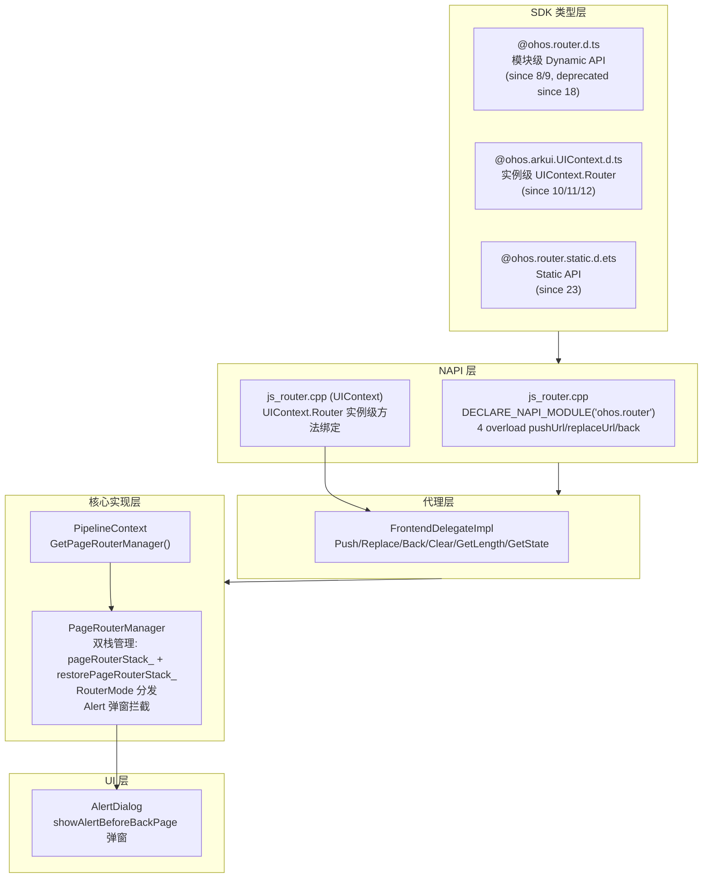

# 路由管理架构设计

> @ohos.router 路由管理（pushUrl/replaceUrl/back/clear/getLength/getStackSize/getState/getParams/showAlertBeforeBackPage/hideAlertBeforeBackPage）的架构约束、双栈管理、RouterMode 分发策略、错误码体系、Alert 弹窗拦截机制、UIContext.Router 与模块级 Router 双路径设计、关键设计决策与 Spec 拆分方向。

## 设计元数据

| Field | Content |
|-------|---------|
| Design ID | DESIGN-Func-04-15-01 |
| 关联需求 | 已有能力补录（无独立 requirement.md） |
| 关联 Epic | 无 |
| 目标 Feature | Feat-01（路由跳转与替换）、Feat-02（路由栈查询与弹窗拦截） |
| 复杂度 | 较高（多入口双栈+错误码+弹窗拦截+UIContext 双路径） |
| 目标版本 | API 8 ~ API 12+（UIContext.Router since 10） |
| Owner | ArkUI SIG |
| 状态 | Baselined（已有实现补录） |

## 需求基线

> 需求基线详见 proposal.md。以下仅列出设计阶段需要额外强调的要点。

| 项 | 补充说明 |
|----|----------|
| 路由跳转与替换 | pushUrl 4 个重载（options/callback/mode+callback/mode+Promise）；replaceUrl 4 个重载（同上）；back 2 个重载（options/index+params）；RouterMode.Standard 常推新实例，RouterMode.Single 栈中同名页移栈顶 |
| 路由栈查询 | getLength 返回 string 最大 32；getStackSize 返回 number 最大 32；getState 返回 RouterState(index/name/path)；getParams 返回 Object；clear 清空栈保留栈顶页 |
| 弹窗拦截 | showAlertBeforeBackPage 设置返回前弹出确认对话框；hideAlertBeforeBackPage 取消弹窗拦截；enableAlertBeforeBackPage（deprecated since 9）/disableAlertBeforeBackPage（deprecated since 9）为旧名称 |
| 废弃 API | push（deprecated since 9，被 pushUrl 替代）；replace（deprecated since 9，被 replaceUrl 替代）；enableAlertBeforeBackPage/disableAlertBeforeBackPage（deprecated since 9） |

## 上下文和现状

### 涉及仓和模块

| 仓库 | 模块 | 当前职责 | 影响类型 | 补充架构说明 |
|------|------|----------|----------|-------------|
| ace_engine | `interfaces/napi/kits/router/js_router.cpp` | NAPI Router 模块绑定，4 overload pushUrl/replaceUrl/back/getLength/getState/getParams/clear/showAlertBeforeBackPage/hideAlertBeforeBackPage/getStackSize | NAPI 入口 | NAPI 层解析参数→调用 FrontendDelegate 代理方法 |
| ace_engine | `frameworks/bridge/declarative_frontend/ng/page_router_manager.h/.cpp` | PageRouterManager 核心实现：双栈 pageRouterStack_ + restorePageRouterStack_，pushUrl/replaceUrl/back RouterMode 分发 | 核心实现 | PageRouterManager 管理 Abililty 内所有页面的路由栈 |
| ace_engine | `frameworks/bridge/declarative_frontend/ng/frontend_delegate_impl.cpp` | FrontendDelegateImpl 代理层：将 NAPI 调用转发到 PageRouterManager | 代理层 | FrontendDelegate 是 NAPI→引擎的中间层 |
| ace_engine | `frameworks/core/pipeline_ng/pipeline_context.cpp` | PipelineContext 获取 PageRouterManager 实例 | 管线层 | PipelineContext::GetPageRouterManager 返回当前 Ability 的路由管理器 |
| ace_engine | `interface/sdk-js/api/@ohos.router.d.ts` | Dynamic SDK 类型定义（35 API 函数） | 公共接口 | 模块级 Router namespace，since 8/9/10/11/12/14/18 |
| ace_engine | `interface/sdk-js/api/@ohos.arkui.UIContext.d.ts` | UIContext.Router 类型定义（28+25 dynamic/static） | 公共接口 | 实例级 Router，since 10/11/12/23 |
| ace_engine | `interface/sdk-js/api/@ohos.router.static.d.ets` | Static SDK 类型定义 | 公共接口 | since 23 static |

### 调用链层级分析

| 层 | 模块 | 职责 | 修改类型 |
|----|------|------|----------|
| SDK 类型层 | `@ohos.router.d.ts` | 模块级 Dynamic API 类型签名 | 无修改（已有实现补录） |
| SDK 类型层 | `@ohos.arkui.UIContext.d.ts` | 实例级 UIContext.Router 类型签名 | 无修改 |
| SDK 类型层 | `@ohos.router.static.d.ets` | Static API 类型签名 | 无修改 |
| NAPI 层 | `js_router.cpp` | 解析 JS 调用参数→调用 FrontendDelegate 方法 | 无修改 |
| FrontendDelegate 层 | `frontend_delegate_impl.cpp` | 代理转发 NAPI 调用到 PageRouterManager | 无修改 |
| PageRouterManager 层 | `page_router_manager.cpp` | 双栈管理、RouterMode 分发、页面创建/销毁/恢复 | 无修改 |
| PipelineContext 层 | `pipeline_context.cpp` | 获取/创建 PageRouterManager 实例 | 无修改 |

检查项：
- [x] 调用链每一层都已覆盖（从最上层到最底层）
- [x] 每层职责边界清晰，无跨层违规调用
- [x] 每层修改类型明确

### 适用架构规则

| Rule ID | 适用原因 | 设计结论 | 验证方式 |
|---------|----------|----------|----------|
| OH-ARCH-LAYERING | NAPI→FrontendDelegate→PageRouterManager→PipelineContext 逐层传递；pushUrl/replaceUrl/back 从 JS 层到引擎核心层单向调用 | 调用方向严格单向向下；NAPI 仅做参数解析和错误码映射，核心路由逻辑在 PageRouterManager | 代码评审/依赖检查 |
| OH-ARCH-SUBSYSTEM | Router 属于 arkui 子系统内部，NAPI 注册为独立模块 | 不涉及跨子系统调用；@ohos.router 为 NAPI 模块级 namespace | 代码评审 |
| OH-ARCH-API-LEVEL | Dynamic API (8+), UIContext.Router (10+), Static API (23+) 三个级别并行；模块级 API @deprecated since 18→迁移至 UIContext.Router | 三个 API 级别并行存在；模块级 router.pushUrl 等标记 deprecated since 18，推荐使用 UIContext.Router 实例级方法 | API 评审/XTS |
| OH-ARCH-ERROR-LOG | Router 定义完整错误码体系：401(参数错误)、100001(内部错误/delegate未获取)、100002(URI错误)、100003(栈溢出)、200002(replace URI错误) | 错误码在 NAPI 层统一抛出 BusinessError；PageRouterManager 内部返回 ErrorCode 由 NAPI 层映射 | 单测/错误码检查 |
| OH-ARCH-COMPONENT-BUILD | Router NAPI 在 libace_ndk.z.so，PageRouterManager 在 ace_core_ng_source_set | 无新增 BUILD.gn target；NAPI 注册 DECLARE_NAPI_MODULE("ohos.router", ...) | 构建验证 |

## 不涉及项承接

| 维度 | 需求阶段结论 | 设计阶段处理方式 | 设计结论 |
|------|---------|-------------|----------|
| 性能 | 展开 | 展开设计 | pushUrl/replaceUrl 页面创建与 JS 引擎加载为主要耗时；back 页面恢复从 restorePageRouterStack_ 出栈较快 |
| 安全与权限 | N/A | 保持 N/A | Router 无权限要求 |
| 兼容性 | 展开 | 展开设计 | 模块级 API deprecated since 18→迁移至 UIContext.Router；getLength deprecated since 23→getStackSize；recoverable since 14；back(index,params) since 12；getStateByIndex/getStateByUrl since 12 |
| IPC/跨进程 | N/A | 保持 N/A | Router 为单 Ability 内栈管理，不跨进程 |
| 构建与部件 | N/A | 保持 N/A | Router 源码在 ace_core_ng_source_set |
| API/SDK | 展开 | 展开设计 | 模块级/实例级/静态级三路径 API 需与 .d.ts 交叉验证 |

## 关键设计决策

| 决策 ID | 问题 | 推荐方案 | 探索过的替代方案 | 取舍理由 | 影响 |
|---------|------|----------|-----------------|----------|------|
| ADR-1 | 双栈管理策略 | pageRouterStack_（活跃栈）+ restorePageRouterStack_（恢复栈）；back 时弹出页推入恢复栈；pushUrl 时恢复栈中同名页先弹出 | 单栈管理 | 单栈在 back 后无法恢复；双栈支持 back→pushUrl→back 恢复上一页 | Feat-01 所有栈操作 AC |
| ADR-2 | RouterMode.Standard vs Single 分发 | Standard: 常推新实例到栈顶；Single: 搜索栈中同名 URI 页→移栈顶（找到）/Standard 推入（未找到） | Single 模式找到同名页时直接 popTo 而非 move | move（PopPageTo指定页+Push原页）比 popTo+push 更高效 | Feat-01 pushUrl/replaceUrl RouterMode AC |
| ADR-3 | 模块级 vs UIContext.Router 双路径 | 模块级 @ohos.router 为全局单例作用于当前 Stage Activity；UIContext.Router 为实例级绑定 UIAbility Context | 仅保留模块级 | 多 Ability 场景需要实例级路由隔离；模块级 deprecated since 18 | 两条路径最终调用同一 PageRouterManager；UIContext.Router 通过 this.getUIContext().getRouter() 获取 |
| ADR-4 | 错误码体系 | 401(参数)、100001(内部/delegate)、100002(URI)、100003(栈溢出32)、200002(replace URI) | 全部使用通用错误码 | 专用错误码便于开发者定位；100003 栈上限 32 页为硬限制 | Feat-01/Feat-02 所有错误码 AC |
| ADR-5 | Alert 弹窗拦截机制 | showAlertBeforeBackPage 设置 alertBeforeBackPage_ 标记；back 执行前检查标记→弹出 AlertDialog 确认→确认后执行 back→取消不执行 | 在 PageRouterManager 内直接调用 back 后再弹窗 | 先弹窗确认再执行更符合用户预期，避免误操作 | Feat-02 showAlert/hideAlert AC |
| ADR-6 | getLength 返回 string vs getStackSize 返回 number | getLength (since 8) 返回 string 为历史遗留；getStackSize (since 23) 返回 number 为新 API | 修改 getLength 返回 number | 修改返回类型破坏兼容性；新增 getStackSize 保持向后兼容 | getLength deprecated since 23→迁移至 getStackSize |
| ADR-7 | 栈上限 32 页 | 硬限制最大 32 页；超过抛出 100003 | 动态限制 | 硬限制保证内存可控；动态限制在低内存设备风险高 | pushUrl/replaceUrl 超栈抛错 |

## 设计骨架

### 骨架范围

| 骨架项 | 目标 | 不包含 | 验证方式 |
|--------|------|--------|----------|
| pushUrl/replaceUrl/back 路由跳转 | 4 overload 分发、RouterMode Standard/Single、双栈操作、错误码 | 命名路由跳转 |
| 栈查询与清空 | getLength/getStackSize/getState/getParams/clear | getStateByIndex/getStateByUrl |
| Alert 弹窗拦截 | showAlertBeforeBackPage/hideAlertBeforeBackPage 弹窗确认机制 | AlertDialog UI 细节 |
| UIContext.Router 双路径 | 模块级 vs 实例级调用路径对比 | NDK C-API Router（未实现） |

### 骨架 Spec 拆分

| Task ID | 目标 | 受影响文件 | AC |
|---------|------|-----------|-----|
| TASK-SKELETON-1 | Feat-01: 路由跳转与替换 spec | Feat-01-router-push-replace-back-spec.md | AC-1.1 ~ AC-1.x |
| TASK-SKELETON-2 | Feat-02: 路由栈查询与弹窗拦截 spec | Feat-02-router-stack-query-alert-spec.md | AC-2.1 ~ AC-2.x |

## 后续 Task 拆分

| Task ID | 目标 | 受影响文件 | 依赖 |
|---------|------|-----------|------|
| TASK-01 | Feat-01 spec（路由跳转与替换） | Feat-01-router-push-replace-back-spec.md | 无 |
| TASK-02 | Feat-02 spec（路由栈查询与弹窗拦截） | Feat-02-router-stack-query-alert-spec.md | TASK-01（shared design baseline） |

## API 签名、Kit 与权限

### 新增 API

> 已有实现补录，无新增 API。以下列出当前全部 Public API 签名供 spec 参考。

| API 签名 | 类型 | Kit | d.ts 位置 | 权限要求 | SysCap |
|----------|------|-----|----------|----------|--------|
| `pushUrl(options: RouterOptions, callback: AsyncCallback<void>): void` | Public (since 9, deprecated since 18) | ArkUI | `@ohos.router.d.ts` | 无 | SystemCapability.ArkUI.ArkUI.Full |
| `pushUrl(options: RouterOptions): Promise<void>` | Public (since 9, deprecated since 18) | ArkUI | `@ohos.router.d.ts` | 无 | 同上 |
| `pushUrl(options: RouterOptions, mode: RouterMode, callback: AsyncCallback<void>): void` | Public (since 9, deprecated since 18) | ArkUI | `@ohos.router.d.ts` | 无 | 同上 |
| `pushUrl(options: RouterOptions, mode: RouterMode): Promise<void>` | Public (since 9, deprecated since 18) | ArkUI | `@ohos.router.d.ts` | 无 | 同上 |
| `replaceUrl(options: RouterOptions, callback: AsyncCallback<void>): void` | Public (since 9, deprecated since 18) | ArkUI | `@ohos.router.d.ts` | 无 | SystemCapability.ArkUI.ArkUI.Lite |
| `replaceUrl(options: RouterOptions): Promise<void>` | Public (since 9, deprecated since 18) | ArkUI | `@ohos.router.d.ts` | 无 | 同上 |
| `replaceUrl(options: RouterOptions, mode: RouterMode, callback: AsyncCallback<void>): void` | Public (since 9, deprecated since 18) | ArkUI | `@ohos.router.d.ts` | 无 | 同上 |
| `replaceUrl(options: RouterOptions, mode: RouterMode): Promise<void>` | Public (since 9, deprecated since 18) | ArkUI | `@ohos.router.d.ts` | 无 | 同上 |
| `back(options?: RouterOptions): void` | Public (since 8, deprecated since 18) | ArkUI | `@ohos.router.d.ts` | 无 | SystemCapability.ArkUI.ArkUI.Full |
| `back(index: number, params?: Object): void` | Public (since 12, deprecated since 18) | ArkUI | `@ohos.router.d.ts` | 无 | 同上 |
| `clear(): void` | Public (since 8, deprecated since 18) | ArkUI | `@ohos.router.d.ts` | 无 | SystemCapability.ArkUI.ArkUI.Full |
| `getLength(): string` | Public (since 8, deprecated since 23→getStackSize) | ArkUI | `@ohos.router.d.ts` | 无 | 同上 |
| `getStackSize(): number` | Public (since 23) | ArkUI | `@ohos.arkui.UIContext.d.ts` | 无 | 同上 |
| `getState(): RouterState` | Public (since 8, deprecated since 18) | ArkUI | `@ohos.router.d.ts` | 无 | 同上 |
| `getStateByIndex(index: number): RouterState | undefined` | Public (since 12, deprecated since 18) | ArkUI | `@ohos.router.d.ts` | 无 | 同上 |
| `getStateByUrl(url: string): Array<RouterState>` | Public (since 12, deprecated since 18) | ArkUI | `@ohos.router.d.ts` | 无 | 同上 |
| `getParams(): Object` | Public (since 8, deprecated since 18) | ArkUI | `@ohos.router.d.ts` | 无 | 同上 |
| `showAlertBeforeBackPage(options: EnableAlertOptions): void` | Public (since 9, deprecated since 18) | ArkUI | `@ohos.router.d.ts` | 无 | 同上 |
| `hideAlertBeforeBackPage(): void` | Public (since 9, deprecated since 18) | ArkUI | `@ohos.router.d.ts` | 无 | 同上 |
| `RouterMode.Standard` | Public (since 9) | ArkUI | `@ohos.router.d.ts` | 无 | 同上 |
| `RouterMode.Single` | Public (since 9) | ArkUI | `@ohos.router.d.ts` | 无 | 同上 |
| `RouterOptions { url: string; params?: Object; recoverable?: boolean; }` | Public (since 8) | ArkUI | `@ohos.router.d.ts` | 无 | SystemCapability.ArkUI.ArkUI.Lite |
| `RouterState { index: number; name: string; path: string; params: Object; }` | Public (since 8, params since 12) | ArkUI | `@ohos.router.d.ts` | 无 | SystemCapability.ArkUI.ArkUI.Full |
| `EnableAlertOptions { message: string; }` | Public (since 8) | ArkUI | `@ohos.router.d.ts` | 无 | 同上 |

### 变更/废弃 API

| 原有 API | 变更类型 | 新 API | 迁移说明 |
|----------|----------|--------|----------|
| `push(options: RouterOptions): void` | 废弃（since 9） | `pushUrl(options: RouterOptions): Promise<void>` | push 无错误码返回，pushUrl 支持 Promise 错误处理 |
| `replace(options: RouterOptions): void` | 废弃（since 9） | `replaceUrl(options: RouterOptions): Promise<void>` | 同上 |
| `enableAlertBeforeBackPage(options)` | 废弃（since 9） | `showAlertBeforeBackPage(options)` | 名称更规范 |
| `disableAlertBeforeBackPage()` | 废弃（since 9） | `hideAlertBeforeBackPage()` | 名称更规范 |
| 模块级 `pushUrl/replaceUrl/back/clear/getLength/getState/getParams/showAlert/hideAlert` | 废弃（since 18） | `UIContext.Router.*` | 模块级 Router 全部标记 deprecated since 18，迁移至 UIContext.Router 实例级方法 |
| `getLength()` | 废弃（since 23） | `getStackSize()` | 返回值类型 string→number |

## 构建系统影响

### BUILD.gn 变更

```
文件路径: interfaces/napi/kits/router/BUILD.gn
变更说明: 无变更（已有实现补录）
```

### bundle.json 变更

无变更。

## 可选设计扩展

### 架构图



### 数据流/控制流

| 步骤 | 调用方 | 被调用方 | 数据/接口 | 说明 |
|------|--------|----------|-----------|------|
| 1 | ArkTS 应用 | router.pushUrl({url, params}) | RouterOptions | 模块级调用 |
| 2 | ArkTS 应用 | this.getUIContext().getRouter().pushUrl({url, params}) | RouterOptions | 实例级调用 |
| 3 | NAPI | JSPushUrl → FrontendDelegate::Push | url, params, RouterMode | 参数解析 |
| 4 | FrontendDelegate | PageRouterManager::PushPage | url, params, RouterMode | 转发 |
| 5 | PageRouterManager | Standard: PushPage → CreatePage → stack.push | url | 新实例 |
| 5' | PageRouterManager | Single: FindPageInStack → PopPageTo + PushPage | url | 移栈顶 |
| 6 | PageRouterManager | 检查 stack.size <= 32 | stack | 超栈抛 100003 |
| 7 | NAPI | JSBack → FrontendDelegate::Back | options/index | 返回 |
| 8 | PageRouterManager | alertBeforeBackPage_ 检查 | bool | 弹窗拦截 |
| 9 | PageRouterManager | PopPage → restoreStack.push | page | 弹出页推入恢复栈 |

### 数据模型设计

**TypeScript (API 层)**:

```typescript
interface RouterOptions {
  url: string;         // since 8
  params?: Object;     // since 8
  recoverable?: boolean; // since 14
}
interface RouterState {
  index: number;   // since 8, 1-based from bottom
  name: string;    // since 8
  path: string;    // since 8
  params: Object;  // since 12
}
interface EnableAlertOptions {
  message: string; // since 8
}
enum RouterMode { Standard, Single } // since 9
interface NamedRouterOptions {
  name: string;      // since 10
  params?: Object;   // since 10
  recoverable?: boolean; // since 14
}
```

**C++ (Framework 层)**:

| 结构体 | 文件 | 说明 |
|--------|------|------|
| PageRouterManager | `page_router_manager.h` | 双栈管理器；pageRouterStack_: std::list<RefPtr<PageInfo>>；restorePageRouterStack_: std::list<RefPtr<PageInfo>> |
| PageInfo | `page_router_manager.h` | 页面信息：url_, name_, path_, params_, index_, recoverable_ |
| FrontendDelegate | `frontend_delegate_impl.h` | 代理接口 |
| JsRouter | `js_router.cpp` | NAPI 绑定类 |

**存储方案**:

| 数据类别 | 存储位置 | 说明 |
|----------|----------|------|
| 活跃路由栈 | PageRouterManager::pageRouterStack_ | std::list<RefPtr<PageInfo>>，当前显示页面栈 |
| 恢复路由栈 | PageRouterManager::restorePageRouterStack_ | std::list<RefPtr<PageInfo>>，back 弹出的页面 |
| 页面参数 | PageInfo::params_ | napi_value，传递到目标页面 |
| recoverable 标记 | PageInfo::recoverable_ | bool，since 14，控制应用销毁后恢复 |
| alert 标记 | PageRouterManager::alertBeforeBackPage_ | bool + EnableAlertOptions message |

### 详细设计

#### pushUrl 4-overload 分发

`js_router.cpp` 中 `JSPushUrl` 根据参数数量分发:

| 参数数量 | 重载 | 调用路径 |
|----------|------|----------|
| 1 (options) | pushUrl(options): Promise<void> | FrontendDelegate::Push(url, params, RouterMode::STANDARD) |
| 2 (options, callback) | pushUrl(options, callback): void | FrontendDelegate::Push(url, params, RouterMode::STANDARD) + callback |
| 2 (options, mode) | pushUrl(options, mode): Promise<void> | FrontendDelegate::Push(url, params, mode) |
| 3 (options, mode, callback) | pushUrl(options, mode, callback): void | FrontendDelegate::Push(url, params, mode) + callback |

源码: `js_router.cpp:JSPushUrl` (`interfaces/napi/kits/router/js_router.cpp`)

#### RouterMode.Standard vs Single

`PageRouterManager::PushPage` (`page_router_manager.cpp`):

- **Standard**: 常推新实例 → `pageRouterStack_.push_back(pageInfo)`，不检查栈中同名页
- **Single**: 搜索栈中同名 URI → 找到时 `PopPageTo(index)` 移除该页上方所有页 + `PushPage(url)` 重新推入（相当于移栈顶）；未找到时按 Standard 模式推入

栈上限检查: `pageRouterStack_.size() >= MAX_ROUTER_STACK_SIZE (32)` → 抛出错误码 100003

#### replaceUrl 行为

`PageRouterManager::ReplacePage`:

1. 弹出栈顶当前页（不推入恢复栈，当前页直接销毁）
2. 推入新页到栈顶
3. RouterMode.Single 同理：先搜索栈中同名页

源码: `page_router_manager.cpp:ReplacePage`

#### back 行为

`PageRouterManager::PopPage`:

- **back(options)**: options.url 指定返回目标页；无 options 返回上一页
- **back(index, params)**: since 12，按栈索引返回到指定页
- 弹出页推入 `restorePageRouterStack_`（非销毁）
- 若栈仅剩 1 页，back 不执行（防止清空栈）

源码: `page_router_manager.cpp:PopPage`

#### Alert 弹窗拦截

`showAlertBeforeBackPage` 设置 `alertBeforeBackPage_ = true` + 存储 `alertBeforeBackPageMessage_`。

`PopPage` 执行前检查:
1. `alertBeforeBackPage_ == true` → 调用 `AlertDialog` 显示确认对话框
2. 用户确认 → 执行 back
3. 用户取消 → 不执行 back

`hideAlertBeforeBackPage` 设置 `alertBeforeBackPage_ = false`。

源码: `page_router_manager.cpp:PopPage` + `js_router.cpp:ShowAlertBeforeBackPage`

#### getLength vs getStackSize

- `getLength()` (since 8): 返回 `std::to_string(pageRouterStack_.size())` → string 类型
- `getStackSize()` (since 23): 返回 `pageRouterStack_.size()` → number 类型
- 最大值均为 32

#### getState / getParams

- `getState()`: 返回当前栈顶页的 RouterState(index, name, path, params)
- `getParams()`: 返回当前栈顶页的 params Object
- `getStateByIndex(index)` (since 12): 按索引返回指定页的 RouterState
- `getStateByUrl(url)` (since 12): 按 URL 返回所有匹配页的 RouterState 数组

#### UIContext.Router 双路径

模块级 `@ohos.router` 和实例级 `UIContext.Router` 最终调用同一 `PageRouterManager`:

| 调用路径 | NAPI 入口 | 代理层 | 核心层 |
|----------|-----------|--------|--------|
| 模块级 | DECLARE_NAPI_MODULE("ohos.router") → JsRouter::Push | FrontendDelegate::Push | PageRouterManager::PushPage |
| 实例级 | UIContext::getRouter() → JsRouter::Push (绑定到 Ability Context) | 同上 | 同上 |

区别: 模块级作用于当前 Stage Activity 的全局路由栈；实例级绑定到特定 UIAbility Context，多 Ability 场景下隔离路由栈。

#### recoverable 机制 (since 14)

`RouterOptions.recoverable` 控制应用销毁后页面栈恢复:

- `recoverable = true` (默认): 页面推入时标记为可恢复；应用销毁后恢复时仅恢复栈顶页，其余页在 back 时逐步恢复
- `recoverable = false`: 页面不标记可恢复；应用销毁后不恢复该页

源码: `PageRouterManager::PushPage` → `pageInfo->SetRecoverable(recoverable)` + `RestorePageStack`

## 风险和开放问题

| 项 | 类型 | 影响 | 处理方式 | Owner |
|----|------|------|----------|-------|
| 模块级 Router API deprecated since 18 但大量存量代码使用 | API | 高 | spec 注明迁移指引；UIContext.Router 为推荐路径 | ArkUI SIG |
| getLength 返回 string 为历史遗留，开发者需转型 | API | 中 | 新增 getStackSize (since 23) 返回 number；spec 注明差异 | ArkUI SIG |
| 栈上限 32 为硬限制，复杂应用可能溢栈 | 限制 | 中 | spec 注明硬限制；推荐使用 Navigation 替代深层路由 | ArkUI SIG |
| alertBeforeBackPage 仅作用于模块级/实例级 back，不作用于 Navigation back | 行为 | 低 | spec 注明仅覆盖 Router.back 场景 | ArkUI SIG |
| Named Router route_map.json 仅 FA 模型支持，Stage 模型需 module.json5 routerMap | 配置 | 低 | 命名路由 spec 单独覆盖（04-15-03） | ArkUI SIG |
| NDK C-API 无 Router 暴露 | API | 低 | spec 标注"NDK 未实现" | ArkUI SIG |

## 设计审批

- [x] 需求基线已确认，设计覆盖 P0/P1 AC
- [x] 不涉及项已承接，N/A 和展开项都有结论
- [x] 涉及仓和模块职责清楚
- [x] 调用链层级分析完整，每层覆盖到位
- [x] 适用架构规则已识别并形成设计结论
- [x] 分层和子系统边界合规
- [x] API 变更有签名、权限、错误码和兼容性说明
- [x] BUILD.gn/bundle.json 影响明确
- [x] 设计输出和后续 Task 拆分明确
- [x] 关键设计决策有理由和影响说明
- [x] 风险和开放问题有 Owner

**结论:** 通过（已有实现补录）
