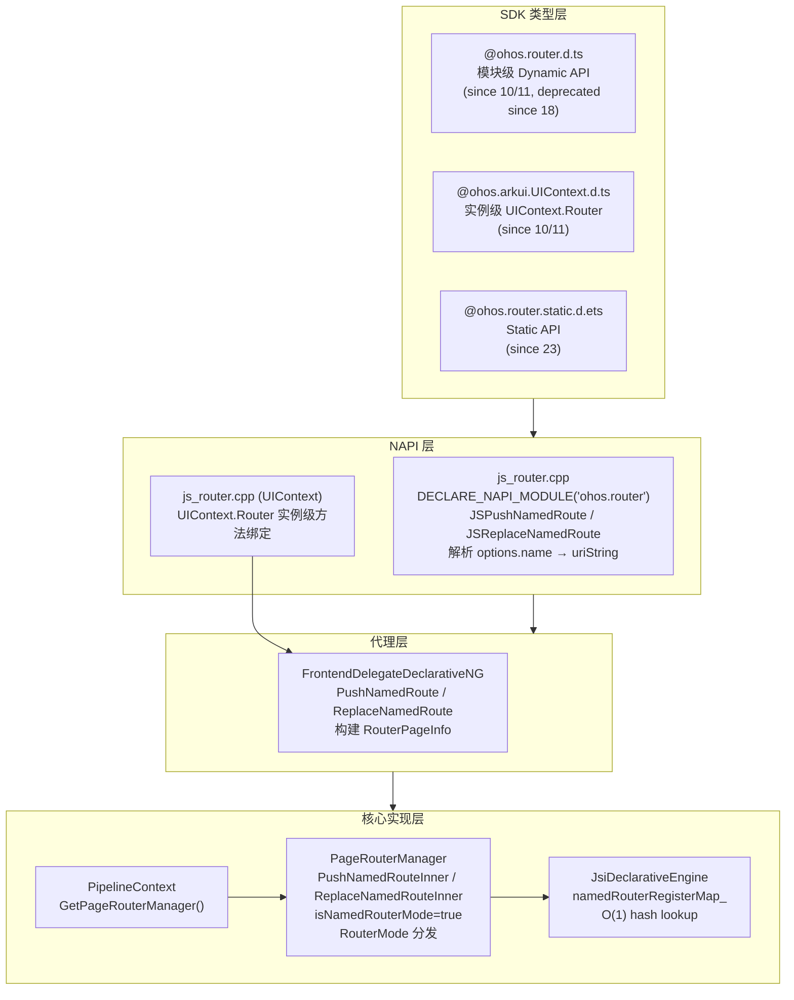

# 命名路由架构设计

> @ohos.router 命名路由（pushNamedRoute/replaceNamedRoute/NamedRouterOptions）的架构约束、RouteMap 查找策略、RouterMode 分发复用、错误码体系、UIContext.Router 与模块级 Router 双路径设计、关键设计决策与 Spec 拆分方向。

## 设计元数据

| Field | Content |
|-------|---------|
| Design ID | DESIGN-Func-04-15-02 |
| 关联需求 | 已有能力补录（无独立 requirement.md） |
| 关联 Epic | 无 |
| 目标 Feature | Feat-01（命名路由跳转与替换） |
| 复杂度 | 标准（命名路由→RouteMap查找+RouterMode分发+UIContext双路径） |
| 目标版本 | API 10 ~ API 12+（UIContext.Router since 10/11，recoverable since 14） |
| Owner | ArkUI SIG |
| 状态 | Baselined（已有实现补录） |

## 需求基线

> 需求基线详见 proposal.md。以下仅列出设计阶段需要额外强调的要点。

| 项 | 补充说明 |
|----|----------|
| 命名路由跳转 | pushNamedRoute 4 个重载（options+callback/options+Promise/options+mode+callback/options+mode+Promise）；NamedRouterOptions.name 指定命名路由名称 |
| 命名路由替换 | replaceNamedRoute 4 个重载（同上）；替换当前栈顶页并销毁 |
| RouteMap 查找 | name→namedRouterRegisterMap_（std::unordered_map<string, NamedRouterProperty>）查找；NamedRouterProperty 包含 bundleName/moduleName/pagePath/ohmUrl |
| RouterMode 分发 | pushNamedRoute/replaceNamedRoute 复用 RouterMode.Standard/Single，行为与 pushUrl/replaceUrl 一致 |
| recoverable | NamedRouterOptions.recoverable since 14，语义与 RouterOptions.recoverable 一致 |
| 废弃 API | 模块级 pushNamedRoute/replaceNamedRoute @deprecated since 18→迁移至 UIContext.Router |

## 上下文和现状

### 涉及仓和模块

| 仓库 | 模块 | 当前职责 | 影响类型 | 补充架构说明 |
|------|------|----------|----------|-------------|
| ace_engine | `interfaces/napi/kits/router/js_router.cpp` | NAPI Router 模块绑定，JSPushNamedRoute/JSReplaceNamedRoute 解析 NamedRouterOptions.name → FrontendDelegate::PushNamedRoute/ReplaceNamedRoute | NAPI 入口 | NAPI 层解析 options.name→uriString，与 pushUrl 解析 options.url→uriString 差异仅在 key 名（"name" vs "url"） |
| ace_engine | `frameworks/bridge/declarative_frontend/ng/page_router_manager.h/.cpp` | PageRouterManager 核心实现：PushNamedRoute/ReplaceNamedRoute→RouteMap查找→PushPage/ReplacePage RouterMode 分发 | 核心实现 | PushNamedRouteInner 标记 isNamedRouterMode=true 后调用 LoadPage；ReplaceNamedRouteInner 标记 isNamedRouterMode=true 后调用 DealReplacePage |
| ace_engine | `frameworks/bridge/declarative_frontend/ng/frontend_delegate_declarative_ng.cpp` | FrontendDelegateDeclarativeNG 代理层：PushNamedRoute/ReplaceNamedRoute 构建 RouterPageInfo→转发到 PageRouterManager | 代理层 | FrontendDelegate 构建 RouterPageInfo(url=name,params,recoverable,routerMode,errorCallback) |
| ace_engine | `frameworks/bridge/declarative_frontend/engine/jsi/jsi_declarative_engine.h/.cpp` | JsiDeclarativeEngine 命名路由注册与查找：namedRouterRegisterMap_ 存储 NamedRouterProperty(name→{pageGenerator,bundleName,moduleName,pagePath,ohmUrl}) | 路由注册与查找 | namedRouterRegisterMap_ 为 std::unordered_map，O(1) 查找；RegisterNamedRouter 注册，LoadNamedRouterSource 加载并执行 pageGenerator |
| ace_engine | `frameworks/core/pipeline_ng/pipeline_context.cpp` | PipelineContext 获取 PageRouterManager 实例 | 管线层 | PipelineContext::GetPageRouterManager 返回当前 Ability 的路由管理器 |
| ace_engine | `interface/sdk-js/api/@ohos.router.d.ts` | Dynamic SDK 类型定义（NamedRouterOptions + 8 API 函数） | 公共接口 | 模块级 Router namespace，since 10/11/14/18 |
| ace_engine | `interface/sdk-js/api/@ohos.arkui.UIContext.d.ts` | UIContext.Router 类型定义（8 dynamic named route API） | 公共接口 | 实例级 Router，since 10/11 |
| ace_engine | `interface/sdk-js/api/@ohos.router.static.d.ets` | Static SDK 类型定义（NamedRouterOptions + RouterMode） | 公共接口 | since 23 static |

### 调用链层级分析

| 层 | 模块 | 职责 | 修改类型 |
|----|------|------|----------|
| SDK 类型层 | `@ohos.router.d.ts` | 模块级 Dynamic API 类型签名（NamedRouterOptions, pushNamedRoute 4 overload, replaceNamedRoute 4 overload） | 无修改（已有实现补录） |
| SDK 类型层 | `@ohos.arkui.UIContext.d.ts` | 实例级 UIContext.Router 类型签名（同名 8 overload） | 无修改 |
| SDK 类型层 | `@ohos.router.static.d.ets` | Static API 类型签名（NamedRouterOptions, RouterMode） | 无修改 |
| NAPI 层 | `js_router.cpp` | 解析 JS 调用参数（options.name→uriString）→调用 FrontendDelegate::PushNamedRoute/ReplaceNamedRoute | 无修改 |
| FrontendDelegate 层 | `frontend_delegate_declarative_ng.cpp` | 构建 RouterPageInfo→转发到 PageRouterManager::PushNamedRoute/ReplaceNamedRoute | 无修改 |
| PageRouterManager 层 | `page_router_manager.cpp` | PushNamedRouteInner/ReplaceNamedRouteInner：标记 isNamedRouterMode=true→RouterMode 分发→LoadPage/DealReplacePage | 无修改 |
| RouteMap 注册层 | `jsi_declarative_engine.cpp` | namedRouterRegisterMap_ 注册与查找；LoadNamedRouterSource 加载页面生成器 | 无修改 |
| PipelineContext 层 | `pipeline_context.cpp` | 获取/创建 PageRouterManager 实例 | 无修改 |

检查项：
- [x] 调用链每一层都已覆盖（从最上层到最底层）
- [x] 每层职责边界清晰，无跨层违规调用
- [x] 每层修改类型明确

### 适用架构规则

| Rule ID | 适用原因 | 设计结论 | 验证方式 |
|---------|----------|----------|----------|
| OH-ARCH-LAYERING | NAPI→FrontendDelegate→PageRouterManager→RouteMap查找→PushPage/ReplacePage 逐层传递；pushNamedRoute/replaceNamedRoute 从 JS 层到引擎核心层单向调用 | 调用方向严格单向向下；NAPI 仅做参数解析（name→uriString）和错误码映射，RouteMap 查找在 JsiDeclarativeEngine 层，核心路由逻辑在 PageRouterManager | 代码评审/依赖检查 |
| OH-ARCH-SUBSYSTEM | Named Router 属于 arkui 子系统内部，NAPI 注册在同一 ohos.router 模块 | 不涉及跨子系统调用；@ohos.router 为 NAPI 模块级 namespace | 代码评审 |
| OH-ARCH-API-LEVEL | Dynamic API (10+), UIContext.Router (10+), Static API (23+) 三个级别并行；模块级 API @deprecated since 18→迁移至 UIContext.Router | 三个 API 级别并行存在；模块级 pushNamedRoute/replaceNamedRoute 标记 deprecated since 18，推荐使用 UIContext.Router 实例级方法 | API 评审/XTS |
| OH-ARCH-ERROR-LOG | Named Router 定义错误码体系：401(参数错误)、100001(内部错误/delegate未获取)、100003(栈溢出-pushNamedRoute)、100004(命名路由未找到) | 错误码在 NAPI 层统一抛出 BusinessError；100004 为命名路由专有错误码（RouteMap 查找失败）；pushNamedRoute 错误码: 401/100001/100003/100004；replaceNamedRoute 错误码: 401/100001/100004 | 单测/错误码检查 |
| OH-ARCH-COMPONENT-BUILD | Router NAPI 在 libace_ndk.z.so，PageRouterManager 在 ace_core_ng_source_set，JsiDeclarativeEngine 在 arkts_frontend | 无新增 BUILD.gn target；NAPI 注册 DECLARE_NAPI_MODULE("ohos.router", ...) | 构建验证 |

## 不涉及项承接

| 维度 | 需求阶段结论 | 设计阶段处理方式 | 设计结论 |
|------|---------|-------------|----------|
| 性能 | 展开 | 展开设计 | RouteMap lookup 为 O(1) hash map 查找（namedRouterRegisterMap_），不构成性能瓶颈；页面加载为主要耗时 |
| 安全与权限 | N/A | 保持 N/A | Named Router 无权限要求 |
| 兼容性 | 展开 | 展开设计 | 模块级 pushNamedRoute/replaceNamedRoute deprecated since 18→迁移至 UIContext.Router；recoverable since 14 |
| IPC/跨进程 | N/A | 保持 N/A | Named Router 为单 Ability 内栈管理，不跨进程 |
| 构建与部件 | N/A | 保持 N/A | Named Router 源码在 ace_core_ng_source_set + arkts_frontend |
| API/SDK | 展开 | 展开设计 | 8 pushNamedRoute/replaceNamedRoute API 签名（模块级 8 + UIContext 8）需与 .d.ts 交叉验证；Static API NamedRouterOptions since 23 |

## 关键设计决策

| 决策 ID | 问题 | 推荐方案 | 探索过的替代方案 | 取舍理由 | 影响 |
|---------|------|----------|-----------------|----------|------|
| ADR-1 | RouteMap 查找策略 | Stage 模型：module.json5 routerMap 配置→JS 引擎解析为 namedRouterRegisterMap_（std::unordered_map<string, NamedRouterProperty>）O(1)查找；FA 模型：route_map.json 配置→同上 | 每次查找遍历 JSON 配置 | hash map 查找性能优于遍历；namedRouterRegisterMap_ 在 RegisterNamedRouter 时填充 | Feat-01 pushNamedRoute/replaceNamedRoute RouteMap AC |
| ADR-2 | Named route 复用 RouterMode 分发 | pushNamedRoute/replaceNamedRoute 与 pushUrl/replaceUrl 使用相同 RouterMode.Standard/Single 分发逻辑 | 为 named route 实现独立分发 | 两种路由模式语义一致（Standard 常推/Single 移栈顶），复用降低维护成本 | PushNamedRouteInner 中 RouterMode::SINGLE 分发与 PushPageInner 一致 |
| ADR-3 | 模块级 vs UIContext.Router 双路径 | 模块级 @ohos.router 为全局单例；UIContext.Router 为实例级绑定 UIAbility Context；两者最终调用同一 PageRouterManager | 仅保留模块级 | 多 Ability 场景需要实例级路由隔离；模块级 deprecated since 18 | 两条路径最终调用同一 PageRouterManager；UIContext.Router 通过 this.getUIContext().getRouter() 获取 |
| ADR-4 | 错误码 100004 专用于命名路由未找到 | 当 namedRouterRegisterMap_.find(name) 返回 end() 时抛出 100004；不与 100002(URI错误) 混用 | 使用通用 100002 URI错误 | 100004 明确区分"命名路由未注册"与"URI路径错误"场景，便于开发者定位 | pushNamedRoute/replaceNamedRoute 均可抛出 100004；pushUrl/replaceUrl 不抛此错误码 |
| ADR-5 | recoverable 标记语义与 RouterOptions 一致 | NamedRouterOptions.recoverable (since 14) 与 RouterOptions.recoverable (since 14) 共享同一 PageInfo::SetRecoverable 逻辑 | 为 named route 定义独立 recoverable 语义 | 两种路由的页面恢复需求一致；共享实现降低维护成本 | recoverable=true 默认值；页面推入时标记；应用销毁后恢复仅恢复栈顶页 |

## 设计骨架

### 骨架范围

| 骨架项 | 目标 | 不包含 | 验证方式 |
|--------|------|--------|----------|
| 命名路由跳转与替换 | pushNamedRoute 4 overload 分发、replaceNamedRoute 4 overload 分发、RouteMap 查找、RouterMode Standard/Single、isNamedRouterMode 标记、错误码 | 常规路由跳转（pushUrl/replaceUrl） |
| RouteMap 注册与查找 | namedRouterRegisterMap_ 注册/查找/恢复、NamedRouterProperty 结构体 | Navigation RouteMap |
| UIContext.Router 双路径 | 模块级 vs 实例级命名路由调用路径对比 | NDK C-API Named Router（未实现） |

### 骨架 Spec 拆分

| Task ID | 目标 | 受影响文件 | AC |
|---------|------|-----------|-----|
| TASK-SKELETON-1 | Feat-01: 命名路由跳转与替换 spec | Feat-01-named-router-push-replace-spec.md | AC-1.1 ~ AC-1.x |

## 后续 Task 拆分

| Task ID | 目标 | 受影响文件 | 依赖 |
|---------|------|-----------|------|
| TASK-01 | Feat-01 spec（命名路由跳转与替换） | Feat-01-named-router-push-replace-spec.md | 04-15-01（shared design baseline on RouterMode/双栈/error codes） |

## API 签名、Kit 与权限

### 新增 API

> 已有实现补录，无新增 API。以下列出当前全部 Public API 签名供 spec 参考。

| API 签名 | 类型 | Kit | d.ts 位置 | 权限要求 | SysCap |
|----------|------|-----|----------|----------|--------|
| `pushNamedRoute(options: NamedRouterOptions, callback: AsyncCallback<void>): void` | Public (since 10, deprecated since 18) | ArkUI | `@ohos.router.d.ts` | 无 | SystemCapability.ArkUI.ArkUI.Full |
| `pushNamedRoute(options: NamedRouterOptions): Promise<void>` | Public (since 10, deprecated since 18) | ArkUI | `@ohos.router.d.ts` | 无 | 同上 |
| `pushNamedRoute(options: NamedRouterOptions, mode: RouterMode, callback: AsyncCallback<void>): void` | Public (since 10, deprecated since 18) | ArkUI | `@ohos.router.d.ts` | 无 | 同上 |
| `pushNamedRoute(options: NamedRouterOptions, mode: RouterMode): Promise<void>` | Public (since 10, deprecated since 18) | ArkUI | `@ohos.router.d.ts` | 无 | 同上 |
| `replaceNamedRoute(options: NamedRouterOptions, callback: AsyncCallback<void>): void` | Public (since 10, deprecated since 18) | ArkUI | `@ohos.router.d.ts` | 无 | SystemCapability.ArkUI.ArkUI.Full |
| `replaceNamedRoute(options: NamedRouterOptions): Promise<void>` | Public (since 10, deprecated since 18) | ArkUI | `@ohos.router.d.ts` | 无 | 同上 |
| `replaceNamedRoute(options: NamedRouterOptions, mode: RouterMode, callback: AsyncCallback<void>): void` | Public (since 10, deprecated since 18) | ArkUI | `@ohos.router.d.ts` | 无 | 同上 |
| `replaceNamedRoute(options: NamedRouterOptions, mode: RouterMode): Promise<void>` | Public (since 10, deprecated since 18) | ArkUI | `@ohos.router.d.ts` | 无 | 同上 |
| `NamedRouterOptions { name: string; params?: Object; recoverable?: boolean; }` | Public (since 10, recoverable since 14) | ArkUI | `@ohos.router.d.ts` | 无 | SystemCapability.ArkUI.ArkUI.Full |
| `RouterMode.Standard` | Public (since 9) | ArkUI | `@ohos.router.d.ts` | 无 | 同上（与常规路由共享） |
| `RouterMode.Single` | Public (since 9) | ArkUI | `@ohos.router.d.ts` | 无 | 同上（与常规路由共享） |

> UIContext.Router 实例级同名 8 个 API 签名见 `@ohos.arkui.UIContext.d.ts` (since 10/11 dynamic)。
> Static API NamedRouterOptions 见 `@ohos.router.static.d.ets` (since 23 static)。

### 变更/废弃 API

| 原有 API | 变更类型 | 新 API | 迁移说明 |
|----------|----------|--------|----------|
| 模块级 `pushNamedRoute/replaceNamedRoute` | 废弃（since 18） | `UIContext.Router.pushNamedRoute/replaceNamedRoute` | 模块级 Named Router 标记 deprecated since 18，迁移至 UIContext.Router 实例级方法 |

## 构建系统影响

### BUILD.gn 变更

```
文件路径: interfaces/napi/kits/router/BUILD.gn
变更说明: 无变更（已有实现补录）
```

### bundle.json 变更

无变更。

## 可选设计扩展

### 架构图



### 数据流/控制流

| 步骤 | 调用方 | 被调用方 | 数据/接口 | 说明 |
|------|--------|----------|-----------|------|
| 1 | ArkTS 应用 | router.pushNamedRoute({name, params}) | NamedRouterOptions | 模块级调用 |
| 2 | ArkTS 应用 | this.getUIContext().getRouter().pushNamedRoute({name, params}) | NamedRouterOptions | 实例级调用 |
| 3 | NAPI | JSPushNamedRoute → CommonRouterWithCallbackProcess(key="name") | name→uriString, params, RouterMode | 参数解析（name 而非 url） |
| 4 | FrontendDelegate | FrontendDelegate::PushNamedRoute | uriString=name, paramsString, recoverable, routerMode, errorCallback | 构建 RouterPageInfo |
| 5 | PageRouterManager | PushNamedRouteInner → isNamedRouterMode=true | RouterPageInfo | 标记命名路由模式 |
| 6 | PageRouterManager | RouterMode::SINGLE → FindPageInStackByRouteName | name | 搜索栈中同名页 |
| 6' | PageRouterManager | RouterMode::STANDARD → LoadPage | name | 新实例 |
| 7 | JsiDeclarativeEngine | namedRouterRegisterMap_.find(name) | NamedRouterProperty | O(1) hash 查找 |
| 8 | JsiDeclarativeEngine | LoadNamedRouterSource → pageGenerator.Call() | pagePath/ohmUrl | 加载命名路由页面 |
| 9 | PageRouterManager | 检查 stack.size <= 32 | stack | 超栈抛 100003 |
| 10 | JsiDeclarativeEngine | name 未找到 → LOGW "named route not found" | — | 抛出 100004 |
| 11 | PageRouterManager | ReplaceNamedRouteInner → DealReplacePage | isNamedRouterMode=true | 替换当前页 |

### 数据模型设计

**TypeScript (API 层)**:

```typescript
interface NamedRouterOptions {
  name: string;           // since 10
  params?: Object;        // since 10
  recoverable?: boolean;  // since 14
}
enum RouterMode { Standard, Single }  // since 9, 与常规路由共享
```

**C++ (Framework 层)**:

| 结构体 | 文件 | 说明 |
|--------|------|------|
| NamedRouterProperty | `jsi_declarative_engine.h` | 命名路由属性：pageGenerator(panda::Global<FunctionRef>), bundleName, moduleName, pagePath, ohmUrl, newUrl |
| namedRouterRegisterMap_ | `jsi_declarative_engine.cpp` | std::unordered_map<string, NamedRouterProperty>，O(1) 查找 |
| RouterPageInfo | `page_router_manager.h` | 路由页面信息：url(name), params, recoverable, routerMode, isNamedRouterMode, errorCallback |
| PageRouterManager | `page_router_manager.h` | 双栈管理器（同 04-15-01）；PushNamedRouteInner/ReplaceNamedRouteInner 标记 isNamedRouterMode |

**存储方案**:

| 数据类别 | 存储位置 | 说明 |
|----------|----------|------|
| 命名路由注册表 | JsiDeclarativeEngine::namedRouterRegisterMap_ | std::unordered_map<string, NamedRouterProperty>，RegisterNamedRouter 填充 |
| 命名路由恢复信息 | GetNamedRouterInfo() 序列化 | JSON 数组：[{name,bundleName,moduleName,pagePath,ohmUrl}] |
| 页面参数 | RouterPageInfo::params | napi_value/JSON string，传递到目标页面 |
| recoverable 标记 | PageInfo::recoverable_ | bool，since 14，与 RouterOptions.recoverable 共享 |
| isNamedRouterMode | RouterPageInfo::isNamedRouterMode | bool，区分命名路由与常规路由页面 |

### 详细设计

#### pushNamedRoute 4-overload 分发

`js_router.cpp` 中 `JSPushNamedRoute` 使用 `CommonRouterWithCallbackProcess(env, info, callback, "name")`:

| 参数数量 | 重载 | 调用路径 |
|----------|------|----------|
| 1 (options) | pushNamedRoute(options): Promise<void> | FrontendDelegate::PushNamedRoute(name, params, recoverable, errorCallback, RouterMode::STANDARD) |
| 2 (options, callback) | pushNamedRoute(options, callback): void | 同上 + callback |
| 2 (options, mode) | pushNamedRoute(options, mode): Promise<void> | FrontendDelegate::PushNamedRoute(name, params, recoverable, errorCallback, mode) |
| 3 (options, mode, callback) | pushNamedRoute(options, mode, callback): void | 同上 + callback |

关键差异：pushNamedRoute 解析 `options.name`（而非 pushUrl 的 `options.url`），key 名为 `"name"`。

源码: `js_router.cpp:JSPushNamedRoute` (`interfaces/napi/kits/router/js_router.cpp:445-458`)

#### replaceNamedRoute 4-overload 分发

`js_router.cpp` 中 `JSReplaceNamedRoute` 同理使用 `CommonRouterWithCallbackProcess(env, info, callback, "name")`:

| 参数数量 | 重载 | 调用路径 |
|----------|------|----------|
| 1 (options) | replaceNamedRoute(options): Promise<void> | FrontendDelegate::ReplaceNamedRoute(name, params, recoverable, errorCallback, RouterMode::STANDARD) |
| 2 (options, callback) | replaceNamedRoute(options, callback): void | 同上 + callback |
| 2 (options, mode) | replaceNamedRoute(options, mode): Promise<void> | FrontendDelegate::ReplaceNamedRoute(name, params, recoverable, errorCallback, mode) |
| 3 (options, mode, callback) | replaceNamedRoute(options, mode, callback): void | 同上 + callback |

源码: `js_router.cpp:JSReplaceNamedRoute` (`interfaces/napi/kits/router/js_router.cpp:461-474`)

#### RouteMap 查找策略

命名路由名称查找流程:

1. **注册阶段**: `JsiDeclarativeEngine::RegisterNamedRouter` 将 NamedRouterProperty 插入 `namedRouterRegisterMap_`
2. **查找阶段**: `JsiDeclarativeEngine::LoadNamedRouterSource(name, isNamedRoute=true)` 查找 `namedRouterRegisterMap_.find(name)`
3. **查找失败**: `isNamedRoute && iter == end()` → 抛出错误码 100004 "named route not found"
4. **查找成功**: 调用 `iter->second.pageGenerator->Call(vm, global, argv, 0)` 生成页面

NamedRouterProperty 结构体字段:

| 字段 | 类型 | 说明 |
|------|------|------|
| pageGenerator | panda::Global<panda::FunctionRef> | 页面生成器函数引用 |
| bundleName | std::string | 所属 bundle 名称 |
| moduleName | std::string | 所属 module 名称 |
| pagePath | std::string | 页面路径 |
| ohmUrl | std::string | OHM URL（HSP 场景） |
| newUrl | std::string | 新 URL 格式 |

源码: `jsi_declarative_engine.cpp:2416-2509` (`frameworks/bridge/declarative_frontend/engine/jsi/jsi_declarative_engine.cpp`)

配置来源:
- **Stage 模型**: `module.json5` 的 `routerMap` 字段
- **FA 模型**: `route_map.json` 配置文件

#### PushNamedRouteInner RouterMode 分发

`PageRouterManager::PushNamedRouteInner` (`page_router_manager.cpp:292-340`):

1. 标记 `isNamedRouterMode = true`
2. RouterMode::SINGLE: `FindPageInStackByRouteName(name)` → 找到时 `MovePageToFront` + `FireOnNewParam(params)` → 恢复栈查找 → 未找到时 Standard 推入
3. RouterMode::STANDARD: `LoadPage(GenerateNextPageId(), info, true, true, true)` 直接推入
4. 栈上限检查: `GetStackSize() >= MAX_ROUTER_STACK_SIZE (32)` → 抛出 100003

#### ReplaceNamedRouteInner 行为

`PageRouterManager::ReplaceNamedRouteInner` (`page_router_manager.cpp:379-401`):

1. 标记 `isNamedRouterMode = true`
2. 调用 `DealReplacePage(info)` → 弹出栈顶当前页（销毁）→ 推入新页
3. RouterMode::Single 同理搜索栈中同名页

#### 错误码体系

| 操作 | 错误码 | 含义 | 触发条件 |
|------|--------|------|----------|
| pushNamedRoute | 401 | 参数错误 | name 为空/类型错误 |
| pushNamedRoute | 100001 | 内部错误 | delegate 未获取 |
| pushNamedRoute | 100003 | 栈溢出 | stack.size >= 32 |
| pushNamedRoute | 100004 | 命名路由未找到 | namedRouterRegisterMap_.find(name) == end() |
| replaceNamedRoute | 401 | 参数错误 | name 为空/类型错误 |
| replaceNamedRoute | 100001 | 内部错误/UI上下文未找到 | delegate 未获取 |
| replaceNamedRoute | 100004 | 命名路由未找到 | namedRouterRegisterMap_.find(name) == end() |

> 注意: pushNamedRoute 有 100003（栈溢出），replaceNamedRoute 无 100003（替换不增加栈大小）。

#### UIContext.Router 双路径

模块级 `@ohos.router` 和实例级 `UIContext.Router` 最终调用同一 `PageRouterManager`:

| 调用路径 | NAPI 入口 | 代理层 | 核心层 |
|----------|-----------|--------|--------|
| 模块级 | DECLARE_NAPI_MODULE("ohos.router") → JSPushNamedRoute | FrontendDelegate::PushNamedRoute | PageRouterManager::PushNamedRoute |
| 实例级 | UIContext::getRouter() → JSPushNamedRoute (绑定到 Ability Context) | 同上 | 同上 |

区别: 模块级作用于当前 Stage Activity 的全局路由栈；实例级绑定到特定 UIAbility Context，多 Ability 场景下隔离路由栈。

#### recoverable 机制 (since 14)

`NamedRouterOptions.recoverable` 控制应用销毁后页面栈恢复:

- `recoverable = true` (默认): 页面推入时标记为可恢复；应用销毁后恢复时仅恢复栈顶页，其余页在 back 时逐步恢复
- `recoverable = false`: 页面不标记可恢复；应用销毁后不恢复该页

语义与 `RouterOptions.recoverable` (since 14) 一致，共享 `PageInfo::SetRecoverable` 实现。

源码: `PageRouterManager::PushNamedRouteInner` → `RouterPageInfo.recoverable` → `PageInfo::SetRecoverable`

## 风险和开放问题

| 项 | 类型 | 影响 | 处理方式 | Owner |
|----|------|------|----------|-------|
| 模块级 Named Router API deprecated since 18 但存量代码使用 | API | 高 | spec 注明迁移指引；UIContext.Router 为推荐路径 | ArkUI SIG |
| 100004 仅在 namedRouterRegisterMap_ 查找失败时抛出，不覆盖 pageGenerator 为空场景 | 行为 | 中 | pageGenerator 为空时返回 false 不创建页面但无回调错误码；spec 注明行为差异 | ArkUI SIG |
| Named Router 仅 Stage 模型支持（@stagemodelonly），FA 模型 route_map.json 为旧路径 | 配置 | 低 | FA 模型已标记为过渡方案；spec 注明仅 Stage 模型 | ArkUI SIG |
| Static API NamedRouterOptions since 23 但无 pushNamedRoute/replaceNamedRoute static 函数 | API | 低 | Static Router 命名路由函数未实现；spec 标注"Static API 命名路由跳转/替换未实现" | ArkUI SIG |
| NDK C-API 无 Named Router 暴露 | API | 低 | spec 标注"NDK 未实现" | ArkUI SIG |

## 设计审批

- [x] 需求基线已确认，设计覆盖 P0/P1 AC
- [x] 不涉及项已承接，N/A 和展开项都有结论
- [x] 涉及仓和模块职责清楚
- [x] 调用链层级分析完整，每层覆盖到位
- [x] 适用架构规则已识别并形成设计结论
- [x] 分层和子系统边界合规
- [x] API 变更有签名、权限、错误码和兼容性说明
- [x] BUILD.gn/bundle.json 影响明确
- [x] 设计输出和后续 Task 拆分明确
- [x] 关键设计决策有理由和影响说明
- [x] 风险和开放问题有 Owner

**结论:** 通过（已有实现补录）
