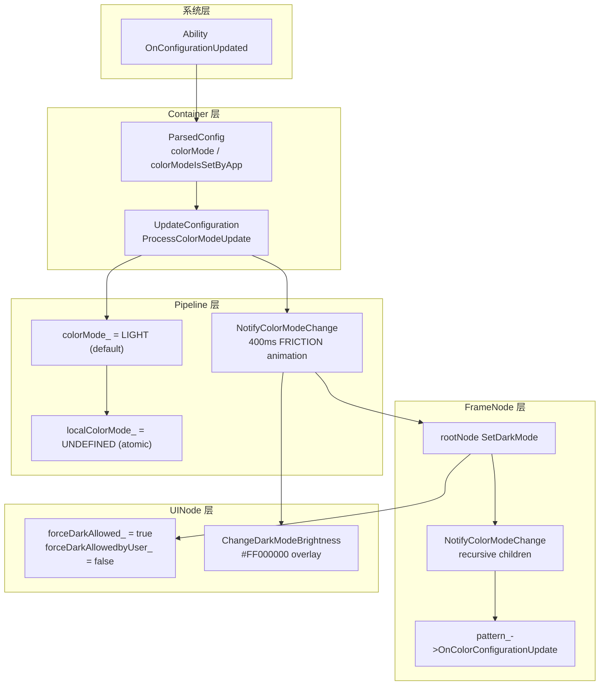

# 架构设计

> UIAppearance 管理 ArkUI 应用的深色模式/浅色模式检测、系统配置变更传播、Pipeline 级通知、FrameNode 递归传播及强制深色（Force Dark）能力。

## 设计元数据

| 字段 | 内容 |
|------|------|
| Design ID | DESIGN-Func-04-16-01 |
| 关联需求 | 已有能力补录（无独立 requirement.md） |
| 关联 Epic | 无 |
| 目标 Feature | Feat-01 UI 外观（色彩模式） |
| 复杂度 | 中等 |
| 目标版本 | API 7 起支持 Configuration.colorMode，API 10 ThemeColorMode，API 12 C-API，API 20 Force Dark，API 26 AnchoredColorMode |
| Owner | ArkUI SIG |
| 状态 | Baselined（已有实现补录） |

## 需求基线

| 字段 | 内容 |
|------|------|
| 问题陈述 | 应用需要感知系统深色/浅色模式切换，并将色彩模式变更传播到整个组件树，同时支持 WithTheme 本地覆盖和强制深色 |
| 核心目标 | （Feat-01）提供色彩模式检测、系统配置更新传播、Pipeline NotifyColorModeChange、FrameNode 递归传播、Force Dark、WithTheme 本地色模式覆盖、暗色亮度调整、C-API 事件注册的完整行为规格 |
| P0 AC | AC-1.1 ~ AC-1.3（检测）、AC-2.1 ~ AC-2.3（传播）、AC-3.1 ~ AC-3.3（FrameNode 递归）、AC-4.1 ~ AC-4.3（Force Dark）、AC-5.1 ~ AC-5.2（WithTheme）、AC-6.1 ~ AC-6.2（亮度）、AC-7.1 ~ AC-7.2（C-API） |

## 上下文和现状

### 涉及仓和模块

| 仓库 | 模块路径 | 当前职责 | 本 Feature 影响 |
|------|----------|----------|-----------------|
| ace_engine | `frameworks/core/pipeline_ng/pipeline_context.cpp/.h` | Pipeline 级色彩模式管理与通知 | 全量涉及 |
| ace_engine | `frameworks/core/components_ng/base/ui_node.h` | UINode 级 SetDarkMode/AllowForceDark | 全量涉及 |
| ace_engine | `frameworks/core/components_ng/base/frame_node.h` | FrameNode 级 NotifyColorModeChange 递归传播 | 全量涉及 |
| ace_engine | `adapter/ohos/entrance/ace_container.cpp/.h` | 容器级 ParsedConfig 与 UpdateConfiguration | 全量涉及 |
| ace_engine | `frameworks/core/components/common/layout/constants.h` | ColorScheme 枚举定义 | 全量涉及 |
| ace_engine | `interfaces/inner_api/ace_kit/include/ui/base/ace_type.h` | ColorMode 枚举定义 | 全量涉及 |
| ace_engine | `interfaces/inner_api/ace_kit/include/ui/resource/resource_configuration.h` | ConfigurationChange 变更位定义 | 全量涉及 |
| ace_engine | `interfaces/native/native_node.h` | C-API 色彩模式事件注册 | 全量涉及 |

### 调用链层级分析

| 层 | 模块 | 职责 | 修改类型 |
|----|------|------|----------|
| SDK API | `common.d.ts:8020-8052` | ThemeColorMode 枚举（SYSTEM/LIGHT/DARK） | 无修改（规格补录） |
| SDK API | `common.d.ts:2357-2396` | Configuration 接口（colorMode readonly） | 无修改（规格补录） |
| Ability | `ace_ability.cpp:617-641` | OnConfigurationUpdated 接收系统配置变更 | 无修改（规格补录） |
| Container | `ace_container.cpp:3653-3691` | ProcessColorModeUpdate + UpdateColorMode | 无修改（规格补录） |
| Container | `ui_content_impl.cpp:3505-3533` | BuildParsedConfig 读取 SYSTEM_COLORMODE | 无修改（规格补录） |
| Pipeline | `pipeline_context.cpp:7678-7714` | NotifyColorModeChange（400ms FRICTION 动画） | 无修改（规格补录） |
| FrameNode | `frame_node.cpp:1949-1991` | NotifyColorModeChange 递归子节点 | 无修改（规格补录） |
| UINode | `ui_node.h:1039-1086` | SetDarkMode/AllowForceDark/OnAllowForceDarkUpdate | 无修改（规格补录） |
| C-API | `native_node.h:13984-13993` | OH_ArkUI_RegisterSystemColorModeChangeEvent | 无修改（规格补录） |
| C-API | `native_node.h:14314` | OH_ArkUI_SetForceDarkConfig | 无修改（规格补录） |

### 适用架构规则

| 规则 ID | 设计结论 |
|---------|----------|
| OH-ARCH-01 | 色彩模式传播遵循 Container→Pipeline→FrameNode 三层架构 |
| OH-ARCH-02 | ConfigurationChange 使用位标记，支持 OnlyColorModeChange 快速判断 |
| OH-ARCH-03 | WithTheme 通过 Pipeline localColorMode_ 实现本地色模式隔离 |

## 不涉及项承接

| 维度 | 结论 |
|------|------|
| 性能 | 展开设计 — NotifyColorModeChange 使用 400ms 动画过渡，SetNeedReload 控制资源重载 |
| 安全与权限 | N/A — 色彩模式为 UI 配置，不涉及安全敏感操作 |
| 兼容性 | 展开设计 — API 7/9/10/12/20/26 版本差异需兼容性声明 |
| API/SDK | 展开设计 — ArkTS/C-API 签名需与 SDK 定义交叉验证 |
| IPC/跨进程 | N/A — 色彩模式通过 Ability Configuration 回调传递，非直接 IPC |
| 构建与部件 | N/A — 源码已包含在现有 source set 中 |

## 关键设计决策

| 决策 ID | 问题 | 推荐方案 | 探索过的替代方案 | 取舍理由 | 影响 |
|---------|------|----------|------------------|----------|------|
| ADR-1 | 色彩模式如何从系统传播到组件树 | Ability OnConfigurationUpdated→Container UpdateConfiguration→Pipeline NotifyColorModeChange→FrameNode 递归 | 直接在每个组件监听系统事件 | 三层架构职责清晰，Pipeline 统一调度 | 传播链路长但可控 |
| ADR-2 | NotifyColorModeChange 使用动画过渡 | 400ms FRICTION 曲线动画 + SetNeedReload(true) 资源重载 | 同步切换无动画 | 动画过渡提升用户体验，避免突变闪烁 | 动画期间 SetIsReloading(true) 阻止中间态 |
| ADR-3 | WithTheme 本地色模式如何实现 | Pipeline 维护 localColorMode_ 原子变量，GetLocalColorMode 返回 COLOR_MODE_UNDEFINED 时回退全局 | 每个组件独立存储 | Pipeline 级管理简化 WithTheme 子树覆盖 | resource_adapter_impl_v2.cpp 检查 localColorMode |
| ADR-4 | Force Dark 实现策略 | UINode 维护 forceDarkAllowed_ 和 forceDarkAllowedbyUser_ 双标记 | 单标记 | 双标记区分系统允许和用户允许 | C-API OH_ArkUI_SetForceDarkConfig 设置用户标记 |
| ADR-5 | 暗色亮度调整 | ChangeDarkModeBrightness 在 DARK 模式下叠加黑色背景（#FF000000），亮度由 SystemProperties::GetDarkModeBrightnessPercent 控制默认 "0.10,0.05" | 不调整亮度 | 暗色模式下降低亮度保护眼睛 | 仅 DARK 模式生效 |

## 设计骨架

### 骨架范围

| 骨架项 | 目标 | 不包含 | 验证方式 |
|--------|------|--------|----------|
| ColorMode 枚举 | LIGHT/DARK/COLOR_MODE_UNDEFINED | 具体主题资源 | 代码审查 |
| ConfigurationChange | 变更位标记 + IsNeedUpdate + OnlyColorModeChange | 其他配置变更 | 代码审查 |
| Pipeline 管理逻辑 | colorMode_/localColorMode_ + NotifyColorModeChange | 具体组件响应 | 单元测试 |
| FrameNode 递归传播 | NotifyColorModeChange 遍历子节点 | 主题资源加载 | 单元测试 |

### 骨架 Spec 拆分

| Task ID | 目标 | 受影响文件 | AC |
|---------|------|------------|-----|
| TASK-SKELETON-1 | ColorMode/ConfigurationChange 枚举定义 | ace_type.h, resource_configuration.h, constants.h | AC-1.1~1.2 |
| TASK-SKELETON-2 | Container ParsedConfig + UpdateConfiguration | ace_container.cpp, ui_content_impl.cpp | AC-2.1~2.3 |
| TASK-SKELETON-3 | Pipeline NotifyColorModeChange + FrameNode 递归 | pipeline_context.cpp, frame_node.cpp | AC-3.1~3.3 |
| TASK-SKELETON-4 | Force Dark + WithTheme + 亮度 + C-API | ui_node.h, native_node.h | AC-4.1~7.2 |

## 后续 Task 拆分

| Task ID | 目标 | 受影响文件 | 依赖 |
|---------|------|------------|------|
| TASK-1 | UI 外观（色彩模式）全部行为规格 | Feat-01-ui-appearance-spec.md | 无 |

## API 签名、Kit 与权限

### 新增 API

| API 签名 | 类型 | d.ts 位置 | 权限要求 | SysCap |
|----------|------|-----------|----------|--------|
| `readonly colorMode: ConfigurationConstant.ColorMode` | Public | `common.d.ts:2357-2396` | - | ArkUI |
| `enum ThemeColorMode { SYSTEM=0, LIGHT=1, DARK=2 }` | Public | `common.d.ts:8020-8052` | - | ArkUI |
| `OH_ArkUI_RegisterSystemColorModeChangeEvent(callback)` | C-API | `native_node.h:13984` | - | ArkUI |
| `OH_ArkUI_SetForceDarkConfig(config)` | C-API | `native_node.h:14314` | - | ArkUI |

### 变更/废弃 API

| 原有 API | 变更类型 | 新 API | 迁移说明 |
|----------|----------|--------|----------|
| — | — | — | 无变更/废弃 API |

## 构建系统影响

### BUILD.gn 变更

```
无变更。UIAppearance 实现已包含在现有 source set 中。
```

### bundle.json 变更

无变更。

## 可选设计扩展

### 架构图



### 数据流/控制流

| 步骤 | 调用方 | 被调用方 | 数据/接口 | 说明 |
|------|--------|----------|-----------|------|
| 1 | System | Ability::OnConfigurationUpdated | colorMode | `ace_ability.cpp:617-641` |
| 2 | Ability | ui_content_impl::BuildParsedConfig | SYSTEM_COLORMODE | `ui_content_impl.cpp:3505-3533` |
| 3 | BuildParsedConfig | ace_container::UpdateConfiguration | ConfigurationChange | `ace_container.cpp:3744-3799` |
| 4 | UpdateConfiguration | ProcessColorModeUpdate | colorMode + SetColorMode + SetColorScheme | `ace_container.cpp:3653-3670` |
| 5 | ProcessColorModeUpdate | Pipeline::UpdateColorMode | NotifyColorModeChange | `ace_container.cpp:3672-3691` |
| 6 | NotifyColorModeChange | rootNode->SetDarkMode | colorMode==DARK | `pipeline_context.cpp:7695` |
| 7 | SetDarkMode | rootNode->NotifyColorModeChange | recursive | `pipeline_context.cpp:7696` |
| 8 | NotifyColorModeChange | frame_node::NotifyColorModeChange | OnColorConfigurationUpdate | `frame_node.cpp:1949-1991` |
| 9 | NotifyColorModeChange | pattern_->OnColorConfigurationUpdate | theme reload | `frame_node.cpp` |
| 10 | Pipeline | FlushUITasks | — | `pipeline_context.cpp:7699` |

### 数据模型设计

**C++ 枚举定义**

```cpp
// ace_type.h:43-47
enum class ColorMode {
    LIGHT = 0,
    DARK,
    COLOR_MODE_UNDEFINED
};

// constants.h:597-601
enum class ColorScheme {
    SCHEME_LIGHT = 0,
    SCHEME_DARK = 2
};

// resource_configuration.h:20-56
struct ConfigurationChange {
    bool colorModeUpdate : 1;
    bool languageUpdate : 1;
    bool directionUpdate : 1;
    // ... other update flags
    bool IsNeedUpdate() const;
    bool OnlyColorModeChange() const;
    void MergeConfig(const ConfigurationChange& other);
};
```

**Pipeline 状态字段**

```cpp
// pipeline_context.h
ColorMode colorMode_ = LIGHT;           // 全局色模式 (h:1631)
std::atomic<ColorMode> localColorMode_ = COLOR_MODE_UNDEFINED; // WithTheme 本地覆盖 (h:1632)
```

## 详细设计

### 色彩模式检测

系统通过 Ability Configuration 回调传递色彩模式变更。Container 在 BuildParsedConfig 时读取 SYSTEM_COLORMODE（`ui_content_impl.cpp:3505-3533`），存入 ParsedConfig.colorMode（`ace_container.h:85`）和 colorModeIsSetByApp（`ace_container.h:94`）。

### 配置更新传播

**入口**: `ace_container.cpp:3653-3691`

```
1. ProcessColorModeUpdate (L3653-3670):
   - 读取 ParsedConfig.colorMode
   - pipelineContext_->SetColorMode(colorMode)
   - pipelineContext_->SetColorScheme(colorMode==DARK ? SCHEME_DARK : SCHEME_LIGHT)
2. UpdateColorMode (L3672-3691):
   - 调用 pipelineContext_->NotifyColorModeChange(colorMode)
   - OnFrontUpdated (L3722) 在前端帧完成后回调
```

### Pipeline NotifyColorModeChange

**入口**: `pipeline_context.cpp:7678-7714`

```
1. 创建 AnimationOption: duration=400ms, curve=FRICTION (L7681-7683)
2. AnimationUtils::Animate 闭包 (L7684-7707):
   a. ResourceParseUtils::SetNeedReload(true) (L7693)
   b. pipeline->SetIsReloading(true) (L7694)
   c. rootNode->SetDarkMode(rootColorMode==DARK) (L7695)
   d. rootNode->NotifyColorModeChange(colorMode) (L7696) — 递归
   e. pipeline->SetIsReloading(false) (L7697)
   f. ResourceParseUtils::SetNeedReload(false) (L7698)
   g. pipeline->FlushUITasks() (L7699)
3. 动画完成回调: OnFlushReloadFinish (L7705)
4. stage->GetRenderContext()->UpdateWindowBlur() (L7713)
```

### FrameNode 递归传播

**入口**: `frame_node.cpp:1949-1991`

```
1. 检查 GetLocalColorMode() 是否为 WithTheme 本地覆盖 (L1949)
2. rootNode->SetDarkMode(colorMode==DARK) (L7695 由 Pipeline 调用)
3. 遍历子节点，递归调用 NotifyColorModeChange
4. 对每个子节点:
   a. GetForceDarkAllowed() 检查
   b. pattern_->OnColorConfigurationUpdate() 主题刷新
   c. pattern_->OnColorModeChange() 色模式变更
5. colorModeUpdateCallback_ 回调通知 (frame_node.h:1839)
```

### Force Dark

**入口**: `ui_node.h:1039-1086`

```
1. SetDarkMode(isDark) 设置节点暗色模式 (h:1039)
2. CheckIsDarkMode() 检查当前是否暗色 (h:1044)
3. AllowForceDark(allow) 设置 forceDarkAllowed_ (h:1069), 默认 true (h:1421)
4. OnAllowForceDarkUpdate() 更新回调 (h:1086)
5. forceDarkAllowedbyUser_ 默认 false (h:1422), 通过 C-API 设置
6. C-API OH_ArkUI_SetForceDarkConfig (native_node.h:14314):
   - @since 20
   - 返回 ARKUI_ERROR_CODE_FORCE_DARK_CONFIG_INVALID 如果无效
```

### WithTheme 本地色模式覆盖

**入口**: `pipeline_context.h:924-930, resource_adapter_impl_v2.cpp:133-176`

```
1. SetLocalColorMode(colorMode) 设置 WithTheme 子树色模式 (h:924)
2. GetLocalColorMode() 返回 localColorMode_, 默认 COLOR_MODE_UNDEFINED (h:930)
3. resource_adapter_impl_v2.cpp (L133-176):
   - 检查 pipeline GetLocalColorMode()
   - IF localColorMode != UNDEFINED → 使用本地色模式
   - ELSE → 使用全局 colorMode_
4. DumpColorMode (L445-462) 诊断输出
```

### 暗色亮度调整

**入口**: `pipeline_context.cpp:7163-7184`

```
1. 当 colorMode == DARK 时触发
2. 叠加黑色背景 #FF000000
3. 亮度由 SystemProperties::GetDarkModeBrightnessPercent 控制默认 "0.10,0.05"
4. 仅 DARK 模式生效
```

## 风险和开放问题

| 项 | 类型 | 影响 | 处理方式 | Owner |
|----|------|------|----------|-------|
| NotifyColorModeChange 400ms 动画期间 SetIsReloading | 性能 | 中 | 动画期间阻止中间态渲染，完成后 FlushUITasks | ArkUI SIG |
| WithTheme localColorMode 为原子变量 | 并发 | 低 | std::atomic\<ColorMode\> 保证线程安全 | ArkUI SIG |
| Force Dark 双标记区分系统/用户允许 | 架构 | 低 | forceDarkAllowed_ 为系统标记，forceDarkAllowedbyUser_ 为用户标记 | ArkUI SIG |
| API 26 AnchoredColorMode 新增 | 兼容性 | 中 | 在兼容性声明中标注，FOLLOW_SYSTEM/FOLLOW_TARGET | ArkUI SIG |
| C-API Force Dark 返回错误码 | API | 低 | ARKUI_ERROR_CODE_FORCE_DARK_CONFIG_INVALID 用于无效配置 | ArkUI SIG |

## 设计审批

- [x] 需求基线已确认，设计覆盖 P0/P1 AC
- [x] 不涉及项已承接，N/A 和展开项都有结论
- [x] 涉及仓和模块职责清楚
- [x] 适用架构规则已识别并形成设计结论
- [x] 分层和子系统边界合规
- [x] API 变更有签名、权限、错误码和兼容性说明
- [x] BUILD.gn/bundle.json 影响明确
- [x] 设计输出和后续 Task 拆分明确
- [x] 关键设计决策有理由和影响说明
- [x] 风险和开放问题有 Owner

**结论:** 通过（已有实现补录）
