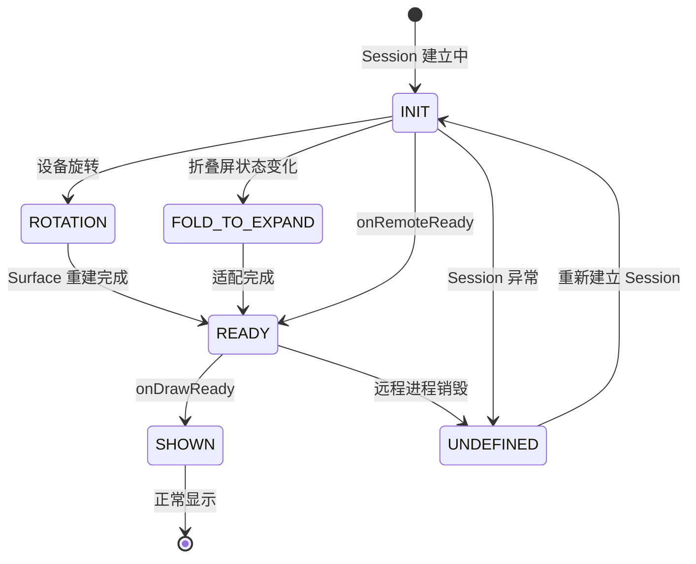

# 架构设计

> 嵌入显示能力-UIExtension 功能域的架构设计文档。本域聚焦跨进程/跨线程的嵌入显示机制，描述 Session 管理、IPC 通信、Worker 线程渲染等核心机制，而非组件 API 清单。

## 设计元数据

| 字段 | 内容 |
|------|------|
| Design ID | DESIGN-Func-04-17-01 |
| 关联需求 | 已有能力补录（无独立 requirement.md） |
| 关联 Epic | 无 |
| 目标 Feature | Feat-01 跨进程嵌入显示连接与生命周期, Feat-02 跨进程双向数据通道, Feat-03 安全隔离跨进程嵌入显示 |
| 复杂度 | 复杂 |
| 目标版本 | Dynamic API 10+ |
| Owner | ArkUI SIG |
| 状态 | Baselined（已有实现补录） |

## 需求基线

| 项 | 内容 |
|----|------|
| 问题陈述 | 需要在 ArkUI 框架中支持跨进程（UIExtensionAbility）和跨线程（Worker）的嵌入显示，实现 UI 内容在不同执行环境中的嵌入和渲染 |
| 核心目标 | 提供跨进程 Session 管理、IPC 双向数据通道、跨线程 Worker 加载、Placeholder 状态机等嵌入显示核心机制 |
| P0 AC | 跨进程 Session 正确建立和销毁；IPC 数据通道双向通信正常；跨线程 Worker 加载不阻塞主线程；Placeholder 状态机正确切换 |

## 上下文和现状

### 涉及仓和模块

| 仓库 | 模块 | 当前职责 | 本 Feature 影响 |
|------|------|----------|-----------------|
| ace_engine | `frameworks/core/components_ng/pattern/ui_extension/` | 核心 Pattern 层（ui_extension_pattern, security_ui_extension_pattern, dynamic_pattern, isolated_pattern） | 核心实现 |
| ace_engine | `frameworks/core/components_ng/pattern/ui_extension/ui_extension_model.h/cpp` | 抽象模型接口 + NG 实现 | API 接口 |
| ace_engine | `frameworks/bridge/declarative_frontend/jsview/js_ui_extension.h/cpp` | JS 桥接（UIExtension/SecurityUIExtension/PreviewUIExtension） | 输入校验 |
| ace_engine | `frameworks/core/components_ng/pattern/ui_extension/session_wrapper.h` | SessionWrapper 抽象 + SessionType 枚举 | 会话管理 |
| ace_engine | `frameworks/core/components_ng/pattern/ui_extension/ui_extension_proxy.h/cpp` | UIExtensionProxy 通信 | 双向通信 |
| ace_engine | `adapter/ohos/osal/modal_ui_extension_impl.cpp` | OS 层 ModalUIExtension 创建 | 平台适配 |
| interface_sdk-js | API 类型定义 | 类型定义 |

### 调用链层级分析

| 层 | 模块 | 职责 | 修改类型 |
|----|------|------|----------|
| JS Bridge | `js_ui_extension` / `js_security_ui_extension` | 解析 ArkTS 调用，创建 FrameNode + Proxy | 存量分析 |
| Model 层 | `ui_extension_model_ng` | 路由到对应 Pattern 子类 | 存量分析 |
| Pattern 层 | `ui_extension_pattern` / `security_ui_extension_pattern` / `dynamic_pattern` | 生命周期管理、Session 创建、事件分发 | 存量分析 |
| Session 层 | `session_wrapper_impl` / `security_session_wrapper_impl` | 跨进程会话管理 | 存量分析 |
| Proxy 层 | `ui_extension_proxy` / `security_ui_extension_proxy` | send/sendSync/on/off 双向通信 | 存量分析 |
| Renderer 层 | `dynamic_component_renderer_impl` | DynamicComponent 渲染 | 存量分析 |

### SessionType 枚举

| 值 | 类型 | 对应组件 |
|----|------|---------|
| 0 | EMBEDDED_UI_EXTENSION | 嵌入式 |
| 1 | UI_EXTENSION_ABILITY | UIExtensionComponent |
| 2 | CLOUD_CARD | 云卡片 |
| 3 | SECURITY_UI_EXTENSION_ABILITY | SecurityUIExtensionComponent |
| 4 | DYNAMIC_COMPONENT | DynamicComponent |
| 5 | ISOLATED_COMPONENT | IsolateComponent |
| 6 | PREVIEW_UI_EXTENSION_ABILITY | PreviewUIExtension |

### 适用架构规则

| Rule ID | 适用原因 | 设计结论 | 验证方式 |
|---------|----------|----------|----------|
| OH-ARCH-LAYERING | 涉及 JS Bridge → Model → Pattern → Session → Proxy 多层调用 | 严格单向调用 | 代码评审 |
| OH-ARCH-IPC-SAF | UIExtension 涉及跨进程通信 | SessionWrapper 管理 IPC 通道 | 集成测试 |
| OH-ARCH-API-LEVEL | 多 API 版本演进 | 按 @since 版本标注 | API 评审 |

## 不涉及项承接

| 维度 | 设计结论 |
|------|----------|
| 性能 | DynamicComponent 约束：每 Worker 最多 4 个 |
| 安全与权限 | SecurityUIExtensionComponent 有额外安全校验 |
| 兼容性 | 声明式 + Static 双范式，部分 API 仅声明式支持 |

## 关键设计决策

| 决策 ID | 问题 | 推荐方案 | 影响 |
|---------|------|----------|------|
| ADR-1 | UIExtension 子类型如何路由 | SessionType 枚举 + UIExtensionModelNG 按类型分发 | 统一 Model 接口，多 Pattern 子类 |
| ADR-2 | Proxy 通信模式 | send（异步）+ sendSync（同步）+ on/off（事件注册） | 双向通信 |
| ADR-3 | Placeholder 机制 | 支持 initPlaceholder/rotationPlaceholder/foldToExpandPlaceholder/undefinedPlaceholder | 状态占位 |

## 后续 Task 拆分

| Task ID | 目标 | 受影响文件 | 依赖 |
|---------|------|-----------|------|
| Feat-01 | 跨进程嵌入显示连接与生命周期 | Feat-01-ui-extension-creation-events-spec.md | 无 |
| Feat-02 | 跨进程双向数据通道 | Feat-02-ui-extension-proxy-communication-spec.md | Feat-01 |
| Feat-03 | 安全隔离跨进程嵌入显示 | Feat-03-security-ui-extension-spec.md | Feat-01 |

## API 签名、Kit 与权限

| API | 类型 | Kit |
|-----|------|-----|
| `UIExtensionComponent(want, options?)` | System | ArkUI |
| `SecurityUIExtensionComponent(want, options?)` | System | ArkUI |
| `UIExtensionProxy.send(data)` | System | ArkUI |
| `UIExtensionProxy.sendSync(data)` | System | ArkUI |

## 构建系统影响

无 — 已有实现。

## 详细设计

### 跨进程 Session 建立流程

嵌入显示的跨进程连接由以下核心模块协作完成：

```
宿主进程 (ArkUI)                              远程进程 (UIExtensionAbility)
  ViewStackProcessor                              UIExtensionAbility
    │                                               │
    ├─ UIExtensionModelNG::CreateUIExtension        │
    │   ├─ 解析 Want → bundleName/abilityName       │
    │   ├─ 创建 UIExtensionNode                     │
    │   └─ 创建 UIExtensionPattern                  │
    │                                               │
    ├─ UIExtensionPattern::OnAttachToFrameNode      │
    │   ├─ SessionWrapperFactory::Create(want)      │
    │   │   ├─ 根据 Want 类型确定 SessionType        │
    │   │   │   ├─ UI_EXTENSION_ABILITY → SessionWrapperImpl
    │   │   │   └─ SECURITY_UI_EXTENSION_ABILITY → SecuritySessionWrapperImpl
    │   │   └─ 创建 SessionWrapper 实例              │
    │   │                                           │
    │   ├─ SessionWrapper::CreateSession() ──IPC──→ 启动 UIExtensionAbility
    │   │   ├─ 传递 Want (含 bundleName/abilityName) │
    │   │   ├─ 传递配置 (isTransferringCaller 等)    │
    │   │   └─ 等待远程 Surface 创建                  │
    │   │                                           │
    │   └─ SessionWrapper::OnSurfaceCreated() ←─── 远程 Surface 就绪
    │       ├─ 创建 SurfaceProxyNode                  │
    │       └─ 触发 onRemoteReady(proxy)              │
```

**关键模块** (`frameworks/core/components_ng/pattern/ui_extension/`):

| 模块 | 文件 | 职责 |
|------|------|------|
| UIExtensionModelNG | `ui_extension_model_ng.cpp` | 创建节点和 Pattern 的入口 |
| UIExtensionPattern | `ui_extension_component/ui_extension_pattern.cpp` | 跨进程生命周期管理 |
| SessionWrapperFactory | `session_wrapper_factory.cpp` | 根据 SessionType 创建对应 SessionWrapper |
| SessionWrapperImpl | `ui_extension_component/session_wrapper_impl.cpp` | 标准跨进程 Session 实现 |
| SecuritySessionWrapperImpl | `security_ui_extension_component/security_session_wrapper_impl.cpp` | 安全跨进程 Session 实现 |
| SessionWrapper | `session_wrapper.h` | 抽象 Session 接口，定义 50+ IPC 方法 |

### 跨进程 IPC 通信通道

UIExtensionProxy 提供双向跨进程数据通道，底层通过 SessionWrapper 的 IPC 机制实现：

```
宿主进程                                      远程进程
  UIExtensionProxy                             UIExtensionAbility
    │                                             │
    ├─ SendData(data) ──IPC 异步──→              onReceive(data)
    │   └─ SessionWrapper::SendBusinessData()     │
    │                                             │
    ├─ SendDataSync(data) ──IPC 同步──→          onSyncReceive(data)
    │   └─ SessionWrapper::SendBusinessDataSync() │ → return result
    │   └─ 阻塞等待 ←──────────────────────────────
    │                                             │
    ├─ on("async", cb) ←──IPC 异步──             send(data)
    │   └─ SessionWrapper::RegisterAsyncCallback()│
    │                                             │
    └─ on("sync", cb) ←──IPC 同步──              sendSync(data)
        └─ SessionWrapper::RegisterSyncCallback() │
```

**通信约束**:
- `send()` 异步发送，不阻塞宿主 UI 线程
- `sendSync()` 同步阻塞等待远程返回，超时由系统 IPC 机制控制
- 数据需支持序列化，不支持序列化的对象无法跨进程传递
- Session 未就绪时调用 `send/sendSync` 直接失败

### Placeholder 状态机

跨进程嵌入显示在远程 UI 未就绪期间，通过 Placeholder 状态机提供视觉反馈：



**PlaceholderType 枚举** (`ui_extension_config.h`):

| 状态 | 枚举值 | 触发场景 | 显示内容 |
|------|--------|---------|---------|
| INIT | 0 | Session 建立中，远程 UI 未初始化 | initPlaceholder |
| ROTATION | 1 | 设备旋转，远程 Surface 重建中 | rotationPlaceholder |
| FOLD_TO_EXPAND | 2 | 折叠屏展开/折叠 | foldToExpandPlaceholder |
| UNDEFINED | 3 | Session 异常或状态未知 | undefinedPlaceholder |
| NONE | 4 | onDrawReady 已触发 | 移除 Placeholder |

### 跨进程生命周期事件时序

```
时间线 →

宿主: 创建 UIExtensionComponent
  │
  ├─ [Placeholder: INIT]
  │
  ├─ Session 建立 (IPC)
  │   ├─ 成功 → onRemoteReady(proxy)
  │   │   ├─ 宿主通过 proxy 发送数据
  │   │   ├─ 远程 → onReceive(data)  ← 宿主收到数据
  │   │   ├─ onDrawReady()           ← 首次渲染
  │   │   │   └─ [Placeholder: NONE]
  │   │   ├─ onResult(code, want)    ← 远程返回结果
  │   │   ├─ onTerminated(code, want) ← 远程进程终止
  │   │   └─ onRelease(code)         ← Session 释放
  │   │
  │   └─ 失败 → onError(code, name, msg)
  │       └─ [Placeholder: UNDEFINED]
  │
  └─ 组件销毁 → Session 关闭
```

### 安全隔离跨进程机制

SecurityUIExtensionComponent 在普通 UIExtension 机制基础上增加了安全隔离：

1. **Session 类型隔离**: 使用 `SecuritySessionWrapperImpl`（SessionType=3），而非 `SessionWrapperImpl`（SessionType=1）
2. **身份验证**: 跨进程传递调用者身份标识，远程 Ability 可验证调用者权限
3. **安全 IPC 通道**: 底层 IPC 通道由系统安全机制保证加密和认证
4. **安全代理**: `SecurityUIExtensionProxy` 提供与 `UIExtensionProxy` 相同的通信接口，但底层使用安全 Session

### 与 DynamicComponent 和 IsolateComponent 的机制边界

| 机制 | FuncID | 运行环境 | 通信方式 | 隔离级别 |
|------|--------|---------|---------|---------|
| UIExtension | 04-17-01 | 跨进程（远程 Ability） | IPC 通道 + Proxy 双向通信 | 进程级隔离 |
| IsolateComponent | 04-17-02 | 跨线程（RestrictedWorker） | Surface 回传 | 严格线程隔离（每 Worker 1 个） |
| DynamicComponent | 04-17-05 | 跨线程（Worker） | Surface 回传 | 共享线程（每 Worker 最多 4 个） |

## 风险和开放问题

| 项 | 类型 | 影响 | 处理方式 | Owner |
|----|------|------|----------|-------|
| 跨进程通信稳定性 | 架构 | 高 | SessionWrapper 管理重连和超时 | ArkUI SIG |

## 设计审批

- [x] 需求基线已确认
- [x] 调用链层级分析完整
- [x] 适用架构规则已识别
- [x] 关键设计决策有理由和影响说明
- [x] 风险和开放问题有 Owner

**结论:** 通过（已有实现补录）