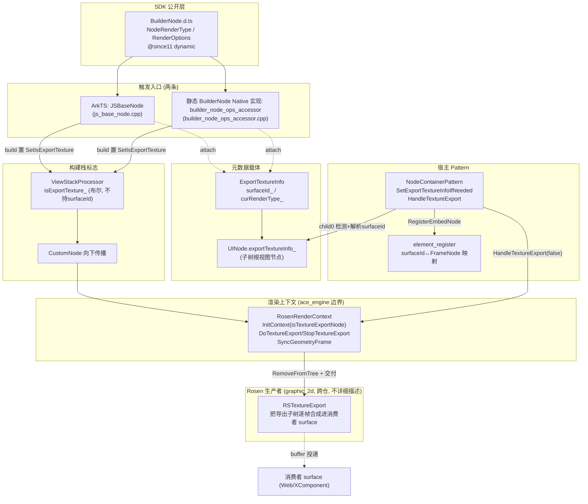
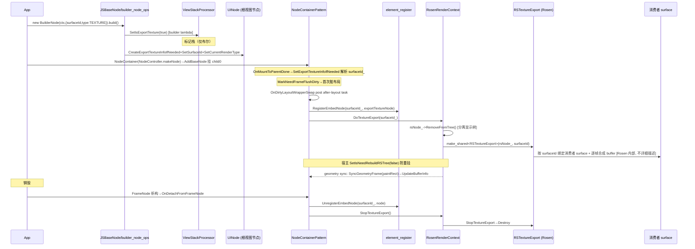

# 架构设计

> 确认目标仓和模块的架构约束、关键设计决策、Spec 拆分方向。

## 设计元数据

| Field | Content |
|-------|---------|
| Design ID | `DESIGN-Func-04-18-01` |
| 关联需求 | 已有能力补录（无独立 requirement.md） |
| 关联 Epic | 无 |
| 目标 Feature | Feat-01 同层渲染纹理生产者（ArkUI 子树纹理导出）（基线） |
| 复杂度 | 复杂（跨 ace_engine↔Rosen(graphic_2d) 两仓，渲染树分离 + 独立 RSUIDirector + 消费者 surface 绑定） |
| 目标版本 | `@since 11 dynamic` / `@atomicservice 12`（`NodeRenderType`/`RenderOptions`/`BuilderNode` 构造，`interface/sdk-js/api/arkui/BuilderNode.d.ts`） |
| Owner | ArkUI SIG |
| 状态 | Baselined（已有实现补录） |

> 范围说明：本设计以**生产者侧**为基线 Feat-01。同层渲染的**消费者**行为（开启 `NativeEmbedMode` 的 Web、应用开发者 XComponent 自绘制）不在本设计范围。XComponent 作为**并行生产者宿主**（`xcomponent_pattern.cpp:1893-1984`）与 NodeContainer 共享同一 `RSTextureExport` 交付机制，仅作交叉引用。Rosen（graphic_2d）内部 `RSUIDirector` 渲染线程合成与 BufferQueue 生产/消费时序为跨仓外部依赖，ace_engine 边界止于 `DoTextureExport`→`RSTextureExport` 交付。

## 需求基线

> 本节列出设计阶段需要强调的需求基线要点（已有能力补录，无独立 proposal.md）。

| 项 | 补充说明 |
|----|---------|
| 补录而非新增 | 当前实现即规格，可疑行为只能标注为风险/备注 |
| 生产者/消费者分界 | 本设计只覆盖生产者：把 BuilderNode 子树纹理化 + 消费者 surfaceId 交付 rs，由 rs 作 buffer 生产者投递；消费者 surface 由持有方（Web/XComponent）预先注册 |
| 跨仓依赖 | buffer 生产实际发生在跨仓 Rosen（graphic_2d），ace_engine 不实现 buffer 队列；边界止于 `DoTextureExport`→`RSTextureExport` 交付 |
| 公开触发入口 | `BuilderNode(uiContext, { surfaceId, type: NodeRenderType.RENDER_TYPE_TEXTURE })`；`surfaceId` 仅 TEXTURE 生效 |

## 上下文和现状

### 涉及仓和模块

| 仓库 | 补充架构说明 |
|------|-------------|
| `arkui_ace_engine` | 生产者全部实现：触发入口（ArkTS `js_base_node.cpp` / 静态 BuilderNode Native 实现 `builder_node_ops_accessor.cpp`）、元数据载体 `ExportTextureInfo`、宿主 `NodeContainerPattern`、交付 `RosenRenderContext::DoTextureExport`、embed 注册表 `element_register` |
| `interface/sdk-js` | 公开 SDK 声明：`arkui/BuilderNode.d.ts`（L84-193 枚举/RenderOptions，L317 构造），`@since 11 dynamic`/`@atomicservice 12`；re-export `@ohos.arkui.node.d.ts:36` |
| `graphic_2d`（Rosen，跨仓） | 真正 buffer 生产：由 Rosen 把导出子树逐帧合成进消费者 surface（surfaceId→消费者 surface 绑定在 Rosen 侧完成）；ace_engine 经 `Rosen::` 公开头/符号单向调用，不控管其内部实现 |

> 上表「涉及仓和模块」已列明仓库、模块与当前职责（已有能力补录，无独立 proposal.md）。

### 调用链层级分析

| 层 | 模块 | 职责 | 修改类型 |
|----|------|------|---------|
| 1. SDK 声明层 | `interface/sdk-js/api/arkui/BuilderNode.d.ts`（L84-193,L317） | 公开 `NodeRenderType{DISPLAY=0,TEXTURE=1}`、`RenderOptions{selfIdealSize?,type?,surfaceId?}`、构造；`surfaceId` 仅 type=TEXTURE 生效 | 不修改（SDK 权威） |
| 2. Native 枚举层 | `frameworks/core/components/common/layout/constants.h`（L936-939） | `enum class NodeRenderType` 与 SDK 数值一致 | 现状 |
| 3. ArkTS 入口层 | `frameworks/bridge/declarative_frontend/jsview/js_base_node.{h,cpp}` | 解析 options（`type`/`surfaceId`）；build 时 builder lambda 置 `SetIsExportTexture`（L86,L111）；build 后按 tag 白名单 attach `ExportTextureInfo{surfaceId,renderType}`（L247-251） | 现状（Feat-01） |
| 4. 静态 BuilderNode Native 实现层 | `frameworks/core/interfaces/native/implementation/builder_node_ops_accessor.cpp` | `SetOptionsImpl` 解析（L126-153）；`IsSupportExportTexture`（L40-48）；build 置 `SetIsExportTexture`（L77）；attach ExportTextureInfo（L98-102）；`SetParentLayoutConstraint`（L105-107） | 现状（Feat-01） |
| 5. 构建栈标志层 | `frameworks/core/components_ng/base/view_stack_processor.{h,cpp}`（L547-555,L627） | 仅持布尔 `isExportTexture_`（**不持 surfaceId**），标记"当前 push 的节点按纹理导出创建" | 现状 |
| 6. 自定义节点传播层 | `frameworks/core/components_ng/pattern/custom/custom_node.cpp`（L92-95） | 嵌套 build 时向下传播 `SetIsExportTexture(parent\|\|self)` | 现状 |
| 7. RSNode 创建层 | `frameworks/core/components_ng/render/adapter/rosen_render_context.cpp`（L650-659） | `InitContext` 读 `IsExportTexture()`→`Rosen::*Node::Create(...,isTextureExportNode=true)`（RSRootNode/RSCanvasNode/RSSurfaceNode） | 现状（生产者身份落点） |
| 8. 元数据载体层 | `frameworks/core/components_ng/export_texture_info/export_texture_info.h`（L28-56） | 仅 `surfaceId_`/`curRenderType_`；不持 surface/RSNode/生产者指针 | 现状 |
| 9. UINode 持有层 | `frameworks/core/components_ng/base/ui_node.{h,cpp}`（L737-744,L1384 / L2162-2172） | `exportTextureInfo_` RefPtr 挂在子树根视图节点；`IsNeedExportTexture`/`CreateExportTextureInfoIfNeeded` | 现状 |
| 10. 宿主 Pattern 层 | `frameworks/core/components_ng/pattern/node_container/node_container_pattern.{h,cpp}` | 检测 child0 导出态、解析 surfaceId、`HandleTextureExport`→`DoTextureExport`/`StopTextureExport`、嵌套去重、生命周期 | 现状（Feat-01） |
| 11. NodeContainer 入口桥层 | `frameworks/bridge/declarative_frontend/jsview/js_node_container.cpp`（L246-280）/ `node_container_model_ng.cpp`（L131-138） | NodeController.makeNode 包装→RemakeNode→AddBaseNode 挂 child0 | 现状 |
| 12. 渲染树分离层 | `frameworks/core/components_ng/render/adapter/rosen_render_context.cpp`（L5361,L5381,L5402,L6773-6797）/ `render_context.h`（L907） | `DoTextureExport`：`RemoveFromTree`+建 `RSTextureExport`+`SetTextureExport`；`SetIsNeedRebuildRSTree(false)` 守卫；`SyncGeometryFrame→UpdateBufferInfo` | 现状（ace_engine 边界） |
| 13. surfaceId 解析层 | `frameworks/base/utils/string_utils.{h,cpp}`（L92,L255-265） | `StringToLongUint` 十进制 strtoull，失败返 0 | 现状 |
| 14. embed 注册表层 | `frameworks/core/pipeline/base/element_register.{h,cpp}`（L137-145,L474-489） | surfaceId↔FrameNode 映射 `RegisterEmbedNode/UnregisterEmbedNode` | 现状 |
| 15. 生命周期触发层 | `frameworks/core/components_ng/base/frame_node.cpp`（L800,L3480-3483,L7264-7272）/ `pattern.cpp`（L373-379） | dtor→DetachFromFrameNode→OnDetach；OnMountToParentDone；SetParentLayoutConstraint | 现状 |
| 16. Rosen 生产者层（跨仓） | `foundation/graphic/graphic_2d`（Rosen） | 把导出子树逐帧合成进消费者 surface（surfaceId→消费者 surface 绑定、buffer 生产均在 Rosen 侧） | 跨仓外部依赖（不在本设计详细描述） |

检查项：
- [x] 调用链每一层都已覆盖（SDK→枚举→ArkTS/静态 BuilderNode Native 实现 入口→栈标志→传播→RSNode 创建→元数据→UINode→宿主→入口桥→渲染树分离→解析→注册表→生命周期→Rosen 生产者）
- [x] 每层职责边界清晰（ace_engine 止于交付 RSTextureExport；buffer 生产在 Rosen）
- [x] 每层修改类型明确（层 1 不修改；层 2-15 现状 Feat-01；层 16 跨仓依赖）

### 适用架构规则

| Rule ID | 适用原因 | 设计结论 | 验证方式 |
|---------|---------|---------|---------|
| OH-ARCH-LAYERING | SDK→入口→栈标志→RSNode 创建→宿主→渲染树分离→Rosen 多层 | 调用方向自顶向下；surfaceId 不经 ViewStackProcessor（仅持布尔），独立由 ExportTextureInfo 承载 | 架构评审/依赖检查 |
| OH-ARCH-SUBSYSTEM | 跨子系统：ace_engine→graphic_2d(Rosen) | 经 `Rosen::` 公开符号单向调用；buffer 生产在 Rosen，不反向依赖 | 依赖检查/集成测试 |
| OH-ARCH-API-LEVEL | 公开 `NodeRenderType`/`RenderOptions`/构造 `@since 11 dynamic`/`@atomicservice 12` | Public，无新增权限 | API 评审/XTS |
| OH-ARCH-COMPONENT-BUILD | 现状无 BUILD.gn/bundle.json 变更 | 无构建影响 | 构建验证 |
| OH-ARCH-ERROR-LOG | 非法 surfaceId 在 ace_engine 侧静默禁用（无日志）；Rosen 侧记日志 | ace_engine 无错误反馈（风险 RISK-1）；日志在跨仓 Rosen | UT/hilog |

## 不涉及项承接

> 本节对「不涉及项」给出承接结论，并对需展开设计的维度给出设计结论（已有能力补录，无独立 proposal.md）。

| 维度 | 设计结论 |
|------|----------|
| 消费者行为 | 不涉及（Web NativeEmbedMode / XComponent 自绘制为消费者，由各自模块承接） |
| Rosen 内部 buffer 生产 | 跨仓外部依赖，ace_engine 边界止于 `DoTextureExport`→`RSTextureExport` 交付 |
| 跨进程/SA | 不涉及（surfaceId 为同机消费者 surface 句柄，非 IPC 句柄语义） |
| 持久化 | 不涉及 |
| 权限 | 不涉及（Public 无权限；生产者只向消费者已注册 surface 投递） |
| 国际化/RTL | 不涉及（随子树 paintRect） |
| 多范式兼容 | ArkTS 动态（`js_base_node.cpp`）/静态 BuilderNode Native 实现（`builder_node_ops_accessor.cpp`）两入口共用同一 Rosen 交付机制 |
| 范围边界 | XComponent 并行生产者宿主（`xcomponent_pattern.cpp:1893-1984`）共享 `RSTextureExport`，仅交叉引用；同层标签生命周期/事件转发属消费者侧 |

## 关键设计决策

| 决策 ID | 问题 | 推荐方案 | 探索过的替代方案 | 取舍理由 | 影响 |
|--------|------|---------|----------------|---------|------|
| ADR-1 | 生产者机制归属边界 | **ExportTextureInfo 仅作元数据载体**（`surfaceId_`/`curRenderType_`），真正生产者 `Rosen::RSTextureExport` 挂在 `RosenRenderContext::rsTextureExport_`（`rosen_render_context.h:1023`），buffer 生产在跨仓 Rosen | (a) ExportTextureInfo 持 surface/生产者指针并自管；(b) ace_engine 自实现 buffer 队列 | 元数据与渲染资源解耦；ExportTextureInfo 可在 UINode 生命周期内安全持有，buffer 队列交由 Rosen 专业实现 | ExportTextureInfo 无 `ExportTexture/UpdateSurface/OnFrame`；等价操作在 `RSTextureExport::DoTextureExport/StopTextureExport/UpdateBufferInfo` |
| ADR-2 | 子树如何"渲染到纹理而非屏幕" | `DoTextureExport` 调 `rsNode_->RemoveFromTree()`（`rosen_render_context.cpp:6776`）把子树移出主 RS 显示树，并对宿主 `SetIsNeedRebuildRSTree(false)`（`node_container_pattern.cpp:120-124`）使 flush 重建站点跳过重挂 | (a) 节点透明/可见性屏蔽；(b) 独立离屏 RenderTarget 拷贝 | 复用 Rosen RSNode 子树原样，零拷贝移交专用 RSUIDirector；显式分离避免双绘 | 子树分离期间不参与主树 rebuild；恢复由 `SetIsNeedRebuildRSTree(true)`+`StopTextureExport` 完成 |
| ADR-3 | 生产者如何绑定消费者 surface | 跨仓 Rosen 按 surfaceId 反查消费者**已注册** surface，把导出子树绑定为该 surface 的 buffer 生产者（绑定实现细节在 Rosen 侧，不在本设计详细描述） | (a) ArkUI 自建 surface 再回传；(b) 直接传 OHNativeWindow | 消费者 surface 由持有方（Web/XComponent）预先注册，生产者按 surfaceId 反查绑定即成为其 buffer 生产者，符合"rs 作 buffer 生产者向消费者投递"语义 | ace_engine 生产者不持有/创建任意 surface；非法 surfaceId（查不到）→ Rosen 侧返失败并记日志 |
| ADR-4 | 生产触发与尺寸模型 | 生产**布局驱动**：NodeContainer `OnDirtyLayoutWrapperSwap` post after-layout task 调 `HandleTextureExport(false)`（`node_container_pattern.cpp:100-109`），pipeline_ng 无独立 flush pass；纹理尺寸=导出节点 paintRect，经 `SyncGeometryFrame→UpdateBufferInfo`（`rosen_render_context.cpp:893-898`）连续同步 | (a) 独立 texture-export flush pass；(b) 显式 surface resize API | 复用既有布局/几何同步通路，无新增调度；尺寸天然随布局变化 | 无独立 resize 调用；首产延迟到首次脏布局（非构造期） |
| ADR-5 | 公开触发入口形态 | 复用 `BuilderNode(uiContext, options?)` 的 `RenderOptions.{type, surfaceId}`（`BuilderNode.d.ts:153-193`），`surfaceId` 仅 type=TEXTURE 生效 | (a) 新增独立 TextureExport API；(b) 节点级方法 | 与 BuilderNode 既有纹理导出能力一致，零新 API；ArkTS/静态 BuilderNode Native 实现两入口共用 | 仅自定义视图根（JS_VIEW_ETS_TAG/COMMON_VIEW_ETS_TAG）+TEXTURE 可生产 |
| ADR-6 | 资格门控与嵌套去重 | tag 白名单 `{JS_VIEW_ETS_TAG, COMMON_VIEW_ETS_TAG}`（`js_base_node.cpp:53`）；嵌套 NodeContainer 且祖先 child 已 TEXTURE 时当前容器让步（`node_container_pattern.cpp:171-183`） | (a) 任意根可生产；(b) 多层并发生产 | 限定自定义视图根保证子树可独立合成；嵌套去重避免多生产者争抢同一区域 | 非自定义视图根不生产；嵌套以祖先优先 |

## 设计骨架

### 骨架范围

| 骨架项 | 目标 | 不包含 | 验证方式 |
|--------|------|--------|---------|
| 触发与资格 | BuilderNode TEXTURE 模式触发、tag 白名单、ExportTextureInfo attach | XComponent 并行宿主 | UT |
| 子树分离 | RSNode isTextureExportNode 创建、RemoveFromTree、SetIsNeedRebuildRSTree 守卫 | Rosen 内部合成 | UT |
| 生产者交付 | HandleTextureExport→DoTextureExport→RSTextureExport、surfaceId→消费者 surface、embed 注册表 | Rosen BufferQueue 时序 | UT + 跨仓集成 |
| 布局驱动与尺寸 | OnDirtyLayoutWrapperSwap 触发、SyncGeometryFrame→UpdateBufferInfo=paintRect | — | UT + XTS |
| 生命周期与异常 | 首产延迟、销毁停注、非法 surfaceId 静默、嵌套去重 | — | UT + XTS |

### 骨架 Spec 拆分

| Task ID | 目标 | 受影响文件 | AC |
|---------|------|----------|-----|
| TASK-SKELETON-1 | Feat-01 同层渲染纹理生产者全量基线 | `BuilderNode.d.ts`、`js_base_node.{h,cpp}`、`builder_node_ops_accessor.cpp`、`export_texture_info.h`、`ui_node.{h,cpp}`、`node_container_pattern.{h,cpp}`、`rosen_render_context.{h,cpp}`、`string_utils.{h,cpp}`、`element_register.{h,cpp}` | AC-1.1~5.8 |

## 后续 Task 拆分

| Task ID | 目标 | 受影响文件 | 依赖 |
|---------|------|----------|------|
| T-1 | Feat-01 同层渲染纹理生产者（基线，本设计已承接） | `Feat-01-texture-export-producer-spec.md` + 本 design.md | — |
| T-2 | XComponent 并行生产者宿主补录（后续，5B 增量并入本 design.md） | 待创建 `Feat-02-*-spec.md`（`xcomponent_pattern.cpp:1893-1984`） | T-1 |
| T-3 | 消费者侧同层标签生命周期/事件转发补录（如纳入本域，5B 增量） | 待评估（属 Web/XComponent 消费者侧） | T-1 |

## API 签名、Kit 与权限

> 本节承接 spec.md「API 变更分析」中识别的 API，给出签名、权限和 d.ts 位置等实现细节。

### 新增 API

无新增（存量补录）。

### 变更/废弃 API

| 原有 API | 变更类型 | 新 API | 迁移说明 |
|---------|---------|--------|---------|
| `enum NodeRenderType`（`@since 11 dynamic`/`@atomicservice 12`） | 既有 | — | `DISPLAY=0`/`TEXTURE=1`；TEXTURE 触发纹理导出 |
| `interface RenderOptions`（`@since 11 dynamic`） | 既有 | — | `selfIdealSize?`/`type?`(默认 DISPLAY)/`surfaceId?`(默认 ""，仅 TEXTURE 生效) |
| `constructor(uiContext, options?)`（`@since 11 dynamic`） | 既有 | — | BuilderNode 构造 |

> SDK 位置：`interface/sdk-js/api/arkui/BuilderNode.d.ts`（L84-193,L317）；re-export `@ohos.arkui.node.d.ts:36`、`@kit.ArkUI`。Kit：ArkUI（ArkUI Full）；权限：无；SysCap：`SystemCapability.ArkUI.ArkUI.Full`。

## 构建系统影响

### BUILD.gn 变更

无变更（存量补录）。`export_texture_info.h` 已纳入 `frameworks/core/components_ng/` 现有构建目标；`js_base_node.*` 纳入 `frameworks/bridge/declarative_frontend/jsview/`；`builder_node_ops_accessor.cpp` 纳入 `frameworks/core/interfaces/native/implementation/`；`node_container_pattern.*` 纳入 `frameworks/core/components_ng/pattern/node_container/`。

### bundle.json 变更

无变更。

## 可选设计扩展

### 架构图



### 数据流/控制流

| 步骤 | 调用方 | 被调用方 | 数据/接口 | 说明 |
|------|--------|---------|----------|------|
| 1 | App `new BuilderNode(ctx,{surfaceId,type:TEXTURE})` | JSBaseNode/builder_node_ops_accessor | options | 解析 `type`/`surfaceId` |
| 2 | `.build()` builder lambda | ViewStackProcessor | `SetIsExportTexture(true)` | 标记栈，使后续 RSNode 以纹理导出节点创建 |
| 3 | build 后 | 根视图节点 UINode | `CreateExportTextureInfoIfNeeded`+`SetSurfaceId`+`SetCurrentRenderType` | 挂 ExportTextureInfo（仅 tag 白名单命中） |
| 4 | NodeController.makeNode | NodeContainerPattern | `RemakeNode`→`AddBaseNode` 挂 child0 | 子树成为 NodeContainer child0 |
| 5 | 首次脏布局 | NodeContainerPattern | after-layout task `HandleTextureExport(false)` | 生产触发（非构造期） |
| 6 | HandleTextureExport | element_register / RosenRenderContext | `RegisterEmbedNode`+`DoTextureExport(surfaceId_)` | 登记映射 + 启动交付 |
| 7 | DoTextureExport | rsNode_ / RSTextureExport | `RemoveFromTree`+建 `RSTextureExport(rsNode_,surfaceId)` | 分离显示树 + 创建生产者（ace_engine 边界止此） |
| 8 | RSTextureExport | 消费者 surface | 按 surfaceId 绑定消费者 surface | 跨仓 Rosen 内部（不详细描述） |
| 9 | RSUIDirector | 消费者 surface | 逐帧合成 buffer | Rosen 渲染线程生产 |
| 10 | geometry sync | RosenRenderContext | `SyncGeometryFrame(paintRect)`→`UpdateBufferInfo` | 纹理尺寸=paintRect 连续同步 |
| 11 | FrameNode 析构 | OnDetachFromFrameNode | `HandleTextureExport(true)`→`StopTextureExport`+`UnregisterEmbedNode` | 销毁停注 |

### 时序设计



### 数据模型设计

**Framework 层（C++）**

```cpp
class ExportTextureInfo : public virtual AceType {        // export_texture_info.h:28-56
    std::optional<std::string> surfaceId_;                 // 消费者 surfaceId（字符串）
    NodeRenderType curRenderType_ = RENDER_TYPE_DISPLAY;   // 默认 DISPLAY
};

class UINode {
    RefPtr<ExportTextureInfo> exportTextureInfo_;          // ui_node.h:1384，挂在子树根视图节点
    bool IsNeedExportTexture();                            // = exportTextureInfo_ && curRenderType_==TEXTURE
};

class RosenRenderContext {
    std::shared_ptr<Rosen::RSTextureExport> rsTextureExport_;  // rosen_render_context.h:1023，真正生产者
    bool isNeedRebuildRSTree_ = true;                          // render_context.h:907
};

class NodeContainerPattern {
    uint64_t surfaceId_ = 0U;                                  // node_container_pattern.h:144，解析后
    WeakPtr<UINode> exportTextureNode_;
};
```

| 结构 | 存储方案 | 生命周期 |
|------|---------|---------|
| `ExportTextureInfo` | UINode RefPtr | build attach→UINode 销毁 |
| `exportTextureInfo_` | 子树根视图节点持有 | 随根视图节点 |
| `rsTextureExport_` | RosenRenderContext shared_ptr | DoTextureExport 创建→StopTextureExport/context 销毁 |
| `surfaceId_`（pattern） | NodeContainerPattern uint64 | SetExportTextureInfoIfNeeded 解析→ResetExportTextureInfo 清零 |
| embed 映射 | element_register 双向 map | RegisterEmbedNode→UnregisterEmbedNode |

### 资源所有权矩阵

| 资源 | 创建方 | 持有方 | 销毁触发 | 实际释放 | 异常回收 |
|------|--------|--------|---------|---------|---------|
| `ExportTextureInfo` | `CreateExportTextureInfoIfNeeded` | 子树根 UINode RefPtr | UINode 销毁 | RefPtr release | — |
| `rsTextureExport_`（生产者） | `DoTextureExport` | RosenRenderContext shared_ptr | `StopTextureExport` / context 销毁 | shared_ptr release | 依赖 OnDetach 先跑（经 FrameNode dtor） |
| embed 映射条目 | `RegisterEmbedNode` | element_register map | `UnregisterEmbedNode` | map erase | 销毁路径 OnDetach 保证 |
| `surfaceId_`（pattern） | `SetExportTextureInfoIfNeeded` | NodeContainerPattern | `ResetExportTextureInfo`/析构 | 置 0 | — |
| 消费者 surface | 消费者（Web/XComponent）预先注册（Rosen 侧） | 消费者 | 消费者释放 | 消费者侧 | 生产者查不到时 Rosen 返失败 |

### 接口参数规约

> 见 spec.md「接口规格→参数约束」。要点：`options.type` 默认 DISPLAY，仅 TEXTURE 触发；`options.surfaceId` 须十进制 uint64 字面量，空/非数字/溢出经 `StringToLongUint` 解析为 0→静默禁用（R-15）；`selfIdealSize` 约束测量→影响纹理尺寸。

### 线程与并发模型

| 操作 | 发起线程 | 回调/执行线程 | 跨进程边界 | 线程安全 | 重入约束 |
|------|---------|---------|----------|---------|---------|
| BuilderNode 构造/build | UI（JS/NDK） | 同 | 无 | 单线程 UI | — |
| SetExportTexture/attach ExportTextureInfo | UI（build） | 同 | 无 | 单线程 | — |
| HandleTextureExport/DoTextureExport | UI（after-layout task） | 同（ace_engine 内） | 无 | 单线程 | 同一 surfaceId 嵌套去重（R-16） |
| RSTextureExport 逐帧合成 | Rosen 渲染线程 | Rosen 渲染线程 | 跨仓（同进程） | Rosen 保证 | 由 Rosen 生产/停止生命周期控制 |
| StopTextureExport（销毁） | UI（FrameNode dtor→OnDetach） | 同 | 无 | 单线程 | 须先于 context 释放 |

## 详细设计

### 触发与资格门控（US-1）

`new BuilderNode(ctx,{surfaceId,type:RENDER_TYPE_TEXTURE})`（`BuilderNode.d.ts:317`）→ options 解析：ArkTS `JSBaseNode::ConstructorCallback` 取 `type`→`renderType`（`js_base_node.cpp:301-304`）、`surfaceId`→字符串（`:305-308`）构造 `JSBaseNode(size,renderType,surfaceId)`（`:310`，ctor `js_base_node.h:35`）；静态 BuilderNode Native 实现 `SetOptionsImpl` 取 `peer->renderType_`（`builder_node_ops_accessor.cpp:145-148`）、`peer->surfaceId_`（`:149-152`）。`.build()` 时单参 `GetAndExecBuilderFunc`（`:72-99`）/多参 `GetAndExecMultiArgsBuilderFunc`（`:104+`）的 lazyBuilderFunc lambda 置 `ViewStackProcessor::SetIsExportTexture(renderType==TEXTURE)`（`:86`/`:111`）；静态 BuilderNode Native 实现 `CreateImpl` lambda 同（`:77`）。build 后 ArkTS `ProccessNode`（`:239-256`）按 `EXPORT_TEXTURE_SUPPORT_TYPES.count(newNode->GetTag())`（`:153`，集合 `:53`）命中才 `CreateExportTextureInfoIfNeeded`（`:247`）+`SetSurfaceId`（`:250`）+`SetCurrentRenderType`（`:251`）；静态 BuilderNode Native 实现 `CreateImpl` 经 `IsSupportExportTexture`（`:40-48`，查 `firstChild.firstChild` tag）同 attach（`:98-102`）。`CustomNode::BuildItem`（`custom_node.cpp:92-95`）以 `parent->IsNeedExportTexture()||IsNeedExportTexture()` 向下传播 `SetIsExportTexture`。`UINode::IsNeedExportTexture`（`ui_node.cpp:2169-2172`）= `exportTextureInfo_ && curRenderType_==TEXTURE`；`CreateExportTextureInfoIfNeeded`（`:2162-2167`）懒创建。

### RS 子树纹理化与显示树分离（US-2）

`RosenRenderContext::InitContext`（`rosen_render_context.cpp:650-659`）读 `ViewStackProcessor::IsExportTexture()`（`:650`），以 `isTextureExportNode` 透传 `RSRootNode::Create`（`:653`）/`RSCanvasNode::Create`（`:655`）/`CreateNodeByType`（`:658`，入 `RSSurfaceNodeConfig.isTextureExportNode` `:679`）。`DoTextureExport(surfaceId)`（`:6773-6785`）：`CHECK_NULL_RETURN(rsNode_,false)`→`rsNode_->RemoveFromTree()`（`:6776`）→首次建 `rsTextureExport_=make_shared<RSTextureExport>(rsNode_,surfaceId)`（`:6778`）→`rsSurfaceNode->SetTextureExport(true)`（`:6782`）→`return rsTextureExport_->DoTextureExport()`（`:6784`）。基类 `RenderContext::DoTextureExport` 默认 no-op 返 false（`render_context.cpp:563-566`）。宿主守卫 `SetIsNeedRebuildRSTree(false)`（`node_container_pattern.cpp:120-124`）使 `ReCreateRsNodeTree`/`ReCreateMixedRsNodeTree`/`ReCreateRsNodeTreeByTargetList`（`rosen_render_context.cpp:5361,5381,5402`）于 `!isNeedRebuildRSTree_`（默认 true `render_context.h:907`）提前 return。

### 生产者注册与 buffer 生产交付（US-3）

`NodeContainerPattern::OnDirtyLayoutWrapperSwap`（`:82-112`）在 `surfaceId_!=0U && !exportTextureNode_.Invalid()` 时 post `AddAfterLayoutTask`（`:100-109`）调 `HandleTextureExport(false,host)`。`HandleTextureExport`（`:114-136`）：`isStop` 分支 `UnregisterEmbedNode`（`:128`）+`StopTextureExport`（`:130`）；否则 `RegisterEmbedNode(surfaceId_,WeakPtr(exportTextureNode))`（`:133`）+`DoTextureExport(surfaceId_)`（`:135`）。embed 注册表 `element_register.cpp:474-489` 填双向 map。ace_engine 边界止于 `DoTextureExport(surfaceId_)` 交付 `RSTextureExport`；其后 buffer 生产（把导出子树逐帧合成进消费者 surface、surfaceId→消费者 surface 绑定）由跨仓 Rosen（graphic_2d）完成，内部实现（专用 RSUIDirector、虚拟 RSSurfaceNode、surface 反查等）不在本设计详细描述。

### 布局驱动生产触发与尺寸同步（US-4）

`OnDirtyLayoutWrapperSwap`（`node_container_pattern.cpp:82-112`）：`config.frameSizeChange` 时 `FireOnResize(size)`（`:91-99`），`surfaceId_!=0U` 分支重 post `HandleTextureExport(false)`（`:100-109`）。几何同步：`RosenRenderContext::SyncGeometryFrame(paintRect)`（`rosen_render_context.cpp:893-898`）于 `rsTextureExport_` 存在时调 `UpdateBufferInfo(x,y,w,h)`（`:897`，Rosen API），由 `SyncGeometryProperties`（`:940,942`）/`SetFrameWithoutAnimation`（`:871-872`）触发；buffer 侧按 paintRect 更新纹理尺寸的具体实现在跨仓 Rosen，不在本设计详细描述。BuilderNode 选项 `selfIdealSize` 经静态 BuilderNode Native 实现 `SetParentLayoutConstraint`（`builder_node_ops_accessor.cpp:105-107`，实现 `frame_node.cpp:7264-7272`）约束测量→paintRect→纹理尺寸。导出子树由 `NodeContainerLayoutAlgorithm::Measure`（`node_container_layout_algorithm.cpp:30-71`）与普通子树同等测量。

### 生命周期与异常（US-5）

CREATE 非构造期：`AddBaseNode`（`node_container_pattern.cpp:46-72`）挂 child0→`OnAddBaseNode`（`:189-194`）先 `HandleTextureExport(true)` 停旧再 `SetExportTextureInfoIfNeeded()`（`:161-187`，`surfaceId_=StringToLongUint(GetSurfaceId())` `:186`，嵌套去重 `:171-183`）→`OnMountToParentDone`（`:196-199`，派发 `frame_node.cpp:3480-3483`）→`MarkNeedFrameFlushDirty(MEASURE)`（`:71`）→`OnDirtyLayoutWrapperSwap` 首产（`:100-109`）。DESTROY：FrameNode dtor（`frame_node.cpp:800`）→`Pattern::DetachFromFrameNode`（`pattern.cpp:373-379`）→`OnDetachFromFrameNode`（`:138-141`）→`HandleTextureExport(true)`→`UnregisterEmbedNode`+`StopTextureExport`；`StopTextureExport`（`rosen_render_context.cpp:6787-6797`）`rsTextureExport_->StopTextureExport()`+`SetTextureExport(false)`（Rosen 侧资源回收由 Rosen 完成，不在本设计详细描述）；`~RosenRenderContext`（`:407-418`）不显式 Stop，`rsTextureExport_` shared_ptr 释放（成员 `rosen_render_context.h:1023`），依赖 OnDetach 先跑。异常：`StringToLongUint`（`string_utils.cpp:255-265`）失败返 0→生产循环 `surfaceId_!=0U`（`:100`）不进入，静默禁用。remake/交换：`AddBaseNode`（`:62-63`）先移旧，`CleanChild`（`:74-80`）+`ResetExportTextureInfo`（`:155-159`）清零。

## 风险和开放问题

| 项 | 类型 | 影响 | 处理方式 | Owner |
|----|------|------|---------|-------|
| RISK-1 非法 surfaceId 静默禁用：`StringToLongUint` 解析空/非数字/溢出返 0，ace_engine 生产循环因 `surfaceId_!=0U` 不进入，**无错误、无日志**（ace_engine 侧），难定位"为何不渲染" | API/测试 | 中 | spec R-15 / ADR-3 标注；Rosen 侧非法 surfaceId 有日志，建议 ace_engine 侧补日志（未来改动） | ArkUI SIG |
| RISK-2 8000px/GPU 限制不适用于 ArkUI 生产者路径：生产者 `SyncGeometryFrame→UpdateBufferInfo` 直接透传 paintRect 无 clamp；仓内 8000 常量（`web_layout_algorithm.cpp:21`、`web_pattern.cpp:641`）仅 Web 消费者侧。 | 架构 | 中 | spec R-12 / ADR-4 标注澄清；生产者无显式上限，超大尺寸由 GPU/Rosen buffer 侧约束 | ArkUI SIG |
| RISK-3 `~RosenRenderContext` 不显式 StopTextureExport：`rsTextureExport_` 仅 shared_ptr 释放，显式停/注销依赖 `OnDetachFromFrameNode` 经 FrameNode dtor 先跑；若 dtor 路径异常可能留下未注销 embed 映射 | 可靠性 | 低 | spec R-14 / ADR-1 标注；embed 映射用 WeakPtr，悬垂不崩溃 | ArkUI SIG |
| RISK-4 跨仓依赖 Rosen 接口稳定：`RSTextureExport`/`RSSurfaceNode::CreateNodeAndSurface`/`RSUIDirector` 契约变更不在本仓控管 | 架构 | 中 | 兼容性声明标注；ace_engine 边界止于 `DoTextureExport` 交付 | ArkUI/Rosen SIG |
| RISK-5 XComponent 并行生产者宿主未在本 Feat 深入：`xcomponent_pattern.cpp:1893-1984` 共享同一 `RSTextureExport` 机制，仅交叉引用，未单独立 AC | 测试 | 低 | 后续 T-2 补录 | ArkUI SIG |
| RISK-6 嵌套导出去重以"祖先优先"实现（`node_container_pattern.cpp:171-183`）：深层容器不生产，若开发者预期多层并发纹理导出会被静默抑制 | API | 低 | spec R-16 / ADR-6 标注 | ArkUI SIG |

## 设计审批

- [x] 需求基线已确认，设计覆盖 P0/P1 AC
- [x] 不涉及项已承接，N/A 和展开项都有结论
- [x] 涉及仓和模块职责清楚（ace_engine + SDK + 跨仓 Rosen）
- [x] 调用链层级分析完整，每层覆盖到位（16 层）
- [x] 适用架构规则已识别并形成设计结论
- [x] 分层和子系统边界合规（单向 ace_engine→Rosen）
- [x] API 变更有签名、权限、错误码和兼容性说明
- [x] BUILD.gn/bundle.json 影响明确（无变更）
- [x] 设计输出和后续 Task 拆分明确
- [x] 关键设计决策有理由和影响说明（ADR-1~6）
- [x] 风险和开放问题有 Owner

**结论:** 通过（已有实现补录）
