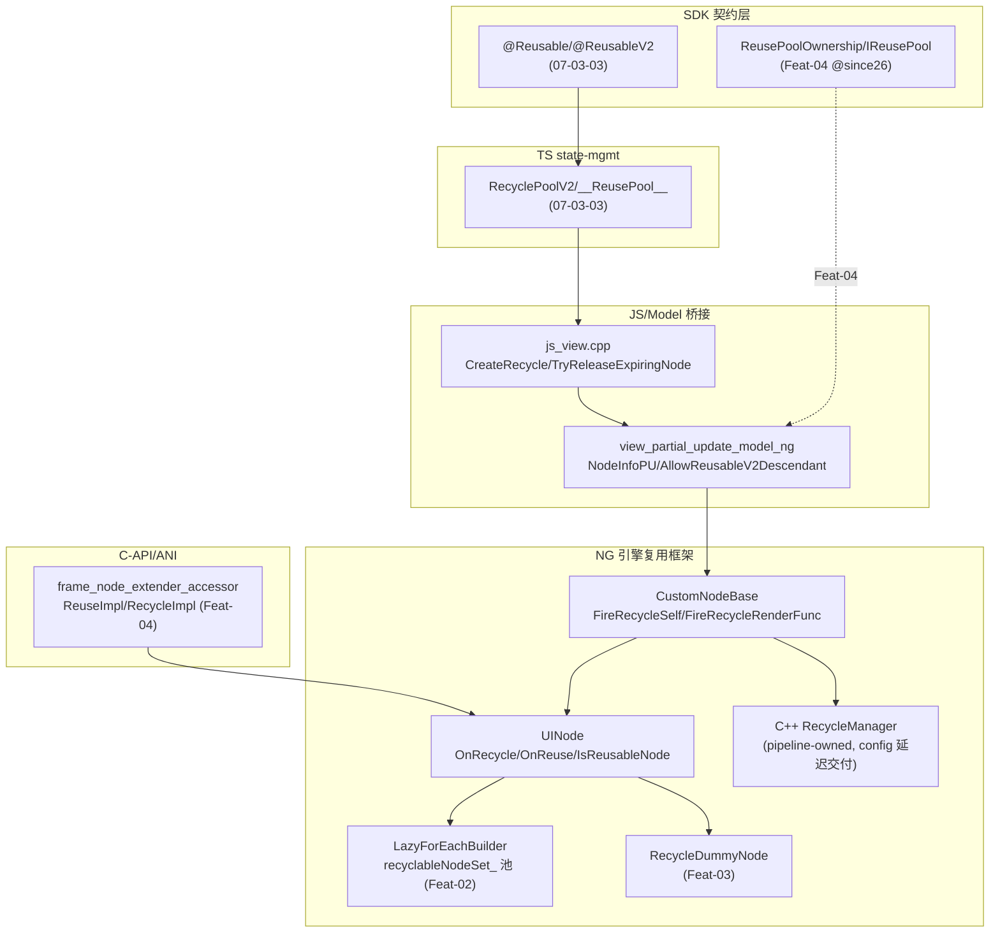
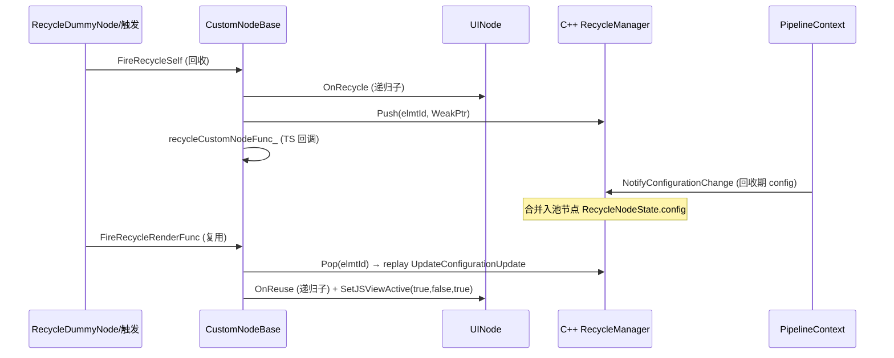

# 架构设计

> 确认目标仓和模块的架构约束、关键设计决策、Spec 拆分方向。

## 设计元数据

| Field | Content |
|-------|---------|
| Design ID | `DESIGN-Func-04-19-01` |
| 关联需求 | 已有能力补录（无独立 requirement.md） |
| 关联 Epic | 无 |
| 目标 Feature | Feat-01 UINode 复用生命周期与可复用节点判定（基线）；Feat-02 reuseId 节点池与 engine↔TS 桥接（已补录）；Feat-03 RecycleDummyNode 与 DisableRecycle 机制（已补录）；Feat-04 公开复用池 API 与内存优化 @since26（已补录） |
| 复杂度 | 关键 |
| 目标版本 | framework-internal（引擎 C++ 框架随 NG 管线，无独立 `@since`）；@since26 公开复用池 API（Feat-04：ReusePoolOwnership/IReusePool/preRender/ReusableMemOptStrategy） |
| Owner | ArkUI SIG |
| 状态 | Baselined（已有实现补录） |

## 需求基线

> 需求基线详见 proposal.md。以下仅列出设计阶段需要额外强调的要点。

| 项 | 补充说明 |
|----|---------|
| 补录而非新增 | 当前实现即规格，可疑行为只能标注为风险/备注 |
| 与 07-03-03 边界 | 07-03-03（前端层）管 TS `@Reusable`/`@ReusableV2` 装饰器与 state-mgmt 池（`RecycleManager`/`RecyclePoolV2`/`__ReusePool__Internal__`，≤API23）；本域（通用能力层）管**引擎侧 C++ 复用框架**（UINode 生命周期/`recyclableNodeSet_` 池/`RecycleDummyNode`）+ **@since26 公开复用池 API** |
| C++ RecycleManager ≠ TS RecycleManager | 引擎侧 `RecycleManager`（`pattern/recycle_view/`，pipeline-owned，config-change 延迟交付）与 TS `RecycleManager`（state-mgmt 层 @Reusable 池）是两个不同类 |
| 命令式可复用节点 | `IsReusableNode` = isCNode_/isArkTsFrameNode_/isRootBuilderNode_/isArkTsRenderNode_ 四标志 OR，由 C-API/FrameNode/RenderNode/BuilderNode 创建路径设置 |
| （Feat-02）reuseId 池+桥接 | C++ `recyclableNodeSet_`（reuseId→itemKey→WeakPtr 双层 map）+ RecordRecyclableNode/ReleaseExpiringNode；JSView CreateRecycle/TryReleaseExpiringNode + `__*__Internal` hooks；CustomNode 释放转发 |
| （Feat-03）RecycleDummyNode | `RecycleDummyNode`（RECYCLE_VIEW_ETS_TAG）包装可回收 CustomNode，析构 FireRecycleSelf（disableRecycle_ opt-out）；`ForEachBaseNode::DisableRecycle` 递归 opt-out；LazyForEach/Repeat 集成 |
| （Feat-04）@since26 公开池 API | `ReusePoolOwnership`（SHARED/PER_INSTANCE/OFF）+`poolAccepts`、`IReusePool`/`IReusableInfo`/`preRender`、`ReusableMemOptStrategy`；全局池 `__ReusePool__Internal` **TS-only**（无 C++ 类）；preRender `setTimeout(5)`、maxCount **同步**强制、C++ mem-opt drain、C-API/ANI 桥接、DFX hidump |

## 上下文和现状

### 涉及仓和模块

| 仓库 | 补充架构说明 |
|------|-------------|
| `arkui_ace_engine` | 引擎侧复用框架全部实现（UINode 生命周期、CustomNodeBase、C++ RecycleManager、节点池、RecycleDummyNode、JS/CJ/NDK/ANI 桥接）均在本仓 |
| `interface/sdk-js` | @since26 公开复用池 API（ReusePoolOwnership/IReusePool/IReusableInfo/preRender/ReusableMemOptStrategy，Feat-04） |

> 仓、模块、当前职责、影响类型详见 proposal.md「影响范围」。

### 调用链层级分析

| 层 | 模块 | 职责 | 修改类型 |
|----|------|------|---------|
| 1. SDK 契约层 | `@Reusable`/`@ReusableV2`（07-03-03）、@since26 ReusePoolOwnership/IReusePool（Feat-04） | 装饰器 + @since26 公开池 API | 不修改（外部 API 权威，07-03-03/Feat-04 承接） |
| 2. TS state-mgmt 层 | `puv2_globalreuse.ts`/`RecyclePoolV2`（07-03-03） | TS @Reusable 池逻辑 | 现状（07-03-03 承接） |
| 3. JS 桥接层 | `frameworks/bridge/declarative_frontend/jsview/js_view.cpp`（CreateRecycle/SetReuseId/TryReleaseExpiringNode）、`js_view_functions.cpp`（`__releaseRecyclePool__Internal`/`__enableReleaseExpiringNodes__Internal`/`__ClearAllRecyle` hooks） | 引擎↔TS 桥接 | 现状（Feat-02 承接） |
| 4. NG Model 层 | `frameworks/core/components_ng/base/view_partial_update_model_ng.cpp`（NodeInfoPU/AllowReusableV2Descendant/TryReleaseExpiringNode） | CustomNode 构造 + @ReusableV2 门控 | 现状（Feat-01 门控/Feat-02 桥接） |
| 5. UINode 基类层 | `frameworks/core/components_ng/base/ui_node.h`/`.cpp`（OnRecycle/OnReuse/IsReusableNode/AllowReusableV2Descendant/ProcessIsInDestroyingForReuseableNode） | 复用生命周期 virtual + 可复用判定 | 现状（Feat-01） |
| 6. CustomNodeBase 层 | `frameworks/core/components_ng/pattern/custom/custom_node_base.*`（回调槽/reuseId/FireRecycleSelf/FireRecycleRenderFunc） | 引擎↔TS 回调连接 + 生命周期驱动 | 现状（Feat-01） |
| 7. C++ RecycleManager 层 | `frameworks/core/components_ng/pattern/recycle_view/recycle_manager.*`（pipeline-owned，config 延迟交付） | 回收期 config 记录 + 复用 replay | 现状（Feat-01） |
| 8. 节点池层 | `frameworks/core/components_ng/syntax/lazy_for_each_builder.*`（`recyclableNodeSet_` reuseId 池/RecordRecyclableNode/ReleaseExpiringNode） | C++ reuseId 节点池 | 现状（Feat-02 承接） |
| 9. RecycleDummyNode 层 | `frameworks/core/components_ng/pattern/recycle_view/recycle_dummy_node.*`（包装/disableRecycle_/FireRecycleSelf 析构） | 可回收节点包装 + opt-out | 现状（Feat-03 承接） |
| 10. 语法节点集成层 | `for_each_base_node.h`（DisableRecycle）、ForEach/LazyForEach/Repeat（RecycleItems） | 复用与语法节点集成 | 现状（Feat-03 承接；语法节点详见 07-05-01/02/03） |
| 11. C-API/NDK/ANI 层 | `frame_node_extender_accessor.cpp`（ReuseImpl/RecycleImpl）、`custom_node_ani_modifier.cpp`（OnReuse/OnRecycle） | 命令式节点复用桥 | 现状（Feat-04 已补录：经 UINode::OnReuse/OnRecycle） |
| 12. PipelineContext 层 | `pipeline_context.*`（recycleManager_ 持有 + Notify 触发） | RecycleManager 宿主 + config-change 触发 | 现状（跨特性） |

检查项：
- [x] 调用链每一层都已覆盖（SDK→TS→JS 桥接→Model→UINode→CustomNodeBase→RecycleManager→池→DummyNode→语法集成→C-API→Pipeline）
- [x] 每层职责边界清晰（TS 驱动 @Reusable，引擎 C++ 框架执行回收/复用）
- [x] 每层修改类型明确（均为「现状」，存量补录）

### 适用架构规则

| Rule ID | 适用原因 | 设计结论 | 验证方式 |
|---------|---------|---------|---------|
| OH-ARCH-LAYERING | SDK→TS→JS→Model→UINode→CustomNodeBase→RecycleManager 多层 | 调用方向自顶向下；引擎框架不直接驱动 TS，由 JS 桥接回调 | 架构评审/依赖检查 |
| OH-ARCH-SUBSYSTEM | 仅本仓 + SDK 契约，无跨子系统 | 不引入子系统外依赖 | 依赖检查 |
| OH-ARCH-API-LEVEL | @since26 公开池 API（Feat-04）；引擎框架无版本门控 | Public API 无新增权限（Feat-04） | API 评审/XTS |
| OH-ARCH-COMPONENT-BUILD | 现状无 BUILD.gn/bundle.json 变更 | 无构建影响 | 构建验证 |
| OH-ARCH-ERROR-LOG | 引擎复用无错误码（回调/池操作） | 无错误码路径 | UT |

## 不涉及项承接

> proposal.md 已完成 N/A 判定。本节仅对标记「涉及」且需展开设计的维度给出结论。

| 维度 | 设计结论 |
|------|---------|
| 跨进程/SA | 不涉及（同进程节点） |
| 持久化 | 不涉及（节点池随 pipeline） |
| 权限 | 不涉及（framework-internal + @since26 公开 API 无权限） |
| 国际化/RTL | config-change 经 RecycleManager 延迟交付（含语言/字体） |
| 多范式兼容 | dynamic（NG）+ static（@since23）+ C-API/NDK/ANI 命令式节点 |
| 范围边界 | TS `@Reusable`/`@ReusableV2` 装饰器与 state-mgmt 池由 07-03-03 承接；ForEach/LazyForEach/Repeat 语法节点的复用集成详见 07-05-01/02/03 |

## 关键设计决策

| 决策 ID | 问题 | 推荐方案 | 探索过的替代方案 | 取舍理由 | 影响 |
|--------|------|---------|----------------|---------|------|
| ADR-1 | UINode 复用生命周期模型 | `OnRecycle`/`OnReuse` 为非纯虚 + **递归子节点默认实现**；子类可覆写改变行为（如 NodeContainerNode 不调基类、不递归） | (a) 纯虚强制子类实现；(b) 不递归 | 递归默认覆盖大多数节点（整子树回收/复用）；特定节点（命令式 base node）可覆写避免误触 | 子类覆写行为差异（风险 RISK-2） |
| ADR-2 | 可复用节点判定 | `IsReusableNode` = isCNode_/isArkTsFrameNode_/isRootBuilderNode_/isArkTsRenderNode_ 四标志 OR；各命令式创建路径设对应标志；声明式节点不设 | (a) 单一 isReusable 标志；(b) 类型 dynamic_cast | 四标志精确区分命令式节点来源（C-API/FrameNode/RenderNode/BuilderNode），声明式节点天然不可复用 | 仅命令式节点入复用池 |
| ADR-3 | @ReusableV2 与 Repeat 复用冲突 | `AllowReusableV2Descendant` 门控（默认 true）；Repeat 模板子节点 `SetAllowReusableV2Descendant(false)` 禁用 @ReusableV2 reuseId 复用，Repeat 池为唯一路径 | (a) 允许双重复用；(b) 完全禁用 | 避免模板池与 @ReusableV2 双重复用冲突；each 子节点仍允许 | 模板内 @ReusableV2 不生效 |
| ADR-4 | 引擎↔TS 复用回调连接 | `CustomNodeBase` 持有回调槽（recycleCustomNodeFunc_/recycleRenderFunc_/onRecycleFunc_/onReuseFunc_）+ 生命周期驱动 `FireRecycleSelf`（OnRecycle→Push+TS 回调）/`FireRecycleRenderFunc`（Pop+re-render+OnReuse）；`LifeCycleEvent` 枚举（ON_RECYCLE=2/ON_REUSE=3） | (a) 直接调 TS；(b) 事件总线 | 回调槽解耦引擎与 TS；驱动函数保证 OnRecycle/OnReuse 与 TS 回调有序 | 引擎↔TS 边界清晰 |
| ADR-5 | 回收期配置更新交付 | **C++ RecycleManager**（pipeline-owned）记录 `RecycleNodeState{config,WeakPtr}`；`NotifyConfigurationChange` 合并入所有池节点；复用 `Pop` 时 replay `UpdateConfigurationUpdate` | (a) 不交付（丢配置）；(b) TS 侧处理 | 回收节点不可见但仍需保留配置（字体/语言/深色）；pipeline 集中管理 + 延迟 replay | C++ RecycleManager ≠ TS RecycleManager（风险 RISK-1） |
| ADR-6 | 可复用节点销毁标志管理 | `ProcessIsInDestroyingForReuseableNode`：可复用子 + 父非销毁 + 子销毁 → 清子销毁标志；`SetDestroying` 对可复用子不 cleanStatus | (a) 不区分；(b) 强制清 | 可复用节点被复用时从旧父摘除，不应被旧父销毁遍历误清 | 复用节点销毁标志正确 |
| ADR-F2-1 | 引擎 reuseId 池模型 | `LazyForEachBuilder::recyclableNodeSet_` 双层 map（reuseId→itemKey→WeakPtr<UINode> 集）；`RecordRecyclableNode`/`TryRecordRecyclableNodeRecursively`/`ReleaseExpiringNode(reuseId)`/`GetReuseIdsCanBeRecycled`；JSView 桥接（CreateRecycle/TryReleaseExpiringNode）+ `__*__Internal` hooks；CustomNode 释放转发 | (a) 单层池；(b) TS 全权 | WeakPtr 池自动清理失效节点；引擎存 UINode 供 LazyForEach/Repeat 离屏复用，与 TS @Reusable 组件池（07-03-03）分层 | 引擎池 ≠ TS 池（风险 RISK-F2-1） |
| ADR-F3-1 | RecycleDummyNode 包装+opt-out | `RecycleDummyNode`（RECYCLE_VIEW_ETS_TAG）包装可回收 CustomNode；析构默认 `FireRecycleSelf` 回收，`disableRecycle_=true` opt-out 直接销毁；`ForEachBaseNode::DisableRecycle` 递归 opt-out 子树 | (a) 无包装直接回收；(b) 默认不回收 | 包装隔离回收触发与节点生命周期；opt-out 支持非复用项（repeatImmediately 等）正确销毁 | disableRecycle opt-out 下游勿假设析构必入池（风险 RISK-F3-1） |
| ADR-F4-1 | 全局复用池 TS-only | `__ReusePool__Internal`（`puv2_globalreuse.ts:64`）为 **TS-only** 类（无 C++ 类）；C++ 仅做 mem-opt 生命周期（`CustomNode::CleanCache`/`PostMemOptTask`/`FireClearParentReusePoolFunc`）+ DFX + `OnReuse/OnRecycle` virtual | (a) C++ 全局池；(b) 双层镜像 | TS 池与状态管理同层，可访问组件状态/reuseId；C++ 无需感知池数据结构 | C++ 对全局池不透明，经回调间接 drain（风险 RISK-F4-3） |
| ADR-F4-2 | preRender 调度 | `preRender(builder,times)` 经 `setTimeout(5)` macrotask 延迟构建子组件（`v2_change_observation.ts:281-291`），`Promise.all(preRenderTasks_)` 完成后 resolve（`puv2_globalreuse.ts:427-433`） | (a) 框架 queueIdleTask；(b) 同步构建 | setTimeout(5) 低延迟、简单；非框架 idle-task 机制 | SDK 文档 "idle task" 措辞与 setTimeout 实现不符（风险 RISK-F4-1） |
| ADR-F4-3 | maxCount 同步强制 | `push` 时 `currentArr.length>=currentMax` **同步** reject+`resetRecycleCustomNode` 销毁（`puv2_globalreuse.ts:564-569`）；`pruneMaxCount` setter 立即 prune；异步路径（`custom_node.cpp:496-516`）仅 mem-opt drain，非上限强制 | (a) 异步强制；(b) 不限 | 同步强制避免池膨胀；异步 memOpt 仅内存/可见性 drain | SDK "async clean" 措辞保守（风险 RISK-F4-2） |

## 设计骨架

### 骨架范围

| 骨架项 | 目标 | 不包含 | 验证方式 |
|--------|------|--------|---------|
| 生命周期 virtual | 固化 OnRecycle/OnReuse 递归默认 + 覆写 | 池机制（Feat-02） | UT |
| IsReusableNode | 固化四标志 OR + 各创建路径 | — | UT |
| AllowReusableV2Descendant | 固化门控 + Repeat 集成 | — | UT |
| CustomNodeBase 驱动 | 固化 FireRecycleSelf/FireRecycleRenderFunc 序列 | TS 池（07-03-03） | UT |
| C++ RecycleManager | 固化 Push/Pop/Notify config 延迟交付 | TS RecycleManager（07-03-03） | UT |

### 骨架 Spec 拆分

| Task ID | 目标 | 受影响文件 | AC |
|---------|------|----------|-----|
| TASK-SKELETON-1 | Feat-01 生命周期/判定/门控/驱动/C++ RecycleManager 基线 | `ui_node.*`、`custom_node_base.*`、`recycle_manager.*`、`view_partial_update_model_ng.cpp` | AC-1.1~6.2 |

## 后续 Task 拆分

| Task ID | 目标 | 受影响文件 | 依赖 |
|---------|------|----------|------|
| T-1 | Feat-01 UINode 复用生命周期与可复用节点判定（基线，本设计已承接） | `Feat-01-*-spec.md` + 本 design.md | — |
| T-2 | Feat-02 reuseId 节点池与 engine↔TS 桥接（已补录） | `lazy_for_each_builder.*`（recyclableNodeSet_）、`js_view.cpp`（CreateRecycle/TryReleaseExpiringNode）、`js_view_functions.cpp`（__*__Internal）、`custom_node.cpp`（EnableReleaseExpiringNode） | T-1 |
| T-3 | Feat-03 RecycleDummyNode 与 DisableRecycle 机制（已补录） | `recycle_dummy_node.*`、`for_each_base_node.h`（DisableRecycle） | T-1 |
| T-4 | Feat-04 公开复用池 API 与内存优化 @since26（已补录） | `ReusePoolOwnership`/`IReusePool`/`IReusableInfo`/`preRender`/`ReusableMemOptStrategy`（SDK + C++/TS）、`frame_node_extender_accessor.cpp`/`custom_node_ani_modifier.cpp`（C-API/ANI） | T-1 |

## API 签名、Kit 与权限

> 本节承接 spec.md「API 变更分析」中识别的 API，给出签名、权限和 d.ts 位置等实现细节。Feat-01 为 framework-internal 无公开 API；@since26 公开池 API 见 Feat-04。

### 新增 API

无新增（Feat-01 framework-internal）。

### 变更/废弃 API

| 原有 API | 变更类型 | 新 API | 迁移说明 |
|---------|---------|--------|---------|
| N/A（Feat-01 framework-internal） | — | — | @since26 公开池 API 见 Feat-04 |
| `ReusePoolOwnership`+`@Component/@ComponentV2.reusePool`/`poolAccepts`（static `@since26`） | 既有 | — | 池所有权配置（Feat-04） |
| `UIUtils.getCustomComponentContext`/`CustomComponentContext.getReusePool`/`IReusePool`/`IReusableInfo`/`preRender`（dynamic `@since26`） | 既有 | — | 池 handle/预创建（Feat-04） |
| `ReusableMemOptStrategy`+`@Reusable/@ReusableV2.memoryOptimizationStrategy`（static `@since26`） | 既有 | — | 内存优化（Feat-04） |

## 构建系统影响

### BUILD.gn 变更

无变更（存量补录）。复用框架源文件已纳入 `frameworks/core/components_ng/base/`、`pattern/custom/`、`pattern/recycle_view/` 现有构建目标。

### bundle.json 变更

无变更。

## 可选设计扩展

### 架构图



### 数据流/控制流

| 步骤 | 调用方 | 被调用方 | 数据/接口 | 说明 |
|------|--------|---------|----------|------|
| 1 | RecycleDummyNode 析构 | CustomNodeBase | FireRecycleSelf | 触发回收 |
| 2 | FireRecycleSelf | UINode/RecycleManager | OnRecycle→Push(id)+TS 回调 | 回收序列 |
| 3 | PipelineContext | RecycleManager | NotifyConfigurationChange | 回收期 config 合并入池节点 |
| 4 | 复用（reuseOrCreateNew） | CustomNodeBase | FireRecycleRenderFunc | 复用序列 |
| 5 | FireRecycleRenderFunc | RecycleManager/UINode | Pop(replay config)+re-render+OnReuse+SetJSViewActive | 复用 + config replay |

### 时序设计



### 数据模型设计

**Framework 层（C++）**

```cpp
// ui_node.h:1375-1394 标志
bool isRootBuilderNode_ = false; bool isArkTsFrameNode_ = false;
bool isArkTsRenderNode_ = false; ... bool isCNode_ = false;
bool allowReusableV2Descendant_ = true;   // :1416
// custom_node_base.h:189-198 回调槽
std::function<void(CustomNodeBase*)> recycleCustomNodeFunc_;
std::function<void()> recycleRenderFunc_; std::function<void()> clearAllRecycleFunc_;
std::function<void()> onRecycleFunc_; std::function<void(void*)> onReuseFunc_;
std::string reuseId_; std::string creatorId_;   // :176-177
RecycleNodeInfo recycleInfo_;                    // :202
// recycle_manager.h:29-52
struct RecycleNodeState { ConfigurationChange config; WeakPtr<CustomNodeBase> node; };
struct RecycleNodeInfo { int32_t elemtId=-1; bool hasBeenRecyled=false; };
// recycle_manager.h:53-68
class RecycleManager { std::unordered_map<int32_t,std::unique_ptr<RecycleNodeState>> recyclePool_; };  // pipeline-owned
```

| 结构 | 存储方案 | 生命周期 |
|------|---------|---------|
| `recycleInfo_` | CustomNodeBase 每节点 | 节点生命周期 |
| `recyclePool_` | RecycleManager（pipeline） | pipeline 生命周期；ClearAll/Erase 清 |
| `recyclableNodeSet_`（Feat-02） | LazyForEachBuilder | 语法节点生命周期 |
| 回调槽 | CustomNodeBase | 节点生命周期 |

### 测试性设计

| 测试层级 | 测试目标 | Mock 策略 | 验证方式 |
|---------|---------|----------|---------|
| UT | OnRecycle/OnReuse 递归 + 覆写 | Mock 子节点树 | `ui_node` UT |
| UT | CustomNodeBase FireRecycleSelf/FireRecycleRenderFunc | Mock 回调 + RecycleManager | `custom_node_base` UT |
| UT | C++ RecycleManager Push/Pop/Notify | 注入 pipeline | `recycle_manager` UT |
| UT | AllowReusableV2Descendant 门控 | Mock 父链（Repeat/JSView） | `view_partial_update_model_ng` UT |

### 资源所有权矩阵

| 资源 | 创建方 | 持有方 | 销毁触发 | 实际释放 | 异常回收 |
|------|--------|--------|---------|---------|---------|
| CustomNodeBase | CustomNode 构造 | CustomNode（UINode+CustomNodeBase） | 节点销毁 | ~CustomNodeBase Erase RecycleManager | 复用节点销毁标志清理 |
| RecycleManager | pipeline 构造 | PipelineContext | pipeline 销毁 | 随 pipeline | ClearAll |
| recycleInfo_ | CustomNodeBase | CustomNodeBase | 节点销毁 | 随节点 | — |

### 接口参数规约

> framework-internal，无公开接口。内部契约：OnRecycle/OnReuse 无参；FireRecycleSelf 无参；FireRecycleRenderFunc 无参；RecycleManager::Push(elmtId,WeakPtr)/Pop(elmtId)/Notify(ConfigurationChange)。

### 线程与并发模型

| 操作 | 发起线程 | 回调线程 | 跨进程边界 | 线程安全 | 重入约束 |
|------|---------|---------|----------|---------|---------|
| OnRecycle/OnReuse | UI/Pipeline | 同 | 无 | 单线程 UI | 不可在回调内重入回收 |
| RecycleManager Push/Pop/Notify | UI | 同 | 无 | 单线程（pipeline） | — |
| TS 回调（recycleCustomNodeFunc_ 等） | UI（经 JS 桥接） | UI | 无 | 单线程 | — |

## 详细设计

### UINode 复用生命周期 virtual

`UINode::OnRecycle()`/`OnReuse()`（`ui_node.h:536-538` 声明）为非纯虚，默认实现**递归子节点**（`ui_node.cpp:2209-2214` OnRecycle 遍历 `child->OnRecycle()`；`:2252-2257` OnReuse 同）。子类可覆写改变行为（如 NodeContainerNode 不调基类、不递归，详见 05-16-01）。`UpdateRecycleElmtId(newElmtId)`（`ui_node.h:651-654`）重写 `nodeId_`（复用后更新 elmtId）。

### IsReusableNode 判定与节点类型标志

`IsReusableNode()`（`ui_node.h:956-959`）= `isCNode_ || isArkTsFrameNode_ || isRootBuilderNode_ || isArkTsRenderNode_`（四标志 OR，成员 `:1375-1377,1394` 默认 false）。各命令式创建路径设对应标志：`setIsCNode(true)`（`node_api.cpp:260` C-API）、`SetIsArkTsFrameNode(true)`（`arkts_native_frame_node_bridge.cpp:298,325,498,720`/`frame_node_modifier.cpp:80`/`frame_node_extender_accessor.cpp:198,1342,1572`）、`SetIsArkTsRenderNode(true)`（`arkts_native_render_node_bridge.cpp:181`/`render_node_peer_impl.h:43,51`）、`SetIsRootBuilderNode(true)`（`js_base_node.cpp:244`/`builder_node_ops_accessor.cpp:96,390,393`）。声明式节点四标志皆假→不可复用。

### AllowReusableV2Descendant 门控

`SetAllowReusableV2Descendant(allow)`（`ui_node.h:1001-1008`，成员 `allowReusableV2Descendant_` 默认 **true** `:1416`；`ui_node.cpp:2828-2836`）。消费方 `ViewPartialUpdateModelNG::AllowReusableV2Descendant`（`view_partial_update_model_ng.cpp:125-147`）沿父链走到 `RepeatVirtualScrollNode`/`RepeatVirtualScroll2Node`/`JS_VIEW_ETS_TAG`/null；结果 = 停在 root/JSView 或停止祖先 `IsAllowReusableV2Descendant()` 为 true。RepeatVirtualScroll 祖先 false 时子树 @ReusableV2/@ComponentV2 不能按 reuseId 入池（Repeat 模板 SetAllowReusableV2Descendant(false)，详见 07-05-03）。

### CustomNodeBase 回调槽与生命周期驱动

`CustomNodeBase`（`custom_node_base.h:43`）持有回调槽 `recycleCustomNodeFunc_`/`recycleRenderFunc_`/`clearAllRecycleFunc_`/`onRecycleFunc_`/`onReuseFunc_`（`:189-198`）+ setter/fire（`:97-110`）；`LifeCycleEvent` 枚举 `ON_APPEAR=0/ON_BUILD=1/ON_RECYCLE=2/ON_REUSE=3/ON_DISAPPEAR=4`（`:149-155`）；`reuseId_`/`creatorId_`（`:159-163,176-177`）；`recycleInfo_`（`:202`，RecycleNodeInfo from `recycle_manager.h:39-52`）。`FireRecycleSelf()`（`custom_node_base.cpp:347-356`）：`UINode::OnRecycle()`→若有 TS 回调：`recycleInfo_.Recycle(id)`+`RecycleManager::Push(id,WeakClaim)`+`recycleCustomNodeFunc_`。`FireRecycleRenderFunc()`（`:358-372`，复用路径）：`recycleInfo_.Reuse()`+`RecycleManager::Pop(id)`（replay config）→`ScopedViewStackProcessor` 内 `recycleRenderFunc_()`（re-render）→`UINode::OnReuse()`→`SetJSViewActive(true,false,true)`→清 `recycleRenderFunc_`。`FireClearAllRecycleFunc`（`:296-303`）：`RecycleManager::ClearAll()`+`clearAllRecycleFunc_`。析构（`:23-38`）：`RecycleManager::Erase(recycleInfo_.elemtId)`。

### C++ RecycleManager 与 config-change 延迟交付

C++ `RecycleManager`（`recycle_manager.h:53-68`，**非 TS RecycleManager**）为 pipeline-owned（`PipelineContext::recycleManager_` `pipeline_context.h:877,1624`，pipeline 构造 `make_unique`）；静态门面 `Push`/`Pop`/`Erase`/`Notify`/`ClearAll` 委托 pipeline 单例。`RecycleNodeState{ConfigurationChange config, WeakPtr<CustomNodeBase> node}`（`:29-37`）/`RecycleNodeInfo{elemtId,hasBeenRecyled}`（`:39-52`，存 CustomNodeBase `recycleInfo_`）。`PushNode`（`recycle_manager.cpp:58-61`）`try_emplace`；`NotifyConfigurationChange`（`:88-93`）合并 config 入所有池节点；`PopNode`（`:68-81`）复用时若 `config.IsNeedUpdate()` 调 `UINode::UpdateConfigurationUpdate(config)` replay 后 erase。`Notify` 由 `pipeline_context.cpp:5924`（onShow 配置变更路径）触发。

### 销毁与可复用节点清理

`ProcessIsInDestroyingForReuseableNode(child)`（`ui_node.h:1098`/`cpp:2869-2877`）：子可复用（`IsReusableNode`）且父非销毁而子销毁→`child->SetDestroying(false,false)`；子挂入父时调用（`ui_node.cpp:771,840`）。`UINode::SetDestroying`（`:2838-2853`）递归时可复用子 `SetDestroying(isDestroying,false)`、其余 `(isDestroying,cleanStatus)`——可复用节点销毁标志独立管理，避免被旧父销毁遍历误清。

### reuseId 节点池与 engine↔TS 桥接（Feat-02）

framework-internal。`LazyForEachBuilder::recyclableNodeSet_`（`lazy_for_each_builder.h:385`）为 `std::map<string, std::map<string, std::set<WeakPtr<UINode>>>>`（外层 key=reuseId、内层 key=itemKey）。`RecordRecyclableNode(reuseId,key,node)`（`:1577`）入池；`TryRecordRecyclableNodeRecursively`（`:1597`）遍历 `RECYCLE_VIEW_ETS_TAG`（RecycleDummyNode）子递归记录；`ReleaseExpiringNode(reuseId)`（`:1533`）按 reuseId 释放（父 CustomNode 请求时批量，`MIN_RELEASE_COUNT=5`）；`GetReuseIdsCanBeRecycled()`（`:1615`）返回可回收 reuseId 集。JS 桥接：`JSViewPartialUpdate::CreateRecycle`（`js_view.cpp:1166-1286`）包装 RecycleDummyNode+`SetReuseId(nodeName)`（`:1281`）+接 recycle/reuse 回调；`TryReleaseExpiringNode`→`ViewPartialUpdateModelNG::TryReleaseExpiringNode(node,reuseId)`（`view_partial_update_model_ng.cpp:111`）→`CustomNode::ReleaseExpiringNode(reuseId)`。TS hooks（`js_view_functions.cpp:391,396,426`）：`__releaseRecyclePool__Internal`/`__enableReleaseExpiringNodes__Internal`/`__ClearAllRecyle__PUV2ViewBase__Internal`。`CustomNode::EnableReleaseExpiringNode/DisableReleaseExpiringNode/ReleaseExpiringNode(reuseId)`（`custom_node.cpp:606-640`）注册/取消/触发父 LazyForEachNode 释放。Cangjie 镜像 `native_view.cpp:164-193,315-339`。

### RecycleDummyNode 与 DisableRecycle 机制（Feat-03）

framework-internal。`RecycleDummyNode`（`recycle_dummy_node.h:25`，tag `V2::RECYCLE_VIEW_ETS_TAG`，UINode 子类，`IsAtomicNode()=true`）经 `WrapRecycleDummyNode` 包 CustomNode 为子。析构（`recycle_dummy_node.cpp:42-61`）除非 `disableRecycle_`（`:37`，`SetDisableRecycle(bool)`）调子 `FireRecycleSelf()` 回收入池；`disableRecycle_=true` 时直接销毁。`ForEachBaseNode::DisableRecycle(RefPtr<UINode>)`（`for_each_base_node.h:71-88`）static：RecycleDummyNode→`SetDisableRecycle(true)`，否则递归 `DisableChildrenAndCachesRecycle`。语法节点集成：LazyForEach `RecycleChildByIndex`（`lazy_for_each_builder.cpp:770-777`）DynamicCast RecycleDummyNode + `IsReusableNode` 判定（`:1263,1274`）；opt-out 调 DisableRecycle（`:1484`）。Repeat `OnRecycle/OnReuse`（`repeat_virtual_scroll_node.cpp:450-463`）递归缓存子；DisableRecycle（`repeat_virtual_scroll_2_node.cpp:728,746,1145`）。

### 公开复用池 API 与内存优化（Feat-04）

`@since26` 公开 API：`ReusePoolOwnership`（SHARED/PER_INSTANCE/OFF 默认，`customComponent.static.d.ets:140-169`）+ `@Component/@ComponentV2.reusePool`/`poolAccepts`（`:190,199,221,230`）；`UIUtils.getCustomComponentContext`（`StateManagement.d.ts:660`，ViewPU/ViewV2 only）→`CustomComponentContext.getReusePool`（`:1355`）→`IReusePool.getReusableInfo`/`preRender`（`:1391,1408`）/`IReusableInfo.count`/`maxCount`（`:1434,1448`，默认 100 上限 200）；`ReusableMemOptStrategy`（`:240-257`）+`@Reusable/@ReusableV2.memoryOptimizationStrategy`（`:293,312`）。

全局复用池 `__ReusePool__Internal`（`puv2_globalreuse.ts:64`，**TS-only 无 C++ 类**）：`create({reusePool,poolAccepts,owner})`（`:487-520`）SHARED→缓存共享池（owner ctor+accepted ctors 键，`:503-517`）、PER_INSTANCE→每实例新池（`:519`）、poolAccepts 空→抛错（`:499-501`）。池 handle：`getReusePool`（`puv2_view_base.ts:959-968`）解析 `__reusePool__Internal ?? __getReusePoolInternal__Internal()`（沿祖先 `acceptsComponent`，`:937-950`）+`setCallerContext`。

`preRender(builder,times)`（`puv2_globalreuse.ts:402-434`）：`__beginPreRender__Internal`+循环 `builderFn()`+`__endPreRender__Internal`；子组件经 `queuePreRenderCreation`（`v2_change_observation.ts:253-292`）以 **`setTimeout(5)` macrotask** 延迟构建（`:281-291`）+`__isPreRendered__Internal`+`pool.push`；`Promise.all(preRenderTasks_)` resolve（`:427-433`）。maxCount **同步**强制：`push`（`:546-577`）`length>=currentMax`→reject+`resetRecycleCustomNode`（`:564-569`）；`pruneMaxCount`（`:210-239`）`<0`→0/`>200`→200+`pruneBucket_`（`:243-259`，`pruning_` 防重入）；`getEffectiveMaxCount`（`:533-538`）优先级 bucket→component→100。mem-opt：C++ `SetReusableMemOptStrategy`/`SetStaMemopt`（`custom_node_base.cpp:244-252,394-398`）+`OnAttachToMainTree` StartMemOpt（`custom_node.cpp:56-58`）+`PostMemOptTask`（`:547-579`，1000ms poll）父不可见/内存→`FireClearParentReusePoolIfNeeded`→TS `__releaseRecyclePool__Internal` drain；全局池**不直接读** memOpt（经 C++ 回调间接）；旧 per-instance 池直接读（`pu_recycle_manager.ts:67`/`v2_recycle_pool.ts:66`）。C-API/NDK `frame_node_extender_accessor::ReuseImpl/RecycleImpl`（`:1114-1133`）→`UINode::OnReuse/OnRecycle`；ANI `custom_node_ani_modifier::OnReuse/OnRecycle`（`:266-278`）→`CustomNode::OnReuse/OnRecycle`。DFX：hidump→`CustomNode::DumpInfo`（`custom_node.cpp:322`）`FireOnDumpInfoFunc({"RecyclePool"})`→TS `onDumpInfo`→`__getRecycleDump_internal`→`reusePool.getDumpInfo()`（`puv2_globalreuse.ts:610-618`）。

## 风险和开放问题

| 项 | 类型 | 影响 | 处理方式 | Owner |
|----|------|------|---------|-------|
| RISK-1 C++ RecycleManager（pipeline-owned，config 延迟交付）≠ TS RecycleManager（state-mgmt @Reusable 池，07-03-03），下游勿混淆 | 架构 | 中 | 规格 AC-5.4/ADR-5 标注；两类同名但不同层 | ArkUI SIG |
| RISK-2 UINode OnRecycle/OnReuse 递归子节点为默认，子类（如 NodeContainerNode）可覆写不递归，下游勿假设所有节点递归 | 架构 | 中 | 规格 AC-1.3/ADR-1 标注；详见 05-16-01 | ArkUI SIG |
| RISK-3 引擎复用框架（本域）与 TS @Reusable（07-03-03）边界，下游勿跨层假设（如 TS 池状态 ≠ C++ 池） | 架构 | 中 | 设计「与 07-03-03 边界」标注；本域管引擎 C++ + @since26 公开 API | ArkUI SIG |
| RISK-F2-1 引擎 `recyclableNodeSet_`（C++ reuseId 池，LazyForEachBuilder）≠ TS `RecyclePoolV2`/`__ReusePool__Internal__`（07-03-03），两层不同池 | 架构 | 中 | 规格 Feat-02「池与 TS 池边界风险」/ADR-F2-1 标注；引擎池存 WeakPtr<UINode>，TS 池存 @Reusable 组件状态 | ArkUI SIG |
| RISK-F3-1 RecycleDummyNode 析构默认 FireRecycleSelf 回收，`disableRecycle_=true`（DisableRecycle）opt-out 直接销毁，下游勿假设所有 RecycleDummyNode 析构都入池 | 架构 | 低 | 规格 Feat-03 AC-1.3/ADR-F3-1 标注 | ArkUI SIG |
| RISK-F4-1 preRender SDK 文档称 "idle task"（`StateManagement.d.ts:1400`），实现为 `setTimeout(5)` macrotask（`v2_change_observation.ts:281-291`），非框架 queueIdleTask——SDK-vs-source 差异 | API | 中 | 规格 Feat-04 R-10/ADR-F4-2 标注；不静默消除 | ArkUI SIG |
| RISK-F4-2 maxCount SDK 文档称 "count may exceed maxCount briefly because pool clean happens asynchronously"（`:1425-1426`），实现为同步 push reject（`puv2_globalreuse.ts:564-569`）；异步仅 memOpt drain——SDK-vs-source 差异 | API | 中 | 规格 Feat-04 R-11/ADR-F4-3 标注；不静默消除 | ArkUI SIG |
| RISK-F4-3 全局复用池 `__ReusePool__Internal` 为 TS-only（无 C++ 类），C++ 仅做 mem-opt/DFX/生命周期，下游勿假设 C++ 持有全局池 | 架构 | 中 | 规格 Feat-04 R-12/ADR-F4-1 标注 | ArkUI SIG |

## 设计审批

- [x] 需求基线已确认，设计覆盖 P0/P1 AC
- [x] 不涉及项已承接，N/A 和展开项都有结论
- [x] 涉及仓和模块职责清楚
- [x] 调用链层级分析完整，每层覆盖到位
- [x] 适用架构规则已识别并形成设计结论
- [x] 分层和子系统边界合规
- [x] API 变更有签名、权限、错误码和兼容性说明（framework-internal + Feat-04 @since26）
- [x] BUILD.gn/bundle.json 影响明确
- [x] 设计输出和后续 Task 拆分明确
- [x] 关键设计决策有理由和影响说明
- [x] 风险和开放问题有 Owner

**结论:** 通过（已有实现补录）
